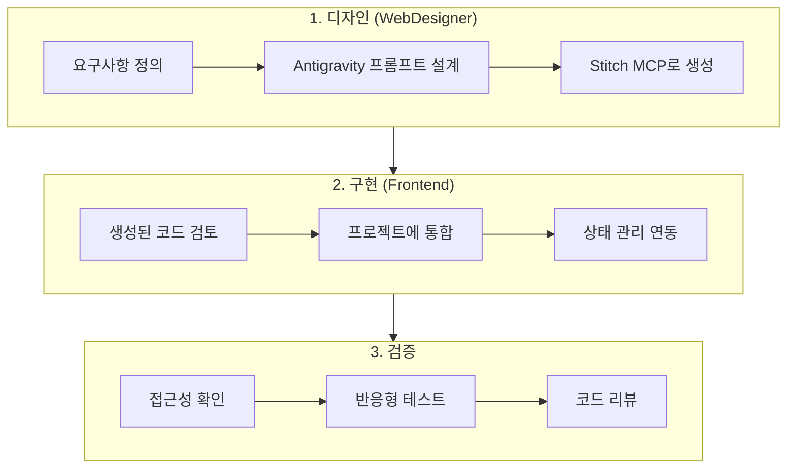

Antigravity + Stitch MCP를 활용한 UI 개발 워크플로우를 안내합니다.

> **중요**: 이 스킬은 **개인 실험/학습 용도**로만 사용하세요.

## 워크플로우 단계



## Step 1: Stitch MCP 설정 확인

`~/.claude/settings.json`에 MCP 서버 설정:

```json
{
  "mcpServers": {
    "stitch": {
      "command": "npx",
      "args": ["-y", "@anthropic/stitch-mcp"]
    }
  }
}
```

## Step 2: UI 생성 프롬프트 작성

요청: $ARGUMENTS

**프롬프트 템플릿**:

```markdown
## 컴포넌트 요청

### 기본 정보
- 컴포넌트: [요청한 UI]
- 용도: [사용 맥락]

### 스타일 요구사항
- 프레임워크: Tailwind CSS 3.4+
- 색상: primary-600, secondary-500, gray-100~900
- 반응형: 모바일 우선 (sm -> lg 순차 확장)

### 접근성 요구사항 (WCAG 2.1 AA)
- 키보드 네비게이션 지원
- ARIA 라벨 필수
- 포커스 표시 명확히
- 색상 대비 4.5:1 이상

### 피해야 할 패턴
- Bootstrap Blue (#007bff) 사용 금지
- 순수 검정 (#000000) 대신 gray-900 사용
- Carousel 슬라이더 지양
```

## Step 3: 생성 코드 검증 체크리스트

- [ ] **Tailwind 최적화**: 중복 클래스 제거
- [ ] **접근성**:
  - [ ] ARIA 라벨 적용
  - [ ] 키보드 네비게이션
  - [ ] 색상 대비 4.5:1 이상
- [ ] **TypeScript**: Props 타입 정의
- [ ] **반응형**: sm/md/lg 브레이크포인트 테스트
- [ ] **성능**: 불필요한 리렌더링 제거

## Step 4: 프로젝트 통합

```tsx
// 생성된 코드 통합 예시
import { useState } from 'react';
import { useQuery } from '@tanstack/react-query';

// 1. Antigravity 생성 UI
// 2. Frontend 상태 관리 통합
export const GeneratedComponent: React.FC = () => {
  // React Query 연동 추가
  const { data, isLoading } = useQuery({...});

  return (
    // Antigravity 생성 Tailwind UI
    <div className="...">
      {/* Frontend 추가: 로딩/에러 상태 처리 */}
    </div>
  );
};
```

## 사용 예시

```
/antigravity:workflow 로그인 폼
/antigravity:workflow 검색 결과 카드 (이미지, 제목, 설명, 태그)
/antigravity:workflow 대시보드 통계 위젯
```

---

요청한 UI: $ARGUMENTS
