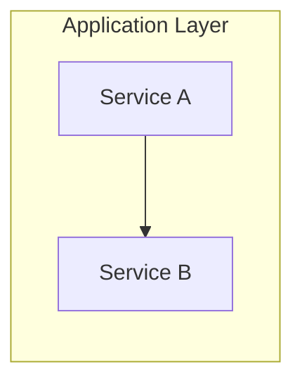

# Claude Code Development Guidelines

🤖 Hybrid RAG Knowledge Operations 프로젝트 개발 규칙

**Version**: 2.11 | **Updated**: 2026-01-21

---

## 📋 프로젝트 개요

| 항목 | 내용 |
|------|------|
| **프로젝트** | Graph RAG 기반 지능형 지식 검색 시스템 |
| **기술스택** | Python 3.11+, SpringBoot 3.x, React 18, LangGraph |
| **데이터베이스** | PostgreSQL (SSOT), Neo4j (Graph), Elasticsearch (Vector) |
| **런타임 LLM** | DeepSeek V3.2 (95% 비용 절감) |

---

## 🗂️ 폴더 구조 및 파일 생성 규칙

```
hybrid-rag-knowledge-ops/
├── knowledge_service/
│   ├── src/app/
│   │   ├── api/routes/      # API 엔드포인트
│   │   ├── services/        # 비즈니스 로직
│   │   ├── models/          # 데이터 모델
│   │   ├── core/            # 핵심 기능
│   │   └── utils/           # 유틸리티
│   ├── src/tests/           # 테스트 코드
│   ├── docs/
│   │   ├── 01_planning/     # 구현 계획
│   │   ├── 02_design/       # 기술 설계
│   │   ├── 03_implementation/  # 구현 문서
│   │   ├── 04_testing/      # 테스트 문서
│   │   ├── 05_development/  # 개발 가이드 ⭐
│   │   ├── 06_deployment/   # 배포 문서
│   │   ├── 07_maintenance/  # 운영/유지보수
│   │   └── results/         # 실행 결과
│   └── ...
├── work_logs/               # 📝 작업 일지 관리
│   ├── daily_logs/          # 일일 작업 일지 (YYYY/MM-Month/)
│   ├── vibe_logs/           # 바이브 코딩 일지 (영감/아이디어)
│   └── README.md
└── infrastructure/          # 인프라 설정
```

### 파일 명명 규칙
- **Python 파일**: `snake_case.py`
- **클래스**: `PascalCase`
- **함수/변수**: `snake_case`
- **상수**: `UPPER_SNAKE_CASE`

---

## 🔧 프롬프트 작성 가이드

### ❌ 나쁜 프롬프트
```
"메타데이터 추출 함수 만들어줘"
```

### ✅ 좋은 프롬프트
```
"knowledge_service/src/app/services/metadata_extraction.py에
메타데이터 추출 함수를 추가해줘.

요구사항:
- 함수명: extract_temporal_metadata
- 입력: document_text (str)
- 출력: dict (document_type, project_name, valid_start_date, valid_end_date)
- API 키: 환경변수 DEEPSEEK_API_KEY
- 에러 핸들링: 실패 시 None 반환, 로깅 필수"
```

**핵심**: 파일 경로 + 함수명 + 입출력 + 에러 처리를 명시

---

## 🔐 보안 규칙

```python
# ✅ 필수
api_key = os.getenv("DEEPSEEK_API_KEY")
if not api_key:
    raise ValueError("API key not set")

# ❌ 금지
api_key = "sk-xxx..."  # 하드코딩 절대 금지
```

- API 키는 반드시 환경변수 사용
- 민감 데이터는 `.env` 파일에 저장 (git 제외)
- 입력값 검증 필수

---

## 🔄 커밋 메시지 형식

```
[TYPE] 간단한 설명 (50자 이내)

- 변경 사항 1
- 변경 사항 2

관련 이슈: #123
```

### 타입
| 타입 | 용도 |
|------|------|
| `[FEAT]` | 새 기능 |
| `[FIX]` | 버그 수정 |
| `[REFACTOR]` | 코드 재구성 |
| `[TEST]` | 테스트 추가 |
| `[DOCS]` | 문서 수정 |
| `[CHORE]` | 빌드, 의존성 |

---

## ✅ 코드 품질 체크리스트

새 기능 추가 시 확인:

- [ ] docstring 작성
- [ ] type hints 추가
- [ ] 에러 핸들링 추가
- [ ] 로깅 추가
- [ ] 유닛 테스트 작성 (80%+ 커버리지)
- [ ] Black/isort 스타일 정렬

---

## 📊 도식화 규칙 (Mermaid)

문서 내 다이어그램은 **Mermaid** 형식 사용을 권장합니다.

### 다이어그램 유형 선택

| 상황 | Mermaid 유형 | 예시 |
|------|-------------|------|
| 순차적 흐름 | `flowchart LR` | A → B → C |
| 계층적 흐름 | `flowchart TB` | 상위에서 하위로 |
| 시스템 간 통신 | `sequenceDiagram` | API 호출, 인증 플로우 |
| 일정/타임라인 | `gantt` | 스프린트 계획, 테스트 일정 |
| 컴포넌트 그룹핑 | `subgraph` | 레이어별 서비스 분류 |

### 작성 예시



### 규칙
- ASCII 아트 대신 Mermaid 사용
- 복잡한 흐름은 `subgraph`로 그룹핑
- 노드 레이블은 `["텍스트"]` 형식으로 가독성 확보
- 줄바꿈은 `<br/>` 사용

---

## 📝 작업 일지

**Claude Code 명령어로 자동화**:
```bash
/daily:daily-close     # 전체 마무리 (일지+문서+푸시)
/daily:daily-log       # 작업일지만 작성/업데이트
/daily:vibe-log        # 바이브 일지만 작성/업데이트
/daily:sync-docs       # README/CLAUDE/PLAN 동기화
```

**위치**: `work_logs/daily_logs/YYYY/MM-Month/YYYY-MM-DD.md`

---

## 🔧 설치된 Claude Code 명령어

### Daily (4개)
| 명령어 | 설명 |
|--------|------|
| `/daily:daily-close` | 전체 마무리 워크플로우 |
| `/daily:daily-log` | 작업일지 작성/업데이트 |
| `/daily:vibe-log` | 바이브 코딩 일지 |
| `/daily:sync-docs` | 프로젝트 문서 동기화 |

### Tools (13개)
| 명령어 | 설명 |
|--------|------|
| `/tools:ai-review` | AI/ML 코드 리뷰 |
| `/tools:tech-debt` | 기술 부채 분석 |
| `/tools:security-scan` | OWASP 보안 스캔 |
| `/tools:context-save` | 컨텍스트 저장 |
| `/tools:context-restore` | 컨텍스트 복원 |

### Workflows (6개)
| 명령어 | 설명 |
|--------|------|
| `/workflows:feature-development` | 기능 개발 전체 사이클 |
| `/workflows:smart-fix` | 지능형 문제 해결 |
| `/workflows:tdd-cycle` | TDD 자동화 |

**전체 목록**: [.claude/commands/README.md](.claude/commands/README.md)

---

## 🌿 브랜치 전략

| 브랜치 | 용도 |
|--------|------|
| `main` | 프로덕션 (보호됨) |
| `develop` | 개발 통합 |
| `feature/*` | 기능 개발 |
| `fix/*` | 버그 수정 |

---

## 📚 참고 문서

- [PLAN.md](./PLAN.md) - 프로젝트 계획 및 현재 상태
- [README.md](./README.md) - 프로젝트 소개 및 설치 가이드
- [상세 설계서 v2.4](./knowledge_service/docs/02_design/hybrid_rag_platform_detailed_design.md) - Gleaning 포함
- [API 통합 설계서](./knowledge_service/docs/02_design/api_integration_design.md)
- [백엔드 상세 설계서](./knowledge_service/docs/02_design/backend_detailed_design.md)
- [인프라 설계서](./knowledge_service/docs/02_design/infrastructure_detailed_design.md) - Docker Compose 기반 (18개 컨테이너)
- [Observability 설계서](./knowledge_service/docs/02_design/observability_detailed_design.md) - Prometheus/Grafana/Kibana/Jaeger
- [Kibana 사용자 가이드](./knowledge_service/docs/07_maintenance/kibana_user_guide.md) - ES 데이터 시각화/쿼리 ⭐
- [기술 검토 문서](./knowledge_service/docs/02_design/technical_assessment/) - Gleaning, K8s 백업 등
- [Claude Commands README](./.claude/commands/README.md) - 설치된 명령어 전체 목록
- [개발자 에이전트 가이드](./knowledge_service/docs/05_development/developer_agent_guide.md) - AI 에이전트 도구 사용법 ⭐
- [개발자 통합 가이드](./knowledge_service/docs/05_development/developer_integration_guide.md) - MCP/Agent/Skills 설정 ⭐
- [테스트 계획서](./knowledge_service/docs/04_testing/unit_integration_test_plan.md) - TDD/Test-Along 기준
- [백로그 관리 가이드](./backlog/README.md) - Jira-free 백로그 관리
- [ALM 완전가이드](./docs/claude_code_virtual_team_alm_guide/) - 가상팀 협업 가이드 (4개 문서)
