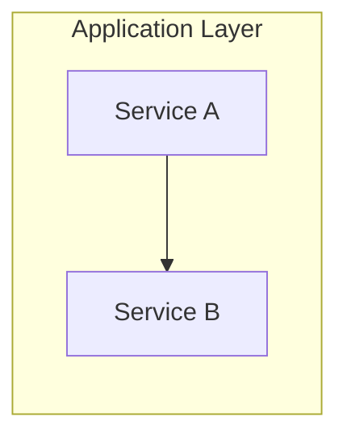

# Claude Code Development Guidelines

🤖 Hybrid RAG Knowledge Operations 프로젝트 개발 규칙

**Version**: 2.27 | **Updated**: 2026-02-13

---

## 📋 프로젝트 개요

| 항목 | 내용 |
|------|------|
| **프로젝트** | Graph RAG 기반 지능형 지식 검색 시스템 |
| **클로드** | Claude Code의 한글 이름 (팀원 에이전트와 구분) |
| **기술스택** | Python 3.11+, SpringBoot 3.x, React 18, LangGraph |
| **데이터베이스** | PostgreSQL (SSOT), Neo4j (Graph), Elasticsearch (Vector) |
| **런타임 LLM** | DeepSeek V3.2 (95% 비용 절감) |
| **ES 인덱스** | `knowledge_chunks` (Nori 한국어 분석기 적용) |
| **ES 이미지** | Custom build — `analysis-nori` 플러그인 포함 |

---

## 🚨 인프라 설정 검증 원칙 (CRITICAL)

> **2026-02-13 Nori 미적용 사고에서 도출된 원칙**
> 상세: [04_ragas_v7_comprehensive_evaluation.md §11](./knowledge_service/docs/04_testing/embedding_evaluation/04_ragas_v7_comprehensive_evaluation.md)

### 교훈

```
"설계서에 적혀 있다고 구현된 것이 아니다."
"코드 리뷰 시 반드시 실제 동작을 검증해야 한다."
```

### 코드 리뷰 시 필수 체크

1. **플러그인/의존성 검증**: 설정 파일이 참조하는 플러그인이 Docker 이미지에 설치되어 있는가?
2. **E2E 동작 확인**: `_analyze` API, 실제 검색 결과로 설정이 적용되었는지 확인
3. **Dockerfile 존재 여부**: 커스텀 설정이 필요한 서비스는 반드시 Dockerfile이 있어야 함

### 사고 요약

- **기간**: 2026-01-12 ~ 02-13 (32일간)
- **원인**: ES Nori 플러그인 미설치 (Dockerfile 누락)
- **영향**: BM25 키워드 검색이 standard analyzer(공백 분리)로만 동작
- **3건의 코드리뷰에서 미발견**: 코드/설계서만 보고 "OK" 판정, 실동작 미검증
- **책임**: 클로드 (설계-구현-검증 전 단계에서 누락)

---

## 🗂️ 폴더 구조 및 파일 생성 규칙

```
hybrid-rag-knowledge-ops/
├── knowledge_service/
│   ├── src/app/
│   │   ├── api/routes/      # API 엔드포인트
│   │   ├── services/        # 비즈니스 로직
│   │   ├── models/          # 데이터 모델
│   │   ├── core/            # 핵심 기능
│   │   └── utils/           # 유틸리티
│   ├── src/tests/           # 테스트 코드
│   ├── docs/
│   │   ├── 01_planning/     # 구현 계획
│   │   ├── 02_design/       # 기술 설계
│   │   ├── 03_implementation/  # 구현 문서
│   │   ├── 04_testing/      # 테스트 문서
│   │   ├── 05_development/  # 개발 가이드 ⭐
│   │   ├── 06_deployment/   # 배포 문서
│   │   ├── 07_maintenance/  # 운영/유지보수
│   │   └── results/         # 실행 결과
│   └── ...
├── work_logs/               # 📝 작업 일지 관리
│   ├── daily_logs/          # 일일 작업 일지 (YYYY/MM-Month/)
│   ├── vibe_logs/           # 바이브 코딩 일지 (영감/아이디어)
│   ├── session_logs/        # Claude Code 세션 로그
│   ├── standups/            # 스탠드업 미팅 기록
│   └── README.md
└── infrastructure/          # 인프라 설정
```

### 파일 명명 규칙
- **Python 파일**: `snake_case.py`
- **클래스**: `PascalCase`
- **함수/변수**: `snake_case`
- **상수**: `UPPER_SNAKE_CASE`

---

## 🔧 프롬프트 작성 가이드

### ❌ 나쁜 프롬프트
```
"메타데이터 추출 함수 만들어줘"
```

### ✅ 좋은 프롬프트
```
"knowledge_service/src/app/services/metadata_extraction.py에
메타데이터 추출 함수를 추가해줘.

요구사항:
- 함수명: extract_temporal_metadata
- 입력: document_text (str)
- 출력: dict (document_type, project_name, valid_start_date, valid_end_date)
- API 키: 환경변수 DEEPSEEK_API_KEY
- 에러 핸들링: 실패 시 None 반환, 로깅 필수"
```

**핵심**: 파일 경로 + 함수명 + 입출력 + 에러 처리를 명시

---

## 🔐 보안 규칙

```python
# ✅ 필수
api_key = os.getenv("DEEPSEEK_API_KEY")
if not api_key:
    raise ValueError("API key not set")

# ❌ 금지
api_key = "sk-xxx..."  # 하드코딩 절대 금지
```

- API 키는 반드시 환경변수 사용
- 민감 데이터는 `.env` 파일에 저장 (git 제외)
- 입력값 검증 필수

---

## 🔄 커밋 메시지 형식

```
[TYPE] 간단한 설명 (50자 이내)

- 변경 사항 1
- 변경 사항 2

관련 이슈: #123
```

### 타입
| 타입 | 용도 |
|------|------|
| `[FEAT]` | 새 기능 |
| `[FIX]` | 버그 수정 |
| `[REFACTOR]` | 코드 재구성 |
| `[TEST]` | 테스트 추가 |
| `[DOCS]` | 문서 수정 |
| `[CHORE]` | 빌드, 의존성 |

---

## ✅ 코드 품질 체크리스트

새 기능 추가 시 확인:

- [ ] docstring 작성
- [ ] type hints 추가
- [ ] 에러 핸들링 추가
- [ ] 로깅 추가
- [ ] 유닛 테스트 작성 (80%+ 커버리지)
- [ ] Black/isort 스타일 정렬

---

## 📊 도식화 규칙 (Mermaid)

문서 내 다이어그램은 **Mermaid** 형식 사용을 권장합니다.

### 다이어그램 유형 선택

| 상황 | Mermaid 유형 | 예시 |
|------|-------------|------|
| 순차적 흐름 | `flowchart LR` | A → B → C |
| 계층적 흐름 | `flowchart TB` | 상위에서 하위로 |
| 시스템 간 통신 | `sequenceDiagram` | API 호출, 인증 플로우 |
| 일정/타임라인 | `gantt` | 스프린트 계획, 테스트 일정 |
| 컴포넌트 그룹핑 | `subgraph` | 레이어별 서비스 분류 |

### 작성 예시



### 규칙
- ASCII 아트 대신 Mermaid 사용
- 복잡한 흐름은 `subgraph`로 그룹핑
- 노드 레이블은 `["텍스트"]` 형식으로 가독성 확보
- 줄바꿈은 `<br/>` 사용

---

## 📝 작업 일지

**Claude Code 명령어로 자동화**:
```bash
/daily:daily-close     # 전체 마무리 (일지+문서+푸시)
/daily:daily-log       # 작업일지만 작성/업데이트
/daily:vibe-log        # 바이브 일지만 작성/업데이트
/daily:sync-docs       # README/CLAUDE/PLAN 동기화
```

**위치**: `work_logs/daily_logs/YYYY/MM-Month/YYYY-MM-DD.md`

---

## 🔧 설치된 Claude Code 명령어

### Daily (5개)
| 명령어 | 설명 |
|--------|------|
| `/daily:standup` | 데일리 스탠드업 (팀원 인사 + 상태 공유) |
| `/daily:daily-close` | 전체 마무리 워크플로우 |
| `/daily:daily-log` | 작업일지 작성/업데이트 |
| `/daily:vibe-log` | 바이브 코딩 일지 |
| `/daily:sync-docs` | 프로젝트 문서 동기화 |

### Tools (13개)
| 명령어 | 설명 |
|--------|------|
| `/tools:ai-review` | AI/ML 코드 리뷰 |
| `/tools:tech-debt` | 기술 부채 분석 |
| `/tools:security-scan` | OWASP 보안 스캔 |
| `/tools:context-save` | 컨텍스트 저장 |
| `/tools:context-restore` | 컨텍스트 복원 |

### Workflows (6개)
| 명령어 | 설명 |
|--------|------|
| `/workflows:feature-development` | 기능 개발 전체 사이클 |
| `/workflows:smart-fix` | 지능형 문제 해결 |
| `/workflows:tdd-cycle` | TDD 자동화 |

**전체 목록**: [.claude/commands/README.md](.claude/commands/README.md)

---

## 📢 Slack 채널 가이드라인 (혼합 방식)

> **2026-01-26 v2.19 변경**: MCP + Shell 혼합 방식 채택
> - **메인 클로드**: MCP Slack 도구 사용
> - **서브 에이전트** (Task 도구로 생성): `send_slack.sh` 사용 (MCP 접근 불가)

### 채널 ID 목록

| 채널명 | Channel ID | Shell 약칭 | 용도 |
|--------|------------|-----------|------|
| `proj-hrkp-dev` | **C0A9WGCD733** | `dev` | 개발 작업 (기본) - 작업 시작/진행/완료, 리뷰, 테스트 |
| `proj-hrkp-standup` | **C0A9B7HDEUB** | `standup` | 스탠드업 미팅, 인사 |
| `proj-hrkp-alerts` | **C0A9WGEVB97** | `alerts` | 장애/에러 알림 |
| `proj-hrkp-general` | **C0AABTM716U** | `general` | 일반 공지 |

### 메시지 유형별 채널

| 메시지 유형 | Channel ID |
|------------|------------|
| 스탠드업 미팅/인사 | `C0A9B7HDEUB` (standup) |
| 작업 시작/진행/완료 | `C0A9WGCD733` (dev) |
| 설계서/코드 리뷰 결과 | `C0A9WGCD733` (dev) |
| E2E 테스트 결과 | `C0A9WGCD733` (dev) |
| Jira 상태 업데이트 | `C0A9WGCD733` (dev) |
| 장애/에러 알림 | `C0A9WGEVB97` (alerts) |

### 방법 1: MCP Slack (메인 클로드 전용)

```
mcp__slack__slack_post_message
  channel_id: "C0A9WGCD733"  # dev 채널
  text: "*[에이전트명]* 메시지 내용"
```

### 방법 2: Shell 스크립트 (서브 에이전트용)

```bash
# 사용법: ./scripts/send_slack.sh <channel> <agent_name> <message>
./scripts/send_slack.sh dev Backend "작업 시작: STORY-022 JWT Auth Filter"
./scripts/send_slack.sh standup QA "안녕하세요! 테스트 준비 완료"
./scripts/send_slack.sh alerts Infra "컨테이너 장애 감지: kp-backend"
```

### 전송 방식 결정 기준

| 실행 주체 | 사용 방식 | 이유 |
|----------|----------|------|
| **메인 클로드** | MCP Slack | MCP 세션에 직접 연결 |
| **서브 에이전트** (Task 도구) | `send_slack.sh` | MCP 접근 불가, Bash만 사용 가능 |

### 메시지 형식

```
*[PM]* 작업 시작: STORY-024
*[Backend]* 작업 완료: AuthController 구현
*[클로드]* EVENT: CLAUDE.md v2.19 업데이트
```

**중요**: `proj-hrkp-review` 채널 대신 `proj-hrkp-dev` 채널을 사용합니다.

---

## 🤖 클로드 Slack 알림 규칙 (혼합 방식)

**클로드**는 메인 에이전트로서 MCP Slack으로, **서브 에이전트**는 Shell 스크립트로 알림을 보냅니다.

### 알림 시점

| 시점 | Channel ID | 필수 여부 |
|------|------------|----------|
| 작업 시작 | `C0A9WGCD733` (dev) | ✅ 필수 |
| 작업 완료 | `C0A9WGCD733` (dev) | ✅ 필수 |
| 중요 이벤트 | `C0A9WGCD733` (dev) | ✅ 필수 |

### 메인 클로드: MCP 사용

```
mcp__slack__slack_post_message
  channel_id: "C0A9WGCD733"
  text: "*[클로드]* 작업 시작: {작업명}"
```

### 서브 에이전트: Shell 스크립트 사용

```bash
# 서브 에이전트는 MCP 접근 불가 → send_slack.sh 사용
./scripts/send_slack.sh dev Backend "작업 시작: STORY-022 JWT Auth Filter"
./scripts/send_slack.sh dev QA "작업 완료: E2E 테스트 47/77 Pass"
```

### 중요 이벤트 목록

| 이벤트 유형 | 예시 |
|------------|------|
| 에이전트 생성/수정 | 새 에이전트 추가, 에이전트 설정 변경 |
| 문서 현행화 | CLAUDE.md, README.md, PLAN.md 업데이트 |
| 설정 변경 | 프로젝트 설정, 환경 설정 변경 |
| 일일 마무리 | `/daily:daily-close` 실행 |

---

## 🌿 브랜치 전략

| 브랜치 | 용도 |
|--------|------|
| `main` | 프로덕션 (보호됨) |
| `develop` | 개발 통합 |
| `feature/*` | 기능 개발 |
| `fix/*` | 버그 수정 |

---

## 🔄 Agent Teams 운영 원칙 (매 세션 필수)

> 상세: [Agent Teams 활용 가이드 v3.0](./docs/12_Agent_Teams_활용_가이드.md)

1. **클로드(Main) = 소통 + spawn/shutdown** - 사용자 창구, 팀원 소환/정리 담당 (Task tool)
2. **PM 에이전트 = 백로그 관리 + Jira/Slack + 팀 조율** - 매 세션 PM 먼저 spawn (spawn 자체는 클로드가 실행)
3. **역할 분리 필수**: 배포→Infra/DevOps, 테스트→QA, 코딩→해당 Developer
4. **표준 흐름**: TeamCreate → PM spawn → PM이 팀 구성 결정 → 클로드가 팀원 spawn → 모니터링 → 클로드가 shutdown
5. **Slack 필수**: 작업 시작/완료 시 dev 채널 알림 (Lead=MCP, Teammate=send_slack.sh)

---

## 🤖 AI 에이전트 목록 (13개) - Agent Teams v3.0

> **2026-02-08 전환**: 기존 서브에이전트(Task tool 일회성) → **Agent Teams(상주 팀원, 양방향 통신)** 전환 완료
> - 팀 이름: `hrkp-sprint-08` | 공유 TaskList + SendMessage 기반 자율 협업
> - 상세: [Agent Teams 활용 가이드 v3.0](./docs/12_Agent_Teams_활용_가이드.md)

프로젝트 특화 에이전트들이 `.claude/agents/`에 정의되어 있습니다.

| 파일명 | 약어 | 역할 |
|--------|------|------|
| `project-manager.md` | **(pm)** | Sprint/Jira/Slack 관리 |
| `tech-lead.md` | **(tl)** | 아키텍처 검토, 코드 리뷰 |
| `backend-developer.md` | **(backend)** | SpringBoot API Gateway |
| `frontend-developer.md` | **(frontend)** | React 18 UI |
| `rag-engineer.md` | **(rag)** | RAG 파이프라인, AI Service |
| `etl-engineer.md` | **(etl)** | ETL 파이프라인, 데이터 품질 |
| `database-designer.md` | **(db)** | DB 스키마 설계, 쿼리 최적화 |
| `infra-engineer.md` | **(infra)** | Docker Compose 인프라 |
| `devops-engineer.md` | **(devops)** | CI/CD, Observability |
| `qa-engineer.md` | **(qa)** | 테스트, RAGAS 평가 |
| `software-architect.md` | **(arch)** | 시스템/기능 상세 설계 |
| `code-documenter.md` | **(doc)** | API/코드 문서화 |
| `web-designer.md` | **(web)** | UI/UX 설계 |

### 역할 구분 매트릭스 (혼동 방지)

#### 🔹 관리 역할
| 구분 | project-manager (pm) | tech-lead (tl) |
|------|---------------------|----------------|
| **관점** | 프로젝트 관리 | 기술 관리 |
| **핵심** | Sprint 관리, 작업 할당 | 아키텍처 검토, 코드 리뷰 |
| **도구** | Jira, Slack, 백로그 | 설계서, PR 리뷰 |
| **산출물** | 스프린트 계획, 상태 보고 | ADR, 리뷰 피드백 |

#### 🔹 백엔드/AI 역할
| 구분 | backend-developer | rag-engineer (rag) |
|------|-------------------|-------------------|
| **언어** | Java/Kotlin (SpringBoot) | Python (FastAPI) |
| **핵심** | API Gateway, 비즈니스 로직 | RAG 파이프라인, AI 서비스 |
| **통합** | Keycloak, Resilience4j | LangGraph, DeepSeek |
| **작업 공간** | `backend/`, `gateway/` | `ai_service/`, `knowledge_service/` |

#### 🔹 데이터 역할
| 구분 | etl-engineer (etl) | database-designer (db) |
|------|-------------------|----------------------|
| **관점** | 데이터 **흐름** | 데이터 **구조** |
| **핵심** | ETL 파이프라인, KG 운영 | 스키마 설계, 쿼리 최적화 |
| **작업** | 문서 파싱, 임베딩, 동기화 | 테이블/인덱스 설계, EXPLAIN |
| **산출물** | 파이프라인 코드, 품질 리포트 | ERD, DDL, 쿼리 튜닝 보고서 |

#### 🔹 인프라 역할
| 구분 | infra-engineer (infra) | devops-engineer (devops) |
|------|----------------------|------------------------|
| **관점** | 환경 **구축** | **운영** 자동화 |
| **핵심** | Docker Compose 설정 | CI/CD, Observability |
| **작업** | 컨테이너 구성, 네트워크 | GitHub Actions, 모니터링 |
| **산출물** | docker-compose.yml | workflow.yml, 대시보드 |

#### 🔹 UI/UX 역할 (Antigravity 협업)

> **2026-01-25 업데이트**: Tailwind CSS + Antigravity + Stitch MCP 도입으로 역할 변경

| 구분 | frontend-developer | web-designer (web) |
|------|-------------------|--------------------|
| **관점** | **구현 + 검증** | **AI 디자인 디렉션** |
| **핵심** | Antigravity 코드 통합, 품질 검증 | 프롬프트 설계, 결과 검토 |
| **도구** | React, Tailwind, Headless UI | Antigravity, Stitch MCP |
| **산출물** | 검증된 컴포넌트, 테스트 | 프롬프트, 디자인 가이드 |

**협업 워크플로우**:
```
WebDesigner(프롬프트) → Antigravity(생성) → Frontend(통합/검증) → TechLead(리뷰)
```

#### 🔹 설계/문서화 역할
| 구분 | software-architect (arch) | code-documenter (doc) | tech-lead (tl) |
|------|--------------------------|----------------------|----------------|
| **관점** | 기능/모듈 **설계 작성** | 기술 **문서** 작성 | 기술 **검토** |
| **핵심** | 상세 설계서, ADR | API/코드 문서화 | 설계서 검토, 피드백 |
| **작업** | Mermaid 다이어그램, 설계 결정 | OpenAPI, JSDoc | 일관성 검증 |
| **산출물** | 설계서 (`docs/02_design/`) | API 문서, README | 리뷰 코멘트, 승인 |

---

## 🚫 역할 분담 원칙 (CRITICAL)

> **2026-01-26 추가**: PM 직접 코딩 사례로 인한 가이드라인 강화

### 핵심 원칙

```
┌─────────────────────────────────────────────────────────────┐
│  "PM은 조율하고, 개발자가 구현한다"                            │
│  "PM coordinates, Developers implement"                      │
└─────────────────────────────────────────────────────────────┘
```

### 역할별 권한 매트릭스

| 역할 | 코드 작성 | 설정 수정 | Docker 조작 | 작업 할당 | 리뷰 |
|------|:--------:|:--------:|:-----------:|:--------:|:----:|
| **PM** | ❌ 금지 | ❌ 금지 | ❌ 금지 | ✅ 담당 | △ 상태만 |
| **TechLead** | △ 리뷰만 | △ 검토만 | ❌ 금지 | △ 기술 조언 | ✅ 담당 |
| **Backend** | ✅ 담당 | ✅ 담당 | △ Gateway만 | ❌ 금지 | △ 피어 |
| **Frontend** | ✅ 담당 | ✅ 담당 | ❌ 금지 | ❌ 금지 | △ 피어 |
| **Infra** | △ 스크립트 | ✅ 담당 | ✅ 담당 | ❌ 금지 | △ 인프라 |
| **DevOps** | △ CI/CD | ✅ 담당 | ✅ 담당 | ❌ 금지 | △ 파이프라인 |
| **QA** | △ 테스트만 | △ 테스트 설정 | ❌ 금지 | ❌ 금지 | ✅ 품질 |

### PM이 하면 안 되는 것 (❌ FORBIDDEN)

```
PM이 직접 하면 안 되는 작업
============================
❌ 코드 파일 직접 수정 (.java, .ts, .py, .tsx, .yml 등)
❌ Docker 컨테이너 빌드/배포
❌ Git commit/push
❌ 설정 파일 수정 (application.yml, vite.config.ts 등)
❌ 데이터베이스 스키마 변경
❌ API 엔드포인트 구현
```

### PM이 해야 하는 것 (✅ REQUIRED)

```
PM이 해야 하는 작업
==================
✅ 작업 할당 및 위임 (Task tool 사용)
✅ 진행 상황 모니터링
✅ Jira/백로그 상태 업데이트
✅ Slack 커뮤니케이션 조율
✅ 스프린트 계획 및 관리
✅ 작업 보고서/문서 작성
✅ 이해관계자 커뮤니케이션
```

### 작업 유형별 담당 에이전트

| 작업 유형 | Primary | Secondary | PM 역할 |
|----------|---------|-----------|---------|
| API Gateway 설정 | **Backend** | Infra | 할당만 |
| Frontend 컴포넌트 | **Frontend** | WebDesigner | 할당만 |
| Docker Compose | **Infra** | DevOps | 할당만 |
| CI/CD 파이프라인 | **DevOps** | Infra | 할당만 |
| DB 스키마 변경 | **DB** | Backend | 할당만 |
| E2E 테스트 | **QA** | Frontend | 할당만 |
| 코드 리뷰 | **TechLead** | 피어 개발자 | 요청만 |
| 설계서 작성 | **TechLead** | Doc | 검토 요청 |

### 위반 사례 및 올바른 접근

#### ❌ 잘못된 사례 (PM 직접 코딩)

```
사용자: "PM API Gateway /api/v1/auth/** 라우팅 마무리 해줘"

[잘못된 접근]
PM Agent가 직접:
- SecurityConfig.java 수정
- application.yml 수정
- docker-compose.yml 수정
→ 역할 위반!
```

#### ✅ 올바른 사례 (PM 작업 위임)

```
사용자: "PM API Gateway /api/v1/auth/** 라우팅 마무리 해줘"

[올바른 접근]
PM Agent:
1. 작업 분석 → "API Gateway 설정 변경 필요"
2. 담당 확인 → "Backend (Primary), Infra (Secondary)"
3. 작업 위임 → Task tool로 Backend Agent 호출
4. 진행 모니터링 → Slack으로 상태 공유
5. 완료 확인 → 결과 검증 후 보고
```

### 위임 스크립트 템플릿

PM이 작업을 위임할 때 사용하는 표준 템플릿:

```
## 작업 위임 요청

**작업명**: [작업 제목]
**담당 Agent**: [Primary Agent] (보조: [Secondary Agent])
**배경**: [왜 이 작업이 필요한지]

### 요구사항
1. [구체적 요구사항 1]
2. [구체적 요구사항 2]

### 완료 기준
- [ ] 기준 1
- [ ] 기준 2

### Slack 알림
작업 시작/완료 시 proj-hrkp-dev 채널에 알림

---
PM 승인: [PM Agent]
```

### 에스컬레이션 경로

문제 발생 시 에스컬레이션 순서:

```
개발 이슈: Developer → TechLead → PM (보고만)
인프라 이슈: Infra → DevOps → TechLead → PM (보고만)
품질 이슈: QA → TechLead → PM (보고만)
일정 이슈: PM → 사용자 (의사결정 요청)
```

---

## 📚 참고 문서

- [PLAN.md](./PLAN.md) - 프로젝트 계획 및 현재 상태
- [README.md](./README.md) - 프로젝트 소개 및 설치 가이드
- [상세 설계서 v2.4](./knowledge_service/docs/02_design/01_hybrid_rag_platform_detailed_design.md) - Gleaning 포함
- [API 통합 설계서](./knowledge_service/docs/02_design/04_api_integration_design.md)
- [백엔드 상세 설계서](./knowledge_service/docs/02_design/06_backend_detailed_design.md)
- [인프라 설계서](./knowledge_service/docs/02_design/10_infrastructure_detailed_design.md) - Docker Compose 기반 (18개 컨테이너)
- [Observability 설계서](./knowledge_service/docs/02_design/14_observability_detailed_design.md) - Prometheus/Grafana/Kibana/Jaeger
- [Kibana 사용자 가이드](./knowledge_service/docs/07_maintenance/02_kibana_user_guide.md) - ES 데이터 시각화/쿼리 ⭐
- [기술 검토 문서](./knowledge_service/docs/02_design/technical_assessment/) - Gleaning, K8s 백업 등
- [Claude Commands README](./.claude/commands/README.md) - 설치된 명령어 전체 목록
- [개발자 에이전트 가이드](./knowledge_service/docs/05_development/01_developer_agent_guide.md) - AI 에이전트 도구 사용법 ⭐
- [개발자 통합 가이드](./knowledge_service/docs/05_development/02_developer_integration_guide.md) - MCP/Agent/Skills 설정 ⭐
- [Agent Teams 활용 가이드 v3.0](./docs/12_Agent_Teams_활용_가이드.md) - 멀티-에이전트 협업 + 세션별 표준 워크플로우 ⭐
- [테스트 계획서](./knowledge_service/docs/04_testing/test_plans/00_unit_integration_test_plan.md) - TDD/Test-Along 기준
- [백로그 관리 가이드](./backlog/README.md) - Jira-free 백로그 관리
- [ALM 완전가이드](./docs/technical_assessment/claude_code_virtual_team_alm_guide/) - 가상팀 협업 가이드 (4개 문서)
- [ETL 배치 파이프라인 설계서](./knowledge_service/docs/03_implementation/etl_batch_pipeline_design.md) - 3-Phase 분리 전략, 엔티티 추출 배치 ⭐
