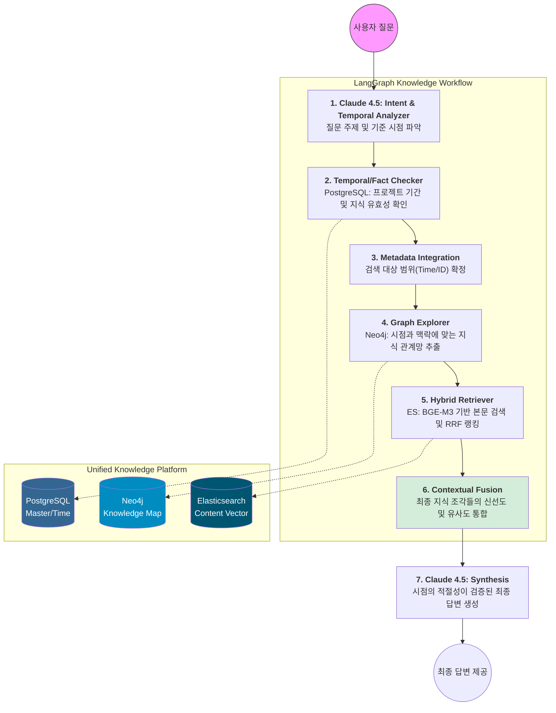

# hybrid-rag-knowledge-ops

**Autonomous Deep Agent Framework for Intelligent Enterprise Knowledge & Temporal Discovery.**

`hybrid-rag-knowledge-ops`는 **LangGraph**를 오케스트레이터로, **LangChain**을 도구 생태계로 활용하는 **Deep Agent** 기반 프로젝트입니다.

본 프로젝트는 사내에 파편화된 **정형 데이터(인사, 프로젝트 마스터)**와 **비정형 지식(기술 문서, 일반 메모, Wiki, 업무 노하우)**을 **Graph RAG(Neo4j)** 및 **Vector Search(Elasticsearch)** 기술로 결합합니다. 특히 지식의 **'발생 시점'**과 **'유효 기간'**을 추론의 핵심 변수로 활용하여, 단순히 유사한 정보를 찾는 것을 넘어 **"현재 시점에서 가장 정확하고 맥락에 맞는 지식"**을 제공하는 자율형 지식 운영 시스템을 목표로 합니다.

---

## 📋 목차

- [시스템 구축 목표](#-시스템-구축-목표-system-vision)
- [주요 기능](#-주요-기능)
- [기술 스택](#-기술-스택)
- [시스템 요구사항](#-시스템-요구사항)
- [빠른 시작](#-빠른-시작)
- [아키텍처](#-deep-agent-아키텍처-detailed-architecture)
- [개발 가이드](#%E2%80%8D-개발-가이드-(Claude-Code-기반))
- [프로젝트 구조](#-프로젝트-구조)
- [사용 예시](#-사용-예시)
- [트러블슈팅](#-트러블슈팅)
- [로드맵](#-로드맵)
- [기여 가이드](#-기여-가이드)
- [라이선스](#-라이선스)

---

## 🎯 시스템 구축 목표 (System Vision)

본 시스템은 16GB RAM이라는 제한된 로컬 리소스 환경에서도 전사적 지식 지도를 구축할 수 있는 **'초경량·고추론'** 모델을 지향합니다.

### **1. 범용적 지식 통합 및 사일로 해소 (Universal Knowledge Synergy)**

* **Project & General Hybrid:** 특정 프로젝트 산출물뿐만 아니라 사용자가 수시로 등록하는 일반 지식(Tips, 가이드)을 동일한 위계로 통합 관리합니다.
* **Cross-Domain Temporal Reasoning:** 인사 DB(SQL), 지식 그래프(Graph), 문서 본문(Vector)을 시계열적으로 교차 참조합니다. (예: "2023년 당시 보안 지침과 현재 지침의 차이점은?")

### **2. 자율적 시공간 정보 탐색 (Spatio-Temporal Planning)**

* **Context-Aware Agent:** 사용자의 질문에서 '시기(언제)'와 '주제(무엇)'를 분리 추출합니다. 에이전트는 스스로 지식의 유효 기간을 체크하여 과거의 잘못된 정보가 답변에 섞이지 않도록 필터링 계획을 수립합니다.

### **3. 지능형 하이브리드 검색 (Advanced Multi-Modal Retrieval)**

* **BGE-M3 Engine:** 한국어/영어 및 사내 약어에 특화된 **Dense + Sparse** 검색을 수행합니다. 일반 텍스트뿐만 아니라 프로젝트 코드명, 장비 시리얼 번호 등 정밀한 키워드 매칭을 동시 지원합니다.

### **4. 로컬 하드웨어 성능 한계 돌파 (Hyper-Optimization)**

* **Resource-Aware Intelligence:** **ONNX Runtime 가속**을 통해 GPU 없이 i7 CPU 환경에서 16GB RAM을 효율적으로 분할 할당하고, 나머지를 임베딩 및 LLM 추론에 배치하여 Windows 11 환경에서의 안정성을 확보합니다.

---

## ✨ 주요 기능

- 🔍 **시간 인식 검색**: 지식의 유효 기간을 고려한 맥락 기반 검색
- 🕸️ **그래프 기반 관계 탐색**: 인물-프로젝트-지식 간의 연결망 분석
- 🧮 **하이브리드 검색**: Dense + Sparse 벡터 검색 결합 (RRF)
- 🤖 **자율형 에이전트**: LangGraph 기반 다단계 추론
- 📊 **멀티모달 지원**: 텍스트, 표, 이미지 통합 처리
- 🔐 **권한 기반 접근 제어**: 문서/엔티티 레벨 권한 관리
- 💾 **경량 운영**: 16GB RAM 환경 최적화

---

## 🛠 기술 스택

### Core Framework
- **Python**: 3.11+
- **LangGraph**: 0.2.x (오케스트레이션)
- **LangChain**: 0.3.x (도구 생태계)

### LLM & Embedding
- **Claude 4.5 Sonnet**: 추론 및 지식 추출
- **BGE-M3**: 멀티링구얼 임베딩 모델
- **ONNX Runtime**: CPU 최적화 추론

### Data Stores
- **PostgreSQL**: 16+ (시계열 메타데이터)
- **Neo4j**: 5.x (지식 그래프)
- **Elasticsearch**: 8.x (벡터 검색)

### Development Tools
- **Claude Code**: AI 기반 바이브코딩
- **Poetry**: 의존성 관리
- **Docker / Docker Compose**: 컨테이너 환경

---

## 💻 시스템 요구사항

### 최소 요구사항
- **OS**: Windows 11 / macOS 13+ / Ubuntu 22.04+
- **CPU**: Intel i7 10th gen 이상 (또는 동급 AMD)
- **RAM**: 16GB
- **Storage**: SSD 50GB 이상

### 권장 요구사항
- **RAM**: 32GB
- **CPU**: Intel i7 12th gen 이상 (또는 M2/M3 Apple Silicon)
- **GPU**: NVIDIA GPU (선택사항, 임베딩 가속용)

---

## 🚀 빠른 시작

### 1. 사전 준비

#### Claude API 키 설정
```bash
# .env 파일 생성
cp .env.example .env

# .env 파일에 API 키 추가
ANTHROPIC_API_KEY=your_api_key_here
```

#### Claude Code CLI 설치 (선택사항)
```bash
# npm을 통한 설치
npm install -g @anthropic-ai/claude-code

# 또는 Homebrew (macOS)
brew install claude-code

# 인증
claude-code auth login
```

### 2. 데이터베이스 환경 구축

#### Docker Compose로 일괄 실행
```bash
# 모든 데이터베이스 컨테이너 시작
docker-compose up -d

# 상태 확인
docker-compose ps
```

#### 개별 설치 (Docker 미사용 시)

**PostgreSQL**
```bash
# Windows (PostgreSQL 16)
# https://www.postgresql.org/download/windows/

# macOS
brew install postgresql@16
brew services start postgresql@16

# Linux
sudo apt install postgresql-16
sudo systemctl start postgresql
```

**Neo4j**
```bash
# Docker 권장
docker run -d \
  --name neo4j \
  -p 7474:7474 -p 7687:7687 \
  -e NEO4J_AUTH=neo4j/your_password \
  neo4j:5.15

# 또는 Neo4j Desktop 사용
# https://neo4j.com/download/
```

**Elasticsearch**
```bash
# Docker 권장
docker run -d \
  --name elasticsearch \
  -p 9200:9200 -p 9300:9300 \
  -e "discovery.type=single-node" \
  -e "xpack.security.enabled=false" \
  elasticsearch:8.11.0
```

### 3. Python 환경 설정

```bash
# Poetry 설치
pip install poetry

# 프로젝트 의존성 설치
poetry install

# 가상환경 활성화
poetry shell
```

### 4. 데이터베이스 초기화

```bash
# PostgreSQL 스키마 생성
python scripts/init_postgres.py

# Neo4j 제약조건 및 인덱스 생성
python scripts/init_neo4j.py

# Elasticsearch 인덱스 생성
python scripts/init_elasticsearch.py
```

### 5. 임베딩 모델 다운로드

```bash
# BGE-M3 모델 다운로드 및 ONNX 변환
python scripts/download_embedding_model.py

# 모델이 저장되는 위치: ./models/bge-m3-onnx/
```

### 6. 애플리케이션 실행

```bash
# 개발 모드 실행
python main.py

# 또는 uvicorn 서버로 실행 (API 모드)
uvicorn app.main:app --reload --host 0.0.0.0 --port 8000
```

### 7. 웹 인터페이스 접속

브라우저에서 `http://localhost:8000` 접속

---

## 🏗 Deep Agent 아키텍처 (Detailed Architecture)

### **1. Core Intelligence Layer: 지능형 제어 및 시점 분석**

* **Orchestrator (LangGraph: State Machine)**
  * **기능:** 추론의 각 단계(의도 분석 → 시점 필터링 → 그래프 탐색 → 벡터 검색 → 합성)를 상태 머신으로 관리합니다.
  * **상태 관리:** 질문의 기준 시점(Reference Time), 대상 프로젝트 ID, 검색된 지식의 유효성 여부를 상태값으로 유지합니다.

* **Brain (Claude 4.5: Strategic Reasoner)**
  * **Planning:** 질문에서 엔티티(인물, 프로젝트, 일반 주제)와 **시간적 제약 조건**을 추출합니다.
  * **Verification:** 검색된 지식이 현재 유효한지(Valid), 혹은 특정 프로젝트 수행 기간 내에 작성된 것인지 논리적으로 검증합니다.

### **2. Hybrid Data Platform: 다차원 지식 저장소**

* **PostgreSQL 16+ (Temporal & Fact Ledger)**
  * **역할:** 지식의 생애주기 및 프로젝트 마스터 정보를 관리합니다.
  * **핵심 구조:** 프로젝트 수행 기간 및 지식별 `valid_from/to` 컬럼을 통한 시계열 필터링 지원.

* **Neo4j (Slim Knowledge Graph)**
  * **역할:** 지식 조각 간의 유기적 관계와 인적 네트워크를 연결합니다.
  * **Schema:** `(User)-[:CREATED]->(Knowledge)`, `(Knowledge)-[:LINKED_TO]->(Project)`, `(Knowledge)-[:CATEGORY]->(Topic)`.

* **Elasticsearch (Semantic Knowledge Base)**
  * **역할:** BGE-M3 임베딩을 통한 고차원 의미 검색을 담당합니다.
  * **기능:** RRF(Reciprocal Rank Fusion)를 통해 키워드(BM25)와 벡터 검색 결과를 결합하여 최상위 순위를 산출합니다.

---

## 🧠 심층 추론 및 시점 전략 (Temporal Reasoning Strategy)

### **1. Claude 4.5 'Intent & Temporal Weighting' 프롬프트**

```xml
<system_instruction>
당신은 전사 지식 엔진의 오케스트레이터입니다. 질문에서 '대상(Topic)'과 '시점(Time)'을 분석하여 가중치를 결정하세요.
1. PostgreSQL: 인사/프로젝트 기간/지식 유효성 체크
2. Neo4j: 인물-프로젝트-일반 지식 간의 관계망 탐색
3. Elasticsearch: 지식 본문의 의미론적 유사성 검색
</system_instruction>
<intent_rules>
- "언제까지 유효해?", "최신 버전이야?" -> PG(Validity) 가중치 UP
- "이거 누가 잘 알아?", "관련된 다른 프로젝트는?" -> Neo4j(Relation) 가중치 UP
- "~에 대한 내용 요약해줘", "방법이 뭐야?" -> ES(Content) 가중치 UP
</intent_rules>
```

---

## 🛠 데이터 전략 및 자원 할당 (Data Orchestration)

| 데이터 소스 | 역할 (Core Role) | 핵심 데이터 항목 | 메모리 할당 |
| --- | --- | --- | --- |
| **PostgreSQL** | **Temporal SSOT** | 인사 정보, 프로젝트 기간, 지식 유효기간(`valid_from/to`) | 1GB |
| **Neo4j** | **Relational Map** | 인물-주제-프로젝트-지식 간의 관계(Edge) 중심 데이터 | 2GB |
| **Elasticsearch** | **Vector Search** | 지식 본문 임베딩(BGE-M3), 전문(Full-text) 인덱스 | 4GB |

---

## [별첨] 사내 통합 지식 Graph RAG 전체 아키텍처



---

## 👨‍💻 개발 가이드 (Claude Code 기반)

### Claude Code를 활용한 바이브코딩 워크플로우

본 프로젝트는 **Claude Code CLI**를 활용한 AI 기반 바이브코딩으로 개발됩니다. 반복적인 코드 작성 대신 자연어로 의도를 전달하고, Claude가 코드를 생성/수정합니다.

#### 1. 기본 워크플로우

```bash
# 프로젝트 디렉토리에서 Claude Code 세션 시작
cd hybrid-rag-knowledge-ops
claude-code

# 또는 특정 태스크 지정
claude-code "새로운 검색 엔드포인트 추가"
```

#### 2. 주요 개발 패턴

**새 기능 개발**
```bash
# Claude에게 요구사항 전달
"사용자가 특정 기간의 지식을 필터링할 수 있는 API 엔드포인트를 만들어줘.
- 경로: /api/v1/search/temporal
- 파라미터: start_date, end_date, query
- PostgreSQL에서 valid_start_date를 기준으로 필터링
- 응답은 JSON으로 반환"
```

**리팩토링**
```bash
"app/core/search_engine.py의 hybrid_search 함수를 더 모듈화해서
각 검색 소스(PG, Neo4j, ES)를 독립적인 메서드로 분리해줘"
```

**테스트 작성**
```bash
"tests/test_search_engine.py에 temporal_filter 테스트 케이스 추가해줘.
- 유효한 기간의 지식만 반환되는지 확인
- 경계값 테스트 (start_date = end_date)
- 잘못된 날짜 형식 처리"
```

**문서화**
```bash
"app/api/routes/search.py의 모든 엔드포인트에 OpenAPI 문서화 추가해줘.
파라미터 설명, 예시 요청/응답, 에러 케이스 포함"
```

#### 3. 프롬프트 작성 베스트 프랙티스

**구체적인 요구사항 명시**
```
❌ "검색 기능 만들어줘"
✅ "Elasticsearch에 벡터 검색하는 함수 만들어줘.
   - 함수명: vector_search
   - 입력: query_text (str), top_k (int, default=5)
   - 출력: List[Dict] (id, score, content 포함)
   - BGE-M3 모델로 쿼리 임베딩
   - kNN 검색 수행"
```

**기존 코드 컨텍스트 제공**
```
"app/models/knowledge.py의 Knowledge 모델과 일관되게
KnowledgeSearchResult 모델을 추가해줘"
```

**제약사항 명시**
```
"메모리 사용량을 최소화하기 위해 배치 처리 로직 추가.
한 번에 100개씩만 처리하고 중간 결과는 디스크에 저장"
```

#### 4. 버전 관리 통합

```bash
# Claude가 생성한 코드를 커밋하기 전 검토
git diff

# 의미있는 단위로 커밋
git add app/api/routes/search.py
git commit -m "feat: Add temporal filtering to search endpoint"

# Claude에게 커밋 메시지 작성 요청도 가능
claude-code "지금까지 변경사항을 기반으로 conventional commit 메시지 작성해줘"
```

#### 5. 디버깅 워크플로우

```bash
# 에러 로그 제공
"이 에러를 해결해줘:
[에러 로그 붙여넣기]

관련 코드:
[코드 스니펫 붙여넣기]"

# 또는 파일 전체 분석 요청
"app/core/graph_engine.py에서 Neo4j 연결 오류가 발생해.
코드 전체를 분석하고 문제점 찾아서 수정해줘"
```

---

## 📁 프로젝트 구조

```
hybrid-rag-knowledge-ops/
├── app/
│   ├── main.py                 # FastAPI 애플리케이션 엔트리포인트
│   ├── config.py               # 환경 설정
│   ├── api/
│   │   ├── routes/
│   │   │   ├── search.py       # 검색 엔드포인트
│   │   │   ├── knowledge.py    # 지식 관리 엔드포인트
│   │   │   └── admin.py        # 관리자 엔드포인트
│   │   └── dependencies.py     # 의존성 주입
│   ├── core/
│   │   ├── orchestrator.py     # LangGraph 오케스트레이터
│   │   ├── search_engine.py    # 하이브리드 검색 엔진
│   │   ├── graph_engine.py     # Neo4j 그래프 탐색
│   │   ├── vector_engine.py    # Elasticsearch 벡터 검색
│   │   └── temporal_filter.py  # 시계열 필터링
│   ├── models/
│   │   ├── knowledge.py        # 지식 데이터 모델
│   │   ├── project.py          # 프로젝트 데이터 모델
│   │   └── user.py             # 사용자 데이터 모델
│   ├── services/
│   │   ├── embedding.py        # BGE-M3 임베딩 서비스
│   │   ├── llm.py              # Claude LLM 서비스
│   │   └── indexing.py         # 문서 인덱싱 서비스
│   └── utils/
│       ├── logger.py           # 로깅 유틸리티
│       └── validators.py       # 입력 검증
├── scripts/
│   ├── init_postgres.py        # PostgreSQL 초기화
│   ├── init_neo4j.py           # Neo4j 초기화
│   ├── init_elasticsearch.py  # Elasticsearch 초기화
│   ├── download_embedding_model.py  # 임베딩 모델 다운로드
│   └── import_documents.py     # 문서 일괄 임포트
├── tests/
│   ├── test_search_engine.py
│   ├── test_graph_engine.py
│   └── test_temporal_filter.py
├── models/                     # 다운로드된 ML 모델
│   └── bge-m3-onnx/
├── data/                       # 샘플 데이터 및 테스트 데이터
│   ├── sample_documents/
│   └── test_fixtures/
├── docs/                       # 문서
│   ├── architecture.md
│   ├── api_reference.md
│   └── deployment.md
├── .env.example                # 환경 변수 템플릿
├── docker-compose.yml          # Docker 컴포즈 설정
├── pyproject.toml              # Poetry 의존성 설정
└── README.md
```

---

## 💡 사용 예시

### 1. 기본 검색

```python
from app.core.search_engine import SearchEngine

engine = SearchEngine()

# 일반 검색
result = engine.search("Django 프로젝트 시작 가이드")
print(result.answer)
print(result.sources)

# 시점 기반 검색
result = engine.search(
    query="보안 정책",
    reference_date="2023-06-01"
)
```

### 2. API 호출 예시

```bash
# 기본 검색
curl -X POST http://localhost:8000/api/v1/search \
  -H "Content-Type: application/json" \
  -d '{"query": "프로젝트 A의 기술 스택은?"}'

# 시간 필터링 검색
curl -X POST http://localhost:8000/api/v1/search/temporal \
  -H "Content-Type: application/json" \
  -d '{
    "query": "보안 가이드라인",
    "start_date": "2023-01-01",
    "end_date": "2023-12-31"
  }'

# 관계 기반 탐색
curl -X GET http://localhost:8000/api/v1/graph/related?entity=김철수&type=CREATED
```

### 3. 프로그래밍 방식 사용

```python
from app.core.orchestrator import KnowledgeOrchestrator
from app.services.llm import ClaudeLLMService

# 오케스트레이터 초기화
orchestrator = KnowledgeOrchestrator(
    llm_service=ClaudeLLMService(),
    max_iterations=5
)

# 복잡한 질문 처리
state = orchestrator.run({
    "query": "2023년 A 프로젝트 담당자가 작성한 보안 관련 문서 요약해줘",
    "user_id": "user123"
})

print(state["final_answer"])
print(state["reasoning_steps"])
```

---

## 🔧 트러블슈팅

### 일반적인 문제 해결

#### 1. Elasticsearch 연결 실패
```
ConnectionError: Connection to Elasticsearch failed
```

**해결방법:**
```bash
# Elasticsearch 상태 확인
curl http://localhost:9200

# Docker 컨테이너 재시작
docker restart elasticsearch

# 로그 확인
docker logs elasticsearch
```

#### 2. Neo4j 인증 실패
```
AuthError: The client is unauthorized due to authentication failure
```

**해결방법:**
```bash
# .env 파일의 Neo4j 인증 정보 확인
NEO4J_URI=bolt://localhost:7687
NEO4J_USER=neo4j
NEO4J_PASSWORD=your_password

# Neo4j 브라우저에서 비밀번호 재설정
# http://localhost:7474
```

#### 3. 메모리 부족 오류
```
MemoryError: Unable to allocate array
```

**해결방법:**
```python
# config.py에서 배치 크기 조정
EMBEDDING_BATCH_SIZE = 32  # 기본값 64에서 감소
MAX_CONCURRENT_REQUESTS = 5  # 기본값 10에서 감소

# Docker 컨테이너 메모리 제한 확인
docker stats
```

#### 4. ONNX 모델 로딩 실패
```
ONNXRuntimeError: Failed to load model
```

**해결방법:**
```bash
# 모델 재다운로드
python scripts/download_embedding_model.py --force

# ONNX Runtime 재설치
poetry add onnxruntime --python "^3.11"
```

### 성능 최적화 팁

#### 검색 속도 향상
```python
# 캐싱 활성화
from functools import lru_cache

@lru_cache(maxsize=1000)
def cached_embedding(text: str):
    return embedding_model.encode(text)
```

#### 메모리 사용량 최적화
```python
# PostgreSQL 연결 풀 설정
SQLALCHEMY_POOL_SIZE = 5
SQLALCHEMY_MAX_OVERFLOW = 10

# Neo4j 연결 풀
NEO4J_MAX_CONNECTION_POOL_SIZE = 50
```

---

## 🗺 로드맵

### Phase 1: 기반 구축 (현재)
- [x] 기본 아키텍처 설계
- [x] PostgreSQL/Neo4j/Elasticsearch 통합
- [x] BGE-M3 임베딩 파이프라인
- [ ] LangGraph 오케스트레이터 구현
- [ ] 기본 웹 UI

### Phase 2: 고도화 (Q2 2026)
- [ ] 시계열 추론 고도화
- [ ] 멀티모달 지원 (이미지, 표)
- [ ] 권한 관리 시스템
- [ ] 실시간 지식 업데이트
- [ ] 성능 벤치마킹 및 최적화

### Phase 3: 확장 (Q3 2026)
- [ ] 다국어 지원 확대
- [ ] 온톨로지 기반 도메인 추가 (Telecom)
- [ ] AI 에이전트 자동화
- [ ] 협업 기능 (지식 공유, 전문가 연결)
- [ ] 분산 환경 지원

### Phase 4: 엔터프라이즈 (Q4 2026)
- [ ] SSO 통합
- [ ] 감사 로깅
- [ ] SLA 모니터링
- [ ] 고가용성 (HA) 구성
- [ ] 클라우드 네이티브 배포

---

## 🤝 기여 가이드

### 기여 방법

1. **이슈 생성**
   - 버그 리포트, 기능 제안, 질문 등을 이슈로 등록
   - 템플릿에 따라 상세히 작성

2. **포크 및 브랜치 생성**
   ```bash
   git checkout -b feature/새기능이름
   # 또는
   git checkout -b fix/버그설명
   ```

3. **코드 작성**
   - Claude Code를 활용하여 개발
   - 코드 스타일 가이드 준수 (Black, isort)
   - 테스트 코드 작성

4. **테스트 실행**
   ```bash
   poetry run pytest
   poetry run black .
   poetry run isort .
   ```

5. **Pull Request 생성**
   - 명확한 제목과 설명
   - 관련 이슈 번호 링크
   - 스크린샷 (UI 변경 시)

### 코드 스타일

```bash
# 코드 포맷팅
poetry run black app/ tests/

# Import 정렬
poetry run isort app/ tests/

# 린팅
poetry run flake8 app/ tests/

# 타입 체크
poetry run mypy app/
```

### 커밋 메시지 규칙

```
feat: 새로운 기능 추가
fix: 버그 수정
docs: 문서 수정
style: 코드 포맷팅
refactor: 코드 리팩토링
test: 테스트 추가/수정
chore: 빌드/설정 변경
```

---

## [별첨] PostgreSQL 시계열 맥락 스키마 (Sample)

```sql
-- 프로젝트 마스터: 지식의 탄생 배경이 되는 시기 관리
CREATE TABLE projects (
    project_id SERIAL PRIMARY KEY,
    project_name VARCHAR(255) NOT NULL,
    start_date DATE,
    end_date DATE,
    description TEXT
);

-- 통합 지식 마스터: 일반 지식과 프로젝트 지식을 아우름
CREATE TABLE knowledge_master (
    knowledge_id SERIAL PRIMARY KEY,
    title VARCHAR(500) NOT NULL,
    contributor_id INT REFERENCES users(user_id),
    project_id INT REFERENCES projects(project_id), -- 일반 지식일 경우 NULL
    knowledge_type VARCHAR(50), -- 'General', 'Project_Output', 'SOP' 등
    created_at TIMESTAMP DEFAULT CURRENT_TIMESTAMP,
    valid_start_date DATE, -- 지식 유효 시작일
    valid_end_date DATE,   -- 지식 유효 종료일 (만료 체크용)
    tags JSONB             -- 'Topic' 등의 메타데이터 저장
);
```

---

## 📖 용어 사전 (Glossary)

| 용어 | 정의 및 본 프로젝트에서의 역할 |
| --- | --- |
| **Knowledge Lifecycle** | 지식의 생성부터 만료까지의 과정. PostgreSQL의 `valid_period`로 이를 관리하여 정보의 정확성을 유지함. |
| **Temporal RAG** | 일반적인 RAG에 '시간' 개념을 도입하여, 특정 시점의 맥락을 반영한 답변을 생성하는 기술. |
| **Slim Graph** | 메모리 절약을 위해 관계(명사)만 그래프에 담고 세부 속성(형용사)은 SQL로 분리한 효율적 구조. |
| **BGE-M3 (Hybrid)** | 고밀도(Dense) 벡터 검색과 저밀도(Sparse) 키워드 검색을 동시에 지원하여 검색 누락을 방지하는 모델. |
| **RRF (Reciprocal Rank Fusion)** | 서로 다른 DB(ES, Neo4j)에서 온 결과의 순위를 수학적으로 결합하여 최종 신뢰도를 산출하는 알고리즘. |
| **바이브코딩 (Vibe Coding)** | AI와 자연어로 대화하며 코드를 작성하는 개발 방식. Claude Code를 통해 구현됨. |

---

## 📄 라이선스

본 프로젝트는 [MIT License](LICENSE) 하에 배포됩니다.

---

## 🙏 감사의 말

- **LangChain & LangGraph**: 강력한 AI 애플리케이션 프레임워크 제공
- **Anthropic**: Claude API 및 Claude Code 제공
- **BAAI**: BGE-M3 임베딩 모델 개발
- **Neo4j, Elasticsearch, PostgreSQL**: 핵심 데이터 인프라 제공

---

## 📞 문의 및 지원

- **이슈 트래커**: [GitHub Issues](https://github.com/yourorg/hybrid-rag-knowledge-ops/issues)
- **디스커션**: [GitHub Discussions](https://github.com/yourorg/hybrid-rag-knowledge-ops/discussions)
- **이메일**: support@yourorg.com

---

**Made with ❤️ using Claude Code**

**작성 일자: 2026-01-09**
