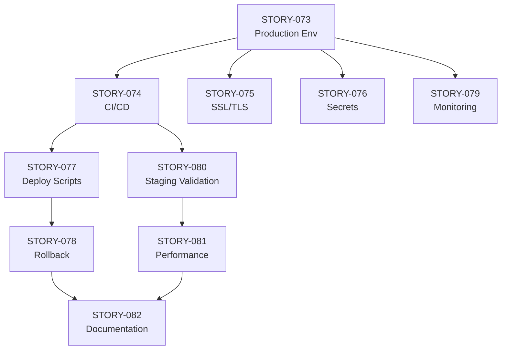

# Sprint 07: Phase 5 Deployment Preparation

## Sprint Information

| Item | Value |
|------|-------|
| **Duration** | 2026-02-05 ~ 2026-02-11 (7 days) |
| **Velocity (Planned)** | 31 pts (10 Stories) |
| **Velocity (Actual)** | - pts (In Progress) |
| **Status** | in_progress |
| **Jira Sprint ID** | - |
| **Objective** | Phase 5 Deployment Preparation & Production Readiness |

---

## Sprint Goals

> **Phase 5 (Deployment) Start - Production Environment Setup & Deployment Automation**

Key Objectives:
1. Production environment configuration
2. CI/CD pipeline setup
3. Security hardening
4. Deployment scripts & documentation
5. Staging environment validation

---

## Sprint 06 Completion Summary

| Item | Result |
|------|--------|
| Stories Completed | 8/8 (100%) |
| Story Points | 20 pts |
| Production Readiness | 95.75% |
| Technical Debt Resolved | 4/4 (100%) |
| Phase 4 Status | Completed |

---

## Backlog

### P0 - Critical (Day 1-2)

| Priority | ID | Jira | Title | Points | Assignee | Status |
|----------|-----|------|-------|--------|----------|--------|
| P0 | STORY-073 | SCRUM-69 | Production Environment Configuration | 5 | Infra | To Do |
| P0 | STORY-074 | SCRUM-70 | CI/CD Pipeline Setup (GitHub Actions) | 5 | DevOps | To Do |

**Subtotal**: 10 pts (2 Stories)

### P1 - High (Day 3-5)

| Priority | ID | Jira | Title | Points | Assignee | Status |
|----------|-----|------|-------|--------|----------|--------|
| P1 | STORY-075 | SCRUM-71 | SSL/TLS Certificate Setup | 3 | Infra | To Do |
| P1 | STORY-076 | SCRUM-72 | Secrets Management (Production) | 3 | DevOps | To Do |
| P1 | STORY-077 | SCRUM-73 | Deployment Scripts Automation | 3 | DevOps | To Do |
| P1 | STORY-078 | SCRUM-74 | Rollback Procedure & Testing | 3 | DevOps | To Do |

**Subtotal**: 12 pts (4 Stories)

### P2 - Medium (Day 5-7)

| Priority | ID | Jira | Title | Points | Assignee | Status |
|----------|-----|------|-------|--------|----------|--------|
| P2 | STORY-079 | SCRUM-75 | Monitoring & Alerting Setup | 3 | DevOps | To Do |
| P2 | STORY-080 | SCRUM-76 | Staging Environment Validation | 2 | QA | To Do |
| P2 | STORY-081 | SCRUM-77 | Performance Baseline Testing | 3 | QA | To Do |
| P2 | STORY-082 | SCRUM-78 | Deployment Documentation Update | 1 | TechLead | To Do |

**Subtotal**: 9 pts (4 Stories)

### Stretch (If Time Permits)

| ID | Title | Points |
|----|-------|--------|
| - | Blue-Green Deployment Strategy | 5 |
| - | Database Migration Automation | 3 |
| - | Backup Automation Enhancement | 2 |

---

## Story Details

### STORY-073: Production Environment Configuration

**Purpose**: Setup production environment for Docker Compose deployment

**Acceptance Criteria**:
- [ ] Production server provisioned (32 cores, 128GB RAM)
- [ ] Docker Engine 24.x installed
- [ ] Docker Compose v2 installed
- [ ] Directory structure created (/opt/knowledge-platform)
- [ ] Network configuration completed
- [ ] Firewall rules configured (80, 443 only exposed)
- [ ] Storage volumes prepared (SSD + HDD)

**Technical Details**:
```
Server: Ubuntu 22.04 LTS
CPU: 32 cores
RAM: 128 GB
Storage: 1TB SSD + 2TB HDD
Network: 10 Gbps
Location: On-premise data center
```

**Owner**: Infra
**SP**: 5
**Dependencies**: None

---

### STORY-074: CI/CD Pipeline Setup (GitHub Actions)

**Purpose**: Automated build, test, and deployment pipeline

**Acceptance Criteria**:
- [ ] Build workflow for all services (Backend, Frontend, AI Service)
- [ ] Unit test execution on PR
- [ ] Integration test execution on merge to develop
- [ ] Docker image build and push to registry
- [ ] Automated deployment to staging on develop branch
- [ ] Manual deployment approval for production
- [ ] Slack notification integration

**Workflow Structure**:
```yaml
.github/workflows/
├── ci.yml              # Build, Test, Lint
├── cd-staging.yml      # Deploy to Staging
├── cd-prod.yml         # Deploy to Production
└── security-scan.yml   # Security scanning
```

**Owner**: DevOps
**SP**: 5
**Dependencies**: STORY-073

---

### STORY-075: SSL/TLS Certificate Setup

**Purpose**: HTTPS configuration for production

**Acceptance Criteria**:
- [ ] SSL certificate obtained (Let's Encrypt or enterprise CA)
- [ ] Certificate installed on Nginx
- [ ] HTTP to HTTPS redirect configured
- [ ] HSTS header enabled
- [ ] Certificate auto-renewal setup (if Let's Encrypt)
- [ ] Certificate expiration monitoring added

**Configuration**:
```nginx
ssl_protocols TLSv1.2 TLSv1.3;
ssl_ciphers ECDHE-ECDSA-AES128-GCM-SHA256:ECDHE-RSA-AES128-GCM-SHA256;
ssl_prefer_server_ciphers on;
ssl_session_cache shared:SSL:10m;
add_header Strict-Transport-Security "max-age=31536000; includeSubDomains" always;
```

**Owner**: Infra
**SP**: 3
**Dependencies**: STORY-073

---

### STORY-076: Secrets Management (Production)

**Purpose**: Secure management of production secrets

**Acceptance Criteria**:
- [ ] All secrets stored outside codebase
- [ ] Environment variables file (.env.production) created
- [ ] Secrets rotation procedure documented
- [ ] No default passwords in production
- [ ] Access to secrets audited and logged
- [ ] Backup of secrets in secure location

**Secrets Checklist**:
| Secret | Generated | Stored | Rotated |
|--------|:---------:|:------:|:-------:|
| DB_PASSWORD | [ ] | [ ] | [ ] |
| NEO4J_PASSWORD | [ ] | [ ] | [ ] |
| MINIO_SECRET_KEY | [ ] | [ ] | [ ] |
| DEEPSEEK_API_KEY | [ ] | [ ] | [ ] |
| JWT_SECRET | [ ] | [ ] | [ ] |
| KEYCLOAK_ADMIN_PASSWORD | [ ] | [ ] | [ ] |

**Owner**: DevOps
**SP**: 3
**Dependencies**: STORY-073

---

### STORY-077: Deployment Scripts Automation

**Purpose**: Automated deployment and management scripts

**Acceptance Criteria**:
- [ ] deploy.sh - Main deployment script
- [ ] rollback.sh - Immediate rollback
- [ ] backup.sh - Database and config backup
- [ ] restore.sh - Restore from backup
- [ ] health-check.sh - Service health verification
- [ ] smoke-test.sh - Basic functionality test
- [ ] All scripts tested in staging

**Script Structure**:
```
infrastructure/docker/scripts/
├── deploy.sh           # Main deployment
├── deploy-staging.sh   # Staging deployment
├── deploy-prod.sh      # Production deployment
├── rollback.sh         # Rollback procedure
├── backup.sh           # Backup all data
├── restore.sh          # Restore from backup
├── health-check.sh     # Health verification
├── smoke-test.sh       # Smoke testing
└── cleanup.sh          # Cleanup old images/containers
```

**Owner**: DevOps
**SP**: 3
**Dependencies**: STORY-074

---

### STORY-078: Rollback Procedure & Testing

**Purpose**: Validated rollback procedure for production issues

**Acceptance Criteria**:
- [ ] Rollback script tested in staging
- [ ] Database rollback procedure documented
- [ ] Rollback time target < 5 minutes
- [ ] Rollback criteria defined
- [ ] Rollback runbook created
- [ ] Team trained on rollback procedure

**Rollback Criteria**:
| Trigger | Action |
|---------|--------|
| Error rate > 5% | Immediate rollback |
| P95 latency > 5s | Investigate, rollback if persists |
| Critical feature failure | Immediate rollback |
| Data corruption | Rollback + DB restore |

**Owner**: DevOps
**SP**: 3
**Dependencies**: STORY-077

---

### STORY-079: Monitoring & Alerting Setup

**Purpose**: Production monitoring and alerting configuration

**Acceptance Criteria**:
- [ ] Prometheus scrape targets configured
- [ ] Grafana dashboards created (System, Application, Database, RAG)
- [ ] Alert rules defined (Critical, Warning, Info)
- [ ] Slack alert integration configured
- [ ] On-call rotation setup
- [ ] SLA dashboard created

**Alert Categories**:
| Category | Threshold | Channel |
|----------|-----------|---------|
| Container Down | Immediate | Slack + Page |
| High Error Rate | > 5% for 5min | Slack |
| High Latency | > 5s P95 for 5min | Slack |
| Low Disk Space | < 15% | Slack |
| High Memory | > 85% for 5min | Slack |

**Owner**: DevOps
**SP**: 3
**Dependencies**: STORY-073

---

### STORY-080: Staging Environment Validation

**Purpose**: Comprehensive staging environment testing before production

**Acceptance Criteria**:
- [ ] All services running healthy
- [ ] E2E test suite passing (192/192)
- [ ] API contract tests passing
- [ ] Security scan passing
- [ ] Performance baseline established
- [ ] Data flow verified (upload -> process -> search)

**Test Suite**:
| Category | Test Count | Target |
|----------|------------|--------|
| Unit Tests | 627 | 100% |
| Integration Tests | 121 | 100% |
| E2E Tests | 192 | 100% |
| Security Tests | 35 | 100% |

**Owner**: QA
**SP**: 2
**Dependencies**: STORY-074

---

### STORY-081: Performance Baseline Testing

**Purpose**: Establish performance baseline before production

**Acceptance Criteria**:
- [ ] Load test with 100 concurrent users
- [ ] Response time baseline documented
- [ ] Throughput baseline documented
- [ ] Resource utilization baseline documented
- [ ] RAG pipeline performance verified
- [ ] Bottlenecks identified and documented

**Performance Targets**:
| Metric | Target | Acceptable |
|--------|--------|------------|
| API Response (P50) | < 500ms | < 1s |
| API Response (P95) | < 2s | < 3s |
| Search Latency (P95) | < 3s | < 5s |
| Throughput | > 100 req/s | > 50 req/s |
| Error Rate | < 0.1% | < 1% |

**Owner**: QA
**SP**: 3
**Dependencies**: STORY-080

---

### STORY-082: Deployment Documentation Update

**Purpose**: Update and finalize deployment documentation

**Acceptance Criteria**:
- [ ] Deployment plan reviewed and approved
- [ ] Runbook completed
- [ ] Troubleshooting guide updated
- [ ] Architecture diagram updated
- [ ] Team training completed

**Documents**:
- `docs/06_deployment/deployment_plan.md` (update)
- `docs/06_deployment/runbook.md` (new)
- `docs/06_deployment/troubleshooting_guide.md` (new)
- `docs/06_deployment/go_live_checklist.md` (new)

**Owner**: TechLead
**SP**: 1
**Dependencies**: All P0/P1 stories

---

## Daily Plan

### Day 1 (2026-02-05, Wed)

| Time | Task | Assignee |
|------|------|----------|
| 09:00 | Sprint 07 Kickoff Standup | PM |
| 09:30 | STORY-073: Server provisioning start | Infra |
| 10:00 | STORY-074: CI/CD design & setup | DevOps |
| 14:00 | STORY-073: Docker installation | Infra |
| 16:00 | Day 1 Review | PM |

### Day 2 (2026-02-06, Thu)

| Time | Task | Assignee |
|------|------|----------|
| 09:00 | Standup Meeting | PM |
| 09:30 | STORY-073: Network & storage setup | Infra |
| 10:00 | STORY-074: Build workflows | DevOps |
| 14:00 | STORY-073: Verification & Done | Infra |
| 16:00 | STORY-074: Test pipeline | DevOps |
| 17:00 | Day 2 Review | PM |

### Day 3 (2026-02-07, Fri)

| Time | Task | Assignee |
|------|------|----------|
| 09:00 | Standup Meeting | PM |
| 09:30 | STORY-075: SSL certificate | Infra |
| 10:00 | STORY-076: Secrets management | DevOps |
| 14:00 | STORY-077: Deployment scripts | DevOps |
| 17:00 | Day 3 Review | PM |

### Day 4 (2026-02-08, Sat) - Optional

| Time | Task | Assignee |
|------|------|----------|
| - | Buffer / Catch-up | - |

### Day 5 (2026-02-10, Mon)

| Time | Task | Assignee |
|------|------|----------|
| 09:00 | Standup Meeting | PM |
| 09:30 | STORY-078: Rollback testing | DevOps |
| 10:00 | STORY-079: Monitoring setup | DevOps |
| 14:00 | STORY-080: Staging validation start | QA |
| 17:00 | Day 5 Review | PM |

### Day 6 (2026-02-11, Tue)

| Time | Task | Assignee |
|------|------|----------|
| 09:00 | Standup Meeting | PM |
| 09:30 | STORY-080: Staging validation complete | QA |
| 10:00 | STORY-081: Performance testing | QA |
| 14:00 | STORY-082: Documentation update | TechLead |
| 16:00 | Sprint Review & Retrospective | PM |
| 17:00 | Sprint 07 Complete | PM |

---

## Definition of Done

Each Story completion criteria:
- [ ] All Acceptance Criteria met
- [ ] Testing completed (if applicable)
- [ ] Code review completed (TechLead)
- [ ] No regression in existing functionality
- [ ] Documentation updated
- [ ] Jira status transitioned to Done
- [ ] Slack completion notification sent

---

## Risks and Mitigation

| Type | Description | Impact | Mitigation | Status |
|------|-------------|--------|------------|--------|
| Risk | Server provisioning delay | High | Early start, have backup plan | Open |
| Risk | SSL certificate issuance delay | Medium | Start early, use self-signed as backup | Open |
| Risk | CI/CD complexity | Medium | Phased approach, use templates | Open |
| Risk | Performance issues in staging | Low | Allocate buffer time for tuning | Open |
| Blocker | None | - | - | - |

---

## Metrics Goals

| Metric | Current | Target | Measurement |
|--------|---------|--------|-------------|
| Phase 5 Progress | 0% | 50% | Story completion |
| Production Readiness | 95.75% | 98% | Checklist |
| CI/CD Coverage | 0% | 100% | Pipeline status |
| Documentation | 80% | 95% | Review |

---

## Dependencies



---

## Deliverables

### Infrastructure
```
infrastructure/docker/
├── docker-compose.prod.yml      # STORY-073: Production overlay
├── .env.production.example      # STORY-076: Secrets template
└── scripts/
    ├── deploy-prod.sh           # STORY-077
    ├── rollback.sh              # STORY-078
    ├── backup.sh                # STORY-077
    └── health-check.sh          # STORY-077
```

### CI/CD
```
.github/workflows/
├── ci.yml                       # STORY-074
├── cd-staging.yml               # STORY-074
├── cd-prod.yml                  # STORY-074
└── security-scan.yml            # STORY-074
```

### Documentation
```
knowledge_service/docs/06_deployment/
├── deployment_plan.md           # STORY-082 (update)
├── runbook.md                   # STORY-082 (new)
├── troubleshooting_guide.md     # STORY-082 (new)
└── go_live_checklist.md         # STORY-082 (new)
```

---

## References

- [Sprint 06 Completion Report](./sprint-06.md)
- [Deployment Plan](../../knowledge_service/docs/06_deployment/deployment_plan.md)
- [Infrastructure Design](../../knowledge_service/docs/02_design/infrastructure_detailed_design.md)
- [DevOps Design](../../knowledge_service/docs/02_design/devops_detailed_design.md)
