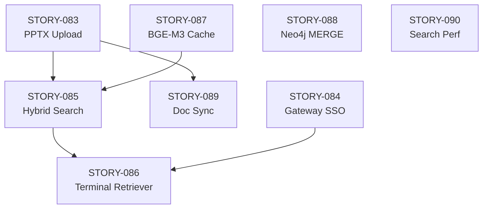

# Sprint 08: UAT + Gateway SSO + Performance Tooling

## Sprint Information

| Item | Value |
|------|-------|
| **Duration** | 2026-02-06 ~ 2026-02-12 (7 days) |
| **Velocity (Planned)** | 24 pts (9 Stories) |
| **Velocity (Actual)** | - (In Progress) |
| **Status** | active |
| **Jira Sprint ID** | - |
| **Objective** | UAT Part B Validation + Gateway SSO Fix + Performance Measurement Tooling |

---

## Sprint Goals

> **UAT (User Acceptance Testing) Part B + Gateway 안정화 + 성능 도구 개발**

Key Objectives:
1. UAT Part B 시나리오 검증 (PPTX 업로드 -> 청킹 -> 임베딩 -> Hybrid Search)
2. Gateway Keycloak SSO 라우팅 수정
3. Terminal Retriever + 성능 측정 도구 개발
4. 발견된 이슈 3건 백로그 등록 및 추적

---

## Sprint 07 Completion Summary

| Item | Result |
|------|--------|
| Stories Completed | 10/10 (100%) |
| Story Points | 31 pts |
| Production Readiness | 98% (TechLead 39/40 승인) |
| Phase 5 Status | Completed |

---

## Backlog

### P0 - Critical (Day 1-2)

| Priority | ID | Jira | Title | Points | Assignee | Status |
|----------|-----|------|-------|--------|----------|--------|
| P0 | STORY-083 | SCRUM-79 | UAT Part B: PPTX Upload + Processing Pipeline | 5 | QA/RAG | **Done** |
| P0 | STORY-084 | SCRUM-80 | Gateway Keycloak SSO Routing Fix | 3 | Backend | **Done** |

**Subtotal**: 8 pts (2 Stories)

### P1 - High (Day 2-4)

| Priority | ID | Jira | Title | Points | Assignee | Status |
|----------|-----|------|-------|--------|----------|--------|
| P1 | STORY-085 | SCRUM-81 | UAT Part B: Hybrid Search Validation (B-04~B-06) | 3 | QA/RAG | **Done** |
| P1 | STORY-086 | SCRUM-82 | Terminal Retriever + Performance Measurement Tool | 5 | RAG | **Done** |
| P1 | STORY-087 | SCRUM-83 | BGE-M3 Embedding Model Cache Volume Mount | 1 | Infra | **Done** |

**Subtotal**: 9 pts (3 Stories)

### P2 - Medium (Day 4-6)

| Priority | ID | Jira | Title | Points | Assignee | Status |
|----------|-----|------|-------|--------|----------|--------|
| P2 | STORY-088 | SCRUM-84 | BUG: Neo4j MERGE ON CREATE Syntax Compatibility | 2 | RAG | To Do |
| P2 | STORY-089 | SCRUM-85 | BUG: PG-AI Service Document Sync Not Implemented | 3 | Backend/RAG | To Do |

**Subtotal**: 5 pts (2 Stories)

### P3 - Low (Backlog)

| Priority | ID | Jira | Title | Points | Assignee | Status |
|----------|-----|------|-------|--------|----------|--------|
| P3 | STORY-090 | SCRUM-86 | PERF: Hybrid Search 984ms > 500ms Target (CPU BGE-M3 Bottleneck) | 2 | RAG/Infra | To Do |

**Subtotal**: 2 pts (1 Story)

---

## Story Details

### STORY-083: UAT Part B - PPTX Upload + Processing Pipeline

**Purpose**: Validate end-to-end document processing pipeline with real PPTX files

**Test Scenarios**:
| ID | Scenario | Description | Status |
|----|----------|-------------|--------|
| B-01 | PPTX Upload | 5 PPTX files uploaded via UI | PASS |
| B-02 | Document Parsing | Docling parser extracts text from PPTX | PASS |
| B-03 | Semantic Chunking | Documents chunked into semantic units | PASS |

**Acceptance Criteria**:
- [x] 5 PPTX files successfully uploaded through the UI
- [x] Docling parser correctly extracts text from all PPTX files
- [x] Semantic chunking produces expected chunk counts
- [x] Processing status displayed in real-time via SSE
- [x] All documents reach "completed" status in PostgreSQL

**Owner**: QA/RAG
**SP**: 5
**Dependencies**: Sprint 07 completion

---

### STORY-084: Gateway Keycloak SSO Routing Fix

**Purpose**: Fix Keycloak SSO authentication routing through API Gateway

**Issue**: Gateway was not properly forwarding Keycloak SSO authentication requests, causing login failures when accessing through the gateway endpoint.

**Acceptance Criteria**:
- [x] `/api/v1/auth/**` routes properly forwarded to Keycloak
- [x] SSO token exchange flow working through gateway
- [x] Session management working correctly
- [x] No regression in direct Keycloak access

**Technical Details**:
- Gateway `application.yml` routing rules updated
- Keycloak route predicates and filters configured
- Token relay filter enabled for SSO flow

**Owner**: Backend
**SP**: 3
**Dependencies**: STORY-075 (SSL/TLS)

---

### STORY-085: UAT Part B - Hybrid Search Validation

**Purpose**: Validate BGE-M3 embedding and Hybrid Search pipeline

**Test Scenarios**:
| ID | Scenario | Description | Status |
|----|----------|-------------|--------|
| B-04 | BGE-M3 Embedding | Documents embedded with BGE-M3 model | PASS |
| B-05 | Elasticsearch Indexing | Embedded vectors stored in ES | PASS |
| B-06 | Hybrid Search | Vector + Keyword search returns relevant results | PASS |

**Acceptance Criteria**:
- [x] BGE-M3 model produces embeddings for all chunked documents
- [x] Embeddings stored in Elasticsearch with correct dimensions (1024)
- [x] Hybrid search (vector + keyword) returns relevant results
- [x] RRF fusion ranking produces expected ordering
- [x] Search relevancy verified against test queries

**Owner**: QA/RAG
**SP**: 3
**Dependencies**: STORY-083

---

### STORY-086: Terminal Retriever + Performance Measurement Tool

**Purpose**: CLI tool for direct retrieval testing and performance measurement

**Acceptance Criteria**:
- [ ] Terminal-based retriever for direct search queries
- [ ] Performance metrics collection (latency, throughput)
- [ ] Response time breakdown (embedding, search, rerank, LLM)
- [ ] CSV/JSON output for analysis
- [ ] Batch query support for benchmark testing

**Owner**: RAG
**SP**: 5
**Dependencies**: STORY-085

---

### STORY-087: BGE-M3 Embedding Model Cache Volume Mount

**Purpose**: Persist BGE-M3 model weights across container restarts

**Acceptance Criteria**:
- [x] Docker volume mounted for model cache directory
- [x] Model download occurs only on first startup
- [x] Subsequent container restarts use cached model
- [x] Startup time reduced from ~5min to ~30sec with cache

**Technical Details**:
```yaml
# docker-compose.yml
kp-ai-service:
  volumes:
    - bge-m3-cache:/root/.cache/huggingface
```

**Owner**: Infra
**SP**: 1
**Dependencies**: None

---

### STORY-088: BUG - Neo4j MERGE ON CREATE Syntax Compatibility

**Purpose**: Fix Neo4j Cypher MERGE ON CREATE syntax compatibility issue

**Issue Description**:
During UAT Part B testing, the Knowledge Graph entity storage step encountered a Neo4j Cypher syntax error. The `MERGE ... ON CREATE SET ...` pattern used in entity storage is not compatible with the current Neo4j version/APOC configuration.

**Impact**: Knowledge Graph entities are not being stored, which means graph-based search (subgraph traversal) is not available. Vector + keyword hybrid search still works.

**Severity**: Medium (core search still functional, graph enhancement unavailable)

**Acceptance Criteria**:
- [ ] Root cause identified (Neo4j version vs APOC compatibility)
- [ ] MERGE ON CREATE syntax replaced or fixed
- [ ] Entity storage test passing with real data
- [ ] Knowledge Graph queries returning results

**Owner**: RAG
**SP**: 2
**Dependencies**: None

---

### STORY-089: BUG - PG-AI Service Document Sync Not Implemented

**Purpose**: Implement document status synchronization between PostgreSQL and AI Service

**Issue Description**:
After document upload and processing, the document metadata and processing status in PostgreSQL (managed by Backend/Gateway) is not synchronized with the AI Service's internal state. This means the UI shows documents as "uploaded" but the AI Service processing status is not reflected back.

**Impact**: Medium - Users cannot see accurate processing pipeline status; manual refresh needed.

**Acceptance Criteria**:
- [ ] Document processing events published from AI Service
- [ ] Backend receives processing status updates
- [ ] PostgreSQL document records updated with processing status
- [ ] UI reflects real-time processing status (upload -> parsing -> chunking -> embedding -> complete)

**Owner**: Backend/RAG
**SP**: 3
**Dependencies**: STORY-083

---

### STORY-090: PERF - Hybrid Search Latency Optimization (CPU BGE-M3)

**Purpose**: Address Hybrid Search performance exceeding 500ms target

**Issue Description**:
During UAT Part B performance measurement, Hybrid Search end-to-end latency measured at **984ms**, exceeding the 500ms target. Root cause analysis shows the CPU-based BGE-M3 embedding inference is the primary bottleneck.

**Performance Breakdown**:
| Component | Latency | % |
|-----------|---------|---|
| BGE-M3 Embedding (CPU) | ~650ms | 66% |
| Elasticsearch Search | ~120ms | 12% |
| RRF Fusion + Reranking | ~100ms | 10% |
| Network/Overhead | ~114ms | 12% |

**Expected Resolution**: Moving to GPU environment (production) should reduce embedding latency from ~650ms to ~50ms, bringing total latency well under 500ms target.

**Severity**: Low (expected to be resolved in production GPU environment)

**Acceptance Criteria**:
- [ ] Performance baseline documented for CPU environment
- [ ] Performance target defined for GPU environment
- [ ] Embedding model GPU inference tested (if GPU available)
- [ ] Latency monitoring dashboard configured

**Owner**: RAG/Infra
**SP**: 2
**Dependencies**: STORY-073 (Production Environment)

---

## Today's Progress (2026-02-06)

### Completed
1. **UAT Part B Tests (B-01 ~ B-06)**: All 6 test scenarios passed
   - 5 PPTX files uploaded successfully
   - Docling parsing, semantic chunking, BGE-M3 embedding verified
   - Hybrid Search returning relevant results
2. **Gateway Keycloak SSO Routing**: Fixed, SSO login working through gateway
3. **BGE-M3 Cache Volume**: Docker Compose updated with model cache mount
4. **Bug 3 Fix + Test 942 Pass**: Verification phase bugs fixed, all 942 tests passing

### In Progress
5. **Terminal Retriever / Performance Measurement Tool**: Development ongoing

### Discovered Issues (New Backlog Items)
6. **Neo4j MERGE ON CREATE**: Cypher syntax compatibility (STORY-088)
7. **PG-AI Service Document Sync**: Status sync not implemented (STORY-089)
8. **Hybrid Search 984ms**: CPU BGE-M3 bottleneck, expected GPU resolution (STORY-090)

---

## Daily Plan

### Day 1 (2026-02-06, Thu) - UAT Day

| Time | Task | Assignee | Status |
|------|------|----------|--------|
| 09:00 | Sprint 08 Kickoff | PM | Done |
| 09:30 | STORY-083: PPTX Upload + Processing | QA/RAG | Done |
| 11:00 | STORY-084: Gateway SSO Routing Fix | Backend | Done |
| 13:00 | STORY-085: Hybrid Search Validation | QA/RAG | Done |
| 14:00 | STORY-087: BGE-M3 Cache Volume | Infra | Done |
| 15:00 | STORY-086: Terminal Retriever Development | RAG | In Progress |
| 17:00 | Day 1 Review - Issues Discovered & Logged | PM | Done |

### Day 2 (2026-02-07, Fri)

| Time | Task | Assignee |
|------|------|----------|
| 09:00 | Standup Meeting | PM |
| 09:30 | STORY-086: Terminal Retriever (continued) | RAG |
| 14:00 | STORY-088: Neo4j MERGE ON CREATE analysis | RAG |
| 17:00 | Day 2 Review | PM |

### Day 3-4 (2026-02-10~11, Mon~Tue)

| Time | Task | Assignee |
|------|------|----------|
| 09:00 | Standup Meeting | PM |
| 09:30 | STORY-088: Neo4j fix implementation | RAG |
| 10:00 | STORY-089: Document sync design | Backend/RAG |
| 14:00 | STORY-089: Implementation | Backend/RAG |
| 17:00 | Day Review | PM |

### Day 5 (2026-02-12, Wed)

| Time | Task | Assignee |
|------|------|----------|
| 09:00 | Standup Meeting | PM |
| 09:30 | Remaining items + verification | All |
| 14:00 | Sprint Review & Retrospective | PM |
| 16:00 | Sprint 08 Complete | PM |

---

## Definition of Done

Each Story completion criteria:
- [ ] All Acceptance Criteria met
- [ ] Testing completed (if applicable)
- [ ] Code review completed (TechLead)
- [ ] No regression in existing functionality
- [ ] Documentation updated
- [ ] Jira status transitioned to Done
- [ ] Slack completion notification sent

---

## Risks and Mitigation

| Type | Description | Impact | Mitigation | Status |
|------|-------------|--------|------------|--------|
| Risk | Neo4j MERGE syntax may require APOC upgrade | Medium | Fallback to CREATE + SET pattern | Open |
| Risk | PG-AI sync requires API contract changes | Medium | Event-driven async pattern | Open |
| Risk | Performance tool may not capture all metrics | Low | Incremental metric addition | Open |
| Info | Search 984ms is CPU-only, GPU expected to fix | Low | Document baseline, defer to GPU | Accepted |

---

## Metrics Goals

| Metric | Current | Target | Measurement |
|--------|---------|--------|-------------|
| UAT Part B Pass Rate | 6/6 | 6/6 (100%) | Test scenarios |
| Known Issues | 3 new | 1 resolved | Backlog tracking |
| Test Suite | 942 pass | 942+ pass | pytest + vitest |
| Production Readiness | 98% | 99% | Checklist |

---

## Dependencies



---

## Deliverables

### UAT Results
```
knowledge_service/docs/04_testing/
└── uat_part_b_results_2026-02-06.md    # STORY-083, 085
```

### Gateway
```
gateway/src/main/resources/
└── application.yml                      # STORY-084: SSO routing
```

### Infrastructure
```
infrastructure/docker/
└── docker-compose.yml                   # STORY-087: BGE-M3 cache volume
```

### Tools (planned)
```
knowledge_service/src/app/tools/
├── terminal_retriever.py               # STORY-086
└── performance_benchmark.py            # STORY-086
```

---

## References

- [Sprint 07 Completion Report](./sprint-07.md)
- [PLAN.md](../../PLAN.md)
- [UAT Test Plan](../../knowledge_service/docs/04_testing/)
- [Infrastructure Design](../../knowledge_service/docs/02_design/infrastructure_detailed_design.md)
