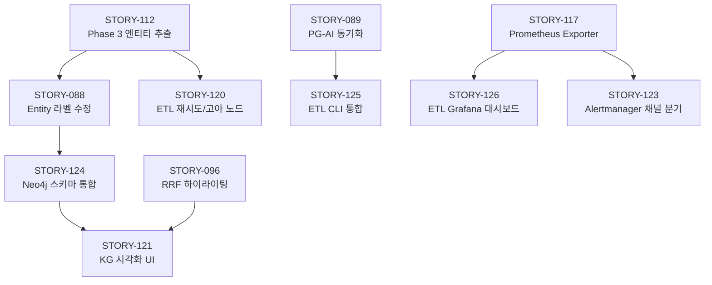

# Sprint 09: Graph RAG 고도화 + 데이터 정합성 + Observability

## Sprint Information

| Item | Value |
|------|-------|
| **Duration** | 2026-03-04 ~ 2026-03-17 (2 weeks) |
| **Velocity (Planned)** | 38 pts (13 Stories) |
| **Velocity (Actual)** | - |
| **Status** | planning |
| **Jira Sprint ID** | - |
| **Objective** | Graph RAG 데이터 구축 + 데이터 정합성 + 검색 품질 고도화 + Observability 완성 |

---

## Sprint Goals

> **Graph RAG 활성화 + 검색 품질 향상 + 운영 안정성 확보**

Key Objectives:
1. Neo4j Phase 3 엔티티 추출 실행 → Graph RAG 데이터 구축
2. PG-AI Service 문서 동기화 구현 → 데이터 정합성 확보
3. RAGAS Precision 0.618 개선 → 검색 품질 향상
4. Prometheus/Alertmanager 완성 → Observability 공백 해소
5. Nori 자동 검증 + RAGAS CI 통합 → 재발 방지 체계 구축

---

## Sprint 09 착수 전 선행 조건

> **반드시 확인 후 착수**

- [ ] **Infra**: Docker 18개 컨테이너 전체 기동 상태 점검 (장기 미가동 가능)
- [ ] **RAG + Backend**: STORY-089/096 API 스펙 합의 세션 진행
- [ ] **ETL + RAG**: Phase 3 실행 전 STORY-088 MERGE 이슈 사전 확인

---

## Backlog

### P0 - Critical (Week 1, Day 1~3)

| Priority | ID | Title | Points | Assignee | Status | Depends On |
|----------|-----|-------|--------|----------|--------|------------|
| P0 | STORY-112 | Phase 3 엔티티 추출 배치 실행 (96K 청크) | 3 | ETL/RAG | **Done** | - |
| P0 | STORY-089 | PG-AI Service 문서 동기화 (Reconciliation + Background Worker) | 5 | ETL/Backend | To Do | - |
| P0 | STORY-113 | Nori 플러그인 자동 검증 (_analyze API 기반) | 2 | QA | **Done** | - |
| P0 | STORY-114 | Init-DB depends_on service_healthy 전면 적용 | 1 | Infra | **Done** | - |

**P0 소계**: 4건, 11 SP

### P1 - High (Week 1~2)

| Priority | ID | Title | Points | Assignee | Status | Depends On |
|----------|-----|-------|--------|----------|--------|------------|
| P1 | STORY-088 | Neo4j Entity 라벨 누락 수정 (neo4j_storage.py + search.py) | 2 | RAG/DB | To Do | STORY-112 |
| P1 | STORY-096 | RRF 하이라이팅 + 소스별 점수 메타데이터 (hybrid_search 경로) | 5 | RAG/Backend/Frontend | To Do | - |
| P1 | STORY-090 | 쿼리 임베딩 캐싱 + BGE-M3 비동기 처리 확인 | 3 | RAG/Backend | To Do | - |
| P1 | STORY-115 | bge-reranker-v2-m3 ONNX 업그레이드 | 2 | RAG | To Do | - |
| P1 | STORY-116 | ES 메모리 512MB → 1GB (docker-compose.yml) | 1 | Infra | To Do | - |
| P1 | STORY-117 | Prometheus Exporter 활성화 (postgres + redis + nginx) | 3 | DevOps/Infra | To Do | - |
| P1 | STORY-118 | RAGAS 베이스라인 측정 + CI/CD 통합 | 3 | QA/DevOps | To Do | - |
| P1 | STORY-119 | RAGAS 종합 리포트 작성 (v1~v10 트렌드) | 3 | Documenter | To Do | - |
| P1 | STORY-120 | ETL 실패 재시도 + 고아 노드 자동 정리 | 3 | ETL | To Do | STORY-112 |

**P1 소계**: 9건, 25 SP

**P0 + P1 합계**: 13건, 36 SP

### P2 - Medium (Sprint 09 후반 or Sprint 10)

| Priority | ID | Title | Points | Assignee | Status | Depends On |
|----------|-----|-------|--------|----------|--------|------------|
| P2 | STORY-121 | KG 시각화 UI — Neo4j 실데이터 연동 (react-force-graph-2d) | 5 | Frontend/WebDesigner | To Do | STORY-112, STORY-088 |
| P2 | STORY-122 | 동적 검색 전략 선택 (rag_workflow.py:682 TODO 해소) | 5 | RAG | To Do | - |
| P2 | STORY-123 | Alertmanager 채널 분기 (팀별 라우팅) | 2 | DevOps | To Do | STORY-117 |
| P2 | STORY-124 | Neo4j 스키마 통합 (v1.0/v2.6 불일치 해소) | 3 | DB/RAG | To Do | STORY-112 |
| P2 | STORY-125 | TD-003 ETL CLI 통합 (7개 스크립트 → etl_cli.py) | 5 | ETL | To Do | STORY-089 |
| P2 | STORY-126 | ETL 파이프라인 전용 Grafana 대시보드 | 3 | DevOps | To Do | STORY-117 |
| P2 | STORY-127 | Gateway 구조 개선 (현재 65점 → 목표 75+) | 5 | Backend/TechLead | To Do | - |

**P2 소계**: 7건, 28 SP

### P3 - Low (Sprint 10 이후)

| Priority | ID | Title | Points | Assignee | Status |
|----------|-----|-------|--------|----------|--------|
| P3 | STORY-097 | Graph RAG A/B 비교 평가 (4-Way vs 3-Way) | 5 | QA/RAG | Deferred |
| P3 | STORY-NEW | Adaptive Gleaning 동적 횟수 조절 | 3 | RAG | Deferred |
| P3 | STORY-NEW | 컨텍스트 압축 레이어 (토큰 -25%) | 5 | RAG | Deferred |
| P3 | STORY-NEW | k6 성능 회귀 테스트 (P95 < 3s 자동 검증) | 3 | QA | Deferred |
| P3 | STORY-NEW | DORA 메트릭 대시보드 | 3 | DevOps | Deferred |
| P3 | STORY-NEW | HWP 파싱 개선 | 3 | ETL | Deferred |
| P3 | STORY-NEW | Frontend MUI → Tailwind 완전 전환 | 8 | Frontend | Deferred |
| P3 | STORY-NEW | initial_data_loader.py 분리 (1,582줄) | 5 | ETL/TechLead | Deferred |
| P3 | STORY-NEW | GPU 임베딩 통합 (65.6 vs 0.7 c/s) | 8 | Infra/RAG | Deferred |
| P3 | STORY-NEW | PG 파티셔닝 (audit_logs, search_history) | 3 | DB | Deferred |
| P3 | STORY-NEW | Semantic Chunker v2 (임베딩 기반 청킹) | 5 | ETL | Deferred |

---

## 작업 의존성

---

## Sprint 09 착수 전 협업 세션 (Week 1 Day 1)

| 세션 | 참여자 | 내용 |
|------|--------|------|
| API 스펙 합의 | RAG + Backend | STORY-089 `/api/v1/documents/sync` 인터페이스, STORY-096 highlight 포맷 |
| Phase 3 사전 확인 | ETL + RAG | MERGE ON CREATE 이슈 범위, 배치 단위(100청크/회) 확정 |
| Infra Health Check | Infra | Docker 18개 컨테이너 전체 기동 상태 점검 |

---

## Redis Freshness 기준 (PM 확정)

- 일반 검색 쿼리: TTL **5분**
- 문서 업로드/삭제 이벤트: 즉시 Cache Eviction
- 임베딩 상태 변경: 해당 문서 관련 캐시 무효화

---

## Daily Plan

### Week 1 (2026-03-04 ~ 2026-03-10)

| Day | 주요 작업 | 담당 |
|-----|---------|------|
| Day 1 | Infra Health Check + 협업 세션 + P0 착수 | 전원 |
| Day 2~3 | STORY-112 Phase 3 실행, STORY-089 설계 | ETL/RAG/Backend |
| Day 4~5 | STORY-089 구현, STORY-113/114 완료 | ETL/Backend/QA/Infra |
| Day 5 | Week 1 리뷰 | PM |

### Week 2 (2026-03-11 ~ 2026-03-17)

| Day | 주요 작업 | 담당 |
|-----|---------|------|
| Day 6~7 | P1 핵심: STORY-088, 096, 090 | RAG/Backend/Frontend |
| Day 8~9 | P1 나머지: STORY-115~120 | 전 팀 |
| Day 10 | Sprint Review + Retrospective | PM |

---

## Definition of Done

- [ ] Acceptance Criteria 전항목 충족
- [ ] 테스트 완료 (TEST_MODE=docker, Mock 금지)
- [ ] TechLead 코드 리뷰 완료
- [ ] 기존 기능 회귀 없음
- [ ] 문서 업데이트 완료
- [ ] Slack 완료 알림 전송

---

## Risks and Mitigation

| Risk | Impact | Mitigation |
|------|--------|------------|
| Phase 3 DeepSeek API 비용 초과 | Medium | 배치 100청크/회, 비용 모니터링 |
| Docker 환경 미기동 상태 | High | Sprint 착수 전 Infra Health Check 선행 |
| STORY-096 Frontend-RAG 인터페이스 불일치 | Medium | Week 1 Day 1 API 스펙 합의 세션 |
| STORY-090 CPU 한계 (984ms) | Low | 캐싱으로 체감 개선, 근본 해결은 GPU 전환 후 |

---

## Metrics Goals

| Metric | Current | Target | Measurement |
|--------|---------|--------|-------------|
| RAGAS Mean | 0.711 | 0.75+ | RAGAS 평가 |
| RAGAS Precision | 0.618 | 0.70+ | RAGAS 평가 |
| Neo4j Entity 수 | 0개 | 10,000+ | Neo4j 쿼리 |
| Hybrid Search P95 | 984ms | 700ms 이하 (캐싱 적용) | Terminal Retriever |
| Test Coverage | 97% | 97%+ 유지 | pytest |

---

## References

- [Sprint 08 완료 보고](./sprint-08.md)
- [고도화 스탠드업 기록](../../work_logs/03_standups/2026/03-March/2026-03-04_고도화_스탠드업.md)
- [ETL 3-Phase 운영 가이드](../../knowledge_service/docs/07_maintenance/22_etl_3phase_operations_guide.md)
- [인프라 설계서](../../knowledge_service/docs/02_design/10_infrastructure_detailed_design.md)
