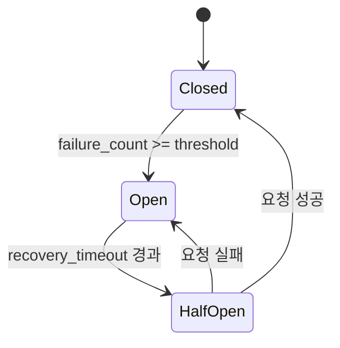

# STORY-061: 파이프라인 타임아웃 + Circuit Breaker

## 메타데이터

| 항목 | 값 |
|------|-----|
| **Jira ID** | SCRUM-51 |
| **Epic** | EPIC-002 |
| **Status** | Done |
| **Priority** | Medium |
| **Story Points** | 3 |
| **Assignee** | RAG |
| **Sprint** | 4 |

---

## User Story

**As a** RAG 시스템 운영자,
**I want** 파이프라인 노드별 타임아웃과 외부 서비스 장애 시 Circuit Breaker가 동작,
**So that** 단일 노드 지연이 전체 시스템을 마비시키지 않고, 외부 서비스 장애가 전파되지 않음.

---

## Acceptance Criteria

- [ ] **Given** RetrieverNode가 Elasticsearch 응답을 30초 이상 대기, **When** 타임아웃 초과, **Then** TimeoutError와 함께 graceful 실패 처리 및 사용자에게 재시도 안내
- [ ] **Given** GeneratorNode가 LLM API 응답을 60초 이상 대기, **When** 타임아웃 초과, **Then** 부분 응답 반환 또는 타임아웃 메시지 전송
- [ ] **Given** Elasticsearch가 연속 5회 실패, **When** Circuit Breaker가 Open 상태, **Then** 즉시 fallback 응답("검색 서비스 일시 중단") 반환하고 ES 호출 차단
- [ ] **Given** Circuit Breaker Open 후 30초 경과, **When** Half-Open 상태 진입, **Then** 1회 시도 후 성공 시 Closed, 실패 시 Open 유지
- [ ] **Given** 노드별 타임아웃 설정, **When** 설정 파일에서 변경, **Then** 재시작 없이 또는 재시작 후 반영

---

## Tasks

- [ ] 노드별 타임아웃 설정 체계 구현 (config.py)
  - Planner: 10초
  - Retriever: 30초
  - Reranker: 20초
  - Generator: 60초
- [ ] asyncio.wait_for() 래핑으로 노드별 타임아웃 적용
- [ ] TimeoutError 핸들링 및 사용자 친화적 에러 메시지
- [ ] Circuit Breaker 패턴 구현 (Closed/Open/Half-Open 상태)
- [ ] Elasticsearch용 Circuit Breaker 적용
- [ ] Neo4j용 Circuit Breaker 적용
- [ ] LLM API용 Circuit Breaker 적용
- [ ] Circuit Breaker 상태 메트릭 로깅 (Prometheus 연동 가능)
- [ ] Fallback 응답 전략 정의 (서비스별)
- [ ] 타임아웃/Circuit Breaker 설정 외부화

---

## 기술 노트

### 문제점 (Sprint 03 리뷰에서 도출)

Sprint 03 파이프라인에 장애 대응 메커니즘이 부재:

1. **타임아웃 없음** - ES/Neo4j/LLM 응답 무한 대기 시 전체 파이프라인이 행(hang) 상태
2. **장애 전파** - 하나의 외부 서비스가 느려지면 모든 요청이 지연
3. **Cascading failure** - ES 장애 시 모든 요청이 타임아웃까지 대기 후 실패

### 타임아웃 구현

```python
import asyncio

class TimeoutNode:
    """타임아웃이 적용된 노드 래퍼"""

    def __init__(self, node, timeout_seconds: float):
        self.node = node
        self.timeout = timeout_seconds

    async def execute(self, state):
        try:
            return await asyncio.wait_for(
                self.node.execute(state),
                timeout=self.timeout
            )
        except asyncio.TimeoutError:
            logger.error(f"{self.node.__class__.__name__} timeout: {self.timeout}s")
            return self._fallback_response(state)
```

### Circuit Breaker 구현

```python
from enum import Enum
import time

class CircuitState(Enum):
    CLOSED = "closed"       # 정상 - 요청 통과
    OPEN = "open"           # 차단 - 요청 거부
    HALF_OPEN = "half_open" # 시험 - 1회 허용

class CircuitBreaker:
    def __init__(
        self,
        failure_threshold: int = 5,
        recovery_timeout: float = 30.0,
        name: str = "default"
    ):
        self.state = CircuitState.CLOSED
        self.failure_count = 0
        self.failure_threshold = failure_threshold
        self.recovery_timeout = recovery_timeout
        self.last_failure_time = 0
        self.name = name

    async def call(self, func, *args, **kwargs):
        if self.state == CircuitState.OPEN:
            if time.time() - self.last_failure_time > self.recovery_timeout:
                self.state = CircuitState.HALF_OPEN
            else:
                raise CircuitBreakerOpenError(f"{self.name} circuit is OPEN")

        try:
            result = await func(*args, **kwargs)
            self._on_success()
            return result
        except Exception as e:
            self._on_failure()
            raise

    def _on_success(self):
        self.failure_count = 0
        self.state = CircuitState.CLOSED

    def _on_failure(self):
        self.failure_count += 1
        self.last_failure_time = time.time()
        if self.failure_count >= self.failure_threshold:
            self.state = CircuitState.OPEN
            logger.warning(f"{self.name} circuit OPENED after {self.failure_count} failures")
```

### 상태 전이 다이어그램



### 영향 범위

- `ai_service/resilience/timeout.py` - 신규: 타임아웃 래퍼
- `ai_service/resilience/circuit_breaker.py` - 신규: Circuit Breaker
- `ai_service/workflow/langgraph_workflow.py` - 노드에 래퍼 적용
- `ai_service/config.py` - 타임아웃/CB 설정

---

## 테스트 계획

- [ ] Unit Test: 노드 타임아웃 초과 시 TimeoutError 발생
- [ ] Unit Test: Circuit Breaker Closed -> Open 전이
- [ ] Unit Test: Circuit Breaker Open -> Half-Open -> Closed 복구
- [ ] Unit Test: Fallback 응답 정상 반환
- [ ] Integration Test: ES 연결 실패 시 Circuit Breaker 동작
- [ ] Load Test: 동시 요청 + 외부 서비스 지연 시나리오

---

## 참고 자료

- Sprint 03 완료 리뷰에서 도출 - 장애 대응 메커니즘 부재
- [STORY-033 LangGraph Workflow](./STORY-033-langgraph-workflow.md)
- [Circuit Breaker Pattern](https://martinfowler.com/bliki/CircuitBreaker.html)
- [Python asyncio.wait_for](https://docs.python.org/3/library/asyncio-task.html#asyncio.wait_for)
