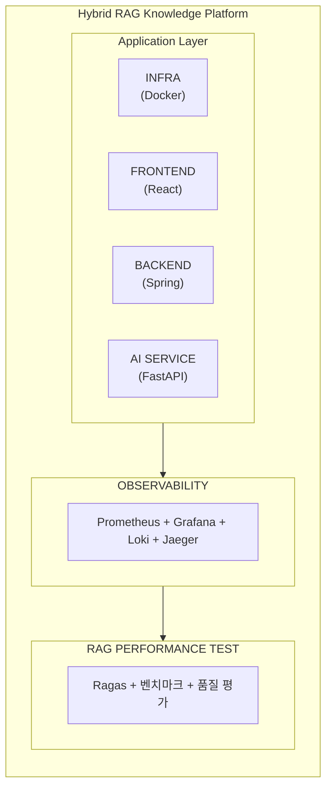
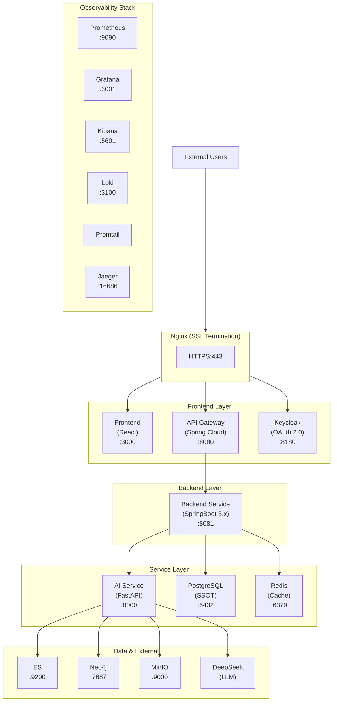
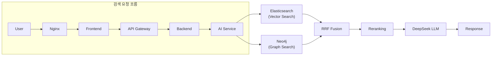
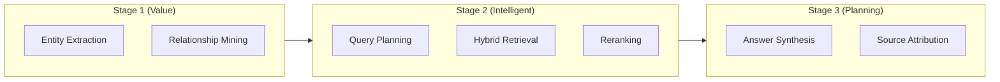
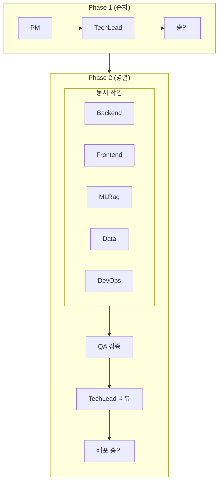
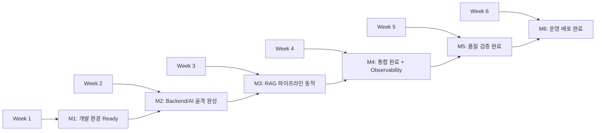
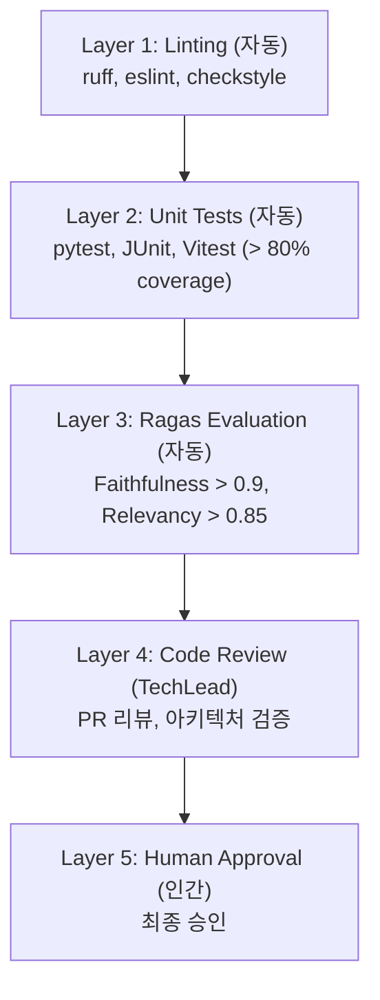
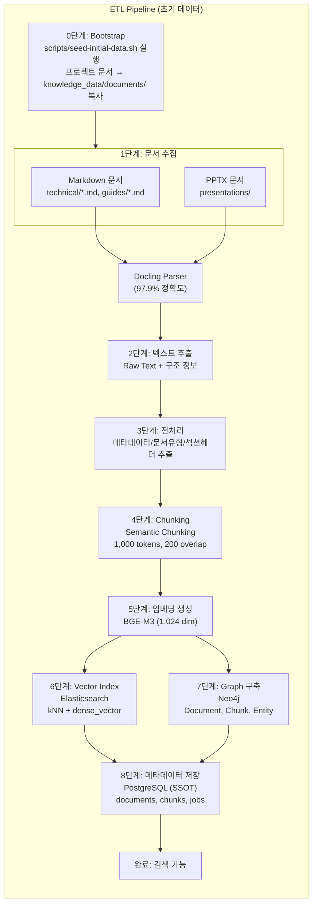

# Hybrid RAG Knowledge Ops 프로젝트 수행 계획서

> **[현행화 정보]**
> - **최종 현행화**: 2026-02-20
> - **프로젝트 상태**: 종료 (2026-02-18)
> - **문서 상태**: 일부 outdated
> - **주요 변경사항**: 6주 6스프린트 계획 → 실제 38일 12스프린트로 실행됨. K8s 미구현. 소스코드 리뷰 B+ (72.5/100). RAGAS 최종 A- (Faithfulness 0.935).

**프로젝트**: Hybrid RAG Knowledge Operations Platform
**버전**: 2.4
**작성일**: 2026-01-21
**목적**: 프로젝트 전체 범위 및 수행 계획 정의

---

## 목차

1. [Executive Summary](#1-executive-summary)
2. [프로젝트 현황](#2-프로젝트-현황)
3. [프로젝트 범위 (Full Scope)](#3-프로젝트-범위-full-scope)
4. [시스템 아키텍처](#4-시스템-아키텍처)
5. [기술 스택](#5-기술-스택)
6. [구축 영역별 상세](#6-구축-영역별-상세)
7. [가상 팀 구성](#7-가상-팀-구성)
8. [6주 로드맵](#8-6주-로드맵)
9. [품질 관리](#9-품질-관리)
10. [위험 관리](#10-위험-관리)
11. [비용 계획](#11-비용-계획)
12. [설계 문서 참조](#12-설계-문서-참조)

---

## 1. Executive Summary

### 1.1 프로젝트 비전

**"기업 지식의 80%가 잠들어 있는 문서에서, AI가 즉시 답을 찾아드립니다"**

Hybrid RAG Knowledge Platform은 Vector Search + Graph Search를 결합한 차세대 지식 검색 시스템입니다.

### 1.2 핵심 가치 제안

| 영역 | 가치 |
|------|------|
| **비용 효율성** | DeepSeek V3.2로 LLM 비용 95% 절감 (연간 ~$14,000) |
| **정확한 검색** | Vector + Graph 융합, RRF 재순위, Gleaning (+33%) |
| **기업 보안** | Keycloak OAuth 2.0, AES-256 암호화, RBAC |
| **확장 가능성** | Docker Compose → K8s 마이그레이션 준비 |
| **관측 가능성** | Prometheus + Grafana + Kibana + Loki + Jaeger |

### 1.3 주요 목표 수치

| 항목 | 목표 | 비고 |
|------|------|------|
| 응답 시간 | < 3초 (P95) | Hybrid 검색 + 답변 생성 |
| 검색 정확도 | > 85% (Precision@5) | 상위 5개 결과 기준 |
| Faithfulness | > 0.9 | Ragas 평가 |
| Answer Relevancy | > 0.85 | Ragas 평가 |
| 가용성 | 99.9% | 월 43분 다운타임 허용 |
| 동시 사용자 | 100명 | 1단계 목표 |
| 테스트 커버리지 | > 80% | Backend/AI Service |

> **[현행화 메모]**: 실제 달성 결과 — RAGAS Faithfulness 0.935 (목표 초과 달성), Context Precision 0.618 (목표 미달), Answer Relevancy 미측정. Python 테스트 커버리지 97% (목표 초과). 동시 사용자 부하 테스트는 프로젝트 범위 외로 미실시.

---

## 2. 프로젝트 현황

### 2.1 진행 상태

```
Phase 1: 기획 ████████████████████ 100% ✅
Phase 2: 설계 ████████████████████ 100% ✅ (9.1/10)
Phase 3: 구현 ░░░░░░░░░░░░░░░░░░░░   0% 🔜
Phase 4: 테스트 ░░░░░░░░░░░░░░░░░░░░   0%
Phase 5: 배포 ░░░░░░░░░░░░░░░░░░░░   0%
```

> **[현행화 메모]**: 문서 작성 시점(2026-01-21)의 초기 상태를 반영하고 있습니다. 실제 프로젝트 종료(2026-02-18) 시점의 최종 상태는 다음과 같습니다:
> - Phase 1~5 전 단계 100% 완료
> - 총 12 스프린트 실행 (6주 계획 → 실제 38일)
> - 소스코드 리뷰: B+ 72.5/100 (Gateway 65, Backend 72, AI Service 78, Frontend 75)
> - RAGAS 최종: A- (Faithfulness 0.935, Context Precision 0.618, Context Recall 0.672)

### 2.2 완료된 설계 문서 (14개)

| 문서 | 버전 | 상태 |
|------|------|------|
| hybrid_rag_platform_detailed_design | 2.4 | ✅ Approved |
| infrastructure_detailed_design | 2.0 | ✅ Approved |
| backend_detailed_design | 1.2 | ✅ Approved |
| frontend_detailed_design | 1.2 | ✅ Approved |
| api_integration_design | 1.2 | ✅ Draft |
| authentication_authorization_detailed_design | 1.1 | ✅ Draft |
| data_encryption_design | 1.0 | ✅ Draft |
| observability_detailed_design | 1.0 | ✅ Draft |
| devops_detailed_design | 1.0 | ✅ Draft |
| rag_performance_test_design | 1.0 | ✅ Draft |
| error_code_standards | 1.1 | ✅ Draft |
| ui_design_system_guide | 1.1 | ✅ Draft |
| integrated_detailed_design | 1.1 | ✅ Draft |
| glossary | 3.0 | ✅ Draft |

---

## 3. 프로젝트 범위 (Full Scope)

### 3.1 구축 영역 개요



### 3.2 구축 영역 상세

| # | 영역 | 설명 | 설계서 |
|:-:|------|------|--------|
| 1 | **Infrastructure** | Docker Compose 기반 18개 컨테이너 | infrastructure_detailed_design.md |
| 2 | **Frontend** | React 18 기반 SPA, 21개 섹션 | frontend_detailed_design.md |
| 3 | **Backend** | SpringBoot 3.5+, 23개 섹션 | backend_detailed_design.md |
| 4 | **AI Service** | FastAPI + LangGraph 1.0+, Hybrid RAG | hybrid_rag_platform_detailed_design.md |
| 5 | **API Integration** | External + Internal API | api_integration_design.md |
| 6 | **Auth/AuthZ** | Keycloak OAuth 2.0, RBAC | authentication_authorization_detailed_design.md |
| 7 | **Observability** | Metrics + Logs + Traces | observability_detailed_design.md |
| 8 | **RAG Performance Test** | Ragas 평가, 벤치마크 | rag_performance_test_design.md |
| 9 | **DevOps** | Git 전략, CI/CD | devops_detailed_design.md |
| 10 | **Security** | 암호화, 보안 정책 | data_encryption_design.md |

> **[현행화 메모]**: 실제 구현 범위 조정 내용:
> - K8s 마이그레이션: 미구현 (Docker Compose 유지, K8s 백업 계획은 기술 검토 문서에 작성됨)
> - Security (AES-256, RBAC 세부 구현): 기본 Keycloak OAuth2만 구현, 고급 암호화 미구현
> - DevOps CI/CD: GitHub Actions 기본 구성, 고급 파이프라인 미구현
> - Frontend i18n, PWA, Storybook: 미구현 (범위 조정)
> - Backend Saga 패턴, Liquibase: 미구현

### 3.3 기능 범위

#### 3.3.1 사용자 기능

| 기능 | 설명 | 우선순위 |
|------|------|:--------:|
| **대시보드** | 인기 지식, 최신 지식, 추천, 통계 | P0 |
| **지식 검색 (채팅)** | RAG 기반 대화형 검색 | P0 |
| **지식 검색 (키워드)** | 전통적 키워드 검색 | P0 |
| **지식 관리** | CRUD, 버전 관리, 유효기간 | P0 |
| **문서 변환** | Excel, PPT, PDF 내보내기 | P1 |
| **개인화** | 프로필, 북마크, 검색 기록 | P1 |
| **관리자** | 사용자 관리, 시스템 설정 | P1 |

#### 3.3.2 비기능 요구사항

| 영역 | 요구사항 |
|------|----------|
| **성능** | 응답 < 3초, 동시 100명 |
| **가용성** | 99.9% SLA |
| **보안** | OAuth 2.0, RBAC, AES-256 |
| **관측 가능성** | Metrics, Logs, Traces |
| **품질** | 테스트 커버리지 > 80% |

---

## 4. 시스템 아키텍처

### 4.1 전체 시스템 구조



### 4.2 서비스 분리 원칙

| 서비스 | 역할 | 기술 | 직접 LLM 호출 |
|--------|------|------|:-------------:|
| **Frontend** | UI/UX | React 18, TypeScript | ❌ |
| **API Gateway** | 인증, 라우팅, Rate Limit | Spring Cloud Gateway | ❌ |
| **Backend** | 비즈니스 로직, CRUD | SpringBoot 3.x, JPA | ❌ |
| **AI Service** | AI 처리, 검색, 임베딩 | FastAPI, LangGraph | ✅ |

> **중요**: SpringBoot는 LLM/임베딩 모델과 직접 연동하지 않습니다.

### 4.3 데이터 흐름



---

## 5. 기술 스택

### 5.1 Application Layer

| 계층 | 기술 | 버전 | 용도 |
|------|------|------|------|
| **Frontend** | React | 18.3+ | UI 라이브러리 |
| | TypeScript | 5.4+ | 타입 안정성 |
| | Tailwind CSS | 3.4+ | 유틸리티 CSS 프레임워크 |
| | Headless UI | 2.x | 접근성 지원 컴포넌트 |
| | Heroicons | 2.x | 아이콘 라이브러리 |
| | Redux Toolkit | 2.x | 상태 관리 |
| | React Query | 5.x | 서버 상태 |
| | Vite | 5.x | 빌드 도구 |
| **Backend** | Spring Boot | 3.5+ | 프레임워크 |
| | Spring Cloud Gateway | 4.x | API Gateway |
| | Spring Security | 6.x | 보안 |
| | Spring Data JPA | 3.x | ORM |
| | Resilience4j | 2.x | Circuit Breaker |
| | Gradle | 8.x | 빌드 |
| **AI Service** | FastAPI | 0.115+ | API 프레임워크 |
| | LangGraph | 1.0+ | 에이전트 오케스트레이션 |
| | LangChain | 1.2+ | LLM 통합 |
| | langchain-core | 1.2+ | LangChain 코어 |
| | langchain-community | 0.4+ | 커뮤니티 통합 |
| | Docling | 2.60+ | 문서 파싱 (PDF, PPTX) |
| | BGE-M3 | BAAI/bge-m3 | 임베딩 (1024-dim) |
| **Auth** | Keycloak | 26.x | OAuth 2.0 Provider |

### 5.2 Data Layer

| 기술 | 버전 | 용도 |
|------|------|------|
| **PostgreSQL** | 16+ (17 권장) | SSOT (메인 DB) |
| **Elasticsearch** | 8.11+ | Vector Search |
| **Neo4j** | 5.26 LTS | Graph Search |
| **Redis** | 7.x | 캐싱, 세션 |
| **MinIO** | Latest | 파일 스토리지 |

### 5.3 Observability Stack

| 기술 | 용도 |
|------|------|
| **Prometheus** | Metrics 수집 |
| **Grafana** | 시각화, 대시보드 |
| **Kibana** | ES 데이터 시각화, 쿼리 도구 |
| **Loki** | Log 집계 |
| **Promtail** | Log 수집 |
| **Jaeger** | Distributed Tracing |

### 5.4 External Services

| 서비스 | 용도 | 비용 |
|--------|------|------|
| **DeepSeek V3.2** | LLM (Chat, Reasoning) | $0.27/M tokens |

---

## 6. 구축 영역별 상세

### 6.1 Infrastructure (18개 컨테이너)

```yaml
# Docker Compose 서비스 목록

# Application Layer (6개)
- nginx           # 리버스 프록시, SSL
- frontend        # React SPA
- api-gateway     # Spring Cloud Gateway
- backend         # SpringBoot Backend
- ai-service      # FastAPI AI Service
- keycloak        # OAuth 2.0 Provider

# Data Layer (5개)
- postgresql      # 메인 데이터베이스
- elasticsearch   # Vector Search
- neo4j           # Graph Search
- redis           # 캐싱
- minio           # 파일 스토리지

# Observability Layer (6개)
- prometheus      # 메트릭 수집
- grafana         # 대시보드
- kibana          # ES 시각화, 쿼리 도구
- loki            # 로그 집계
- promtail        # 로그 수집
- jaeger          # 분산 트레이싱

# Utility (2개)
- init-keycloak   # Keycloak 초기화
- backup          # 백업 작업
```

### 6.2 Frontend (React 18)

| 기능 영역 | 주요 컴포넌트 |
|----------|--------------|
| **대시보드** | StatCard, RecentKnowledge, PopularKnowledge |
| **검색 (채팅)** | ChatInterface, MessageBubble, StreamingResponse |
| **검색 (키워드)** | SearchBar, SearchFilters, SearchResults |
| **지식 관리** | KnowledgeEditor, MarkdownPreview, FileUpload |
| **개인화** | Profile, Bookmarks, SearchHistory |
| **관리자** | UserManagement, SystemSettings, Analytics |

**특징:**
- 21개 섹션 설계 (frontend_detailed_design.md)
- Storybook 컴포넌트 문서화
- PWA 지원
- i18n (한국어/영어)

### 6.3 Backend (SpringBoot 3.x)

| 모듈 | 패키지 | 역할 |
|------|--------|------|
| **api-gateway** | `gateway.*` | 라우팅, 인증, Rate Limit |
| **backend-service** | `knowledge.*` | 지식 관리 |
| | `search.*` | 검색 서비스 |
| | `user.*` | 사용자 관리 |
| | `export.*` | 문서 변환 |
| | `admin.*` | 관리자 기능 |

**특징:**
- 23개 섹션 설계 (backend_detailed_design.md)
- SSE Streaming (AI 응답)
- Saga 패턴 (분산 트랜잭션)
- Prometheus Metrics
- Liquibase Migration

### 6.4 AI Service (FastAPI + LangGraph)

| 파이프라인 | 설명 |
|-----------|------|
| **Hybrid Search** | Elasticsearch + Neo4j + RRF Fusion |
| **Gleaning** | 다중 추출 (+33% 품질) |
| **Answer Synthesis** | DeepSeek 기반 답변 생성 |
| **Entity Extraction** | 엔티티/관계 추출 |
| **Document Parsing** | Docling (97.9% 정확도) |

**VIP 3단계 아키텍처:**



### 6.5 Observability

| Pillar | 도구 | 보관 기간 |
|--------|------|----------|
| **Metrics** | Prometheus | 30일 |
| **Logs** | Loki | 30일 |
| **ES 시각화** | Kibana | - |
| **Traces** | Jaeger (ES) | 7일 |

**주요 대시보드:**
- System Overview
- API Performance
- RAG Quality Metrics
- Error Analysis
- SLA Monitoring

### 6.6 RAG Performance Test

| 카테고리 | 지표 |
|----------|------|
| **검색 품질** | Precision@K, Recall@K, MRR, NDCG |
| **생성 품질** | Faithfulness, Answer Relevancy, Context Precision |
| **E2E 품질** | End-to-End Accuracy, Response Latency |

**Ragas 평가:**
```python
from ragas import evaluate
from ragas.metrics import faithfulness, answer_relevancy

scores = evaluate(test_set, metrics=[faithfulness, answer_relevancy])
# 품질 게이트: faithfulness > 0.9, answer_relevancy > 0.85
```

---

## 7. 가상 팀 구성

### 7.1 팀 구조

**당신(1명) + 가상 팀원(9명) = 완전 자동화된 개발팀**

> **[현행화 메모]**: 최종 팀 구성은 13개 AI 에이전트로 확장됨 (초기 9명 → 최종 13명). 추가된 에이전트: software-architect (arch), infra-engineer (infra), etl-engineer (etl), database-designer (db). 2026-02-18 모델 최적화 적용: tech-lead, software-architect는 Opus 4.6 유지, 나머지 11개는 Sonnet 4.6 전환.

| # | 역할 | 주요 책임 | 작업 영역 | Antigravity 협업 |
|:-:|------|----------|----------|-----------------|
| 1 | **PM** | 요구사항 -> 스펙 변환, 작업 조율 | specs/ | 에이전트 할당, 품질 게이트 관리 |
| 2 | **TechLead** | 아키텍처 검토, 코드 리뷰 | docs/ | AI 코드 리뷰어 |
| 3 | **Backend** | SpringBoot, API Gateway | backend/ | - |
| 4 | **Frontend** | Antigravity 코드 통합, 품질 검증 | frontend/ | 코드 검증자 |
| 5 | **MLRag** | RAG 파이프라인, 평가 | ai-service/ | - |
| 6 | **Data** | ETL, Graph, DB | etl/, graph/ | - |
| 7 | **QA** | 테스트, Ragas 평가 | tests/ | - |
| 8 | **DevOps** | Docker, CI/CD, 모니터링 | infrastructure/ | - |
| 9 | **WebDesigner** | AI 프롬프트 설계, 디자인 디렉션 | design/ | 프롬프트 설계자 |

### 7.2 협업 패턴



### 7.3 Antigravity 협업 워크플로우 (신규 UI)

**2026-01-25 도입**: Tailwind CSS + Antigravity + Stitch MCP


**작업 유형별 에이전트 할당**:

| 작업 유형 | 1차 담당 | 2차 담당 | 비고 |
|----------|---------|---------|------|
| 신규 UI 컴포넌트 | WebDesigner | Frontend | Antigravity 프롬프트 -> 검증 |
| 기존 컴포넌트 전환 | Frontend | WebDesigner | MUI -> Tailwind 전환 |
| 디자인 시스템 변경 | WebDesigner | TechLead | 전체 영향도 검토 |
| AI 생성 코드 리뷰 | TechLead | Frontend | 품질 게이트 |

---

## 8. 6주 로드맵

### 8.1 전체 일정

| 주차 | 스프린트 | 주요 작업 | 담당 |
|:----:|----------|----------|------|
| **Week 1** | Sprint 1 | 인프라 구축 + 개발 환경 | DevOps, Backend, Frontend |
| **Week 2** | Sprint 2 | Backend 핵심 + AI Service 기반 | Backend, MLRag, Data |
| **Week 3** | Sprint 3 | RAG 파이프라인 + Frontend 기반 | MLRag, Frontend, Data |
| **Week 4** | Sprint 4 | 통합 + Observability | All |
| **Week 5** | Sprint 5 | RAG Performance Test + 최적화 | QA, MLRag |
| **Week 6** | Sprint 6 | 배포 + 문서화 | DevOps, TechLead |

> **[현행화 메모]**: 실제 로드맵은 6주 6스프린트 계획 대비 38일 12스프린트로 실행되었습니다. Sprint 1~7은 핵심 구현 및 배포, Sprint 8~12는 RAGAS 평가/최적화, ETL 3-Phase 파이프라인, 사용자 테스트, 산출물 최종화에 집중. Sprint 6 배포는 Production-Ready 달성 (TechLead 승인), 단 실제 서버 배포는 미진행(로컬 Docker Compose 환경).

### 8.2 스프린트별 목표

#### Sprint 1: 인프라 구축 (Week 1)

| 작업 | 산출물 | 완료 조건 |
|------|--------|----------|
| Docker Compose 환경 | docker-compose.yml | 18개 컨테이너 기동 |
| Keycloak 설정 | Realm, Client 설정 | OAuth 2.0 로그인 |
| DB 스키마 초기화 | Liquibase scripts | PostgreSQL 테이블 생성 |
| 개발 환경 가이드 | README 업데이트 | 로컬 개발 가능 |

#### Sprint 2: Backend + AI Service 기반 (Week 2)

| 작업 | 산출물 | 완료 조건 |
|------|--------|----------|
| API Gateway | Spring Cloud Gateway | JWT 검증, 라우팅 |
| Backend CRUD | Knowledge, User API | 단위 테스트 통과 |
| AI Service 골격 | FastAPI 엔드포인트 | Health check |
| ES/Neo4j 연결 | Client 구현 | 연결 테스트 통과 |

#### Sprint 3: RAG 파이프라인 + Frontend (Week 3)

| 작업 | 산출물 | 완료 조건 |
|------|--------|----------|
| Hybrid Retrieval | ES + Neo4j + RRF | 검색 결과 반환 |
| Gleaning | 다중 추출 파이프라인 | 엔티티 추출 |
| Frontend 기반 | 로그인, 대시보드, 검색 UI | 화면 렌더링 |
| SSE Streaming | 실시간 응답 | 스트리밍 동작 |

#### Sprint 4: 통합 + Observability (Week 4)

| 작업 | 산출물 | 완료 조건 |
|------|--------|----------|
| E2E 통합 | 전체 플로우 연결 | 검색→응답 성공 |
| Prometheus/Grafana | 메트릭 대시보드 | 모니터링 가시성 |
| Loki/Jaeger | 로그/트레이스 | 추적 가능 |
| 통합 테스트 | E2E 테스트 | 80% 시나리오 통과 |

#### Sprint 5: RAG Performance Test (Week 5)

| 작업 | 산출물 | 완료 조건 |
|------|--------|----------|
| Ragas 평가 | 품질 리포트 | Faithfulness > 0.9 |
| 성능 테스트 | 부하 테스트 결과 | P95 < 3초 |
| 최적화 | 튜닝 적용 | 목표 달성 |
| 보안 테스트 | 취약점 스캔 | Critical 0개 |

#### Sprint 6: 배포 + 문서화 (Week 6)

| 작업 | 산출물 | 완료 조건 |
|------|--------|----------|
| Staging 배포 | 테스트 환경 | 안정 동작 |
| Production 배포 | 운영 환경 | 배포 완료 |
| 운영 문서 | 가이드 | 인수인계 가능 |
| 교육 자료 | 사용자 매뉴얼 | 교육 가능 |

### 8.3 주요 마일스톤



---

## 9. 품질 관리

### 9.1 5-Layer Quality Gate



### 9.2 자동화된 품질 검사

| 도구 | 대상 | 기준 |
|------|------|------|
| **ruff** | Python | 에러 0개 |
| **mypy** | Python | 타입 체크 통과 |
| **ESLint** | TypeScript | 에러 0개 |
| **checkstyle** | Java | 규칙 준수 |
| **SonarQube** | All | Quality Gate 통과 |
| **pytest** | Python | Coverage > 80% |
| **JUnit** | Java | Coverage > 80% |
| **Vitest** | TypeScript | Coverage > 80% |
| **Ragas** | RAG | Faithfulness > 0.9 |

### 9.3 코드 리뷰 체크리스트

- [ ] 설계 문서 준수
- [ ] 레이어 분리 원칙
- [ ] 에러 핸들링
- [ ] 로깅 적절성
- [ ] 테스트 커버리지
- [ ] 보안 취약점 없음
- [ ] 성능 영향 검토

---

## 10. 위험 관리

### 10.1 기술 위험

| 위험 | 영향 | 대응 |
|------|------|------|
| DeepSeek API 장애 | 높음 | Fallback 모델 준비 (GPT-4o-mini) |
| Neo4j 성능 | 중간 | 인덱스 최적화, 쿼리 튜닝 |
| 메모리 부족 | 중간 | 서버 스펙 업그레이드 |
| LangGraph 버전 변경 | 낮음 | 버전 고정, 마이그레이션 계획 |

### 10.2 프로젝트 위험

| 위험 | 영향 | 대응 |
|------|------|------|
| 일정 지연 | 높음 | 버퍼 기간 확보, 범위 조정 |
| 요구사항 변경 | 중간 | 변경 관리 프로세스 |
| 품질 미달 | 높음 | Quality Gate 엄격 적용 |

---

## 11. 비용 계획

### 11.1 인프라 비용 (월간)

| 항목 | 비용 | 비고 |
|------|------|------|
| **서버** | $200 | 8 vCPU, 32GB RAM |
| **스토리지** | $50 | 1TB SSD |
| **네트워크** | $30 | 트래픽 |
| **소계** | **$280** | |

### 11.2 API 비용 (월간)

| 서비스 | 사용량 | 비용 |
|--------|--------|------|
| **DeepSeek V3.2** | 50M tokens | $135 |
| **BGE-M3** | 로컬 | $0 |
| **소계** | | **$135** |

### 11.3 총 비용

| 항목 | 월간 | 연간 |
|------|------|------|
| 인프라 | $280 | $3,360 |
| API | $135 | $1,620 |
| 여유분 (20%) | $83 | $996 |
| **총계** | **~$500** | **~$6,000** |

---

## 12. 설계 문서 참조

### 12.1 핵심 설계 문서

| 문서 | 경로 |
|------|------|
| **Hybrid RAG Platform** | `knowledge_service/docs/02_design/01_hybrid_rag_platform_detailed_design.md` |
| **Infrastructure** | `knowledge_service/docs/02_design/10_infrastructure_detailed_design.md` |
| **Backend** | `knowledge_service/docs/02_design/06_backend_detailed_design.md` |
| **Frontend** | `knowledge_service/docs/02_design/02_frontend_detailed_design.md` |
| **API Integration** | `knowledge_service/docs/02_design/04_api_integration_design.md` |
| **Auth/AuthZ** | `knowledge_service/docs/02_design/03_authentication_authorization_detailed_design.md` |
| **Observability** | `knowledge_service/docs/02_design/14_observability_detailed_design.md` |
| **RAG Performance Test** | `knowledge_service/docs/02_design/12_rag_performance_test_design.md` |

### 12.2 관련 문서

| 문서 | 용도 |
|------|------|
| **PLAN.md** | 프로젝트 전체 계획 |
| **CLAUDE.md** | 개발 가이드라인 |
| **glossary.md** | 용어 정의 |
| **error_code_standards.md** | 에러 코드 체계 |
| **ui_design_system_guide.md** | UI 디자인 시스템 |

---

## 13. 초기 데이터 구축 계획

### 13.1 운영 데이터 폴더 구조

> **설계 원칙**: 프로젝트 코드/문서와 운영 지식 데이터를 분리하여 관리

```
hybrid-rag-knowledge-ops/
│
├── knowledge_data/                          # ⭐ 운영 지식 데이터 전용 폴더
│   │
│   ├── documents/                           # 📁 원본 문서 (인덱싱 대상)
│   │   ├── policies/                        # 정책/규정 문서
│   │   │   └── .gitkeep
│   │   ├── guides/                          # 가이드/매뉴얼
│   │   │   └── .gitkeep
│   │   ├── standards/                       # 표준/프로세스 문서
│   │   │   └── .gitkeep
│   │   ├── technical/                       # 기술 문서
│   │   │   └── .gitkeep
│   │   └── presentations/                   # 발표자료
│   │       └── .gitkeep
│   │
│   ├── processed/                           # 📁 처리된 데이터 (시스템 생성)
│   │   ├── chunks/                          # 청킹된 텍스트
│   │   ├── embeddings/                      # 임베딩 벡터 (캐시)
│   │   └── metadata/                        # 추출된 메타데이터
│   │
│   ├── exports/                             # 📁 내보내기/백업
│   │   ├── backups/                         # 정기 백업
│   │   └── snapshots/                       # ES/Neo4j 스냅샷
│   │
│   └── README.md                            # 데이터 폴더 가이드
│
├── docs/                                    # 📁 프로젝트 문서 (개발용, 인덱싱 제외)
│   ├── 01_프로젝트_수행_계획서.md
│   ├── 02_스프린트_실행_계획서.md
│   └── ...
│
├── knowledge_service/                       # 📁 서비스 코드
│   ├── src/app/
│   ├── docs/                                # 기술 문서 (개발 참조용)
│   └── ...
│
├── infrastructure/                          # 📁 인프라 설정
│   └── ...
│
├── storage/                                 # 📁 데이터 볼륨 (Docker)
│   ├── elasticsearch-data/
│   ├── neo4j-data/
│   └── postgres-data/
│
└── work_logs/                               # 📁 작업 일지
```

### 13.2 데이터 분리 전략

| 구분 | 폴더 | 용도 | 인덱싱 |
|------|------|------|:------:|
| **운영 데이터** | `knowledge_data/documents/` | 실제 검색 대상 지식 | ✅ |
| **프로젝트 문서** | `docs/`, `knowledge_service/docs/` | 개발/설계 참조용 | ❌ |
| **처리 결과** | `knowledge_data/processed/` | 임베딩/청크 캐시 | - |
| **백업** | `knowledge_data/exports/` | 데이터 복원용 | - |

### 13.3 초기 데이터 시딩 (Bootstrap)

#### 13.3.1 Bootstrap 전략

개발 초기에는 프로젝트 문서를 `knowledge_data/`로 복사하여 테스트 데이터로 활용:

```bash
# scripts/seed-initial-data.sh

#!/bin/bash
set -e

KNOWLEDGE_DATA="./knowledge_data/documents"

echo "🌱 Seeding initial data..."

# 1. 기술 문서 → technical/
mkdir -p "$KNOWLEDGE_DATA/technical"
cp -r knowledge_service/docs/01_planning/*.md "$KNOWLEDGE_DATA/technical/"
cp -r knowledge_service/docs/02_design/*.md "$KNOWLEDGE_DATA/technical/"

# 2. ALM 가이드 → guides/
mkdir -p "$KNOWLEDGE_DATA/guides"
cp -r docs/claude_code_virtual_team_alm_guide/*.md "$KNOWLEDGE_DATA/guides/"

# 3. 발표자료 → presentations/
mkdir -p "$KNOWLEDGE_DATA/presentations"
cp -r docs/presentations/*.pptx "$KNOWLEDGE_DATA/presentations/" 2>/dev/null || true

echo "✅ Seeded $(find $KNOWLEDGE_DATA -type f | wc -l) files"
```

#### 13.3.2 Bootstrap 데이터 구성

| 소스 (프로젝트) | 대상 (운영) | 파일 수 | 설명 |
|-----------------|-------------|---------|------|
| `knowledge_service/docs/01_planning/` | `knowledge_data/documents/technical/` | 10개 | 기획 문서 |
| `knowledge_service/docs/02_design/` | `knowledge_data/documents/technical/` | 14개 | 설계 문서 |
| `docs/claude_code_virtual_team_alm_guide/` | `knowledge_data/documents/guides/` | 4개 | ALM 가이드 |
| `docs/presentations/` | `knowledge_data/documents/presentations/` | 5개 | 발표자료 |
| **합계** | | **~33개** | 초기 테스트용 |

### 13.4 초기 데이터 소스 정의

#### 13.4.1 Phase 1: 기술 문서 (Markdown)

| 소스 위치 | 카테고리 | 파일 수 | 우선순위 |
|-----------|----------|---------|:--------:|
| `knowledge_data/documents/technical/` | technical | ~24개 | P0 |
| `knowledge_data/documents/guides/` | guide | ~4개 | P0 |
| `knowledge_data/documents/policies/` | policy | 0개 (향후) | P1 |
| `knowledge_data/documents/standards/` | standard | 0개 (향후) | P1 |

#### 13.4.2 Phase 2: 발표자료 (PPTX)

| 소스 위치 | 카테고리 | 파일 수 | 우선순위 |
|-----------|----------|---------|:--------:|
| `knowledge_data/documents/presentations/` | presentation | ~5개 | P2 |

#### 13.4.3 Phase 3: 운영 확장 (향후)

| 소스 | 포맷 | 용도 | 우선순위 |
|------|------|------|:--------:|
| 사용자 업로드 | PDF, DOCX, MD | 실시간 문서 추가 | P1 |
| 외부 연동 (Confluence, Jira) | API | 외부 지식 동기화 | P2 |

### 13.5 초기 데이터 통계

```
┌─────────────────────────────────────────────────────────────┐
│                    초기 데이터 현황                           │
├─────────────────────────────────────────────────────────────┤
│                                                             │
│  📁 knowledge_data/documents/                               │
│  │                                                          │
│  ├── technical/          ~24개 (기획+설계 Markdown)         │
│  ├── guides/             ~4개 (ALM 가이드)                  │
│  ├── policies/           0개 (향후 추가)                    │
│  ├── standards/          0개 (향후 추가)                    │
│  └── presentations/      ~5개 (PPTX)                        │
│                                                             │
│  📊 예상 통계:                                               │
│  ├── 총 문서: ~33개 (Bootstrap)                             │
│  ├── 예상 청크: ~600개 (1,000 tokens/chunk 기준)            │
│  ├── 임베딩 차원: 1,024 (BGE-M3)                            │
│  ├── 예상 엔티티: ~300개                                    │
│  └── 예상 관계: ~1,200개                                    │
│                                                             │
└─────────────────────────────────────────────────────────────┘
```

### 13.6 ETL 파이프라인

#### 13.6.1 전체 처리 흐름



#### 13.4.2 파이프라인 코드 예시

```python
# knowledge_service/src/app/etl/initial_data_loader.py

from pathlib import Path
from typing import List, Dict
import asyncio

class InitialDataLoader:
    """초기 데이터 ETL 파이프라인"""

    # 운영 데이터 소스 디렉토리 (knowledge_data 기준)
    SOURCE_PATHS = {
        "technical": "knowledge_data/documents/technical",
        "guide": "knowledge_data/documents/guides",
        "policy": "knowledge_data/documents/policies",
        "standard": "knowledge_data/documents/standards",
        "presentation": "knowledge_data/documents/presentations",
    }

    # 지원 파일 확장자
    SUPPORTED_EXTENSIONS = {".md", ".pptx", ".pdf", ".docx"}

    def __init__(
        self,
        docling_parser,
        embedder,  # BGE-M3
        es_client,
        neo4j_client,
        postgres_client,
    ):
        self.docling = docling_parser
        self.embedder = embedder
        self.es = es_client
        self.neo4j = neo4j_client
        self.postgres = postgres_client

    async def load_initial_data(self) -> Dict[str, int]:
        """전체 초기 데이터 로드"""
        stats = {"documents": 0, "chunks": 0, "entities": 0}

        for category, path in self.SOURCE_PATHS.items():
            files = self._discover_files(path)
            print(f"[{category}] 발견된 파일: {len(files)}개")

            for file_path in files:
                result = await self._process_document(file_path, category)
                stats["documents"] += 1
                stats["chunks"] += result["chunks"]
                stats["entities"] += result["entities"]

        return stats

    def _discover_files(self, base_path: str) -> List[Path]:
        """파일 탐색"""
        path = Path(base_path)
        if not path.exists():
            return []

        files = []
        for ext in self.SUPPORTED_EXTENSIONS:
            files.extend(path.rglob(f"*{ext}"))
        return files

    async def _process_document(
        self, file_path: Path, category: str
    ) -> Dict[str, int]:
        """개별 문서 처리"""

        # 1. 문서 파싱 (Docling)
        parsed = await self.docling.parse(str(file_path))

        # 2. 메타데이터 추출
        metadata = {
            "file_path": str(file_path),
            "file_name": file_path.name,
            "category": category,
            "doc_type": self._classify_doc_type(file_path),
            "modified_at": file_path.stat().st_mtime,
        }

        # 3. 청킹
        chunks = self._semantic_chunk(
            text=parsed.text,
            chunk_size=1000,
            chunk_overlap=200,
            metadata=metadata,
        )

        # 4. 임베딩 생성
        embeddings = await self.embedder.encode_batch(
            [c["text"] for c in chunks],
            batch_size=32,
        )

        for chunk, embedding in zip(chunks, embeddings):
            chunk["embedding"] = embedding

        # 5. Elasticsearch 인덱싱
        await self.es.bulk_index(
            index="knowledge_chunks",
            documents=chunks,
        )

        # 6. 엔티티 추출 및 Neo4j 저장
        entities = await self._extract_and_store_graph(
            document=parsed,
            chunks=chunks,
            metadata=metadata,
        )

        # 7. PostgreSQL 메타데이터 저장
        await self._save_metadata(metadata, chunks)

        return {"chunks": len(chunks), "entities": len(entities)}

    def _classify_doc_type(self, file_path: Path) -> str:
        """문서 유형 분류"""
        path_str = str(file_path).lower()

        if "planning" in path_str:
            return "planning"
        elif "design" in path_str:
            if "review" in path_str:
                return "design_review"
            elif "technical_assessment" in path_str:
                return "technical_assessment"
            elif "ui_storyboard" in path_str:
                return "ui_storyboard"
            else:
                return "design"
        elif "alm_guide" in path_str:
            return "alm_guide"
        elif "presentation" in path_str:
            return "presentation"
        else:
            return "general"
```

### 13.5 Elasticsearch 인덱스 설계

```json
// infrastructure/database/elasticsearch/knowledge_chunks_mapping.json
{
  "mappings": {
    "properties": {
      "chunk_id": { "type": "keyword" },
      "document_id": { "type": "keyword" },
      "text": {
        "type": "text",
        "analyzer": "korean_nori",
        "fields": {
          "keyword": { "type": "keyword" }
        }
      },
      "embedding": {
        "type": "dense_vector",
        "dims": 1024,
        "index": true,
        "similarity": "cosine"
      },
      "metadata": {
        "properties": {
          "file_path": { "type": "keyword" },
          "file_name": { "type": "keyword" },
          "category": { "type": "keyword" },
          "doc_type": { "type": "keyword" },
          "section_header": { "type": "text" },
          "chunk_index": { "type": "integer" },
          "modified_at": { "type": "date" }
        }
      },
      "created_at": { "type": "date" }
    }
  },
  "settings": {
    "number_of_shards": 1,
    "number_of_replicas": 0,
    "analysis": {
      "analyzer": {
        "korean_nori": {
          "type": "custom",
          "tokenizer": "nori_tokenizer",
          "filter": ["lowercase", "nori_readingform"]
        }
      }
    }
  }
}
```

### 13.6 Neo4j 그래프 스키마

```cypher
// infrastructure/database/neo4j/initial_schema.cypher

// ========== Constraints ==========
CREATE CONSTRAINT document_id IF NOT EXISTS
FOR (d:Document) REQUIRE d.id IS UNIQUE;

CREATE CONSTRAINT chunk_id IF NOT EXISTS
FOR (c:Chunk) REQUIRE c.id IS UNIQUE;

CREATE CONSTRAINT entity_id IF NOT EXISTS
FOR (e:Entity) REQUIRE e.id IS UNIQUE;

// ========== Indexes ==========
CREATE INDEX document_category IF NOT EXISTS
FOR (d:Document) ON (d.category);

CREATE INDEX document_doc_type IF NOT EXISTS
FOR (d:Document) ON (d.doc_type);

CREATE INDEX entity_type IF NOT EXISTS
FOR (e:Entity) ON (e.type);

CREATE INDEX entity_name IF NOT EXISTS
FOR (e:Entity) ON (e.name);

// ========== Node Labels ==========
// :Document {id, file_path, file_name, category, doc_type, created_at}
// :Chunk {id, text, position, document_id}
// :Entity {id, name, type, description}
// :Concept {id, name, definition, domain}
// :Technology {id, name, version, category}

// ========== Relationships ==========
// (:Document)-[:CONTAINS]->(:Chunk)
// (:Chunk)-[:NEXT]->(:Chunk)
// (:Chunk)-[:MENTIONS]->(:Entity)
// (:Entity)-[:RELATED_TO {type, weight}]->(:Entity)
// (:Entity)-[:USED_IN]->(:Document)
// (:Technology)-[:DEPENDS_ON]->(:Technology)
// (:Concept)-[:DEFINED_IN]->(:Document)

// ========== 초기 데이터 엔티티 타입 ==========
// 기술: FastAPI, SpringBoot, React, Neo4j, Elasticsearch, ...
// 개념: RAG, Hybrid Search, Gleaning, VIP Architecture, ...
// 역할: PM, TechLead, Backend, Frontend, MLRag, ...
// 문서 유형: 설계서, 기획서, 리뷰, 가이드, ...
```

### 13.7 초기 데이터 로딩 스크립트

```bash
#!/bin/bash
# scripts/load-initial-data.sh

set -e

echo "╔═══════════════════════════════════════════════════════════╗"
echo "║         초기 데이터 로딩 스크립트 v2.0                     ║"
echo "╚═══════════════════════════════════════════════════════════╝"
echo ""

# 1. 환경 확인
echo "1️⃣ 환경 확인..."
if ! docker-compose ps | grep -q "elasticsearch.*healthy"; then
    echo "❌ Elasticsearch가 실행 중이지 않습니다."
    exit 1
fi
if ! docker-compose ps | grep -q "neo4j.*healthy"; then
    echo "❌ Neo4j가 실행 중이지 않습니다."
    exit 1
fi
echo "   ✅ 모든 서비스 정상"

# 2. Elasticsearch 인덱스 생성
echo ""
echo "2️⃣ Elasticsearch 인덱스 생성..."
curl -X PUT "localhost:9200/knowledge_chunks" \
  -H "Content-Type: application/json" \
  -d @infrastructure/database/elasticsearch/knowledge_chunks_mapping.json
echo "   ✅ 인덱스 생성 완료"

# 3. Neo4j 스키마 초기화
echo ""
echo "3️⃣ Neo4j 스키마 초기화..."
cat infrastructure/database/neo4j/initial_schema.cypher | \
  docker-compose exec -T neo4j cypher-shell -u neo4j -p "${NEO4J_PASSWORD}"
echo "   ✅ 스키마 초기화 완료"

# 4. Bootstrap 데이터 시딩 (프로젝트 문서 → knowledge_data)
echo ""
echo "4️⃣ Bootstrap 데이터 시딩..."
./scripts/seed-initial-data.sh

# 5. 초기 데이터 로딩
echo ""
echo "5️⃣ 초기 데이터 로딩..."

# Phase 1: Markdown 문서
echo "   📄 Phase 1: Markdown 문서 로딩..."
poetry run python -m knowledge_service.src.app.etl.initial_data_loader \
  --phase markdown \
  --source "knowledge_data/documents/technical" \
  --source "knowledge_data/documents/guides"

# Phase 2: PPTX 문서
echo "   📊 Phase 2: PPTX 문서 로딩..."
poetry run python -m knowledge_service.src.app.etl.initial_data_loader \
  --phase pptx \
  --source "knowledge_data/documents/presentations"

# 6. 결과 확인
echo ""
echo "6️⃣ 결과 확인..."
echo ""
echo "   Elasticsearch:"
curl -s "localhost:9200/knowledge_chunks/_count" | jq '.count'
echo ""
echo "   Neo4j:"
docker-compose exec -T neo4j cypher-shell -u neo4j -p "${NEO4J_PASSWORD}" \
  "MATCH (n) RETURN labels(n)[0] as label, count(n) as count ORDER BY count DESC"

echo ""
echo "━━━━━━━━━━━━━━━━━━━━━━━━━━━━━━━━━━━━━━━━━━━━━━━━━━━━━━━━━━━━"
echo "✅ 초기 데이터 로딩 완료!"
echo "━━━━━━━━━━━━━━━━━━━━━━━━━━━━━━━━━━━━━━━━━━━━━━━━━━━━━━━━━━━━"
```

### 13.8 초기 데이터 검증

```python
# knowledge_service/src/tests/test_initial_data.py

import pytest
from elasticsearch import Elasticsearch
from neo4j import GraphDatabase

@pytest.mark.integration
class TestInitialData:
    """초기 데이터 검증 테스트"""

    def test_elasticsearch_document_count(self, es_client):
        """ES 문서 수 검증"""
        count = es_client.count(index="knowledge_chunks")["count"]
        assert count >= 500, f"Expected >= 500 chunks, got {count}"

    def test_elasticsearch_vector_search(self, es_client, embedder):
        """벡터 검색 동작 검증"""
        query_vector = embedder.encode("Hybrid RAG 아키텍처")

        result = es_client.search(
            index="knowledge_chunks",
            knn={
                "field": "embedding",
                "query_vector": query_vector,
                "k": 5,
                "num_candidates": 100
            }
        )

        assert len(result["hits"]["hits"]) == 5
        assert result["hits"]["hits"][0]["_score"] > 0.7

    def test_neo4j_node_count(self, neo4j_session):
        """Neo4j 노드 수 검증"""
        result = neo4j_session.run("""
            MATCH (d:Document) RETURN count(d) as doc_count
        """).single()

        assert result["doc_count"] >= 60, "Expected >= 60 documents"

    def test_neo4j_entity_extraction(self, neo4j_session):
        """엔티티 추출 검증"""
        result = neo4j_session.run("""
            MATCH (e:Entity)
            WHERE e.type IN ['Technology', 'Concept']
            RETURN count(e) as entity_count
        """).single()

        assert result["entity_count"] >= 100, "Expected >= 100 entities"

    def test_neo4j_relationships(self, neo4j_session):
        """관계 추출 검증"""
        result = neo4j_session.run("""
            MATCH ()-[r]->() RETURN count(r) as rel_count
        """).single()

        assert result["rel_count"] >= 500, "Expected >= 500 relationships"

    def test_cross_store_consistency(self, es_client, neo4j_session):
        """ES-Neo4j 데이터 일관성 검증"""
        # ES 문서 ID 조회
        es_result = es_client.search(
            index="knowledge_chunks",
            query={"match_all": {}},
            size=1000,
            _source=["document_id"]
        )
        es_doc_ids = set(
            hit["_source"]["document_id"]
            for hit in es_result["hits"]["hits"]
        )

        # Neo4j 문서 ID 조회
        neo4j_result = neo4j_session.run("""
            MATCH (d:Document) RETURN d.id as doc_id
        """)
        neo4j_doc_ids = set(record["doc_id"] for record in neo4j_result)

        # 일관성 검증
        assert es_doc_ids == neo4j_doc_ids, "Document IDs mismatch"
```

### 13.9 Sprint 3에서의 초기 데이터 로딩 일정

| 일차 | 작업 | 담당 | 산출물 |
|:----:|------|------|--------|
| Day 1 | ETL 파이프라인 구현 | Data, MLRag | `initial_data_loader.py` |
| Day 2 | ES/Neo4j 스키마 적용 | Data | 매핑, 제약조건 |
| Day 3 | Phase 1 로딩 (Markdown) | Data | ~60 문서 인덱싱 |
| Day 4 | Phase 2 로딩 (PPTX) | Data | ~5 발표자료 인덱싱 |
| Day 5 | 검증 및 튜닝 | QA | 테스트 통과, 리포트 |

---

**문서 버전**: 2.4
**최종 수정**: 2026-01-21
**변경 내역**:
- v2.4: Kibana 추가 (Observability Stack에 ES 시각화 도구)
  - 시스템 아키텍처 다이어그램에 Kibana 추가
  - Observability Stack 테이블에 Kibana 추가
  - Infrastructure 컨테이너 목록 업데이트 (17개 → 18개)
- v2.3: 운영 데이터 폴더 분리 (`knowledge_data/`), Bootstrap 전략 추가
- v2.2: 기술 스택 버전 현행화 (LangGraph 1.0+, LangChain 1.2+, FastAPI 0.115+, Spring Boot 3.5+, Keycloak 26.x, Neo4j 5.26 LTS)
- v2.1: 초기 데이터 구축 계획 추가
- v2.0: 전체 프로젝트 범위로 확장 (10개 구축 영역)

**다음 문서**: [02_스프린트_실행_계획서.md](./02_스프린트_실행_계획서.md)

---

## 현행화 이력

| 일자 | 작성자 | 내용 |
|------|--------|------|
| 2026-02-20 | Claude (doc-agent) | 프로젝트 종료 후 현행화 — 실제 구현 결과 반영 (12스프린트, RAGAS A-, B+ 소스리뷰, 미구현 범위 명시) |
