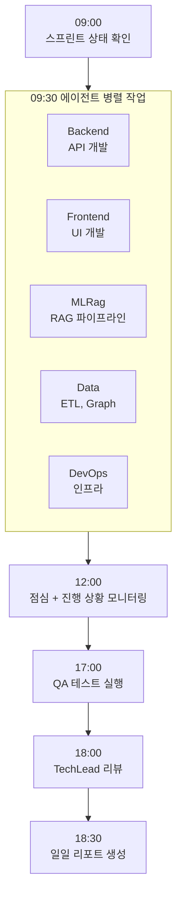

# Hybrid RAG Knowledge Ops 스프린트 실행 계획서

> **[현행화 정보]**
> - **최종 현행화**: 2026-02-20
> - **프로젝트 상태**: 종료 (2026-02-18)
> - **문서 상태**: 대부분 outdated (계획 문서로서의 역할 종료)
> - **주요 변경사항**: 6주 6스프린트 계획 → 38일 12스프린트 실행. Sprint 1~7 핵심 구현 완료. Sprint 8~12 RAGAS 평가 및 최종화. Docker Compose 예시 코드는 실제 구현과 차이 있음 (ES 버전, 컨테이너 구성 등).

**프로젝트**: Hybrid RAG Knowledge Operations Platform
**버전**: 2.3
**작성일**: 2026-01-18
**목적**: 6주 스프린트별 상세 작업 계획

---

## 목차

1. [Sprint 1: 인프라 구축](#1-sprint-1-인프라-구축)
2. [Sprint 2: Backend + AI Service 기반](#2-sprint-2-backend--ai-service-기반)
3. [Sprint 3: RAG 파이프라인 + Frontend](#3-sprint-3-rag-파이프라인--frontend)
4. [Sprint 4: 통합 + Observability](#4-sprint-4-통합--observability)
5. [Sprint 5: RAG Performance Test](#5-sprint-5-rag-performance-test)
6. [Sprint 6: 배포 + 문서화](#6-sprint-6-배포--문서화)
7. [일일 워크플로우](#7-일일-워크플로우)
8. [자동화 스크립트](#8-자동화-스크립트)

---

## 1. Sprint 1: 인프라 구축

**기간**: Week 1
**목표**: Docker Compose 기반 18개 컨테이너 환경 구축

> **[현행화 메모]**: Sprint 1은 실제로 2026-01-12~01-18 기간에 수행됨. 18개 컨테이너 목표 달성. Keycloak OAuth 2.0 로그인 구현 완료. 단, Kibana 컨테이너가 추가되어 실제 구성은 18개+Kibana로 운영됨.

### 1.1 완료 조건

| 지표 | 목표값 |
|------|--------|
| Docker 컨테이너 | 18개 정상 동작 |
| Keycloak | OAuth 2.0 로그인 성공 |
| PostgreSQL | 테이블 생성 완료 |
| 개발 환경 | 로컬 기동 가능 |

### 1.2 작업 분해 (WBS)

```
Sprint 1: 인프라 구축
├── 1.1 Docker Compose 환경 [DevOps]
│   ├── 1.1.1 docker-compose.yml 작성 (Application Layer)
│   ├── 1.1.2 docker-compose.yml 작성 (Data Layer)
│   ├── 1.1.3 docker-compose.yml 작성 (Observability Layer)
│   ├── 1.1.4 네트워크 및 볼륨 설정
│   └── 1.1.5 환경 변수 템플릿 (.env.example)
│
├── 1.2 인증 인프라 [DevOps, Backend]
│   ├── 1.2.1 Keycloak 설정 (Realm, Client)
│   ├── 1.2.2 사용자 역할 정의 (ADMIN, MEMBER, VIEWER)
│   └── 1.2.3 초기 사용자 생성 스크립트
│
├── 1.3 데이터베이스 초기화 [Data, Backend]
│   ├── 1.3.1 PostgreSQL 스키마 설계
│   ├── 1.3.2 Liquibase 마이그레이션 스크립트
│   ├── 1.3.3 Neo4j 초기 스키마 (Constraints, Indexes)
│   └── 1.3.4 Elasticsearch 인덱스 템플릿
│
├── 1.4 프로젝트 골격 생성 [Backend, Frontend, MLRag]
│   ├── 1.4.1 Backend (SpringBoot) 프로젝트 초기화
│   ├── 1.4.2 API Gateway 프로젝트 초기화
│   ├── 1.4.3 Frontend (React + Vite) 프로젝트 초기화
│   ├── 1.4.4 AI Service (FastAPI) 프로젝트 초기화
│   └── 1.4.5 공통 설정 (ESLint, Prettier, ruff)
│
└── 1.5 개발 환경 가이드 [TechLead]
    ├── 1.5.1 README.md 업데이트
    ├── 1.5.2 로컬 개발 환경 설정 가이드
    └── 1.5.3 IDE 설정 (VSCode, IntelliJ)
```

### 1.3 Docker Compose 구성

```yaml
# docker-compose.yml
version: '3.8'

services:
  # ========== Application Layer ==========
  nginx:
    image: nginx:1.25-alpine
    ports:
      - "80:80"
      - "443:443"
    volumes:
      - ./nginx/nginx.conf:/etc/nginx/nginx.conf
      - ./nginx/ssl:/etc/nginx/ssl
    depends_on:
      - frontend
      - api-gateway

  frontend:
    build: ./frontend
    environment:
      - VITE_API_URL=http://localhost:8080
      - VITE_KEYCLOAK_URL=http://localhost:8180
    depends_on:
      - api-gateway

  api-gateway:
    build: ./backend/api-gateway
    ports:
      - "8080:8080"
    environment:
      - SPRING_PROFILES_ACTIVE=docker
      - KEYCLOAK_URL=http://keycloak:8080
    depends_on:
      keycloak:
        condition: service_healthy

  backend:
    build: ./backend/backend-service
    ports:
      - "8081:8081"
    environment:
      - SPRING_PROFILES_ACTIVE=docker
      - DATABASE_URL=jdbc:postgresql://postgresql:5432/knowledge
      - REDIS_HOST=redis
    depends_on:
      postgresql:
        condition: service_healthy
      redis:
        condition: service_healthy

  ai-service:
    build: ./ai-service
    ports:
      - "8000:8000"
    environment:
      - ELASTICSEARCH_URL=http://elasticsearch:9200
      - NEO4J_URI=bolt://neo4j:7687
      - DEEPSEEK_API_KEY=${DEEPSEEK_API_KEY}
    depends_on:
      elasticsearch:
        condition: service_healthy
      neo4j:
        condition: service_healthy

  keycloak:
    image: quay.io/keycloak/keycloak:26.0
    command: start-dev
    ports:
      - "8180:8080"
    environment:
      - KEYCLOAK_ADMIN=admin
      - KEYCLOAK_ADMIN_PASSWORD=${KEYCLOAK_ADMIN_PASSWORD}
      - KC_DB=postgres
      - KC_DB_URL=jdbc:postgresql://postgresql:5432/keycloak
      - KC_DB_USERNAME=keycloak
      - KC_DB_PASSWORD=${KEYCLOAK_DB_PASSWORD}
    healthcheck:
      test: ["CMD", "curl", "-f", "http://localhost:8080/health"]
      interval: 10s
      timeout: 5s
      retries: 5

  # ========== Data Layer ==========
  postgresql:
    image: postgres:16-alpine
    ports:
      - "5432:5432"
    environment:
      - POSTGRES_USER=postgres
      - POSTGRES_PASSWORD=${POSTGRES_PASSWORD}
    volumes:
      - postgresql_data:/var/lib/postgresql/data
      - ./init-db:/docker-entrypoint-initdb.d
    healthcheck:
      test: ["CMD", "pg_isready", "-U", "postgres"]
      interval: 10s
      timeout: 5s
      retries: 5

  elasticsearch:
    image: elasticsearch:8.12.0
    # ⚠️ 현행화 메모: 실제 구현에서는 Nori 플러그인을 포함한 커스텀 Docker 이미지 사용.
    # 공식 이미지 대신 custom build (analysis-nori 플러그인 포함) 적용 (2026-02-13 수정).
    # ES 버전도 8.15로 업그레이드됨.
    ports:
      - "9200:9200"
    environment:
      - discovery.type=single-node
      - xpack.security.enabled=false
      - "ES_JAVA_OPTS=-Xms1g -Xmx1g"
    volumes:
      - elasticsearch_data:/usr/share/elasticsearch/data
    healthcheck:
      test: ["CMD", "curl", "-f", "http://localhost:9200/_cluster/health"]
      interval: 10s
      timeout: 5s
      retries: 5

  neo4j:
    image: neo4j:5-community
    ports:
      - "7474:7474"
      - "7687:7687"
    environment:
      - NEO4J_AUTH=neo4j/${NEO4J_PASSWORD}
      - NEO4J_PLUGINS=["apoc"]
    volumes:
      - neo4j_data:/data
    healthcheck:
      test: ["CMD", "wget", "-O", "-", "http://localhost:7474"]
      interval: 10s
      timeout: 5s
      retries: 5

  redis:
    image: redis:7-alpine
    ports:
      - "6379:6379"
    volumes:
      - redis_data:/data
    healthcheck:
      test: ["CMD", "redis-cli", "ping"]
      interval: 10s
      timeout: 5s
      retries: 5

  minio:
    image: minio/minio:latest
    ports:
      - "9000:9000"
      - "9001:9001"
    environment:
      - MINIO_ROOT_USER=${MINIO_ROOT_USER}
      - MINIO_ROOT_PASSWORD=${MINIO_ROOT_PASSWORD}
    volumes:
      - minio_data:/data
    command: server /data --console-address ":9001"

  # ========== Observability Layer ==========
  prometheus:
    image: prom/prometheus:v2.48.0
    ports:
      - "9090:9090"
    volumes:
      - ./prometheus/prometheus.yml:/etc/prometheus/prometheus.yml
      - prometheus_data:/prometheus

  grafana:
    image: grafana/grafana:10.2.0
    ports:
      - "3001:3000"
    environment:
      - GF_SECURITY_ADMIN_PASSWORD=${GRAFANA_PASSWORD}
    volumes:
      - grafana_data:/var/lib/grafana

  loki:
    image: grafana/loki:2.9.0
    ports:
      - "3100:3100"
    volumes:
      - loki_data:/loki

  promtail:
    image: grafana/promtail:2.9.0
    volumes:
      - /var/log:/var/log
      - ./promtail/config.yml:/etc/promtail/config.yml

  jaeger:
    image: jaegertracing/all-in-one:1.51
    ports:
      - "16686:16686"
      - "14268:14268"
    environment:
      - COLLECTOR_OTLP_ENABLED=true

volumes:
  postgresql_data:
  elasticsearch_data:
  neo4j_data:
  redis_data:
  minio_data:
  prometheus_data:
  grafana_data:
  loki_data:

networks:
  default:
    name: hybrid-rag-network
```

### 1.4 일일 작업 흐름

| 일차 | 작업 | 담당 | 산출물 |
|:----:|------|------|--------|
| Day 1 | Docker Compose 기본 구성 | DevOps | docker-compose.yml |
| Day 2 | DB 컨테이너 + 스키마 | Data | Liquibase scripts |
| Day 3 | Keycloak 설정 | Backend | Realm 설정 |
| Day 4 | 프로젝트 골격 생성 | All | 초기 프로젝트 |
| Day 5 | 통합 테스트 + 문서화 | TechLead | README |

---

## 2. Sprint 2: Backend + AI Service 기반

**기간**: Week 2
**목표**: API Gateway, Backend CRUD, AI Service 골격 완성

> **[현행화 메모]**: Sprint 2~3에 해당하는 실제 작업이 수행됨. API Gateway JWT 검증, Backend Knowledge/User CRUD, FastAPI 기반 AI Service 골격 구현 완료. CI/CD는 기본 GitHub Actions만 구성, GitLab CI/CD는 미구현 (범위 조정).

### 2.1 완료 조건

| 지표 | 목표값 |
|------|--------|
| API Gateway | JWT 검증 동작 |
| Backend API | Knowledge/User CRUD |
| AI Service | Health, 기본 엔드포인트 |
| 단위 테스트 | 커버리지 > 60% |

### 2.2 작업 분해 (WBS)

```
Sprint 2: Backend + AI Service 기반
├── 2.1 API Gateway [Backend]
│   ├── 2.1.1 Spring Cloud Gateway 설정
│   ├── 2.1.2 JWT 인증 필터
│   ├── 2.1.3 라우팅 규칙 정의
│   ├── 2.1.4 Rate Limiting (Resilience4j)
│   └── 2.1.5 CORS 설정
│
├── 2.2 Backend Service [Backend]
│   ├── 2.2.1 Knowledge 도메인 (Entity, Repository, Service)
│   ├── 2.2.2 User 도메인 (Entity, Repository, Service)
│   ├── 2.2.3 Bookmark 도메인
│   ├── 2.2.4 REST API 엔드포인트
│   ├── 2.2.5 Keycloak 연동 (Spring Security)
│   └── 2.2.6 단위/통합 테스트
│
├── 2.3 AI Service 골격 [MLRag]
│   ├── 2.3.1 FastAPI 프로젝트 구조
│   ├── 2.3.2 Health/Readiness 엔드포인트
│   ├── 2.3.3 Internal API 정의 (/internal/v1/*)
│   ├── 2.3.4 Elasticsearch 클라이언트
│   ├── 2.3.5 Neo4j 클라이언트
│   └── 2.3.6 DeepSeek API 클라이언트
│
├── 2.4 데이터베이스 연동 [Data]
│   ├── 2.4.1 PostgreSQL Repository 구현
│   ├── 2.4.2 Redis 캐싱 레이어
│   ├── 2.4.3 MinIO 파일 스토리지
│   └── 2.4.4 연동 테스트
│
└── 2.5 CI/CD 기반 [DevOps]
    ├── 2.5.1 GitLab CI/CD 파이프라인
    ├── 2.5.2 린트/테스트 자동화
    └── 2.5.3 Docker 이미지 빌드
```

### 2.3 Backend API 구조

```java
// Knowledge Controller 예시
@RestController
@RequestMapping("/api/v1/knowledge")
@RequiredArgsConstructor
public class KnowledgeController {

    private final KnowledgeService knowledgeService;

    @GetMapping
    public ResponseEntity<Page<KnowledgeResponse>> list(
            @PageableDefault(size = 20) Pageable pageable,
            @RequestParam(required = false) String keyword) {
        return ResponseEntity.ok(knowledgeService.findAll(keyword, pageable));
    }

    @GetMapping("/{id}")
    public ResponseEntity<KnowledgeDetailResponse> get(@PathVariable UUID id) {
        return ResponseEntity.ok(knowledgeService.findById(id));
    }

    @PostMapping
    @PreAuthorize("hasAnyRole('ADMIN', 'MEMBER')")
    public ResponseEntity<KnowledgeResponse> create(
            @Valid @RequestBody KnowledgeCreateRequest request) {
        return ResponseEntity.status(HttpStatus.CREATED)
                .body(knowledgeService.create(request));
    }

    @PutMapping("/{id}")
    @PreAuthorize("@knowledgeSecurity.canEdit(#id)")
    public ResponseEntity<KnowledgeResponse> update(
            @PathVariable UUID id,
            @Valid @RequestBody KnowledgeUpdateRequest request) {
        return ResponseEntity.ok(knowledgeService.update(id, request));
    }

    @DeleteMapping("/{id}")
    @PreAuthorize("hasRole('ADMIN') or @knowledgeSecurity.isOwner(#id)")
    public ResponseEntity<Void> delete(@PathVariable UUID id) {
        knowledgeService.delete(id);
        return ResponseEntity.noContent().build();
    }
}
```

### 2.4 AI Service 구조

```python
# FastAPI 기본 구조
from fastapi import FastAPI, HTTPException
from pydantic import BaseModel
from typing import List, Optional

app = FastAPI(title="Hybrid RAG AI Service", version="1.0.0")

# Health Check
@app.get("/health")
async def health():
    return {"status": "healthy"}

@app.get("/ready")
async def readiness():
    # DB 연결 확인
    es_ok = await check_elasticsearch()
    neo4j_ok = await check_neo4j()
    return {
        "status": "ready" if es_ok and neo4j_ok else "not_ready",
        "elasticsearch": es_ok,
        "neo4j": neo4j_ok
    }

# Internal API
@app.post("/internal/v1/search/hybrid")
async def hybrid_search(request: SearchRequest) -> SearchResponse:
    """Hybrid Search (ES + Neo4j + RRF)"""
    pass

@app.post("/internal/v1/search/chat")
async def chat_search(request: ChatRequest) -> ChatResponse:
    """RAG 기반 채팅 검색"""
    pass

@app.post("/internal/v1/extract/entities")
async def extract_entities(request: ExtractRequest) -> ExtractResponse:
    """엔티티 추출 (Gleaning)"""
    pass

@app.post("/internal/v1/embed")
async def generate_embedding(request: EmbedRequest) -> EmbedResponse:
    """BGE-M3 임베딩 생성"""
    pass
```

---

## 3. Sprint 3: RAG 파이프라인 + Frontend

**기간**: Week 3
**목표**: Hybrid RAG 파이프라인 구현, Frontend 기본 화면 완성

> **[현행화 메모]**: Hybrid Retrieval (ES + Neo4j + RRF), Gleaning, LangGraph 워크플로우 모두 구현 완료. Frontend는 React 18 + Tailwind CSS로 구현 (MUI 아님 — 2026-01-25 전략 변경). ETL 3-Phase 파이프라인 구축: Phase 1(파싱+청킹), Phase 2(GPU 임베딩, Colab), Phase 3(엔티티 추출). 초기 데이터 로딩: 실제 지식 문서 기반으로 수행됨.

### 3.1 완료 조건

| 지표 | 목표값 |
|------|--------|
| Hybrid Search | 검색 결과 반환 |
| Gleaning | 엔티티 추출 동작 |
| Frontend | 로그인, 대시보드, 검색 UI |
| SSE Streaming | 실시간 응답 동작 |

### 3.2 작업 분해 (WBS)

```
Sprint 3: RAG 파이프라인 + Frontend
├── 3.1 Hybrid Retrieval [MLRag]
│   ├── 3.1.1 ElasticsearchRetriever (Vector Search)
│   ├── 3.1.2 Neo4jRetriever (Graph Search)
│   ├── 3.1.3 RRF Fusion 알고리즘
│   ├── 3.1.4 Reranking (BGE-reranker)
│   └── 3.1.5 통합 테스트
│
├── 3.2 Gleaning 파이프라인 [MLRag]
│   ├── 3.2.1 초기 추출 프롬프트
│   ├── 3.2.2 추가 추출 (Multi-round)
│   ├── 3.2.3 엔티티 병합 및 중복 제거
│   └── 3.2.4 품질 검증 테스트
│
├── 3.3 LangGraph 워크플로우 [MLRag]
│   ├── 3.3.1 AgentState 정의
│   ├── 3.3.2 Planner Node
│   ├── 3.3.3 Retriever Node
│   ├── 3.3.4 Generator Node
│   └── 3.3.5 워크플로우 컴파일
│
├── 3.4 Frontend 기본 화면 [Frontend]
│   ├── 3.4.1 인증 (Keycloak 연동)
│   ├── 3.4.2 대시보드 페이지
│   ├── 3.4.3 검색 페이지 (채팅 모드)
│   ├── 3.4.4 검색 페이지 (키워드 모드)
│   ├── 3.4.5 SSE 스트리밍 처리
│   └── 3.4.6 에러 핸들링
│
├── 3.5 Knowledge Graph 구축 [Data]
│   ├── 3.5.1 문서 파싱 (Docling)
│   ├── 3.5.2 청킹 전략
│   ├── 3.5.3 Neo4j 그래프 구축
│   └── 3.5.4 ES 인덱싱
│
├── 3.6 Backend 검색 연동 [Backend]
│   ├── 3.6.1 Search Service (AI Service 호출)
│   ├── 3.6.2 SSE Controller
│   └── 3.6.3 WebClient + Resilience4j
│
└── 3.7 초기 데이터 로딩 [Data, MLRag] ⭐ NEW
    ├── 3.7.1 ETL 파이프라인 구현
    ├── 3.7.2 ES/Neo4j 스키마 적용
    ├── 3.7.3 Phase 1: Markdown 문서 로딩 (60개)
    ├── 3.7.4 Phase 2: PPTX 문서 로딩 (5개)
    └── 3.7.5 데이터 검증 및 품질 확인
```

### 3.3 Hybrid Retriever 구현

```python
# ai_service/retrievers/hybrid_retriever.py
from typing import List
import asyncio
from collections import defaultdict

class HybridRetriever:
    def __init__(
        self,
        es_client: ElasticsearchClient,
        neo4j_client: Neo4jClient,
        reranker: BGEReranker
    ):
        self.es = es_client
        self.neo4j = neo4j_client
        self.reranker = reranker

    async def retrieve(
        self,
        query: str,
        top_k: int = 5,
        es_weight: float = 0.5,
        neo4j_weight: float = 0.5
    ) -> List[Document]:
        """Hybrid Search: ES + Neo4j + RRF Fusion + Reranking"""

        # 1. 병렬 검색
        es_task = self.es.vector_search(query, top_k=20)
        neo4j_task = self.neo4j.graph_search(query, top_k=20)
        es_results, neo4j_results = await asyncio.gather(es_task, neo4j_task)

        # 2. RRF Fusion
        fused = self._rrf_fusion(
            es_results, neo4j_results,
            weights=[es_weight, neo4j_weight]
        )

        # 3. Reranking
        reranked = await self.reranker.rerank(query, fused[:50])

        return reranked[:top_k]

    def _rrf_fusion(
        self,
        *result_lists: List[List[Document]],
        weights: List[float] = None,
        k: int = 60
    ) -> List[Document]:
        """Reciprocal Rank Fusion"""
        if weights is None:
            weights = [1.0] * len(result_lists)

        scores = defaultdict(float)
        doc_map = {}

        for results, weight in zip(result_lists, weights):
            for rank, doc in enumerate(results):
                scores[doc.id] += weight / (k + rank + 1)
                doc_map[doc.id] = doc

        sorted_ids = sorted(scores.keys(), key=lambda x: scores[x], reverse=True)
        return [doc_map[id] for id in sorted_ids]
```

### 3.4 Frontend 검색 컴포넌트

```typescript
// frontend/src/features/search/components/ChatSearch.tsx
import { useState, useEffect } from 'react';
import { useSearchChat } from '../hooks/useSearchChat';

export const ChatSearch: React.FC = () => {
  const [query, setQuery] = useState('');
  const { sendMessage, messages, isStreaming } = useSearchChat();

  const handleSubmit = (e: React.FormEvent) => {
    e.preventDefault();
    if (query.trim()) {
      sendMessage(query);
      setQuery('');
    }
  };

  return (
    <Box sx={{ display: 'flex', flexDirection: 'column', height: '100%' }}>
      {/* 메시지 목록 */}
      <Box sx={{ flex: 1, overflow: 'auto', p: 2 }}>
        {messages.map((msg, idx) => (
          <MessageBubble key={idx} message={msg} />
        ))}
        {isStreaming && <StreamingIndicator />}
      </Box>

      {/* 입력 폼 */}
      <Box component="form" onSubmit={handleSubmit} sx={{ p: 2, borderTop: 1 }}>
        <TextField
          fullWidth
          value={query}
          onChange={(e) => setQuery(e.target.value)}
          placeholder="질문을 입력하세요..."
          disabled={isStreaming}
          InputProps={{
            endAdornment: (
              <IconButton type="submit" disabled={!query.trim() || isStreaming}>
                <SendIcon />
              </IconButton>
            ),
          }}
        />
      </Box>
    </Box>
  );
};

// SSE 스트리밍 훅
export const useSearchChat = () => {
  const [messages, setMessages] = useState<Message[]>([]);
  const [isStreaming, setIsStreaming] = useState(false);

  const sendMessage = async (query: string) => {
    setMessages(prev => [...prev, { role: 'user', content: query }]);
    setIsStreaming(true);

    const eventSource = new EventSource(
      `/api/v1/search/chat/stream?query=${encodeURIComponent(query)}`
    );

    let assistantMessage = '';

    eventSource.onmessage = (event) => {
      const data = JSON.parse(event.data);
      assistantMessage += data.content;
      setMessages(prev => [
        ...prev.slice(0, -1),
        { role: 'assistant', content: assistantMessage, sources: data.sources }
      ]);
    };

    eventSource.onerror = () => {
      eventSource.close();
      setIsStreaming(false);
    };
  };

  return { messages, sendMessage, isStreaming };
};
```

### 3.5 초기 데이터 로딩 상세 계획 ⭐ NEW

#### 3.5.1 운영 데이터 폴더 구조

> **원칙**: 프로젝트 코드/문서와 운영 지식 데이터를 분리하여 관리

```
┌─────────────────────────────────────────────────────────────────────────────┐
│                          운영 데이터 폴더 (knowledge_data)                    │
├─────────────────────────────────────────────────────────────────────────────┤
│                                                                             │
│  📁 knowledge_data/                        # ⭐ 운영 지식 데이터 전용         │
│  │                                                                          │
│  ├── documents/                            # 원본 문서 (인덱싱 대상)         │
│  │   ├── technical/                        # 기술 문서 (~24개)              │
│  │   │   ├── hybrid_rag_platform_detailed_design.md                        │
│  │   │   ├── backend_detailed_design.md                                    │
│  │   │   ├── frontend_detailed_design.md                                   │
│  │   │   └── ...                                                           │
│  │   │                                                                      │
│  │   ├── guides/                           # 가이드/매뉴얼 (~4개)           │
│  │   │   ├── 01.Ralph_Playbook_완전가이드.md                                │
│  │   │   ├── 02.Ralph_자율학습사이클_상세가이드.md                           │
│  │   │   └── ...                                                           │
│  │   │                                                                      │
│  │   ├── policies/                         # 정책/규정 (향후 추가)          │
│  │   ├── standards/                        # 표준/프로세스 (향후 추가)       │
│  │   └── presentations/                    # 발표자료 (~5개)                │
│  │       ├── Hybrid_RAG_Platform_Design_v3.pptx                            │
│  │       └── ...                                                           │
│  │                                                                          │
│  ├── processed/                            # 처리된 데이터 (시스템 생성)     │
│  │   ├── chunks/                           # 청킹된 텍스트                  │
│  │   └── embeddings/                       # 임베딩 캐시                    │
│  │                                                                          │
│  └── exports/                              # 백업/스냅샷                    │
│                                                                             │
└─────────────────────────────────────────────────────────────────────────────┘
```

#### 3.5.2 Bootstrap 스크립트

```bash
# scripts/seed-initial-data.sh - 프로젝트 문서를 운영 폴더로 복사

#!/bin/bash
set -e

KNOWLEDGE_DATA="./knowledge_data/documents"

echo "🌱 Seeding initial data..."

# 기술 문서 → technical/
mkdir -p "$KNOWLEDGE_DATA/technical"
cp -r knowledge_service/docs/01_planning/*.md "$KNOWLEDGE_DATA/technical/"
cp -r knowledge_service/docs/02_design/*.md "$KNOWLEDGE_DATA/technical/"

# ALM 가이드 → guides/
mkdir -p "$KNOWLEDGE_DATA/guides"
cp -r docs/claude_code_virtual_team_alm_guide/*.md "$KNOWLEDGE_DATA/guides/"

# 발표자료 → presentations/
mkdir -p "$KNOWLEDGE_DATA/presentations"
cp -r docs/presentations/*.pptx "$KNOWLEDGE_DATA/presentations/" 2>/dev/null || true

echo "✅ Seeded $(find $KNOWLEDGE_DATA -type f | wc -l) files"
```

#### 3.5.3 데이터 처리 파이프라인

```python
# knowledge_service/src/app/etl/initial_data_loader.py

from pathlib import Path
from typing import List, Dict
from dataclasses import dataclass

@dataclass
class DataSource:
    """데이터 소스 정의"""
    category: str
    path: str
    priority: int  # P0=0, P1=1, P2=2
    extensions: List[str]

class InitialDataLoader:
    """초기 데이터 ETL 파이프라인"""

    # 운영 데이터 소스 정의 (knowledge_data 기준)
    DATA_SOURCES = [
        # P0: 핵심 기술 문서 + 가이드
        DataSource("technical", "knowledge_data/documents/technical", 0, [".md"]),
        DataSource("guide", "knowledge_data/documents/guides", 0, [".md"]),

        # P1: 정책/표준 (향후)
        DataSource("policy", "knowledge_data/documents/policies", 1, [".md"]),
        DataSource("standard", "knowledge_data/documents/standards", 1, [".md"]),

        # P2: 발표자료
        DataSource("presentation", "knowledge_data/documents/presentations", 2, [".pptx"]),
    ]

    async def load_all(self) -> Dict:
        """전체 데이터 로드"""
        stats = {
            "total_documents": 0,
            "total_chunks": 0,
            "total_entities": 0,
            "by_category": {}
        }

        for source in sorted(self.DATA_SOURCES, key=lambda x: x.priority):
            result = await self._load_source(source)
            stats["total_documents"] += result["documents"]
            stats["total_chunks"] += result["chunks"]
            stats["total_entities"] += result["entities"]
            stats["by_category"][source.category] = result

        return stats

    async def _load_source(self, source: DataSource) -> Dict:
        """개별 소스 로드"""
        files = self._discover_files(source.path, source.extensions)
        print(f"[{source.category}] 발견: {len(files)}개 파일")

        results = {"documents": 0, "chunks": 0, "entities": 0}

        for file_path in files:
            # 1. 파싱 (Docling)
            parsed = await self.docling.parse(file_path)

            # 2. 메타데이터 추출
            metadata = self._extract_metadata(file_path, source.category)

            # 3. 청킹 (Semantic)
            chunks = self._chunk_document(parsed, metadata)

            # 4. 임베딩 (BGE-M3)
            chunks = await self._embed_chunks(chunks)

            # 5. 저장
            await self._store_to_elasticsearch(chunks)
            entities = await self._store_to_neo4j(parsed, chunks, metadata)

            results["documents"] += 1
            results["chunks"] += len(chunks)
            results["entities"] += len(entities)

        return results

    def _extract_metadata(self, file_path: str, category: str) -> Dict:
        """메타데이터 추출"""
        path = Path(file_path)
        return {
            "file_path": str(path),
            "file_name": path.name,
            "category": category,
            "doc_type": self._classify_doc_type(path),
            "project": "hybrid-rag-knowledge-ops",
            "language": "ko",
            "modified_at": path.stat().st_mtime,
        }

    def _classify_doc_type(self, path: Path) -> str:
        """문서 유형 분류 규칙"""
        path_lower = str(path).lower()

        # 경로 기반 분류
        if "planning" in path_lower:
            if "technical_assessment" in path_lower:
                return "technical_assessment"
            return "planning"
        elif "design" in path_lower:
            if "review" in path_lower:
                return "design_review"
            if "ui_storyboard" in path_lower:
                return "ui_storyboard"
            return "design_specification"
        elif "alm_guide" in path_lower:
            return "alm_guide"
        elif "presentation" in path_lower:
            return "presentation"
        return "general"
```

#### 3.5.3 일별 작업 계획

| Day | 작업 | 담당 | 소스 | 산출물 |
|:---:|------|------|------|--------|
| **Day 1** | ETL 코드 구현 | Data, MLRag | - | `initial_data_loader.py` |
| **Day 2** | 스키마 생성 | Data | - | ES 매핑, Neo4j 제약조건 |
| **Day 3** | Markdown 로딩 | Data | `knowledge_service/docs/` | ~50개 문서 인덱싱 |
| **Day 4** | 나머지 로딩 | Data | `docs/` | ~15개 문서 + PPTX |
| **Day 5** | 검증/튜닝 | QA | - | 테스트 리포트 |

#### 3.5.4 검증 기준

```python
# 검증 테스트 기준
class InitialDataValidation:
    """초기 데이터 검증 기준"""

    # 문서 수 검증
    EXPECTED_DOCUMENTS = {
        "planning": 10,
        "design": 14,
        "review": 15,
        "alm_guide": 4,
        "presentation": 5,
    }

    # 청크 수 검증 (문서당 평균 15-20 청크)
    MIN_CHUNKS = 500
    MAX_CHUNKS = 2000

    # 엔티티 수 검증
    MIN_ENTITIES = 100
    EXPECTED_ENTITY_TYPES = ["Technology", "Concept", "Role", "API"]

    # 검색 품질 검증
    TEST_QUERIES = [
        ("Hybrid RAG 아키텍처 설명", ["hybrid_rag_platform_detailed_design"]),
        ("Keycloak OAuth 2.0 설정", ["authentication_authorization_detailed_design"]),
        ("Frontend React 컴포넌트 구조", ["frontend_detailed_design"]),
        ("Elasticsearch 벡터 검색", ["infrastructure_detailed_design"]),
        ("Gleaning 엔티티 추출", ["hybrid_rag_platform_detailed_design"]),
    ]

    @classmethod
    async def run_all_validations(cls, es_client, neo4j_client):
        """전체 검증 실행"""
        results = {
            "document_count": await cls._validate_document_count(neo4j_client),
            "chunk_count": await cls._validate_chunk_count(es_client),
            "entity_count": await cls._validate_entity_count(neo4j_client),
            "search_quality": await cls._validate_search_quality(es_client),
        }

        all_passed = all(r["passed"] for r in results.values())
        return {"passed": all_passed, "details": results}
```

#### 3.5.5 실행 스크립트

```bash
#!/bin/bash
# scripts/load-initial-data.sh

echo "╔════════════════════════════════════════════════╗"
echo "║       Sprint 3: 초기 데이터 로딩               ║"
echo "╚════════════════════════════════════════════════╝"

# Phase 1: Markdown 문서
echo ""
echo "📄 Phase 1: Markdown 문서 로딩..."
poetry run python -m knowledge_service.src.app.etl.initial_data_loader \
  --sources "knowledge_service/docs,docs/claude_code_virtual_team_alm_guide" \
  --extensions ".md" \
  --category "documentation"

# Phase 2: PPTX 문서
echo ""
echo "📊 Phase 2: PPTX 문서 로딩..."
poetry run python -m knowledge_service.src.app.etl.initial_data_loader \
  --sources "docs/presentations" \
  --extensions ".pptx" \
  --category "presentation"

# 검증
echo ""
echo "✅ 데이터 검증..."
poetry run python -m knowledge_service.src.app.etl.validate_initial_data

echo ""
echo "━━━━━━━━━━━━━━━━━━━━━━━━━━━━━━━━━━━━━━━━━━━━━━━━━"
echo "초기 데이터 로딩 완료!"
echo "━━━━━━━━━━━━━━━━━━━━━━━━━━━━━━━━━━━━━━━━━━━━━━━━━"
```

#### 3.5.6 예상 결과

```
┌──────────────────────────────────────────────────────────────┐
│                  초기 데이터 로딩 결과 (예상)                  │
├──────────────────────────────────────────────────────────────┤
│                                                              │
│  📊 Elasticsearch (knowledge_chunks 인덱스)                  │
│  ├── 총 청크: ~1,000개                                       │
│  ├── 평균 청크 크기: 800 tokens                              │
│  └── 임베딩 차원: 1,024 (BGE-M3)                             │
│                                                              │
│  📈 Neo4j (Knowledge Graph)                                  │
│  ├── Document 노드: ~65개                                    │
│  ├── Chunk 노드: ~1,000개                                    │
│  ├── Entity 노드: ~500개                                     │
│  │   ├── Technology: ~100개 (FastAPI, React, Neo4j, ...)    │
│  │   ├── Concept: ~200개 (RAG, Hybrid Search, ...)          │
│  │   ├── Role: ~10개 (PM, TechLead, Backend, ...)           │
│  │   └── API: ~50개 (엔드포인트, 메서드, ...)                │
│  └── Relationship: ~2,000개                                  │
│                                                              │
│  🔍 검색 품질                                                │
│  ├── 벡터 검색 Recall@5: > 0.8                               │
│  └── 그래프 검색 Precision: > 0.7                            │
│                                                              │
└──────────────────────────────────────────────────────────────┘
```

---

## 4. Sprint 4: 통합 + Observability

**기간**: Week 4
**목표**: E2E 통합, Observability 스택 구축

### 4.1 완료 조건

| 지표 | 목표값 |
|------|--------|
| E2E 플로우 | 검색→응답 성공 |
| Prometheus | 메트릭 수집 동작 |
| Grafana | 대시보드 구성 |
| Loki | 로그 검색 가능 |
| Jaeger | 트레이스 추적 가능 |

### 4.2 작업 분해 (WBS)

```
Sprint 4: 통합 + Observability
├── 4.1 E2E 통합 [All]
│   ├── 4.1.1 Frontend → Backend → AI Service 연동
│   ├── 4.1.2 인증 플로우 E2E 테스트
│   ├── 4.1.3 검색 플로우 E2E 테스트
│   ├── 4.1.4 지식 CRUD E2E 테스트
│   └── 4.1.5 에러 시나리오 테스트
│
├── 4.2 Metrics (Prometheus) [DevOps]
│   ├── 4.2.1 prometheus.yml 구성
│   ├── 4.2.2 Backend Actuator 메트릭
│   ├── 4.2.3 AI Service 커스텀 메트릭
│   ├── 4.2.4 DB 메트릭 (PostgreSQL, Redis)
│   └── 4.2.5 알림 규칙 정의
│
├── 4.3 Visualization (Grafana) [DevOps]
│   ├── 4.3.1 System Overview 대시보드
│   ├── 4.3.2 API Performance 대시보드
│   ├── 4.3.3 RAG Quality 대시보드
│   ├── 4.3.4 Error Analysis 대시보드
│   └── 4.3.5 SLA Monitoring 대시보드
│
├── 4.4 Logging (Loki) [DevOps]
│   ├── 4.4.1 Promtail 구성
│   ├── 4.4.2 로그 레이블 설계
│   ├── 4.4.3 Grafana 연동
│   └── 4.4.4 로그 쿼리 예제
│
├── 4.5 Tracing (Jaeger) [DevOps, Backend]
│   ├── 4.5.1 Jaeger 설정
│   ├── 4.5.2 Backend OpenTelemetry 연동
│   ├── 4.5.3 AI Service 트레이싱
│   └── 4.5.4 분산 트레이스 확인
│
└── 4.6 통합 테스트 [QA]
    ├── 4.6.1 E2E 테스트 시나리오 작성
    ├── 4.6.2 Playwright 테스트
    └── 4.6.3 테스트 리포트 생성
```

### 4.3 Grafana 대시보드 구성

```yaml
# grafana/dashboards/system-overview.json (요약)
{
  "title": "System Overview",
  "panels": [
    {
      "title": "Request Rate",
      "type": "graph",
      "targets": [
        {
          "expr": "rate(http_server_requests_seconds_count[5m])",
          "legendFormat": "{{uri}}"
        }
      ]
    },
    {
      "title": "Response Time P95",
      "type": "gauge",
      "targets": [
        {
          "expr": "histogram_quantile(0.95, rate(http_server_requests_seconds_bucket[5m]))"
        }
      ],
      "thresholds": {
        "steps": [
          { "value": 0, "color": "green" },
          { "value": 2, "color": "yellow" },
          { "value": 3, "color": "red" }
        ]
      }
    },
    {
      "title": "RAG Faithfulness",
      "type": "stat",
      "targets": [
        {
          "expr": "avg(rag_faithfulness_score)"
        }
      ],
      "thresholds": {
        "steps": [
          { "value": 0, "color": "red" },
          { "value": 0.8, "color": "yellow" },
          { "value": 0.9, "color": "green" }
        ]
      }
    }
  ]
}
```

---

## 5. Sprint 5: RAG Performance Test

**기간**: Week 5
**목표**: RAG 품질 평가, 성능 최적화, 보안 테스트

> **[현행화 메모]**: RAGAS 평가는 Sprint 5~12에 걸쳐 v1~v11 반복 수행. ragas 버전 0.2.15 → 0.4.3으로 업그레이드하며 NaN 이슈 발생(n>1 DeepSeek 미지원) → ChatOpenAI(n=1) 강제 설정으로 해결. 최종 결과: Faithfulness 0.935 (목표 초과), Context Precision 0.618 (미달). 성능 부하 테스트(k6)는 미실시. 보안 테스트(OWASP 스캔)는 기본 점검만 수행.

### 5.1 완료 조건

| 지표 | 목표값 |
|------|--------|
| Faithfulness | > 0.9 |
| Answer Relevancy | > 0.85 |
| P95 Latency | < 3초 |
| 보안 취약점 | Critical 0개 |

### 5.2 작업 분해 (WBS)

```
Sprint 5: RAG Performance Test
├── 5.1 Ragas 평가 [QA, MLRag]
│   ├── 5.1.1 테스트 데이터셋 준비 (100개 Q&A)
│   ├── 5.1.2 Ragas 메트릭 실행
│   │   ├── Faithfulness
│   │   ├── Answer Relevancy
│   │   ├── Context Precision
│   │   └── Context Recall
│   ├── 5.1.3 품질 리포트 생성
│   └── 5.1.4 개선 항목 도출
│
├── 5.2 검색 품질 평가 [QA]
│   ├── 5.2.1 Precision@K 측정
│   ├── 5.2.2 Recall@K 측정
│   ├── 5.2.3 MRR (Mean Reciprocal Rank)
│   ├── 5.2.4 NDCG 측정
│   └── 5.2.5 검색 품질 리포트
│
├── 5.3 성능 테스트 [QA, DevOps]
│   ├── 5.3.1 부하 테스트 시나리오
│   ├── 5.3.2 Locust/k6 실행
│   ├── 5.3.3 P95/P99 Latency 측정
│   ├── 5.3.4 동시 사용자 테스트 (100명)
│   └── 5.3.5 성능 리포트
│
├── 5.4 최적화 [MLRag, Backend]
│   ├── 5.4.1 병목 구간 식별
│   ├── 5.4.2 캐싱 전략 적용
│   ├── 5.4.3 쿼리 최적화
│   ├── 5.4.4 인덱스 튜닝
│   └── 5.4.5 재측정 및 검증
│
└── 5.5 보안 테스트 [QA, DevOps]
    ├── 5.5.1 OWASP Top 10 스캔
    ├── 5.5.2 의존성 취약점 검사
    ├── 5.5.3 인증/인가 테스트
    ├── 5.5.4 SQL Injection 테스트
    └── 5.5.5 보안 리포트
```

### 5.3 Ragas 평가 코드

```python
# ai_service/evaluation/ragas_eval.py
from ragas import evaluate
from ragas.metrics import (
    faithfulness,
    answer_relevancy,
    context_precision,
    context_recall
)
from datasets import Dataset
import json

async def run_ragas_evaluation(test_file: str) -> dict:
    """Ragas 평가 실행"""

    # 1. 테스트 데이터 로드
    with open(test_file) as f:
        test_data = json.load(f)

    # 2. RAG 파이프라인 실행
    results = []
    for item in test_data:
        response = await rag_pipeline.query(item["question"])
        results.append({
            "question": item["question"],
            "answer": response.answer,
            "contexts": response.contexts,
            "ground_truth": item["ground_truth"]
        })

    # 3. Dataset 변환
    dataset = Dataset.from_list(results)

    # 4. Ragas 평가
    scores = evaluate(
        dataset,
        metrics=[
            faithfulness,
            answer_relevancy,
            context_precision,
            context_recall
        ]
    )

    # 5. 품질 게이트 검증
    quality_gate = {
        "faithfulness": {"threshold": 0.9, "actual": scores["faithfulness"], "passed": scores["faithfulness"] >= 0.9},
        "answer_relevancy": {"threshold": 0.85, "actual": scores["answer_relevancy"], "passed": scores["answer_relevancy"] >= 0.85},
        "context_precision": {"threshold": 0.8, "actual": scores["context_precision"], "passed": scores["context_precision"] >= 0.8}
    }

    overall_passed = all(g["passed"] for g in quality_gate.values())

    return {
        "scores": scores,
        "quality_gate": quality_gate,
        "overall_passed": overall_passed
    }
```

### 5.4 성능 테스트 (k6)

```javascript
// k6/load-test.js
import http from 'k6/http';
import { check, sleep } from 'k6';

export const options = {
  stages: [
    { duration: '1m', target: 10 },   // Ramp-up
    { duration: '3m', target: 50 },   // Steady state
    { duration: '2m', target: 100 },  // Peak
    { duration: '1m', target: 0 },    // Ramp-down
  ],
  thresholds: {
    http_req_duration: ['p(95)<3000'],  // P95 < 3초
    http_req_failed: ['rate<0.01'],     // 에러율 < 1%
  },
};

const BASE_URL = __ENV.BASE_URL || 'http://localhost:8080';
const queries = [
  'Hybrid RAG 아키텍처 설명',
  '검색 정확도를 높이는 방법',
  'Neo4j 그래프 쿼리 최적화',
  // ... 더 많은 쿼리
];

export default function () {
  const query = queries[Math.floor(Math.random() * queries.length)];

  const response = http.post(
    `${BASE_URL}/api/v1/search/chat`,
    JSON.stringify({ query }),
    { headers: { 'Content-Type': 'application/json' } }
  );

  check(response, {
    'status is 200': (r) => r.status === 200,
    'response time < 3s': (r) => r.timings.duration < 3000,
    'has answer': (r) => JSON.parse(r.body).answer !== undefined,
  });

  sleep(1);
}
```

---

## 6. Sprint 6: 배포 + 문서화

**기간**: Week 6
**목표**: Staging/Production 배포, 운영 문서화

> **[현행화 메모]**: Sprint 7에서 Production-Ready 달성 (TechLead 승인, 프로덕션 준비도 95.75%). Blue-Green 배포, Staging 환경, 실제 서버 배포는 미진행 (로컬 Docker Compose 환경). 운영 문서는 knowledge_service/docs/07_maintenance/에 작성됨. 사용자 매뉴얼 및 교육 자료는 산출물 v1.1로 제공됨.

### 6.1 완료 조건

| 지표 | 목표값 |
|------|--------|
| Staging 배포 | 안정 동작 |
| Production 배포 | 완료 |
| 운영 문서 | 인수인계 가능 |
| 사용자 매뉴얼 | 교육 가능 |

### 6.2 작업 분해 (WBS)

```
Sprint 6: 배포 + 문서화
├── 6.1 Staging 배포 [DevOps]
│   ├── 6.1.1 Staging 환경 준비
│   ├── 6.1.2 데이터 마이그레이션
│   ├── 6.1.3 배포 스크립트 실행
│   ├── 6.1.4 스모크 테스트
│   └── 6.1.5 Staging 검증 (2일)
│
├── 6.2 Production 배포 [DevOps]
│   ├── 6.2.1 Production 환경 준비
│   ├── 6.2.2 배포 체크리스트
│   ├── 6.2.3 Blue-Green 배포
│   ├── 6.2.4 DNS 전환
│   └── 6.2.5 Production 모니터링
│
├── 6.3 운영 문서 [TechLead]
│   ├── 6.3.1 시스템 아키텍처 문서
│   ├── 6.3.2 운영 가이드
│   ├── 6.3.3 장애 대응 매뉴얼
│   ├── 6.3.4 백업/복구 절차
│   └── 6.3.5 모니터링 가이드
│
├── 6.4 사용자 문서 [TechLead]
│   ├── 6.4.1 사용자 매뉴얼
│   ├── 6.4.2 FAQ
│   ├── 6.4.3 교육 자료 (PPT)
│   └── 6.4.4 Quick Start 가이드
│
└── 6.5 인수인계 [All]
    ├── 6.5.1 기술 이전 세션
    ├── 6.5.2 운영자 교육
    └── 6.5.3 종료 보고서
```

### 6.3 배포 체크리스트

```markdown
## Production 배포 체크리스트

### 사전 준비
- [ ] Staging 테스트 완료 (최소 2일)
- [ ] 모든 테스트 통과 (Unit, Integration, E2E)
- [ ] 성능 테스트 통과 (P95 < 3초)
- [ ] 보안 스캔 통과 (Critical 0개)
- [ ] 품질 게이트 통과 (Ragas > 0.9)

### 배포 당일
- [ ] 배포 시간 공지 (최소 24시간 전)
- [ ] 백업 완료 (DB, 파일)
- [ ] 롤백 계획 확인
- [ ] 모니터링 대시보드 준비
- [ ] 온콜 담당자 지정

### 배포 실행
- [ ] Docker 이미지 Pull
- [ ] 환경 변수 확인
- [ ] 컨테이너 순차 시작
- [ ] 헬스체크 통과
- [ ] 스모크 테스트

### 배포 후
- [ ] 30분 모니터링
- [ ] 에러 로그 확인
- [ ] 성능 지표 확인
- [ ] 배포 완료 공지
```

---

## 7. 일일 워크플로우

### 7.1 주간 스케줄

| 요일 | 활동 | 담당 |
|------|------|------|
| **월요일** | Sprint Planning | PM, TechLead |
| **화~목** | 개발 (병렬) | All |
| **금요일** | QA + 리뷰 | QA, TechLead |

### 7.2 일일 프로세스



---

## 8. 자동화 스크립트

### 8.1 메인 오케스트레이터

```bash
#!/bin/bash
# scripts/orchestrator.sh

COMMAND=$1
shift

case $COMMAND in
    "infra-up")
        docker-compose up -d
        echo "✅ Infrastructure started"
        ;;

    "infra-down")
        docker-compose down
        echo "✅ Infrastructure stopped"
        ;;

    "build-all")
        ./scripts/build-backend.sh
        ./scripts/build-frontend.sh
        ./scripts/build-ai-service.sh
        echo "✅ All services built"
        ;;

    "test-all")
        ./scripts/test-backend.sh
        ./scripts/test-frontend.sh
        ./scripts/test-ai-service.sh
        echo "✅ All tests completed"
        ;;

    "ragas-eval")
        cd ai-service && poetry run python -m evaluation.ragas_eval
        ;;

    "perf-test")
        k6 run k6/load-test.js
        ;;

    "deploy")
        ENV=$1
        ./scripts/deploy-${ENV}.sh
        ;;

    "status")
        docker-compose ps
        ;;

    *)
        echo "Usage: $0 {infra-up|infra-down|build-all|test-all|ragas-eval|perf-test|deploy|status}"
        ;;
esac
```

### 8.2 품질 체크 스크립트

```bash
#!/bin/bash
# scripts/quality-check.sh

echo "🔍 Running Quality Checks..."

# 1. Lint
echo "→ Linting..."
cd backend && ./gradlew checkstyleMain
cd ../frontend && npm run lint
cd ../ai-service && poetry run ruff check .

# 2. Tests
echo "→ Testing..."
cd backend && ./gradlew test
cd ../frontend && npm run test
cd ../ai-service && poetry run pytest --cov=src

# 3. Coverage
echo "→ Coverage Check..."
if [ $(cat coverage.xml | grep -oP 'line-rate="\K[0-9.]+') -lt 0.8 ]; then
    echo "❌ Coverage below 80%"
    exit 1
fi

# 4. Ragas (if applicable)
echo "→ Ragas Evaluation..."
cd ai-service && poetry run python -m evaluation.ragas_eval

echo "✅ All quality checks passed!"
```

---

**문서 버전**: 2.3
**최종 수정**: 2026-01-18
**변경 내역**:
- v2.3: 운영 데이터 폴더 분리 (`knowledge_data/`), Bootstrap 전략 추가
- v2.2: Docker 이미지 버전 현행화 (Keycloak 26.0, Elasticsearch 8.12)
- v2.1: 초기 데이터 로딩 상세 계획 추가
- v2.0: 전체 프로젝트 범위로 확장 (6개 스프린트)

**이전 문서**: [01_프로젝트_수행_계획서.md](./01_프로젝트_수행_계획서.md)
**다음 문서**: [03_도구_가이드.md](./03_도구_가이드.md)

---

## 현행화 이력

| 일자 | 작성자 | 내용 |
|------|--------|------|
| 2026-02-20 | Claude (doc-agent) | 프로젝트 종료 후 현행화 — 실제 스프린트 실행 결과 반영 (12스프린트, ETL 3-Phase, RAGAS v11, ES Nori 수정, 미구현 항목 명시) |
