# Jira & Agile 프로젝트 관리 가이드

Jira를 활용한 애자일 프로젝트 관리 종합 가이드

**Version**: 1.0 | **Updated**: 2026-01-18

---

## 목차

1. [Jira 기본 개념](#1-jira-기본-개념)
2. [용어 정의](#2-용어-정의)
3. [이슈 타입](#3-이슈-타입)
4. [프로젝트 설정](#4-프로젝트-설정)
5. [백로그 관리](#5-백로그-관리)
6. [스프린트 관리](#6-스프린트-관리)
7. [칸반 보드](#7-칸반-보드)
8. [스크럼 보드](#8-스크럼-보드)
9. [워크플로우](#9-워크플로우)
10. [리포트 및 메트릭](#10-리포트-및-메트릭)
11. [로컬 백로그 연동](#11-로컬-백로그-연동)
12. [Best Practices](#12-best-practices)

---

## 1. Jira 기본 개념

### 1.1 Jira란?

Jira는 Atlassian에서 개발한 **프로젝트 관리 및 이슈 추적 도구**입니다.

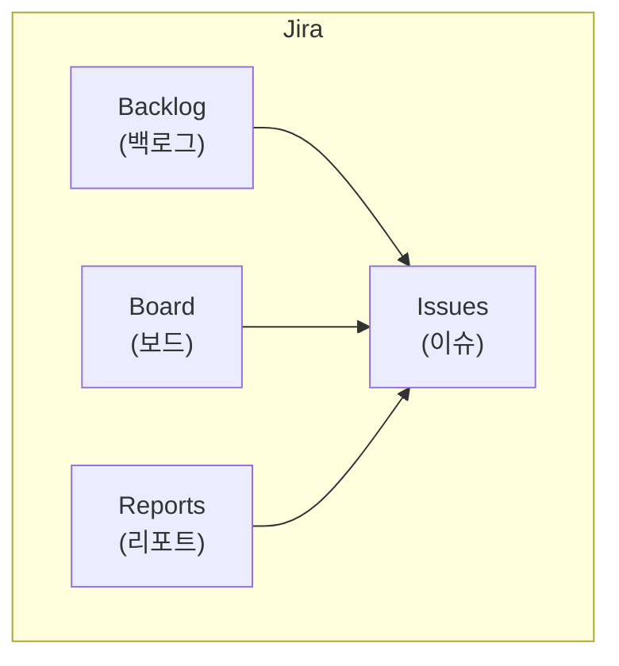

### 1.2 Jira 프로젝트 타입

| 타입 | 설명 | 적합한 팀 |
|------|------|-----------|
| **Scrum** | 스프린트 기반 반복 개발 | 정기 릴리스, 계획 중심 |
| **Kanban** | 연속적 흐름 관리 | 운영, 지원, 지속 배포 |
| **Bug Tracking** | 버그 추적 전용 | QA, 유지보수 |

### 1.3 핵심 구성요소

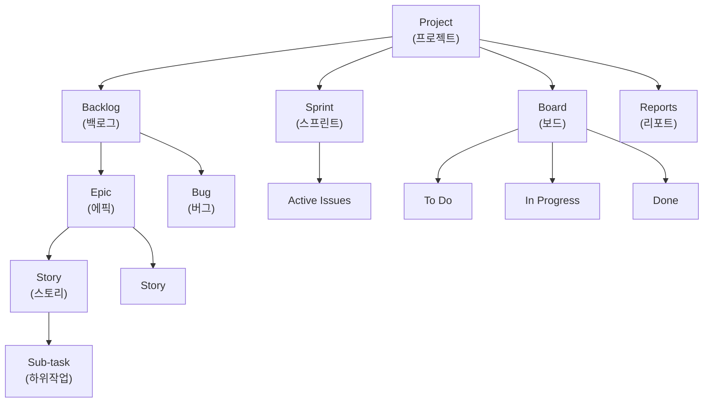

---

## 2. 용어 정의

### 2.1 기본 용어

| 용어 | 영문 | 설명 |
|------|------|------|
| **이슈** | Issue | Jira에서 추적하는 모든 작업 단위 (Epic, Story, Task, Bug 등) |
| **프로젝트** | Project | 이슈들의 컨테이너, 팀/제품 단위로 구성 |
| **프로젝트 키** | Project Key | 프로젝트 식별자 (예: HRKP) |
| **이슈 키** | Issue Key | 이슈 고유 식별자 (예: HRKP-123) |
| **담당자** | Assignee | 이슈를 수행하는 담당자 |
| **보고자** | Reporter | 이슈를 생성한 사람 |

### 2.2 애자일 용어

| 용어 | 영문 | 설명 |
|------|------|------|
| **백로그** | Backlog | 수행해야 할 모든 작업 목록 (우선순위 정렬) |
| **제품 백로그** | Product Backlog | 제품에 필요한 모든 기능/요구사항 목록 |
| **스프린트 백로그** | Sprint Backlog | 현재 스프린트에서 수행할 작업 목록 |
| **스프린트** | Sprint | 고정된 기간(보통 2주)의 개발 주기 |
| **벨로시티** | Velocity | 스프린트당 완료하는 Story Point 평균 |
| **번다운 차트** | Burndown Chart | 스프린트 내 남은 작업량 추이 그래프 |
| **스탠드업** | Stand-up | 매일 진행하는 짧은 상태 공유 미팅 |

### 2.3 이슈 관련 용어

| 용어 | 영문 | 설명 |
|------|------|------|
| **에픽** | Epic | 큰 작업 단위, 여러 스토리를 포함 |
| **스토리** | Story | 사용자 관점의 기능 단위 |
| **스토리 포인트** | Story Point | 작업의 상대적 복잡도/크기 (1, 2, 3, 5, 8, 13...) |
| **태스크** | Task | 기술적 작업 단위 |
| **서브태스크** | Sub-task | 이슈의 하위 작업 |
| **버그** | Bug | 결함/오류 |
| **스파이크** | Spike | 기술 조사/리서치 작업 |

### 2.4 상태 관련 용어

| 용어 | 영문 | 설명 |
|------|------|------|
| **To Do** | To Do | 시작 전 상태 |
| **In Progress** | In Progress | 작업 진행 중 |
| **In Review** | In Review | 코드 리뷰 중 |
| **Done** | Done | 완료됨 |
| **Blocked** | Blocked | 블로커로 인해 진행 불가 |
| **WIP** | Work In Progress | 진행 중인 작업 (WIP 제한과 관련) |

### 2.5 칸반 용어

| 용어 | 영문 | 설명 |
|------|------|------|
| **WIP 제한** | WIP Limit | 동시 진행 작업 수 제한 |
| **리드 타임** | Lead Time | 이슈 생성 → 완료까지 걸린 시간 |
| **사이클 타임** | Cycle Time | 작업 시작 → 완료까지 걸린 시간 |
| **스윔레인** | Swimlane | 보드를 가로로 구분하는 행 (담당자별, Epic별 등) |

---

## 3. 이슈 타입

### 3.1 이슈 타입 계층

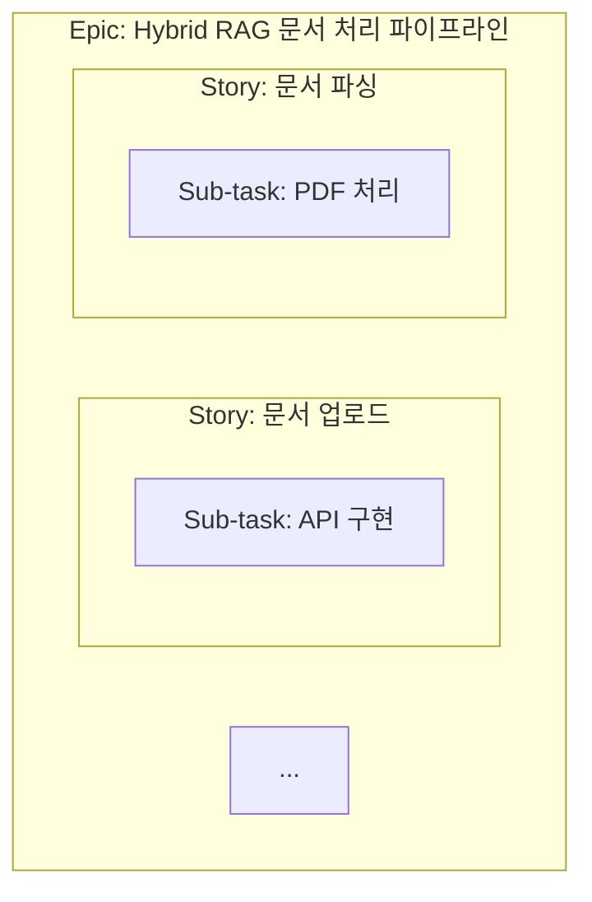

### 3.2 이슈 타입별 특징

| 타입 | 아이콘 | 용도 | 예시 |
|------|--------|------|------|
| **Epic** | 🟣 | 대규모 기능/목표 | "사용자 인증 시스템" |
| **Story** | 🟢 | 사용자 기능 | "로그인 기능 구현" |
| **Task** | 🔵 | 기술 작업 | "DB 스키마 설계" |
| **Bug** | 🔴 | 결함 | "로그인 실패 오류" |
| **Sub-task** | ⚪ | 하위 작업 | "API 엔드포인트 작성" |

### 3.3 User Story 작성법

```markdown
# 좋은 User Story 형식

**As a** [사용자 역할],
**I want** [원하는 기능],
**So that** [얻고자 하는 가치].

# 예시
As a 지식 관리자,
I want 다양한 형식의 문서를 업로드,
So that 문서가 자동으로 검색 가능한 지식으로 변환됨.
```

### 3.4 Acceptance Criteria (인수 조건)

```markdown
# Given-When-Then 형식

Given [사전 조건]
When [행동]
Then [예상 결과]

# 예시
Given 사용자가 PDF 파일을 선택했을 때,
When 업로드 버튼을 클릭하면,
Then 파일이 저장되고 처리 대기열에 추가된다.
```

---

## 4. 프로젝트 설정

### 4.1 새 프로젝트 생성

```
Jira → Projects → Create project → Scrum 선택

설정:
- Name: Hybrid RAG Knowledge Ops
- Key: HRKP
- Project lead: [팀 리드]
```

### 4.2 프로젝트 설정 항목

| 설정 | 위치 | 설명 |
|------|------|------|
| Issue Types | Project Settings → Issue Types | 사용할 이슈 타입 선택 |
| Workflow | Project Settings → Workflows | 상태 전환 규칙 설정 |
| Board | Project Settings → Board | 보드 컬럼 및 필터 설정 |
| Permissions | Project Settings → Permissions | 접근 권한 설정 |
| Notifications | Project Settings → Notifications | 알림 규칙 설정 |

### 4.3 권장 컴포넌트 설정

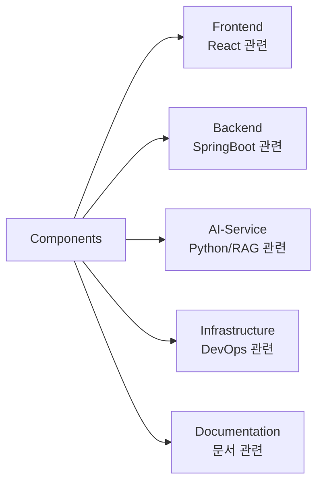

### 4.4 라벨 설정

| 라벨 | 용도 |
|------|------|
| `priority:critical` | 긴급 |
| `priority:high` | 높음 |
| `type:tech-debt` | 기술 부채 |
| `type:refactor` | 리팩토링 |
| `blocked` | 블로커 있음 |
| `needs-review` | 리뷰 필요 |

---

## 5. 백로그 관리

### 5.1 백로그 구조

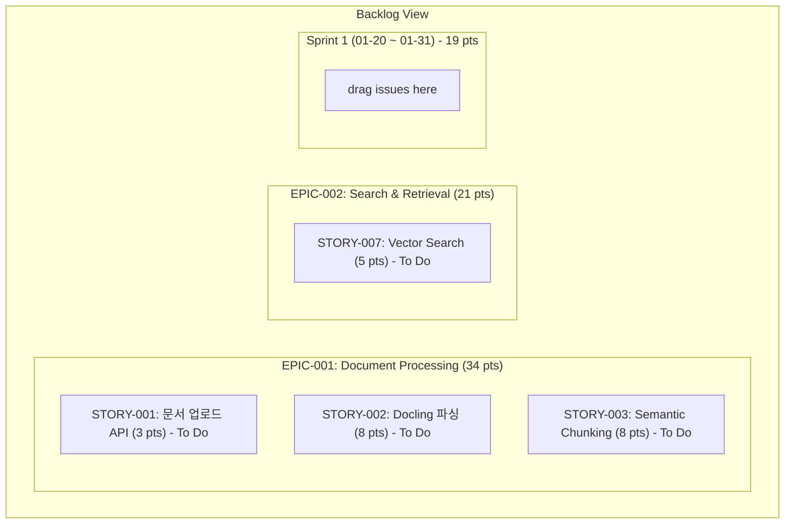

### 5.2 백로그 정제 (Refinement)

**백로그 정제 미팅 (Grooming)**:
- **빈도**: 스프린트 중간 1회 (주 1회)
- **참석**: PO, 개발팀
- **목적**: 다음 스프린트 준비

**정제 활동**:
1. 새 스토리 추가
2. 스토리 상세화 (Acceptance Criteria)
3. Story Point 추정
4. 우선순위 조정
5. 불필요한 이슈 제거

### 5.3 우선순위 설정

| 우선순위 | 의미 | 대응 시간 |
|----------|------|-----------|
| **Highest** | 서비스 장애, 보안 이슈 | 즉시 |
| **High** | 핵심 기능, 블로커 | 이번 스프린트 |
| **Medium** | 일반 기능 | 다음 스프린트 |
| **Low** | 개선사항 | 백로그 |
| **Lowest** | Nice-to-have | 여유 시 |

### 5.4 Story Point 추정

**피보나치 수열 사용**: 1, 2, 3, 5, 8, 13, 21

| Point | 복잡도 | 기준 |
|-------|--------|------|
| 1 | 매우 간단 | 설정 변경, 오타 수정 |
| 2 | 간단 | 단일 함수 수정 |
| 3 | 보통 | 단일 기능 구현 |
| 5 | 복잡 | 여러 파일 수정, 테스트 포함 |
| 8 | 매우 복잡 | 새 모듈, 통합 필요 |
| 13 | 에픽급 | 분해 필요 |
| 21+ | 너무 큼 | 반드시 분해 |

**Planning Poker 절차**:

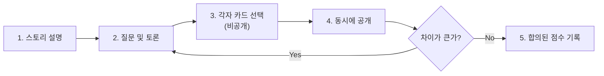

---

## 6. 스프린트 관리

### 6.1 스프린트 생성

```
Backlog → Create Sprint

설정:
- Sprint name: Sprint 01
- Start date: 2026-01-20
- End date: 2026-01-31
- Sprint goal: "문서 처리 파이프라인 1단계 완성"
```

### 6.2 스프린트 계획 (Sprint Planning)

**미팅 구성**:
- **시간**: 스프린트 첫날, 2-4시간
- **참석**: PO, Scrum Master, 개발팀
- **산출물**: 스프린트 백로그, 스프린트 목표

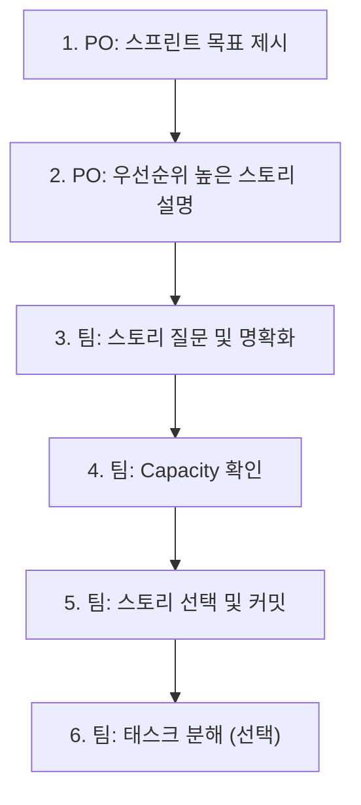

### 6.3 스프린트 실행

**Daily Standup (일일 스탠드업)**:
- **시간**: 매일 같은 시간, 15분
- **형식**: 각자 3가지 공유


**스프린트 중 규칙**:
- 스프린트 범위 변경 최소화
- 새 긴급 이슈 → PO와 협의
- 블로커 즉시 공유

### 6.4 스프린트 리뷰 (Sprint Review)

**미팅 구성**:
- **시간**: 스프린트 마지막 날, 1-2시간
- **참석**: PO, 개발팀, 이해관계자
- **목적**: 완료된 기능 데모, 피드백 수집


### 6.5 스프린트 회고 (Sprint Retrospective)

**미팅 구성**:
- **시간**: 스프린트 리뷰 후, 1시간
- **참석**: Scrum Master, 개발팀 (PO 선택)
- **목적**: 프로세스 개선

**Keep-Problem-Try 형식**:

| Keep (계속할 것) | Problem (문제점) | Try (시도할 것) |
|------------------|------------------|-----------------|
| 페어 프로그래밍 | 추정 부정확 | 버퍼 시간 확보 |
| 매일 코드 리뷰 | 외부 의존성 지연 | 주간 동기화 미팅 |

---

## 7. 칸반 보드

### 7.1 칸반 보드 구성

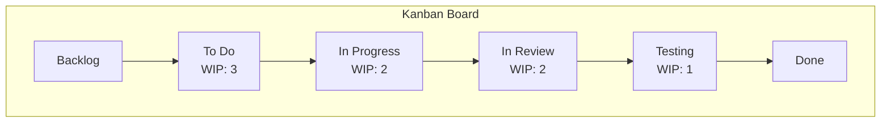

### 7.2 WIP (Work In Progress) 제한

**WIP 제한의 목적**:
- 멀티태스킹 방지
- 병목 현상 가시화
- 처리량 최적화

**권장 WIP 제한**:

| 컬럼 | WIP 제한 | 이유 |
|------|----------|------|
| To Do | 무제한 | 대기열 |
| In Progress | 팀원 수 × 1~2 | 집중 유도 |
| In Review | 2~3 | 리뷰 적체 방지 |
| Testing | 1~2 | QA 병목 방지 |

### 7.3 칸반 보드 설정

```
Board Settings → Columns

컬럼 추가/수정:
1. Backlog (상태: Backlog)
2. To Do (상태: To Do)
3. In Progress (상태: In Progress)
4. In Review (상태: In Review)
5. Testing (상태: Testing)
6. Done (상태: Done)

각 컬럼에 WIP 제한 설정:
- Min: 0
- Max: [원하는 제한]
```

### 7.4 스윔레인 (Swimlane) 설정

```
Board Settings → Swimlanes

옵션:
- None: 스윔레인 없음
- Assignee: 담당자별 행
- Epic: 에픽별 행
- Project: 프로젝트별 행
- Priority: 우선순위별 행
```

**Epic 기준 스윔레인**:

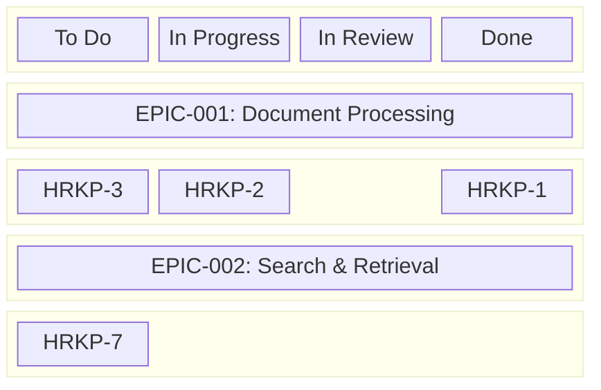

---

## 8. 스크럼 보드

### 8.1 스크럼 보드 vs 칸반 보드

| 특성 | 스크럼 보드 | 칸반 보드 |
|------|-------------|-----------|
| 시간 범위 | 스프린트 단위 | 연속적 |
| 백로그 표시 | 스프린트 백로그만 | 전체 백로그 |
| 완료 후 | 다음 스프린트에 초기화 | 누적 |
| WIP 제한 | 스프린트 커밋으로 암묵적 | 명시적 |

### 8.2 스프린트 번다운 차트

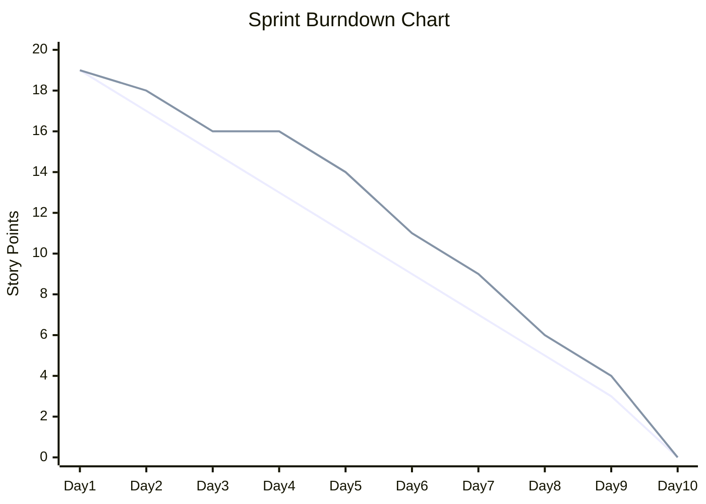

**해석**:
- **이상적 라인 위**: 일정 지연 가능성
- **이상적 라인 아래**: 여유 있음
- **수평 구간**: 진행 중 작업 없음 (블로커?)

---

## 9. 워크플로우

### 9.1 기본 워크플로우

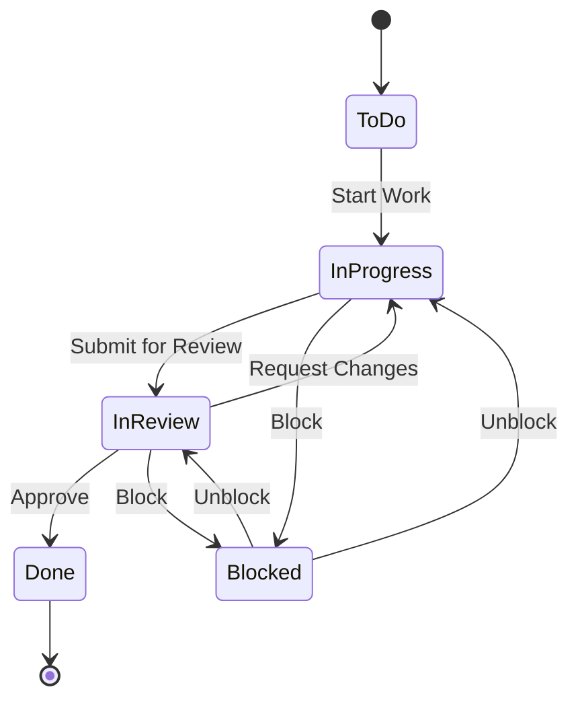

### 9.2 확장 워크플로우

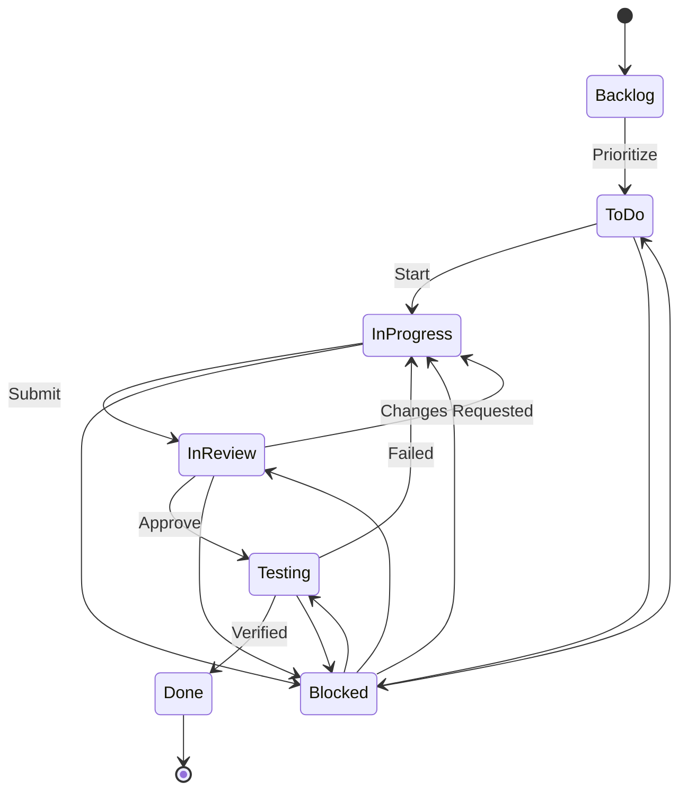

### 9.3 워크플로우 설정

```
Project Settings → Workflows → Edit

트랜지션 추가:
- To Do → In Progress: "Start Work"
- In Progress → In Review: "Submit for Review"
- In Review → In Progress: "Request Changes"
- In Review → Testing: "Approve"
- Testing → Done: "Verified"
- Any → Blocked: "Block"
- Blocked → Any: "Unblock"
```

### 9.4 자동화 규칙

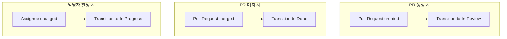

---

## 10. 리포트 및 메트릭

### 10.1 주요 리포트

| 리포트 | 용도 | 주기 |
|--------|------|------|
| **Burndown Chart** | 스프린트 진행 현황 | 일일 |
| **Velocity Chart** | 팀 생산성 추이 | 스프린트별 |
| **Cumulative Flow** | 작업 흐름 분석 | 주간 |
| **Control Chart** | 리드/사이클 타임 | 주간 |
| **Sprint Report** | 스프린트 요약 | 스프린트별 |

### 10.2 벨로시티 차트 (Velocity Chart)

```mermaid
xychart-beta
    title "Velocity Chart"
    x-axis ["Sprint 1", "Sprint 2", "Sprint 3", "Sprint 4"]
    y-axis "Story Points" 0 --> 25
    bar "Committed" [19, 20, 18, 21]
    bar "Completed" [17, 20, 16, 19]
```

**활용**:
- 평균 벨로시티로 다음 스프린트 계획
- 팀 역량 예측

### 10.3 누적 흐름 다이어그램 (Cumulative Flow)

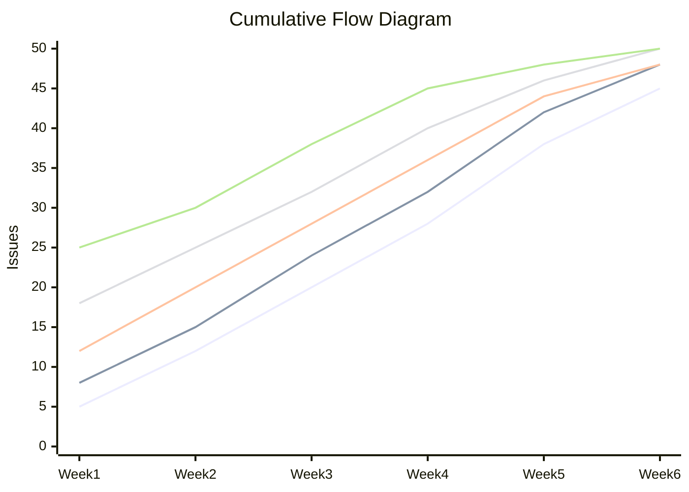

**해석**:
- 각 영역 두께 = WIP
- 영역이 넓어지면 = 병목
- 일정한 기울기 = 안정적 흐름

### 10.4 사이클 타임 (Control Chart)

| 이슈 | 사이클 타임 | 상태 |
|------|-------------|------|
| Issue 1 | 3일 | 정상 |
| Issue 2 | 5일 | 정상 |
| Issue 3 | 8일 | 주의 (UCL 근접) |
| Issue 4 | 4일 | 정상 |
| Issue 5 | 2일 | 양호 |

- **UCL (상한선)**: 8일
- **평균**: 4.4일
- **LCL (하한선)**: 2일

---

## 11. 로컬 백로그 연동

### 11.1 로컬 백로그 구조 (이 프로젝트)

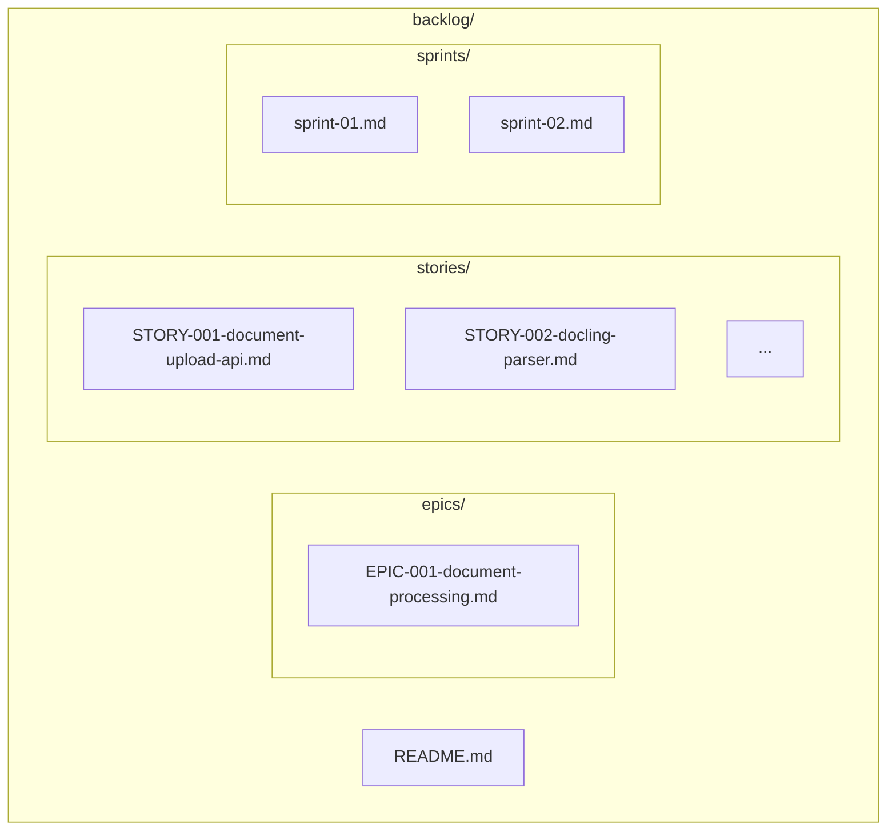

### 11.2 Jira 등록 워크플로우


### 11.3 수동 등록 절차

1. **Epic 등록**
```
Jira → Create → Epic
- Summary: EPIC-001의 제목
- Description: EPIC-001의 내용 복사
```

2. **Story 등록**
```
Jira → Create → Story
- Summary: STORY-001의 제목
- Description: User Story + Acceptance Criteria
- Epic Link: 위에서 생성한 Epic
- Story Points: 3
```

3. **로컬 파일 업데이트**
```markdown
# STORY-001에 Jira ID 추가

| **Jira ID** | HRKP-123 |  ← 등록된 ID로 업데이트
```

### 11.4 CLI를 통한 등록 (선택)

```bash
# Jira CLI 설치
npm install -g jira-cli

# 이슈 생성
jira create \
  --project HRKP \
  --type Story \
  --summary "문서 업로드 API" \
  --description "$(cat backlog/stories/STORY-001-document-upload-api.md)"
```

### 11.5 Claude Agent 활용

```bash
# Claude Code에서
"backlog/stories/STORY-001-document-upload-api.md 내용으로
HRKP 프로젝트에 Story 이슈 생성해줘"
```

---

## 12. Best Practices

### 12.1 백로그 관리

| Practice | 설명 |
|----------|------|
| **DEEP** | Detailed (상세), Estimated (추정), Emergent (발전), Prioritized (우선순위) |
| **정기 정제** | 주 1회 백로그 정제 미팅 |
| **작은 스토리** | 1 스프린트 내 완료 가능한 크기 |
| **독립적 스토리** | 다른 스토리에 의존하지 않음 (INVEST) |

### 12.2 스프린트 관리

| Practice | 설명 |
|----------|------|
| **지속 가능한 속도** | 오버커밋 금지 |
| **버퍼 확보** | 계획 용량의 80% 커밋 |
| **범위 보호** | 스프린트 중 범위 변경 최소화 |
| **블로커 즉시 공유** | 막히면 바로 에스컬레이션 |

### 12.3 보드 관리

| Practice | 설명 |
|----------|------|
| **WIP 제한 준수** | 제한 초과 시 기존 작업 먼저 완료 |
| **일일 업데이트** | 보드 상태 항상 최신 유지 |
| **블로커 가시화** | Blocked 상태 적극 활용 |
| **정기 정리** | 완료된 이슈 아카이브 |

### 12.4 일반 팁

```markdown
# 좋은 이슈 제목
✅ "사용자 로그인 시 세션 만료 오류 수정"
❌ "버그 수정"

# 좋은 설명
✅ 재현 단계, 예상 결과, 실제 결과 포함
❌ "안 됨"

# 좋은 커밋 메시지
✅ "HRKP-123: 로그인 세션 타임아웃 로직 수정"
❌ "fix"
```

### 12.5 Jira 단축키

| 단축키 | 기능 |
|--------|------|
| `c` | 이슈 생성 |
| `g` + `b` | 보드로 이동 |
| `g` + `p` | 백로그로 이동 |
| `/` | 검색 |
| `j` / `k` | 이슈 간 이동 |
| `o` | 이슈 열기 |
| `a` | 담당자 할당 |
| `m` | 댓글 추가 |

---

## 참고 자료

### 공식 문서
- [Jira Software Documentation](https://support.atlassian.com/jira-software-cloud/)
- [Scrum Guide](https://scrumguides.org/)
- [Kanban Guide](https://kanban.university/kanban-guide/)

### 프로젝트 내 문서
- [백로그 관리 가이드](../../backlog/README.md)
- [EPIC-001: Document Processing](../../backlog/epics/EPIC-001-document-processing.md)
- [Sprint 01 계획서](../../backlog/sprints/sprint-01.md)
- [외부솔루션 연동 설정 가이드](../04_외부솔루션_연동_설정_가이드.md)
- [개발자 통합 가이드](../../knowledge_service/docs/05_development/developer_integration_guide.md)
