# Slack 프로젝트 커뮤니케이션 가이드

Slack을 활용한 프로젝트 커뮤니케이션 관리 종합 가이드

**Version**: 1.0 | **Updated**: 2026-01-19

---

## 목차

1. [Slack 기본 개념](#1-slack-기본-개념)
2. [용어 정의](#2-용어-정의)
3. [워크스페이스 설정](#3-워크스페이스-설정)
4. [채널 구조 설계](#4-채널-구조-설계)
5. [메시지 작성 규칙](#5-메시지-작성-규칙)
6. [데일리 스탠드업](#6-데일리-스탠드업)
7. [코드 리뷰 및 PR 알림](#7-코드-리뷰-및-pr-알림)
8. [장애 대응 커뮤니케이션](#8-장애-대응-커뮤니케이션)
9. [외부 서비스 연동](#9-외부-서비스-연동)
10. [봇 및 자동화](#10-봇-및-자동화)
11. [Best Practices](#11-best-practices)

---

## 1. Slack 기본 개념

### 1.1 Slack이란?

Slack은 팀 **협업 및 커뮤니케이션 플랫폼**으로, 채널 기반의 메시징을 통해 프로젝트별/주제별 대화를 체계적으로 관리합니다.

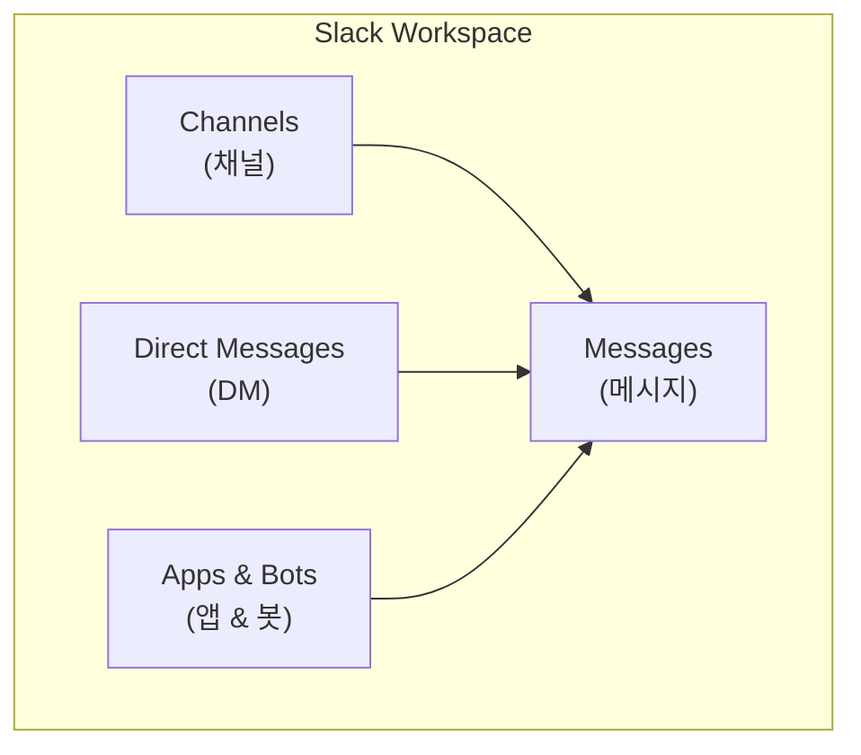

### 1.2 Slack의 핵심 가치

| 가치 | 설명 |
|------|------|
| **투명성** | 공개 채널을 통한 정보 공유 |
| **검색 가능성** | 모든 대화 기록 검색 |
| **비동기 소통** | 시간대/위치 관계없이 협업 |
| **통합** | 외부 도구와 연동 (Jira, GitHub 등) |

### 1.3 핵심 구성요소

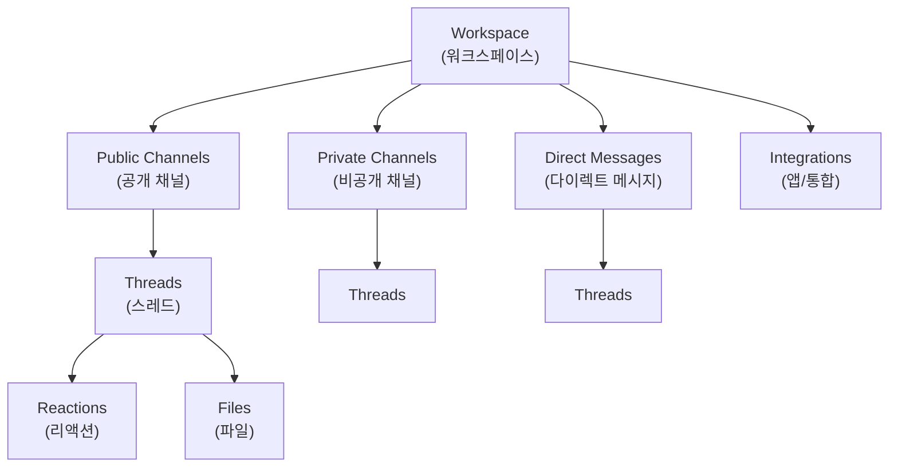

---

## 2. 용어 정의

### 2.1 기본 용어

| 용어 | 영문 | 설명 |
|------|------|------|
| **워크스페이스** | Workspace | 조직/팀의 Slack 공간 |
| **채널** | Channel | 주제별 대화 공간 (#으로 시작) |
| **스레드** | Thread | 메시지에 대한 답글 묶음 |
| **다이렉트 메시지** | DM | 1:1 또는 소그룹 개인 메시지 |
| **멘션** | Mention | @username으로 특정 사용자 호출 |
| **리액션** | Reaction | 이모지로 메시지에 반응 |

### 2.2 채널 관련 용어

| 용어 | 영문 | 설명 |
|------|------|------|
| **공개 채널** | Public Channel | 모든 멤버가 참여/검색 가능 |
| **비공개 채널** | Private Channel | 초대된 멤버만 접근 가능 (🔒) |
| **공유 채널** | Shared Channel | 다른 워크스페이스와 공유 |
| **아카이브** | Archive | 비활성화된 채널 보관 |

### 2.3 멘션 유형

| 멘션 | 대상 | 사용 시점 |
|------|------|----------|
| `@username` | 특정 사용자 | 담당자 지정, 질문 |
| `@here` | 현재 온라인 멤버 | 긴급하지만 전체는 아닐 때 |
| `@channel` | 채널 전체 멤버 | 중요 공지 (알림 발생) |
| `@everyone` | 워크스페이스 전체 | 매우 제한적 사용 |

### 2.4 상태 관련 용어

| 상태 | 아이콘 | 의미 |
|------|--------|------|
| **Active** | 🟢 | 온라인, 응답 가능 |
| **Away** | ⚪ | 자리비움 (자동 전환) |
| **DND** | 🔴 | 방해 금지 모드 |
| **Custom** | 🎯 | 사용자 정의 상태 |

---

## 3. 워크스페이스 설정

### 3.1 워크스페이스 구조

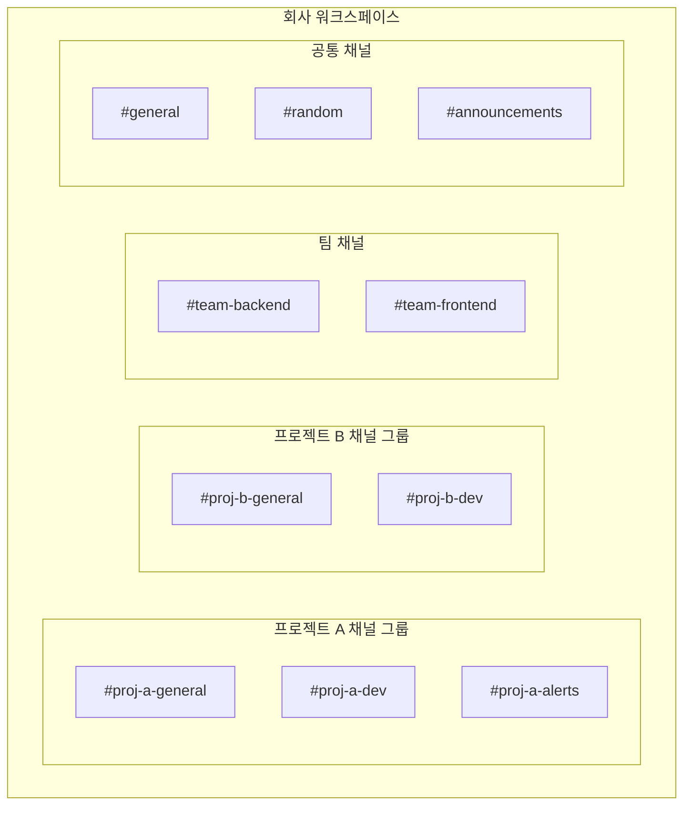

### 3.2 권장 워크스페이스 설정

| 설정 | 위치 | 권장값 |
|------|------|--------|
| Default channels | Settings → Default Channels | #general, #announcements |
| Posting permissions | Channel Settings | 공지 채널은 관리자만 |
| Message retention | Settings → Retention | 프로젝트별 정책 |
| File storage | Settings → File Storage | 외부 저장소 연동 권장 |

### 3.3 사용자 그룹 (User Groups)

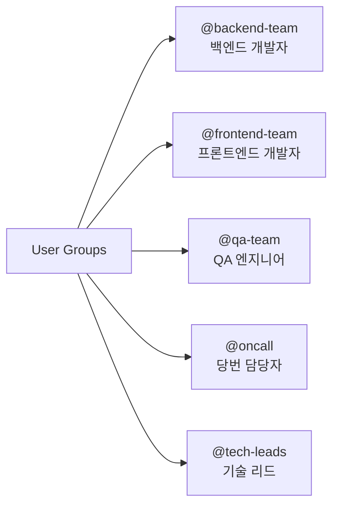

**그룹 생성 방법**:
```
Slack → People & User Groups → User Groups → Create User Group

설정:
- Handle: backend-team
- Name: Backend Team
- Purpose: 백엔드 개발팀 멘션용
- Members: [팀원 추가]
```

---

## 4. 채널 구조 설계

### 4.1 채널 명명 규칙

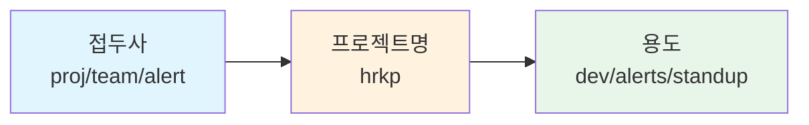

**명명 패턴**: `{접두사}-{프로젝트/팀}-{용도}`

| 접두사 | 용도 | 예시 |
|--------|------|------|
| `proj-` | 프로젝트 관련 | #proj-hrkp-dev |
| `team-` | 팀 관련 | #team-backend |
| `alert-` | 알림/모니터링 | #alert-prod-errors |
| `help-` | 도움 요청 | #help-infra |
| `tmp-` | 임시 채널 | #tmp-migration-2026 |

### 4.2 프로젝트별 권장 채널 구조

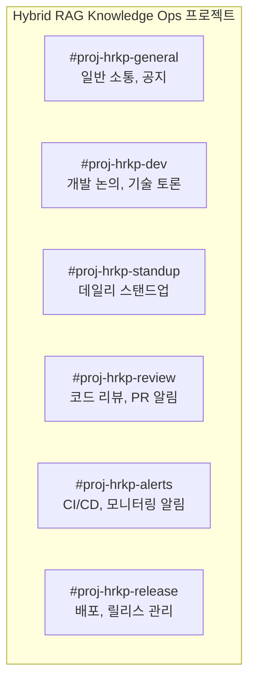

### 4.3 채널 설명 템플릿

```markdown
# 채널 설명 (Description)
[목적] 간단한 채널 목적 설명

# 채널 토픽 (Topic)
📌 현재 스프린트: Sprint 01 | 🎯 목표: Document Processing 파이프라인 | 📅 종료: 01-31
```

### 4.4 채널별 용도 상세

| 채널 | 용도 | 참여자 | 알림 설정 |
|------|------|--------|----------|
| **#proj-xxx-general** | 일반 소통, 의사결정 | 전체 | 기본 |
| **#proj-xxx-dev** | 기술 논의, 구현 질문 | 개발팀 | 기본 |
| **#proj-xxx-standup** | 데일리 스탠드업 | 개발팀 | 필수 |
| **#proj-xxx-review** | PR/MR 알림, 리뷰 요청 | 개발팀 | 기본 |
| **#proj-xxx-alerts** | 자동화 알림 | 개발팀 | 중요만 |
| **#proj-xxx-release** | 배포 공지 | 전체 | 필수 |

---

## 5. 메시지 작성 규칙

### 5.1 효과적인 메시지 구조

```markdown
# 좋은 메시지 예시

📋 **[요청]** API 설계 검토
━━━━━━━━━━━━━━━━━━━━
**배경**: Document Upload API 설계가 완료되었습니다.
**요청**: @backend-team 리뷰 부탁드립니다.
**마감**: 내일(01/20) 오전까지
**링크**: [설계 문서](https://...)

cc: @김개발 @이백엔드
```

### 5.2 메시지 유형별 포맷

| 유형 | 접두어 | 예시 |
|------|--------|------|
| **요청** | 📋 [요청] | 리뷰 요청, 작업 요청 |
| **질문** | ❓ [질문] | 기술 질문, 의견 요청 |
| **공지** | 📢 [공지] | 중요 안내, 일정 변경 |
| **공유** | 📎 [공유] | 문서, 자료 공유 |
| **완료** | ✅ [완료] | 작업 완료 보고 |
| **장애** | 🚨 [장애] | 장애 발생/복구 |
| **논의** | 💬 [논의] | 의사결정 필요 사항 |

### 5.3 스레드 활용 규칙

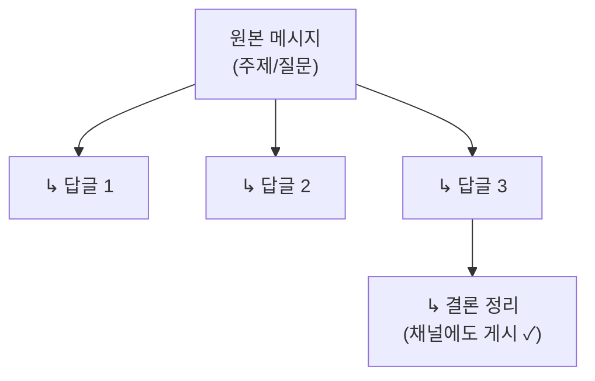

**스레드 규칙**:
- 관련 논의는 반드시 스레드에서
- 채널 본문은 새로운 주제만
- 결론은 "Also send to channel" 체크하여 공유

### 5.4 리액션 컨벤션

| 리액션 | 의미 | 용도 |
|--------|------|------|
| 👀 | 확인함 | 메시지를 읽었음 |
| ✅ | 완료/동의 | 작업 완료, 승인 |
| 👍 | 좋아요 | 긍정적 반응 |
| 🙏 | 감사 | 도움 감사 |
| 🔍 | 확인 중 | 조사/검토 중 |
| ⏰ | 나중에 | 추후 확인 예정 |
| 🚀 | 배포됨 | 배포 완료 |
| ❌ | 반대/불가 | 부정적 의견 |

### 5.5 메시지 포맷팅

```markdown
# Slack 마크다운

*기울임* 또는 _기울임_
**굵게** 또는 __굵게__
~취소선~
`인라인 코드`
```코드 블록```
> 인용문
• 목록 (shift+8)
1. 번호 목록
```

---

## 6. 데일리 스탠드업

### 6.1 스탠드업 채널 운영

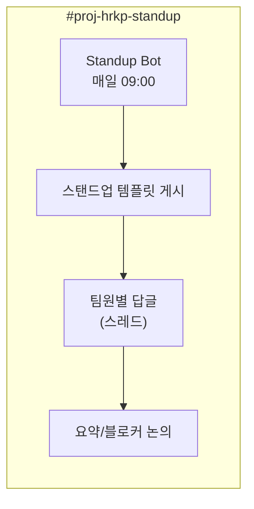

### 6.2 스탠드업 템플릿

```markdown
🌅 **Daily Standup - 2026-01-19 (Mon)**
━━━━━━━━━━━━━━━━━━━━━━━━━━━━━

아래 형식으로 스레드에 답글 남겨주세요:

**어제 한 일**:
-

**오늘 할 일**:
-

**블로커/도움 필요**:
-

━━━━━━━━━━━━━━━━━━━━━━━━━━━━━
⏰ 마감: 오전 10:00 | 📍 담당: @tech-leads
```

### 6.3 스탠드업 답변 예시

```markdown
**어제 한 일**:
- STORY-001 문서 업로드 API 구현 완료
- 단위 테스트 작성 (80% 커버리지)

**오늘 할 일**:
- STORY-001 코드 리뷰 반영
- STORY-002 Docling 파서 조사 시작

**블로커/도움 필요**:
- 🔴 Neo4j 접속 권한 필요 (@인프라팀 확인 요청)
```

### 6.4 비동기 스탠드업 운영

| 시간대 | 활동 |
|--------|------|
| 09:00 | 봇이 스탠드업 템플릿 게시 |
| 09:00-10:00 | 팀원 각자 스레드에 답변 |
| 10:00 | 리드가 블로커 확인 및 대응 |
| 10:30 | 필요시 화상 미팅 (블로커 해결) |

---

## 7. 코드 리뷰 및 PR 알림

### 7.1 PR 알림 채널 구조

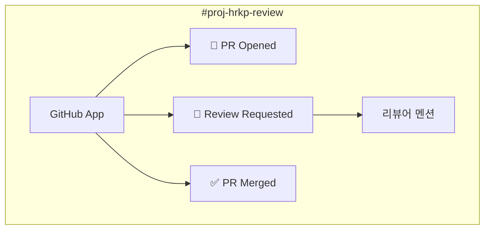

### 7.2 PR 알림 메시지 형식

```markdown
🔔 **[PR 오픈]** feat: Document Upload API 구현
━━━━━━━━━━━━━━━━━━━━━━━━━━━━━
**PR**: #123 - feat: Document Upload API 구현
**작성자**: @김개발
**브랜치**: feature/document-upload → main
**리뷰어**: @이백엔드 @박시니어

**변경 사항**:
- 문서 업로드 엔드포인트 추가
- 파일 검증 로직 구현
- 단위 테스트 추가

🔗 [PR 링크](https://github.com/...)
```

### 7.3 리뷰 요청/완료 플로우

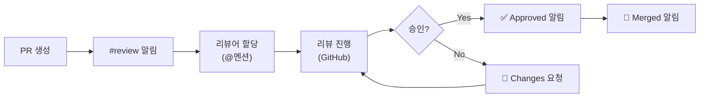

### 7.4 리뷰 요청 메시지 작성법

```markdown
💬 **[리뷰 요청]** PR #123 리뷰 부탁드립니다
━━━━━━━━━━━━━━━━━━━━━━━━━━━━━
@이백엔드 @박시니어

**PR**: feat: Document Upload API 구현
**우선순위**: 높음 (스프린트 블로커)
**예상 리뷰 시간**: 30분

**리뷰 포인트**:
1. 파일 검증 로직 적절한지
2. 에러 핸들링 누락 없는지
3. 테스트 커버리지 충분한지

🔗 https://github.com/.../pull/123
```

---

## 8. 장애 대응 커뮤니케이션

### 8.1 장애 알림 채널

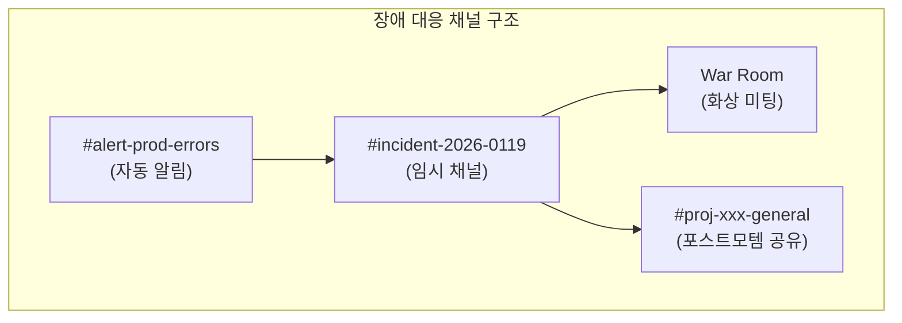

### 8.2 장애 발생 알림 템플릿

```markdown
🚨 **[장애 발생]** Production API 응답 지연
━━━━━━━━━━━━━━━━━━━━━━━━━━━━━
**심각도**: 🔴 Critical
**발생 시각**: 2026-01-19 14:30 KST
**영향 범위**: 전체 사용자
**증상**: API 응답 시간 10초 이상

**현재 상황**:
- 원인 조사 중
- 담당: @oncall (@김개발)

**관련 링크**:
- [대시보드](https://...)
- [로그](https://...)

━━━━━━━━━━━━━━━━━━━━━━━━━━━━━
📢 업데이트는 스레드로 공유됩니다.
```

### 8.3 장애 대응 프로세스

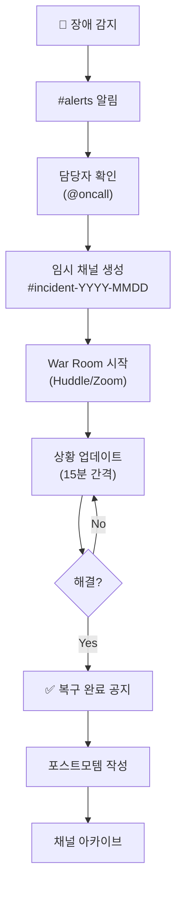

### 8.4 장애 상태 업데이트 형식

```markdown
🔄 **[업데이트 #3]** 14:55 KST
━━━━━━━━━━━━━━━━━━━━━━━
**상태**: 🟡 조사 중 → 원인 파악
**원인**: DB 커넥션 풀 고갈
**조치**: 커넥션 풀 사이즈 증가 중
**예상 복구**: 15:10 KST

다음 업데이트: 15:10 또는 상태 변경 시
```

### 8.5 장애 복구 공지

```markdown
✅ **[장애 복구]** Production API 정상화
━━━━━━━━━━━━━━━━━━━━━━━━━━━━━
**복구 시각**: 2026-01-19 15:08 KST
**장애 시간**: 38분

**원인**: DB 커넥션 풀 설정 부족
**조치**: 풀 사이즈 50 → 100 증가

**후속 조치**:
- [ ] 포스트모템 작성 (담당: @김개발, 기한: 01/21)
- [ ] 모니터링 알림 임계값 조정

━━━━━━━━━━━━━━━━━━━━━━━━━━━━━
불편을 드려 죄송합니다. 🙏
```

---

## 9. 외부 서비스 연동

### 9.1 주요 연동 서비스

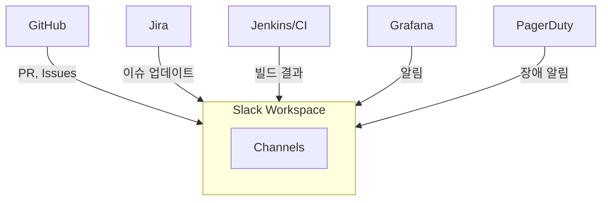

### 9.2 GitHub 연동

**설치**: Slack App Directory → GitHub

```
/github subscribe owner/repo pulls reviews comments
```

| 이벤트 | 알림 내용 |
|--------|----------|
| `pulls` | PR 생성, 업데이트, 머지 |
| `reviews` | 리뷰 요청, 승인, 변경 요청 |
| `comments` | PR/이슈 코멘트 |
| `issues` | 이슈 생성, 클로즈 |
| `commits` | 커밋 푸시 |
| `deployments` | 배포 상태 |

### 9.3 Jira 연동

**설치**: Slack App Directory → Jira Cloud

```
/jira connect
/jira create [project] [issue-type]
```

| 기능 | 명령어 |
|------|--------|
| 이슈 생성 | `/jira create HRKP bug` |
| 이슈 조회 | `HRKP-123` 입력 시 자동 프리뷰 |
| 알림 설정 | Jira → Project Settings → Slack |

### 9.4 CI/CD 연동 (Jenkins/GitHub Actions)

```yaml
# GitHub Actions 예시
- name: Slack Notification
  uses: 8398a7/action-slack@v3
  with:
    status: ${{ job.status }}
    channel: '#proj-hrkp-alerts'
  env:
    SLACK_WEBHOOK_URL: ${{ secrets.SLACK_WEBHOOK }}
```

**알림 메시지 예시**:
```markdown
🏗️ **[빌드 완료]** main 브랜치
━━━━━━━━━━━━━━━━━━━━
**상태**: ✅ Success
**커밋**: feat: Add document upload API
**작성자**: 김개발
**시간**: 3m 42s

🔗 [빌드 로그](https://...)
```

### 9.5 모니터링 연동 (Grafana/Prometheus)

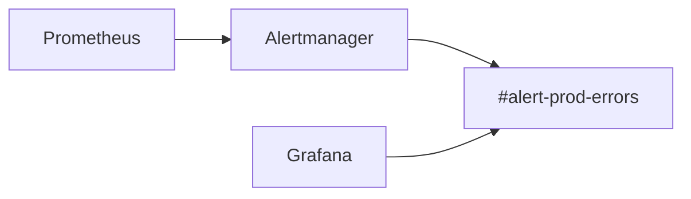

**알림 채널 분류**:

| 채널 | 알림 유형 | 심각도 |
|------|----------|--------|
| #alert-prod-critical | 서비스 장애 | Critical |
| #alert-prod-errors | 에러 임계 초과 | Warning |
| #alert-prod-info | 정보성 알림 | Info |

---

## 10. 봇 및 자동화

### 10.1 유용한 Slack 봇

| 봇 | 용도 | 주요 기능 |
|----|------|----------|
| **Standup Bot** | 데일리 스탠드업 | 자동 템플릿 게시, 리마인더 |
| **Polly** | 설문/투표 | 빠른 의사결정 |
| **Donut** | 랜덤 커피챗 | 팀 빌딩 |
| **Giphy** | GIF 검색 | 소통 활성화 |
| **Zapier/Make** | 자동화 | 다양한 워크플로우 |

### 10.2 Slack Workflow Builder

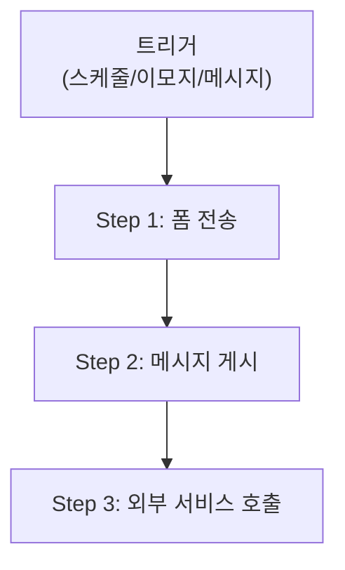

**스탠드업 자동화 예시**:
1. **트리거**: 매일 09:00
2. **액션**: #standup 채널에 템플릿 게시
3. **액션**: @channel 멘션

### 10.3 커스텀 봇 구축 (예시)

```python
# Slack Bolt (Python)
from slack_bolt import App

app = App(token=os.environ["SLACK_BOT_TOKEN"])

@app.message("안녕")
def say_hello(message, say):
    say(f"안녕하세요 <@{message['user']}>님! 👋")

@app.command("/standup")
def handle_standup(ack, body, client):
    ack()
    client.views_open(
        trigger_id=body["trigger_id"],
        view={
            "type": "modal",
            "title": {"type": "plain_text", "text": "Daily Standup"},
            # ... 모달 내용
        }
    )
```

### 10.4 Webhook 활용

```bash
# Incoming Webhook으로 메시지 전송
curl -X POST -H 'Content-type: application/json' \
  --data '{"text":"배포가 완료되었습니다! 🚀"}' \
  https://hooks.slack.com/services/T00/B00/XXX
```

**JSON 페이로드 예시**:
```json
{
  "channel": "#proj-hrkp-release",
  "username": "Deploy Bot",
  "icon_emoji": ":rocket:",
  "blocks": [
    {
      "type": "section",
      "text": {
        "type": "mrkdwn",
        "text": "✅ *Production 배포 완료*\n버전: v1.2.3"
      }
    }
  ]
}
```

---

## 11. Best Practices

### 11.1 채널 관리

| Practice | 설명 |
|----------|------|
| **명확한 목적** | 채널 생성 시 목적/규칙 명시 |
| **정기 정리** | 분기별 사용하지 않는 채널 아카이브 |
| **네이밍 일관성** | 정해진 명명 규칙 준수 |
| **설명 업데이트** | 채널 토픽/설명 항상 최신 유지 |

### 11.2 메시지 에티켓

| Practice | 설명 |
|----------|------|
| **스레드 사용** | 관련 논의는 반드시 스레드에서 |
| **멘션 절제** | @channel/@here 남용 금지 |
| **검색 가능하게** | 나중에 찾을 수 있도록 명확하게 작성 |
| **이모지 활용** | 리액션으로 읽음/동의 표시 |

### 11.3 알림 관리

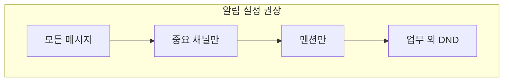

| 채널 유형 | 알림 설정 |
|----------|----------|
| 프로젝트 general | 모든 메시지 |
| 개발 논의 | 멘션만 |
| 알림/모니터링 | 중요 키워드만 |
| 사교/random | 없음 |

### 11.4 비동기 커뮤니케이션

| Practice | 설명 |
|----------|------|
| **기대 응답 시간 명시** | "내일까지 확인 부탁드립니다" |
| **맥락 포함** | 상대방이 이전 대화 몰라도 이해할 수 있게 |
| **타임존 고려** | 상대 근무 시간 고려 |
| **상태 활용** | DND, 휴가 상태 적극 설정 |

### 11.5 보안 규칙

```markdown
# 🔒 Slack 보안 규칙

✅ 해야 할 것:
- 민감 정보는 DM 또는 비공개 채널에서
- 2단계 인증 활성화
- 정기적 앱 권한 검토

❌ 하지 말아야 할 것:
- 비밀번호, API 키 공유
- 고객 개인정보 게시
- 외부 공유 채널에 내부 정보
```

### 11.6 Slack 단축키

| 단축키 | 기능 | 플랫폼 |
|--------|------|--------|
| `Cmd/Ctrl + K` | 채널/DM 빠른 이동 | 공통 |
| `Cmd/Ctrl + Shift + \` | 리액션 추가 | 공통 |
| `Cmd/Ctrl + /` | 단축키 목록 | 공통 |
| `↑` | 마지막 메시지 수정 | 공통 |
| `Cmd/Ctrl + Shift + M` | 멘션/리액션 보기 | 공통 |
| `Cmd/Ctrl + Shift + A` | 모든 읽지 않은 메시지 | 공통 |
| `Cmd/Ctrl + Shift + Enter` | 스레드에 전송 + 채널 공유 | 공통 |

---

## 참고 자료

### 공식 문서
- [Slack Help Center](https://slack.com/help)
- [Slack API Documentation](https://api.slack.com/)
- [Slack App Directory](https://slack.com/apps)

### 프로젝트 내 문서
- [Jira & Agile 프로젝트 관리 가이드](./05_Jira_Agile_프로젝트_관리_가이드.md)
- [외부솔루션 연동 설정 가이드](./04_외부솔루션_연동_설정_가이드.md)
- [개발자 통합 가이드](../knowledge_service/docs/05_development/02_developer_integration_guide.md)

### 템플릿 다운로드
- [스탠드업 템플릿](#62-스탠드업-템플릿)
- [장애 알림 템플릿](#82-장애-발생-알림-템플릿)
- [PR 알림 템플릿](#72-pr-알림-메시지-형식)
