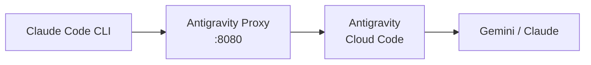
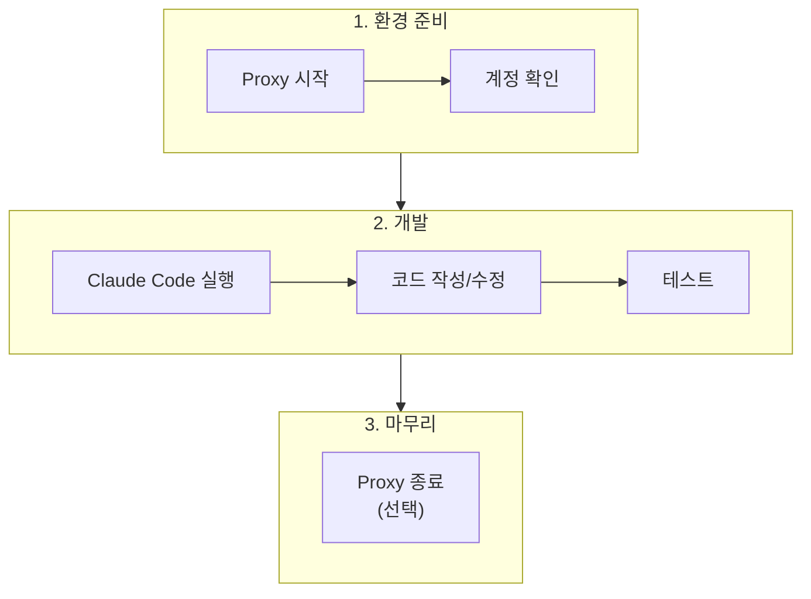
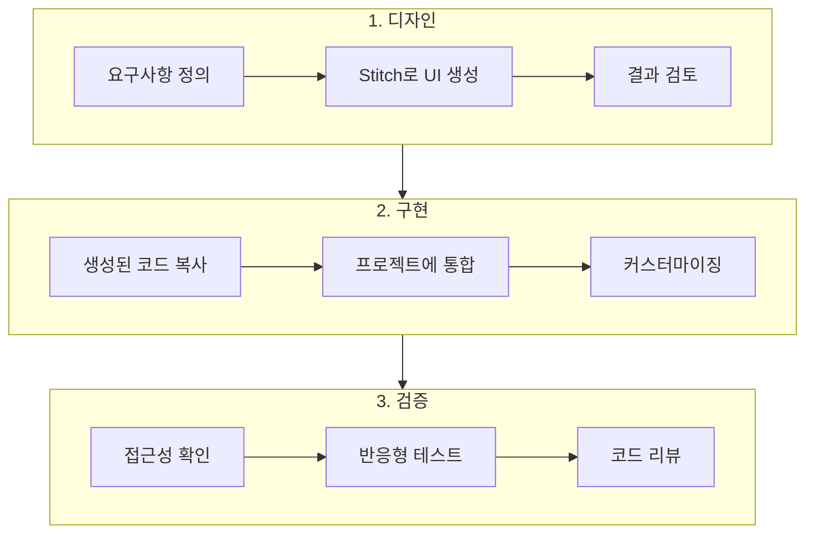

# Antigravity 설정 가이드 (개인 실험용)

**버전**: 1.0
**작성일**: 2026-01-25
**목적**: 개인 실험/학습 용도로 Antigravity를 Claude Code와 연동하는 방법 안내

---

> **중요 고지사항**
>
> 이 가이드는 **개인 실험/학습 용도**로만 사용하세요.
> - 기업/팀 프로젝트에서는 권장하지 않습니다
> - 서비스 약관(ToS) 위반 가능성이 있습니다
> - 계정 정지/제재 위험을 본인이 감수해야 합니다
> - 자세한 내용: [검토결과_05_Antigravity_Claude_Proxy.md](./technical_assessment/Guides/검토결과_05_Antigravity_Claude_Proxy.md)

---

## 1. 개요

### 1.1 Antigravity란?

| 항목 | 내용 |
|------|------|
| **서비스** | Google의 AI 코딩 도구 (Gemini + Cloud Code) |
| **특징** | 무료 티어, Tailwind CSS 네이티브 생성 |
| **연동 방법** | Antigravity Claude Proxy를 통한 API 호환 |

### 1.2 구성 요소



---

## 2. 사전 요구사항

### 2.1 필수 요구사항

- [ ] Node.js 18+ 설치
- [ ] Google 계정 (Antigravity 사용)
- [ ] Claude Code CLI 설치

### 2.2 확인 명령어

```bash
# Node.js 버전 확인
node --version  # v18.x 이상

# Claude Code 확인
claude --version
```

---

## 3. 설치 및 설정

### 3.1 Antigravity Proxy 설치

```bash
# 방법 1: npx로 바로 실행 (권장)
npx antigravity-claude-proxy@latest start

# 방법 2: 전역 설치
npm install -g antigravity-claude-proxy@latest
antigravity-claude-proxy start
```

### 3.2 계정 연결

**방법 A: 웹 대시보드 (권장)**

1. 브라우저에서 `http://localhost:8080` 접속
2. **Accounts** 탭 클릭
3. **Add Account** 버튼 클릭
4. Google 계정으로 로그인
5. 권한 승인

**방법 B: CLI**

```bash
# 브라우저 자동 열림
antigravity-claude-proxy accounts add

# 브라우저 없이 (토큰 직접 입력)
antigravity-claude-proxy accounts add --no-browser
```

### 3.3 환경 변수 설정

**macOS/Linux (zsh):**

```bash
# ~/.zshrc 또는 ~/.bashrc에 추가
export ANTHROPIC_BASE_URL="http://localhost:8080"
export ANTHROPIC_AUTH_TOKEN="test"

# 적용
source ~/.zshrc
```

**Windows PowerShell:**

```powershell
# 현재 세션
$env:ANTHROPIC_BASE_URL = "http://localhost:8080"
$env:ANTHROPIC_AUTH_TOKEN = "test"

# 영구 설정 (프로필에 추가)
Add-Content $PROFILE 'export ANTHROPIC_BASE_URL="http://localhost:8080"'
```

### 3.4 Claude Code 설정

`~/.claude/settings.json` 파일 수정:

```json
{
  "env": {
    "ANTHROPIC_BASE_URL": "http://localhost:8080",
    "ANTHROPIC_AUTH_TOKEN": "test",
    "ANTHROPIC_MODEL": "claude-opus-4-5-thinking",
    "ANTHROPIC_DEFAULT_HAIKU_MODEL": "gemini-2.5-flash-lite[1m]",
    "ENABLE_EXPERIMENTAL_MCP_CLI": "true"
  }
}
```

또는 웹 대시보드에서:
1. `http://localhost:8080` 접속
2. **Settings** 탭
3. **Claude CLI** 섹션에서 자동 설정

---

## 4. 사용 방법

### 4.1 프록시 시작

```bash
# 기본 시작
antigravity-claude-proxy start

# 포트 변경
PORT=3001 antigravity-claude-proxy start

# 백그라운드 실행
antigravity-claude-proxy start &
```

### 4.2 Claude Code 사용

```bash
# 프록시 실행 상태에서
claude

# 또는 특정 모델 지정
claude --model claude-opus-4-5-thinking
```

### 4.3 사용 가능한 모델

| 모델 ID | 설명 | 추천 용도 |
|---------|------|----------|
| `claude-opus-4-5-thinking` | Claude Opus 4.5 (사고 확장) | 복잡한 작업 |
| `claude-sonnet-4-5-thinking` | Claude Sonnet 4.5 | 일반 작업 |
| `gemini-3-pro-high` | Gemini 3 Pro | 고성능 |
| `gemini-3-flash` | Gemini 3 Flash | 빠른 응답 |
| `gemini-2.5-flash-lite[1m]` | Gemini 2.5 Flash Lite | Haiku 대체 |

### 4.4 모니터링

```bash
# 계정 상태 확인
curl "http://localhost:8080/account-limits?format=table"

# 웹 대시보드
open http://localhost:8080  # macOS
xdg-open http://localhost:8080  # Linux
start http://localhost:8080  # Windows
```

---

## 5. 다중 계정 설정 (선택)

### 5.1 추가 계정 등록

```bash
# 계정 추가
antigravity-claude-proxy accounts add

# 계정 목록 확인
antigravity-claude-proxy accounts list
```

### 5.2 로드 밸런싱 전략

```bash
# hybrid (기본): 스마트 선택
antigravity-claude-proxy start --strategy=hybrid

# sticky: 캐시 최적화 (동일 프롬프트 → 동일 계정)
antigravity-claude-proxy start --strategy=sticky

# round-robin: 순차 분산
antigravity-claude-proxy start --strategy=round-robin
```

| 전략 | 장점 | 단점 | 추천 시나리오 |
|------|------|------|--------------|
| hybrid | 균형 잡힌 선택 | - | 기본값 |
| sticky | 캐시 히트율 높음 | 부하 불균형 | 반복 작업 |
| round-robin | 균등 분배 | 캐시 비효율 | 다양한 작업 |

---

## 6. Stitch MCP 연동 (UI 디자인)

### 6.1 Stitch MCP란?

Antigravity의 UI 디자인 생성 MCP 서버입니다.
자연어로 UI를 설명하면 Tailwind CSS 코드를 생성합니다.

### 6.2 설정 방법

`~/.claude/settings.json`에 MCP 서버 추가:

```json
{
  "mcpServers": {
    "stitch": {
      "command": "npx",
      "args": ["-y", "@anthropic/stitch-mcp"]
    }
  }
}
```

### 6.3 사용 예시

```
Claude Code에서:

> Stitch로 로그인 폼을 만들어줘.
> - 이메일, 비밀번호 입력 필드
> - 로그인 버튼 (파란색)
> - 반응형 (모바일 우선)
> - 다크 모드 지원
```

---

## 7. 워크플로우

### 7.1 일반 개발 워크플로우



### 7.2 UI 개발 워크플로우 (Stitch 활용)



---

## 8. 문제 해결

### 8.1 일반적인 문제

| 문제 | 원인 | 해결 방법 |
|------|------|----------|
| 프록시 연결 실패 | 프록시 미실행 | `antigravity-claude-proxy start` |
| 인증 오류 | 계정 미연결 | 웹 대시보드에서 계정 추가 |
| 속도 제한 | 무료 티어 한도 | 다중 계정 설정 또는 대기 |
| 모델 오류 | 잘못된 모델 ID | 사용 가능한 모델 확인 |

### 8.2 로그 확인

```bash
# 프록시 로그 (실시간)
antigravity-claude-proxy start --verbose

# 웹 대시보드의 Logs 탭 확인
open http://localhost:8080
```

### 8.3 초기화

```bash
# 설정 초기화
antigravity-claude-proxy reset

# 계정 제거
antigravity-claude-proxy accounts remove <account-id>
```

---

## 9. 팁 & 베스트 프랙티스

### 9.1 효율적인 사용

- **프록시는 백그라운드로 실행**: `antigravity-claude-proxy start &`
- **sticky 전략 활용**: 반복 작업 시 캐시 효율 향상
- **다중 계정**: 속도 제한 우회 (단, 과도한 사용 주의)

### 9.2 안전한 사용

- **개인 계정만 사용**: 회사 계정 사용 금지
- **과도한 사용 자제**: 속도 제한에 걸리면 대기
- **정기적 상태 확인**: 웹 대시보드로 사용량 모니터링

### 9.3 원래 설정 복원

Antigravity 사용 후 공식 Anthropic API로 돌아가려면:

```bash
# 환경 변수 제거
unset ANTHROPIC_BASE_URL
unset ANTHROPIC_AUTH_TOKEN

# 또는 ~/.claude/settings.json에서 env 섹션 제거/주석 처리
```

---

## 10. 관련 문서

- [Antigravity Claude Proxy 검토 결과](./technical_assessment/Guides/검토결과_05_Antigravity_Claude_Proxy.md)
- [Tailwind Antigravity Stitch 도입 영향도 분석](./technical_assessment/Guides/04.Tailwind_Antigravity_Stitch_도입_영향도_분석.md)
- [MUI to Tailwind 마이그레이션 가이드](../knowledge_service/docs/05_development/06_mui_to_tailwind_migration.md)
- [GitHub: antigravity-claude-proxy](https://github.com/badrisnarayanan/antigravity-claude-proxy)

---

**문서 버전**: 1.0
**최종 수정**: 2026-01-25
