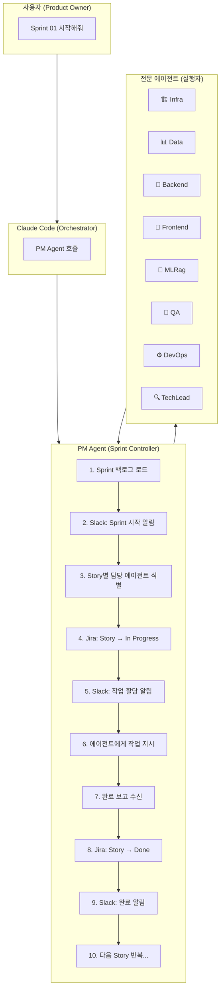
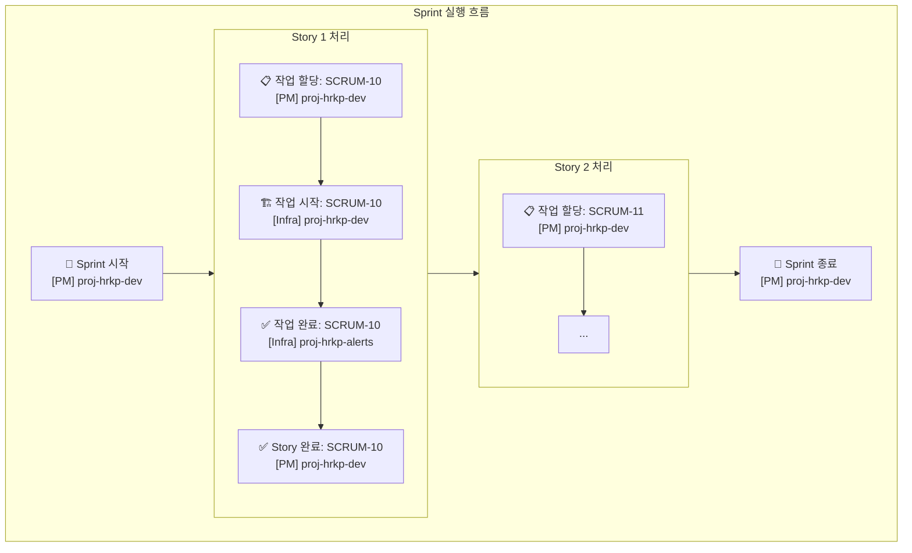
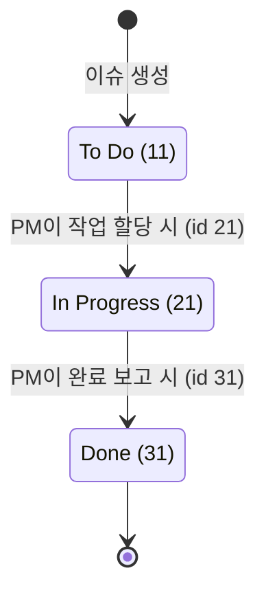
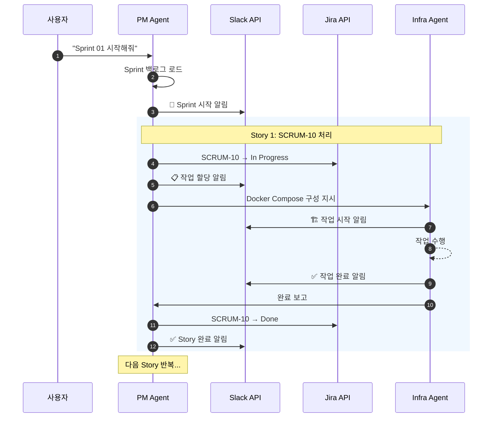
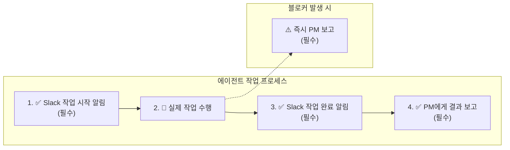

# PM 중심 워크플로우 가이드

**Version**: 1.2 | **Updated**: 2026-01-19

> **현행화 정보**
> - **최종 현행화**: 2026-02-20
> - **프로젝트 상태**: 종료 (2026-02-18)
> - **문서 상태**: 일부 outdated
> - **주요 변경사항**: (1) 에이전트 구조가 8개 → 13개로 확장됨. (2) Agent Teams v3.1 도입으로 PM 역할이 고도화됨 — PM은 코드 작성 금지 원칙 명문화. (3) Slack 채널 알림 방식이 MCP(메인) + send_slack.sh(서브 에이전트) 혼합 방식으로 변경. (4) Jira 호스트는 `hybridrag.atlassian.net` → `hybrid-rag-knowledge-ops.atlassian.net`으로 확인.

---

## 1. 개요

이 문서는 Claude Code 가상 팀의 **PM 중심 워크플로우**를 설명합니다.
PM Agent가 Sprint를 관리하고, 작업을 할당하며, Jira 상태를 업데이트합니다.

---

## 2. 워크플로우 구조



### 전문 에이전트 담당 영역

| 에이전트 | 담당 영역 |
|---------|----------|
| 🏗️ Infra | Docker Compose 구성 |
| 📊 Data | DB 초기화, ETL 파이프라인 |
| 🚀 Backend | SpringBoot API |
| 🎨 Frontend | React UI |
| 🤖 MLRag | RAG 파이프라인 |
| 🧪 QA | 테스트 수행 |
| ⚙️ DevOps | CI/CD, 모니터링 |
| 🔍 TechLead | 아키텍처 리뷰 |

> ⚠️ **현행화 메모**: 실제 에이전트는 위 8개에서 13개로 확장됨. 추가 에이전트: ETL Engineer, Database Designer, Software Architect, Code Documenter, Web Designer. 상세 정보는 `.claude/agents/` 폴더 및 `docs/12_Agent_Teams_활용_가이드.md` 참조.

---

## 3. 역할 분담

### 3.1 사용자 (Product Owner)

| 역할 | 설명 |
|------|------|
| 지시 | "Sprint 01 시작해줘", "SCRUM-10 진행해줘" |
| 승인 | 작업 결과 확인 및 승인 |
| 피드백 | 수정 요청, 우선순위 변경 |
| 모니터링 | Slack 채널에서 진행 상황 확인 |

### 3.2 PM Agent (Sprint Controller)

| 역할 | 설명 |
|------|------|
| Sprint 관리 | 시작/종료, 백로그 관리 |
| 작업 할당 | Story → 담당 에이전트 매핑 |
| Jira 업데이트 | 상태 전이 (To Do → In Progress → Done) |
| Slack 알림 | 모든 Sprint 활동 알림 |
| 진행 추적 | 완료율, 블로커 관리 |

### 3.3 전문 에이전트

| 에이전트 | 담당 영역 | Slack 채널 |
|---------|----------|------------|
| Infra | Docker, 컨테이너 | proj-hrkp-alerts |
| DevOps | CI/CD, 모니터링 | proj-hrkp-alerts |
| Data | ETL, Knowledge Graph | proj-hrkp-dev |
| Backend | SpringBoot API | proj-hrkp-dev |
| Frontend | React UI | proj-hrkp-dev |
| MLRag | RAG 파이프라인 | proj-hrkp-dev |
| QA | 테스트, 품질 | proj-hrkp-dev |
| TechLead | 아키텍처 리뷰 | proj-hrkp-review |

---

## 4. Slack 알림 체계

### 4.1 채널 구조

| 채널 | 용도 | 알림 주체 |
|------|------|----------|
| `proj-hrkp-dev` | 개발 논의, 작업 현황 | PM, 모든 개발 에이전트 |
| `proj-hrkp-alerts` | 인프라/배포 알림 | Infra, DevOps |
| `proj-hrkp-review` | 코드 리뷰 | TechLead |

> ⚠️ **현행화 메모**: 실제 에이전트 Slack 알림은 `proj-hrkp-review` 채널이 아닌 `proj-hrkp-dev`(C0A9WGCD733)로 통합 운영됨. CLAUDE.md 기준 TechLead 포함 모든 에이전트의 기본 알림 채널이 dev. 메인 클로드는 MCP Slack 도구, 서브 에이전트는 `scripts/send_slack.sh` 사용.

### 4.2 알림 흐름



### 4.3 이모지 규칙

| 이모지 | 의미 |
|--------|------|
| 🚀 | Sprint/작업 시작 |
| 📋 | 작업 할당 |
| ✅ | 완료 |
| ⚠️ | 경고/이슈 |
| 🚨 | 장애/실패 |
| 🏁 | Sprint 종료 |

---

## 5. Jira 상태 관리

### 5.1 상태 전이



### 5.2 PM의 Jira 업데이트 시점

| 시점 | 상태 변경 | API |
|------|----------|-----|
| Story 작업 할당 | To Do → In Progress | `POST /transitions` (id: 21) |
| Story 작업 완료 | In Progress → Done | `POST /transitions` (id: 31) |

### 5.3 API 호출 예시

```bash
# In Progress로 변경
curl -s -X POST "https://hybridrag.atlassian.net/rest/api/3/issue/SCRUM-10/transitions" \
  -H "Authorization: Basic $(echo -n $JIRA_EMAIL:$JIRA_API_TOKEN | base64)" \
  -H "Content-Type: application/json" \
  -d '{"transition": {"id": "21"}}'

# Done으로 변경
curl -s -X POST "https://hybridrag.atlassian.net/rest/api/3/issue/SCRUM-10/transitions" \
  -H "Authorization: Basic $(echo -n $JIRA_EMAIL:$JIRA_API_TOKEN | base64)" \
  -H "Content-Type: application/json" \
  -d '{"transition": {"id": "31"}}'

> ⚠️ **현행화 메모**: 실제 Jira 호스트는 `hybrid-rag-knowledge-ops.atlassian.net` (`.claude/settings.json` 확인). 이슈 키도 `SCRUM-XX` → `HRKP-XX` 형식으로 운영됨. Transition ID는 실제 프로젝트 설정에 따라 다를 수 있으므로 `GET /transitions` API로 확인 필요.
```

---

## 6. Sprint 실행 예시

### 6.1 사용자 명령

```
사용자: "Sprint 01 시작해줘"
```

### 6.2 PM Agent 실행 흐름



#### 실제 API 호출 예시

```bash
# 1. Sprint 백로그 확인
cat backlog/sprints/sprint-01.md

# 2. Slack: Sprint 시작 알림
curl -s -X POST "https://slack.com/api/chat.postMessage" \
  -H "Authorization: Bearer $SLACK_BOT_TOKEN" \
  -H "Content-Type: application/json" \
  -d '{
    "channel": "proj-hrkp-dev",
    "text": "*[PM]* 🚀 Sprint 01 시작!\n• 기간: 2026-01-20 ~ 2026-02-02\n• Story: 5개 (21 SP)\n• 목표: 인프라 구축 완료"
  }'

# 3. 첫 번째 Story 할당 (SCRUM-10)
# 3.1 Jira In Progress
curl -s -X POST "https://hybridrag.atlassian.net/rest/api/3/issue/SCRUM-10/transitions" \
  -H "Authorization: Basic $(echo -n $JIRA_EMAIL:$JIRA_API_TOKEN | base64)" \
  -H "Content-Type: application/json" \
  -d '{"transition": {"id": "21"}}'

# 3.2 Slack 할당 알림
curl -s -X POST "https://slack.com/api/chat.postMessage" \
  -H "Authorization: Bearer $SLACK_BOT_TOKEN" \
  -H "Content-Type: application/json" \
  -d '{
    "channel": "proj-hrkp-dev",
    "text": "*[PM]* 📋 작업 할당: SCRUM-10\n• 담당: Infra Agent\n• 내용: Docker Compose 18 컨테이너 구성\n• SP: 5"
  }'

# 3.3 Infra Agent 호출 (Claude Code Task tool)

# 4. 완료 보고 수신 후
# 4.1 Jira Done
curl -s -X POST "https://hybridrag.atlassian.net/rest/api/3/issue/SCRUM-10/transitions" \
  -H "Authorization: Basic $(echo -n $JIRA_EMAIL:$JIRA_API_TOKEN | base64)" \
  -H "Content-Type: application/json" \
  -d '{"transition": {"id": "31"}}'

# 4.2 Slack 완료 알림
curl -s -X POST "https://slack.com/api/chat.postMessage" \
  -H "Authorization: Bearer $SLACK_BOT_TOKEN" \
  -H "Content-Type: application/json" \
  -d '{
    "channel": "proj-hrkp-dev",
    "text": "*[PM]* ✅ Story 완료: SCRUM-10\n• 결과: Docker Compose 18개 컨테이너 구성\n• 진행률: 1/5 Stories"
  }'

# 5. 다음 Story로 진행...
```

---

## 7. 에이전트 보고 체계

### 7.1 모든 에이전트의 필수 사항



### 7.2 체크리스트

모든 에이전트는 작업 완료 시 다음을 확인해야 합니다:

- [ ] Slack에 작업 시작 알림을 보냈는가?
- [ ] Slack에 작업 완료 알림을 보냈는가?
- [ ] PM에게 결과를 보고했는가?
- [ ] 블로커가 있다면 PM에게 보고했는가?

---

## 8. 환경 변수 설정

```bash
# .env 파일에 필요한 변수
SLACK_BOT_TOKEN=xoxb-xxxxx      # Slack Bot 토큰
JIRA_EMAIL=user@example.com      # Jira 이메일
JIRA_API_TOKEN=ATATT3xxxxx       # Jira API 토큰
```

---

## 9. 문제 해결

### 9.1 Slack 알림이 안 보내지는 경우

```bash
# 환경 변수 확인
echo $SLACK_BOT_TOKEN

# 테스트 메시지 전송
curl -s -X POST "https://slack.com/api/chat.postMessage" \
  -H "Authorization: Bearer $SLACK_BOT_TOKEN" \
  -H "Content-Type: application/json" \
  -d '{"channel": "proj-hrkp-dev", "text": "테스트 메시지"}'
```

### 9.2 Jira 상태 변경이 안 되는 경우

```bash
# 가능한 transition 확인
curl -s "https://hybridrag.atlassian.net/rest/api/3/issue/SCRUM-10/transitions" \
  -H "Authorization: Basic $(echo -n $JIRA_EMAIL:$JIRA_API_TOKEN | base64)"
```

---

## 10. 관련 문서

- [에이전트 정의 파일](.claude/agents/)
- [Sprint 01 백로그](backlog/sprints/sprint-01.md)
- [Jira Slack Claude 통합가이드](docs/07_Jira_Slack_Claude_통합가이드.md)
- [도구 가이드](docs/03_도구_가이드.md)

---

**문서 버전**: 1.2
**최종 수정**: 2026-01-19
**변경 사항**:
- v1.2: Sprint 실행 흐름 시퀀스 다이어그램 추가 (섹션 6.2)
- v1.1: ASCII 다이어그램을 Mermaid로 변환 (4개 다이어그램)
- v1.0: 초기 문서 작성

---

## 현행화 이력

| 일자 | 작성자 | 내용 |
|------|--------|------|
| 2026-02-20 | Claude (doc-agent) | 프로젝트 종료 후 현행화 — 에이전트 13개 확장 반영, Jira 호스트/이슈 키 수정(hybridrag→hybrid-rag-knowledge-ops, SCRUM→HRKP), Slack 채널 통합 현황(review→dev) 반영, MCP+Shell 혼합 알림 방식 추가 |
