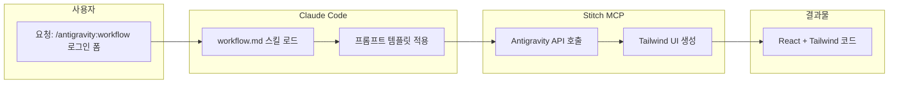
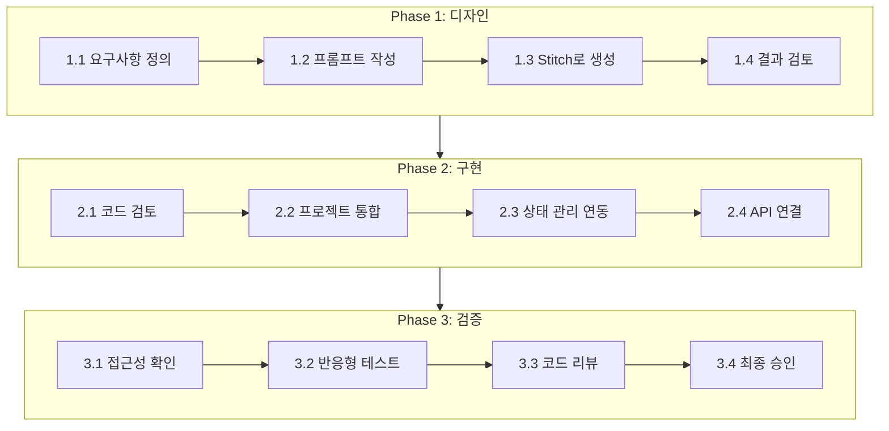

# Antigravity UI 개발 워크플로우 가이드

**버전**: 1.0
**작성일**: 2026-01-25
**관련 명령어**: `/antigravity:workflow`
**사전 요구**: [08_Antigravity_설정_가이드.md](./08_Antigravity_설정_가이드.md) 완료

---

> **현행화 정보**
> - **최종 현행화**: 2026-02-20
> - **프로젝트 상태**: 종료 (2026-02-18)
> - **문서 상태**: 일부 outdated
> - **주요 변경사항**: 모델명 outdated (Opus 4.5 → 현재 Opus 4.6/Sonnet 4.6 사용). Antigravity + Stitch MCP 연동은 실험적 상태로 사용되었으며, 프로젝트 기간 중 WebDesigner 에이전트와의 협업 패턴으로 통합됨.

---

> **중요 고지사항**
>
> 이 워크플로우는 **개인 실험/학습 용도**로만 사용하세요.
> 기업/팀 프로젝트에서는 Stitch MCP 없이 직접 Tailwind 컴포넌트를 작성하는 것을 권장합니다.

---

## 1. 개요

### 1.1 `/antigravity:workflow` 명령어란?

Claude Code에서 Antigravity + Stitch MCP를 활용하여 UI 컴포넌트를 생성하는 워크플로우를 안내하는 스킬입니다.

```bash
# 사용법
/antigravity:workflow 로그인 폼
/antigravity:workflow 검색 결과 카드 (이미지, 제목, 설명, 태그)
/antigravity:workflow 대시보드 통계 위젯
```

### 1.2 워크플로우 아키텍처



### 1.3 역할 분담

| 역할 | 담당 | 작업 내용 |
|------|------|----------|
| **WebDesigner** | 프롬프트 설계 | UI 요구사항 정의, Antigravity 프롬프트 작성 |
| **Stitch MCP** | 코드 생성 | Tailwind CSS 기반 React 컴포넌트 생성 |
| **Frontend** | 통합/검증 | 상태 관리 연동, 접근성 검증, 코드 리뷰 |
| **TechLead** | 최종 리뷰 | 아키텍처 적합성, 코드 품질 확인 |

---

## 2. 사전 설정

### 2.1 MCP 서버 설정

**파일**: `.claude/settings.json`

```json
{
  "mcpServers": {
    "stitch": {
      "command": "npx",
      "args": ["-y", "@anthropic/stitch-mcp@latest"],
      "env": {
        "ANTHROPIC_MODEL": "claude-opus-4-5-20251101"
      }
    }
  }
}
```

> ⚠️ **현행화 메모**: `ANTHROPIC_MODEL` 값이 `claude-opus-4-5-20251101`로 기재되어 있으나, 현재 프로젝트에서는 `claude-opus-4-6` 및 `claude-sonnet-4-6`이 사용됨. Stitch MCP를 새로 설정한다면 최신 모델 ID로 교체 필요.

> **⚠️ 용어 혼동 주의: Stitch MCP vs Antigravity**
>
> | 항목 | Stitch MCP | Antigravity |
> |------|------------|-------------|
> | **제공** | Anthropic 공식 | Google (비공식 프록시 필요) |
> | **용도** | UI 코드 생성 MCP 서버 | AI 코딩 도구 |
> | **모델** | Claude (Anthropic) | Gemini / Claude (프록시 경유) |
> | **설정** | `.claude/settings.json` | `antigravity-claude-proxy` 별도 실행 |
>
> **위 설정의 `ANTHROPIC_MODEL`은 Claude 모델입니다:**
> - `claude-opus-4-5-20251101` = Anthropic Claude Opus 4.5
> - Stitch MCP가 UI 코드 생성 시 이 Claude 모델을 호출
> - Antigravity 모델이 **아닙니다**
>
> **Antigravity를 사용하려면** 별도로 `antigravity-claude-proxy`를 실행하고 `ANTHROPIC_BASE_URL`을 프록시 주소로 설정해야 합니다. 자세한 내용은 [08_Antigravity_설정_가이드.md](./08_Antigravity_설정_가이드.md)를 참조하세요.

### 2.2 사용 가능한 모델

| 모델 ID | 설명 | 권장 용도 |
|---------|------|----------|
| `claude-opus-4-5-20251101` | 최신 Opus 4.5 | 복잡한 UI, 높은 품질 |
| `claude-sonnet-4-20250514` | Sonnet 4 | 일반 UI, 빠른 응답 |
| `claude-haiku-3-5-20241022` | Haiku 3.5 | 단순 UI, 비용 절감 |

> ⚠️ **현행화 메모**: 위 모델 목록은 2026-01-25 기준임. 현재(2026-02-20) 프로젝트에서 실제 사용 중인 모델은 `claude-opus-4-6` (Tier 1: tech-lead, software-architect), `claude-sonnet-4-6` (Tier 2: 나머지 11개 에이전트)임. Stitch MCP 설정 시 이 모델들을 우선 검토할 것.

### 2.3 설정 확인

```bash
# Claude Code 재시작 후
claude

# MCP 서버 상태 확인
> /mcp
```

---

## 3. 워크플로우 단계

### 3.1 전체 흐름



---

### 3.2 Phase 1: 디자인

#### 1.1 요구사항 정의

UI 컴포넌트의 목적과 기능을 명확히 정의합니다.

**예시 - 로그인 폼**:
| 항목 | 내용 |
|------|------|
| 컴포넌트명 | LoginForm |
| 용도 | 사용자 인증 (이메일/비밀번호) |
| 필수 기능 | 입력 검증, 에러 표시, 로딩 상태 |
| 선택 기능 | Remember me, SSO 옵션, 비밀번호 찾기 |

#### 1.2 프롬프트 작성

**프롬프트 템플릿**:

```markdown
## 컴포넌트 요청

### 기본 정보
- 컴포넌트: 로그인 폼
- 용도: 사용자 인증 페이지

### 기능 요구사항
- 이메일 입력 필드 (유효성 검사)
- 비밀번호 입력 필드 (표시/숨김 토글)
- Remember me 체크박스
- 로그인 버튼 (로딩 상태 표시)
- 에러 메시지 영역

### 스타일 요구사항
- 프레임워크: Tailwind CSS 3.4+
- 색상: primary-600 (버튼), gray-100~900 (배경/텍스트)
- 반응형: 모바일 우선 (sm -> lg 순차 확장)
- 다크 모드: dark: 클래스 지원

### 접근성 요구사항 (WCAG 2.1 AA)
- 키보드 네비게이션 지원 (Tab 순서)
- ARIA 라벨 필수 (aria-label, aria-describedby)
- 포커스 표시 명확히 (focus:ring-2)
- 색상 대비 4.5:1 이상
- 에러 메시지 role="alert"

### 피해야 할 패턴
- Bootstrap Blue (#007bff) 사용 금지
- 순수 검정 (#000000) 대신 gray-900 사용
- 인라인 스타일 금지
```

#### 1.3 Stitch로 생성

```bash
# Claude Code에서
/antigravity:workflow 로그인 폼

# 또는 직접 프롬프트
> Stitch MCP를 사용해서 위 요구사항대로 로그인 폼을 만들어줘.
```

#### 1.4 결과 검토

생성된 코드를 다음 체크리스트로 검토:

- [ ] 요구한 모든 기능 포함
- [ ] Tailwind 클래스 적절히 사용
- [ ] 불필요한 코드 없음
- [ ] TypeScript 타입 정의 완료

---

### 3.3 Phase 2: 구현

#### 2.1 코드 검토 체크리스트

```markdown
- [ ] **Tailwind 최적화**
  - [ ] 중복 클래스 제거
  - [ ] 커스텀 클래스 대신 유틸리티 사용
  - [ ] @apply 최소화

- [ ] **TypeScript**
  - [ ] Props 인터페이스 정의
  - [ ] 이벤트 핸들러 타입 명시
  - [ ] 제네릭 적절히 활용

- [ ] **접근성**
  - [ ] ARIA 라벨 적용
  - [ ] 키보드 네비게이션
  - [ ] 스크린 리더 호환
  - [ ] 색상 대비 4.5:1 이상
```

#### 2.2 프로젝트 통합

**파일 위치 규칙**:
```
knowledge_service/frontend/src/
├── components/
│   ├── auth/           # 인증 관련
│   │   ├── LoginForm.tsx
│   │   └── index.ts
│   ├── common/         # 공통 컴포넌트
│   └── search/         # 검색 관련
└── pages/
    └── LoginPage.tsx   # 페이지 레벨
```

**통합 예시**:
```tsx
// src/pages/LoginPage.tsx
import { LoginForm } from '@/components/auth';

const LoginPage: React.FC = () => {
  return (
    <div className="min-h-screen flex items-center justify-center">
      <LoginForm
        onForgotPassword={() => navigate('/forgot-password')}
        onSSOLogin={() => keycloak.login()}
      />
    </div>
  );
};
```

#### 2.3 상태 관리 연동

**Redux 연동 예시**:
```tsx
// LoginForm 내부
import { useDispatch, useSelector } from 'react-redux';
import { loginStart, loginSuccess, loginFailure } from '@/store/slices/authSlice';

const { isLoading, error } = useSelector((state: RootState) => state.auth);

const handleSubmit = async (e: React.FormEvent) => {
  e.preventDefault();
  dispatch(loginStart());
  try {
    const user = await authApi.login(email, password);
    dispatch(loginSuccess(user));
  } catch (err) {
    dispatch(loginFailure(err.message));
  }
};
```

#### 2.4 API 연결

```tsx
// src/services/authApi.ts
export const authApi = {
  login: async (email: string, password: string) => {
    const response = await fetch('/api/auth/login', {
      method: 'POST',
      headers: { 'Content-Type': 'application/json' },
      body: JSON.stringify({ email, password }),
    });
    if (!response.ok) throw new Error('Login failed');
    return response.json();
  },
};
```

---

### 3.4 Phase 3: 검증

#### 3.1 접근성 확인

| 항목 | 검증 방법 | 기준 |
|------|----------|------|
| 키보드 네비게이션 | Tab 키로 순회 | 모든 인터랙티브 요소 접근 가능 |
| 스크린 리더 | VoiceOver/NVDA | 라벨 읽힘 확인 |
| 색상 대비 | WebAIM Contrast Checker | 4.5:1 이상 |
| 포커스 표시 | 시각적 확인 | 명확히 보임 |

#### 3.2 반응형 테스트

| 브레이크포인트 | 해상도 | 확인 사항 |
|---------------|--------|----------|
| 모바일 | 375px | 터치 타겟 44px 이상, 스크롤 자연스러움 |
| 태블릿 (sm) | 640px | 레이아웃 적절 |
| 데스크탑 (md) | 768px | 여백 충분 |
| 대형 (lg) | 1024px | 최대 너비 제한 |

#### 3.3 코드 리뷰 체크리스트

- [ ] 컴포넌트 단일 책임 원칙
- [ ] Props drilling 최소화
- [ ] 불필요한 리렌더링 없음
- [ ] 에러 바운더리 적용 (필요시)
- [ ] 테스트 코드 작성

---

## 4. 문제 해결

### 4.1 일반적인 오류

| 오류 | 원인 | 해결 |
|------|------|------|
| `model: claude-sonnet-4-1 not found` | 모델명 오류 | `.claude/settings.json`에서 `ANTHROPIC_MODEL` 확인 |
| `MCP server not connected` | MCP 미실행 | Claude Code 재시작 |
| `Stitch timeout` | API 지연 | 재시도 또는 직접 작성 |

### 4.2 Stitch 없이 직접 작성

Stitch MCP가 동작하지 않을 경우, Claude Code에 직접 요청:

```
로그인 폼 컴포넌트를 만들어줘.
- Tailwind CSS 사용
- 이메일/비밀번호 입력
- 접근성 지원 (ARIA)
- TypeScript Props 타입 정의
```

---

## 5. 실제 사례: LoginForm 생성

### 5.1 생성 요청

```
/antigravity:workflow 로그인 폼
```

### 5.2 생성 결과 (요약)

**파일**: `knowledge_service/frontend/src/components/auth/LoginForm.tsx`

| 기능 | 구현 |
|------|------|
| 이메일 입력 | 실시간 검증, 아이콘 |
| 비밀번호 입력 | 표시/숨김 토글, 8자 이상 검증 |
| Remember Me | localStorage 연동 |
| 에러 표시 | role="alert", 빨간색 배경 |
| 로딩 상태 | 스피너 애니메이션 |
| SSO 옵션 | 별도 버튼, Keycloak 연동 |
| 접근성 | ARIA, 키보드, 포커스 링 |
| 다크 모드 | dark: 클래스 전체 적용 |

### 5.3 통합 결과

**LoginPage.tsx**에 통합하여 직접 로그인 + SSO 하이브리드 지원

### 5.4 실행 결과 예시 (2026-01-25 테스트)

**실행 명령어**:
```bash
/antigravity:workflow 로그인 폼
```

**소요 시간**: 49초

**워크플로우 동작**:

1. **자동 코드 탐색**: 기존 `LoginPage.tsx` 및 `LoginForm.tsx` 자동 발견
2. **코드 분석**: 441줄의 기존 컴포넌트 자동 분석
3. **구현 현황 정리**: 테이블 형식으로 기능별 상태 출력
4. **개선 제안**: 추가 가능한 기능 목록 제시
5. **다음 단계 선택지 제공**

**출력 결과 (구현된 기능 분석)**:

| 기능 | 상태 | 설명 |
|------|------|------|
| 이메일 입력 | ✅ | 아이콘 + 유효성 검사 |
| 비밀번호 입력 | ✅ | 표시/숨김 토글 지원 |
| Remember Me | ✅ | localStorage 연동 |
| 폼 유효성 검사 | ✅ | 실시간 + onBlur 검증 |
| 에러 메시지 | ✅ | 필드별 + 전역 에러 표시 |
| 로딩 상태 | ✅ | 스피너 + 버튼 비활성화 |
| SSO 로그인 | ✅ | Keycloak 연동 버튼 |
| 다크 모드 | ✅ | Tailwind dark: 클래스 |

**출력 결과 (접근성 분석 - WCAG 2.1 AA)**:

| 항목 | 상태 | 구현 |
|------|------|------|
| ARIA 라벨 | ✅ | `aria-label`, `aria-invalid`, `aria-describedby` |
| 키보드 네비게이션 | ✅ | Tab 순서 정상, Enter 제출 |
| 에러 알림 | ✅ | `role="alert"` 적용 |
| 포커스 표시 | ✅ | `focus:ring-2` 스타일 |
| 색상 대비 | ✅ | primary-600 기반 |

**자동 제안된 개선 옵션**:

1. **기존 코드 유지** - 현재 구현 그대로 사용
2. **애니메이션 추가** - 트랜지션 효과 강화
3. **비밀번호 강도 표시기** - 비밀번호 복잡도 시각화
4. **소셜 로그인 추가** - Google/GitHub OAuth 버튼
5. **다른 UI 컴포넌트 생성** - 새로운 컴포넌트 요청

> **테스트 결론**: `/antigravity:workflow`는 기존 코드가 있는 경우 새로 생성하지 않고, 현재 구현 상태를 분석하여 개선 옵션을 제시합니다. 이는 코드 중복을 방지하고 점진적 개선을 유도하는 효과적인 워크플로우입니다.

---

## 6. 관련 문서

- [08_Antigravity_설정_가이드.md](./08_Antigravity_설정_가이드.md) - 사전 설정
- [Frontend 상세 설계서](../knowledge_service/docs/02_design/02_frontend_detailed_design.md)
- [MUI to Tailwind 마이그레이션](../knowledge_service/docs/05_development/06_mui_to_tailwind_migration.md)
- [개발자 에이전트 가이드](../knowledge_service/docs/05_development/01_developer_agent_guide.md)
- [세션 로그: 2026-01-25](../work_logs/session_logs/2026-01-25_antigravity_login_form.md)

---

## 7. 부록: 프롬프트 템플릿 모음

### A. 폼 컴포넌트

```markdown
## 폼 컴포넌트 요청

### 기본 정보
- 컴포넌트: [폼 이름]
- 필드: [필드 목록]

### 기능
- 실시간 유효성 검사
- 에러 메시지 표시
- 제출 버튼 (로딩 상태)

### 스타일: Tailwind CSS, 반응형, 다크 모드
### 접근성: WCAG 2.1 AA
```

### B. 카드 컴포넌트

```markdown
## 카드 컴포넌트 요청

### 기본 정보
- 컴포넌트: [카드 이름]
- 구성: 이미지, 제목, 설명, 액션 버튼

### 레이아웃
- 그리드: 1열(모바일) → 2열(sm) → 3열(lg)
- 호버 효과: shadow-lg 전환

### 스타일: Tailwind CSS
### 접근성: 이미지 alt, 버튼 라벨
```

### C. 대시보드 위젯

```markdown
## 대시보드 위젯 요청

### 기본 정보
- 컴포넌트: [위젯 이름]
- 데이터: 숫자, 트렌드 표시

### 기능
- 실시간 업데이트 (React Query)
- 로딩/에러 상태

### 스타일: Tailwind CSS, 차트 라이브러리 연동
```

---

**문서 버전**: 1.2
**최종 수정**: 2026-01-25
**작성자**: 클로드 (Claude Opus 4.5)

**변경 이력**:
- v1.2 (2026-01-25): 실행 결과 예시 섹션 추가 (5.4) - 실제 테스트 결과 문서화
- v1.1 (2026-01-25): Stitch MCP vs Antigravity 용어 혼동 주의 섹션 추가
- v1.0 (2026-01-25): 최초 작성

---

## 현행화 이력

| 일자 | 작성자 | 내용 |
|------|--------|------|
| 2026-02-20 | Claude (doc-agent) | 프로젝트 종료 후 현행화 — 모델명 outdated 표시 (Opus 4.5 → Opus 4.6/Sonnet 4.6), 현행화 박스 추가 |
