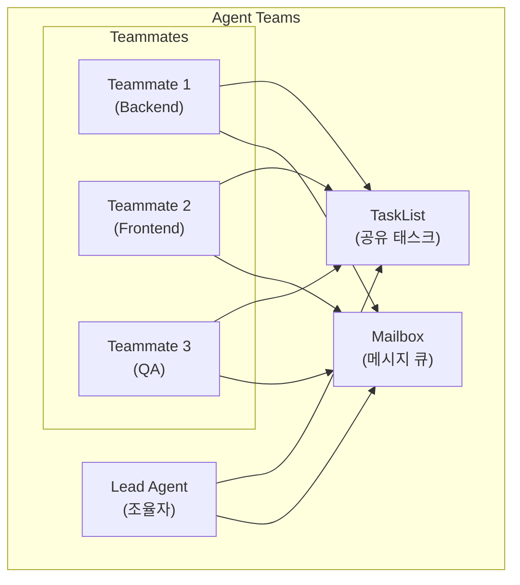
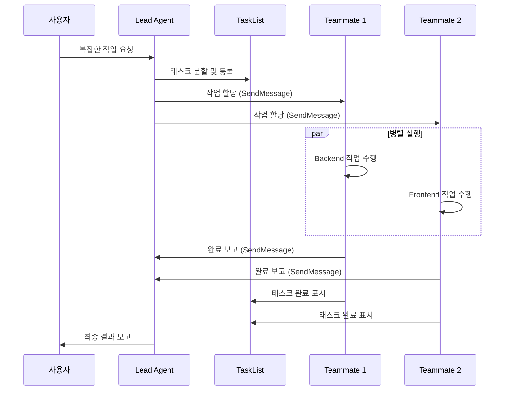

# Agent Teams 활용 가이드

---

## 문서 정보

| 항목 | 내용 |
|------|------|
| **문서명** | Agent Teams 활용 가이드 |
| **버전** | 1.0 |
| **작성일** | 2026-02-06 |
| **작성자** | Claude Code (Opus 4.6) |
| **대상** | 프로젝트 관리자, 개발자, AI 에이전트 운영자 |
| **목적** | Agent Teams 기능의 이해와 프로젝트 적용 가이드 |

---

## 변경 이력

| 버전 | 일자 | 작성자 | 변경 내용 |
|------|------|--------|----------|
| 1.0 | 2026-02-06 | Claude Code | 초안 작성 - Opus 4.6 Agent Teams 도입 |

---

## 목차

1. [개요](#1-개요)
2. [활성화 방법](#2-활성화-방법)
3. [아키텍처](#3-아키텍처)
4. [우리 팀 적용](#4-우리-팀-적용)
5. [사용 시나리오](#5-사용-시나리오)
6. [디스플레이 모드](#6-디스플레이-모드)
7. [베스트 프랙티스](#7-베스트-프랙티스)
8. [비용 가이드](#8-비용-가이드)
9. [제한사항 및 트러블슈팅](#9-제한사항-및-트러블슈팅)
10. [관련 문서](#10-관련-문서)

---

## 1. 개요

### 1.1 Agent Teams란?

Agent Teams는 Claude Code의 실험적 기능으로, 여러 AI 에이전트가 **동시에 협업**하여 복잡한 작업을 수행할 수 있게 하는 멀티-에이전트 시스템입니다.

기존 Subagent(Task 도구)가 단방향 위임 방식이라면, Agent Teams는 에이전트 간 **양방향 메시지 전달**과 **공유 태스크 리스트**를 통한 자율적 협업을 지원합니다.

### 1.2 Subagent vs Agent Teams

| 구분 | Subagent (Task 도구) | Agent Teams |
|------|---------------------|-------------|
| **통신 방향** | 단방향 (호출 → 결과 반환) | 양방향 (에이전트 간 메시지) |
| **실행 방식** | 순차/병렬 호출 | 자율적 병렬 협업 |
| **상태 공유** | 없음 (독립 실행) | 공유 태스크 리스트 |
| **역할 분담** | 호출자가 결정 | Lead가 조율, Teammate가 자율 수행 |
| **컨텍스트** | 매번 새로 제공 | 세션 내 누적 |
| **적합한 작업** | 단순 조회, 독립적 작업 | 복잡한 멀티파일 변경, 협업 필요 작업 |

### 1.3 언제 Agent Teams를 사용하는가?

```
┌─────────────────────────────────────────────────────────────┐
│  복잡도가 높고 여러 전문 영역이 관여하는 작업에 적합          │
│  단순 작업은 기존 Subagent(Task 도구)가 더 효율적            │
└─────────────────────────────────────────────────────────────┘
```

**Agent Teams 추천**:
- 여러 서비스에 걸친 기능 개발 (Backend + Frontend + DB)
- 아키텍처 리뷰 + 코드 수정 + 테스트를 동시에
- 복잡한 디버깅 (로그 분석 + 코드 수정 + 검증)

**기존 Subagent 추천**:
- 단일 파일 검색/수정
- 독립적인 코드 리뷰
- 단순 정보 조회

---

## 2. 활성화 방법

### 2.1 설정 파일

`.claude/settings.json`에 환경변수를 추가합니다:

```json
{
  "env": {
    "CLAUDE_CODE_EXPERIMENTAL_AGENT_TEAMS": "1"
  }
}
```

### 2.2 환경변수 방식

셸에서 직접 설정할 수도 있습니다:

```bash
export CLAUDE_CODE_EXPERIMENTAL_AGENT_TEAMS=1
claude
```

### 2.3 확인 방법

활성화 후 새 세션을 시작하면, `spawnTeam`, `TeammateTool`, `SendMessage` 등의 추가 도구가 사용 가능해집니다.

---

## 3. 아키텍처

### 3.1 핵심 구성 요소



### 3.2 역할 설명

| 역할 | 설명 |
|------|------|
| **Lead** | 작업을 분할하고 Teammate에게 할당. 전체 진행 상황을 모니터링 |
| **Teammate** | 할당받은 작업을 자율적으로 수행. 완료 시 Lead에게 보고 |
| **TaskList** | 모든 에이전트가 공유하는 태스크 목록. 상태(pending/in_progress/completed) 추적 |
| **Mailbox** | 에이전트 간 비동기 메시지 전달 시스템 |

### 3.3 실행 흐름



---

## 4. 우리 팀 적용

### 4.1 에이전트 역할 매핑

프로젝트의 12개 에이전트를 Agent Teams 역할에 매핑합니다:

| 에이전트 | 약어 | Agent Teams 역할 | 모델 |
|----------|------|------------------|------|
| project-manager | pm | **Lead** (기본 조율자) | claude-opus-4-6 |
| tech-lead | tl | **Lead** (기술 조율자) | claude-opus-4-6 |
| backend-developer | backend | Teammate | claude-opus-4-6 |
| frontend-developer | frontend | Teammate | claude-opus-4-6 |
| rag-engineer | rag | Teammate | claude-opus-4-6 |
| etl-engineer | etl | Teammate | claude-opus-4-6 |
| database-designer | db | Teammate | claude-opus-4-6 |
| infra-engineer | infra | Teammate | claude-opus-4-6 |
| devops-engineer | devops | Teammate | claude-opus-4-6 |
| qa-engineer | qa | Teammate | claude-opus-4-6 |
| web-designer | web | Teammate | claude-opus-4-6 |
| code-documenter | doc | Teammate | claude-opus-4-6 |

### 4.2 Lead 역할 매핑

작업 유형에 따라 Lead 역할이 달라집니다:

| 작업 유형 | Lead | Teammates |
|----------|------|-----------|
| 스프린트 작업 | PM | 관련 개발자들 |
| 기능 개발 | TechLead | Backend, Frontend, DB |
| RAG 파이프라인 | TechLead | RAG, ETL, DB |
| 인프라 변경 | TechLead | Infra, DevOps |
| 코드 리뷰 | TechLead | 대상 개발자, QA |
| UI/UX 개선 | PM | WebDesigner, Frontend |

---

## 5. 사용 시나리오

### 5.1 병렬 코드 리뷰

여러 PR을 동시에 리뷰하는 시나리오:

```
Lead (TechLead):
  "3개 PR을 동시에 리뷰해주세요"

Teammate (Backend): PR #101 - API 엔드포인트 리뷰
Teammate (Frontend): PR #102 - UI 컴포넌트 리뷰
Teammate (QA): PR #103 - 테스트 코드 리뷰

→ 각 Teammate가 독립적으로 리뷰 수행
→ 완료 후 Lead에게 리뷰 결과 전달
```

### 5.2 기능 개발 (Full Stack)

새 기능을 여러 레이어에서 동시에 개발:

```
Lead (TechLead):
  "사용자 인증 기능 구현"

Teammate (DB): 스키마 설계 및 마이그레이션
Teammate (Backend): API 엔드포인트 구현
Teammate (Frontend): 로그인/회원가입 UI 구현
Teammate (QA): 테스트 케이스 작성

→ DB가 먼저 완료되면 Backend에게 스키마 정보 전달
→ Backend 완료 시 Frontend에게 API 스펙 전달
→ 전체 완료 후 QA가 통합 테스트 수행
```

### 5.3 복잡한 디버깅

여러 서비스에 걸친 버그를 동시에 조사:

```
Lead (TechLead):
  "RAG 검색 결과가 부정확한 문제 조사"

Teammate (RAG): 임베딩/검색 로직 분석
Teammate (ETL): 데이터 파이프라인 품질 확인
Teammate (DB): 인덱스/쿼리 성능 분석
Teammate (Infra): 컨테이너 리소스 상태 확인

→ 각 영역에서 동시에 원인 조사
→ 발견한 문제를 Lead에게 보고
→ Lead가 종합하여 수정 방향 결정
```

---

## 6. 디스플레이 모드

### 6.1 In-Process 모드 (기본)

단일 터미널에서 모든 에이전트의 출력이 순차적으로 표시됩니다.

```
[Lead] 작업을 분할합니다...
[Backend] API 엔드포인트 구현 시작
[Frontend] UI 컴포넌트 구현 시작
[Backend] ✅ 구현 완료
[Frontend] ✅ 구현 완료
[Lead] 모든 작업이 완료되었습니다.
```

### 6.2 Split-Pane 모드 (tmux)

tmux를 사용하여 각 에이전트를 별도 패인에서 실행합니다.

```bash
# tmux가 설치되어 있으면 자동으로 split-pane 모드 사용
tmux
claude  # Agent Teams 시작 시 자동 분할
```

```
┌─────────────────────┬─────────────────────┐
│ [Lead]              │ [Backend]            │
│ 작업 조율 중...      │ API 구현 중...        │
│                     │                      │
├─────────────────────┼─────────────────────┤
│ [Frontend]          │ [QA]                 │
│ UI 구현 중...        │ 테스트 작성 중...      │
│                     │                      │
└─────────────────────┴─────────────────────┘
```

---

## 7. 베스트 프랙티스

### 7.1 파일 충돌 방지

Agent Teams에서 여러 에이전트가 동시에 같은 파일을 수정하면 충돌이 발생합니다.

**원칙**: 하나의 파일은 하나의 에이전트만 수정

| 전략 | 설명 |
|------|------|
| **파일 소유권** | 각 Teammate에게 담당 파일/디렉토리를 명확히 할당 |
| **의존성 순서** | DB → Backend → Frontend 순으로 의존성이 있는 작업은 순차적으로 |
| **인터페이스 먼저** | 공통 인터페이스(API 스펙, 타입 정의)를 먼저 합의 후 구현 |

```
✅ 올바른 할당:
  Backend → src/app/api/routes/auth.py
  Frontend → src/components/LoginForm.tsx
  DB → migrations/001_add_users.sql

❌ 잘못된 할당:
  Backend → src/app/api/routes/auth.py
  Frontend → src/app/api/routes/auth.py  ← 충돌!
```

### 7.2 태스크 사이징

| 크기 | 소요 시간 | 예시 |
|------|----------|------|
| **Small** | 1-3분 | 단일 함수 수정, 설정 변경 |
| **Medium** | 3-10분 | API 엔드포인트 1개, 컴포넌트 1개 |
| **Large** | 10분+ | 서비스 전체, 여러 파일 변경 |

**권장**: Medium 크기로 태스크를 분할하면 병렬 실행의 이점을 최대화할 수 있습니다.

### 7.3 커뮤니케이션 규칙

- Lead는 작업 시작 전 **명확한 완료 조건**을 제시
- Teammate는 **블로커 발견 시 즉시** Lead에게 보고
- 작업 완료 시 **변경 파일 목록**과 함께 보고
- Slack 알림은 Lead가 대표로 전송 (중복 방지)

---

## 8. 비용 가이드

### 8.1 Subagent vs Agent Teams 비용 비교

| 항목 | Subagent | Agent Teams |
|------|----------|-------------|
| **입력 토큰** | 각 호출마다 컨텍스트 재전달 | 세션 내 누적 (중복 감소) |
| **출력 토큰** | 결과만 반환 | 메시지 교환 추가 비용 |
| **총 비용** | 단순 작업에 유리 | 복잡한 협업 작업에 유리 |
| **시간 비용** | 순차 실행 시 느림 | 병렬 실행으로 시간 절약 |

### 8.2 비용 최적화 팁

| 전략 | 설명 |
|------|------|
| **필요한 에이전트만 소환** | 12개 전부가 아닌 필요한 2-4개만 |
| **적절한 모델 선택** | 간단한 작업은 비용 최적화 모델 고려 |
| **태스크 적절 분할** | 너무 잘게 쪼개면 통신 오버헤드 증가 |
| **불필요한 대화 최소화** | 명확한 지시로 재작업 방지 |

### 8.3 모델별 비용 참고

| 모델 | 용도 | 상대 비용 |
|------|------|----------|
| `claude-opus-4-6` | 복잡한 추론, 아키텍처 판단 | 높음 |
| `claude-sonnet-4-5` | 일반 개발, 균형 잡힌 성능 | 중간 |
| `claude-opus-4-1` | 안정적 성능, 비용 효율 | 낮음 |

---

## 9. 제한사항 및 트러블슈팅

### 9.1 알려진 제한사항

| 제한사항 | 설명 |
|----------|------|
| **실험적 기능** | `EXPERIMENTAL` 플래그로 활성화 - 변경될 수 있음 |
| **MCP 접근** | Teammate는 MCP 도구에 직접 접근 불가 (Shell 스크립트 우회) |
| **파일 충돌** | 동시 파일 수정 시 마지막 쓰기가 이전 변경 덮어씀 |
| **컨텍스트 한계** | 대규모 팀(5+)에서는 통신 오버헤드 증가 |

### 9.2 트러블슈팅

**Agent Teams가 활성화되지 않는 경우**:

```bash
# 1. 환경변수 확인
echo $CLAUDE_CODE_EXPERIMENTAL_AGENT_TEAMS
# 출력: 1

# 2. settings.json 확인
cat .claude/settings.json | grep AGENT_TEAMS

# 3. Claude Code 재시작
# 새 터미널에서 claude 다시 실행
```

**Teammate가 응답하지 않는 경우**:

- 태스크가 너무 큰 경우 → 더 작은 단위로 분할
- 모델 요금 한도 초과 → 비용 최적화 모델로 전환
- 컨텍스트 오버플로 → 새 세션에서 재시작

**파일 충돌이 발생한 경우**:

```bash
# git으로 변경 사항 확인
git diff

# 충돌 파일 수동 병합
# 또는 해당 Teammate에게 재작업 요청
```

**Slack 알림 관련**:

- Teammate는 MCP Slack을 직접 사용할 수 없음
- `./scripts/send_slack.sh` 스크립트를 사용하여 알림 전송

```bash
# Teammate에서 Slack 알림 전송
./scripts/send_slack.sh dev Backend "작업 완료: API 엔드포인트 구현"
```

---

## 10. 관련 문서

| 문서 | 설명 |
|------|------|
| [CLAUDE.md](../../../CLAUDE.md) | 프로젝트 개발 규칙 및 에이전트 목록 |
| [developer_agent_guide.md](./developer_agent_guide.md) | 에이전트 도구 사용법 |
| [developer_integration_guide.md](./developer_integration_guide.md) | MCP/Agent/Skills 설정 |
| [.claude/agents/](../../../.claude/agents/) | 12개 에이전트 정의 파일 |
| [.claude/settings.json](../../../.claude/settings.json) | Agent Teams 활성화 설정 |

---

## 부록: 빠른 시작 체크리스트

- [ ] `.claude/settings.json`에 `CLAUDE_CODE_EXPERIMENTAL_AGENT_TEAMS: "1"` 설정
- [ ] 12개 에이전트 모델이 `claude-opus-4-6`인지 확인
- [ ] 새 Claude Code 세션 시작
- [ ] `spawnTeam` 도구가 사용 가능한지 확인
- [ ] 간단한 테스트 작업으로 Agent Teams 동작 검증
