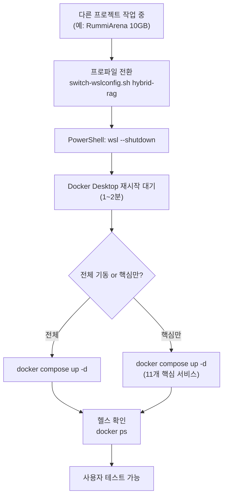

# WSL2 .wslconfig 프로젝트별 관리

> **작성일**: 2026-03-08 | **갱신**: 2026-03-09
> **배경**: RummiArena 프로젝트와 .wslconfig 공유 충돌 해결

## 1. 문제

`.wslconfig`(`C:\Users\KTDS\.wslconfig`)는 WSL2 전역 설정이다.
프로젝트마다 요구하는 리소스가 다르므로 전환이 필요하다.

| 프로젝트 | memory 필요 | 이유 |
|----------|-------------|------|
| **hybrid-rag-knowledge-ops** | 14GB | Elasticsearch + AI 임베딩 파이프라인 (18개 컨테이너) |
| **RummiArena** | 10GB | K8s + 앱 서비스 + ArgoCD |

### 프로파일 미전환 시 영향 (2026-03-09 실제 사례)

RummiArena 설정(10GB)으로 이 프로젝트 컨테이너 기동 시:

| 컨테이너 | 현상 | 원인 |
|----------|------|------|
| `kp-api-gateway` | **Exit 137 (OOM Killed)** | Spring Boot JVM 메모리 부족 |
| `kp-nginx` | **Exit (upstream error)** | api-gateway 미기동으로 연쇄 종료 |
| `kp-ai-service` | **Exited (미재시작)** | 전체 메모리 압박 |

결과: **사용자 테스트 불가** — 웹 UI에서 API 호출 실패

## 2. 해결: 프로젝트별 프로파일 + 스위칭 스크립트

### 프로파일 파일

각 프로젝트 루트에 `.wslconfig.profile` 파일을 두고, 스위칭 스크립트로 전환한다.

| 프로젝트 | 파일 위치 | memory | swap | processors | autoMemoryReclaim |
|----------|----------|--------|------|------------|-------------------|
| **hybrid-rag** | `hybrid-rag-knowledge-ops/.wslconfig.profile` | 14GB | 4GB | 8 | dropcache |
| **RummiArena** | `RummiArena/.wslconfig.profile` | 10GB | 2GB | 8 | gradual |

#### hybrid-rag 프로파일 상세

```ini
[wsl2]
memory=14GB      # 18개 컨테이너 전체: ~11GB, 임베딩 추가: ~13GB
swap=4GB         # 임베딩/ETL 피크 시 swap 활용
processors=8

[experimental]
autoMemoryReclaim=dropcache   # 캐시 적극 회수 (컨테이너 다수)
sparseVhd=true                # 가상 디스크 자동 축소
```

#### RummiArena 프로파일 상세

```ini
[wsl2]
memory=10GB      # K8s + 앱 서비스: ~7.5GB
swap=2GB
processors=8

[experimental]
autoMemoryReclaim=gradual     # 점진적 회수 (K8s 안정성 우선)
```

### 스위칭 스크립트

```bash
# hybrid-rag 모드로 전환
bash scripts/switch-wslconfig.sh hybrid-rag   # (약칭: hr)

# RummiArena 모드로 전환
bash scripts/switch-wslconfig.sh rummiarena   # (약칭: ra)

# 현재 상태 확인
bash scripts/switch-wslconfig.sh status       # (약칭: st)
```

전환 후 반드시 `wsl --shutdown` 실행 필요 (PowerShell에서).

## 3. 이 프로젝트 복귀 시 전체 절차

### Step 1: 프로파일 전환 (WSL 터미널)

```bash
# 현재 상태 확인
bash scripts/switch-wslconfig.sh status

# 14GB 아니면 전환
bash scripts/switch-wslconfig.sh hybrid-rag
```

### Step 2: WSL 재시작 (PowerShell)

```powershell
wsl --shutdown
```

> Docker Desktop 포함 모든 WSL2 인스턴스가 종료됨. 1~2분 후 Docker Desktop이 자동 재시작됨.

### Step 3: 컨테이너 기동 (WSL 터미널)

```bash
cd /mnt/d/Users/KTDS/Documents/06.과제/hybrid-rag-knowledge-ops/infrastructure/docker
docker compose up -d
```

### Step 4: 헬스 확인 (1~2분 대기)

```bash
# 전체 상태 확인
docker ps --format "table {{.Names}}\t{{.Status}}"

# healthy가 아닌 컨테이너만 필터
docker ps --format "{{.Names}}\t{{.Status}}" | grep -v healthy
```

모든 컨테이너가 `healthy`이면 사용자 테스트 가능.

### Step 5: (선택) 임베딩 파이프라인 복구

사용자 테스트만 할 경우 불필요. 임베딩/ETL 작업 재개 시에만 실행:

```bash
bash scripts/post_wsl_restart.sh
```

## 4. 서비스 분류

Docker Compose에 정의된 21개 서비스의 역할 분류:

### 핵심 서비스 (사용자 테스트 필수)

| 서비스 | 컨테이너명 | 역할 |
|--------|-----------|------|
| `ai-service` | `kp-ai-service` | RAG/검색 API (FastAPI) |
| `api-gateway` | `kp-api-gateway` | API 라우팅 (Spring Boot) |
| `nginx` | `kp-nginx` | 리버스 프록시 (포트 80) |
| `backend` | `kp-backend` | 비즈니스 로직 (Spring Boot) |
| `frontend` | `kp-frontend` | 웹 UI (React) |
| `elasticsearch` | `kp-elasticsearch` | 벡터/키워드 검색 |
| `postgresql` | `kp-postgresql` | SSOT 데이터베이스 |
| `neo4j` | `kp-neo4j` | 그래프 데이터베이스 |
| `redis` | `kp-redis` | 캐시/세션 |
| `keycloak` | `kp-keycloak` | 인증/인가 |
| `keycloak-db` | `kp-keycloak-db` | Keycloak용 DB |

### 모니터링/관측 서비스 (선택)

| 서비스 | 컨테이너명 | 역할 |
|--------|-----------|------|
| `grafana` | `kp-grafana` | 대시보드 (`:3001`) |
| `prometheus` | `kp-prometheus` | 메트릭 수집 (`:9090`) |
| `kibana` | `kp-kibana` | ES 시각화 (`:5601`) |
| `jaeger` | `kp-jaeger` | 분산 추적 (`:16686`) |
| `loki` | `kp-loki` | 로그 수집 |
| `promtail` | `kp-promtail` | 로그 전송 |
| `minio` | `kp-minio` | 오브젝트 스토리지 |

### Exporter 서비스 (기본 비활성)

| 서비스 | 역할 |
|--------|------|
| `nginx-exporter` | Nginx 메트릭 |
| `postgres-exporter` | PostgreSQL 메트릭 |
| `redis-exporter` | Redis 메트릭 |

### 메모리 절약 기동 (선택)

모니터링 없이 핵심만 올릴 경우 (메모리 ~6GB 절약):

```bash
docker compose up -d ai-service api-gateway nginx backend frontend \
  elasticsearch postgresql neo4j redis keycloak keycloak-db
```

## 5. 전환 플로우



## 6. 관련 파일

| 파일 | 위치 | 설명 |
|------|------|------|
| 프로파일 | `.wslconfig.profile` (프로젝트 루트) | 이 프로젝트 전용 WSL 설정 |
| 스위칭 스크립트 | `scripts/switch-wslconfig.sh` | 프로파일 전환 CLI |
| WSL 재시작 후 복구 | `scripts/post_wsl_restart.sh` | 컨테이너 일괄 기동 |
| 실제 적용 파일 | `C:\Users\KTDS\.wslconfig` | WSL2가 읽는 전역 설정 |
