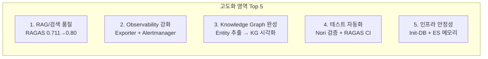
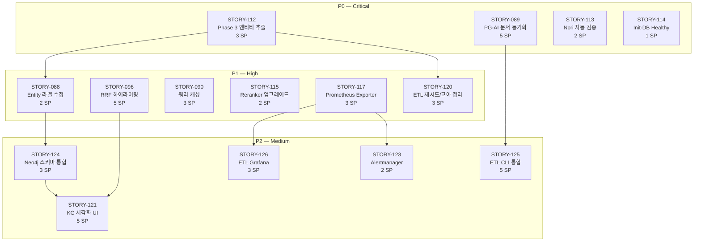

# Graph RAG 지능형 지식 검색 시스템 고도화 계획서

**문서 버전**: v1.0
**작성일**: 2026-03-05
**프로젝트**: Hybrid RAG Knowledge Operations
**Sprint**: 09 (2026-03-04 ~ 2026-03-17)
**총 규모**: P0+P1 36 SP (13건) / P2 포함 시 64 SP (20건)

---

## 1. 고도화 배경 및 목적

### 1.1 현재 상태

| 항목 | 현재 값 | 비고 |
|------|---------|------|
| Production Readiness | 98% | Sprint 07에서 TechLead 승인 완료 |
| 소스코드 품질 | 72.5/100 (B+) | Gateway 65 최저, AI Service 78 최고 |
| RAGAS Mean | 0.711 (A-) | Faithfulness 0.935 / Precision 0.618 / Recall 0.672 |
| ES 데이터 | 42,612 청크 | 1,460 문서 임베딩 완료 |
| Neo4j Entity | **0개** | Phase 3 미실행 → Graph RAG 사실상 비활성 |
| Hybrid Search P95 | 984ms | CPU BGE-M3 병목 (66%) |
| Test Coverage | 97% | 5개 모듈 평균 |
| Deferred Stories | 20건 (58 SP) | Sprint 08까지 미처리 |

### 1.2 고도화 필요성

1. **Graph RAG 데이터 부재**: Neo4j에 Entity 0개 — 4-Way Hybrid Search 중 Graph 채널이 무의미
2. **데이터 정합성 공백**: PG-AI Service 간 문서 상태 동기화 미구현 (UI에서 처리 상태 확인 불가)
3. **검색 품질 한계**: RAGAS Precision 0.618 — 검색 정밀도 약점
4. **모니터링 사각지대**: Prometheus Exporter 3종 비활성 → 알림 규칙 작동 안 함
5. **재발 방지 체계 부재**: Nori 32일 미적용 사고 이후 자동 검증 미구축

### 1.3 고도화 목표

| 지표 | 현재 | 목표 | 개선 방향 |
|------|------|------|----------|
| RAGAS Mean | 0.711 | **0.75+** | Reranker 업그레이드 + Entity 검색 활성화 |
| RAGAS Precision | 0.618 | **0.70+** | bge-reranker-v2-m3 + Context Precision 개선 |
| Neo4j Entity 수 | 0 | **10,000+** | Phase 3 엔티티 추출 배치 실행 |
| Hybrid Search P95 | 984ms | **700ms 이하** | 쿼리 캐싱 + 비동기 처리 |
| 코드 품질 | 72.5 | **75+** | Gateway 구조 개선 (65→75) |
| Test Coverage | 97% | **97%+ 유지** | Nori 자동 검증 + RAGAS CI |

---

## 2. 고도화 영역 분석

### 2.1 고도화 영역 Top 5 (팀원 12명 의견 수렴)

2026-03-04 킥오프 스탠드업에서 13명 전원 참여, 공통 영역 도출.

### 2.2 팀원별 제안 요약

| 팀원 | 핵심 제안 | 최우선 아이템 |
|------|----------|-------------|
| **TechLead** | 검색 성능+RAG 품질, 코드 72.5→85 병행 | 검색 500ms + RAGAS 0.80 |
| **Architect** | Quick Wins (Reranker, ES 메모리), TD 해소 | bge-reranker-v2-m3 + ES 1GB |
| **RAG** | 동적 전략 선택, Sparse 통합, Entity 라벨 버그 | STORY-088 Entity 라벨 누락 |
| **Backend** | Redis 캐싱, 문서 동기화, 하이라이팅 | PG-AI 문서 동기화 |
| **Frontend** | KG 시각화 (라이브러리 설치됨), SSE 안정화 | KG 실데이터 연동 |
| **DB** | Neo4j 스키마 v1.0/v2.6 불일치 해소 | Neo4j 스키마 통합 |
| **Infra** | Init-DB service_healthy, ES 메모리 증설 | depends_on 전면 적용 |
| **DevOps** | Prometheus Exporter, Alertmanager 채널 분기 | Exporter → ETL 메트릭 |
| **QA** | Nori 자동 검증, RAGAS CI, ETL E2E | _analyze API 기반 Nori 검증 |
| **Documenter** | RAGAS 종합 리포트 (v1~v10), 납품 문서 | RAGAS 결과 통합 리포트 |
| **WebDesigner** | KG 시각화 UI (Verbalized Sampling), WCAG 2.1 AA | KG UI 고도화 |

---

## 3. 백로그 상세

### 3.1 P0 — Critical (Week 1, Day 1~3) | 4건, 11 SP

#### STORY-112: Phase 3 엔티티 추출 배치 실행 (3 SP)

| 항목 | 내용 |
|------|------|
| **담당** | ETL / RAG |
| **배경** | Neo4j에 Entity 0개 — Graph RAG 비활성 상태 |
| **목표** | DeepSeek V3.2 기반 1,460 문서 엔티티 추출 → Neo4j Entity 10,000+ 생성 |
| **산출물** | Neo4j Entity/MENTIONS/RELATED_TO 관계, PG entity_count 업데이트 |

**완료 기준 (AC)**:
- [ ] DeepSeek V3.2 엔티티 추출 배치 1,460 문서 완료
- [ ] Neo4j Entity 노드 ≥ 10,000개
- [ ] RELATED_TO 관계 생성 확인
- [ ] PG `entity_count` 필드 업데이트 완료
- [ ] `MATCH (e:Entity) RETURN count(e)` 쿼리 정상 반환

**수정 대상**: `entity_extraction.py`, `03_neo4j_constraints.cypher`

---

#### STORY-089: PG-AI Service 문서 동기화 (5 SP)

| 항목 | 내용 |
|------|------|
| **담당** | ETL / Backend |
| **배경** | AI Service 문서 처리 후 PG 상태가 "uploaded"에서 변경 안 됨 |
| **목표** | 처리 단계별 상태 콜백 → UI에서 실시간 상태 표시 |
| **산출물** | Reconciliation API, Background Worker 상태 업데이트 |

**완료 기준 (AC)**:
- [ ] AI Service가 처리 단계마다 상태 이벤트 발행 (uploaded→parsing→chunking→embedding→completed)
- [ ] Backend가 이벤트 수신하여 PG documents 테이블 업데이트
- [ ] Frontend에서 현재 처리 단계 정확히 표시
- [ ] 실패 시 `failed` 상태 + 에러 메시지 기록

**수정 대상**: Backend 상태 API (신규), AI Service 파이프라인 콜백, PG `documents` 테이블

---

#### STORY-113: Nori 플러그인 자동 검증 (2 SP)

| 항목 | 내용 |
|------|------|
| **담당** | QA |
| **배경** | 2026-02-13 Nori 32일 미적용 사고 — 코드리뷰 3건에서 미발견 |
| **목표** | ES `_analyze` API 호출로 nori_tokenizer 실동작 자동 검증 |
| **산출물** | 통합 테스트, CI/CD 파이프라인 검증 스텝 |

**완료 기준 (AC)**:
- [ ] `test_nori_analyzer.py` 통합 테스트 작성
- [ ] `_analyze` API로 한국어 형태소 분석 결과 검증 (standard analyzer와 차이 확인)
- [ ] CI/CD 파이프라인에 Nori 검증 스텝 추가
- [ ] 검증 실패 시 파이프라인 중단 + Slack 알림

**수정 대상**: `test_nori_analyzer.py` (신규), `.github/workflows/ci.yml`

---

#### STORY-114: Init-DB depends_on service_healthy 전면 적용 (1 SP)

| 항목 | 내용 |
|------|------|
| **담당** | Infra |
| **배경** | init-db가 DB 미준비 상태에서 실행되어 간헐적 초기화 실패 |
| **목표** | PG/Neo4j/ES 전부 `condition: service_healthy` 적용 |
| **비고** | 2026-03-05 검색 안정성 개선에서 ES/Neo4j healthcheck 이미 강화됨 |

**완료 기준 (AC)**:
- [ ] init-db의 depends_on 3개 DB 모두 `condition: service_healthy`
- [ ] `docker-compose up` 시 init-db가 모든 DB healthy 확인 후 실행
- [ ] 재시작 시나리오 테스트 통과

**수정 대상**: `docker-compose.yml` (init-db 섹션)

---

### 3.2 P1 — High (Week 1~2) | 9건, 25 SP

#### STORY-088: Neo4j Entity 라벨 누락 수정 (2 SP)

| 항목 | 내용 |
|------|------|
| **담당** | RAG / DB |
| **의존** | STORY-112 완료 후 |
| **배경** | MERGE ON CREATE SET 구문 호환 문제로 엔티티 저장 실패 |
| **목표** | Entity 라벨 + MENTIONS 관계 정상 생성 확인 |

**수정 대상**: `entity_extraction.py` (Cypher MERGE→CREATE+MATCH 패턴)

---

#### STORY-096: RRF 하이라이팅 + 소스별 점수 메타데이터 (5 SP)

| 항목 | 내용 |
|------|------|
| **담당** | RAG / Backend / Frontend |
| **배경** | RRF 융합 시 BM25 highlight 정보 유실, 소스별 점수 미표시 |
| **목표** | 메타데이터 병합 + `<mark>` 태그 하이라이팅 렌더링 |

**완료 기준 (AC)**:
- [ ] RRF Fusion이 동일 chunk의 메타데이터를 병합 (덮어쓰기 X)
- [ ] API 응답에 `highlight` 필드 포함
- [ ] `SearchResultCard.tsx`에서 검색어 하이라이팅 렌더링
- [ ] Vector-only 결과 (highlight 없음) 우아한 폴백

**수정 대상**: `rrf_fusion.py`, `search.py`, `SearchResultCard.tsx`

---

#### STORY-090: 쿼리 임베딩 캐싱 + BGE-M3 비동기 처리 (3 SP)

| 항목 | 내용 |
|------|------|
| **담당** | RAG / Backend |
| **배경** | Hybrid Search P95 984ms — CPU BGE-M3 임베딩 650ms 병목 |
| **목표** | Redis 기반 쿼리 임베딩 캐싱으로 반복 쿼리 체감 개선 |

**수정 대상**: `embedding.py` (캐시 레이어), Redis 연동

---

#### STORY-115: bge-reranker-v2-m3 ONNX 업그레이드 (2 SP)

| 항목 | 내용 |
|------|------|
| **담당** | RAG |
| **배경** | 현재 `bge-reranker-base` → v2-m3로 업그레이드 시 Precision 개선 기대 |
| **목표** | 모델 교체 + ONNX 최적화 + Before/After RAGAS 비교 |

**완료 기준 (AC)**:
- [ ] 모델 ID `bge-reranker-base` → `bge-reranker-v2-m3` 변경
- [ ] ONNX 런타임 최적화 적용
- [ ] Before/After RAGAS Precision 비교 측정
- [ ] 기존 검색 기능 회귀 없음

**수정 대상**: `bge_reranker.py`, HuggingFace 캐시

---

#### STORY-116: ES 메모리 512MB → 1GB 증설 (1 SP)

| 항목 | 내용 |
|------|------|
| **담당** | Infra |
| **목표** | ES JVM 힙을 1GB로 증설하여 96K 인덱스 안정 운영 |

**수정 대상**: `docker-compose.yml` (ES_JAVA_OPTS, memory limit)

---

#### STORY-117: Prometheus Exporter 활성화 (3 SP)

| 항목 | 내용 |
|------|------|
| **담당** | DevOps / Infra |
| **배경** | postgres/redis/nginx exporter 주석 처리 → 알림 규칙 미작동 |
| **목표** | 3종 Exporter 컨테이너 추가 + Prometheus scrape 활성화 |

**완료 기준 (AC)**:
- [ ] `postgres-exporter` 컨테이너 추가, PG 메트릭 Prometheus 수집
- [ ] `redis-exporter` 컨테이너 추가, Redis 메트릭 수집
- [ ] nginx stub_status 또는 nginx-exporter 메트릭 수집
- [ ] `prometheus.yml` scrape config 주석 해제 (lines 116-121, 145-152, 184-191)
- [ ] 기존 알림 규칙 (RedisDown, PostgreSQLHighConnections) 정상 발화 확인

**수정 대상**: `docker-compose.yml` (3개 서비스 추가), `prometheus.yml`

---

#### STORY-118: RAGAS 베이스라인 측정 + CI/CD 통합 (3 SP)

| 항목 | 내용 |
|------|------|
| **담당** | QA / DevOps |
| **목표** | Sprint 09 공식 베이스라인 측정 + 주간 자동 평가 + 품질 회귀 알림 |

**완료 기준 (AC)**:
- [ ] Sprint 09 RAGAS 베이스라인 측정 완료
- [ ] `.github/workflows/ragas-eval.yml` 주간 스케줄 생성
- [ ] 품질 임계치 설정 (Faithfulness >0.9, Relevancy >0.85, Precision >0.8)
- [ ] 임계치 위반 시 Slack 알림

**수정 대상**: `ragas-eval.yml` (신규), `src/tests/evaluation/`

---

#### STORY-119: RAGAS 종합 리포트 (v1~v10 트렌드) (3 SP)

| 항목 | 내용 |
|------|------|
| **담당** | Documenter |
| **목표** | 4곳에 흩어진 RAGAS 평가 결과를 단일 트렌드 분석 문서로 통합 |

**산출물**: `ragas_comprehensive_v1_v10.md` (Mermaid 차트 포함)

---

#### STORY-120: ETL 실패 재시도 + 고아 노드 정리 (3 SP)

| 항목 | 내용 |
|------|------|
| **담당** | ETL |
| **의존** | STORY-112 완료 후 |
| **목표** | 지수 백오프 재시도 (3회) + 고아 Entity 노드 자동 정리 (비율 <1%) |

**수정 대상**: `entity_extraction.py`, `cleanup_orphan_nodes.py` (신규)

---

### 3.3 P2 — Medium (Sprint 09 후반 or Sprint 10) | 7건, 28 SP

#### STORY-121: KG 시각화 UI — Neo4j 실데이터 연동 (5 SP)

| 항목 | 내용 |
|------|------|
| **담당** | Frontend / WebDesigner |
| **의존** | STORY-112, STORY-088 |
| **목표** | `react-force-graph-2d` 기반 KG 탐색 뷰, 노드 타입 필터, WCAG 2.1 AA |

---

#### STORY-122: 동적 검색 전략 선택 (5 SP)

| 항목 | 내용 |
|------|------|
| **담당** | RAG |
| **배경** | `rag_workflow.py:682`에서 항상 "hybrid" 반환 (TODO 주석) |
| **목표** | 쿼리 분류 → factual→vector, relational→graph, keyword→BM25, complex→hybrid |
| **기대 효과** | 정확도 +15~20%, 지연 시간 -30% |

---

#### STORY-123: Alertmanager 채널 분기 (2 SP)

| 항목 | 내용 |
|------|------|
| **담당** | DevOps |
| **의존** | STORY-117 |
| **목표** | DB/AI/보안 알림을 팀별 Slack 수신자로 라우팅 |

---

#### STORY-124: Neo4j 스키마 통합 (3 SP)

| 항목 | 내용 |
|------|------|
| **담당** | DB / RAG |
| **의존** | STORY-112 |
| **배경** | init-db (v1.0) vs schema.cypher (v2.6) 스키마 불일치 |
| **목표** | v2.6 기준 통합 + 마이그레이션 스크립트 |

---

#### STORY-125: ETL CLI 통합 — 7개 스크립트 → etl_cli.py (5 SP)

| 항목 | 내용 |
|------|------|
| **담당** | ETL |
| **의존** | STORY-089 |
| **목표** | Click 기반 단일 CLI (phase1/phase2/phase3/all/status/cleanup), 사전 점검, --dry-run |

---

#### STORY-126: ETL Grafana 대시보드 (3 SP)

| 항목 | 내용 |
|------|------|
| **담당** | DevOps |
| **의존** | STORY-117 |
| **목표** | 3-Phase 상태, 고아 노드 비율, ETL 로그 시각화 |

---

#### STORY-127: Gateway 구조 개선 — 65점→75+ (5 SP)

| 항목 | 내용 |
|------|------|
| **담당** | Backend / TechLead |
| **목표** | 통일 ErrorResponse, SSE 타임아웃 분리, Resilience4j 튜닝, 라우팅 모듈화 |

---

### 3.4 P3 — Low (Sprint 10 이후) | 11건

| ID | 제목 | SP | 담당 |
|----|------|:--:|------|
| STORY-097 | Graph RAG A/B 비교 평가 (4-Way vs 3-Way) | 5 | QA/RAG |
| NEW | Adaptive Gleaning 동적 횟수 조절 | 3 | RAG |
| NEW | 컨텍스트 압축 레이어 (토큰 -25%) | 5 | RAG |
| NEW | k6 성능 회귀 테스트 (P95 < 3s 자동 검증) | 3 | QA |
| NEW | DORA 메트릭 대시보드 | 3 | DevOps |
| NEW | HWP 파싱 개선 | 3 | ETL |
| NEW | Frontend MUI → Tailwind 완전 전환 | 8 | Frontend |
| NEW | initial_data_loader.py 분리 (1,582줄) | 5 | ETL/TL |
| NEW | GPU 임베딩 통합 (65.6 vs 0.7 c/s) | 8 | Infra/RAG |
| NEW | PG 파티셔닝 (audit_logs, search_history) | 3 | DB |
| NEW | Semantic Chunker v2 (임베딩 기반 청킹) | 5 | ETL |

---

## 4. 작업 의존성 맵

---

## 5. 실행 일정

### 5.1 Sprint 09 (2026-03-04 ~ 2026-03-17)

#### Week 1 (03-04 ~ 03-10)

| Day | 작업 | 담당 | SP |
|-----|------|------|-----|
| Day 1 (03-04) | 킥오프 스탠드업 + 백로그 확정 + Gateway 리뷰 반영 | 전원 | - |
| Day 2 (03-05) | **검색 안정성 긴급 수정** (사고 대응) | 클로드 | 8 |
| Day 2~3 | STORY-112 Phase 3 배치 실행 시작 | ETL/RAG | 3 |
| Day 2~3 | STORY-089 API 스펙 합의 + 설계 | RAG/Backend | - |
| Day 3~5 | STORY-114 Init-DB 적용 | Infra | 1 |
| Day 3~5 | STORY-113 Nori 자동 검증 테스트 작성 | QA | 2 |
| Day 5 | Week 1 리뷰 | PM | - |

#### Week 2 (03-11 ~ 03-17)

| Day | 작업 | 담당 | SP |
|-----|------|------|-----|
| Day 6~7 | STORY-088 Entity 라벨 수정 | RAG/DB | 2 |
| Day 6~7 | STORY-096 RRF 하이라이팅 구현 | RAG/Backend/Frontend | 5 |
| Day 6~7 | STORY-090 쿼리 캐싱 구현 | RAG/Backend | 3 |
| Day 8~9 | STORY-115 Reranker 업그레이드 | RAG | 2 |
| Day 8~9 | STORY-116 ES 메모리 증설 | Infra | 1 |
| Day 8~9 | STORY-117 Prometheus Exporter | DevOps/Infra | 3 |
| Day 9~10 | STORY-118 RAGAS CI 통합 | QA/DevOps | 3 |
| Day 9~10 | STORY-119 RAGAS 종합 리포트 | Documenter | 3 |
| Day 9~10 | STORY-120 ETL 재시도/고아 정리 | ETL | 3 |
| Day 10 | Sprint Review + Retrospective | PM | - |

### 5.2 Sprint 10 (이후) — P2 실행

| 작업 | SP | 비고 |
|------|-----|------|
| STORY-121 KG 시각화 UI | 5 | Phase 3 + Entity 수정 완료 후 |
| STORY-122 동적 검색 전략 | 5 | 독립 작업 가능 |
| STORY-123 Alertmanager 채널 분기 | 2 | Exporter 완료 후 |
| STORY-124 Neo4j 스키마 통합 | 3 | Phase 3 완료 후 |
| STORY-125 ETL CLI 통합 | 5 | 동기화 완료 후 |
| STORY-126 ETL Grafana 대시보드 | 3 | Exporter 완료 후 |
| STORY-127 Gateway 구조 개선 | 5 | 독립 작업 가능 |

---

## 6. 리스크 및 대응

| 리스크 | 영향 | 확률 | 대응 |
|--------|------|------|------|
| Phase 3 DeepSeek API 비용 초과 | Medium | Medium | 100청크/회 배치, 비용 모니터링 |
| Docker 환경 장기 미가동 → 기동 실패 | High | Low | Day 1 Infra Health Check 선행 |
| STORY-096 Frontend-RAG 인터페이스 불일치 | Medium | Medium | Week 1 API 스펙 합의 세션 |
| STORY-090 CPU 한계 (984ms) | Low | High | 캐싱으로 체감 개선, GPU는 P3 |
| ES 96K 인덱스 OOM | Medium | Low | STORY-116 메모리 증설로 선대응 |
| 검색 시스템 시연 장애 재발 | Critical | Low | 4계층 방어 체계 구축 완료 (03-05) |

---

## 7. 팀 구성 및 역할

| 역할 | 담당 스토리 | SP |
|------|-----------|-----|
| **ETL** | STORY-112, 120, 125 | 11 |
| **RAG** | STORY-088, 090, 096, 115, 122 | 17 |
| **Backend** | STORY-089, 096, 127 | 15 |
| **Frontend** | STORY-096, 121 | 10 |
| **Infra** | STORY-114, 116, 117 | 5 |
| **DevOps** | STORY-117, 118, 123, 126 | 11 |
| **QA** | STORY-113, 118 | 5 |
| **DB** | STORY-088, 124 | 5 |
| **Documenter** | STORY-119 | 3 |
| **WebDesigner** | STORY-121 | 5 |
| **TechLead** | STORY-127 (리뷰), 전체 코드리뷰 | - |
| **PM** | 스프린트 관리, Jira/Slack | - |

---

## 8. 완료 기준 (Definition of Done)

모든 스토리에 공통 적용:

- [ ] Acceptance Criteria 전항목 충족
- [ ] 테스트 완료 (`TEST_MODE=docker`, Mock 금지)
- [ ] TechLead 코드 리뷰 완료
- [ ] 기존 기능 회귀 없음
- [ ] 문서 업데이트 완료
- [ ] Slack dev 채널 완료 알림 전송

---

## 9. 이미 완료된 선행 조치

### 9.1 검색 시스템 안정성 긴급 개선 (2026-03-05, 8 SP)

2026-03-04 시연 장애 대응으로 Sprint 09 착수 전 즉시 수행.

| 조치 | 파일 | 효과 |
|------|------|------|
| main.py 지수 백오프 retry | `main.py` | ES/Neo4j 연결 5회 재시도 (93초) |
| ES healthcheck start_period 90s | `docker-compose.yml` | JVM 기동 대기 |
| Neo4j cypher-shell healthcheck | `docker-compose.yml` | Bolt(7687) 실제 검증 |
| SearchService lazy reconnection | `search.py` | 컨테이너 재시작 없이 자동 복구 |
| /health/ready 실제 상태 반영 | `health.py` | SearchService None → ready=false |
| 검색 0건 경고 로그 | `search.py` | [SEARCH_ALERT] 사전 감지 |

상세: [사고 보고서](../02_사고보고/01_검색시스템_안정성_개선.md)

---

## 10. 참고 문서

| 문서 | 경로 |
|------|------|
| Sprint 09 계획서 | `backlog/sprints/sprint-09.md` |
| 킥오프 스탠드업 기록 | `work_logs/03_standups/2026/03-March/2026-03-04_고도화_스탠드업.md` |
| 프로젝트 전체 계획 | `PLAN.md` |
| ETL 3-Phase 운영 가이드 | `knowledge_service/docs/07_maintenance/22_etl_3phase_operations_guide.md` |
| 인프라 설계서 | `knowledge_service/docs/02_design/10_infrastructure_detailed_design.md` |
| Observability 설계서 | `knowledge_service/docs/02_design/14_observability_detailed_design.md` |
| Agent Teams 활용 가이드 | `docs/12_Agent_Teams_활용_가이드.md` |

---

*작성: 클로드 (Claude Code) | 2026-03-05*
*근거: 2026-03-04 고도화 킥오프 스탠드업 (13명 전원 참여) 결과 기반*
