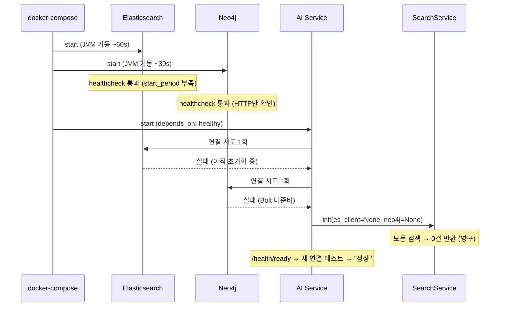

# 검색 시스템 안정성 긴급 개선 계획

**문서 번호**: 33
**작성일**: 2026-03-05
**사고일**: 2026-03-04
**상태**: 구현 완료
**심각도**: Critical

---

## 1. 사고 개요

| 항목 | 내용 |
|------|------|
| **발생일** | 2026-03-04 시연 중 |
| **현상** | 모든 검색(Hybrid/Keyword/Semantic)이 0건 반환 |
| **영향** | 시연 실패 — 검색 기능 전면 불가 |
| **데이터 상태** | ES 42,612건, Neo4j 170K+ 엔티티 — **정상** |
| **근본 원인** | AI Service가 ES/Neo4j보다 먼저 기동 → 연결 1회 시도 실패 → 영구 None |

## 2. 근본 원인 분석 (6가지)

| # | 원인 | 심각도 | 파일 |
|---|------|--------|------|
| 1 | `main.py` lifespan에서 ES/Neo4j 연결 시도 **1회만** — 실패 시 영구 None | **Critical** | `main.py:43-74` |
| 2 | ES healthcheck에 `start_period` 부족 — JVM 기동 중 조기 healthy 판정 | High | `docker-compose.yml` |
| 3 | Neo4j healthcheck가 HTTP(7474)만 확인 — Bolt(7687) 미검증 | High | `docker-compose.yml` |
| 4 | SearchService에 lazy reconnection 없음 — None이면 영구적 빈 결과 | **Critical** | `search.py:1208,1244` |
| 5 | `/health/ready`가 새 연결로 테스트 → SearchService 실제 상태 미반영 | High | `health.py:99-112` |
| 6 | STORY-114(init-db depends_on)는 이미 적용됨 — 실제 문제는 ai-service 자체 | Info | `docker-compose.yml` |

### 사고 매커니즘



## 3. 조치 계획 및 구현 상태

### Phase A: 즉시 조치 (P0) — 시연 재발 방지

#### A-1. main.py 연결 재시도 로직 ✅

- **파일**: `knowledge_service/src/app/main.py`
- **변경**: `_connect_with_retry()` 함수 추가 — 지수 백오프 (max 5회, 3초→6초→12초→24초→48초)
- **효과**: 총 93초간 재시도 → 의존 서비스 기동 대기 가능

```python
async def _connect_with_retry(connect_fn, name, max_retries=5, base_delay=3.0):
    for attempt in range(max_retries):
        try:
            client = await connect_fn()
            logger.info(f"{name} 연결 성공 (시도 {attempt + 1}/{max_retries})")
            return client
        except Exception as e:
            if attempt < max_retries - 1:
                delay = base_delay * (2 ** attempt)
                logger.warning(f"{name} 연결 실패 ({attempt+1}/{max_retries}): {e}, {delay}초 후 재시도")
                await asyncio.sleep(delay)
    return None
```

#### A-2. ES healthcheck start_period 증가 ✅

- **파일**: `infrastructure/docker/docker-compose.yml`
- **변경**: ES healthcheck `start_period: 60s` → `90s`
- **효과**: JVM 기동 시간 충분히 확보

#### A-3. Neo4j healthcheck Bolt 포트 검증 ✅

- **파일**: `infrastructure/docker/docker-compose.yml`
- **변경**: `wget http://localhost:7474` → `cypher-shell 'RETURN 1'` (Bolt 7687 사용)
- **효과**: 실제 쿼리 가능 상태에서만 healthy 판정

### Phase B: 단기 개선 (P1) — 자동 복구

#### B-1. SearchService lazy reconnection ✅

- **파일**: `knowledge_service/src/app/services/search.py`
- **변경**:
  - `_ensure_es_client()` / `_ensure_neo4j_driver()` 메서드 추가
  - `_es_search()`에서 `es_client=None`이면 재연결 시도
  - `_neo4j_query()`에서 `neo4j_driver=None`이면 재연결 시도
  - 검색 실패 시 클라이언트를 None으로 초기화 → 다음 호출 시 재연결 유도
- **효과**: 컨테이너 재시작 없이 자동 복구

#### B-2. /health/ready에 SearchService 상태 반영 ✅

- **파일**: `knowledge_service/src/app/api/routes/health.py`
- **변경**: `_check_search_service_clients()` 추가 — SearchService 내부 es_client/neo4j_driver 상태 확인
- **효과**: SearchService가 실제 검색 불가 상태일 때 `ready=false` 반환

### Phase C: 중기 안정화 (P2) — 모니터링

#### C-1. 검색 0건 시 경고 로그 ✅

- **파일**: `knowledge_service/src/app/services/search.py`
- **변경**: `hybrid_search` 결과 0건 + `es_client=None` 또는 `neo4j_driver=None` 조합 시 `[SEARCH_ALERT]` WARNING 로그
- **효과**: 시연 전 문제 사전 감지

## 4. 수정 대상 파일 목록

| 파일 | 변경 내용 |
|------|----------|
| `knowledge_service/src/app/main.py` | 지수 백오프 retry 로직 추가 |
| `infrastructure/docker/docker-compose.yml` | ES start_period 90s, Neo4j cypher-shell healthcheck |
| `knowledge_service/src/app/services/search.py` | lazy reconnection + 0건 경고 |
| `knowledge_service/src/app/api/routes/health.py` | SearchService 실제 상태 반영 |

## 5. 조치 결과 요약

### 코드 변경 diff 요약

| 파일 | 추가 | 수정 | 변경 핵심 |
|------|:----:|:----:|----------|
| `main.py` | +40 lines | 리팩터링 | `_connect_with_retry()` 지수 백오프 함수, ES/Neo4j 연결부 전면 교체 |
| `docker-compose.yml` | - | 2곳 | ES `start_period: 60s→90s`, Neo4j healthcheck `wget→cypher-shell` |
| `search.py` | +70 lines | 2곳 | `_ensure_es_client()` / `_ensure_neo4j_driver()` lazy reconnect, `[SEARCH_ALERT]` 0건 경고 |
| `health.py` | +25 lines | 1곳 | `_check_search_service_clients()` 추가, readiness에 `search_service_es/neo4j` 체크 |

### 방어 계층 (Defense in Depth)

```
Layer 1: Docker healthcheck (start_period 90s + cypher-shell Bolt 검증)
    ↓ 실패해도
Layer 2: main.py 지수 백오프 (5회, 최대 93초 대기)
    ↓ 그래도 None이면
Layer 3: SearchService lazy reconnection (검색 시점에 재연결 시도)
    ↓ 재연결 실패 시
Layer 4: [SEARCH_ALERT] WARNING 로그 + /health/ready=false 반환
```

---

## 6. 테스트 계획 및 검증 방법

### 6.1 사전 준비

```bash
# JWT 토큰 획득 (테스트 전 필수)
cat > /tmp/login.json << 'ENDJSON'
{"email":"admin@example.com","password":"admin123!"}
ENDJSON

TOKEN=$(curl -s -X POST http://localhost:8000/api/v1/auth/login \
  -H 'Content-Type: application/json' \
  -d @/tmp/login.json | python3 -c "import sys,json; print(json.load(sys.stdin).get('access_token',''))")

echo "Token: ${TOKEN:0:20}..."
```

### 6.2 Phase A 테스트: 기동 시 연결 재시도

**목적**: ES/Neo4j가 늦게 뜰 때 AI Service가 재시도하여 연결에 성공하는지 확인

```bash
# 테스트 1: AI Service 리빌드 후 전체 재시작
cd infrastructure/docker
docker-compose build ai-service
docker-compose down
docker-compose up -d

# 기대 로그 확인 (1~2분 대기 후)
docker logs kp-ai-service 2>&1 | grep -E "연결 성공|재시도|최종 실패"
```

**기대 결과**:
```
Elasticsearch 연결 성공 (시도 1/5)    # 또는 재시도 후 성공
Neo4j 연결 성공 (시도 1/5)            # 또는 재시도 후 성공
SearchService initialized - ES: connected, Neo4j: connected
```

**실패 시 로그 패턴**:
```
Elasticsearch 연결 실패 (1/5): ... 3초 후 재시도
Elasticsearch 연결 실패 (2/5): ... 6초 후 재시도
Elasticsearch 연결 성공 (시도 3/5)     # 재시도 성공
```

```bash
# 테스트 2: 검색 동작 확인
curl -s -X POST http://localhost:8000/api/v1/search/hybrid \
  -H "Authorization: Bearer $TOKEN" \
  -H "Content-Type: application/json" \
  -d '{"query":"시스템 구조","top_k":3}' | python3 -c "
import sys, json
r = json.load(sys.stdin)
print(f'결과 수: {r.get(\"total\", 0)}')
print(f'검색 타입: {r.get(\"search_type\", \"\")}')
if r.get('results'):
    print(f'첫 번째 결과: {r[\"results\"][0].get(\"content\", \"\")[:80]}...')
"
```

**기대 결과**: `결과 수: 3` (또는 3 이상)

### 6.3 Phase B 테스트: Lazy Reconnection

**목적**: ES/Neo4j 재시작 후 AI Service 재시작 없이 자동 복구 되는지 확인

```bash
# 테스트 3: ES 재시작 후 자동 복구
echo "--- Step 1: ES 재시작 ---"
docker restart kp-elasticsearch

echo "--- Step 2: 즉시 검색 (실패 예상) ---"
curl -s -X POST http://localhost:8000/api/v1/search/hybrid \
  -H "Authorization: Bearer $TOKEN" \
  -H "Content-Type: application/json" \
  -d '{"query":"테스트","top_k":1}' | python3 -c "
import sys, json; r = json.load(sys.stdin); print(f'결과 수: {r.get(\"total\", 0)}')"

echo "--- Step 3: 60초 대기 (ES 복구 대기) ---"
sleep 60

echo "--- Step 4: 재검색 (자동 복구 기대) ---"
curl -s -X POST http://localhost:8000/api/v1/search/hybrid \
  -H "Authorization: Bearer $TOKEN" \
  -H "Content-Type: application/json" \
  -d '{"query":"테스트","top_k":1}' | python3 -c "
import sys, json; r = json.load(sys.stdin); print(f'결과 수: {r.get(\"total\", 0)}')"

echo "--- Step 5: 로그에서 lazy reconnection 확인 ---"
docker logs kp-ai-service --since 2m 2>&1 | grep -E "lazy reconnection|SEARCH_ALERT"
```

**기대 결과**:
- Step 2: 결과 수 0 또는 에러 (ES 다운 중)
- Step 4: 결과 수 1 이상 (lazy reconnection 성공)
- Step 5: `Elasticsearch lazy reconnection 성공` 로그 출력

```bash
# 테스트 4: Neo4j 재시작 후 자동 복구
docker restart kp-neo4j
sleep 60
curl -s -X POST http://localhost:8000/api/v1/search/hybrid \
  -H "Authorization: Bearer $TOKEN" \
  -H "Content-Type: application/json" \
  -d '{"query":"문서 관리","top_k":3}' | python3 -c "
import sys, json; r = json.load(sys.stdin); print(f'결과 수: {r.get(\"total\", 0)}')"

docker logs kp-ai-service --since 2m 2>&1 | grep "Neo4j lazy reconnection"
```

**기대 결과**: 결과 수 > 0, `Neo4j lazy reconnection 성공` 로그

### 6.4 Phase B 테스트: /health/ready 반영

**목적**: SearchService 내부 클라이언트 상태가 readiness에 정확히 반영되는지 확인

```bash
# 테스트 5: 정상 상태에서 ready 확인
curl -s http://localhost:8000/api/v1/health/ready | python3 -m json.tool
```

**기대 결과**:
```json
{
    "ready": true,
    "checks": {
        "config_loaded": true,
        "llm_api_key_set": true,
        "elasticsearch": true,
        "neo4j": true,
        "postgresql": true,
        "search_service_es": true,
        "search_service_neo4j": true
    }
}
```

```bash
# 테스트 6: ES 중단 상태에서 ready 확인
docker stop kp-elasticsearch
sleep 5
curl -s http://localhost:8000/api/v1/health/ready | python3 -m json.tool

# 복원
docker start kp-elasticsearch
```

**기대 결과**: `search_service_es: false` 또는 `elasticsearch: false` → `ready: false`

### 6.5 Phase C 테스트: 0건 경고 로그

**목적**: 검색 결과 0건 + 클라이언트 None 조합 시 `[SEARCH_ALERT]` 경고 확인

```bash
# 테스트 7: 로그 모니터링하며 검색 (ES 재시작 직후)
docker restart kp-elasticsearch
sleep 5

# 즉시 검색 (ES 아직 미복구 → lazy reconnect 실패 → 0건 + 경고)
curl -s -X POST http://localhost:8000/api/v1/search/hybrid \
  -H "Authorization: Bearer $TOKEN" \
  -H "Content-Type: application/json" \
  -d '{"query":"검색 테스트","top_k":3}' > /dev/null

# 경고 로그 확인
docker logs kp-ai-service --since 1m 2>&1 | grep "SEARCH_ALERT"
```

**기대 결과**:
```
[SEARCH_ALERT] 검색 결과 0건 — 클라이언트 미연결 감지: ES=None. Query: '검색 테스트', 연결 장애 가능성 있음
```

### 6.6 Docker Healthcheck 테스트

```bash
# 테스트 8: ES healthcheck start_period 확인
docker inspect kp-elasticsearch --format='{{json .Config.Healthcheck}}' | python3 -m json.tool
# 기대: "StartPeriod": 90000000000 (90초 = 90 * 10^9 nanoseconds)

# 테스트 9: Neo4j healthcheck 방식 확인
docker inspect kp-neo4j --format='{{json .Config.Healthcheck}}' | python3 -m json.tool
# 기대: Test에 "cypher-shell" 포함
```

### 6.7 통합 테스트 시나리오 (전체 검증)

```bash
#!/bin/bash
# 통합 테스트 스크립트
echo "=== 검색 안정성 통합 테스트 ==="

# 0. 토큰 획득
cat > /tmp/login.json << 'ENDJSON'
{"email":"admin@example.com","password":"admin123!"}
ENDJSON
TOKEN=$(curl -s -X POST http://localhost:8000/api/v1/auth/login \
  -H 'Content-Type: application/json' -d @/tmp/login.json | \
  python3 -c "import sys,json; print(json.load(sys.stdin).get('access_token',''))")

# 1. 정상 검색
echo "[TEST 1] 정상 검색..."
RESULT=$(curl -s -X POST http://localhost:8000/api/v1/search/hybrid \
  -H "Authorization: Bearer $TOKEN" -H "Content-Type: application/json" \
  -d '{"query":"시스템","top_k":3}')
TOTAL=$(echo $RESULT | python3 -c "import sys,json; print(json.load(sys.stdin).get('total',0))")
[ "$TOTAL" -gt 0 ] && echo "  PASS: $TOTAL건" || echo "  FAIL: 0건"

# 2. Ready 상태
echo "[TEST 2] /health/ready..."
READY=$(curl -s http://localhost:8000/api/v1/health/ready | \
  python3 -c "import sys,json; print(json.load(sys.stdin).get('ready',False))")
[ "$READY" = "True" ] && echo "  PASS: ready=true" || echo "  FAIL: ready=$READY"

# 3. ES 재시작 후 복구
echo "[TEST 3] ES 재시작 + 자동 복구..."
docker restart kp-elasticsearch > /dev/null 2>&1
sleep 90
RESULT=$(curl -s -X POST http://localhost:8000/api/v1/search/hybrid \
  -H "Authorization: Bearer $TOKEN" -H "Content-Type: application/json" \
  -d '{"query":"시스템","top_k":1}')
TOTAL=$(echo $RESULT | python3 -c "import sys,json; print(json.load(sys.stdin).get('total',0))")
[ "$TOTAL" -gt 0 ] && echo "  PASS: 자동 복구 ($TOTAL건)" || echo "  FAIL: 복구 안됨"

echo "=== 테스트 완료 ==="
```

## 6. 교훈

```
"Health 엔드포인트가 정상이라고 실제 서비스가 정상인 것은 아니다."
"단 1회 연결 시도로 영구 장애가 발생할 수 있다."
"Readiness Probe는 실제 서비스 객체의 상태를 반영해야 한다."
```

### 재발 방지 체크리스트

- [ ] 외부 서비스 연결 시 반드시 재시도 로직 포함
- [ ] Healthcheck는 실제 프로토콜(Bolt, TCP)로 검증
- [ ] Readiness Probe는 실제 서비스 인스턴스 상태 반영
- [ ] 검색 0건 시 자동 경고 로그 발생
- [ ] 시연 전 `/health/ready` 확인 필수

## 7. 담당 및 SP

| 조치 | 담당 | SP | 상태 |
|------|------|-----|------|
| A-1. main.py retry | RAG Engineer | 2 | ✅ 완료 |
| A-2. ES start_period | Infra | 0.5 | ✅ 완료 |
| A-3. Neo4j healthcheck | Infra | 0.5 | ✅ 완료 |
| B-1. Lazy reconnection | RAG Engineer | 3 | ✅ 완료 |
| B-2. Health 상태 반영 | RAG Engineer | 1 | ✅ 완료 |
| C-1. 0건 경고 로그 | DevOps | 1 | ✅ 완료 |
| **합계** | | **8 SP** | |
