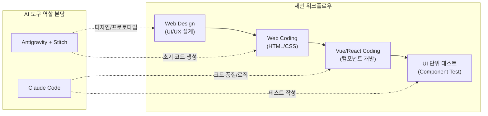
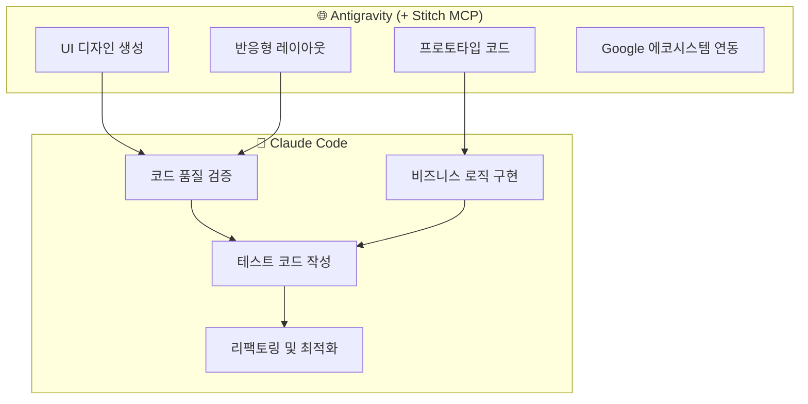
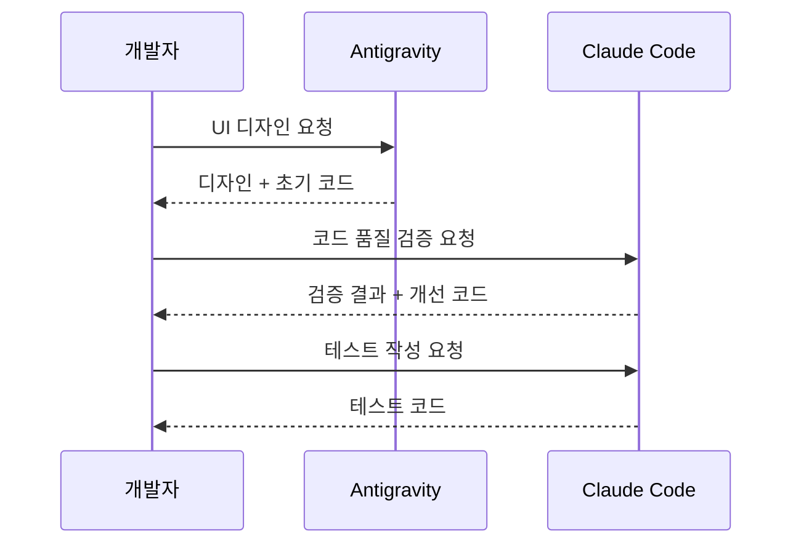
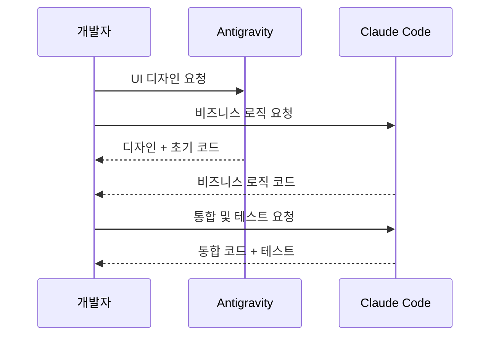
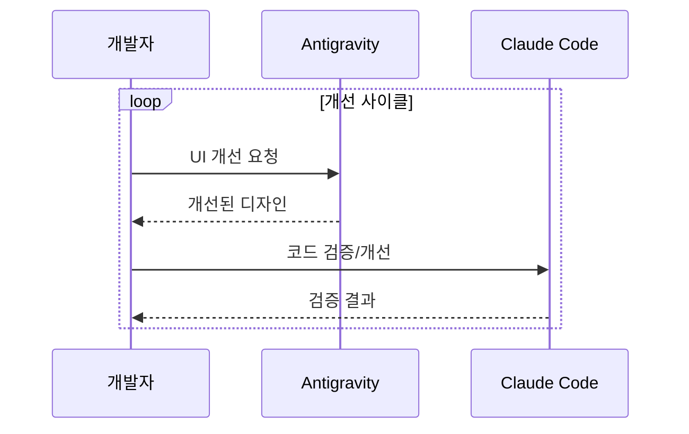
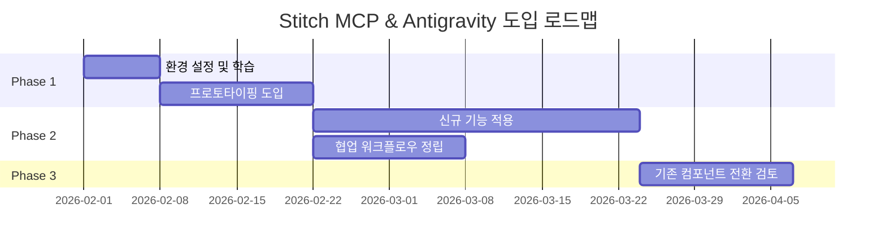

# Stitch MCP & Antigravity 도입 영향도 분석 및 적용 방안

**작성일**: 2026-01-24
**작성자**: Claude (Opus 4.5)
**기반 문서**: 01. Claude Code 완벽 가이드, 02. Stitch MCP 협업 가이드

---

## 1. 개요

### 1.1 목적

본 문서는 **Stitch MCP**와 **Google Antigravity**를 본 프로젝트에 도입할 경우의 영향도를 분석하고, **Claude Code와의 협업 워크플로우**를 통한 프론트엔드 개발 생산성 향상 방안을 제시합니다.

### 1.2 대상 워크플로우



---

## 2. 현재 환경 vs 도입 환경 비교

### 2.1 기술 스택 비교

| 항목 | 현재 환경 | Antigravity 도입 시 | 변경 영향 |
|------|----------|-------------------|----------|
| **AI 도구** | Claude Code 단독 | Claude Code + Antigravity | ⚠️ 도구 추가 |
| **UI 생성** | 수동 코딩 | Stitch MCP 자동 생성 | ✅ 생산성 향상 |
| **프론트엔드** | React 18 + MUI | React/Vue + Tailwind | ⚠️ 전환 검토 필요 |
| **디자인 시스템** | MUI Components | Tailwind + 커스텀 | ⚠️ 재구축 필요 |
| **백엔드** | SpringBoot + FastAPI | 유지 (Firebase 미사용) | ✅ 영향 없음 |
| **인프라** | Docker Compose | 유지 | ✅ 영향 없음 |

### 2.2 영향도 매트릭스

| 영역 | 영향도 | 리스크 | 기대 효과 |
|------|--------|--------|----------|
| **프론트엔드 개발** | 🔴 높음 | 기존 MUI 컴포넌트 재작성 | 개발 속도 2-3배 향상 |
| **디자인 시스템** | 🔴 높음 | 일관성 재확립 필요 | AI 기반 디자인 생성 |
| **백엔드** | 🟢 낮음 | 없음 | - |
| **테스트** | 🟡 중간 | 테스트 코드 수정 | 테스트 자동 생성 |
| **인프라** | 🟢 낮음 | 없음 | - |

---

## 3. Claude Code × Antigravity 협업 워크플로우

### 3.1 역할 분담 원칙



### 3.2 도구별 강점

| 역할 | Antigravity + Stitch | Claude Code |
|------|---------------------|-------------|
| **UI 디자인** | ⭐⭐⭐⭐⭐ 자연어 → UI | ⭐⭐ 제한적 |
| **프로토타입** | ⭐⭐⭐⭐⭐ 빠른 생성 | ⭐⭐⭐ 가능 |
| **코드 품질** | ⭐⭐⭐ 기본 수준 | ⭐⭐⭐⭐⭐ 최적화 |
| **비즈니스 로직** | ⭐⭐ 단순 로직 | ⭐⭐⭐⭐⭐ 복잡 로직 |
| **테스트** | ⭐⭐ 기본 테스트 | ⭐⭐⭐⭐⭐ 전체 커버리지 |
| **리팩토링** | ⭐⭐ 제한적 | ⭐⭐⭐⭐⭐ 고급 리팩토링 |

---

## 4. 단계별 협업 워크플로우 상세

### 4.1 Phase 1: Web Design (UI/UX 설계)

```
담당: Antigravity + Stitch MCP
```

| 단계 | 작업 | 프롬프트 예시 |
|------|------|-------------|
| 1-1 | 와이어프레임 생성 | "검색 결과 페이지 와이어프레임 만들어줘. 좌측 필터, 우측 결과 목록" |
| 1-2 | 컬러/타이포그래피 | "브랜드 컬러 #1976D2 기반 색상 팔레트 생성" |
| 1-3 | 컴포넌트 디자인 | "검색 결과 카드 컴포넌트 디자인. 제목, 요약, 메타데이터 포함" |
| 1-4 | 반응형 레이아웃 | "모바일/태블릿/데스크톱 3단계 반응형 적용" |

**산출물**: UI 디자인 + 초기 HTML/CSS 코드

### 4.2 Phase 2: Web Coding (HTML/CSS)

```
담당: Antigravity → Claude Code 검증
```

| 단계 | 작업 | 담당 도구 |
|------|------|----------|
| 2-1 | Stitch 생성 코드 추출 | Antigravity |
| 2-2 | 코드 품질 검증 | **Claude Code** |
| 2-3 | 접근성 (WCAG) 검토 | **Claude Code** |
| 2-4 | 반응형 테스트 | Antigravity |

**Claude Code 검증 프롬프트**:
```
Stitch가 생성한 HTML/CSS 코드를 검토해줘:
1. 시맨틱 HTML 준수 여부
2. CSS 클래스 네이밍 컨벤션
3. 접근성 (aria-label, role 등)
4. 성능 최적화 포인트
```

### 4.3 Phase 3: Vue/React Coding (컴포넌트 개발)

```
담당: Claude Code (주도) + Antigravity (보조)
```

| 단계 | 작업 | 담당 도구 | 비고 |
|------|------|----------|------|
| 3-1 | 컴포넌트 구조 설계 | **Claude Code** | Props, State 정의 |
| 3-2 | 초기 컴포넌트 생성 | Antigravity | 빠른 스캐폴딩 |
| 3-3 | 비즈니스 로직 구현 | **Claude Code** | API 연동, 상태 관리 |
| 3-4 | 코드 리팩토링 | **Claude Code** | 최적화, 중복 제거 |

**현재 스택 (React 18 + MUI) 유지 시**:
```tsx
// Claude Code가 MUI 기반으로 변환
import { Card, CardContent, Typography, Chip } from '@mui/material';

const SearchResultCard = ({ title, summary, metadata }) => (
  <Card sx={{ mb: 2 }}>
    <CardContent>
      <Typography variant="h6">{title}</Typography>
      <Typography variant="body2" color="text.secondary">{summary}</Typography>
      <Chip label={metadata.type} size="small" />
    </CardContent>
  </Card>
);
```

**Tailwind 전환 시**:
```tsx
// Stitch 생성 → Claude Code 검증
const SearchResultCard = ({ title, summary, metadata }) => (
  <div className="bg-white rounded-lg shadow-md p-4 mb-4">
    <h3 className="text-lg font-semibold text-gray-900">{title}</h3>
    <p className="text-sm text-gray-600 mt-2">{summary}</p>
    <span className="inline-block bg-blue-100 text-blue-800 text-xs px-2 py-1 rounded mt-2">
      {metadata.type}
    </span>
  </div>
);
```

### 4.4 Phase 4: UI 단위 테스트

```
담당: Claude Code (전담)
```

| 단계 | 작업 | 테스트 유형 |
|------|------|-----------|
| 4-1 | 컴포넌트 렌더링 테스트 | Unit Test |
| 4-2 | Props 검증 테스트 | Unit Test |
| 4-3 | 사용자 인터랙션 테스트 | Integration Test |
| 4-4 | 스냅샷 테스트 | Snapshot Test |

**Claude Code 테스트 생성 프롬프트**:
```
SearchResultCard 컴포넌트에 대한 테스트를 작성해줘:
- @testing-library/react 사용
- 렌더링 테스트, Props 테스트, 클릭 이벤트 테스트
- 커버리지 80% 이상 목표
```

**생성 테스트 예시**:
```tsx
import { render, screen } from '@testing-library/react';
import SearchResultCard from './SearchResultCard';

describe('SearchResultCard', () => {
  const mockProps = {
    title: '테스트 문서',
    summary: '테스트 요약입니다.',
    metadata: { type: 'PDF' }
  };

  it('제목이 올바르게 렌더링된다', () => {
    render(<SearchResultCard {...mockProps} />);
    expect(screen.getByText('테스트 문서')).toBeInTheDocument();
  });

  it('메타데이터 타입이 Chip으로 표시된다', () => {
    render(<SearchResultCard {...mockProps} />);
    expect(screen.getByText('PDF')).toBeInTheDocument();
  });
});
```

---

## 5. 협업 패턴 유형

### 5.1 순차적 협업 (Sequential)



**사용 시기**: 품질이 최우선인 경우, 신규 컴포넌트 개발

### 5.2 병렬 협업 (Parallel)



**사용 시기**: 빠른 개발이 필요한 경우, 독립적인 작업

### 5.3 반복적 협업 (Iterative)



**사용 시기**: 지속적인 개선이 필요한 경우, UI 리뉴얼

---

## 6. 도입 영향도 상세 분석

### 6.1 긍정적 영향

| 영역 | 영향 | 기대 효과 |
|------|------|----------|
| **개발 속도** | 🔼 대폭 향상 | UI 개발 시간 50-70% 단축 |
| **디자인 일관성** | 🔼 향상 | AI 기반 일관된 디자인 |
| **프로토타이핑** | 🔼 대폭 향상 | 자연어 → UI 즉시 생성 |
| **협업 효율** | 🔼 향상 | 역할 분담 명확화 |

### 6.2 부정적 영향 및 리스크

| 영역 | 리스크 | 완화 방안 |
|------|--------|----------|
| **기존 코드베이스** | MUI 컴포넌트 재작성 필요 | 점진적 전환 (신규 기능부터) |
| **학습 곡선** | Antigravity 학습 필요 | 가이드 문서 참고 (01, 02) |
| **비용** | 추가 구독료 ($15/월) | ROI 분석 후 결정 |
| **의존성** | Google 에코시스템 종속 | 백엔드는 현행 유지 |

### 6.3 도입 시나리오별 영향도

| 시나리오 | 영향 범위 | 권장 여부 |
|----------|----------|----------|
| **전면 도입** | 프론트엔드 전체 재구축 | ⚠️ 비권장 (리스크 높음) |
| **신규 기능만 도입** | 신규 페이지/컴포넌트 | ✅ 권장 |
| **프로토타이핑만 도입** | 디자인 단계만 | ✅ 권장 (저리스크) |
| **도입 안함** | 없음 | ⚠️ 생산성 개선 기회 상실 |

---

## 7. 적용 방안 및 로드맵

### 7.1 권장 도입 전략: 점진적 도입



### 7.2 Phase 1: 환경 설정 (1주)

| 작업 | 담당 | 산출물 |
|------|------|--------|
| Antigravity 계정 설정 | DevOps | 계정 정보 |
| Stitch MCP 연동 | Infra | MCP 설정 파일 |
| 팀 학습 세션 | TL | 학습 자료 |

### 7.3 Phase 2: 파일럿 프로젝트 (2주)

| 작업 | 적용 대상 | 기대 효과 |
|------|----------|----------|
| 프로토타이핑 | 신규 페이지 디자인 | 디자인 속도 향상 |
| 협업 테스트 | Claude Code + Antigravity | 워크플로우 검증 |
| 결과 평가 | 전체 | 본격 도입 여부 결정 |

### 7.4 Phase 3: 본격 도입 (4주+)

| 작업 | 범위 | 비고 |
|------|------|------|
| 신규 기능 적용 | 신규 페이지/컴포넌트 | MUI 유지 또는 Tailwind 선택 |
| 워크플로우 정립 | 팀 전체 | 가이드 문서화 |
| 기존 코드 전환 | 선택적 | ROI 분석 후 결정 |

---

## 8. 본 프로젝트 특화 고려사항

### 8.1 현재 스택 유지 시 (React 18 + MUI)

| 항목 | 방안 |
|------|------|
| **디자인 생성** | Stitch로 디자인 → Claude Code가 MUI로 변환 |
| **코드 품질** | Claude Code가 MUI Best Practice 적용 |
| **테스트** | 기존 테스트 프레임워크 유지 |

### 8.2 Tailwind 전환 시

| 항목 | 방안 |
|------|------|
| **디자인 시스템** | Stitch + Tailwind 네이티브 사용 |
| **컴포넌트** | Headless UI + Tailwind 조합 |
| **마이그레이션** | MUI → Tailwind 점진적 전환 |

### 8.3 Vue 도입 검토 시

| 고려사항 | 현황 | 권장 |
|----------|------|------|
| **팀 역량** | React 중심 | React 유지 권장 |
| **기존 코드** | React 18 기반 | 전환 비용 높음 |
| **Antigravity 지원** | React/Vue 모두 지원 | React 유지 가능 |

---

## 9. 결론 및 권장사항

### 9.1 종합 평가

| 항목 | 평가 |
|------|------|
| **도입 가치** | ⭐⭐⭐⭐ (높음) |
| **도입 리스크** | ⭐⭐⭐ (중간) |
| **ROI 예상** | ⭐⭐⭐⭐ (높음) |
| **권장 도입 방식** | 점진적 도입 (신규 기능부터) |

### 9.2 핵심 권장사항

```
1. [권장] 신규 기능 개발 시 Antigravity + Stitch 파일럿 적용
2. [권장] Claude Code와의 협업 워크플로우 정립
3. [선택] 디자인 시스템은 MUI 유지 또는 Tailwind 전환 검토
4. [비권장] 기존 코드베이스 전면 재작성
```

### 9.3 다음 단계

| 우선순위 | 액션 | 담당 | 비고 |
|----------|------|------|------|
| 1 | Antigravity 평가판 신청 | TL | 무료 체험 |
| 2 | 파일럿 대상 기능 선정 | PM | 신규 페이지 1개 |
| 3 | 협업 워크플로우 가이드 작성 | 클로드 | 본 문서 기반 |
| 4 | 파일럿 결과 리뷰 | 팀 전체 | 본격 도입 결정 |

---

## 10. 부록: 참고 자료

### 10.1 관련 문서

| 문서 | 내용 | 참고 가치 |
|------|------|----------|
| 01. Claude Code 완벽 가이드 | Skills, CLAUDE.md 작성법 | ⭐⭐⭐⭐⭐ |
| 02. Stitch MCP 협업 가이드 | 협업 워크플로우 패턴 | ⭐⭐⭐⭐⭐ |
| 검토결과_01 | 문서 01 상세 검토 | ⭐⭐⭐⭐ |
| 검토결과_02 | 문서 02 상세 검토 | ⭐⭐⭐⭐ |

### 10.2 SMART 프롬프트 원칙 (문서 02 인용)

| 원칙 | 예시 |
|------|------|
| **S**pecific (구체적) | "버튼" → "파란색 primary 버튼, 16px 패딩" |
| **M**easurable (측정 가능) | "큰 텍스트" → "text-2xl (24px)" |
| **A**chievable (달성 가능) | 한 번에 너무 많이 요구 X |
| **R**elevant (관련성) | 현재 작업에 집중 |
| **T**ime-bound (시간 명시) | "빠르게" → "5분 안에 프로토타입" |

---

**작성 완료**: 2026-01-24
**다음 리뷰 예정**: 파일럿 프로젝트 완료 후
