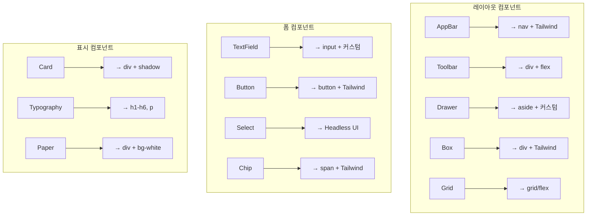
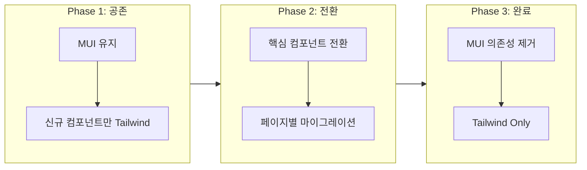
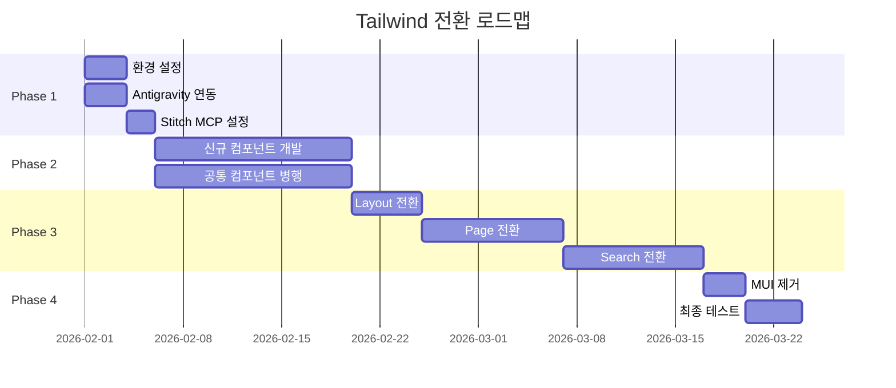
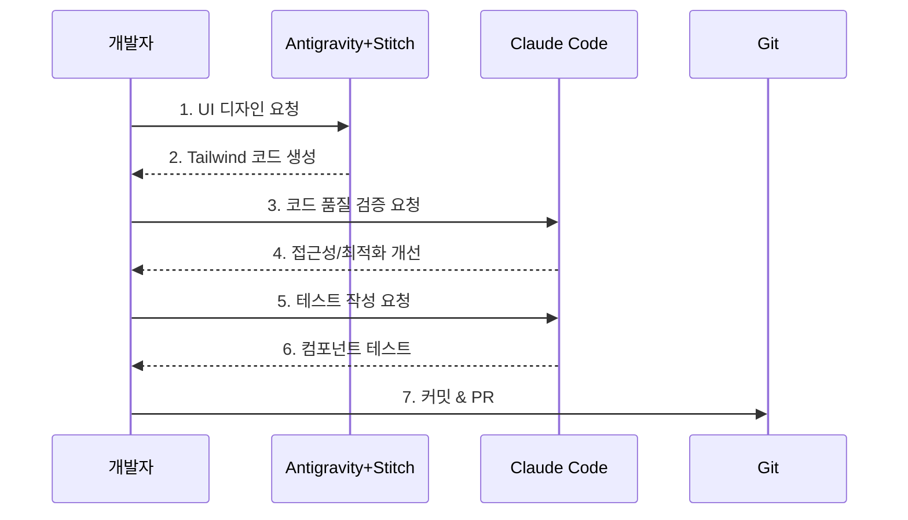
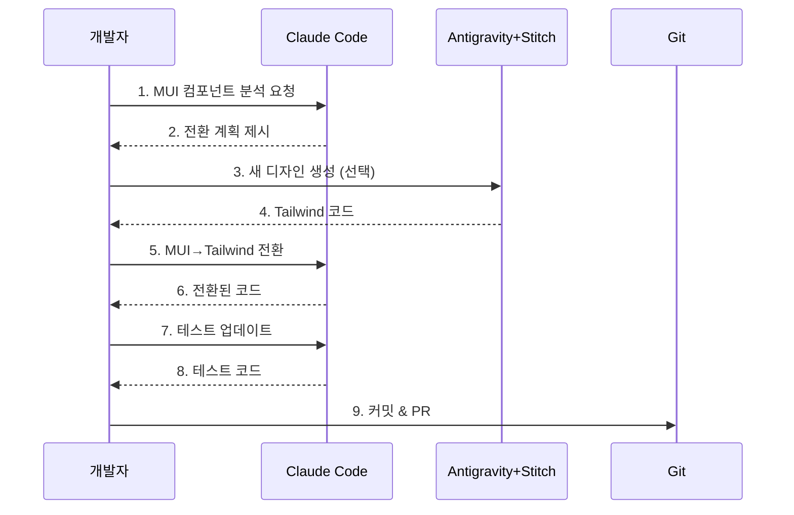
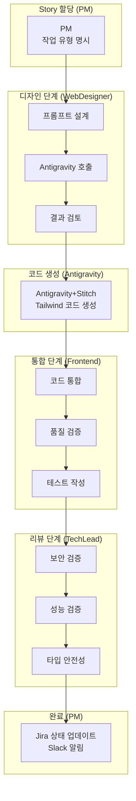

# Tailwind + Antigravity + Stitch MCP 도입 영향도 분석

**작성일**: 2026-01-25
**작성자**: Claude (Opus 4.5)
**결정 사항**: 옵션 B - Tailwind 도입 + Antigravity 협업 + Stitch MCP 연동

---

## 1. 결정 요약

### 1.1 선택된 옵션

```
옵션 B: Tailwind 도입 (신규 영역) + Antigravity 협업 + Stitch MCP 연동
```

### 1.2 기대 효과

| 항목 | 기대 효과 |
|------|----------|
| **개발 속도** | UI 개발 시간 50-70% 단축 |
| **AI 협업** | Stitch 생성 코드 네이티브 활용 |
| **디자인 자유도** | Material Design 제약 탈피 |
| **번들 크기** | 사용 클래스만 포함 (10KB 미만) |

---

## 2. 현재 프론트엔드 현황

### 2.1 기술 스택

| 항목 | 현재 값 |
|------|---------|
| **프레임워크** | React 18.3.1 |
| **언어** | TypeScript 5.6.3 |
| **UI 라이브러리** | MUI v6.1.6 |
| **스타일링** | Emotion (CSS-in-JS) |
| **상태관리** | Redux Toolkit + React Query |
| **빌드** | Vite 5.4.10 |

### 2.2 코드베이스 규모

| 항목 | 수치 |
|------|------|
| **총 코드 라인** | 963줄 (src/) |
| **컴포넌트 파일** | 10개 |
| **페이지 파일** | 4개 |
| **MUI 컴포넌트 사용** | 17+ 종류 |

### 2.3 MUI 의존성

```json
{
  "@mui/material": "^6.1.6",
  "@mui/icons-material": "^6.1.6",
  "@emotion/react": "^11.13.3",
  "@emotion/styled": "^11.13.0"
}
```

---

## 3. 영향받는 파일 상세 분석

### 3.1 컴포넌트 파일별 영향도

| 파일 | 라인 | MUI 사용량 | 영향도 | 전환 복잡도 |
|------|------|-----------|--------|------------|
| `ChatSearch.tsx` | 185 | 높음 | 🔴 높음 | 복잡 |
| `KeywordSearch.tsx` | 179 | 높음 | 🔴 높음 | 복잡 |
| `SearchFilters.tsx` | 145 | 높음 | 🔴 높음 | 중간 |
| `DashboardPage.tsx` | 111 | 중간 | 🟡 중간 | 중간 |
| `Header.tsx` | 96 | 높음 | 🔴 높음 | 중간 |
| `KnowledgePage.tsx` | 94 | 중간 | 🟡 중간 | 중간 |
| `Sidebar.tsx` | 74 | 높음 | 🔴 높음 | 중간 |
| `SearchPage.tsx` | 58 | 낮음 | 🟢 낮음 | 쉬움 |
| `MainLayout.tsx` | 49 | 중간 | 🟡 중간 | 쉬움 |
| `NotFoundPage.tsx` | 작음 | 낮음 | 🟢 낮음 | 쉬움 |

### 3.2 사용 중인 MUI 컴포넌트 매핑



### 3.3 MUI → Tailwind 전환 매핑 테이블

| MUI 컴포넌트 | Tailwind 대체 | 추가 라이브러리 |
|-------------|--------------|----------------|
| `Box` | `<div className="...">` | - |
| `Typography` | `<h1>~<h6>`, `<p>`, `<span>` | - |
| `Button` | `<button className="...">` | - |
| `Card` | `<div className="rounded shadow">` | - |
| `TextField` | `<input className="...">` | - |
| `AppBar` | `<nav className="fixed top-0">` | - |
| `Drawer` | `<aside className="...">` | - |
| `Grid` | `<div className="grid">` | - |
| `Select` | `<Listbox>` | **Headless UI** |
| `Menu` | `<Menu>` | **Headless UI** |
| `Tabs` | `<Tab.Group>` | **Headless UI** |
| `Modal/Dialog` | `<Dialog>` | **Headless UI** |
| `Autocomplete` | `<Combobox>` | **Headless UI** |
| `Pagination` | 커스텀 구현 | - |
| `CircularProgress` | CSS 애니메이션 | - |
| `Icons` | Heroicons / Lucide | **아이콘 라이브러리** |

---

## 4. 전환 전략

### 4.1 권장 전략: 점진적 전환 (Incremental Migration)



### 4.2 Phase별 상세 계획

#### Phase 1: 환경 설정 및 공존 (1주)

| 작업 | 산출물 | 담당 |
|------|--------|------|
| Tailwind CSS 설치 | `tailwind.config.js` | Infra |
| PostCSS 설정 | `postcss.config.js` | Infra |
| Headless UI 설치 | `package.json` 업데이트 | Frontend |
| 아이콘 라이브러리 선택 | Heroicons 또는 Lucide | Frontend |
| Antigravity 계정 설정 | MCP 연동 | DevOps |
| Stitch MCP 연동 | `.claude/settings.json` | Infra |

**설치 명령어**:
```bash
# Tailwind CSS
npm install -D tailwindcss postcss autoprefixer
npx tailwindcss init -p

# Headless UI (React)
npm install @headlessui/react

# 아이콘
npm install @heroicons/react
# 또는
npm install lucide-react
```

#### Phase 2: 신규 컴포넌트 Tailwind 적용 (2-3주)

| 대상 | 작업 | 복잡도 |
|------|------|--------|
| 신규 페이지 | Tailwind로 처음부터 개발 | 낮음 |
| 신규 컴포넌트 | Stitch 생성 → 그대로 사용 | 낮음 |
| 공통 컴포넌트 | Tailwind 버전 병행 생성 | 중간 |

#### Phase 3: 기존 컴포넌트 전환 (4-6주)

| 우선순위 | 컴포넌트 | 이유 |
|----------|---------|------|
| 1 | `MainLayout.tsx` | 전체 레이아웃 기반 |
| 2 | `Header.tsx`, `Sidebar.tsx` | 공통 컴포넌트 |
| 3 | `SearchPage.tsx` | MUI 사용량 적음 |
| 4 | `DashboardPage.tsx` | 카드 컴포넌트 중심 |
| 5 | `ChatSearch.tsx`, `KeywordSearch.tsx` | 복잡도 높음 |
| 6 | `SearchFilters.tsx` | Select 컴포넌트 |
| 7 | `KnowledgePage.tsx` | 마지막 |

#### Phase 4: MUI 제거 (1주)

| 작업 | 영향 |
|------|------|
| MUI 패키지 삭제 | 번들 크기 감소 |
| Emotion 패키지 삭제 | CSS-in-JS 제거 |
| theme.ts 삭제 | Tailwind 설정으로 대체 |
| 테스트 및 검증 | 회귀 테스트 |

---

## 5. 파일별 전환 상세

### 5.1 theme.ts → tailwind.config.js

**현재 (MUI theme.ts)**:
```typescript
const theme = createTheme({
  palette: {
    primary: { main: '#1976d2' },
    secondary: { main: '#9c27b0' },
    background: { default: '#f5f5f5' },
  },
  typography: {
    fontFamily: 'Pretendard, ...',
    h1: { fontSize: '2.5rem', fontWeight: 600 },
  },
  shape: { borderRadius: 8 },
});
```

**전환 후 (tailwind.config.js)**:
```javascript
module.exports = {
  content: ['./src/**/*.{js,ts,jsx,tsx}'],
  theme: {
    extend: {
      colors: {
        primary: {
          DEFAULT: '#1976d2',
          50: '#e3f2fd',
          100: '#bbdefb',
          // ... 전체 팔레트
          900: '#0d47a1',
        },
        secondary: {
          DEFAULT: '#9c27b0',
        },
      },
      fontFamily: {
        sans: ['Pretendard', 'system-ui', 'sans-serif'],
      },
      borderRadius: {
        DEFAULT: '8px',
      },
    },
  },
  plugins: [],
};
```

### 5.2 컴포넌트 전환 예시

#### Header.tsx 전환

**현재 (MUI)**:
```tsx
<AppBar position="fixed" sx={{ zIndex: (theme) => theme.zIndex.drawer + 1 }}>
  <Toolbar>
    <Typography variant="h6" noWrap component="div">
      Knowledge Portal
    </Typography>
    <Box sx={{ flexGrow: 1 }} />
    <IconButton color="inherit">
      <SearchIcon />
    </IconButton>
  </Toolbar>
</AppBar>
```

**전환 후 (Tailwind)**:
```tsx
<nav className="fixed top-0 left-0 right-0 z-50 bg-primary text-white shadow-md">
  <div className="flex items-center h-16 px-4">
    <h1 className="text-xl font-semibold">Knowledge Portal</h1>
    <div className="flex-grow" />
    <button className="p-2 rounded-full hover:bg-white/10 transition-colors">
      <MagnifyingGlassIcon className="w-6 h-6" />
    </button>
  </div>
</nav>
```

#### Card 컴포넌트 전환

**현재 (MUI)**:
```tsx
<Card sx={{ mb: 2, '&:hover': { boxShadow: 3 } }}>
  <CardContent>
    <Typography variant="h6">{title}</Typography>
    <Typography variant="body2" color="text.secondary">{summary}</Typography>
  </CardContent>
</Card>
```

**전환 후 (Tailwind)**:
```tsx
<div className="bg-white rounded-lg shadow mb-4 p-4 hover:shadow-lg transition-shadow">
  <h3 className="text-lg font-semibold text-gray-900">{title}</h3>
  <p className="text-sm text-gray-600 mt-2">{summary}</p>
</div>
```

---

## 6. 추가 필요 라이브러리

### 6.1 필수 추가 패키지

| 패키지 | 용도 | 대체 대상 |
|--------|------|----------|
| `@headlessui/react` | 접근성 지원 컴포넌트 | MUI Select, Menu, Dialog |
| `@heroicons/react` | 아이콘 | @mui/icons-material |
| `clsx` | 조건부 클래스 | - |
| `tailwind-merge` | 클래스 병합 | - |

### 6.2 선택적 추가 패키지

| 패키지 | 용도 | 권장 여부 |
|--------|------|----------|
| `@tailwindcss/forms` | 폼 스타일 기본값 | ✅ 권장 |
| `@tailwindcss/typography` | 프로즈 스타일 | 선택 |
| `framer-motion` | 애니메이션 | 선택 |

### 6.3 패키지 변경 요약

```diff
# 제거될 패키지
- "@mui/material": "^6.1.6"
- "@mui/icons-material": "^6.1.6"
- "@emotion/react": "^11.13.3"
- "@emotion/styled": "^11.13.0"

# 추가될 패키지
+ "tailwindcss": "^3.4.x"
+ "postcss": "^8.4.x"
+ "autoprefixer": "^10.4.x"
+ "@headlessui/react": "^2.x"
+ "@heroicons/react": "^2.x"
+ "clsx": "^2.x"
+ "tailwind-merge": "^2.x"
```

---

## 7. 영향도 매트릭스

### 7.1 영역별 영향도

| 영역 | 영향도 | 작업량 | 리스크 |
|------|--------|--------|--------|
| **스타일링** | 🔴 높음 | 전체 재작성 | 중간 |
| **컴포넌트** | 🔴 높음 | 10개 파일 | 중간 |
| **테마** | 🟡 중간 | 설정 전환 | 낮음 |
| **상태관리** | 🟢 낮음 | 영향 없음 | 없음 |
| **API 레이어** | 🟢 낮음 | 영향 없음 | 없음 |
| **라우팅** | 🟢 낮음 | 영향 없음 | 없음 |
| **빌드 설정** | 🟡 중간 | PostCSS 추가 | 낮음 |

### 7.2 리스크 분석

| 리스크 | 확률 | 영향 | 완화 방안 |
|--------|------|------|----------|
| 스타일 불일치 | 중간 | 중간 | 디자인 시스템 문서화 |
| 접근성 누락 | 중간 | 높음 | Headless UI 사용 |
| 전환 중 버그 | 높음 | 중간 | 단계별 QA |
| 일정 지연 | 중간 | 중간 | Phase별 마일스톤 |
| 학습 곡선 | 낮음 | 낮음 | 가이드 문서 제공 |

---

## 8. 일정 예측

### 8.1 전체 타임라인



### 8.2 Phase별 예상 소요

| Phase | 기간 | 작업 |
|-------|------|------|
| Phase 1 | 1주 | 환경 설정, AI 도구 연동 |
| Phase 2 | 2-3주 | 신규 개발, 병행 운영 |
| Phase 3 | 4-6주 | 기존 컴포넌트 전환 |
| Phase 4 | 1주 | MUI 제거, 검증 |
| **총계** | **8-11주** | |

---

## 9. Claude Code × Antigravity 협업 워크플로우

### 9.1 신규 컴포넌트 개발 플로우



### 9.2 기존 컴포넌트 전환 플로우



---

## 10. 필요 설정 파일

### 10.1 tailwind.config.js

```javascript
/** @type {import('tailwindcss').Config} */
module.exports = {
  content: [
    './index.html',
    './src/**/*.{js,ts,jsx,tsx}',
  ],
  theme: {
    extend: {
      colors: {
        primary: {
          DEFAULT: '#1976d2',
          50: '#e3f2fd',
          100: '#bbdefb',
          200: '#90caf9',
          300: '#64b5f6',
          400: '#42a5f5',
          500: '#2196f3',
          600: '#1e88e5',
          700: '#1976d2',
          800: '#1565c0',
          900: '#0d47a1',
        },
        secondary: {
          DEFAULT: '#9c27b0',
          // ... 팔레트
        },
      },
      fontFamily: {
        sans: [
          'Pretendard',
          '-apple-system',
          'BlinkMacSystemFont',
          'system-ui',
          'Roboto',
          'sans-serif',
        ],
      },
      borderRadius: {
        DEFAULT: '8px',
      },
      boxShadow: {
        'card': '0 2px 8px rgba(0, 0, 0, 0.08)',
        'card-hover': '0 4px 12px rgba(0, 0, 0, 0.12)',
      },
    },
  },
  plugins: [
    require('@tailwindcss/forms'),
  ],
};
```

### 10.2 postcss.config.js

```javascript
module.exports = {
  plugins: {
    tailwindcss: {},
    autoprefixer: {},
  },
};
```

### 10.3 src/index.css 수정

```css
@tailwind base;
@tailwind components;
@tailwind utilities;

/* 기존 Pretendard 폰트 설정 유지 */
@font-face {
  font-family: 'Pretendard';
  src: url('...') format('woff2');
}

/* 커스텀 컴포넌트 클래스 */
@layer components {
  .btn-primary {
    @apply px-4 py-2 bg-primary text-white rounded font-medium
           hover:bg-primary-800 transition-colors;
  }

  .card {
    @apply bg-white rounded-lg shadow-card p-4
           hover:shadow-card-hover transition-shadow;
  }

  .input {
    @apply w-full px-3 py-2 border border-gray-300 rounded
           focus:ring-2 focus:ring-primary focus:border-transparent;
  }
}
```

---

## 11. 체크리스트

### 11.1 Phase 1 체크리스트

- [ ] Tailwind CSS 설치 및 설정
- [ ] PostCSS 설정
- [ ] Headless UI 설치
- [ ] Heroicons 설치
- [ ] tailwind.config.js 작성 (MUI 테마 반영)
- [ ] Antigravity 계정 설정
- [ ] Stitch MCP 연동 테스트

### 11.2 Phase 2 체크리스트

- [ ] 유틸리티 함수 추가 (cn, clsx)
- [ ] 공통 Tailwind 컴포넌트 클래스 정의
- [ ] 첫 번째 신규 컴포넌트 Stitch로 생성
- [ ] Claude Code 품질 검증 워크플로우 테스트
- [ ] 접근성 검증 (키보드 네비게이션, ARIA)

### 11.3 Phase 3 체크리스트

- [ ] MainLayout.tsx 전환
- [ ] Header.tsx 전환
- [ ] Sidebar.tsx 전환
- [ ] SearchPage.tsx 전환
- [ ] DashboardPage.tsx 전환
- [ ] ChatSearch.tsx 전환
- [ ] KeywordSearch.tsx 전환
- [ ] SearchFilters.tsx 전환
- [ ] KnowledgePage.tsx 전환
- [ ] 각 전환 후 회귀 테스트

### 11.4 Phase 4 체크리스트

- [ ] MUI 패키지 제거
- [ ] Emotion 패키지 제거
- [ ] theme.ts 삭제
- [ ] 번들 크기 확인
- [ ] 전체 E2E 테스트
- [ ] 성능 테스트

---

## 12. 결론

### 12.1 요약

| 항목 | 값 |
|------|-----|
| **영향받는 파일** | 10개 컴포넌트 + 설정 파일 |
| **예상 소요 기간** | 8-11주 |
| **주요 리스크** | 스타일 불일치, 접근성 누락 |
| **기대 효과** | AI 협업 최적화, 개발 속도 향상 |

### 12.2 권장 다음 단계

| 우선순위 | 작업 | 담당 |
|----------|------|------|
| 1 | Tailwind 환경 설정 | Infra |
| 2 | Antigravity 평가판 신청 | TL |
| 3 | Stitch MCP 연동 | DevOps |
| 4 | 첫 번째 파일럿 컴포넌트 개발 | Frontend + Claude Code |

### 12.3 성공 기준

```
✅ 모든 기존 기능 동작 유지
✅ 접근성 기준 (WCAG 2.1 AA) 충족
✅ 번들 크기 감소 (MUI 대비)
✅ Stitch 생성 코드 직접 사용 가능
✅ 개발자 생산성 체감 향상
```

---

## 13. R&R (역할과 책임) 정의

### 13.1 에이전트별 역할

| 에이전트 | Antigravity 협업 역할 | 핵심 책임 |
|----------|---------------------|----------|
| **WebDesigner** | AI 디자인 디렉터 | 프롬프트 설계, 결과 검토, Anti-Pattern 회피 |
| **Frontend** | 코드 통합자/검증자 | 품질 검증, 접근성, 상태관리 통합 |
| **TechLead** | AI 코드 리뷰어 | 보안, 성능, 타입 안전성 검증 |
| **PM** | 작업 조율자 | 에이전트 할당, 품질 게이트 관리 |

### 13.2 작업 흐름

| 단계 | 담당 | 산출물 |
|------|------|--------|
| 1. Story 할당 | PM | Jira 티켓 (작업 유형 명시) |
| 2. 프롬프트 설계 | WebDesigner | Antigravity 프롬프트 |
| 3. 코드 생성 | Antigravity | Tailwind 컴포넌트 |
| 4. 품질 검증 | Frontend | 검증된 컴포넌트 |
| 5. 코드 리뷰 | TechLead | 리뷰 승인 |
| 6. 완료 처리 | PM | Jira 상태 업데이트 |

### 13.3 품질 게이트 체크리스트

| 게이트 | 담당 | 기준 |
|--------|------|------|
| 디자인 검토 | WebDesigner | 디자인 시스템 일관성, Anti-Pattern 회피 |
| 품질 검증 | Frontend | 접근성, 타입, 반응형, 키보드 네비게이션 |
| 코드 리뷰 | TechLead | 보안, 성능, 테스트 커버리지 |

### 13.4 작업 유형별 에이전트 할당

| 작업 유형 | 1차 담당 | 2차 담당 | 비고 |
|----------|---------|---------|------|
| 신규 UI 컴포넌트 | WebDesigner | Frontend | Antigravity 프롬프트 -> 검증 |
| 기존 컴포넌트 전환 | Frontend | WebDesigner | MUI -> Tailwind 전환 |
| 디자인 시스템 변경 | WebDesigner | TechLead | 전체 영향도 검토 |
| AI 생성 코드 리뷰 | TechLead | Frontend | 품질 게이트 |

### 13.5 협업 워크플로우 다이어그램



### 13.6 품질 검증 상세 체크리스트

#### WebDesigner 체크리스트
- [ ] 디자인 시스템 일관성 확인
- [ ] 색상 팔레트 준수
- [ ] 타이포그래피 규칙 준수
- [ ] 컴포넌트 간격/여백 일관성
- [ ] Anti-Pattern 회피 (과도한 커스텀, 하드코딩 등)

#### Frontend 체크리스트
- [ ] 접근성 (WCAG 2.1 AA)
  - [ ] 스크린 리더 지원
  - [ ] 색상 대비 충족
  - [ ] 키보드 네비게이션
- [ ] TypeScript 타입 안전성
  - [ ] Props 타입 정의
  - [ ] 이벤트 핸들러 타입
- [ ] 반응형 디자인
  - [ ] 모바일 (< 640px)
  - [ ] 태블릿 (640px - 1024px)
  - [ ] 데스크톱 (> 1024px)
- [ ] 상태관리 통합
  - [ ] Redux/React Query 연동
  - [ ] 에러 상태 처리

#### TechLead 체크리스트
- [ ] 보안 취약점 없음
  - [ ] XSS 방지
  - [ ] 사용자 입력 검증
- [ ] 성능 이슈 없음
  - [ ] 불필요한 리렌더링 없음
  - [ ] 메모이제이션 적용
- [ ] 테스트 커버리지
  - [ ] 단위 테스트 작성
  - [ ] 스냅샷 테스트

---

**작성 완료**: 2026-01-25
**최종 수정**: 2026-01-25
**변경 내역**:
- v1.1: R&R (역할과 책임) 정의 섹션 추가 (섹션 13)
- v1.0: 초기 작성

**관련 문서**:
- 03.Stitch_MCP_Antigravity_도입_영향도_분석.md
- 검토결과_MUI_vs_Tailwind_비교분석.md
- .claude/agents/project-manager.md (PM Antigravity 작업 관리)
- docs/01_프로젝트_수행_계획서.md (가상 팀 구성 - Antigravity 협업)
