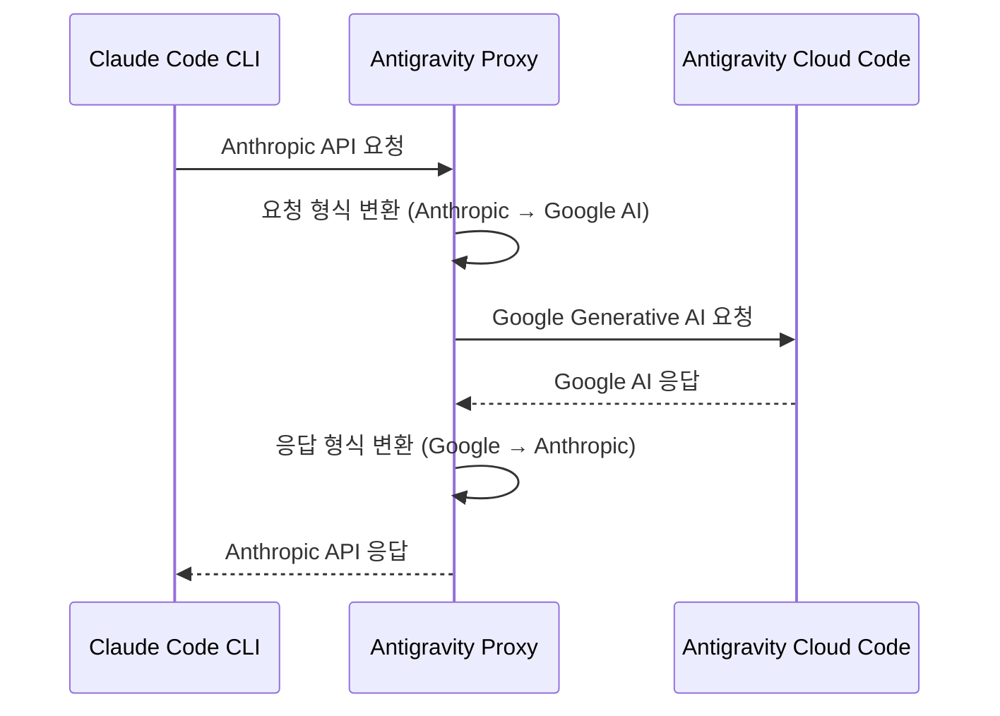

# 검토 결과: Antigravity Claude Proxy

**검토일**: 2026-01-25
**검토자**: Claude (Opus 4.5)
**레포지토리**: https://github.com/badrisnarayanan/antigravity-claude-proxy

---

## 1. 프로젝트 개요

| 항목 | 내용 |
|------|------|
| **프로젝트명** | Antigravity Claude Proxy |
| **목적** | Antigravity Cloud Code를 Claude Code CLI에서 사용 가능하게 하는 프록시 서버 |
| **핵심 기능** | Anthropic API 호환 프록시, 다중 계정 로드 밸런싱 |
| **라이선스** | MIT |
| **GitHub Stars** | 2.1k |
| **Forks** | 274 |
| **생성일** | 2025-12-19 |

### 1.1 작동 원리



---

## 2. 주요 기능

### 2.1 기능 목록

| 기능 | 설명 | 유용성 |
|------|------|:------:|
| **API 프록시** | Anthropic API를 Antigravity로 라우팅 | 높음 |
| **다중 계정 로드 밸런싱** | 여러 계정 간 자동 분산 | 높음 |
| **웹 대시보드** | 실시간 모니터링 UI | 높음 |
| **토큰 버킷 속도 제한** | 클라이언트 측 스로틀링 | 중간 |
| **프롬프트 캐싱** | 캐시 히트 최적화 | 중간 |
| **다국어 UI** | 영어/중국어 지원 | 낮음 |

### 2.2 로드 밸런싱 전략

| 전략 | 설명 | 사용 시기 |
|------|------|----------|
| **hybrid** (기본) | 스마트 선택 (속도 제한, 캐시 고려) | 일반 사용 |
| **sticky** | 동일 프롬프트 → 동일 계정 | 캐시 최적화 |
| **round-robin** | 순차 분산 | 균등 분배 |

---

## 3. 설치 및 설정

### 3.1 설치 방법

```bash
# npm (권장)
npx antigravity-claude-proxy@latest start

# 또는 전역 설치
npm install -g antigravity-claude-proxy@latest
antigravity-claude-proxy start
```

**요구사항**: Node.js 18+

### 3.2 계정 연결

**방법 1: 웹 대시보드 (권장)**
```
1. http://localhost:8080 접속
2. Accounts 탭 → Add Account
3. Google 계정으로 로그인
```

**방법 2: CLI**
```bash
antigravity-claude-proxy accounts add
# 또는 브라우저 없이
antigravity-claude-proxy accounts add --no-browser
```

**방법 3: 자동 감지**
- Antigravity 앱이 설치되어 있으면 자동으로 세션 감지

### 3.3 환경 변수 설정

**macOS/Linux:**
```bash
export ANTHROPIC_BASE_URL="http://localhost:8080"
export ANTHROPIC_AUTH_TOKEN="test"
```

**Windows PowerShell:**
```powershell
$env:ANTHROPIC_BASE_URL = "http://localhost:8080"
$env:ANTHROPIC_AUTH_TOKEN = "test"
```

### 3.4 Claude Code CLI 설정

`~/.claude/settings.json`:
```json
{
  "env": {
    "ANTHROPIC_BASE_URL": "http://localhost:8080",
    "ANTHROPIC_AUTH_TOKEN": "test",
    "ANTHROPIC_MODEL": "claude-opus-4-5-thinking",
    "ANTHROPIC_DEFAULT_HAIKU_MODEL": "gemini-2.5-flash-lite[1m]",
    "ENABLE_EXPERIMENTAL_MCP_CLI": "true"
  }
}
```

---

## 4. 사용 가능한 모델

| 모델 ID | 설명 | 특징 |
|---------|------|------|
| `claude-opus-4-5-thinking` | Claude Opus 4.5 | 사고 확장 모드 |
| `claude-sonnet-4-5-thinking` | Claude Sonnet 4.5 | 사고 확장 모드 |
| `gemini-3-pro-high` | Gemini 3 Pro | 고성능, 사고 지원 |
| `gemini-3-flash` | Gemini 3 Flash | 빠른 응답 |

---

## 5. 본 프로젝트 적용 검토

### 5.1 장점

| 장점 | 설명 | 영향 |
|------|------|------|
| **비용 절감** | Antigravity 무료 티어 활용 | 높음 |
| **모델 다양성** | Claude + Gemini 모델 선택 가능 | 중간 |
| **로드 밸런싱** | 다중 계정으로 속도 제한 우회 | 중간 |
| **쉬운 설정** | npm 한 줄로 설치 | 높음 |
| **모니터링** | 웹 대시보드로 사용량 확인 | 중간 |

### 5.2 위험 요소 (중요)

| 위험 | 심각도 | 설명 |
|------|:------:|------|
| **서비스 약관 위반 가능성** | 높음 | Google/Anthropic ToS 위반 가능 |
| **계정 정지/금지 위험** | 높음 | 과도한 사용 시 계정 제재 |
| **API 변경 시 기능 중단** | 중간 | Antigravity API 변경 시 프록시 중단 |
| **법적 책임** | 중간 | 사용자 본인에게 모든 책임 |
| **데이터 프라이버시** | 중간 | 제3자 서버 경유 |

### 5.3 본 프로젝트 적용 권장 여부

```
⚠️ 권장하지 않음 (프로덕션/기업 환경)

이유:
1. 서비스 약관 위반 위험
2. 기업 환경에서 계정 제재 시 업무 영향
3. 안정성 보장 불가 (비공식 프록시)
4. 데이터 보안 우려

대안:
- Anthropic API 직접 사용 (현재 방식 유지)
- Google AI Studio 직접 연동 (MCP 활용)
```

### 5.4 예외적 사용 가능 시나리오

| 시나리오 | 적합 여부 | 조건 |
|----------|:--------:|------|
| 개인 학습/실험 | ✅ 가능 | 개인 계정, 소량 사용 |
| 개인 프로젝트 | ⚠️ 주의 | 위험 인지 필수 |
| 기업/팀 프로젝트 | ❌ 비권장 | ToS 위반 위험 |
| 프로덕션 서비스 | ❌ 금지 | 안정성/법적 문제 |

---

## 6. 대안 검토

### 6.1 공식 방법 비교

| 방법 | 비용 | 안정성 | 권장 |
|------|------|--------|:----:|
| **Anthropic API 직접 사용** | 유료 ($3-15/M tokens) | 높음 | ✅ |
| **Claude Pro 구독** | $20/월 | 높음 | ✅ |
| **Google AI Studio** | 무료 티어 있음 | 높음 | ✅ |
| **Antigravity Proxy** | 무료 | 낮음 | ⚠️ |

### 6.2 본 프로젝트 권장 전략

```
현재 전략 유지:
1. Claude API: Anthropic 직접 연동 (설계/개발)
2. DeepSeek V3.2: 런타임 LLM (95% 비용 절감)
3. Stitch MCP: UI 디자인 생성 (공식 MCP)

Antigravity Proxy는 개인 실험 용도로만 고려
```

---

## 7. 기술적 인사이트

### 7.1 아키텍처 참고 가치

이 프로젝트의 아키텍처는 다음 용도로 참고할 수 있습니다:

| 인사이트 | 활용 가능성 |
|----------|------------|
| **API 프록시 패턴** | 내부 API Gateway 설계 시 참고 |
| **로드 밸런싱 전략** | 다중 LLM 백엔드 설계 시 참고 |
| **토큰 버킷 알고리즘** | Rate Limiting 구현 시 참고 |
| **실시간 모니터링 UI** | Admin 대시보드 설계 시 참고 |

### 7.2 코드 구조 (참고용)

```
antigravity-claude-proxy/
├── src/
│   ├── proxy/           # API 프록시 로직
│   ├── accounts/        # 계정 관리
│   ├── loadbalancer/    # 로드 밸런싱
│   └── dashboard/       # 웹 UI
├── public/              # 정적 자산
├── bin/                 # CLI 실행 파일
└── tests/               # 테스트 코드
```

---

## 8. 결론

### 8.1 평가 요약

| 평가 항목 | 점수 | 코멘트 |
|----------|:----:|--------|
| **기술적 완성도** | 9/10 | 잘 설계된 프록시 아키텍처 |
| **사용 편의성** | 9/10 | npm 한 줄 설치, 웹 UI |
| **문서화** | 8/10 | README 상세함 |
| **안정성** | 5/10 | 비공식 프록시, API 변경 위험 |
| **법적 안전성** | 3/10 | ToS 위반 가능성 |
| **본 프로젝트 적합성** | 3/10 | 기업 환경 비권장 |

### 8.2 종합 평가: **6.2/10**

**결론**: 기술적으로 우수한 프로젝트이나, **기업/팀 환경에서는 사용을 권장하지 않음**. 서비스 약관 위반 위험과 안정성 문제로 인해 공식 API 사용이 바람직합니다.

### 8.3 권장 액션

| 우선순위 | 액션 | 담당 |
|:--------:|------|------|
| 1 | 현재 Anthropic API 직접 연동 유지 | 전체 |
| 2 | 개인 실험 용도로만 검토 (선택) | 개인 |
| 3 | 아키텍처 패턴 참고 (프록시, 로드밸런싱) | TechLead |

---

## 9. 참고 자료

- **GitHub**: https://github.com/badrisnarayanan/antigravity-claude-proxy
- **Antigravity**: https://antigravity.dev/
- **Anthropic API**: https://docs.anthropic.com/
- **관련 문서**: [04.Tailwind_Antigravity_Stitch_도입_영향도_분석.md](./04.Tailwind_Antigravity_Stitch_도입_영향도_분석.md)

---

**검토 완료**: 2026-01-25
