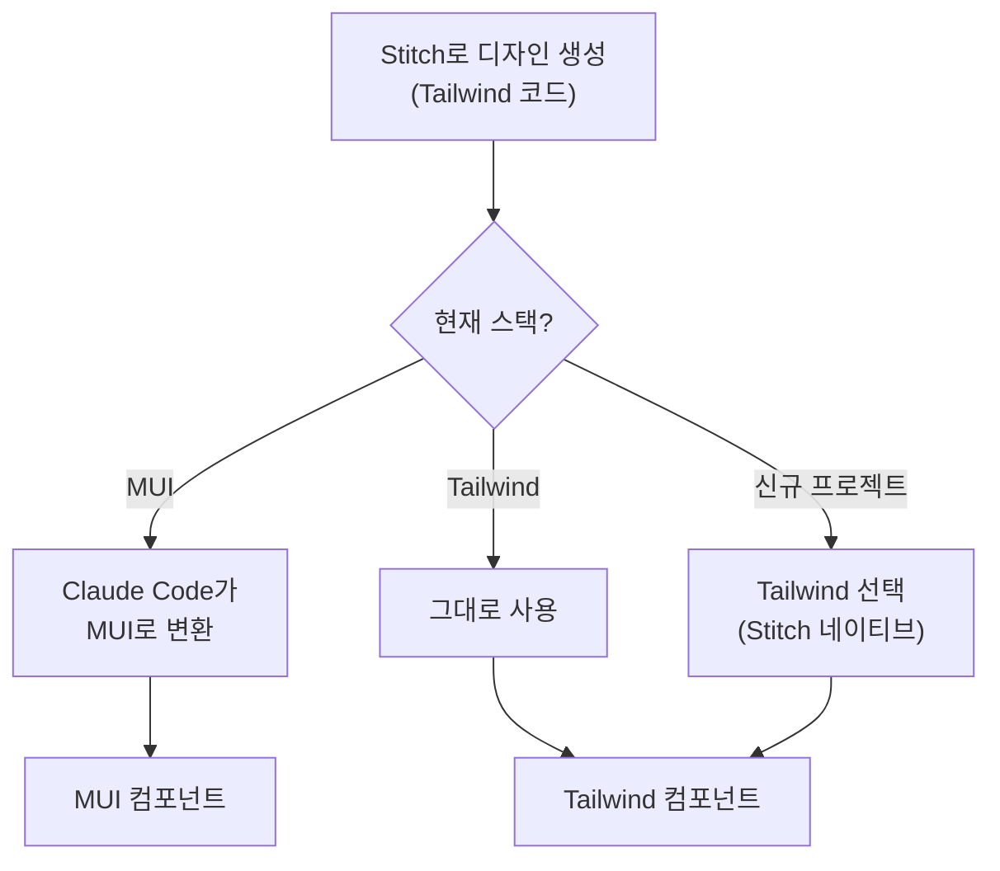

# MUI vs Tailwind CSS 비교 분석

**작성일**: 2026-01-25
**수정일**: 2026-01-25
**작성자**: Claude (Opus 4.5)
**목적**: 프론트엔드 스타일링 전략 선택을 위한 기술 비교

> ✅ **결정 사항 (2026-01-25)**: **옵션 B: Tailwind 도입** 선택
> - 상세 영향도 분석: [04.Tailwind_Antigravity_Stitch_도입_영향도_분석.md](./04.Tailwind_Antigravity_Stitch_도입_영향도_분석.md)

---

## 마이그레이션 진행 상황 (2026-01-25 업데이트)

### 완료된 작업

| 카테고리 | 파일/문서 | 상태 | 비고 |
|----------|----------|------|------|
| **마이그레이션 가이드** | [mui_to_tailwind_migration.md](../../../knowledge_service/docs/05_development/06_mui_to_tailwind_migration.md) | ✅ 완료 | 컴포넌트 매핑, Headless UI 활용 가이드 |
| **설계 문서** | frontend_detailed_design.md | ✅ 완료 | v2.0 Tailwind 버전 |
| **설계 문서** | ui_design_system_guide.md | ✅ 완료 | Heroicons, Tailwind 테마 |
| **설계 문서** | integrated_detailed_design.md | ✅ 완료 | Tech Stack 다이어그램 |
| **에이전트 설정** | frontend-developer.md | ✅ 완료 | Tech Stack 업데이트 |
| **에이전트 설정** | web-designer.md | ✅ 완료 | Design System 업데이트 |
| **백로그 스토리** | STORY-041-dashboard-ui.md | ✅ 완료 | Tailwind 코드 버전 추가 |
| **백로그 스토리** | STORY-042-search-ui.md | ✅ 완료 | Tailwind 코드 버전 추가 |
| **백로그 스토리** | STORY-043-sse-streaming.md | ✅ 완료 | Tailwind 코드 버전 추가 |
| **프로젝트 문서** | 01_프로젝트_수행_계획서.md | ✅ 완료 | Tech Stack 테이블 |
| **프로젝트 문서** | 03_도구_가이드.md | ✅ 완료 | Agent 역할 설명 |

### 생성된 핵심 문서

#### 1. MUI to Tailwind 마이그레이션 가이드
- **경로**: `knowledge_service/docs/05_development/06_mui_to_tailwind_migration.md`
- **내용**:
  - 컴포넌트 매핑 테이블 (레이아웃, 입력, 데이터 표시, 피드백, 네비게이션)
  - Headless UI 필수/권장 컴포넌트 가이드
  - 아이콘 매핑 (MUI Icons → Heroicons)
  - 스타일 매핑 (Spacing, Typography, Colors, Responsive)
  - 컴포넌트 변환 예시 (Button, Card, TextField, Dialog, Select)
  - Phase별 마이그레이션 체크리스트

#### 2. 백로그 스토리 Tailwind 코드 버전
- **STORY-041**: Dashboard Layout, StatCard, QuickSearch
- **STORY-042**: ChatSearch, MessageBubble, ChatInput, SourceCitation
- **STORY-043**: StreamingIndicator, ChatSearch 업데이트

### 다음 단계 (Phase 1)

| 작업 | 담당 | 상태 |
|------|------|------|
| Tailwind CSS 설치 및 설정 | Frontend | 대기 |
| tailwind.config.js 커스텀 테마 | Frontend | 대기 |
| Headless UI 설치 | Frontend | 대기 |
| Heroicons 설치 | Frontend | 대기 |
| PostCSS 설정 | Frontend | 대기 |

---

## 1. 핵심 차이점 요약

| 구분 | MUI (Material-UI) | Tailwind CSS |
|------|-------------------|--------------|
| **유형** | 컴포넌트 라이브러리 | 유틸리티 CSS 프레임워크 |
| **철학** | "완성된 컴포넌트 제공" | "스타일 유틸리티 제공" |
| **추상화 수준** | 높음 (High-level) | 낮음 (Low-level) |
| **디자인 시스템** | Material Design 기반 | 없음 (자유 설계) |
| **학습 곡선** | 중간 | 낮음~중간 |
| **커스터마이징** | 테마 오버라이드 | 클래스 조합 |
| **번들 크기** | 상대적으로 큼 | Tree-shaking으로 최소화 |

---

## 2. 개념적 차이

### 2.1 MUI: 컴포넌트 라이브러리

```
"레고 블록처럼 완성된 부품을 조립"
```

```tsx
// MUI 방식 - 완성된 컴포넌트 사용
import { Button, Card, CardContent, Typography } from '@mui/material';

const MyCard = () => (
  <Card sx={{ maxWidth: 345 }}>
    <CardContent>
      <Typography variant="h5">제목</Typography>
      <Typography variant="body2" color="text.secondary">
        내용입니다.
      </Typography>
      <Button variant="contained" color="primary">
        클릭
      </Button>
    </CardContent>
  </Card>
);
```

**특징**:
- `<Button>`, `<Card>`, `<Typography>` 등 **완성된 컴포넌트** 제공
- **Material Design** 가이드라인 기반 디자인
- 접근성(a11y), 키보드 네비게이션 **내장**
- CSS-in-JS (`sx` prop, `styled()`) 사용

### 2.2 Tailwind: 유틸리티 CSS 프레임워크

```
"붓과 물감처럼 직접 그림을 그림"
```

```tsx
// Tailwind 방식 - 유틸리티 클래스로 직접 스타일링
const MyCard = () => (
  <div className="max-w-sm rounded-lg shadow-md bg-white p-4">
    <h2 className="text-xl font-bold text-gray-900">제목</h2>
    <p className="text-sm text-gray-600 mt-2">
      내용입니다.
    </p>
    <button className="mt-4 px-4 py-2 bg-blue-600 text-white rounded hover:bg-blue-700">
      클릭
    </button>
  </div>
);
```

**특징**:
- **유틸리티 클래스**만 제공 (`bg-blue-600`, `p-4`, `rounded-lg`)
- 컴포넌트는 **직접 구현**해야 함
- 디자인 시스템 **자유롭게 설계**
- 순수 CSS (빌드 시 최적화)

---

## 3. 상세 비교

### 3.1 개발 방식 비교

| 항목 | MUI | Tailwind |
|------|-----|----------|
| **버튼 만들기** | `<Button variant="contained">` | `<button className="px-4 py-2 bg-blue-600...">` |
| **색상 변경** | `color="primary"` 또는 테마 수정 | `bg-red-500` 클래스 변경 |
| **반응형** | `sx={{ display: { xs: 'none', md: 'block' } }}` | `hidden md:block` |
| **호버 효과** | `sx={{ '&:hover': { ... } }}` | `hover:bg-blue-700` |
| **다크 모드** | `ThemeProvider` + 테마 전환 | `dark:bg-gray-800` |

### 3.2 코드 비교: 동일한 카드 컴포넌트

**MUI 버전** (약 15줄):
```tsx
import { Card, CardContent, CardActions, Typography, Button, Chip } from '@mui/material';

const SearchResultCard = ({ title, summary, type }) => (
  <Card sx={{ mb: 2, '&:hover': { boxShadow: 3 } }}>
    <CardContent>
      <Typography variant="h6" gutterBottom>{title}</Typography>
      <Typography variant="body2" color="text.secondary">{summary}</Typography>
    </CardContent>
    <CardActions>
      <Chip label={type} size="small" color="primary" />
      <Button size="small">자세히 보기</Button>
    </CardActions>
  </Card>
);
```

**Tailwind 버전** (약 15줄):
```tsx
const SearchResultCard = ({ title, summary, type }) => (
  <div className="bg-white rounded-lg shadow mb-4 hover:shadow-lg transition-shadow">
    <div className="p-4">
      <h3 className="text-lg font-semibold text-gray-900 mb-2">{title}</h3>
      <p className="text-sm text-gray-600">{summary}</p>
    </div>
    <div className="px-4 pb-4 flex items-center gap-2">
      <span className="px-2 py-1 bg-blue-100 text-blue-800 text-xs rounded">{type}</span>
      <button className="text-sm text-blue-600 hover:underline">자세히 보기</button>
    </div>
  </div>
);
```

### 3.3 장단점 비교

#### MUI 장점
| 장점 | 설명 |
|------|------|
| **빠른 개발** | 완성된 컴포넌트로 즉시 사용 |
| **일관된 디자인** | Material Design 자동 적용 |
| **접근성 내장** | ARIA, 키보드 네비게이션 기본 제공 |
| **복잡한 컴포넌트** | DataGrid, Autocomplete 등 고급 컴포넌트 |
| **타입 안전성** | TypeScript 완벽 지원 |

#### MUI 단점
| 단점 | 설명 |
|------|------|
| **번들 크기** | 상대적으로 큼 (트리쉐이킹 해도) |
| **커스터마이징 복잡** | Material Design 벗어나려면 오버라이드 필요 |
| **학습 곡선** | 테마, sx prop, styled API 등 학습 필요 |
| **디자인 제약** | "Material 느낌"에서 벗어나기 어려움 |

#### Tailwind 장점
| 장점 | 설명 |
|------|------|
| **완전한 자유도** | 어떤 디자인이든 구현 가능 |
| **작은 번들** | 사용한 클래스만 포함 (보통 10KB 미만) |
| **빠른 프로토타이핑** | HTML에서 바로 스타일링 |
| **일관된 스케일** | spacing, colors 등 일관된 척도 |
| **프레임워크 무관** | React, Vue, Svelte 등 어디서든 사용 |

#### Tailwind 단점
| 단점 | 설명 |
|------|------|
| **컴포넌트 직접 구현** | 버튼, 모달 등 직접 만들어야 함 |
| **접근성 직접 구현** | ARIA, 키보드 네비게이션 직접 추가 |
| **클래스 지옥** | 긴 className 문자열 |
| **디자인 시스템 필요** | 일관성 위해 별도 가이드 필요 |

---

## 4. 선택 가이드

### 4.1 MUI를 선택해야 할 때

```
✅ 빠른 MVP/프로토타입 개발이 필요할 때
✅ Material Design이 프로젝트에 적합할 때
✅ 복잡한 컴포넌트 (DataGrid, DatePicker 등) 필요할 때
✅ 접근성이 중요한 엔터프라이즈 앱
✅ 디자이너 없이 개발자만 있을 때
✅ React 전용 프로젝트
```

### 4.2 Tailwind를 선택해야 할 때

```
✅ 커스텀 디자인 시스템이 필요할 때
✅ 브랜드 아이덴티티가 강한 프로젝트
✅ 번들 사이즈가 중요할 때
✅ 다양한 프레임워크 (React, Vue, Svelte) 사용 시
✅ Stitch/Antigravity 등 AI 도구와 협업 시
✅ 디자이너와 협업하여 고유한 UI 만들 때
```

### 4.3 함께 사용할 수 있나?

**가능하지만 권장하지 않음**:

```tsx
// 혼용 예시 (비권장)
import { Button } from '@mui/material';

const Mixed = () => (
  <div className="p-4 bg-gray-100"> {/* Tailwind */}
    <Button variant="contained">MUI 버튼</Button> {/* MUI */}
  </div>
);
```

| 혼용 시 문제 | 설명 |
|-------------|------|
| **스타일 충돌** | MUI CSS-in-JS와 Tailwind CSS 우선순위 |
| **번들 증가** | 두 라이브러리 모두 포함 |
| **일관성 저하** | 디자인 언어 혼재 |
| **유지보수 어려움** | 두 시스템 모두 이해 필요 |

**권장**: 하나를 주력으로 선택하고 일관되게 사용

---

## 5. Stitch/Antigravity와의 호환성

### 5.1 Stitch MCP 출력 형식

Stitch MCP는 기본적으로 **Tailwind CSS** 코드를 생성합니다:

```tsx
// Stitch가 생성하는 코드 (Tailwind 기반)
<div className="flex flex-col gap-4 p-6 bg-white rounded-xl shadow-lg">
  <h2 className="text-2xl font-bold text-gray-900">제목</h2>
  <p className="text-gray-600">설명 텍스트</p>
  <button className="px-4 py-2 bg-indigo-600 text-white rounded-lg hover:bg-indigo-700">
    버튼
  </button>
</div>
```

### 5.2 MUI 프로젝트에서 Stitch 활용

| 시나리오 | 방법 | 복잡도 |
|----------|------|--------|
| **Stitch → MUI 변환** | Claude Code가 Tailwind 코드를 MUI로 변환 | 중간 |
| **디자인만 참고** | Stitch 디자인을 보고 MUI로 재구현 | 낮음 |
| **Tailwind로 전환** | 프로젝트를 Tailwind로 마이그레이션 | 높음 |

**Claude Code 변환 프롬프트**:
```
Stitch가 생성한 Tailwind 코드를 MUI 컴포넌트로 변환해줘:
- @mui/material 컴포넌트 사용
- sx prop으로 스타일링
- 동일한 시각적 결과 유지
```

### 5.3 권장 전략



---

## 6. 본 프로젝트 적용 권장사항

### 6.1 현재 상황

| 항목 | 현재 | 비고 |
|------|------|------|
| **스타일링** | React 18 + MUI | 이미 구축됨 |
| **컴포넌트** | MUI 기반 | 재사용 중 |
| **디자인 시스템** | Material Design | 일관성 확보 |

### 6.2 권장 전략

| 시나리오 | 권장 | 이유 |
|----------|------|------|
| **기존 기능 유지보수** | MUI 유지 | 재작성 비용 높음 |
| **신규 기능 (AI 협업)** | 선택적 | 아래 옵션 참고 |
| **전면 전환** | 비권장 | ROI 낮음 |

### 6.3 신규 기능 개발 시 옵션

**옵션 A: MUI 유지 (권장)**
```
Stitch 디자인 → Claude Code가 MUI 변환 → 프로젝트 통합
- 장점: 기존 코드와 일관성
- 단점: 변환 단계 추가
```

**옵션 B: Tailwind 도입 (신규 영역만)**
```
Stitch 디자인 → Tailwind 그대로 사용 → 신규 모듈에 적용
- 장점: Stitch 네이티브 활용
- 단점: 두 시스템 혼재
```

**옵션 C: Headless UI + Tailwind (하이브리드)**
```
MUI 유지 + 신규 컴포넌트는 Headless UI + Tailwind
- 장점: 점진적 전환 가능
- 단점: 복잡도 증가
```

### 6.4 최종 결정

```
✅ 결정 (2026-01-25): 옵션 B (Tailwind 도입 + Antigravity 협업 + Stitch MCP 연동)

결정 근거:
1. Stitch MCP와 Antigravity의 네이티브 Tailwind 지원
2. AI 협업 시 50-70% 개발 시간 단축 기대
3. 번들 크기 감소 및 빌드 성능 향상
4. 점진적 마이그레이션으로 리스크 관리 가능

마이그레이션 계획: 4 Phase, 8-11주 예상
- Phase 1: 환경 설정 (1주)
- Phase 2: 신규 컴포넌트 (2-3주)
- Phase 3: 기존 컴포넌트 전환 (4-6주)
- Phase 4: MUI 제거 (1주)
```

---

## 7. 결론

### 7.1 핵심 요약

| 질문 | 답변 |
|------|------|
| **MUI와 Tailwind는 완전히 다른가?** | ✅ 예, 근본적으로 다른 접근 방식 |
| **함께 쓸 수 있나?** | ⚠️ 가능하나 권장하지 않음 |
| **Stitch와 호환되는 것은?** | Tailwind (네이티브), MUI (변환 필요) |
| **본 프로젝트 최종 결정은?** | ✅ **Tailwind 전환** (2026-01-25 결정) |

### 7.2 비유로 이해하기

```
MUI = 이케아 가구
- 완성된 가구를 사서 조립
- 빠르고 일관됨
- 커스텀에 한계

Tailwind = 목공 도구 세트
- 원하는 가구를 직접 제작
- 시간이 걸리지만 자유로움
- 기술이 필요함
```

---

**작성 완료**: 2026-01-25
**관련 문서**: 03.Stitch_MCP_Antigravity_도입_영향도_분석.md
