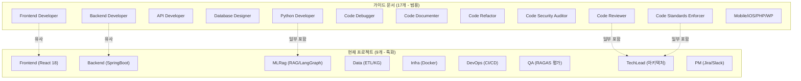
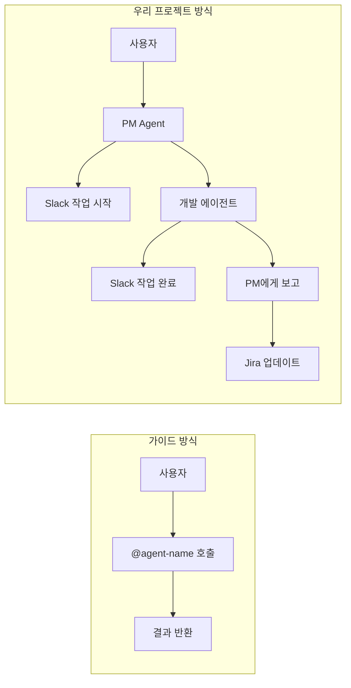

# Claude Code Subagent 실전 가이드 - 검토 결과

**문서 버전**: 1.0.0
**검토일**: 2026-01-24
**검토자**: Claude Code (클로드)
**원본 문서**: `01.Claude Code Subagent 실전 가이드.md`

---

## 1. 문서 개요

### 1.1 원본 문서 요약

Joe Njenga의 "17 Claude Code SubAgents Examples"를 기반으로 한 실전 활용 매뉴얼로, 17가지 전문 AI 개발팀 구축 방법을 제시합니다.

**제안된 17가지 Subagent:**

| 분류 | Subagent | 주요 역할 |
|------|----------|----------|
| **개발 전문** | Frontend Developer | React/Vue 프론트엔드 |
| | Backend Developer | 서버/API 개발 |
| | API Developer | RESTful/GraphQL API |
| | Mobile Developer | React Native/Flutter |
| | Python Developer | FastAPI/Django |
| | JavaScript Developer | ES2024+ |
| | TypeScript Developer | 타입 안전성 |
| | PHP Developer | Laravel/Symfony |
| | WordPress Developer | WP 테마/플러그인 |
| | iOS Developer | Swift/SwiftUI |
| **품질 관리** | Database Designer | DB 설계/최적화 |
| | Code Reviewer | 코드 리뷰 |
| | Code Debugger | 버그 진단 |
| | Code Documenter | 문서화 |
| | Code Refactor | 리팩토링 |
| | Code Security Auditor | 보안 감사 |
| | Code Standards Enforcer | 코딩 표준 |

---

## 2. 프로젝트 전체 영향도 분석

### 2.1 현재 프로젝트 에이전트 현황

우리 프로젝트는 이미 **12개의 프로젝트 특화 에이전트**를 운영 중입니다.

```
.claude/agents/
├── project-manager.md    # (pm) PM - Sprint/Jira/Slack 관리
├── tech-lead.md          # (tl) TechLead - 아키텍처/코드 리뷰
├── backend-developer.md  # (backend) Backend - SpringBoot 3.x 특화
├── frontend-developer.md # (frontend) Frontend - React 18 특화
├── rag-engineer.md       # (rag) RAG - RAG/LangGraph 특화
├── etl-engineer.md       # (etl) ETL - ETL 파이프라인/데이터 품질
├── database-designer.md  # (db) DB - 스키마 설계/쿼리 최적화
├── infra-engineer.md     # (infra) Infra - Docker Compose
├── devops-engineer.md    # (devops) DevOps - CI/CD/Observability
├── qa-engineer.md        # (qa) QA - 테스트/RAGAS 평가
├── code-documenter.md    # (doc) Documenter - API/코드 문서화
└── web-designer.md       # (web) WebDesigner - UI/UX 설계
```

### 2.2 핵심 비교 분석



### 2.3 항목별 상세 비교

| 가이드 Subagent | 현재 프로젝트 | 비교 결과 | 특이사항 |
|----------------|--------------|----------|----------|
| Frontend Developer | `frontend.md` | **중복** | 우리 것이 React 18 + Tailwind CSS + SSE 특화 |
| Backend Developer | `backend.md` | **중복** | 우리 것이 SpringBoot 3.x + WebFlux 특화 |
| API Developer | 부분적 (`backend.md`) | **Gap** | API Gateway 전문 에이전트 부재 |
| Mobile Developer | 없음 | **해당없음** | 웹 프로젝트, 모바일 불필요 |
| Python Developer | `mlrag.md` | **중복** | RAG/LangGraph/RAGAS 특화 |
| JavaScript Developer | `frontend.md` | **중복** | TypeScript 포함 |
| TypeScript Developer | `frontend.md` | **중복** | React 18 + TS 포함 |
| PHP/WordPress/iOS | 없음 | **해당없음** | 기술 스택 외 |
| Database Designer | `data.md` (일부) | **Gap** | PostgreSQL/Neo4j/ES 전문 에이전트 필요 |
| Code Reviewer | `techlead.md` (일부) | **Gap** | 독립적 리뷰어 에이전트 부재 |
| Code Debugger | 없음 | **Gap** | 체계적 디버깅 에이전트 부재 |
| Code Documenter | 없음 | **Gap** | 문서화 전문 에이전트 부재 |
| Code Refactor | 없음 | **Gap** | 리팩토링 전문 에이전트 부재 |
| Code Security Auditor | `qa.md` (일부) | **Gap** | 보안 전담 에이전트 부재 |
| Code Standards Enforcer | `techlead.md` (일부) | **Gap** | 표준 강제 전담 부재 |

### 2.4 영향도 평가 매트릭스

| 평가 항목 | 현재 상태 | 가이드 적용 시 | 영향도 |
|----------|----------|---------------|--------|
| **개발 에이전트 수** | 9개 (특화) | +5~7개 (범용) | 🟡 중간 |
| **역할 분리** | 통합형 | 세분화 | 🟢 긍정적 |
| **프로젝트 특화** | 높음 | 낮아짐 | 🔴 주의 |
| **Slack 연동** | 완전 통합 | 미지원 | 🔴 재작업 필요 |
| **PM 보고 체계** | 완전 통합 | 미지원 | 🔴 재작업 필요 |
| **MCP 통합** | Jira/GitHub | 미지원 | 🟡 확장 필요 |
| **품질 관리** | RAGAS 통합 | 범용 | 🟡 보완 필요 |

---

## 3. Gap 분석 및 도입 권장사항

### 3.1 도입 권장 (높음) ⭐⭐⭐

#### 3.1.1 Code Documenter
**권장 이유:**
- 현재 문서화 전담 에이전트 부재
- `/tools:doc-generate` 커맨드는 있으나 에이전트 레벨 지원 없음
- OpenAPI/Swagger 자동 생성 필요

**도입 방안:**
```markdown
---
name: documenter
description: 문서화 전문가 - API 문서, 코드 주석, 아키텍처 문서
model: claude-sonnet-4-1
---
# 프로젝트 특화 추가 필요
- Hybrid RAG 아키텍처 문서화
- RAGAS 평가 결과 문서화
- Slack 알림 연동
```

#### 3.1.2 Database Designer (Neo4j/ES 특화)
**권장 이유:**
- PostgreSQL (SSOT) + Neo4j (Graph) + Elasticsearch (Vector) 복합 환경
- 현재 `data.md`가 ETL 위주, DB 설계 전문성 부족

**도입 방안:**
```markdown
---
name: database-designer
description: DB 설계 전문가 - PostgreSQL/Neo4j/Elasticsearch 특화
model: claude-opus-4-5-20251101
---
# 프로젝트 특화 추가 필요
- Triple Store 최적화 (Neo4j)
- Vector Index 설계 (ES kNN)
- 데이터 마이그레이션 전략
```

### 3.2 도입 권장 (중간) ⭐⭐

#### 3.2.1 Code Debugger
**권장 이유:**
- 체계적 디버깅 방법론 필요
- RAG 파이프라인 디버깅 복잡

**도입 방안:**
- `/tools:debug-trace` 커맨드와 연계
- LangGraph 스테이트 추적 특화 추가

#### 3.2.2 Code Refactor
**권장 이유:**
- 기술 부채 관리 필요
- `/tools:tech-debt` 커맨드와 연계 가능

**도입 방안:**
- `/tools:refactor-clean` 커맨드와 연계
- Python/TypeScript 리팩토링 특화

### 3.3 도입 권장 (낮음) ⭐

#### 3.3.1 Code Security Auditor
**현황:**
- `qa.md`에 보안 테스트 일부 포함
- `/tools:security-scan` 커맨드 존재

**권장:**
- 독립 에이전트 대신 `/tools:security-scan` 강화
- OWASP Top 10 체크리스트 확장

#### 3.3.2 Code Standards Enforcer
**현황:**
- `techlead.md`에 표준 검토 포함
- ESLint/Black/isort 자동화 적용 중

**권장:**
- 독립 에이전트 대신 TechLead 역할 확장
- pre-commit hooks 강화

### 3.4 도입 비권장 ❌

| Subagent | 비권장 이유 |
|----------|------------|
| Mobile Developer | 웹 기반 프로젝트, 모바일 불필요 |
| iOS Developer | 웹 기반 프로젝트 |
| PHP Developer | 기술 스택 외 (Python/Java/TypeScript) |
| WordPress Developer | 기술 스택 외 |
| API Developer (범용) | `backend.md`가 Spring Cloud Gateway 특화로 커버 |

---

## 4. 현재 에이전트 vs 가이드 에이전트 차이점

### 4.1 아키텍처 차이



### 4.2 핵심 차이점 상세

| 항목 | 가이드 Subagent | 우리 프로젝트 에이전트 |
|------|----------------|---------------------|
| **호출 방식** | `@agent-name "작업"` | Task 도구 + PM 조율 |
| **협업 구조** | 독립적 실행 | PM 중심 협업 체계 |
| **알림** | 없음 | Slack 필수 알림 |
| **보고** | 결과만 반환 | PM에게 보고 → Jira 업데이트 |
| **기술 스택** | 범용 | 프로젝트 특화 (SpringBoot/React/LangGraph) |
| **품질 지표** | Lighthouse 등 범용 | RAGAS (Faithfulness/Relevancy) |
| **스탠드업** | 없음 | 인사말 + 상태 공유 |

### 4.3 우리 프로젝트만의 강점

1. **PM 보고 체계**
   ```
   PM 작업 할당 → 에이전트 개발 → Slack 알림 → PM 보고 → Jira 업데이트
   ```

2. **Slack 연동 필수화**
   ```bash
   ./scripts/send_slack.sh proj-hrkp-dev Backend "작업 시작: SCRUM-XX"
   ```

3. **RAGAS 품질 통합**
   ```python
   assert scores["faithfulness"] >= 0.9
   assert scores["answer_relevancy"] >= 0.85
   ```

4. **MCP 서버 통합**
   - Jira MCP: 이슈 관리 자동화
   - GitHub MCP: PR/이슈 연동

---

## 5. 도입 로드맵 제안

### Phase 1: 즉시 적용 (1주)

| 작업 | 설명 | 우선순위 |
|------|------|----------|
| `documenter.md` 추가 | 문서화 전문 에이전트 | 🔴 높음 |
| 기존 에이전트 개선 | 가이드의 좋은 패턴 반영 | 🟡 중간 |

**documenter.md 초안:**
```markdown
---
name: documenter
description: Code Documenter - API/코드/아키텍처 문서화 전문가
permissionMode: bypassPermissions
model: claude-sonnet-4-1
---

# Documenter Agent - Code Documenter

## 🚨 필수 규칙
> Slack 알림 + PM 보고 체계 준수 (기존 패턴 동일)

## Role
OpenAPI 문서, 코드 주석, 아키텍처 다이어그램 생성을 담당합니다.

## Tech Stack
- **API 문서**: OpenAPI 3.0, Swagger UI, Redoc
- **코드 문서**: Sphinx (Python), TypeDoc (TS)
- **다이어그램**: Mermaid, PlantUML

## Work Directory
- `knowledge_service/docs/` - 기술 문서
- `knowledge_service/src/app/` - Python 소스
```

### Phase 2: 단계적 도입 (2-3주)

| 작업 | 설명 | 우선순위 |
|------|------|----------|
| `database-designer.md` 추가 | Neo4j/ES 특화 DB 설계 | 🟡 중간 |
| `debugger.md` 추가 | 디버깅 전문 에이전트 | 🟡 중간 |

### Phase 3: 최적화 (4주+)

| 작업 | 설명 |
|------|------|
| TechLead 역할 확장 | Standards Enforcer 역할 통합 |
| QA 역할 확장 | Security Auditor 역할 강화 |
| 워크플로우 자동화 | GitHub Actions 연동 |

---

## 6. 가이드 문서에서 채택할 패턴

### 6.1 채택 권장 패턴

#### 1) 모델 선택 전략
```markdown
| 작업 유형 | 권장 모델 | 이유 |
|-----------|-----------|------|
| 코드 리뷰 | Sonnet | 균형잡힌 성능/속도 |
| 보안 감사 | Opus | 정밀한 분석 필요 |
| 문서 작성 | Sonnet | 품질과 속도 균형 |
```
→ 우리 프로젝트에 적용 가능

#### 2) 병렬 처리 패턴
```bash
"다음 작업을 동시에 수행하세요:
1. @code-reviewer: 보안 검토
2. @code-documenter: API 문서 생성"
```
→ Task 도구의 병렬 실행과 연계

#### 3) 역할별 조합 패턴
```
Frontend 팀: frontend + typescript + documenter
Backend 팀: backend + api + database-designer
QA 팀: qa + debugger + security-auditor
```
→ 우리 에이전트 그룹핑에 참고

### 6.2 채택 불가 패턴

| 패턴 | 불가 이유 | 대안 |
|------|----------|------|
| `@agent-name` 직접 호출 | PM 체계와 충돌 | Task 도구 사용 |
| settings.json 권한 설정 | MCP 설정과 충돌 | 에이전트 내 정의 |
| 범용 description | 프로젝트 특화 필요 | 한글 + Slack 포함 |

---

## 7. 종합 평가

### 7.1 문서 품질 평가

| 평가 항목 | 점수 | 코멘트 |
|----------|------|--------|
| **완성도** | ⭐⭐⭐⭐⭐ | 17개 템플릿 완비, 상세한 가이드 |
| **실용성** | ⭐⭐⭐⭐ | 즉시 사용 가능한 템플릿 |
| **우리 프로젝트 적합성** | ⭐⭐⭐ | 커스터마이징 필요 |
| **한글화** | ⭐⭐⭐⭐ | 잘 번역됨, 일부 영문 혼용 |

### 7.2 최종 권장사항

#### 즉시 채택 ✅
1. **Code Documenter 패턴** → `documenter.md` 신규 생성
2. **모델 선택 전략** → 기존 에이전트에 적용
3. **병렬 처리 개념** → Task 도구 활용 강화

#### 선별 채택 🟡
1. **Database Designer** → 프로젝트 특화 버전 생성
2. **Code Debugger** → RAG 디버깅 특화 버전 생성
3. **Code Refactor** → `/tools:refactor-clean` 연계

#### 채택 불가 ❌
1. 범용 Frontend/Backend → 이미 특화 버전 존재
2. Mobile/iOS/PHP/WordPress → 기술 스택 외
3. `@agent-name` 호출 방식 → PM 체계와 충돌

---

## 8. 결론

### 8.1 핵심 요약

우리 프로젝트는 **이미 잘 구조화된 9개의 프로젝트 특화 에이전트**를 보유하고 있습니다. 가이드 문서의 17개 Subagent는 범용성이 높지만, 우리 프로젝트의 **PM 중심 협업 체계**, **Slack 필수 알림**, **RAGAS 품질 관리** 등의 특화 기능이 없습니다.

따라서 **전면 도입보다는 선별적 채택**이 권장됩니다.

### 8.2 액션 아이템

| 우선순위 | 액션 | 담당 | 기한 |
|---------|------|------|------|
| 🔴 높음 | `documenter.md` 신규 생성 | TechLead | 1주 |
| 🟡 중간 | 모델 선택 전략 적용 | TechLead | 1주 |
| 🟡 중간 | `database-designer.md` 검토 | Data | 2주 |
| 🟢 낮음 | 기존 에이전트 패턴 개선 | 각 담당 | 3주 |

---

**작성일**: 2026-01-24
**다음 검토일**: 2026-02-07 (2주 후)
**관련 문서**:
- [원본 가이드](./01.Claude%20Code%20Subagent%20실전%20가이드.md)
- [개발자 에이전트 가이드](/knowledge_service/docs/05_development/01_developer_agent_guide.md)
- [Claude Commands README](/.claude/commands/README.md)
