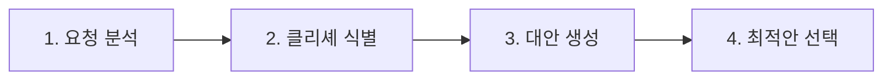
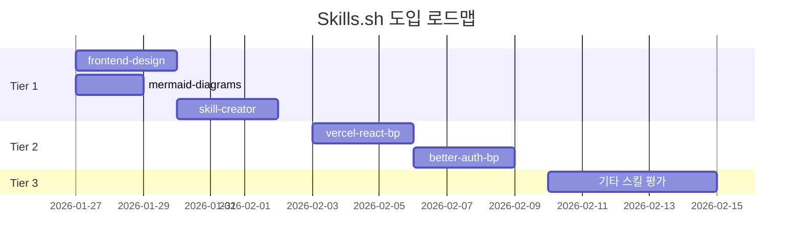

# Agent Skills 종합 검토 결과

**문서 버전**: 1.0
**작성일**: 2026-01-24
**작성자**: Claude Code (클로드)
**검토 대상**: 02.Agent Skills 완전 가이드, 03.Web Design System Agent Skill 완전 가이드, Skills.sh 생태계

---

## 1. 검토 개요

### 1.1 검토 목적
- Agent Skills 생태계 이해 및 프로젝트 적용 가능성 평가
- Skills.sh 마켓플레이스의 유용한 스킬 도입 검토
- 기존 등록 스킬 인벤토리 파악
- 에이전트-스킬 바인딩 가능 여부 분석

### 1.2 검토 범위

| 항목 | 내용 |
|------|------|
| 문서 02 | Agent Skills 완전 가이드 (claude-skills-user-manual.md) |
| 문서 03 | Web Design System Agent Skill 완전 가이드 |
| Skills.sh | 외부 스킬 마켓플레이스 분석 |
| 기존 스킬 | 프로젝트 `.claude/skills/` 디렉토리 |

---

## 2. 문서 02 검토: Agent Skills 완전 가이드

### 2.1 핵심 내용 요약

#### 플랫폼 지원
| 플랫폼 | 지원 여부 | 비고 |
|--------|----------|------|
| Claude.ai (웹) | ✅ | 전체 기능 지원 |
| Claude Desktop | ✅ | 전체 기능 지원 |
| Claude Mobile | ✅ | 전체 기능 지원 |
| Claude Code (CLI) | ⚠️ | SKILL.md 기반 커스텀 스킬만 |

#### 요금제 요구사항
- **필수**: Pro / Max / Team / Enterprise 플랜
- Free 플랜에서는 Skills 기능 사용 불가

#### 내장 스킬 목록 (13+)

| 스킬 | 기능 | 프로젝트 활용도 |
|------|------|----------------|
| `pptx` | PowerPoint 생성 | ⭐⭐⭐ (보고서/발표) |
| `docx` | Word 문서 생성 | ⭐⭐⭐ (문서화) |
| `xlsx` | Excel 스프레드시트 | ⭐⭐ (데이터 분석) |
| `pdf` | PDF 문서 생성 | ⭐⭐ (최종 산출물) |
| `theme-factory` | 테마 생성기 | ⭐⭐ (UI 디자인) |
| `brand-guidelines` | 브랜드 가이드라인 | ⭐ (부수적) |
| `canvas-design` | 캔버스 디자인 | ⭐ (UI 프로토타입) |
| `artifacts-builder` | Artifacts 생성 | ⭐⭐⭐ (프로토타입) |
| `mcp-builder` | MCP 서버 구축 | ⭐⭐⭐⭐ (핵심 인프라) |
| `algorithmic-art` | 알고리즘 아트 | ⭐ (부수적) |
| `internal-comms` | 내부 커뮤니케이션 | ⭐⭐ (팀 협업) |
| `slack-gif-creator` | Slack GIF 생성 | ⭐ (부수적) |
| `skill-creator` | 스킬 생성기 | ⭐⭐⭐⭐ (확장성) |

### 2.2 프로젝트 영향도 분석

#### 높은 영향도 스킬
1. **mcp-builder**: 프로젝트의 MCP 서버 확장에 직접 활용 가능
2. **skill-creator**: 프로젝트 맞춤 스킬 개발에 필수
3. **artifacts-builder**: RAG 결과 시각화 프로토타입에 유용

#### 중간 영향도 스킬
- `pptx`, `docx`: 스프린트 회고, 기술 문서 자동 생성
- `theme-factory`: 프론트엔드 UI 테마 시스템 참고

### 2.3 권장 사항

```
✅ 도입 권장: mcp-builder, skill-creator, artifacts-builder
⚠️ 선택적 도입: pptx, docx (문서 자동화 필요시)
❌ 불필요: slack-gif-creator, algorithmic-art
```

---

## 3. 문서 03 검토: Web Design System Agent Skill 완전 가이드

### 3.1 핵심 개념: Verbalized Sampling

#### 정의
> "클리셰를 먼저 식별하고, 그것을 피하는 방식으로 독창적인 디자인을 도출"

#### 4단계 워크플로우



| 단계 | 설명 | 출력물 |
|------|------|--------|
| 1. 요청 분석 | 사용자 요구사항 파악 | 핵심 키워드 추출 |
| 2. 클리셰 식별 | 업계 표준/뻔한 패턴 목록화 | Anti-pattern 리스트 |
| 3. 대안 생성 | 클리셰 회피 옵션 3-5개 제시 | 창의적 대안 목록 |
| 4. 최적안 선택 | 사용자와 협의하여 최종 결정 | 선택된 디자인 방향 |

### 3.2 Anti-Pattern 라이브러리

#### 색상 Anti-Pattern
| 패턴 | 회피 이유 | 대안 |
|------|----------|------|
| `#007bff` (Bootstrap Blue) | 과도한 사용으로 차별화 실패 | 커스텀 브랜드 컬러 |
| 순수 검정 `#000000` | 과도한 대비로 눈 피로 | `#1a1a1a` ~ `#2d2d2d` |
| 무지개 그라데이션 | 시각적 혼란 | 2-3색 조화 팔레트 |

#### 레이아웃 Anti-Pattern
| 패턴 | 문제점 | 대안 |
|------|--------|------|
| 중앙 정렬 Hero | 천편일률적 | 비대칭 레이아웃, Split Screen |
| 3-Column Grid | 지루함 | Masonry, Bento Grid |
| Carousel 슬라이더 | 낮은 참여율 | 스크롤 기반 인터랙션 |

#### 타이포그래피 Anti-Pattern
| 패턴 | 문제점 | 대안 |
|------|--------|------|
| Arial/Helvetica 단독 | 개성 부재 | Variable Font 활용 |
| 16px 고정 본문 | 가독성 제한 | Fluid Typography (clamp) |
| 균일한 자간 | 한글 가독성 저하 | word-break: keep-all |

### 3.3 한국어 타이포그래피 최적화

#### 권장 설정
```css
/* 한글 최적화 타이포그래피 */
body {
  font-family: 'Pretendard', -apple-system, BlinkMacSystemFont, sans-serif;
  line-height: 1.6 ~ 1.8;
  word-break: keep-all;
  letter-spacing: -0.02em;
}

/* 제목 최적화 */
h1, h2, h3 {
  font-weight: 700;
  letter-spacing: -0.03em;
  word-break: keep-all;
}
```

#### 접근성 기준 (WCAG 2.1 AA)
| 항목 | 요구사항 | 검증 방법 |
|------|----------|----------|
| 색상 대비 | 일반 텍스트 4.5:1 이상 | Contrast Checker |
| 대형 텍스트 | 24px+ 또는 Bold 18.5px+ | 3:1 이상 |
| 포커스 표시 | 키보드 네비게이션 가시성 | 수동 테스트 |
| 터치 타겟 | 최소 44x44px | 디자인 검증 |

### 3.4 Core Web Vitals 최적화

| 지표 | 기준값 | 최적화 전략 |
|------|--------|------------|
| LCP (Largest Contentful Paint) | < 2.5s | 이미지 최적화, 폰트 프리로드 |
| INP (Interaction to Next Paint) | < 200ms | JavaScript 최적화, 디바운싱 |
| CLS (Cumulative Layout Shift) | < 0.1 | 이미지 크기 명시, 폰트 swap |

### 3.5 프로젝트 적용 가치

| 적용 영역 | 기대 효과 | 우선순위 |
|----------|----------|----------|
| Frontend Agent 가이드라인 | UI 품질 표준화 | 🔴 높음 |
| 검색 결과 UI | 사용자 경험 개선 | 🔴 높음 |
| 관리자 대시보드 | 일관된 디자인 시스템 | 🟡 중간 |
| 문서 포털 | 가독성 향상 | 🟡 중간 |

---

## 4. Skills.sh 마켓플레이스 분석

### 4.1 인기 스킬 현황 (2026년 1월 기준)

| 순위 | 스킬명 | 설치 수 | 제작자 | 프로젝트 적합도 |
|------|--------|--------|--------|----------------|
| 1 | vercel-react-best-practices | 39.6K | Community | ⭐⭐⭐⭐ |
| 2 | web-design-guidelines | 30.1K | Community | ⭐⭐⭐ |
| 3 | frontend-design | 8.6K | **Anthropic** | ⭐⭐⭐⭐⭐ |
| 4 | skill-creator | 4.3K | **Anthropic** | ⭐⭐⭐⭐⭐ |
| 5 | better-auth-best-practices | 2.6K | Community | ⭐⭐⭐ |
| 6 | supabase-postgres-best-practices | 2.2K | Community | ⭐⭐⭐ |
| 7 | mermaid-diagrams | 803 | Community | ⭐⭐⭐⭐ |
| 8 | crafting-effective-readmes | 793 | Community | ⭐⭐⭐ |

### 4.2 프로젝트 도입 권장 스킬

#### Tier 1: 즉시 도입 권장

| 스킬 | 이유 | 적용 에이전트 |
|------|------|--------------|
| **frontend-design** (Anthropic) | 공식 스킬, React 18 프로젝트와 호환 | Frontend Agent |
| **mermaid-diagrams** | CLAUDE.md에 Mermaid 사용 명시됨 | 전체 에이전트 |
| **skill-creator** (Anthropic) | 프로젝트 맞춤 스킬 개발 필요 | Tech Lead |

#### Tier 2: 검토 후 도입

| 스킬 | 이유 | 검토 필요 사항 |
|------|------|---------------|
| **vercel-react-best-practices** | React 프로젝트에 유용 | Vercel 배포 여부 확인 |
| **supabase-postgres-best-practices** | PostgreSQL SSOT와 호환 | Supabase 사용 계획 확인 |
| **better-auth-best-practices** | 인증 구현 시 참고 | 인증 방식 결정 후 도입 |

#### Tier 3: 선택적 도입

| 스킬 | 용도 | 비고 |
|------|------|------|
| **web-design-guidelines** | 일반 웹 디자인 가이드 | 기존 web-design-system과 중복 가능 |
| **crafting-effective-readmes** | README 품질 향상 | 문서화 중점 시 |

### 4.3 도입 로드맵



---

## 5. 기존 등록 스킬 인벤토리

### 5.1 스킬 목록

프로젝트의 `.claude/skills/` 디렉토리에 등록된 스킬:

| 스킬 경로 | 버전 | 최종 수정일 | 상태 |
|----------|------|------------|------|
| `.claude/skills/presentation-maker/` | 1.0 | 2026-01-15 | ✅ 활성 |
| `.claude/skills/web-design-system/` | 2.0 | 2026-01-15 | ✅ 활성 |

### 5.2 Presentation Maker 스킬 상세

#### 기능 개요
- **목적**: PowerPoint/Marp 기반 프레젠테이션 자동 생성
- **라이브러리**: `python-pptx`
- **특징**: 도형 기반 다이어그램 (이미지 URL 미사용)

#### 10가지 사전 정의 테마

| 테마 ID | 테마명 | 키워드 |
|---------|--------|--------|
| `ocean_depths` | Ocean Depths | 기업, enterprise, 비즈니스 |
| `tech_innovation` | Tech Innovation | ai, 인공지능, ml, 머신러닝 |
| `modern_minimalist` | Modern Minimalist | 미니멀, 심플, 모던 |
| `nature_harmony` | Nature Harmony | 환경, 친환경, 자연 |
| `bold_impact` | Bold Impact | 마케팅, 세일즈, 프로모션 |
| `elegant_luxury` | Elegant Luxury | 럭셔리, 프리미엄, VIP |
| `creative_spark` | Creative Spark | 창의, 아이디어, 브레인스토밍 |
| `data_driven` | Data Driven | 데이터, 분석, 통계 |
| `warm_earth` | Warm Earth | 커뮤니티, 소셜, 네트워크 |
| `professional_edge` | Professional Edge | 컨설팅, 전략, 기획 |

#### 자동 테마 선택 로직
```python
def auto_select_theme(content_text, title=""):
    """콘텐츠 키워드 기반 테마 자동 선택"""
    combined_text = f"{title} {content_text}".lower()
    theme_keywords = {
        'tech_innovation': ['ai', '인공지능', 'ml', '머신러닝', 'rag', 'llm'],
        'ocean_depths': ['기업', 'enterprise', '비즈니스', 'b2b'],
        'data_driven': ['데이터', 'data', '분석', 'analytics', '통계'],
        # ... 기타 테마
    }
    # 키워드 매칭 로직
```

### 5.3 Web Design System 스킬 상세

#### 기능 개요
- **목적**: Verbalized Sampling 기반 웹 디자인 시스템
- **버전**: 2.0
- **특징**: Anti-pattern 라이브러리, 한글 최적화

#### 주요 섹션
1. **Verbalized Sampling Workflow** - 4단계 디자인 프로세스
2. **Anti-Pattern Libraries** - 색상/레이아웃/타이포그래피
3. **Korean Typography Optimization** - Pretendard 폰트, 한글 최적화
4. **Dark Mode Design System** - 다크 모드 색상 팔레트
5. **Motion Design Principles** - 애니메이션 가이드
6. **Core Web Vitals Optimization** - LCP/INP/CLS 최적화
7. **Browser Compatibility Guide** - 크로스 브라우저 지원

---

## 6. 에이전트-스킬 바인딩 분석

### 6.1 기술적 가능 여부

#### Claude Code의 스킬 활성화 메커니즘

```
스킬 활성화 방식:
1. 자동 활성화: 요청 내용 기반 자동 감지
2. 수동 호출: /skill-name 형태로 명시적 호출
3. SKILL.md: 프로젝트 레벨 스킬 정의
```

#### 에이전트별 스킬 바인딩 방법

| 방법 | 지원 여부 | 설명 |
|------|----------|------|
| 직접 바인딩 | ❌ 미지원 | 에이전트 정의에 스킬 직접 연결 불가 |
| 프롬프트 인젝션 | ✅ 지원 | 에이전트 프롬프트에 스킬 사용 지침 포함 |
| 스킬 조건부 활성화 | ⚠️ 제한적 | SKILL.md의 trigger 조건 활용 |

### 6.2 권장 접근법: 프롬프트 기반 바인딩

#### 구현 방식

```yaml
# .claude/agents/frontend-developer.md (예시)
---
name: frontend-developer
description: (frontend) Frontend Developer - React 18 기반 UI 개발
skills_guidance: |
  다음 스킬을 우선적으로 활용하세요:
  - web-design-system: UI 컴포넌트 설계 시
  - frontend-design: React 컴포넌트 구조 설계 시
  - mermaid-diagrams: 컴포넌트 관계 다이어그램
---
```

#### 에이전트별 권장 스킬 매핑

| 에이전트 | 약어 | 권장 스킬 | 용도 |
|----------|:----:|----------|------|
| **frontend-developer** | frontend | web-design-system, frontend-design | UI/UX 설계 |
| **backend-developer** | backend | better-auth-best-practices, supabase-postgres | API/인증 설계 |
| **tech-lead** | tl | skill-creator, mermaid-diagrams | 아키텍처 설계 |
| **project-manager** | pm | mermaid-diagrams, presentation-maker | 문서/발표 자료 |
| **rag-engineer** | rag | data_driven 테마, mermaid-diagrams | 파이프라인 시각화 |
| **qa-engineer** | qa | mermaid-diagrams | 테스트 플로우 |
| **devops-engineer** | devops | mermaid-diagrams | 인프라 다이어그램 |
| **etl-engineer** | etl | supabase-postgres-best-practices | 데이터 파이프라인 |
| **database-designer** | db | supabase-postgres-best-practices | 스키마 설계 |
| **infra-engineer** | infra | mermaid-diagrams | 시스템 아키텍처 |
| **code-documenter** | doc | mermaid-diagrams, presentation-maker | API 문서화 |
| **web-designer** | web | web-design-system, frontend-design | UI/UX 디자인 |

### 6.3 스킬 바인딩 구현 계획

#### Phase 1: 프롬프트 기반 가이드라인 추가

```bash
# 에이전트 정의 파일에 스킬 가이드라인 섹션 추가
.claude/agents/
├── frontend-developer.md   # + skills_guidance 섹션
├── backend-developer.md    # + skills_guidance 섹션
├── project-manager.md      # + skills_guidance 섹션
├── rag-engineer.md         # + skills_guidance 섹션
├── etl-engineer.md         # + skills_guidance 섹션
├── database-designer.md    # + skills_guidance 섹션
└── ...
```

#### Phase 2: SKILL.md 트리거 최적화

```yaml
# .claude/skills/web-design-system/SKILL.md
trigger:
  keywords:
    - "UI 설계"
    - "컴포넌트 디자인"
    - "웹 디자인"
  agents:  # 권장 에이전트 힌트 (비공식)
    - frontend
    - pm
```

#### Phase 3: 통합 스킬 로더 (향후)

```python
# 향후 구현 가능한 스킬 로더 개념
class SkillLoader:
    def __init__(self, agent_type: str):
        self.agent_type = agent_type
        self.skill_mapping = self._load_skill_mapping()

    def get_recommended_skills(self) -> list[str]:
        """에이전트 타입에 맞는 스킬 목록 반환"""
        return self.skill_mapping.get(self.agent_type, [])
```

---

## 7. 종합 권장 사항

### 7.1 즉시 실행 항목

| 우선순위 | 항목 | 담당 | 기한 |
|----------|------|------|------|
| 🔴 P0 | mermaid-diagrams 스킬 설치 | DevOps | 1일 |
| 🔴 P0 | frontend-design 스킬 설치 | Frontend | 1일 |
| 🟡 P1 | 에이전트 프롬프트에 스킬 가이드라인 추가 | Tech Lead | 3일 |
| 🟡 P1 | skill-creator로 프로젝트 맞춤 스킬 개발 계획 | PM | 5일 |

### 7.2 중기 계획 (Sprint 2)

| 항목 | 설명 |
|------|------|
| 스킬 인벤토리 관리 체계 | `.claude/skills/README.md` 작성 |
| 스킬 사용 가이드라인 | 개발자 가이드에 스킬 활용법 추가 |
| 커스텀 스킬 개발 | RAG 파이프라인 시각화 스킬 |

### 7.3 장기 계획 (Q2 2026)

| 항목 | 설명 |
|------|------|
| 자동 스킬 추천 시스템 | 작업 컨텍스트 기반 스킬 자동 제안 |
| 스킬 성과 측정 | 스킬 사용 빈도 및 효과 분석 |
| 팀 공유 스킬 라이브러리 | 프로젝트 맞춤 스킬 공유 체계 |

---

## 8. 결론

### 8.1 핵심 발견 사항

1. **Skills 생태계 성숙도**: Claude의 Skills 시스템은 충분히 성숙하여 프로젝트에 즉시 활용 가능
2. **기존 스킬 활용도**: `presentation-maker`, `web-design-system` 스킬이 이미 고품질로 구현됨
3. **Skills.sh 가치**: Anthropic 공식 스킬(frontend-design, skill-creator)이 특히 유용
4. **에이전트-스킬 바인딩**: 직접 바인딩은 불가능하나, 프롬프트 기반 가이드라인으로 대체 가능

### 8.2 최종 권장 사항

```
✅ 즉시 도입: frontend-design, mermaid-diagrams, skill-creator
✅ 기존 활용 강화: presentation-maker, web-design-system
⚠️ 검토 필요: vercel-react-best-practices (배포 전략 확정 후)
📋 개발 필요: RAG 파이프라인 시각화 커스텀 스킬
```

---

## 부록 A: Skills.sh 설치 명령어

> **Skills.sh 최신 정보** (2026-01-24 확인)
> - 총 스킬 수: 12,541개
> - Top Skills: vercel-react-best-practices (39.6K), web-design-guidelines (30.1K)
> - 지원 Agent: 18+ (Claude Code, Cursor, GitHub Copilot 등)

```bash
# Anthropic 공식 스킬
npx skills add anthropic/frontend-design
npx skills add anthropic/skill-creator

# 커뮤니티 스킬 (인기순)
npx skills add vercel-labs/vercel-react-best-practices
npx skills add supabase/supabase-postgres-best-practices
npx skills add community/mermaid-diagrams

# 스킬 검색 (Skills.sh 웹사이트)
# https://skills.sh 에서 검색 후 설치 명령어 확인
```

## 부록 B: 스킬 활성화 확인

```bash
# 설치된 스킬 목록 확인
ls -la .claude/skills/

# 스킬 상세 확인
cat .claude/skills/{skill-name}/SKILL.md
```

---

**문서 끝**
