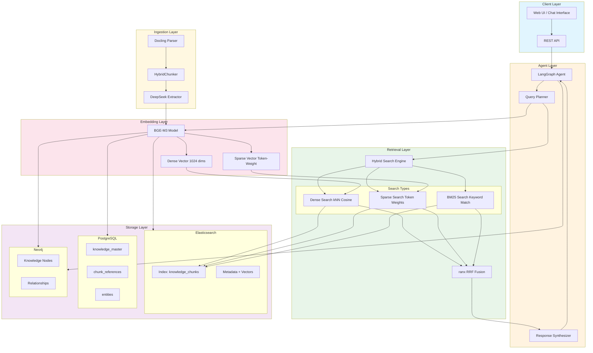
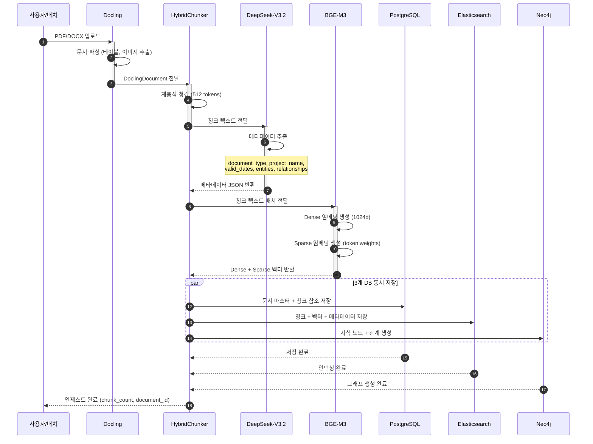
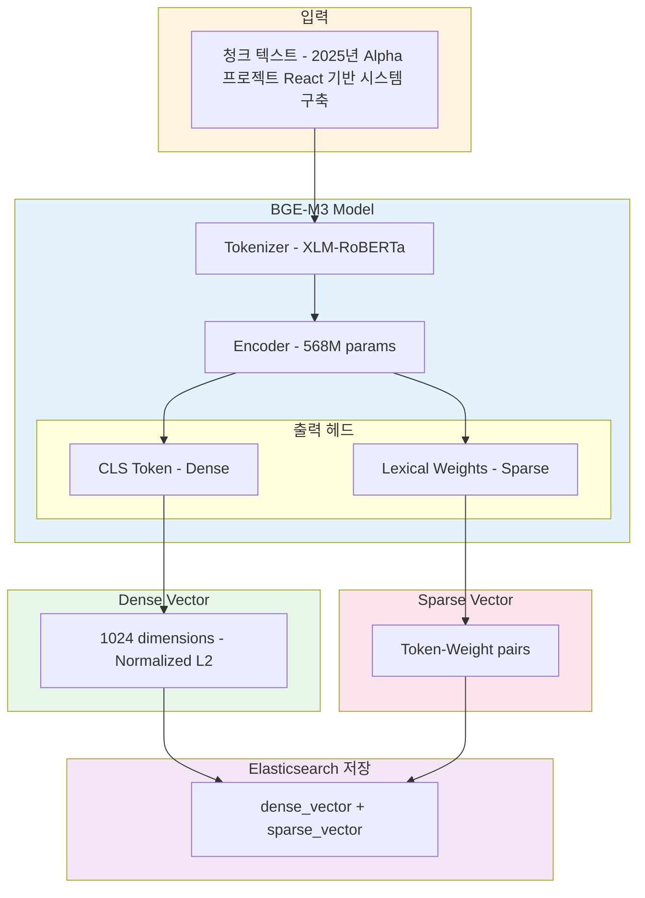
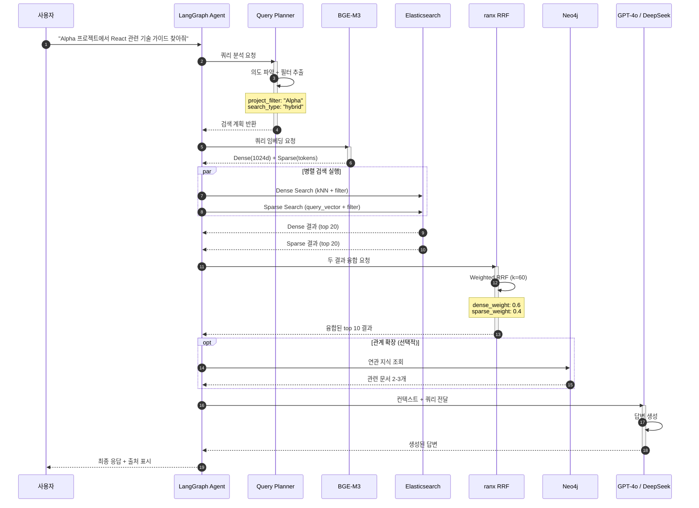
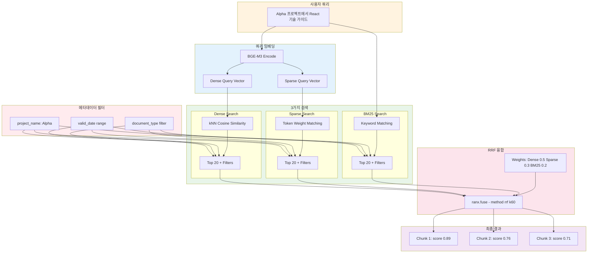
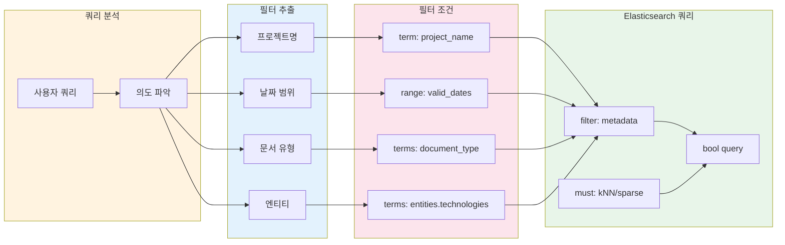

# 사내 지식 검색 시스템 기술 설계서 [#](https://claude.ai/public/artifacts/f96d2965-0fde-49fb-b6cd-f77f37131aba)

## Enterprise Knowledge Search System - Technical Design Document

| 항목 | 내용 |
|------|------|
| 문서 버전 | 1.0 |
| 작성일 | 2026-01-12 |
| 작성자 | AI Architecture Team |
| 문서 상태 | Draft |
| 프로젝트명 | Hybrid RAG Knowledge Ops |

---

## 목차

1. [시스템 개요](#1-시스템-개요)
2. [시스템 아키텍처](#2-시스템-아키텍처)
3. [임베딩 처리 흐름](#3-임베딩-처리-흐름)
4. [검색(Retriever) 처리 흐름](#4-검색retriever-처리-흐름)
5. [샘플 프롬프트 및 응답 시뮬레이션](#5-샘플-프롬프트-및-응답-시뮬레이션)
6. [시스템 구성요소 명세](#6-시스템-구성요소-명세)

---

## 1. 시스템 개요

### 1.1 목적

본 시스템은 사내에 분산된 프로젝트 문서, 기술 가이드, 회의록, SOP 등의 지식 자산을 통합 검색하고, 자연어 질의에 대해 맥락에 맞는 답변을 생성하는 **하이브리드 RAG(Retrieval-Augmented Generation) 기반 지식 검색 시스템**입니다.

### 1.2 핵심 기능

| 기능 | 설명 |
|------|------|
| 하이브리드 검색 | Dense + Sparse + BM25 검색 결과를 RRF로 융합 |
| 시계열 필터링 | 문서 유효기간 기반 검색 (valid_from/to) |
| 프로젝트 기반 검색 | 특정 프로젝트 범위 내 검색 |
| 관계 기반 추천 | Neo4j 그래프를 활용한 연관 지식 추천 |
| 전문가 찾기 | 특정 기술/주제에 대한 담당자 탐색 |

### 1.3 기술 스택

```
┌─────────────────────────────────────────────────┐
│                  Frontend / API                  │
├─────────────────────────────────────────────────┤
│  LangGraph Agent │ FastAPI │ Streamlit (옵션)   │
├─────────────────────────────────────────────────┤
│               Orchestration Layer                │
├─────────────────────────────────────────────────┤
│  BGE-M3 (Embedder)  │  ranx (RRF)  │  DeepSeek  │
├─────────────────────────────────────────────────┤
│                   Data Stores                    │
├───────────────┬───────────────┬─────────────────┤
│  PostgreSQL   │     Neo4j     │  Elasticsearch  │
│    (SSOT)     │   (Graph)     │    (Search)     │
└───────────────┴───────────────┴─────────────────┘
```

---

## 2. 시스템 아키텍처

### 2.1 전체 아키텍처 다이어그램



### 2.2 데이터 저장소 역할 분담

```mermaid
flowchart LR
    subgraph PostgreSQL["PostgreSQL - SSOT"]
        direction TB
        P1["문서 마스터 정보"]
        P2["시계열 메타데이터"]
        P3["엔티티 정규화"]
        P4["동기화 상태 추적"]
    end

    subgraph Elasticsearch["Elasticsearch - Search"]
        direction TB
        E1["Dense Vector 1024d"]
        E2["Sparse Vector"]
        E3["chunk_text BM25"]
        E4["메타데이터 비정규화"]
    end

    subgraph Neo4j["Neo4j - Graph"]
        direction TB
        N1["Knowledge 노드"]
        N2["Person/Tech 노드"]
        N3["관계 엣지"]
        N4["경로 탐색"]
    end

    PostgreSQL -->|SSOT 동기화| Elasticsearch
    PostgreSQL -->|엔티티 연결| Neo4j
    Elasticsearch <-->|검색 + 관계 확장| Neo4j

    style PostgreSQL fill:#336791,color:#fff
    style Elasticsearch fill:#005571,color:#fff
    style Neo4j fill:#008cc1,color:#fff
```



---

## 3. 임베딩 처리 흐름

### 3.1 문서 인제스트 파이프라인



### 3.2 BGE-M3 임베딩 상세 흐름



---

## 4. 검색(Retriever) 처리 흐름

### 4.1 하이브리드 검색 시퀀스



### 4.2 검색 유형별 처리 흐름



### 4.3 메타데이터 필터링 흐름



---

## 5. 샘플 프롬프트 및 응답 시뮬레이션

### 5.1 시나리오 1: 프로젝트 기반 기술 문서 검색

#### 사용자 프롬프트
```
Alpha 프로젝트에서 React 컴포넌트 구조에 대한 가이드 문서 찾아줘
```

#### 시스템 처리 과정

```yaml
Query Analysis:
  intent: document_search
  project_filter: "Alpha"
  technology_filter: ["React"]
  document_type: "기술_가이드"
  date_filter: null (current valid)

Embedding:
  dense_vector: [0.0234, -0.1567, ...] (1024 dims)
  sparse_vector: {"react": 2.31, "컴포넌트": 1.89, "구조": 1.45, "가이드": 1.23}

Search Results:
  - Dense Search: 23 candidates → 20 filtered
  - Sparse Search: 31 candidates → 20 filtered
  - RRF Fusion: Top 5 selected

Retrieved Chunks:
  1. [score: 0.89] "Alpha 프로젝트 React 아키텍처 가이드 v2.1..."
  2. [score: 0.76] "컴포넌트 설계 원칙 - Atomic Design 패턴..."
  3. [score: 0.71] "상태 관리 전략 - Redux vs Context API..."
```

#### 예상 응답

```markdown
## 📚 검색 결과

Alpha 프로젝트의 React 컴포넌트 구조 관련 문서를 찾았습니다.

### 주요 문서

1. **Alpha 프로젝트 React 아키텍처 가이드 v2.1**
   - 📅 유효기간: 2025-01-15 ~ 2025-12-31
   - 📁 문서유형: 기술_가이드
   - 👤 작성자: 김철수 (Tech Lead)
   
   > 본 프로젝트는 Atomic Design 패턴을 기반으로 컴포넌트를 
   > Atoms → Molecules → Organisms → Templates → Pages 단계로 구성합니다.

2. **컴포넌트 설계 원칙**
   - 📅 유효기간: 2025-01-01 ~ 2025-06-30
   - 📁 문서유형: 기술_가이드
   
   > 재사용성을 높이기 위해 Presentational/Container 패턴을 적용하고,
   > Props drilling을 최소화하기 위해 Context API를 활용합니다.

### 💡 관련 추천
- "상태 관리 전략" 문서도 함께 참고하시면 도움이 됩니다.
- 해당 주제 전문가: 김철수, 이영희

---
📎 출처: knowledge_chunks (3개 문서)
```

---

### 5.2 시나리오 2: 시계열 기반 과거 문서 검색

#### 사용자 프롬프트
```
2024년 3분기 기준으로 유효했던 보안 정책 문서 보여줘
```

#### 시스템 처리 과정

```yaml
Query Analysis:
  intent: temporal_search
  project_filter: null
  document_type: "SOP" or "정책"
  date_filter: 
    as_of_date: "2024-09-30"
    range: valid_start <= 2024-09-30 AND valid_end >= 2024-07-01

Search Execution:
  - Metadata Filter: valid_start_date <= "2024-09-30" AND valid_end_date >= "2024-07-01"
  - keyword_filter: "보안", "정책", "security"
```

#### 예상 응답

```markdown
## 📚 검색 결과

2024년 3분기(7월~9월) 기준 유효했던 보안 정책 문서입니다.

### 유효 문서 목록

| 문서명 | 유효기간 | 상태 |
|--------|----------|------|
| 정보보안 기본정책 v3.2 | 2024-01-01 ~ 2024-12-31 | ✅ 유효 |
| 접근권한 관리 지침 | 2024-04-01 ~ 2024-09-30 | ⚠️ 만료됨 |
| 개인정보 처리방침 | 2024-06-01 ~ 2025-05-31 | ✅ 유효 |

### 📋 정보보안 기본정책 v3.2 요약

> 1. 모든 시스템 접근은 2FA(이중 인증) 필수
> 2. 외부 네트워크 접속 시 VPN 사용 의무화
> 3. 90일마다 비밀번호 변경 필수
> 4. 민감정보는 AES-256 암호화 저장

### ⚠️ 주의사항
- "접근권한 관리 지침"은 2024-09-30에 만료되어 
  현재는 **v2.0** 버전이 적용 중입니다.

---
📎 출처: 3개 문서 / 기준일: 2024-09-30
```

---

### 5.3 시나리오 3: 전문가 찾기

#### 사용자 프롬프트
```
Neo4j 그래프 데이터베이스 관련해서 질문할 수 있는 사내 전문가 누구야?
```

#### 시스템 처리 과정

```yaml
Query Analysis:
  intent: expert_finding
  technology: "Neo4j"
  action: find_experts

Neo4j Query:
  MATCH (p:Person)-[:CREATED|REVIEWED]->(k:Knowledge)-[:USES]->(t:Technology {name: "Neo4j"})
  WITH p, count(k) as doc_count
  RETURN p.name, p.department, doc_count
  ORDER BY doc_count DESC
  LIMIT 5
```

#### 예상 응답

```markdown
## 👥 Neo4j 전문가 목록

사내에서 Neo4j 관련 문서를 작성하거나 검토한 전문가입니다.

### 추천 전문가

| 순위 | 이름 | 소속 | 관련 문서 수 | 전문 분야 |
|:----:|------|------|:------------:|-----------|
| 1 | 박지성 | 데이터팀 | 12개 | 그래프 모델링, Cypher |
| 2 | 김민수 | 개발1팀 | 8개 | Neo4j + Python 연동 |
| 3 | 이서연 | 아키텍처팀 | 5개 | 성능 최적화 |

### 📞 연락처
- **박지성**: jisung.park@company.com (Teams: @jisung)
- **김민수**: minsu.kim@company.com

### 📚 관련 문서
박지성님이 작성한 최신 문서:
- "Neo4j 그래프 모델링 베스트 프랙티스" (2025-01-10)
- "Cypher 쿼리 최적화 가이드" (2024-12-15)

---
💡 팁: 박지성님은 매주 목요일 오후 "Graph DB Office Hour"를 운영합니다.
```

---

### 5.4 시나리오 4: 복합 조건 검색

#### 사용자 프롬프트
```
Beta 프로젝트에서 김철수가 작성한 API 설계 관련 문서 중에서 
현재 유효한 것만 보여줘
```

#### 시스템 처리 과정

```yaml
Query Analysis:
  intent: complex_search
  filters:
    project: "Beta"
    author: "김철수"
    topic: "API 설계"
    temporal: "current_valid" (valid_end >= today)

Elasticsearch Query:
  bool:
    must:
      - knn: {field: dense_vector, query_vector: [...]}
    filter:
      - term: {project_name: "Beta"}
      - term: {entities.persons: "김철수"}
      - range: {valid_end_date: {gte: "2026-01-12"}}

Neo4j Verification:
  MATCH (p:Person {name: "김철수"})-[:CREATED]->(k:Knowledge)
  WHERE k.project = "Beta"
  RETURN k
```

#### 예상 응답

```markdown
## 📚 검색 결과

Beta 프로젝트에서 김철수님이 작성한 현재 유효한 API 설계 문서입니다.

### 검색 조건
- 🏷️ 프로젝트: Beta
- 👤 작성자: 김철수
- 📅 유효기간: 현재 유효 (2026-01-12 기준)

### 문서 목록

1. **Beta API 설계 명세서 v2.0**
   - 📅 유효기간: 2025-06-01 ~ 2026-05-31
   - 📝 최종 수정: 2025-11-20
   
   > RESTful API 설계 원칙과 엔드포인트 명세를 정의합니다.
   > 인증은 JWT 기반이며, Rate Limiting이 적용됩니다.

2. **GraphQL 스키마 가이드**
   - 📅 유효기간: 2025-09-01 ~ 2026-08-31
   - 📝 최종 수정: 2025-12-05
   
   > Query, Mutation, Subscription 패턴 정의 및 예시

### ⚠️ 만료 예정 알림
- "Beta API v1.0 마이그레이션 가이드"는 2026-01-31에 만료 예정입니다.

---
📎 출처: 2개 문서 / 작성자 확인: Neo4j Graph
```

---

### 5.5 시나리오 5: 연관 지식 탐색

#### 사용자 프롬프트
```
"마이크로서비스 아키텍처" 문서와 관련된 다른 문서들 추천해줘
```

#### 시스템 처리 과정

```yaml
Query Analysis:
  intent: related_knowledge
  source_document: "마이크로서비스 아키텍처"
  action: graph_traversal

Neo4j Query:
  MATCH (k:Knowledge {title: "마이크로서비스 아키텍처"})
  MATCH path = (k)-[*1..2]-(related:Knowledge)
  WHERE related <> k
  RETURN related, relationships(path)
  LIMIT 10
```

#### 예상 응답

~~~markdown
## 🔗 연관 지식 추천

"마이크로서비스 아키텍처" 문서와 연결된 관련 문서입니다.

### 관계도

```
                    ┌─────────────────┐
                    │  마이크로서비스   │
                    │   아키텍처       │
                    └────────┬────────┘
                             │
         ┌───────────────────┼───────────────────┐
         │                   │                   │
    [USES]              [REFERENCES]        [SUPERSEDES]
         │                   │                   │
         ▼                   ▼                   ▼
┌─────────────┐    ┌─────────────┐    ┌─────────────┐
│   Docker    │    │  API 게이트 │    │  모놀리식   │
│ 컨테이너 가이드│    │  웨이 설계  │    │ → MSA 전환 │
└─────────────┘    └─────────────┘    └─────────────┘
```

### 📚 추천 문서

| 관계 | 문서명 | 연결 이유 |
|------|--------|-----------|
| 🔧 USES | Docker 컨테이너 가이드 | 동일 기술 스택 사용 |
| 📎 REFERENCES | API 게이트웨이 설계 | 본문에서 참조됨 |
| 🔄 SUPERSEDES | 모놀리식→MSA 전환 가이드 | 이전 버전 |
| 👤 SAME_AUTHOR | 서비스 메시 개요 | 동일 작성자 |
| 🏷️ SAME_PROJECT | Gamma 시스템 설계서 | 동일 프로젝트 |

### 💡 학습 경로 제안
1. 모놀리식→MSA 전환 가이드 (배경 이해)
2. **마이크로서비스 아키텍처** (현재 문서)
3. Docker 컨테이너 가이드 (실습)
4. API 게이트웨이 설계 (심화)

---
📎 출처: Neo4j Graph (depth: 2)
~~~

---

### 5.6 시나리오 6: 에러/실패 케이스

#### 사용자 프롬프트
```
Omega 프로젝트의 보안 감사 보고서 보여줘
```

#### 시스템 처리 과정

```yaml
Query Analysis:
  intent: document_search
  project_filter: "Omega"
  document_type: "보안_감사_보고서"

Search Results:
  - Dense Search: 0 results
  - Sparse Search: 2 results (low confidence)
  - Confidence: Below threshold (0.3)

Decision: No reliable results found
```

#### 예상 응답

```markdown
## ⚠️ 검색 결과 없음

"Omega 프로젝트의 보안 감사 보고서"에 대한 검색 결과가 없습니다.

### 가능한 원인

1. **프로젝트명 확인 필요**
   - 등록된 프로젝트: Alpha, Beta, Gamma, Delta
   - "Omega" 프로젝트는 시스템에 등록되어 있지 않습니다.

2. **문서 미등록**
   - 해당 문서가 아직 시스템에 업로드되지 않았을 수 있습니다.

3. **접근 권한 제한**
   - 보안 감사 보고서는 권한이 제한될 수 있습니다.

### 💡 제안

- 프로젝트명을 다시 확인해 주세요.
- 비슷한 검색: "보안 감사" 관련 전체 문서 검색을 원하시면 알려주세요.
- 담당자 문의: 정보보안팀 (security@company.com)

---
🔍 검색어: "Omega 프로젝트 보안 감사 보고서"
📅 검색 시간: 2026-01-12 14:30:00
```

---

## 6. 시스템 구성요소 명세

### 6.1 컴포넌트 상세

| 컴포넌트 | 버전 | 역할 | 리소스 |
|----------|------|------|--------|
| Elasticsearch | 8.15+ | 벡터 검색 + 메타데이터 저장 | 4GB Heap |
| PostgreSQL | 16+ | SSOT, 시계열 관리 | 1GB |
| Neo4j | 5.x | 지식 그래프 | 2GB Heap |
| BGE-M3 | latest | 임베딩 생성 (Dense+Sparse) | 2-3GB |
| ranx | 0.3+ | RRF 융합 | ~100MB |
| Docling | latest | 문서 파싱 | ~500MB |
| DeepSeek-V3.2 | API | 메타데이터 추출 | 외부 API |
| LangGraph | 0.6+ | 에이전트 오케스트레이션 | ~500MB |

### 6.2 API 엔드포인트

```yaml
# 검색 API
POST /api/v1/search
  body:
    query: string
    project_filter?: string
    date_filter?: string (YYYY-MM-DD)
    document_type?: string
    k?: int (default: 10)

# 문서 인제스트 API
POST /api/v1/ingest
  body:
    file: binary (PDF/DOCX)
    project?: string
    metadata_override?: object

# 전문가 찾기 API
GET /api/v1/experts/{technology}

# 연관 지식 API
GET /api/v1/related/{document_id}
  query:
    depth?: int (default: 2)
    limit?: int (default: 10)
```

### 6.3 성능 목표

| 지표 | 목표값 | 비고 |
|------|--------|------|
| 검색 응답시간 | < 500ms | P95 기준 |
| 인제스트 처리량 | > 10 docs/min | 평균 10페이지 문서 |
| 동시 사용자 | 50명 | 16GB RAM 환경 |
| 검색 정확도 | > 85% | Top-5 Recall |

---

## 부록: 용어 정의

| 용어 | 정의 |
|------|------|
| Dense Vector | 1024차원 연속 벡터, 의미적 유사성 표현 |
| Sparse Vector | 토큰-가중치 쌍, 키워드 확장 표현 |
| RRF | Reciprocal Rank Fusion, 다중 검색 결과 융합 알고리즘 |
| SSOT | Single Source of Truth, 단일 진실 공급원 |
| Zero-Join | DB 조인 없이 단일 쿼리로 완결되는 검색 |

---

**문서 끝**

| 작성일 | 버전 | 변경사항 |
|--------|------|----------|
| 2026-01-12 | 1.0 | 초안 작성 |