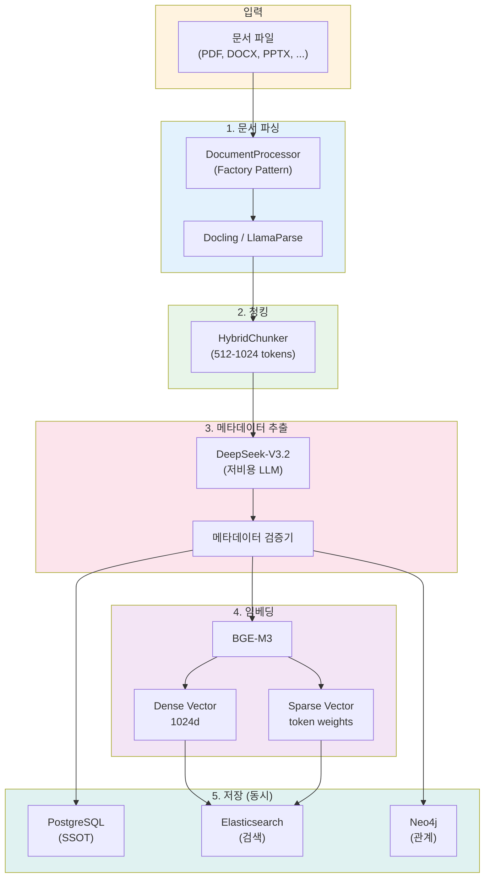

# 소스코드 검토 보고서: 메타데이터 자동 생성 및 활용 분석 [#](https://claude.ai/public/artifacts/c83d50aa-945c-4d71-86f7-f9df5400e739)

## 문서 정보

| 항목 | 내용 |
|------|------|
| 검토 대상 | pdf_processor.py, embed_pdfs.py, rag_system.py |
| 검토 목적 | 메타데이터 자동 생성 구조 분석 및 개선점 도출 |
| 작성일 | 2026-01-12 |

---

## 1. 현재 구조 분석

### 1.1 메타데이터 생성 흐름

```
┌─────────────────────────────────────────────────────────────────────┐
│                     현재 메타데이터 생성 흐름                         │
├─────────────────────────────────────────────────────────────────────┤
│                                                                     │
│  PDF 파일                                                           │
│      │                                                              │
│      ▼                                                              │
│  ┌─────────────────┐                                               │
│  │  PDFPlumber     │  문서 파싱                                     │
│  │  /PyPDF         │                                               │
│  └────────┬────────┘                                               │
│           │                                                         │
│           ▼                                                         │
│  ┌─────────────────┐     ┌─────────────────┐                       │
│  │ 전체 텍스트 추출 │────▶│ LLM 메타데이터   │                       │
│  │ (8000자 제한)   │     │ 생성 (GPT-3.5)  │                       │
│  └─────────────────┘     └────────┬────────┘                       │
│                                   │                                 │
│                                   ▼                                 │
│                          ┌─────────────────┐                       │
│                          │ JSON 파싱       │                       │
│                          │ (정규식 fallback)│                       │
│                          └────────┬────────┘                       │
│                                   │                                 │
│                                   ▼                                 │
│  ┌─────────────────────────────────────────────────────────────┐   │
│  │                    생성된 메타데이터                          │   │
│  │  - keywords, search_terms, summary                          │   │
│  │  - categories (level1/2/3), document_type                   │   │
│  │  - technical_terms, entities                                │   │
│  │  - target_audience, difficulty_level, relevance_score       │   │
│  └─────────────────────────────────────────────────────────────┘   │
│                                                                     │
└─────────────────────────────────────────────────────────────────────┘
```

### 1.2 현재 메타데이터 스키마

```python
# pdf_processor.py의 _get_default_metadata()에서 정의
{
    "keywords": [],                    # 핵심 키워드
    "search_terms": [],                # 검색어
    "summary": "",                     # 문서 요약
    "categories": {                    # 카테고리 계층
        "level1": "", 
        "level2": "", 
        "level3": ""
    },
    "document_type": "",               # 문서 유형
    "technical_terms": [],             # 기술 용어
    "entities": [],                    # 개체명 (사람, 조직 등)
    "target_audience": "",             # 대상 독자
    "difficulty_level": "중급",         # 난이도
    "relevance_score": 5,              # 관련성 점수
    "all_search_text": ""              # 검색용 통합 텍스트
}
```

---

## 2. 강점 분석

### 2.1 ✅ 잘 설계된 부분

| 항목 | 설명 | 코드 위치 |
|------|------|----------|
| **LLM 기반 메타데이터 생성** | GPT를 활용한 자동 분류/요약 | `generate_complete_metadata_with_llm()` |
| **검색 최적화 필드** | `all_search_text`로 BM25 검색 강화 | `_enhance_metadata_for_search()` |
| **빈도 분석 보완** | LLM 결과를 통계적 분석으로 보완 | `_extract_frequent_terms()` |
| **Fallback 처리** | JSON 파싱 실패 시 정규식 추출 | `_extract_metadata_with_regex()` |
| **청크별 품질 점수** | 검색 품질 예측 점수 부여 | `_add_chunk_search_metadata()` |
| **경로 정보 활용** | 디렉토리 구조에서 컨텍스트 추출 | `_extract_path_info()` |

### 2.2 ✅ 코드 품질

```python
# 좋은 예: 안전한 로깅 처리
def _safe_log(self, level: str, message: str, *args):
    """안전한 로깅 (Unicode 오류 방지)"""
    try:
        logger.info(message)
    except UnicodeEncodeError:
        safe_message = message.encode('ascii', 'ignore').decode('ascii')
        logger.info(safe_message)
```

```python
# 좋은 예: 검색 최적화 텍스트 통합
metadata["all_search_text"] = " ".join([
    metadata.get("summary", ""),
    " ".join(metadata.get("keywords", [])),
    " ".join(metadata.get("search_terms", [])),
    ...
])
```

---

## 3. 개선 필요 사항

### 3.1 🔴 Critical: 설계된 아키텍처와의 불일치

#### 문제점 1: 시계열 메타데이터 누락

```python
# ❌ 현재: 시계열 정보 없음
{
    "keywords": [...],
    "summary": "...",
    # valid_start_date, valid_end_date 없음!
}

# ✅ 권장: 설계서의 시계열 필드 추가
{
    "valid_start_date": "YYYY-MM-DD",
    "valid_end_date": "YYYY-MM-DD",  # 없으면 9999-12-31
    "document_type": "프로젝트_보고서 | 일반_가이드 | 회의록 | SOP",
    "project_name": "프로젝트명",
    ...
}
```

#### 문제점 2: 관계 정보 누락

```python
# ❌ 현재: 단순 엔티티 리스트
"entities": ["김철수", "React", "Neo4j"]

# ✅ 권장: 구조화된 엔티티 + 관계
"entities": {
    "persons": ["김철수", "이영희"],
    "projects": ["Alpha"],
    "technologies": ["React", "Neo4j"],
    "keywords": ["보안", "인증"]
},
"relationships": [
    {"from": "김철수", "relation": "CREATED", "to": "문서"},
    {"from": "문서", "relation": "BELONGS_TO", "to": "Alpha"}
]
```

#### 문제점 3: BGE-M3 Dense+Sparse 미사용

```python
# ❌ 현재: OpenAI Embeddings만 사용 (vector_store_pgvector.py 추정)
from langchain_openai import OpenAIEmbeddings
embeddings = OpenAIEmbeddings()

# ✅ 권장: BGE-M3 Dense + Sparse 동시 생성
from FlagEmbedding import BGEM3FlagModel
output = model.encode(texts, return_dense=True, return_sparse=True)
# dense_vector: 1024d
# sparse_vector: {token: weight, ...}
```

### 3.2 🟡 Medium: 메타데이터 프롬프트 개선

#### 현재 프롬프트의 문제점

```python
# ❌ 현재: 범용적이지만 구체성 부족
prompt = (
    "다음 JSON 형식으로 메타데이터를 생성하세요:\n"
    '  "keywords": ["키워드1", "키워드2"],\n'
    '  "document_type": "문서유형",\n'
    ...
)
```

#### 개선된 프롬프트

~~~python
# ✅ 권장: 구체적 지시 + 예시 포함
METADATA_EXTRACTION_PROMPT = """
당신은 기업 문서 분석 전문가입니다. 주어진 문서를 분석하여 검색 및 지식 그래프 구축에 최적화된 메타데이터를 추출하세요.

## 파일 정보
{path_description}

## 문서 내용 (처음 2000자)
{document_text}

## 추출 규칙
1. document_type은 반드시 다음 중 하나: 프로젝트_보고서, 기술_가이드, 회의록, SOP, 제안서, 분석_보고서
2. valid_start_date는 문서 작성일 또는 발효일 (YYYY-MM-DD)
3. valid_end_date는 만료일 또는 다음 버전 예정일 (없으면 9999-12-31)
4. project_name은 관련 프로젝트명 (없으면 "N/A")
5. entities는 반드시 persons, projects, technologies, keywords로 구분
6. relationships는 추출된 엔티티 간의 관계 (CREATED, BELONGS_TO, USES, REFERENCES)

## 출력 형식 (JSON만 반환)
```json
{
  "document_type": "기술_가이드",
  "project_name": "Alpha",
  "valid_start_date": "2025-01-15",
  "valid_end_date": "2025-12-31",
  "summary": "3줄 이내 요약",
  "entities": {
    "persons": ["김철수"],
    "projects": ["Alpha"],
    "technologies": ["React", "Neo4j"],
    "keywords": ["지식관리", "RAG"]
  },
  "relationships": [
    {"from": "김철수", "relation": "CREATED", "to": "본 문서"},
    {"from": "본 문서", "relation": "BELONGS_TO", "to": "Alpha"}
  ],
  "difficulty_level": "중급",
  "target_audience": "개발팀"
}
```
"""
~~~

### 3.3 🟡 Medium: 3개 DB 동기화 미구현

```python
# ❌ 현재: 단일 벡터 스토어만 저장
vectorstore.add_documents(batch)

# ✅ 권장: 3개 DB 동시 저장 (설계서 기준)
async def save_to_all_stores(chunks, metadata):
    await asyncio.gather(
        save_to_postgresql(metadata),      # SSOT
        save_to_elasticsearch(chunks),     # 검색
        save_to_neo4j(metadata)            # 관계
    )
```

### 3.4 🟢 Minor: 문서 타입 확장성

```python
# ❌ 현재: PDF 전용 프로세서
class PDFProcessor:
    def process_pdf(self, pdf_path): ...

# ✅ 권장: 범용 문서 프로세서 패턴
class DocumentProcessor:
    """범용 문서 프로세서 (Factory Pattern)"""
    
    SUPPORTED_TYPES = {
        ".pdf": "PDFParser",
        ".docx": "DocxParser",
        ".pptx": "PptxParser",
        ".xlsx": "XlsxParser",
        ".md": "MarkdownParser",
        ".html": "HtmlParser",
    }
    
    def process(self, file_path: Path) -> List[Document]:
        parser = self._get_parser(file_path.suffix)
        return parser.parse(file_path)
```

---

## 4. 권장 아키텍처 (개선안)

### 4.1 통합 메타데이터 스키마

```python
@dataclass
class UnifiedMetadata:
    """통합 메타데이터 스키마 (3개 DB 호환)"""
    
    # === 필수 필드 ===
    document_id: str                    # 고유 식별자
    chunk_id: str                       # 청크 식별자
    chunk_index: int                    # 청크 순서
    
    # === 파일 정보 ===
    file_path: str
    file_name: str
    file_type: str                      # pdf, docx, pptx, ...
    file_size: int
    file_hash: str                      # 중복 감지용
    
    # === 시계열 정보 (PostgreSQL SSOT) ===
    valid_start_date: str               # YYYY-MM-DD
    valid_end_date: str                 # YYYY-MM-DD (기본: 9999-12-31)
    created_at: str                     # ISO timestamp
    updated_at: str
    
    # === 분류 정보 ===
    document_type: str                  # 프로젝트_보고서, 기술_가이드, ...
    project_name: Optional[str]
    categories: Dict[str, str]          # level1, level2, level3
    
    # === 검색 최적화 (Elasticsearch) ===
    summary: str                        # 3줄 요약
    keywords: List[str]                 # 핵심 키워드
    search_terms: List[str]             # 검색어 확장
    technical_terms: List[str]          # 기술 용어
    all_search_text: str                # BM25용 통합 텍스트
    
    # === 엔티티 정보 (Neo4j) ===
    entities: Dict[str, List[str]]      # persons, projects, technologies, keywords
    relationships: List[Dict]           # from, relation, to
    
    # === 품질 지표 ===
    difficulty_level: str               # 초급, 중급, 고급
    target_audience: str
    relevance_score: float
    search_quality_score: float
    
    # === 벡터 (Elasticsearch) ===
    dense_vector: Optional[List[float]] # BGE-M3 1024d
    sparse_vector: Optional[Dict[str, float]]  # BGE-M3 token weights
```

### 4.2 개선된 처리 파이프라인



### 4.3 개선된 코드 구조

```python
# document_processor.py (신규)
from abc import ABC, abstractmethod
from pathlib import Path
from typing import List, Dict, Any
from dataclasses import dataclass, asdict

class BaseParser(ABC):
    """문서 파서 기본 클래스"""
    
    @abstractmethod
    def parse(self, file_path: Path) -> List[Dict[str, Any]]:
        """문서를 파싱하여 청크 리스트 반환"""
        pass

class PDFParser(BaseParser):
    def parse(self, file_path: Path) -> List[Dict[str, Any]]:
        # Docling 사용
        from docling.document_converter import DocumentConverter
        converter = DocumentConverter()
        result = converter.convert(str(file_path))
        return self._to_chunks(result.document)

class DocxParser(BaseParser):
    def parse(self, file_path: Path) -> List[Dict[str, Any]]:
        from docling.document_converter import DocumentConverter
        converter = DocumentConverter()
        result = converter.convert(str(file_path))
        return self._to_chunks(result.document)

class DocumentProcessor:
    """범용 문서 프로세서"""
    
    PARSERS = {
        ".pdf": PDFParser,
        ".docx": DocxParser,
        ".pptx": PptxParser,
        ".xlsx": XlsxParser,
        ".md": MarkdownParser,
    }
    
    def __init__(self, 
                 llm_extractor: 'MetadataExtractor',
                 embedder: 'BGE_M3_Embedder'):
        self.llm_extractor = llm_extractor
        self.embedder = embedder
    
    def process(self, file_path: Path) -> List[Document]:
        """문서 처리 메인 메서드"""
        
        # 1. 파서 선택
        parser_class = self.PARSERS.get(file_path.suffix.lower())
        if not parser_class:
            raise ValueError(f"지원하지 않는 파일 형식: {file_path.suffix}")
        
        parser = parser_class()
        
        # 2. 문서 파싱
        raw_chunks = parser.parse(file_path)
        
        # 3. 메타데이터 추출 (DeepSeek)
        full_text = " ".join([c['text'] for c in raw_chunks])
        metadata = self.llm_extractor.extract(full_text, file_path)
        
        # 4. 메타데이터 검증
        validated_metadata = self._validate_metadata(metadata)
        
        # 5. 임베딩 생성 (BGE-M3)
        texts = [c['text'] for c in raw_chunks]
        dense_vectors, sparse_vectors = self.embedder.encode(texts)
        
        # 6. Document 객체 생성
        documents = []
        for i, chunk in enumerate(raw_chunks):
            doc = Document(
                page_content=chunk['text'],
                metadata={
                    **validated_metadata,
                    "chunk_id": f"{file_path.stem}_{i:04d}",
                    "chunk_index": i,
                    "dense_vector": dense_vectors[i].tolist(),
                    "sparse_vector": sparse_vectors[i],
                }
            )
            documents.append(doc)
        
        return documents
    
    def _validate_metadata(self, metadata: Dict) -> Dict:
        """메타데이터 검증 및 기본값 설정"""
        
        # 필수 필드 기본값
        defaults = {
            "valid_start_date": datetime.now().strftime("%Y-%m-%d"),
            "valid_end_date": "9999-12-31",
            "document_type": "일반_문서",
            "project_name": "N/A",
            "entities": {"persons": [], "projects": [], "technologies": [], "keywords": []},
            "relationships": [],
            "difficulty_level": "중급",
        }
        
        for key, default in defaults.items():
            if key not in metadata or not metadata[key]:
                metadata[key] = default
        
        return metadata
```

---

## 5. 마이그레이션 가이드

### 5.1 단계별 적용 계획

| 단계 | 작업 | 우선순위 | 예상 소요 |
|------|------|----------|----------|
| 1 | 메타데이터 스키마 통합 | 🔴 High | 2일 |
| 2 | 시계열 필드 추가 | 🔴 High | 1일 |
| 3 | 엔티티/관계 구조화 | 🔴 High | 2일 |
| 4 | BGE-M3 임베딩 통합 | 🟡 Medium | 3일 |
| 5 | 3개 DB 동기화 구현 | 🟡 Medium | 3일 |
| 6 | 범용 문서 프로세서 리팩토링 | 🟢 Low | 5일 |
| 7 | ranx RRF 하이브리드 검색 | 🟢 Low | 2일 |

### 5.2 호환성 유지 전략

```python
# 기존 코드와의 호환성 유지
class PDFProcessor:
    """기존 클래스 (deprecated, 호환성 유지)"""
    
    def __init__(self, *args, **kwargs):
        import warnings
        warnings.warn(
            "PDFProcessor is deprecated. Use DocumentProcessor instead.",
            DeprecationWarning
        )
        self._new_processor = DocumentProcessor(*args, **kwargs)
    
    def process_pdf(self, pdf_path):
        """기존 메서드 (내부적으로 새 프로세서 사용)"""
        return self._new_processor.process(Path(pdf_path))
```

---

## 6. 결론

### 6.1 현재 코드의 성숙도

| 영역 | 점수 | 평가 |
|------|:----:|------|
| LLM 메타데이터 생성 | ⭐⭐⭐⭐ | 우수 |
| 검색 최적화 | ⭐⭐⭐ | 양호 |
| 확장성 | ⭐⭐ | 개선 필요 |
| 설계서 정합성 | ⭐⭐ | 개선 필요 |
| 에러 처리 | ⭐⭐⭐⭐ | 우수 |

### 6.2 핵심 개선 사항 요약

1. **시계열 메타데이터 추가** - `valid_start_date`, `valid_end_date` 필수
2. **엔티티/관계 구조화** - Neo4j 그래프 연동 준비
3. **BGE-M3 Dense+Sparse 통합** - 하이브리드 검색 강화
4. **3개 DB 동기화** - PostgreSQL(SSOT) + ES(검색) + Neo4j(관계)
5. **범용 문서 프로세서** - Factory Pattern으로 확장성 확보

### 6.3 즉시 적용 가능한 Quick Win

```python
# 1. 메타데이터 프롬프트에 시계열 필드 추가 (즉시 적용)
prompt = """
...
{
  "valid_start_date": "YYYY-MM-DD (문서 작성일)",
  "valid_end_date": "YYYY-MM-DD (만료일, 없으면 9999-12-31)",
  "project_name": "관련 프로젝트명",
  ...
}
"""

# 2. 엔티티 구조화 (즉시 적용)
"entities": {
    "persons": [],
    "projects": [],
    "technologies": [],
    "keywords": []
}

# 3. 기본값에 시계열 추가 (즉시 적용)
def _get_default_metadata(self):
    return {
        "valid_start_date": datetime.now().strftime("%Y-%m-%d"),
        "valid_end_date": "9999-12-31",
        ...
    }
```

---

**문서 작성일**: 2026-01-12  
**검토자**: AI Architecture Review