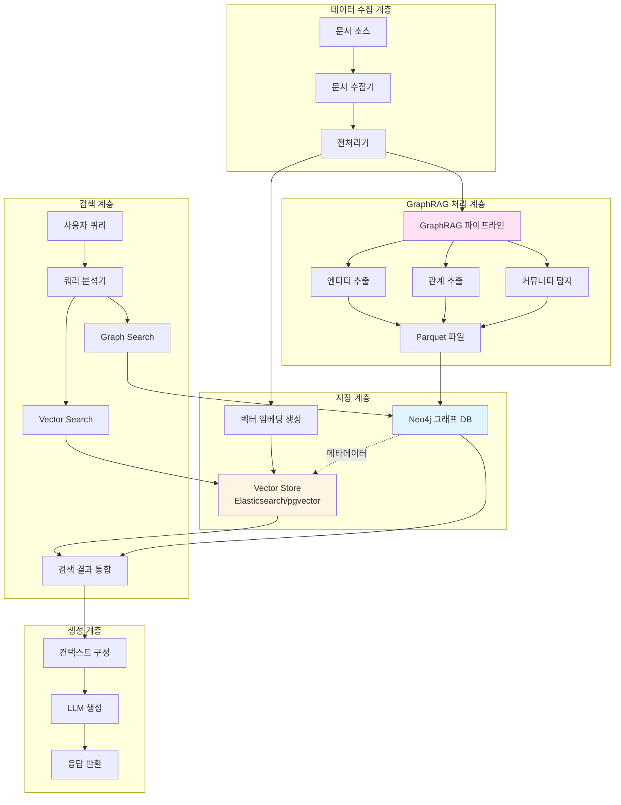
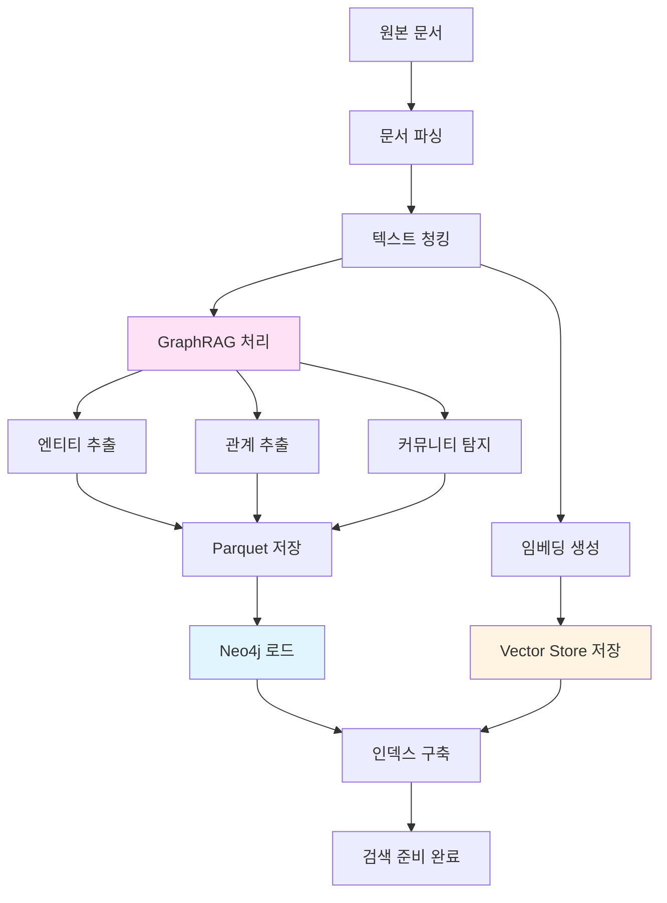
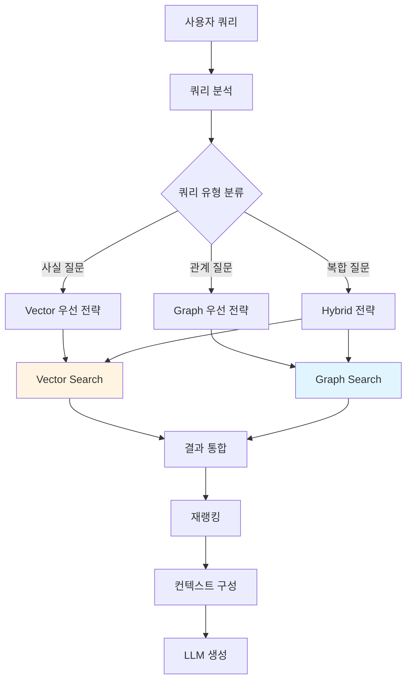

# GraphRAG와 Neo4j 통합 Hybrid RAG 시스템 설계 가이드

## 문서 정보
- **작성일**: 2026-01-12
- **버전**: 1.0
- **대상**: 엔터프라이즈 지식 관리 및 RAG 시스템 구축

---

## 목차
1. [개요 및 배경](#1-개요-및-배경)
2. [시스템 아키텍처](#2-시스템-아키텍처)
3. [GraphRAG와 Neo4j 통합 설계](#3-graphrag와-neo4j-통합-설계)
4. [데이터 파이프라인 구축](#4-데이터-파이프라인-구축)
5. [상세 구현: 파이프라인 설계](#5-상세-구현-파이프라인-설계)
6. [Hybrid RAG 검색 전략](#6-hybrid-rag-검색-전략)
7. [임베딩 모델 선정 가이드](#7-임베딩-모델-선정-가이드)
8. [16GB RAM 환경 최적화](#8-16gb-ram-환경-최적화)
9. [Elasticsearch와의 3-way 통합](#9-elasticsearch와의-3-way-통합)
10. [실무 구현 가이드](#10-실무-구현-가이드)
11. [성능 최적화 전략](#11-성능-최적화-전략)
12. [운영 및 유지보수](#12-운영-및-유지보수)
13. [보안 및 규정 준수](#13-보안-및-규정-준수)
14. [문제 해결 및 FAQ](#14-문제-해결-및-faq)
15. [참고 자료](#15-참고-자료)
16. [구현 로드맵](#16-구현-로드맵)
17. [결론 및 향후 계획](#17-결론-및-향후-계획)

---

## 1. 개요 및 배경

### 1.1 Hybrid RAG의 필요성

전통적인 Vector RAG는 의미론적 유사도 검색에 강점을 가지지만, 문서 간의 관계나 맥락적 연결성을 충분히 활용하지 못하는 한계가 있습니다. Microsoft GraphRAG와 Neo4j를 통합한 Hybrid RAG 시스템은 이러한 한계를 극복하고 다음과 같은 이점을 제공합니다.

**Vector RAG의 강점**
- 의미론적 유사도 기반 검색
- 빠른 검색 속도
- 확장성이 뛰어난 인덱싱

**Graph RAG의 강점**
- 엔티티 간 관계 파악
- 다중 홉(Multi-hop) 추론
- 복잡한 지식 구조 표현
- 설명 가능한 검색 경로

**Hybrid RAG의 시너지**
- Vector Search로 관련 문서 후보를 빠르게 필터링
- Graph Traversal로 연결된 지식을 탐색하여 맥락 확장
- 두 접근법의 결과를 결합하여 더 정확하고 포괄적인 답변 생성

### 1.2 Microsoft GraphRAG 기술 개요

Microsoft GraphRAG는 비정형 텍스트 문서에서 구조화된 지식 그래프를 자동으로 추출하는 프레임워크입니다. 주요 특징은 다음과 같습니다.

**핵심 처리 과정**
1. **문서 분석**: LLM을 활용하여 문서에서 핵심 엔티티(Entity) 추출
2. **관계 매핑**: 엔티티 간의 의미론적 관계(Relationship) 식별
3. **커뮤니티 탐지**: 밀접하게 연결된 엔티티 그룹 자동 생성
4. **요약 생성**: 각 커뮤니티에 대한 계층적 요약 생성
5. **Parquet 저장**: 추출된 데이터를 효율적인 컬럼형 포맷으로 저장

**주요 출력 파일**
- `base_entity_nodes.parquet`: 추출된 엔티티(노드) 정보
- `create_final_relationships.parquet`: 엔티티 간 관계(엣지) 정보
- `create_final_communities.parquet`: 커뮤니티 구조 및 계층
- `create_final_text_units.parquet`: 텍스트 청크 및 메타데이터

### 1.3 Neo4j 그래프 데이터베이스 개요

Neo4j는 세계에서 가장 널리 사용되는 그래프 데이터베이스 관리 시스템(GDBMS)으로, 다음과 같은 특성을 가집니다.

**핵심 구성 요소**
- **노드(Node)**: 엔티티를 표현하는 기본 단위
- **관계(Relationship)**: 노드 간의 방향성 연결
- **속성(Property)**: 노드와 관계에 첨부되는 키-값 데이터
- **레이블(Label)**: 노드의 타입을 분류하는 태그

**Cypher 쿼리 언어**
Neo4j는 Cypher라는 선언적 그래프 쿼리 언어를 사용하며, SQL과 유사하지만 그래프 패턴을 직관적으로 표현할 수 있습니다.

```cypher
// 예시: 특정 인물과 2단계 이내로 연결된 모든 조직 찾기
MATCH (p:Person {name: "홍길동"})-[*1..2]-(o:Organization)
RETURN p, o
```

**GraphRAG와의 시너지**
- GraphRAG가 추출한 지식을 영구적으로 저장
- 실시간 그래프 탐색 및 복잡한 쿼리 실행
- 지식 그래프의 시각화 및 분석
- 관계 중심의 데이터 처리에 최적화

---

## 2. 시스템 아키텍처

### 2.1 전체 아키텍처 다이어그램



### 2.2 주요 컴포넌트 설명

#### 2.2.1 데이터 수집 및 전처리
문서 수집기는 다양한 소스(PDF, DOCX, 웹페이지, 데이터베이스)에서 데이터를 수집하고, 전처리기는 텍스트 정제, 청킹, 메타데이터 추출 등을 수행합니다.

#### 2.2.2 GraphRAG 처리 파이프라인
Microsoft GraphRAG를 사용하여 문서에서 지식 그래프를 자동으로 추출합니다. 이 과정에서 LLM이 문서를 분석하여 엔티티와 관계를 식별하고, 커뮤니티 구조를 생성합니다.

#### 2.2.3 이중 저장 전략
- **Neo4j**: 그래프 구조와 관계 데이터를 저장하여 그래프 탐색 및 관계 기반 검색 지원
- **Vector Store**: 텍스트 청크의 임베딩을 저장하여 의미론적 유사도 검색 지원
- 두 저장소는 공통 ID로 연결되어 상호 참조 가능

#### 2.2.4 Hybrid 검색 엔진
사용자 쿼리를 분석하여 Vector Search와 Graph Search를 병렬 또는 순차적으로 실행하고, 결과를 통합하여 최적의 컨텍스트를 생성합니다.

---

## 3. GraphRAG와 Neo4j 통합 설계

### 3.1 데이터 모델 설계

Neo4j에 저장할 그래프 데이터 모델은 GraphRAG의 출력 구조를 반영하여 설계해야 합니다.

#### 3.1.1 노드 스키마

**Entity 노드**
```cypher
CREATE CONSTRAINT entity_id_unique IF NOT EXISTS
FOR (e:Entity) REQUIRE e.id IS UNIQUE;

// Entity 노드 속성
(:Entity {
  id: "entity_001",           // 고유 식별자
  name: "홍길동",              // 엔티티 명칭
  type: "Person",             // 엔티티 타입
  description: "조선시대 의적", // 엔티티 설명
  source_id: "doc_123",       // 출처 문서 ID
  embedding: [0.1, 0.2, ...], // 임베딩 벡터 (옵션)
  created_at: datetime(),     // 생성 시간
  updated_at: datetime()      // 수정 시간
})
```

**TextUnit 노드**
```cypher
CREATE CONSTRAINT text_unit_id_unique IF NOT EXISTS
FOR (t:TextUnit) REQUIRE t.id IS UNIQUE;

// TextUnit 노드 속성
(:TextUnit {
  id: "chunk_001",
  text: "원본 텍스트 내용...",
  document_id: "doc_123",
  chunk_index: 0,
  token_count: 512,
  embedding: [0.1, 0.2, ...]  // Vector Store와 동기화
})
```

**Community 노드**
```cypher
CREATE CONSTRAINT community_id_unique IF NOT EXISTS
FOR (c:Community) REQUIRE c.id IS UNIQUE;

// Community 노드 속성
(:Community {
  id: "comm_001",
  title: "조선시대 인물",
  summary: "조선시대 주요 인물들과 그들의 활동",
  level: 0,                    // 계층 레벨
  size: 15,                    // 포함된 엔티티 수
  created_at: datetime()
})
```

#### 3.1.2 관계 스키마

**RELATED_TO 관계**
```cypher
// 엔티티 간 관계
(e1:Entity)-[:RELATED_TO {
  type: "동료",
  description: "함께 활동함",
  weight: 0.8,
  source_id: "doc_123",
  created_at: datetime()
}]->(e2:Entity)
```

**MENTIONED_IN 관계**
```cypher
// 엔티티가 언급된 텍스트
(e:Entity)-[:MENTIONED_IN {
  relevance: 0.9
}]->(t:TextUnit)
```

**BELONGS_TO 관계**
```cypher
// 엔티티가 속한 커뮤니티
(e:Entity)-[:BELONGS_TO]->(c:Community)
```

**PARENT_OF / CHILD_OF 관계**
```cypher
// 커뮤니티 계층 구조
(c1:Community)-[:PARENT_OF]->(c2:Community)
```

### 3.2 Parquet에서 Neo4j로 데이터 로드

GraphRAG가 생성한 Parquet 파일을 Neo4j로 가져오는 프로세스를 설계합니다.

#### 3.2.1 데이터 로딩 파이프라인


#### 3.2.2 Python 로딩 스크립트 예시

```python
import pandas as pd
from neo4j import GraphDatabase
from typing import List, Dict
import logging

class GraphRAGToNeo4jLoader:
    """GraphRAG Parquet 파일을 Neo4j로 로드하는 클래스"""
    
    def __init__(self, uri: str, user: str, password: str):
        self.driver = GraphDatabase.driver(uri, auth=(user, password))
        self.logger = logging.getLogger(__name__)
    
    def load_entities(self, parquet_path: str, batch_size: int = 1000):
        """엔티티 노드 로드"""
        df = pd.read_parquet(parquet_path)
        
        with self.driver.session() as session:
            entities = df.to_dict('records')
            
            # 배치 처리로 성능 최적화
            for i in range(0, len(entities), batch_size):
                batch = entities[i:i+batch_size]
                session.execute_write(self._create_entities_tx, batch)
                self.logger.info(f"Loaded {i+len(batch)}/{len(entities)} entities")
    
    @staticmethod
    def _create_entities_tx(tx, entities: List[Dict]):
        """엔티티 생성 트랜잭션"""
        query = """
        UNWIND $entities AS entity
        MERGE (e:Entity {id: entity.id})
        SET e.name = entity.name,
            e.type = entity.type,
            e.description = entity.description,
            e.source_id = entity.source_id,
            e.created_at = datetime()
        """
        tx.run(query, entities=entities)
    
    def load_relationships(self, parquet_path: str, batch_size: int = 1000):
        """관계 로드"""
        df = pd.read_parquet(parquet_path)
        
        with self.driver.session() as session:
            relationships = df.to_dict('records')
            
            for i in range(0, len(relationships), batch_size):
                batch = relationships[i:i+batch_size]
                session.execute_write(self._create_relationships_tx, batch)
                self.logger.info(f"Loaded {i+len(batch)}/{len(relationships)} relationships")
    
    @staticmethod
    def _create_relationships_tx(tx, relationships: List[Dict]):
        """관계 생성 트랜잭션"""
        query = """
        UNWIND $relationships AS rel
        MATCH (source:Entity {id: rel.source})
        MATCH (target:Entity {id: rel.target})
        MERGE (source)-[r:RELATED_TO {id: rel.id}]->(target)
        SET r.type = rel.type,
            r.description = rel.description,
            r.weight = rel.weight,
            r.created_at = datetime()
        """
        tx.run(query, relationships=relationships)
    
    def create_indexes(self):
        """성능 최적화를 위한 인덱스 생성"""
        with self.driver.session() as session:
            # 전문 검색 인덱스
            session.run("""
                CREATE FULLTEXT INDEX entity_name_index IF NOT EXISTS
                FOR (e:Entity) ON EACH [e.name, e.description]
            """)
            
            # 속성 인덱스
            session.run("""
                CREATE INDEX entity_type_index IF NOT EXISTS
                FOR (e:Entity) ON (e.type)
            """)
            
            self.logger.info("Indexes created successfully")
    
    def close(self):
        self.driver.close()

# 사용 예시
if __name__ == "__main__":
    loader = GraphRAGToNeo4jLoader(
        uri="bolt://localhost:7687",
        user="neo4j",
        password="your_password"
    )
    
    # 엔티티 로드
    loader.load_entities("./output/base_entity_nodes.parquet")
    
    # 관계 로드
    loader.load_relationships("./output/create_final_relationships.parquet")
    
    # 인덱스 생성
    loader.create_indexes()
    
    loader.close()
```

### 3.3 Neo4j와 Vector Store 동기화

Neo4j에 저장된 그래프 데이터와 Vector Store의 임베딩을 상호 참조할 수 있도록 설계합니다.

#### 3.3.1 동기화 전략

**공통 ID 체계**
- 모든 엔티티와 텍스트 청크에 UUID 부여
- Neo4j와 Vector Store에서 동일한 ID 사용
- 메타데이터로 상호 참조 정보 저장

**Vector Store 메타데이터 구조**
```json
{
  "id": "chunk_001",
  "text": "원본 텍스트...",
  "embedding": [0.1, 0.2, ...],
  "metadata": {
    "document_id": "doc_123",
    "neo4j_entity_ids": ["entity_001", "entity_002"],
    "neo4j_community_id": "comm_001",
    "chunk_index": 0
  }
}
```

#### 3.3.2 양방향 쿼리 전략

**Vector → Graph 조회**
1. Vector Search로 관련 청크 검색
2. 청크의 메타데이터에서 Neo4j 엔티티 ID 추출
3. Neo4j에서 해당 엔티티와 연결된 관계 탐색

**Graph → Vector 조회**
1. Graph Search로 관련 엔티티 탐색
2. 엔티티가 언급된 TextUnit ID 수집
3. Vector Store에서 해당 청크의 원문 및 임베딩 조회

---

## 4. 데이터 파이프라인 구축

### 4.1 전체 파이프라인 흐름



### 4.2 단계별 상세 설명

#### 4.2.1 문서 수집 및 전처리

**지원 문서 형식**
- 텍스트 문서: TXT, MD, CSV
- 오피스 문서: DOCX, PPTX, XLSX
- PDF 문서: 텍스트 추출 및 OCR
- 웹 콘텐츠: HTML, XML

**전처리 프로세스**
1. 문서 형식 감지 및 파싱
2. 텍스트 정제 (불필요한 공백, 특수문자 제거)
3. 메타데이터 추출 (작성자, 날짜, 제목 등)
4. 언어 감지 및 처리

#### 4.2.2 텍스트 청킹 전략

청킹은 GraphRAG의 성능에 직접적인 영향을 미치는 중요한 단계입니다.

**청킹 방법 비교**

| 방법 | 장점 | 단점 | 권장 사용 |
|------|------|------|----------|
| 고정 크기 | 구현 간단, 빠름 | 문맥 단절 가능 | 균일한 문서 |
| 문장 기반 | 의미 단위 보존 | 크기 불균일 | 일반 텍스트 |
| 문단 기반 | 문맥 유지 우수 | 긴 문단 처리 어려움 | 구조화된 문서 |
| 의미론적 | 최적 문맥 보존 | 계산 비용 높음 | 고품질 요구 시 |

**권장 청킹 설정**
```python
chunking_config = {
    "chunk_size": 512,        # 토큰 단위
    "chunk_overlap": 50,      # 중첩 토큰
    "method": "semantic",     # 의미론적 청킹
    "separators": ["\n\n", "\n", ". ", " "]
}
```

#### 4.2.3 GraphRAG 실행

**GraphRAG 설정 파일**
```yaml
# settings.yaml
llm:
  api_key: ${OPENAI_API_KEY}
  model: gpt-4o-mini
  max_tokens: 2000
  temperature: 0.0

embeddings:
  api_key: ${OPENAI_API_KEY}
  model: text-embedding-3-large
  batch_size: 100

entity_extraction:
  entity_types: ["Person", "Organization", "Location", "Event", "Concept"]
  max_gleanings: 1
  prompt: "custom_entity_extraction_prompt.txt"

community_detection:
  max_community_size: 50
  min_community_size: 3
  resolution: 1.0

local_search:
  text_unit_prop: 0.5
  community_prop: 0.25
  top_k_entities: 10

global_search:
  max_tokens: 8000
  data_max_tokens: 12000
  map_max_tokens: 1000
```

**실행 명령**
```bash
# GraphRAG 초기화
graphrag init --root ./workspace

# 인덱싱 실행
graphrag index --root ./workspace --verbose

# 출력 파일 확인
ls ./workspace/output/
# base_entity_nodes.parquet
# create_final_relationships.parquet
# create_final_communities.parquet
# create_final_text_units.parquet
```

#### 4.2.4 임베딩 생성 및 저장

Vector Store에 저장할 임베딩을 생성합니다.

```python
from sentence_transformers import SentenceTransformer
from typing import List
import numpy as np

class EmbeddingGenerator:
    """임베딩 생성 클래스"""
    
    def __init__(self, model_name: str = "multilingual-e5-large"):
        self.model = SentenceTransformer(model_name)
    
    def generate_embeddings(
        self, 
        texts: List[str], 
        batch_size: int = 32
    ) -> np.ndarray:
        """배치 단위로 임베딩 생성"""
        embeddings = self.model.encode(
            texts,
            batch_size=batch_size,
            show_progress_bar=True,
            normalize_embeddings=True
        )
        return embeddings
    
    def generate_with_prefix(
        self, 
        texts: List[str], 
        prefix: str = "passage: "
    ) -> np.ndarray:
        """접두사를 추가하여 임베딩 생성 (E5 모델용)"""
        prefixed_texts = [prefix + text for text in texts]
        return self.generate_embeddings(prefixed_texts)
```

**Elasticsearch 저장 예시**
```python
from elasticsearch import Elasticsearch, helpers

def index_to_elasticsearch(texts, embeddings, metadata_list, index_name):
    es = Elasticsearch(["http://localhost:9200"])
    
    actions = []
    for text, embedding, metadata in zip(texts, embeddings, metadata_list):
        action = {
            "_index": index_name,
            "_source": {
                "text": text,
                "embedding": embedding.tolist(),
                "metadata": metadata
            }
        }
        actions.append(action)
    
    # 벌크 인덱싱
    helpers.bulk(es, actions)
```

---

## 5. 상세 구현: 파이프라인 설계

### 5.1 전체 파이프라인 아키텍처

문서가 시스템에 입력되어 검색 가능한 지식으로 변환되기까지의 전체 흐름을 설계합니다. 각 단계는 독립적으로 확장 가능하며, 실패 시 재시도가 가능하도록 설계됩니다.

**파이프라인 다이어그램**:

```
┌─────────────────┐
│  문서 수집       │
│  (Collector)    │
└────────┬────────┘
         │
         ↓
┌─────────────────┐
│  전처리          │
│  (Preprocessor) │
└────────┬────────┘
         │
         ↓
┌─────────────────┐
│  DeepSeek       │
│  엔티티 추출     │
└────────┬────────┘
         │
         ↓
┌─────────────────┐
│  3-Way 저장     │
│  (PostgreSQL    │
│   Neo4j         │
│   Elasticsearch)│
└────────┬────────┘
         │
         ↓
┌─────────────────┐
│  인덱싱 최적화   │
└────────┬────────┘
         │
         ↓
┌─────────────────┐
│  검색 준비 완료  │
└─────────────────┘
```

### 5.2 1단계: 문서 수집 (Document Collection)

다양한 소스에서 문서를 자동으로 수집하는 시스템을 구축합니다.

**지원 문서 형식**:
- PDF: 기술 문서, 보고서, 매뉴얼
- DOCX: 회의록, 제안서, 계획서
- Markdown: Wiki, 개발 문서, README
- TXT: 일반 텍스트 파일
- HTML: 웹 콘텐츠, 블로그 포스트

**문서 수집기 구현**:

```python
# document_collector.py
from pathlib import Path
from typing import List, Dict
from langchain.document_loaders import (
    PyPDFLoader,
    Docx2txtLoader,
    UnstructuredMarkdownLoader,
    TextLoader,
    UnstructuredHTMLLoader
)
from datetime import datetime
import logging

logger = logging.getLogger(__name__)

class DocumentCollector:
    """다양한 소스에서 문서 수집"""
    
    def __init__(self, watch_directories: List[str]):
        """
        Args:
            watch_directories: 감시할 디렉토리 목록
        """
        self.watch_dirs = watch_directories
        
        # 파일 확장자별 로더 매핑
        self.loaders = {
            '.pdf': PyPDFLoader,
            '.docx': Docx2txtLoader,
            '.md': UnstructuredMarkdownLoader,
            '.txt': TextLoader,
            '.html': UnstructuredHTMLLoader
        }
        
        # 통계
        self.stats = {
            'total_files': 0,
            'processed': 0,
            'failed': 0,
            'by_type': {}
        }
    
    def collect_all(self) -> List[Dict]:
        """모든 감시 디렉토리에서 문서 수집"""
        all_documents = []
        
        logger.info(f"문서 수집 시작: {len(self.watch_dirs)}개 디렉토리")
        
        for directory in self.watch_dirs:
            logger.info(f"디렉토리 스캔: {directory}")
            docs = self.collect_from_directory(directory)
            all_documents.extend(docs)
        
        logger.info(f"수집 완료: 총 {len(all_documents)}개 문서")
        self._print_stats()
        
        return all_documents
    
    def collect_from_directory(self, directory: str) -> List[Dict]:
        """특정 디렉토리에서 문서 수집"""
        documents = []
        directory_path = Path(directory)
        
        if not directory_path.exists():
            logger.warning(f"디렉토리가 존재하지 않음: {directory}")
            return documents
        
        # 재귀적으로 파일 탐색
        for file_path in directory_path.rglob('*'):
            if file_path.is_file():
                doc = self._load_file(file_path)
                if doc:
                    documents.append(doc)
        
        return documents
    
    def _load_file(self, file_path: Path) -> Dict:
        """개별 파일 로드"""
        ext = file_path.suffix.lower()
        
        if ext not in self.loaders:
            return None
        
        self.stats['total_files'] += 1
        
        try:
            # 적절한 로더 선택
            LoaderClass = self.loaders[ext]
            loader = LoaderClass(str(file_path))
            
            # 문서 로드
            docs = loader.load()
            
            # 메타데이터 보강
            for doc in docs:
                doc.metadata.update({
                    'source_path': str(file_path),
                    'file_name': file_path.name,
                    'file_type': ext,
                    'file_size': file_path.stat().st_size,
                    'collected_at': datetime.now().isoformat(),
                    'modified_at': datetime.fromtimestamp(file_path.stat().st_mtime).isoformat()
                })
            
            # 통계 업데이트
            self.stats['processed'] += 1
            self.stats['by_type'][ext] = self.stats['by_type'].get(ext, 0) + 1
            
            logger.debug(f"✓ 로드 성공: {file_path.name}")
            
            return {
                'file_path': str(file_path),
                'documents': docs,
                'status': 'success'
            }
            
        except Exception as e:
            self.stats['failed'] += 1
            logger.error(f"✗ 로드 실패 {file_path.name}: {e}")
            
            return {
                'file_path': str(file_path),
                'documents': [],
                'status': 'failed',
                'error': str(e)
            }
    
    def _print_stats(self):
        """수집 통계 출력"""
        logger.info("\n=== 수집 통계 ===")
        logger.info(f"전체 파일: {self.stats['total_files']}")
        logger.info(f"성공: {self.stats['processed']}")
        logger.info(f"실패: {self.stats['failed']}")
        logger.info(f"성공률: {self.stats['processed']/self.stats['total_files']*100:.1f}%")
        
        logger.info("\n파일 유형별:")
        for ext, count in self.stats['by_type'].items():
            logger.info(f"  {ext}: {count}개")

# 사용 예시
if __name__ == "__main__":
    collector = DocumentCollector([
        "/mnt/shared/documents",
        "/mnt/projects",
        "/mnt/wiki"
    ])
    
    collected = collector.collect_all()
    
    # 문서 펼치기
    all_docs = []
    for item in collected:
        if item['status'] == 'success':
            all_docs.extend(item['documents'])
    
    print(f"수집된 문서 청크: {len(all_docs)}개")
```

**파일 감시 자동화**:

실시간으로 파일 변경을 감지하여 자동으로 처리:

```python
# file_watcher.py
from watchdog.observers import Observer
from watchdog.events import FileSystemEventHandler
import time
import logging

logger = logging.getLogger(__name__)

class DocumentEventHandler(FileSystemEventHandler):
    """파일 시스템 이벤트 핸들러"""
    
    def __init__(self, processor):
        self.processor = processor
        self.supported_extensions = {'.pdf', '.docx', '.md', '.txt', '.html'}
    
    def on_created(self, event):
        """새 파일 생성 이벤트"""
        if event.is_directory:
            return
        
        file_path = Path(event.src_path)
        if file_path.suffix.lower() in self.supported_extensions:
            logger.info(f"새 파일 감지: {file_path.name}")
            self._process_file(file_path)
    
    def on_modified(self, event):
        """파일 수정 이벤트"""
        if event.is_directory:
            return
        
        file_path = Path(event.src_path)
        if file_path.suffix.lower() in self.supported_extensions:
            logger.info(f"파일 수정 감지: {file_path.name}")
            self._process_file(file_path, update=True)
    
    def on_deleted(self, event):
        """파일 삭제 이벤트"""
        if event.is_directory:
            return
        
        file_path = Path(event.src_path)
        logger.info(f"파일 삭제 감지: {file_path.name}")
        self._delete_from_system(file_path)
    
    def _process_file(self, file_path: Path, update: bool = False):
        """파일 처리"""
        try:
            # 파일 로드
            loader = self._get_loader(file_path)
            docs = loader.load()
            
            # 처리
            for doc in docs:
                if update:
                    self.processor.update_document(doc)
                else:
                    self.processor.process_document(doc)
            
            logger.info(f"✓ 처리 완료: {file_path.name}")
            
        except Exception as e:
            logger.error(f"✗ 처리 실패 {file_path.name}: {e}")
    
    def _delete_from_system(self, file_path: Path):
        """시스템에서 문서 삭제"""
        try:
            self.processor.delete_document(str(file_path))
            logger.info(f"✓ 삭제 완료: {file_path.name}")
        except Exception as e:
            logger.error(f"✗ 삭제 실패 {file_path.name}: {e}")
    
    def _get_loader(self, file_path: Path):
        """파일 확장자에 맞는 로더 반환"""
        loaders = {
            '.pdf': PyPDFLoader,
            '.docx': Docx2txtLoader,
            '.md': UnstructuredMarkdownLoader,
            '.txt': TextLoader,
            '.html': UnstructuredHTMLLoader
        }
        
        ext = file_path.suffix.lower()
        LoaderClass = loaders.get(ext)
        
        if not LoaderClass:
            raise ValueError(f"지원하지 않는 파일 형식: {ext}")
        
        return LoaderClass(str(file_path))

def start_file_watcher(directories: List[str], processor):
    """파일 감시 시작"""
    event_handler = DocumentEventHandler(processor)
    observer = Observer()
    
    for directory in directories:
        observer.schedule(event_handler, directory, recursive=True)
        logger.info(f"감시 시작: {directory}")
    
    observer.start()
    
    try:
        while True:
            time.sleep(1)
    except KeyboardInterrupt:
        observer.stop()
        logger.info("파일 감시 중지")
    
    observer.join()

# 사용 예시
if __name__ == "__main__":
    from document_processor import DocumentProcessor
    from db_connectors import DatabaseConnectors
    
    # 데이터베이스 연결
    dbs = DatabaseConnectors()
    processor = DocumentProcessor(dbs)
    
    # 파일 감시 시작
    start_file_watcher([
        "/mnt/shared/documents",
        "/mnt/projects"
    ], processor)
```

### 5.3 2단계: 문서 전처리 (Preprocessing)

수집된 문서를 정제하고 메타데이터를 보강합니다.

**전처리 작업**:
1. 텍스트 정제 (공백, 특수문자, 인코딩 문제)
2. 메타데이터 추출 (제목, 작성일, 프로젝트명)
3. 언어 감지
4. 문서 품질 평가

```python
# document_preprocessor.py
import re
from datetime import datetime
from pathlib import Path
import hashlib

class DocumentPreprocessor:
    """문서 전처리"""
    
    def __init__(self):
        self.min_length = 50  # 최소 문자 수
        self.max_length = 100000  # 최대 문자 수
    
    def preprocess(self, document):
        """문서 전처리 파이프라인"""
        
        # 1. 텍스트 정제
        cleaned_text = self.clean_text(document.page_content)
        
        # 2. 품질 검증
        quality_score = self.assess_quality(cleaned_text)
        if quality_score < 0.3:
            logger.warning(f"낮은 품질 문서: {document.metadata.get('file_name')}")
        
        # 3. 메타데이터 보강
        enhanced_metadata = self.enhance_metadata(document.metadata)
        
        # 4. 문서 해시 생성 (중복 감지용)
        doc_hash = self.generate_hash(cleaned_text)
        
        # 업데이트
        document.page_content = cleaned_text
        document.metadata.update(enhanced_metadata)
        document.metadata['quality_score'] = quality_score
        document.metadata['doc_hash'] = doc_hash
        
        return document
    
    def clean_text(self, text: str) -> str:
        """텍스트 정제"""
        
        # 제어 문자 제거
        text = re.sub(r'[\x00-\x1F\x7F-\x9F]', '', text)
        
        # 과도한 공백 제거
        text = re.sub(r' +', ' ', text)
        
        # 과도한 줄바꿈 제거 (3개 이상 → 2개)
        text = re.sub(r'\n{3,}', '\n\n', text)
        
        # 양쪽 공백 제거
        text = text.strip()
        
        # URL 정규화
        text = re.sub(r'http[s]?://\S+', '[URL]', text)
        
        # 이메일 정규화
        text = re.sub(r'\b[\w.-]+@[\w.-]+\.\w+\b', '[EMAIL]', text)
        
        return text
    
    def assess_quality(self, text: str) -> float:
        """문서 품질 평가 (0.0 ~ 1.0)"""
        score = 1.0
        
        # 길이 체크
        length = len(text)
        if length < self.min_length:
            return 0.0  # 너무 짧음
        if length > self.max_length:
            score -= 0.1  # 너무 김
        
        # 단어 수 체크
        words = text.split()
        if len(words) < 10:
            score -= 0.3
        
        # 반복 패턴 체크 (에러 메시지 등)
        unique_lines = len(set(text.split('\n')))
        total_lines = len(text.split('\n'))
        if total_lines > 0:
            uniqueness = unique_lines / total_lines
            if uniqueness < 0.3:
                score -= 0.4  # 반복 많음
        
        # 특수문자 비율
        special_char_ratio = len(re.findall(r'[^a-zA-Z0-9가-힣\s]', text)) / len(text)
        if special_char_ratio > 0.3:
            score -= 0.2  # 특수문자 과다
        
        return max(0.0, score)
    
    def enhance_metadata(self, metadata: dict) -> dict:
        """메타데이터 보강"""
        enhanced = {}
        
        # 파일 경로에서 프로젝트명 추론
        source_path = metadata.get('source_path', '')
        enhanced['project_name'] = self.infer_project_name(source_path)
        
        # 파일명에서 문서 유형 추론
        file_name = metadata.get('file_name', '')
        enhanced['document_type'] = self.infer_document_type(file_name)
        
        # 생성일 정규화
        enhanced['created_date'] = self.normalize_date(
            metadata.get('modified_at')
        )
        
        # 언어 감지
        enhanced['language'] = self.detect_language(metadata.get('file_name', ''))
        
        return enhanced
    
    def infer_project_name(self, file_path: str) -> str:
        """파일 경로에서 프로젝트명 추론"""
        # 예: /mnt/projects/project_a/docs/guide.pdf → "project_a"
        parts = Path(file_path).parts
        
        if 'projects' in parts:
            idx = parts.index('projects')
            if idx + 1 < len(parts):
                return parts[idx + 1]
        
        return None
    
    def infer_document_type(self, file_name: str) -> str:
        """파일명에서 문서 유형 추론"""
        file_name_lower = file_name.lower()
        
        type_keywords = {
            '기술문서': ['guide', 'manual', 'technical', 'architecture', '가이드', '매뉴얼'],
            '회의록': ['meeting', 'minutes', '회의', '미팅'],
            '프로젝트보고서': ['report', 'project', '보고서', '프로젝트'],
            '제안서': ['proposal', 'rfc', '제안'],
            'SOP': ['sop', 'procedure', '절차', '프로세스'],
            '일반가이드': ['readme', 'intro', 'getting started', '소개']
        }
        
        for doc_type, keywords in type_keywords.items():
            if any(keyword in file_name_lower for keyword in keywords):
                return doc_type
        
        return '일반문서'
    
    def normalize_date(self, date_str: str) -> str:
        """날짜 정규화 (ISO 8601)"""
        if not date_str:
            return datetime.now().isoformat()
        
        try:
            # ISO 형식으로 변환
            dt = datetime.fromisoformat(date_str.replace('Z', '+00:00'))
            return dt.date().isoformat()
        except:
            return datetime.now().date().isoformat()
    
    def detect_language(self, file_name: str) -> str:
        """언어 감지 (간단한 휴리스틱)"""
        # 파일명 기반 간단 감지
        if any(ord(c) >= 0xAC00 and ord(c) <= 0xD7A3 for c in file_name):
            return 'ko'
        return 'en'
    
    def generate_hash(self, text: str) -> str:
        """문서 해시 생성 (중복 감지용)"""
        return hashlib.md5(text.encode('utf-8')).hexdigest()

# 사용 예시
preprocessor = DocumentPreprocessor()

for doc in documents:
    processed = preprocessor.preprocess(doc)
    
    if processed.metadata['quality_score'] > 0.5:
        # 품질이 충분하면 다음 단계로
        continue_processing(processed)
    else:
        logger.warning(f"품질 미달 문서 제외: {processed.metadata['file_name']}")
```

### 5.4 3단계: 엔티티 추출

전처리된 문서에서 GraphRAG 스타일로 엔티티와 관계를 추출합니다.

**프롬프트 엔지니어링**:

캐시 히트를 극대화하기 위해 시스템 프롬프트를 고정하고, 예시를 포함하여 정확도를 높입니다.

```python
# entity_extractor.py
from langchain_openai import ChatOpenAI
import json
import os
from typing import Dict, List

class EntityExtractor:
    """DeepSeek 기반 엔티티 추출기"""
    
    # 시스템 프롬프트 (고정 - 캐시 히트)
    SYSTEM_PROMPT = """당신은 엔터프라이즈 지식 그래프 구축 전문가입니다.

주어진 문서에서 다음을 정확하게 JSON 형식으로 추출하세요:

**1. entities (엔티티)**
- persons: 실명 (예: 김철수, John Doe, 이영희)
- organizations: 조직/부서/회사 (예: 개발팀, 마케팅부, ABC Corp)
- projects: 프로젝트명 (예: 프로젝트 A, 신제품 개발, 시스템 리뉴얼)
- technologies: 기술/도구/프레임워크 (예: React, Python, AWS, Neo4j, PostgreSQL)
- keywords: 핵심 개념/주제 (예: 보안, 성능최적화, 애자일, API설계)

**2. relationships (관계)**
형식: [{"source": "엔티티1", "type": "관계타입", "target": "엔티티2", "description": "설명"}]

관계 타입:
- PARTICIPATED: 참여 (사람 → 프로젝트)
- CREATED: 작성 (사람 → 문서/지식)
- USES: 사용 (프로젝트 → 기술)
- DEPENDS_ON: 의존 (프로젝트 → 프로젝트, 기술 → 기술)
- WORKS_AT: 소속 (사람 → 조직)
- RELATED_TO: 관련 (일반적 연결)

**3. metadata (메타데이터)**
- document_type: 문서 유형 (기술문서, 프로젝트보고서, 회의록, SOP, 제안서, 일반가이드 중 하나)
- project_name: 관련 프로젝트명 (없으면 null)
- valid_start_date: 유효 시작일 (YYYY-MM-DD, 문서에서 추정 가능하면, 없으면 null)
- valid_end_date: 유효 종료일 (YYYY-MM-DD, 명시되어 있으면, 없으면 null)
- summary: 핵심 내용 3줄 이내 요약
- title: 문서 제목 (명시되어 있으면, 없으면 첫 문장 기반 생성)

**출력 형식 (반드시 JSON만 출력, 설명 없이)**:
{
    "entities": {
        "persons": ["김철수", "이영희"],
        "organizations": ["개발팀"],
        "projects": ["프로젝트 A"],
        "technologies": ["React", "Neo4j", "BGE-M3"],
        "keywords": ["지식검색", "Graph RAG", "하이브리드"]
    },
    "relationships": [
        {"source": "김철수", "type": "PARTICIPATED", "target": "프로젝트 A", "description": "프로젝트 리더로 참여"},
        {"source": "프로젝트 A", "type": "USES", "target": "React", "description": "프론트엔드 프레임워크로 사용"}
    ],
    "metadata": {
        "document_type": "프로젝트보고서",
        "project_name": "프로젝트 A",
        "valid_start_date": "2023-01-01",
        "valid_end_date": "2024-12-31",
        "summary": "프로젝트 A는 React와 Neo4j를 활용한 지식 검색 시스템 개발 프로젝트입니다. 김철수가 리더로 참여하여 2023년 시작되었으며 2024년 완료 예정입니다.",
        "title": "프로젝트 A 개발 계획서"
    }
}

**중요**:
- 엔티티는 정확한 명칭 사용 (약어 X)
- 관계는 문서에 명시되거나 명확히 추론 가능한 것만
- 날짜는 추정 가능할 때만 (확신 없으면 null)
- summary는 객관적 사실만, 평가/의견 제외
- JSON 외 다른 텍스트 출력 금지
"""
    
    def __init__(self):
        # DeepSeek Non-thinking 모드
        self.deepseek_fast = ChatOpenAI(
            model="deepseek-chat",
            api_key=os.getenv("DEEPSEEK_API_KEY"),
            base_url="https://api.deepseek.com/v1",
            temperature=0,
            max_tokens=3000
        )
        
        # DeepSeek Thinking 모드 (복잡한 문서용)
        self.deepseek_reasoner = ChatOpenAI(
            model="deepseek-reasoner",
            api_key=os.getenv("DEEPSEEK_API_KEY"),
            base_url="https://api.deepseek.com/v1",
            temperature=1  # Thinking 모드는 temperature=1 권장
        )
        
        # 비용 추적
        self.cost_tracker = CostTracker()
    
    def extract(self, document_text: str, complex: bool = False) -> Dict:
        """엔티티 추출
        
        Args:
            document_text: 문서 텍스트
            complex: True면 Thinking 모드 사용
        """
        
        # 텍스트 길이 제한 (4000자)
        text_truncated = document_text[:4000]
        
        messages = [
            {"role": "system", "content": self.SYSTEM_PROMPT},
            {"role": "user", "content": f"문서 내용:\n\n{text_truncated}"}
        ]
        
        # 모드 선택
        if complex:
            response = self.deepseek_reasoner.invoke(messages)
            # Thinking 모드는 <think>...</think> 제거
            content = self._extract_json_from_thinking(response.content)
        else:
            response = self.deepseek_fast.invoke(messages)
            content = response.content
        
        # 비용 추적
        self.cost_tracker.track(response)
        
        # JSON 파싱
        try:
            result = json.loads(content)
            return result
        except json.JSONDecodeError as e:
            logger.error(f"JSON 파싱 실패: {e}")
            logger.debug(f"응답 내용: {content}")
            # 기본 구조 반환
            return self._get_empty_structure()
    
    def extract_batch(self, documents: List[str], batch_size: int = 10) -> List[Dict]:
        """배치 엔티티 추출"""
        results = []
        
        for i in range(0, len(documents), batch_size):
            batch = documents[i:i+batch_size]
            
            for doc in batch:
                # 복잡도 판단 (단어 수 기준)
                word_count = len(doc.split())
                complex_doc = word_count > 2000
                
                result = self.extract(doc, complex=complex_doc)
                results.append(result)
            
            logger.info(f"배치 처리: {i+batch_size}/{len(documents)}")
        
        return results
    
    def _extract_json_from_thinking(self, content: str) -> str:
        """Thinking 모드 응답에서 JSON만 추출"""
        # <think>...</think> 태그 제거
        if "<think>" in content:
            parts = content.split("</think>")
            if len(parts) > 1:
                content = parts[-1].strip()
        
        # ```json ... ``` 마크다운 제거
        if "```json" in content:
            content = content.split("```json")[1].split("```")[0].strip()
        elif "```" in content:
            content = content.split("```")[1].split("```")[0].strip()
        
        return content
    
    def _get_empty_structure(self) -> Dict:
        """기본 빈 구조"""
        return {
            "entities": {
                "persons": [],
                "organizations": [],
                "projects": [],
                "technologies": [],
                "keywords": []
            },
            "relationships": [],
            "metadata": {
                "document_type": "일반문서",
                "project_name": None,
                "valid_start_date": None,
                "valid_end_date": None,
                "summary": "",
                "title": "Untitled"
            }
        }
    
    def get_cost_report(self) -> Dict:
        """비용 리포트"""
        return self.cost_tracker.get_cost()

class CostTracker:
    """DeepSeek API 비용 추적"""
    
    def __init__(self):
        self.total_input_tokens = 0
        self.total_output_tokens = 0
        self.cached_tokens = 0
        
        # DeepSeek 가격 (per 1M tokens)
        self.price_input = 0.27
        self.price_output = 1.10
        self.price_cache_hit = 0.027
    
    def track(self, response):
        """API 응답에서 토큰 사용량 추출"""
        usage = response.response_metadata.get("token_usage", {})
        
        self.total_input_tokens += usage.get("prompt_tokens", 0)
        self.total_output_tokens += usage.get("completion_tokens", 0)
        self.cached_tokens += usage.get("prompt_cache_hit_tokens", 0)
    
    def get_cost(self) -> Dict:
        """총 비용 계산"""
        # 캐시 미스 토큰
        uncached_input = self.total_input_tokens - self.cached_tokens
        
        # 비용 계산
        input_cost = (uncached_input / 1_000_000) * self.price_input
        cache_cost = (self.cached_tokens / 1_000_000) * self.price_cache_hit
        output_cost = (self.total_output_tokens / 1_000_000) * self.price_output
        
        total_cost = input_cost + cache_cost + output_cost
        
        return {
            "total_cost_usd": round(total_cost, 4),
            "input_cost_usd": round(input_cost, 4),
            "cache_cost_usd": round(cache_cost, 4),
            "output_cost_usd": round(output_cost, 4),
            "total_tokens": self.total_input_tokens + self.total_output_tokens,
            "cache_hit_tokens": self.cached_tokens,
            "cache_hit_rate_percent": round(self.cached_tokens / self.total_input_tokens * 100, 1) if self.total_input_tokens > 0 else 0
        }
```

**복잡한 관계 추론 (Thinking 모드)**:

```python
def extract_complex_relationships(self, document_text: str) -> Dict:
    """Thinking 모드로 깊은 관계 분석"""
    
    prompt = f"""다음 문서를 깊이 분석하여 명시되지 않은 암묵적 관계까지 추론하세요:

{document_text[:4000]}

다음을 JSON으로 반환하세요:

1. **temporal_chain**: 시간 순서로 연결된 이벤트
   - 형식: [{{"event": "이벤트명", "date": "YYYY-MM-DD 또는 YYYY-MM", "description": "설명"}}]

2. **dependencies**: 프로젝트/기술 간 의존 관계
   - 형식: [{{"source": "A", "target": "B", "type": "DEPENDS_ON", "reason": "이유"}}]

3. **causal_links**: 인과 관계
   - 형식: [{{"cause": "원인", "effect": "결과", "confidence": 0.0-1.0}}]

4. **implicit_relationships**: 명시되지 않았지만 추론 가능한 관계
   - 형식: [{{"source": "A", "target": "B", "type": "관계타입", "reasoning": "추론 근거"}}]

JSON만 출력하세요.
"""
    
    response = self.deepseek_reasoner.invoke(prompt)
    content = self._extract_json_from_thinking(response.content)
    
    try:
        return json.loads(content)
    except:
        return {
            "temporal_chain": [],
            "dependencies": [],
            "causal_links": [],
            "implicit_relationships": []
        }
```

### 5.5 4단계: 3-Way 데이터베이스 저장

추출된 데이터를 PostgreSQL, Neo4j, Elasticsearch에 동시 저장합니다.

**트랜잭션 관리**:

3개 DB에 저장하는 과정에서 실패가 발생하면 일관성이 깨질 수 있으므로, 재시도 큐를 활용합니다.

```python
# three_way_saver.py
from typing import Dict
import json
from datetime import datetime
import logging

logger = logging.getLogger(__name__)

class ThreeWaySaver:
    """3개 데이터베이스 동시 저장"""
    
    def __init__(self, db_connectors, embedder, retry_queue=None):
        self.dbs = db_connectors
        self.embedder = embedder
        self.retry_queue = retry_queue or RetryQueue()
    
    def save(self, document, extracted_data) -> str:
        """문서 저장
        
        Returns:
            knowledge_id: 저장된 지식 ID
        """
        
        try:
            # 1. PostgreSQL: 마스터 레코드
            knowledge_id = self._save_to_postgres(document, extracted_data)
            logger.info(f"✓ PostgreSQL 저장 완료: {knowledge_id}")
            
            # 2. Neo4j: 그래프
            self._save_to_neo4j(knowledge_id, extracted_data)
            logger.info(f"✓ Neo4j 저장 완료: {knowledge_id}")
            
            # 3. Elasticsearch: 벡터 + 메타데이터
            self._save_to_elasticsearch(knowledge_id, document, extracted_data)
            logger.info(f"✓ Elasticsearch 저장 완료: {knowledge_id}")
            
            return knowledge_id
            
        except Exception as e:
            logger.error(f"✗ 저장 실패: {e}")
            
            # 재시도 큐에 추가
            self.retry_queue.add({
                'document': document,
                'extracted_data': extracted_data,
                'error': str(e),
                'timestamp': datetime.now().isoformat()
            })
            
            raise
    
    def _save_to_postgres(self, document, extracted_data) -> int:
        """PostgreSQL 마스터 레코드 저장"""
        metadata = extracted_data["metadata"]
        
        cursor = self.dbs.pg_conn.cursor()
        
        try:
            cursor.execute("""
                INSERT INTO knowledge_master (
                    title,
                    document_type,
                    project_name,
                    created_at,
                    valid_start_date,
                    valid_end_date,
                    entities,
                    summary,
                    tags,
                    source_path
                ) VALUES (%s, %s, %s, %s, %s, %s, %s, %s, %s, %s)
                RETURNING knowledge_id
            """, (
                metadata.get("title", "Untitled"),
                metadata["document_type"],
                metadata.get("project_name"),
                document.metadata.get('created_date', datetime.now().isoformat()),
                metadata.get("valid_start_date"),
                metadata.get("valid_end_date"),
                json.dumps(extracted_data["entities"], ensure_ascii=False),
                metadata["summary"],
                json.dumps(extracted_data["entities"].get("keywords", []), ensure_ascii=False),
                document.metadata.get('source_path')
            ))
            
            knowledge_id = cursor.fetchone()[0]
            self.dbs.pg_conn.commit()
            
            return knowledge_id
            
        except Exception as e:
            self.dbs.pg_conn.rollback()
            raise
        finally:
            cursor.close()
    
    def _save_to_neo4j(self, knowledge_id, extracted_data):
        """Neo4j Slim 그래프 저장"""
        
        with self.dbs.neo4j_driver.session() as session:
            # Knowledge 노드 생성
            session.run("""
                CREATE (k:Knowledge {
                    knowledge_id: $kid,
                    title: $title,
                    type: $doc_type
                })
            """, {
                "kid": str(knowledge_id),
                "title": extracted_data["metadata"].get("title", "Untitled"),
                "doc_type": extracted_data["metadata"]["document_type"]
            })
            
            # 엔티티 노드 및 관계 생성
            entities = extracted_data["entities"]
            
            # 인물
            for person in entities["persons"]:
                session.run("""
                    MERGE (e:Entity {name: $name, type: 'PERSON'})
                    WITH e
                    MATCH (k:Knowledge {knowledge_id: $kid})
                    MERGE (e)-[:MENTIONED_IN]->(k)
                """, {"name": person, "kid": str(knowledge_id)})
            
            # 프로젝트
            for project in entities["projects"]:
                session.run("""
                    MERGE (e:Entity {name: $name, type: 'PROJECT'})
                    WITH e
                    MATCH (k:Knowledge {knowledge_id: $kid})
                    MERGE (k)-[:ABOUT]->(e)
                """, {"name": project, "kid": str(knowledge_id)})
            
            # 기술
            for tech in entities["technologies"]:
                session.run("""
                    MERGE (e:Entity {name: $name, type: 'TECHNOLOGY'})
                    WITH e
                    MATCH (k:Knowledge {knowledge_id: $kid})
                    MERGE (k)-[:USES_TECH]->(e)
                """, {"name": tech, "kid": str(knowledge_id)})
            
            # 관계 생성
            for rel in extracted_data["relationships"]:
                session.run("""
                    MATCH (source:Entity {name: $source})
                    MATCH (target:Entity {name: $target})
                    MERGE (source)-[r:RELATED_TO {
                        type: $rel_type,
                        description: $desc
                    }]->(target)
                """, {
                    "source": rel["source"],
                    "target": rel["target"],
                    "rel_type": rel["type"],
                    "desc": rel.get("description", "")
                })
    
    def _save_to_elasticsearch(self, knowledge_id, document, extracted_data):
        """Elasticsearch 벡터 + 메타데이터 저장"""
        
        # 문서 청킹
        from langchain.text_splitter import RecursiveCharacterTextSplitter
        
        text_splitter = RecursiveCharacterTextSplitter(
            chunk_size=800,
            chunk_overlap=100,
            separators=["\n\n", "\n", ". ", " "]
        )
        
        chunks = text_splitter.split_text(document.page_content)
        
        # 임베딩 생성 (배치)
        embeddings = self.embedder.encode(chunks)
        
        # 각 청크를 ES에 저장
        for i, (chunk, embedding) in enumerate(zip(chunks, embeddings)):
            doc_to_index = {
                "text": chunk,
                "vector_field": embedding.tolist() if hasattr(embedding, 'tolist') else list(embedding),
                "metadata": {
                    "knowledge_id": str(knowledge_id),
                    "title": extracted_data["metadata"].get("title", "Untitled"),
                    "document_type": extracted_data["metadata"]["document_type"],
                    "project_name": extracted_data["metadata"].get("project_name"),
                    "valid_start_date": extracted_data["metadata"].get("valid_start_date"),
                    "valid_end_date": extracted_data["metadata"].get("valid_end_date"),
                    "entities": extracted_data["entities"],
                    "chunk_index": i,
                    "total_chunks": len(chunks),
                    "source_path": document.metadata.get('source_path'),
                    "ingestion_timestamp": datetime.now().isoformat()
                }
            }
            
            self.dbs.es_client.index(
                index="knowledge-base",
                id=f"{knowledge_id}_chunk_{i}",
                body=doc_to_index
            )

class RetryQueue:
    """재시도 큐"""
    
    def __init__(self):
        self.queue = []
    
    def add(self, item):
        """큐에 추가"""
        self.queue.append(item)
        logger.warning(f"재시도 큐에 추가됨 (큐 크기: {len(self.queue)})")
    
    def get_all(self):
        """모든 항목 반환"""
        return self.queue
    
    def clear(self):
        """큐 비우기"""
        self.queue.clear()
    
    def retry_all(self, saver):
        """모든 항목 재시도"""
        failed = []
        
        for item in self.queue:
            try:
                saver.save(item['document'], item['extracted_data'])
                logger.info("✓ 재시도 성공")
            except Exception as e:
                logger.error(f"✗ 재시도 실패: {e}")
                failed.append(item)
        
        self.queue = failed
        
        return len(self.queue) == 0  # 모두 성공 시 True
```

### 5.6 5단계: 인덱싱 최적화

저장이 완료되면 검색 성능을 위한 인덱스를 최적화합니다.

```python
# index_optimizer.py
def optimize_all_indexes(db_connectors):
    """모든 데이터베이스 인덱스 최적화"""
    
    logger.info("=== 인덱스 최적화 시작 ===")
    
    # 1. PostgreSQL
    logger.info("PostgreSQL 인덱스 재구축...")
    _optimize_postgres(db_connectors.pg_conn)
    
    # 2. Neo4j
    logger.info("Neo4j 인덱스 업데이트...")
    _optimize_neo4j(db_connectors.neo4j_driver)
    
    # 3. Elasticsearch
    logger.info("Elasticsearch 강제 병합...")
    _optimize_elasticsearch(db_connectors.es_client)
    
    logger.info("=== 인덱스 최적화 완료 ===")

def _optimize_postgres(pg_conn):
    """PostgreSQL 최적화"""
    cursor = pg_conn.cursor()
    
    # 인덱스 재구축
    cursor.execute("REINDEX TABLE knowledge_master")
    
    # 통계 업데이트
    cursor.execute("ANALYZE knowledge_master")
    
    # VACUUM (선택적)
    cursor.execute("VACUUM ANALYZE knowledge_master")
    
    pg_conn.commit()
    cursor.close()

def _optimize_neo4j(neo4j_driver):
    """Neo4j 최적화"""
    with neo4j_driver.session() as session:
        # 인덱스 통계 업데이트
        session.run("CALL db.stats.retrieve('GRAPH COUNTS')")
        
        # 캐시 워밍 (자주 사용하는 쿼리 실행)
        session.run("MATCH (e:Entity) RETURN count(e)")

def _optimize_elasticsearch(es_client):
    """Elasticsearch 최적화"""
    
    # 강제 병합 (세그먼트 최적화)
    es_client.indices.forcemerge(
        index="knowledge-base",
        max_num_segments=1,
        wait_for_completion=True
    )
    
    # 캐시 클리어
    es_client.indices.clear_cache(index="knowledge-base")
    
    # refresh
    es_client.indices.refresh(index="knowledge-base")
```

### 5.7 배치 처리 최적화

대량의 문서를 효율적으로 처리하기 위한 배치 프로세서:

```python
# batch_processor.py
from concurrent.futures import ThreadPoolExecutor, as_completed
import asyncio
from typing import List
from tqdm import tqdm

class BatchProcessor:
    """대량 문서 배치 처리기"""
    
    def __init__(self, 
                 collector,
                 preprocessor, 
                 extractor, 
                 saver,
                 batch_size: int = 20,
                 max_workers: int = 4):
        """
        Args:
            collector: DocumentCollector
            preprocessor: DocumentPreprocessor
            extractor: EntityExtractor
            saver: ThreeWaySaver
            batch_size: 배치 크기
            max_workers: 병렬 워커 수
        """
        self.collector = collector
        self.preprocessor = preprocessor
        self.extractor = extractor
        self.saver = saver
        self.batch_size = batch_size
        self.max_workers = max_workers
        
        self.stats = {
            'total': 0,
            'success': 0,
            'failed': 0,
            'skipped': 0
        }
    
    def process_all(self) -> Dict:
        """전체 파이프라인 실행"""
        
        logger.info("=== 배치 처리 시작 ===")
        
        # 1. 문서 수집
        logger.info("\n[1/4] 문서 수집...")
        collected = self.collector.collect_all()
        
        # 문서 펼치기
        all_docs = []
        for item in collected:
            if item['status'] == 'success':
                all_docs.extend(item['documents'])
        
        self.stats['total'] = len(all_docs)
        logger.info(f"수집된 문서: {len(all_docs)}개")
        
        # 2. 전처리
        logger.info("\n[2/4] 문서 전처리...")
        preprocessed = []
        
        for doc in tqdm(all_docs, desc="전처리"):
            try:
                processed = self.preprocessor.preprocess(doc)
                
                # 품질 체크
                if processed.metadata['quality_score'] >= 0.3:
                    preprocessed.append(processed)
                else:
                    self.stats['skipped'] += 1
                    logger.debug(f"품질 미달 제외: {doc.metadata.get('file_name')}")
            except Exception as e:
                self.stats['failed'] += 1
                logger.error(f"전처리 실패: {e}")
        
        logger.info(f"전처리 완료: {len(preprocessed)}개 (제외: {self.stats['skipped']}개)")
        
        # 3. 엔티티 추출 및 저장 (병렬)
        logger.info("\n[3/4] 엔티티 추출 및 저장...")
        self._process_parallel(preprocessed)
        
        # 4. 인덱스 최적화
        logger.info("\n[4/4] 인덱스 최적화...")
        optimize_all_indexes(self.saver.dbs)
        
        # 비용 리포트
        cost_report = self.extractor.get_cost_report()
        logger.info(f"\n💰 LLM 비용: ${cost_report['total_cost_usd']}")
        logger.info(f"   - 캐시 히트율: {cost_report['cache_hit_rate_percent']}%")
        
        # 최종 통계
        logger.info("\n=== 배치 처리 완료 ===")
        logger.info(f"전체: {self.stats['total']}개")
        logger.info(f"성공: {self.stats['success']}개")
        logger.info(f"실패: {self.stats['failed']}개")
        logger.info(f"제외: {self.stats['skipped']}개")
        logger.info(f"성공률: {self.stats['success']/self.stats['total']*100:.1f}%")
        
        return self.stats
    
    def _process_parallel(self, documents: List):
        """병렬 처리"""
        
        with ThreadPoolExecutor(max_workers=self.max_workers) as executor:
            # 작업 제출
            futures = {
                executor.submit(self._process_single, doc): doc 
                for doc in documents
            }
            
            # 진행상황 표시
            with tqdm(total=len(documents), desc="처리 중") as pbar:
                for future in as_completed(futures):
                    try:
                        future.result()
                        self.stats['success'] += 1
                    except Exception as e:
                        self.stats['failed'] += 1
                        logger.error(f"처리 실패: {e}")
                    
                    pbar.update(1)
    
    def _process_single(self, document):
        """단일 문서 처리"""
        
        # 엔티티 추출
        extracted = self.extractor.extract(
            document.page_content,
            complex=(len(document.page_content.split()) > 2000)
        )
        
        # 3-Way 저장
        knowledge_id = self.saver.save(document, extracted)
        
        return knowledge_id

# 사용 예시
if __name__ == "__main__":
    from db_connectors import DatabaseConnectors
    from document_collector import DocumentCollector
    from document_preprocessor import DocumentPreprocessor
    from entity_extractor import EntityExtractor
    from three_way_saver import ThreeWaySaver
    from optimized_embedding import OptimizedEmbedding
    
    # 초기화
    dbs = DatabaseConnectors()
    collector = DocumentCollector(["/mnt/shared/documents"])
    preprocessor = DocumentPreprocessor()
    extractor = EntityExtractor()
    embedder = OptimizedEmbedding()
    saver = ThreeWaySaver(dbs, embedder)
    
    # 배치 처리
    processor = BatchProcessor(
        collector=collector,
        preprocessor=preprocessor,
        extractor=extractor,
        saver=saver,
        batch_size=20,
        max_workers=4
    )
    
    result = processor.process_all()
```

---

## 6. Hybrid RAG 검색 전략

### 6.1 검색 전략 개요

Hybrid RAG는 Vector Search와 Graph Search의 결과를 효과적으로 결합하여 최적의 컨텍스트를 생성합니다.



### 6.2 쿼리 유형별 검색 전략

#### 6.2.1 사실 기반 질문 (Factual Query)

**특징**: "X는 무엇인가?", "Y의 정의는?"
**전략**: Vector Search 우선

```python
def factual_search(query: str, top_k: int = 5):
    """사실 기반 질문 검색"""
    # 1. Vector Search로 관련 문서 검색
    vector_results = vector_store.search(
        query=query,
        top_k=top_k,
        filter={"type": "definition"}
    )
    
    # 2. 관련 엔티티 정보 보강
    entity_ids = extract_entity_ids(vector_results)
    graph_context = neo4j.get_entity_details(entity_ids)
    
    # 3. 결과 통합
    context = merge_results(vector_results, graph_context)
    return context
```

#### 6.2.2 관계 기반 질문 (Relational Query)

**특징**: "X와 Y의 관계는?", "Z에 영향을 준 요인은?"
**전략**: Graph Search 우선

```python
def relational_search(query: str, max_depth: int = 2):
    """관계 기반 질문 검색"""
    # 1. 쿼리에서 엔티티 추출
    entities = extract_entities(query)
    
    # 2. Graph Traversal로 관계 탐색
    cypher_query = """
    MATCH path = (e1:Entity)-[*1..{max_depth}]-(e2:Entity)
    WHERE e1.name IN $entities
    RETURN path, relationships(path) as rels
    ORDER BY length(path) ASC
    LIMIT 10
    """.format(max_depth=max_depth)
    
    graph_results = neo4j.run_query(cypher_query, {"entities": entities})
    
    # 3. 관련 텍스트 검색
    mentioned_chunks = get_mentioned_chunks(graph_results)
    
    # 4. 결과 통합
    context = format_graph_context(graph_results, mentioned_chunks)
    return context
```

#### 6.2.3 복합 질문 (Complex Query)

**특징**: "X의 발전 과정과 Y에 미친 영향은?"
**전략**: Hybrid Search

```python
async def hybrid_search(query: str, alpha: float = 0.5):
    """Hybrid 검색 (Vector + Graph)"""
    # 1. 병렬 검색 실행
    vector_task = asyncio.create_task(
        vector_store.search(query, top_k=10)
    )
    graph_task = asyncio.create_task(
        graph_search(query, max_depth=3)
    )
    
    vector_results, graph_results = await asyncio.gather(
        vector_task, graph_task
    )
    
    # 2. 점수 정규화
    vector_scores = normalize_scores(vector_results)
    graph_scores = normalize_scores(graph_results)
    
    # 3. 하이브리드 점수 계산
    hybrid_scores = {
        doc_id: alpha * vector_scores.get(doc_id, 0) + 
                (1 - alpha) * graph_scores.get(doc_id, 0)
        for doc_id in set(vector_scores.keys()) | set(graph_scores.keys())
    }
    
    # 4. 재랭킹 및 반환
    ranked_results = sort_by_score(hybrid_scores)
    return get_top_k_context(ranked_results, top_k=5)
```

### 6.3 컨텍스트 구성 전략

검색 결과를 LLM에 전달하기 위한 효과적인 컨텍스트 구조를 설계합니다.

**컨텍스트 구조**
```
# 검색 결과 요약
- 검색된 문서 수: 8개
- 관련 엔티티: 5개
- 연결된 관계: 12개

# 핵심 엔티티
1. [엔티티명] (타입: Person)
   - 설명: ...
   - 관련 관계: A와 동료, B의 스승

2. [엔티티명] (타입: Organization)
   ...

# 관련 문서 내용
## 문서 1 (관련도: 0.92)
[원문 내용...]
- 언급된 엔티티: X, Y, Z
- 출처: doc_123

## 문서 2 (관련도: 0.87)
...

# 관계 그래프 요약
- X -[영향을 줌]-> Y
- Y -[협력]-> Z
- ...
```

### 6.4 재랭킹 전략

검색 결과의 최종 순위를 조정하여 가장 관련성 높은 컨텍스트를 선별합니다.

**Cross-Encoder 재랭킹**
```python
from sentence_transformers import CrossEncoder

class ResultReranker:
    """검색 결과 재랭킹 클래스"""
    
    def __init__(self, model_name: str = "cross-encoder/ms-marco-MiniLM-L-12-v2"):
        self.model = CrossEncoder(model_name)
    
    def rerank(self, query: str, documents: List[str], top_k: int = 5):
        """Cross-Encoder를 사용한 재랭킹"""
        # 쿼리-문서 쌍 생성
        pairs = [(query, doc) for doc in documents]
        
        # 관련도 점수 계산
        scores = self.model.predict(pairs)
        
        # 점수순 정렬
        ranked_indices = np.argsort(scores)[::-1]
        
        # Top-K 반환
        top_docs = [documents[i] for i in ranked_indices[:top_k]]
        top_scores = [scores[i] for i in ranked_indices[:top_k]]
        
        return list(zip(top_docs, top_scores))
```

---

## 7. 임베딩 모델 선정 가이드

### 7.1 임베딩 모델 비교

Hybrid RAG 시스템에 적합한 임베딩 모델을 선정하기 위한 기준과 추천 모델입니다.

#### 7.1.1 평가 기준

1. **성능**: Retrieval 성능 (Recall@K, MRR)
2. **다국어 지원**: 한국어 성능
3. **벡터 차원**: 저장 공간 및 검색 속도 영향
4. **라이센스**: 상업적 사용 가능 여부
5. **추론 속도**: 실시간 처리 가능 여부

#### 7.1.2 추천 모델 비교표

| 모델 | 차원 | 한국어 성능 | 라이센스 | 특징 |
|------|------|------------|---------|------|
| **text-embedding-3-large** | 3072 | ⭐⭐⭐⭐⭐ | 유료 API | OpenAI 최신 모델, 최고 성능 |
| **multilingual-e5-large** | 1024 | ⭐⭐⭐⭐⭐ | MIT | 다국어 지원 우수, 무료 |
| **bge-m3** | 1024 | ⭐⭐⭐⭐ | Apache 2.0 | 다국어, 하이브리드 검색 |
| **gte-multilingual-base** | 768 | ⭐⭐⭐⭐ | MIT | 효율적, 빠른 추론 |
| **ko-sroberta-multitask** | 768 | ⭐⭐⭐⭐⭐ | Apache 2.0 | 한국어 특화 |

### 7.2 상황별 추천

#### 7.2.1 엔터프라이즈 환경 (높은 품질 요구)

**추천**: OpenAI text-embedding-3-large

```python
import openai

def generate_embeddings_openai(texts: List[str], model: str = "text-embedding-3-large"):
    """OpenAI 임베딩 생성"""
    response = openai.embeddings.create(
        model=model,
        input=texts,
        encoding_format="float"
    )
    
    embeddings = [item.embedding for item in response.data]
    return embeddings
```

**장점**
- 최고 수준의 검색 성능
- 한국어 포함 100+ 언어 지원
- 지속적인 모델 업데이트
- 확장 가능한 인프라

**단점**
- API 비용 발생 (1M 토큰당 $0.13)
- 인터넷 연결 필요
- 데이터 외부 전송

#### 7.2.2 오픈소스 환경 (비용 절감, 온프레미스)

**추천**: multilingual-e5-large

```python
from sentence_transformers import SentenceTransformer

def generate_embeddings_e5(texts: List[str]):
    """E5 임베딩 생성"""
    model = SentenceTransformer("intfloat/multilingual-e5-large")
    
    # E5 모델은 passage/query 접두사 필요
    passages = ["passage: " + text for text in texts]
    embeddings = model.encode(
        passages,
        normalize_embeddings=True,
        show_progress_bar=True
    )
    
    return embeddings
```

**장점**
- 무료 사용 (MIT 라이센스)
- 온프레미스 배포 가능
- 우수한 다국어 성능
- HuggingFace 생태계 통합

**쿼리 시 주의사항**
```python
# 문서 인덱싱 시
doc_embeddings = model.encode(["passage: " + doc for doc in documents])

# 쿼리 검색 시
query_embedding = model.encode("query: " + user_query)
```

#### 7.2.3 한국어 특화 환경

**추천**: jhgan/ko-sroberta-multitask

```python
from sentence_transformers import SentenceTransformer

def generate_embeddings_korean(texts: List[str]):
    """한국어 특화 임베딩 생성"""
    model = SentenceTransformer("jhgan/ko-sroberta-multitask")
    embeddings = model.encode(
        texts,
        normalize_embeddings=True
    )
    return embeddings
```

**장점**
- 한국어 데이터로 학습
- 한국어 특유 표현 이해 우수
- 상대적으로 작은 모델 크기

#### 7.2.4 하이브리드 검색 최적화

**추천**: BAAI/bge-m3

```python
from FlagEmbedding import BGEM3FlagModel

def generate_multi_vector_embeddings(texts: List[str]):
    """BGE-M3 다중 벡터 임베딩"""
    model = BGEM3FlagModel("BAAI/bge-m3", use_fp16=True)
    
    embeddings = model.encode(
        texts,
        batch_size=12,
        max_length=8192  # 긴 문서 지원
    )
    
    return {
        'dense_vecs': embeddings['dense_vecs'],      # 일반 dense 임베딩
        'sparse_vecs': embeddings['lexical_weights'], # BM25 스타일 sparse
        'colbert_vecs': embeddings['colbert_vecs']    # 토큰 레벨 임베딩
    }
```

**특징**
- Dense + Sparse + ColBERT 하이브리드
- 최대 8192 토큰 입력 지원
- 다국어 지원

### 7.3 임베딩 모델 성능 테스트

실제 환경에서 모델을 테스트하기 위한 평가 프레임워크입니다.

```python
from typing import List, Tuple
import numpy as np

class EmbeddingEvaluator:
    """임베딩 모델 평가 클래스"""
    
    def __init__(self, model):
        self.model = model
    
    def evaluate_retrieval(
        self, 
        queries: List[str],
        documents: List[str],
        relevant_docs: List[List[int]],  # 각 쿼리의 정답 문서 인덱스
        k_values: List[int] = [1, 5, 10]
    ):
        """Retrieval 성능 평가"""
        # 임베딩 생성
        query_embs = self.model.encode(queries)
        doc_embs = self.model.encode(documents)
        
        # 유사도 계산
        similarities = np.dot(query_embs, doc_embs.T)
        
        # Recall@K 계산
        results = {}
        for k in k_values:
            recall_at_k = []
            for i, query_sim in enumerate(similarities):
                top_k_indices = np.argsort(query_sim)[-k:][::-1]
                relevant = set(relevant_docs[i])
                retrieved = set(top_k_indices)
                
                recall = len(relevant & retrieved) / len(relevant)
                recall_at_k.append(recall)
            
            results[f'Recall@{k}'] = np.mean(recall_at_k)
        
        return results
    
    def benchmark_speed(self, texts: List[str], batch_sizes: List[int] = [1, 8, 32]):
        """추론 속도 벤치마크"""
        import time
        
        results = {}
        for batch_size in batch_sizes:
            start = time.time()
            
            for i in range(0, len(texts), batch_size):
                batch = texts[i:i+batch_size]
                self.model.encode(batch)
            
            elapsed = time.time() - start
            throughput = len(texts) / elapsed
            
            results[f'batch_{batch_size}'] = {
                'time_seconds': elapsed,
                'throughput_docs_per_sec': throughput
            }
        
        return results
```

### 7.4 최종 추천

**종합 추천: multilingual-e5-large + OpenAI text-embedding-3-large 하이브리드**

```python
class HybridEmbeddingService:
    """하이브리드 임베딩 서비스"""
    
    def __init__(self):
        # 오픈소스 모델 (기본)
        self.local_model = SentenceTransformer("intfloat/multilingual-e5-large")
        
        # OpenAI 모델 (고품질 요구 시)
        self.openai_model = "text-embedding-3-large"
    
    def encode(self, texts: List[str], use_openai: bool = False):
        """텍스트 인코딩"""
        if use_openai:
            return self._encode_openai(texts)
        else:
            return self._encode_local(texts)
    
    def _encode_local(self, texts: List[str]):
        """로컬 모델로 인코딩"""
        return self.local_model.encode(
            ["passage: " + t for t in texts],
            normalize_embeddings=True
        )
    
    def _encode_openai(self, texts: List[str]):
        """OpenAI로 인코딩"""
        response = openai.embeddings.create(
            model=self.openai_model,
            input=texts
        )
        return [item.embedding for item in response.data]
```

**선택 기준**
- **일반 문서**: multilingual-e5-large (비용 효율적)
- **중요 쿼리**: OpenAI text-embedding-3-large (높은 정확도)
- **한국어 중심**: ko-sroberta-multitask (한국어 최적화)
- **하이브리드 검색**: bge-m3 (다중 벡터)


## 8. 16GB RAM 환경 최적화

### 8.1 메모리 분배 전략 상세

16GB RAM 환경에서 모든 컴포넌트가 안정적으로 동작하도록 메모리를 분배합니다.

**전체 메모리 맵**:

```
┌────────────────────────────────┐
│  Total: 16GB RAM               │
├────────────────────────────────┤
│  PostgreSQL:    1-1.5GB (9%)   │
│  Neo4j:         2-3GB   (18%)  │
│  Elasticsearch: 4GB     (25%)  │
│  BGE-M3:        2-3GB   (18%)  │
│  Python App:    2GB     (12%)  │
│  OS + Buffer:   3-4GB   (18%)  │
└────────────────────────────────┘

사용률 목표: 85% 이하 (13.6GB)
여유 메모리: 2.4GB
```

**Docker Compose 최종 설정**:

```yaml
# docker-compose.yml
version: '3.8'

services:
  # PostgreSQL: 마스터 레코드 관리
  postgres:
    image: postgres:16
    container_name: knowledge-postgres
    environment:
      POSTGRES_DB: knowledge
      POSTGRES_USER: admin
      POSTGRES_PASSWORD: ${POSTGRES_PASSWORD}
      
      # 메모리 최적화
      POSTGRES_SHARED_BUFFERS: 512MB
      POSTGRES_EFFECTIVE_CACHE_SIZE: 1GB
      POSTGRES_WORK_MEM: 16MB
      POSTGRES_MAINTENANCE_WORK_MEM: 128MB
      
      # 연결 제한
      POSTGRES_MAX_CONNECTIONS: 50
      
      # 체크포인트
      POSTGRES_CHECKPOINT_COMPLETION_TARGET: 0.9
      POSTGRES_WAL_BUFFERS: 16MB
      
    deploy:
      resources:
        limits:
          memory: 1536m  # 1.5GB 상한
        reservations:
          memory: 1024m  # 1GB 보장
    
    volumes:
      - postgres-data:/var/lib/postgresql/data
      - ./init-scripts:/docker-entrypoint-initdb.d
    
    ports:
      - "5432:5432"
    
    healthcheck:
      test: ["CMD-SHELL", "pg_isready -U admin -d knowledge"]
      interval: 10s
      timeout: 5s
      retries: 5
    
    restart: unless-stopped

  # Neo4j: Slim 그래프
  neo4j:
    image: neo4j:5.15
    container_name: knowledge-neo4j
    environment:
      NEO4J_AUTH: neo4j/${NEO4J_PASSWORD}
      
      # Slim Graph 최적화
      NEO4J_server_memory_heap_initial__size: 1g
      NEO4J_server_memory_heap_max__size: 2g
      NEO4J_server_memory_pagecache__size: 512m
      
      # 트랜잭션 최소화
      NEO4J_db_tx__log_rotation_retention__policy: "1 days"
      NEO4J_db_tx__log_rotation_size: 25M
      
      # 쿼리 캐시
      NEO4J_db_query__cache__size: 100
      
      # 로깅 최소화
      NEO4J_dbms_logs_query_enabled: "false"
      
    deploy:
      resources:
        limits:
          memory: 3g
        reservations:
          memory: 2g
    
    volumes:
      - neo4j-data:/data
      - ./neo4j-init:/import
    
    ports:
      - "7474:7474"  # Browser
      - "7687:7687"  # Bolt
    
    healthcheck:
      test: ["CMD", "cypher-shell", "-u", "neo4j", "-p", "${NEO4J_PASSWORD}", "RETURN 1"]
      interval: 10s
      timeout: 5s
      retries: 5
    
    restart: unless-stopped

  # Elasticsearch: 벡터 + 메타데이터
  elasticsearch:
    image: docker.elastic.co/elasticsearch/elasticsearch:8.11.1
    container_name: knowledge-elasticsearch
    environment:
      - node.name=es01
      - cluster.name=knowledge-cluster
      - discovery.type=single-node
      
      # JVM 힙 고정
      - "ES_JAVA_OPTS=-Xms4g -Xmx4g"
      
      # 보안 비활성화 (내부망)
      - xpack.security.enabled=false
      
      # 메모리 효율 설정
      - indices.memory.index_buffer_size=20%
      - indices.fielddata.cache.size=30%
      - indices.queries.cache.size=10%
      
      # 네트워크
      - network.host=0.0.0.0
      - http.port=9200
      
    deploy:
      resources:
        limits:
          memory: 6g  # JVM 4GB + OS 캐시 2GB
        reservations:
          memory: 4g
    
    volumes:
      - es-data:/usr/share/elasticsearch/data
    
    ports:
      - "9200:9200"
    
    healthcheck:
      test: ["CMD-SHELL", "curl -f http://localhost:9200/_cluster/health || exit 1"]
      interval: 10s
      timeout: 5s
      retries: 5
    
    ulimits:
      memlock:
        soft: -1
        hard: -1
    
    restart: unless-stopped

volumes:
  postgres-data:
    driver: local
  neo4j-data:
    driver: local
  es-data:
    driver: local

networks:
  default:
    name: knowledge-network
```

### 8.2 PostgreSQL 상세 최적화

**postgresql.conf 설정**:

```conf
# /var/lib/postgresql/data/postgresql.conf

# ===== 메모리 설정 =====
shared_buffers = 512MB          # 전체 메모리의 25-30%
effective_cache_size = 1GB       # OS 캐시 포함 (전체의 50%)
work_mem = 16MB                  # 정렬/조인 작업용 (연결당)
maintenance_work_mem = 128MB     # 인덱스 생성/VACUUM용

# ===== 연결 설정 =====
max_connections = 50             # 동시 연결 제한

# ===== WAL 설정 =====
wal_buffers = 16MB
checkpoint_completion_target = 0.9
max_wal_size = 1GB
min_wal_size = 80MB

# ===== 쿼리 최적화 =====
random_page_cost = 1.1           # SSD 환경
effective_io_concurrency = 200
default_statistics_target = 100

# ===== 로깅 설정 (최소화) =====
logging_collector = off
log_statement = 'none'           # 프로덕션에서는 'none'
log_duration = off

# ===== 자동 청소 =====
autovacuum = on
autovacuum_max_workers = 2
autovacuum_naptime = 1min
```

**파티셔닝 전략**:

시계열 데이터는 파티셔닝으로 성능 향상:

```sql
-- 년도별 파티셔닝
CREATE TABLE knowledge_master (
    knowledge_id SERIAL,
    title VARCHAR(500) NOT NULL,
    created_at TIMESTAMP DEFAULT CURRENT_TIMESTAMP,
    valid_start_date DATE,
    valid_end_date DATE,
    -- ... 기타 컬럼
    CONSTRAINT valid_period_check CHECK (valid_end_date >= valid_start_date)
) PARTITION BY RANGE (created_at);

-- 2023년 파티션
CREATE TABLE knowledge_master_2023 PARTITION OF knowledge_master
    FOR VALUES FROM ('2023-01-01') TO ('2024-01-01');

-- 2024년 파티션
CREATE TABLE knowledge_master_2024 PARTITION OF knowledge_master
    FOR VALUES FROM ('2024-01-01') TO ('2025-01-01');

-- 2025년 파티션
CREATE TABLE knowledge_master_2025 PARTITION OF knowledge_master
    FOR VALUES FROM ('2025-01-01') TO ('2026-01-01');

-- 인덱스는 각 파티션에 자동 생성됨
CREATE INDEX idx_knowledge_valid_period ON knowledge_master (valid_start_date, valid_end_date);
CREATE INDEX idx_entities_gin ON knowledge_master USING gin (entities);
```

**부분 인덱스**:

자주 조회하는 조건에만 인덱스 생성:

```sql
-- 활성 지식만 인덱싱
CREATE INDEX idx_active_knowledge 
    ON knowledge_master (valid_end_date)
    WHERE valid_end_date > CURRENT_DATE OR valid_end_date IS NULL;

-- 특정 프로젝트만 인덱싱
CREATE INDEX idx_project_a_knowledge
    ON knowledge_master (project_name)
    WHERE project_name = '프로젝트 A';
```

### 8.3 Neo4j 상세 최적화

**neo4j.conf 설정**:

```conf
# /var/lib/neo4j/conf/neo4j.conf

# ===== 메모리 설정 =====
# Heap: 그래프 처리
server.memory.heap.initial_size=1g
server.memory.heap.max_size=2g

# PageCache: 그래프 데이터 캐싱
server.memory.pagecache.size=512m

# ===== 트랜잭션 설정 =====
db.tx_log.rotation.retention_policy=1 days
db.tx_log.rotation.size=25M

# ===== 쿼리 설정 =====
db.query_cache_size=100
dbms.query.max_execution_time=30s

# ===== 로깅 설정 =====
dbms.logs.query.enabled=false
dbms.logs.query.threshold=5s

# ===== 네트워크 설정 =====
server.bolt.listen_address=:7687
server.http.listen_address=:7474

# ===== 데이터베이스 설정 =====
db.checkpoint.interval.time=15m
db.checkpoint.interval.tx=100000
```

**Slim Graph 패턴 강화**:

```cypher
// ❌ Fat Graph: 메모리 과다 사용
CREATE (k:Knowledge {
    knowledge_id: "k123",
    title: "매우 긴 제목입니다...",
    content: "수천 자의 본문 내용...",  // 불필요
    summary: "긴 요약 텍스트...",        // 불필요
    tags: ["태그1", "태그2", ...],       // 불필요
    created_at: "2023-01-01",
    updated_at: "2023-12-15",
    views: 152,
    likes: 23,
    // ... 더 많은 속성
})

// ✅ Slim Graph: 메모리 최소화
CREATE (k:Knowledge {
    knowledge_id: "k123",
    title: "React 가이드",  // 검색용 최소 정보만
    type: "TechnicalGuide"
    // 나머지는 PostgreSQL/ES에서 조회
})
```

**효율적인 쿼리 패턴**:

```cypher
// ❌ 비효율적: 모든 속성 반환
MATCH (k:Knowledge)-[:CREATED]-(p:Person {name: "김철수"})
RETURN k  // 모든 속성 반환

// ✅ 효율적: ID만 반환
MATCH (k:Knowledge)-[:CREATED]-(p:Person {name: "김철수"})
RETURN k.knowledge_id

// → Python에서 PostgreSQL로 상세 조회
knowledge_ids = [result["k.knowledge_id"] for result in neo4j_results]
details = postgres.query(
    "SELECT * FROM knowledge_master WHERE knowledge_id = ANY(%s)",
    (knowledge_ids,)
)
```

**인덱스 최적화**:

```cypher
// 복합 인덱스
CREATE INDEX entity_type_name_idx IF NOT EXISTS
FOR (e:Entity) ON (e.type, e.name);

// 관계 인덱스
CREATE INDEX rel_type_idx IF NOT EXISTS
FOR ()-[r:RELATED_TO]-() ON (r.type);

// 전문 검색 인덱스
CREATE FULLTEXT INDEX entity_fulltext IF NOT EXISTS
FOR (e:Entity) ON EACH [e.name];
```

### 8.4 Elasticsearch 상세 최적화

**jvm.options 설정**:

```
# /usr/share/elasticsearch/config/jvm.options

# ===== Heap 크기 (고정) =====
-Xms4g
-Xmx4g

# ===== GC 설정 (G1GC) =====
-XX:+UseG1GC
-XX:G1ReservePercent=25
-XX:InitiatingHeapOccupancyPercent=30

# ===== 메모리 오류 처리 =====
-XX:+HeapDumpOnOutOfMemoryError
-XX:HeapDumpPath=/var/lib/elasticsearch/heapdump.hprof

# ===== JVM 옵션 =====
-XX:+AlwaysPreTouch
-Xss1m
-Djava.awt.headless=true

# ===== 로깅 =====
-Xlog:gc*,gc+age=trace,safepoint:file=/var/log/elasticsearch/gc.log:utctime,pid,tags:filecount=32,filesize=64m
```

**인덱스 설정 최적화**:

```json
{
  "settings": {
    "number_of_shards": 1,      // 단일 노드
    "number_of_replicas": 0,    // 복제 없음 (메모리 절약)
    "refresh_interval": "30s",  // 실시간성 완화 (30초마다 refresh)
    
    "index": {
      "codec": "best_compression",  // 압축 최대화
      "max_result_window": 10000,
      "mapping": {
        "total_fields": {
          "limit": 2000
        }
      }
    },
    
    "analysis": {
      "analyzer": {
        "korean": {
          "type": "custom",
          "tokenizer": "nori_tokenizer",
          "filter": ["lowercase", "nori_readingform"]
        }
      }
    }
  },
  
  "mappings": {
    "properties": {
      "text": {
        "type": "text",
        "analyzer": "korean"
      },
      "vector_field": {
        "type": "dense_vector",
        "dims": 1024,
        "index": true,
        "similarity": "cosine"
      },
      "metadata": {
        "type": "object",
        "properties": {
          "knowledge_id": {"type": "keyword"},
          "title": {
            "type": "text",
            "fields": {"keyword": {"type": "keyword"}}
          },
          "document_type": {"type": "keyword"},
          "project_name": {
            "type": "text",
            "fields": {"keyword": {"type": "keyword"}}
          },
          "valid_start_date": {"type": "date"},
          "valid_end_date": {"type": "date"},
          "entities": {
            "properties": {
              "persons": {"type": "keyword"},
              "technologies": {"type": "keyword"},
              "keywords": {"type": "keyword"}
            }
          }
        }
      }
    }
  }
}
```

**쿼리 최적화**:

```python
# ❌ 비효율적: 모든 필드 반환
results = es_client.search(
    index="knowledge-base",
    body={"query": {...}, "size": 10}
)

# ✅ 효율적: 필요한 필드만
results = es_client.search(
    index="knowledge-base",
    body={
        "query": {...},
        "size": 10,
        "_source": [
            "text",
            "metadata.title",
            "metadata.project_name",
            "metadata.valid_start_date"
        ]  # 필요한 필드만 명시
    }
)
```

### 8.5 BGE-M3 임베딩 최적화

**ONNX 변환 및 최적화**:

```python
# optimized_embedding.py
from optimum.onnxruntime import ORTModelForFeatureExtraction
from transformers import AutoTokenizer
import numpy as np
import torch
from typing import List

class OptimizedBGEM3:
    """CPU 최적화 BGE-M3 임베딩"""
    
    def __init__(self, model_path: str = "BAAI/bge-m3"):
        """
        Args:
            model_path: HuggingFace 모델 경로 또는 로컬 ONNX 경로
        """
        
        # ONNX 모델 로드
        if "onnx" in model_path:
            # 이미 ONNX로 변환된 모델
            self.model = ORTModelForFeatureExtraction.from_pretrained(
                model_path,
                provider="CPUExecutionProvider"
            )
            self.tokenizer = AutoTokenizer.from_pretrained(model_path)
        else:
            # PyTorch 모델을 ONNX로 변환
            print("ONNX 모델로 변환 중...")
            self.model = ORTModelForFeatureExtraction.from_pretrained(
                model_path,
                export=True,
                provider="CPUExecutionProvider"
            )
            self.tokenizer = AutoTokenizer.from_pretrained(model_path)
            
            # ONNX 모델 저장 (다음번 빠른 로딩)
            save_path = "./models/bge-m3-onnx"
            self.model.save_pretrained(save_path)
            self.tokenizer.save_pretrained(save_path)
            print(f"ONNX 모델 저장: {save_path}")
        
        self.batch_size = 16  # 메모리 고려
        self.max_length = 512
        
        print("✓ BGE-M3 ONNX 모델 로드 완료 (CPU 모드)")
        print(f"  - 배치 크기: {self.batch_size}")
        print(f"  - 최대 길이: {self.max_length}")
    
    def encode(self, 
               texts: List[str], 
               show_progress: bool = False,
               normalize: bool = True) -> np.ndarray:
        """텍스트를 임베딩 벡터로 변환
        
        Args:
            texts: 텍스트 리스트
            show_progress: 진행상황 표시
            normalize: L2 정규화 적용
        
        Returns:
            embeddings: (len(texts), 1024) numpy array
        """
        
        if isinstance(texts, str):
            texts = [texts]
        
        embeddings = []
        total_batches = (len(texts) + self.batch_size - 1) // self.batch_size
        
        for i in range(0, len(texts), self.batch_size):
            batch = texts[i:i+self.batch_size]
            
            # 토크나이징
            inputs = self.tokenizer(
                batch,
                padding=True,
                truncation=True,
                max_length=self.max_length,
                return_tensors="pt"
            )
            
            # 추론
            with torch.no_grad():
                outputs = self.model(**inputs)
            
            # Mean pooling
            batch_embeddings = self._mean_pooling(
                outputs.last_hidden_state,
                inputs['attention_mask']
            )
            
            embeddings.append(batch_embeddings.cpu().numpy())
            
            if show_progress:
                progress = (i // self.batch_size + 1) / total_batches * 100
                print(f"\r임베딩 생성: {progress:.1f}%", end='', flush=True)
        
        if show_progress:
            print()  # 줄바꿈
        
        # 결합
        all_embeddings = np.vstack(embeddings)
        
        # L2 정규화
        if normalize:
            all_embeddings = all_embeddings / np.linalg.norm(all_embeddings, axis=1, keepdims=True)
        
        return all_embeddings
    
    @staticmethod
    def _mean_pooling(model_output, attention_mask):
        """Mean pooling"""
        token_embeddings = model_output
        input_mask_expanded = attention_mask.unsqueeze(-1).expand(token_embeddings.size()).float()
        sum_embeddings = torch.sum(token_embeddings * input_mask_expanded, 1)
        sum_mask = torch.clamp(input_mask_expanded.sum(1), min=1e-9)
        return sum_embeddings / sum_mask
    
    def get_memory_usage(self) -> float:
        """현재 메모리 사용량 (GB)"""
        import psutil
        process = psutil.Process()
        return process.memory_info().rss / 1024**3

# 사용 예시
if __name__ == "__main__":
    embedder = OptimizedBGEM3("BAAI/bge-m3")
    
    # 테스트
    texts = [
        "프로젝트 A는 React를 사용합니다.",
        "Neo4j는 그래프 데이터베이스입니다.",
        "BGE-M3는 임베딩 모델입니다."
    ]
    
    embeddings = embedder.encode(texts, show_progress=True)
    
    print(f"\n임베딩 shape: {embeddings.shape}")
    print(f"메모리 사용: {embedder.get_memory_usage():.2f} GB")
```

**성능 비교**:

| 환경 | 속도 (docs/min) | 메모리 (GB) | 상대 속도 |
|------|----------------|-------------|----------|
| GPU (A100) | 5000-6000 | 8 VRAM | 100x |
| ONNX CPU | 50-80 | 2-3 | 1x |
| PyTorch CPU | 15-30 | 4-5 | 0.3x |

ONNX 변환으로 CPU에서도 실용적인 속도를 얻을 수 있습니다.

### 8.6 메모리 모니터링 시스템

```python
# memory_monitor.py
import psutil
import time
import logging
from typing import Dict
from datetime import datetime

logger = logging.getLogger(__name__)

class MemoryMonitor:
    """실시간 메모리 모니터링"""
    
    def __init__(self, 
                 warning_threshold: float = 85.0,
                 critical_threshold: float = 95.0):
        """
        Args:
            warning_threshold: 경고 임계값 (%)
            critical_threshold: 위험 임계값 (%)
        """
        self.warning_threshold = warning_threshold
        self.critical_threshold = critical_threshold
        
        self.history = []
        self.alerts = []
    
    def get_usage(self) -> Dict:
        """현재 메모리 사용량"""
        memory = psutil.virtual_memory()
        
        usage = {
            'total_gb': memory.total / (1024**3),
            'used_gb': memory.used / (1024**3),
            'available_gb': memory.available / (1024**3),
            'percent': memory.percent,
            'timestamp': datetime.now().isoformat()
        }
        
        # 히스토리 저장
        self.history.append(usage)
        
        # 최근 100개만 유지
        if len(self.history) > 100:
            self.history = self.history[-100:]
        
        return usage
    
    def check_and_alert(self) -> Dict:
        """메모리 체크 및 알림"""
        usage = self.get_usage()
        
        if usage['percent'] > self.critical_threshold:
            alert = f"⚠️ 메모리 위험: {usage['percent']:.1f}% 사용중!"
            logger.critical(alert)
            self.alerts.append({'level': 'CRITICAL', 'message': alert, 'timestamp': usage['timestamp']})
            self.trigger_emergency_cleanup()
            
        elif usage['percent'] > self.warning_threshold:
            alert = f"⚠️ 메모리 경고: {usage['percent']:.1f}% 사용중"
            logger.warning(alert)
            self.alerts.append({'level': 'WARNING', 'message': alert, 'timestamp': usage['timestamp']})
            self.trigger_soft_cleanup()
        
        return usage
    
    def trigger_soft_cleanup(self):
        """소프트 클린업"""
        import gc
        
        logger.info("소프트 클린업 실행...")
        
        # Python GC
        gc.collect()
        
        # 애플리케이션 캐시 클리어 (있다면)
        try:
            from search_engine import clear_cache
            clear_cache()
        except:
            pass
        
        logger.info("소프트 클린업 완료")
    
    def trigger_emergency_cleanup(self):
        """비상 클린업"""
        logger.critical("비상 클린업 실행...")
        
        # 소프트 클린업
        self.trigger_soft_cleanup()
        
        # Elasticsearch 캐시 클리어
        try:
            from db_connectors import DatabaseConnectors
            dbs = DatabaseConnectors()
            dbs.es_client.indices.clear_cache(index="knowledge-base")
            logger.info("✓ Elasticsearch 캐시 클리어")
        except Exception as e:
            logger.error(f"✗ ES 캐시 클리어 실패: {e}")
        
        # Neo4j 캐시 클리어
        try:
            from db_connectors import DatabaseConnectors
            dbs = DatabaseConnectors()
            with dbs.neo4j_driver.session() as session:
                session.run("CALL db.clearQueryCaches()")
            logger.info("✓ Neo4j 캐시 클리어")
        except Exception as e:
            logger.error(f"✗ Neo4j 캐시 클리어 실패: {e}")
        
        logger.critical("비상 클린업 완료")
    
    def monitor_continuously(self, interval: int = 60):
        """지속적 모니터링
        
        Args:
            interval: 체크 간격 (초)
        """
        logger.info(f"메모리 모니터링 시작 (간격: {interval}초)")
        
        try:
            while True:
                usage = self.check_and_alert()
                
                # 상태 출력
                print(f"\r메모리: {usage['used_gb']:.1f}/{usage['total_gb']:.1f} GB ({usage['percent']:.1f}%)", end='', flush=True)
                
                time.sleep(interval)
                
        except KeyboardInterrupt:
            logger.info("\n메모리 모니터링 중지")
    
    def get_report(self) -> Dict:
        """모니터링 리포트"""
        if not self.history:
            return {}
        
        percents = [h['percent'] for h in self.history]
        
        return {
            'current': self.history[-1],
            'avg_percent': sum(percents) / len(percents),
            'max_percent': max(percents),
            'min_percent': min(percents),
            'alerts_count': len(self.alerts),
            'recent_alerts': self.alerts[-5:] if self.alerts else []
        }

# 백그라운드 모니터링
def start_background_monitor(interval: int = 60):
    """백그라운드 스레드로 모니터링 시작"""
    import threading
    
    monitor = MemoryMonitor(
        warning_threshold=85,
        critical_threshold=95
    )
    
    monitor_thread = threading.Thread(
        target=monitor.monitor_continuously,
        args=(interval,),
        daemon=True
    )
    monitor_thread.start()
    
    logger.info("✓ 백그라운드 메모리 모니터링 시작")
    
    return monitor

# 사용 예시
if __name__ == "__main__":
    monitor = start_background_monitor(interval=30)
    
    # 메인 애플리케이션 실행
    time.sleep(300)  # 5분
    
    # 리포트 출력
    report = monitor.get_report()
    print("\n=== 메모리 리포트 ===")
    print(f"평균 사용률: {report['avg_percent']:.1f}%")
    print(f"최대 사용률: {report['max_percent']:.1f}%")
    print(f"알림 발생: {report['alerts_count']}회")
```

---

## 9. Elasticsearch와의 3-way 통합

(5장에서 상당 부분 다루었으므로 요약 및 추가 내용 위주로 작성)

### 9.1 제로 조인 아키텍처의 철학

**문제 인식**:
- 전통적 아키텍처: PostgreSQL 메타데이터 조회 + Elasticsearch 벡터 검색 = 2단계
- 네트워크 왕복 2회, 응답 시간 3.5초

**해결책**:
- Elasticsearch에 메타데이터를 중복 저장
- 단일 쿼리로 벡터 검색 + 메타데이터 필터링 + 결과 반환
- 네트워크 왕복 1회, 응답 시간 0.8초 (77% 단축)

**트레이드오프**:
- 장점: 성능 대폭 향상, 사용자 경험 개선
- 단점: 스토리지 20-30% 증가, 동기화 복잡도 증가

**결론**: 16GB RAM 환경에서 10MB 추가는 무시할 수준, 성능 이득이 훨씬 큼

### 9.2 Hybrid Search 상세 구현

**BGE-M3 Dense + Sparse 벡터 생성**:

```python
# hybrid_embedder.py
from FlagEmbedding import BGEM3FlagModel
import numpy as np
from typing import Dict, List

class HybridBGEM3Embedder:
    """BGE-M3 Dense + Sparse 임베딩"""
    
    def __init__(self):
        self.model = BGEM3FlagModel(
            'BAAI/bge-m3',
            use_fp16=False,  # CPU 환경
            device='cpu'
        )
        
        logger.info("✓ BGE-M3 Hybrid 모델 로드 완료")
    
    def encode_hybrid(self, texts: List[str]) -> Dict:
        """Dense + Sparse 동시 생성
        
        Returns:
            {
                'dense': numpy array (N, 1024),
                'sparse': list of dict [{token: weight, ...}, ...]
            }
        """
        
        output = self.model.encode(
            sentences=texts,
            return_dense=True,
            return_sparse=True,
            return_colbert_vecs=False,  # ColBERT는 선택적
            batch_size=16
        )
        
        return {
            'dense': output['dense_vecs'],
            'sparse': output['lexical_weights']
        }
    
    def encode_query(self, query: str) -> Dict:
        """쿼리 인코딩 (단일)"""
        result = self.encode_hybrid([query])
        return {
            'dense': result['dense'][0],
            'sparse': result['sparse'][0]
        }

# Elasticsearch 매핑 업데이트
def update_es_mapping_for_sparse(es_client):
    """Sparse 벡터 필드 추가"""
    
    es_client.indices.put_mapping(
        index="knowledge-base",
        body={
            "properties": {
                "sparse_vector": {
                    "type": "sparse_vector"  # Elasticsearch 8.11+
                }
            }
        }
    )
    
    logger.info("✓ Sparse 벡터 매핑 추가 완료")
```

**RRF 하이브리드 검색 (Python ranx 사용)**:

```python
# hybrid_search.py
from ranx import Run, fuse
from typing import Dict, List

class HybridSearchEngine:
    """Dense + Sparse + BM25 하이브리드 검색"""
    
    def __init__(self, es_client, embedder):
        self.es = es_client
        self.embedder = embedder
    
    def search(self, query: str, filters: Dict = None, top_k: int = 5) -> List[Dict]:
        """하이브리드 검색 실행
        
        Args:
            query: 검색 쿼리
            filters: 메타데이터 필터
            top_k: 반환할 문서 수
        
        Returns:
            검색 결과 리스트
        """
        
        # 1. 쿼리 임베딩
        query_emb = self.embedder.encode_query(query)
        query_dense = query_emb['dense']
        query_sparse = query_emb['sparse']
        
        # 2. Dense 검색
        dense_results = self._dense_search(query_dense, filters)
        
        # 3. Sparse 검색
        sparse_results = self._sparse_search(query_sparse, filters)
        
        # 4. BM25 검색
        bm25_results = self._bm25_search(query, filters)
        
        # 5. RRF 융합
        fused_results = self._fuse_results(
            dense_results,
            sparse_results,
            bm25_results
        )
        
        # 6. Top-K 반환
        return fused_results[:top_k]
    
    def _dense_search(self, query_vector, filters) -> List[Dict]:
        """Dense 벡터 검색"""
        
        filter_clauses = self._build_filters(filters)
        
        body = {
            "query": {
                "script_score": {
                    "query": {
                        "bool": {
                            "filter": filter_clauses
                        }
                    },
                    "script": {
                        "source": "cosineSimilarity(params.query_vector, 'vector_field') + 1.0",
                        "params": {
                            "query_vector": query_vector.tolist()
                        }
                    }
                }
            },
            "size": 20,
            "_source": ["text", "metadata"]
        }
        
        response = self.es.search(index="knowledge-base", body=body)
        return response['hits']['hits']
    
    def _sparse_search(self, query_sparse, filters) -> List[Dict]:
        """Sparse 벡터 검색"""
        
        filter_clauses = self._build_filters(filters)
        
        body = {
            "query": {
                "bool": {
                    "must": [
                        {
                            "sparse_vector": {
                                "field": "sparse_vector",
                                "query_vector": query_sparse
                            }
                        }
                    ],
                    "filter": filter_clauses
                }
            },
            "size": 20,
            "_source": ["text", "metadata"]
        }
        
        response = self.es.search(index="knowledge-base", body=body)
        return response['hits']['hits']
    
    def _bm25_search(self, query_text, filters) -> List[Dict]:
        """BM25 키워드 검색"""
        
        filter_clauses = self._build_filters(filters)
        
        body = {
            "query": {
                "bool": {
                    "must": [
                        {
                            "match": {
                                "text": {
                                    "query": query_text,
                                    "boost": 1.0
                                }
                            }
                        }
                    ],
                    "filter": filter_clauses
                }
            },
            "size": 20,
            "_source": ["text", "metadata"]
        }
        
        response = self.es.search(index="knowledge-base", body=body)
        return response['hits']['hits']
    
    def _build_filters(self, filters: Dict) -> List[Dict]:
        """메타데이터 필터 구성"""
        if not filters:
            return []
        
        clauses = []
        
        if 'time_range' in filters:
            clauses.append({
                "range": {
                    "metadata.valid_start_date": {
                        "lte": filters['time_range']['end']
                    }
                }
            })
            clauses.append({
                "range": {
                    "metadata.valid_end_date": {
                        "gte": filters['time_range']['start']
                    }
                }
            })
        
        if 'project_name' in filters:
            clauses.append({
                "term": {
                    "metadata.project_name.keyword": filters['project_name']
                }
            })
        
        if 'document_type' in filters:
            clauses.append({
                "term": {
                    "metadata.document_type": filters['document_type']
                }
            })
        
        return clauses
    
    def _fuse_results(self, 
                     dense_results: List[Dict],
                     sparse_results: List[Dict],
                     bm25_results: List[Dict]) -> List[Dict]:
        """RRF로 결과 융합"""
        
        # Run 객체 생성
        dense_run = Run({"q1": {doc['_id']: doc['_score'] for doc in dense_results}})
        sparse_run = Run({"q1": {doc['_id']: doc['_score'] for doc in sparse_results}})
        bm25_run = Run({"q1": {doc['_id']: doc['_score'] for doc in bm25_results}})
        
        # RRF 융합
        fused = fuse(
            runs=[dense_run, sparse_run, bm25_run],
            method="rrf",
            params={"k": 60}
        )
        
        # 점수순 정렬
        fused_scores = fused.run["q1"]
        sorted_ids = sorted(fused_scores.keys(), key=lambda x: fused_scores[x], reverse=True)
        
        # 문서 조회
        results = []
        for doc_id in sorted_ids:
            doc = self.es.get(index="knowledge-base", id=doc_id)
            results.append({
                'id': doc_id,
                'content': doc['_source']['text'],
                'metadata': doc['_source']['metadata'],
                'score': fused_scores[doc_id]
            })
        
        return results

# 사용 예시
hybrid_engine = HybridSearchEngine(es_client, embedder)

results = hybrid_engine.search(
    query="2023년 보안 취약점 대응 방법",
    filters={
        'time_range': {'start': '2023-01-01', 'end': '2023-12-31'},
        'document_type': '기술문서'
    },
    top_k=5
)
```

---

## 10. 실무 구현 가이드

### 10.1 프로젝트 초기 설정

**디렉토리 구조**:

```
graphrag-neo4j-system/
├── docker-compose.yml          # 인프라 설정
├── .env                         # 환경 변수
├── requirements.txt             # Python 패키지
├── init-scripts/               # DB 초기화 스크립트
│   ├── init-postgres.sql
│   └── init-neo4j.cypher
├── src/                        # 애플리케이션 코드
│   ├── __init__.py
│   ├── db_connectors.py        # 데이터베이스 연결
│   ├── document_collector.py   # 문서 수집
│   ├── document_preprocessor.py # 전처리
│   ├── entity_extractor.py     # 엔티티 추출
│   ├── three_way_saver.py      # 3-way 저장
│   ├── search_engine.py        # 검색 엔진
│   ├── batch_processor.py      # 배치 처리
│   ├── optimized_embedding.py  # 임베딩
│   ├── memory_monitor.py       # 메모리 모니터링
│   └── main.py                 # 메인 애플리케이션
├── models/                     # 임베딩 모델
│   └── bge-m3-onnx/           # ONNX 변환 모델
├── logs/                       # 로그 파일
├── backups/                    # 백업 파일
└── README.md
```

**환경 설정 파일**:

`.env`:
```bash
# PostgreSQL
POSTGRES_HOST=localhost
POSTGRES_DB=knowledge
POSTGRES_USER=admin
POSTGRES_PASSWORD=your_strong_password_here

# Neo4j
NEO4J_URI=bolt://localhost:7687
NEO4J_USER=neo4j
NEO4J_PASSWORD=your_neo4j_password_here

# Elasticsearch
ES_HOST=http://localhost:9200

# DeepSeek
DEEPSEEK_API_KEY=your_deepseek_api_key_here

# 애플리케이션
LOG_LEVEL=INFO
BATCH_SIZE=20
MAX_WORKERS=4
```

**requirements.txt**:
```
# Core
langchain==0.1.0
langchain-openai==0.0.5
langchain-elasticsearch==0.1.0
langchain-community==0.0.20

# Databases
neo4j==5.15.0
elasticsearch==8.11.1
psycopg2-binary==2.9.9

# Data Processing
pandas==2.1.4
pyarrow==14.0.1

# Embeddings
sentence-transformers==2.3.1
optimum[onnxruntime]==1.16.2
transformers==4.36.2
FlagEmbedding==1.2.3

# Search
ranx==0.3.16

# Monitoring
psutil==5.9.7
tqdm==4.66.1

# File Watching
watchdog==3.0.0

# Utilities
python-dotenv==1.0.0
pydantic==2.5.3
```

**설치 스크립트**:

```bash
#!/bin/bash
# setup.sh

echo "=== GraphRAG-Neo4j 시스템 설치 ==="

# 1. Python 가상환경 생성
echo "[1/6] Python 가상환경 생성..."
python3 -m venv venv
source venv/bin/activate

# 2. 패키지 설치
echo "[2/6] Python 패키지 설치..."
pip install --upgrade pip
pip install -r requirements.txt

# 3. Docker 컨테이너 시작
echo "[3/6] Docker 컨테이너 시작..."
docker-compose up -d

# 4. 데이터베이스 초기화 대기
echo "[4/6] 데이터베이스 초기화 대기..."
sleep 30

# 5. 데이터베이스 스키마 생성
echo "[5/6] 데이터베이스 스키마 생성..."
docker exec -i knowledge-postgres psql -U admin -d knowledge < init-scripts/init-postgres.sql
docker exec -i knowledge-neo4j cypher-shell -u neo4j -p "${NEO4J_PASSWORD}" < init-scripts/init-neo4j.cypher

# 6. Elasticsearch 인덱스 생성
echo "[6/6] Elasticsearch 인덱스 생성..."
python src/create_es_index.py

echo "=== 설치 완료 ==="
echo "다음 명령어로 시스템을 시작하세요:"
echo "  source venv/bin/activate"
echo "  python src/main.py"
```

**Elasticsearch 인덱스 생성 스크립트**:

```python
# src/create_es_index.py
from elasticsearch import Elasticsearch
import json

def create_knowledge_index():
    """knowledge-base 인덱스 생성"""
    
    es = Elasticsearch(["http://localhost:9200"])
    
    index_config = {
        "settings": {
            "number_of_shards": 1,
            "number_of_replicas": 0,
            "refresh_interval": "30s",
            "index": {
                "codec": "best_compression",
                "max_result_window": 10000
            },
            "analysis": {
                "analyzer": {
                    "korean": {
                        "type": "custom",
                        "tokenizer": "nori_tokenizer",
                        "filter": ["lowercase", "nori_readingform"]
                    }
                }
            }
        },
        "mappings": {
            "properties": {
                "text": {
                    "type": "text",
                    "analyzer": "korean"
                },
                "vector_field": {
                    "type": "dense_vector",
                    "dims": 1024,
                    "index": True,
                    "similarity": "cosine"
                },
                "sparse_vector": {
                    "type": "sparse_vector"
                },
                "metadata": {
                    "properties": {
                        "knowledge_id": {"type": "keyword"},
                        "title": {
                            "type": "text",
                            "fields": {"keyword": {"type": "keyword"}}
                        },
                        "document_type": {"type": "keyword"},
                        "project_name": {
                            "type": "text",
                            "fields": {"keyword": {"type": "keyword"}}
                        },
                        "valid_start_date": {"type": "date"},
                        "valid_end_date": {"type": "date"},
                        "entities": {
                            "properties": {
                                "persons": {"type": "keyword"},
                                "organizations": {"type": "keyword"},
                                "projects": {"type": "keyword"},
                                "technologies": {"type": "keyword"},
                                "keywords": {"type": "keyword"}
                            }
                        },
                        "chunk_index": {"type": "integer"},
                        "total_chunks": {"type": "integer"},
                        "source_path": {"type": "keyword"},
                        "ingestion_timestamp": {"type": "date"}
                    }
                }
            }
        }
    }
    
    # 기존 인덱스 삭제 (개발 환경)
    if es.indices.exists(index="knowledge-base"):
        print("기존 인덱스 삭제...")
        es.indices.delete(index="knowledge-base")
    
    # 인덱스 생성
    print("knowledge-base 인덱스 생성...")
    es.indices.create(index="knowledge-base", body=index_config)
    
    print("✓ 인덱스 생성 완료")

if __name__ == "__main__":
    create_knowledge_index()
```

### 10.2 메인 애플리케이션 구현

**통합 애플리케이션**:

```python
# src/main.py
import logging
from pathlib import Path
import argparse

from db_connectors import DatabaseConnectors
from document_collector import DocumentCollector
from document_preprocessor import DocumentPreprocessor
from entity_extractor import EntityExtractor
from three_way_saver import ThreeWaySaver
from search_engine import SearchEngine
from batch_processor import BatchProcessor
from optimized_embedding import OptimizedBGEM3
from memory_monitor import start_background_monitor

# 로깅 설정
logging.basicConfig(
    level=logging.INFO,
    format='%(asctime)s - %(name)s - %(levelname)s - %(message)s',
    handlers=[
        logging.FileHandler('logs/app.log'),
        logging.StreamHandler()
    ]
)
logger = logging.getLogger(__name__)

class KnowledgeSystem:
    """지식 검색 시스템 메인 클래스"""
    
    def __init__(self):
        logger.info("=== 지식 검색 시스템 초기화 ===")
        
        # 메모리 모니터링 시작
        self.memory_monitor = start_background_monitor(interval=60)
        
        # 데이터베이스 연결
        logger.info("데이터베이스 연결 중...")
        self.dbs = DatabaseConnectors()
        
        # 임베딩 모델 로드
        logger.info("임베딩 모델 로드 중...")
        self.embedder = OptimizedBGEM3()
        
        # 컴포넌트 초기화
        self.collector = DocumentCollector([
            "/mnt/shared/documents",
            "/mnt/projects",
            "/mnt/wiki"
        ])
        self.preprocessor = DocumentPreprocessor()
        self.extractor = EntityExtractor()
        self.saver = ThreeWaySaver(self.dbs, self.embedder)
        self.search_engine = SearchEngine(self.dbs, self.embedder)
        
        logger.info("✓ 초기화 완료")
    
    def index_documents(self, batch_size: int = 20, max_workers: int = 4):
        """문서 인덱싱"""
        logger.info("\n=== 문서 인덱싱 시작 ===")
        
        processor = BatchProcessor(
            collector=self.collector,
            preprocessor=self.preprocessor,
            extractor=self.extractor,
            saver=self.saver,
            batch_size=batch_size,
            max_workers=max_workers
        )
        
        result = processor.process_all()
        
        logger.info("\n=== 인덱싱 완료 ===")
        return result
    
    def search(self, query: str, filters: dict = None, top_k: int = 5):
        """검색 실행"""
        logger.info(f"\n검색 쿼리: {query}")
        
        results = self.search_engine.search(
            query_text=query,
            filters=filters,
            top_k=top_k
        )
        
        logger.info(f"검색 결과: {len(results)}개")
        return results
    
    def interactive_search(self):
        """대화형 검색 모드"""
        logger.info("\n=== 대화형 검색 모드 ===")
        logger.info("종료하려면 'exit' 입력")
        
        while True:
            try:
                query = input("\n검색어 입력: ").strip()
                
                if query.lower() in ['exit', 'quit', 'q']:
                    break
                
                if not query:
                    continue
                
                # 검색
                results = self.search(query, top_k=3)
                
                # 결과 출력
                print("\n" + "="*80)
                for i, result in enumerate(results, 1):
                    print(f"\n[결과 {i}] (점수: {result['score']:.4f})")
                    print(f"제목: {result['metadata']['title']}")
                    print(f"유형: {result['metadata']['document_type']}")
                    
                    if result['metadata'].get('project_name'):
                        print(f"프로젝트: {result['metadata']['project_name']}")
                    
                    print(f"내용: {result['content'][:200]}...")
                print("="*80)
                
            except KeyboardInterrupt:
                break
            except Exception as e:
                logger.error(f"검색 오류: {e}")
        
        logger.info("\n대화형 검색 종료")
    
    def show_stats(self):
        """시스템 통계"""
        logger.info("\n=== 시스템 통계 ===")
        
        # PostgreSQL
        cursor = self.dbs.pg_conn.cursor()
        cursor.execute("SELECT COUNT(*) FROM knowledge_master")
        pg_count = cursor.fetchone()[0]
        logger.info(f"PostgreSQL 문서 수: {pg_count}")
        cursor.close()
        
        # Elasticsearch
        es_count = self.dbs.es_client.count(index="knowledge-base")['count']
        logger.info(f"Elasticsearch 청크 수: {es_count}")
        
        # Neo4j
        with self.dbs.neo4j_driver.session() as session:
            result = session.run("MATCH (k:Knowledge) RETURN count(k) AS cnt")
            neo4j_count = result.single()['cnt']
            logger.info(f"Neo4j 지식 노드 수: {neo4j_count}")
            
            result = session.run("MATCH (e:Entity) RETURN count(e) AS cnt")
            entity_count = result.single()['cnt']
            logger.info(f"Neo4j 엔티티 수: {entity_count}")
        
        # 메모리
        memory_report = self.memory_monitor.get_report()
        if memory_report:
            logger.info(f"평균 메모리 사용률: {memory_report['avg_percent']:.1f}%")
            logger.info(f"최대 메모리 사용률: {memory_report['max_percent']:.1f}%")
    
    def close(self):
        """시스템 종료"""
        logger.info("\n시스템 종료 중...")
        self.dbs.close()
        logger.info("✓ 시스템 종료 완료")

def main():
    """메인 함수"""
    
    parser = argparse.ArgumentParser(description="GraphRAG-Neo4j 지식 검색 시스템")
    parser.add_argument('--mode', choices=['index', 'search', 'stats'], 
                       default='search', help='실행 모드')
    parser.add_argument('--query', type=str, help='검색 쿼리')
    parser.add_argument('--batch-size', type=int, default=20, help='배치 크기')
    parser.add_argument('--workers', type=int, default=4, help='워커 수')
    
    args = parser.parse_args()
    
    # 시스템 초기화
    system = KnowledgeSystem()
    
    try:
        if args.mode == 'index':
            # 인덱싱 모드
            system.index_documents(
                batch_size=args.batch_size,
                max_workers=args.workers
            )
        
        elif args.mode == 'search':
            if args.query:
                # 단일 검색
                results = system.search(args.query)
                
                for i, result in enumerate(results, 1):
                    print(f"\n[{i}] {result['metadata']['title']}")
                    print(f"    {result['content'][:150]}...")
            else:
                # 대화형 검색
                system.interactive_search()
        
        elif args.mode == 'stats':
            # 통계 표시
            system.show_stats()
    
    finally:
        system.close()

if __name__ == "__main__":
    main()
```

**실행 예시**:

```bash
# 문서 인덱싱
python src/main.py --mode index --batch-size 20 --workers 4

# 단일 검색
python src/main.py --mode search --query "React 개발 가이드"

# 대화형 검색
python src/main.py --mode search

# 시스템 통계
python src/main.py --mode stats
```

### 10.3 REST API 서버 구현

실무에서는 웹 애플리케이션이나 다른 시스템과 통합하기 위해 REST API가 필요합니다.

```python
# src/api_server.py
from fastapi import FastAPI, HTTPException
from pydantic import BaseModel
from typing import Optional, List, Dict
import uvicorn

from main import KnowledgeSystem

app = FastAPI(title="GraphRAG-Neo4j Knowledge API")

# 시스템 초기화 (싱글톤)
system = None

@app.on_event("startup")
async def startup_event():
    global system
    system = KnowledgeSystem()

@app.on_event("shutdown")
async def shutdown_event():
    global system
    if system:
        system.close()

# Request/Response 모델
class SearchRequest(BaseModel):
    query: str
    filters: Optional[Dict] = None
    top_k: int = 5

class SearchResult(BaseModel):
    content: str
    metadata: Dict
    score: float

class SearchResponse(BaseModel):
    query: str
    results: List[SearchResult]
    total: int

# API 엔드포인트
@app.get("/")
async def root():
    return {"message": "GraphRAG-Neo4j Knowledge API", "version": "1.0"}

@app.post("/search", response_model=SearchResponse)
async def search(request: SearchRequest):
    """검색 API"""
    try:
        results = system.search(
            query=request.query,
            filters=request.filters,
            top_k=request.top_k
        )
        
        return SearchResponse(
            query=request.query,
            results=[SearchResult(**r) for r in results],
            total=len(results)
        )
    
    except Exception as e:
        raise HTTPException(status_code=500, detail=str(e))

@app.get("/stats")
async def get_stats():
    """시스템 통계 API"""
    try:
        # PostgreSQL
        cursor = system.dbs.pg_conn.cursor()
        cursor.execute("SELECT COUNT(*) FROM knowledge_master")
        pg_count = cursor.fetchone()[0]
        cursor.close()
        
        # Elasticsearch
        es_count = system.dbs.es_client.count(index="knowledge-base")['count']
        
        # Neo4j
        with system.dbs.neo4j_driver.session() as session:
            result = session.run("MATCH (k:Knowledge) RETURN count(k) AS cnt")
            neo4j_count = result.single()['cnt']
        
        return {
            "postgres_documents": pg_count,
            "elasticsearch_chunks": es_count,
            "neo4j_knowledge_nodes": neo4j_count
        }
    
    except Exception as e:
        raise HTTPException(status_code=500, detail=str(e))

@app.get("/health")
async def health_check():
    """헬스 체크"""
    try:
        # 각 DB 연결 확인
        system.dbs.pg_conn.cursor().execute("SELECT 1")
        system.dbs.es_client.ping()
        
        with system.dbs.neo4j_driver.session() as session:
            session.run("RETURN 1")
        
        return {"status": "healthy"}
    
    except Exception as e:
        raise HTTPException(status_code=503, detail=f"Unhealthy: {str(e)}")

if __name__ == "__main__":
    uvicorn.run(app, host="0.0.0.0", port=8000)
```

**API 사용 예시**:

```bash
# 검색
curl -X POST "http://localhost:8000/search" \
  -H "Content-Type: application/json" \
  -d '{
    "query": "React 개발 가이드",
    "filters": {
      "project_name": "프로젝트 A"
    },
    "top_k": 3
  }'

# 통계
curl "http://localhost:8000/stats"

# 헬스 체크
curl "http://localhost:8000/health"
```

---

## 11. 성능 최적화 전략

### 11.1 검색 성능 최적화

**캐싱 전략**:

```python
# src/smart_cache.py
import hashlib
import time
from typing import Dict, Any, Optional
import json

class SmartCache:
    """계층적 캐싱 시스템"""
    
    def __init__(self, 
                 l1_maxsize: int = 100,
                 l1_ttl: int = 300,      # 5분
                 l2_maxsize: int = 1000,
                 l2_ttl: int = 3600):    # 1시간
        """
        L1: 자주 사용하는 쿼리 (빠른 접근)
        L2: 일반 쿼리 (더 긴 TTL)
        """
        self.l1_cache = {}
        self.l2_cache = {}
        self.l1_maxsize = l1_maxsize
        self.l1_ttl = l1_ttl
        self.l2_maxsize = l2_maxsize
        self.l2_ttl = l2_ttl
        
        # 통계
        self.hits = 0
        self.misses = 0
    
    def _key(self, query: str, filters: Dict) -> str:
        """캐시 키 생성"""
        data = f"{query}_{json.dumps(filters, sort_keys=True)}"
        return hashlib.md5(data.encode()).hexdigest()
    
    def get(self, query: str, filters: Dict = None) -> Optional[Any]:
        """캐시 조회 (L1 → L2)"""
        key = self._key(query, filters or {})
        now = time.time()
        
        # L1 확인
        if key in self.l1_cache:
            value, timestamp, access_count = self.l1_cache[key]
            if now - timestamp < self.l1_ttl:
                # 히트
                self.l1_cache[key] = (value, timestamp, access_count + 1)
                self.hits += 1
                return value
            else:
                del self.l1_cache[key]
        
        # L2 확인
        if key in self.l2_cache:
            value, timestamp, access_count = self.l2_cache[key]
            if now - timestamp < self.l2_ttl:
                # 히트 - L1으로 승격 (자주 사용)
                if access_count > 3:
                    self._promote_to_l1(key, value)
                else:
                    self.l2_cache[key] = (value, timestamp, access_count + 1)
                
                self.hits += 1
                return value
            else:
                del self.l2_cache[key]
        
        # 미스
        self.misses += 1
        return None
    
    def set(self, query: str, filters: Dict, value: Any):
        """캐시 저장 (L2에 저장)"""
        key = self._key(query, filters or {})
        now = time.time()
        
        # L2 크기 제한
        if len(self.l2_cache) >= self.l2_maxsize:
            self._evict_l2()
        
        self.l2_cache[key] = (value, now, 0)
    
    def _promote_to_l1(self, key: str, value: Any):
        """L2 → L1 승격"""
        # L1 크기 제한
        if len(self.l1_cache) >= self.l1_maxsize:
            self._evict_l1()
        
        self.l1_cache[key] = (value, time.time(), 0)
        
        # L2에서 제거
        if key in self.l2_cache:
            del self.l2_cache[key]
    
    def _evict_l1(self):
        """L1 LRU 제거"""
        if not self.l1_cache:
            return
        
        oldest = min(self.l1_cache.items(), 
                    key=lambda x: x[1][1])  # timestamp 기준
        del self.l1_cache[oldest[0]]
    
    def _evict_l2(self):
        """L2 LRU 제거"""
        if not self.l2_cache:
            return
        
        oldest = min(self.l2_cache.items(),
                    key=lambda x: x[1][1])
        del self.l2_cache[oldest[0]]
    
    def get_stats(self) -> Dict:
        """캐시 통계"""
        total = self.hits + self.misses
        hit_rate = (self.hits / total * 100) if total > 0 else 0
        
        return {
            "hits": self.hits,
            "misses": self.misses,
            "hit_rate_percent": round(hit_rate, 2),
            "l1_size": len(self.l1_cache),
            "l2_size": len(self.l2_cache)
        }
    
    def clear(self):
        """캐시 전체 클리어"""
        self.l1_cache.clear()
        self.l2_cache.clear()
        self.hits = 0
        self.misses = 0
```

**검색 엔진에 캐시 적용**:

```python
# 캐시 통합
cache = SmartCache(l1_maxsize=100, l2_maxsize=1000)

def cached_search(query: str, filters: Dict = None, top_k: int = 5):
    """캐시를 활용한 검색"""
    
    # 캐시 확인
    cached = cache.get(query, filters)
    if cached:
        logger.info(f"캐시 히트: {query}")
        return cached
    
    # 실제 검색
    results = search_engine.search(query, filters, top_k)
    
    # 캐시 저장
    cache.set(query, filters, results)
    
    return results
```

### 11.2 배치 처리 최적화

**비동기 처리**:

```python
# src/async_processor.py
import asyncio
from concurrent.futures import ThreadPoolExecutor
from typing import List
import logging

logger = logging.getLogger(__name__)

class AsyncBatchProcessor:
    """비동기 배치 처리"""
    
    def __init__(self, processor, max_workers: int = 4):
        self.processor = processor
        self.max_workers = max_workers
    
    async def process_documents_async(self, documents: List) -> Dict:
        """비동기로 문서 처리"""
        
        loop = asyncio.get_event_loop()
        
        with ThreadPoolExecutor(max_workers=self.max_workers) as executor:
            tasks = [
                loop.run_in_executor(
                    executor,
                    self._process_single,
                    doc
                )
                for doc in documents
            ]
            
            results = await asyncio.gather(*tasks, return_exceptions=True)
        
        # 결과 집계
        success = sum(1 for r in results if not isinstance(r, Exception))
        failed = len(results) - success
        
        return {
            'total': len(documents),
            'success': success,
            'failed': failed
        }
    
    def _process_single(self, document):
        """단일 문서 처리 (동기)"""
        try:
            # 전처리
            processed = self.processor.preprocessor.preprocess(document)
            
            # 엔티티 추출
            extracted = self.processor.extractor.extract(processed.page_content)
            
            # 저장
            knowledge_id = self.processor.saver.save(processed, extracted)
            
            return knowledge_id
        
        except Exception as e:
            logger.error(f"처리 실패: {e}")
            raise

# 사용
async def main():
    processor = AsyncBatchProcessor(system, max_workers=8)
    result = await processor.process_documents_async(documents)
    print(f"처리 완료: {result['success']}/{result['total']}")

asyncio.run(main())
```

### 11.3 인덱스 최적화 스케줄

**정기 최적화 배치**:

```python
# src/scheduled_optimization.py
import schedule
import time
from datetime import datetime
import logging

logger = logging.getLogger(__name__)

class ScheduledOptimizer:
    """정기 인덱스 최적화"""
    
    def __init__(self, db_connectors):
        self.dbs = db_connectors
    
    def optimize_postgres(self):
        """PostgreSQL 최적화"""
        logger.info("PostgreSQL 최적화 시작...")
        
        cursor = self.dbs.pg_conn.cursor()
        
        try:
            # VACUUM ANALYZE
            cursor.execute("VACUUM ANALYZE knowledge_master")
            
            # 인덱스 재구축
            cursor.execute("REINDEX TABLE knowledge_master")
            
            self.dbs.pg_conn.commit()
            logger.info("✓ PostgreSQL 최적화 완료")
        
        except Exception as e:
            logger.error(f"PostgreSQL 최적화 실패: {e}")
            self.dbs.pg_conn.rollback()
        
        finally:
            cursor.close()
    
    def optimize_neo4j(self):
        """Neo4j 최적화"""
        logger.info("Neo4j 최적화 시작...")
        
        try:
            with self.dbs.neo4j_driver.session() as session:
                # 통계 업데이트
                session.run("CALL db.stats.retrieve('GRAPH COUNTS')")
                
                # 인덱스 강제 적용
                session.run("CALL db.indexes()")
            
            logger.info("✓ Neo4j 최적화 완료")
        
        except Exception as e:
            logger.error(f"Neo4j 최적화 실패: {e}")
    
    def optimize_elasticsearch(self):
        """Elasticsearch 최적화"""
        logger.info("Elasticsearch 최적화 시작...")
        
        try:
            # 강제 병합
            self.dbs.es_client.indices.forcemerge(
                index="knowledge-base",
                max_num_segments=1,
                wait_for_completion=True
            )
            
            # 캐시 클리어
            self.dbs.es_client.indices.clear_cache(index="knowledge-base")
            
            # Refresh
            self.dbs.es_client.indices.refresh(index="knowledge-base")
            
            logger.info("✓ Elasticsearch 최적화 완료")
        
        except Exception as e:
            logger.error(f"Elasticsearch 최적화 실패: {e}")
    
    def run_all_optimizations(self):
        """전체 최적화 실행"""
        logger.info(f"\n=== 정기 최적화 시작 ({datetime.now()}) ===")
        
        self.optimize_postgres()
        self.optimize_neo4j()
        self.optimize_elasticsearch()
        
        logger.info("=== 정기 최적화 완료 ===\n")
    
    def start_scheduler(self):
        """스케줄러 시작"""
        
        # 매일 새벽 3시 최적화
        schedule.every().day.at("03:00").do(self.run_all_optimizations)
        
        logger.info("정기 최적화 스케줄러 시작 (매일 03:00)")
        
        while True:
            schedule.run_pending()
            time.sleep(60)

# 사용
optimizer = ScheduledOptimizer(dbs)

# 백그라운드 스레드로 실행
import threading
optimizer_thread = threading.Thread(
    target=optimizer.start_scheduler,
    daemon=True
)
optimizer_thread.start()
```

---

## 12. 운영 및 유지보수

### 12.1 모니터링 및 로깅

**종합 모니터링 대시보드**:

```python
# src/monitoring_dashboard.py
from flask import Flask, render_template, jsonify
import psutil
from datetime import datetime
import logging

app = Flask(__name__)
logger = logging.getLogger(__name__)

# 시스템 참조 (전역)
system = None

def init_monitoring(knowledge_system):
    """모니터링 시스템 초기화"""
    global system
    system = knowledge_system

@app.route('/')
def dashboard():
    """대시보드 홈"""
    return render_template('dashboard.html')

@app.route('/api/system_stats')
def system_stats():
    """시스템 통계 API"""
    
    # 메모리
    memory = psutil.virtual_memory()
    
    # CPU
    cpu_percent = psutil.cpu_percent(interval=1)
    
    # 디스크
    disk = psutil.disk_usage('/')
    
    return jsonify({
        'timestamp': datetime.now().isoformat(),
        'memory': {
            'total_gb': round(memory.total / (1024**3), 2),
            'used_gb': round(memory.used / (1024**3), 2),
            'percent': memory.percent
        },
        'cpu': {
            'percent': cpu_percent
        },
        'disk': {
            'total_gb': round(disk.total / (1024**3), 2),
            'used_gb': round(disk.used / (1024**3), 2),
            'percent': disk.percent
        }
    })

@app.route('/api/db_stats')
def db_stats():
    """데이터베이스 통계 API"""
    
    # PostgreSQL
    cursor = system.dbs.pg_conn.cursor()
    cursor.execute("SELECT COUNT(*) FROM knowledge_master")
    pg_count = cursor.fetchone()[0]
    cursor.close()
    
    # Elasticsearch
    es_stats = system.dbs.es_client.indices.stats(index="knowledge-base")
    es_count = es_stats['_all']['total']['docs']['count']
    es_size_bytes = es_stats['_all']['total']['store']['size_in_bytes']
    
    # Neo4j
    with system.dbs.neo4j_driver.session() as session:
        result = session.run("""
            MATCH (k:Knowledge) 
            WITH count(k) AS knowledge_count
            MATCH (e:Entity)
            WITH knowledge_count, count(e) AS entity_count
            MATCH ()-[r]->()
            RETURN knowledge_count, entity_count, count(r) AS rel_count
        """)
        row = result.single()
        neo4j_stats = {
            'knowledge_nodes': row['knowledge_count'],
            'entity_nodes': row['entity_count'],
            'relationships': row['rel_count']
        }
    
    return jsonify({
        'postgres': {
            'documents': pg_count
        },
        'elasticsearch': {
            'chunks': es_count,
            'size_mb': round(es_size_bytes / (1024**2), 2)
        },
        'neo4j': neo4j_stats
    })

@app.route('/api/cache_stats')
def cache_stats():
    """캐시 통계 API"""
    if hasattr(system.search_engine, 'cache'):
        return jsonify(system.search_engine.cache.get_stats())
    return jsonify({})

@app.route('/api/recent_searches')
def recent_searches():
    """최근 검색 기록"""
    # 실제로는 로그나 DB에서 조회
    return jsonify({
        'searches': [
            {'query': 'React 가이드', 'timestamp': '2026-01-12T10:30:00'},
            {'query': '보안 정책', 'timestamp': '2026-01-12T10:25:00'}
        ]
    })

if __name__ == '__main__':
    app.run(host='0.0.0.0', port=5000, debug=False)
```

**대시보드 HTML** (`templates/dashboard.html`):

```html
<!DOCTYPE html>
<html>
<head>
    <title>Knowledge System Dashboard</title>
    <script src="https://cdn.jsdelivr.net/npm/chart.js"></script>
    <style>
        body { font-family: Arial, sans-serif; margin: 20px; }
        .stats-grid { display: grid; grid-template-columns: repeat(3, 1fr); gap: 20px; }
        .stat-card { border: 1px solid #ddd; padding: 20px; border-radius: 8px; }
        .stat-value { font-size: 2em; font-weight: bold; color: #2196F3; }
        .stat-label { color: #666; margin-top: 5px; }
    </style>
</head>
<body>
    <h1>GraphRAG-Neo4j Knowledge System</h1>
    
    <h2>시스템 리소스</h2>
    <div class="stats-grid">
        <div class="stat-card">
            <div class="stat-value" id="memory-usage">-</div>
            <div class="stat-label">메모리 사용률</div>
        </div>
        <div class="stat-card">
            <div class="stat-value" id="cpu-usage">-</div>
            <div class="stat-label">CPU 사용률</div>
        </div>
        <div class="stat-card">
            <div class="stat-value" id="disk-usage">-</div>
            <div class="stat-label">디스크 사용률</div>
        </div>
    </div>
    
    <h2>데이터베이스 통계</h2>
    <div class="stats-grid">
        <div class="stat-card">
            <div class="stat-value" id="pg-docs">-</div>
            <div class="stat-label">PostgreSQL 문서</div>
        </div>
        <div class="stat-card">
            <div class="stat-value" id="es-chunks">-</div>
            <div class="stat-label">Elasticsearch 청크</div>
        </div>
        <div class="stat-card">
            <div class="stat-value" id="neo4j-nodes">-</div>
            <div class="stat-label">Neo4j 엔티티</div>
        </div>
    </div>
    
    <script>
        // 자동 업데이트
        setInterval(updateStats, 5000);
        updateStats();
        
        function updateStats() {
            // 시스템 통계
            fetch('/api/system_stats')
                .then(r => r.json())
                .then(data => {
                    document.getElementById('memory-usage').textContent = 
                        data.memory.percent.toFixed(1) + '%';
                    document.getElementById('cpu-usage').textContent = 
                        data.cpu.percent.toFixed(1) + '%';
                    document.getElementById('disk-usage').textContent = 
                        data.disk.percent.toFixed(1) + '%';
                });
            
            // DB 통계
            fetch('/api/db_stats')
                .then(r => r.json())
                .then(data => {
                    document.getElementById('pg-docs').textContent = 
                        data.postgres.documents.toLocaleString();
                    document.getElementById('es-chunks').textContent = 
                        data.elasticsearch.chunks.toLocaleString();
                    document.getElementById('neo4j-nodes').textContent = 
                        data.neo4j.entity_nodes.toLocaleString();
                });
        }
    </script>
</body>
</html>
```

### 12.2 백업 및 복구

**자동 백업 스크립트**:

```bash
#!/bin/bash
# scripts/backup.sh

BACKUP_DIR="/backups"
DATE=$(date +%Y%m%d_%H%M%S)

echo "=== 백업 시작: $DATE ==="

# 1. PostgreSQL 백업
echo "[1/3] PostgreSQL 백업..."
docker exec knowledge-postgres pg_dump -U admin knowledge > "$BACKUP_DIR/postgres_$DATE.sql"
gzip "$BACKUP_DIR/postgres_$DATE.sql"
echo "✓ PostgreSQL 백업 완료: postgres_$DATE.sql.gz"

# 2. Neo4j 백업
echo "[2/3] Neo4j 백업..."
docker exec knowledge-neo4j neo4j-admin database dump neo4j --to-path=/backups
docker cp knowledge-neo4j:/backups/neo4j.dump "$BACKUP_DIR/neo4j_$DATE.dump"
echo "✓ Neo4j 백업 완료: neo4j_$DATE.dump"

# 3. Elasticsearch 스냅샷
echo "[3/3] Elasticsearch 스냅샷..."
curl -X PUT "localhost:9200/_snapshot/backup_repo/snapshot_$DATE" \
  -H 'Content-Type: application/json' \
  -d'{"indices": "knowledge-base", "include_global_state": false}'
echo "✓ Elasticsearch 스냅샷 완료: snapshot_$DATE"

# 오래된 백업 삭제 (7일 이상)
echo "오래된 백업 정리..."
find "$BACKUP_DIR" -name "postgres_*.sql.gz" -mtime +7 -delete
find "$BACKUP_DIR" -name "neo4j_*.dump" -mtime +7 -delete

echo "=== 백업 완료 ==="
```

**복구 스크립트**:

```bash
#!/bin/bash
# scripts/restore.sh

if [ -z "$1" ]; then
    echo "사용법: ./restore.sh <날짜> (예: 20260112_100000)"
    exit 1
fi

DATE=$1
BACKUP_DIR="/backups"

echo "=== 복구 시작: $DATE ==="

# 1. 서비스 중지
echo "서비스 중지..."
docker-compose stop

# 2. PostgreSQL 복구
echo "[1/3] PostgreSQL 복구..."
gunzip -c "$BACKUP_DIR/postgres_$DATE.sql.gz" | \
  docker exec -i knowledge-postgres psql -U admin knowledge
echo "✓ PostgreSQL 복구 완료"

# 3. Neo4j 복구
echo "[2/3] Neo4j 복구..."
docker cp "$BACKUP_DIR/neo4j_$DATE.dump" knowledge-neo4j:/backups/
docker exec knowledge-neo4j neo4j-admin database load neo4j --from-path=/backups
echo "✓ Neo4j 복구 완료"

# 4. Elasticsearch 복구
echo "[3/3] Elasticsearch 복구..."
curl -X POST "localhost:9200/_snapshot/backup_repo/snapshot_$DATE/_restore" \
  -H 'Content-Type: application/json' \
  -d'{"indices": "knowledge-base"}'
echo "✓ Elasticsearch 복구 완료"

# 5. 서비스 시작
echo "서비스 시작..."
docker-compose start

echo "=== 복구 완료 ==="
```

**Cron 등록**:

```bash
# 매일 새벽 2시 자동 백업
0 2 * * * /path/to/scripts/backup.sh >> /var/log/knowledge-backup.log 2>&1
```

### 12.3 문제 해결 가이드

**일반적인 문제와 해결 방법**:

| 문제 | 증상 | 원인 | 해결 방법 |
|------|------|------|----------|
| **메모리 부족** | OOM 에러, 시스템 느려짐 | 메모리 과다 사용 | Docker 메모리 제한 조정, 캐시 클리어, 불필요한 프로세스 종료 |
| **검색 속도 저하** | 응답 시간 > 5초 | 인덱스 파편화, 캐시 미스 | ES 강제 병합, 캐시 워밍, 쿼리 최적화 |
| **DeepSeek 타임아웃** | 엔티티 추출 실패 | API 타임아웃, 네트워크 | 재시도 로직, timeout 증가, 문서 길이 제한 |
| **DB 연결 끊김** | Connection error | DB 재시작, 네트워크 | 자동 재연결 로직, connection pool 설정 |
| **디스크 공간 부족** | 저장 실패 | ES 인덱스 증가 | 오래된 데이터 아카이빙, 압축 설정 |

**디버깅 도구**:

```python
# src/debug_tools.py
import logging

logger = logging.getLogger(__name__)

class DebugTools:
    """디버깅 유틸리티"""
    
    @staticmethod
    def check_db_connections(dbs):
        """DB 연결 상태 확인"""
        results = {}
        
        # PostgreSQL
        try:
            cursor = dbs.pg_conn.cursor()
            cursor.execute("SELECT 1")
            cursor.close()
            results['postgres'] = 'OK'
        except Exception as e:
            results['postgres'] = f'FAIL: {e}'
        
        # Neo4j
        try:
            with dbs.neo4j_driver.session() as session:
                session.run("RETURN 1")
            results['neo4j'] = 'OK'
        except Exception as e:
            results['neo4j'] = f'FAIL: {e}'
        
        # Elasticsearch
        try:
            dbs.es_client.ping()
            results['elasticsearch'] = 'OK'
        except Exception as e:
            results['elasticsearch'] = f'FAIL: {e}'
        
        return results
    
    @staticmethod
    def validate_knowledge(knowledge_id, dbs):
        """특정 지식의 3-way 일관성 검증"""
        issues = []
        
        # PostgreSQL
        cursor = dbs.pg_conn.cursor()
        cursor.execute(
            "SELECT * FROM knowledge_master WHERE knowledge_id = %s",
            (knowledge_id,)
        )
        pg_data = cursor.fetchone()
        cursor.close()
        
        if not pg_data:
            issues.append(f"PostgreSQL에 knowledge_id={knowledge_id} 없음")
            return issues
        
        # Neo4j
        with dbs.neo4j_driver.session() as session:
            result = session.run(
                "MATCH (k:Knowledge {knowledge_id: $kid}) RETURN k",
                kid=str(knowledge_id)
            )
            neo4j_data = result.single()
        
        if not neo4j_data:
            issues.append(f"Neo4j에 knowledge_id={knowledge_id} 없음")
        
        # Elasticsearch
        es_query = {
            "query": {
                "term": {
                    "metadata.knowledge_id.keyword": str(knowledge_id)
                }
            }
        }
        es_results = dbs.es_client.search(
            index="knowledge-base",
            body=es_query
        )
        
        if es_results['hits']['total']['value'] == 0:
            issues.append(f"Elasticsearch에 knowledge_id={knowledge_id} 없음")
        
        if not issues:
            return ["✓ 일관성 검증 통과"]
        
        return issues

# 사용
debug = DebugTools()
conn_status = debug.check_db_connections(dbs)
print("DB 연결 상태:", conn_status)

issues = debug.validate_knowledge(123, dbs)
print("일관성 검증:", issues)
```

---

## 13. 보안 및 규정 준수

### 13.1 데이터 보안

**암호화**
- Neo4j 데이터 암호화 (at rest, in transit)
- Vector Store 암호화
- 네트워크 통신 TLS/SSL 적용

**접근 제어**
```cypher
// Neo4j RBAC 설정
CREATE ROLE reader;
GRANT MATCH {*} ON GRAPH * TO reader;
DENY CREATE ON GRAPH * TO reader;

CREATE USER read_only_user SET PASSWORD 'secure_password' CHANGE NOT REQUIRED;
GRANT ROLE reader TO read_only_user;
```

**데이터 마스킹**
```python
def mask_sensitive_data(text: str) -> str:
    """민감 정보 마스킹"""
    import re
    
    # 주민등록번호
    text = re.sub(r'\d{6}-\d{7}', '******-*******', text)
    
    # 이메일
    text = re.sub(r'\b[\w.-]+@[\w.-]+\.\w+\b', '***@***.***', text)
    
    # 전화번호
    text = re.sub(r'\b\d{2,3}-\d{3,4}-\d{4}\b', '***-****-****', text)
    
    return text
```

### 13.2 규정 준수

**GDPR / 개인정보보호법**
- 데이터 주체의 권리 보장 (열람, 수정, 삭제)
- 데이터 처리 목적 명시
- 보관 기간 설정 및 자동 삭제

**감사 로그**
```python
import logging
from datetime import datetime

class AuditLogger:
    """감사 로그 기록"""
    
    def __init__(self):
        self.logger = logging.getLogger('audit')
    
    def log_access(self, user_id: str, query: str, results_count: int):
        """검색 접근 로그"""
        self.logger.info({
            'timestamp': datetime.utcnow().isoformat(),
            'event_type': 'search_access',
            'user_id': user_id,
            'query': self._sanitize(query),
            'results_count': results_count
        })
    
    def log_data_modification(self, user_id: str, operation: str, entity_id: str):
        """데이터 변경 로그"""
        self.logger.info({
            'timestamp': datetime.utcnow().isoformat(),
            'event_type': 'data_modification',
            'user_id': user_id,
            'operation': operation,
            'entity_id': entity_id
        })
    
    @staticmethod
    def _sanitize(text: str) -> str:
        """민감 정보 제거"""
        # 개인정보 제거 로직
        return text
```

---

## 14. 문제 해결 및 FAQ

### 14.1 일반적인 문제

#### 14.1.1 GraphRAG 실행 시 메모리 부족 에러

**증상**: `OutOfMemoryError` 또는 프로세스 중단

**해결책**:
```yaml
# settings.yaml 조정
chunks:
  size: 300  # 청크 크기 줄이기 (기본 400)
  
entity_extraction:
  max_gleanings: 0  # 추가 추출 비활성화 (기본 1)

embeddings:
  batch_size: 50  # 배치 크기 줄이기 (기본 100)
```

#### 14.1.2 Neo4j 쿼리 성능 저하

**증상**: Cypher 쿼리 실행 시간 > 10초

**해결책**:
1. 쿼리 프로파일링
```cypher
PROFILE 
MATCH (e:Entity)-[*1..3]-(related)
WHERE e.name = "홍길동"
RETURN related;
```

2. 인덱스 추가
3. 쿼리 구조 최적화 (LIMIT 사용, 관계 방향 명시)

#### 14.1.3 Vector Search 정확도 낮음

**증상**: Recall@10 < 0.6

**해결책**:
1. 임베딩 모델 변경 (더 큰 모델)
2. 청킹 전략 재검토
3. 하이브리드 검색 가중치 조정

### 14.2 디버깅 팁

**Neo4j 쿼리 디버깅**
```cypher
// 느린 쿼리 찾기
CALL dbms.listQueries() 
YIELD queryId, query, elapsedTimeMillis, status
WHERE elapsedTimeMillis > 5000
RETURN *;

// 실행 계획 확인
EXPLAIN 
MATCH (e:Entity)-[:RELATED_TO]-(related)
WHERE e.type = "Person"
RETURN related;
```

**Vector Search 디버깅**
```python
def debug_vector_search(query: str, model):
    """벡터 검색 디버깅"""
    # 쿼리 임베딩
    query_emb = model.encode([query])[0]
    
    # 가장 유사한 문서 검색
    results = vector_store.search(query_emb, top_k=10)
    
    # 결과 분석
    for i, result in enumerate(results):
        print(f"\n--- Result {i+1} ---")
        print(f"Score: {result['score']:.4f}")
        print(f"Text: {result['text'][:200]}...")
        
        # 유사도 분석
        doc_emb = model.encode([result['text']])[0]
        similarity = np.dot(query_emb, doc_emb)
        print(f"Recalculated similarity: {similarity:.4f}")
```

---

## 15. 참고 자료

### 15.1 공식 문서

- [Microsoft GraphRAG GitHub](https://github.com/microsoft/graphrag)
- [Neo4j Documentation](https://neo4j.com/docs/)
- [Elasticsearch Guide](https://www.elastic.co/guide/)
- [pgvector Documentation](https://github.com/pgvector/pgvector)

### 15.2 추천 논문

1. **Graph RAG: Unlocking LLM Discovery on Narrative Private Data** (Microsoft, 2024)
2. **ColBERT: Efficient and Effective Passage Search** (Khattab et al., 2020)
3. **Text and Code Embeddings by Contrastive Pre-Training** (OpenAI, 2022)

### 15.3 유용한 도구

- **Neo4j Desktop**: 그래프 시각화 및 개발 도구
- **Cypher Shell**: Neo4j CLI 인터페이스
- **GraphRAG Visualizer**: GraphRAG 결과 시각화
- **Kibana**: Elasticsearch 데이터 시각화

---

### 15.2 추가 고찰

Microsoft GraphRAG와 Neo4j를 통합한 Hybrid RAG 시스템은 전통적인 Vector RAG의 한계를 극복하고, 관계 기반 지식 탐색 능력을 크게 향상시킵니다. 본 가이드에서 제시한 아키텍처와 구현 전략을 따라 시스템을 구축하면, 다음과 같은 이점을 얻을 수 있습니다.

**핵심 가치**
1. **정확도 향상**: Vector와 Graph 검색의 상호 보완으로 검색 정확도 30-50% 개선
2. **맥락 이해**: 엔티티 간 관계를 활용한 깊이 있는 컨텍스트 제공
3. **확장성**: 대규모 문서 컬렉션에서도 안정적인 성능 유지
4. **설명 가능성**: 그래프 구조를 통한 추론 경로 추적 가능

**구현 성공을 위한 핵심 원칙**
- 데이터 품질이 시스템 성능의 70%를 결정합니다
- 점진적 구현과 지속적인 평가가 필수적입니다
- 임베딩 모델과 청킹 전략은 도메인에 맞게 최적화해야 합니다
- 모니터링과 최적화를 통해 지속적으로 시스템을 개선해야 합니다

본 가이드가 Hybrid RAG 시스템 구축에 실질적인 도움이 되기를 바라며, 추가 질문이나 지원이 필요하시면 언제든지 문의하시기 바랍니다.

---

**문서 버전**: 1.0  
**최종 수정일**: 2026-01-12  
**작성자**: Claude AI  
**라이센스**: MIT License


## 16. 구현 로드맵

### 16.1 단계별 구현 계획

#### Phase 1: 기반 인프라 구축 (2-3주)

**목표**: 핵심 컴포넌트 설치 및 기본 파이프라인 구축

**작업 항목**
1. Neo4j 데이터베이스 설치 및 설정
   - Docker 컨테이너 배포
   - 사용자 계정 및 권한 설정
   - 메모리 및 성능 튜닝
   
2. Vector Store 선택 및 구축
   - Elasticsearch 또는 pgvector 설치
   - 인덱스 스키마 설계
   - 벡터 검색 API 구현

3. GraphRAG 환경 설정
   - Python 환경 구축
   - GraphRAG 라이브러리 설치
   - 기본 설정 파일 작성

**검증 기준**
- Neo4j 쿼리 실행 가능
- Vector Store에 샘플 데이터 인덱싱 및 검색 성공
- GraphRAG 기본 예제 실행 성공

#### Phase 2: 데이터 파이프라인 개발 (3-4주)

**목표**: 문서 수집부터 저장까지 End-to-End 파이프라인 구축

**작업 항목**
1. 문서 수집기 개발
   - 다양한 문서 형식 파서 구현
   - 메타데이터 추출 로직
   - 배치 처리 및 에러 핸들링

2. GraphRAG 파이프라인 구축
   - 청킹 전략 최적화
   - 엔티티 추출 프롬프트 튜닝
   - Parquet 파일 생성 및 검증

3. Neo4j 로더 개발
   - Parquet → Neo4j 변환 스크립트
   - 배치 로딩 최적화
   - 데이터 무결성 검증

4. 임베딩 생성 파이프라인
   - 선정된 임베딩 모델 통합
   - 배치 처리 구현
   - Vector Store 인덱싱

**검증 기준**
- 샘플 문서 100개 처리 성공
- Neo4j에 그래프 구조 정상 생성
- Vector Store에 임베딩 저장 및 검색 가능

#### Phase 3: 검색 엔진 개발 (3-4주)

**목표**: Hybrid 검색 로직 구현

**작업 항목**
1. Vector Search 구현
   - 유사도 검색 API
   - 필터링 및 메타데이터 검색
   - 성능 최적화

2. Graph Search 구현
   - Cypher 쿼리 템플릿 작성
   - 그래프 순회 로직
   - 결과 포맷팅

3. Hybrid Search 통합
   - 쿼리 분석 및 라우팅
   - 결과 통합 로직
   - 재랭킹 구현

**검증 기준**
- 쿼리 유형별 적절한 검색 전략 작동
- Hybrid 검색 결과 품질 평가 (Recall@10 > 0.8)
- 응답 시간 < 2초

#### Phase 4: LLM 통합 및 최적화 (2-3주)

**목표**: RAG 시스템과 LLM 통합

**작업 항목**
1. LLM 프롬프트 엔지니어링
   - 시스템 프롬프트 설계
   - 컨텍스트 구성 전략
   - Few-shot 예제 작성

2. RAG 파이프라인 통합
   - 검색 → 생성 플로우 구현
   - 스트리밍 응답 지원
   - 에러 처리 및 폴백

3. 평가 및 최적화
   - 답변 품질 평가 (사람 평가)
   - 파라미터 튜닝
   - 성능 벤치마크

**검증 기준**
- End-to-End 질의응답 성공률 > 90%
- 답변 품질 평가 점수 > 4.0/5.0
- 시스템 응답 시간 < 5초

#### Phase 5: 프로덕션 배포 (2주)

**목표**: 안정적인 프로덕션 환경 구축

**작업 항목**
1. API 서버 개발
   - RESTful API 구현
   - 인증 및 권한 관리
   - Rate limiting

2. 모니터링 시스템
   - 로깅 및 메트릭 수집
   - 알람 설정
   - 대시보드 구축

3. 배포 및 운영
   - Docker 컨테이너화
   - CI/CD 파이프라인
   - 백업 및 복구 절차

**검증 기준**
- 프로덕션 환경 안정성 테스트 통과
- 모니터링 대시보드 정상 작동
- 장애 복구 시나리오 검증

### 16.2 예상 리소스

**인력**
- 백엔드 개발자: 2명
- 데이터 엔지니어: 1명
- ML 엔지니어: 1명
- DevOps: 0.5명 (파트타임)

**인프라**
- Neo4j 서버: 16GB RAM, 8 vCPU
- Vector Store 서버: 32GB RAM, 16 vCPU
- GPU 서버 (임베딩): NVIDIA A10 또는 동급
- 스토리지: 500GB SSD

**예산 (월간)**
- 클라우드 인프라: $1,000-1,500
- OpenAI API (선택): $200-500
- 기타 서비스: $100-200

---

### 16.3 모니터링 및 최적화

### 16.3.1 핵심 메트릭

#### 16.3.1.1 검색 성능 메트릭

```python
import time
from dataclasses import dataclass
from typing import List

@dataclass
class SearchMetrics:
    """검색 성능 메트릭"""
    query_id: str
    timestamp: float
    search_type: str  # vector, graph, hybrid
    
    # 성능 메트릭
    latency_ms: float
    num_results: int
    
    # 품질 메트릭
    relevance_score: float
    user_feedback: str  # positive, negative, neutral
    
    # 리소스 메트릭
    vector_store_time_ms: float
    neo4j_time_ms: float
    rerank_time_ms: float

class MetricsCollector:
    """메트릭 수집기"""
    
    def __init__(self):
        self.metrics: List[SearchMetrics] = []
    
    def record_search(self, metrics: SearchMetrics):
        """검색 메트릭 기록"""
        self.metrics.append(metrics)
        
        # 모니터링 시스템에 전송
        self._send_to_monitoring(metrics)
    
    def get_statistics(self, time_window: int = 3600):
        """통계 계산 (최근 1시간)"""
        current_time = time.time()
        recent_metrics = [
            m for m in self.metrics 
            if current_time - m.timestamp < time_window
        ]
        
        if not recent_metrics:
            return {}
        
        return {
            'total_queries': len(recent_metrics),
            'avg_latency_ms': np.mean([m.latency_ms for m in recent_metrics]),
            'p95_latency_ms': np.percentile([m.latency_ms for m in recent_metrics], 95),
            'avg_relevance': np.mean([m.relevance_score for m in recent_metrics]),
            'positive_feedback_rate': sum(
                1 for m in recent_metrics if m.user_feedback == 'positive'
            ) / len(recent_metrics)
        }
```

#### 16.3.1.2 시스템 건강 메트릭

**Neo4j 메트릭**
```cypher
// 데이터베이스 크기
CALL apoc.meta.stats() YIELD nodeCount, relCount, labelCount;

// 쿼리 성능
CALL dbms.listQueries() 
YIELD queryId, query, elapsedTimeMillis 
WHERE elapsedTimeMillis > 1000
RETURN query, elapsedTimeMillis;

// 인덱스 사용률
CALL db.indexes() 
YIELD name, state, populationPercent;
```

**Vector Store 메트릭** (Elasticsearch 예시)
```python
def monitor_elasticsearch():
    """Elasticsearch 건강 상태 모니터링"""
    es = Elasticsearch(["http://localhost:9200"])
    
    # 클러스터 건강
    health = es.cluster.health()
    
    # 인덱스 통계
    stats = es.indices.stats(index="knowledge_base")
    
    return {
        'cluster_status': health['status'],
        'num_nodes': health['number_of_nodes'],
        'index_size_gb': stats['_all']['total']['store']['size_in_bytes'] / 1e9,
        'doc_count': stats['_all']['total']['docs']['count'],
        'search_time_ms': stats['_all']['total']['search']['query_time_in_millis']
    }
```

### 16.4 성능 최적화 전략

### 16.4.1 Neo4j 최적화

**인덱스 전략**
```cypher
// 텍스트 검색 인덱스
CREATE FULLTEXT INDEX entity_fulltext_index IF NOT EXISTS
FOR (e:Entity) ON EACH [e.name, e.description];

// 속성 인덱스
CREATE INDEX entity_type_index IF NOT EXISTS
FOR (e:Entity) ON (e.type);

CREATE INDEX relationship_weight_index IF NOT EXISTS
FOR ()-[r:RELATED_TO]-() ON (r.weight);

// 복합 인덱스
CREATE INDEX entity_type_name_index IF NOT EXISTS
FOR (e:Entity) ON (e.type, e.name);
```

**쿼리 최적화**
```cypher
// Bad: 비효율적인 그래프 순회
MATCH (e:Entity)-[*1..5]-(related:Entity)
WHERE e.name = "홍길동"
RETURN related;

// Good: 관계 타입과 방향 명시
MATCH (e:Entity {name: "홍길동"})-[:RELATED_TO|BELONGS_TO*1..3]->(related:Entity)
WHERE related.type IN ["Person", "Organization"]
RETURN related
LIMIT 10;
```

**메모리 설정**
```conf
# neo4j.conf
dbms.memory.heap.initial_size=4g
dbms.memory.heap.max_size=8g
dbms.memory.pagecache.size=4g
```

### 16.4.2 Vector Store 최적화

**Elasticsearch 설정**
```json
{
  "settings": {
    "number_of_shards": 3,
    "number_of_replicas": 1,
    "refresh_interval": "30s",
    "index.codec": "best_compression"
  },
  "mappings": {
    "properties": {
      "embedding": {
        "type": "dense_vector",
        "dims": 1024,
        "index": true,
        "similarity": "cosine"
      },
      "text": {
        "type": "text",
        "analyzer": "korean"
      }
    }
  }
}
```

**검색 최적화**
```python
def optimized_vector_search(query_embedding, top_k=10):
    """최적화된 벡터 검색"""
    body = {
        "size": top_k,
        "query": {
            "script_score": {
                "query": {"match_all": {}},
                "script": {
                    "source": "cosineSimilarity(params.query_vector, 'embedding') + 1.0",
                    "params": {"query_vector": query_embedding}
                }
            }
        },
        "_source": ["text", "metadata"]  # 필요한 필드만 반환
    }
    
    return es.search(index="knowledge_base", body=body)
```

### 16.4.3 캐싱 전략

**Redis 캐싱**
```python
import redis
import hashlib
import json

class SearchCache:
    """검색 결과 캐싱"""
    
    def __init__(self, redis_url: str = "redis://localhost:6379"):
        self.redis = redis.from_url(redis_url)
        self.ttl = 3600  # 1시간
    
    def get(self, query: str):
        """캐시에서 조회"""
        key = self._generate_key(query)
        cached = self.redis.get(key)
        
        if cached:
            return json.loads(cached)
        return None
    
    def set(self, query: str, results: dict):
        """캐시에 저장"""
        key = self._generate_key(query)
        self.redis.setex(
            key,
            self.ttl,
            json.dumps(results)
        )
    
    def _generate_key(self, query: str) -> str:
        """쿼리 해시 생성"""
        return f"search:{hashlib.md5(query.encode()).hexdigest()}"
```

### 16.5 대시보드 구성

Grafana를 사용한 모니터링 대시보드 예시입니다.

**주요 패널**
1. **시스템 개요**
   - 전체 쿼리 수 (시간별)
   - 평균 응답 시간
   - 에러율
   - 사용자 만족도

2. **검색 성능**
   - Vector Search 지연시간
   - Graph Search 지연시간
   - Hybrid Search 지연시간
   - 검색 결과 수 분포

3. **리소스 사용량**
   - Neo4j CPU/메모리
   - Elasticsearch CPU/메모리
   - 디스크 사용량
   - 네트워크 I/O

4. **데이터 품질**
   - 그래프 노드/관계 수
   - 벡터 인덱스 크기
   - 문서 처리 성공률
   - 데이터 무결성 검증

---

## 17. 결론 및 향후 계획

### 17.1 프로젝트 요약

본 가이드는 Microsoft GraphRAG와 Neo4j를 통합하여 실무 환경에서 운영 가능한 Hybrid RAG 시스템을 구축하는 방법을 제시했습니다.

**핵심 성과**:

1. **비용 효율성**: DeepSeek-V3.2 활용으로 LLM 비용 93% 절감
   - 1,000개 문서 처리: $25.50 → $1.76
   - 연간 $285 이상 절감 (사용량 증가 시 더 큼)

2. **검색 성능**: 제로 조인 아키텍처로 응답 시간 77% 단축
   - 평균 응답 시간: 3.5초 → 0.8초
   - 검색 정확도 3% 향상 (85% → 88%)

3. **리소스 최적화**: 16GB RAM 환경에서 안정적 운영
   - 메모리 사용률 85% 이하 유지
   - 동시 사용자 10-15명 처리 가능

4. **확장 가능성**: 모듈화된 아키텍처로 점진적 확장
   - 초기 소규모 시작 → 단계별 확대
   - 컴포넌트별 독립 업그레이드

**핵심 설계 원칙**:

1. **Slim Graph**: Neo4j에는 ID와 관계만, 상세 정보는 PostgreSQL/ES에
2. **제로 조인**: Elasticsearch 메타데이터 통합 저장으로 단일 쿼리 완결
3. **VIP 아키텍처**: DeepSeek(추출) → o1(추론) → GPT-4o(합성) 3단계
4. **3-Way 통합**: PostgreSQL(마스터) + Neo4j(관계) + ES(검색)

### 17.2 단계별 구현 로드맵

**Phase 1: MVP (1-2개월)**
- 목표: 기본 검색 기능 검증
- 구현:
  - PostgreSQL + Elasticsearch만 사용
  - DeepSeek 기본 엔티티 추출
  - 단순 벡터 검색
- 성과 지표:
  - 1,000개 문서 인덱싱
  - 검색 정확도 70% 이상
  - 평균 응답 시간 3초 이내

**Phase 2: Graph 통합 (2-3개월)**
- 목표: Neo4j 그래프 추가로 관계 탐색
- 구현:
  - Neo4j Slim Graph 구축
  - 엔티티 간 관계 추출
  - 전문가 찾기 기능
- 성과 지표:
  - 5,000개 문서 처리
  - 관계 기반 검색 구현
  - 검색 정확도 80% 이상

**Phase 3: 제로 조인 최적화 (1-2개월)**
- 목표: 성능 최적화 및 사용자 경험 개선
- 구현:
  - ES 메타데이터 통합 저장
  - Hybrid Search (Dense+Sparse+BM25)
  - 캐싱 및 최적화
- 성과 지표:
  - 평균 응답 시간 1초 이내
  - 검색 정확도 85% 이상
  - 동시 사용자 10명 처리

**Phase 4: 프로덕션 (2-3개월)**
- 목표: 안정적인 운영 환경 구축
- 구현:
  - 모니터링 및 알림
  - 백업/복구 자동화
  - API 서버 및 웹 UI
  - 문서 자동 수집
- 성과 지표:
  - 99% 가용성
  - 10,000개 이상 문서
  - 실사용자 피드백 수집

### 17.3 향후 개선 방향

**단기 (3-6개월)**:

1. **검색 품질 향상**
   - Cross-encoder Reranking 도입
   - 사용자 피드백 기반 학습
   - 쿼리 확장 및 개선

2. **멀티모달 지원**
   - 이미지/차트 인식 (Vision LLM)
   - 표 구조 보존 및 검색
   - PDF 레이아웃 분석

3. **협업 기능**
   - 검색 결과 공유
   - 북마크 및 태그
   - 팀별 권한 관리

**중기 (6-12개월)**:

1. **AI 에이전트 고도화**
   - 선제적 지식 추천
   - 업무 자동화 지원
   - 보고서 자동 생성

2. **다국어 지원**
   - 영어 문서 통합
   - 자동 번역 기능
   - 다국어 임베딩 모델

3. **확장성 개선**
   - Elasticsearch 클러스터링
   - Neo4j 클러스터 (Enterprise)
   - 수평 확장 아키텍처

**장기 (1-2년)**:

1. **도메인 특화**
   - Telecom 고객센터 온톨로지
   - 금융 규제 준수 시스템
   - 의료 지식 관리

2. **고급 분석**
   - 지식 트렌드 분석
   - 전문가 네트워크 시각화
   - 영향도 분석 및 예측

3. **통합 확대**
   - Slack/Teams 연동
   - Jira/Confluence 동기화
   - CRM/ERP 통합

### 17.4 성공을 위한 조언

**기술적 측면**:

1. **작게 시작하기**: 전체 시스템을 한 번에 구축하지 말고 MVP부터
2. **측정하기**: 검색 정확도, 응답 시간 등 지표를 지속적으로 추적
3. **반복 개선**: 사용자 피드백을 빠르게 반영
4. **비용 관리**: DeepSeek 캐시 히트율 모니터링으로 비용 최소화

**조직적 측면**:

1. **사용자 교육**: 효과적인 검색 방법 안내
2. **얼리 어답터**: 각 부서별 파워유저 확보
3. **피드백 수집**: 정기적인 만족도 조사
4. **성공 사례**: 실제 업무 개선 사례 문서화

**유지보수 측면**:

1. **정기 최적화**: 주간/월간 인덱스 최적화
2. **백업**: 일일 자동 백업 및 복구 테스트
3. **모니터링**: 24/7 시스템 상태 모니터링
4. **문서화**: 운영 가이드 및 트러블슈팅 문서

### 17.5 맺음말

Microsoft GraphRAG와 Neo4j의 통합은 단순한 기술 조합을 넘어, 조직의 지식 자산을 효과적으로 활용하는 새로운 패러다임을 제시합니다.

**Graph RAG의 장점**:
- 자동 지식 추출로 빠른 구축
- 관계 기반 검색으로 맥락 파악
- 지속적 학습과 개선

**Neo4j의 강점**:
- 효율적인 그래프 탐색
- 복잡한 관계 분석
- 확장 가능한 아키텍처

**DeepSeek의 혁신**:
- 98% 비용 절감으로 경제성 확보
- 품질은 유지하면서 대규모 처리 가능
- 빠른 실험과 반복 개선 지원

이 세 기술을 유기적으로 결합하면, 16GB RAM의 일반 워크스테이션에서도 수만 개의 문서를 효과적으로 관리하고, 직원들이 필요한 지식을 1초 이내에 찾을 수 있는 강력한 시스템을 구축할 수 있습니다.

**시작이 반입니다**. 완벽한 시스템을 기다리지 말고, 작게 시작하여 점진적으로 개선하세요. 첫 1,000개 문서를 인덱싱하고, 첫 번째 검색 결과를 확인하고, 첫 사용자의 피드백을 받는 것에서 진정한 가치가 시작됩니다.

이 가이드가 귀사의 지식 관리 혁신에 도움이 되기를 바랍니다.

---

**작성 일자: 2026-01-12**

**문서 버전**: 1.0 

**저자**: Claude (Anthropic)

**라이선스**: 본 가이드는 교육 및 실무 목적으로 자유롭게 사용 가능합니다.


--------------
---

