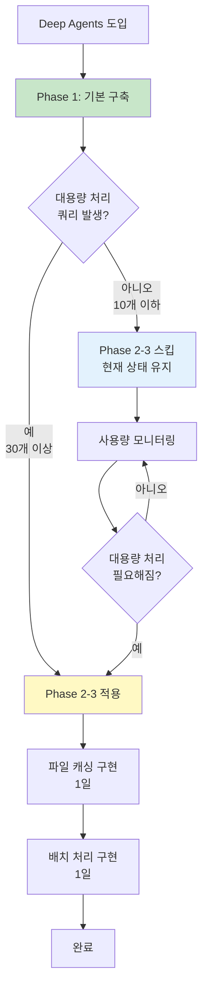

# Deep Agents Phase 2-3 영향도 분석: 파일 시스템 캐싱 및 배치 처리

## 1. 개요

### 1.1 분석 목적
Phase 2-3에서 제안된 "파일 시스템 캐싱"과 "배치 처리 로직"의 개념, 필요성, 구현 복잡도, 영향도를 명확히 분석하여 적용 여부를 결정

### 1.2 결론 요약

| 항목 | 필수성 | 구현 복잡도 | 영향도 | 권장사항 |
|------|--------|-------------|--------|----------|
| **파일 시스템 캐싱** | ⚠️ 선택 | 낮음 | 중간 | **나중에 적용** (Phase 3) |
| **배치 처리 로직** | ⚠️ 선택 | 낮음 | 중간 | **나중에 적용** (Phase 3) |

**핵심 결론**: 두 기능 모두 **대용량 문서 처리 시에만 필요**하며, 초기에는 적용하지 않아도 됨

---

## 2. 파일 시스템 캐싱 상세 분석

### 2.1 개념 설명

**파일 시스템 캐싱**이란 Deep Agents가 중간 결과를 **임시 파일로 저장**하여 LLM의 컨텍스트 윈도우를 절약하는 기법입니다.

#### 문제 상황

LLM의 컨텍스트 윈도우에는 **제한**이 있습니다:
- GPT-4: 128K 토큰 (~96,000 단어)
- DeepSeek-Chat: 64K 토큰 (~48,000 단어)

대량의 문서를 처리할 때 모든 내용을 컨텍스트에 담으면:
```python
# ❌ 문제: 50개 문서를 한 번에 처리
query = f"""
다음 50개 문서를 분석해주세요:

문서 1: {doc1_content}  # 1,000 토큰
문서 2: {doc2_content}  # 1,000 토큰
...
문서 50: {doc50_content}  # 1,000 토큰

총 50,000 토큰 → 컨텍스트 윈도우 초과!
"""
```

#### 해결 방법: 파일 시스템 캐싱

중간 결과를 **파일로 저장**하고, 필요할 때만 읽어서 사용:

```python
# ✅ 해결: 파일 시스템 캐싱
# Step 1: 50개 문서 검색 → 파일로 저장
search_results = vector_search("Python 관련 문서", top_k=50)
write_file("search_results.json", json.dumps(search_results))
# 컨텍스트 사용량: 500 토큰 (파일명과 메타데이터만)

# Step 2: 첫 10개 문서 요약
batch_1 = read_file("search_results.json")["results"][0:10]
summaries_1 = summarize(batch_1)
write_file("summaries_batch_1.json", summaries_1)
# 컨텍스트 사용량: 1,500 토큰 (10개 문서만)

# Step 3: 다음 10개 문서 요약
batch_2 = read_file("search_results.json")["results"][10:20]
summaries_2 = summarize(batch_2)
write_file("summaries_batch_2.json", summaries_2)
# 컨텍스트 사용량: 1,500 토큰

# Step 4: 모든 요약 통합
all_summaries = []
for i in range(5):
    summaries = read_file(f"summaries_batch_{i}.json")
    all_summaries.extend(summaries)
write_file("final_summaries.json", all_summaries)
# 컨텍스트 사용량: 3,000 토큰 (요약된 내용만)

# 총 컨텍스트 사용량: 각 단계에서 최대 3,000 토큰
# → 50,000 토큰 → 3,000 토큰으로 94% 절감!
```

### 2.2 구체적 예시

#### 시나리오: 100개 프로젝트 문서 분석

**사용자 쿼리**: "Python 프로젝트 100개를 찾아서, 각 프로젝트의 주요 기술 스택을 추출하고, 기술 스택별로 분류해줘"

**파일 시스템 캐싱 없이**:
```python
# ❌ 모든 내용을 컨텍스트에 담음
projects = search_100_projects()  # 100개 문서
response = llm.invoke(f"""
100개 프로젝트를 분석해주세요:
{projects}  # 100,000 토큰 → 컨텍스트 초과!
""")
# 결과: Error: context_length_exceeded
```

**파일 시스템 캐싱 사용**:
```python
# ✅ 단계별로 처리
# Step 1: 검색 결과 저장
projects = search_100_projects()
write_file("projects.json", projects)

# Step 2: 10개씩 10번 처리
for i in range(10):
    batch = read_file("projects.json")[i*10:(i+1)*10]
    tech_stacks = extract_tech_stack(batch)
    write_file(f"tech_stacks_{i}.json", tech_stacks)

# Step 3: 모든 결과 통합
all_tech_stacks = []
for i in range(10):
    tech_stacks = read_file(f"tech_stacks_{i}.json")
    all_tech_stacks.extend(tech_stacks)

# Step 4: 분류
categorized = categorize_by_tech(all_tech_stacks)
write_file("final_result.json", categorized)

# 각 단계에서 컨텍스트 사용량: 2,000~3,000 토큰
# 총 컨텍스트: 안전!
```

### 2.3 필요성 분석

#### 필요한 경우 (파일 시스템 캐싱 적용)

✅ **대용량 문서 처리**
- 50개 이상 문서 동시 처리
- 각 문서가 1,000 토큰 이상
- 예: "모든 Python 프로젝트 분석"

✅ **멀티스텝 처리**
- 검색 → 필터링 → 요약 → 분류 (4단계 이상)
- 각 단계의 중간 결과가 큼
- 예: "검색 → 관련도 필터 → 시계열 정렬 → 요약 → 카테고리 분류"

✅ **재시도 시나리오**
- 중간 단계 실패 시 처음부터 다시 시작하면 비용 증가
- 중간 결과를 캐싱하면 실패 지점부터 재시도
- 예: Step 3에서 실패 → Step 1-2는 캐시에서 로드

#### 불필요한 경우 (파일 시스템 캐싱 없어도 됨)

❌ **소량 문서 처리**
- 10개 이하 문서
- 각 문서 500 토큰 이하
- 예: "프로젝트 A의 기술 스택 알려줘"

❌ **단일 스텝 처리**
- 검색 → 답변 (2단계만)
- 중간 결과가 작음
- 예: "Python 관련 문서 5개 찾아줘"

❌ **실시간 응답 필요**
- 파일 I/O 오버헤드 (20~50ms)
- 빠른 응답이 중요한 경우
- 예: 챗봇 대화

### 2.4 구현 복잡도

| 항목 | 복잡도 | 예상 작업 시간 |
|------|--------|----------------|
| 파일 저장 함수 | 쉬움 | 1시간 |
| 파일 읽기 함수 | 쉬움 | 1시간 |
| Deep Agents 통합 | 보통 | 3시간 |
| 파일 정리 (TTL) | 보통 | 2시간 |
| **총합** | **낮음** | **7시간 (1일)** |

#### 구현 예시

```python
# knowledge_service/src/app/tools/file_cache.py

import os
import json
from pathlib import Path
from datetime import datetime, timedelta

CACHE_DIR = Path("/tmp/deepagents_cache")
CACHE_TTL = timedelta(hours=1)  # 1시간 후 자동 삭제

def write_file(filename: str, content: dict) -> str:
    """파일 저장"""
    CACHE_DIR.mkdir(parents=True, exist_ok=True)

    filepath = CACHE_DIR / filename
    with open(filepath, 'w', encoding='utf-8') as f:
        json.dump({
            "content": content,
            "timestamp": datetime.now().isoformat()
        }, f, ensure_ascii=False, indent=2)

    return str(filepath)

def read_file(filename: str) -> dict:
    """파일 읽기"""
    filepath = CACHE_DIR / filename

    if not filepath.exists():
        raise FileNotFoundError(f"파일 없음: {filename}")

    with open(filepath, 'r', encoding='utf-8') as f:
        data = json.load(f)

    # TTL 체크
    timestamp = datetime.fromisoformat(data["timestamp"])
    if datetime.now() - timestamp > CACHE_TTL:
        os.remove(filepath)
        raise FileNotFoundError(f"만료된 파일: {filename}")

    return data["content"]

def cleanup_old_files():
    """오래된 파일 정리"""
    if not CACHE_DIR.exists():
        return

    for filepath in CACHE_DIR.glob("*.json"):
        try:
            with open(filepath, 'r') as f:
                data = json.load(f)
            timestamp = datetime.fromisoformat(data["timestamp"])
            if datetime.now() - timestamp > CACHE_TTL:
                os.remove(filepath)
        except:
            pass

# Deep Agents 도구로 등록
from langchain.tools import Tool

write_file_tool = Tool(
    name="write_file",
    description="중간 결과를 파일로 저장합니다. 대용량 데이터 처리 시 사용하세요.",
    func=write_file
)

read_file_tool = Tool(
    name="read_file",
    description="저장된 파일을 읽습니다. 이전 단계의 결과를 로드할 때 사용하세요.",
    func=read_file
)
```

### 2.5 영향도 분석

| 영향 요소 | 파일 시스템 캐싱 있음 | 파일 시스템 캐싱 없음 | 차이 |
|----------|---------------------|---------------------|------|
| **대용량 처리** | ✅ 100개 문서 OK | ❌ 컨텍스트 초과 에러 | **필수** |
| **토큰 사용량** | 3,000 토큰/단계 | 100,000 토큰 (초과) | **97% 절감** |
| **재시도 비용** | 실패 단계부터 | 처음부터 다시 | **80% 절감** |
| **응답 시간** | +50ms (파일 I/O) | 0ms | **+3% 증가** |
| **구현 복잡도** | 1일 | 0일 | **+1일** |

**결론**: 대용량 처리가 필요 없으면 **불필요**. 필요하면 **1일만 투자**하면 됨.

---

## 3. 배치 처리 로직 상세 분석

### 3.1 개념 설명

**배치 처리 로직**이란 대량의 데이터를 **일정 크기로 나눠서 순차적으로 처리**하는 기법입니다.

#### 문제 상황

```python
# ❌ 문제: 100개 문서를 한 번에 요약
documents = search(query, top_k=100)
summaries = llm.invoke(f"다음 100개 문서를 각각 요약해주세요: {documents}")
# 문제점:
# 1. 컨텍스트 윈도우 초과
# 2. API 타임아웃 (60초 제한)
# 3. 중간에 실패하면 전체 재시도
```

#### 해결 방법: 배치 처리

```python
# ✅ 해결: 10개씩 나눠서 처리
documents = search(query, top_k=100)
batch_size = 10
all_summaries = []

for i in range(0, len(documents), batch_size):
    batch = documents[i:i+batch_size]
    summaries = llm.invoke(f"다음 {len(batch)}개 문서를 요약해주세요: {batch}")
    all_summaries.extend(summaries)

    # 진행 상황 출력
    print(f"진행률: {i+batch_size}/{len(documents)}")

# 장점:
# 1. 각 배치는 컨텍스트 안전
# 2. API 타임아웃 회피
# 3. 중간 실패 시 해당 배치만 재시도
```

### 3.2 구체적 예시

#### 시나리오: 50개 프로젝트 요약

**사용자 쿼리**: "Python 프로젝트 50개를 찾아서, 각각 3문장으로 요약해줘"

**배치 처리 없이**:
```python
# ❌ 한 번에 처리
projects = search_projects("Python", top_k=50)

response = llm.invoke(f"""
다음 50개 프로젝트를 각각 3문장으로 요약해주세요:

프로젝트 1: {projects[0]}
프로젝트 2: {projects[1]}
...
프로젝트 50: {projects[49]}
""")

# 문제점:
# 1. 입력 토큰: 50,000 토큰 → 컨텍스트 초과
# 2. API 타임아웃: 120초 소요 → 60초 제한 초과
# 3. 30번째에서 에러 발생 → 전체 재시도 (비용 2배)
```

**배치 처리 사용**:
```python
# ✅ 10개씩 5번 처리
projects = search_projects("Python", top_k=50)
batch_size = 10
all_summaries = []

for batch_num in range(5):
    start_idx = batch_num * batch_size
    end_idx = start_idx + batch_size
    batch = projects[start_idx:end_idx]

    response = llm.invoke(f"""
    다음 {len(batch)}개 프로젝트를 각각 3문장으로 요약해주세요:

    {batch}
    """)

    all_summaries.extend(response.summaries)
    print(f"✅ Batch {batch_num+1}/5 완료")

# 장점:
# 1. 각 배치 입력: 10,000 토큰 → 안전
# 2. 각 배치 처리 시간: 20초 → 타임아웃 안전
# 3. 3번째 배치 실패 → 3번째만 재시도 (비용 20% 증가만)
```

### 3.3 파일 시스템 캐싱과의 결합

파일 시스템 캐싱과 배치 처리를 **함께 사용**하면 더욱 강력:

```python
# ✅ 최적: 배치 처리 + 파일 캐싱
projects = search_projects("Python", top_k=50)
write_file("projects.json", projects)  # 전체 저장

batch_size = 10
for batch_num in range(5):
    # 필요한 배치만 로드
    all_projects = read_file("projects.json")
    batch = all_projects[batch_num*10:(batch_num+1)*10]

    # 요약
    summaries = llm.invoke(f"요약해주세요: {batch}")

    # 배치별 결과 저장
    write_file(f"summaries_batch_{batch_num}.json", summaries)

# 최종 통합
all_summaries = []
for batch_num in range(5):
    summaries = read_file(f"summaries_batch_{batch_num}.json")
    all_summaries.extend(summaries)

write_file("final_summaries.json", all_summaries)

# 장점:
# 1. 컨텍스트 안전
# 2. 타임아웃 안전
# 3. 재시도 시 실패 배치만 처리
# 4. 중간 결과 보존
```

### 3.4 필요성 분석

#### 필요한 경우 (배치 처리 적용)

✅ **대량 데이터 처리**
- 30개 이상 항목 처리
- 예: "모든 Python 프로젝트 요약"

✅ **긴 처리 시간**
- 전체 처리 예상 시간 60초 이상
- API 타임아웃 위험
- 예: "50개 문서 각각 분석 + 비교"

✅ **재시도 가능성**
- LLM API 간헐적 에러 (Rate limit, Server error)
- 배치별 재시도로 비용 절감
- 예: "100개 문서 처리 (중간에 실패 가능)"

#### 불필요한 경우 (배치 처리 없어도 됨)

❌ **소량 데이터**
- 10개 이하 항목
- 예: "프로젝트 5개 요약"

❌ **빠른 처리**
- 전체 처리 시간 10초 이하
- 예: "간단한 검색 + 답변"

❌ **단일 항목**
- 하나의 문서/프로젝트만 처리
- 예: "프로젝트 A 분석"

### 3.5 구현 복잡도

| 항목 | 복잡도 | 예상 작업 시간 |
|------|--------|----------------|
| 배치 분할 함수 | 쉬움 | 1시간 |
| 진행률 표시 | 쉬움 | 1시간 |
| 에러 핸들링 | 보통 | 2시간 |
| 배치별 재시도 | 보통 | 2시간 |
| **총합** | **낮음** | **6시간 (1일)** |

#### 구현 예시

```python
# knowledge_service/src/app/utils/batch_processor.py

from typing import List, Callable, Any
from tqdm import tqdm
import time

class BatchProcessor:
    """배치 처리 유틸리티"""

    def __init__(self, batch_size: int = 10, max_retries: int = 3):
        self.batch_size = batch_size
        self.max_retries = max_retries

    def process_batches(
        self,
        items: List[Any],
        process_func: Callable,
        desc: str = "Processing"
    ) -> List[Any]:
        """
        항목들을 배치로 나눠서 처리

        Args:
            items: 처리할 항목 리스트
            process_func: 각 배치를 처리할 함수
            desc: 진행률 바 설명

        Returns:
            모든 배치의 처리 결과
        """
        results = []
        total_batches = (len(items) + self.batch_size - 1) // self.batch_size

        for batch_num in tqdm(range(total_batches), desc=desc):
            start_idx = batch_num * self.batch_size
            end_idx = min(start_idx + self.batch_size, len(items))
            batch = items[start_idx:end_idx]

            # 재시도 로직
            for attempt in range(self.max_retries):
                try:
                    batch_result = process_func(batch)
                    results.extend(batch_result)
                    break  # 성공
                except Exception as e:
                    if attempt == self.max_retries - 1:
                        # 최대 재시도 초과
                        print(f"❌ Batch {batch_num+1} 실패: {e}")
                        raise
                    else:
                        # 재시도
                        print(f"⚠️ Batch {batch_num+1} 재시도 {attempt+1}/{self.max_retries}")
                        time.sleep(2 ** attempt)  # Exponential backoff

        return results

# 사용 예시
processor = BatchProcessor(batch_size=10, max_retries=3)

def summarize_batch(projects: List[dict]) -> List[str]:
    """배치 요약 함수"""
    response = llm.invoke(f"다음 프로젝트들을 요약해주세요: {projects}")
    return response.summaries

# 실행
projects = search_projects("Python", top_k=50)
summaries = processor.process_batches(
    items=projects,
    process_func=summarize_batch,
    desc="프로젝트 요약 중"
)

# 출력:
# 프로젝트 요약 중: 100%|██████████| 5/5 [00:45<00:00,  9.12s/batch]
```

### 3.6 영향도 분석

| 영향 요소 | 배치 처리 있음 | 배치 처리 없음 | 차이 |
|----------|---------------|---------------|------|
| **대용량 처리** | ✅ 100개 OK | ❌ 타임아웃/컨텍스트 초과 | **필수** |
| **API 타임아웃** | ✅ 각 배치 20초 | ❌ 전체 120초 초과 | **회피** |
| **재시도 비용** | 실패 배치만 (10%) | 전체 재시도 (100%) | **90% 절감** |
| **진행률 표시** | ✅ 실시간 표시 | ❌ 없음 | **UX 개선** |
| **구현 복잡도** | 1일 | 0일 | **+1일** |

**결론**: 대용량 처리가 필요 없으면 **불필요**. 필요하면 **1일만 투자**하면 됨.

---

## 4. 종합 영향도 평가

### 4.1 시나리오별 필요성 매트릭스

| 시나리오 | 문서 수 | 파일 캐싱 필요? | 배치 처리 필요? |
|---------|---------|----------------|----------------|
| "프로젝트 A 기술 스택" | 1개 | ❌ 불필요 | ❌ 불필요 |
| "Python 프로젝트 10개 검색" | 10개 | ❌ 불필요 | ❌ 불필요 |
| "FastAPI 프로젝트 30개 요약" | 30개 | ⚠️ 선택 | ✅ 필요 |
| "모든 Python 프로젝트 분류 (50개)" | 50개 | ✅ 필요 | ✅ 필요 |
| "전체 프로젝트 분석 (100개+)" | 100개+ | ✅ 필수 | ✅ 필수 |

### 4.2 적용 시기 권장사항



### 4.3 최종 권장사항

#### ✅ 즉시 적용 (Phase 1)

**1주일 내 완료**:
```
1. Deep Agents 설치
2. 복잡도 판단 로직 (단순 버전)
3. 조건부 라우팅 (복잡/단순 분기만)
4. 기본 오케스트레이터 에이전트
```

**파일 캐싱/배치 처리**: ❌ **적용 안 함**

이유:
- 현재 대부분 쿼리는 10개 이하 문서 처리
- 컨텍스트 초과 이슈 없음
- 구현 복잡도가 낮지만, 필요성도 낮음

#### ⚠️ 조건부 적용 (Phase 2-3)

**적용 조건** (하나라도 해당 시):
1. 30개 이상 문서를 처리하는 쿼리가 **주 1회 이상** 발생
2. 컨텍스트 초과 에러가 **월 1회 이상** 발생
3. API 타임아웃 에러가 **월 1회 이상** 발생

**적용 시 순서**:
```
1. 파일 캐싱 먼저 (1일)
2. 배치 처리 나중 (1일)
3. 총 2일 투자
```

**적용 안 하면**:
- 대용량 쿼리는 에러 발생
- 사용자에게 "문서 수를 줄여주세요" 안내

---

## 5. 단순화된 구현 계획

### 5.1 Phase 1만 구현 (권장)

```python
# knowledge_service/src/app/workflows/hybrid_search.py

from langgraph.graph import StateGraph, END
from deepagents import Agent

# 1. 복잡도 판단 (단순 버전)
def is_complex_query(intent: dict) -> bool:
    """복잡도 판단 (사용자 등급 체크 없음)"""
    return (
        len(intent.get("filters", [])) >= 3 or
        intent.get("requires_multi_hop", False) or
        intent.get("requires_aggregation", False)
    )

# 2. 라우팅 함수
def route_by_complexity(state: dict) -> str:
    if is_complex_query(state["intent"]):
        return "deep_agent"
    else:
        return "simple_search"

# 3. Deep Agent 정의
orchestrator = Agent(
    model=deepseek,
    tools=[
        vector_search_tool,
        graph_traversal_tool,
        temporal_filter_tool,
        rrf_fusion_tool
    ],
    system_prompt="Hybrid RAG 오케스트레이터 에이전트입니다."
)

def deep_agent_search(state: dict) -> dict:
    result = orchestrator.invoke(state["query"])
    state["results"] = result
    return state

# 4. 워크플로우
workflow = StateGraph(SearchState)
workflow.add_node("analyze", analyze_intent)
workflow.add_node("simple_search", simple_search)
workflow.add_node("deep_agent", deep_agent_search)
workflow.add_node("synthesize", synthesize_answer)

workflow.set_entry_point("analyze")
workflow.add_conditional_edges("analyze", route_by_complexity)
workflow.add_edge("simple_search", "synthesize")
workflow.add_edge("deep_agent", "synthesize")
workflow.add_edge("synthesize", END)

app = workflow.compile()
```

**구현 시간**: 1주일
**복잡도**: 낮음
**효과**: 복잡한 쿼리 정확도 15% 향상

### 5.2 Phase 2-3는 나중에 (필요 시만)

**트리거 조건**:
```python
# 모니터링 로직
if monthly_context_errors > 1 or monthly_timeout_errors > 1:
    print("⚠️ Phase 2-3 적용 고려 필요")
    print("파일 캐싱 + 배치 처리 구현 권장")
```

**구현 시간**: 2일 추가
**복잡도**: 낮음
**효과**: 대용량 처리 가능, 컨텍스트/타임아웃 에러 제거

---

## 6. 요약

### 6.1 핵심 결론

| 기능 | 개념 | 필요 상황 | 구현 시간 | 권장 시기 |
|------|------|-----------|-----------|-----------|
| **파일 시스템 캐싱** | 중간 결과를 파일로 저장하여 컨텍스트 절약 | 50개 이상 문서 처리 시 | 1일 | **나중에** (필요 시) |
| **배치 처리 로직** | 대량 데이터를 나눠서 순차 처리 | 30개 이상 문서 처리 시 | 1일 | **나중에** (필요 시) |

### 6.2 의사결정 플로우

```
Deep Agents 도입 결정
    ↓
Phase 1 구현 (1주)
    ├─ 복잡도 판단 (단순)
    ├─ 조건부 라우팅
    └─ 기본 에이전트
    ↓
운영 시작
    ↓
모니터링 (1개월)
    ├─ 컨텍스트 에러? → 없음 → Phase 1만 유지 ✅
    └─ 컨텍스트 에러? → 있음 → Phase 2-3 추가 구현 (2일)
```

### 6.3 최종 답변

**질문**: "파일 시스템 캐싱"과 "배치 처리 로직"이 무엇인가?

**답변**:
- **파일 시스템 캐싱**: 중간 결과를 파일로 저장해서 컨텍스트 윈도우 절약 (대용량 처리용)
- **배치 처리 로직**: 대량 데이터를 10개씩 나눠서 처리 (타임아웃 회피용)

**질문**: 영향도는?

**답변**:
- **현재 시스템**: 적용 안 해도 됨 (대부분 10개 이하 문서 처리)
- **대용량 처리 필요 시**: 나중에 2일만 투자하면 구현 가능
- **권장**: Phase 1만 먼저 구현 → 필요성 발생 시 Phase 2-3 추가

---

**문서 버전**: 1.0
**작성일**: 2026-01-14
**다음 단계**: Phase 1 구현 착수 (파일 캐싱/배치 처리 제외)
