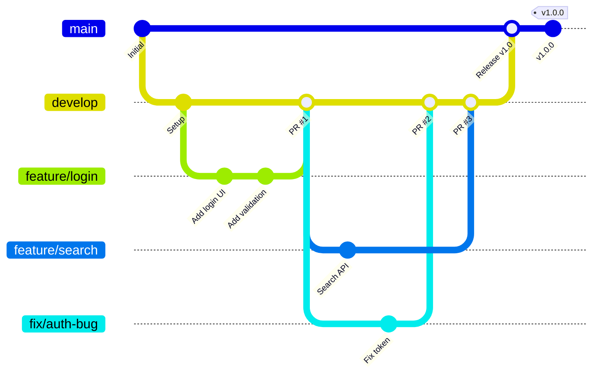
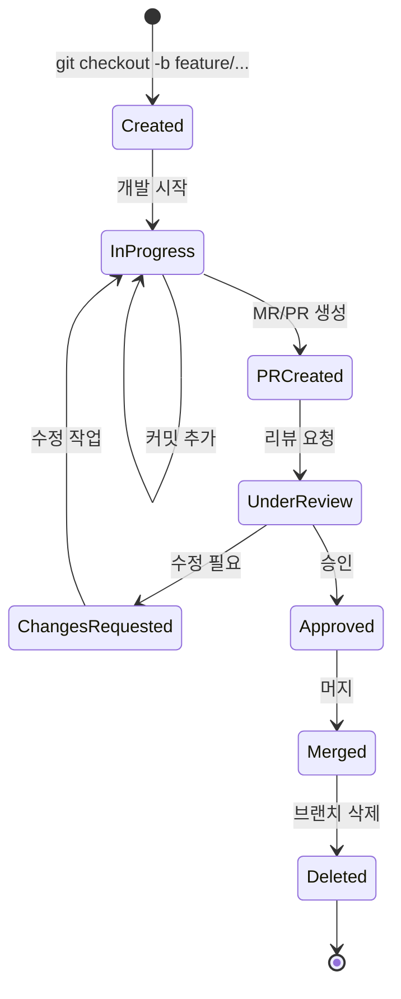
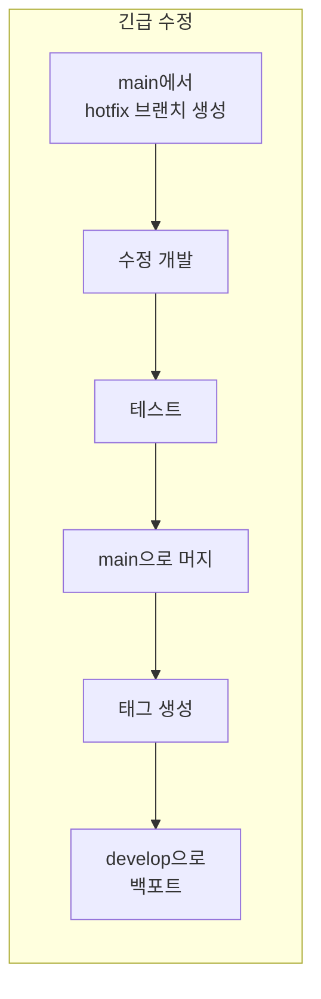
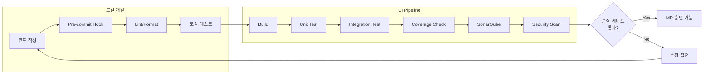
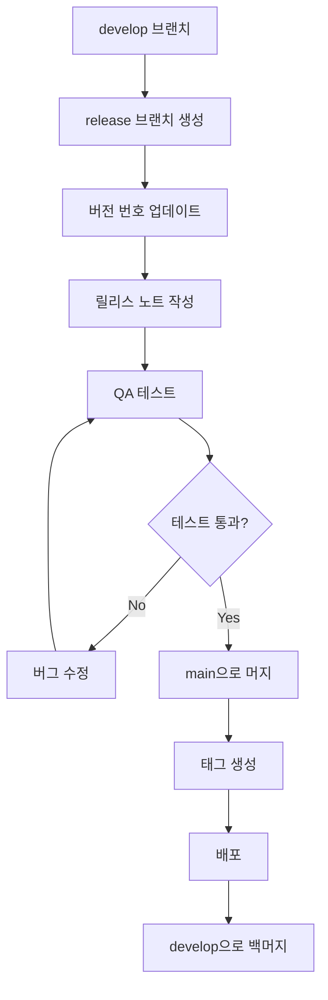

# DevOps 상세 설계서

---

## 문서 정보

| 항목 | 내용 |
|------|------|
| **문서명** | DevOps 상세 설계서 |
| **버전** | 1.0 |
| **작성일** | 2026-01-16 |
| **작성자** | Claude Code (Opus 4.5) |
| **상태** | Draft |
| **관련 문서** | [인프라 설계서](./infrastructure_detailed_design.md), [백엔드 설계서](./backend_detailed_design.md), [프론트엔드 설계서](./frontend_detailed_design.md), [용어집](./glossary.md), [에러코드 표준](./error_code_standards.md) |

---

## 변경 이력

| 버전 | 일자 | 작성자 | 변경 내용 |
|------|------|--------|----------|
| 1.0 | 2026-01-16 | Claude Code | 초안 작성 |

---

## 목차

1. [개요](#1-개요)
2. [Git 브랜치 전략](#2-git-브랜치-전략)
3. [Git 워크플로우](#3-git-워크플로우)
4. [빌드 시스템](#4-빌드-시스템)
5. [코드 품질 관리](#5-코드-품질-관리)
6. [개발 환경 설정](#6-개발-환경-설정)
7. [환경 및 시크릿 관리](#7-환경-및-시크릿-관리)
8. [릴리스 관리](#8-릴리스-관리)
9. [개발자 온보딩 가이드](#9-개발자-온보딩-가이드)
10. [트러블슈팅 가이드](#10-트러블슈팅-가이드)

---

## 1. 개요

### 1.1 문서 목적

본 문서는 Hybrid RAG Knowledge Platform의 개발, 빌드, 배포 프로세스를 정의합니다. 개발자가 일관된 방식으로 협업하고, 코드 품질을 유지하며, 안정적으로 릴리스할 수 있도록 다음 내용을 포함합니다:

- Git 브랜치 전략 및 워크플로우
- 빌드 시스템 구성
- 코드 품질 관리 도구 및 프로세스
- 개발 환경 설정 가이드
- 릴리스 및 버전 관리

### 1.2 관련 문서 참조

| 영역 | 참조 문서 | 설명 |
|------|----------|------|
| CI/CD 파이프라인 | [인프라 설계서 9장](./infrastructure_detailed_design.md#9-cicd-파이프라인) | GitLab CI/CD 설정 |
| 테스트 전략 | [백엔드 설계서 16장](./backend_detailed_design.md#16-테스트-전략) | 단위/통합 테스트 |
| 프론트엔드 테스트 | [프론트엔드 설계서 13장](./frontend_detailed_design.md#13-테스트-전략) | React 테스트 |
| 보안 테스트 | [암호화 설계서 10장](./data_encryption_design.md#10-테스트-전략) | 암호화 테스트 |

### 1.3 기술 스택 요약

| 영역 | 도구 | 버전 | 용도 |
|------|------|------|------|
| **버전 관리** | Git | 2.40+ | 소스 코드 관리 |
| **Git 호스팅** | GitLab | 16.x | Repository, CI/CD |
| **백엔드 빌드** | Gradle | 8.x | Java/Kotlin 빌드 |
| **프론트엔드 빌드** | npm/Vite | npm 10.x, Vite 5.x | React 빌드 |
| **Python 패키지** | Poetry | 1.7+ | Python 의존성 관리 |
| **컨테이너** | Docker | 24.x | 컨테이너화 |
| **코드 품질** | SonarQube | 10.x | 정적 분석 |

---

## 2. Git 브랜치 전략

### 2.1 브랜치 구조

```
main (protected)
 └── develop
      ├── feature/ISSUE-123-login-page
      ├── feature/ISSUE-124-search-api
      └── fix/ISSUE-125-auth-bug
```



### 2.2 브랜치 유형 및 명명 규칙

| 브랜치 유형 | 패턴 | 용도 | 베이스 | 머지 대상 |
|------------|------|------|--------|----------|
| **main** | `main` | 프로덕션 릴리스 | - | - |
| **develop** | `develop` | 개발 통합 | main | main |
| **feature** | `feature/ISSUE-{번호}-{설명}` | 새 기능 개발 | develop | develop |
| **fix** | `fix/ISSUE-{번호}-{설명}` | 버그 수정 | develop | develop |
| **hotfix** | `hotfix/ISSUE-{번호}-{설명}` | 긴급 프로덕션 수정 | main | main, develop |
| **release** | `release/v{버전}` | 릴리스 준비 | develop | main, develop |

### 2.3 브랜치 명명 예시

```bash
# 좋은 예시
feature/ISSUE-123-user-authentication
feature/ISSUE-124-search-pagination
fix/ISSUE-125-jwt-token-refresh
hotfix/ISSUE-200-critical-security-fix
release/v1.2.0

# 나쁜 예시 (지양)
feature/login          # 이슈 번호 없음
my-feature            # 타입 prefix 없음
Feature/ISSUE-123     # 대문자 사용
fix/bug               # 설명이 모호함
```

### 2.4 브랜치 보호 규칙

#### main 브랜치 보호

```yaml
# GitLab Protected Branch Settings
main:
  allowed_to_push: []           # 직접 푸시 금지
  allowed_to_merge:
    - role: maintainer          # Maintainer만 머지 가능
  require_code_owner_reviews: true
  required_approvals: 2         # 최소 2명 승인
  require_status_checks:
    - build
    - test
    - security-scan
```

#### develop 브랜치 보호

```yaml
develop:
  allowed_to_push: []           # 직접 푸시 금지
  allowed_to_merge:
    - role: developer           # Developer 이상 머지 가능
  required_approvals: 1         # 최소 1명 승인
  require_status_checks:
    - build
    - test
```

### 2.5 브랜치 생명주기



---

## 3. Git 워크플로우

### 3.1 기능 개발 워크플로우

```bash
# 1. develop 브랜치 최신화
git checkout develop
git pull origin develop

# 2. 기능 브랜치 생성
git checkout -b feature/ISSUE-123-user-login

# 3. 개발 및 커밋
git add .
git commit -m "[FEAT] 로그인 폼 UI 구현

- 이메일/비밀번호 입력 필드 추가
- 폼 유효성 검증 로직 구현
- 로그인 버튼 클릭 핸들러 추가

관련 이슈: #123"

# 4. 원격 브랜치로 푸시
git push -u origin feature/ISSUE-123-user-login

# 5. Merge Request 생성 (GitLab Web UI)
```

### 3.2 커밋 메시지 규칙

#### 형식

```
[TYPE] 제목 (50자 이내)

본문 (선택사항, 72자 줄바꿈)
- 변경 사항 1
- 변경 사항 2

Footer (선택사항)
관련 이슈: #123
Co-Authored-By: Name <email>
```

#### 커밋 타입

| 타입 | 의미 | 예시 |
|------|------|------|
| `[FEAT]` | 새로운 기능 | 로그인 기능 추가 |
| `[FIX]` | 버그 수정 | 토큰 만료 오류 수정 |
| `[REFACTOR]` | 리팩토링 | 인증 로직 분리 |
| `[STYLE]` | 코드 스타일 | 포맷팅, 세미콜론 |
| `[TEST]` | 테스트 | 단위 테스트 추가 |
| `[DOCS]` | 문서 | README 업데이트 |
| `[CHORE]` | 기타 | 빌드 스크립트 수정 |
| `[PERF]` | 성능 개선 | 쿼리 최적화 |
| `[SECURITY]` | 보안 | XSS 취약점 패치 |

#### 커밋 메시지 예시

```bash
# 좋은 예시
git commit -m "[FEAT] 사용자 검색 자동완성 기능 구현

- Elasticsearch 기반 자동완성 API 추가
- 디바운스 적용 (300ms)
- 최근 검색어 캐싱 (Redis)

관련 이슈: #145"

# 나쁜 예시
git commit -m "fix"
git commit -m "update code"
git commit -m "WIP"
```

### 3.3 Merge Request 프로세스

#### MR 템플릿

```markdown
## 개요
<!-- 변경 사항을 간략히 설명하세요 -->

## 변경 유형
- [ ] 새 기능 (Feature)
- [ ] 버그 수정 (Bug Fix)
- [ ] 리팩토링 (Refactoring)
- [ ] 문서 (Documentation)
- [ ] 테스트 (Test)
- [ ] 기타 (Other)

## 관련 이슈
- Closes #123

## 변경 내용
<!-- 상세한 변경 내용을 기술하세요 -->
-
-

## 테스트 체크리스트
- [ ] 단위 테스트 통과
- [ ] 통합 테스트 통과
- [ ] 로컬 환경에서 수동 테스트 완료
- [ ] 새로운 테스트 케이스 추가 (해당 시)

## 리뷰 포인트
<!-- 리뷰어가 특히 집중해야 할 부분을 명시하세요 -->
-

## 스크린샷 (UI 변경 시)
<!-- UI 변경이 있다면 스크린샷을 첨부하세요 -->
```

#### 코드 리뷰 체크리스트

```markdown
## 리뷰어 체크리스트

### 코드 품질
- [ ] 코드가 명확하고 이해하기 쉬운가?
- [ ] 함수/메서드가 단일 책임을 가지는가?
- [ ] 중복 코드가 없는가?
- [ ] 적절한 에러 처리가 되어 있는가?

### 보안
- [ ] 입력값 검증이 적절한가?
- [ ] 민감 정보가 노출되지 않는가?
- [ ] SQL Injection, XSS 취약점이 없는가?

### 테스트
- [ ] 테스트 커버리지가 충분한가?
- [ ] 엣지 케이스가 고려되었는가?

### 문서화
- [ ] 코드에 적절한 주석이 있는가?
- [ ] API 변경 시 문서가 업데이트되었는가?

### 성능
- [ ] N+1 쿼리 문제가 없는가?
- [ ] 불필요한 API 호출이 없는가?
```

### 3.4 핫픽스 프로세스



```bash
# 1. main에서 hotfix 브랜치 생성
git checkout main
git pull origin main
git checkout -b hotfix/ISSUE-200-critical-fix

# 2. 수정 및 커밋
git add .
git commit -m "[SECURITY] SQL Injection 취약점 긴급 패치

관련 이슈: #200"

# 3. main으로 머지 (MR 생성 후)
git checkout main
git merge hotfix/ISSUE-200-critical-fix

# 4. 태그 생성
git tag -a v1.0.1 -m "Hotfix: SQL Injection patch"
git push origin v1.0.1

# 5. develop으로 백포트
git checkout develop
git merge hotfix/ISSUE-200-critical-fix
git push origin develop

# 6. hotfix 브랜치 삭제
git branch -d hotfix/ISSUE-200-critical-fix
git push origin --delete hotfix/ISSUE-200-critical-fix
```

---

## 4. 빌드 시스템

### 4.1 프로젝트 구조

```
hybrid-rag-knowledge-ops/
├── backend/                          # SpringBoot Backend
│   ├── build.gradle.kts              # Gradle Kotlin DSL
│   ├── settings.gradle.kts
│   ├── gradle/
│   │   └── wrapper/
│   └── src/
├── frontend/                         # React Frontend
│   ├── package.json
│   ├── vite.config.ts
│   ├── tsconfig.json
│   └── src/
├── ai-service/                       # Python AI Service
│   ├── pyproject.toml                # Poetry 설정
│   ├── poetry.lock
│   └── src/
└── docker-compose.yml
```

### 4.2 Backend 빌드 (Gradle)

#### build.gradle.kts

```kotlin
// backend/build.gradle.kts
plugins {
    id("org.springframework.boot") version "3.2.2"
    id("io.spring.dependency-management") version "1.1.4"
    id("org.sonarqube") version "4.4.1.3373"
    id("jacoco")
    kotlin("jvm") version "1.9.22"
    kotlin("plugin.spring") version "1.9.22"
    kotlin("plugin.jpa") version "1.9.22"
}

group = "com.knowledge"
version = "1.0.0-SNAPSHOT"

java {
    sourceCompatibility = JavaVersion.VERSION_17
}

repositories {
    mavenCentral()
}

dependencies {
    // Spring Boot
    implementation("org.springframework.boot:spring-boot-starter-web")
    implementation("org.springframework.boot:spring-boot-starter-data-jpa")
    implementation("org.springframework.boot:spring-boot-starter-security")
    implementation("org.springframework.boot:spring-boot-starter-validation")
    implementation("org.springframework.boot:spring-boot-starter-cache")
    implementation("org.springframework.boot:spring-boot-starter-actuator")

    // Database
    runtimeOnly("org.postgresql:postgresql")
    implementation("org.springframework.data:spring-data-elasticsearch")

    // Kotlin
    implementation("com.fasterxml.jackson.module:jackson-module-kotlin")
    implementation("org.jetbrains.kotlin:kotlin-reflect")

    // Resilience
    implementation("io.github.resilience4j:resilience4j-spring-boot3:2.2.0")

    // Test
    testImplementation("org.springframework.boot:spring-boot-starter-test")
    testImplementation("org.springframework.security:spring-security-test")
    testImplementation("org.testcontainers:postgresql:1.19.3")
    testImplementation("org.testcontainers:junit-jupiter:1.19.3")
    testImplementation("io.mockk:mockk:1.13.9")
}

// Jacoco 설정
jacoco {
    toolVersion = "0.8.11"
}

tasks.jacocoTestReport {
    dependsOn(tasks.test)
    reports {
        xml.required.set(true)
        html.required.set(true)
    }
}

tasks.jacocoTestCoverageVerification {
    violationRules {
        rule {
            limit {
                minimum = "0.80".toBigDecimal()  // 80% 커버리지
            }
        }
    }
}

// SonarQube 설정
sonarqube {
    properties {
        property("sonar.projectKey", "knowledge-platform-backend")
        property("sonar.projectName", "Knowledge Platform Backend")
        property("sonar.host.url", System.getenv("SONAR_HOST_URL") ?: "http://localhost:9000")
        property("sonar.login", System.getenv("SONAR_TOKEN") ?: "")
        property("sonar.sources", "src/main")
        property("sonar.tests", "src/test")
        property("sonar.coverage.jacoco.xmlReportPaths", "build/reports/jacoco/test/jacocoTestReport.xml")
    }
}

// 테스트 설정
tasks.test {
    useJUnitPlatform()
    finalizedBy(tasks.jacocoTestReport)
}

// 빌드 태스크
tasks.register("buildAll") {
    dependsOn("clean", "build", "jacocoTestReport")
    description = "Clean, build, test, and generate coverage report"
}
```

#### Gradle 명령어

```bash
# 빌드
./gradlew build

# 테스트만 실행
./gradlew test

# 커버리지 리포트 생성
./gradlew jacocoTestReport

# 커버리지 검증 (80% 미만 시 실패)
./gradlew jacocoTestCoverageVerification

# SonarQube 분석
./gradlew sonarqube

# 전체 빌드 (clean + build + coverage)
./gradlew buildAll

# 의존성 업데이트 확인
./gradlew dependencyUpdates

# 실행 가능한 JAR 생성
./gradlew bootJar
```

### 4.3 Frontend 빌드 (npm/Vite)

#### package.json

```json
{
  "name": "knowledge-platform-frontend",
  "version": "1.0.0",
  "type": "module",
  "scripts": {
    "dev": "vite",
    "build": "tsc && vite build",
    "build:staging": "vite build --mode staging",
    "build:production": "vite build --mode production",
    "preview": "vite preview",
    "test": "vitest",
    "test:coverage": "vitest run --coverage",
    "test:ui": "vitest --ui",
    "test:e2e": "playwright test",
    "lint": "eslint . --ext ts,tsx --report-unused-disable-directives --max-warnings 0",
    "lint:fix": "eslint . --ext ts,tsx --fix",
    "format": "prettier --write \"src/**/*.{ts,tsx,css,json}\"",
    "format:check": "prettier --check \"src/**/*.{ts,tsx,css,json}\"",
    "typecheck": "tsc --noEmit",
    "prepare": "husky install",
    "analyze": "vite-bundle-visualizer"
  },
  "dependencies": {
    "react": "^18.2.0",
    "react-dom": "^18.2.0",
    "react-router-dom": "^6.21.0",
    "@tanstack/react-query": "^5.17.0",
    "zustand": "^4.4.7",
    "axios": "^1.6.5",
    "clsx": "^2.1.0",
    "tailwind-merge": "^2.2.0"
  },
  "devDependencies": {
    "@types/react": "^18.2.48",
    "@types/react-dom": "^18.2.18",
    "@typescript-eslint/eslint-plugin": "^6.19.0",
    "@typescript-eslint/parser": "^6.19.0",
    "@vitejs/plugin-react": "^4.2.1",
    "@vitest/coverage-v8": "^1.2.0",
    "@vitest/ui": "^1.2.0",
    "@playwright/test": "^1.41.0",
    "eslint": "^8.56.0",
    "eslint-plugin-react": "^7.33.2",
    "eslint-plugin-react-hooks": "^4.6.0",
    "eslint-plugin-jsx-a11y": "^6.8.0",
    "husky": "^8.0.3",
    "lint-staged": "^15.2.0",
    "prettier": "^3.2.4",
    "typescript": "^5.3.3",
    "vite": "^5.0.11",
    "vitest": "^1.2.0"
  },
  "lint-staged": {
    "*.{ts,tsx}": [
      "eslint --fix",
      "prettier --write"
    ],
    "*.{css,json,md}": [
      "prettier --write"
    ]
  }
}
```

#### npm 명령어

```bash
# 의존성 설치
npm install

# 개발 서버 실행
npm run dev

# 프로덕션 빌드
npm run build:production

# 테스트 실행
npm run test

# 커버리지 리포트
npm run test:coverage

# E2E 테스트
npm run test:e2e

# 린트 검사
npm run lint

# 포맷팅
npm run format

# 타입 체크
npm run typecheck
```

### 4.4 AI Service 빌드 (Poetry)

#### pyproject.toml

```toml
[tool.poetry]
name = "knowledge-ai-service"
version = "1.0.0"
description = "Hybrid RAG Knowledge Platform AI Service"
authors = ["Knowledge Platform Team <team@company.com>"]
readme = "README.md"

[tool.poetry.dependencies]
python = "^3.11"
fastapi = "^0.109.0"
uvicorn = {extras = ["standard"], version = "^0.27.0"}
langchain = "^0.1.4"
langgraph = "^0.0.20"
openai = "^1.9.0"
elasticsearch = "^8.12.0"
neo4j = "^5.16.0"
redis = "^5.0.1"
pydantic = "^2.5.3"
pydantic-settings = "^2.1.0"
python-jose = {extras = ["cryptography"], version = "^3.3.0"}
httpx = "^0.26.0"

[tool.poetry.group.dev.dependencies]
pytest = "^8.0.0"
pytest-asyncio = "^0.23.3"
pytest-cov = "^4.1.0"
black = "^24.1.1"
isort = "^5.13.2"
mypy = "^1.8.0"
ruff = "^0.1.14"
pre-commit = "^3.6.0"

[tool.black]
line-length = 100
target-version = ["py311"]
include = '\.pyi?$'
exclude = '''
/(
    \.git
    | \.mypy_cache
    | \.pytest_cache
    | \.venv
    | __pycache__
)/
'''

[tool.isort]
profile = "black"
line_length = 100
known_first_party = ["app"]

[tool.mypy]
python_version = "3.11"
strict = true
ignore_missing_imports = true

[tool.ruff]
line-length = 100
select = ["E", "F", "W", "I", "N", "B", "C4"]
ignore = ["E501"]

[tool.pytest.ini_options]
asyncio_mode = "auto"
testpaths = ["tests"]
addopts = "-v --cov=app --cov-report=xml --cov-report=html"

[tool.coverage.run]
source = ["app"]
omit = ["tests/*", "*/__pycache__/*"]

[tool.coverage.report]
fail_under = 80
show_missing = true

[build-system]
requires = ["poetry-core"]
build-backend = "poetry.core.masonry.api"
```

#### Poetry 명령어

```bash
# 의존성 설치
poetry install

# 개발 서버 실행
poetry run uvicorn app.main:app --reload --host 0.0.0.0 --port 8000

# 테스트 실행
poetry run pytest

# 커버리지 리포트
poetry run pytest --cov=app --cov-report=html

# 코드 포맷팅
poetry run black .
poetry run isort .

# 린트 검사
poetry run ruff check .
poetry run mypy app

# 의존성 업데이트
poetry update

# 의존성 트리 확인
poetry show --tree
```

---

## 5. 코드 품질 관리

### 5.1 코드 품질 게이트



### 5.2 품질 기준

| 지표 | 기준 | 도구 |
|------|------|------|
| **코드 커버리지** | >= 80% | Jacoco, Jest, pytest-cov |
| **중복 코드** | < 3% | SonarQube |
| **복잡도** | Cyclomatic < 10 | SonarQube |
| **보안 취약점** | Critical/High = 0 | SonarQube, Trivy |
| **코드 스멜** | Blocker/Critical = 0 | SonarQube |
| **기술 부채** | < 5% | SonarQube |

### 5.3 Pre-commit Hook 설정

#### .pre-commit-config.yaml

```yaml
# .pre-commit-config.yaml
repos:
  # Python hooks
  - repo: https://github.com/psf/black
    rev: 24.1.1
    hooks:
      - id: black
        language_version: python3.11

  - repo: https://github.com/pycqa/isort
    rev: 5.13.2
    hooks:
      - id: isort

  - repo: https://github.com/astral-sh/ruff-pre-commit
    rev: v0.1.14
    hooks:
      - id: ruff
        args: [--fix]

  - repo: https://github.com/pre-commit/mirrors-mypy
    rev: v1.8.0
    hooks:
      - id: mypy
        additional_dependencies: [types-all]

  # General hooks
  - repo: https://github.com/pre-commit/pre-commit-hooks
    rev: v4.5.0
    hooks:
      - id: trailing-whitespace
      - id: end-of-file-fixer
      - id: check-yaml
      - id: check-json
      - id: check-added-large-files
        args: ['--maxkb=1000']
      - id: detect-private-key
      - id: check-merge-conflict

  # Commit message
  - repo: https://github.com/commitizen-tools/commitizen
    rev: v3.13.0
    hooks:
      - id: commitizen
        stages: [commit-msg]
```

#### Husky 설정 (Frontend)

```bash
# .husky/pre-commit
#!/usr/bin/env sh
. "$(dirname -- "$0")/_/husky.sh"

npx lint-staged
```

```bash
# .husky/commit-msg
#!/usr/bin/env sh
. "$(dirname -- "$0")/_/husky.sh"

# 커밋 메시지 형식 검증
commit_msg=$(cat "$1")
pattern="^\[(FEAT|FIX|REFACTOR|STYLE|TEST|DOCS|CHORE|PERF|SECURITY)\] .{1,50}"

if ! echo "$commit_msg" | grep -qE "$pattern"; then
    echo "❌ 커밋 메시지 형식이 올바르지 않습니다."
    echo ""
    echo "올바른 형식: [TYPE] 설명 (50자 이내)"
    echo "예시: [FEAT] 로그인 폼 유효성 검증 추가"
    echo ""
    echo "사용 가능한 TYPE:"
    echo "  FEAT, FIX, REFACTOR, STYLE, TEST, DOCS, CHORE, PERF, SECURITY"
    exit 1
fi
```

### 5.4 ESLint 설정 (Frontend)

```javascript
// .eslintrc.cjs
module.exports = {
  root: true,
  env: {
    browser: true,
    es2022: true,
    node: true,
  },
  extends: [
    'eslint:recommended',
    'plugin:@typescript-eslint/recommended',
    'plugin:@typescript-eslint/recommended-requiring-type-checking',
    'plugin:react/recommended',
    'plugin:react-hooks/recommended',
    'plugin:jsx-a11y/recommended',
    'prettier',
  ],
  parser: '@typescript-eslint/parser',
  parserOptions: {
    ecmaVersion: 'latest',
    sourceType: 'module',
    project: ['./tsconfig.json'],
    ecmaFeatures: {
      jsx: true,
    },
  },
  plugins: ['@typescript-eslint', 'react', 'react-hooks', 'jsx-a11y'],
  settings: {
    react: {
      version: 'detect',
    },
  },
  rules: {
    // TypeScript
    '@typescript-eslint/explicit-function-return-type': 'warn',
    '@typescript-eslint/no-unused-vars': ['error', { argsIgnorePattern: '^_' }],
    '@typescript-eslint/no-explicit-any': 'error',

    // React
    'react/react-in-jsx-scope': 'off',
    'react/prop-types': 'off',
    'react-hooks/rules-of-hooks': 'error',
    'react-hooks/exhaustive-deps': 'warn',

    // Accessibility
    'jsx-a11y/anchor-is-valid': 'warn',

    // General
    'no-console': ['warn', { allow: ['warn', 'error'] }],
    'prefer-const': 'error',
  },
};
```

### 5.5 SonarQube 설정

#### sonar-project.properties

```properties
# sonar-project.properties (루트 디렉토리)

# Project identification
sonar.projectKey=knowledge-platform
sonar.projectName=Knowledge Platform
sonar.projectVersion=1.0.0

# Source code location
sonar.sources=backend/src/main,frontend/src,ai-service/app
sonar.tests=backend/src/test,frontend/src/__tests__,ai-service/tests

# Language-specific settings
sonar.java.binaries=backend/build/classes
sonar.java.libraries=backend/build/libs
sonar.javascript.lcov.reportPaths=frontend/coverage/lcov.info
sonar.python.coverage.reportPaths=ai-service/coverage.xml

# Exclusions
sonar.exclusions=**/node_modules/**,**/dist/**,**/build/**,**/*.test.ts,**/*.spec.ts
sonar.coverage.exclusions=**/test/**,**/*Test.java,**/*Tests.java

# Quality Gate
sonar.qualitygate.wait=true
```

---

## 6. 개발 환경 설정

### 6.1 필수 소프트웨어

| 소프트웨어 | 버전 | 설치 방법 |
|-----------|------|----------|
| **Git** | 2.40+ | [git-scm.com](https://git-scm.com) |
| **Docker Desktop** | 24.x | [docker.com](https://docker.com) |
| **JDK** | 17 LTS | SDKMAN 또는 직접 설치 |
| **Node.js** | 20 LTS | nvm 또는 직접 설치 |
| **Python** | 3.11+ | pyenv 또는 직접 설치 |
| **IDE** | - | IntelliJ IDEA, VS Code |

### 6.2 IDE 설정

#### IntelliJ IDEA (Backend)

```
권장 플러그인:
- Kotlin
- Spring Boot
- SonarLint
- GitToolBox
- Rainbow Brackets
- .env files support
```

```
설정:
Editor > Code Style > Kotlin
  - Tab size: 4
  - Indent: 4
  - Continuation indent: 4

Editor > Code Style > Java
  - Tab size: 4
  - Indent: 4

Editor > General > Auto Import
  - Optimize imports on the fly: ON
```

#### VS Code (Frontend/AI Service)

```json
// .vscode/settings.json
{
  "editor.formatOnSave": true,
  "editor.defaultFormatter": "esbenp.prettier-vscode",
  "editor.codeActionsOnSave": {
    "source.fixAll.eslint": "explicit",
    "source.organizeImports": "explicit"
  },
  "[typescript]": {
    "editor.defaultFormatter": "esbenp.prettier-vscode"
  },
  "[typescriptreact]": {
    "editor.defaultFormatter": "esbenp.prettier-vscode"
  },
  "[python]": {
    "editor.defaultFormatter": "ms-python.black-formatter",
    "editor.formatOnSave": true
  },
  "python.linting.enabled": true,
  "python.linting.mypyEnabled": true,
  "python.linting.ruffEnabled": true,
  "typescript.tsdk": "node_modules/typescript/lib",
  "eslint.validate": ["typescript", "typescriptreact"]
}
```

```json
// .vscode/extensions.json
{
  "recommendations": [
    "esbenp.prettier-vscode",
    "dbaeumer.vscode-eslint",
    "ms-python.python",
    "ms-python.black-formatter",
    "charliermarsh.ruff",
    "ms-azuretools.vscode-docker",
    "sonarsource.sonarlint-vscode",
    "bradlc.vscode-tailwindcss",
    "mikestead.dotenv"
  ]
}
```

### 6.3 로컬 개발 환경 시작

```bash
#!/bin/bash
# scripts/dev-setup.sh

set -e

echo "=== Knowledge Platform 개발 환경 설정 ==="

# 1. 저장소 클론 (이미 클론되지 않은 경우)
if [ ! -d ".git" ]; then
    git clone https://gitlab.company.com/knowledge/knowledge-platform.git
    cd knowledge-platform
fi

# 2. 환경 변수 파일 생성
if [ ! -f ".env" ]; then
    cp .env.example .env
    echo "⚠️  .env 파일이 생성되었습니다. 값을 설정해주세요."
fi

# 3. 인프라 컨테이너 시작 (DB, Redis 등)
echo "📦 인프라 컨테이너 시작..."
docker compose -f docker-compose.yml up -d postgresql elasticsearch neo4j redis minio

# 4. 컨테이너 헬스체크 대기
echo "⏳ 데이터베이스 준비 대기..."
sleep 10

# 5. Backend 의존성 설치
echo "🔧 Backend 의존성 설치..."
cd backend
./gradlew build -x test
cd ..

# 6. Frontend 의존성 설치
echo "🔧 Frontend 의존성 설치..."
cd frontend
npm install
cd ..

# 7. AI Service 의존성 설치
echo "🔧 AI Service 의존성 설치..."
cd ai-service
poetry install
cd ..

# 8. Pre-commit 설치
echo "🔧 Pre-commit hooks 설치..."
pip install pre-commit
pre-commit install
pre-commit install --hook-type commit-msg

echo ""
echo "✅ 개발 환경 설정 완료!"
echo ""
echo "다음 명령어로 각 서비스를 시작하세요:"
echo "  Backend:     cd backend && ./gradlew bootRun"
echo "  Frontend:    cd frontend && npm run dev"
echo "  AI Service:  cd ai-service && poetry run uvicorn app.main:app --reload"
```

---

## 7. 환경 및 시크릿 관리

### 7.1 환경 구분

| 환경 | 용도 | 브랜치 | URL |
|------|------|--------|-----|
| **local** | 개발자 로컬 | - | localhost |
| **dev** | 개발 통합 테스트 | develop | dev.company.com |
| **staging** | QA 테스트 | release/* | staging.company.com |
| **production** | 운영 | main | knowledge.company.com |

### 7.2 환경 변수 파일 구조

```
.
├── .env.example          # 템플릿 (git 추적)
├── .env                  # 로컬 (git 무시)
├── .env.local            # 로컬 오버라이드 (git 무시)
├── .env.development      # 개발 환경 (git 무시)
├── .env.staging          # 스테이징 환경 (git 무시)
└── .env.production       # 운영 환경 (git 무시)
```

### 7.3 .env.example 템플릿

```bash
# .env.example - 환경 변수 템플릿
# 이 파일을 .env로 복사하고 값을 채우세요

# ===== 애플리케이션 =====
APP_ENV=local
APP_DEBUG=true
APP_SECRET=your-app-secret-key-here

# ===== 데이터베이스 =====
# PostgreSQL
DB_HOST=localhost
DB_PORT=5432
DB_NAME=knowledge_db
DB_USERNAME=knowledge_user
DB_PASSWORD=your-db-password

# Elasticsearch
ES_HOST=localhost
ES_PORT=9200
ES_USERNAME=elastic
ES_PASSWORD=your-es-password

# Neo4j
NEO4J_HOST=localhost
NEO4J_PORT=7687
NEO4J_USERNAME=neo4j
NEO4J_PASSWORD=your-neo4j-password

# Redis
REDIS_HOST=localhost
REDIS_PORT=6379
REDIS_PASSWORD=

# ===== 인증 =====
# Keycloak
KEYCLOAK_URL=http://localhost:8080
KEYCLOAK_REALM=knowledge
KEYCLOAK_CLIENT_ID=knowledge-app
KEYCLOAK_CLIENT_SECRET=your-keycloak-secret

# JWT
JWT_SECRET=your-jwt-secret-key-minimum-32-characters
JWT_EXPIRATION=3600
JWT_REFRESH_EXPIRATION=86400

# ===== 외부 서비스 =====
# DeepSeek LLM
DEEPSEEK_API_KEY=your-deepseek-api-key
DEEPSEEK_BASE_URL=https://api.deepseek.com/v1

# MinIO (Object Storage)
MINIO_ENDPOINT=localhost:9000
MINIO_ACCESS_KEY=minioadmin
MINIO_SECRET_KEY=your-minio-secret

# ===== 모니터링 =====
# Vault (선택)
VAULT_ADDR=http://localhost:8200
VAULT_TOKEN=your-vault-token

# Sentry (선택)
SENTRY_DSN=

# ===== CORS =====
CORS_ORIGINS=http://localhost:3000,http://localhost:5173
```

### 7.4 시크릿 관리 가이드라인

#### 금지 사항

```bash
# ❌ 절대 금지
# 소스코드에 하드코딩
api_key = "sk-xxx123..."

# .env 파일 커밋
git add .env  # 금지!

# 로그에 시크릿 출력
logger.info(f"API Key: {api_key}")  # 금지!
```

#### 권장 사항

```bash
# ✅ 환경변수 사용
api_key = os.getenv("DEEPSEEK_API_KEY")

# ✅ .gitignore에 추가
echo ".env" >> .gitignore
echo ".env.local" >> .gitignore
echo ".env.*.local" >> .gitignore

# ✅ 시크릿 마스킹 로깅
logger.info(f"API Key: {api_key[:4]}***")
```

### 7.5 GitLab CI/CD 변수 설정

```yaml
# GitLab CI/CD Variables (Settings > CI/CD > Variables)

# Protected & Masked 변수 (운영 환경용)
PROD_DB_PASSWORD:
  protected: true
  masked: true

PROD_JWT_SECRET:
  protected: true
  masked: true

DEEPSEEK_API_KEY:
  protected: true
  masked: true

# File 타입 변수 (인증서 등)
SSL_CERTIFICATE:
  type: file
  protected: true
```

---

## 8. 릴리스 관리

### 8.1 버전 체계 (Semantic Versioning)

```
MAJOR.MINOR.PATCH[-PRERELEASE]

예시:
1.0.0        # 첫 정식 릴리스
1.1.0        # 새 기능 추가 (하위 호환)
1.1.1        # 버그 수정
2.0.0        # Breaking Change (하위 비호환)
2.0.0-beta.1 # 베타 릴리스
2.0.0-rc.1   # 릴리스 후보
```

| 버전 요소 | 증가 조건 |
|----------|----------|
| **MAJOR** | 하위 호환성 깨지는 변경 |
| **MINOR** | 하위 호환 새 기능 |
| **PATCH** | 하위 호환 버그 수정 |

### 8.2 릴리스 프로세스



### 8.3 릴리스 체크리스트

```markdown
## 릴리스 체크리스트 v{버전}

### 사전 준비
- [ ] 모든 기능 MR이 develop에 머지됨
- [ ] develop 브랜치에서 모든 테스트 통과
- [ ] 의존성 취약점 검사 완료

### 릴리스 브랜치
- [ ] `release/v{버전}` 브랜치 생성
- [ ] 버전 번호 업데이트 (package.json, build.gradle.kts, pyproject.toml)
- [ ] CHANGELOG.md 업데이트

### 테스트
- [ ] 스테이징 환경 배포
- [ ] QA 테스트 완료
- [ ] 성능 테스트 (필요시)
- [ ] 보안 테스트 (필요시)

### 릴리스
- [ ] main으로 머지
- [ ] 태그 생성: `git tag -a v{버전} -m "Release v{버전}"`
- [ ] 태그 푸시: `git push origin v{버전}`
- [ ] 운영 환경 배포

### 사후 작업
- [ ] develop으로 백머지
- [ ] release 브랜치 삭제
- [ ] GitLab Release 생성
- [ ] 팀 공지
```

### 8.4 CHANGELOG 작성

```markdown
# Changelog

모든 주요 변경 사항은 이 파일에 기록됩니다.
형식은 [Keep a Changelog](https://keepachangelog.com/ko/1.0.0/)를 따릅니다.

## [Unreleased]

### Added
- 신규 기능

### Changed
- 변경된 기능

### Deprecated
- 향후 제거 예정 기능

### Removed
- 제거된 기능

### Fixed
- 버그 수정

### Security
- 보안 관련 수정

---

## [1.1.0] - 2026-01-20

### Added
- 지식 검색 자동완성 기능 (#145)
- 북마크 폴더 기능 (#150)
- PDF 내보내기 기능 (#155)

### Changed
- 검색 결과 페이지네이션 개선 (#148)
- 대시보드 UI 리뉴얼 (#152)

### Fixed
- JWT 토큰 갱신 오류 수정 (#147)
- 이미지 업로드 실패 문제 해결 (#149)

### Security
- XSS 취약점 패치 (#160)

---

## [1.0.0] - 2026-01-10

### Added
- 초기 릴리스
- 사용자 인증/인가 (Keycloak 기반)
- 지식 CRUD 기능
- 하이브리드 검색 (Vector + Graph)
- 대시보드
```

### 8.5 Git 태그 관리

```bash
# 태그 생성
git tag -a v1.0.0 -m "Release v1.0.0

## 주요 변경사항
- 초기 릴리스
- 지식 관리 기능
- 하이브리드 검색"

# 태그 푸시
git push origin v1.0.0

# 모든 태그 푸시
git push origin --tags

# 태그 목록 확인
git tag -l "v1.*"

# 태그 삭제 (실수로 잘못 생성한 경우)
git tag -d v1.0.0
git push origin --delete v1.0.0
```

---

## 9. 개발자 온보딩 가이드

### 9.1 첫째 날 (Day 1)

```markdown
## Day 1: 환경 설정

### 1. 계정 발급
- [ ] GitLab 계정 생성 및 프로젝트 접근 권한 요청
- [ ] Jira/Confluence 접근 권한 요청
- [ ] Slack 채널 참여 (#knowledge-platform, #knowledge-dev)

### 2. 개발 환경 설정
- [ ] 필수 소프트웨어 설치 (Git, Docker, JDK, Node.js, Python)
- [ ] IDE 설치 및 설정
- [ ] SSH 키 생성 및 GitLab 등록

### 3. 프로젝트 클론 및 실행
```bash
# 저장소 클론
git clone git@gitlab.company.com:knowledge/knowledge-platform.git
cd knowledge-platform

# 개발 환경 설정 스크립트 실행
./scripts/dev-setup.sh

# 애플리케이션 실행 확인
docker compose up -d
```

### 4. 문서 읽기
- [ ] README.md
- [ ] CLAUDE.md (개발 규칙)
- [ ] PLAN.md (프로젝트 계획)
```

### 9.2 첫째 주 (Week 1)

```markdown
## Week 1: 코드베이스 이해

### 설계 문서 읽기
- [ ] hybrid_rag_platform_detailed_design.md
- [ ] backend_detailed_design.md
- [ ] frontend_detailed_design.md
- [ ] devops_detailed_design.md (본 문서)

### 코드 탐색
- [ ] 프로젝트 구조 파악
- [ ] 주요 도메인 모델 이해
- [ ] API 엔드포인트 확인

### 첫 번째 작업
- [ ] 좋은 첫 이슈(Good First Issue) 배정받기
- [ ] 코드 리뷰 참여 (옵저버로)
- [ ] 데일리 스탠드업 참여
```

### 9.3 첫째 달 (Month 1)

```markdown
## Month 1: 기여 시작

### 개발 프로세스 숙지
- [ ] 브랜치 전략 실습
- [ ] MR 작성 및 코드 리뷰 받기
- [ ] CI/CD 파이프라인 이해

### 독립적 작업
- [ ] 중간 난이도 이슈 독립 수행
- [ ] 코드 리뷰 제공하기
- [ ] 문서 개선 제안

### 지식 공유
- [ ] 팀 미팅에서 학습 내용 공유
- [ ] 개선 아이디어 제안
```

### 9.4 자주 묻는 질문 (FAQ)

```markdown
## 자주 묻는 질문

### Q1: 로컬에서 특정 서비스만 실행하고 싶어요
```bash
# Backend만 실행
cd backend && ./gradlew bootRun

# 나머지 인프라는 Docker로
docker compose up -d postgresql elasticsearch redis
```

### Q2: 테스트 실패 시 디버깅 방법
```bash
# 특정 테스트만 실행
./gradlew test --tests "KnowledgeServiceTest.create_Success"

# 테스트 로그 자세히 보기
./gradlew test --info
```

### Q3: 데이터베이스 초기화 방법
```bash
# 볼륨 삭제 후 재생성
docker compose down -v
docker compose up -d
```

### Q4: 린트 오류 자동 수정
```bash
# Backend (Kotlin)
./gradlew ktlintFormat

# Frontend
npm run lint:fix

# AI Service
poetry run black . && poetry run isort .
```

### Q5: MR 승인을 받으려면?
1. CI 파이프라인 모두 통과
2. 최소 1명 (develop) 또는 2명 (main) 승인
3. 모든 코멘트 해결 (Resolved)
```

---

## 10. 트러블슈팅 가이드

### 10.1 빌드 오류

#### Gradle 빌드 실패

```bash
# 문제: Gradle 빌드가 캐시 문제로 실패
# 해결:
./gradlew clean build --refresh-dependencies

# 문제: Out of memory
# 해결: gradle.properties에 메모리 설정
echo "org.gradle.jvmargs=-Xmx2g" >> gradle.properties
```

#### npm 빌드 실패

```bash
# 문제: node_modules 충돌
# 해결:
rm -rf node_modules package-lock.json
npm install

# 문제: TypeScript 타입 오류
# 해결: 타입 정의 재설치
npm install @types/react @types/react-dom --save-dev
```

### 10.2 테스트 오류

#### Testcontainers 실패

```bash
# 문제: Docker daemon에 연결 불가
# 해결: Docker Desktop 실행 확인
docker ps

# 문제: 포트 충돌
# 해결: 기존 컨테이너 정리
docker compose down
docker system prune -f
```

#### Jest 메모리 오류

```bash
# 문제: JavaScript heap out of memory
# 해결: 메모리 제한 증가
NODE_OPTIONS=--max_old_space_size=4096 npm test
```

### 10.3 Docker 오류

```bash
# 문제: 컨테이너가 시작되지 않음
# 해결: 로그 확인
docker compose logs <service-name>

# 문제: 포트 이미 사용 중
# 해결: 사용 중인 프로세스 확인 및 종료
lsof -i :8080
kill -9 <PID>

# 문제: 디스크 공간 부족
# 해결: 미사용 리소스 정리
docker system prune -a --volumes
```

### 10.4 Git 오류

```bash
# 문제: 머지 충돌
# 해결:
git fetch origin
git rebase origin/develop
# 충돌 파일 수정 후
git add .
git rebase --continue

# 문제: 잘못된 커밋 되돌리기 (푸시 전)
git reset --soft HEAD~1

# 문제: 잘못된 브랜치에서 작업
git stash
git checkout -b correct-branch
git stash pop
```

### 10.5 CI/CD 파이프라인 오류

```yaml
# 문제: SonarQube 분석 실패
# 해결: SonarQube 서버 상태 확인 및 토큰 갱신
variables:
  SONAR_TOKEN: $CI_SONAR_TOKEN  # GitLab CI 변수 확인

# 문제: Docker push 권한 오류
# 해결: Docker 레지스트리 로그인
before_script:
  - docker login -u $CI_REGISTRY_USER -p $CI_REGISTRY_PASSWORD $CI_REGISTRY
```

---

## 관련 문서

| 문서 | 경로 |
|------|------|
| 인프라 설계서 | [infrastructure_detailed_design.md](./infrastructure_detailed_design.md) |
| 백엔드 설계서 | [backend_detailed_design.md](./backend_detailed_design.md) |
| 프론트엔드 설계서 | [frontend_detailed_design.md](./frontend_detailed_design.md) |
| AI 서비스 설계서 | [hybrid_rag_platform_detailed_design.md](./hybrid_rag_platform_detailed_design.md) |
| 인증/권한 설계서 | [authentication_authorization_detailed_design.md](./authentication_authorization_detailed_design.md) |
| 용어집 | [glossary.md](./glossary.md) |
| 에러코드 표준 | [error_code_standards.md](./error_code_standards.md) |
