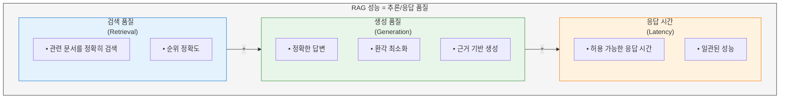
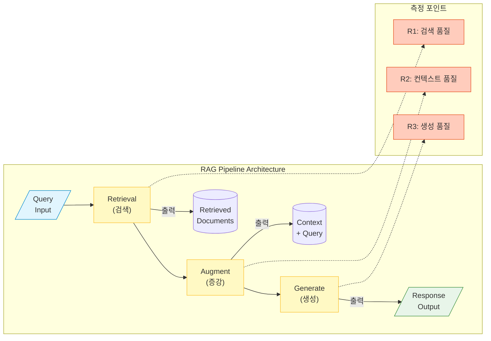
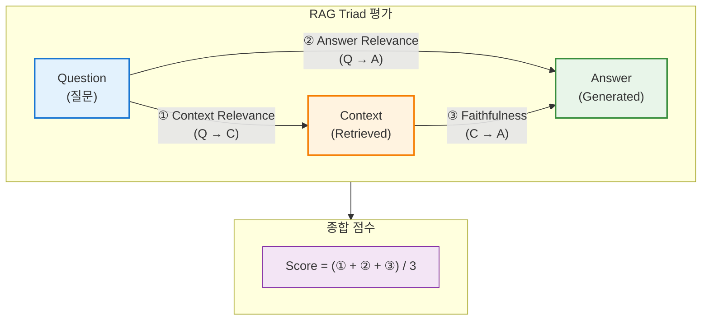
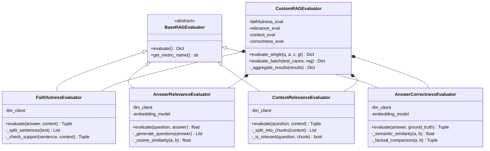
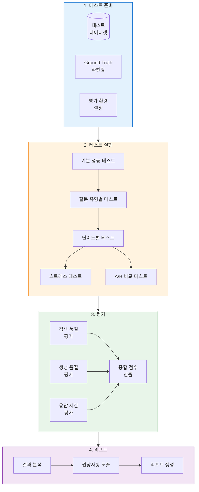
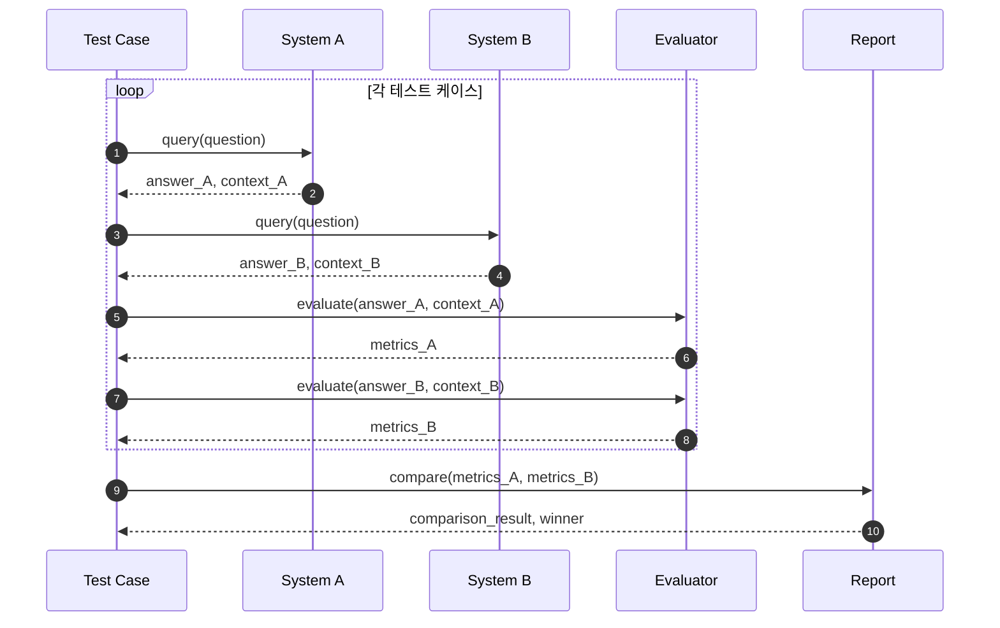

# RAG 성능 테스트 설계서

| 항목 | 내용 |
|------|------|
| **문서명** | RAG 성능 테스트 설계서 |
| **버전** | 1.0 |
| **작성일** | 2026-01-16 |
| **작성자** | Claude AI |
| **범위** | 범용 RAG 시스템 추론/응답 품질 평가 |

---

## 1. 개요

### 1.1 문서 목적

본 문서는 RAG(Retrieval-Augmented Generation) 시스템의 **추론 및 응답 품질 성능**을 체계적으로 평가하기 위한 설계서입니다. 특정 RAG 구현에 종속되지 않는 **범용적 평가 프레임워크**를 제공합니다.

### 1.2 성능의 정의

본 문서에서 "성능"은 다음을 의미합니다:



### 1.3 적용 범위

| 구분 | 적용 가능 |
|------|----------|
| Naive RAG | ✅ |
| Advanced RAG | ✅ |
| Modular RAG | ✅ |
| Graph RAG | ✅ |
| Hybrid RAG | ✅ |
| Agentic RAG | ✅ |

---

## 2. RAG 파이프라인 구조

### 2.1 일반적인 RAG 파이프라인



### 2.2 성능 측정 포인트

| 포인트 | 측정 대상 | 주요 지표 |
|--------|----------|----------|
| **R1** | 검색 단계 | Precision, Recall, MRR, NDCG |
| **R2** | 컨텍스트 구성 | Context Relevance, Noise Ratio |
| **R3** | 생성 단계 | Faithfulness, Answer Relevance, Correctness |
| **E2E** | 전체 파이프라인 | End-to-End Accuracy, Latency |

---

## 3. 평가 지표 체계

### 3.1 검색 품질 지표 (Retrieval Metrics)

#### 3.1.1 Precision@K (정밀도)

검색된 상위 K개 문서 중 관련 문서의 비율

```
Precision@K = (관련 문서 수 in Top-K) / K

예시:
- 검색 결과 Top-5: [관련, 관련, 무관, 관련, 무관]
- Precision@5 = 3/5 = 0.6 (60%)
```

```python
def precision_at_k(retrieved_docs: List[str],
                   relevant_docs: Set[str],
                   k: int) -> float:
    """
    Precision@K 계산

    Args:
        retrieved_docs: 검색된 문서 ID 리스트 (순서대로)
        relevant_docs: 관련 문서 ID 집합 (Ground Truth)
        k: 상위 K개

    Returns:
        Precision@K 값 (0.0 ~ 1.0)
    """
    if k == 0:
        return 0.0

    top_k = retrieved_docs[:k]
    relevant_in_top_k = sum(1 for doc in top_k if doc in relevant_docs)

    return relevant_in_top_k / k
```

#### 3.1.2 Recall@K (재현율)

전체 관련 문서 중 상위 K개에서 검색된 비율

```
Recall@K = (관련 문서 수 in Top-K) / (전체 관련 문서 수)

예시:
- 전체 관련 문서: 10개
- Top-5에서 검색된 관련 문서: 3개
- Recall@5 = 3/10 = 0.3 (30%)
```

```python
def recall_at_k(retrieved_docs: List[str],
                relevant_docs: Set[str],
                k: int) -> float:
    """
    Recall@K 계산

    Args:
        retrieved_docs: 검색된 문서 ID 리스트
        relevant_docs: 관련 문서 ID 집합
        k: 상위 K개

    Returns:
        Recall@K 값 (0.0 ~ 1.0)
    """
    if not relevant_docs:
        return 0.0

    top_k = retrieved_docs[:k]
    relevant_in_top_k = sum(1 for doc in top_k if doc in relevant_docs)

    return relevant_in_top_k / len(relevant_docs)
```

#### 3.1.3 MRR (Mean Reciprocal Rank)

첫 번째 관련 문서의 순위에 대한 역수의 평균

```
MRR = (1/|Q|) × Σ (1 / rank_i)

예시:
- Query 1: 첫 관련 문서 순위 = 1 → RR = 1/1 = 1.0
- Query 2: 첫 관련 문서 순위 = 3 → RR = 1/3 = 0.33
- Query 3: 첫 관련 문서 순위 = 2 → RR = 1/2 = 0.5
- MRR = (1.0 + 0.33 + 0.5) / 3 = 0.61
```

```python
def mean_reciprocal_rank(queries_results: List[Tuple[List[str], Set[str]]]) -> float:
    """
    MRR 계산

    Args:
        queries_results: [(검색결과, 관련문서집합), ...] 리스트

    Returns:
        MRR 값 (0.0 ~ 1.0)
    """
    reciprocal_ranks = []

    for retrieved_docs, relevant_docs in queries_results:
        for rank, doc in enumerate(retrieved_docs, start=1):
            if doc in relevant_docs:
                reciprocal_ranks.append(1.0 / rank)
                break
        else:
            reciprocal_ranks.append(0.0)

    return sum(reciprocal_ranks) / len(reciprocal_ranks) if reciprocal_ranks else 0.0
```

#### 3.1.4 NDCG@K (Normalized Discounted Cumulative Gain)

순위를 고려한 검색 품질 (상위에 관련 문서가 있을수록 높은 점수)

```
DCG@K = Σ (rel_i / log2(i + 1))  for i = 1 to K
NDCG@K = DCG@K / IDCG@K

- rel_i: i번째 문서의 관련도 점수 (0, 1, 2, 3 등)
- IDCG: 이상적인 DCG (완벽한 순위일 때의 DCG)
```

```python
import numpy as np

def ndcg_at_k(retrieved_docs: List[str],
              relevance_scores: Dict[str, int],
              k: int) -> float:
    """
    NDCG@K 계산

    Args:
        retrieved_docs: 검색된 문서 ID 리스트
        relevance_scores: {문서ID: 관련도점수} (0=무관, 1=부분관련, 2=관련, 3=매우관련)
        k: 상위 K개

    Returns:
        NDCG@K 값 (0.0 ~ 1.0)
    """
    def dcg(scores: List[int]) -> float:
        return sum(score / np.log2(i + 2) for i, score in enumerate(scores))

    # 실제 DCG 계산
    actual_scores = [relevance_scores.get(doc, 0) for doc in retrieved_docs[:k]]
    actual_dcg = dcg(actual_scores)

    # 이상적인 DCG 계산 (내림차순 정렬)
    ideal_scores = sorted(relevance_scores.values(), reverse=True)[:k]
    ideal_dcg = dcg(ideal_scores)

    if ideal_dcg == 0:
        return 0.0

    return actual_dcg / ideal_dcg
```

#### 3.1.5 Hit Rate@K

상위 K개 결과 중 최소 하나의 관련 문서가 있는 비율

```python
def hit_rate_at_k(queries_results: List[Tuple[List[str], Set[str]]],
                  k: int) -> float:
    """
    Hit Rate@K 계산

    Args:
        queries_results: [(검색결과, 관련문서집합), ...] 리스트
        k: 상위 K개

    Returns:
        Hit Rate@K 값 (0.0 ~ 1.0)
    """
    hits = 0

    for retrieved_docs, relevant_docs in queries_results:
        top_k = set(retrieved_docs[:k])
        if top_k & relevant_docs:  # 교집합이 있으면 hit
            hits += 1

    return hits / len(queries_results) if queries_results else 0.0
```

### 3.2 생성 품질 지표 (Generation Metrics)

#### 3.2.1 Faithfulness (충실도)

생성된 답변이 검색된 컨텍스트에 기반하는 정도 (환각 방지)

```
Faithfulness = (컨텍스트로 뒷받침되는 문장 수) / (답변의 전체 문장 수)

판단 기준:
- 답변의 각 문장이 컨텍스트에서 추론 가능한가?
- 컨텍스트에 없는 정보를 생성하지 않았는가?
```

```python
from typing import List, Tuple

class FaithfulnessEvaluator:
    """
    Faithfulness 평가기

    LLM을 사용하여 답변의 각 문장이 컨텍스트에 기반하는지 평가
    """

    def __init__(self, llm_client):
        self.llm = llm_client

    def evaluate(self,
                 answer: str,
                 context: str) -> Tuple[float, List[dict]]:
        """
        Faithfulness 평가

        Args:
            answer: 생성된 답변
            context: 검색된 컨텍스트

        Returns:
            (faithfulness_score, sentence_evaluations)
        """
        # 1. 답변을 문장 단위로 분리
        sentences = self._split_sentences(answer)

        # 2. 각 문장에 대해 컨텍스트 기반 여부 평가
        evaluations = []
        supported_count = 0

        for sentence in sentences:
            is_supported, evidence = self._check_support(sentence, context)
            evaluations.append({
                "sentence": sentence,
                "supported": is_supported,
                "evidence": evidence
            })
            if is_supported:
                supported_count += 1

        # 3. Faithfulness 점수 계산
        score = supported_count / len(sentences) if sentences else 0.0

        return score, evaluations

    def _check_support(self, sentence: str, context: str) -> Tuple[bool, str]:
        """LLM을 사용하여 문장이 컨텍스트에 의해 지지되는지 확인"""
        prompt = f"""
        주어진 문장이 컨텍스트에 의해 뒷받침되는지 판단하세요.

        컨텍스트:
        {context}

        문장:
        {sentence}

        답변 형식:
        - supported: true 또는 false
        - evidence: 뒷받침하는 컨텍스트 부분 (없으면 "없음")
        """

        response = self.llm.generate(prompt)
        # Parse response...
        return self._parse_support_response(response)
```

#### 3.2.2 Answer Relevance (답변 관련성)

답변이 질문에 얼마나 관련되어 있는지

```
Answer Relevance = 질문과 답변 간의 의미적 유사도

측정 방법:
1. 답변에서 역으로 질문 생성
2. 원본 질문과 생성된 질문의 유사도 계산
```

```python
class AnswerRelevanceEvaluator:
    """
    Answer Relevance 평가기

    답변에서 질문을 역생성하여 원본 질문과의 유사도로 평가
    """

    def __init__(self, llm_client, embedding_model):
        self.llm = llm_client
        self.embedder = embedding_model

    def evaluate(self, question: str, answer: str, n_generations: int = 3) -> float:
        """
        Answer Relevance 평가

        Args:
            question: 원본 질문
            answer: 생성된 답변
            n_generations: 역생성 질문 수

        Returns:
            relevance_score (0.0 ~ 1.0)
        """
        # 1. 답변에서 가능한 질문들을 역생성
        generated_questions = self._generate_questions(answer, n_generations)

        # 2. 원본 질문과의 유사도 계산
        original_embedding = self.embedder.encode(question)

        similarities = []
        for gen_q in generated_questions:
            gen_embedding = self.embedder.encode(gen_q)
            similarity = self._cosine_similarity(original_embedding, gen_embedding)
            similarities.append(similarity)

        # 3. 평균 유사도 반환
        return sum(similarities) / len(similarities) if similarities else 0.0

    def _generate_questions(self, answer: str, n: int) -> List[str]:
        """답변에서 가능한 질문들을 생성"""
        prompt = f"""
        다음 답변에 대해 가능한 질문 {n}개를 생성하세요.

        답변: {answer}

        질문들:
        """
        response = self.llm.generate(prompt)
        return self._parse_questions(response)
```

#### 3.2.3 Context Relevance (컨텍스트 관련성)

검색된 컨텍스트가 질문에 얼마나 관련되어 있는지

```
Context Relevance = (관련 문장 수) / (전체 컨텍스트 문장 수)

낮은 점수 = 불필요한 정보가 많이 검색됨 (노이즈)
```

```python
class ContextRelevanceEvaluator:
    """
    Context Relevance 평가기

    검색된 컨텍스트 중 질문과 관련된 부분의 비율 측정
    """

    def __init__(self, llm_client):
        self.llm = llm_client

    def evaluate(self, question: str, context: str) -> Tuple[float, dict]:
        """
        Context Relevance 평가

        Args:
            question: 사용자 질문
            context: 검색된 컨텍스트

        Returns:
            (relevance_score, details)
        """
        # 컨텍스트를 문장/청크 단위로 분리
        chunks = self._split_into_chunks(context)

        relevant_chunks = []
        irrelevant_chunks = []

        for chunk in chunks:
            if self._is_relevant(question, chunk):
                relevant_chunks.append(chunk)
            else:
                irrelevant_chunks.append(chunk)

        score = len(relevant_chunks) / len(chunks) if chunks else 0.0

        return score, {
            "total_chunks": len(chunks),
            "relevant_chunks": len(relevant_chunks),
            "irrelevant_chunks": len(irrelevant_chunks),
            "noise_ratio": len(irrelevant_chunks) / len(chunks) if chunks else 0.0
        }
```

#### 3.2.4 Answer Correctness (답변 정확도)

답변이 Ground Truth와 얼마나 일치하는지

```
Answer Correctness = F1(답변, Ground Truth)

구성 요소:
- Semantic Similarity: 의미적 유사도
- Factual Overlap: 사실 정보의 중복도
```

```python
class AnswerCorrectnessEvaluator:
    """
    Answer Correctness 평가기

    생성된 답변과 정답(Ground Truth)의 정확도 비교
    """

    def __init__(self, llm_client, embedding_model):
        self.llm = llm_client
        self.embedder = embedding_model

    def evaluate(self,
                 answer: str,
                 ground_truth: str,
                 weights: dict = None) -> Tuple[float, dict]:
        """
        Answer Correctness 평가

        Args:
            answer: 생성된 답변
            ground_truth: 정답
            weights: {"semantic": 0.5, "factual": 0.5}

        Returns:
            (correctness_score, details)
        """
        weights = weights or {"semantic": 0.5, "factual": 0.5}

        # 1. 의미적 유사도 계산
        semantic_score = self._semantic_similarity(answer, ground_truth)

        # 2. 사실 정보 추출 및 비교
        factual_score, factual_details = self._factual_comparison(answer, ground_truth)

        # 3. 가중 평균 계산
        final_score = (
            weights["semantic"] * semantic_score +
            weights["factual"] * factual_score
        )

        return final_score, {
            "semantic_similarity": semantic_score,
            "factual_f1": factual_score,
            "factual_details": factual_details
        }

    def _factual_comparison(self, answer: str, ground_truth: str) -> Tuple[float, dict]:
        """사실 정보 추출 및 F1 계산"""
        # LLM으로 사실 정보(claims) 추출
        answer_claims = self._extract_claims(answer)
        truth_claims = self._extract_claims(ground_truth)

        # True Positives: 답변에 있고 정답에도 있는 사실
        # False Positives: 답변에 있지만 정답에 없는 사실
        # False Negatives: 정답에 있지만 답변에 없는 사실

        tp = len(answer_claims & truth_claims)
        fp = len(answer_claims - truth_claims)
        fn = len(truth_claims - answer_claims)

        precision = tp / (tp + fp) if (tp + fp) > 0 else 0.0
        recall = tp / (tp + fn) if (tp + fn) > 0 else 0.0
        f1 = 2 * precision * recall / (precision + recall) if (precision + recall) > 0 else 0.0

        return f1, {
            "precision": precision,
            "recall": recall,
            "true_positives": tp,
            "false_positives": fp,
            "false_negatives": fn
        }
```

#### 3.2.5 Hallucination Score (환각 점수)

답변에서 컨텍스트에 없는 정보가 생성된 비율

```
Hallucination Score = 1 - Faithfulness

또는

Hallucination Score = (환각 문장 수) / (전체 문장 수)
```

```python
def hallucination_score(answer: str, context: str, faithfulness_evaluator) -> float:
    """
    환각 점수 계산 (낮을수록 좋음)

    Args:
        answer: 생성된 답변
        context: 검색된 컨텍스트
        faithfulness_evaluator: Faithfulness 평가기

    Returns:
        hallucination_score (0.0 ~ 1.0, 낮을수록 좋음)
    """
    faithfulness, _ = faithfulness_evaluator.evaluate(answer, context)
    return 1.0 - faithfulness
```

### 3.3 응답 시간 지표 (Latency Metrics)

#### 3.3.1 측정 포인트별 지연 시간

```python
from dataclasses import dataclass
from typing import Optional
import time

@dataclass
class LatencyMetrics:
    """RAG 파이프라인 지연 시간 측정"""

    # 단계별 지연 시간 (초)
    query_processing_time: float = 0.0      # 쿼리 전처리
    embedding_time: float = 0.0             # 쿼리 임베딩 생성
    retrieval_time: float = 0.0             # 문서 검색
    reranking_time: float = 0.0             # 재순위화 (선택적)
    context_assembly_time: float = 0.0      # 컨텍스트 조합
    llm_time: float = 0.0                   # LLM 생성
    post_processing_time: float = 0.0       # 후처리

    @property
    def total_time(self) -> float:
        """전체 응답 시간"""
        return (
            self.query_processing_time +
            self.embedding_time +
            self.retrieval_time +
            self.reranking_time +
            self.context_assembly_time +
            self.llm_time +
            self.post_processing_time
        )

    @property
    def retrieval_total(self) -> float:
        """검색 단계 총 시간"""
        return self.embedding_time + self.retrieval_time + self.reranking_time

    @property
    def generation_total(self) -> float:
        """생성 단계 총 시간"""
        return self.context_assembly_time + self.llm_time + self.post_processing_time

    def to_dict(self) -> dict:
        return {
            "query_processing_ms": self.query_processing_time * 1000,
            "embedding_ms": self.embedding_time * 1000,
            "retrieval_ms": self.retrieval_time * 1000,
            "reranking_ms": self.reranking_time * 1000,
            "context_assembly_ms": self.context_assembly_time * 1000,
            "llm_ms": self.llm_time * 1000,
            "post_processing_ms": self.post_processing_time * 1000,
            "total_ms": self.total_time * 1000,
            "retrieval_total_ms": self.retrieval_total * 1000,
            "generation_total_ms": self.generation_total * 1000
        }


class LatencyTracker:
    """지연 시간 추적기"""

    def __init__(self):
        self.metrics = LatencyMetrics()
        self._start_times = {}

    def start(self, stage: str):
        """단계 시작 시간 기록"""
        self._start_times[stage] = time.perf_counter()

    def end(self, stage: str):
        """단계 종료 및 시간 계산"""
        if stage in self._start_times:
            elapsed = time.perf_counter() - self._start_times[stage]
            setattr(self.metrics, f"{stage}_time", elapsed)

    def get_metrics(self) -> LatencyMetrics:
        return self.metrics
```

#### 3.3.2 지연 시간 목표 (SLO)

| 단계 | 목표 시간 | 최대 허용 |
|------|----------|----------|
| Query Processing | < 10ms | 50ms |
| Embedding | < 50ms | 100ms |
| Retrieval | < 100ms | 500ms |
| Reranking | < 200ms | 500ms |
| LLM Generation | < 3s | 10s |
| **Total (E2E)** | **< 4s** | **< 12s** |

### 3.4 복합 지표 (Composite Metrics)

#### 3.4.1 RAGAS Score

RAGAS(Retrieval-Augmented Generation Assessment) 프레임워크의 종합 점수

```python
def ragas_score(
    faithfulness: float,
    answer_relevance: float,
    context_relevance: float,
    answer_correctness: float = None,
    weights: dict = None
) -> float:
    """
    RAGAS 종합 점수 계산

    Args:
        faithfulness: 충실도 점수
        answer_relevance: 답변 관련성 점수
        context_relevance: 컨텍스트 관련성 점수
        answer_correctness: 답변 정확도 (Ground Truth 있을 때)
        weights: 가중치 딕셔너리

    Returns:
        종합 RAGAS 점수 (0.0 ~ 1.0)
    """
    if answer_correctness is not None:
        # Ground Truth가 있는 경우
        weights = weights or {
            "faithfulness": 0.25,
            "answer_relevance": 0.25,
            "context_relevance": 0.25,
            "answer_correctness": 0.25
        }
        return (
            weights["faithfulness"] * faithfulness +
            weights["answer_relevance"] * answer_relevance +
            weights["context_relevance"] * context_relevance +
            weights["answer_correctness"] * answer_correctness
        )
    else:
        # Ground Truth가 없는 경우
        weights = weights or {
            "faithfulness": 0.4,
            "answer_relevance": 0.3,
            "context_relevance": 0.3
        }
        return (
            weights["faithfulness"] * faithfulness +
            weights["answer_relevance"] * answer_relevance +
            weights["context_relevance"] * context_relevance
        )
```

#### 3.4.2 RAG Triad



**RAG Triad 평가 관계:**

| 번호 | 평가 항목 | 관계 | 설명 |
|------|----------|------|------|
| ① | Context Relevance | Q → C | 검색된 컨텍스트가 질문에 관련된 정도 |
| ② | Answer Relevance | Q → A | 생성된 답변이 질문에 관련된 정도 |
| ③ | Faithfulness | C → A | 답변이 컨텍스트에 기반하는 정도 |

---

## 4. 테스트 데이터셋 설계

### 4.1 데이터셋 구조

```python
from dataclasses import dataclass
from typing import List, Optional, Dict
from enum import Enum

class QueryType(Enum):
    """질문 유형"""
    FACTUAL = "factual"           # 사실 확인 질문
    REASONING = "reasoning"       # 추론 필요 질문
    COMPARISON = "comparison"     # 비교 질문
    PROCEDURAL = "procedural"     # 절차/방법 질문
    MULTI_HOP = "multi_hop"       # 다단계 추론 질문
    AGGREGATION = "aggregation"   # 집계 질문
    TEMPORAL = "temporal"         # 시간 관련 질문
    NEGATION = "negation"         # 부정 질문

class DifficultyLevel(Enum):
    """난이도"""
    EASY = "easy"
    MEDIUM = "medium"
    HARD = "hard"

@dataclass
class TestCase:
    """테스트 케이스"""
    id: str
    question: str
    query_type: QueryType
    difficulty: DifficultyLevel

    # Ground Truth (선택적)
    ground_truth_answer: Optional[str] = None
    relevant_doc_ids: Optional[List[str]] = None

    # 메타데이터
    domain: Optional[str] = None
    tags: Optional[List[str]] = None

    # 기대 결과
    expected_min_precision: float = 0.5
    expected_min_faithfulness: float = 0.8

@dataclass
class TestDataset:
    """테스트 데이터셋"""
    name: str
    version: str
    description: str
    test_cases: List[TestCase]

    # 문서 컬렉션 (검색 대상)
    documents: List[Dict]

    def get_by_type(self, query_type: QueryType) -> List[TestCase]:
        return [tc for tc in self.test_cases if tc.query_type == query_type]

    def get_by_difficulty(self, difficulty: DifficultyLevel) -> List[TestCase]:
        return [tc for tc in self.test_cases if tc.difficulty == difficulty]
```

### 4.2 질문 유형별 테스트 케이스 예시

```yaml
# test_dataset.yaml

name: "RAG Performance Test Dataset"
version: "1.0"
description: "범용 RAG 성능 평가 데이터셋"

test_cases:
  # 1. 사실 확인 질문 (Factual)
  - id: "FACT-001"
    question: "프로젝트 X의 시작일은 언제인가요?"
    query_type: "factual"
    difficulty: "easy"
    ground_truth_answer: "2026년 1월 1일"
    relevant_doc_ids: ["DOC-001", "DOC-002"]
    tags: ["날짜", "프로젝트"]

  # 2. 추론 질문 (Reasoning)
  - id: "REAS-001"
    question: "시스템 A가 시스템 B보다 성능이 좋은 이유는?"
    query_type: "reasoning"
    difficulty: "medium"
    ground_truth_answer: "시스템 A는 캐싱을 사용하고..."
    relevant_doc_ids: ["DOC-010", "DOC-011", "DOC-012"]

  # 3. 비교 질문 (Comparison)
  - id: "COMP-001"
    question: "옵션 A와 옵션 B의 장단점은?"
    query_type: "comparison"
    difficulty: "medium"
    relevant_doc_ids: ["DOC-020", "DOC-021"]

  # 4. 다단계 추론 (Multi-hop)
  - id: "MULT-001"
    question: "팀 A의 리더가 담당하는 프로젝트의 예산은?"
    query_type: "multi_hop"
    difficulty: "hard"
    # 필요한 추론 단계:
    # 1. 팀 A의 리더 = 홍길동
    # 2. 홍길동이 담당하는 프로젝트 = 프로젝트 X
    # 3. 프로젝트 X의 예산 = 1억원
    ground_truth_answer: "1억원"
    relevant_doc_ids: ["DOC-030", "DOC-031", "DOC-032"]

  # 5. 부정 질문 (Negation)
  - id: "NEG-001"
    question: "지원되지 않는 기능은 무엇인가요?"
    query_type: "negation"
    difficulty: "medium"
    relevant_doc_ids: ["DOC-040"]
```

### 4.3 데이터셋 품질 기준

| 기준 | 요구사항 | 검증 방법 |
|------|---------|----------|
| **크기** | 최소 100개 테스트 케이스 | 자동 카운트 |
| **유형 분포** | 각 질문 유형 최소 10% | 분포 분석 |
| **난이도 분포** | Easy 30%, Medium 50%, Hard 20% | 분포 분석 |
| **Ground Truth** | 최소 50% 케이스에 정답 포함 | 자동 검증 |
| **관련 문서** | 모든 케이스에 relevant_doc_ids | 필수 필드 검증 |

---

## 5. 평가 프레임워크

### 5.0 평가기 구조



### 5.1 RAGAS 프레임워크 활용

```python
# RAGAS 설치: pip install ragas

from ragas import evaluate
from ragas.metrics import (
    faithfulness,
    answer_relevancy,
    context_precision,
    context_recall,
    answer_correctness
)
from datasets import Dataset

def evaluate_with_ragas(
    questions: List[str],
    answers: List[str],
    contexts: List[List[str]],
    ground_truths: List[str] = None
) -> dict:
    """
    RAGAS를 사용한 RAG 평가

    Args:
        questions: 질문 리스트
        answers: 생성된 답변 리스트
        contexts: 검색된 컨텍스트 리스트 (각 질문당 여러 문서)
        ground_truths: 정답 리스트 (선택적)

    Returns:
        평가 결과 딕셔너리
    """
    # 데이터셋 구성
    data = {
        "question": questions,
        "answer": answers,
        "contexts": contexts
    }

    if ground_truths:
        data["ground_truth"] = ground_truths

    dataset = Dataset.from_dict(data)

    # 평가할 메트릭 선택
    metrics = [
        faithfulness,
        answer_relevancy,
        context_precision,
        context_recall
    ]

    if ground_truths:
        metrics.append(answer_correctness)

    # 평가 실행
    result = evaluate(dataset, metrics=metrics)

    return result.to_pandas().to_dict()
```

### 5.2 LangChain Evaluators 활용

```python
from langchain.evaluation import load_evaluator
from langchain.chat_models import ChatOpenAI

class LangChainRAGEvaluator:
    """LangChain 기반 RAG 평가기"""

    def __init__(self, llm_model: str = "gpt-4"):
        self.llm = ChatOpenAI(model=llm_model, temperature=0)

        # 평가기 로드
        self.qa_evaluator = load_evaluator(
            "qa",
            llm=self.llm
        )
        self.criteria_evaluator = load_evaluator(
            "criteria",
            llm=self.llm,
            criteria="relevance"
        )

    def evaluate_qa(self, question: str, answer: str, reference: str) -> dict:
        """QA 정확도 평가"""
        result = self.qa_evaluator.evaluate_strings(
            prediction=answer,
            input=question,
            reference=reference
        )
        return {
            "score": result["score"],
            "reasoning": result.get("reasoning", "")
        }

    def evaluate_relevance(self, question: str, answer: str) -> dict:
        """답변 관련성 평가"""
        result = self.criteria_evaluator.evaluate_strings(
            prediction=answer,
            input=question
        )
        return {
            "score": result["score"],
            "reasoning": result.get("reasoning", "")
        }
```

### 5.3 커스텀 평가기

```python
from abc import ABC, abstractmethod
from typing import Any, Dict

class BaseRAGEvaluator(ABC):
    """RAG 평가기 기본 클래스"""

    @abstractmethod
    def evaluate(self, **kwargs) -> Dict[str, Any]:
        """평가 수행"""
        pass

    @abstractmethod
    def get_metric_name(self) -> str:
        """지표 이름 반환"""
        pass

class CustomRAGEvaluator:
    """커스텀 RAG 종합 평가기"""

    def __init__(self, llm_client, embedding_model):
        self.llm = llm_client
        self.embedder = embedding_model

        # 개별 평가기 초기화
        self.faithfulness_eval = FaithfulnessEvaluator(llm_client)
        self.relevance_eval = AnswerRelevanceEvaluator(llm_client, embedding_model)
        self.context_eval = ContextRelevanceEvaluator(llm_client)
        self.correctness_eval = AnswerCorrectnessEvaluator(llm_client, embedding_model)

    def evaluate_single(
        self,
        question: str,
        answer: str,
        context: str,
        ground_truth: str = None
    ) -> Dict[str, Any]:
        """단일 케이스 평가"""

        results = {
            "question": question,
            "answer": answer[:100] + "..." if len(answer) > 100 else answer
        }

        # Faithfulness
        faith_score, faith_details = self.faithfulness_eval.evaluate(answer, context)
        results["faithfulness"] = {
            "score": faith_score,
            "details": faith_details
        }

        # Answer Relevance
        relevance_score = self.relevance_eval.evaluate(question, answer)
        results["answer_relevance"] = {
            "score": relevance_score
        }

        # Context Relevance
        ctx_score, ctx_details = self.context_eval.evaluate(question, context)
        results["context_relevance"] = {
            "score": ctx_score,
            "details": ctx_details
        }

        # Answer Correctness (if ground truth available)
        if ground_truth:
            corr_score, corr_details = self.correctness_eval.evaluate(answer, ground_truth)
            results["answer_correctness"] = {
                "score": corr_score,
                "details": corr_details
            }

        # 종합 점수
        results["composite_score"] = ragas_score(
            faithfulness=faith_score,
            answer_relevance=relevance_score,
            context_relevance=ctx_score,
            answer_correctness=corr_score if ground_truth else None
        )

        return results

    def evaluate_batch(self, test_cases: List[TestCase], rag_system) -> Dict[str, Any]:
        """배치 평가"""

        all_results = []

        for tc in test_cases:
            # RAG 시스템으로 답변 생성
            answer, context, latency = rag_system.query(tc.question)

            # 평가
            result = self.evaluate_single(
                question=tc.question,
                answer=answer,
                context=context,
                ground_truth=tc.ground_truth_answer
            )
            result["test_case_id"] = tc.id
            result["latency"] = latency.to_dict()

            all_results.append(result)

        # 집계
        return self._aggregate_results(all_results)

    def _aggregate_results(self, results: List[Dict]) -> Dict[str, Any]:
        """결과 집계"""

        metrics = ["faithfulness", "answer_relevance", "context_relevance", "composite_score"]

        aggregated = {
            "total_cases": len(results),
            "averages": {},
            "by_case": results
        }

        for metric in metrics:
            scores = [r[metric]["score"] if isinstance(r.get(metric), dict) else r.get(metric, 0)
                     for r in results]
            aggregated["averages"][metric] = sum(scores) / len(scores) if scores else 0

        return aggregated
```

---

## 6. 테스트 시나리오

### 6.0 테스트 워크플로우 개요



### 6.1 기본 성능 테스트

```python
class BasicPerformanceTest:
    """기본 성능 테스트"""

    def __init__(self, rag_system, evaluator, test_dataset):
        self.rag = rag_system
        self.evaluator = evaluator
        self.dataset = test_dataset

    def run(self) -> Dict[str, Any]:
        """기본 성능 테스트 실행"""

        results = {
            "test_name": "Basic Performance Test",
            "timestamp": datetime.now().isoformat(),
            "dataset_info": {
                "name": self.dataset.name,
                "version": self.dataset.version,
                "total_cases": len(self.dataset.test_cases)
            }
        }

        # 전체 테스트 케이스 평가
        evaluation = self.evaluator.evaluate_batch(
            self.dataset.test_cases,
            self.rag
        )

        results["overall_metrics"] = evaluation["averages"]
        results["detailed_results"] = evaluation["by_case"]

        # 합격 기준 판정
        results["pass_criteria"] = self._check_pass_criteria(evaluation["averages"])

        return results

    def _check_pass_criteria(self, averages: Dict) -> Dict[str, bool]:
        """합격 기준 확인"""
        criteria = {
            "faithfulness": averages.get("faithfulness", 0) >= 0.8,
            "answer_relevance": averages.get("answer_relevance", 0) >= 0.7,
            "context_relevance": averages.get("context_relevance", 0) >= 0.6,
            "composite_score": averages.get("composite_score", 0) >= 0.7
        }
        criteria["overall_pass"] = all(criteria.values())
        return criteria
```

### 6.2 질문 유형별 테스트

```python
class QueryTypePerformanceTest:
    """질문 유형별 성능 테스트"""

    def run(self) -> Dict[str, Any]:
        results = {"by_query_type": {}}

        for query_type in QueryType:
            test_cases = self.dataset.get_by_type(query_type)

            if not test_cases:
                continue

            evaluation = self.evaluator.evaluate_batch(test_cases, self.rag)

            results["by_query_type"][query_type.value] = {
                "count": len(test_cases),
                "metrics": evaluation["averages"]
            }

        return results
```

### 6.3 난이도별 테스트

```python
class DifficultyPerformanceTest:
    """난이도별 성능 테스트"""

    def run(self) -> Dict[str, Any]:
        results = {"by_difficulty": {}}

        for difficulty in DifficultyLevel:
            test_cases = self.dataset.get_by_difficulty(difficulty)

            if not test_cases:
                continue

            evaluation = self.evaluator.evaluate_batch(test_cases, self.rag)

            results["by_difficulty"][difficulty.value] = {
                "count": len(test_cases),
                "metrics": evaluation["averages"]
            }

        return results
```

### 6.4 스트레스 테스트

```python
import asyncio
import aiohttp
from concurrent.futures import ThreadPoolExecutor

class StressTest:
    """동시성 스트레스 테스트"""

    def __init__(self, rag_system, test_queries: List[str]):
        self.rag = rag_system
        self.queries = test_queries

    async def run(
        self,
        concurrent_users: int = 10,
        duration_seconds: int = 60
    ) -> Dict[str, Any]:
        """
        스트레스 테스트 실행

        Args:
            concurrent_users: 동시 사용자 수
            duration_seconds: 테스트 지속 시간
        """

        results = {
            "config": {
                "concurrent_users": concurrent_users,
                "duration_seconds": duration_seconds
            },
            "latencies": [],
            "errors": [],
            "success_count": 0,
            "error_count": 0
        }

        start_time = time.time()

        async def single_request():
            query = random.choice(self.queries)
            try:
                start = time.perf_counter()
                answer, context, latency = await self.rag.aquery(query)
                elapsed = time.perf_counter() - start

                results["latencies"].append(elapsed)
                results["success_count"] += 1
            except Exception as e:
                results["errors"].append(str(e))
                results["error_count"] += 1

        # 동시 요청 실행
        tasks = []
        while time.time() - start_time < duration_seconds:
            if len(tasks) < concurrent_users:
                tasks.append(asyncio.create_task(single_request()))

            # 완료된 태스크 정리
            tasks = [t for t in tasks if not t.done()]
            await asyncio.sleep(0.1)

        # 남은 태스크 완료 대기
        await asyncio.gather(*tasks, return_exceptions=True)

        # 통계 계산
        latencies = results["latencies"]
        if latencies:
            results["statistics"] = {
                "total_requests": results["success_count"] + results["error_count"],
                "success_rate": results["success_count"] / (results["success_count"] + results["error_count"]),
                "avg_latency_ms": sum(latencies) / len(latencies) * 1000,
                "p50_latency_ms": sorted(latencies)[len(latencies)//2] * 1000,
                "p95_latency_ms": sorted(latencies)[int(len(latencies)*0.95)] * 1000,
                "p99_latency_ms": sorted(latencies)[int(len(latencies)*0.99)] * 1000,
                "max_latency_ms": max(latencies) * 1000,
                "throughput_rps": len(latencies) / duration_seconds
            }

        return results
```

### 6.5 A/B 비교 테스트



```python
class ABComparisonTest:
    """두 RAG 시스템 비교 테스트"""

    def __init__(
        self,
        system_a,
        system_b,
        evaluator,
        test_dataset
    ):
        self.system_a = system_a
        self.system_b = system_b
        self.evaluator = evaluator
        self.dataset = test_dataset

    def run(self) -> Dict[str, Any]:
        """A/B 비교 실행"""

        # System A 평가
        results_a = self.evaluator.evaluate_batch(
            self.dataset.test_cases,
            self.system_a
        )

        # System B 평가
        results_b = self.evaluator.evaluate_batch(
            self.dataset.test_cases,
            self.system_b
        )

        # 비교 분석
        comparison = self._compare_results(results_a, results_b)

        return {
            "system_a": {
                "name": getattr(self.system_a, 'name', 'System A'),
                "metrics": results_a["averages"]
            },
            "system_b": {
                "name": getattr(self.system_b, 'name', 'System B'),
                "metrics": results_b["averages"]
            },
            "comparison": comparison,
            "winner": self._determine_winner(comparison)
        }

    def _compare_results(self, a: Dict, b: Dict) -> Dict:
        """결과 비교"""
        comparison = {}

        for metric in a["averages"]:
            score_a = a["averages"][metric]
            score_b = b["averages"][metric]

            comparison[metric] = {
                "system_a": score_a,
                "system_b": score_b,
                "difference": score_a - score_b,
                "improvement_pct": ((score_a - score_b) / score_b * 100) if score_b > 0 else 0
            }

        return comparison

    def _determine_winner(self, comparison: Dict) -> str:
        """승자 결정"""
        a_wins = sum(1 for m in comparison.values() if m["difference"] > 0)
        b_wins = sum(1 for m in comparison.values() if m["difference"] < 0)

        if a_wins > b_wins:
            return "System A"
        elif b_wins > a_wins:
            return "System B"
        else:
            return "Tie"
```

---

## 7. 벤치마킹 방법론

### 7.1 벤치마크 설정

```python
@dataclass
class BenchmarkConfig:
    """벤치마크 설정"""

    # 반복 횟수
    num_iterations: int = 3

    # 웜업 실행 횟수 (결과에 미포함)
    warmup_iterations: int = 1

    # 타임아웃
    timeout_seconds: int = 300

    # 캐시 설정
    clear_cache_between_runs: bool = True

    # 결과 저장
    save_detailed_results: bool = True
    output_dir: str = "./benchmark_results"

class RAGBenchmark:
    """RAG 벤치마크 실행기"""

    def __init__(self, config: BenchmarkConfig):
        self.config = config

    def run(
        self,
        rag_system,
        test_dataset: TestDataset,
        evaluator
    ) -> Dict[str, Any]:
        """벤치마크 실행"""

        all_iterations = []

        # 웜업
        for i in range(self.config.warmup_iterations):
            print(f"Warmup iteration {i+1}/{self.config.warmup_iterations}")
            self._run_single_iteration(rag_system, test_dataset, evaluator)

            if self.config.clear_cache_between_runs:
                rag_system.clear_cache()

        # 본 실행
        for i in range(self.config.num_iterations):
            print(f"Benchmark iteration {i+1}/{self.config.num_iterations}")

            result = self._run_single_iteration(rag_system, test_dataset, evaluator)
            all_iterations.append(result)

            if self.config.clear_cache_between_runs:
                rag_system.clear_cache()

        # 결과 집계
        return self._aggregate_benchmark_results(all_iterations)

    def _run_single_iteration(self, rag_system, dataset, evaluator) -> Dict:
        """단일 반복 실행"""
        start_time = time.time()

        evaluation = evaluator.evaluate_batch(dataset.test_cases, rag_system)

        elapsed = time.time() - start_time

        return {
            "metrics": evaluation["averages"],
            "total_time_seconds": elapsed,
            "cases_evaluated": len(dataset.test_cases)
        }

    def _aggregate_benchmark_results(self, iterations: List[Dict]) -> Dict:
        """벤치마크 결과 집계"""

        metrics_lists = {}

        for iteration in iterations:
            for metric, value in iteration["metrics"].items():
                if metric not in metrics_lists:
                    metrics_lists[metric] = []
                metrics_lists[metric].append(value)

        aggregated = {
            "num_iterations": len(iterations),
            "metrics": {}
        }

        for metric, values in metrics_lists.items():
            aggregated["metrics"][metric] = {
                "mean": sum(values) / len(values),
                "std": self._std_dev(values),
                "min": min(values),
                "max": max(values),
                "values": values
            }

        return aggregated

    def _std_dev(self, values: List[float]) -> float:
        """표준편차 계산"""
        if len(values) < 2:
            return 0.0
        mean = sum(values) / len(values)
        variance = sum((x - mean) ** 2 for x in values) / (len(values) - 1)
        return variance ** 0.5
```

### 7.2 베이스라인 비교

```python
class BaselineComparison:
    """베이스라인 대비 성능 비교"""

    # 업계 표준 베이스라인 (참고용)
    INDUSTRY_BASELINE = {
        "faithfulness": 0.75,
        "answer_relevance": 0.70,
        "context_relevance": 0.65,
        "answer_correctness": 0.60
    }

    def compare_to_baseline(
        self,
        results: Dict[str, float],
        baseline: Dict[str, float] = None
    ) -> Dict[str, Any]:
        """베이스라인 대비 비교"""

        baseline = baseline or self.INDUSTRY_BASELINE

        comparison = {}

        for metric, value in results.items():
            if metric in baseline:
                baseline_value = baseline[metric]
                comparison[metric] = {
                    "current": value,
                    "baseline": baseline_value,
                    "difference": value - baseline_value,
                    "meets_baseline": value >= baseline_value,
                    "improvement_pct": ((value - baseline_value) / baseline_value * 100)
                                       if baseline_value > 0 else 0
                }

        comparison["overall_meets_baseline"] = all(
            c["meets_baseline"] for c in comparison.values()
        )

        return comparison
```

---

## 8. 리포트 생성

### 8.1 리포트 템플릿

```python
from datetime import datetime
import json

class RAGPerformanceReport:
    """RAG 성능 테스트 리포트 생성기"""

    def __init__(self, test_results: Dict[str, Any]):
        self.results = test_results
        self.timestamp = datetime.now()

    def generate_markdown(self) -> str:
        """마크다운 형식 리포트 생성"""

        report = f"""# RAG 성능 테스트 리포트

| 항목 | 내용 |
|------|------|
| **생성일시** | {self.timestamp.strftime('%Y-%m-%d %H:%M:%S')} |
| **테스트 데이터셋** | {self.results.get('dataset_info', {}).get('name', 'N/A')} |
| **테스트 케이스 수** | {self.results.get('dataset_info', {}).get('total_cases', 'N/A')} |

---

## 1. 종합 결과

### 1.1 핵심 지표

| 지표 | 점수 | 목표 | 달성 |
|------|------|------|------|
"""

        # 지표별 결과 추가
        metrics = self.results.get('overall_metrics', {})
        targets = {
            'faithfulness': 0.8,
            'answer_relevance': 0.7,
            'context_relevance': 0.6,
            'composite_score': 0.7
        }

        for metric, score in metrics.items():
            target = targets.get(metric, 'N/A')
            achieved = '✅' if score >= target else '❌'
            report += f"| {metric} | {score:.3f} | {target} | {achieved} |\n"

        report += f"""
### 1.2 종합 점수

```
{'✅ PASS' if self.results.get('pass_criteria', {}).get('overall_pass', False) else '❌ FAIL'}

Composite Score: {metrics.get('composite_score', 0):.3f}
```

---

## 2. 상세 분석

### 2.1 검색 품질 (Retrieval)

- **Context Relevance**: {metrics.get('context_relevance', 0):.3f}
  - 검색된 컨텍스트 중 질문과 관련된 비율

### 2.2 생성 품질 (Generation)

- **Faithfulness**: {metrics.get('faithfulness', 0):.3f}
  - 답변이 컨텍스트에 기반하는 정도 (환각 방지)

- **Answer Relevance**: {metrics.get('answer_relevance', 0):.3f}
  - 답변이 질문에 관련된 정도

"""

        # 질문 유형별 결과
        if 'by_query_type' in self.results:
            report += "### 2.3 질문 유형별 성능\n\n"
            report += "| 질문 유형 | 케이스 수 | Composite Score |\n"
            report += "|----------|----------|------------------|\n"

            for qtype, data in self.results['by_query_type'].items():
                score = data['metrics'].get('composite_score', 0)
                report += f"| {qtype} | {data['count']} | {score:.3f} |\n"

        # 권장사항
        report += """
---

## 3. 권장사항

"""

        recommendations = self._generate_recommendations(metrics)
        for i, rec in enumerate(recommendations, 1):
            report += f"{i}. {rec}\n"

        return report

    def _generate_recommendations(self, metrics: Dict) -> List[str]:
        """지표 기반 권장사항 생성"""

        recommendations = []

        if metrics.get('faithfulness', 1) < 0.8:
            recommendations.append(
                "**Faithfulness 개선 필요**: 프롬프트에 '컨텍스트에 기반하여 답변하세요' 지시 강화, "
                "또는 답변 후처리에서 환각 검증 추가"
            )

        if metrics.get('context_relevance', 1) < 0.6:
            recommendations.append(
                "**검색 품질 개선 필요**: 청킹 전략 조정, 임베딩 모델 변경, "
                "또는 Reranker 도입 검토"
            )

        if metrics.get('answer_relevance', 1) < 0.7:
            recommendations.append(
                "**답변 관련성 개선 필요**: 프롬프트 최적화, "
                "질문 재작성(Query Rewriting) 기법 적용"
            )

        if not recommendations:
            recommendations.append("현재 성능이 목표 기준을 충족합니다. 지속적인 모니터링 권장.")

        return recommendations

    def generate_json(self) -> str:
        """JSON 형식 리포트 생성"""
        return json.dumps(self.results, indent=2, ensure_ascii=False)

    def save(self, output_path: str, format: str = "markdown"):
        """리포트 파일 저장"""

        if format == "markdown":
            content = self.generate_markdown()
            ext = ".md"
        else:
            content = self.generate_json()
            ext = ".json"

        filepath = f"{output_path}{ext}"
        with open(filepath, 'w', encoding='utf-8') as f:
            f.write(content)

        return filepath
```

### 8.2 시각화

```python
import matplotlib.pyplot as plt
import numpy as np

class RAGPerformanceVisualizer:
    """RAG 성능 시각화"""

    def plot_radar_chart(self, metrics: Dict[str, float], title: str = "RAG Performance"):
        """레이더 차트 생성"""

        labels = list(metrics.keys())
        values = list(metrics.values())

        # 차트 설정
        angles = np.linspace(0, 2 * np.pi, len(labels), endpoint=False).tolist()
        values += values[:1]
        angles += angles[:1]

        fig, ax = plt.subplots(figsize=(8, 8), subplot_kw=dict(polar=True))

        ax.plot(angles, values, 'o-', linewidth=2)
        ax.fill(angles, values, alpha=0.25)
        ax.set_thetagrids(np.degrees(angles[:-1]), labels)
        ax.set_ylim(0, 1)
        ax.set_title(title)

        return fig

    def plot_comparison_bar(
        self,
        system_a_metrics: Dict[str, float],
        system_b_metrics: Dict[str, float],
        labels: Tuple[str, str] = ("System A", "System B")
    ):
        """비교 막대 차트 생성"""

        metrics = list(system_a_metrics.keys())
        x = np.arange(len(metrics))
        width = 0.35

        fig, ax = plt.subplots(figsize=(10, 6))

        ax.bar(x - width/2, list(system_a_metrics.values()), width, label=labels[0])
        ax.bar(x + width/2, list(system_b_metrics.values()), width, label=labels[1])

        ax.set_ylabel('Score')
        ax.set_title('RAG System Comparison')
        ax.set_xticks(x)
        ax.set_xticklabels(metrics, rotation=45)
        ax.legend()
        ax.set_ylim(0, 1)

        plt.tight_layout()
        return fig

    def plot_latency_distribution(self, latencies: List[float]):
        """지연 시간 분포 차트"""

        fig, (ax1, ax2) = plt.subplots(1, 2, figsize=(12, 5))

        # 히스토그램
        ax1.hist(latencies, bins=50, edgecolor='black')
        ax1.set_xlabel('Latency (ms)')
        ax1.set_ylabel('Frequency')
        ax1.set_title('Latency Distribution')

        # 백분위수
        percentiles = [50, 75, 90, 95, 99]
        percentile_values = [np.percentile(latencies, p) for p in percentiles]

        ax2.bar([f'P{p}' for p in percentiles], percentile_values)
        ax2.set_xlabel('Percentile')
        ax2.set_ylabel('Latency (ms)')
        ax2.set_title('Latency Percentiles')

        plt.tight_layout()
        return fig
```

---

## 9. 도구 및 구현

### 9.1 권장 도구

| 도구 | 용도 | 링크 |
|------|------|------|
| **RAGAS** | RAG 평가 프레임워크 | https://github.com/explodinggradients/ragas |
| **LangChain Evaluators** | LLM 기반 평가 | https://python.langchain.com/docs/guides/evaluation |
| **DeepEval** | LLM 테스트 프레임워크 | https://github.com/confident-ai/deepeval |
| **TruLens** | LLM 앱 평가/모니터링 | https://github.com/truera/trulens |
| **MLflow** | 실험 추적 | https://mlflow.org/ |

### 9.2 설치 및 설정

```bash
# 필수 패키지 설치
pip install ragas langchain deepeval trulens-eval mlflow

# 선택적 패키지
pip install matplotlib seaborn pandas
```

### 9.3 통합 테스트 러너

```python
class RAGTestRunner:
    """RAG 성능 테스트 통합 러너"""

    def __init__(
        self,
        rag_system,
        test_dataset: TestDataset,
        output_dir: str = "./test_results"
    ):
        self.rag = rag_system
        self.dataset = test_dataset
        self.output_dir = output_dir

        # 평가기 초기화
        self.evaluator = CustomRAGEvaluator(
            llm_client=rag_system.llm,
            embedding_model=rag_system.embedder
        )

    def run_all_tests(self) -> Dict[str, Any]:
        """모든 테스트 실행"""

        results = {
            "timestamp": datetime.now().isoformat(),
            "system_info": self._get_system_info()
        }

        # 1. 기본 성능 테스트
        print("Running basic performance test...")
        basic_test = BasicPerformanceTest(self.rag, self.evaluator, self.dataset)
        results["basic_performance"] = basic_test.run()

        # 2. 질문 유형별 테스트
        print("Running query type performance test...")
        type_test = QueryTypePerformanceTest(self.rag, self.evaluator, self.dataset)
        results["by_query_type"] = type_test.run()

        # 3. 난이도별 테스트
        print("Running difficulty performance test...")
        diff_test = DifficultyPerformanceTest(self.rag, self.evaluator, self.dataset)
        results["by_difficulty"] = diff_test.run()

        # 리포트 생성
        report = RAGPerformanceReport(results)
        report_path = report.save(f"{self.output_dir}/report_{datetime.now().strftime('%Y%m%d_%H%M%S')}")

        print(f"Report saved to: {report_path}")

        return results

    def _get_system_info(self) -> Dict:
        """시스템 정보 수집"""
        return {
            "rag_system": getattr(self.rag, 'name', 'Unknown'),
            "embedding_model": getattr(self.rag.embedder, 'model_name', 'Unknown'),
            "llm_model": getattr(self.rag.llm, 'model_name', 'Unknown')
        }
```

---

## 10. 부록

### 10.1 용어 정의

| 용어 | 정의 |
|------|------|
| **RAG** | Retrieval-Augmented Generation, 검색 증강 생성 |
| **Faithfulness** | 충실도, 답변이 컨텍스트에 기반하는 정도 |
| **Hallucination** | 환각, 컨텍스트에 없는 정보를 생성하는 현상 |
| **Ground Truth** | 정답, 평가를 위한 기준 답변 |
| **MRR** | Mean Reciprocal Rank, 평균 역순위 |
| **NDCG** | Normalized Discounted Cumulative Gain |
| **Precision@K** | 상위 K개 결과의 정밀도 |
| **Recall@K** | 상위 K개 결과의 재현율 |

### 10.2 참고 문헌

1. Lewis, P., et al. (2020). "Retrieval-Augmented Generation for Knowledge-Intensive NLP Tasks"
2. Es, S., et al. (2023). "RAGAS: Automated Evaluation of Retrieval Augmented Generation"
3. Gao, Y., et al. (2024). "Retrieval-Augmented Generation for Large Language Models: A Survey"

### 10.3 체크리스트

#### 테스트 준비 체크리스트

- [ ] 테스트 데이터셋 준비 (최소 100개 케이스)
- [ ] Ground Truth 라벨링 완료
- [ ] 평가 환경 설정 (LLM API 키, 임베딩 모델)
- [ ] 베이스라인 설정

#### 테스트 실행 체크리스트

- [ ] 기본 성능 테스트 완료
- [ ] 질문 유형별 테스트 완료
- [ ] 난이도별 테스트 완료
- [ ] 스트레스 테스트 완료 (선택)

#### 결과 분석 체크리스트

- [ ] 목표 기준 달성 여부 확인
- [ ] 취약 영역 식별
- [ ] 개선 권장사항 도출
- [ ] 리포트 생성 및 공유

---

## 변경 이력

| 버전 | 날짜 | 변경 내용 | 작성자 |
|------|------|----------|--------|
| 1.0 | 2026-01-16 | 초기 작성 | Claude AI |

---

**문서 끝**
