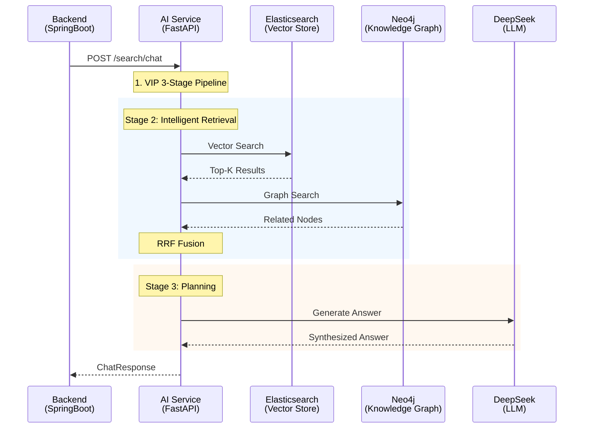
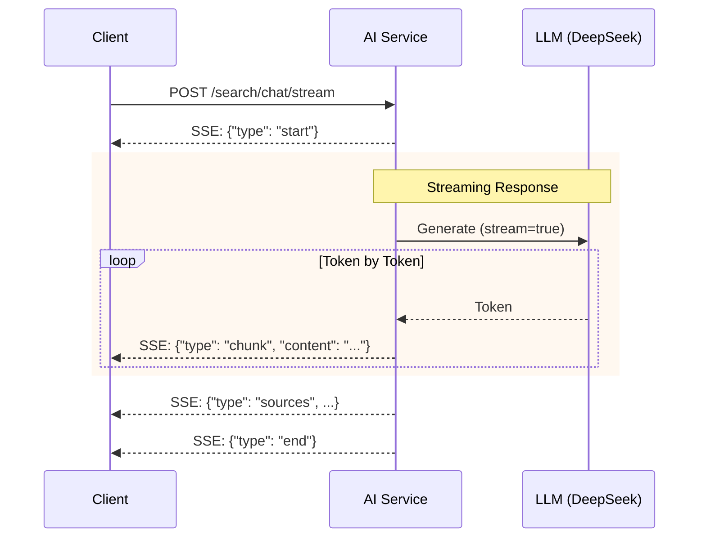

# RAG Search API Specification
## Internal API (Backend ↔ AI Service)

**버전**: 1.0
**작성일**: 2026-01-24
**상태**: Draft
**OpenAPI 버전**: 3.0.3

---

## 문서 정보

| 항목 | 내용 |
|------|------|
| **문서명** | RAG Search API Specification |
| **버전** | 1.0 |
| **작성일** | 2026-01-24 |
| **작성자** | ML/RAG Engineer (mlrag) |
| **상태** | Draft |
| **관련 문서** | [API 통합 설계서](./api_integration_design.md), [상세 설계서](./hybrid_rag_platform_detailed_design.md), [에러 코드 표준](./error_code_standards.md) |

---

## 변경 이력

| 버전 | 일자 | 작성자 | 변경 내용 |
|------|------|--------|----------|
| 1.0 | 2026-01-24 | mlrag | 초안 작성 - Search/Embed/Extract/Health API 문서화 |

---

## 목차

1. [개요](#1-개요)
2. [API 아키텍처](#2-api-아키텍처)
3. [Search API](#3-search-api)
   - [3.1 Hybrid Search](#31-hybrid-search)
   - [3.2 Chat Search](#32-chat-search)
   - [3.3 Chat Stream](#33-chat-stream)
4. [Embed API](#4-embed-api)
   - [4.1 Single Embed](#41-single-embed)
   - [4.2 Batch Embed](#42-batch-embed)
5. [Extract API](#5-extract-api)
   - [5.1 Entity Extraction](#51-entity-extraction)
   - [5.2 Metadata Extraction](#52-metadata-extraction)
6. [Health API](#6-health-api)
   - [6.1 Health Check](#61-health-check)
   - [6.2 Liveness Probe](#62-liveness-probe)
   - [6.3 Readiness Probe](#63-readiness-probe)
7. [공통 스키마](#7-공통-스키마)
8. [에러 응답](#8-에러-응답)

---

## 1. 개요

### 1.1 목적

본 문서는 Knowledge Service (AI Service)의 RAG 파이프라인 API를 정의합니다.
Backend(SpringBoot)에서 AI Service(FastAPI)를 호출할 때 사용하는 Internal API입니다.

### 1.2 Base URL

| 환경 | Base URL |
|------|----------|
| **개발** | `http://localhost:8000/api/v1` |
| **스테이징** | `http://ai-service:8000/api/v1` |
| **프로덕션** | `http://ai-service:8000/api/v1` |

### 1.3 API 엔드포인트 요약

| 그룹 | 엔드포인트 | 메서드 | 설명 |
|------|------------|--------|------|
| **Search** | `/search/hybrid` | POST | Vector+Graph Hybrid 검색 |
| **Search** | `/search/chat` | POST | 대화형 RAG 검색 (답변 생성) |
| **Search** | `/search/chat/stream` | POST | SSE 스트리밍 대화형 검색 |
| **Embed** | `/embed` | POST | 단일 텍스트 임베딩 |
| **Embed** | `/embed/batch` | POST | 배치 임베딩 |
| **Extract** | `/extract/entities` | POST | 엔티티/관계 추출 (Gleaning) |
| **Extract** | `/extract/metadata` | POST | 문서 메타데이터 추출 |
| **Health** | `/health` | GET | 서비스 상태 확인 |
| **Health** | `/health/live` | GET | Liveness Probe (K8s) |
| **Health** | `/health/ready` | GET | Readiness Probe (K8s) |

---

## 2. API 아키텍처

### 2.1 API 호출 흐름



### 2.2 VIP 3-Stage Pipeline 개요

| Stage | 이름 | 역할 | API |
|-------|------|------|-----|
| **Stage 1** | Value | 문서 인덱싱 시 엔티티/메타데이터 추출 | `/extract/*` |
| **Stage 2** | Intelligent | Hybrid 검색 + RRF 융합 + Reranking | `/search/hybrid` |
| **Stage 3** | Planning | 컨텍스트 기반 답변 합성 | `/search/chat` |

---

## 3. Search API

### 3.1 Hybrid Search

Vector Search(Elasticsearch)와 Graph Search(Neo4j)를 결합한 Hybrid 검색을 수행합니다.

#### 엔드포인트

```
POST /api/v1/search/hybrid
```

#### 요청 헤더

| 헤더 | 필수 | 설명 |
|------|:----:|------|
| `Content-Type` | Y | `application/json` |
| `X-Request-Id` | N | 요청 추적 ID (UUID) |

#### 요청 바디

```json
{
  "query": "프로젝트 일정 관련 문서를 찾아줘",
  "top_k": 10,
  "filters": {
    "document_type": "기술문서",
    "project_name": "Hybrid RAG"
  }
}
```

| 필드 | 타입 | 필수 | 설명 | 제약조건 |
|------|------|:----:|------|----------|
| `query` | string | Y | 검색 질의 | 1~1000자 |
| `top_k` | integer | N | 반환 결과 수 (기본값: 10) | 1~100 |
| `filters` | object | N | 필터 조건 | - |
| `filters.document_type` | string | N | 문서 유형 필터 | - |
| `filters.project_name` | string | N | 프로젝트명 필터 | - |

#### 응답 (200 OK)

```json
{
  "query": "프로젝트 일정 관련 문서를 찾아줘",
  "results": [
    {
      "chunk_id": "550e8400-e29b-41d4-a716-446655440001",
      "document_id": "550e8400-e29b-41d4-a716-446655440000",
      "content": "2026년 1분기 프로젝트 일정은 다음과 같습니다...",
      "score": 0.92,
      "metadata": {
        "document_type": "기술문서",
        "project_name": "Hybrid RAG",
        "title": "프로젝트 계획서",
        "created_at": "2026-01-15T10:00:00Z"
      }
    }
  ],
  "total": 1
}
```

| 필드 | 타입 | 설명 |
|------|------|------|
| `query` | string | 원본 검색 질의 |
| `results` | array | 검색 결과 목록 |
| `results[].chunk_id` | string (UUID) | 청크 고유 ID |
| `results[].document_id` | string (UUID) | 문서 고유 ID |
| `results[].content` | string | 청크 내용 |
| `results[].score` | number | 관련성 점수 (0.0~1.0) |
| `results[].metadata` | object | 청크 메타데이터 |
| `total` | integer | 총 결과 수 |

#### 에러 응답

| 상태 코드 | 에러 코드 | 설명 |
|-----------|----------|------|
| 400 | `SRCH100` | 잘못된 검색 요청 (query 누락 등) |
| 500 | `SRCH500` | 검색 엔진 오류 |

---

### 3.2 Chat Search

VIP 3-Stage Pipeline을 통한 대화형 RAG 검색입니다.
검색 결과를 기반으로 LLM이 자연어 답변을 합성합니다.

#### 엔드포인트

```
POST /api/v1/search/chat
```

#### 요청 바디

```json
{
  "query": "Hybrid RAG 시스템의 주요 특징은 무엇인가요?",
  "conversation_id": "conv-550e8400-e29b-41d4-a716-446655440000",
  "top_k": 5
}
```

| 필드 | 타입 | 필수 | 설명 | 제약조건 |
|------|------|:----:|------|----------|
| `query` | string | Y | 사용자 질문 | 1~2000자 |
| `conversation_id` | string | N | 대화 세션 ID | UUID 형식 |
| `top_k` | integer | N | 검색 결과 수 (기본값: 5) | 1~20 |

#### 응답 (200 OK)

```json
{
  "answer": "Hybrid RAG 시스템의 주요 특징은 다음과 같습니다:\n\n1. **Vector + Graph 통합 검색**: Elasticsearch 기반 Dense Vector 검색과 Neo4j 기반 Knowledge Graph 검색을 결합하여 의미적 관련성과 구조적 관계를 모두 활용합니다.\n\n2. **RRF 융합 알고리즘**: Reciprocal Rank Fusion으로 다중 검색 소스의 결과를 최적 융합합니다.\n\n3. **Gleaning 기법**: 엔티티 추출 시 반복적인 품질 개선을 통해 높은 추출 품질을 보장합니다.",
  "sources": [
    {
      "document_id": "550e8400-e29b-41d4-a716-446655440000",
      "title": "Hybrid RAG 상세 설계서",
      "chunk_id": "550e8400-e29b-41d4-a716-446655440001",
      "relevance_score": 0.95
    }
  ],
  "conversation_id": "conv-550e8400-e29b-41d4-a716-446655440000"
}
```

| 필드 | 타입 | 설명 |
|------|------|------|
| `answer` | string | LLM이 생성한 답변 |
| `sources` | array | 답변 출처 정보 |
| `sources[].document_id` | string (UUID) | 출처 문서 ID |
| `sources[].title` | string | 문서 제목 |
| `sources[].chunk_id` | string (UUID) | 참조 청크 ID |
| `sources[].relevance_score` | number | 관련성 점수 |
| `conversation_id` | string | 대화 세션 ID |

#### 에러 응답

| 상태 코드 | 에러 코드 | 설명 |
|-----------|----------|------|
| 400 | `SRCH100` | 잘못된 검색 요청 |
| 500 | `SRCH500` | 검색 처리 오류 |
| 503 | `LLM500` | LLM 서비스 불가 |

---

### 3.3 Chat Stream

Server-Sent Events(SSE)를 통한 실시간 스트리밍 대화형 검색입니다.

#### 엔드포인트

```
POST /api/v1/search/chat/stream
```

#### 요청 바디

```json
{
  "query": "RAG 시스템에서 Gleaning이란?",
  "conversation_id": null,
  "top_k": 5
}
```

(요청 형식은 Chat Search와 동일)

#### 응답 (200 OK, SSE Stream)

```
Content-Type: text/event-stream
Cache-Control: no-cache
Connection: keep-alive
```

##### SSE 이벤트 형식

**시작 이벤트**
```
data: {"type": "start", "message": "Processing..."}

```

**청크 이벤트** (답변 토큰 단위)
```
data: {"type": "chunk", "content": "Gleaning은 "}

data: {"type": "chunk", "content": "엔티티 추출의 "}

data: {"type": "chunk", "content": "품질을 향상시키는 "}

data: {"type": "chunk", "content": "반복적 기법입니다."}

```

**출처 이벤트**
```
data: {"type": "sources", "sources": [{"document_id": "...", "title": "..."}]}

```

**종료 이벤트**
```
data: {"type": "end"}

```

#### 시퀀스 다이어그램



---

## 4. Embed API

BGE-M3 모델 기반 텍스트 임베딩 생성 API입니다.

### 4.1 Single Embed

단일 텍스트에 대한 Dense 임베딩 벡터를 생성합니다.

#### 엔드포인트

```
POST /api/v1/embed
```

#### 요청 바디

```json
{
  "text": "Hybrid RAG 시스템은 Vector와 Graph 검색을 결합합니다."
}
```

| 필드 | 타입 | 필수 | 설명 | 제약조건 |
|------|------|:----:|------|----------|
| `text` | string | Y | 임베딩할 텍스트 | 1~10000자 |

#### 응답 (200 OK)

```json
{
  "embedding": [0.0123, -0.0456, 0.0789, ...],
  "dimension": 1024
}
```

| 필드 | 타입 | 설명 |
|------|------|------|
| `embedding` | array[float] | Dense 임베딩 벡터 |
| `dimension` | integer | 벡터 차원 (1024) |

#### 에러 응답

| 상태 코드 | 에러 코드 | 설명 |
|-----------|----------|------|
| 400 | `EMB100` | 잘못된 요청 (text 누락/초과) |
| 500 | `EMB500` | 임베딩 생성 오류 |

---

### 4.2 Batch Embed

여러 텍스트에 대한 배치 임베딩을 생성합니다.

#### 엔드포인트

```
POST /api/v1/embed/batch
```

#### 요청 바디

```json
{
  "texts": [
    "첫 번째 텍스트입니다.",
    "두 번째 텍스트입니다.",
    "세 번째 텍스트입니다."
  ]
}
```

| 필드 | 타입 | 필수 | 설명 | 제약조건 |
|------|------|:----:|------|----------|
| `texts` | array[string] | Y | 임베딩할 텍스트 목록 | 1~100개 |

#### 응답 (200 OK)

```json
{
  "embeddings": [
    [0.0123, -0.0456, ...],
    [0.0234, -0.0567, ...],
    [0.0345, -0.0678, ...]
  ],
  "dimension": 1024,
  "count": 3
}
```

| 필드 | 타입 | 설명 |
|------|------|------|
| `embeddings` | array[array[float]] | 임베딩 벡터 목록 |
| `dimension` | integer | 벡터 차원 (1024) |
| `count` | integer | 처리된 텍스트 수 |

#### 에러 응답

| 상태 코드 | 에러 코드 | 설명 |
|-----------|----------|------|
| 400 | `EMB100` | 잘못된 요청 |
| 500 | `EMB500` | 배치 임베딩 생성 오류 |

---

## 5. Extract API

VIP Stage 1 (Value)의 엔티티 및 메타데이터 추출 API입니다.

### 5.1 Entity Extraction

문서에서 엔티티와 관계를 추출합니다. Gleaning 기법을 통해 추출 품질을 향상시킵니다.

#### 엔드포인트

```
POST /api/v1/extract/entities
```

#### 요청 바디

```json
{
  "text": "홍길동 팀장이 2026년 1월에 Hybrid RAG 프로젝트를 시작했습니다. 이 프로젝트는 LangGraph와 Neo4j를 활용합니다.",
  "enable_gleaning": true,
  "document_id": "550e8400-e29b-41d4-a716-446655440000"
}
```

| 필드 | 타입 | 필수 | 설명 | 제약조건 |
|------|------|:----:|------|----------|
| `text` | string | Y | 추출 대상 텍스트 | 10~50000자 |
| `enable_gleaning` | boolean | N | Gleaning 활성화 (기본값: true) | - |
| `document_id` | string | N | 문서 ID (추적용) | UUID 형식 |

#### 응답 (200 OK)

```json
{
  "entities": [
    {
      "id": "ent-001",
      "name": "홍길동",
      "type": "Person",
      "description": "팀장"
    },
    {
      "id": "ent-002",
      "name": "Hybrid RAG",
      "type": "Project",
      "description": "2026년 1월 시작된 프로젝트"
    },
    {
      "id": "ent-003",
      "name": "LangGraph",
      "type": "Technology",
      "description": "프로젝트에서 활용하는 기술"
    },
    {
      "id": "ent-004",
      "name": "Neo4j",
      "type": "Technology",
      "description": "프로젝트에서 활용하는 기술"
    }
  ],
  "relationships": [
    {
      "source": "ent-001",
      "target": "ent-002",
      "type": "PARTICIPATED",
      "description": "홍길동이 Hybrid RAG 프로젝트를 시작함"
    },
    {
      "source": "ent-002",
      "target": "ent-003",
      "type": "USES",
      "description": "Hybrid RAG 프로젝트가 LangGraph를 활용함"
    },
    {
      "source": "ent-002",
      "target": "ent-004",
      "type": "USES",
      "description": "Hybrid RAG 프로젝트가 Neo4j를 활용함"
    }
  ],
  "gleaning_passes": 1
}
```

| 필드 | 타입 | 설명 |
|------|------|------|
| `entities` | array | 추출된 엔티티 목록 |
| `entities[].id` | string | 엔티티 고유 ID |
| `entities[].name` | string | 엔티티명 |
| `entities[].type` | string | 엔티티 유형 |
| `entities[].description` | string | 엔티티 설명 |
| `relationships` | array | 추출된 관계 목록 |
| `relationships[].source` | string | 소스 엔티티 ID |
| `relationships[].target` | string | 타겟 엔티티 ID |
| `relationships[].type` | string | 관계 유형 |
| `relationships[].description` | string | 관계 설명 |
| `gleaning_passes` | integer | Gleaning 수행 횟수 |

#### 엔티티 유형 (Entity Types)

| 유형 | 설명 | 예시 |
|------|------|------|
| `Person` | 사람/담당자 | 홍길동, 김철수 |
| `Project` | 프로젝트 | Hybrid RAG, HRKP |
| `Technology` | 기술/도구 | LangGraph, Neo4j, Python |
| `Organization` | 조직/부서 | 개발팀, AI Lab |
| `Concept` | 개념/용어 | RAG, Gleaning, RRF |

#### 관계 유형 (Relationship Types)

| 유형 | 설명 | 예시 |
|------|------|------|
| `CREATED` | 생성/작성 | 홍길동 -[CREATED]-> 설계서 |
| `PARTICIPATED` | 참여 | 홍길동 -[PARTICIPATED]-> 프로젝트 |
| `USES` | 활용/사용 | 프로젝트 -[USES]-> LangGraph |
| `BELONGS_TO` | 소속 | 홍길동 -[BELONGS_TO]-> 개발팀 |
| `RELATED_TO` | 연관 | 개념A -[RELATED_TO]-> 개념B |

#### 에러 응답

| 상태 코드 | 에러 코드 | 설명 |
|-----------|----------|------|
| 400 | `EXT100` | 잘못된 요청 |
| 500 | `EXT500` | 엔티티 추출 오류 |

---

### 5.2 Metadata Extraction

문서에서 메타데이터(문서 유형, 프로젝트명, 유효 기간, 카테고리, 요약)를 자동 추출합니다.

#### 엔드포인트

```
POST /api/v1/extract/metadata
```

#### 요청 바디

```json
{
  "text": "본 문서는 Hybrid RAG 프로젝트의 상세 설계서입니다. 작성일: 2026-01-15, 유효기간: 2026-12-31까지...",
  "filename": "hybrid_rag_detailed_design.md"
}
```

| 필드 | 타입 | 필수 | 설명 | 제약조건 |
|------|------|:----:|------|----------|
| `text` | string | Y | 추출 대상 텍스트 | 10~50000자 |
| `filename` | string | N | 원본 파일명 (힌트용) | - |

#### 응답 (200 OK)

```json
{
  "metadata": {
    "document_type": "기술문서",
    "project_name": "Hybrid RAG",
    "valid_start_date": "2026-01-15",
    "valid_end_date": "2026-12-31",
    "categories": {
      "level1": "개발",
      "level2": "설계",
      "level3": "상세설계"
    },
    "summary": "Hybrid RAG 시스템의 아키텍처, VIP 3-Stage 파이프라인, 데이터 모델, API 설계 등을 포함한 상세 설계 문서입니다."
  }
}
```

| 필드 | 타입 | 설명 |
|------|------|------|
| `metadata` | object | 추출된 메타데이터 |
| `metadata.document_type` | string | 문서 유형 |
| `metadata.project_name` | string | 프로젝트명 |
| `metadata.valid_start_date` | string (date) | 유효 시작일 |
| `metadata.valid_end_date` | string (date) | 유효 종료일 |
| `metadata.categories` | object | 계층적 카테고리 |
| `metadata.categories.level1` | string | 대분류 |
| `metadata.categories.level2` | string | 중분류 |
| `metadata.categories.level3` | string | 소분류 (선택) |
| `metadata.summary` | string | 문서 요약 |

#### 문서 유형 (Document Types)

| 유형 | 설명 |
|------|------|
| `기술문서` | 설계서, 명세서, 가이드 |
| `제안서` | 사업 제안서, 프로젝트 제안서 |
| `회의록` | 회의 기록, 협의 내용 |
| `보고서` | 진행 보고서, 결과 보고서 |
| `매뉴얼` | 사용자 매뉴얼, 운영 매뉴얼 |

#### 에러 응답

| 상태 코드 | 에러 코드 | 설명 |
|-----------|----------|------|
| 400 | `EXT100` | 잘못된 요청 |
| 500 | `EXT500` | 메타데이터 추출 오류 |

---

## 6. Health API

서비스 상태 확인 및 Kubernetes 프로브 API입니다.

### 6.1 Health Check

서비스의 전체 상태와 의존성 상태를 확인합니다.

#### 엔드포인트

```
GET /api/v1/health
```

#### 응답 (200 OK)

```json
{
  "status": "healthy",
  "version": "0.1.0",
  "environment": "development",
  "timestamp": "2026-01-24T10:30:00Z",
  "dependencies": {
    "deepseek_api": "healthy",
    "elasticsearch": "healthy",
    "neo4j": "healthy",
    "postgresql": "healthy"
  }
}
```

| 필드 | 타입 | 설명 |
|------|------|------|
| `status` | string | 서비스 상태 (`healthy`, `degraded`, `unhealthy`) |
| `version` | string | 서비스 버전 |
| `environment` | string | 실행 환경 |
| `timestamp` | string (ISO 8601) | 체크 시간 |
| `dependencies` | object | 의존성별 상태 |

#### 상태 정의

| 상태 | 조건 | 설명 |
|------|------|------|
| `healthy` | 모든 의존성 정상 | 정상 운영 가능 |
| `degraded` | 일부 의존성 비정상 | 기능 제한 |
| `unhealthy` | 핵심 의존성 비정상 | 서비스 불가 |

---

### 6.2 Liveness Probe

Kubernetes Liveness Probe용 간단한 상태 확인입니다.

#### 엔드포인트

```
GET /api/v1/health/live
```

#### 응답 (200 OK)

```json
{
  "status": "alive"
}
```

---

### 6.3 Readiness Probe

Kubernetes Readiness Probe용 서비스 준비 상태 확인입니다.

#### 엔드포인트

```
GET /api/v1/health/ready
```

#### 응답 (200 OK)

```json
{
  "ready": true,
  "checks": {
    "config_loaded": true,
    "llm_api_key_set": true
  }
}
```

| 필드 | 타입 | 설명 |
|------|------|------|
| `ready` | boolean | 서비스 준비 완료 여부 |
| `checks` | object | 개별 체크 결과 |
| `checks.config_loaded` | boolean | 설정 로드 완료 |
| `checks.llm_api_key_set` | boolean | LLM API 키 설정 완료 |

---

## 7. 공통 스키마

### 7.1 Entity

```yaml
Entity:
  type: object
  required:
    - id
    - name
    - type
  properties:
    id:
      type: string
      description: 엔티티 고유 ID
      example: "ent-001"
    name:
      type: string
      description: 엔티티명
      example: "홍길동"
    type:
      type: string
      enum: [Person, Project, Technology, Organization, Concept]
      description: 엔티티 유형
      example: "Person"
    description:
      type: string
      description: 엔티티 설명
      example: "팀장"
```

### 7.2 Relationship

```yaml
Relationship:
  type: object
  required:
    - source
    - target
    - type
  properties:
    source:
      type: string
      description: 소스 엔티티 ID
      example: "ent-001"
    target:
      type: string
      description: 타겟 엔티티 ID
      example: "ent-002"
    type:
      type: string
      enum: [CREATED, PARTICIPATED, USES, BELONGS_TO, RELATED_TO]
      description: 관계 유형
      example: "PARTICIPATED"
    description:
      type: string
      description: 관계 설명
      example: "홍길동이 프로젝트에 참여함"
```

### 7.3 SearchResult

```yaml
SearchResult:
  type: object
  required:
    - chunk_id
    - document_id
    - content
    - score
  properties:
    chunk_id:
      type: string
      format: uuid
      description: 청크 고유 ID
    document_id:
      type: string
      format: uuid
      description: 문서 고유 ID
    content:
      type: string
      description: 청크 내용
    score:
      type: number
      format: float
      minimum: 0.0
      maximum: 1.0
      description: 관련성 점수
    metadata:
      type: object
      description: 메타데이터
```

### 7.4 DocumentMetadata

```yaml
DocumentMetadata:
  type: object
  required:
    - document_type
  properties:
    document_type:
      type: string
      description: 문서 유형
      example: "기술문서"
    project_name:
      type: string
      description: 프로젝트명
      example: "Hybrid RAG"
    valid_start_date:
      type: string
      format: date
      description: 유효 시작일
      example: "2026-01-15"
    valid_end_date:
      type: string
      format: date
      description: 유효 종료일
      example: "2026-12-31"
    categories:
      $ref: '#/components/schemas/CategoryMetadata'
    summary:
      type: string
      description: 문서 요약
```

### 7.5 CategoryMetadata

```yaml
CategoryMetadata:
  type: object
  required:
    - level1
    - level2
  properties:
    level1:
      type: string
      description: 대분류
      example: "개발"
    level2:
      type: string
      description: 중분류
      example: "설계"
    level3:
      type: string
      description: 소분류 (선택)
      example: "상세설계"
```

---

## 8. 에러 응답

### 8.1 에러 응답 형식

```json
{
  "detail": "검색 처리 중 오류가 발생했습니다: [오류 상세]"
}
```

| 필드 | 타입 | 설명 |
|------|------|------|
| `detail` | string | 에러 상세 메시지 |

### 8.2 에러 코드 목록

| 에러 코드 | HTTP 상태 | 설명 |
|----------|-----------|------|
| `SRCH100` | 400 | 잘못된 검색 요청 |
| `SRCH500` | 500 | 검색 엔진 오류 |
| `EMB100` | 400 | 잘못된 임베딩 요청 |
| `EMB500` | 500 | 임베딩 생성 오류 |
| `EXT100` | 400 | 잘못된 추출 요청 |
| `EXT500` | 500 | 추출 처리 오류 |
| `LLM500` | 503 | LLM 서비스 불가 |

### 8.3 Validation Error (422)

```json
{
  "detail": [
    {
      "type": "string_too_short",
      "loc": ["body", "query"],
      "msg": "String should have at least 1 character",
      "input": "",
      "ctx": {"min_length": 1}
    }
  ]
}
```

---

## 부록: cURL 예시

### Hybrid Search

```bash
curl -X POST "http://localhost:8000/api/v1/search/hybrid" \
  -H "Content-Type: application/json" \
  -d '{
    "query": "프로젝트 일정",
    "top_k": 5
  }'
```

### Chat Search

```bash
curl -X POST "http://localhost:8000/api/v1/search/chat" \
  -H "Content-Type: application/json" \
  -d '{
    "query": "Hybrid RAG 시스템의 특징은?",
    "top_k": 5
  }'
```

### Single Embed

```bash
curl -X POST "http://localhost:8000/api/v1/embed" \
  -H "Content-Type: application/json" \
  -d '{
    "text": "임베딩할 텍스트입니다."
  }'
```

### Entity Extraction

```bash
curl -X POST "http://localhost:8000/api/v1/extract/entities" \
  -H "Content-Type: application/json" \
  -d '{
    "text": "홍길동이 Hybrid RAG 프로젝트를 진행합니다.",
    "enable_gleaning": true
  }'
```

### Health Check

```bash
curl "http://localhost:8000/api/v1/health"
```

---

**문서 끝**
