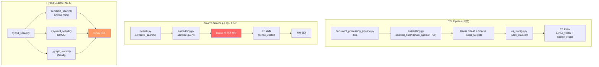
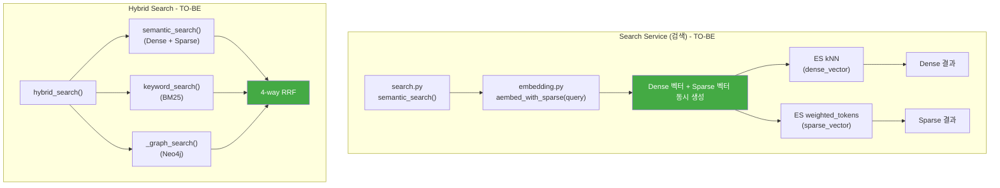
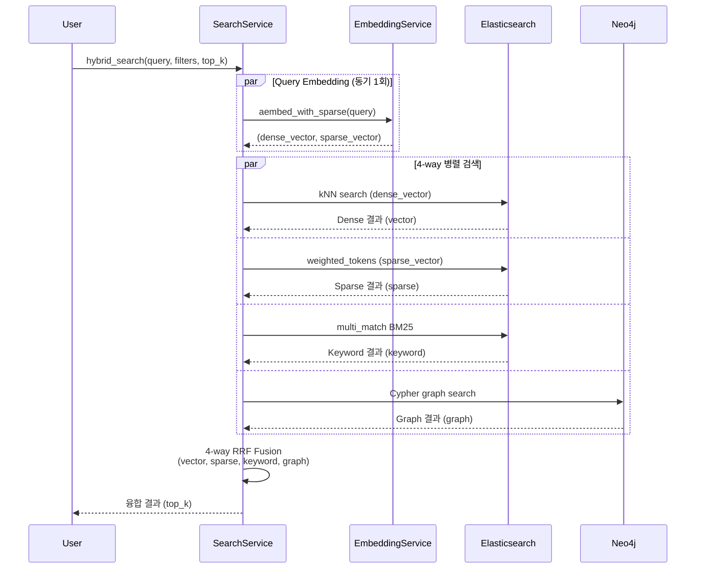
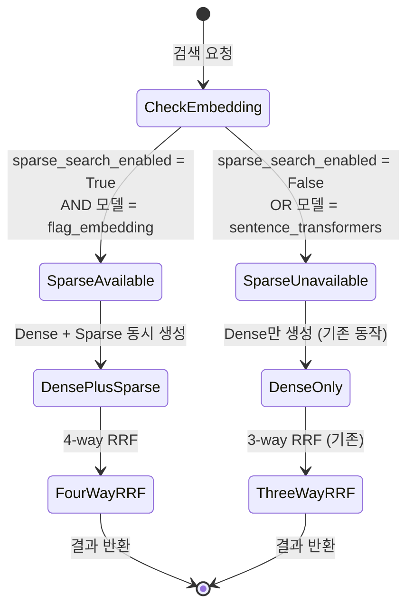

# Sparse 벡터 검색 통합 상세 설계서

## 문서 정보

| 항목 | 내용 |
|------|------|
| 문서명 | Sparse 벡터 검색 통합 상세 설계서 |
| 버전 | 1.0 |
| 작성일 | 2026-02-14 |
| 작성자 | Architect Agent |
| 상태 | Draft |

## 변경 이력

| 버전 | 일자 | 작성자 | 변경 내용 |
|------|------|--------|-----------|
| 1.0 | 2026-02-14 | Architect | 초안 작성 |
| 1.1 | 2026-02-14 | Claude | **[Critical] weighted_tokens/text_expansion은 ES Platinum 유료 기능 → 사용 불가. 무료 대안으로 전환 필요** |

---

> **[Critical 수정 필요 - 2026-02-14 19:35 KST]**
>
> 본 설계서의 `weighted_tokens` 쿼리는 **ES Platinum/Enterprise 라이선스 필요**.
> 현재 프로젝트는 ES Basic(무료) 라이선스이므로 사용 불가.
>
> **무료 대안 (v1.1에서 전환 예정)**:
> - Sparse 토큰을 `bool > should > term` + `boost` 쿼리로 변환
> - BGE-M3의 `{"금융": 0.82, "정책": 0.71}` → `[{"term": {"text": {"value": "금융", "boost": 0.82}}}, ...]`
> - Nori analyzer가 이미 적용되어 있으므로 한국어 토큰 매칭과 자연스럽게 결합
> - 추가 인덱스 변경 불필요 (기존 `text` 필드의 Nori 분석 활용)

## 1. 개요

### 1.1 배경 및 목적

현재 시스템은 BGE-M3의 Dense 벡터(1024차원)와 Sparse 벡터(lexical_weights)를 모두 **생성하고 Elasticsearch에 저장**하고 있으나, **검색 단계에서는 Dense kNN만 사용**하고 Sparse 벡터를 활용하지 않고 있다. 이는 BGE-M3의 핵심 장점인 Multi-Representational Retrieval(Dense + Sparse + ColBERT) 중 Sparse를 완전히 사용하지 않는 비효율적 구조이다.

Sparse 벡터 검색을 통합하면:
- **어휘적 매칭 강화**: 고유명사, 기술 용어, 약어 등 Dense 벡터만으로는 놓치기 쉬운 정확한 토큰 매칭 가능
- **BM25 대비 개선**: 학습 기반 토큰 가중치로 BM25보다 정교한 키워드 검색
- **4-way Hybrid Search**: Dense + Sparse + BM25 + Graph RRF 융합으로 검색 품질 극대화

### 1.2 범위

- `search.py`의 `semantic_search()` 및 `hybrid_search()` 수정
- `retriever.py`의 `HybridRetriever` 연쇄 반영
- `config.py`에 `rrf_weight_sparse` 추가
- `embedding.py`에 쿼리 시 Sparse 벡터 생성 메서드 추가
- ES 쿼리 구조 설계 (ES 8.11 호환)

### 1.3 관련 문서

| 문서 | 위치 |
|------|------|
| 플랫폼 상세 설계서 v2.4 | `docs/02_design/01_hybrid_rag_platform_detailed_design.md` |
| 임베딩 배치 설계서 | `docs/02_design/16_embedding_batch_detailed_design.md` |
| 임베딩 파이프라인 검증 보고서 | `docs/04_testing/07_test_results/05_embedding_pipeline_verification_report_2026-02-05.md` |

---

## 2. 시스템 컨텍스트

### 2.1 현재 아키텍처 (AS-IS)



**핵심 GAP**: `sparse_vector` 필드는 ES에 저장되어 있으나, 검색 시 전혀 사용되지 않음.

### 2.2 목표 아키텍처 (TO-BE)



---

## 3. 상세 설계

### 3.1 ES Sparse Vector 검색 방법

#### 3.1.1 ES 버전 호환성 분석

| ES 버전 | 사용 가능한 쿼리 | 상태 |
|---------|-----------------|------|
| 8.11 (현재) | `weighted_tokens` | 사용 가능 (8.15에서 deprecated) |
| 8.15+ | `sparse_vector` (query_vector) | 권장 (weighted_tokens 대체) |

현재 시스템은 **ES 8.11.0-nori** (`infrastructure/docker/docker-compose.yml`)를 사용하므로 `weighted_tokens` 쿼리를 사용한다.

> **마이그레이션 경로**: ES 8.15+ 업그레이드 시 `weighted_tokens` -> `sparse_vector` 쿼리로 전환. 설계 시 쿼리 빌더를 분리하여 교체 용이성을 확보한다.

#### 3.1.2 weighted_tokens 쿼리 구조

BGE-M3의 `lexical_weights`는 `{"token_string": weight_float}` 형태로, ES의 `weighted_tokens` 쿼리와 직접 호환된다.

```json
{
  "query": {
    "weighted_tokens": {
      "sparse_vector": {
        "tokens": {
          "인공지능": 0.8547,
          "AI": 0.7213,
          "모델": 0.6891,
          "학습": 0.5432
        },
        "pruning_config": {
          "tokens_freq_ratio_threshold": 5,
          "tokens_weight_threshold": 0.4,
          "only_score_pruned_tokens": false
        }
      }
    }
  }
}
```

**스코어링 방식**: 저장된 sparse_vector와 쿼리 tokens의 **dot product** (내적)으로 계산.

```
stored = {"인공지능": 0.9, "AI": 0.7, "딥러닝": 0.8}
query  = {"인공지능": 0.85, "AI": 0.72, "모델": 0.69}

_score = 0.9 * 0.85 + 0.7 * 0.72 = 0.765 + 0.504 = 1.269
```

#### 3.1.3 ES 8.15+ 마이그레이션 시 쿼리 (참고)

```json
{
  "query": {
    "sparse_vector": {
      "field": "sparse_vector",
      "query_vector": {
        "인공지능": 0.8547,
        "AI": 0.7213,
        "모델": 0.6891
      }
    }
  }
}
```

### 3.2 검색 흐름 (Sequence Diagram)



### 3.3 search.py 수정 설계

#### 3.3.1 semantic_search() 변경

**현재** (`search.py:452-540`): Dense kNN 검색만 수행.

**변경**: Dense kNN + Sparse weighted_tokens를 **같은 메서드 내에서 병렬** 실행.

```python
# search.py - semantic_search() 수정 (pseudo code)

async def semantic_search(
    self,
    query: str,
    filters: Optional[Dict[str, Any]] = None,
    top_k: int = 10,
    user_id: Optional[str] = None,
    use_sparse: bool = True,  # 신규 파라미터
) -> Dict[str, Any]:
    start_time = time.monotonic()
    search_filters = SearchFilters.from_dict(filters)

    # 1. 쿼리 임베딩 생성 (Dense + Sparse 동시)
    if use_sparse:
        query_dense, query_sparse = await self._embedding_service.aembed_with_sparse(query)
    else:
        query_dense = await self._embedding_service.aembed(query)
        query_sparse = None

    dense_results: List[SearchResult] = []
    sparse_results: List[SearchResult] = []

    if self.es_client is not None:
        tasks = []

        # Dense kNN 검색 (기존)
        knn_body = {
            "knn": {
                "field": "dense_vector",
                "query_vector": query_dense,
                "k": top_k,
                "num_candidates": top_k * 10,
            },
            "size": top_k,
        }
        # 필터 적용
        es_filters = search_filters.to_es_filter()
        if es_filters:
            knn_body["knn"]["filter"] = {"bool": {"must": es_filters}}

        tasks.append(self._es_search(body=knn_body, index=settings.elasticsearch_index))

        # Sparse weighted_tokens 검색 (신규)
        if query_sparse and use_sparse:
            sparse_body = self._build_sparse_query(
                query_sparse, es_filters, top_k
            )
            tasks.append(self._es_search(body=sparse_body, index=settings.elasticsearch_index))

        results = await asyncio.gather(*tasks, return_exceptions=True)

        # Dense 결과 파싱
        if not isinstance(results[0], Exception):
            dense_results = self._parse_es_results(results[0], source="vector")

        # Sparse 결과 파싱
        if len(results) > 1 and not isinstance(results[1], Exception):
            sparse_results = self._parse_es_results(results[1], source="sparse")

    return {
        "results": dense_results,
        "sparse_results": sparse_results,  # 신규 반환값
        "total": len(dense_results),
        "search_type": "semantic",
        "latency_ms": round((time.monotonic() - start_time) * 1000, 2),
    }
```

#### 3.3.2 _build_sparse_query() 신규 메서드

```python
def _build_sparse_query(
    self,
    sparse_vector: Dict[str, float],
    es_filters: List[Dict[str, Any]],
    top_k: int,
) -> Dict[str, Any]:
    """Sparse 벡터 검색 쿼리 빌드 (ES 8.11: weighted_tokens)

    Args:
        sparse_vector: BGE-M3 lexical_weights {token: weight}
        es_filters: ES 필터 쿼리 리스트
        top_k: 반환할 결과 수

    Returns:
        ES 검색 쿼리 본문
    """
    # 저가중치 토큰 프루닝 (weight < 0.1 제거)
    pruned_tokens = {
        token: weight
        for token, weight in sparse_vector.items()
        if weight >= settings.sparse_token_weight_threshold
    }

    weighted_tokens_query = {
        "weighted_tokens": {
            "sparse_vector": {
                "tokens": pruned_tokens,
                "pruning_config": {
                    "tokens_freq_ratio_threshold": 5,
                    "tokens_weight_threshold": settings.sparse_pruning_weight_threshold,
                    "only_score_pruned_tokens": False,
                },
            }
        }
    }

    body: Dict[str, Any] = {"size": top_k}

    if es_filters:
        body["query"] = {
            "bool": {
                "must": [weighted_tokens_query],
                "filter": es_filters,
            }
        }
    else:
        body["query"] = weighted_tokens_query

    return body
```

> **ES 8.15+ 마이그레이션**: `_build_sparse_query()`만 수정하면 됨.
> `weighted_tokens` -> `sparse_vector` 쿼리로 교체. 호출 인터페이스 변경 없음.

#### 3.3.3 hybrid_search() 4-way RRF 변경

**현재** (`search.py:199-450`): Vector + Keyword + Graph 3-way.

**변경**: semantic_search()가 `sparse_results`를 같이 반환하므로, 이를 RRF 소스에 추가.

```python
# hybrid_search() 수정 핵심 부분 (pseudo code)

# 1. 병렬 검색 실행
# semantic_search()가 {results: dense, sparse_results: sparse}를 반환
if use_vector:
    tasks.append(self.semantic_search(
        query=query, filters=filters, top_k=top_k * 2,
        use_sparse=True,
    ))
    task_names.append("semantic")

tasks.append(self.keyword_search(query=query, filters=filters, top_k=top_k * 2))
task_names.append("keyword")

if use_graph:
    tasks.append(self._graph_search(query=query, top_k=top_k * 2))
    task_names.append("graph")

results = await asyncio.gather(*tasks, return_exceptions=True)

# 결과 매핑 (4-way)
vector_results = []
sparse_results = []
keyword_results = []
graph_results = []

for i, task_name in enumerate(task_names):
    result = results[i]
    if task_name == "semantic":
        if isinstance(result, dict):
            vector_results = result.get("results", [])
            sparse_results = result.get("sparse_results", [])
    elif task_name == "keyword":
        # ... 기존 로직
    elif task_name == "graph":
        # ... 기존 로직

# 2. 4-way RRF 융합
result_lists = []
source_names = []
source_weights = []

if use_vector and vector_results:
    result_lists.append(vector_results)
    source_names.append("vector")
    source_weights.append(settings.rrf_weight_vector)

if sparse_results:  # 신규 Sparse 채널
    result_lists.append(sparse_results)
    source_names.append("sparse")
    source_weights.append(settings.rrf_weight_sparse)

if keyword_results:
    result_lists.append(keyword_results)
    source_names.append("keyword")
    source_weights.append(settings.rrf_weight_keyword)

if use_graph and graph_results:
    result_lists.append(graph_results)
    source_names.append("graph")
    source_weights.append(settings.rrf_weight_graph)

fused_results = self._rrf_fusion(
    result_lists=result_lists,
    source_names=source_names,
    weights=source_weights,
    k=settings.rrf_k,
)
```

### 3.4 embedding.py 수정 설계

#### 3.4.1 aembed_with_sparse() 신규 메서드

검색 쿼리에 대해 Dense + Sparse 벡터를 한 번의 모델 호출로 동시에 생성한다.

```python
# embedding.py 추가 (pseudo code)

async def aembed_with_sparse(
    self, text: str
) -> Tuple[List[float], Dict[str, float]]:
    """단일 텍스트에서 Dense + Sparse 벡터 동시 생성 (검색 쿼리용)

    Args:
        text: 쿼리 텍스트

    Returns:
        (dense_vector, sparse_vector) 튜플
        dense_vector: 1024차원 float 리스트
        sparse_vector: {token: weight} 딕셔너리
    """
    loop = asyncio.get_event_loop()

    def _encode():
        dense_vectors, sparse_vectors = self.embed_batch(
            [text], return_sparse=True
        )
        return dense_vectors[0], sparse_vectors[0]

    return await loop.run_in_executor(None, _encode)
```

**핵심 포인트**: `embed_batch([text], return_sparse=True)` 한 번의 호출로 Dense + Sparse 동시 생성. 모델 추론이 **1회만** 발생하므로 별도 Sparse 생성 오버헤드가 거의 없다.

#### 3.4.2 FlagEmbedding 모델 동작 확인

`embedding.py:659-671`에서 BGE-M3 FlagEmbedding 인코딩:

```python
result = self.model.encode(
    texts,
    batch_size=self.batch_size,
    max_length=self.max_length,
    return_dense=True,
    return_sparse=return_sparse,  # True면 lexical_weights 반환
    return_colbert_vecs=False,
)
dense = result["dense_vecs"].tolist()
sparse = result.get("lexical_weights", [{} for _ in texts])
```

`lexical_weights` 반환 형태 예시:
```python
[
    {"인공지능": 0.854, "AI": 0.721, "모델": 0.689, "학습": 0.543, ...},
    {"검색": 0.912, "벡터": 0.845, "임베딩": 0.778, ...}
]
```

이 형태가 ES `weighted_tokens` 쿼리의 `tokens` 필드와 **정확히 호환**된다.

### 3.5 config.py 추가 설정

```python
# config.py 추가 (pseudo code)

# RRF Sparse 채널 가중치
rrf_weight_sparse: float = Field(
    default=0.8,
    description="RRF Sparse 채널 가중치 (BGE-M3 lexical_weights)"
)

# Sparse 검색 설정
sparse_search_enabled: bool = Field(
    default=True,
    description="Sparse 벡터 검색 활성화 여부"
)

sparse_token_weight_threshold: float = Field(
    default=0.1,
    description="쿼리 시 Sparse 토큰 최소 가중치 (이하 프루닝)"
)

sparse_pruning_weight_threshold: float = Field(
    default=0.4,
    description="ES weighted_tokens pruning_config.tokens_weight_threshold"
)
```

### 3.6 retriever.py 연쇄 반영

`retriever.py`의 `HybridRetriever`는 `SearchService.hybrid_search()`에 위임하므로, `search.py`만 수정하면 자동으로 반영된다. 추가 변경 불필요.

```
HybridRetriever.retrieve()
  └── SearchService.hybrid_search()  ← 여기만 수정
        ├── semantic_search()  ← Dense + Sparse 동시 검색
        ├── keyword_search()   ← BM25 (기존)
        └── _graph_search()    ← Neo4j (기존)
```

### 3.7 상태 관리 (Sparse 사용 가능 여부)



**sentence-transformers 폴백 시**: Sparse 벡터가 빈 dict로 반환되므로 자동으로 3-way RRF로 폴백. 코드 분기 불필요 (sparse_results가 비어있으면 RRF 소스에 추가되지 않음).

---

## 4. 비기능 요구사항

### 4.1 성능

#### 4.1.1 Latency 영향 분석

| 단계 | 현재 | 변경 후 | 영향 |
|------|------|---------|------|
| 쿼리 임베딩 생성 | Dense만 (~50ms CPU) | Dense + Sparse 동시 (~55ms CPU) | +5ms (동일 모델 추론에서 lexical_weights 추출) |
| ES kNN 검색 | 1회 | 1회 (변경 없음) | 0 |
| ES Sparse 검색 | 없음 | 1회 추가 (~20-40ms) | +20-40ms |
| RRF 융합 | 3-way | 4-way | +1ms |

**총 예상 추가 Latency**: +26-46ms (병렬 실행 기준)

> ES kNN과 weighted_tokens 검색은 `asyncio.gather`로 **병렬 실행**되므로, 추가 latency는 둘 중 더 느린 쪽(kNN ~40ms)에 의해 결정됨. 실질적 추가 시간은 **5ms 이내** (임베딩 Sparse 추출분만).

#### 4.1.2 병렬 실행 구조

```mermaid
gantt
    title Hybrid Search Latency Timeline (TO-BE)
    dateFormat  X
    axisFormat  %L ms

    section Embedding
    Dense+Sparse 생성 (1회 모델 추론)   :emb, 0, 55

    section ES Parallel
    Dense kNN 검색         :after emb, 40
    Sparse weighted_tokens :after emb, 30
    BM25 Keyword 검색      :after emb, 25

    section Neo4j
    Graph 검색             :after emb, 35

    section Fusion
    4-way RRF              :rrf, 95, 2
```



### 4.2 메모리 관리

- Sparse 벡터 크기: 쿼리당 평균 100-300 토큰 x 4bytes = **0.4-1.2KB** (Dense 4KB 대비 미미)
- 검색 결과 내 sparse_results: Dense 결과와 동일 구조 (SearchResult 리스트), 메모리 추가 미미
- 프루닝으로 불필요 토큰 제거: weight < 0.1 토큰 제거 시 평균 50% 이상 감소

### 4.3 에러 처리

| 상황 | 처리 방식 |
|------|----------|
| Sparse 임베딩 생성 실패 | Dense만으로 검색 속행 (graceful degradation) |
| ES weighted_tokens 쿼리 실패 | 경고 로그 + Dense/BM25/Graph 3-way RRF로 폴백 |
| sentence-transformers 사용 시 | Sparse 빈 dict 반환 -> 자동 3-way 폴백 |
| ES 8.11 미만 버전 | weighted_tokens 미지원 -> Sparse 비활성화 |

---

## 5. Phase 2 ETL 연계 (Colab GPU)

### 5.1 ETL Phase별 Sparse 벡터 상태

| Phase | Dense | Sparse | 검색 동작 |
|-------|-------|--------|----------|
| Phase 1 (embedding=OFF) | 없음 | 없음 | BM25 + Graph 2-way |
| Phase 2 (Colab GPU) | 생성 | 생성 | Dense + Sparse + BM25 + Graph 4-way |
| Phase 3 (재인덱싱) | 갱신 | 갱신 | 4-way |

현재 `document_processing_pipeline.py:681-728`에서 Phase 2 임베딩 시 `return_sparse=True`로 Dense + Sparse를 동시 생성하고 `es_chunk["sparse_vector"]`에 저장하고 있다. **ETL 측 코드 변경 불필요**.

### 5.2 Sparse 벡터 존재 여부 확인

검색 시 Sparse 벡터가 없는 문서는 weighted_tokens 쿼리에서 자동으로 0점 처리된다. 별도 처리 불필요.

---

## 6. 수정 대상 파일 요약

| 파일 | 라인 | 변경 유형 | 설명 |
|------|------|----------|------|
| `src/app/services/search.py` | 452-540 | 수정 | `semantic_search()` - Sparse 검색 병렬 추가 |
| `src/app/services/search.py` | 199-450 | 수정 | `hybrid_search()` - 4-way RRF 소스 추가 |
| `src/app/services/search.py` | 신규 | 추가 | `_build_sparse_query()` 메서드 |
| `src/app/services/embedding.py` | 742-752 | 추가 | `aembed_with_sparse()` 비동기 메서드 |
| `src/app/core/config.py` | 153-156 | 추가 | `rrf_weight_sparse`, `sparse_*` 설정 |
| `src/app/rag/retriever.py` | - | 변경 없음 | SearchService 위임 구조로 자동 반영 |
| `src/app/storage/es_storage.py` | - | 변경 없음 | 인덱스 매핑에 sparse_vector 이미 정의 |
| `src/app/services/document_processing_pipeline.py` | - | 변경 없음 | 저장 로직 이미 구현 완료 |

---

## 7. RRF 가중치 권장값

| 채널 | 설정키 | 권장값 | 근거 |
|------|--------|-------|------|
| Dense Vector (kNN) | `rrf_weight_vector` | 1.0 | 시맨틱 유사도 기반, 주요 검색 채널 |
| Sparse Vector (weighted_tokens) | `rrf_weight_sparse` | 0.8 | Dense 보완 (어휘적 매칭), 약간 낮은 가중치 |
| BM25 Keyword | `rrf_weight_keyword` | 1.0 | 정확한 텍스트 매칭, 주요 보완 채널 |
| Graph (Neo4j) | `rrf_weight_graph` | 0.8 | 엔티티 관계 기반, 보조 채널 |

> Sparse와 BM25의 역할이 일부 겹치므로(둘 다 어휘 기반), Sparse를 0.8로 설정하여 BM25와의 점수 과적합을 방지한다. 실제 검색 품질 평가 후 튜닝이 필요하다.

---

## 8. 테스트 전략

### 8.1 단위 테스트

| 테스트 | 검증 내용 |
|--------|----------|
| `test_build_sparse_query` | weighted_tokens 쿼리 구조 검증 |
| `test_aembed_with_sparse` | Dense + Sparse 동시 반환 검증 |
| `test_semantic_search_with_sparse` | Sparse 결과가 반환값에 포함되는지 검증 |
| `test_hybrid_search_4way_rrf` | 4-way RRF 융합 결과 검증 |
| `test_sparse_disabled_fallback` | Sparse 비활성화 시 3-way 폴백 검증 |

### 8.2 통합 테스트

| 테스트 | 검증 내용 |
|--------|----------|
| `test_e2e_sparse_search` | 실제 ES에 Sparse 벡터가 있는 문서에 대해 weighted_tokens 검색 동작 검증 |
| `test_hybrid_search_quality` | 4-way vs 3-way 검색 품질 비교 (MRR, nDCG@10) |

---

## 9. 부록

### 9.1 BGE-M3 lexical_weights 형태 예시

```python
# BGE-M3 encode() 결과의 lexical_weights
{
    "인공지능": 0.8547,
    "AI": 0.7213,
    "모델": 0.6891,
    "학습": 0.5432,
    "기술": 0.4218,
    "딥러닝": 0.3895,
    "neural": 0.3201,
    "network": 0.2875,
    "deep": 0.2543,
    "learning": 0.2198,
    "machine": 0.1876,
    "algorithm": 0.0954,  # <- threshold 0.1 이하로 프루닝 대상
    "the": 0.0123,         # <- 프루닝
}
```

### 9.2 참고 문서

- [Elasticsearch Sparse Vector Query (8.15+)](https://www.elastic.co/guide/en/elasticsearch/reference/8.15/query-dsl-sparse-vector-query.html)
- [Elasticsearch Weighted Tokens Query (8.11-8.17)](https://www.elastic.co/guide/en/elasticsearch/reference/8.18/query-dsl-weighted-tokens-query.html)
- [Elasticsearch Sparse Vector Field Type](https://www.elastic.co/docs/reference/elasticsearch/mapping-reference/sparse-vector)
- [BGE-M3 Multi-Representational Retrieval](https://www.elastic.co/search-labs/blog/elasticsearch-sparse-vector-query)
