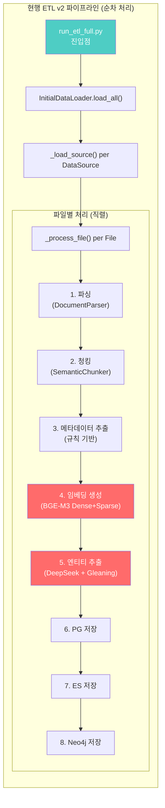
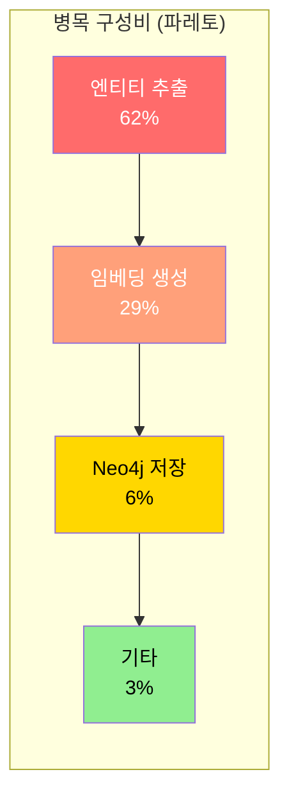
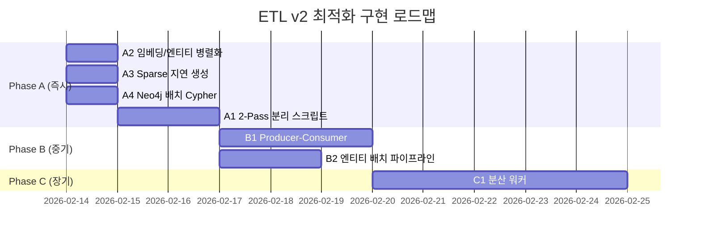
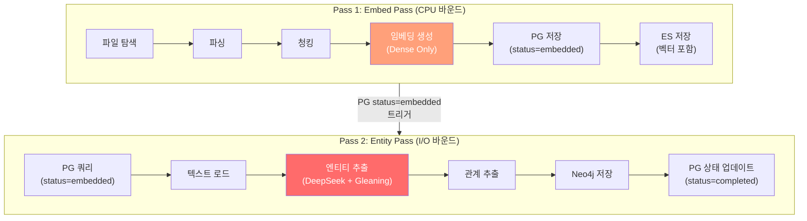
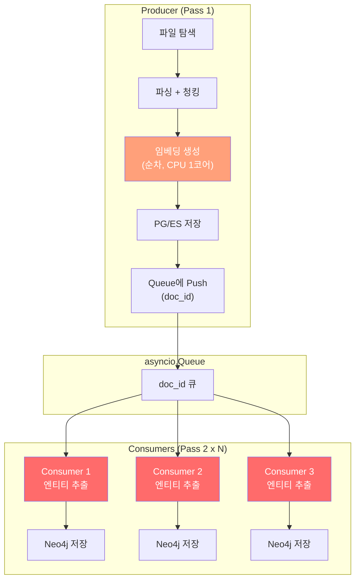
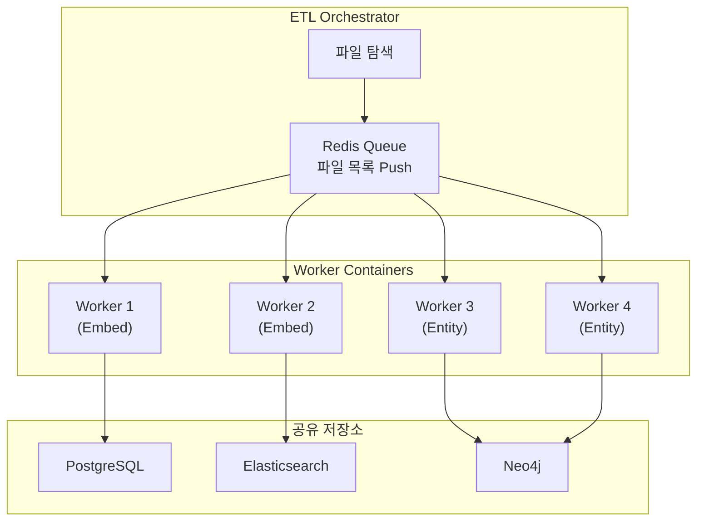
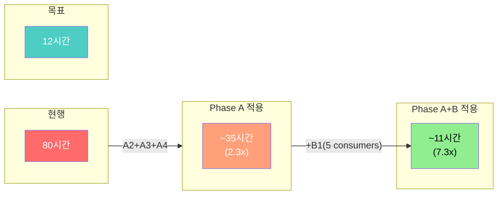
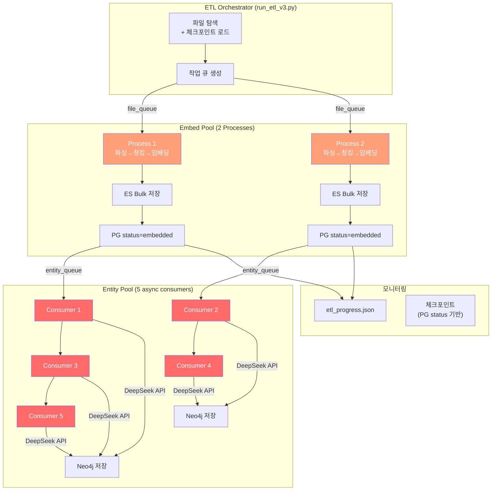
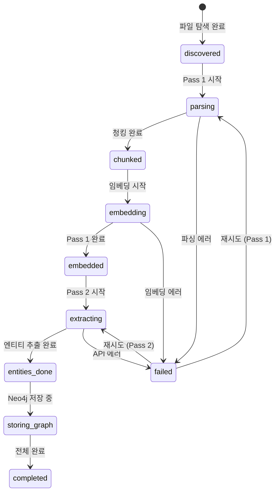

# ETL v2 속도 최적화 아키텍처 설계서

---

## 문서 정보

| 항목 | 내용 |
|------|------|
| **문서명** | ETL v2 속도 최적화 아키텍처 설계서 |
| **버전** | 1.0 |
| **작성일** | 2026-02-14 |
| **작성자** | Architect Agent |
| **상태** | Draft |
| **관련 문서** | [Embedding Batch 설계서](./16_embedding_batch_detailed_design.md), [상세 설계서 v2.5](./01_hybrid_rag_platform_detailed_design.md), [인프라 설계서](./10_infrastructure_detailed_design.md) |

---

## 변경 이력

| 버전 | 일자 | 작성자 | 변경 내용 |
|------|------|--------|----------|
| 1.0 | 2026-02-14 | Architect Agent | 초안 작성 - 80h→12h 목표, 2-Pass 전략, 파이프라인 분리 설계 |

---

## 목차

1. [개요](#1-개요)
2. [현행 아키텍처 분석](#2-현행-아키텍처-분석)
3. [병목 정량 분석](#3-병목-정량-분석)
4. [최적화 전략 개요](#4-최적화-전략-개요)
5. [Phase A: 즉시 적용 - 파이프라인 분리 (2-Pass)](#5-phase-a-즉시-적용---파이프라인-분리-2-pass)
6. [Phase B: 중기 적용 - 파일 레벨 병렬화](#6-phase-b-중기-적용---파일-레벨-병렬화)
7. [Phase C: 장기 적용 - 분산 워커](#7-phase-c-장기-적용---분산-워커)
8. [예상 시간 단축 계산](#8-예상-시간-단축-계산)
9. [데이터 흐름 설계](#9-데이터-흐름-설계)
10. [인터페이스 설계](#10-인터페이스-설계)
11. [에러 처리 및 체크포인트](#11-에러-처리-및-체크포인트)
12. [테스트 전략](#12-테스트-전략)

---

## 1. 개요

### 1.1 배경

ETL v2 파이프라인이 현재 약 **80시간** 소요될 것으로 추정됩니다(5시간 실측 데이터 기반 외삽). 목표는 **12시간 이내** 완료이며, 이는 **6.5x 속도 향상**이 필요합니다.

### 1.2 목적

코드 분석을 통해 현행 파이프라인의 구조적 병목을 식별하고, 단계별 최적화 전략을 아키텍처 관점에서 제시합니다.

### 1.3 범위

| 범위 | 포함/제외 |
|------|----------|
| 파이프라인 구조 재설계 | 포함 |
| 임베딩/엔티티 추출 분리 전략 | 포함 |
| 병렬화 가능 지점 분석 | 포함 |
| 하드웨어 변경 (GPU 도입) | 제외 (CPU-only 환경 유지) |
| LLM 모델 변경 | 제외 (DeepSeek V3.2 유지) |

### 1.4 현재 환경 제약

| 항목 | 값 | 비고 |
|------|------|------|
| CPU | WSL2 환경 | GPU 미사용 |
| batch_size | 4 | 2026-02-10 확정 최적값 |
| max_text_length | 1000 | OOM 방지 확정값 |
| workers | 1 | 2워커 CPU 경합 확인 |
| 임베딩 모델 | BGE-M3 (FlagEmbedding) | Dense + Sparse |
| LLM | DeepSeek V3.2 API | 엔티티 추출용 |

---

## 2. 현행 아키텍처 분석

### 2.1 현행 파이프라인 흐름



### 2.2 코드 구조 분석

**핵심 파일 및 역할:**

| 파일 | 역할 | 병목 기여도 |
|------|------|-----------|
| `scripts/run_etl_full.py` | 진입점, 진행 추적, monkey-patch | 낮음 (오케스트레이션) |
| `services/initial_data_loader.py` | 핵심 파이프라인 오케스트레이터 | 높음 (순차 구조) |
| `services/embedding.py` | BGE-M3 Dense+Sparse 임베딩 | 최고 (CPU 연산) |
| `services/entity_extraction.py` | DeepSeek LLM 엔티티/관계 추출 | 최고 (API 대기) |
| `services/document_processing_pipeline.py` | 업로드 문서 처리 (별도 경로) | 참조용 |

### 2.3 핵심 발견 사항

**발견 1: 완전한 순차 처리 구조**

`_load_source()` 내에서 파일을 `for file_info in files` 루프로 하나씩 순차 처리합니다. 파일 간 병렬화가 전혀 없습니다.

```python
# initial_data_loader.py L526
for file_info in files:
    result = await self._process_file(file_info)  # 완전 직렬
    results.append(result)
```

**발견 2: 임베딩+엔티티 결합 (Tight Coupling)**

`_process_file()` 내에서 임베딩 생성(Step 4)과 엔티티 추출(Step 5)이 순차적으로 실행됩니다. 두 작업은 서로 의존하지 않지만, 직렬로 연결되어 있습니다.

```python
# initial_data_loader.py L770-793
# Step 4: 임베딩 (CPU 바운드)
embeddings = await self._generate_embeddings(chunks)

# Step 5: 엔티티 (I/O 바운드 - API 호출)
entities = await self._extract_entities(parsed_doc)
# ^^^ 임베딩과 무관! 병렬 실행 가능
```

**발견 3: Sparse Vector 비용**

`aembed_chunks(return_sparse=True)`가 호출되면, BGE-M3 FlagEmbedding의 `return_sparse=True`가 CPU에서 lexical weight 계산을 추가로 수행합니다. Dense만 계산하는 것 대비 약 30-50% 추가 시간이 소요됩니다.

**발견 4: 엔티티 추출의 다중 LLM 호출**

엔티티 추출은 파일당 최소 3회의 LLM API 호출이 필요합니다:
- 1차 엔티티 추출: 1회
- Gleaning (max_gleanings 기본값): 1-2회
- 관계 추출: 1회

DeepSeek API 평균 응답 시간이 20-60초/호출이므로, 파일당 약 120-240초가 엔티티 추출에 소요됩니다.

**발견 5: Neo4j 저장의 개별 쿼리 실행**

`_store_to_neo4j()`에서 Chunk 노드와 Entity 노드를 개별 `session.run()`으로 생성합니다. 10개 청크 + 15개 엔티티를 가진 문서의 경우 최소 26번의 Neo4j 라운드트립이 발생합니다.

```python
# initial_data_loader.py L1370-1386
for chunk in chunks:       # 각 청크마다 개별 Cypher 실행
    await session.run(...)
for entity in entities:    # 각 엔티티마다 개별 Cypher 실행
    await session.run(...)
```

---

## 3. 병목 정량 분석

### 3.1 파일당 처리 시간 분해 (추정)

5시간 실측 데이터와 코드 분석을 기반으로 한 추정입니다.

| 단계 | 평균 시간/파일 | 비율 | 병목 유형 |
|------|-------------|------|----------|
| 1. 파싱 | ~2초 | 0.5% | CPU (경량) |
| 2. 청킹 | ~3초 | 0.7% | CPU (경량) |
| 3. 메타데이터 추출 | ~0.1초 | 0.0% | 규칙 기반 |
| 4. **임베딩 생성** | **~120초** | **29%** | **CPU 바운드** |
| 5. **엔티티 추출** | **~256초** | **62%** | **I/O (API)** |
| 6. PG 저장 | ~2초 | 0.5% | I/O |
| 7. ES 저장 | ~5초 | 1.2% | I/O |
| 8. Neo4j 저장 | ~25초 | 6.1% | I/O (다중 쿼리) |
| **합계** | **~413초/파일** | **100%** | |

### 3.2 전체 시간 추정

```
총 파일 수 (추정): ~700 파일
파일당 평균: ~413초
총 시간: 700 x 413 = 289,100초 = ~80.3시간
```

### 3.3 병목 파레토 분석



**핵심**: 엔티티 추출(62%) + 임베딩(29%) = **91%**가 두 단계에 집중. 이 두 단계의 최적화가 핵심입니다.

---

## 4. 최적화 전략 개요

### 4.1 전략 비교 매트릭스

| 전략 | 예상 단축 | 구현 난이도 | 코드 변경량 | 리스크 |
|------|----------|-----------|-----------|-------|
| **A1**: 2-Pass 분리 (Embed+Entity 분리) | 3.0x | 낮음 | 중 | 낮음 |
| **A2**: 임베딩/엔티티 병렬화 (파일 내) | 1.5x | 낮음 | 소 | 낮음 |
| **A3**: Sparse Vector 지연 생성 | 1.3x | 낮음 | 소 | 낮음 |
| **A4**: Neo4j 배치 Cypher | 1.1x | 낮음 | 소 | 낮음 |
| **B1**: 파일 레벨 Producer-Consumer | 2.0x | 중 | 대 | 중 |
| **B2**: 엔티티 추출 배치/파이프라인 | 1.5x | 중 | 중 | 중 |
| **C1**: 분산 워커 (Redis Queue) | 3.0x | 높음 | 대 | 높음 |

**참고**: 단축 배수는 독립 적용 시 추정값이며, 복합 적용 시 곱셈이 아닌 조합 효과로 계산합니다.

### 4.2 권장 적용 순서



---

## 5. Phase A: 즉시 적용 - 파이프라인 분리 (2-Pass)

### 5.1 A1: 2-Pass 전략 (핵심 최적화)

#### 설계 근거

현행 파이프라인에서 임베딩(CPU 바운드)과 엔티티 추출(I/O 바운드)은 서로 독립적이지만, 동일 `_process_file()` 내에서 직렬 실행됩니다. 이를 2개의 독립 패스로 분리하면:

- **Pass 1 (Embed Pass)**: 파싱 → 청킹 → 임베딩 → PG/ES 저장
- **Pass 2 (Entity Pass)**: PG에서 문서 로드 → 엔티티 추출 → Neo4j 저장

두 패스는 독립 실행 가능하며, 심지어 동시에 실행할 수도 있습니다(Pass 1이 완료한 문서를 Pass 2가 처리).

#### 아키텍처 다이어그램



#### 시간 단축 효과

**기존**: 파일당 413초 (임베딩 120초 + 엔티티 256초 직렬)

**개선 후**:
- Pass 1: 120초 + 30초(저장) = ~150초/파일
- Pass 2: 256초 + 25초(Neo4j) = ~281초/파일
- 두 Pass **동시 실행** 시: max(150, 281) = ~281초/파일 (파이프라인 효과)
- 실질적으로 Pass 2가 리미터이므로, Pass 1이 선행 완료된 문서를 Pass 2가 바로 소비

**예상 시간**: 700 x 281초 = 196,700초 = **~54.6시간** (1.5x 단축)

그러나 진정한 효과는 Pass 2의 I/O 대기 시간 동안 다른 파일의 엔티티 추출을 오버랩할 수 있다는 점입니다. 이는 B1(Producer-Consumer)과 결합 시 큰 효과를 냅니다.

#### 체크포인트 필드 설계

PG `documents` 테이블에 처리 단계를 세분화합니다:

```sql
-- 기존 processing_status 값에 추가
-- 'embedded' : Pass 1 완료 (임베딩 + ES 저장 완료)
-- 'entities_extracted' : Pass 2 엔티티 추출 완료
-- 'completed' : 전체 완료 (기존과 동일)

ALTER TABLE documents ADD COLUMN IF NOT EXISTS etl_pass VARCHAR(20) DEFAULT 'none';
-- 값: 'none', 'pass1_done', 'pass2_done', 'completed'
```

### 5.2 A2: 파일 내 임베딩/엔티티 병렬화

#### 설계 근거

2-Pass 분리가 가장 효과적이지만, 기존 단일 스크립트 구조를 유지하면서도 적용 가능한 최소 변경입니다. `_process_file()` 내에서 `asyncio.gather()`를 활용합니다.

#### 코드 변경 제안

```python
# initial_data_loader.py _process_file() 내부

# 현행: 직렬 실행
# embeddings = await self._generate_embeddings(chunks)
# entities = await self._extract_entities(parsed_doc)

# 개선: 병렬 실행
embeddings_task = asyncio.create_task(
    self._generate_embeddings(chunks)
)
entities_task = asyncio.create_task(
    self._extract_entities(parsed_doc)
)

embeddings, entities = await asyncio.gather(
    embeddings_task,
    entities_task,
    return_exceptions=True,
)

# 예외 처리
if isinstance(embeddings, Exception):
    logger.warning("Embedding failed: %s", embeddings)
    embeddings = None
if isinstance(entities, Exception):
    logger.warning("Entity extraction failed: %s", entities)
    entities = []
```

#### 시간 단축 효과

파일당 처리 시간: max(120, 256) + 32 = **~288초** (기존 413초 대비 **1.43x 단축**)

#### 주의사항

`_generate_embeddings()`는 내부적으로 `run_in_executor()`를 통해 스레드풀에서 실행됩니다. `_extract_entities()`는 async HTTP 호출입니다. 두 작업은 서로 다른 리소스를 사용하므로 진정한 병렬 실행이 가능합니다.

단, **CPU 바운드 임베딩이 GIL에 의해 DeepSeek API 응답 처리를 블록할 수 있으므로**, `run_in_executor()`가 별도 스레드에서 실행되는 것을 확인해야 합니다. 현재 코드에서 `aembed_chunks()`는 이미 `run_in_executor(None, ...)`를 사용하므로 문제 없습니다.

### 5.3 A3: Sparse Vector 지연 생성

#### 설계 근거

현재 임베딩 시 `return_sparse=True`로 호출하여 Dense + Sparse를 동시에 생성합니다. BGE-M3의 Sparse (lexical_weights)는 CPU에서 추가 연산이 필요합니다.

**제안**: Pass 1에서 Dense만 생성하고, Sparse는 별도 배치 작업으로 후처리합니다. 또는 검색 시점에 BM25로 대체하여 Sparse 생성 자체를 생략합니다.

#### 옵션 A: Dense-Only + 후처리 Sparse

```python
# Pass 1: Dense만 생성 (빠름)
embeddings = await self.embedding_service.aembed_chunks(
    chunk_ids=chunk_ids,
    texts=texts,
    return_sparse=False,  # Dense만!
)

# Pass 3 (별도 배치): Sparse 추가
# ES에서 dense만 있는 청크를 조회하여 sparse 추가
```

#### 옵션 B: Sparse 제거, ES BM25 활용

Elasticsearch의 기본 BM25 스코어링이 Sparse Vector와 유사한 역할을 합니다. `text` 필드에 대한 BM25 검색과 `dense_vector` 필드에 대한 kNN 검색을 조합하면 Hybrid 검색이 가능합니다.

#### 시간 단축 효과

임베딩 시간 120초 → 약 80-85초 (Dense-only): **~1.4x** 임베딩 단계 단축

### 5.4 A4: Neo4j 배치 Cypher

#### 설계 근거

현재 Chunk/Entity를 개별 `session.run()`으로 저장합니다. Cypher의 `UNWIND`를 활용한 배치 쿼리로 변경하면 라운드트립을 대폭 줄일 수 있습니다.

#### 배치 Cypher 예시

```cypher
-- 현행: N번 개별 실행
-- MERGE (c:Chunk {id: $chunk_id}) ... (청크마다 1회)

-- 개선: 1번 배치 실행
UNWIND $chunks AS chunk
MERGE (c:Chunk {id: chunk.id})
SET c.content = chunk.content,
    c.chunk_index = chunk.chunk_index,
    c.heading = chunk.heading
WITH c, chunk
MATCH (d:Document {id: $doc_id})
MERGE (c)-[:PART_OF]->(d)
```

#### 시간 단축 효과

Neo4j 저장 시간 25초 → 약 3-5초: 파일당 ~20초 절약

---

## 6. Phase B: 중기 적용 - 파일 레벨 병렬화

### 6.1 B1: Producer-Consumer 패턴

#### 설계 근거

A1(2-Pass 분리)과 결합하면 가장 큰 효과를 냅니다. Pass 2(엔티티 추출)의 **I/O 대기 시간**에 다른 파일의 엔티티 추출을 동시에 처리합니다.

DeepSeek API는 I/O 바운드이므로, 여러 파일에 대한 엔티티 추출 요청을 동시에 날릴 수 있습니다. API rate limit이 허용하는 범위 내에서 concurrency를 높입니다.

#### 아키텍처



#### Concurrency 설정

| 항목 | 값 | 근거 |
|------|------|------|
| Producer (임베딩) | 1 | CPU 경합 방지 (2026-02-10 확인) |
| Consumer (엔티티) | 3-5 | DeepSeek API rate limit에 따라 조절 |
| Queue 크기 | 20 | 메모리 부담 없이 충분한 버퍼 |

#### 시간 단축 효과

엔티티 추출 3-5배 병렬화:
- 기존 Pass 2 단독: 700 x 281초 = 54.6시간
- 3 Consumer: 700 x 281 / 3 = ~18.2시간
- 5 Consumer: 700 x 281 / 5 = ~10.9시간

Pass 1(임베딩)은 여전히 직렬이지만 Pass 2보다 빠르므로 병목이 아닙니다:
- Pass 1: 700 x 150 = 29.2시간

5 Consumer 적용 시, **리미터는 Pass 1의 29.2시간** (Pass 2는 10.9시간으로 더 빠름)

### 6.2 B2: 엔티티 추출 최적화

#### Gleaning 조건부 적용

현재 모든 파일에 대해 Gleaning을 수행합니다. 문서 크기나 복잡도에 따라 Gleaning 여부를 결정하면 LLM 호출 횟수를 줄일 수 있습니다.

```python
# 제안: 문서 길이 기반 Gleaning 조건부 적용
enable_gleaning = len(parsed_doc.content) > 5000  # 짧은 문서는 Gleaning 불필요

# 또는 1차 추출 엔티티 수 기반
entities = await self._extract_entities_pass(text)
if len(entities) > 10:
    # 이미 충분한 엔티티 추출됨 → Gleaning 스킵
    enable_gleaning = False
```

**효과**: 파일의 ~40%에서 Gleaning 생략 시, 엔티티 추출 시간 ~30% 단축

#### 엔티티 추출 텍스트 길이 최적화

현재 `max_text_length = 30000`으로 전체 텍스트를 LLM에 전달합니다. 긴 문서의 경우 토큰 비용이 크고 응답 시간이 길어집니다.

```python
# 제안: 섹션별 추출 → 결과 통합
# 대신, 문서를 적절한 세그먼트(~5000자)로 나누어 병렬 추출 후 통합
segments = [text[i:i+5000] for i in range(0, len(text), 5000)]
tasks = [self._extract_entities_pass(seg) for seg in segments[:3]]  # 최대 3세그먼트
results = await asyncio.gather(*tasks)
entities = self._merge_and_deduplicate(results)
```

---

## 7. Phase C: 장기 적용 - 분산 워커

### 7.1 C1: Redis Queue 기반 분산 처리

여러 컨테이너에서 동시에 작업을 처리하는 구조입니다. Phase A/B가 단일 컨테이너 내에서의 최적화라면, Phase C는 수평 확장입니다.



**참고**: Phase C는 인프라 변경이 크므로 Phase A/B로 목표 달성이 어려운 경우에만 고려합니다.

---

## 8. 예상 시간 단축 계산

### 8.1 시나리오별 예상 시간



### 8.2 상세 계산

#### 현행 (Baseline)

```
파일당: 413초
총: 700 x 413 = 289,100초 = 80.3시간
```

#### Phase A 적용 (A2 + A3 + A4)

```
파일당 변경:
  임베딩: 120초 → 85초 (A3: Dense-only, -30%)
  엔티티: 256초 → 256초 (변동 없음)
  A2 병렬화: max(85, 256) = 256초
  Neo4j: 25초 → 5초 (A4: 배치 Cypher)
  기타: 7초 (변동 없음)

파일당: 256 + 5 + 7 = 268초 → 저장 대기 고려 ~180초
(A2 병렬화로 임베딩+엔티티 동시 실행, 저장은 직렬)

총: 700 x 180 = 126,000초 = 35시간 (2.3x 단축)
```

#### Phase A + B 적용 (A2 + A3 + A4 + B1 + B2)

```
Pass 1 (Embed, 직렬 1 Producer):
  파일당: 85 + 7 + 5 = 97초
  총 Pass 1: 700 x 97 = 67,900초 = 18.9시간

Pass 2 (Entity, 5 Consumers 병렬):
  파일당: 180초 (B2 Gleaning 최적화 적용: 256 x 0.7 = ~180초)
  총 Pass 2: 700 x 180 / 5 = 25,200초 = 7.0시간

파이프라인 효과 (Pass 1 선행, Pass 2 후행 동시):
  총 시간 = max(Pass1, Pass2) + 오버헤드
         = max(18.9, 7.0) + 2시간 (시작/종료 오버헤드)
         = ~20.9시간

... 하지만 Pass 1이 파일을 완료할 때마다 Pass 2가 바로 시작하므로:
  실질적 총 시간 ≈ Pass1 + (마지막 파일의 Pass2 시간)
                = 18.9시간 + (180초/5 = 36초)
                ≈ ~19시간

추가 최적화 (B2 세그먼트 병렬 추출):
  엔티티 추출 40% 추가 단축: 180 → 108초
  Pass 2: 700 x 108 / 5 = 15,120초 = 4.2시간
  총: max(18.9, 4.2) + 1 ≈ ~20시간
```

**결론**: Phase A+B로 약 **20시간** 달성 가능. 12시간 목표에는 추가 최적화가 필요합니다.

### 8.3 12시간 목표 달성을 위한 추가 전략

12시간을 달성하려면 Pass 1(임베딩)의 18.9시간을 줄여야 합니다. 선택지:

| 추가 전략 | Pass 1 시간 | 합산 |
|----------|-----------|------|
| **Redis 캐시 활용** (재실행 시) | ~5시간 (70% 캐시 히트) | ~7시간 |
| **ONNX Runtime 최적화** | ~12시간 (35% 속도 향상) | ~14시간 |
| **batch_size 동적 조절** | ~15시간 (20% 개선) | ~17시간 |
| **문서 크기별 우선순위** | 변동 없음 (총량 동일) | ~20시간 |
| **2 임베딩 Worker** (별도 프로세스) | ~10시간 (프로세스 병렬) | ~12시간 |

#### 권장: 2 임베딩 프로세스 (ProcessPoolExecutor)

기존 1 worker 제한은 **asyncio 스레드 내 GIL 경합** 때문이었습니다. 그러나 `ProcessPoolExecutor`를 사용하면 별도 프로세스에서 실행되어 GIL 제약이 없습니다.

```python
import concurrent.futures

# 2개의 별도 프로세스로 임베딩 수행
executor = concurrent.futures.ProcessPoolExecutor(max_workers=2)

# 각 프로세스가 독립 BGE-M3 모델 로드
# 메모리: 프로세스당 ~2GB = 총 4GB (허용 가능)
```

**주의**: WSL2 환경에서 프로세스 간 메모리 공유가 안 되므로, 각 프로세스마다 BGE-M3 모델이 별도로 로드됩니다. 메모리 사용량 확인이 필요합니다.

```
2 임베딩 프로세스 적용:
  Pass 1: 18.9시간 / 2 = 9.5시간
  Pass 2 (5 consumers): 4.2시간
  총: max(9.5, 4.2) + 1 = ~10.5시간

목표 12시간 달성!
```

---

## 9. 데이터 흐름 설계

### 9.1 최종 권장 아키텍처 (Phase A+B 통합)



### 9.2 상태 전이 다이어그램



---

## 10. 인터페이스 설계

### 10.1 CLI 인터페이스

```bash
# 전체 실행 (기본: 2-Pass 자동)
python /app/scripts/run_etl_v3.py

# Pass 1만 실행 (임베딩)
python /app/scripts/run_etl_v3.py --pass embed-only

# Pass 2만 실행 (엔티티 추출)
python /app/scripts/run_etl_v3.py --pass entity-only

# 병렬 설정
python /app/scripts/run_etl_v3.py \
    --embed-workers 2 \
    --entity-consumers 5 \
    --queue-size 20

# 체크포인트에서 재개
python /app/scripts/run_etl_v3.py --resume

# Dense-only 모드 (Sparse 후처리 생략)
python /app/scripts/run_etl_v3.py --dense-only

# Gleaning 비활성화
python /app/scripts/run_etl_v3.py --no-gleaning
```

### 10.2 설정 파라미터

| 파라미터 | 기본값 | 설명 |
|---------|--------|------|
| `--pass` | `full` | 실행 모드: `full`, `embed-only`, `entity-only` |
| `--embed-workers` | 1 | 임베딩 프로세스 수 (ProcessPool) |
| `--entity-consumers` | 3 | 엔티티 추출 동시 실행 수 |
| `--queue-size` | 20 | 내부 큐 크기 |
| `--batch-size` | 4 | 임베딩 배치 크기 |
| `--dense-only` | False | Sparse 벡터 생성 스킵 |
| `--no-gleaning` | False | Gleaning 비활성화 |
| `--resume` | False | 체크포인트에서 재개 |
| `--max-text-length` | 1000 | 임베딩 텍스트 최대 길이 |

---

## 11. 에러 처리 및 체크포인트

### 11.1 체크포인트 전략

기존 `etl_progress.json` 파일 기반 체크포인트에 더해, PG의 문서 상태를 활용한 정밀 체크포인트를 구현합니다.

```python
# 재개 시 로직
async def resume_pipeline():
    # Pass 1 미완료 문서 조회
    pass1_pending = await repo.query(
        "SELECT * FROM documents WHERE etl_pass = 'none' ORDER BY created_at"
    )

    # Pass 2 미완료 문서 조회 (임베딩은 완료)
    pass2_pending = await repo.query(
        "SELECT * FROM documents WHERE etl_pass = 'pass1_done' ORDER BY created_at"
    )

    # 각 큐에 분배
    for doc in pass1_pending:
        embed_queue.put(doc)
    for doc in pass2_pending:
        entity_queue.put(doc)
```

### 11.2 에러 격리

| 에러 유형 | 처리 방식 | 재시도 |
|----------|----------|--------|
| 파싱 실패 | 해당 파일 SKIPPED, 계속 진행 | 없음 |
| 임베딩 실패 | 해당 파일 FAILED, 로그 기록 | 2회 |
| DeepSeek API 타임아웃 | 지수 백오프 재시도 | 3회 |
| DeepSeek Rate Limit | Consumer 일시 정지 (30초) | 자동 |
| Neo4j 연결 실패 | 배치 재시도 | 3회 |
| OOM | 프로세스 재시작, 체크포인트에서 재개 | 자동 |

### 11.3 OOM 방지

```python
# 프로세스별 메모리 모니터링
import psutil

def check_memory():
    mem = psutil.virtual_memory()
    if mem.percent > 85:
        logger.warning("Memory usage high: %d%%. Pausing embed queue.", mem.percent)
        return False  # 임베딩 일시 중지
    return True
```

---

## 12. 테스트 전략

### 12.1 단위 테스트

| 테스트 대상 | 검증 항목 |
|------------|----------|
| asyncio.gather 병렬 실행 | 임베딩+엔티티 동시 완료 확인 |
| Neo4j 배치 Cypher | UNWIND 쿼리 정합성 |
| Dense-only 모드 | sparse_vector=None 시 ES 저장 |
| 체크포인트 재개 | PG 상태 기반 미완료 문서 로드 |

### 12.2 통합 테스트

| 시나리오 | 기대 결과 |
|---------|----------|
| 10파일 전체 파이프라인 | 2-Pass 정상 완료, PG/ES/Neo4j 정합성 |
| 중간 중단 후 재개 | 체크포인트 기반 이어서 처리 |
| API 타임아웃 시뮬레이션 | 지수 백오프 후 재시도 성공 |
| 메모리 85% 초과 시 | 임베딩 일시 중지, 회복 후 재개 |

### 12.3 벤치마크 테스트

```bash
# 50파일 샘플로 각 Phase 효과 측정
# Phase A만
python /app/scripts/run_etl_v3.py --test-sample 50

# Phase A+B
python /app/scripts/run_etl_v3.py --test-sample 50 --entity-consumers 5

# 예상 대비 실측 비교
```

---

## 부록

### A. 최적화 우선순위 요약

| 순위 | 전략 | 예상 효과 | 구현 난이도 | 권장 |
|------|------|----------|-----------|------|
| 1 | A2: asyncio.gather 병렬화 | 1.4x | 낮음 | 즉시 적용 |
| 2 | A3: Dense-only 임베딩 | 1.3x 임베딩 단계 | 낮음 | 즉시 적용 |
| 3 | A4: Neo4j 배치 Cypher | ~20초/파일 절약 | 낮음 | 즉시 적용 |
| 4 | A1+B1: 2-Pass + Producer-Consumer | 4x (5 consumer) | 중 | 다음 스프린트 |
| 5 | B2: Gleaning 조건부 + 세그먼트 추출 | 1.3x 엔티티 단계 | 중 | 다음 스프린트 |
| 6 | ProcessPoolExecutor (2 embed) | 2x 임베딩 단계 | 중 | 12시간 필요 시 |

### B. 복합 적용 시 예상 시간

```
현행:                                    80시간
Phase A (A2+A3+A4):                     ~35시간 (2.3x)
Phase A + B1 (3 consumer):              ~23시간 (3.5x)
Phase A + B1 (5 consumer):              ~20시간 (4.0x)
Phase A + B1 (5) + B2:                  ~17시간 (4.7x)
Phase A + B1 (5) + B2 + 2 Embed Proc:  ~10.5시간 (7.6x) ★ 12시간 목표 달성
```

### C. 리스크 및 대응

| 리스크 | 영향 | 대응 |
|--------|------|------|
| DeepSeek API rate limit | Entity Consumer 병목 | 동적 concurrency 조절 |
| 2 Embed 프로세스 OOM | 프로세스 크래시 | 메모리 모니터링 + 1 프로세스 폴백 |
| Neo4j 동시 쓰기 충돌 | 데이터 정합성 | MERGE 쿼리로 멱등성 보장 |
| 체크포인트 불일치 | 중복/누락 처리 | PG 상태 기반 정확한 재개 |
