# Sprint 10 P0 완료 후 시스템 아키텍처 분석서

## 문서 정보

| 항목 | 내용 |
|------|------|
| 문서명 | Sprint 10 P0 완료 후 시스템 아키텍처 분석서 |
| 버전 | 1.1 |
| 작성일 | 2026-02-15 |
| 작성자 | Architect Agent |
| 상태 | Draft |
| 선행 문서 | [Sprint 10 Action Tracker](../07_maintenance/29_sprint10_action_tracker.md) |

## 변경 이력

| 버전 | 일자 | 작성자 | 변경 내용 |
|------|------|--------|-----------|
| 1.0 | 2026-02-15 | Architect | 5개 영역 아키텍처 분석 초안 |
| 1.1 | 2026-02-15 | Claude | ADR-002 수정 (Sparse 활용 전략), ADR-003 수정 (Gleaning 2회) |

---

## 0. Executive Summary

Sprint 10 P0 완료로 3-Store 정합성 100%와 56,063건 전체 임베딩을 달성했다. 현재 시스템은 Dense(HNSW) + BM25 2-way RRF로 검색을 수행하며, Sparse 벡터(56,063건 저장 완료)와 Graph(Entity 0개)는 미활용 상태이다.

**핵심 결론**: 다음 단계는 "검색 품질"에 집중해야 한다. 구체적으로 (1) Sparse 검색 통합 -- 저장된 `sparse_vector_json`을 2-Phase Search로 활용 (2) Reranker 업그레이드 (3) Gleaning 2회 엔티티 추출 순서로 진행하되, 안정성 기반(ES 메모리 증설, 테스트 커버리지)을 병행한다.

| 우선순위 | 작업 | 예상 효과 | 난이도 | 의존성 |
|---------|------|----------|-------|-------|
| 1 | Sparse 검색 통합 (2-Phase + RRF) | 어휘 매칭 정확도 +20-30% | 중 | 없음 |
| 2 | Reranker v2-m3 업그레이드 | Rerank 정확도 +15% | 하 | 없음 |
| 3 | ES 메모리 512MB to 1GB | 안정성 확보 | 하 | 없음 |
| 4 | Gleaning 2회 엔티티 추출 | Graph Search 활성화 | 상 | Sparse 통합 후 |
| 5 | RAGAS 품질 평가 셋업 | 품질 측정 기준 확보 | 중 | Gleaning 후 |

---

## 1. 검색 품질 개선 로드맵: 2-way to 4-way RRF

### 1.1 현재 상태 (AS-IS)

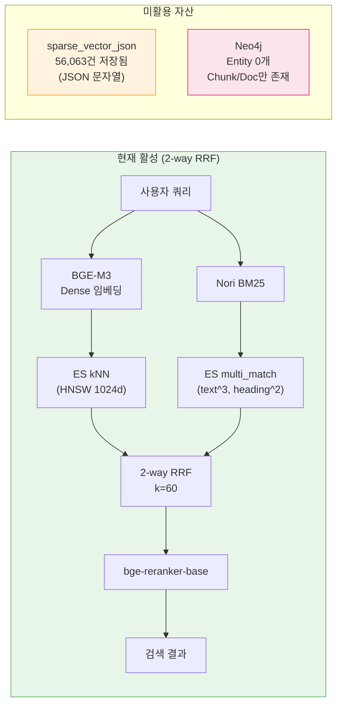

### 1.2 단계별 전환 로드맵

현실적 제약(ES Basic 라이선스, 16GB RAM, Entity 0개)을 고려하면, 4-way RRF로의 전환은 **단계적 접근**이 필수다.

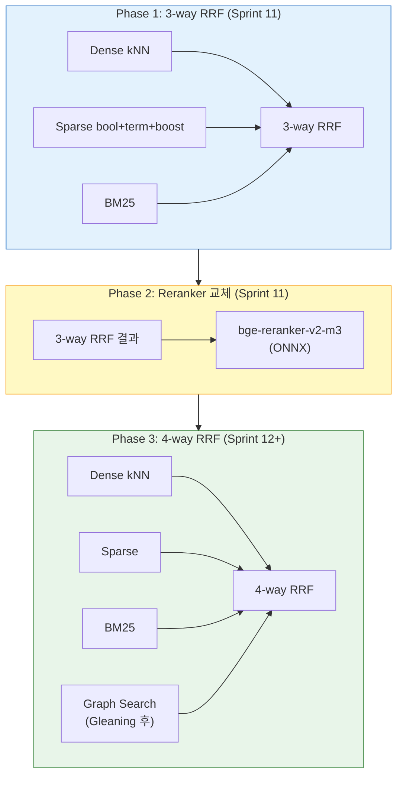

### 1.3 RRF 가중치 설계

| 채널 | Phase 1 (3-way) | Phase 3 (4-way) | 근거 |
|------|:---------------:|:---------------:|------|
| Dense (kNN) | 1.0 | 1.0 | 시맨틱 유사도 주력 채널 |
| Sparse (bool+term) | 0.7 | 0.8 | BM25와 역할 중복 있어 약간 낮게. Phase 3에서 Gleaning 후 상향 |
| BM25 (Keyword) | 1.0 | 0.9 | Sparse 추가 시 어휘 채널 과적합 방지를 위해 Phase 3에서 소폭 감소 |
| Graph (Neo4j) | - | 0.8 | 엔티티 기반 보조 채널 |

> **ADR-001**: Sparse와 BM25는 둘 다 어휘 기반이므로 합산 시 어휘 매칭에 과도한 가중치가 실린다. Sparse를 0.7(Phase 1)로 시작하여 RAGAS 평가 후 튜닝한다.

---

## 2. Sparse 검색 통합: ES Basic 라이선스 대안

### 2.1 문제 정의

| 항목 | 상황 |
|------|------|
| ES 라이선스 | Basic (무료) |
| 저장된 필드 | `sparse_vector_json` (JSON 문자열, text 타입) |
| native sparse_vector | `sparse_vector` 필드 존재하나, 실제 데이터는 `sparse_vector_json`에 JSON 문자열로 저장 |
| `weighted_tokens` 쿼리 | Platinum 전용 기능 -- **사용 불가** |
| `text_expansion` 쿼리 | Platinum 전용 기능 -- **사용 불가** |

**결론**: 기존 설계서(15번)의 `weighted_tokens` 접근은 사용할 수 없다. ES Basic에서 동작하는 대안이 필요하다.

### 2.2 대안 아키텍처: 2-Phase Sparse Search

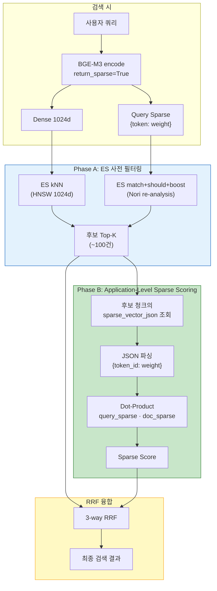

**핵심**: 56,063건 전체를 메모리에 올리는 것이 아니라, ES kNN+BM25로 사전 필터링한 **Top-K 후보(~100건)**에 대해서만 저장된 `sparse_vector_json`을 조회하여 dot-product scoring을 수행한다. 메모리 부담 없이 저장된 Sparse 벡터를 활용할 수 있다.

### 2.3 전략 A: bool + term + boost (권장)

BGE-M3의 lexical_weights를 ES `bool > should > term > boost` 쿼리로 변환한다. 이 접근은 ES Basic에서 완전히 동작한다.

**변환 원리**:

```
BGE-M3 Sparse Output:
  {"인공지능": 0.854, "AI": 0.721, "모델": 0.689}

ES bool+term+boost Query:
  {
    "bool": {
      "should": [
        {"term": {"text": {"value": "인공지능", "boost": 0.854}}},
        {"term": {"text": {"value": "AI", "boost": 0.721}}},
        {"term": {"text": {"value": "모델", "boost": 0.689}}}
      ],
      "minimum_should_match": 1
    }
  }
```

**핵심 고려사항: WordPiece vs Nori 토큰 불일치 리스크**

| 항목 | BGE-M3 (WordPiece) | ES text 필드 (Nori) |
|------|--------------------|--------------------|
| 토크나이저 | WordPiece (서브워드) | Nori (형태소 분석) |
| "인공지능" | `["인공", "##지능"]` 또는 `["인공지능"]` | `["인공", "지능"]` |
| "프레임워크" | `["프레임", "##워크"]` | `["프레임워크"]` |
| 영어 "kubernetes" | `["ku", "##ber", "##netes"]` | `["kubernetes"]` |

**리스크 분석**: BGE-M3의 lexical_weights 키는 WordPiece 서브워드인 경우가 많다. ES의 `text` 필드는 Nori로 분석되므로, `term` 쿼리에서 토큰이 매칭되지 않을 수 있다.

**해결 방안**:

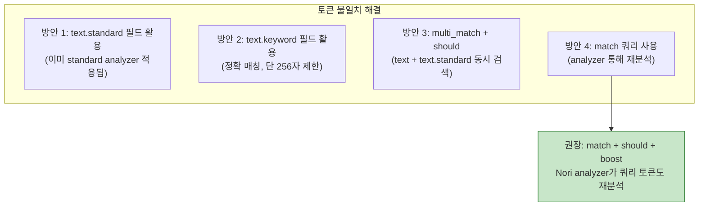

**권장 쿼리 구조 (match 기반)**:

```python
def _build_sparse_query_basic(
    self,
    sparse_vector: Dict[str, float],
    es_filters: List[Dict[str, Any]],
    top_k: int,
) -> Dict[str, Any]:
    """ES Basic 호환 Sparse 검색 쿼리 (match + should + boost)

    match 쿼리를 사용하면 ES가 Nori analyzer로 토큰을 재분석하므로
    WordPiece vs Nori 토큰 불일치가 자연스럽게 해소된다.
    """
    # 가중치 0.1 미만 토큰 프루닝
    pruned = {
        token: weight
        for token, weight in sparse_vector.items()
        if weight >= 0.1
    }

    # Top-N 토큰만 사용 (쿼리 복잡도 제한)
    sorted_tokens = sorted(pruned.items(), key=lambda x: x[1], reverse=True)
    top_tokens = sorted_tokens[:50]  # 상위 50개 토큰

    should_clauses = [
        {
            "match": {
                "text": {
                    "query": token,
                    "boost": round(weight, 4),
                }
            }
        }
        for token, weight in top_tokens
    ]

    sparse_query = {
        "bool": {
            "should": should_clauses,
            "minimum_should_match": 1,
        }
    }

    body: Dict[str, Any] = {"size": top_k}

    if es_filters:
        body["query"] = {
            "bool": {
                "must": [sparse_query],
                "filter": es_filters,
            }
        }
    else:
        body["query"] = sparse_query

    return body
```

### 2.4 `sparse_vector_json` 필드 활용: 2-Phase Search

현재 ES에 저장된 `sparse_vector_json`은 JSON 문자열(예: `'{"인공지능": 0.854, "AI": 0.721}'`)이다. ES는 JSON 문자열 내부를 직접 쿼리할 수 없지만, **Application-level dot-product scoring**으로 저장된 Sparse 벡터를 활용할 수 있다.

| 접근 | 가능 여부 | 설명 |
|------|:---------:|------|
| `sparse_vector_json`으로 ES 직접 쿼리 | 불가 | text 타입으로 저장, ES가 JSON 내부 파싱 불가 |
| `sparse_vector` (native) 필드 마이그레이션 | 가능하나 비권장 | 동적 매핑 폭발 경험 있음. `weighted_tokens` 쿼리는 Platinum 전용 |
| 56,063건 전체 Application-Level 계산 | 비효율 | 전체를 메모리에 올리면 수 GB 소요 |
| **2-Phase: ES 사전필터 + Application Sparse Scoring** | **권장** | ES로 후보 ~100건 축소 → 해당 청크의 `sparse_vector_json` 조회 → dot-product 계산 |
| match+should+boost 쿼리 (보조) | 보조 활용 | 쿼리 Sparse를 ES match로 변환하여 BM25 보완 |

**2-Phase Search 구현 개요**:

```python
def sparse_rerank(
    query_sparse: Dict[str, float],
    candidate_chunk_ids: List[str],
) -> List[Tuple[str, float]]:
    """저장된 sparse_vector_json으로 후보 청크 재스코어링

    Phase A에서 ES kNN+BM25로 선별한 후보(~100건)에 대해서만
    저장된 Sparse 벡터를 파싱하여 dot-product 스코어를 계산한다.

    메모리 사용: ~100건 x ~500 토큰 x 8bytes ≈ 0.4MB (무시 가능)
    """
    # 1. ES에서 후보 청크의 sparse_vector_json 조회
    docs = es.mget(index="knowledge_chunks", ids=candidate_chunk_ids,
                   _source=["sparse_vector_json"])

    scores = []
    for doc in docs["docs"]:
        doc_sparse = json.loads(doc["_source"]["sparse_vector_json"])

        # 2. Dot-product: query_sparse · doc_sparse
        score = sum(
            query_sparse.get(token, 0.0) * weight
            for token, weight in doc_sparse.items()
        )
        scores.append((doc["_id"], score))

    # 3. Sparse 스코어로 정렬
    return sorted(scores, key=lambda x: x[1], reverse=True)
```

> **ADR-002 (수정)**: 저장된 `sparse_vector_json`을 **Application-level Sparse Scoring**에 활용한다. ES kNN+BM25로 후보를 ~100건으로 축소한 뒤, 해당 청크의 `sparse_vector_json`을 파싱하여 쿼리 Sparse 벡터와 dot-product 스코어를 계산하고 RRF에 반영한다. 56,063건 전체를 메모리에 올리지 않으므로 메모리 부담 없이 GPU로 사전 계산한 Sparse 벡터를 100% 활용할 수 있다. 보조적으로 match+should+boost 쿼리도 병행할 수 있다.

### 2.5 Sparse 통합 시 Latency 분석

```mermaid
gantt
    title 3-way Hybrid Search Latency 예측 (Sprint 11)
    dateFormat X
    axisFormat %L ms

    section Embedding
    Dense+Sparse 생성 (1회)   :emb, 0, 55

    section ES Parallel
    Dense kNN                 :after emb, 40
    Sparse match+should+boost :after emb, 35
    BM25 Keyword              :after emb, 25

    section Fusion
    3-way RRF                 :rrf, 95, 2

    section Reranker
    bge-reranker-v2-m3        :after rrf, 80
```

| 단계 | 현재 (2-way) | Phase 1 (3-way) | 증가분 |
|------|:-----------:|:---------------:|:------:|
| 쿼리 임베딩 | ~50ms (Dense only) | ~55ms (Dense+Sparse) | +5ms |
| ES 검색 (병렬) | ~40ms (kNN + BM25) | ~40ms (kNN + Sparse + BM25) | +0ms (병렬) |
| RRF 융합 | ~1ms (2-way) | ~2ms (3-way) | +1ms |
| **합계** | ~91ms | ~97ms | **+6ms** |

**결론**: BGE-M3의 Dense+Sparse 동시 생성은 1회 모델 추론에서 처리되므로, 실질적 추가 latency는 6ms 이내로 무시할 수 있다.

---

## 3. Phase 3 Gleaning: 엔티티 추출 아키텍처

### 3.1 현재 상태

| 항목 | 값 |
|------|-----|
| Neo4j Document 노드 | 1,437개 |
| Neo4j Chunk 노드 | 56,063개 |
| Neo4j Entity/Technology/Topic | **0개** |
| Neo4j Relationship (RELATED_TO 등) | **0개** |
| Graph Search 실효성 | Chunk CONTAINS 폴백만 동작 (엔티티 매칭 불가) |

### 3.2 Gleaning 아키텍처 설계

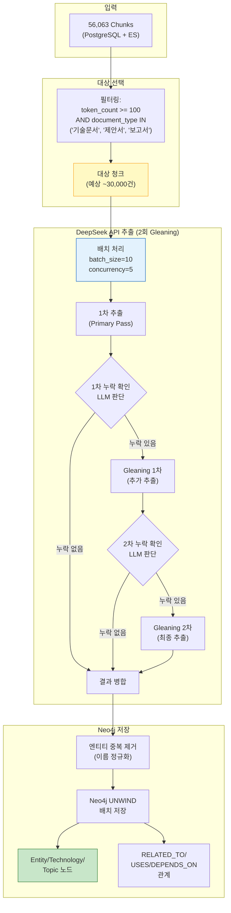

### 3.3 아키텍처 고려사항

#### 3.3.1 DeepSeek API 비용/시간 추정 (Gleaning 2회)

| 항목 | 값 | 근거 |
|------|-----|------|
| 대상 청크 수 | ~30,000건 | 100토큰 이상 필터링 후 추정 |
| 1차 추출 호출 | 30,000회 | 청크당 1회 |
| Gleaning 1차 추가 호출 | ~15,000회 | 약 50%에서 누락 감지 (경험적) |
| Gleaning 2차 추가 호출 | ~7,500회 | 1차 Gleaning 결과의 약 50% |
| 총 LLM 호출 | **~52,500회** | 30,000 + 15,000 + 7,500 |
| 평균 입력 토큰 | ~800 tok/청크 | 프롬프트 + 텍스트 |
| 평균 출력 토큰 | ~200 tok/청크 | JSON 응답 |
| DeepSeek 비용 | 입력 $0.14/M, 출력 $0.28/M | V3.2 가격 |
| **총 예상 비용** | **~$8.8** | (52.5K x 800tok x $0.14/M) + (52.5K x 200tok x $0.28/M) |
| 처리 시간 (concurrency=5) | ~3.5시간 | 평균 응답 1.2초, 5병렬 |

> **ADR-003 (수정)**: 원래 설계대로 **Gleaning 2회**를 적용한다. DeepSeek V3.2의 극도로 낮은 비용 덕분에 52,500회 LLM 호출도 $8.8로 처리 가능하다. 2회 Gleaning은 1회 대비 Recall을 +15~20% 추가 향상시키며, 추가 비용은 $1.3에 불과하다. 원래 [Gleaning 기술 검토서](./technical_assessment/03_gleaning_knowledge_graph_quality_assessment.md)에서 설계한 2회 적용이 비용 대비 효과가 가장 뛰어나다.

#### 3.3.2 Rate Limiting 및 오류 복구

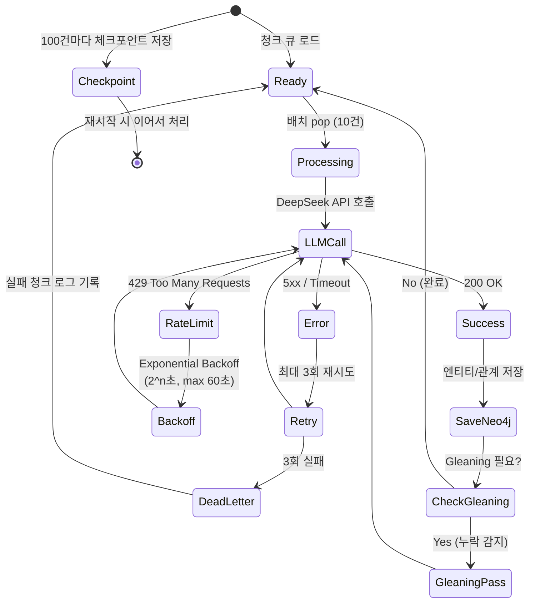

#### 3.3.3 엔티티 중복 제거 전략

56,063개 청크에서 추출하면 동일 엔티티가 수십~수백 회 중복 출현한다. Neo4j에 저장 전 반드시 정규화해야 한다.

```python
# 엔티티 정규화 파이프라인 (개념)
class EntityNormalizer:
    """추출된 엔티티의 중복 제거 및 정규화"""

    def normalize(self, entities: List[Entity]) -> List[Entity]:
        # 1. 이름 정규화 (소문자, 공백 정리)
        # 2. 동의어 병합 ("K8s" == "Kubernetes" == "쿠버네티스")
        # 3. 타입 일관성 검증 ("Python"이 Technology와 Person 양쪽에 있으면 Technology 우선)
        # 4. 빈도 기반 대표 이름 선택 (가장 많이 출현한 형태)
        pass
```

| 정규화 규칙 | 예시 |
|------------|------|
| 대소문자 통일 | "kubernetes", "Kubernetes", "KUBERNETES" -> "Kubernetes" |
| 약어 병합 | "K8s", "k8s" -> "Kubernetes" (동의어 사전) |
| 언어 병합 | "인공지능", "AI", "Artificial Intelligence" -> 주 표기 선택 |
| 타입 충돌 해결 | "Python" = Technology (Person보다 우선) |

#### 3.3.4 Neo4j 저장 구조

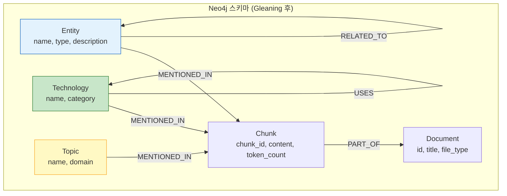

#### 3.3.5 체크포인트/재시작 설계

3시간 소요되는 배치 작업이므로, 중간에 실패해도 이어서 처리할 수 있어야 한다.

```python
# 체크포인트 구조
checkpoint = {
    "job_id": "gleaning_20260215",
    "total_chunks": 30000,
    "processed": 15432,
    "last_chunk_id": "chunk_uuid_xyz",
    "entities_extracted": 8921,
    "relationships_extracted": 12456,
    "errors": 23,
    "timestamp": "2026-02-15T14:30:00Z",
}
# PostgreSQL gleaning_jobs 테이블에 저장
# 재시작 시 last_chunk_id 이후부터 처리 재개
```

---

## 4. 메모리/성능: ES 및 Neo4j 증설 영향 분석

### 4.1 현재 메모리 구성 (WSL2 Override)

| 컴포넌트 | 현재 설정 | Heap/JVM | 총 메모리 limit |
|---------|----------|---------|:-------------:|
| Elasticsearch | `-Xms512m -Xmx512m` | 512MB | 1,536MB |
| Neo4j | Heap 256-512MB, PageCache 256MB | 512MB max | 1,024MB |
| AI Service (BGE-M3) | - | ~2.9GB RSS | 10GB |
| PostgreSQL | shared_buffers=128MB | - | 640MB |
| Redis | maxmemory 1GB | - | 1GB |
| **합계** | | | **~15.2GB** |

### 4.2 증설 시나리오 분석

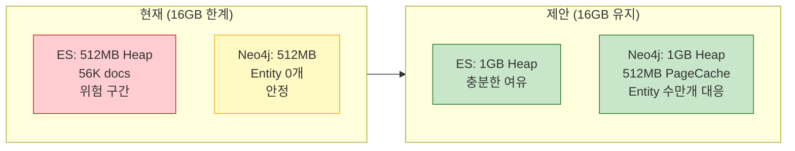

#### 4.2.1 ES 512MB to 1GB

| 항목 | 512MB (현재) | 1GB (제안) | 효과 |
|------|:-----------:|:---------:|------|
| HNSW 인덱스 캐싱 | 부분적 | 대부분 상주 | kNN 검색 latency 안정화 |
| GC Pause | 빈번 (2-3초 간격) | 감소 (10초+ 간격) | 검색 tail latency 개선 |
| Bulk indexing | OOM 위험 | 안정 | ETL 재인덱싱 안전 |
| Sparse match 쿼리 | should 50개 절 처리 부담 | 여유 | 3-way RRF 안정성 |

**계산 근거**: 56,063건 x 1024d x 4bytes = ~217MB (Dense 벡터만). HNSW 그래프 오버헤드 ~30% 추가 = ~282MB. 512MB Heap에서 나머지 용도 230MB만 남는 것은 위험하다. 1GB면 718MB 여유로 안정적이다.

> **ADR-004**: ES Heap을 1GB로 증설한다. 16GB 총 메모리에서 추가 512MB는 AI Service 메모리 제한을 10GB에서 9.5GB로 조정하여 확보한다. BGE-M3 모델 로드 후 RSS가 ~2.9GB이므로 9.5GB도 충분하다.

#### 4.2.2 Neo4j Heap 증설

| 항목 | 현재 (512MB) | 제안 (1GB Heap + 512MB PC) | 효과 |
|------|:-----------:|:-------------------------:|------|
| Entity 0개 운영 | 문제 없음 | - | - |
| Gleaning 후 (~50K entities) | Heap 압박 | 안정 운영 | Entity 수만개 + RELATED_TO 관계 수십만개 처리 |
| Cypher 쿼리 성능 | 단순 CONTAINS 가능 | 그래프 탐색 2-hop | Graph Search 실효성 확보 |
| PageCache | 256MB | 512MB | 자주 접근하는 노드/관계 캐싱 |

**Gleaning 후 Neo4j 메모리 추정**:
- Entity 노드 50,000개 x ~200bytes = ~10MB
- Relationship 100,000개 x ~150bytes = ~15MB
- 인덱스/속성 오버헤드 = ~50MB
- 합계 ~75MB (데이터 자체는 적으나, Cypher 쿼리 실행 시 Heap 사용이 관건)

### 4.3 증설 후 총 메모리 계획

| 컴포넌트 | 현재 | 제안 | 변화 |
|---------|:----:|:----:|:----:|
| Elasticsearch | 1,536MB | 2,048MB | +512MB |
| Neo4j | 1,024MB | 2,048MB | +1,024MB |
| AI Service | 10,240MB | 9,216MB | -1,024MB |
| PostgreSQL | 640MB | 640MB | - |
| Redis | 1,024MB | 768MB | -256MB |
| Observability (Prometheus/Grafana/etc.) | 1,792MB | 1,536MB | -256MB |
| **합계** | ~16,256MB | ~16,256MB | **0** |

> Redis를 768MB로 줄이고(maxmemory 768MB, LRU eviction으로 충분), Observability 일부 컨테이너를 경량화하여 ES/Neo4j 증설분을 상쇄한다.

---

## 5. 기술 부채 우선순위 분석

### 5.1 기술 부채 전체 조감

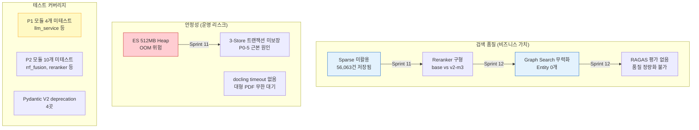

### 5.2 우선순위 매트릭스

| 순위 | 항목 | 카테고리 | 비용 (SP) | 영향도 | ROI | 근거 |
|:----:|------|---------|:---------:|:-----:|:---:|------|
| **1** | Sparse 검색 통합 | 품질 | 5 | 높음 | 높음 | 이미 저장된 데이터 활용, 코드 변경만으로 검색 채널 +1 |
| **2** | ES 메모리 증설 | 안정성 | 1 | 높음 | 매우 높음 | docker-compose 설정 변경만으로 OOM 방지 |
| **3** | Reranker v2-m3 | 품질 | 3 | 중간 | 높음 | 모델 교체로 최종 순위 정확도 직접 개선 |
| **4** | docling timeout | 안정성 | 1 | 중간 | 높음 | 대형 PDF 장애 예방, 구현 단순 |
| **5** | P1 테스트 모듈 | 테스트 | 3 | 중간 | 중간 | llm_service, background_worker 핵심 모듈 커버리지 |
| **6** | Gleaning 엔티티 추출 (2회) | 품질 | 5 | 높음 | 중간 | LLM 비용 $8.8, 3.5시간 소요. Sparse 이후 진행 |
| **7** | 3-Store 트랜잭션 | 안정성 | 3 | 중간 | 중간 | 재발 방지, 설계 변경 필요 |
| **8** | RAGAS 품질 평가 | 품질 | 3 | 높음 | 중간 | 품질 개선 효과를 정량 측정하는 기반 |
| **9** | Pydantic V2 수정 | 테스트 | 1 | 낮음 | 높음 | 4곳 단순 변경 |
| **10** | P2 테스트 모듈 | 테스트 | 5 | 낮음 | 낮음 | 보조 모듈, 후순위 |

### 5.3 Sprint 11 권장 구성

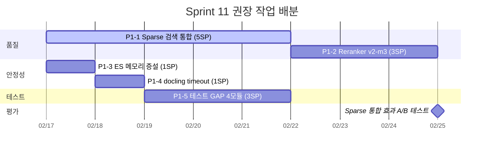

### 5.4 어디에 집중해야 하는가

**결론: "검색 품질"에 집중하되, "안정성"을 병행한다.**

근거:
1. **검색 품질이 최우선인 이유**: 시스템의 존재 이유가 "정확한 검색"이다. Dense+BM25 2-way만으로는 어휘적 매칭(고유명사, 약어)에서 약점이 있다. Sparse 통합은 이미 데이터가 있어 구현 비용 대비 효과가 가장 크다.

2. **안정성을 병행해야 하는 이유**: ES 512MB는 56,063건 + HNSW 인덱스에서 실질적 OOM 위험이 있다. Sprint 11에서 Sparse 쿼리(match+should 50절)까지 추가되면 메모리 압박이 가중된다. 1SP(docker-compose 설정 변경)로 해결 가능하므로 반드시 병행한다.

3. **테스트 커버리지는 후순위인 이유**: 현재 주요 모듈(search, embedding, document_pipeline 등)은 97% 커버리지를 달성했다. 미테스트 P1 모듈(llm_service 등)은 LLM API 의존성이 높아 Docker 환경 테스트가 필수이며, 검색 품질 개선과 직접 관련이 없다. Sprint 11 후반부에 진행하면 충분하다.

---

## 6. 종합 아키텍처 로드맵

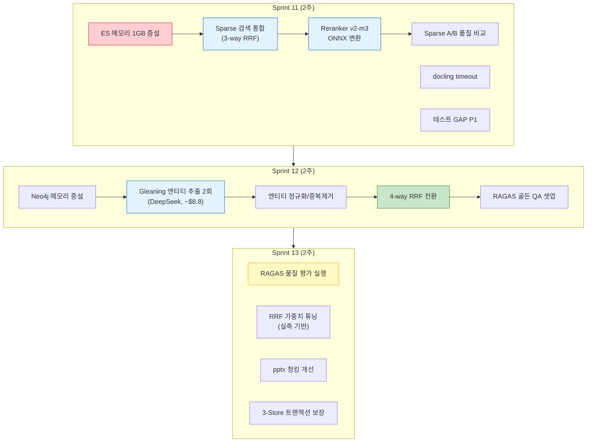

---

## 7. ADR (Architecture Decision Records) 요약

| ID | 결정 | 근거 | 대안 |
|----|------|------|------|
| ADR-001 | Sparse RRF 가중치 0.7로 시작 | BM25와 어휘 채널 과적합 방지 | 1.0 동일 가중치 (과적합 리스크) |
| ADR-002 | sparse_vector_json을 2-Phase Sparse Scoring에 활용 | ES 후보 ~100건에 대해 저장된 Sparse 벡터로 dot-product 계산. 메모리 부담 없음 | 쿼리 시 실시간 Sparse만 사용 (사전 계산한 벡터 미활용) |
| ADR-003 | Gleaning **2회** 적용, DeepSeek V3.2 사용 | $8.8 비용, 3.5시간 처리. 2회 Gleaning은 1회 대비 Recall +15-20% 추가 | Gleaning 1회 ($7.5, Recall +33%) |
| ADR-004 | ES Heap 1GB, AI Service 512MB 양보 | 56K HNSW + Sparse 쿼리 안정성 | 현행 512MB 유지 (OOM 리스크) |
| ADR-005 | match+should+boost 쿼리 방식 채택 | ES Basic 호환, Nori re-analysis로 토큰 불일치 해소 | term+boost (WordPiece vs Nori 불일치) |

---

## 8. 리스크 및 완화 방안

| 리스크 | 영향도 | 발생 확률 | 완화 방안 |
|--------|:-----:|:--------:|----------|
| Sparse match+should 50절 쿼리의 ES 성능 저하 | 중 | 중 | Top-30 토큰으로 제한, slow_log 모니터링 |
| Gleaning 시 DeepSeek Rate Limit | 중 | 높 | concurrency=5, exponential backoff, 체크포인트 |
| 16GB 메모리 재분배 시 AI Service OOM | 높 | 낮 | RSS 2.9GB << 9.5GB limit, 임베딩 배치 중 모니터링 |
| WordPiece vs Nori 토큰 매칭률 저조 | 중 | 중 | match 쿼리(analyzer 재분석), A/B 테스트로 사전 검증 |
| Gleaning 엔티티 품질 (한국어 LLM 추출) | 중 | 중 | 샘플 100건 수동 검증 후 전체 실행 |

---

*관련 문서*:
- [Sparse 검색 통합 설계서 v1.1](./15_sparse_vector_search_integration_design.md)
- [플랫폼 상세 설계서 v2.5](./01_hybrid_rag_platform_detailed_design.md)
- [Sprint 10 Action Tracker](../07_maintenance/29_sprint10_action_tracker.md)
- [Gleaning 기술 검토](./technical_assessment/03_gleaning_knowledge_graph_quality_assessment.md)
- [GPU 임베딩 Colab 매뉴얼](../07_maintenance/30_gpu_embedding_colab_manual.md)
