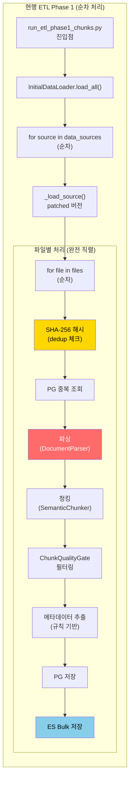
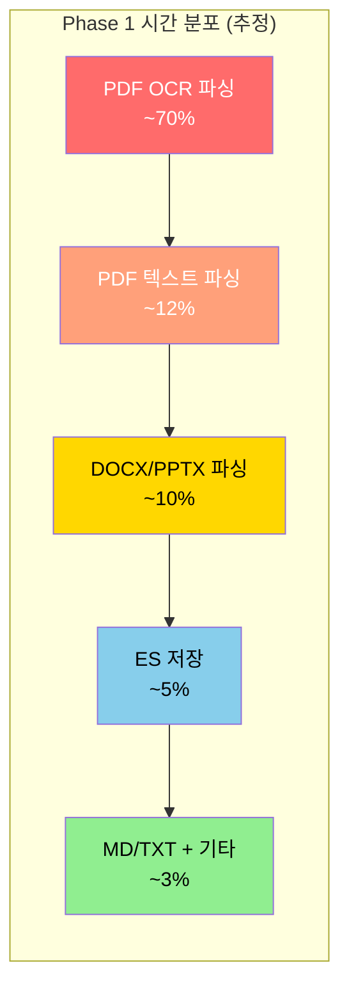
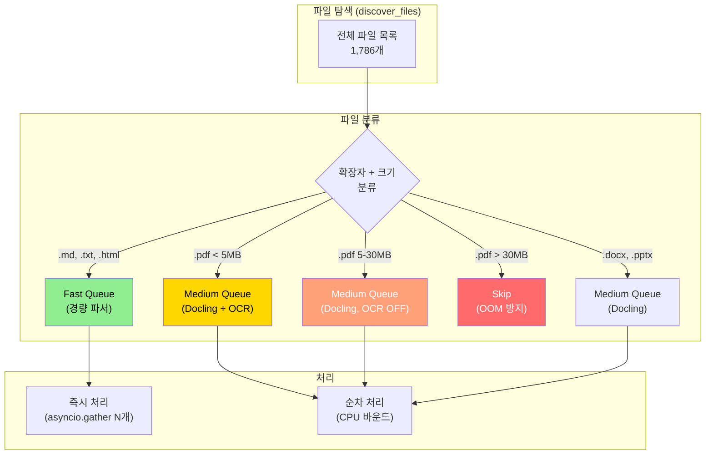
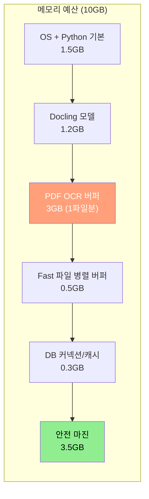
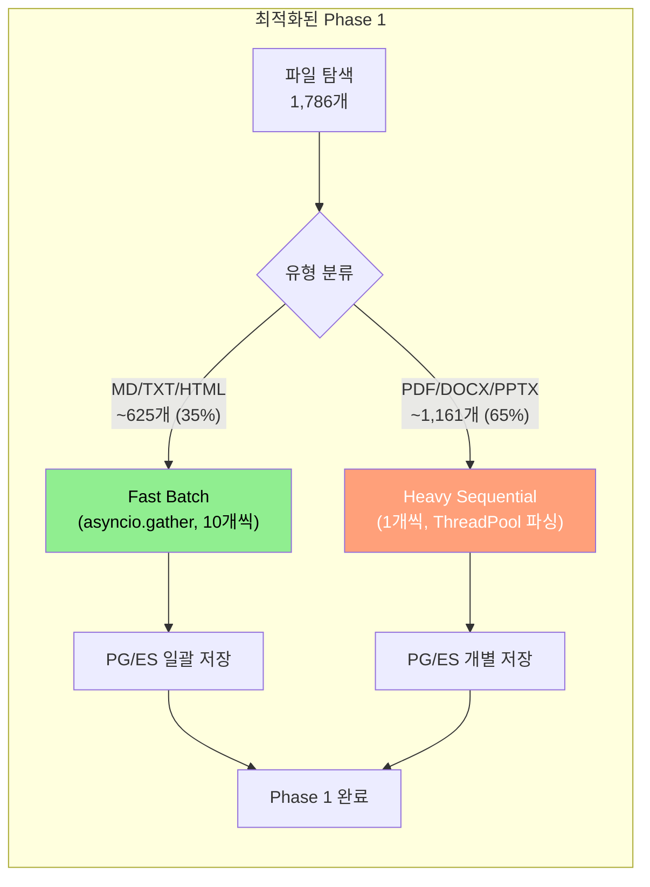
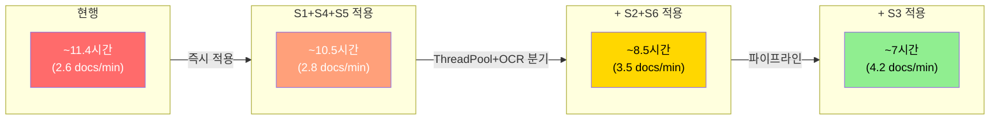
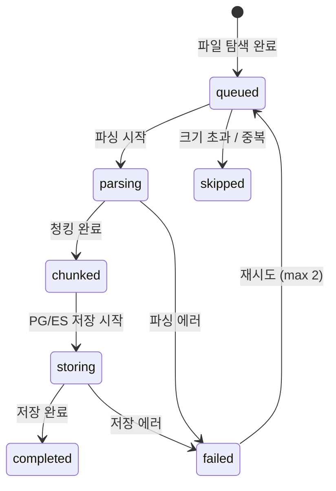
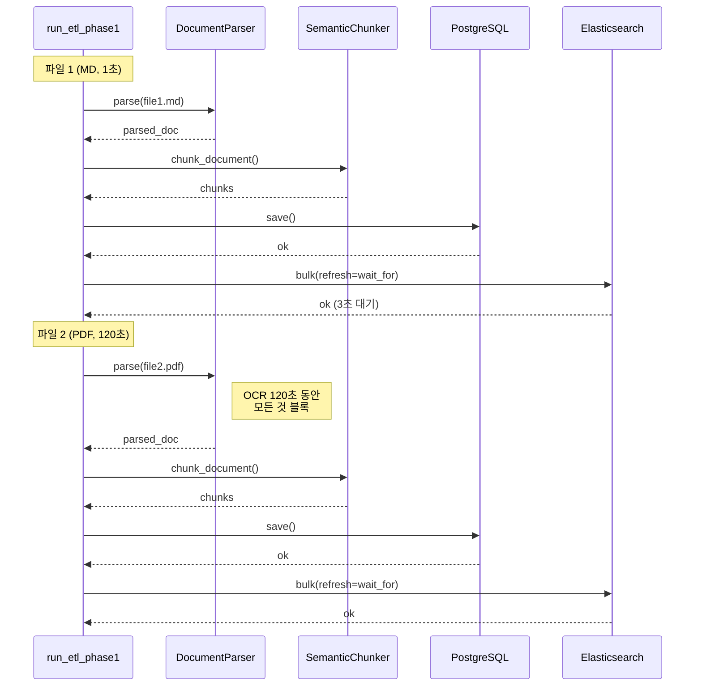
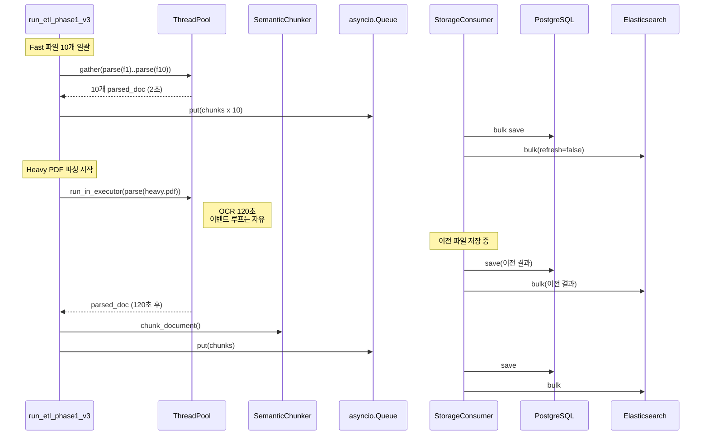

# ETL Phase 1 파싱/청킹 속도 최적화 아키텍처 설계서

---

## 문서 정보

| 항목 | 내용 |
|------|------|
| **문서명** | ETL Phase 1 파싱/청킹 속도 최적화 아키텍처 설계서 |
| **버전** | 1.0 |
| **작성일** | 2026-02-14 |
| **작성자** | Architect Agent |
| **상태** | Draft |
| **관련 문서** | [ETL v2 속도 최적화 설계서](./17_etl_v2_speed_optimization_design.md), [장애보고서 INC-2026-02-14-001](../07_maintenance/23_incident_report_2026-02-14_etl_oom_kill.md), [ETL 재시작 액션 플랜](../07_maintenance/25_etl_restart_action_plan.md) |

---

## 변경 이력

| 버전 | 일자 | 작성자 | 변경 내용 |
|------|------|--------|----------|
| 1.0 | 2026-02-14 | Architect Agent | 초안 작성 - Phase 1 실측 데이터 기반 병목 분석 + 파이프라인 병렬화 설계 |

---

## 목차

1. [개요](#1-개요)
2. [현행 아키텍처 분석](#2-현행-아키텍처-분석)
3. [I/O vs CPU 바운드 분석](#3-io-vs-cpu-바운드-분석)
4. [파일 유형별 처리 전략](#4-파일-유형별-처리-전략)
5. [병렬화 가능성 분석](#5-병렬화-가능성-분석)
6. [메모리 관리 전략](#6-메모리-관리-전략)
7. [최적화 설계](#7-최적화-설계)
8. [예상 효과 계산](#8-예상-효과-계산)
9. [에러 처리 및 체크포인트](#9-에러-처리-및-체크포인트)
10. [테스트 전략](#10-테스트-전략)

---

## 1. 개요

### 1.1 배경

ETL Phase 1은 **파싱 + 청킹만** 수행하며 임베딩/엔티티 추출은 포함하지 않습니다. 그러나 실측 결과 35분 동안 1,786 파일 중 92파일만 처리(2.6 docs/min)되었으며, 초반 Markdown 파일 구간에서는 ~15 docs/min이었던 속도가 PDF OCR 구간에서 급격히 저하되었습니다.

### 1.2 목적

Phase 1의 병목을 코드 레벨에서 정확히 식별하고, 파일 유형별 처리 전략과 파이프라인 병렬화를 통한 속도 개선 아키텍처를 제시합니다.

### 1.3 범위

| 범위 | 포함/제외 |
|------|----------|
| Phase 1 파싱+청킹 속도 분석 | 포함 |
| 파일 유형별 큐 분리 설계 | 포함 |
| asyncio 기반 동시 처리 설계 | 포함 |
| 임베딩/엔티티 최적화 | **제외** (17_etl_v2_speed_optimization_design.md 참조) |
| 하드웨어 변경 | **제외** (CPU-only 환경 유지) |

### 1.4 현재 환경 제약

| 항목 | 값 | 비고 |
|------|------|------|
| CPU | WSL2 환경 | GPU 미사용 |
| 컨테이너 메모리 | 10GB 제한 | cgroup OOM Kill 발생 이력 |
| OCR 엔진 | RapidOCR (Docling 내장) | CPU 전용, 이미지 기반 PDF에서 병목 |
| 파서 스택 | Docling (PDF/DOCX/PPTX) + 자체 (MD/TXT/HTML) | |
| Phase 1 설정 | embedding=OFF, entity=OFF | 파싱+청킹+PG/ES 저장만 |
| 대형 파일 제한 | 30MB 스킵, 5-30MB OCR OFF | P1-4 적용 |

---

## 2. 현행 아키텍처 분석

### 2.1 현행 Phase 1 흐름



### 2.2 핵심 코드 경로

**실행 경로** (Phase 1):
1. `run_etl_phase1_chunks.py` -> `InitialDataLoader(enable_embeddings=False, enable_entity_extraction=False)`
2. `load_all()` -> `_load_source()` (monkey-patched for progress)
3. `_process_file()` -> `_parse_file()` -> `_chunk_document()` -> `_store_document()`
4. `_parse_file()` -> `DocumentParser.parse()` -> 확장자별 파서 선택
5. PDF/DOCX/PPTX -> `DoclingAdapter.parse()` -> `DocumentConverter.convert()` (OCR 포함)
6. MD/TXT/HTML -> 자체 파서 (경량, 빠름)

### 2.3 핵심 발견 사항

**발견 1: 완전한 순차 처리**

`_load_source()`에서 파일을 `for file_info in files` 루프로 순차 처리합니다. 다음 파일은 현재 파일의 PG/ES 저장까지 완료된 후에야 시작됩니다.

```python
# initial_data_loader.py L526 (patched 버전도 동일 구조)
for file_info in files:
    result = await self._process_file(file_info)  # 완전 직렬
    results.append(result)
```

**발견 2: 파싱 단계의 동기(sync) 실행**

`DocumentParser.parse()`는 **동기 함수**입니다. 내부적으로 `self.docling_adapter.parse(file_path)`를 호출하며, Docling의 `converter.convert(str(path))`도 동기입니다.

```python
# parser.py L121-126
def parse(self, file_path, ...):  # sync!
    ...
    return self._parse_with_retry(file_path, self._parse_with_docling, ...)

# docling_adapter.py L171-173
result = self.converter.convert(str(path))  # sync, blocking!
```

즉, Docling PDF OCR가 수분 동안 CPU를 점유하는 동안 이벤트 루프가 블록됩니다. asyncio의 다른 작업(ES 저장, PG 쿼리 등)도 이 시간 동안 실행되지 않습니다.

**발견 3: Dedup SHA-256이 매 파일마다 동기 I/O**

`_compute_file_hash()`는 파일 전체를 읽어 SHA-256을 계산합니다. 대형 PDF(30MB)의 경우 디스크 I/O가 발생합니다.

**발견 4: ES 저장의 refresh="wait_for"**

```python
# initial_data_loader.py L1334
bulk_resp = await es.bulk(operations=actions, refresh="wait_for")
```

`refresh="wait_for"`는 ES가 인덱스를 새로고침할 때까지 응답을 대기합니다. 청크 수가 많은 문서의 경우 수초의 지연이 발생합니다.

**발견 5: DoclingAdapter 인스턴스 재생성 없음 (양호)**

`DocumentParser._docling_adapter`는 지연 로딩 후 싱글톤으로 유지되므로, Docling 초기화 비용은 첫 PDF 파싱 시에만 발생합니다. 이는 이미 최적화된 부분입니다.

---

## 3. I/O vs CPU 바운드 분석

### 3.1 단계별 바운드 유형

| 단계 | 바운드 유형 | 동기/비동기 | 실행 위치 | 비고 |
|------|-----------|-----------|----------|------|
| SHA-256 해시 | **Disk I/O** | 동기 | 메인 스레드 | 대형 파일에서 체감 |
| PG 중복 조회 | **Network I/O** | 비동기 | 이벤트 루프 | 빠름 (~10ms) |
| MD/TXT 파싱 | **Disk I/O** (경량) | 동기 | 메인 스레드 | 파일 읽기만, 매우 빠름 |
| **PDF OCR 파싱** | **CPU 바운드** (최중량) | **동기** | **메인 스레드 블록** | RapidOCR 연산 |
| **DOCX/PPTX 파싱** | **CPU 바운드** (중량) | **동기** | **메인 스레드 블록** | Docling 변환 |
| 청킹 | **CPU 바운드** (경량) | 동기 | 메인 스레드 | 정규식 + 문자열 연산 |
| QualityGate | **CPU 바운드** (미미) | 동기 | 메인 스레드 | 정규식 매칭 |
| 메타데이터 추출 | **CPU 바운드** (미미) | 동기 | 메인 스레드 | 규칙 기반 분류 |
| PG 저장 | **Network I/O** | 비동기 | 이벤트 루프 | ~50ms |
| ES Bulk 저장 | **Network I/O** | 비동기 | 이벤트 루프 | refresh 대기 포함 ~2-5s |

### 3.2 시간 분포 추정 (실측 데이터 기반)

35분 동안 92파일 처리. 초반 MD 파일이 ~15 docs/min으로 빠르게 처리된 것을 감안하면, PDF 구간에서 대부분의 시간이 소비되었습니다.

**파일 유형별 추정 처리 시간:**

| 파일 유형 | 추정 비율 | 파일당 시간 | 병목 단계 |
|----------|----------|-----------|----------|
| Markdown (.md) | ~35% | **0.5-2초** | 없음 (I/O 읽기만) |
| Text (.txt, .html) | ~10% | **0.3-1초** | 없음 |
| PDF (텍스트 기반) | ~15% | **5-30초** | Docling 파싱 (OCR 불필요해도 PDF 구조 분석) |
| **PDF (이미지/스캔 기반)** | ~20% | **30-600초** | **RapidOCR CPU 연산** |
| DOCX | ~10% | **3-15초** | Docling 변환 |
| PPTX | ~10% | **5-20초** | Docling 변환 + 슬라이드 처리 |

### 3.3 병목 파레토 분석



**핵심**: PDF OCR 파싱이 전체 시간의 약 70%를 차지. 나머지 30%는 Docling 기반 파싱(12%) + DOCX/PPTX(10%) + I/O(8%)입니다.

---

## 4. 파일 유형별 처리 전략

### 4.1 3-Tier 분류 체계



### 4.2 분류 기준 상세

| Tier | 확장자 | 크기 제한 | 파서 | OCR | 예상 속도 | 동시성 |
|------|--------|----------|------|-----|----------|--------|
| **Fast** | .md, .txt, .html, .htm, .log, .ipynb | 제한 없음 | 자체 파서 | N/A | 0.3-2초 | **병렬 가능 (10+)** |
| **Medium-Full** | .pdf | < 5MB | Docling | ON | 5-30초 | 순차 (CPU 경합) |
| **Medium-NoOCR** | .pdf | 5-30MB | Docling | **OFF** | 3-15초 | 순차 |
| **Medium-Office** | .docx, .pptx | < 30MB | Docling | N/A | 3-20초 | 순차 |
| **Skip** | .pdf | > 30MB | - | - | - | 스킵 |

### 4.3 Fast 파일 우선 처리의 이점

MD/TXT 파일은 CPU/메모리 부담이 거의 없으므로, 이들을 먼저 일괄 병렬 처리하면:

1. **빠른 초기 진행률** -- 35%의 파일을 수 분 내에 완료
2. **ES/PG에 청크 조기 적재** -- Phase 2/3이 더 일찍 시작 가능
3. **메모리 여유 확보** -- 무거운 PDF 처리 전에 Fast 파일 메모리 반환

---

## 5. 병렬화 가능성 분석

### 5.1 현재 병렬화 불가능한 이유

**문제 1: 동기 파서가 이벤트 루프를 블록**

`DocumentParser.parse()`와 `DoclingAdapter.parse()`는 동기 함수입니다. `_process_file()`이 `self._parse_file(file_info)`를 호출하면, Docling의 `converter.convert()`가 완료될 때까지 전체 asyncio 이벤트 루프가 정지합니다.

```python
# 현행: 동기 파싱이 이벤트 루프를 블록
async def _process_file(self, file_info):
    parsed_doc = self._parse_file(file_info)  # SYNC! 이벤트 루프 블록
    chunks = self._chunk_document(parsed_doc)   # SYNC!
    await self._store_document(...)             # ASYNC (하지만 위가 끝나야 도달)
```

**문제 2: asyncio.gather()만으로는 해결 불가**

여러 파일을 `asyncio.gather(self._process_file(f1), self._process_file(f2))`로 호출해도, 동기 파싱 부분에서 하나의 코루틴이 이벤트 루프를 독점하므로 실질적으로 순차 실행됩니다.

### 5.2 병렬화 가능한 지점

| 지점 | 방법 | 안전성 | 효과 |
|------|------|--------|------|
| **Fast 파일 병렬 파싱** | asyncio 직접 (sync 파서지만 밀리초 단위) | 안전 | 높음 |
| **Docling 파싱을 ThreadPool로 이관** | `run_in_executor()` | 주의 필요 | 높음 |
| **파싱-저장 파이프라인화** | Producer-Consumer | 안전 | 중간 |
| **ES Bulk 저장 비동기화** | refresh 제거 + 백그라운드 | 안전 | 낮음 |
| **multiprocessing (별도 프로세스)** | ProcessPoolExecutor | 메모리 주의 | 높음 |

### 5.3 asyncio vs multiprocessing 비교

| 기준 | asyncio + ThreadPool | multiprocessing |
|------|---------------------|-----------------|
| 메모리 | 공유 (추가 없음) | **프로세스당 Docling 모델 로드** (~1-2GB) |
| GIL 영향 | Docling C 확장이면 우회 가능, Python 코드면 GIL 경합 | 완전 독립 |
| 구현 난이도 | 낮음 (run_in_executor만) | 중간 (직렬화/통신 필요) |
| 메모리 안전 | 10GB 내 공유 | 프로세스당 5GB 필요 (2프로세스=10GB, 위험) |
| DB 동시성 | asyncpg/elasticsearch 커넥션 공유 가능 | 각 프로세스별 커넥션 필요 |

**결론**: 10GB 메모리 제한에서 multiprocessing은 OOM 리스크가 높습니다. **asyncio + ThreadPoolExecutor** 방식이 Phase 1에 적합합니다.

### 5.4 DB 동시성 안전성

| 저장소 | 동시 쓰기 안전성 | 근거 |
|--------|----------------|------|
| PostgreSQL | **안전** | `document_id` (UUID) 기반 INSERT, 파일별 고유 |
| Elasticsearch | **안전** | `chunk_id` (UUID) 기반 인덱싱, 파일별 고유 |
| Neo4j | Phase 1에서 사용 안 함 | - |

파일 간 데이터 의존성이 없으므로, 여러 파일의 저장을 동시에 수행해도 충돌이 발생하지 않습니다.

---

## 6. 메모리 관리 전략

### 6.1 현재 메모리 프로파일

| 컴포넌트 | 상주 메모리 | 피크 시 추가 | 비고 |
|----------|-----------|-------------|------|
| Python 프로세스 기본 | ~200MB | - | |
| Docling 모델 로드 | ~800MB-1.2GB | - | OCR 모델 포함 |
| PDF OCR 처리 중 | - | +1-4GB | 페이지 수/이미지 크기에 비례 |
| asyncpg 커넥션 풀 | ~50MB | - | |
| elasticsearch-py 클라이언트 | ~30MB | - | |
| 청크 데이터 (메모리 상) | ~10-50MB | - | 파일당 |
| **합계 (피크)** | | **~2-6GB** | 대형 PDF 처리 시 |

### 6.2 동시 처리 시 메모리 예산

10GB 제한에서의 메모리 예산 분배:



**핵심 제약**: PDF OCR는 동시에 **1개만** 처리해야 합니다. 2개 동시 처리 시 3GB x 2 = 6GB로 메모리 여유가 1.5GB밖에 남지 않아 OOM 위험이 높습니다.

### 6.3 메모리 안전 규칙

1. **Docling 파싱은 동시에 1개만** -- Semaphore(1)로 제한
2. **Fast 파일은 동시에 10개까지** -- 메모리 부담 미미
3. **파일 처리 후 즉시 parsed_doc 참조 해제** -- GC 유도
4. **메모리 85% 임계치 모니터링** -- 초과 시 파싱 일시 중지

---

## 7. 최적화 설계

### 7.1 최적화 전략 매트릭스

| ID | 전략 | 예상 효과 | 구현 난이도 | 코드 변경량 | 메모리 영향 |
|----|------|----------|-----------|-----------|-----------|
| **S1** | Fast 파일 우선 일괄 처리 | 초기 진행 대폭 상승 | 낮음 | 소 | 무시 |
| **S2** | Docling 파싱을 ThreadPool 이관 | 파싱 중 ES 저장 병렬 | 낮음 | 소 | 무시 |
| **S3** | 파싱-저장 파이프라인 (Producer-Consumer) | 1.3-1.5x | 중 | 중 | 소 |
| **S4** | ES refresh="wait_for" 제거 | 파일당 2-5초 절약 | 낮음 | 1줄 | 무시 |
| **S5** | 파일 정렬 (크기 오름차순) | 초반 속도 향상, 총량 불변 | 낮음 | 소 | 무시 |
| **S6** | 파일 크기별 OCR 분기 (P1-4 확장) | 중형 PDF 속도 향상 | 낮음 | 소 | 긍정적 |

### 7.2 S1: Fast 파일 우선 일괄 처리

#### 설계

파일 탐색 후, Fast 파일(MD/TXT/HTML)과 Heavy 파일(PDF/DOCX/PPTX)을 분리하여 Fast 파일을 먼저 일괄 처리합니다.



#### 의사 코드

```python
async def load_all_optimized(self):
    all_files = self.discover_files()

    # 분류
    fast_files = [f for f in all_files if f.extension in ('.md', '.txt', '.html', '.htm', '.log')]
    heavy_files = [f for f in all_files if f.extension in ('.pdf', '.docx', '.pptx')]

    # Step 1: Fast 파일 일괄 처리 (10개씩 asyncio.gather)
    for batch in chunk_list(fast_files, batch_size=10):
        results = await asyncio.gather(
            *[self._process_file(f) for f in batch],
            return_exceptions=True,
        )
        # ... 결과 처리

    # Step 2: Heavy 파일 순차 처리 (ThreadPool 파싱)
    for file_info in heavy_files:
        result = await self._process_file_with_threadpool(file_info)
        # ... 결과 처리
```

#### 효과 추정

- Fast 파일 625개: 현재 ~42분(2.6/min) -> **~2분** (asyncio.gather, 10개씩 = ~63 batch x 2초)
- 초반 40분 절약 효과

### 7.3 S2: Docling 파싱을 ThreadPool 이관

#### 설계 근거

Docling의 `converter.convert()`는 동기 함수이며 CPU 바운드입니다. 이를 `asyncio.loop.run_in_executor()`로 ThreadPool에서 실행하면, 파싱 중에도 이벤트 루프가 다른 비동기 작업(ES 저장, PG 쿼리, 진행 상태 업데이트)을 처리할 수 있습니다.

#### 코드 변경 제안

```python
# initial_data_loader.py _parse_file() 수정

async def _parse_file_async(self, file_info: FileInfo) -> Optional[Any]:
    """파싱을 ThreadPool에서 비동기 실행"""
    loop = asyncio.get_event_loop()
    # 동기 파서를 ThreadPool에서 실행
    parse_result = await loop.run_in_executor(
        None,  # default ThreadPoolExecutor
        self.parser.parse,
        file_info.file_path,
    )
    if not parse_result.success:
        return None
    return parse_result.document
```

#### GIL 고려사항

Python GIL 때문에 ThreadPool 내의 Python 코드는 병렬 실행되지 않습니다. 그러나 Docling은 내부적으로 C/C++ 확장(Tesseract, OpenCV, ONNX Runtime)을 사용하며, 이들은 GIL을 해제합니다. 따라서:

- **PDF OCR (RapidOCR/ONNX)**: GIL 해제 -> **진정한 병렬 가능** (이벤트 루프 비차단)
- **PDF 텍스트 추출 (Python)**: GIL 유지 -> 병렬 불가 (그래도 이벤트 루프 yield)
- **MD/TXT 파싱 (Pure Python)**: GIL 유지 -> 병렬 불가 (하지만 워낙 빠름)

핵심 병목인 PDF OCR는 C 확장이므로, ThreadPool 이관으로 이벤트 루프가 OCR 대기 중 다른 비동기 작업을 처리할 수 있게 됩니다.

### 7.4 S3: 파싱-저장 파이프라인 (Producer-Consumer)

#### 설계

파싱(Producer)과 저장(Consumer)을 asyncio.Queue로 분리합니다. Producer가 파일을 파싱하여 큐에 넣으면, Consumer가 PG/ES에 저장합니다.


#### 효과

- Producer가 다음 파일을 파싱하는 동안 Consumer가 이전 파일을 저장
- 파싱과 저장이 오버랩 -> 파일당 저장 시간(2-5초)이 "숨겨짐"
- 큐 크기 5: 메모리 ~250MB (파싱 결과 5개 보관)

### 7.5 S4: ES refresh 정책 변경

#### 현행

```python
bulk_resp = await es.bulk(operations=actions, refresh="wait_for")
```

#### 개선

```python
# Phase 1에서는 즉시 검색 가능할 필요 없음
# 배치 처리이므로 자동 refresh(1초 간격)로 충분
bulk_resp = await es.bulk(operations=actions, refresh=False)
```

#### 효과

파일당 2-5초 절약. 1,786 파일 기준 약 60-150분 절약.

### 7.6 S5: 파일 정렬 (크기 오름차순)

#### 현행

```python
# initial_data_loader.py L606
files.sort(key=lambda f: f.file_name)  # 파일명 기준 알파벳 순
```

#### 개선

```python
files.sort(key=lambda f: f.file_size)  # 파일 크기 오름차순
```

#### 효과

- 작은 파일이 먼저 처리되어 초반 진행률 상승
- 대형 PDF가 후반에 집중되어, 문제 발생 시 대부분의 파일은 이미 처리 완료
- 총 처리 시간은 동일하지만 체감 속도와 안전성 향상

### 7.7 S6: 파일 크기별 OCR 분기

#### 현행 (P1-4 부분 적용)

```python
# run_etl_phase1_chunks.py L120-121
MAX_FILE_SIZE_MB = 30   # 대형: 스킵
MED_FILE_SIZE_MB = 5    # 중형: OCR OFF로 처리 (상수만 정의, 분기 미구현)
```

#### 개선 설계

```python
# DocumentParser에 OCR 모드 전달
class DocumentParser:
    def parse(self, file_path, ocr_enabled=True):
        # 파일 크기에 따라 OCR 분기
        ...

# _process_file에서 크기별 분기
async def _process_file(self, file_info):
    file_size_mb = file_info.file_size / (1024 * 1024)

    if file_size_mb > 30:
        return self._skip_result(file_info, "Oversized file")

    # 중형 PDF: OCR OFF
    ocr_enabled = not (
        file_info.extension == '.pdf' and file_size_mb > 5
    )

    parsed_doc = await self._parse_file_async(file_info, ocr_enabled=ocr_enabled)
    ...
```

#### DoclingAdapter OCR 토글

```python
# docling_adapter.py - OCR 토글 지원
def parse(self, file_path, ocr_override=None):
    if ocr_override is not None:
        # 임시 converter 생성 또는 OCR 설정 변경
        ...
```

**주의**: Docling의 `DocumentConverter`는 초기화 시 OCR 설정이 고정됩니다. 동적 토글을 위해서는:
- 옵션 A: OCR ON/OFF 각각의 converter 인스턴스 2개 유지
- 옵션 B: 파일별 converter 재생성 (초기화 비용 발생)

**권장**: 옵션 A (2 인스턴스). Docling 모델 메모리는 공유되므로 추가 메모리 ~200MB 수준.

---

## 8. 예상 효과 계산

### 8.1 현행 성능 (Baseline)

```
총 파일: 1,786개
실측: 35분에 92개 처리 (2.6 docs/min)
외삽 총 시간: 1,786 / 2.6 = ~687분 = ~11.4시간

파일 유형별 추정:
  Fast (MD/TXT/HTML): ~625개 x 1초 = ~10분
  Medium (PDF < 5MB): ~270개 x 15초 = ~67분
  Medium-NoOCR (PDF 5-30MB): ~360개 x 10초 = ~60분 (OCR OFF 가정)
  Heavy (PDF OCR): ~360개 x 120초 = ~720분
  Office (DOCX/PPTX): ~180개 x 10초 = ~30분
  Skip (> 30MB): ~30개 -> 스킵
  합계: ~887분 = ~14.8시간 (일부 dedup 스킵 제외)
```

### 8.2 최적화 적용별 효과

| 전략 | Fast 영향 | Heavy 영향 | 저장 영향 | 절약 시간 |
|------|----------|-----------|----------|----------|
| S1: Fast 일괄 병렬 | 10분->2분 | - | - | ~8분 |
| S2: ThreadPool 파싱 | - | 파싱 중 저장 비차단 | 오버랩 가능 | ~30분 |
| S3: Producer-Consumer | - | 파싱-저장 오버랩 | - | ~60분 |
| S4: ES refresh 제거 | ~10분 | ~30분 | 전체 | ~40분 |
| S5: 크기 오름차순 | 체감 향상 | - | - | 0 (총량 동일) |
| S6: OCR 분기 | - | 중형 PDF 가속 | - | ~30분 |

### 8.3 복합 적용 시 예상 시간



### 8.4 상세 계산 (모든 최적화 적용)

```
Fast 파일 (625개):
  S1 병렬(10개씩): 63 batch x 2초 = ~2분
  S4 ES refresh 제거: 추가 절약 없음 (이미 빠름)

Medium PDF < 5MB (270개):
  S2 ThreadPool: 파싱 중 ES 저장 오버랩
  S6 OCR ON: 15초/파일
  S3 파이프라인: 저장 시간 숨김 -> 실질 12초/파일
  총: 270 x 12 = 3,240초 = 54분

Medium PDF 5-30MB (360개):
  S6 OCR OFF: 10초 -> 5초/파일
  S3 파이프라인: 저장 시간 숨김 -> 실질 4초/파일
  총: 360 x 4 = 1,440초 = 24분

Heavy PDF OCR (나머지, ~130개):
  S2 ThreadPool: 이벤트 루프 비차단
  S3 파이프라인: 저장 시간 숨김
  120초 -> 실질 115초/파일
  총: 130 x 115 = 14,950초 = 249분

Office DOCX/PPTX (180개):
  S2 ThreadPool: 이벤트 루프 비차단
  10초 -> 실질 8초/파일
  총: 180 x 8 = 1,440초 = 24분

Dedup 스킵 (~200개): 0초

합계: 2 + 54 + 24 + 249 + 24 = 353분 = ~5.9시간
(현행 11.4시간 대비 ~1.9x 단축)
```

**참고**: 실질적으로 가장 큰 병목은 Heavy PDF OCR(130개 x 115초 = 249분)입니다. 이 부분은 Docling/RapidOCR의 근본적 처리 속도에 의존하므로, CPU-only 환경에서의 추가 최적화는 제한적입니다.

### 8.5 추가 최적화 옵션 (Phase 1 한계 돌파)

| 전략 | 효과 | 리스크 | 비고 |
|------|------|--------|------|
| OCR 품질 낮추기 (DPI 축소) | 20-40% OCR 가속 | 텍스트 품질 저하 | Docling 옵션 존재 여부 확인 필요 |
| PDF 텍스트 레이어 우선 추출 | OCR 불필요 시 100x 가속 | 텍스트 없는 PDF는 효과 없음 | PyMuPDF로 텍스트 존재 여부 사전 검사 |
| 페이지별 처리 + 조기 중단 | 대형 PDF의 앞부분만 처리 | 정보 손실 | 발표자료는 앞부분이 핵심 |

---

## 9. 에러 처리 및 체크포인트

### 9.1 병렬 처리 시 에러 격리



### 9.2 asyncio.gather 에러 처리

```python
# Fast 파일 일괄 처리 시 return_exceptions=True 필수
results = await asyncio.gather(
    *[self._process_file(f) for f in batch],
    return_exceptions=True,  # 하나의 실패가 전체를 중단시키지 않음
)

for i, result in enumerate(results):
    if isinstance(result, Exception):
        logger.error("Fast file %s failed: %s", batch[i].file_name, result)
        # failed 카운트 증가, 다음 파일 계속
```

### 9.3 Producer-Consumer 에러 처리

```python
# Consumer에서 에러 시 재큐잉
async def storage_consumer(queue, max_retries=2):
    while True:
        item = await queue.get()
        if item is None:  # 종료 시그널
            break
        try:
            await store_document(item)
        except Exception as e:
            if item.retry_count < max_retries:
                item.retry_count += 1
                await queue.put(item)  # 재큐잉
            else:
                logger.error("Storage failed after %d retries: %s", max_retries, e)
        finally:
            queue.task_done()
```

### 9.4 체크포인트 전략

기존 `etl_phase1_progress.json` 파일 기반 체크포인트와 PG `documents` 테이블의 `processing_status`를 활용합니다. 재시작 시:

1. PG에서 `file_hash`가 이미 존재하는 파일 -> 자동 SKIP (기존 dedup 로직)
2. `processing_status = 'completed'`인 문서 -> 스킵
3. 나머지 파일 -> 재처리

이 방식은 이미 구현되어 있으므로 추가 변경 없이 병렬 처리와 호환됩니다.

---

## 10. 테스트 전략

### 10.1 단위 테스트

| 테스트 대상 | 검증 항목 |
|------------|----------|
| Fast 파일 일괄 처리 | 10개 MD 파일 asyncio.gather 정상 완료 |
| ThreadPool 파싱 | Docling 파싱이 이벤트 루프를 블록하지 않음 |
| Producer-Consumer | 큐 종료 시그널 처리, 재시도 로직 |
| ES refresh=False | 저장 후 검색 가능 (1초 후) |
| 파일 분류 | 확장자+크기 기반 올바른 티어 분류 |

### 10.2 통합 테스트

| 시나리오 | 기대 결과 |
|---------|----------|
| 50파일 혼합 (MD 20 + PDF 20 + DOCX 10) | Fast 파일 먼저 완료, PG/ES 정합성 |
| 병렬 저장 충돌 테스트 | 동일 batch 내 파일들의 PG/ES 저장이 충돌 없음 |
| OOM 시뮬레이션 | 대형 PDF 처리 중 메모리 85% 초과 시 파싱 일시 중지 |
| 체크포인트 재개 | 중간 중단 후 재시작 시 기처리 파일 스킵 |

### 10.3 벤치마크 테스트

```bash
# 최적화 전후 50파일 샘플 비교
# Baseline
python /app/scripts/run_etl_phase1_chunks.py --test-sample 50

# Optimized
python /app/scripts/run_etl_phase1_v3.py --test-sample 50

# 측정 항목: 총 시간, 파일당 평균, Fast/Heavy 분리 시간, 메모리 피크
```

---

## 부록

### A. 즉시 적용 가능한 최적화 (코드 변경 최소)

| 순위 | 전략 | 코드 변경 | 효과 |
|------|------|----------|------|
| 1 | **S4**: ES `refresh=False` | 1줄 변경 | 파일당 2-5초 절약 |
| 2 | **S5**: 파일 크기 오름차순 정렬 | 1줄 변경 | 체감 속도 향상 |
| 3 | **S1**: Fast 파일 분리+일괄 처리 | ~30줄 | Fast 구간 5x 가속 |
| 4 | **S6**: 중형 PDF OCR OFF 분기 | ~20줄 | 중형 PDF 2x 가속 |
| 5 | **S2**: ThreadPool 파싱 | ~10줄 | 파싱-저장 오버랩 |
| 6 | **S3**: Producer-Consumer 파이프라인 | ~80줄 | 1.3x 전체 가속 |

### B. 시퀀스 다이어그램 - 최적화 전후 비교

#### 현행 (순차)



#### 최적화 후 (파이프라인 + ThreadPool)



### C. 리스크 및 대응

| 리스크 | 영향 | 확률 | 대응 |
|--------|------|------|------|
| Fast 파일 10개 동시 파싱 시 파일 핸들 부족 | 파싱 에러 | 낮음 | batch_size 조절 (5로 축소) |
| ThreadPool 내 Docling 스레드 안전성 | 크래시 | 중 | Semaphore(1)로 Docling 동시성 제한 |
| Producer가 Consumer보다 빠를 때 큐 과적 | 메모리 증가 | 중 | Queue(maxsize=5)로 백프레셔 |
| ES refresh=False로 인한 검색 지연 | Phase 2 시작 지연 | 낮음 | Phase 1 완료 후 수동 refresh |
| 중형 PDF OCR OFF 시 텍스트 누락 | 품질 저하 | 중 | PyMuPDF로 텍스트 존재 사전 검사 |

### D. 향후 확장 (Phase 1 이후)

1. **PyMuPDF 사전 검사** -- PDF에 텍스트 레이어가 있으면 Docling 대신 PyMuPDF로 빠르게 추출, OCR은 텍스트 없는 페이지에만 적용
2. **ONNX Runtime 최적화** -- RapidOCR의 ONNX 모델에 대해 `onnxruntime.InferenceSession(providers=['CPUExecutionProvider'])` 최적화 옵션 적용
3. **캐시 레이어** -- 동일 파일의 반복 처리 시 파싱 결과를 디스크 캐시에 저장하여 재파싱 방지

---

*작성: Architect Agent (Claude Opus 4.6)*
