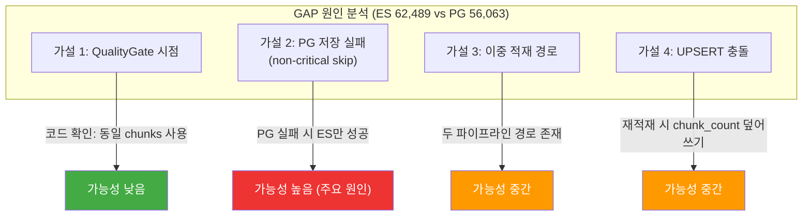
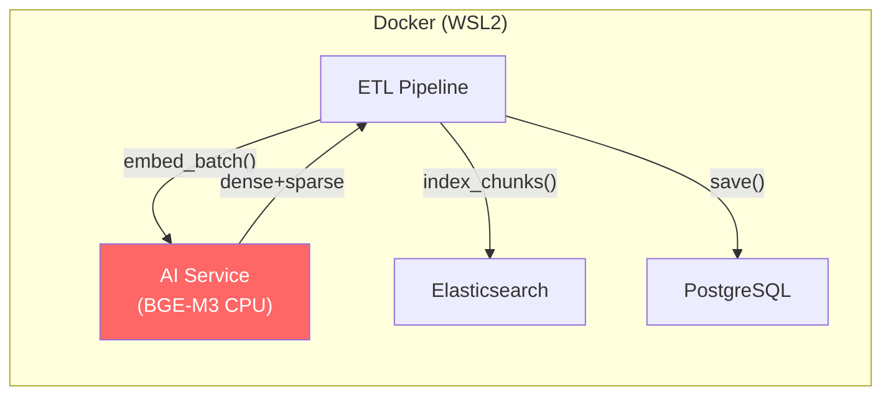
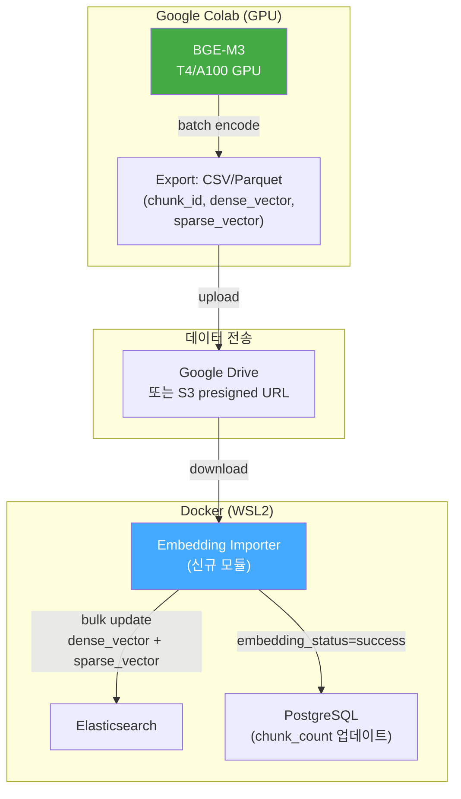
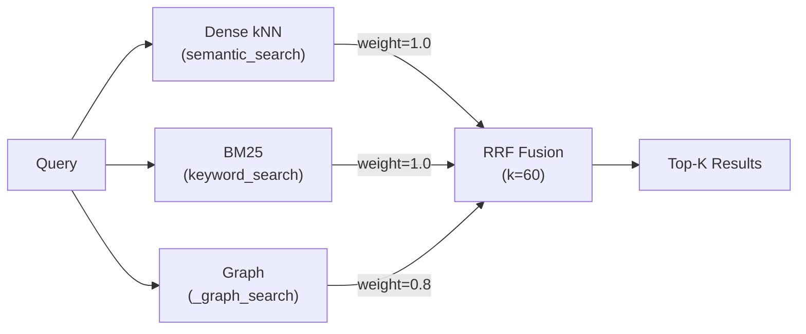
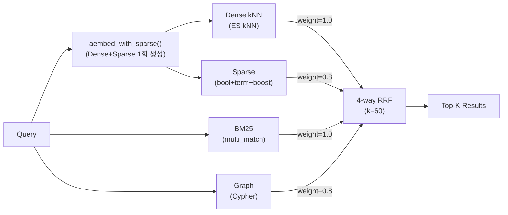
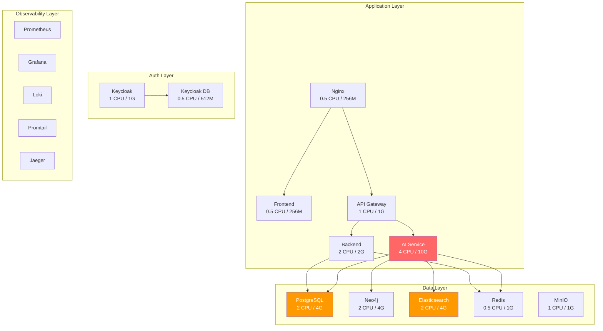
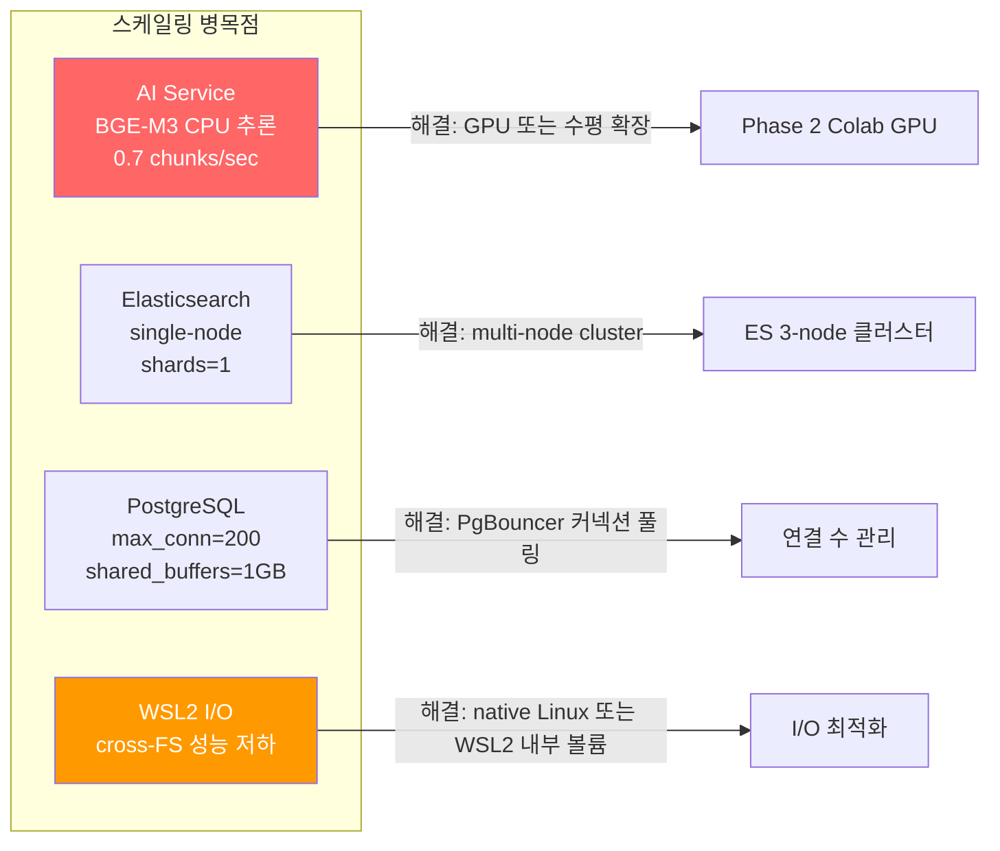
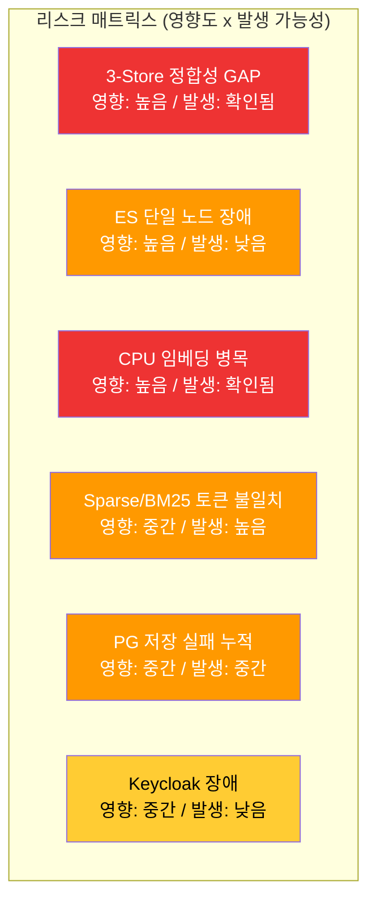

# Sprint 10 아키텍처 분석 보고서

## 문서 정보

| 항목 | 내용 |
|------|------|
| 문서명 | Sprint 10 아키텍처 분석 보고서 |
| 버전 | 1.0 |
| 작성일 | 2026-02-15 |
| 작성자 | Architect Agent |
| 상태 | Review |

## 변경 이력

| 버전 | 일자 | 작성자 | 변경 내용 |
|------|------|--------|-----------|
| 1.0 | 2026-02-15 | Architect | 초안 작성: 3-Store GAP 분석, Phase 2-4 검토, SPOF/스케일링 평가 |

---

## 1. 3-Store 정합성 GAP 분석

### 1.1 현황

| 저장소 | 수량 | 비고 |
|--------|------|------|
| **Elasticsearch** | 62,489 chunks | `knowledge_chunks` 인덱스 |
| **PostgreSQL** | 56,063 chunks (SUM(chunk_count)) | `documents.chunk_count` 컬럼 합계 |
| **GAP** | **6,426 chunks** (약 10.3%) | ES > PG |

### 1.2 원인 추적

코드 분석 결과, `initial_data_loader.py`의 `_store_document()` 메서드(line 1117-1185)에서 저장 순서를 확인하였다.

```
PostgreSQL (SSOT) -> Elasticsearch -> Neo4j
```

#### 가설 1: PG chunk_count 업데이트 전 Quality Gate 적용 시점 불일치

`_process_file()` (line 700-876) 흐름:

```python
# Step 2: 청킹
chunks = self._chunk_document(parsed_doc)

# Step 2.5: 청크 품질 게이트 (P0 수정: 2026-02-14)
quality_gate = ChunkQualityGate()
chunks, rejected_chunks = quality_gate.filter(chunks)

result.chunk_count = len(chunks)  # <- QualityGate 통과 후 카운트
```

그런데 PG 저장 시:

```python
doc_record = {
    "chunk_count": len(chunks),  # <- 필터링 후 청크 수
}
await repo.save(doc_record)
```

ES 저장 시 (`_store_to_elasticsearch()`, line 1264-1366):

```python
for i, chunk in enumerate(chunks):
    doc = { ... }
    bulk_docs.append(doc)
# bulk_docs == len(chunks)
```

**양쪽 모두 필터링 후 chunks를 사용하므로, Quality Gate는 GAP의 원인이 아니다.** 단, Quality Gate가 2026-02-14에 추가되었으므로, 그 이전에 적재된 데이터에는 이 필터가 없었을 가능성이 있다.

#### 가설 2: PG 저장 실패 (비치명적 에러)

`_store_to_postgresql()` (line 1187-1248):

```python
except Exception as e:
    logger.warning("PostgreSQL storage failed (non-critical): %s", e)
    return None  # <- PG 실패 시 None 반환하고 계속 진행
```

PG 저장 실패 시:
- `effective_doc_id = pg_doc_id or document_id` -> 원래 UUID 사용
- ES 저장은 **계속 진행됨**
- 결과: ES에는 청크가 있으나 PG documents 테이블에 레코드가 없어 `SUM(chunk_count)`에 포함되지 않음

**이것이 GAP의 주요 원인일 가능성이 높다.**

#### 가설 3: document_processing_pipeline.py 경유 적재와 InitialDataLoader 경유 적재의 차이

`document_processing_pipeline.py`(line 681-731)에서도 별도 경로로 ES에 적재한다:

```python
dense_vectors, sparse_vectors = await self.embedding_service.aembed_batch(...)
es_result = await self.es_storage.index_chunks(es_chunks)
```

이 경로에서는 PG의 `chunk_count` 업데이트가 다른 메서드(`update_document_metadata`, line 252-253)를 통해 이루어진다. 이 두 경로에서 PG 업데이트 타이밍 차이가 있을 수 있다.

#### 가설 4: UPSERT 충돌

`document_repository.py`의 `save()` 메서드(line 88-154)에서 `ON CONFLICT (id) DO UPDATE`를 사용한다. 동일 `document_id`로 재적재 시 `chunk_count`가 이전 값으로 덮어씌워질 수 있다.

### 1.3 GAP 원인 종합 판단



### 1.4 ES Orphan Chunk 확인 방법 제안

#### 방법 1: ES document_id 집합 vs PG id 집합 비교

```bash
# ES에서 고유 document_id 목록 추출
curl -s 'http://localhost:9200/knowledge_chunks/_search' \
  -H 'Content-Type: application/json' \
  -d '{
    "size": 0,
    "aggs": {
      "unique_docs": {
        "terms": { "field": "document_id", "size": 10000 }
      }
    }
  }' | jq '.aggregations.unique_docs.buckets[] | {key, doc_count}'
```

```sql
-- PG에서 문서 목록과 chunk_count 비교
SELECT id, title, chunk_count,
       (SELECT COUNT(*) FROM ... ) -- ES 조회 필요
FROM documents
ORDER BY chunk_count DESC;
```

#### 방법 2: document_id별 ES chunk 수 vs PG chunk_count 대조

```python
# 검증 스크립트 제안
async def verify_consistency():
    """3-Store 정합성 검증"""
    # 1. PG에서 모든 문서와 chunk_count 조회
    pg_docs = await conn.fetch("SELECT id, chunk_count FROM documents")

    # 2. ES에서 document_id별 chunk 수 집계
    es_result = await es.search(index="knowledge_chunks", body={
        "size": 0,
        "aggs": {
            "by_doc": {
                "terms": {"field": "document_id", "size": 10000},
                "aggs": {"chunk_count": {"value_count": {"field": "chunk_id"}}}
            }
        }
    })

    # 3. 비교
    pg_map = {str(r["id"]): r["chunk_count"] for r in pg_docs}
    for bucket in es_result["aggregations"]["by_doc"]["buckets"]:
        doc_id = bucket["key"]
        es_count = bucket["doc_count"]
        pg_count = pg_map.get(doc_id, 0)
        if es_count != pg_count:
            print(f"MISMATCH: {doc_id} ES={es_count} PG={pg_count}")
        if doc_id not in pg_map:
            print(f"ORPHAN: {doc_id} exists in ES but not in PG ({es_count} chunks)")
```

#### 방법 3: Neo4j도 포함한 3-way 검증

```cypher
// Neo4j에서 Document 노드별 Chunk 수
MATCH (d:Document)
OPTIONAL MATCH (c:Chunk)-[:PART_OF]->(d)
RETURN d.id AS doc_id, d.title AS title, COUNT(c) AS neo4j_chunk_count
ORDER BY neo4j_chunk_count DESC
```

### 1.5 GAP 해소 방안

| 방안 | 설명 | 난이도 | 영향 |
|------|------|--------|------|
| **A. PG 재동기화** | ES에서 실제 chunk 수를 집계하여 PG chunk_count를 업데이트 | 낮음 | PG 데이터만 수정 |
| **B. 트랜잭션 강화** | `_store_document()`에서 PG 실패 시 ES도 롤백 (Saga 패턴) | 높음 | ETL 파이프라인 전체 수정 |
| **C. 정합성 배치 잡** | 주기적으로 3-Store 간 차이를 감지하고 보정하는 배치 | 중간 | 신규 서비스 필요 |

**권장**: 단기적으로 **A** (1회성 보정 스크립트), 중장기적으로 **C** (자동화된 정합성 검증).

---

## 2. Phase 2-4 아키텍처 검토

### 2.1 Phase 2: GPU 임베딩 (Colab <-> Docker 데이터 흐름)

#### 현재 설계 (AS-IS)



**병목**: AI Service에서 CPU 기반 BGE-M3 임베딩이 0.7 chunks/sec (batch_size=4, max_text_length=1000).

#### Phase 2 목표 아키텍처 (TO-BE)



#### 보완점

| 항목 | 현재 상태 | 보완 필요 사항 |
|------|----------|---------------|
| **Chunk ID 정합성** | ES에 chunk_id로 저장 | Colab에서 동일 chunk_id로 임베딩 생성해야 ES에 매핑 가능. chunk_id 목록을 사전 Export 필요 |
| **Embedding Importer** | 미구현 | ES bulk update 스크립트 필요 (`_update` action, `doc` 방식으로 dense_vector/sparse_vector만 갱신) |
| **Sparse 벡터 호환성** | BGE-M3 lexical_weights | Colab과 Docker의 모델 버전 동일해야 sparse_vector 호환 보장 |
| **PG 상태 관리** | embedding_status 필드 존재 | Colab 임베딩 완료 후 PG documents/chunks의 `embedding_status`를 `success`로 일괄 갱신하는 로직 필요 |
| **오류 복구** | 없음 | 부분 전송 실패 시 재시도 메커니즘 (checkpoint 기반) |
| **대역폭** | 1,437 docs x ~40 chunks x 1024d x 4bytes = ~230MB dense + sparse | Google Drive 전송 가능 범위. 대용량 시 파티셔닝 필요 |

#### Colab Export 포맷 제안

```python
# Colab에서 생성할 Export 파일 구조
{
    "chunk_id": "uuid-string",
    "dense_vector": [0.123, 0.456, ...],  # 1024d
    "sparse_vector": {"token": weight, ...},  # lexical_weights
    "model_version": "BAAI/bge-m3",
    "embedded_at": "2026-02-15T10:00:00Z"
}
# 포맷: JSONL (line-delimited JSON) - 스트리밍 처리 용이
```

### 2.2 Phase 4: 4-way RRF (Dense + Sparse + BM25 + Graph)

#### 현재 3-way RRF 아키텍처

`search.py`(line 199-449)에서 확인한 현재 구조:



#### 4-way RRF 목표 아키텍처

`15_sparse_vector_search_integration_design.md`에서 제안된 설계 검토:



#### 설계 문서 보완점

| 항목 | 현재 설계서 (v1.0) | 보완 필요 |
|------|-------------------|----------|
| **ES 라이선스** | `weighted_tokens` 사용 설계 | v1.1 수정 주석에서 언급: ES Basic 라이선스이므로 `bool > should > term + boost`로 전환 필요. **전환 구현이 아직 반영 안 됨** |
| **Sparse/BM25 중복** | 가중치 0.8로 분리 | 정당한 설계. 다만 Sparse가 Nori 토큰화된 text 필드의 term 쿼리로 변환되면 BM25와 겹치는 토큰이 많을 수 있음. **실험적 가중치 튜닝** 필수 |
| **ColBERT 벡터** | 언급 없음 | BGE-M3은 Dense + Sparse + ColBERT 3중 벡터 지원. ColBERT late interaction은 5-way 확장 가능성이 있으나, ES에서 ColBERT 검색은 현재 지원 안 됨. 향후 고려 사항으로만 기록 |
| **Graceful degradation** | 설계됨 (sparse 없으면 3-way 폴백) | 적절함. 다만 `aembed_with_sparse()` 실패 시 기존 `aembed()`로 폴백하는 코드가 아직 `search.py`에 없음 |
| **_rrf_fusion 가중치 지원** | RRF 공식에 weight 반영 | 현재 코드 확인 필요. `_rrf_fusion()`이 weights 파라미터를 실제로 사용하는지 검증 필요 |

#### term+boost 대안 쿼리 구조 (ES Basic 호환)

```json
{
  "query": {
    "bool": {
      "should": [
        {"term": {"text": {"value": "인공지능", "boost": 0.85}}},
        {"term": {"text": {"value": "AI", "boost": 0.72}}},
        {"term": {"text": {"value": "모델", "boost": 0.69}}}
      ],
      "minimum_should_match": 1
    }
  },
  "size": 10
}
```

**주의**: `text` 필드가 Nori analyzer로 분석되므로, BGE-M3의 lexical_weights 토큰이 Nori 토큰과 일치하지 않을 수 있다. BGE-M3은 WordPiece tokenizer 기반이고, Nori는 형태소 분석기이므로 토큰 불일치가 발생할 수 있다.

**해결 방안**: `text.keyword` 서브필드 또는 별도 `sparse_text` 필드(standard analyzer)를 추가하여 BGE-M3 토큰과의 매칭을 보장. 또는 BGE-M3 sparse 토큰을 Nori 토큰으로 재매핑하는 전처리 레이어 추가.

---

## 3. SPOF 및 스케일링 분석

### 3.1 시스템 토폴로지



### 3.2 SPOF (Single Point of Failure) 식별

| 순위 | 컴포넌트 | SPOF 수준 | 영향 범위 | 복구 시간 |
|------|---------|-----------|----------|----------|
| **1** | **Nginx** | Critical | 전체 시스템 접근 불가 | restart: 5s |
| **2** | **API Gateway** | Critical | 모든 API 호출 실패 | restart: 60s (start_period) |
| **3** | **PostgreSQL** | Critical | 문서 메타데이터 SSOT 손실, Backend/AI Service 모두 영향 | restart: 10s, 복구: 볼륨 의존 |
| **4** | **Elasticsearch** | High | 검색 완전 불가 (Dense/BM25/Sparse 모두), 임베딩 저장 불가 | restart: 60s, 인덱스 재구축: 수 시간 |
| **5** | **AI Service** | High | RAG 검색/문서 처리 불가, 임베딩 생성 중단 | restart: 120s (모델 로딩) |
| **6** | **Redis** | Medium | 캐시 소실 (성능 저하), Rate Limiter 비활성화, 세션 손실 | restart: 5s |
| **7** | **Neo4j** | Medium | Graph 검색 불가 (3-way -> 2-way 자동 폴백) | restart: 60s |
| **8** | **Keycloak** | Medium | 신규 로그인/토큰 발급 불가 (기존 JWT는 유효) | restart: 90s |
| **9** | **MinIO** | Low | 파일 업로드/다운로드 불가 (검색 자체는 영향 없음) | restart: 10s |

### 3.3 SPOF 상세 분석

#### 3.3.1 Nginx (Critical)

모든 트래픽이 단일 Nginx 인스턴스를 통과한다. `restart: unless-stopped`로 자동 재시작되나, 재시작 동안 전체 서비스 중단.

**완화 방안**:
- 프로덕션: Docker Swarm/K8s에서 L4 로드밸런서 + Nginx 2대 이상
- 개발 환경: 현재 수준 유지 (단일 Nginx 허용)

#### 3.3.2 Elasticsearch (High)

단일 노드(`discovery.type=single-node`), 레플리카 0, 볼륨 마운트(`elasticsearch_data`).

**리스크**:
- 데이터 볼륨 손실 시 62,489 청크 + 임베딩 전체 재구축 필요
- Phase 1 임베딩이 CPU 기반으로 재구축에 수일 소요

**완화 방안**:
- ES 스냅샷 정기 백업 (MinIO를 S3 repository로 활용)
- `number_of_replicas: 0` -> 프로덕션에서는 최소 1

#### 3.3.3 AI Service 모델 로딩 (High)

BGE-M3 모델 로딩에 약 2분 소요. 컨테이너 재시작 시 해당 시간 동안 검색/임베딩 불가.

**완화 방안**:
- 모델 캐시 볼륨 마운트 (현재 구현됨: `/app/.cache/huggingface`)
- Health check start_period 120s (현재 적절)
- 프로덕션: 2대 이상 + Rolling update

### 3.4 스케일링 병목점



#### 3.4.1 AI Service CPU 임베딩 (치명적 병목)

| 지표 | 현재 | 목표 (GPU) | 개선 배율 |
|------|------|-----------|----------|
| **처리 속도** | 0.7 chunks/sec | ~50 chunks/sec (T4) | ~70x |
| **배치 크기** | 4 (CPU 최적) | 32-64 (GPU) | 8-16x |
| **메모리** | 2.9GB (max_text_length=1000) | 4-8GB VRAM | GPU VRAM 활용 |
| **전체 적재 시간** | ~25시간 (62,489 chunks) | ~20분 (GPU) | ~75x |

Phase 2 Colab GPU 전환이 가장 높은 ROI.

#### 3.4.2 Elasticsearch 단일 노드

현재 `shards=1, replicas=0, single-node`. 62,489 문서에서는 문제 없으나, 10만건 이상 시:
- 인덱싱 처리량 감소
- kNN 검색 latency 증가
- 장애 시 데이터 손실 위험

#### 3.4.3 WSL2 I/O 오버헤드

Docker 볼륨이 Windows 파일시스템(`/mnt/d/`)에 위치할 경우 cross-FS 오버헤드 발생. 특히 ES와 PG의 데이터 볼륨이 영향을 받을 수 있다.

**현재 상태**: 명명된 볼륨(`kp-elasticsearch-data` 등) 사용 중으로, WSL2 내부 ext4에 저장됨. 이 경우 cross-FS 오버헤드는 없다. 다만 `knowledge_data` 문서 마운트(`../../knowledge_data:/app/knowledge_data:ro`)는 Windows FS 경유.

---

## 4. 종합 리스크 매트릭스



---

## 5. 우선순위 권장 사항

| 우선순위 | 항목 | 담당 | 예상 공수 |
|---------|------|------|----------|
| **P0** | 3-Store 정합성 검증 스크립트 작성 및 GAP 보정 | ETL/QA | 0.5일 |
| **P0** | Phase 2 Colab GPU 임베딩 데이터 흐름 확정 (Export/Import 포맷) | Arch/ETL | 1일 |
| **P1** | Sparse 검색 ES Basic 호환 쿼리 구현 (term+boost) | RAG | 1일 |
| **P1** | Sparse/BM25 토큰 불일치 해결 (필드 분리 또는 전처리) | RAG/Arch | 1일 |
| **P2** | ES 스냅샷 백업 자동화 | Infra | 0.5일 |
| **P2** | `_store_document()` PG 실패 시 ES 롤백 로직 추가 | ETL | 1일 |
| **P3** | PG chunk_count 자동 동기화 배치 잡 | ETL/DB | 0.5일 |
| **P3** | ES 멀티노드 클러스터 검토 (프로덕션 대비) | Infra | 2일 |

---

## 6. 부록

### 6.1 분석 대상 파일 목록

| 파일 | 역할 |
|------|------|
| `knowledge_service/src/app/services/initial_data_loader.py` | ETL 메인 파이프라인 |
| `knowledge_service/src/app/services/document_repository.py` | PG 문서 저장소 |
| `knowledge_service/src/app/services/document_processing_pipeline.py` | 문서 처리 파이프라인 (별도 경로) |
| `knowledge_service/src/app/services/search.py` | 검색 서비스 (3-way RRF) |
| `knowledge_service/src/app/services/chunk_quality_filter.py` | 청크 품질 게이트 |
| `knowledge_service/src/app/storage/es_storage.py` | ES 저장 서비스 |
| `knowledge_service/src/app/core/config.py` | 환경 설정 |
| `knowledge_service/docs/02_design/15_sparse_vector_search_integration_design.md` | Sparse 검색 설계서 |
| `infrastructure/docker/docker-compose.yml` | 18개 컨테이너 구성 |

### 6.2 관련 설계 문서

- [Sparse 벡터 검색 통합 설계서](./15_sparse_vector_search_integration_design.md) - Phase 4 상세 설계
- [임베딩 배치 설계서](./16_embedding_batch_detailed_design.md) - Phase 2 임베딩
- [인프라 상세 설계서](./10_infrastructure_detailed_design.md) - Docker Compose 아키텍처
- [Observability 설계서](./14_observability_detailed_design.md) - 모니터링
