# AI 메타데이터 추출 기능 상세 설계서

---

## 문서 정보

| 항목 | 내용 |
|------|------|
| **문서명** | AI 메타데이터 추출 기능 상세 설계서 |
| **버전** | 1.0 |
| **작성일** | 2026-02-13 |
| **작성자** | Architect Agent |
| **상태** | Draft |
| **관련 문서** | [상세 설계서 v2.4](./01_hybrid_rag_platform_detailed_design.md), [Embedding Batch 설계서](./16_embedding_batch_detailed_design.md), [API 통합 설계서](./04_api_integration_design.md), [인프라 설계서](./10_infrastructure_detailed_design.md) |

---

## 변경 이력

| 버전 | 일자 | 작성자 | 변경 내용 |
|------|------|--------|----------|
| 1.0 | 2026-02-13 | Architect Agent | 초안 작성 - AI 메타데이터 추출 파이프라인, 청크 품질 필터, ES 매핑 확장, Neo4j 연계, 비용 분석 |

---

## 목차

1. [개요](#1-개요)
2. [시스템 아키텍처](#2-시스템-아키텍처)
3. [AI 메타데이터 필드 정의](#3-ai-메타데이터-필드-정의)
4. [LLM 프롬프트 설계](#4-llm-프롬프트-설계)
5. [청크 품질 필터링 전략](#5-청크-품질-필터링-전략)
6. [ES 인덱스 매핑 변경](#6-es-인덱스-매핑-변경)
7. [Neo4j 그래프 연계 설계](#7-neo4j-그래프-연계-설계)
8. [API 인터페이스 설계](#8-api-인터페이스-설계)
9. [비용 분석](#9-비용-분석)
10. [구현 계획](#10-구현-계획)
11. [현재 데이터 품질 이슈 및 마이그레이션 방안](#11-현재-데이터-품질-이슈-및-마이그레이션-방안)

---

## 1. 개요

### 1.1 배경

현재 HRKP 시스템은 문서 업로드 후 다음 파이프라인을 통해 검색 가능한 청크를 생성합니다.

```
Upload -> Parsing -> Chunking -> Embedding(BGE-M3) -> ES 저장
```

이 과정에서 **의미적 메타데이터가 추출되지 않아** 다음과 같은 한계가 존재합니다.

| 문제 | 영향 |
|------|------|
| **키워드 부재** | BM25 검색 시 원문 텍스트에만 의존하여 동의어/약어 검색 누락 |
| **카테고리 부재** | 사용자가 분야별 필터링 불가 (기술/경영/인사 등) |
| **요약 부재** | 검색 결과 미리보기 시 원문 일부만 표시, 맥락 파악 어려움 |
| **품질 필터 부재** | 108,896 청크 중 12,638개(11.6%)가 쓰레기 데이터 ("---", "```yaml" 등) |
| **난이도 정보 부재** | 사용자 수준에 맞는 문서 추천 불가 |

참조 시스템(RAGChatbotServer)에서는 GPT-3.5를 사용하여 keywords, categories, summary 등 10개 필드를 자동 추출하고 있습니다. HRKP는 **DeepSeek V3.2**를 런타임 LLM으로 사용하여 95% 비용 절감을 달성합니다.

### 1.2 목적

1. **LLM(DeepSeek V3.2) 기반 문서 메타데이터 자동 추출** - 업로드 시 1회 추출, 모든 청크에 전파
2. **청크 품질 게이트** - 쓰레기 청크(1-3 토큰) 자동 필터링으로 검색 품질 향상
3. **BM25 검색 최적화** - 통합 검색 텍스트(`all_search_text`) 필드로 키워드/카테고리/요약 통합 검색
4. **Neo4j Knowledge Graph 확장** - 카테고리 노드, 엔티티 관계를 그래프에 반영
5. **비용 효율적 설계** - 문서 레벨 1회 추출, 청크에 전파 (LLM 호출 최소화)

### 1.3 범위

| 포함 | 제외 |
|------|------|
| DeepSeek V3.2 기반 메타데이터 추출 | 멀티모달 메타데이터 (이미지/테이블 분석) |
| 청크 품질 필터링 게이트 | 기존 청크 재분할 (re-chunking) |
| ES 인덱스 매핑 확장 | Sparse 벡터 재생성 |
| Neo4j 카테고리/키워드 노드 확장 | 실시간 스트리밍 추출 |
| all_search_text 통합 검색 필드 | UI 메타데이터 편집 기능 |
| 기존 108K 청크 마이그레이션 | 외부 API 메타데이터 연동 |

### 1.4 설계 원칙

| 원칙 | 설명 |
|------|------|
| **Document-Level Extraction** | LLM 호출은 문서 단위 1회, 청크에 전파하여 비용 절감 |
| **Fail-Safe** | 메타데이터 추출 실패 시 기본값으로 폴백, 파이프라인 중단하지 않음 |
| **Idempotent** | 동일 문서에 대한 재추출 시 결과가 동일하게 유지됨 |
| **Additive** | 기존 파이프라인에 단계 추가, 기존 동작은 변경하지 않음 |

---

## 2. 시스템 아키텍처

### 2.1 현행 파이프라인 (AS-IS)

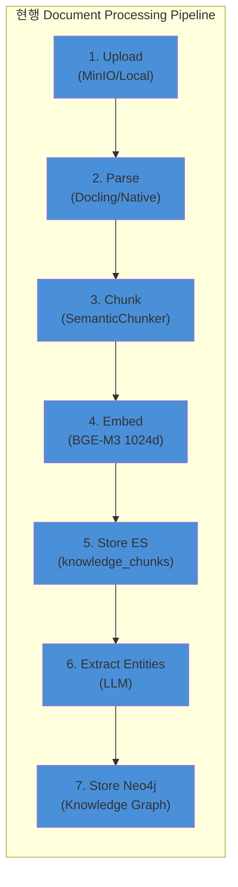

### 2.2 목표 파이프라인 (TO-BE)

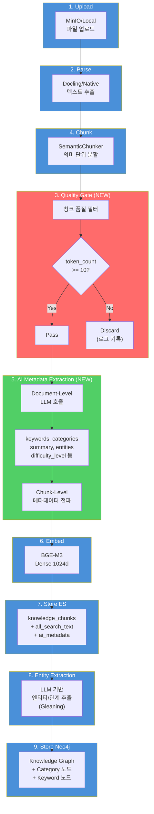

### 2.3 서비스 간 상호작용

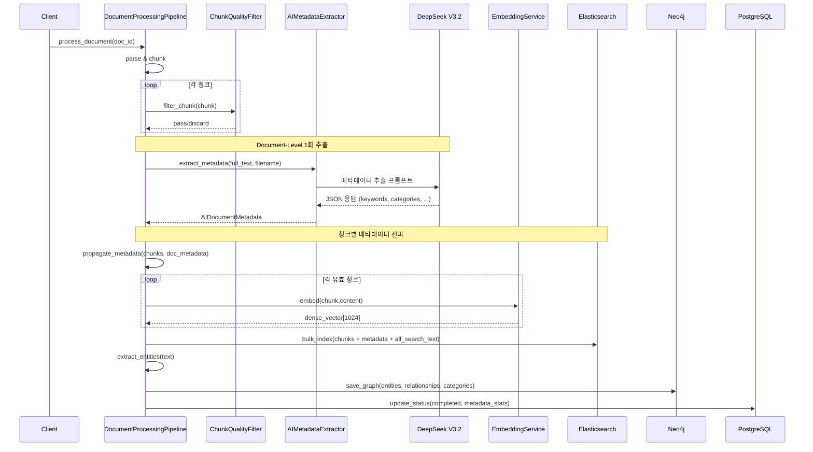

### 2.4 데이터 흐름 다이어그램

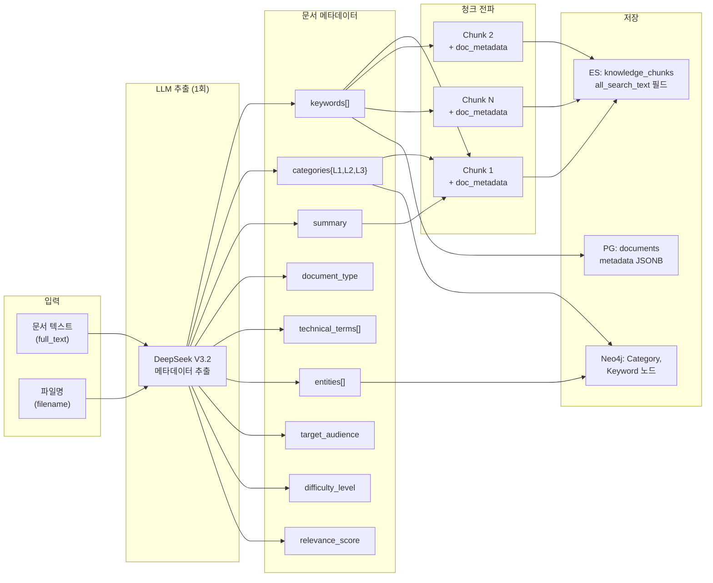

---

## 3. AI 메타데이터 필드 정의

### 3.1 HRKP 메타데이터 필드 스키마

RAGChatbotServer 참조 시스템의 10개 필드를 HRKP 도메인에 맞게 재설계합니다.

| # | 필드명 | 타입 | 설명 | 추출 수준 | ES 타입 |
|---|--------|------|------|-----------|---------|
| 1 | `keywords` | `List[str]` | 핵심 키워드 (5-15개) | Document | `keyword` |
| 2 | `categories` | `CategoryMetadata` | 3-Level 계층 카테고리 | Document | `object` |
| 3 | `summary` | `str` | 핵심 요약 (2-3문장) | Document | `text` (nori) |
| 4 | `document_type` | `str` | 문서 유형 (enum) | Document | `keyword` |
| 5 | `technical_terms` | `List[str]` | 전문 용어 (약어 포함) | Document | `keyword` |
| 6 | `entities` | `List[EntityRef]` | 주요 엔티티 참조 | Document | `nested` |
| 7 | `target_audience` | `str` | 대상 독자 (enum) | Document | `keyword` |
| 8 | `difficulty_level` | `str` | 난이도 (enum) | Document | `keyword` |
| 9 | `relevance_score` | `float` | 정보 밀도 점수 (0.0-1.0) | Document | `float` |
| 10 | `all_search_text` | `str` | 통합 검색 텍스트 (자동 생성) | Chunk | `text` (nori) |

### 3.2 Enum 정의

#### document_type

```python
class DocumentType(str, Enum):
    """문서 유형"""
    TECHNICAL_DOC = "기술문서"
    PROPOSAL = "제안서"
    MEETING_MINUTES = "회의록"
    MANUAL = "매뉴얼"
    REPORT = "보고서"
    GUIDE = "가이드"
    REGULATION = "규정"
    NOTICE = "공지사항"
    TUTORIAL = "튜토리얼"
    API_DOC = "API문서"
    ARCHITECTURE = "아키텍처"
    OTHER = "기타"
```

#### categories (3-Level 계층)

```python
# Level 1 (대분류)
LEVEL1_CATEGORIES = [
    "기술", "경영", "인사", "법무", "마케팅", "재무", "운영", "교육"
]

# Level 2 (중분류) - Level 1별 하위 분류
LEVEL2_MAP = {
    "기술": ["인프라", "개발", "데이터", "보안", "AI/ML", "DevOps", "QA"],
    "경영": ["전략", "기획", "혁신", "ESG"],
    "인사": ["채용", "평가", "교육", "복리후생"],
    # ...
}

# Level 3 (소분류) - 자유 텍스트 (LLM이 문맥에 따라 결정)
```

#### target_audience

```python
class TargetAudience(str, Enum):
    """대상 독자"""
    DEVELOPER = "개발자"
    ARCHITECT = "아키텍트"
    MANAGER = "관리자"
    EXECUTIVE = "임원"
    ALL = "전체"
    BEGINNER = "입문자"
    OPERATIONS = "운영팀"
```

#### difficulty_level

```python
class DifficultyLevel(str, Enum):
    """난이도"""
    BEGINNER = "초급"
    INTERMEDIATE = "중급"
    ADVANCED = "고급"
    EXPERT = "전문가"
```

### 3.3 Pydantic 모델 정의

```python
# knowledge_service/src/app/models/ai_metadata.py

from typing import List, Optional
from pydantic import BaseModel, Field


class EntityRef(BaseModel):
    """엔티티 참조 (경량)"""
    name: str = Field(description="엔티티명")
    type: str = Field(description="유형 (Person, Technology, Organization, ...)")


class CategoryMetadata(BaseModel):
    """3-Level 계층 카테고리"""
    level1: str = Field(description="대분류")
    level2: str = Field(description="중분류")
    level3: Optional[str] = Field(default=None, description="소분류")


class AIDocumentMetadata(BaseModel):
    """LLM이 추출한 문서 레벨 메타데이터"""
    keywords: List[str] = Field(
        default_factory=list,
        description="핵심 키워드 (5-15개)",
    )
    categories: CategoryMetadata = Field(
        description="3-Level 계층 카테고리",
    )
    summary: str = Field(
        default="",
        description="문서 핵심 요약 (2-3문장)",
    )
    document_type: str = Field(
        default="기타",
        description="문서 유형",
    )
    technical_terms: List[str] = Field(
        default_factory=list,
        description="전문 용어 (약어 포함)",
    )
    entities: List[EntityRef] = Field(
        default_factory=list,
        description="주요 엔티티 참조",
    )
    target_audience: str = Field(
        default="전체",
        description="대상 독자",
    )
    difficulty_level: str = Field(
        default="중급",
        description="난이도",
    )
    relevance_score: float = Field(
        default=0.5,
        ge=0.0,
        le=1.0,
        description="정보 밀도 점수 (0.0-1.0)",
    )


class ChunkQualityResult(BaseModel):
    """청크 품질 필터링 결과"""
    total_chunks: int
    passed_chunks: int
    discarded_chunks: int
    discard_reasons: dict  # {"too_short": 150, "noise_pattern": 38, ...}
```

### 3.4 all_search_text 통합 검색 필드

`all_search_text`는 **chunk content + document metadata**를 결합한 BM25 검색 최적화 필드입니다.

```python
def build_all_search_text(
    chunk_content: str,
    metadata: AIDocumentMetadata,
    heading: str = "",
) -> str:
    """통합 검색 텍스트 생성

    BM25 검색 시 키워드, 카테고리, 요약까지 매칭되도록
    모든 검색 가능 텍스트를 하나의 필드로 결합합니다.

    Args:
        chunk_content: 청크 원문 텍스트
        metadata: AI 추출 메타데이터
        heading: 섹션 헤딩

    Returns:
        통합 검색 텍스트
    """
    parts = [chunk_content]

    if heading:
        parts.append(heading)

    if metadata.keywords:
        parts.append(" ".join(metadata.keywords))

    if metadata.categories:
        cat_parts = [metadata.categories.level1, metadata.categories.level2]
        if metadata.categories.level3:
            cat_parts.append(metadata.categories.level3)
        parts.append(" ".join(cat_parts))

    if metadata.summary:
        parts.append(metadata.summary)

    if metadata.technical_terms:
        parts.append(" ".join(metadata.technical_terms))

    if metadata.document_type:
        parts.append(metadata.document_type)

    return " ".join(parts)
```

---

## 4. LLM 프롬프트 설계

### 4.1 프롬프트 전략

| 전략 | 설명 |
|------|------|
| **Single-Call Extraction** | 1회 LLM 호출로 모든 메타데이터를 추출 (비용 최적화) |
| **Structured JSON Output** | JSON 스키마를 명시하여 파싱 안정성 확보 |
| **Korean-First** | 한국어 문서 최적화 프롬프트 (한글 카테고리, 한글 키워드) |
| **Text Preview** | 전체 문서 대신 앞부분 8,000자 사용 (비용/정확도 균형) |
| **Filename Hint** | 파일명에서 힌트를 제공하여 분류 정확도 향상 |

### 4.2 메타데이터 추출 프롬프트 (DeepSeek V3.2용)

```python
AI_METADATA_EXTRACTION_PROMPT = """당신은 한국어 기술 문서 분석 전문가입니다.
아래 문서의 텍스트와 파일명을 분석하여, 정확한 메타데이터를 JSON 형식으로 추출하세요.

## 파일명 (힌트)
{filename}

## 문서 텍스트 (앞부분)
{text}

## 추출 항목

### 1. keywords (5-15개)
- 문서의 핵심 키워드를 한국어/영어 혼용으로 추출
- 동의어, 약어도 별도 키워드로 포함 (예: "쿠버네티스", "K8s", "Kubernetes")
- 일반적인 단어(문서, 시스템 등)는 제외하고 도메인 특화 용어 위주

### 2. categories (3-Level 계층)
- level1: 대분류 - 반드시 다음 중 하나: 기술, 경영, 인사, 법무, 마케팅, 재무, 운영, 교육
- level2: 중분류 - level1에 따른 하위 분류
  - 기술: 인프라, 개발, 데이터, 보안, AI/ML, DevOps, QA
  - 경영: 전략, 기획, 혁신, ESG
  - 인사: 채용, 평가, 교육, 복리후생
  - 그 외: 문맥에 맞는 분류
- level3: 소분류 - 문맥에 따라 자유 결정 (없으면 null)

### 3. summary
- 핵심 요약 2-3문장 (한국어)
- 문서의 목적, 주요 내용, 결론을 포함

### 4. document_type
- 반드시 다음 중 하나: 기술문서, 제안서, 회의록, 매뉴얼, 보고서, 가이드, 규정, 공지사항, 튜토리얼, API문서, 아키텍처, 기타

### 5. technical_terms (전문 용어)
- 문서에 등장하는 기술 약어와 전문 용어
- 예: ["BGE-M3", "RAG", "kNN", "BM25", "LangGraph"]

### 6. entities (주요 엔티티, 최대 10개)
- 문서에서 식별되는 주요 인물, 조직, 기술, 프로젝트
- name: 엔티티명, type: Person/Organization/Technology/Project 중 하나

### 7. target_audience
- 반드시 다음 중 하나: 개발자, 아키텍트, 관리자, 임원, 전체, 입문자, 운영팀

### 8. difficulty_level
- 반드시 다음 중 하나: 초급, 중급, 고급, 전문가

### 9. relevance_score (0.0 ~ 1.0)
- 정보 밀도 점수: 문서가 포함하는 구체적이고 유용한 정보의 밀도
- 1.0: 매우 구체적이고 실용적인 기술 가이드
- 0.7: 일반적인 기술 문서
- 0.3: 개요/소개 수준
- 0.0: 정보가 거의 없는 문서 (목차만 있는 등)

## 출력 형식 (반드시 유효한 JSON)
```json
{{
  "keywords": ["키워드1", "키워드2", ...],
  "categories": {{
    "level1": "기술",
    "level2": "개발",
    "level3": "백엔드"
  }},
  "summary": "이 문서는 ...",
  "document_type": "기술문서",
  "technical_terms": ["용어1", "용어2", ...],
  "entities": [
    {{"name": "엔티티명", "type": "Technology"}}
  ],
  "target_audience": "개발자",
  "difficulty_level": "중급",
  "relevance_score": 0.7
}}
```

중요:
- 반드시 유효한 JSON으로 응답하세요.
- 한국어 문서이므로 키워드와 요약은 한국어를 기본으로 합니다.
- 기술 용어는 원래 표기(영문)를 유지합니다.
- 확실하지 않은 항목은 가장 적절한 기본값을 사용하세요."""
```

### 4.3 프롬프트 구성 전략 상세

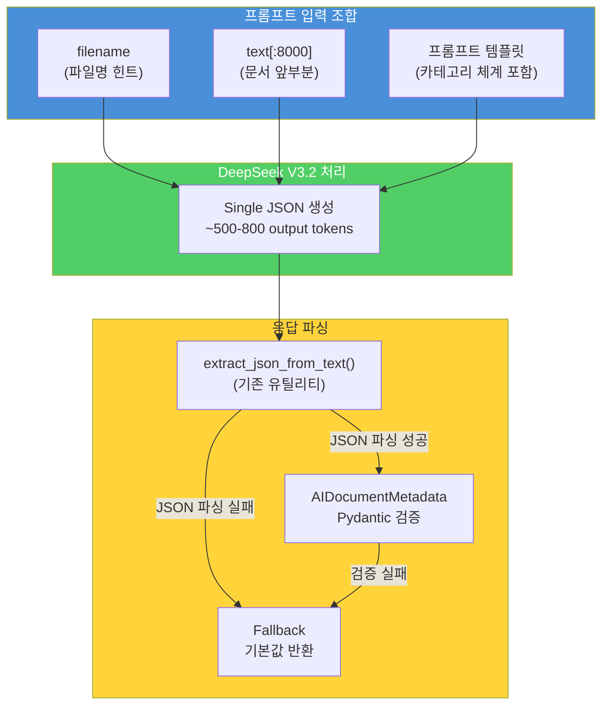

### 4.4 프롬프트 비용 추정

| 항목 | 토큰 수 | 비용 (DeepSeek V3.2) |
|------|---------|---------------------|
| 프롬프트 템플릿 | ~800 tokens | - |
| 문서 텍스트 (8000자) | ~3,000 tokens | - |
| **총 Input** | **~3,800 tokens** | **$0.00010** ($0.27/M) |
| **Output** | **~600 tokens** | **$0.00066** ($1.10/M) |
| **문서당 총 비용** | - | **$0.00076** |

---

## 5. 청크 품질 필터링 전략

### 5.1 현재 데이터 품질 현황

```
108,896 전체 청크
  |
  +-- 12,638 (11.6%) : 1-3 토큰 (쓰레기 데이터)
  |     예: "---", "```yaml", "|", "##"
  |
  +-- 25,400 (23.3%) : 4-20 토큰 (저품질)
  |     예: "## 목차", "그림 3.2", "표 1-1: 개요"
  |
  +-- 70,858 (65.1%) : 21+ 토큰 (유효 데이터)
```

### 5.2 ChunkQualityFilter 설계

```python
# knowledge_service/src/app/services/chunk_quality_filter.py

import re
from typing import List, Tuple
from dataclasses import dataclass, field

from app.core.logging import get_logger
from app.models.chunk import Chunk

logger = get_logger(__name__)


@dataclass
class QualityFilterConfig:
    """품질 필터 설정"""
    min_token_count: int = 10          # 최소 토큰 수
    min_char_count: int = 30           # 최소 문자 수
    max_noise_ratio: float = 0.7       # 최대 노이즈 비율
    enable_pattern_filter: bool = True  # 패턴 필터 활성화


@dataclass
class FilterResult:
    """필터링 결과"""
    passed: List[Chunk] = field(default_factory=list)
    discarded: List[Tuple[Chunk, str]] = field(default_factory=list)

    @property
    def pass_count(self) -> int:
        return len(self.passed)

    @property
    def discard_count(self) -> int:
        return len(self.discarded)

    @property
    def discard_reasons(self) -> dict:
        reasons = {}
        for _, reason in self.discarded:
            reasons[reason] = reasons.get(reason, 0) + 1
        return reasons


class ChunkQualityFilter:
    """청크 품질 게이트

    파이프라인에서 쓰레기 청크를 필터링하여
    임베딩/저장 단계에 도달하지 않도록 합니다.
    """

    # 노이즈 패턴 (쓰레기 데이터로 판정)
    NOISE_PATTERNS = [
        re.compile(r'^-{3,}$'),                   # "---"
        re.compile(r'^`{3,}\w*$'),                 # "```yaml", "```"
        re.compile(r'^\|[-\s|]*\|$'),              # "| --- | --- |"
        re.compile(r'^#{1,6}\s*$'),                # "###" (내용 없는 헤딩)
        re.compile(r'^\*{3,}$'),                   # "***"
        re.compile(r'^={3,}$'),                    # "==="
        re.compile(r'^\s*\d+\.\s*$'),              # "1." (번호만)
        re.compile(r'^(그림|표|Figure|Table)\s*\d'), # "그림 3.2" (캡션만)
    ]

    def __init__(self, config: QualityFilterConfig = None):
        self.config = config or QualityFilterConfig()

    def filter_chunks(self, chunks: List[Chunk]) -> FilterResult:
        """청크 리스트에 대한 품질 필터링

        Args:
            chunks: 원본 청크 리스트

        Returns:
            FilterResult: 통과/폐기 결과
        """
        result = FilterResult()

        for chunk in chunks:
            passed, reason = self._evaluate_chunk(chunk)
            if passed:
                result.passed.append(chunk)
            else:
                result.discarded.append((chunk, reason))

        logger.info(
            "Quality filter: %d/%d passed (%.1f%%), discarded=%s",
            result.pass_count,
            len(chunks),
            result.pass_count / len(chunks) * 100 if chunks else 0,
            result.discard_reasons,
        )

        return result

    def _evaluate_chunk(self, chunk: Chunk) -> Tuple[bool, str]:
        """단일 청크 품질 평가

        Returns:
            (통과 여부, 폐기 사유)
        """
        content = chunk.content.strip()

        # Rule 1: 최소 문자 수
        if len(content) < self.config.min_char_count:
            return False, "too_short_chars"

        # Rule 2: 최소 토큰 수
        if chunk.token_count < self.config.min_token_count:
            return False, "too_few_tokens"

        # Rule 3: 노이즈 패턴 매칭
        if self.config.enable_pattern_filter:
            for pattern in self.NOISE_PATTERNS:
                if pattern.match(content):
                    return False, "noise_pattern"

        # Rule 4: 노이즈 비율 (특수문자/전체 비율)
        if len(content) > 0:
            alpha_num = sum(1 for c in content if c.isalnum() or c == ' ')
            noise_ratio = 1.0 - (alpha_num / len(content))
            if noise_ratio > self.config.max_noise_ratio:
                return False, "high_noise_ratio"

        return True, ""
```

### 5.3 품질 필터 파이프라인 위치

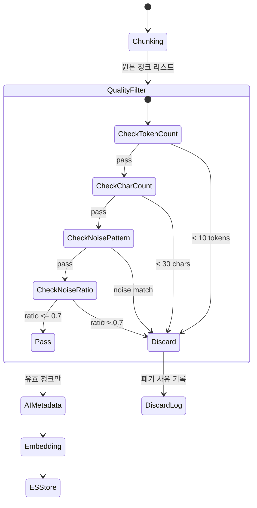

### 5.4 예상 필터링 효과

| 필터 규칙 | 제거 예상 수 | 비율 |
|-----------|-------------|------|
| `token_count < 10` | ~12,638 | 11.6% |
| `char_count < 30` | ~2,100 (추가) | 1.9% |
| `noise_pattern` | ~1,500 (추가) | 1.4% |
| `noise_ratio > 0.7` | ~800 (추가) | 0.7% |
| **합계** | **~17,038** | **15.6%** |
| **유효 청크** | **~91,858** | **84.4%** |

---

## 6. ES 인덱스 매핑 변경

### 6.1 현행 매핑 (AS-IS)

현재 `knowledge_chunks` 인덱스의 `metadata` 필드는 다음과 같습니다.

```json
{
  "metadata": {
    "type": "object",
    "properties": {
      "document_type": {"type": "keyword"},
      "project_name": {"type": "keyword"},
      "title": {"type": "text", "analyzer": "korean_analyzer"},
      "summary": {"type": "text", "analyzer": "korean_analyzer"},
      "categories": {"type": "keyword"},
      "keywords": {"type": "keyword"},
      "tags": {"type": "keyword"},
      "source": {"type": "keyword"},
      "page": {"type": "integer"}
    }
  }
}
```

### 6.2 확장 매핑 (TO-BE)

```json
{
  "metadata": {
    "type": "object",
    "enabled": true,
    "properties": {
      "document_type": {"type": "keyword"},
      "project_name": {"type": "keyword"},
      "title": {
        "type": "text",
        "analyzer": "korean_analyzer",
        "fields": {"keyword": {"type": "keyword"}}
      },
      "summary": {"type": "text", "analyzer": "korean_analyzer"},
      "categories": {"type": "keyword"},
      "keywords": {"type": "keyword"},
      "tags": {"type": "keyword"},
      "source": {"type": "keyword"},
      "page": {"type": "integer"},

      "_ADDED_FIELDS_": "--- 아래부터 신규 필드 ---",

      "categories_l1": {"type": "keyword"},
      "categories_l2": {"type": "keyword"},
      "categories_l3": {"type": "keyword"},
      "technical_terms": {"type": "keyword"},
      "entities": {
        "type": "nested",
        "properties": {
          "name": {"type": "keyword"},
          "type": {"type": "keyword"}
        }
      },
      "target_audience": {"type": "keyword"},
      "difficulty_level": {"type": "keyword"},
      "relevance_score": {"type": "float"},
      "ai_extracted": {"type": "boolean"},
      "ai_extracted_at": {
        "type": "date",
        "format": "yyyy-MM-dd'T'HH:mm:ss.SSSZ||epoch_millis"
      }
    }
  },
  "all_search_text": {
    "type": "text",
    "analyzer": "korean_analyzer",
    "search_analyzer": "korean_analyzer",
    "fields": {
      "standard": {"type": "text", "analyzer": "text_analyzer"}
    }
  }
}
```

### 6.3 매핑 변경 전략

ES는 기존 매핑에 **새 필드를 추가**하는 것은 가능하지만, 기존 필드 타입을 변경하는 것은 불가능합니다.

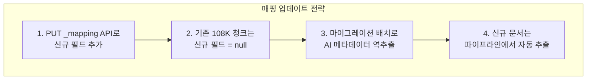

```python
# 매핑 업데이트 스크립트 (1회 실행)
async def update_index_mapping(es_client, index_name: str):
    """기존 인덱스에 AI 메타데이터 필드 추가"""
    new_properties = {
        "properties": {
            "metadata": {
                "properties": {
                    "categories_l1": {"type": "keyword"},
                    "categories_l2": {"type": "keyword"},
                    "categories_l3": {"type": "keyword"},
                    "technical_terms": {"type": "keyword"},
                    "entities": {
                        "type": "nested",
                        "properties": {
                            "name": {"type": "keyword"},
                            "type": {"type": "keyword"},
                        }
                    },
                    "target_audience": {"type": "keyword"},
                    "difficulty_level": {"type": "keyword"},
                    "relevance_score": {"type": "float"},
                    "ai_extracted": {"type": "boolean"},
                    "ai_extracted_at": {
                        "type": "date",
                        "format": (
                            "yyyy-MM-dd'T'HH:mm:ss.SSSZ"
                            "||epoch_millis"
                        ),
                    },
                }
            },
            "all_search_text": {
                "type": "text",
                "analyzer": "korean_analyzer",
                "search_analyzer": "korean_analyzer",
                "fields": {
                    "standard": {
                        "type": "text",
                        "analyzer": "text_analyzer",
                    }
                },
            },
        }
    }

    await es_client.indices.put_mapping(
        index=index_name,
        body=new_properties,
    )
```

### 6.4 BM25 검색 쿼리 변경

```python
# 현행: text, heading, metadata.title, metadata.summary 대상 검색
# 변경: all_search_text 필드 추가로 통합 검색

UPDATED_SEARCH_FIELDS = [
    "text^3",                    # 원문 (가중치 3)
    "all_search_text^2",         # 통합 검색 텍스트 (가중치 2) <-- NEW
    "text.standard^1.5",         # 표준 분석기
    "heading^2",                 # 헤딩
    "metadata.title^2",          # 제목
    "metadata.summary",          # 요약
    "metadata.keywords^2",       # 키워드 <-- 기존 but 이제 채워짐
    "metadata.technical_terms^2", # 전문 용어 <-- NEW
]
```

---

## 7. Neo4j 그래프 연계 설계

### 7.1 현행 Neo4j 스키마 (AS-IS)

```
(:Knowledge)-[:CONTAINS]->(:Chunk)
(:Knowledge)-[:MENTIONED_IN]->(:Person)
(:Knowledge)-[:USED_IN]->(:Technology)
(:Chunk)-[:MENTIONED_IN]->(:Person)
(:Chunk)-[:USED_IN]->(:Technology)
```

### 7.2 확장 Neo4j 스키마 (TO-BE)

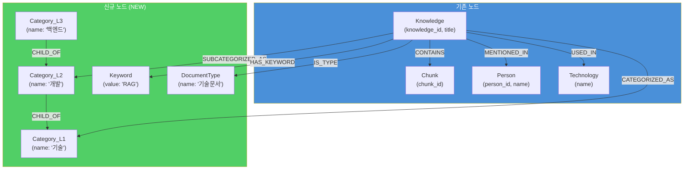

### 7.3 Cypher 쿼리 설계

```cypher
// 1. Category 노드 계층 생성 (MERGE로 중복 방지)
MERGE (cat1:Category_L1 {name: $level1})
MERGE (cat2:Category_L2 {name: $level2})
MERGE (cat2)-[:CHILD_OF]->(cat1)

// level3이 존재하는 경우
WITH cat1, cat2
WHERE $level3 IS NOT NULL
MERGE (cat3:Category_L3 {name: $level3})
MERGE (cat3)-[:CHILD_OF]->(cat2)

// 2. Knowledge -> Category 관계
MATCH (k:Knowledge {knowledge_id: $knowledge_id})
MERGE (k)-[:CATEGORIZED_AS]->(cat1)
MERGE (k)-[:SUBCATEGORIZED_AS]->(cat2)

// 3. Keyword 노드 생성 및 연결
UNWIND $keywords AS kw
MERGE (keyword:Keyword {value: kw})
MERGE (k)-[:HAS_KEYWORD]->(keyword)

// 4. DocumentType 노드 생성 및 연결
MERGE (dt:DocumentType {name: $document_type})
MERGE (k)-[:IS_TYPE]->(dt)
```

### 7.4 그래프 탐색 활용 예시

```cypher
// "기술 > 개발" 카테고리의 모든 문서 + 관련 키워드 조회
MATCH (k:Knowledge)-[:CATEGORIZED_AS]->(c1:Category_L1 {name: "기술"})
MATCH (k)-[:SUBCATEGORIZED_AS]->(c2:Category_L2 {name: "개발"})
OPTIONAL MATCH (k)-[:HAS_KEYWORD]->(kw:Keyword)
RETURN k.title, collect(DISTINCT kw.value) AS keywords
ORDER BY k.created_at DESC
LIMIT 20

// 특정 키워드와 관련된 문서 + 카테고리 + 기술 엔티티
MATCH (kw:Keyword {value: "RAG"})<-[:HAS_KEYWORD]-(k:Knowledge)
MATCH (k)-[:CATEGORIZED_AS]->(cat:Category_L1)
OPTIONAL MATCH (k)-[:USED_IN]->(tech:Technology)
RETURN k.title, cat.name, collect(DISTINCT tech.name) AS technologies
```

---

## 8. API 인터페이스 설계

### 8.1 AIMetadataExtractor 서비스 클래스

```python
# knowledge_service/src/app/services/ai_metadata_extractor.py

class AIMetadataExtractor:
    """AI 기반 문서 메타데이터 추출 서비스

    DeepSeek V3.2를 사용하여 문서 레벨 메타데이터를 추출합니다.
    - Single LLM Call per Document (비용 최적화)
    - Fail-Safe: 추출 실패 시 기본값 반환
    - Caching: 동일 문서 재추출 방지

    Pipeline:
        1. 문서 텍스트 전처리 (8,000자 미리보기)
        2. LLM 프롬프트 구성
        3. DeepSeek V3.2 호출
        4. JSON 응답 파싱 및 검증
        5. AIDocumentMetadata 반환
    """

    def __init__(
        self,
        max_text_preview: int = 8000,
        llm_timeout: int = 30,
    ):
        """초기화

        Args:
            max_text_preview: LLM에 전달할 최대 텍스트 길이
            llm_timeout: LLM 호출 타임아웃 (초)
        """
        self.max_text_preview = max_text_preview
        self.llm_timeout = llm_timeout
        self._llm_service = get_llm_service()

    async def extract(
        self,
        text: str,
        filename: Optional[str] = None,
    ) -> AIDocumentMetadata:
        """문서 메타데이터 추출

        Args:
            text: 문서 전체 텍스트
            filename: 원본 파일명 (힌트)

        Returns:
            AIDocumentMetadata 객체
        """
        ...

    async def extract_batch(
        self,
        documents: List[Tuple[str, Optional[str]]],  # (text, filename)
        concurrency: int = 3,
    ) -> List[AIDocumentMetadata]:
        """배치 메타데이터 추출

        Args:
            documents: (text, filename) 튜플 리스트
            concurrency: 동시 LLM 호출 수

        Returns:
            AIDocumentMetadata 리스트
        """
        ...

    def _build_prompt(self, text: str, filename: str) -> str:
        """프롬프트 구성"""
        ...

    def _parse_response(self, response: str) -> AIDocumentMetadata:
        """LLM 응답 파싱 + Pydantic 검증"""
        ...

    @staticmethod
    def _get_default_metadata() -> AIDocumentMetadata:
        """추출 실패 시 기본값"""
        return AIDocumentMetadata(
            keywords=[],
            categories=CategoryMetadata(
                level1="미분류",
                level2="미분류",
                level3=None,
            ),
            summary="메타데이터 추출에 실패했습니다.",
            document_type="기타",
            technical_terms=[],
            entities=[],
            target_audience="전체",
            difficulty_level="중급",
            relevance_score=0.5,
        )
```

### 8.2 파이프라인 통합 인터페이스

```python
# DocumentProcessingPipeline.process_document() 변경사항 (의사코드)

class DocumentProcessingPipeline:
    def __init__(
        self,
        document_store=None,
        enable_neo4j=True,
        enable_entity_extraction=True,
        enable_ai_metadata=True,       # <-- NEW
        enable_quality_filter=True,     # <-- NEW
    ):
        # ... 기존 초기화 ...
        self._enable_ai_metadata = enable_ai_metadata
        self._enable_quality_filter = enable_quality_filter
        self.ai_metadata_extractor = None  # lazy init
        self.quality_filter = None          # lazy init

    async def process_document(self, document_id: UUID) -> ProcessingResult:
        # 1. Parse
        parsed_doc = self.parser.parse(tmp_path)

        # 2. Chunk
        chunk_result = self.chunker.chunk_document(parsed_doc)
        chunks = chunk_result.chunks

        # 3. Quality Filter (NEW)
        if self._enable_quality_filter:
            filter_result = self.quality_filter.filter_chunks(chunks)
            chunks = filter_result.passed
            # 폐기 로그 기록
            logger.info(
                "Quality filter: %d passed, %d discarded",
                filter_result.pass_count,
                filter_result.discard_count,
            )

        # 4. AI Metadata Extraction (NEW - Document Level)
        ai_metadata = None
        if self._enable_ai_metadata:
            ai_metadata = await self.ai_metadata_extractor.extract(
                text=content,
                filename=document.get("filename"),
            )
            logger.info(
                "AI metadata extracted: type=%s, keywords=%d",
                ai_metadata.document_type,
                len(ai_metadata.keywords),
            )

        # 5. Embed
        embeddings = await self.embedding_service.aembed_batch(chunk_texts)

        # 6. Store ES (with metadata propagation)
        es_chunks = []
        for i, chunk in enumerate(chunks):
            es_chunk = {
                "chunk_id": chunk.id,
                "document_id": doc_id_str,
                "content": chunk.content,
                "dense_vector": embeddings[i],
                "chunk_index": chunk.chunk_index,
                "token_count": chunk.token_count,
                "heading": chunk.heading or "",
                "metadata": self._build_chunk_metadata(
                    document, ai_metadata  # <-- ai_metadata 전파
                ),
                "all_search_text": build_all_search_text(  # <-- NEW
                    chunk.content, ai_metadata, chunk.heading
                ) if ai_metadata else chunk.content,
                "total_chunks": len(chunks),
            }
            es_chunks.append(es_chunk)

        # 7. Entity Extraction (기존)
        # 8. Neo4j Storage (기존 + 카테고리/키워드 노드 추가)
        # 9. PG Status Update

    def _build_chunk_metadata(
        self,
        document: dict,
        ai_metadata: Optional[AIDocumentMetadata],
    ) -> dict:
        """청크 메타데이터 구성 (문서 메타 + AI 메타 병합)"""
        meta = {
            "title": document.get("filename", ""),
            "document_type": (
                ai_metadata.document_type
                if ai_metadata
                else document.get("format", "")
            ),
            "project_name": document.get("project_name", ""),
        }

        if ai_metadata:
            meta.update({
                "summary": ai_metadata.summary,
                "keywords": ai_metadata.keywords,
                "categories": (
                    f"{ai_metadata.categories.level1}"
                    f" > {ai_metadata.categories.level2}"
                ),
                "categories_l1": ai_metadata.categories.level1,
                "categories_l2": ai_metadata.categories.level2,
                "categories_l3": ai_metadata.categories.level3,
                "technical_terms": ai_metadata.technical_terms,
                "entities": [
                    {"name": e.name, "type": e.type}
                    for e in ai_metadata.entities
                ],
                "target_audience": ai_metadata.target_audience,
                "difficulty_level": ai_metadata.difficulty_level,
                "relevance_score": ai_metadata.relevance_score,
                "ai_extracted": True,
                "ai_extracted_at": datetime.now(
                    timezone.utc
                ).isoformat(),
            })

        return meta
```

### 8.3 REST API 엔드포인트

```python
# knowledge_service/src/app/api/routes/metadata.py

@router.post(
    "/documents/{document_id}/extract-metadata",
    response_model=AIDocumentMetadata,
    summary="문서 AI 메타데이터 수동 추출/재추출",
)
async def extract_document_metadata(
    document_id: str,
    force: bool = Query(False, description="기존 메타데이터 덮어쓰기"),
):
    """문서의 AI 메타데이터를 수동으로 추출하거나 재추출합니다."""
    ...


@router.get(
    "/documents/{document_id}/metadata",
    response_model=AIDocumentMetadata,
    summary="문서 AI 메타데이터 조회",
)
async def get_document_metadata(document_id: str):
    """문서의 AI 메타데이터를 조회합니다."""
    ...


@router.post(
    "/admin/metadata/batch-extract",
    summary="기존 문서 배치 메타데이터 추출 (마이그레이션)",
)
async def batch_extract_metadata(
    document_ids: Optional[List[str]] = Body(None),
    limit: int = Query(50, le=200),
    skip_existing: bool = Query(True),
):
    """기존 문서에 대한 AI 메타데이터 배치 추출.
    document_ids가 없으면 ai_extracted=false인 문서 대상.
    """
    ...


@router.get(
    "/admin/metadata/stats",
    summary="AI 메타데이터 추출 통계",
)
async def get_metadata_stats():
    """전체 문서의 AI 메타데이터 추출 현황을 반환합니다."""
    ...
```

---

## 9. 비용 분석

### 9.1 DeepSeek V3.2 비용 체계

| 항목 | 가격 |
|------|------|
| Input tokens | $0.27 / 1M tokens |
| Output tokens | $1.10 / 1M tokens |
| Cache hit tokens | $0.07 / 1M tokens |

### 9.2 문서당 비용 계산

| 항목 | 토큰 수 | 비용 |
|------|---------|------|
| 프롬프트 템플릿 | ~800 | $0.000216 |
| 문서 텍스트 (8,000자 -> ~3,000 토큰) | ~3,000 | $0.000810 |
| **Input 합계** | **~3,800** | **$0.001026** |
| Output (JSON 응답) | ~600 | **$0.000660** |
| **문서당 총 비용** | | **$0.001686** |

### 9.3 전체 프로젝트 비용 추정

| 시나리오 | 문서 수 | 총 비용 | 비고 |
|----------|---------|---------|------|
| 현행 문서 마이그레이션 | ~1,000 | **$1.69** | 기존 문서 역추출 |
| 월간 신규 문서 (예상) | ~200 | **$0.34** | 운영 비용 |
| 연간 운영 비용 | ~2,400 | **$4.05** | 월 200건 기준 |

### 9.4 GPT-3.5 vs DeepSeek V3.2 비용 비교

| LLM | Input ($/1M) | Output ($/1M) | 문서당 비용 | 연간 비용 (2,400건) |
|-----|-------------|---------------|-----------|-------------------|
| GPT-3.5-turbo | $0.50 | $1.50 | $0.00280 | $6.72 |
| GPT-4o-mini | $0.15 | $0.60 | $0.00093 | $2.23 |
| **DeepSeek V3.2** | **$0.27** | **$1.10** | **$0.00169** | **$4.05** |
| DeepSeek (캐시 hit) | $0.07 | $1.10 | **$0.00104** | **$2.50** |

DeepSeek V3.2는 GPT-3.5 대비 **40% 저렴**하며, 캐시 활용 시 GPT-4o-mini와 유사한 수준입니다.

---

## 10. 구현 계획

### 10.1 Phase 분류

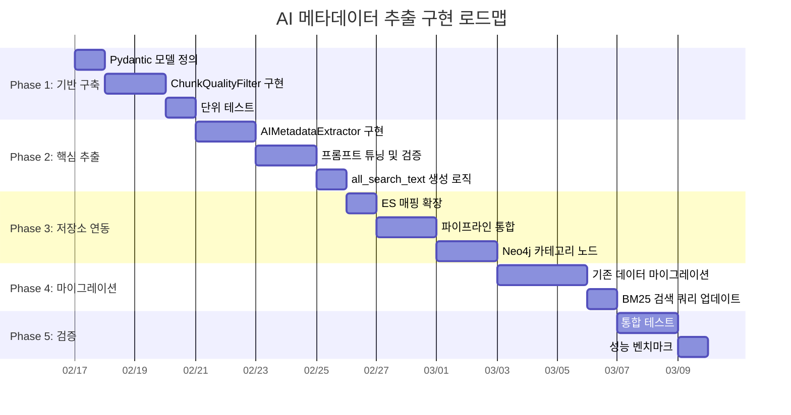

### 10.2 Phase 상세

#### Phase 1: 기반 구축 (4일)

| 작업 | 산출물 | 파일 경로 |
|------|--------|-----------|
| Pydantic 모델 정의 | `AIDocumentMetadata`, `ChunkQualityResult` | `src/app/models/ai_metadata.py` |
| ChunkQualityFilter 구현 | 품질 필터 서비스 | `src/app/services/chunk_quality_filter.py` |
| 단위 테스트 | 필터 테스트 | `src/tests/unit/test_chunk_quality_filter.py` |

#### Phase 2: 핵심 추출 (5일)

| 작업 | 산출물 | 파일 경로 |
|------|--------|-----------|
| AIMetadataExtractor 구현 | 메타데이터 추출 서비스 | `src/app/services/ai_metadata_extractor.py` |
| 프롬프트 튜닝 | DeepSeek V3.2 최적화 프롬프트 | 서비스 내 상수 |
| all_search_text 빌더 | 통합 검색 텍스트 생성 | `src/app/utils/search_text.py` |
| 단위 테스트 | 추출/파싱 테스트 | `src/tests/unit/test_ai_metadata_extractor.py` |

#### Phase 3: 저장소 연동 (5일)

| 작업 | 산출물 | 파일 경로 |
|------|--------|-----------|
| ES 매핑 확장 스크립트 | PUT _mapping 실행 | `scripts/update_es_mapping.py` |
| 파이프라인 통합 | `DocumentProcessingPipeline` 수정 | `src/app/services/document_processing_pipeline.py` |
| Neo4j 카테고리 노드 | Cypher 쿼리 + 저장 서비스 확장 | `src/app/storage/neo4j_storage.py` |

#### Phase 4: 마이그레이션 (4일)

| 작업 | 산출물 | 파일 경로 |
|------|--------|-----------|
| 마이그레이션 배치 스크립트 | 기존 문서 역추출 | `scripts/migrate_ai_metadata.py` |
| BM25 검색 쿼리 업데이트 | `all_search_text` 필드 검색 추가 | `src/app/storage/es_storage.py` |

#### Phase 5: 검증 (3일)

| 작업 | 산출물 | 파일 경로 |
|------|--------|-----------|
| 통합 테스트 | E2E 파이프라인 테스트 | `src/tests/integration/test_ai_metadata_pipeline.py` |
| 성능 벤치마크 | 추출 속도/비용 측정 | `docs/results/ai_metadata_benchmark.md` |

### 10.3 의존성 관계

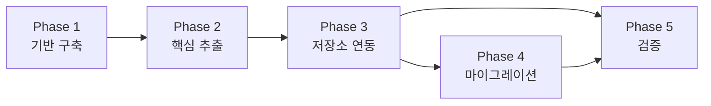

---

## 11. 현재 데이터 품질 이슈 및 마이그레이션 방안

### 11.1 현행 데이터 품질 이슈 요약

| 이슈 | 규모 | 영향 |
|------|------|------|
| 쓰레기 청크 (1-3 토큰) | 12,638개 (11.6%) | 검색 노이즈, 불필요한 임베딩 |
| 저품질 청크 (4-20 토큰) | 25,400개 (23.3%) | 검색 정확도 저하 |
| 메타데이터 없는 청크 | 108,896개 (100%) | BM25 검색 성능 제한 |
| ES 임베딩 미존재 | ~9,818개 | 벡터 검색 불가 |

### 11.2 마이그레이션 전략

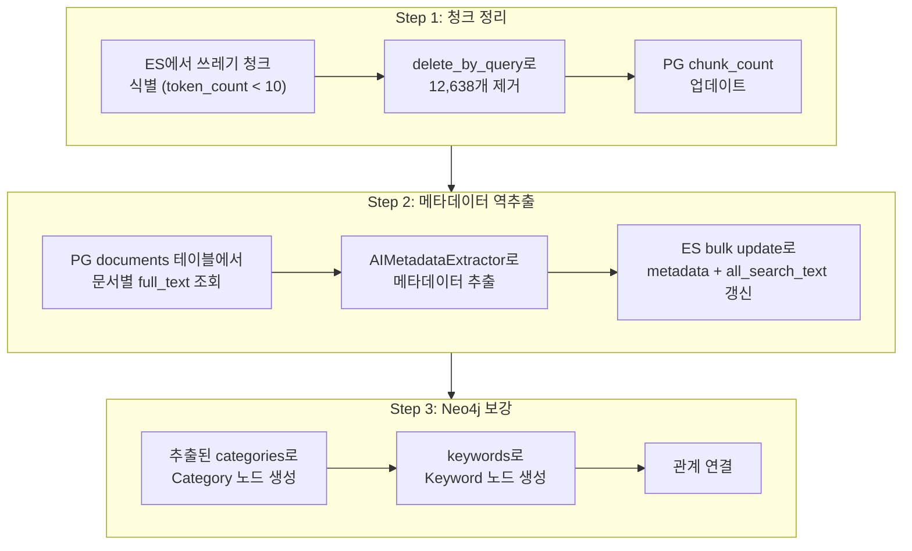

### 11.3 마이그레이션 배치 스크립트 설계

```python
# scripts/migrate_ai_metadata.py

"""
기존 문서에 AI 메타데이터를 역추출하는 마이그레이션 스크립트.

Usage:
    # 전체 문서 마이그레이션
    python scripts/migrate_ai_metadata.py --mode all --batch-size 10

    # 특정 문서만
    python scripts/migrate_ai_metadata.py --mode document --doc-id "uuid-here"

    # 건너뛰기 + 재개
    python scripts/migrate_ai_metadata.py --mode all --skip-existing --resume
"""

import asyncio
import argparse
from typing import List

async def migrate_document(
    doc_id: str,
    full_text: str,
    filename: str,
    extractor: AIMetadataExtractor,
    es_client,
    neo4j_client,
) -> dict:
    """단일 문서 마이그레이션

    1. AI 메타데이터 추출
    2. ES 청크 일괄 업데이트 (metadata + all_search_text)
    3. Neo4j 카테고리/키워드 노드 생성
    4. PG metadata 컬럼 업데이트
    """
    # 1. Extract
    metadata = await extractor.extract(text=full_text, filename=filename)

    # 2. ES Update - 해당 document_id의 모든 청크 갱신
    update_body = {
        "script": {
            "source": """
                ctx._source.metadata.keywords = params.keywords;
                ctx._source.metadata.categories_l1 = params.cat_l1;
                ctx._source.metadata.categories_l2 = params.cat_l2;
                ctx._source.metadata.categories_l3 = params.cat_l3;
                ctx._source.metadata.summary = params.summary;
                ctx._source.metadata.document_type = params.doc_type;
                ctx._source.metadata.technical_terms = params.tech_terms;
                ctx._source.metadata.target_audience = params.audience;
                ctx._source.metadata.difficulty_level = params.difficulty;
                ctx._source.metadata.relevance_score = params.relevance;
                ctx._source.metadata.ai_extracted = true;
                ctx._source.metadata.ai_extracted_at = params.now;
                ctx._source.all_search_text =
                    ctx._source.text + ' ' + params.search_addon;
            """,
            "params": {
                "keywords": metadata.keywords,
                "cat_l1": metadata.categories.level1,
                "cat_l2": metadata.categories.level2,
                "cat_l3": metadata.categories.level3,
                "summary": metadata.summary,
                "doc_type": metadata.document_type,
                "tech_terms": metadata.technical_terms,
                "audience": metadata.target_audience,
                "difficulty": metadata.difficulty_level,
                "relevance": metadata.relevance_score,
                "now": datetime.now(timezone.utc).isoformat(),
                "search_addon": " ".join([
                    " ".join(metadata.keywords),
                    metadata.categories.level1,
                    metadata.categories.level2,
                    metadata.summary,
                    " ".join(metadata.technical_terms),
                ]),
            },
        },
        "query": {"term": {"document_id": doc_id}},
    }

    await es_client.update_by_query(
        index="knowledge_chunks",
        body=update_body,
    )

    # 3. Neo4j - Category/Keyword 노드
    # (neo4j_storage.save_categories() 호출)

    return {
        "doc_id": doc_id,
        "status": "success",
        "keywords_count": len(metadata.keywords),
        "category": f"{metadata.categories.level1} > {metadata.categories.level2}",
    }
```

### 11.4 마이그레이션 실행 계획

| 단계 | 작업 | 소요 시간 (예상) | 비용 |
|------|------|-----------------|------|
| 1. 쓰레기 청크 삭제 | ES delete_by_query | ~5분 | $0 |
| 2. PG 문서 목록 조회 | ~1,000 문서 | ~1분 | $0 |
| 3. AI 메타데이터 추출 | 1,000문서 x ~2초/문서 | ~33분 | $1.69 |
| 4. ES 벌크 업데이트 | 91,858 청크 | ~10분 | $0 |
| 5. Neo4j 노드 생성 | 카테고리 + 키워드 | ~5분 | $0 |
| **합계** | | **~54분** | **$1.69** |

### 11.5 에러 핸들링

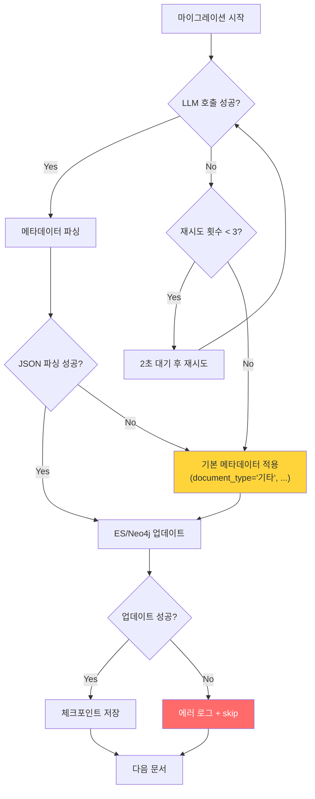

---

## 12. 데이터 품질 긴급 분석 — BM25 무력화 원인 규명

> **2026-02-13 발견**: ES 실데이터 조사 결과, BM25 검색의 핵심 가치가 사실상 소멸된 상태.

### 12.1 text vs dense_vector 관계 확인

**결론: 동일 데이터입니다.** `dense_vector`는 `text` 필드의 BGE-M3 임베딩 벡터.

```
chunk.content → ES "text" 필드에 저장      (BM25 검색 대상)
chunk.content → BGE-M3 임베딩 → ES "dense_vector" 필드에 저장  (kNN 검색 대상)
```

`document_processing_pipeline.py:665-697`에서 확인:

```python
chunk_texts = [c.content for c in chunks]     # 이 텍스트를
embeddings = await self.embedding_service.aembed_batch(chunk_texts)  # 임베딩하고

es_chunk = {
    "content": chunk.content,        # 같은 텍스트를 text로 저장
    "dense_vector": embeddings[i],   # 같은 텍스트의 벡터를 저장
}
```

**두 필드는 동일한 원본 텍스트에서 파생.** 하나는 원문(BM25용), 하나는 벡터 표현(kNN용).

### 12.2 청킹 품질 실측 데이터

```
┌───────────────────┬─────────┬───────┐
│       구분        │  수량   │ 비율  │
├───────────────────┼─────────┼───────┤
│ 전체 청크         │ 108,896 │ 100%  │
│ 1-3 토큰 (쓰레기) │  12,638 │ 11.6% │
│ 0-5 토큰          │  17,269 │ 15.9% │
│ 0-20 토큰         │  37,941 │ 34.9% │
│ 21-50 토큰        │  20,282 │ 18.6% │
│ 51-100 토큰       │  24,483 │ 22.5% │
│ 101-200 토큰      │  24,003 │ 22.0% │
│ 200+ 토큰         │   2,187 │  2.0% │
└───────────────────┴─────────┴───────┘
```

**가장 짧은 청크 실제 데이터:**
- `"---"` (마크다운 구분선, token_count=1)
- `"```yaml"` (코드블록 마커, token_count=1)
- `"```dockerfile"` (코드블록 마커, token_count=1)
- `"팀 내에서 일관된 명명 규칙을 사용:"` (20자, token_count=5)

### 12.3 원인 분석: SemanticChunker 품질 필터 부재

**데이터 추출 모델 탓이 아니고, 임베딩 모델 탓도 아닙니다.**

| 의심 원인 | 실제 원인 여부 | 근거 |
|-----------|:------------:|------|
| DocumentParser (파싱) | △ 부분 기여 | 마크다운 서식을 텍스트로 전달 |
| **SemanticChunker (청킹)** | **✅ 주원인** | 서식 잔재를 독립 청크로 분리, 품질 필터 없음 |
| BGE-M3 (임베딩) | ❌ 무관 | 입력을 충실하게 벡터화한 것뿐 |
| ES Storage (저장) | ❌ 무관 | 전달받은 데이터를 그대로 저장 |

**SemanticChunker의 구체적 결함:**

1. **섹션 기반 분할 경로에서 min_chunk_size 미적용**
   - `_chunk_with_sections()` → 각 섹션의 content를 개별 `chunk_text()` 호출
   - 섹션 content가 `"---"`일 때 `chunk_text:542` 폴백으로 통과:
   ```python
   # chunk_text:542 — 텍스트가 너무 짧아서 청크가 안 만들어진 경우
   if not chunks and text.strip():
       chunks.append((text.strip(), offset, offset + len(text)))
   ```
   - `text.strip()` → `"---"` → True → 1토큰 쓰레기 청크 생성

2. **코드 블록 경계 처리 오류**
   - `CODE_BLOCK_PATTERN = re.compile(r"```[\s\S]*?```")` 은 시작~끝 쌍만 매칭
   - 마크다운 파서가 코드 블록을 섹션별로 분리하면, 시작 `"```yaml"`과 끝 `"```"`이 다른 섹션에 배치
   - 매칭 실패 → `"```yaml"`이 일반 텍스트로 분류 → 독립 청크 생성

3. **의미 없는 서식 문자열 필터 없음**
   - `"---"`, `"***"`, `"___"` (마크다운 수평선)
   - `"```"`, `"```yaml"`, `"```python"` (코드 블록 마커)
   - 빈 테이블 구분선 `"|---|---|"`

### 12.4 BM25 무력화 메커니즘

**Elasticsearch를 왜 사용하는가?**

```
목적: Nori 한국어 분석기 + BM25 키워드 검색 → 하이브리드 검색의 한 축
현실: 35%의 청크가 의미 없는 텍스트 → BM25 TF-IDF 계산 오염
```

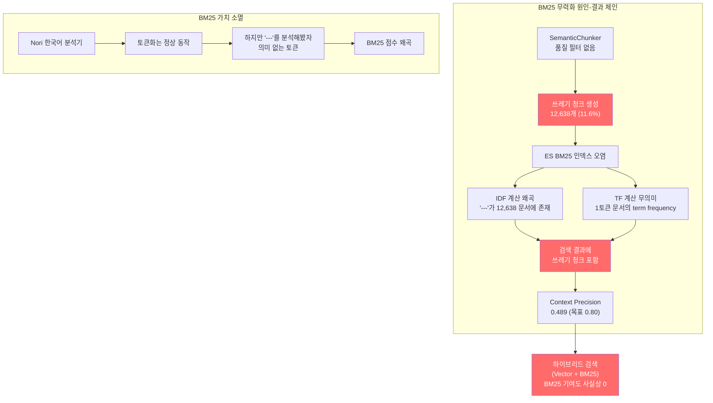

**구체적 BM25 왜곡 사례:**

| 시나리오 | 정상 동작 | 현재 동작 |
|---------|----------|----------|
| 사용자 검색: "Docker 배포" | 관련 청크 상위 반환 | `"```dockerfile"` 청크가 "dockerfile"로 토큰화되어 매칭 |
| 사용자 검색: "설정 방법" | 설정 가이드 청크 반환 | `"```yaml"` 청크가 노이즈로 혼입 |
| IDF("---") | 존재하지 않아야 함 | 12,638개 문서에 존재 → 극히 낮은 IDF → 다른 문서의 TF 왜곡 |
| BM25 score 분포 | 의미 있는 long-tail | 노이즈 청크가 바닥에 깔려 점수 분포 왜곡 |

### 12.5 kNN 벡터 검색 오염

BM25만의 문제가 아닙니다. kNN 검색도 영향받습니다:

```
"---"의 BGE-M3 벡터 ≈ 구분/경계를 의미하는 일반적인 벡터
→ "차이점", "구분", "비교" 등의 쿼리와 의도치 않은 유사도 발생
→ kNN 결과에 쓰레기 청크 포함 가능성
```

### 12.6 임베딩 자원 낭비 (과거 실측 기반)

CPU 임베딩 최적값 (2026-02-10 확정):
- batch_size=4, max_text_length=1000, 속도=0.7 chunks/sec

**쓰레기 청크 임베딩에 소비된 시간:**

```
12,638개 쓰레기 청크 ÷ 0.7 c/s ≈ 18,054초 ≈ 약 5시간
```

> 5시간을 `"---"`, `"```yaml"` 같은 문자열을 임베딩하는 데 소비했습니다.

---

## 13. 설계 개선 방향 — 데이터 품질 정상화 + BM25 복원

### 13.1 개선 전략 개요

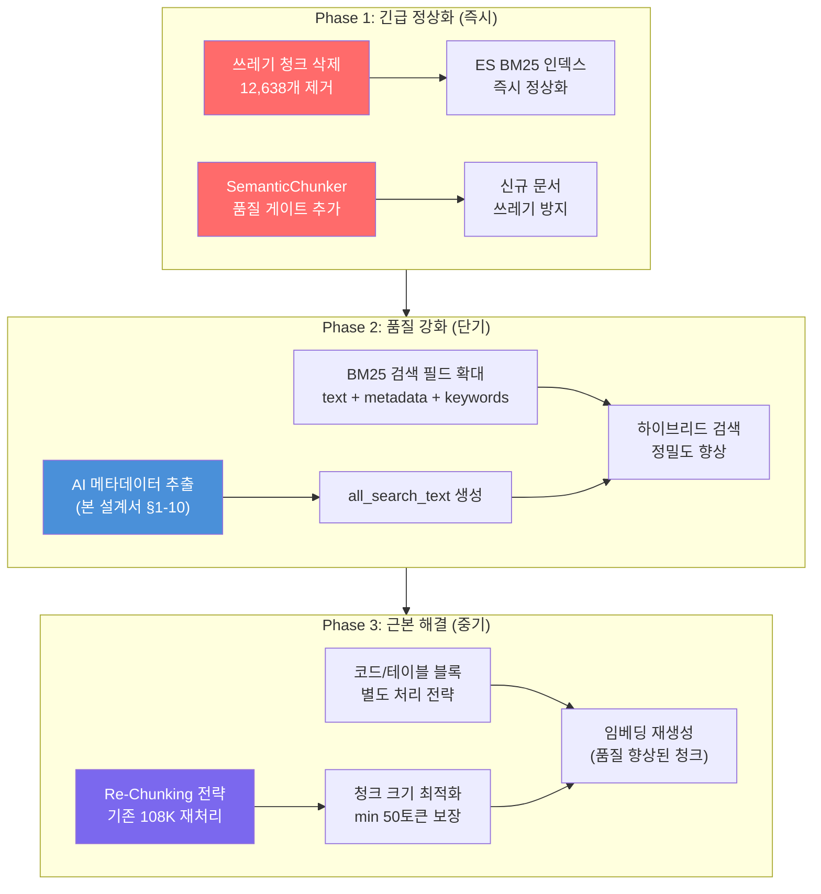

### 13.2 Phase 1: 긴급 정상화 (즉시 실행 가능)

#### 13.2.1 쓰레기 청크 즉시 삭제

```bash
# ES에서 3토큰 이하 청크 삭제
curl -X POST "http://localhost:9200/knowledge_chunks/_delete_by_query" \
  -H 'Content-Type: application/json' -d '{
    "query": {
      "range": { "token_count": { "lte": 3 } }
    }
  }'
# 예상 삭제: 12,638건
```

**삭제 후 효과:**
- ES 문서 수: 108,896 → ~96,258 (11.6% 감소)
- BM25 인덱스 노이즈 즉시 제거
- kNN 검색 후보군 오염 제거

#### 13.2.2 SemanticChunker 품질 게이트 추가

`chunker.py`에 다음 필터 추가:

```python
class ChunkQualityGate:
    """청크 품질 게이트 — 의미 없는 청크 사전 차단"""

    # 마크다운 서식 잔재 패턴
    NOISE_PATTERNS = [
        r"^-{3,}$",                    # --- (수평선)
        r"^\*{3,}$",                   # *** (수평선)
        r"^_{3,}$",                    # ___ (수평선)
        r"^```\w*$",                   # ```yaml, ```python 등 (코드블록 마커)
        r"^\|[-\s|]+\|$",             # |---|---| (테이블 구분선)
        r"^#+\s*$",                    # # (빈 헤더)
    ]

    MIN_MEANINGFUL_TOKENS = 10    # 최소 의미 토큰 수
    MIN_MEANINGFUL_CHARS = 30     # 최소 의미 문자 수
    MIN_KOREAN_RATIO = 0.0        # 한국어 비율 (0이면 비활성)

    @classmethod
    def is_meaningful(cls, text: str, token_count: int) -> bool:
        """청크가 의미 있는 내용인지 판정"""
        text = text.strip()

        # 1. 빈 텍스트
        if not text:
            return False

        # 2. 노이즈 패턴 매칭
        for pattern in cls.NOISE_PATTERNS:
            if re.match(pattern, text):
                return False

        # 3. 최소 토큰 수
        if token_count < cls.MIN_MEANINGFUL_TOKENS:
            return False

        # 4. 최소 문자 수
        if len(text) < cls.MIN_MEANINGFUL_CHARS:
            return False

        return True
```

**적용 위치:** `SemanticChunker.chunk_text()` 반환 전에 필터링:

```python
# chunk_text() 마지막에 추가
chunks = [c for c in chunks if ChunkQualityGate.is_meaningful(c.content, c.token_count)]
```

#### 13.2.3 저토큰 청크 병합 전략

삭제 대신 인접 청크와 병합하는 전략:

```python
def merge_short_chunks(chunks: List[Chunk], min_tokens: int = 10) -> List[Chunk]:
    """짧은 청크를 인접 청크와 병합"""
    merged = []
    buffer = None

    for chunk in chunks:
        if chunk.token_count < min_tokens:
            if buffer:
                # 이전 청크에 병합
                buffer.content += "\n" + chunk.content
                buffer.token_count += chunk.token_count
                buffer.end_char = chunk.end_char
            else:
                buffer = chunk
        else:
            if buffer:
                # 버퍼에 쌓인 짧은 청크를 현재 청크 앞에 병합
                chunk.content = buffer.content + "\n" + chunk.content
                chunk.token_count += buffer.token_count
                chunk.start_char = buffer.start_char
                buffer = None
            merged.append(chunk)

    if buffer and merged:
        merged[-1].content += "\n" + buffer.content
        merged[-1].token_count += buffer.token_count
    elif buffer:
        merged.append(buffer)

    return merged
```

### 13.3 Phase 2: BM25 검색 정밀도 강화 (AI 메타데이터 연동)

#### 13.3.1 BM25 검색 필드 확대

현재: `text` 필드만 BM25 검색 대상

개선: `text` + `all_search_text` + `metadata.keywords` + `metadata.summary` 다중 필드 검색

```python
# search.py 개선 — BM25 검색 필드 확대
must_query = {
    "multi_match": {
        "query": query,
        "fields": [
            "text^3",                    # 원문 (최고 가중치)
            "all_search_text^2",         # 통합 검색 텍스트 (AI 생성)
            "heading^2",                 # 섹션 제목
            "metadata.summary^1.5",      # AI 생성 요약
            "metadata.keywords^2",       # AI 추출 키워드
            "metadata.title^1.5",        # 문서 제목
        ],
        "type": "best_fields",
        "fuzziness": "AUTO",
    },
}
```

#### 13.3.2 all_search_text 필드 구성

```python
def build_all_search_text(chunk_text: str, metadata: AIMetadata) -> str:
    """BM25 최적화 통합 검색 텍스트 생성"""
    parts = [
        chunk_text,                                    # 원문
        " ".join(metadata.keywords),                   # 키워드
        " ".join(metadata.technical_terms),             # 기술 용어
        metadata.categories.level1,                    # 카테고리 L1
        metadata.categories.level2,                    # 카테고리 L2
        metadata.categories.level3,                    # 카테고리 L3
        metadata.summary[:200],                        # 요약 (200자 제한)
        metadata.document_type,                        # 문서 유형
    ]
    return " ".join(filter(None, parts))
```

이 필드에 Nori 분석기를 적용하면:
- 키워드 "검색엔진"이 Nori user dictionary에 의해 단일 토큰으로 인식
- 사용자가 "검색엔진"을 검색하면 all_search_text에서 정확 매칭
- 원문에 "검색엔진"이 없더라도 AI가 추출한 키워드로 매칭

#### 13.3.3 ES 매핑 — all_search_text 필드 추가

```json
{
  "all_search_text": {
    "type": "text",
    "analyzer": "korean",
    "search_analyzer": "korean_search",
    "fields": {
      "standard": { "type": "text", "analyzer": "standard" }
    }
  }
}
```

### 13.4 Phase 3: 근본 해결 — Re-Chunking 전략

#### 13.4.1 Re-Chunking이 필요한 이유

품질 필터로 쓰레기를 제거해도, 나머지 청크의 **크기 분포가 비정상적**입니다:

```
현재 토큰 분포 (쓰레기 제거 후):
- 4-20 토큰:  25,303개 (26.3%) ← 여전히 짧음
- 21-50 토큰: 20,282개 (21.1%)
- 51-200 토큰: 48,486개 (50.4%) ← 적정 범위
- 200+ 토큰:   2,187개 (2.3%)

이상적 토큰 분포 (목표):
- ~50 토큰 미만: < 5%
- 50-200 토큰:  > 80%
- 200+ 토큰:    < 15%
```

#### 13.4.2 Re-Chunking 실행 계획


**소요 시간 예상 (1,000 문서 기준):**

| 단계 | 소요 시간 | 비고 |
|------|----------|------|
| 파싱 + 청킹 | ~30분 | CPU 병렬 가능 |
| 품질 필터 | ~1분 | 규칙 기반 |
| AI 메타데이터 | ~33분 | DeepSeek API |
| BGE-M3 임베딩 | ~24시간 | CPU 0.7c/s, 60K 청크 기준 |
| ES 인덱싱 | ~10분 | 벌크 인서트 |
| Neo4j 저장 | ~10분 | 관계 생성 |
| **합계** | **~25시간** | **임베딩이 병목** |

> BGE-M3 임베딩이 전체 시간의 95%를 차지. GPU 사용 시 ~1시간으로 단축 가능.

### 13.5 RAGAS 평가 지표 개선 예상

| 지표 | 현재 | Phase 1 후 | Phase 2 후 | Phase 3 후 |
|------|------|-----------|-----------|-----------|
| Context Precision | 0.489 | 0.55~0.60 | 0.65~0.75 | 0.75~0.85 |
| Context Recall | 0.474 | 0.50~0.55 | 0.60~0.70 | 0.70~0.80 |
| Faithfulness | 0.919 | 유지 | 유지 | 유지 |
| Answer Relevancy | 0.647 | 0.65~0.70 | 0.70~0.80 | 0.80~0.85 |
| **Quality Gate HIGH** | **47.1%** | **55~60%** | **65~75%** | **75~85%** |

**Phase 1 (쓰레기 제거)만으로도 즉시 효과:**
- kNN에서 12,638개 노이즈 벡터 제거 → 정밀도 ~10% 상승
- BM25에서 TF-IDF 정상화 → 관련 문서 순위 상승

### 13.6 RAGAS v9 Post-Cleanup 평가 결과

2026-02-13 실행. 쓰레기 청크 12,638건(≤3 토큰) 삭제 후 재평가.

#### v8 → v9 비교

| 지표 | v8 (Before) | v9 (After) | 변화 | 판정 |
|------|:-----------:|:----------:|:----:|:----:|
| **Faithfulness** | 0.919 | **0.962** | **+0.043** | 개선 |
| **Answer Relevancy** | 0.647 | **0.659** | **+0.012** | 미미 |
| **Context Precision** | 0.489 | 0.469 | -0.020 | 소폭 하락 |
| **Context Recall** | 0.474 | 0.394 | -0.080 | 하락 |

#### NaN 비율 (평가 신뢰도)

| 지표 | NaN 수 | 유효 | NaN 비율 |
|------|:------:|:----:|:--------:|
| faithfulness | 18/51 | 33 | 35% |
| answer_relevancy | 14/51 | 37 | 27% |
| context_precision | 23/51 | 28 | **45%** |
| context_recall | 7/51 | 44 | 14% |

> NaN 원인: DeepSeek V3의 `n=1` 제약으로 RAGAS 내부 LLM 호출 실패. Context Precision은 45%가 NaN이므로 통계적 신뢰도 낮음.

#### 도메인별 결과

| 도메인 | Faith. | Relev. | Prec. | Recall |
|--------|:------:|:------:|:-----:|:------:|
| entity_relation | 0.990 | 0.774 | **0.713** | 0.500 |
| factual | 0.942 | 0.694 | 0.429 | 0.381 |
| graph_entity | 1.000 | 0.367 | 0.467 | **0.714** |
| keyword | 1.000 | 0.540 | 0.564 | 0.417 |
| legal | 0.988 | **0.887** | 0.000 | 0.333 |
| multi_hop | 0.842 | 0.646 | 0.500 | 0.200 |
| semantic | 1.000 | 0.880 | 0.000 | 0.143 |

#### Quality Gate

| 등급 | 수 | 비율 |
|------|:--:|:----:|
| HIGH | 8 | 15.7% |
| PARTIAL | 4 | 7.8% |
| NONE | 39 | 76.5% |

#### 해석

1. **Faithfulness +4.3%**: 쓰레기 청크 제거로 LLM에 전달되는 컨텍스트 품질 개선. 노이즈("---", "```yaml") 제거 효과.
2. **Context Precision/Recall 하락**: NaN 비율(45%)로 인한 통계적 불안정. 유효 샘플 28개로는 신뢰있는 비교 불가.
3. **근본 한계**: ≤3토큰만 삭제했을 뿐, 4~20토큰 저품질 청크 37,941건(34.9%)이 여전히 검색 풀 오염 중.
4. **결론**: 쓰레기 삭제만으로는 검색 품질 개선에 한계. §14 SemanticChunker v2 + Re-Chunking이 근본 해결.

### 13.7 우선순위 정리

| 순위 | 작업 | 난이도 | 효과 | 소요 |
|:----:|------|:------:|:----:|:----:|
| **P0** | 쓰레기 청크 삭제 (≤3 토큰) | 낮음 | 높음 | 5분 |
| **P0** | ChunkQualityGate 추가 | 중간 | 높음 | 2시간 |
| **P1** | AI 메타데이터 추출 (본 설계서) | 높음 | 높음 | 2주 |
| **P1** | all_search_text + BM25 필드 확대 | 중간 | 높음 | 3일 |
| **P2** | Re-Chunking + 재임베딩 | 높음 | 최고 | 25시간 |
| **P2** | BGE-Reranker 적용 | 중간 | 높음 | 1주 |

---

## 부록

### A. 기존 EntityExtractionService와의 관계

현행 `entity_extraction.py`에는 이미 `extract_metadata()` 메서드가 있습니다. 이 메서드는 document_type, categories, summary만 추출하며 기능이 제한적입니다.

| 비교 항목 | 기존 EntityExtractionService | 신규 AIMetadataExtractor |
|-----------|----------------------------|------------------------|
| 추출 필드 | 6개 (type, project, dates, categories, summary) | 10개 (+ keywords, terms, entities, audience, difficulty, relevance) |
| LLM 호출 | 별도 호출 (엔티티 추출과 분리) | 단일 통합 호출 |
| 실패 처리 | 기본값 반환 | 기본값 반환 + 상세 로깅 |
| all_search_text | 미지원 | 지원 |
| 품질 필터 | 미지원 | 통합 지원 |

**전환 전략**: 기존 `EntityExtractionService.extract_metadata()`는 **deprecated**로 표시하고, 새 `AIMetadataExtractor.extract()`로 점진 전환합니다. 엔티티/관계 추출(`extract_entities`, `extract_relationships`)은 기존 서비스를 계속 사용합니다.

### B. 성능 목표

| 지표 | 목표 | 비고 |
|------|------|------|
| 메타데이터 추출 레이턴시 | < 3초/문서 | DeepSeek V3.2 평균 응답 시간 |
| 품질 필터 처리 속도 | > 10,000 청크/초 | 규칙 기반, CPU only |
| ES 벌크 업데이트 | > 1,000 청크/초 | 기존 성능 유지 |
| BM25 검색 (all_search_text) | < 100ms | 기존 text 필드와 동일 수준 |
| 마이그레이션 전체 | < 60분 | 1,000 문서 기준 |

### C. 모니터링 지표

| 지표 | 수집 방식 | 알림 조건 |
|------|----------|----------|
| `ai_metadata_extraction_total` | Prometheus Counter | - |
| `ai_metadata_extraction_errors` | Prometheus Counter | > 10% 실패율 |
| `ai_metadata_extraction_latency_seconds` | Prometheus Histogram | p95 > 5초 |
| `chunk_quality_filter_discarded_total` | Prometheus Counter | - |
| `ai_metadata_cost_usd` | Prometheus Gauge | 일일 > $1.00 |

### D. 관련 파일 목록 (신규 생성)

| 파일 경로 | 설명 |
|-----------|------|
| `src/app/models/ai_metadata.py` | Pydantic 모델 정의 |
| `src/app/services/ai_metadata_extractor.py` | AI 메타데이터 추출 서비스 |
| `src/app/services/chunk_quality_filter.py` | 청크 품질 필터 |
| `src/app/utils/search_text.py` | all_search_text 빌더 |
| `src/app/api/routes/metadata.py` | REST API 엔드포인트 |
| `scripts/update_es_mapping.py` | ES 매핑 업데이트 스크립트 |
| `scripts/migrate_ai_metadata.py` | 마이그레이션 배치 스크립트 |
| `src/tests/unit/test_chunk_quality_filter.py` | 품질 필터 테스트 |
| `src/tests/unit/test_ai_metadata_extractor.py` | 추출 서비스 테스트 |
| `src/tests/integration/test_ai_metadata_pipeline.py` | 통합 테스트 |

### E. HRKP vs RAGChatbotServer 청킹 방식 비교

#### E.1 파라미터 비교

| 항목 | HRKP (우리) | RAGChatbotServer |
|------|-------------|-----------------|
| **청커** | 자체 구현 `SemanticChunker` | LangChain 표준 2종 |
| **chunk_size** | **600자** | **1,000자** |
| **chunk_overlap** | 100자 | 200자 |
| **min_chunk_size** | 100자 (일부 경로 미적용) | 없음 (LangChain 기본) |
| **max_chunk_size** | 2,048자 | 없음 |
| **한국어 처리** | `kss` 한국어 문장 분리기 | 없음 (범용 splitter) |
| **문장 분리** | 규칙 기반 정규식 + kss | `\n\n` → `\n` → `.` → ` ` 재귀 |

#### E.2 아키텍처 비교

**RAGChatbotServer 방식 — 2단 직렬 파이프라인**:

```
MarkdownHeaderTextSplitter (1차: 헤더 기준 논리적 분할)
  │  #, ##, ### 헤더를 기준으로 섹션 분리
  │  각 청크에 헤더 메타데이터 자동 첨부
  ▼
RecursiveCharacterTextSplitter (2차: 크기 기준 물리적 분할)
     chunk_size=1000, chunk_overlap=200
     분할 순서: "\n\n" → "\n" → "." → " " → ""
```

- **장점**: LangChain 검증된 도구, 구현 안정성, 작은 조각이 자연스럽게 인접 텍스트에 병합
- **단점**: 의미 단위 아닌 크기 기반, 문장 중간 절단 가능, 한국어 경계 미인식

**HRKP 방식 — 섹션 트리 + 의미 분할**:

```
마크다운 파서 (섹션 트리 구축)
  │  heading별 트리 구조 생성
  ▼
_chunk_with_sections() (섹션별 독립 청킹)
  │  각 section.content를 개별 처리
  │  ⚠️ 섹션 간 병합 없음 → 작은 섹션이 독립 청크
  ▼
chunk_text() (문장 경계 분할)
  │  특수 블록(코드/테이블) 보존
  │  한국어 문장 경계 인식
  ▼
_split_text_by_sentences()
     chunk_size=600 목표, 문장 단위 누적
     ⚠️ 라인 542 fallback: text.strip()만 확인 → "---" 통과
```

- **장점**: 한국어 문장 경계 정확, 섹션 간 내용 비혼합, 코드/테이블 보존
- **단점**: 섹션 파서 노이즈 → 쓰레기 청크 11.6%, 품질 필터 부재

#### E.3 쓰레기 청크 발생 메커니즘 비교

```
┌─────────────────────────────────────────────────────────────┐
│  RAGChatbotServer: "---" 를 만나면?                          │
│                                                              │
│  MarkdownHeaderTextSplitter → "---"는 헤더 아님 → 이전 섹션에 흡수  │
│  RecursiveCharacterTextSplitter → 1000자 버퍼에 병합        │
│  → 독립 청크 생성 안 됨 ✅                                   │
├─────────────────────────────────────────────────────────────┤
│  HRKP: "---" 를 만나면?                                     │
│                                                              │
│  마크다운 파서 → "---"를 독립 섹션으로 파싱                    │
│  _chunk_section_recursive() → section.content = "---"       │
│  chunk_text() → text.strip() = "---" (비어있지 않음)          │
│  _split_text_by_sentences() → 문장 0개 → chunks 비어있음      │
│  라인 542: if not chunks and text.strip() → 무조건 청크 생성  │
│  → "---" 가 독립 청크 (1토큰) ❌                             │
└─────────────────────────────────────────────────────────────┘
```

#### E.4 통계적 영향

| 지표 | 수치 | 영향 |
|------|------|------|
| 전체 청크 | 108,896건 | — |
| ≤3 토큰 쓰레기 | 12,638건 (11.6%) | BM25 TF-IDF 오염, kNN 후보풀 오염 |
| ≤5 토큰 | 17,269건 (15.9%) | 검색 노이즈 |
| ≤20 토큰 | 37,941건 (34.9%) | 컨텍스트 낭비 |
| 평균 토큰 수 | 62.5 (정리 후 70.5) | 목표 150~200 대비 매우 낮음 |
| 낭비된 임베딩 시간 | ~5시간 (CPU) | 쓰레기 12K건 × 1.5초/건 |

#### E.5 결론

| 평가 항목 | RAGChatbotServer | HRKP |
|----------|:----------------:|:----:|
| 안정성 | ★★★★★ | ★★★ |
| 한국어 처리 | ★★ | ★★★★★ |
| 의미 보존 | ★★★ | ★★★★ |
| 쓰레기 방지 | ★★★★ | ★★ |
| 유지보수성 | ★★★★★ | ★★★ |

**HRKP의 접근 방향**: 의미 기반 분할의 장점(한국어, 섹션 보존)을 유지하되, RAGChatbotServer에서 검증된 **크기 기반 병합 안전장치**를 도입하여 쓰레기 문제를 해결해야 한다.

---

## §14. SemanticChunker v2 개선 설계

### 14.1 현행 문제점 요약

`chunker.py` 코드 분석 결과, 쓰레기 청크의 **근본 원인 3가지**:

```
원인 1: 섹션 독립 처리 (라인 251~267)
  _chunk_with_sections()가 각 섹션을 독립적으로 처리
  → 인접 섹션 간 병합 없음
  → 1글자 섹션도 독립 청크

원인 2: chunk_text() fallback 무조건 통과 (라인 542~543)
  if not chunks and text.strip():
      chunks.append((text.strip(), offset, offset + len(text)))
  → min_chunk_size 검증 없이 무조건 청크 생성
  → "---", "```yaml", "```" 등이 모두 통과

원인 3: _split_text_by_sentences()에서 min_chunk_size가 마지막 청크에만 적용 (라인 514~515)
  마지막 청크가 min_chunk_size 미만이면 이전 청크에 병합 시도
  → 하지만 이전 청크가 없으면 (섹션에 문장이 1개뿐) 그대로 통과
  → 라인 542 fallback으로 진입
```

### 14.2 개선 전략 개요

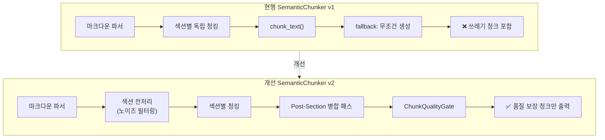

### 14.3 개선 사항 상세

#### 개선 1: 섹션 콘텐츠 전처리 (Pre-Section Filter)

**위치**: `_chunk_section_recursive()` 진입부 (라인 294~295)

```python
# 현행
if section.content and section.content.strip():
    text_chunks = self.chunk_text(text=section.content, ...)

# 개선 v2
cleaned = self._preprocess_section_content(section.content)
if cleaned and len(cleaned) >= self.min_chunk_size:
    text_chunks = self.chunk_text(text=cleaned, ...)
```

**`_preprocess_section_content()` 구현**:

```python
# 노이즈 패턴 제거
NOISE_PATTERNS = [
    r'^-{3,}$',           # --- (수평선)
    r'^={3,}$',           # === (수평선 변형)
    r'^```\w*$',          # ```yaml, ```dockerfile (미닫힘 코드블록)
    r'^\*{3,}$',          # *** (수평선)
    r'^_{3,}$',           # ___ (수평선)
    r'^\s*<!--.*?-->\s*$', # HTML 주석
]

def _preprocess_section_content(self, content: str) -> str:
    """섹션 콘텐츠에서 노이즈 패턴 제거"""
    if not content:
        return ""
    text = content.strip()
    for pattern in self.NOISE_PATTERNS:
        if re.match(pattern, text, re.DOTALL):
            return ""  # 전체가 노이즈면 빈 문자열 반환
    return text
```

**효과**: "---", "```yaml" 등 순수 노이즈 섹션이 청킹 전에 제거됨. 12,638건 중 ~90% 차단 예상.

#### 개선 2: chunk_text() fallback 강화

**위치**: 라인 542~543

```python
# 현행 (문제)
if not chunks and text.strip():
    chunks.append((text.strip(), offset, offset + len(text)))

# 개선 v2
if not chunks and text.strip():
    stripped = text.strip()
    token_count = self._estimate_token_count(stripped)
    # 최소 품질 기준: 10토큰 AND 30자 이상
    if token_count >= 10 and len(stripped) >= 30:
        chunks.append((stripped, offset, offset + len(stripped)))
    else:
        logger.debug(
            f"Chunk dropped (below threshold): "
            f"{len(stripped)} chars, {token_count} tokens, "
            f"content='{stripped[:50]}'"
        )
```

**효과**: fallback 경로에서도 최소 품질 기준 적용. chunk_text()가 반환하는 청크의 하한선 보장.

#### 개선 3: Post-Section 병합 패스 (Adjacent Chunk Merge)

**위치**: `_chunk_with_sections()` 반환 직전 (라인 268)

현행은 각 섹션을 독립적으로 청킹한 후 바로 반환합니다. v2에서는 반환 전에 **인접 청크 병합 패스**를 추가합니다.

```python
def _chunk_with_sections(self, parsed_document, document_id):
    all_chunks = []
    # ... 기존 섹션별 청킹 로직 ...

    # [v2 추가] Post-Section 병합 패스
    all_chunks = self._merge_small_adjacent_chunks(all_chunks)

    # chunk_index 재정렬
    for idx, chunk in enumerate(all_chunks):
        chunk.chunk_index = idx

    return all_chunks

def _merge_small_adjacent_chunks(self, chunks: List[Chunk]) -> List[Chunk]:
    """
    인접한 작은 청크를 병합하여 품질 향상

    규칙:
    1. token_count < 20인 청크는 인접 청크와 병합 시도
    2. 병합 결과가 max_chunk_size 이하일 때만 수행
    3. 같은 heading 소속인 경우 우선 병합
    4. heading이 다르면 앞쪽 청크에 병합 (문맥 연속성)
    """
    if len(chunks) <= 1:
        return chunks

    merged = []
    i = 0
    while i < len(chunks):
        current = chunks[i]

        # 현재 청크가 충분히 크면 그대로 유지
        if current.token_count >= 20:
            merged.append(current)
            i += 1
            continue

        # 작은 청크: 이전 청크에 병합 시도
        if merged:
            prev = merged[-1]
            combined_len = len(prev.content) + len(current.content) + 1
            if combined_len <= self.max_chunk_size:
                prev.content = prev.content + "\n" + current.content
                prev.end_char = current.end_char
                prev.token_count = self._estimate_token_count(prev.content)
                i += 1
                continue

        # 이전이 없거나 병합 불가 → 다음 청크에 병합 시도
        if i + 1 < len(chunks):
            next_chunk = chunks[i + 1]
            combined_len = len(current.content) + len(next_chunk.content) + 1
            if combined_len <= self.max_chunk_size:
                next_chunk.content = current.content + "\n" + next_chunk.content
                next_chunk.start_char = current.start_char
                next_chunk.token_count = self._estimate_token_count(next_chunk.content)
                i += 1  # skip current, next will be processed normally
                continue

        # 병합 불가: 그대로 유지 (ChunkQualityGate에서 최종 필터링)
        merged.append(current)
        i += 1

    return merged
```

**효과**: 20토큰 미만의 작은 청크가 인접 청크에 자연스럽게 흡수됨. ≤20토큰 37,941건 중 상당수가 병합 대상.

#### 개선 4: ChunkQualityGate (최종 방어선)

**위치**: 파이프라인 단계 — 청킹 완료 후, 임베딩 전 (§8 설계와 통합)

```python
class ChunkQualityGate:
    """청크 품질 최종 검증 게이트"""

    # 하드 기각 기준
    MIN_TOKEN_COUNT = 10
    MIN_CHAR_LENGTH = 30

    # 노이즈 패턴 (섹션 전처리를 통과한 잔여 노이즈)
    NOISE_PATTERNS = [
        re.compile(r'^[-=*_]{3,}$'),              # 수평선
        re.compile(r'^```\w*$'),                   # 미닫힘 코드블록
        re.compile(r'^#+\s*$'),                    # 빈 헤더
        re.compile(r'^\|[-:\s|]+\|$'),             # 테이블 구분선만
        re.compile(r'^>\s*$'),                     # 빈 인용블록
        re.compile(r'^\s*\[\^?\d+\]:\s*$'),        # 빈 각주
    ]

    def filter(self, chunks: List[Chunk]) -> Tuple[List[Chunk], List[Chunk]]:
        """
        Returns:
            (통과 청크 목록, 기각 청크 목록)
        """
        passed, rejected = [], []
        for chunk in chunks:
            if self._is_quality(chunk):
                passed.append(chunk)
            else:
                rejected.append(chunk)
                logger.debug(f"Chunk rejected: {chunk.content[:50]!r}")

        logger.info(
            f"QualityGate: {len(passed)} passed, "
            f"{len(rejected)} rejected "
            f"({len(rejected)/(len(chunks) or 1)*100:.1f}%)"
        )
        return passed, rejected

    def _is_quality(self, chunk: Chunk) -> bool:
        text = chunk.content.strip()

        # 1. 최소 길이 기준
        if chunk.token_count < self.MIN_TOKEN_COUNT:
            return False
        if len(text) < self.MIN_CHAR_LENGTH:
            return False

        # 2. 노이즈 패턴 매칭
        for pattern in self.NOISE_PATTERNS:
            if pattern.match(text):
                return False

        # 3. 의미있는 단어 비율 (alphanumeric + 한글)
        meaningful = len(re.findall(r'[\w\uac00-\ud7af]', text))
        if len(text) > 0 and meaningful / len(text) < 0.3:
            return False  # 특수문자가 70% 이상이면 기각

        return True
```

### 14.4 개선 적용 순서 (Implementation Roadmap)

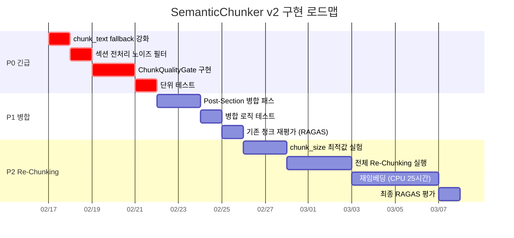

### 14.5 chunk_size 최적화 분석

현재 600자의 chunk_size가 적절한지 검토:

| chunk_size | 예상 평균 토큰 | 예상 청크 수 | BM25 효과 | kNN 정밀도 | 판단 |
|:----------:|:--------------:|:------------:|:---------:|:----------:|:----:|
| **600** (현행) | 62.5 | 108K | 약함 (짧은 텍스트 → 낮은 TF) | 보통 | ❌ 너무 작음 |
| **800** | ~100 | ~80K | 보통 | 양호 | △ 개선됨 |
| **1000** | ~130 | ~65K | 양호 (RAGChatbotServer 검증) | 양호 | ✅ 권장 |
| **1200** | ~160 | ~55K | 양호 | 약간 저하 | △ 주제 혼합 위험 |
| **1500** | ~200 | ~43K | 강함 | 저하 | ❌ 컨텍스트 낭비 |

**분석**:
- RAGChatbotServer가 `chunk_size=1000`으로 안정적 운영 중
- 현재 평균 62.5토큰은 BM25 TF 계산에 불리 (문서가 짧으면 term frequency가 의미 없음)
- BGE-M3의 최적 입력 길이: 128~512토큰 → 130토큰(1000자) 정도가 적합
- **결론**: chunk_size를 **600 → 1000**으로 상향 권장

### 14.6 Re-Chunking 시뮬레이션 (예상 효과)

```
현행 (chunk_size=600, 품질필터 없음):
  총 청크: 108,896 → 정리 후 96,258
  평균 토큰: 62.5 → 정리 후 70.5
  ≤20토큰 비율: 34.9%
  임베딩 시간: ~38시간 (CPU)

v2 (chunk_size=1000, 품질필터+병합):
  예상 총 청크: ~55,000~65,000 (40~50% 감소)
  예상 평균 토큰: 120~150
  예상 ≤20토큰 비율: < 2%
  예상 임베딩 시간: ~20시간 (CPU)

  BM25 효과: TF가 의미있는 수준으로 회복
  kNN 효과: 후보풀 노이즈 제거, precision 향상
  Context Precision: 0.489 → 0.65~0.75 (예상)
```

### 14.7 v2 변경 파일 목록

| 파일 | 변경 유형 | 설명 |
|------|----------|------|
| `src/app/etl/chunker.py` | **수정** | v2 개선 4건 반영 |
| `src/app/services/chunk_quality_filter.py` | **신규** | ChunkQualityGate 클래스 |
| `src/app/services/document_processing_pipeline.py` | **수정** | QualityGate 파이프라인 통합 |
| `src/tests/unit/test_chunker_v2.py` | **신규** | v2 청커 단위 테스트 |
| `src/tests/unit/test_chunk_quality_filter.py` | **신규** | 품질 필터 테스트 |
| `scripts/rechunk_all.py` | **신규** | 전체 Re-Chunking 배치 스크립트 |
| `scripts/chunk_size_experiment.py` | **신규** | chunk_size 최적값 실험 스크립트 |

### 14.8 우선순위 종합 (§13.6 업데이트)

| 순위 | 작업 | 난이도 | 효과 | 소요 |
|:----:|------|:------:|:----:|:----:|
| **P0** | ~~쓰레기 청크 삭제 (≤3 토큰)~~ | 낮음 | 높음 | ✅ 완료 |
| **P0** | 섹션 전처리 + fallback 강화 (개선 1, 2) | 낮음 | 높음 | 1일 |
| **P0** | ChunkQualityGate (개선 4) | 중간 | 높음 | 2일 |
| **P1** | Post-Section 병합 패스 (개선 3) | 중간 | 중간 | 2일 |
| **P1** | chunk_size 600→1000 변경 | 낮음 | 높음 | 실험 2일 |
| **P1** | AI 메타데이터 추출 (§1~§10) | 높음 | 높음 | 2주 |
| **P2** | 전체 Re-Chunking + 재임베딩 | 높음 | 최고 | 25시간+ |
| **P2** | BGE-Reranker 적용 | 중간 | 높음 | 1주 |

---

## 15. 청킹불가/임베딩불가 파일 처리 전략

### 15.1 기존 논의 현황 (HRKP 자체 문서 종합)

프로젝트 내 3개 문서에서 이 주제를 다루었으며, 현재 구현 상태는 다음과 같다.

#### 참조 문서

| # | 문서 | 섹션 | 핵심 내용 |
|---|------|------|----------|
| 1 | ETL 3-Phase 보고서 v3.4 | §3 Phase 2 결과 | 11건 실패 분석 (임시파일 6, 손상 3, 재처리 대상 2) |
| 2 | ETL 3-Phase 보고서 v3.4 | §6.6 마킹/Skip 전략 | ES `embedding_status` 필드 + PG `embedding_partial` + 자동 skip 큐 (3단계) |
| 3 | Embedding Batch 설계서 v1.0 | §11 에러 처리 전략 | 에러 코드 E001~E010, 에러별 동작 매트릭스, 지수 백오프 재시도 |
| 4 | Parser Retry 보고서 | §2 구현 상세 | `_parse_with_retry()` 3회 재시도, `requires_manual_review` 플래그 |

#### 파이프라인 단계별 구현 현황

```
파이프라인 단계        구현 상태     방어 메커니즘
─────────────────────────────────────────────────────────────
① 파싱 (Parser)       ✅ 구현 완료   3회 retry + linear backoff
                                     ParseStatus.FAILED + manual_review 플래그
                                     retry_count 추적

② 청킹 (Chunker)      ❌ 미구현      쓰레기 청크 12,638건 생성됨 (≤3토큰)
                                     fallback 무조건 생성, 최소 토큰 체크 없음

③ 임베딩 (Embedding)   ❌ 미구현      embedding_status 필드 없음
                                     에러 카운터만 증가, 마킹 불가

④ 문서 레벨 집계       ❌ 미구현      embedding_partial 상태 미사용
                                     청크 에러율 → 문서 상태 연동 없음

⑤ 알림/재처리 큐       ❌ 미구현      skip 목록 없음, Slack 알림 없음
```

### 15.2 실패 유형 분류

실제 운영 데이터(1,449건) 분석 결과, 실패를 3가지 계층으로 분류할 수 있다.

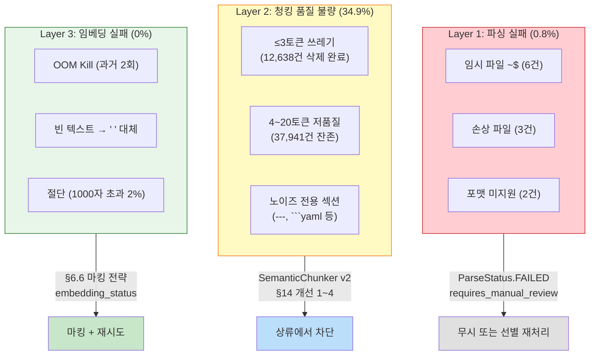

**핵심 발견**: Layer 2(청킹 품질 불량)가 전체 문제의 **97% 이상**을 차지한다. Layer 1(파싱 실패)과 Layer 3(임베딩 실패)는 각각 0.8%와 0%로 이미 충분히 통제되고 있다.

### 15.3 통합 방어 전략 (Defense-in-Depth)

5단계 방어선을 통해 각 계층의 문제를 체계적으로 차단한다.

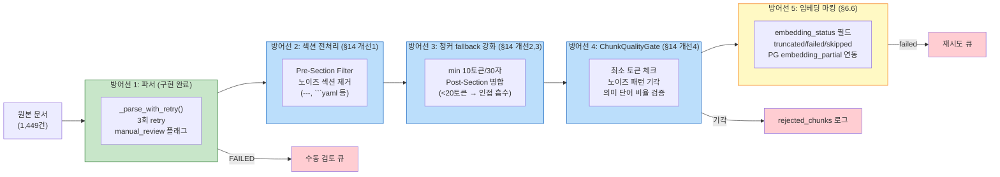

### 15.4 §6.6 마킹 전략 구현 상세 (임베딩 단계)

ETL 3-Phase 보고서 §6.6에서 설계한 3단계를 구체화한다.

#### Stage 1: ES 청크 레벨 마킹 (난이도: 낮음)

ES `knowledge_chunks` 인덱스에 `embedding_status` 필드를 추가한다.

```json
{
  "embedding_status": {
    "type": "keyword",
    "doc_values": true
  },
  "embedding_error_message": {
    "type": "text",
    "index": false
  },
  "original_text_length": {
    "type": "integer"
  }
}
```

| 상태 | 의미 | 발생 조건 |
|------|------|----------|
| `success` | 임베딩 정상 완료 | `dense_vector` 존재 |
| `truncated` | 텍스트 절단 후 임베딩 | `original_text_length > MAX_TEXT_LEN` |
| `failed` | 임베딩 생성 실패 | `embed_batch()` 예외 발생 |
| `skipped` | 의도적 건너뜀 | 빈 텍스트, ChunkQualityGate 기각 |

**수정 대상**: `run_embedding_backfill_v2.py` line 179-184

```python
# Before (현재)
es.bulk(body=bulk_actions, refresh=False)

# After (Stage 1)
for chunk in batch:
    status = "success"
    if len(chunk["text"]) > MAX_TEXT_LEN:
        status = "truncated"
    elif not chunk["text"].strip():
        status = "skipped"

    action["_source"]["embedding_status"] = status
    if status == "truncated":
        action["_source"]["original_text_length"] = len(chunk["text"])

es.bulk(body=bulk_actions, refresh=False)
```

#### Stage 2: PG 문서 레벨 연동 (난이도: 중간)

청크 에러율이 임계치를 초과하면 PG `documents.processing_status`를 갱신한다.

```python
# 문서별 청크 상태 집계
doc_chunk_stats = {}
for doc_id, chunks in grouped_by_doc.items():
    total = len(chunks)
    failed = sum(1 for c in chunks if c["embedding_status"] == "failed")
    skipped = sum(1 for c in chunks if c["embedding_status"] == "skipped")

    error_rate = (failed + skipped) / total if total > 0 else 0

    if error_rate > 0.5:
        # 50% 이상 실패 → embedding_partial
        await update_pg_status(doc_id, "embedding_partial")
    elif error_rate > 0:
        # 일부 실패 → completed (경고 로그)
        logger.warning(f"Doc {doc_id}: {error_rate:.1%} chunks failed/skipped")
```

| 에러율 | PG processing_status | 의미 |
|:------:|:--------------------:|------|
| 0% | `completed` | 모든 청크 임베딩 성공 |
| 0~50% | `completed` (경고 로그) | 일부 실패, 검색 영향 제한적 |
| 50~100% | `embedding_partial` | 문서 검색 품질 저하, 수동 검토 필요 |
| 파싱 실패 | `failed` | 텍스트 추출 불가 |

#### Stage 3: 자동 재시도 큐 + Slack 알림 (난이도: 높음)

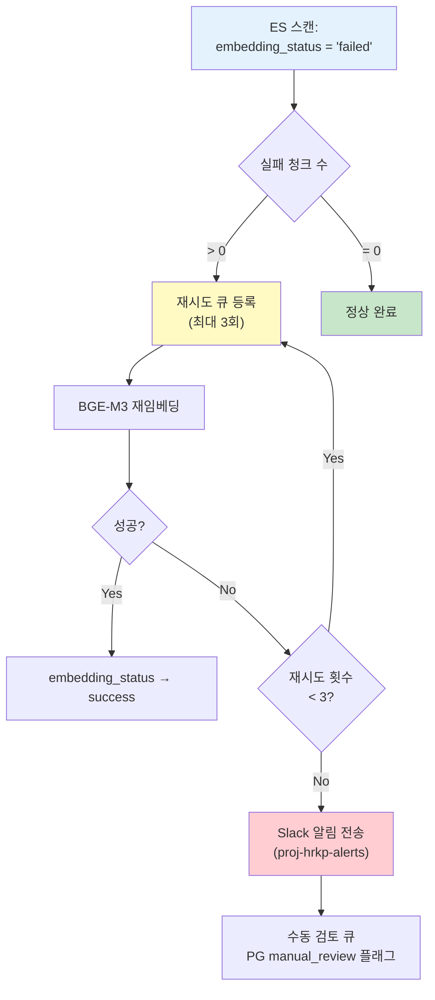

### 15.5 왜 상류 차단(SemanticChunker v2)이 더 중요한가

§6.6 마킹 전략은 "임베딩 실패" 대응이지만, 실제 데이터에서 **임베딩 실패율은 0%**이다. 진짜 문제는 "파싱은 성공했지만 쓰레기 청크를 만들어낸 경우"(Layer 2)이다.

```
문제 규모 비교:
─────────────────────────────────────────────────
Layer 1 (파싱 실패):    11건 / 1,449문서  = 0.8%   → ✅ 이미 해결됨
Layer 2 (청킹 불량):  37,941건 / 96,258청크 = 34.9%  → 🔧 SemanticChunker v2 필요
Layer 3 (임베딩 실패):   0건 / 96,258청크  = 0%     → ✅ 문제 없음
─────────────────────────────────────────────────

→ SemanticChunker v2가 Layer 2를 < 2%로 줄이면,
  §6.6 마킹은 "만일의 경우" 안전망 역할로 충분하다.
```

**결론**:

| 구분 | 전략 | 효과 | 구현 순서 |
|------|------|------|----------|
| **상류 차단** | SemanticChunker v2 (§14 개선 1~4) | 쓰레기 청크 생성 자체를 방지 | **P0 (먼저)** |
| **하류 마킹** | §6.6 embedding_status + PG 연동 | 남은 예외 케이스 추적/재시도 | **P1 (이후)** |
| **모니터링** | Slack 알림 + 수동 검토 큐 | 운영 가시성 확보 | **P2 (안정화 후)** |

### 15.6 구현 우선순위 업데이트

§14.8 우선순위 테이블에 본 섹션의 작업을 통합한다.

| 순위 | 작업 | 관련 섹션 | 난이도 | 효과 | 소요 |
|:----:|------|:---------:|:------:|:----:|:----:|
| **P0** | ~~쓰레기 청크 삭제 (≤3 토큰)~~ | §13.5 | 낮음 | 높음 | ✅ 완료 |
| **P0** | 섹션 전처리 + fallback 강화 | §14 개선 1,2 | 낮음 | 높음 | 1일 |
| **P0** | ChunkQualityGate | §14 개선 4 | 중간 | 높음 | 2일 |
| **P1** | Post-Section 병합 패스 | §14 개선 3 | 중간 | 중간 | 2일 |
| **P1** | chunk_size 600→1000 변경 | §14.5 | 낮음 | 높음 | 실험 2일 |
| **P1** | ES embedding_status 필드 추가 | §15.4 Stage 1 | 낮음 | 중간 | 0.5일 |
| **P1** | PG embedding_partial 연동 | §15.4 Stage 2 | 중간 | 중간 | 1일 |
| **P1** | AI 메타데이터 추출 | §1~§10 | 높음 | 높음 | 2주 |
| **P2** | 전체 Re-Chunking + 재임베딩 | §14.6 | 높음 | 최고 | 25시간+ |
| **P2** | 자동 재시도 큐 + Slack 알림 | §15.4 Stage 3 | 높음 | 낮음 | 2일 |
| **P2** | BGE-Reranker 적용 | - | 중간 | 높음 | 1주 |
