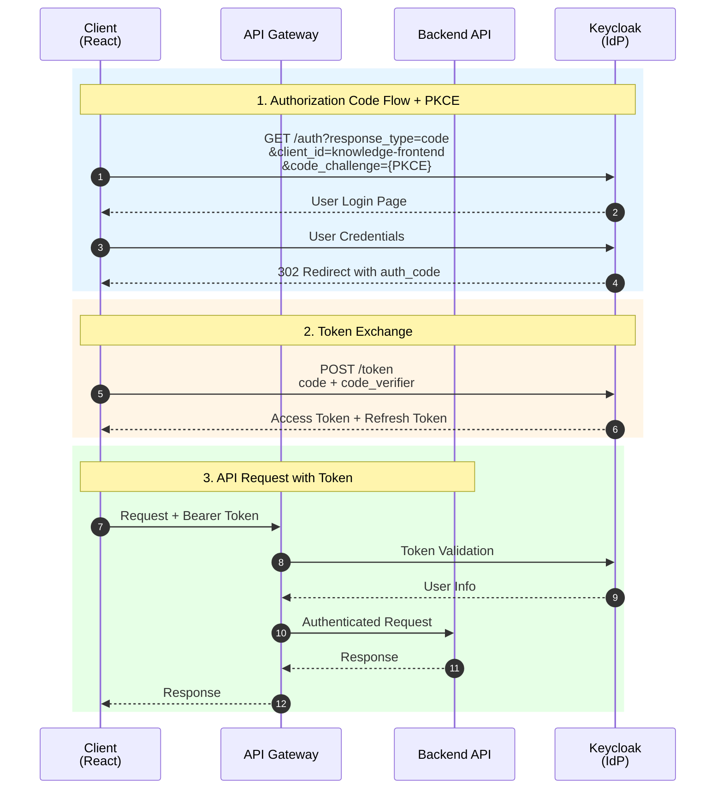
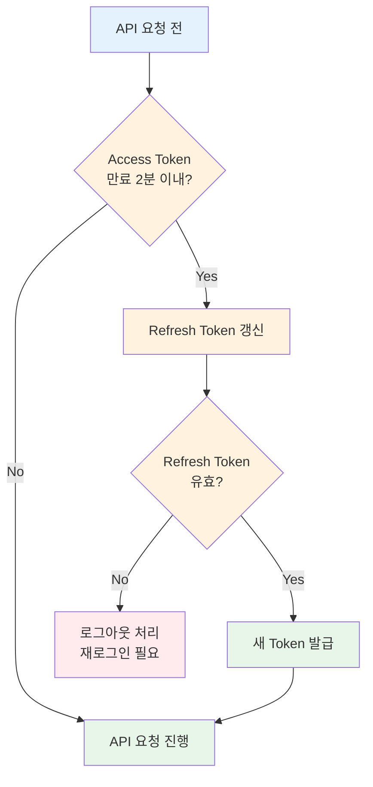
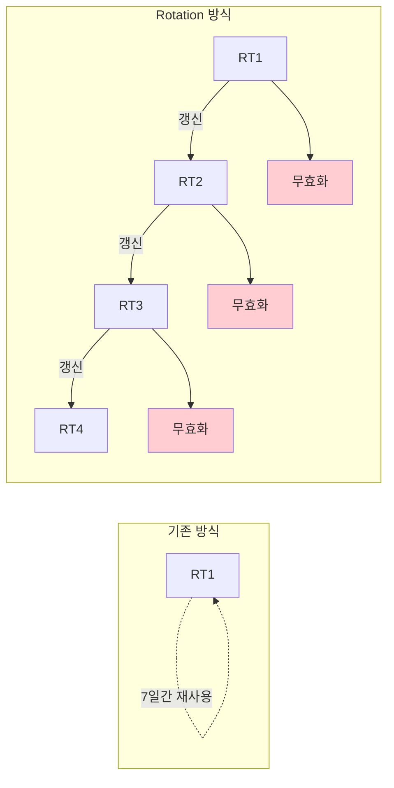
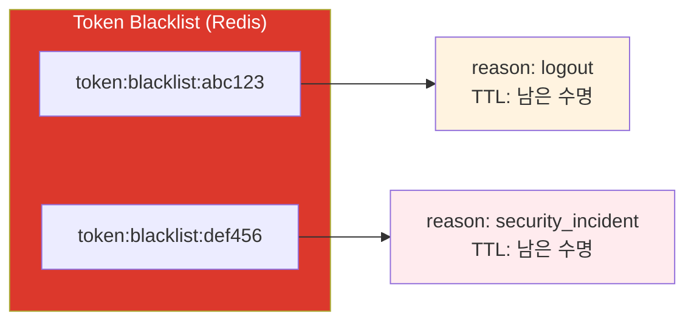

# 인증/권한 관리 상세 설계서
## Authentication & Authorization Detailed Design

**버전**: 1.1
**작성일**: 2026-01-15
**수정일**: 2026-01-17
**상태**: Draft
**관련 문서**:
- [백엔드 구현 계획서](../01_planning/backend_implementation_plan.md) 섹션 7
- [프론트엔드 구현 계획서](../01_planning/frontend_implementation_plan.md) 섹션 2.3, 3.6
- [상세 설계서](./hybrid_rag_platform_detailed_design.md) 섹션 3.6
- [에러 코드 표준](./error_code_standards.md)
- [용어사전](./glossary.md)

---

## 목차

1. [개요](#1-개요)
2. [OAuth 2.0 Provider 선정](#2-oauth-20-provider-선정)
3. [인증 아키텍처](#3-인증-아키텍처)
4. [JWT 토큰 전략](#4-jwt-토큰-전략)
5. [Spring Security 상세 설계](#5-spring-security-상세-설계)
6. [API Gateway 인증 필터](#6-api-gateway-인증-필터)
7. [프론트엔드 인증 플로우](#7-프론트엔드-인증-플로우)
8. [세션 및 로그아웃 관리](#8-세션-및-로그아웃-관리)
9. [권한 관리 (RBAC)](#9-권한-관리-rbac)
   - [9.0 RBAC 개요](#90-rbac-개요)
   - [9.1 역할 계층 구조](#91-역할-계층-구조)
   - [9.2 권한 매트릭스](#92-권한-매트릭스)
   - [9.3 메서드 레벨 보안](#93-메서드-레벨-보안)
   - [9.4 커스텀 보안 서비스](#94-커스텀-보안-서비스)
   - [9.5 RBAC 설정 방법](#95-rbac-설정-방법)
   - [9.6 RBAC 사용 흐름](#96-rbac-사용-흐름)
10. [에러 핸들링](#10-에러-핸들링)
11. [보안 체크리스트](#11-보안-체크리스트)
12. [테스트 케이스](#12-테스트-케이스)
13. [구현 체크리스트](#13-구현-체크리스트)

---

## 1. 개요

### 1.1 목적

본 문서는 사내 지식 검색 시스템의 인증(Authentication) 및 권한(Authorization) 관리에 대한 상세 설계를 정의합니다. 기존 설계서에서 다루지 않은 세부 구현 사항, 보안 고려사항, 에러 처리 등을 명시합니다.

### 1.2 범위

- OAuth 2.0 기반 SSO 연동
- JWT 토큰 발급/검증/갱신
- RBAC 기반 권한 관리
- API Gateway 인증 필터
- 프론트엔드 인증 플로우
- 보안 체크리스트 및 테스트 케이스

### 1.3 용어 정의

| 용어 | 설명 |
|------|------|
| **IdP** | Identity Provider - 사용자 인증을 담당하는 시스템 |
| **SP** | Service Provider - 인증된 사용자에게 서비스를 제공하는 시스템 |
| **Access Token** | 리소스 접근을 위한 단기 토큰 (15분~1시간) |
| **Refresh Token** | Access Token 갱신을 위한 장기 토큰 (7일~30일) |
| **PKCE** | Proof Key for Code Exchange - Authorization Code 탈취 방지 |
| **RBAC** | Role-Based Access Control - 역할 기반 접근 제어 |

---

## 2. OAuth 2.0 Provider 선정

### 2.1 후보 Provider 비교

| 항목 | Keycloak | Azure AD | Okta |
|------|----------|----------|------|
| **라이선스** | Apache 2.0 (무료) | 구독 기반 | 구독 기반 |
| **배포 방식** | Self-hosted / Docker | Cloud (SaaS) | Cloud (SaaS) |
| **초기 비용** | 낮음 (인프라만) | 중간 | 높음 |
| **운영 비용** | 중간 (인프라 관리) | 낮음 (관리형) | 낮음 (관리형) |
| **커스터마이징** | 높음 | 중간 | 중간 |
| **표준 지원** | OIDC, SAML, OAuth 2.0 | OIDC, SAML, OAuth 2.0 | OIDC, SAML, OAuth 2.0 |
| **MFA 지원** | ✅ (플러그인) | ✅ (기본) | ✅ (기본) |
| **기업 통합** | AD/LDAP 연동 | Azure 생태계 통합 | 다양한 앱 통합 |
| **한국어 지원** | △ (커뮤니티) | ✅ | ✅ |
| **SLA** | 자체 관리 | 99.9% | 99.99% |

### 2.2 선정: Keycloak (Primary) + Azure AD (Optional)

**선정 이유:**

1. **비용 효율성**: 오픈소스로 라이선스 비용 없음
2. **유연성**: 커스터마이징 자유도가 높음
3. **표준 준수**: OAuth 2.0, OIDC 완벽 지원
4. **Docker 지원**: 기존 인프라(Docker Compose)와 자연스럽게 통합
5. **기업 연동**: AD/LDAP 연동으로 향후 엔터프라이즈 SSO 확장 가능

**Azure AD 옵션:**

- 고객사가 Microsoft 365를 사용하는 경우 Azure AD 연동 옵션 제공
- Federation 설정으로 Keycloak과 Azure AD 연동 가능

### 2.3 Keycloak 설정 명세

#### 2.3.1 Realm 설정

```yaml
# Keycloak Realm 설정
realm: knowledge-platform
displayName: "사내 지식 검색 시스템"
enabled: true
sslRequired: external
registrationAllowed: false
loginWithEmailAllowed: true
duplicateEmailsAllowed: false
resetPasswordAllowed: true
editUsernameAllowed: false
bruteForceProtected: true

# 토큰 설정
accessTokenLifespan: 900           # 15분
ssoSessionIdleTimeout: 1800        # 30분
ssoSessionMaxLifespan: 36000       # 10시간
offlineSessionIdleTimeout: 2592000 # 30일
accessCodeLifespan: 60             # 1분

# 패스워드 정책
passwordPolicy: "length(8) and digits(1) and upperCase(1) and specialChars(1)"
```

#### 2.3.2 Client 설정

```yaml
# Frontend Client
clientId: knowledge-frontend
protocol: openid-connect
publicClient: true                  # PKCE 사용
standardFlowEnabled: true           # Authorization Code Flow
directAccessGrantsEnabled: false    # Resource Owner Password 비활성화
implicitFlowEnabled: false          # Implicit Flow 비활성화
rootUrl: ${FRONTEND_URL}
baseUrl: /
redirectUris:
  - ${FRONTEND_URL}/*
  - http://localhost:5173/*         # 개발 환경
webOrigins:
  - ${FRONTEND_URL}
  - http://localhost:5173

# Backend Client (서비스 간 통신용)
clientId: knowledge-backend
protocol: openid-connect
publicClient: false
serviceAccountsEnabled: true
clientAuthenticatorType: client-secret
```

#### 2.3.3 역할 설정

```yaml
roles:
  realm:
    - name: USER
      description: "일반 사용자"
    - name: KNOWLEDGE_MANAGER
      description: "지식 관리자"
      composite: true
      composites:
        realm:
          - USER
    - name: ADMIN
      description: "시스템 관리자"
      composite: true
      composites:
        realm:
          - KNOWLEDGE_MANAGER
```

---

## 3. 인증 아키텍처

### 3.1 전체 인증 흐름



### 3.2 컴포넌트별 역할

| 컴포넌트 | 역할 | 기술 |
|----------|------|------|
| **Frontend (React)** | 로그인 UI, 토큰 저장, API 요청 | React, Axios |
| **API Gateway** | JWT 검증, 라우팅, Rate Limiting | Spring Cloud Gateway |
| **User Service** | OAuth 콜백 처리, 토큰 교환, 사용자 관리 | Spring Boot, Spring Security |
| **Keycloak** | 사용자 인증, 토큰 발급, 세션 관리 | Keycloak 24.x |
| **Redis** | 토큰 블랙리스트, 세션 캐시 | Redis 7.x |

---

## 4. JWT 토큰 전략

### 4.1 토큰 구조

#### 4.1.1 Access Token

```json
{
  "header": {
    "alg": "RS256",
    "typ": "JWT",
    "kid": "keycloak-key-id"
  },
  "payload": {
    "exp": 1705200900,
    "iat": 1705200000,
    "jti": "unique-token-id",
    "iss": "https://auth.company.com/realms/knowledge-platform",
    "aud": "account",
    "sub": "user-uuid",
    "typ": "Bearer",
    "azp": "knowledge-frontend",
    "session_state": "session-uuid",
    "acr": "1",
    "allowed-origins": ["http://localhost:5173"],
    "realm_access": {
      "roles": ["USER", "KNOWLEDGE_MANAGER"]
    },
    "resource_access": {
      "knowledge-frontend": {
        "roles": ["view_knowledge", "edit_knowledge"]
      }
    },
    "scope": "openid profile email",
    "sid": "session-id",
    "email_verified": true,
    "name": "홍길동",
    "preferred_username": "hong.gildong",
    "given_name": "길동",
    "family_name": "홍",
    "email": "hong.gildong@company.com",
    "department": "개발팀",
    "employee_id": "EMP001"
  },
  "signature": "..."
}
```

#### 4.1.2 Refresh Token

```json
{
  "header": {
    "alg": "RS256",
    "typ": "JWT"
  },
  "payload": {
    "exp": 1705804800,
    "iat": 1705200000,
    "jti": "refresh-token-id",
    "iss": "https://auth.company.com/realms/knowledge-platform",
    "aud": "https://auth.company.com/realms/knowledge-platform",
    "sub": "user-uuid",
    "typ": "Refresh",
    "azp": "knowledge-frontend",
    "session_state": "session-uuid",
    "scope": "openid profile email"
  },
  "signature": "..."
}
```

### 4.2 토큰 수명 정책

| 토큰 타입 | 수명 | 갱신 조건 | 저장 위치 |
|----------|------|----------|----------|
| **Access Token** | 15분 | 만료 2분 전 자동 갱신 | 메모리 (Frontend) |
| **Refresh Token** | 7일 | Access Token 갱신 시 함께 갱신 (Rotation) | HttpOnly Cookie |
| **Session** | 10시간 (활성) / 30분 (유휴) | 활동 시 연장 | Keycloak 서버 |

### 4.3 토큰 갱신 전략

#### 4.3.1 자동 갱신 로직



#### 4.3.2 Refresh Token Rotation

보안 강화를 위해 Refresh Token 사용 시마다 새로운 Refresh Token을 발급합니다.



**구현:**

```yaml
# Keycloak Client 설정
refreshTokenReuseCount: 0  # Rotation 활성화 (0 = 재사용 불가)
```

### 4.4 토큰 블랙리스트

로그아웃 또는 보안 사고 시 토큰을 즉시 무효화합니다.



**Key Pattern:** `token:blacklist:{jti}`
**Value:** `{ reason: "logout", timestamp: ... }`
**TTL:** Access Token의 남은 수명

---

## 5. Spring Security 상세 설계

### 5.1 보안 설정 (User Service)

```java
@Configuration
@EnableWebSecurity
@EnableMethodSecurity(prePostEnabled = true)
public class SecurityConfig {

    private final JwtAuthenticationFilter jwtAuthenticationFilter;
    private final CustomOAuth2UserService customOAuth2UserService;
    private final OAuth2AuthenticationSuccessHandler successHandler;
    private final OAuth2AuthenticationFailureHandler failureHandler;

    @Bean
    public SecurityFilterChain filterChain(HttpSecurity http) throws Exception {
        http
            // CSRF 비활성화 (Stateless JWT 사용)
            .csrf(csrf -> csrf.disable())

            // CORS 설정
            .cors(cors -> cors.configurationSource(corsConfigurationSource()))

            // 세션 관리 (Stateless)
            .sessionManagement(session ->
                session.sessionCreationPolicy(SessionCreationPolicy.STATELESS))

            // 요청 권한 설정
            .authorizeHttpRequests(auth -> auth
                // 공개 엔드포인트
                .requestMatchers(
                    "/oauth2/**",
                    "/api/v1/auth/**",
                    "/actuator/health",
                    "/swagger-ui/**",
                    "/v3/api-docs/**"
                ).permitAll()

                // 관리자 전용
                .requestMatchers("/api/v1/admin/**").hasRole("ADMIN")

                // 지식 관리자 이상
                .requestMatchers(HttpMethod.DELETE, "/api/v1/knowledge/**")
                    .hasAnyRole("KNOWLEDGE_MANAGER", "ADMIN")
                .requestMatchers(HttpMethod.PUT, "/api/v1/knowledge/*/approve")
                    .hasAnyRole("KNOWLEDGE_MANAGER", "ADMIN")

                // 인증된 사용자
                .anyRequest().authenticated()
            )

            // OAuth2 로그인 설정
            .oauth2Login(oauth2 -> oauth2
                .authorizationEndpoint(endpoint ->
                    endpoint.baseUri("/oauth2/authorization"))
                .redirectionEndpoint(endpoint ->
                    endpoint.baseUri("/login/oauth2/code/*"))
                .userInfoEndpoint(userInfo ->
                    userInfo.userService(customOAuth2UserService))
                .successHandler(successHandler)
                .failureHandler(failureHandler)
            )

            // JWT 필터 추가
            .addFilterBefore(jwtAuthenticationFilter,
                UsernamePasswordAuthenticationFilter.class)

            // 예외 처리
            .exceptionHandling(exception -> exception
                .authenticationEntryPoint(new CustomAuthenticationEntryPoint())
                .accessDeniedHandler(new CustomAccessDeniedHandler())
            );

        return http.build();
    }

    @Bean
    public CorsConfigurationSource corsConfigurationSource() {
        CorsConfiguration configuration = new CorsConfiguration();
        configuration.setAllowedOrigins(Arrays.asList(
            "http://localhost:5173",
            "https://knowledge.company.com"
        ));
        configuration.setAllowedMethods(Arrays.asList(
            "GET", "POST", "PUT", "DELETE", "PATCH", "OPTIONS"
        ));
        configuration.setAllowedHeaders(Arrays.asList("*"));
        configuration.setAllowCredentials(true);
        configuration.setMaxAge(3600L);

        UrlBasedCorsConfigurationSource source = new UrlBasedCorsConfigurationSource();
        source.registerCorsConfiguration("/**", configuration);
        return source;
    }
}
```

### 5.2 JWT 인증 필터

```java
@Component
@RequiredArgsConstructor
public class JwtAuthenticationFilter extends OncePerRequestFilter {

    private final JwtTokenProvider jwtTokenProvider;
    private final TokenBlacklistService tokenBlacklistService;

    @Override
    protected void doFilterInternal(
            HttpServletRequest request,
            HttpServletResponse response,
            FilterChain filterChain) throws ServletException, IOException {

        try {
            String token = resolveToken(request);

            if (token != null) {
                // 1. 블랙리스트 확인
                if (tokenBlacklistService.isBlacklisted(token)) {
                    throw new InvalidTokenException("Token has been revoked");
                }

                // 2. 토큰 검증
                if (jwtTokenProvider.validateToken(token)) {
                    // 3. 인증 정보 설정
                    Authentication authentication =
                        jwtTokenProvider.getAuthentication(token);
                    SecurityContextHolder.getContext()
                        .setAuthentication(authentication);
                }
            }
        } catch (InvalidTokenException e) {
            request.setAttribute("exception", e);
        } catch (ExpiredJwtException e) {
            request.setAttribute("exception",
                new TokenExpiredException("Access token has expired"));
        }

        filterChain.doFilter(request, response);
    }

    private String resolveToken(HttpServletRequest request) {
        String bearerToken = request.getHeader("Authorization");
        if (StringUtils.hasText(bearerToken) && bearerToken.startsWith("Bearer ")) {
            return bearerToken.substring(7);
        }
        return null;
    }

    @Override
    protected boolean shouldNotFilter(HttpServletRequest request) {
        String path = request.getServletPath();
        return path.startsWith("/oauth2/") ||
               path.startsWith("/api/v1/auth/") ||
               path.equals("/actuator/health");
    }
}
```

### 5.3 JWT 토큰 Provider

```java
@Component
@RequiredArgsConstructor
public class JwtTokenProvider {

    private final JwtDecoder jwtDecoder;
    private final UserDetailsService userDetailsService;

    @Value("${jwt.issuer}")
    private String issuer;

    /**
     * 토큰 검증
     */
    public boolean validateToken(String token) {
        try {
            Jwt jwt = jwtDecoder.decode(token);

            // Issuer 검증
            if (!issuer.equals(jwt.getIssuer().toString())) {
                return false;
            }

            // 만료 시간 검증
            Instant expiration = jwt.getExpiresAt();
            if (expiration == null || expiration.isBefore(Instant.now())) {
                return false;
            }

            return true;
        } catch (JwtException e) {
            return false;
        }
    }

    /**
     * 토큰에서 인증 정보 추출
     */
    public Authentication getAuthentication(String token) {
        Jwt jwt = jwtDecoder.decode(token);

        // 사용자 정보 추출
        String userId = jwt.getSubject();
        String email = jwt.getClaimAsString("email");
        String name = jwt.getClaimAsString("name");

        // 역할 추출
        Map<String, Object> realmAccess = jwt.getClaim("realm_access");
        List<String> roles = (List<String>) realmAccess.get("roles");

        List<GrantedAuthority> authorities = roles.stream()
            .map(role -> new SimpleGrantedAuthority("ROLE_" + role))
            .collect(Collectors.toList());

        // Custom Principal 생성
        UserPrincipal principal = UserPrincipal.builder()
            .id(userId)
            .email(email)
            .name(name)
            .roles(roles)
            .build();

        return new UsernamePasswordAuthenticationToken(
            principal, null, authorities);
    }

    /**
     * 토큰에서 JTI 추출
     */
    public String getJti(String token) {
        Jwt jwt = jwtDecoder.decode(token);
        return jwt.getId();
    }

    /**
     * 토큰 만료 시간 추출
     */
    public Instant getExpiration(String token) {
        Jwt jwt = jwtDecoder.decode(token);
        return jwt.getExpiresAt();
    }
}
```

### 5.4 사용자 정보 서비스

```java
@Service
@RequiredArgsConstructor
public class CustomOAuth2UserService implements OAuth2UserService<OidcUserRequest, OidcUser> {

    private final UserRepository userRepository;
    private final UserMapper userMapper;

    @Override
    @Transactional
    public OidcUser loadUser(OidcUserRequest userRequest) throws OAuth2AuthenticationException {
        OidcUserService delegate = new OidcUserService();
        OidcUser oidcUser = delegate.loadUser(userRequest);

        // 사용자 정보 추출
        String email = oidcUser.getEmail();
        String name = oidcUser.getFullName();
        String sub = oidcUser.getSubject();

        // DB에서 사용자 조회 또는 생성
        User user = userRepository.findByOauthId(sub)
            .orElseGet(() -> createNewUser(oidcUser));

        // 마지막 로그인 시간 업데이트
        user.updateLastLoginAt();
        userRepository.save(user);

        return oidcUser;
    }

    private User createNewUser(OidcUser oidcUser) {
        User newUser = User.builder()
            .oauthId(oidcUser.getSubject())
            .email(oidcUser.getEmail())
            .name(oidcUser.getFullName())
            .department(oidcUser.getClaimAsString("department"))
            .employeeId(oidcUser.getClaimAsString("employee_id"))
            .role(UserRole.USER)
            .status(UserStatus.ACTIVE)
            .build();

        return userRepository.save(newUser);
    }
}
```

---

## 6. API Gateway 인증 필터

### 6.1 Gateway Security 설정

```java
@Configuration
@EnableWebFluxSecurity
public class GatewaySecurityConfig {

    @Bean
    public SecurityWebFilterChain securityWebFilterChain(ServerHttpSecurity http) {
        return http
            .csrf(ServerHttpSecurity.CsrfSpec::disable)
            .cors(cors -> cors.configurationSource(corsConfigurationSource()))
            .authorizeExchange(exchanges -> exchanges
                // 공개 경로
                .pathMatchers(
                    "/oauth2/**",
                    "/api/v1/auth/**",
                    "/actuator/health"
                ).permitAll()
                // 나머지는 인증 필요
                .anyExchange().authenticated()
            )
            .oauth2ResourceServer(oauth2 -> oauth2
                .jwt(jwt -> jwt
                    .jwtDecoder(jwtDecoder())
                    .jwtAuthenticationConverter(jwtAuthenticationConverter())
                )
            )
            .build();
    }

    @Bean
    public ReactiveJwtDecoder jwtDecoder() {
        return NimbusReactiveJwtDecoder
            .withJwkSetUri("${keycloak.jwk-set-uri}")
            .build();
    }

    @Bean
    public Converter<Jwt, Mono<AbstractAuthenticationToken>> jwtAuthenticationConverter() {
        JwtGrantedAuthoritiesConverter grantedAuthoritiesConverter =
            new JwtGrantedAuthoritiesConverter();
        grantedAuthoritiesConverter.setAuthorityPrefix("ROLE_");
        grantedAuthoritiesConverter.setAuthoritiesClaimName("realm_access.roles");

        JwtAuthenticationConverter jwtAuthenticationConverter =
            new JwtAuthenticationConverter();
        jwtAuthenticationConverter.setJwtGrantedAuthoritiesConverter(
            grantedAuthoritiesConverter);

        return new ReactiveJwtAuthenticationConverterAdapter(
            jwtAuthenticationConverter);
    }
}
```

### 6.2 JWT 검증 필터 (WebFlux)

```java
@Component
@RequiredArgsConstructor
public class JwtValidationGatewayFilter implements GlobalFilter, Ordered {

    private final ReactiveJwtDecoder jwtDecoder;
    private final TokenBlacklistService tokenBlacklistService;

    @Override
    public Mono<Void> filter(ServerWebExchange exchange, GatewayFilterChain chain) {
        ServerHttpRequest request = exchange.getRequest();
        String path = request.getPath().value();

        // 공개 경로는 스킵
        if (isPublicPath(path)) {
            return chain.filter(exchange);
        }

        // Authorization 헤더 확인
        String authHeader = request.getHeaders().getFirst(HttpHeaders.AUTHORIZATION);
        if (authHeader == null || !authHeader.startsWith("Bearer ")) {
            return unauthorizedResponse(exchange, "Missing or invalid Authorization header");
        }

        String token = authHeader.substring(7);

        // 블랙리스트 확인
        return tokenBlacklistService.isBlacklisted(token)
            .flatMap(isBlacklisted -> {
                if (isBlacklisted) {
                    return unauthorizedResponse(exchange, "Token has been revoked");
                }

                // JWT 검증
                return jwtDecoder.decode(token)
                    .flatMap(jwt -> {
                        // 사용자 정보를 헤더에 추가하여 다운스트림 서비스에 전달
                        ServerHttpRequest mutatedRequest = request.mutate()
                            .header("X-User-Id", jwt.getSubject())
                            .header("X-User-Email", jwt.getClaimAsString("email"))
                            .header("X-User-Roles", String.join(",",
                                getRoles(jwt)))
                            .build();

                        return chain.filter(exchange.mutate()
                            .request(mutatedRequest)
                            .build());
                    })
                    .onErrorResume(JwtException.class, e ->
                        unauthorizedResponse(exchange, "Invalid token: " + e.getMessage()));
            });
    }

    private boolean isPublicPath(String path) {
        return path.startsWith("/oauth2/") ||
               path.startsWith("/api/v1/auth/") ||
               path.equals("/actuator/health");
    }

    private List<String> getRoles(Jwt jwt) {
        Map<String, Object> realmAccess = jwt.getClaim("realm_access");
        if (realmAccess == null) {
            return Collections.emptyList();
        }
        return (List<String>) realmAccess.get("roles");
    }

    private Mono<Void> unauthorizedResponse(ServerWebExchange exchange, String message) {
        exchange.getResponse().setStatusCode(HttpStatus.UNAUTHORIZED);
        exchange.getResponse().getHeaders()
            .setContentType(MediaType.APPLICATION_JSON);

        ErrorResponse error = ErrorResponse.builder()
            .code("AUTH_001")
            .message(message)
            .timestamp(Instant.now())
            .build();

        byte[] bytes = new ObjectMapper().writeValueAsBytes(error);
        DataBuffer buffer = exchange.getResponse()
            .bufferFactory()
            .wrap(bytes);

        return exchange.getResponse().writeWith(Mono.just(buffer));
    }

    @Override
    public int getOrder() {
        return -100; // 높은 우선순위
    }
}
```

### 6.3 Rate Limiting 설정

```java
@Configuration
public class RateLimitConfig {

    @Bean
    public KeyResolver userKeyResolver() {
        return exchange -> {
            String userId = exchange.getRequest().getHeaders()
                .getFirst("X-User-Id");
            return Mono.just(userId != null ? userId : "anonymous");
        };
    }

    @Bean
    public RedisRateLimiter redisRateLimiter() {
        // 초당 10개 요청, 버스트 20개
        return new RedisRateLimiter(10, 20);
    }
}
```

```yaml
# application.yml - Gateway 라우팅 설정
spring:
  cloud:
    gateway:
      routes:
        - id: knowledge-service
          uri: lb://KNOWLEDGE-SERVICE
          predicates:
            - Path=/api/v1/knowledge/**
          filters:
            - name: RequestRateLimiter
              args:
                redis-rate-limiter.replenishRate: 10
                redis-rate-limiter.burstCapacity: 20
                key-resolver: "#{@userKeyResolver}"
```

---

## 7. 프론트엔드 인증 플로우

### 7.1 인증 상태 관리

```typescript
// src/store/slices/authSlice.ts
import { createSlice, createAsyncThunk, PayloadAction } from '@reduxjs/toolkit';

interface AuthState {
  isAuthenticated: boolean;
  user: User | null;
  accessToken: string | null;
  accessTokenExpiry: number | null;
  isLoading: boolean;
  error: string | null;
}

const initialState: AuthState = {
  isAuthenticated: false,
  user: null,
  accessToken: null,
  accessTokenExpiry: null,
  isLoading: false,
  error: null,
};

// PKCE Code Verifier 생성
const generateCodeVerifier = (): string => {
  const array = new Uint8Array(32);
  crypto.getRandomValues(array);
  return base64UrlEncode(array);
};

// PKCE Code Challenge 생성 (SHA-256)
const generateCodeChallenge = async (verifier: string): Promise<string> => {
  const encoder = new TextEncoder();
  const data = encoder.encode(verifier);
  const digest = await crypto.subtle.digest('SHA-256', data);
  return base64UrlEncode(new Uint8Array(digest));
};

// 로그인 시작
export const initiateLogin = createAsyncThunk(
  'auth/initiateLogin',
  async (_, { rejectWithValue }) => {
    try {
      // PKCE 값 생성
      const codeVerifier = generateCodeVerifier();
      const codeChallenge = await generateCodeChallenge(codeVerifier);
      const state = generateCodeVerifier(); // state도 랜덤하게

      // 세션 스토리지에 PKCE 값 저장 (콜백에서 사용)
      sessionStorage.setItem('pkce_code_verifier', codeVerifier);
      sessionStorage.setItem('oauth_state', state);

      // OAuth 인증 URL 구성
      const authUrl = new URL(
        `${import.meta.env.VITE_KEYCLOAK_URL}/realms/${import.meta.env.VITE_KEYCLOAK_REALM}/protocol/openid-connect/auth`
      );
      authUrl.searchParams.set('client_id', import.meta.env.VITE_OAUTH_CLIENT_ID);
      authUrl.searchParams.set('redirect_uri', import.meta.env.VITE_OAUTH_REDIRECT_URI);
      authUrl.searchParams.set('response_type', 'code');
      authUrl.searchParams.set('scope', 'openid profile email');
      authUrl.searchParams.set('state', state);
      authUrl.searchParams.set('code_challenge', codeChallenge);
      authUrl.searchParams.set('code_challenge_method', 'S256');

      // 리다이렉트
      window.location.href = authUrl.toString();
    } catch (error) {
      return rejectWithValue('Failed to initiate login');
    }
  }
);

// OAuth 콜백 처리
export const handleOAuthCallback = createAsyncThunk(
  'auth/handleOAuthCallback',
  async ({ code, state }: { code: string; state: string }, { rejectWithValue }) => {
    try {
      // State 검증
      const savedState = sessionStorage.getItem('oauth_state');
      if (state !== savedState) {
        throw new Error('Invalid state parameter');
      }

      // Code Verifier 가져오기
      const codeVerifier = sessionStorage.getItem('pkce_code_verifier');
      if (!codeVerifier) {
        throw new Error('Missing code verifier');
      }

      // 토큰 교환 (백엔드를 통해)
      const response = await authApi.exchangeToken({
        code,
        codeVerifier,
        redirectUri: import.meta.env.VITE_OAUTH_REDIRECT_URI,
      });

      // 세션 스토리지 정리
      sessionStorage.removeItem('pkce_code_verifier');
      sessionStorage.removeItem('oauth_state');

      return response.data;
    } catch (error: any) {
      return rejectWithValue(error.response?.data?.message || 'Authentication failed');
    }
  }
);

// 토큰 갱신
export const refreshAccessToken = createAsyncThunk(
  'auth/refreshToken',
  async (_, { rejectWithValue }) => {
    try {
      // Refresh Token은 HttpOnly 쿠키로 자동 전송
      const response = await authApi.refreshToken();
      return response.data;
    } catch (error: any) {
      return rejectWithValue('Token refresh failed');
    }
  }
);

// 로그아웃
export const logout = createAsyncThunk(
  'auth/logout',
  async (_, { rejectWithValue }) => {
    try {
      await authApi.logout();
      // Keycloak 로그아웃 URL로 리다이렉트
      window.location.href = `${import.meta.env.VITE_KEYCLOAK_URL}/realms/${import.meta.env.VITE_KEYCLOAK_REALM}/protocol/openid-connect/logout?redirect_uri=${encodeURIComponent(window.location.origin)}`;
    } catch (error) {
      return rejectWithValue('Logout failed');
    }
  }
);

const authSlice = createSlice({
  name: 'auth',
  initialState,
  reducers: {
    clearError: (state) => {
      state.error = null;
    },
    setAccessToken: (state, action: PayloadAction<{ token: string; expiry: number }>) => {
      state.accessToken = action.payload.token;
      state.accessTokenExpiry = action.payload.expiry;
    },
  },
  extraReducers: (builder) => {
    builder
      // 콜백 처리
      .addCase(handleOAuthCallback.pending, (state) => {
        state.isLoading = true;
        state.error = null;
      })
      .addCase(handleOAuthCallback.fulfilled, (state, action) => {
        state.isLoading = false;
        state.isAuthenticated = true;
        state.user = action.payload.user;
        state.accessToken = action.payload.accessToken;
        state.accessTokenExpiry = action.payload.accessTokenExpiry;
      })
      .addCase(handleOAuthCallback.rejected, (state, action) => {
        state.isLoading = false;
        state.error = action.payload as string;
      })

      // 토큰 갱신
      .addCase(refreshAccessToken.fulfilled, (state, action) => {
        state.accessToken = action.payload.accessToken;
        state.accessTokenExpiry = action.payload.accessTokenExpiry;
      })
      .addCase(refreshAccessToken.rejected, (state) => {
        // 갱신 실패 시 로그아웃
        state.isAuthenticated = false;
        state.user = null;
        state.accessToken = null;
        state.accessTokenExpiry = null;
      })

      // 로그아웃
      .addCase(logout.fulfilled, (state) => {
        state.isAuthenticated = false;
        state.user = null;
        state.accessToken = null;
        state.accessTokenExpiry = null;
      });
  },
});

export const { clearError, setAccessToken } = authSlice.actions;
export default authSlice.reducer;
```

### 7.2 Axios 인터셉터

```typescript
// src/services/apiClient.ts
import axios from 'axios';
import { store } from '@/store';
import { refreshAccessToken, logout } from '@/store/slices/authSlice';

const apiClient = axios.create({
  baseURL: import.meta.env.VITE_API_BASE_URL,
  timeout: 30000,
  withCredentials: true, // HttpOnly 쿠키 전송을 위해
});

// 토큰 갱신 중 요청 대기열
let isRefreshing = false;
let failedQueue: Array<{
  resolve: (value?: unknown) => void;
  reject: (reason?: any) => void;
}> = [];

const processQueue = (error: any = null) => {
  failedQueue.forEach((promise) => {
    if (error) {
      promise.reject(error);
    } else {
      promise.resolve();
    }
  });
  failedQueue = [];
};

// 요청 인터셉터
apiClient.interceptors.request.use(
  async (config) => {
    const { accessToken, accessTokenExpiry } = store.getState().auth;

    if (accessToken) {
      // 토큰 만료 2분 전이면 미리 갱신
      const now = Date.now();
      const twoMinutes = 2 * 60 * 1000;

      if (accessTokenExpiry && accessTokenExpiry - now < twoMinutes) {
        if (!isRefreshing) {
          isRefreshing = true;
          try {
            await store.dispatch(refreshAccessToken()).unwrap();
          } catch (error) {
            // 갱신 실패 시 로그아웃
            store.dispatch(logout());
            throw error;
          } finally {
            isRefreshing = false;
          }
        }
      }

      const currentToken = store.getState().auth.accessToken;
      config.headers.Authorization = `Bearer ${currentToken}`;
    }

    return config;
  },
  (error) => Promise.reject(error)
);

// 응답 인터셉터
apiClient.interceptors.response.use(
  (response) => response,
  async (error) => {
    const originalRequest = error.config;

    // 401 에러이고 재시도하지 않은 경우
    if (error.response?.status === 401 && !originalRequest._retry) {
      if (isRefreshing) {
        // 이미 갱신 중이면 대기열에 추가
        return new Promise((resolve, reject) => {
          failedQueue.push({ resolve, reject });
        })
          .then(() => {
            originalRequest.headers.Authorization =
              `Bearer ${store.getState().auth.accessToken}`;
            return apiClient(originalRequest);
          })
          .catch((err) => Promise.reject(err));
      }

      originalRequest._retry = true;
      isRefreshing = true;

      try {
        await store.dispatch(refreshAccessToken()).unwrap();
        processQueue();

        originalRequest.headers.Authorization =
          `Bearer ${store.getState().auth.accessToken}`;
        return apiClient(originalRequest);
      } catch (refreshError) {
        processQueue(refreshError);
        store.dispatch(logout());
        return Promise.reject(refreshError);
      } finally {
        isRefreshing = false;
      }
    }

    return Promise.reject(error);
  }
);

export default apiClient;
```

### 7.3 인증 라우터 가드

```typescript
// src/components/auth/ProtectedRoute.tsx
import { Navigate, useLocation } from 'react-router-dom';
import { useAppSelector } from '@/store/hooks';

interface ProtectedRouteProps {
  children: React.ReactNode;
  requiredRoles?: string[];
}

export const ProtectedRoute: React.FC<ProtectedRouteProps> = ({
  children,
  requiredRoles = [],
}) => {
  const location = useLocation();
  const { isAuthenticated, user, isLoading } = useAppSelector((state) => state.auth);

  // 로딩 중
  if (isLoading) {
    return <LoadingSpinner />;
  }

  // 미인증
  if (!isAuthenticated) {
    return <Navigate to="/login" state={{ from: location }} replace />;
  }

  // 권한 확인
  if (requiredRoles.length > 0) {
    const hasRequiredRole = requiredRoles.some((role) =>
      user?.roles.includes(role)
    );

    if (!hasRequiredRole) {
      return <Navigate to="/unauthorized" replace />;
    }
  }

  return <>{children}</>;
};

// 사용 예시
// <ProtectedRoute requiredRoles={['ADMIN']}>
//   <AdminPage />
// </ProtectedRoute>
```

### 7.4 권한 기반 UI 렌더링

```typescript
// src/hooks/usePermission.ts
import { useAppSelector } from '@/store/hooks';

type Permission =
  | 'knowledge:read'
  | 'knowledge:write'
  | 'knowledge:delete'
  | 'knowledge:approve'
  | 'user:manage'
  | 'system:admin';

const ROLE_PERMISSIONS: Record<string, Permission[]> = {
  USER: ['knowledge:read', 'knowledge:write'],
  KNOWLEDGE_MANAGER: ['knowledge:read', 'knowledge:write', 'knowledge:delete', 'knowledge:approve'],
  ADMIN: ['knowledge:read', 'knowledge:write', 'knowledge:delete', 'knowledge:approve', 'user:manage', 'system:admin'],
};

export const usePermission = () => {
  const { user } = useAppSelector((state) => state.auth);

  const hasPermission = (permission: Permission): boolean => {
    if (!user?.roles) return false;

    return user.roles.some((role) => {
      const permissions = ROLE_PERMISSIONS[role] || [];
      return permissions.includes(permission);
    });
  };

  const hasAnyPermission = (permissions: Permission[]): boolean => {
    return permissions.some((permission) => hasPermission(permission));
  };

  const hasAllPermissions = (permissions: Permission[]): boolean => {
    return permissions.every((permission) => hasPermission(permission));
  };

  return { hasPermission, hasAnyPermission, hasAllPermissions };
};

// 사용 예시
// const { hasPermission } = usePermission();
// {hasPermission('knowledge:delete') && <DeleteButton />}
```

```typescript
// src/components/auth/PermissionGate.tsx
import { usePermission } from '@/hooks/usePermission';

interface PermissionGateProps {
  permission: Permission | Permission[];
  requireAll?: boolean;
  fallback?: React.ReactNode;
  children: React.ReactNode;
}

export const PermissionGate: React.FC<PermissionGateProps> = ({
  permission,
  requireAll = false,
  fallback = null,
  children,
}) => {
  const { hasPermission, hasAnyPermission, hasAllPermissions } = usePermission();

  const permissions = Array.isArray(permission) ? permission : [permission];
  const hasAccess = requireAll
    ? hasAllPermissions(permissions)
    : hasAnyPermission(permissions);

  return hasAccess ? <>{children}</> : <>{fallback}</>;
};

// 사용 예시
// <PermissionGate permission="knowledge:delete">
//   <DeleteButton onClick={handleDelete} />
// </PermissionGate>
```

---

## 8. 세션 및 로그아웃 관리

### 8.1 로그아웃 유형

| 유형 | 트리거 | 동작 | 사용 케이스 |
|------|--------|------|------------|
| **명시적 로그아웃** | 사용자 클릭 | 전체 세션 종료 | 사용자가 직접 로그아웃 |
| **자동 로그아웃** | 토큰 만료 | 재로그인 요청 | Refresh Token 만료 |
| **강제 로그아웃** | 관리자 조치 | 즉시 세션 종료 | 보안 사고, 권한 변경 |
| **Single Logout** | SSO 로그아웃 | 모든 앱 세션 종료 | IdP에서 로그아웃 |

### 8.2 로그아웃 플로우

```
┌─────────────────────────────────────────────────────────────────┐
│                    Logout Flow                                   │
└─────────────────────────────────────────────────────────────────┘

  [사용자]                [Frontend]              [Backend]           [Keycloak]
     │                       │                      │                    │
     │  (1) 로그아웃 클릭    │                      │                    │
     │ ─────────────────────>│                      │                    │
     │                       │                      │                    │
     │                       │  (2) 로그아웃 요청   │                    │
     │                       │ ────────────────────>│                    │
     │                       │                      │                    │
     │                       │                      │  (3) 토큰 무효화   │
     │                       │                      │ ──────────────────>│
     │                       │                      │                    │
     │                       │                      │  (4) 블랙리스트    │
     │                       │                      │     등록 (Redis)   │
     │                       │                      │                    │
     │                       │  (5) 성공 응답       │                    │
     │                       │ <────────────────────│                    │
     │                       │                      │                    │
     │                       │  (6) 메모리 정리     │                    │
     │                       │     (토큰, 상태)     │                    │
     │                       │                      │                    │
     │                       │  (7) Keycloak        │                    │
     │                       │     로그아웃 URL     │                    │
     │                       │ ────────────────────────────────────────>│
     │                       │                      │                    │
     │  (8) 로그인 페이지    │                      │                    │
     │ <─────────────────────────────────────────────────────────────────│
     │                       │                      │                    │
```

### 8.3 백엔드 로그아웃 처리

```java
@RestController
@RequestMapping("/api/v1/auth")
@RequiredArgsConstructor
public class AuthController {

    private final TokenBlacklistService tokenBlacklistService;
    private final KeycloakService keycloakService;

    @PostMapping("/logout")
    public ResponseEntity<Void> logout(
            @RequestHeader("Authorization") String authHeader,
            HttpServletRequest request,
            HttpServletResponse response) {

        String token = authHeader.substring(7);

        // 1. Access Token 블랙리스트 등록
        tokenBlacklistService.addToBlacklist(token);

        // 2. Keycloak 세션 종료 (선택)
        // keycloakService.logoutUser(token);

        // 3. Refresh Token 쿠키 삭제
        Cookie refreshCookie = new Cookie("refresh_token", null);
        refreshCookie.setMaxAge(0);
        refreshCookie.setPath("/");
        refreshCookie.setHttpOnly(true);
        refreshCookie.setSecure(true);
        response.addCookie(refreshCookie);

        return ResponseEntity.ok().build();
    }
}
```

### 8.4 토큰 블랙리스트 서비스

```java
@Service
@RequiredArgsConstructor
public class TokenBlacklistService {

    private final StringRedisTemplate redisTemplate;
    private final JwtTokenProvider jwtTokenProvider;

    private static final String BLACKLIST_PREFIX = "token:blacklist:";

    /**
     * 토큰을 블랙리스트에 추가
     */
    public void addToBlacklist(String token) {
        String jti = jwtTokenProvider.getJti(token);
        Instant expiration = jwtTokenProvider.getExpiration(token);

        // 토큰 만료까지 남은 시간 계산
        long ttlSeconds = Duration.between(Instant.now(), expiration).getSeconds();
        if (ttlSeconds <= 0) {
            return; // 이미 만료된 토큰
        }

        String key = BLACKLIST_PREFIX + jti;
        redisTemplate.opsForValue().set(
            key,
            Instant.now().toString(),
            Duration.ofSeconds(ttlSeconds)
        );
    }

    /**
     * 토큰이 블랙리스트에 있는지 확인
     */
    public boolean isBlacklisted(String token) {
        String jti = jwtTokenProvider.getJti(token);
        String key = BLACKLIST_PREFIX + jti;
        return Boolean.TRUE.equals(redisTemplate.hasKey(key));
    }

    /**
     * 토큰이 블랙리스트에 있는지 확인 (Reactive)
     */
    public Mono<Boolean> isBlacklistedReactive(String token) {
        return Mono.fromCallable(() -> isBlacklisted(token));
    }
}
```

### 8.5 유휴 세션 타임아웃

```typescript
// src/hooks/useIdleTimeout.ts
import { useEffect, useRef } from 'react';
import { useAppDispatch } from '@/store/hooks';
import { logout } from '@/store/slices/authSlice';

const IDLE_TIMEOUT = 30 * 60 * 1000; // 30분
const WARNING_BEFORE = 5 * 60 * 1000; // 5분 전 경고

export const useIdleTimeout = () => {
  const dispatch = useAppDispatch();
  const timeoutRef = useRef<NodeJS.Timeout>();
  const warningRef = useRef<NodeJS.Timeout>();

  const resetTimer = () => {
    if (timeoutRef.current) clearTimeout(timeoutRef.current);
    if (warningRef.current) clearTimeout(warningRef.current);

    // 경고 타이머
    warningRef.current = setTimeout(() => {
      // 세션 만료 경고 표시
      showSessionExpiryWarning();
    }, IDLE_TIMEOUT - WARNING_BEFORE);

    // 로그아웃 타이머
    timeoutRef.current = setTimeout(() => {
      dispatch(logout());
    }, IDLE_TIMEOUT);
  };

  useEffect(() => {
    const events = ['mousedown', 'keydown', 'touchstart', 'scroll'];

    const handleActivity = () => resetTimer();

    events.forEach((event) => {
      document.addEventListener(event, handleActivity);
    });

    resetTimer();

    return () => {
      events.forEach((event) => {
        document.removeEventListener(event, handleActivity);
      });
      if (timeoutRef.current) clearTimeout(timeoutRef.current);
      if (warningRef.current) clearTimeout(warningRef.current);
    };
  }, []);
};
```

---

## 9. 권한 관리 (RBAC)

### 9.0 RBAC 개요

**RBAC (Role-Based Access Control)** 은 사용자에게 역할(Role)을 할당하고, 역할에 권한(Permission)을 부여하여 접근을 제어하는 방식입니다.

```
┌─────────────────────────────────────────────────────────────────────┐
│                        RBAC 구성 요소                                │
├─────────────────────────────────────────────────────────────────────┤
│                                                                     │
│   ┌──────────┐      ┌──────────┐      ┌──────────────┐             │
│   │   User   │─────▶│   Role   │─────▶│  Permission  │             │
│   └──────────┘ 할당  └──────────┘ 포함  └──────────────┘             │
│        │                 │                   │                      │
│        │                 │                   │                      │
│        ▼                 ▼                   ▼                      │
│   사용자 계정         역할 그룹            리소스 접근 권한           │
│   (Keycloak)        (ADMIN,USER)       (READ,WRITE,DELETE)         │
│                                                                     │
└─────────────────────────────────────────────────────────────────────┘
```

#### 본 시스템의 RBAC 구현 구조

| 구성 요소 | 기술 스택 | 역할 |
|----------|----------|------|
| **역할 정의/할당** | Keycloak | 사용자 역할 관리, 토큰 발급 |
| **역할 동기화** | JWT Token | 역할 정보를 클라이언트/서버에 전달 |
| **권한 검증** | Spring Security | 요청별 권한 체크 |
| **메서드 보안** | @PreAuthorize | 비즈니스 로직 레벨 권한 제어 |

---

### 9.1 역할 계층 구조

```
                    ┌─────────┐
                    │  ADMIN  │
                    └────┬────┘
                         │
                         ▼
              ┌─────────────────────┐
              │  KNOWLEDGE_MANAGER  │
              └──────────┬──────────┘
                         │
                         ▼
                    ┌─────────┐
                    │  USER   │
                    └─────────┘
```

### 9.2 권한 매트릭스

| 리소스/작업 | USER | KNOWLEDGE_MANAGER | ADMIN |
|------------|:----:|:-----------------:|:-----:|
| **지식 조회** | ✅ | ✅ | ✅ |
| **지식 검색** | ✅ | ✅ | ✅ |
| **본인 지식 작성** | ✅ | ✅ | ✅ |
| **본인 지식 수정** | ✅ | ✅ | ✅ |
| **본인 지식 삭제** | ✅ | ✅ | ✅ |
| **모든 지식 수정** | ❌ | ✅ | ✅ |
| **모든 지식 삭제** | ❌ | ✅ | ✅ |
| **카테고리 관리** | ❌ | ✅ | ✅ |
| **지식 승인** | ❌ | ✅ | ✅ |
| **북마크** | ✅ | ✅ | ✅ |
| **사용자 관리** | ❌ | ❌ | ✅ |
| **역할 부여** | ❌ | ❌ | ✅ |
| **시스템 설정** | ❌ | ❌ | ✅ |
| **통계/로그 조회** | ❌ | ❌ | ✅ |
| **재인덱싱** | ❌ | ❌ | ✅ |

### 9.3 메서드 레벨 보안

```java
@Service
@RequiredArgsConstructor
public class KnowledgeService {

    private final KnowledgeRepository knowledgeRepository;

    /**
     * 지식 조회 - 모든 인증된 사용자
     */
    @PreAuthorize("isAuthenticated()")
    public Knowledge getKnowledge(UUID id) {
        return knowledgeRepository.findById(id)
            .orElseThrow(() -> new KnowledgeNotFoundException(id));
    }

    /**
     * 지식 작성 - 모든 인증된 사용자
     */
    @PreAuthorize("isAuthenticated()")
    public Knowledge createKnowledge(KnowledgeCreateRequest request) {
        // 작성자 정보 자동 설정
        UUID currentUserId = SecurityUtils.getCurrentUserId();
        // ...
    }

    /**
     * 지식 수정 - 작성자 본인 또는 관리자
     */
    @PreAuthorize("isAuthenticated() and " +
        "(#knowledge.authorId == authentication.principal.id or " +
        "hasAnyRole('KNOWLEDGE_MANAGER', 'ADMIN'))")
    public Knowledge updateKnowledge(UUID id, KnowledgeUpdateRequest request) {
        // ...
    }

    /**
     * 지식 삭제 - 작성자 본인 또는 관리자
     */
    @PreAuthorize("@knowledgeSecurityService.canDelete(#id)")
    public void deleteKnowledge(UUID id) {
        // ...
    }

    /**
     * 지식 승인 - KNOWLEDGE_MANAGER 이상
     */
    @PreAuthorize("hasAnyRole('KNOWLEDGE_MANAGER', 'ADMIN')")
    public Knowledge approveKnowledge(UUID id) {
        // ...
    }

    /**
     * 관리자 전용 - ADMIN만
     */
    @PreAuthorize("hasRole('ADMIN')")
    public void reindexAll() {
        // ...
    }
}
```

### 9.4 커스텀 보안 서비스

```java
@Service
@RequiredArgsConstructor
public class KnowledgeSecurityService {

    private final KnowledgeRepository knowledgeRepository;

    /**
     * 삭제 권한 확인
     * - 작성자 본인
     * - KNOWLEDGE_MANAGER
     * - ADMIN
     */
    public boolean canDelete(UUID knowledgeId) {
        Authentication authentication = SecurityContextHolder.getContext()
            .getAuthentication();

        if (authentication == null || !authentication.isAuthenticated()) {
            return false;
        }

        UserPrincipal principal = (UserPrincipal) authentication.getPrincipal();

        // 관리자 확인
        if (hasAnyRole(principal, "KNOWLEDGE_MANAGER", "ADMIN")) {
            return true;
        }

        // 작성자 확인
        Knowledge knowledge = knowledgeRepository.findById(knowledgeId)
            .orElse(null);

        if (knowledge == null) {
            return false;
        }

        return knowledge.getAuthorId().equals(principal.getId());
    }

    /**
     * 수정 권한 확인
     */
    public boolean canEdit(UUID knowledgeId) {
        // 삭제 권한과 동일한 로직
        return canDelete(knowledgeId);
    }

    private boolean hasAnyRole(UserPrincipal principal, String... roles) {
        return principal.getRoles().stream()
            .anyMatch(role -> Arrays.asList(roles).contains(role));
    }
}
```

### 9.5 RBAC 설정 방법

#### 9.5.1 Keycloak 역할 설정

**Step 1: Realm 역할 생성**

Keycloak Admin Console에서 역할을 생성합니다.

```
Keycloak Admin Console
├── Realm: knowledge-platform
│   ├── Realm Roles
│   │   ├── ADMIN           (시스템 관리자)
│   │   ├── KNOWLEDGE_MANAGER (지식 관리자)
│   │   └── USER            (일반 사용자)
│   └── Clients
│       └── knowledge-backend
│           └── Client Roles (선택적)
```

**Step 2: 역할 생성 (Keycloak Admin API)**

```bash
# 1. Admin 토큰 획득
ACCESS_TOKEN=$(curl -s -X POST \
  "http://localhost:8080/realms/master/protocol/openid-connect/token" \
  -d "client_id=admin-cli" \
  -d "username=admin" \
  -d "password=admin" \
  -d "grant_type=password" | jq -r '.access_token')

# 2. ADMIN 역할 생성
curl -X POST "http://localhost:8080/admin/realms/knowledge-platform/roles" \
  -H "Authorization: Bearer $ACCESS_TOKEN" \
  -H "Content-Type: application/json" \
  -d '{
    "name": "ADMIN",
    "description": "시스템 관리자 - 모든 권한"
  }'

# 3. KNOWLEDGE_MANAGER 역할 생성
curl -X POST "http://localhost:8080/admin/realms/knowledge-platform/roles" \
  -H "Authorization: Bearer $ACCESS_TOKEN" \
  -H "Content-Type: application/json" \
  -d '{
    "name": "KNOWLEDGE_MANAGER",
    "description": "지식 관리자 - 모든 지식 관리"
  }'

# 4. USER 역할 생성
curl -X POST "http://localhost:8080/admin/realms/knowledge-platform/roles" \
  -H "Authorization: Bearer $ACCESS_TOKEN" \
  -H "Content-Type: application/json" \
  -d '{
    "name": "USER",
    "description": "일반 사용자 - 본인 지식 관리"
  }'
```

**Step 3: 사용자에게 역할 할당**

```bash
# 사용자 ID 조회
USER_ID=$(curl -s "http://localhost:8080/admin/realms/knowledge-platform/users?username=john" \
  -H "Authorization: Bearer $ACCESS_TOKEN" | jq -r '.[0].id')

# 역할 ID 조회
ROLE_ID=$(curl -s "http://localhost:8080/admin/realms/knowledge-platform/roles/KNOWLEDGE_MANAGER" \
  -H "Authorization: Bearer $ACCESS_TOKEN" | jq -r '.id')

# 역할 할당
curl -X POST "http://localhost:8080/admin/realms/knowledge-platform/users/$USER_ID/role-mappings/realm" \
  -H "Authorization: Bearer $ACCESS_TOKEN" \
  -H "Content-Type: application/json" \
  -d "[{\"id\": \"$ROLE_ID\", \"name\": \"KNOWLEDGE_MANAGER\"}]"
```

#### 9.5.2 Spring Security 설정

**application.yml 설정**

```yaml
spring:
  security:
    oauth2:
      resourceserver:
        jwt:
          issuer-uri: ${KEYCLOAK_URL}/realms/knowledge-platform
          jwk-set-uri: ${KEYCLOAK_URL}/realms/knowledge-platform/protocol/openid-connect/certs

# RBAC 커스텀 설정
app:
  security:
    rbac:
      enabled: true
      role-prefix: "ROLE_"    # Spring Security 역할 접두사
      role-claim: "realm_access.roles"  # JWT에서 역할 추출 위치
```

**SecurityConfig.java - RBAC 활성화**

```java
@Configuration
@EnableWebSecurity
@EnableMethodSecurity(prePostEnabled = true)  // @PreAuthorize 활성화
@RequiredArgsConstructor
public class SecurityConfig {

    private final JwtAuthenticationConverter jwtAuthConverter;

    @Bean
    public SecurityFilterChain securityFilterChain(HttpSecurity http) throws Exception {
        http
            .csrf(csrf -> csrf.disable())
            .sessionManagement(session ->
                session.sessionCreationPolicy(SessionCreationPolicy.STATELESS))

            // URL 기반 권한 설정
            .authorizeHttpRequests(auth -> auth
                // 공개 API
                .requestMatchers("/api/v1/auth/**", "/actuator/health").permitAll()

                // 관리자 전용 API
                .requestMatchers("/api/v1/admin/**").hasRole("ADMIN")

                // 지식 관리 API (KNOWLEDGE_MANAGER 이상)
                .requestMatchers(HttpMethod.DELETE, "/api/v1/knowledge/**")
                    .hasAnyRole("KNOWLEDGE_MANAGER", "ADMIN")

                // 인증된 사용자
                .requestMatchers("/api/v1/**").authenticated()

                .anyRequest().authenticated()
            )

            // JWT 리소스 서버 설정
            .oauth2ResourceServer(oauth2 -> oauth2
                .jwt(jwt -> jwt.jwtAuthenticationConverter(jwtAuthConverter))
            );

        return http.build();
    }
}
```

**JwtAuthenticationConverter - 역할 변환**

```java
@Component
public class JwtAuthenticationConverter implements Converter<Jwt, AbstractAuthenticationToken> {

    private static final String REALM_ACCESS_CLAIM = "realm_access";
    private static final String ROLES_CLAIM = "roles";

    @Override
    public AbstractAuthenticationToken convert(Jwt jwt) {
        // JWT에서 역할 추출
        Collection<GrantedAuthority> authorities = extractRoles(jwt);

        // 사용자 정보 생성
        UUID userId = UUID.fromString(jwt.getSubject());
        String username = jwt.getClaimAsString("preferred_username");
        String email = jwt.getClaimAsString("email");

        UserPrincipal principal = UserPrincipal.builder()
            .id(userId)
            .username(username)
            .email(email)
            .roles(authorities.stream()
                .map(GrantedAuthority::getAuthority)
                .map(role -> role.replace("ROLE_", ""))
                .collect(Collectors.toSet()))
            .build();

        return new JwtAuthenticationToken(jwt, authorities, principal);
    }

    private Collection<GrantedAuthority> extractRoles(Jwt jwt) {
        Map<String, Object> realmAccess = jwt.getClaimAsMap(REALM_ACCESS_CLAIM);

        if (realmAccess == null || !realmAccess.containsKey(ROLES_CLAIM)) {
            return Collections.emptyList();
        }

        @SuppressWarnings("unchecked")
        List<String> roles = (List<String>) realmAccess.get(ROLES_CLAIM);

        return roles.stream()
            .map(role -> new SimpleGrantedAuthority("ROLE_" + role))
            .collect(Collectors.toList());
    }
}
```

#### 9.5.3 Keycloak Mapper 설정

JWT에 역할 정보를 포함하려면 Keycloak Client에 Mapper를 설정해야 합니다.

```
Keycloak Admin Console
└── Clients → knowledge-backend → Client Scopes → knowledge-backend-dedicated
    └── Add Mapper → By Configuration → User Realm Role
        ├── Name: realm-roles
        ├── Token Claim Name: realm_access.roles
        ├── Claim JSON Type: String
        ├── Add to ID token: ON
        ├── Add to access token: ON
        └── Multivalued: ON
```

**결과 JWT 예시**

```json
{
  "sub": "550e8400-e29b-41d4-a716-446655440000",
  "preferred_username": "john.doe",
  "email": "john@example.com",
  "realm_access": {
    "roles": ["KNOWLEDGE_MANAGER", "USER"]
  },
  "iat": 1705312800,
  "exp": 1705316400
}
```

### 9.6 RBAC 사용 흐름

#### 9.6.1 전체 흐름도

```
┌─────────────────────────────────────────────────────────────────────────────┐
│                           RBAC 인증/인가 흐름                                │
└─────────────────────────────────────────────────────────────────────────────┘

  [1] 로그인                    [2] 역할 포함 토큰 발급
  ┌──────────┐                 ┌────────────────┐
  │  Client  │────────────────▶│    Keycloak    │
  │ (React)  │                 │                │
  └──────────┘                 └────────────────┘
       │                              │
       │                              │ JWT (roles: ["KNOWLEDGE_MANAGER"])
       │                              ▼
       │                       ┌────────────────┐
       │                       │   JWT Token    │
       │                       │ {              │
       │                       │   sub: "uuid", │
       │                       │   realm_access:│
       │                       │   { roles:[..]}│
       │                       │ }              │
       │                       └────────────────┘
       │                              │
  [3] API 요청 (with JWT)             │
       │◀─────────────────────────────┘
       │
       ▼
  ┌──────────────────────────────────────────────────────────────────────────┐
  │                         SpringBoot Backend                               │
  ├──────────────────────────────────────────────────────────────────────────┤
  │                                                                          │
  │  [4] JwtAuthFilter          [5] SecurityConfig       [6] @PreAuthorize   │
  │  ┌─────────────────┐       ┌─────────────────┐      ┌─────────────────┐  │
  │  │ JWT 파싱/검증    │──────▶│ URL 패턴 권한   │─────▶│ 메서드 레벨     │  │
  │  │ 역할 추출        │       │ 체크            │      │ 권한 체크       │  │
  │  └─────────────────┘       └─────────────────┘      └─────────────────┘  │
  │         │                         │                        │             │
  │         ▼                         ▼                        ▼             │
  │  roles 추출됨              /admin/** → ADMIN만      @PreAuthorize(...)   │
  │  ["KNOWLEDGE_MANAGER"]     /api/** → 인증 필요      권한 조건 평가        │
  │                                                                          │
  └──────────────────────────────────────────────────────────────────────────┘
                                       │
                                       ▼
                               [7] 비즈니스 로직 실행 또는 403 반환
```

#### 9.6.2 역할별 사용 시나리오

**시나리오 1: 일반 사용자 (USER)**

```
1. 로그인 → JWT 발급 (roles: ["USER"])
2. 본인 지식 작성 → POST /api/v1/knowledge → ✅ 허용
3. 본인 지식 수정 → PUT /api/v1/knowledge/{id} → ✅ 허용 (본인 확인)
4. 타인 지식 삭제 → DELETE /api/v1/knowledge/{id} → ❌ 403 Forbidden
5. 사용자 관리 → GET /api/v1/admin/users → ❌ 403 Forbidden
```

**시나리오 2: 지식 관리자 (KNOWLEDGE_MANAGER)**

```
1. 로그인 → JWT 발급 (roles: ["KNOWLEDGE_MANAGER", "USER"])
2. 모든 지식 조회 → GET /api/v1/knowledge → ✅ 허용
3. 타인 지식 수정 → PUT /api/v1/knowledge/{id} → ✅ 허용
4. 지식 승인 → POST /api/v1/knowledge/{id}/approve → ✅ 허용
5. 사용자 관리 → GET /api/v1/admin/users → ❌ 403 Forbidden
```

**시나리오 3: 시스템 관리자 (ADMIN)**

```
1. 로그인 → JWT 발급 (roles: ["ADMIN", "KNOWLEDGE_MANAGER", "USER"])
2. 모든 기능 접근 → ✅ 허용
3. 사용자 관리 → GET /api/v1/admin/users → ✅ 허용
4. 역할 부여 → POST /api/v1/admin/users/{id}/roles → ✅ 허용
5. 시스템 재인덱싱 → POST /api/v1/admin/reindex → ✅ 허용
```

#### 9.6.3 프론트엔드 역할 기반 UI 제어

```typescript
// src/hooks/useRBAC.ts
import { useAuth } from '@/contexts/AuthContext';

type Role = 'ADMIN' | 'KNOWLEDGE_MANAGER' | 'USER';

export const useRBAC = () => {
  const { user } = useAuth();
  const roles = user?.roles || [];

  const hasRole = (role: Role): boolean => roles.includes(role);

  const hasAnyRole = (...checkRoles: Role[]): boolean =>
    checkRoles.some(role => roles.includes(role));

  const canManageKnowledge = hasAnyRole('ADMIN', 'KNOWLEDGE_MANAGER');
  const canManageUsers = hasRole('ADMIN');
  const canApproveKnowledge = hasAnyRole('ADMIN', 'KNOWLEDGE_MANAGER');

  return {
    roles,
    hasRole,
    hasAnyRole,
    canManageKnowledge,
    canManageUsers,
    canApproveKnowledge,
  };
};

// 사용 예시
const KnowledgeActions: React.FC<{ knowledge: Knowledge }> = ({ knowledge }) => {
  const { user } = useAuth();
  const { canManageKnowledge } = useRBAC();

  const isOwner = knowledge.authorId === user?.id;
  const canEdit = isOwner || canManageKnowledge;
  const canDelete = isOwner || canManageKnowledge;

  return (
    <div>
      {canEdit && <Button onClick={handleEdit}>수정</Button>}
      {canDelete && <Button onClick={handleDelete}>삭제</Button>}
    </div>
  );
};
```

#### 9.6.4 권한 검증 유틸리티

```java
// SecurityUtils.java - 권한 체크 유틸리티
@Component
public class SecurityUtils {

    /**
     * 현재 인증된 사용자 ID 반환
     */
    public static UUID getCurrentUserId() {
        Authentication auth = SecurityContextHolder.getContext().getAuthentication();
        if (auth == null || !(auth.getPrincipal() instanceof UserPrincipal)) {
            throw new UnauthorizedException("인증되지 않은 사용자입니다");
        }
        return ((UserPrincipal) auth.getPrincipal()).getId();
    }

    /**
     * 현재 사용자가 특정 역할을 가지고 있는지 확인
     */
    public static boolean hasRole(String role) {
        Authentication auth = SecurityContextHolder.getContext().getAuthentication();
        return auth.getAuthorities().stream()
            .anyMatch(a -> a.getAuthority().equals("ROLE_" + role));
    }

    /**
     * 현재 사용자가 관리자(ADMIN 또는 KNOWLEDGE_MANAGER)인지 확인
     */
    public static boolean isManager() {
        return hasRole("ADMIN") || hasRole("KNOWLEDGE_MANAGER");
    }

    /**
     * 리소스 소유자 또는 관리자인지 확인
     */
    public static boolean isOwnerOrManager(UUID resourceOwnerId) {
        UUID currentUserId = getCurrentUserId();
        return currentUserId.equals(resourceOwnerId) || isManager();
    }
}
```

---

## 10. 에러 핸들링

### 10.1 인증/권한 에러 코드

| 코드 | HTTP | 설명 | 원인 | 클라이언트 동작 |
|------|------|------|------|----------------|
| `AUTH_001` | 401 | 인증 실패 | 토큰 없음/유효하지 않음 | 로그인 페이지로 이동 |
| `AUTH_002` | 401 | 토큰 만료 | Access Token 만료 | 토큰 갱신 시도 |
| `AUTH_003` | 401 | 토큰 무효화됨 | 로그아웃된 토큰 | 로그인 페이지로 이동 |
| `AUTH_004` | 401 | 갱신 토큰 만료 | Refresh Token 만료 | 로그인 페이지로 이동 |
| `AUTH_005` | 403 | 권한 부족 | 역할 부족 | 권한 부족 메시지 표시 |
| `AUTH_006` | 403 | 리소스 접근 거부 | 소유권 없음 | 접근 거부 메시지 표시 |
| `AUTH_007` | 429 | 요청 한도 초과 | Rate Limit 초과 | 재시도 안내 |

### 10.2 에러 응답 형식

```json
{
  "success": false,
  "error": {
    "code": "AUTH_001",
    "message": "인증이 필요합니다",
    "details": {
      "reason": "Missing or invalid Authorization header"
    }
  },
  "timestamp": "2026-01-15T10:30:00Z",
  "path": "/api/v1/knowledge"
}
```

### 10.3 글로벌 예외 핸들러

```java
@RestControllerAdvice
@Slf4j
public class GlobalExceptionHandler {

    @ExceptionHandler(AuthenticationException.class)
    public ResponseEntity<ErrorResponse> handleAuthenticationException(
            AuthenticationException e, HttpServletRequest request) {

        log.warn("Authentication failed: {} - {}", request.getRequestURI(), e.getMessage());

        ErrorResponse error = ErrorResponse.builder()
            .code("AUTH_001")
            .message("인증이 필요합니다")
            .details(Map.of("reason", e.getMessage()))
            .timestamp(Instant.now())
            .path(request.getRequestURI())
            .build();

        return ResponseEntity.status(HttpStatus.UNAUTHORIZED).body(error);
    }

    @ExceptionHandler(AccessDeniedException.class)
    public ResponseEntity<ErrorResponse> handleAccessDeniedException(
            AccessDeniedException e, HttpServletRequest request) {

        log.warn("Access denied: {} - {}", request.getRequestURI(), e.getMessage());

        ErrorResponse error = ErrorResponse.builder()
            .code("AUTH_005")
            .message("접근 권한이 없습니다")
            .details(Map.of("reason", "Insufficient privileges"))
            .timestamp(Instant.now())
            .path(request.getRequestURI())
            .build();

        return ResponseEntity.status(HttpStatus.FORBIDDEN).body(error);
    }

    @ExceptionHandler(TokenExpiredException.class)
    public ResponseEntity<ErrorResponse> handleTokenExpiredException(
            TokenExpiredException e, HttpServletRequest request) {

        ErrorResponse error = ErrorResponse.builder()
            .code("AUTH_002")
            .message("인증 토큰이 만료되었습니다")
            .details(Map.of("action", "refresh_token"))
            .timestamp(Instant.now())
            .path(request.getRequestURI())
            .build();

        return ResponseEntity.status(HttpStatus.UNAUTHORIZED).body(error);
    }

    @ExceptionHandler(InvalidTokenException.class)
    public ResponseEntity<ErrorResponse> handleInvalidTokenException(
            InvalidTokenException e, HttpServletRequest request) {

        ErrorResponse error = ErrorResponse.builder()
            .code("AUTH_003")
            .message("유효하지 않은 토큰입니다")
            .details(Map.of("action", "re_login"))
            .timestamp(Instant.now())
            .path(request.getRequestURI())
            .build();

        return ResponseEntity.status(HttpStatus.UNAUTHORIZED).body(error);
    }
}
```

### 10.4 프론트엔드 에러 처리

```typescript
// src/services/errorHandler.ts
import { AxiosError } from 'axios';
import { store } from '@/store';
import { logout } from '@/store/slices/authSlice';
import { showNotification } from '@/store/slices/uiSlice';

interface ApiError {
  code: string;
  message: string;
  details?: Record<string, any>;
}

export const handleApiError = (error: AxiosError<{ error: ApiError }>) => {
  const apiError = error.response?.data?.error;

  if (!apiError) {
    showNotification({
      type: 'error',
      message: '네트워크 오류가 발생했습니다',
    });
    return;
  }

  switch (apiError.code) {
    case 'AUTH_001':
    case 'AUTH_003':
    case 'AUTH_004':
      // 재로그인 필요
      store.dispatch(logout());
      showNotification({
        type: 'warning',
        message: '세션이 만료되었습니다. 다시 로그인해주세요.',
      });
      break;

    case 'AUTH_002':
      // 토큰 갱신 시도 (인터셉터에서 처리)
      break;

    case 'AUTH_005':
    case 'AUTH_006':
      // 권한 부족
      showNotification({
        type: 'error',
        message: '접근 권한이 없습니다',
      });
      break;

    case 'AUTH_007':
      // Rate Limit
      showNotification({
        type: 'warning',
        message: '요청이 너무 많습니다. 잠시 후 다시 시도해주세요.',
      });
      break;

    default:
      showNotification({
        type: 'error',
        message: apiError.message || '오류가 발생했습니다',
      });
  }
};
```

---

## 11. 보안 체크리스트

### 11.1 인증 보안

| 항목 | 설명 | 구현 |
|------|------|------|
| **HTTPS 강제** | 모든 통신 암호화 | Nginx SSL 설정, HSTS 헤더 |
| **PKCE 사용** | Authorization Code 탈취 방지 | code_challenge, code_verifier |
| **State 검증** | CSRF 방지 | 랜덤 state 값 생성 및 검증 |
| **토큰 서명** | 토큰 위변조 방지 | RS256 알고리즘 사용 |
| **토큰 암호화** | 토큰 내용 보호 (선택) | JWE 사용 |
| **브루트포스 방지** | 로그인 시도 제한 | Keycloak brute force protection |
| **비밀번호 정책** | 강력한 비밀번호 강제 | 최소 8자, 대문자, 숫자, 특수문자 |

### 11.2 토큰 보안

| 항목 | 설명 | 구현 |
|------|------|------|
| **Access Token 메모리 저장** | XSS 공격 시 노출 최소화 | localStorage 사용 금지 |
| **Refresh Token HttpOnly** | JavaScript 접근 불가 | HttpOnly, Secure 쿠키 |
| **짧은 Access Token 수명** | 탈취 시 피해 최소화 | 15분 |
| **토큰 Rotation** | Refresh Token 재사용 방지 | 갱신 시 새 토큰 발급 |
| **토큰 블랙리스트** | 즉시 무효화 | Redis 블랙리스트 |
| **Audience 검증** | 토큰 도용 방지 | aud 클레임 검증 |
| **Issuer 검증** | 토큰 출처 확인 | iss 클레임 검증 |

### 11.3 API 보안

| 항목 | 설명 | 구현 |
|------|------|------|
| **Rate Limiting** | DoS 방지 | Redis Rate Limiter |
| **입력 검증** | Injection 방지 | Bean Validation |
| **출력 인코딩** | XSS 방지 | JSON 응답 이스케이핑 |
| **CORS 설정** | 허용된 도메인만 | Origin whitelist |
| **보안 헤더** | 공격 방지 | CSP, X-Frame-Options 등 |
| **로깅** | 감사 추적 | 인증 이벤트 로깅 |
| **민감 정보 마스킹** | 로그 노출 방지 | 토큰, 비밀번호 마스킹 |

### 11.4 보안 헤더 설정

```java
@Configuration
public class SecurityHeadersConfig implements WebMvcConfigurer {

    @Override
    public void addInterceptors(InterceptorRegistry registry) {
        registry.addInterceptor(new HandlerInterceptor() {
            @Override
            public boolean preHandle(HttpServletRequest request,
                                     HttpServletResponse response,
                                     Object handler) {
                // Content Security Policy
                response.setHeader("Content-Security-Policy",
                    "default-src 'self'; " +
                    "script-src 'self' 'unsafe-inline'; " +
                    "style-src 'self' 'unsafe-inline'; " +
                    "img-src 'self' data: https:; " +
                    "font-src 'self'; " +
                    "connect-src 'self' https://api.company.com");

                // 기타 보안 헤더
                response.setHeader("X-Content-Type-Options", "nosniff");
                response.setHeader("X-Frame-Options", "DENY");
                response.setHeader("X-XSS-Protection", "1; mode=block");
                response.setHeader("Referrer-Policy", "strict-origin-when-cross-origin");
                response.setHeader("Permissions-Policy",
                    "accelerometer=(), camera=(), geolocation=(), microphone=()");

                // HSTS (프로덕션에서만)
                if (isProduction()) {
                    response.setHeader("Strict-Transport-Security",
                        "max-age=31536000; includeSubDomains; preload");
                }

                return true;
            }
        });
    }
}
```

---

## 12. 테스트 케이스

### 12.1 인증 테스트

```java
@SpringBootTest
@AutoConfigureMockMvc
class AuthenticationTests {

    @Autowired
    private MockMvc mockMvc;

    @Test
    @DisplayName("유효한 토큰으로 API 접근 성공")
    void accessWithValidToken() throws Exception {
        String validToken = generateValidToken();

        mockMvc.perform(get("/api/v1/knowledge")
                .header("Authorization", "Bearer " + validToken))
            .andExpect(status().isOk());
    }

    @Test
    @DisplayName("토큰 없이 API 접근 시 401")
    void accessWithoutToken() throws Exception {
        mockMvc.perform(get("/api/v1/knowledge"))
            .andExpect(status().isUnauthorized())
            .andExpect(jsonPath("$.error.code").value("AUTH_001"));
    }

    @Test
    @DisplayName("만료된 토큰으로 API 접근 시 401")
    void accessWithExpiredToken() throws Exception {
        String expiredToken = generateExpiredToken();

        mockMvc.perform(get("/api/v1/knowledge")
                .header("Authorization", "Bearer " + expiredToken))
            .andExpect(status().isUnauthorized())
            .andExpect(jsonPath("$.error.code").value("AUTH_002"));
    }

    @Test
    @DisplayName("블랙리스트 토큰으로 API 접근 시 401")
    void accessWithBlacklistedToken() throws Exception {
        String token = generateValidToken();
        tokenBlacklistService.addToBlacklist(token);

        mockMvc.perform(get("/api/v1/knowledge")
                .header("Authorization", "Bearer " + token))
            .andExpect(status().isUnauthorized())
            .andExpect(jsonPath("$.error.code").value("AUTH_003"));
    }

    @Test
    @DisplayName("유효하지 않은 서명의 토큰으로 API 접근 시 401")
    void accessWithInvalidSignatureToken() throws Exception {
        String tamperedToken = generateTamperedToken();

        mockMvc.perform(get("/api/v1/knowledge")
                .header("Authorization", "Bearer " + tamperedToken))
            .andExpect(status().isUnauthorized())
            .andExpect(jsonPath("$.error.code").value("AUTH_001"));
    }
}
```

### 12.2 권한 테스트

```java
@SpringBootTest
@AutoConfigureMockMvc
class AuthorizationTests {

    @Autowired
    private MockMvc mockMvc;

    @Test
    @DisplayName("USER 역할로 지식 조회 성공")
    void userCanReadKnowledge() throws Exception {
        String userToken = generateTokenWithRole("USER");

        mockMvc.perform(get("/api/v1/knowledge/1")
                .header("Authorization", "Bearer " + userToken))
            .andExpect(status().isOk());
    }

    @Test
    @DisplayName("USER 역할로 타인 지식 삭제 시 403")
    void userCannotDeleteOthersKnowledge() throws Exception {
        String userToken = generateTokenWithRole("USER");

        mockMvc.perform(delete("/api/v1/knowledge/1")
                .header("Authorization", "Bearer " + userToken))
            .andExpect(status().isForbidden())
            .andExpect(jsonPath("$.error.code").value("AUTH_005"));
    }

    @Test
    @DisplayName("KNOWLEDGE_MANAGER 역할로 모든 지식 삭제 성공")
    void managerCanDeleteAnyKnowledge() throws Exception {
        String managerToken = generateTokenWithRole("KNOWLEDGE_MANAGER");

        mockMvc.perform(delete("/api/v1/knowledge/1")
                .header("Authorization", "Bearer " + managerToken))
            .andExpect(status().isOk());
    }

    @Test
    @DisplayName("USER 역할로 관리자 API 접근 시 403")
    void userCannotAccessAdminApi() throws Exception {
        String userToken = generateTokenWithRole("USER");

        mockMvc.perform(get("/api/v1/admin/users")
                .header("Authorization", "Bearer " + userToken))
            .andExpect(status().isForbidden())
            .andExpect(jsonPath("$.error.code").value("AUTH_005"));
    }

    @Test
    @DisplayName("ADMIN 역할로 관리자 API 접근 성공")
    void adminCanAccessAdminApi() throws Exception {
        String adminToken = generateTokenWithRole("ADMIN");

        mockMvc.perform(get("/api/v1/admin/users")
                .header("Authorization", "Bearer " + adminToken))
            .andExpect(status().isOk());
    }

    @Test
    @DisplayName("작성자 본인은 자신의 지식 삭제 가능")
    void authorCanDeleteOwnKnowledge() throws Exception {
        String authorToken = generateTokenForUser("user-123");
        // user-123이 작성한 지식

        mockMvc.perform(delete("/api/v1/knowledge/1")
                .header("Authorization", "Bearer " + authorToken))
            .andExpect(status().isOk());
    }
}
```

### 12.3 토큰 갱신 테스트

```java
@SpringBootTest
@AutoConfigureMockMvc
class TokenRefreshTests {

    @Autowired
    private MockMvc mockMvc;

    @Test
    @DisplayName("유효한 Refresh Token으로 토큰 갱신 성공")
    void refreshWithValidToken() throws Exception {
        mockMvc.perform(post("/api/v1/auth/refresh")
                .cookie(new Cookie("refresh_token", validRefreshToken)))
            .andExpect(status().isOk())
            .andExpect(jsonPath("$.accessToken").exists())
            .andExpect(jsonPath("$.accessTokenExpiry").exists());
    }

    @Test
    @DisplayName("만료된 Refresh Token으로 토큰 갱신 시 401")
    void refreshWithExpiredToken() throws Exception {
        mockMvc.perform(post("/api/v1/auth/refresh")
                .cookie(new Cookie("refresh_token", expiredRefreshToken)))
            .andExpect(status().isUnauthorized())
            .andExpect(jsonPath("$.error.code").value("AUTH_004"));
    }

    @Test
    @DisplayName("Refresh Token 없이 토큰 갱신 시 401")
    void refreshWithoutToken() throws Exception {
        mockMvc.perform(post("/api/v1/auth/refresh"))
            .andExpect(status().isUnauthorized())
            .andExpect(jsonPath("$.error.code").value("AUTH_001"));
    }
}
```

### 12.4 로그아웃 테스트

```java
@SpringBootTest
@AutoConfigureMockMvc
class LogoutTests {

    @Autowired
    private MockMvc mockMvc;

    @Autowired
    private TokenBlacklistService tokenBlacklistService;

    @Test
    @DisplayName("로그아웃 후 토큰 블랙리스트 등록")
    void logoutAddsTokenToBlacklist() throws Exception {
        String token = generateValidToken();

        mockMvc.perform(post("/api/v1/auth/logout")
                .header("Authorization", "Bearer " + token))
            .andExpect(status().isOk());

        assertTrue(tokenBlacklistService.isBlacklisted(token));
    }

    @Test
    @DisplayName("로그아웃 후 동일 토큰으로 API 접근 불가")
    void cannotAccessApiAfterLogout() throws Exception {
        String token = generateValidToken();

        // 로그아웃
        mockMvc.perform(post("/api/v1/auth/logout")
                .header("Authorization", "Bearer " + token))
            .andExpect(status().isOk());

        // 동일 토큰으로 API 접근
        mockMvc.perform(get("/api/v1/knowledge")
                .header("Authorization", "Bearer " + token))
            .andExpect(status().isUnauthorized())
            .andExpect(jsonPath("$.error.code").value("AUTH_003"));
    }
}
```

---

## 13. 구현 체크리스트

### 13.1 Phase 1: 기반 구축

- [ ] Keycloak Docker 설정 및 배포
- [ ] Realm, Client, Role 설정
- [ ] 테스트 사용자 생성
- [ ] Spring Security 의존성 추가
- [ ] SecurityConfig 기본 설정
- [ ] CORS 설정

### 13.2 Phase 2: 인증 구현

- [ ] JwtAuthenticationFilter 구현
- [ ] JwtTokenProvider 구현
- [ ] CustomOAuth2UserService 구현
- [ ] OAuth2 Success/Failure Handler 구현
- [ ] 토큰 교환 API 구현 (/api/v1/auth/token)
- [ ] 토큰 갱신 API 구현 (/api/v1/auth/refresh)
- [ ] 로그아웃 API 구현 (/api/v1/auth/logout)

### 13.3 Phase 3: 권한 구현

- [ ] User Entity 및 Repository
- [ ] UserRole Enum 정의
- [ ] @PreAuthorize 적용
- [ ] KnowledgeSecurityService 구현
- [ ] 관리자 API 권한 설정

### 13.4 Phase 4: 보안 강화

- [ ] Redis 토큰 블랙리스트
- [ ] Rate Limiting 설정
- [ ] 보안 헤더 설정
- [ ] 로깅 및 감사 추적

### 13.5 Phase 5: 프론트엔드

- [ ] authSlice (Redux) 구현
- [ ] PKCE 로직 구현
- [ ] Axios 인터셉터 구현
- [ ] ProtectedRoute 컴포넌트
- [ ] usePermission Hook
- [ ] PermissionGate 컴포넌트
- [ ] 로그인/로그아웃 UI
- [ ] 에러 핸들링

### 13.6 Phase 6: 테스트 및 문서화

- [ ] 단위 테스트 작성
- [ ] 통합 테스트 작성
- [ ] E2E 테스트 작성
- [ ] API 문서 (Swagger)
- [ ] 사용자 가이드

---

## 변경 이력

| 버전 | 날짜 | 작성자 | 변경 내용 |
|------|------|--------|----------|
| 1.0 | 2026-01-15 | Claude Code | 초안 작성 |

---

## 참고 자료

- [OAuth 2.0 RFC 6749](https://datatracker.ietf.org/doc/html/rfc6749)
- [PKCE RFC 7636](https://datatracker.ietf.org/doc/html/rfc7636)
- [JWT RFC 7519](https://datatracker.ietf.org/doc/html/rfc7519)
- [Keycloak Documentation](https://www.keycloak.org/documentation)
- [Spring Security Reference](https://docs.spring.io/spring-security/reference/)
- [OWASP Authentication Cheat Sheet](https://cheatsheetseries.owasp.org/cheatsheets/Authentication_Cheat_Sheet.html)
