# SpringBoot Backend 상세 설계서

---

## 문서 정보

| 항목 | 내용 |
|------|------|
| **문서명** | SpringBoot Backend 상세 설계서 |
| **버전** | 1.3 |
| **작성일** | 2026-01-16 |
| **수정일** | 2026-01-22 |
| **작성자** | Claude Code (Opus 4.5) |
| **상태** | Approved |
| **관련 문서** | [API 통합 설계서](./api_integration_design.md), [인증/권한 설계서](./authentication_authorization_detailed_design.md), [암호화 설계서](./data_encryption_design.md), [백엔드 구현 계획서](../01_planning/backend_implementation_plan.md) |

---

## 변경 이력

| 버전 | 일자 | 작성자 | 변경 내용 |
|------|------|--------|----------|
| 1.0 | 2026-01-16 | Claude Code | 초안 작성 |
| 1.1 | 2026-01-17 | Claude Code | chunkId, conversationId 타입을 UUID로 통일 |
| 1.2 | 2026-01-17 | Claude Code | SSE 스트리밍, Prometheus 메트릭, Saga 패턴, Rate Limiting, Liquibase, Grafana 섹션 추가 (95%+ 완성도) |
| 1.3 | 2026-01-22 | Claude Code (Backend) | API 경로 통일 (/api/v1/search/chat), UserRole Enum 통일 (USER, KNOWLEDGE_MANAGER, ADMIN), passwordHash 필드 OAuth 명시 |

---

## 목차

1. [개요](#1-개요)
2. [아키텍처 설계](#2-아키텍처-설계)
3. [모듈 구조](#3-모듈-구조)
4. [패키지 구조](#4-패키지-구조)
5. [레이어별 상세 설계](#5-레이어별-상세-설계)
6. [도메인 모델 설계](#6-도메인-모델-설계)
7. [JPA 엔티티 설계](#7-jpa-엔티티-설계)
8. [Repository 설계](#8-repository-설계)
9. [Service 레이어 설계](#9-service-레이어-설계)
10. [AI Service 연동](#10-ai-service-연동)
11. [트랜잭션 관리](#11-트랜잭션-관리)
12. [예외 처리](#12-예외-처리)
13. [유효성 검증](#13-유효성-검증)
14. [로깅 및 모니터링](#14-로깅-및-모니터링)
15. [설정 관리](#15-설정-관리)
16. [테스트 전략](#16-테스트-전략)
17. [구현 가이드](#17-구현-가이드)
18. [AI Service 스트리밍 연동](#18-ai-service-스트리밍-연동)
19. [Prometheus 메트릭 정의](#19-prometheus-메트릭-정의)
20. [Saga 패턴 트랜잭션](#20-saga-패턴-트랜잭션)
21. [Rate Limiting 구현](#21-rate-limiting-구현)
22. [Liquibase 마이그레이션](#22-liquibase-마이그레이션)
23. [Grafana 대시보드 가이드](#23-grafana-대시보드-가이드)

---

## 1. 개요

### 1.1 문서 목적

본 문서는 Hybrid RAG Knowledge Platform의 SpringBoot Backend를 구현하기 위한 상세 설계를 제공합니다. 개발 에이전트(Claude Code, 개발자)가 이 문서만으로 Backend 시스템을 구현할 수 있도록 다음 내용을 포함합니다:

- 아키텍처 및 모듈 구조
- 레이어별 설계 패턴
- JPA 엔티티 및 Repository 설계
- AI Service 연동 방법
- 예외 처리 및 유효성 검증
- 테스트 전략

### 1.2 기술 스택 요약

| 구분 | 기술 | 버전 | 용도 |
|------|------|------|------|
| **Framework** | Spring Boot | 3.2+ | 메인 프레임워크 |
| **API Gateway** | Spring Cloud Gateway | 4.x | 라우팅, 인증, Rate Limit |
| **ORM** | Spring Data JPA | 3.x | PostgreSQL 연동 |
| **Web Client** | WebClient (WebFlux) | 3.x | AI Service 호출 |
| **Security** | Spring Security + OAuth 2.0 | 6.x | 인증/인가 |
| **Resilience** | Resilience4j | 2.x | Circuit Breaker, Retry |
| **Caching** | Spring Cache + Redis | 3.x | 결과 캐싱 |
| **Validation** | Jakarta Validation | 3.x | 입력 검증 |
| **Build** | Gradle Kotlin DSL | 8.x | 빌드 도구 |
| **Java** | OpenJDK | 17+ | 런타임 |

### 1.3 아키텍처 결정 사항 (Option C)

본 설계서는 [API 아키텍처 검토](./technical_assessment/01.API_architecture_design_review.md)에서 선택된 **Option C** 아키텍처를 따릅니다.

| 구성 요소 | 사용 여부 | 대안 |
|----------|:--------:|------|
| **Spring Cloud Gateway** | ✅ | - |
| **Spring Cloud Eureka** | ❌ | Docker Compose 서비스명 사용 |
| **Spring Cloud Config** | ❌ | 환경변수 + application.yml |
| **Resilience4j** | ✅ | - |

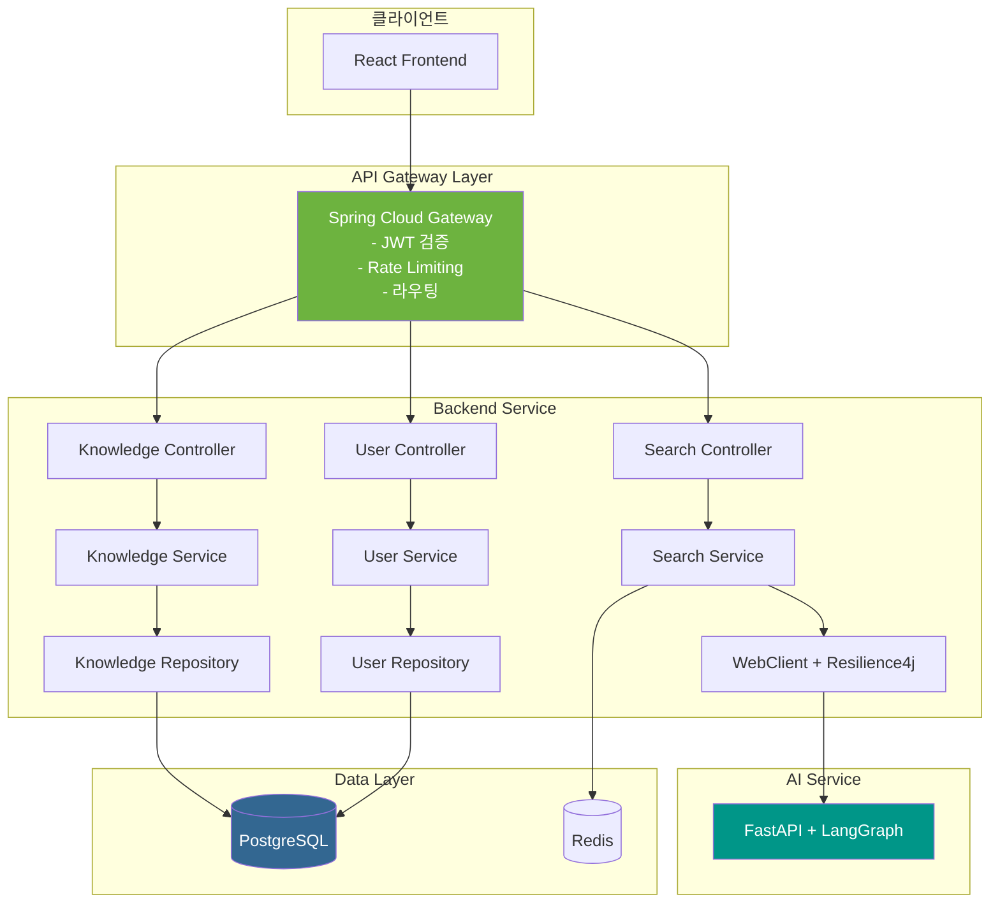

---

## 2. 아키텍처 설계

### 2.1 레이어드 아키텍처

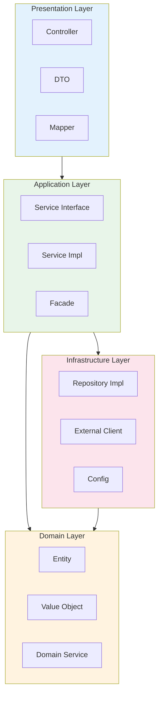

### 2.2 레이어별 책임

| 레이어 | 책임 | 포함 요소 |
|--------|------|----------|
| **Presentation** | HTTP 요청/응답 처리, DTO 변환 | Controller, DTO, Mapper, Validator |
| **Application** | 비즈니스 유스케이스 구현 | Service, Facade, ApplicationEvent |
| **Domain** | 핵심 비즈니스 로직 | Entity, Value Object, Domain Service |
| **Infrastructure** | 외부 시스템 연동 | Repository, WebClient, Config |

### 2.3 의존성 규칙

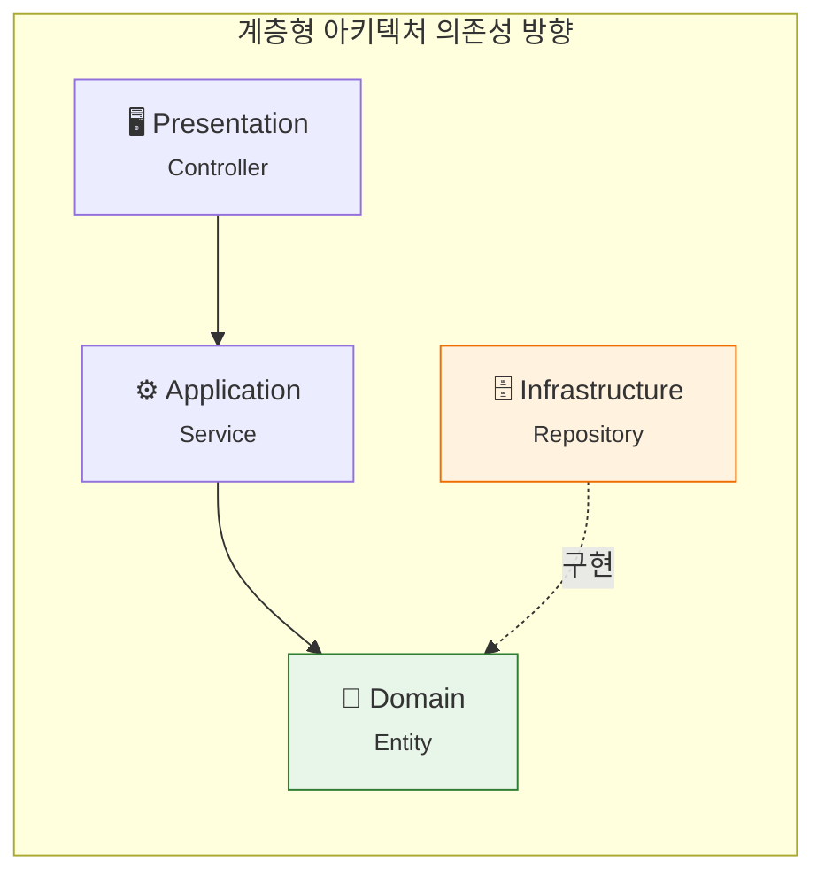

> **Note**
> - Domain 레이어는 다른 레이어에 의존하지 않음
> - Infrastructure는 Domain의 인터페이스를 구현 (의존성 역전)

---

## 3. 모듈 구조

### 3.1 모듈 구성 (Gradle 멀티 모듈)

```
knowledge-platform-backend/
├── build.gradle.kts                 # Root build script
├── settings.gradle.kts              # 모듈 설정
├── gradle.properties                # 공통 속성
│
├── platform-common/                 # 공통 모듈
│   ├── build.gradle.kts
│   └── src/main/java/
│       └── com/company/platform/common/
│           ├── dto/                 # 공통 DTO
│           ├── exception/           # 공통 예외
│           ├── util/                # 유틸리티
│           └── config/              # 공통 설정
│
├── platform-domain/                 # 도메인 모듈
│   ├── build.gradle.kts
│   └── src/main/java/
│       └── com/company/platform/domain/
│           ├── knowledge/           # Knowledge 도메인
│           ├── user/                # User 도메인
│           ├── search/              # Search 도메인
│           └── bookmark/            # Bookmark 도메인
│
├── platform-gateway/                # API Gateway 모듈
│   ├── build.gradle.kts
│   └── src/main/java/
│       └── com/company/platform/gateway/
│
├── platform-api/                    # API 서비스 모듈
│   ├── build.gradle.kts
│   └── src/main/java/
│       └── com/company/platform/api/
│
└── platform-batch/                  # 배치 모듈 (선택)
    └── ...
```

### 3.2 모듈 의존성

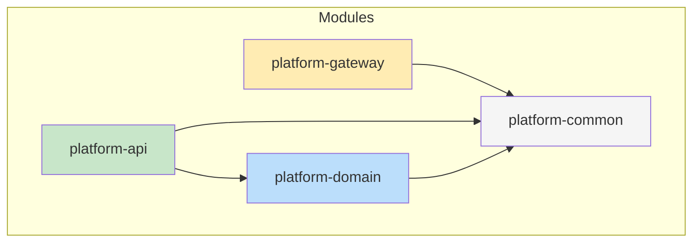

### 3.3 build.gradle.kts (Root)

```kotlin
// build.gradle.kts
plugins {
    id("org.springframework.boot") version "3.2.0" apply false
    id("io.spring.dependency-management") version "1.1.4" apply false
    kotlin("jvm") version "1.9.21" apply false
    kotlin("plugin.spring") version "1.9.21" apply false
    kotlin("plugin.jpa") version "1.9.21" apply false
}

allprojects {
    group = "com.company.platform"
    version = "1.0.0-SNAPSHOT"

    repositories {
        mavenCentral()
    }
}

subprojects {
    apply(plugin = "java")
    apply(plugin = "io.spring.dependency-management")

    configure<JavaPluginExtension> {
        sourceCompatibility = JavaVersion.VERSION_17
        targetCompatibility = JavaVersion.VERSION_17
    }

    dependencies {
        // Lombok
        compileOnly("org.projectlombok:lombok")
        annotationProcessor("org.projectlombok:lombok")

        // Testing
        testImplementation("org.springframework.boot:spring-boot-starter-test")
    }
}
```

### 3.4 platform-api/build.gradle.kts

```kotlin
plugins {
    id("org.springframework.boot")
    id("io.spring.dependency-management")
}

dependencies {
    implementation(project(":platform-common"))
    implementation(project(":platform-domain"))

    // Spring Boot
    implementation("org.springframework.boot:spring-boot-starter-web")
    implementation("org.springframework.boot:spring-boot-starter-data-jpa")
    implementation("org.springframework.boot:spring-boot-starter-validation")
    implementation("org.springframework.boot:spring-boot-starter-security")
    implementation("org.springframework.boot:spring-boot-starter-oauth2-resource-server")
    implementation("org.springframework.boot:spring-boot-starter-data-redis")
    implementation("org.springframework.boot:spring-boot-starter-actuator")
    implementation("org.springframework.boot:spring-boot-starter-webflux")

    // Resilience4j
    implementation("io.github.resilience4j:resilience4j-spring-boot3:2.2.0")
    implementation("io.github.resilience4j:resilience4j-reactor:2.2.0")

    // Database
    runtimeOnly("org.postgresql:postgresql")

    // Swagger
    implementation("org.springdoc:springdoc-openapi-starter-webmvc-ui:2.3.0")

    // MapStruct
    implementation("org.mapstruct:mapstruct:1.5.5.Final")
    annotationProcessor("org.mapstruct:mapstruct-processor:1.5.5.Final")

    // Test
    testImplementation("org.testcontainers:postgresql:1.19.3")
    testImplementation("org.testcontainers:junit-jupiter:1.19.3")
}
```

---

## 4. 패키지 구조

### 4.1 platform-api 패키지 구조

```
com.company.platform.api/
├── PlatformApiApplication.java          # 메인 클래스
│
├── config/                               # 설정
│   ├── SecurityConfig.java              # Spring Security 설정
│   ├── WebClientConfig.java             # AI Service 호출 설정
│   ├── CacheConfig.java                 # Redis 캐시 설정
│   ├── JpaConfig.java                   # JPA 설정
│   ├── SwaggerConfig.java               # OpenAPI 문서 설정
│   └── Resilience4jConfig.java          # Circuit Breaker 설정
│
├── controller/                           # REST Controller
│   ├── KnowledgeController.java
│   ├── SearchController.java
│   ├── UserController.java
│   ├── BookmarkController.java
│   ├── DashboardController.java
│   └── ExportController.java
│
├── dto/                                  # Data Transfer Objects
│   ├── request/
│   │   ├── KnowledgeCreateRequest.java
│   │   ├── KnowledgeUpdateRequest.java
│   │   ├── SearchRequest.java
│   │   └── ChatRequest.java
│   ├── response/
│   │   ├── KnowledgeResponse.java
│   │   ├── SearchResponse.java
│   │   ├── PagedResponse.java
│   │   └── ApiResponse.java
│   └── mapper/
│       ├── KnowledgeMapper.java
│       └── UserMapper.java
│
├── service/                              # 서비스 레이어
│   ├── KnowledgeService.java            # 인터페이스
│   ├── impl/
│   │   ├── KnowledgeServiceImpl.java
│   │   ├── SearchServiceImpl.java
│   │   └── UserServiceImpl.java
│   └── facade/
│       └── SearchFacade.java            # 복잡한 검색 워크플로우
│
├── client/                               # 외부 서비스 클라이언트
│   ├── AIServiceClient.java             # AI Service 호출
│   └── KeycloakClient.java              # Keycloak 연동
│
├── repository/                           # Repository 인터페이스
│   ├── KnowledgeRepository.java
│   ├── UserRepository.java
│   ├── BookmarkRepository.java
│   └── SearchHistoryRepository.java
│
├── exception/                            # 예외 처리
│   ├── GlobalExceptionHandler.java
│   ├── ErrorCode.java
│   ├── BusinessException.java
│   ├── KnowledgeNotFoundException.java
│   └── AIServiceException.java
│
├── security/                             # 보안 관련
│   ├── JwtAuthenticationFilter.java
│   ├── UserPrincipal.java
│   └── SecurityUtils.java
│
├── validator/                            # 커스텀 검증
│   ├── ValidDocumentType.java
│   └── DocumentTypeValidator.java
│
└── util/                                 # 유틸리티
    ├── PageUtils.java
    └── DateUtils.java
```

### 4.2 platform-domain 패키지 구조

```
com.company.platform.domain/
├── knowledge/
│   ├── Knowledge.java                   # 엔티티
│   ├── KnowledgeChunk.java
│   ├── KnowledgeVersion.java
│   ├── DocumentType.java                # Enum
│   ├── Visibility.java                  # Enum
│   └── KnowledgeStatus.java             # Enum
│
├── user/
│   ├── User.java
│   ├── UserRole.java
│   ├── Department.java
│   └── UserPreference.java
│
├── bookmark/
│   ├── Bookmark.java
│   ├── BookmarkFolder.java
│   └── BookmarkTag.java
│
├── search/
│   ├── SearchHistory.java
│   ├── ChatConversation.java
│   └── ChatMessage.java
│
└── common/
    ├── BaseEntity.java                  # 공통 엔티티
    └── AuditableEntity.java             # 감사 필드
```

---

## 5. 레이어별 상세 설계

### 5.1 Controller 설계 원칙

```java
/**
 * Controller 설계 규칙:
 * 1. 단일 책임: HTTP 요청/응답 처리만 담당
 * 2. 비즈니스 로직 없음: Service에 위임
 * 3. DTO 사용: Entity 직접 반환 금지
 * 4. 표준 응답 형식: ApiResponse<T> 사용
 * 5. Swagger 문서화: @Operation, @ApiResponse 필수
 */

@RestController
@RequestMapping("/api/v1/knowledge")
@RequiredArgsConstructor
@Tag(name = "Knowledge", description = "지식 관리 API")
@Validated
public class KnowledgeController {

    private final KnowledgeService knowledgeService;
    private final KnowledgeMapper knowledgeMapper;

    @Operation(summary = "지식 목록 조회", description = "페이징 및 필터링을 지원하는 지식 목록 조회")
    @ApiResponses({
        @ApiResponse(responseCode = "200", description = "조회 성공"),
        @ApiResponse(responseCode = "400", description = "잘못된 요청")
    })
    @GetMapping
    public ResponseEntity<ApiResponse<PagedResponse<KnowledgeResponse>>> getKnowledgeList(
            @Valid KnowledgeSearchCriteria criteria,
            @PageableDefault(size = 20, sort = "createdAt", direction = DESC) Pageable pageable) {

        Page<Knowledge> page = knowledgeService.findAll(criteria, pageable);
        PagedResponse<KnowledgeResponse> response = PagedResponse.of(
            page.map(knowledgeMapper::toResponse)
        );

        return ResponseEntity.ok(ApiResponse.success(response));
    }

    @Operation(summary = "지식 상세 조회")
    @GetMapping("/{id}")
    public ResponseEntity<ApiResponse<KnowledgeResponse>> getKnowledge(
            @PathVariable @NotNull UUID id) {

        Knowledge knowledge = knowledgeService.findById(id);
        return ResponseEntity.ok(ApiResponse.success(knowledgeMapper.toResponse(knowledge)));
    }

    @Operation(summary = "지식 생성")
    @PostMapping
    @PreAuthorize("hasRole('USER')")
    public ResponseEntity<ApiResponse<KnowledgeResponse>> createKnowledge(
            @Valid @RequestBody KnowledgeCreateRequest request,
            @AuthenticationPrincipal UserPrincipal principal) {

        Knowledge knowledge = knowledgeService.create(request, principal.getId());
        URI location = ServletUriComponentsBuilder
            .fromCurrentRequest()
            .path("/{id}")
            .buildAndExpand(knowledge.getId())
            .toUri();

        return ResponseEntity
            .created(location)
            .body(ApiResponse.success(knowledgeMapper.toResponse(knowledge)));
    }

    @Operation(summary = "지식 수정")
    @PutMapping("/{id}")
    @PreAuthorize("@securityService.isOwnerOrAdmin(#id, authentication)")
    public ResponseEntity<ApiResponse<KnowledgeResponse>> updateKnowledge(
            @PathVariable UUID id,
            @Valid @RequestBody KnowledgeUpdateRequest request) {

        Knowledge knowledge = knowledgeService.update(id, request);
        return ResponseEntity.ok(ApiResponse.success(knowledgeMapper.toResponse(knowledge)));
    }

    @Operation(summary = "지식 삭제")
    @DeleteMapping("/{id}")
    @PreAuthorize("@securityService.isOwnerOrAdmin(#id, authentication)")
    public ResponseEntity<Void> deleteKnowledge(@PathVariable UUID id) {
        knowledgeService.delete(id);
        return ResponseEntity.noContent().build();
    }
}
```

### 5.2 DTO 설계

#### 5.2.1 요청 DTO

```java
/**
 * DTO 설계 규칙:
 * 1. 불변 객체 권장 (record 또는 @Value)
 * 2. 검증 어노테이션 필수
 * 3. 명확한 필드명 (약어 지양)
 */

public record KnowledgeCreateRequest(
    @NotBlank(message = "제목은 필수입니다")
    @Size(max = 500, message = "제목은 500자 이내여야 합니다")
    String title,

    @NotBlank(message = "내용은 필수입니다")
    @Size(max = 100000, message = "내용은 100,000자 이내여야 합니다")
    String content,

    @NotNull(message = "문서 유형은 필수입니다")
    @ValidDocumentType
    String documentType,

    @Size(max = 10, message = "태그는 최대 10개까지 가능합니다")
    Set<@Size(max = 50) String> tags,

    UUID projectId,

    @FutureOrPresent(message = "유효 시작일은 현재 또는 미래여야 합니다")
    LocalDate validStartDate,

    @Future(message = "유효 종료일은 미래여야 합니다")
    LocalDate validEndDate,

    @NotNull(message = "공개 범위는 필수입니다")
    Visibility visibility
) {
    // Compact constructor for validation
    public KnowledgeCreateRequest {
        if (validEndDate != null && validStartDate != null
                && validEndDate.isBefore(validStartDate)) {
            throw new IllegalArgumentException("유효 종료일은 시작일 이후여야 합니다");
        }
    }
}
```

#### 5.2.2 응답 DTO

```java
public record KnowledgeResponse(
    UUID id,
    String title,
    String content,
    String documentType,
    Set<String> tags,
    AuthorInfo author,
    UUID projectId,
    LocalDate validStartDate,
    LocalDate validEndDate,
    Visibility visibility,
    Integer viewCount,
    Integer likeCount,
    Integer version,
    LocalDateTime createdAt,
    LocalDateTime updatedAt
) {
    public record AuthorInfo(
        UUID id,
        String name,
        String email,
        String department
    ) {}
}
```

#### 5.2.3 공통 응답 래퍼

```java
@Getter
@Builder
public class ApiResponse<T> {
    private final boolean success;
    private final T data;
    private final String message;
    private final LocalDateTime timestamp;
    private final ErrorInfo error;

    public static <T> ApiResponse<T> success(T data) {
        return ApiResponse.<T>builder()
            .success(true)
            .data(data)
            .timestamp(LocalDateTime.now())
            .build();
    }

    public static <T> ApiResponse<T> success(T data, String message) {
        return ApiResponse.<T>builder()
            .success(true)
            .data(data)
            .message(message)
            .timestamp(LocalDateTime.now())
            .build();
    }

    public static <T> ApiResponse<T> error(ErrorCode errorCode, String message) {
        return ApiResponse.<T>builder()
            .success(false)
            .error(new ErrorInfo(errorCode.getCode(), message))
            .timestamp(LocalDateTime.now())
            .build();
    }

    @Getter
    @AllArgsConstructor
    public static class ErrorInfo {
        private final String code;
        private final String message;
    }
}
```

#### 5.2.4 페이징 응답

```java
@Getter
@Builder
public class PagedResponse<T> {
    private final List<T> content;
    private final int page;
    private final int size;
    private final long totalElements;
    private final int totalPages;
    private final boolean first;
    private final boolean last;
    private final boolean hasNext;
    private final boolean hasPrevious;

    public static <T> PagedResponse<T> of(Page<T> page) {
        return PagedResponse.<T>builder()
            .content(page.getContent())
            .page(page.getNumber())
            .size(page.getSize())
            .totalElements(page.getTotalElements())
            .totalPages(page.getTotalPages())
            .first(page.isFirst())
            .last(page.isLast())
            .hasNext(page.hasNext())
            .hasPrevious(page.hasPrevious())
            .build();
    }
}
```

### 5.3 Mapper 설계 (MapStruct)

```java
@Mapper(
    componentModel = "spring",
    unmappedTargetPolicy = ReportingPolicy.IGNORE,
    nullValuePropertyMappingStrategy = NullValuePropertyMappingStrategy.IGNORE
)
public interface KnowledgeMapper {

    @Mapping(target = "author", source = "author", qualifiedByName = "toAuthorInfo")
    KnowledgeResponse toResponse(Knowledge knowledge);

    List<KnowledgeResponse> toResponseList(List<Knowledge> knowledgeList);

    @Mapping(target = "id", ignore = true)
    @Mapping(target = "author", ignore = true)
    @Mapping(target = "createdAt", ignore = true)
    @Mapping(target = "updatedAt", ignore = true)
    @Mapping(target = "viewCount", constant = "0")
    @Mapping(target = "likeCount", constant = "0")
    @Mapping(target = "version", constant = "1")
    @Mapping(target = "isDeleted", constant = "false")
    Knowledge toEntity(KnowledgeCreateRequest request);

    @BeanMapping(nullValuePropertyMappingStrategy = NullValuePropertyMappingStrategy.IGNORE)
    void updateEntity(KnowledgeUpdateRequest request, @MappingTarget Knowledge knowledge);

    @Named("toAuthorInfo")
    default KnowledgeResponse.AuthorInfo toAuthorInfo(User user) {
        if (user == null) return null;
        return new KnowledgeResponse.AuthorInfo(
            user.getId(),
            user.getName(),
            user.getEmail(),
            user.getDepartment() != null ? user.getDepartment().getName() : null
        );
    }
}
```

---

## 6. 도메인 모델 설계

### 6.1 도메인 모델 다이어그램

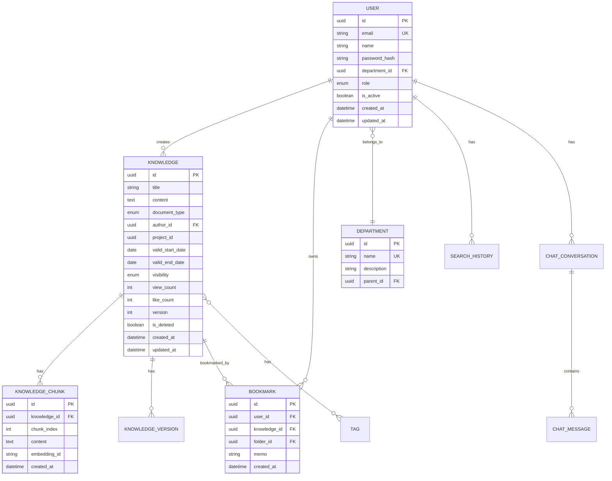

### 6.2 Enum 정의

```java
public enum DocumentType {
    POLICY("정책/지침"),
    MANUAL("매뉴얼"),
    PROPOSAL("제안서"),
    CONTRACT("계약서"),
    REPORT("보고서"),
    MEETING_MINUTES("회의록"),
    TECHNICAL("기술문서"),
    OTHER("기타");

    private final String displayName;

    DocumentType(String displayName) {
        this.displayName = displayName;
    }

    public String getDisplayName() {
        return displayName;
    }
}

public enum Visibility {
    PUBLIC("전체 공개"),
    DEPARTMENT("부서 공개"),
    PROJECT("프로젝트 공개"),
    PRIVATE("비공개");

    private final String displayName;

    Visibility(String displayName) {
        this.displayName = displayName;
    }
}

/**
 * 사용자 역할 Enum
 *
 * 역할 계층 구조: ADMIN > KNOWLEDGE_MANAGER > USER
 * - auth_detailed_design.md 기준 통일
 * - Keycloak composite roles와 연동
 */
public enum UserRole {
    USER("일반 사용자"),
    KNOWLEDGE_MANAGER("지식 관리자"),
    ADMIN("시스템 관리자");

    private final String displayName;

    UserRole(String displayName) {
        this.displayName = displayName;
    }
}
```

---

## 7. JPA 엔티티 설계

### 7.1 BaseEntity (공통 필드)

```java
@MappedSuperclass
@EntityListeners(AuditingEntityListener.class)
@Getter
public abstract class BaseEntity {

    @Id
    @GeneratedValue(strategy = GenerationType.UUID)
    @Column(name = "id", updatable = false, nullable = false)
    private UUID id;

    @CreatedDate
    @Column(name = "created_at", nullable = false, updatable = false)
    private LocalDateTime createdAt;

    @LastModifiedDate
    @Column(name = "updated_at")
    private LocalDateTime updatedAt;

    @Version
    @Column(name = "opt_lock_version")
    private Long optLockVersion;
}
```

### 7.2 Knowledge 엔티티

```java
@Entity
@Table(name = "knowledge", indexes = {
    @Index(name = "idx_knowledge_author", columnList = "author_id"),
    @Index(name = "idx_knowledge_project", columnList = "project_id"),
    @Index(name = "idx_knowledge_type", columnList = "document_type"),
    @Index(name = "idx_knowledge_created", columnList = "created_at DESC")
})
@Getter
@NoArgsConstructor(access = AccessLevel.PROTECTED)
@AllArgsConstructor(access = AccessLevel.PRIVATE)
@Builder
@SQLRestriction("is_deleted = false")
public class Knowledge extends BaseEntity {

    @Column(name = "title", nullable = false, length = 500)
    private String title;

    @Column(name = "content", columnDefinition = "TEXT")
    private String content;

    @Enumerated(EnumType.STRING)
    @Column(name = "document_type", length = 50)
    private DocumentType documentType;

    @ManyToOne(fetch = FetchType.LAZY)
    @JoinColumn(name = "author_id", nullable = false)
    private User author;

    @Column(name = "project_id")
    private UUID projectId;

    @Column(name = "valid_start_date")
    private LocalDate validStartDate;

    @Column(name = "valid_end_date")
    private LocalDate validEndDate;

    @Enumerated(EnumType.STRING)
    @Column(name = "visibility", nullable = false)
    @Builder.Default
    private Visibility visibility = Visibility.PUBLIC;

    @ElementCollection
    @CollectionTable(
        name = "knowledge_tags",
        joinColumns = @JoinColumn(name = "knowledge_id")
    )
    @Column(name = "tag", length = 50)
    @Builder.Default
    private Set<String> tags = new HashSet<>();

    @Column(name = "view_count", nullable = false)
    @Builder.Default
    private Integer viewCount = 0;

    @Column(name = "like_count", nullable = false)
    @Builder.Default
    private Integer likeCount = 0;

    @Column(name = "version", nullable = false)
    @Builder.Default
    private Integer version = 1;

    @Column(name = "is_deleted", nullable = false)
    @Builder.Default
    private Boolean isDeleted = false;

    @OneToMany(mappedBy = "knowledge", cascade = CascadeType.ALL, orphanRemoval = true)
    @Builder.Default
    private List<KnowledgeChunk> chunks = new ArrayList<>();

    // === 비즈니스 메서드 ===

    public void updateTitle(String title) {
        Assert.hasText(title, "제목은 필수입니다");
        this.title = title;
        incrementVersion();
    }

    public void updateContent(String content) {
        this.content = content;
        incrementVersion();
    }

    public void incrementViewCount() {
        this.viewCount++;
    }

    public void incrementLikeCount() {
        this.likeCount++;
    }

    public void decrementLikeCount() {
        if (this.likeCount > 0) {
            this.likeCount--;
        }
    }

    public void softDelete() {
        this.isDeleted = true;
    }

    private void incrementVersion() {
        this.version++;
    }

    public boolean isValid() {
        LocalDate today = LocalDate.now();
        if (validStartDate != null && today.isBefore(validStartDate)) {
            return false;
        }
        if (validEndDate != null && today.isAfter(validEndDate)) {
            return false;
        }
        return true;
    }

    public boolean isOwnedBy(UUID userId) {
        return this.author != null && this.author.getId().equals(userId);
    }
}
```

### 7.3 User 엔티티

```java
@Entity
@Table(name = "users", indexes = {
    @Index(name = "idx_user_email", columnList = "email", unique = true),
    @Index(name = "idx_user_department", columnList = "department_id")
})
@Getter
@NoArgsConstructor(access = AccessLevel.PROTECTED)
@AllArgsConstructor(access = AccessLevel.PRIVATE)
@Builder
public class User extends BaseEntity {

    @Column(name = "email", nullable = false, unique = true, length = 255)
    private String email;

    @Column(name = "name", nullable = false, length = 100)
    private String name;

    /**
     * OAuth 전용 시스템에서는 사용하지 않음 (null)
     * 로컬 계정 지원 시에만 사용
     * @deprecated Keycloak OAuth 인증 사용으로 불필요 - 향후 제거 검토
     */
    @Deprecated
    @Column(name = "password_hash", length = 255)
    private String passwordHash;  // OAuth 사용 시 null

    @ManyToOne(fetch = FetchType.LAZY)
    @JoinColumn(name = "department_id")
    private Department department;

    @Enumerated(EnumType.STRING)
    @Column(name = "role", nullable = false)
    @Builder.Default
    private UserRole role = UserRole.USER;

    @Column(name = "is_active", nullable = false)
    @Builder.Default
    private Boolean isActive = true;

    @Column(name = "last_login_at")
    private LocalDateTime lastLoginAt;

    @Embedded
    @Builder.Default
    private UserPreference preference = new UserPreference();

    // === 비즈니스 메서드 ===

    public void updateLastLogin() {
        this.lastLoginAt = LocalDateTime.now();
    }

    public void deactivate() {
        this.isActive = false;
    }

    public void activate() {
        this.isActive = true;
    }

    public boolean isAdmin() {
        return this.role == UserRole.ADMIN;
    }

    /**
     * 지식 관리 권한 보유 여부 (KNOWLEDGE_MANAGER 이상)
     */
    public boolean isKnowledgeManager() {
        return this.role == UserRole.KNOWLEDGE_MANAGER || this.role == UserRole.ADMIN;
    }

    /**
     * 관리자급 권한 보유 여부 (KNOWLEDGE_MANAGER 또는 ADMIN)
     */
    public boolean hasManagerPrivilege() {
        return isKnowledgeManager();
    }

    public String getDepartmentName() {
        return department != null ? department.getName() : null;
    }
}
```

### 7.4 Embedded 클래스 (UserPreference)

```java
@Embeddable
@Getter
@NoArgsConstructor(access = AccessLevel.PROTECTED)
@AllArgsConstructor
@Builder
public class UserPreference {

    @Column(name = "pref_language", length = 10)
    @Builder.Default
    private String language = "ko";

    @Column(name = "pref_theme", length = 20)
    @Builder.Default
    private String theme = "light";

    @Column(name = "pref_page_size")
    @Builder.Default
    private Integer pageSize = 20;

    @Column(name = "pref_notifications_enabled")
    @Builder.Default
    private Boolean notificationsEnabled = true;
}
```

---

## 8. Repository 설계

### 8.1 Repository 인터페이스

```java
public interface KnowledgeRepository extends JpaRepository<Knowledge, UUID> {

    // === 기본 조회 ===

    Optional<Knowledge> findByIdAndIsDeletedFalse(UUID id);

    // === 페이징 조회 ===

    @Query("""
        SELECT k FROM Knowledge k
        LEFT JOIN FETCH k.author a
        WHERE k.isDeleted = false
          AND (:documentType IS NULL OR k.documentType = :documentType)
          AND (:visibility IS NULL OR k.visibility = :visibility)
          AND (:authorId IS NULL OR a.id = :authorId)
          AND (:projectId IS NULL OR k.projectId = :projectId)
          AND (:keyword IS NULL OR
               LOWER(k.title) LIKE LOWER(CONCAT('%', :keyword, '%')) OR
               LOWER(k.content) LIKE LOWER(CONCAT('%', :keyword, '%')))
        """)
    Page<Knowledge> findBySearchCriteria(
        @Param("documentType") DocumentType documentType,
        @Param("visibility") Visibility visibility,
        @Param("authorId") UUID authorId,
        @Param("projectId") UUID projectId,
        @Param("keyword") String keyword,
        Pageable pageable
    );

    // === 통계 조회 ===

    @Query("""
        SELECT COUNT(k) FROM Knowledge k
        WHERE k.author.id = :authorId
          AND k.isDeleted = false
        """)
    long countByAuthorId(@Param("authorId") UUID authorId);

    @Query("""
        SELECT k.documentType, COUNT(k)
        FROM Knowledge k
        WHERE k.isDeleted = false
        GROUP BY k.documentType
        """)
    List<Object[]> countByDocumentType();

    // === 유효 기간 체크 ===

    @Query("""
        SELECT k FROM Knowledge k
        WHERE k.validEndDate < :date
          AND k.isDeleted = false
        """)
    List<Knowledge> findExpiredKnowledge(@Param("date") LocalDate date);

    // === 벌크 업데이트 ===

    @Modifying
    @Query("UPDATE Knowledge k SET k.viewCount = k.viewCount + 1 WHERE k.id = :id")
    void incrementViewCount(@Param("id") UUID id);

    @Modifying
    @Query("UPDATE Knowledge k SET k.isDeleted = true WHERE k.id IN :ids")
    int softDeleteByIds(@Param("ids") List<UUID> ids);
}
```

### 8.2 Custom Repository 구현

```java
public interface KnowledgeRepositoryCustom {
    Page<Knowledge> searchWithComplexCriteria(KnowledgeSearchCriteria criteria, Pageable pageable);
    List<Knowledge> findRelatedKnowledge(UUID knowledgeId, int limit);
}

@Repository
@RequiredArgsConstructor
public class KnowledgeRepositoryCustomImpl implements KnowledgeRepositoryCustom {

    private final EntityManager entityManager;

    @Override
    public Page<Knowledge> searchWithComplexCriteria(KnowledgeSearchCriteria criteria, Pageable pageable) {
        CriteriaBuilder cb = entityManager.getCriteriaBuilder();
        CriteriaQuery<Knowledge> query = cb.createQuery(Knowledge.class);
        Root<Knowledge> root = query.from(Knowledge.class);

        // Fetch join for N+1 prevention
        root.fetch("author", JoinType.LEFT);

        List<Predicate> predicates = new ArrayList<>();
        predicates.add(cb.isFalse(root.get("isDeleted")));

        // Dynamic predicates
        if (criteria.getDocumentType() != null) {
            predicates.add(cb.equal(root.get("documentType"), criteria.getDocumentType()));
        }

        if (criteria.getVisibility() != null) {
            predicates.add(cb.equal(root.get("visibility"), criteria.getVisibility()));
        }

        if (StringUtils.hasText(criteria.getKeyword())) {
            String keyword = "%" + criteria.getKeyword().toLowerCase() + "%";
            predicates.add(cb.or(
                cb.like(cb.lower(root.get("title")), keyword),
                cb.like(cb.lower(root.get("content")), keyword)
            ));
        }

        if (criteria.getTags() != null && !criteria.getTags().isEmpty()) {
            for (String tag : criteria.getTags()) {
                predicates.add(cb.isMember(tag, root.get("tags")));
            }
        }

        if (criteria.getValidOnly() != null && criteria.getValidOnly()) {
            LocalDate today = LocalDate.now();
            predicates.add(cb.or(
                cb.isNull(root.get("validStartDate")),
                cb.lessThanOrEqualTo(root.get("validStartDate"), today)
            ));
            predicates.add(cb.or(
                cb.isNull(root.get("validEndDate")),
                cb.greaterThanOrEqualTo(root.get("validEndDate"), today)
            ));
        }

        query.where(predicates.toArray(new Predicate[0]));

        // Sorting
        List<Order> orders = new ArrayList<>();
        for (Sort.Order order : pageable.getSort()) {
            Path<Object> path = root.get(order.getProperty());
            orders.add(order.isAscending() ? cb.asc(path) : cb.desc(path));
        }
        query.orderBy(orders);

        // Execute with pagination
        TypedQuery<Knowledge> typedQuery = entityManager.createQuery(query);
        typedQuery.setFirstResult((int) pageable.getOffset());
        typedQuery.setMaxResults(pageable.getPageSize());

        List<Knowledge> content = typedQuery.getResultList();

        // Count query
        CriteriaQuery<Long> countQuery = cb.createQuery(Long.class);
        Root<Knowledge> countRoot = countQuery.from(Knowledge.class);
        countQuery.select(cb.count(countRoot));
        countQuery.where(predicates.toArray(new Predicate[0]));
        Long total = entityManager.createQuery(countQuery).getSingleResult();

        return new PageImpl<>(content, pageable, total);
    }

    @Override
    public List<Knowledge> findRelatedKnowledge(UUID knowledgeId, int limit) {
        // 태그 기반 관련 문서 조회
        return entityManager.createQuery("""
            SELECT DISTINCT k FROM Knowledge k
            JOIN k.tags t
            WHERE k.id != :knowledgeId
              AND k.isDeleted = false
              AND t IN (
                  SELECT t2 FROM Knowledge k2
                  JOIN k2.tags t2
                  WHERE k2.id = :knowledgeId
              )
            ORDER BY k.viewCount DESC
            """, Knowledge.class)
            .setParameter("knowledgeId", knowledgeId)
            .setMaxResults(limit)
            .getResultList();
    }
}
```

---

## 9. Service 레이어 설계

### 9.1 Service 인터페이스

```java
public interface KnowledgeService {
    Knowledge findById(UUID id);
    Page<Knowledge> findAll(KnowledgeSearchCriteria criteria, Pageable pageable);
    Knowledge create(KnowledgeCreateRequest request, UUID authorId);
    Knowledge update(UUID id, KnowledgeUpdateRequest request);
    void delete(UUID id);
    void incrementViewCount(UUID id);
    List<Knowledge> findRelatedKnowledge(UUID knowledgeId, int limit);
}
```

### 9.2 Service 구현

```java
@Service
@RequiredArgsConstructor
@Transactional(readOnly = true)
@Slf4j
public class KnowledgeServiceImpl implements KnowledgeService {

    private final KnowledgeRepository knowledgeRepository;
    private final UserRepository userRepository;
    private final KnowledgeMapper knowledgeMapper;
    private final AIServiceClient aiServiceClient;
    private final ApplicationEventPublisher eventPublisher;

    @Override
    public Knowledge findById(UUID id) {
        return knowledgeRepository.findByIdAndIsDeletedFalse(id)
            .orElseThrow(() -> new KnowledgeNotFoundException(id));
    }

    @Override
    public Page<Knowledge> findAll(KnowledgeSearchCriteria criteria, Pageable pageable) {
        log.debug("Searching knowledge with criteria: {}", criteria);
        return knowledgeRepository.searchWithComplexCriteria(criteria, pageable);
    }

    @Override
    @Transactional
    public Knowledge create(KnowledgeCreateRequest request, UUID authorId) {
        log.info("Creating knowledge: title={}, authorId={}", request.title(), authorId);

        // 작성자 조회
        User author = userRepository.findById(authorId)
            .orElseThrow(() -> new UserNotFoundException(authorId));

        // 엔티티 생성
        Knowledge knowledge = knowledgeMapper.toEntity(request);
        knowledge = Knowledge.builder()
            .title(request.title())
            .content(request.content())
            .documentType(DocumentType.valueOf(request.documentType()))
            .author(author)
            .projectId(request.projectId())
            .validStartDate(request.validStartDate())
            .validEndDate(request.validEndDate())
            .visibility(request.visibility())
            .tags(request.tags() != null ? request.tags() : new HashSet<>())
            .build();

        Knowledge saved = knowledgeRepository.save(knowledge);

        // 비동기로 AI Service에 메타데이터 추출 요청
        eventPublisher.publishEvent(new KnowledgeCreatedEvent(saved.getId(), saved.getContent()));

        log.info("Knowledge created successfully: id={}", saved.getId());
        return saved;
    }

    @Override
    @Transactional
    public Knowledge update(UUID id, KnowledgeUpdateRequest request) {
        log.info("Updating knowledge: id={}", id);

        Knowledge knowledge = findById(id);

        // Mapper를 사용하여 null이 아닌 필드만 업데이트
        knowledgeMapper.updateEntity(request, knowledge);

        Knowledge updated = knowledgeRepository.save(knowledge);

        // 내용이 변경된 경우 AI Service에 재처리 요청
        if (request.content() != null) {
            eventPublisher.publishEvent(new KnowledgeUpdatedEvent(updated.getId(), updated.getContent()));
        }

        log.info("Knowledge updated successfully: id={}", updated.getId());
        return updated;
    }

    @Override
    @Transactional
    public void delete(UUID id) {
        log.info("Deleting knowledge: id={}", id);

        Knowledge knowledge = findById(id);
        knowledge.softDelete();
        knowledgeRepository.save(knowledge);

        // 검색 인덱스에서 삭제
        eventPublisher.publishEvent(new KnowledgeDeletedEvent(id));

        log.info("Knowledge deleted successfully: id={}", id);
    }

    @Override
    @Transactional
    public void incrementViewCount(UUID id) {
        knowledgeRepository.incrementViewCount(id);
    }

    @Override
    public List<Knowledge> findRelatedKnowledge(UUID knowledgeId, int limit) {
        return knowledgeRepository.findRelatedKnowledge(knowledgeId, limit);
    }
}
```

### 9.3 Facade 패턴 (복잡한 워크플로우)

```java
/**
 * SearchFacade: 검색 관련 복잡한 워크플로우를 조율하는 Facade
 *
 * - AI Service 호출
 * - 캐싱
 * - 결과 가공
 */
@Component
@RequiredArgsConstructor
@Slf4j
public class SearchFacade {

    private final AIServiceClient aiServiceClient;
    private final KnowledgeRepository knowledgeRepository;
    private final SearchHistoryRepository searchHistoryRepository;
    private final CacheManager cacheManager;

    @Cacheable(value = "searchResults", key = "#request.hashCode()", unless = "#result == null")
    public SearchResponse hybridSearch(SearchRequest request, UUID userId) {
        log.info("Executing hybrid search: query={}, userId={}", request.query(), userId);

        // 1. AI Service에 검색 요청
        AISearchResponse aiResponse = aiServiceClient.hybridSearch(
            AISearchRequest.builder()
                .query(request.query())
                .topK(request.topK())
                .filters(buildFilters(request))
                .build()
        );

        // 2. 결과에서 Knowledge 상세 정보 조회
        List<UUID> knowledgeIds = aiResponse.getResults().stream()
            .map(AISearchResult::getDocumentId)
            .toList();

        Map<UUID, Knowledge> knowledgeMap = knowledgeRepository.findAllById(knowledgeIds)
            .stream()
            .collect(Collectors.toMap(Knowledge::getId, k -> k));

        // 3. 응답 구성
        List<SearchResultItem> results = aiResponse.getResults().stream()
            .map(aiResult -> {
                Knowledge knowledge = knowledgeMap.get(aiResult.getDocumentId());
                return SearchResultItem.builder()
                    .knowledge(knowledge)
                    .score(aiResult.getScore())
                    .highlights(aiResult.getHighlights())
                    .build();
            })
            .filter(item -> item.getKnowledge() != null)
            .toList();

        // 4. 검색 이력 저장 (비동기)
        saveSearchHistory(request, userId, results.size());

        return SearchResponse.builder()
            .results(results)
            .totalCount(aiResponse.getTotalCount())
            .processingTimeMs(aiResponse.getProcessingTimeMs())
            .build();
    }

    public Flux<String> streamChatResponse(ChatRequest request, UUID userId) {
        log.info("Starting chat stream: conversationId={}", request.conversationId());

        return aiServiceClient.streamChat(
            AIChatRequest.builder()
                .query(request.message())
                .conversationId(request.conversationId())
                .historyLimit(5)
                .build()
        );
    }

    @Async
    protected void saveSearchHistory(SearchRequest request, UUID userId, int resultCount) {
        try {
            SearchHistory history = SearchHistory.builder()
                .userId(userId)
                .query(request.query())
                .filters(JsonUtils.toJson(request))
                .resultCount(resultCount)
                .build();
            searchHistoryRepository.save(history);
        } catch (Exception e) {
            log.warn("Failed to save search history", e);
        }
    }

    private Map<String, Object> buildFilters(SearchRequest request) {
        Map<String, Object> filters = new HashMap<>();
        if (request.documentTypes() != null) {
            filters.put("document_type", request.documentTypes());
        }
        if (request.projectId() != null) {
            filters.put("project_id", request.projectId().toString());
        }
        if (request.validOnly() != null && request.validOnly()) {
            filters.put("valid_only", true);
        }
        return filters;
    }
}
```

---

## 10. AI Service 연동

### 10.1 WebClient 설정

```java
@Configuration
@RequiredArgsConstructor
public class WebClientConfig {

    @Value("${ai-service.url}")
    private String aiServiceUrl;

    @Value("${ai-service.timeout:30000}")
    private int timeout;

    @Bean
    public WebClient aiServiceWebClient() {
        HttpClient httpClient = HttpClient.create()
            .option(ChannelOption.CONNECT_TIMEOUT_MILLIS, 5000)
            .responseTimeout(Duration.ofMillis(timeout))
            .doOnConnected(conn ->
                conn.addHandlerLast(new ReadTimeoutHandler(timeout, TimeUnit.MILLISECONDS))
                    .addHandlerLast(new WriteTimeoutHandler(timeout, TimeUnit.MILLISECONDS)));

        return WebClient.builder()
            .baseUrl(aiServiceUrl)
            .clientConnector(new ReactorClientHttpConnector(httpClient))
            .defaultHeader(HttpHeaders.CONTENT_TYPE, MediaType.APPLICATION_JSON_VALUE)
            .defaultHeader(HttpHeaders.ACCEPT, MediaType.APPLICATION_JSON_VALUE)
            .filter(logRequest())
            .filter(logResponse())
            .codecs(configurer -> configurer.defaultCodecs().maxInMemorySize(10 * 1024 * 1024))
            .build();
    }

    private ExchangeFilterFunction logRequest() {
        return ExchangeFilterFunction.ofRequestProcessor(request -> {
            log.debug("AI Service Request: {} {}", request.method(), request.url());
            return Mono.just(request);
        });
    }

    private ExchangeFilterFunction logResponse() {
        return ExchangeFilterFunction.ofResponseProcessor(response -> {
            log.debug("AI Service Response: {}", response.statusCode());
            return Mono.just(response);
        });
    }
}
```

### 10.2 Resilience4j 설정

#### 10.2.1 Circuit Breaker 상태 전이

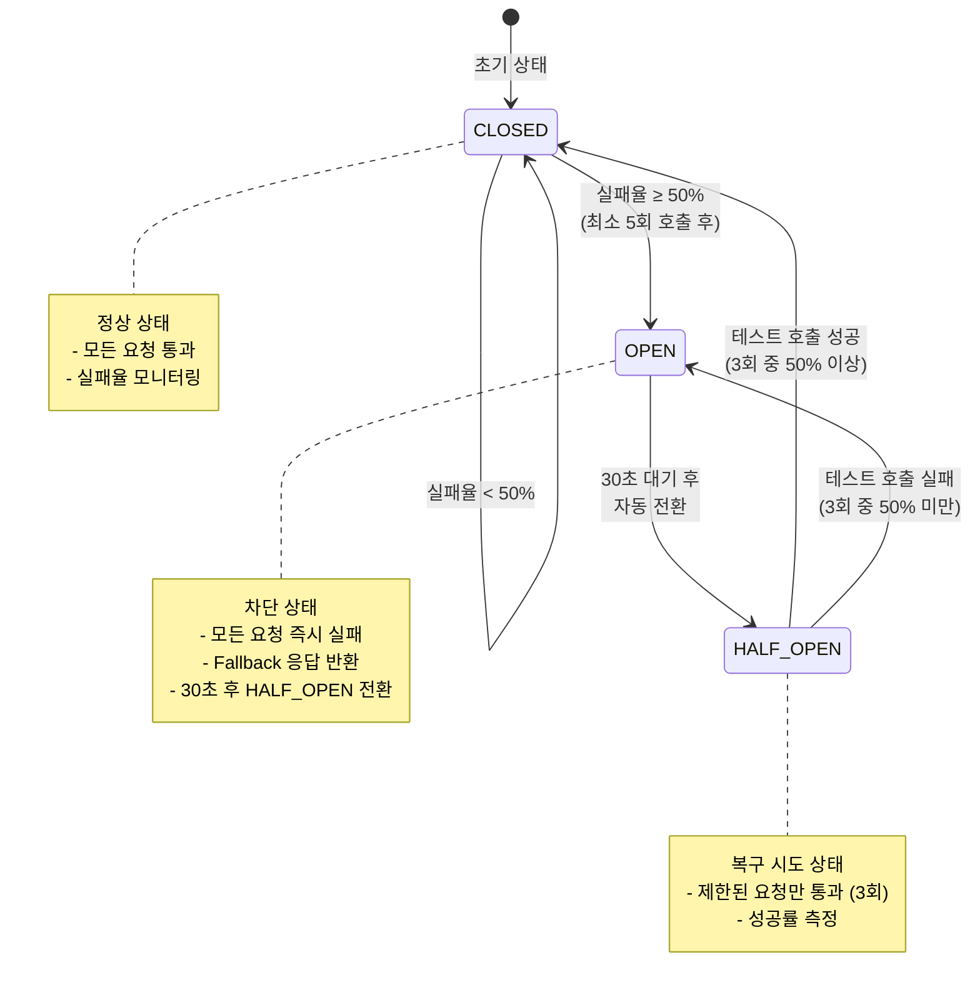

#### 10.2.2 설정 상세

```yaml
# application.yml
resilience4j:
  circuitbreaker:
    instances:
      aiService:
        registerHealthIndicator: true
        slidingWindowSize: 10
        minimumNumberOfCalls: 5
        permittedNumberOfCallsInHalfOpenState: 3
        automaticTransitionFromOpenToHalfOpenEnabled: true
        waitDurationInOpenState: 30s
        failureRateThreshold: 50
        eventConsumerBufferSize: 10
        recordExceptions:
          - java.io.IOException
          - java.util.concurrent.TimeoutException
          - org.springframework.web.reactive.function.client.WebClientRequestException
        ignoreExceptions:
          - com.company.platform.exception.BusinessException

  retry:
    instances:
      aiService:
        maxAttempts: 3
        waitDuration: 1s
        enableExponentialBackoff: true
        exponentialBackoffMultiplier: 2
        retryExceptions:
          - java.io.IOException
          - java.util.concurrent.TimeoutException

  timelimiter:
    instances:
      aiService:
        timeoutDuration: 30s    # 플랫폼 표준 타임아웃
        cancelRunningFuture: true

  ratelimiter:
    instances:
      aiService:
        limitForPeriod: 100
        limitRefreshPeriod: 1s
        timeoutDuration: 5s

  # [2단계 적용 예정] Bulkhead 패턴
  # - 검색/문서처리/채팅 요청을 별도 스레드풀로 격리
  # - 한 기능의 장애가 다른 기능에 영향 주지 않도록 함
  # bulkhead:
  #   instances:
  #     searchBulkhead:
  #       maxConcurrentCalls: 20
  #       maxWaitDuration: 500ms
  #     processingBulkhead:
  #       maxConcurrentCalls: 10
  #       maxWaitDuration: 1s
```

> **참고**: Bulkhead 패턴은 2단계 구축 시 적용 예정입니다. 검색, 문서 처리, 채팅 요청을 별도 스레드풀로 격리하여 한 기능의 장애가 다른 기능에 영향을 주지 않도록 합니다.

### 10.3 AI Service Client 구현

```java
@Component
@RequiredArgsConstructor
@Slf4j
public class AIServiceClient {

    private final WebClient aiServiceWebClient;

    private static final String SEARCH_HYBRID_PATH = "/internal/v1/search/hybrid";
    private static final String SEARCH_CHAT_PATH = "/internal/v1/search/chat";
    private static final String SEARCH_CHAT_STREAM_PATH = "/internal/v1/search/chat/stream";
    private static final String EXTRACT_METADATA_PATH = "/internal/v1/extract/metadata";
    private static final String EMBED_PATH = "/internal/v1/embed";

    // === Hybrid Search ===

    @CircuitBreaker(name = "aiService", fallbackMethod = "hybridSearchFallback")
    @Retry(name = "aiService")
    @TimeLimiter(name = "aiService")
    public Mono<AISearchResponse> hybridSearch(AISearchRequest request) {
        log.debug("Calling AI Service hybrid search: {}", request);

        return aiServiceWebClient.post()
            .uri(SEARCH_HYBRID_PATH)
            .bodyValue(request)
            .retrieve()
            .onStatus(HttpStatusCode::isError, this::handleError)
            .bodyToMono(AISearchResponse.class)
            .doOnSuccess(response -> log.debug("Hybrid search completed: {} results", response.getTotalCount()))
            .doOnError(error -> log.error("Hybrid search failed", error));
    }

    public Mono<AISearchResponse> hybridSearchFallback(AISearchRequest request, Throwable t) {
        log.warn("Hybrid search fallback triggered: {}", t.getMessage());

        return Mono.just(AISearchResponse.builder()
            .results(Collections.emptyList())
            .totalCount(0)
            .processingTimeMs(0)
            .fallback(true)
            .fallbackReason("AI Service unavailable: " + t.getMessage())
            .build());
    }

    // === Chat Streaming ===

    @CircuitBreaker(name = "aiService", fallbackMethod = "streamChatFallback")
    public Flux<String> streamChat(AIChatRequest request) {
        log.debug("Starting chat stream: conversationId={}", request.getConversationId());

        return aiServiceWebClient.post()
            .uri(SEARCH_CHAT_STREAM_PATH)
            .bodyValue(request)
            .accept(MediaType.TEXT_EVENT_STREAM)
            .retrieve()
            .onStatus(HttpStatusCode::isError, this::handleError)
            .bodyToFlux(String.class)
            .doOnComplete(() -> log.debug("Chat stream completed"))
            .doOnError(error -> log.error("Chat stream failed", error));
    }

    public Flux<String> streamChatFallback(AIChatRequest request, Throwable t) {
        log.warn("Chat stream fallback triggered: {}", t.getMessage());
        return Flux.just("죄송합니다. 현재 AI 서비스가 일시적으로 응답하지 않습니다. 잠시 후 다시 시도해주세요.");
    }

    // === Metadata Extraction ===

    @CircuitBreaker(name = "aiService", fallbackMethod = "extractMetadataFallback")
    @Retry(name = "aiService")
    public Mono<AIMetadataResponse> extractMetadata(AIMetadataRequest request) {
        log.debug("Extracting metadata for document");

        return aiServiceWebClient.post()
            .uri(EXTRACT_METADATA_PATH)
            .bodyValue(request)
            .retrieve()
            .onStatus(HttpStatusCode::isError, this::handleError)
            .bodyToMono(AIMetadataResponse.class);
    }

    public Mono<AIMetadataResponse> extractMetadataFallback(AIMetadataRequest request, Throwable t) {
        log.warn("Metadata extraction fallback: {}", t.getMessage());
        return Mono.just(AIMetadataResponse.empty());
    }

    // === Embedding ===

    @CircuitBreaker(name = "aiService", fallbackMethod = "createEmbeddingFallback")
    @Retry(name = "aiService")
    public Mono<AIEmbeddingResponse> createEmbedding(AIEmbeddingRequest request) {
        return aiServiceWebClient.post()
            .uri(EMBED_PATH)
            .bodyValue(request)
            .retrieve()
            .onStatus(HttpStatusCode::isError, this::handleError)
            .bodyToMono(AIEmbeddingResponse.class);
    }

    public Mono<AIEmbeddingResponse> createEmbeddingFallback(AIEmbeddingRequest request, Throwable t) {
        log.warn("Embedding creation fallback: {}", t.getMessage());
        return Mono.error(new AIServiceException("임베딩 생성 실패", t));
    }

    // === Error Handling ===

    private Mono<? extends Throwable> handleError(ClientResponse response) {
        return response.bodyToMono(String.class)
            .flatMap(body -> {
                log.error("AI Service error: status={}, body={}", response.statusCode(), body);
                return Mono.error(new AIServiceException(
                    "AI Service error: " + response.statusCode(),
                    body
                ));
            });
    }

    // === Health Check ===

    public Mono<Boolean> healthCheck() {
        return aiServiceWebClient.get()
            .uri("/health")
            .retrieve()
            .bodyToMono(Map.class)
            .map(response -> "ok".equals(response.get("status")))
            .onErrorReturn(false);
    }
}
```

### 10.4 AI Service 요청/응답 DTO

```java
// === Request DTOs ===

@Getter
@Builder
@AllArgsConstructor
@NoArgsConstructor
public class AISearchRequest {
    private String query;
    private Integer topK;
    private Map<String, Object> filters;
    private Boolean includeGraph;
    private Boolean useReranking;
}

@Getter
@Builder
@AllArgsConstructor
@NoArgsConstructor
public class AIChatRequest {
    private String query;
    private UUID conversationId;
    private Integer historyLimit;
    private Map<String, Object> context;
}

@Getter
@Builder
@AllArgsConstructor
@NoArgsConstructor
public class AIMetadataRequest {
    private String content;
    private String filename;
    private List<String> extractFields;
}

@Getter
@Builder
@AllArgsConstructor
@NoArgsConstructor
public class AIEmbeddingRequest {
    private List<String> texts;
    private String model;
}

// === Response DTOs ===

@Getter
@Builder
@AllArgsConstructor
@NoArgsConstructor
public class AISearchResponse {
    private List<AISearchResult> results;
    private Integer totalCount;
    private Long processingTimeMs;
    private Boolean fallback;
    private String fallbackReason;
}

@Getter
@Builder
@AllArgsConstructor
@NoArgsConstructor
public class AISearchResult {
    private UUID documentId;
    private UUID chunkId;
    private Double score;
    private String content;
    private List<String> highlights;
    private Map<String, Object> metadata;
}

@Getter
@Builder
@AllArgsConstructor
@NoArgsConstructor
public class AIMetadataResponse {
    private String documentType;
    private String projectName;
    private LocalDate validStartDate;
    private LocalDate validEndDate;
    private List<String> categories;
    private String summary;
    private List<String> entities;

    public static AIMetadataResponse empty() {
        return AIMetadataResponse.builder()
            .documentType("OTHER")
            .categories(Collections.emptyList())
            .entities(Collections.emptyList())
            .build();
    }
}

@Getter
@Builder
@AllArgsConstructor
@NoArgsConstructor
public class AIEmbeddingResponse {
    private List<float[]> embeddings;
    private String model;
    private Integer dimensions;
}
```

---

## 11. 트랜잭션 관리

### 11.1 트랜잭션 전략

```java
/**
 * 트랜잭션 설계 원칙:
 *
 * 1. Service 레이어에서만 @Transactional 사용
 * 2. 읽기 전용 메서드는 @Transactional(readOnly = true)
 * 3. 전파 속성은 기본값(REQUIRED) 사용
 * 4. 롤백은 RuntimeException에 대해서만 (기본)
 * 5. 명시적으로 checked exception 롤백이 필요한 경우에만 rollbackFor 지정
 */

@Service
@RequiredArgsConstructor
@Transactional(readOnly = true)  // 클래스 레벨: 기본 읽기 전용
@Slf4j
public class KnowledgeServiceImpl implements KnowledgeService {

    // 읽기 메서드: 클래스 레벨 설정 상속
    @Override
    public Knowledge findById(UUID id) {
        return knowledgeRepository.findById(id)
            .orElseThrow(() -> new KnowledgeNotFoundException(id));
    }

    // 쓰기 메서드: 명시적으로 @Transactional 지정
    @Override
    @Transactional
    public Knowledge create(KnowledgeCreateRequest request, UUID authorId) {
        // 쓰기 작업
    }

    // 복잡한 트랜잭션: 전파 속성 명시
    @Override
    @Transactional(propagation = Propagation.REQUIRES_NEW)
    public void processInNewTransaction(UUID id) {
        // 별도 트랜잭션에서 실행
    }

    // 특정 예외에 대한 롤백
    @Override
    @Transactional(rollbackFor = {IOException.class, CustomCheckedException.class})
    public void processWithCheckedExceptionRollback() {
        // Checked exception도 롤백
    }
}
```

### 11.2 트랜잭션 이벤트

```java
/**
 * 트랜잭션 이벤트를 활용한 부수 효과 처리
 * - AI Service 호출 등 외부 시스템 연동은 트랜잭션 커밋 후 처리
 */

// Event 정의
public record KnowledgeCreatedEvent(UUID knowledgeId, String content) {}

// Event Listener
@Component
@RequiredArgsConstructor
@Slf4j
public class KnowledgeEventListener {

    private final AIServiceClient aiServiceClient;
    private final KnowledgeRepository knowledgeRepository;

    @TransactionalEventListener(phase = TransactionPhase.AFTER_COMMIT)
    @Async
    public void handleKnowledgeCreated(KnowledgeCreatedEvent event) {
        log.info("Processing knowledge created event: {}", event.knowledgeId());

        try {
            // 메타데이터 추출
            AIMetadataResponse metadata = aiServiceClient.extractMetadata(
                AIMetadataRequest.builder()
                    .content(event.content())
                    .build()
            ).block();

            // 결과 저장 (별도 트랜잭션)
            if (metadata != null && metadata.getDocumentType() != null) {
                // 업데이트 로직
            }

            // 임베딩 생성 요청
            aiServiceClient.createEmbedding(
                AIEmbeddingRequest.builder()
                    .texts(List.of(event.content()))
                    .build()
            ).subscribe();

        } catch (Exception e) {
            log.error("Failed to process knowledge created event", e);
            // 실패해도 트랜잭션에 영향 없음
        }
    }
}
```

---

## 12. 예외 처리

### 12.1 예외 계층 구조

```java
/**
 * 예외 계층:
 *
 * RuntimeException
 * └── BusinessException (추상)
 *     ├── ResourceNotFoundException
 *     │   ├── KnowledgeNotFoundException
 *     │   └── UserNotFoundException
 *     ├── DuplicateResourceException
 *     ├── InvalidOperationException
 *     └── ExternalServiceException
 *         └── AIServiceException
 */

@Getter
public abstract class BusinessException extends RuntimeException {
    private final ErrorCode errorCode;
    private final Object[] args;

    protected BusinessException(ErrorCode errorCode, Object... args) {
        super(String.format(errorCode.getMessage(), args));
        this.errorCode = errorCode;
        this.args = args;
    }

    protected BusinessException(ErrorCode errorCode, Throwable cause, Object... args) {
        super(String.format(errorCode.getMessage(), args), cause);
        this.errorCode = errorCode;
        this.args = args;
    }
}

public class KnowledgeNotFoundException extends BusinessException {
    public KnowledgeNotFoundException(UUID id) {
        super(ErrorCode.KNOWLEDGE_NOT_FOUND, id);
    }
}

public class AIServiceException extends BusinessException {
    private final String responseBody;

    public AIServiceException(String message, Throwable cause) {
        super(ErrorCode.AI_SERVICE_ERROR, cause, message);
        this.responseBody = null;
    }

    public AIServiceException(String message, String responseBody) {
        super(ErrorCode.AI_SERVICE_ERROR, message);
        this.responseBody = responseBody;
    }
}
```

### 12.2 에러 코드 정의

```java
@Getter
@RequiredArgsConstructor
public enum ErrorCode {

    // Common
    INTERNAL_SERVER_ERROR("COM_001", HttpStatus.INTERNAL_SERVER_ERROR, "서버 내부 오류가 발생했습니다"),
    INVALID_REQUEST("COM_002", HttpStatus.BAD_REQUEST, "잘못된 요청입니다: %s"),
    VALIDATION_FAILED("COM_003", HttpStatus.BAD_REQUEST, "입력값 검증에 실패했습니다"),
    RESOURCE_NOT_FOUND("COM_004", HttpStatus.NOT_FOUND, "리소스를 찾을 수 없습니다"),

    // Knowledge
    KNOWLEDGE_NOT_FOUND("KNW_001", HttpStatus.NOT_FOUND, "지식 문서를 찾을 수 없습니다: %s"),
    KNOWLEDGE_ACCESS_DENIED("KNW_002", HttpStatus.FORBIDDEN, "해당 문서에 접근 권한이 없습니다"),
    KNOWLEDGE_ALREADY_EXISTS("KNW_003", HttpStatus.CONFLICT, "동일한 제목의 문서가 이미 존재합니다"),

    // User
    USER_NOT_FOUND("USR_001", HttpStatus.NOT_FOUND, "사용자를 찾을 수 없습니다: %s"),
    USER_ALREADY_EXISTS("USR_002", HttpStatus.CONFLICT, "이미 등록된 이메일입니다"),

    // Auth
    UNAUTHORIZED("AUTH_001", HttpStatus.UNAUTHORIZED, "인증이 필요합니다"),
    ACCESS_DENIED("AUTH_002", HttpStatus.FORBIDDEN, "접근 권한이 없습니다"),
    TOKEN_EXPIRED("AUTH_003", HttpStatus.UNAUTHORIZED, "토큰이 만료되었습니다"),

    // AI Service
    AI_SERVICE_ERROR("AI_001", HttpStatus.SERVICE_UNAVAILABLE, "AI 서비스 오류: %s"),
    AI_SERVICE_TIMEOUT("AI_002", HttpStatus.GATEWAY_TIMEOUT, "AI 서비스 응답 시간 초과");

    private final String code;
    private final HttpStatus status;
    private final String message;
}
```

### 12.3 Global Exception Handler

```java
@RestControllerAdvice
@Slf4j
public class GlobalExceptionHandler {

    // === 비즈니스 예외 ===

    @ExceptionHandler(BusinessException.class)
    public ResponseEntity<ApiResponse<Void>> handleBusinessException(BusinessException ex) {
        log.warn("Business exception: {}", ex.getMessage());

        return ResponseEntity
            .status(ex.getErrorCode().getStatus())
            .body(ApiResponse.error(ex.getErrorCode(), ex.getMessage()));
    }

    // === 검증 예외 ===

    @ExceptionHandler(MethodArgumentNotValidException.class)
    public ResponseEntity<ApiResponse<Map<String, String>>> handleValidationException(
            MethodArgumentNotValidException ex) {

        Map<String, String> errors = ex.getBindingResult().getFieldErrors().stream()
            .collect(Collectors.toMap(
                FieldError::getField,
                error -> error.getDefaultMessage() != null ? error.getDefaultMessage() : "Invalid value",
                (a, b) -> a
            ));

        log.warn("Validation failed: {}", errors);

        return ResponseEntity
            .badRequest()
            .body(ApiResponse.<Map<String, String>>builder()
                .success(false)
                .data(errors)
                .error(new ApiResponse.ErrorInfo(
                    ErrorCode.VALIDATION_FAILED.getCode(),
                    "입력값 검증에 실패했습니다"
                ))
                .timestamp(LocalDateTime.now())
                .build());
    }

    @ExceptionHandler(ConstraintViolationException.class)
    public ResponseEntity<ApiResponse<Void>> handleConstraintViolation(
            ConstraintViolationException ex) {

        String message = ex.getConstraintViolations().stream()
            .map(ConstraintViolation::getMessage)
            .collect(Collectors.joining(", "));

        return ResponseEntity
            .badRequest()
            .body(ApiResponse.error(ErrorCode.VALIDATION_FAILED, message));
    }

    // === 인증/인가 예외 ===

    @ExceptionHandler(AccessDeniedException.class)
    public ResponseEntity<ApiResponse<Void>> handleAccessDenied(AccessDeniedException ex) {
        log.warn("Access denied: {}", ex.getMessage());
        return ResponseEntity
            .status(HttpStatus.FORBIDDEN)
            .body(ApiResponse.error(ErrorCode.ACCESS_DENIED, "접근 권한이 없습니다"));
    }

    // === 기타 예외 ===

    @ExceptionHandler(DataIntegrityViolationException.class)
    public ResponseEntity<ApiResponse<Void>> handleDataIntegrityViolation(
            DataIntegrityViolationException ex) {

        log.error("Data integrity violation", ex);
        return ResponseEntity
            .status(HttpStatus.CONFLICT)
            .body(ApiResponse.error(ErrorCode.INTERNAL_SERVER_ERROR, "데이터 무결성 오류가 발생했습니다"));
    }

    @ExceptionHandler(Exception.class)
    public ResponseEntity<ApiResponse<Void>> handleException(Exception ex) {
        log.error("Unhandled exception", ex);

        return ResponseEntity
            .status(HttpStatus.INTERNAL_SERVER_ERROR)
            .body(ApiResponse.error(ErrorCode.INTERNAL_SERVER_ERROR, "서버 오류가 발생했습니다"));
    }
}
```

---

## 13. 유효성 검증

### 13.1 커스텀 Validator

```java
// === 어노테이션 정의 ===

@Target({ElementType.FIELD, ElementType.PARAMETER})
@Retention(RetentionPolicy.RUNTIME)
@Constraint(validatedBy = DocumentTypeValidator.class)
@Documented
public @interface ValidDocumentType {
    String message() default "유효하지 않은 문서 유형입니다";
    Class<?>[] groups() default {};
    Class<? extends Payload>[] payload() default {};
}

// === Validator 구현 ===

public class DocumentTypeValidator implements ConstraintValidator<ValidDocumentType, String> {

    private static final Set<String> VALID_TYPES = Arrays.stream(DocumentType.values())
        .map(Enum::name)
        .collect(Collectors.toSet());

    @Override
    public boolean isValid(String value, ConstraintValidatorContext context) {
        if (value == null) {
            return true;  // @NotNull과 함께 사용
        }
        return VALID_TYPES.contains(value.toUpperCase());
    }
}
```

### 13.2 Cross-field Validation

```java
@Target({ElementType.TYPE})
@Retention(RetentionPolicy.RUNTIME)
@Constraint(validatedBy = ValidDateRangeValidator.class)
public @interface ValidDateRange {
    String message() default "종료일은 시작일 이후여야 합니다";
    Class<?>[] groups() default {};
    Class<? extends Payload>[] payload() default {};

    String startDate();
    String endDate();
}

public class ValidDateRangeValidator implements ConstraintValidator<ValidDateRange, Object> {

    private String startDateField;
    private String endDateField;

    @Override
    public void initialize(ValidDateRange annotation) {
        this.startDateField = annotation.startDate();
        this.endDateField = annotation.endDate();
    }

    @Override
    public boolean isValid(Object object, ConstraintValidatorContext context) {
        try {
            LocalDate startDate = (LocalDate) BeanUtils.getPropertyDescriptor(
                object.getClass(), startDateField
            ).getReadMethod().invoke(object);

            LocalDate endDate = (LocalDate) BeanUtils.getPropertyDescriptor(
                object.getClass(), endDateField
            ).getReadMethod().invoke(object);

            if (startDate == null || endDate == null) {
                return true;
            }

            return !endDate.isBefore(startDate);

        } catch (Exception e) {
            return false;
        }
    }
}
```

---

## 14. 로깅 및 모니터링

### 14.1 로깅 설정 (logback-spring.xml)

```xml
<?xml version="1.0" encoding="UTF-8"?>
<configuration>
    <include resource="org/springframework/boot/logging/logback/defaults.xml"/>

    <property name="LOG_PATH" value="${LOG_PATH:-logs}"/>
    <property name="APP_NAME" value="knowledge-platform"/>

    <!-- Console Appender -->
    <appender name="CONSOLE" class="ch.qos.logback.core.ConsoleAppender">
        <encoder>
            <pattern>%d{yyyy-MM-dd HH:mm:ss.SSS} [%thread] %-5level [%X{traceId:-}] %logger{36} - %msg%n</pattern>
        </encoder>
    </appender>

    <!-- File Appender -->
    <appender name="FILE" class="ch.qos.logback.core.rolling.RollingFileAppender">
        <file>${LOG_PATH}/${APP_NAME}.log</file>
        <rollingPolicy class="ch.qos.logback.core.rolling.SizeAndTimeBasedRollingPolicy">
            <fileNamePattern>${LOG_PATH}/${APP_NAME}.%d{yyyy-MM-dd}.%i.log.gz</fileNamePattern>
            <maxFileSize>100MB</maxFileSize>
            <maxHistory>30</maxHistory>
            <totalSizeCap>3GB</totalSizeCap>
        </rollingPolicy>
        <encoder>
            <pattern>%d{yyyy-MM-dd HH:mm:ss.SSS} [%thread] %-5level [%X{traceId:-}] %logger{36} - %msg%n</pattern>
        </encoder>
    </appender>

    <!-- JSON Appender for ELK -->
    <appender name="JSON" class="ch.qos.logback.core.rolling.RollingFileAppender">
        <file>${LOG_PATH}/${APP_NAME}-json.log</file>
        <rollingPolicy class="ch.qos.logback.core.rolling.SizeAndTimeBasedRollingPolicy">
            <fileNamePattern>${LOG_PATH}/${APP_NAME}-json.%d{yyyy-MM-dd}.%i.log.gz</fileNamePattern>
            <maxFileSize>100MB</maxFileSize>
            <maxHistory>7</maxHistory>
        </rollingPolicy>
        <encoder class="net.logstash.logback.encoder.LogstashEncoder">
            <includeMdcKeyName>traceId</includeMdcKeyName>
            <includeMdcKeyName>userId</includeMdcKeyName>
        </encoder>
    </appender>

    <!-- Logger Configuration -->
    <logger name="com.company.platform" level="DEBUG"/>
    <logger name="org.springframework.web" level="INFO"/>
    <logger name="org.hibernate.SQL" level="DEBUG"/>
    <logger name="org.hibernate.type.descriptor.sql" level="TRACE"/>

    <root level="INFO">
        <appender-ref ref="CONSOLE"/>
        <appender-ref ref="FILE"/>
        <appender-ref ref="JSON"/>
    </root>
</configuration>
```

### 14.2 MDC 설정 (Request Tracing)

```java
@Component
@Order(Ordered.HIGHEST_PRECEDENCE)
public class MDCFilter implements Filter {

    private static final String TRACE_ID = "traceId";
    private static final String USER_ID = "userId";

    @Override
    public void doFilter(ServletRequest request, ServletResponse response, FilterChain chain)
            throws IOException, ServletException {

        try {
            HttpServletRequest httpRequest = (HttpServletRequest) request;

            // Trace ID 설정 (헤더에서 가져오거나 새로 생성)
            String traceId = httpRequest.getHeader("X-Trace-Id");
            if (traceId == null || traceId.isBlank()) {
                traceId = UUID.randomUUID().toString().substring(0, 8);
            }
            MDC.put(TRACE_ID, traceId);

            // User ID 설정 (인증 정보에서)
            Authentication auth = SecurityContextHolder.getContext().getAuthentication();
            if (auth != null && auth.getPrincipal() instanceof UserPrincipal principal) {
                MDC.put(USER_ID, principal.getId().toString());
            }

            // 응답 헤더에 Trace ID 추가
            HttpServletResponse httpResponse = (HttpServletResponse) response;
            httpResponse.setHeader("X-Trace-Id", traceId);

            chain.doFilter(request, response);

        } finally {
            MDC.clear();
        }
    }
}
```

### 14.3 Actuator 설정

```yaml
# application.yml
management:
  endpoints:
    web:
      exposure:
        include: health, info, metrics, prometheus, circuitbreakers
      base-path: /actuator
  endpoint:
    health:
      show-details: when_authorized
      probes:
        enabled: true
  health:
    circuitbreakers:
      enabled: true
  metrics:
    tags:
      application: ${spring.application.name}
    export:
      prometheus:
        enabled: true
```

---

## 15. 설정 관리

### 15.1 application.yml 구조

```yaml
# application.yml (공통 설정)
spring:
  application:
    name: knowledge-platform-api
  profiles:
    active: ${SPRING_PROFILES_ACTIVE:local}

  # JPA 설정
  jpa:
    hibernate:
      ddl-auto: validate
    open-in-view: false
    properties:
      hibernate:
        format_sql: true
        default_batch_fetch_size: 100
        order_inserts: true
        order_updates: true
        jdbc:
          batch_size: 50

  # Redis 설정
  data:
    redis:
      host: ${REDIS_HOST:localhost}
      port: ${REDIS_PORT:6379}

  # Jackson 설정
  jackson:
    default-property-inclusion: non_null
    serialization:
      write-dates-as-timestamps: false
    deserialization:
      fail-on-unknown-properties: false

# 서버 설정
server:
  port: 8081
  shutdown: graceful
  error:
    include-message: always
    include-binding-errors: always

# AI Service 설정
ai-service:
  url: ${AI_SERVICE_URL:http://localhost:8000}
  timeout: ${AI_SERVICE_TIMEOUT:30000}

# 로깅
logging:
  level:
    com.company.platform: DEBUG
    org.springframework.web: INFO

---
# application-local.yml
spring:
  config:
    activate:
      on-profile: local

  datasource:
    url: jdbc:postgresql://localhost:5432/knowledge
    username: postgres
    password: postgres
    driver-class-name: org.postgresql.Driver

  jpa:
    hibernate:
      ddl-auto: update
    show-sql: true

---
# application-prod.yml
spring:
  config:
    activate:
      on-profile: prod

  datasource:
    url: ${DATABASE_URL}
    username: ${DATABASE_USERNAME}
    password: ${DATABASE_PASSWORD}
    hikari:
      maximum-pool-size: 20
      minimum-idle: 5

  jpa:
    hibernate:
      ddl-auto: none
    show-sql: false

logging:
  level:
    com.company.platform: INFO
    org.hibernate.SQL: WARN
```

---

## 16. 테스트 전략

### 16.1 테스트 피라미드

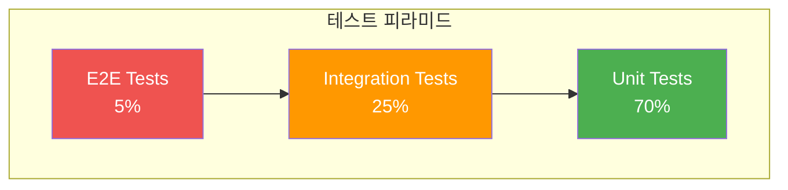

### 16.2 단위 테스트 (Service)

```java
@ExtendWith(MockitoExtension.class)
class KnowledgeServiceImplTest {

    @Mock
    private KnowledgeRepository knowledgeRepository;

    @Mock
    private UserRepository userRepository;

    @Mock
    private KnowledgeMapper knowledgeMapper;

    @Mock
    private ApplicationEventPublisher eventPublisher;

    @InjectMocks
    private KnowledgeServiceImpl knowledgeService;

    private User testUser;
    private Knowledge testKnowledge;

    @BeforeEach
    void setUp() {
        testUser = User.builder()
            .id(UUID.randomUUID())
            .email("test@example.com")
            .name("Test User")
            .build();

        testKnowledge = Knowledge.builder()
            .id(UUID.randomUUID())
            .title("Test Knowledge")
            .content("Test Content")
            .author(testUser)
            .visibility(Visibility.PUBLIC)
            .build();
    }

    @Test
    @DisplayName("ID로 지식 조회 성공")
    void findById_Success() {
        // Given
        when(knowledgeRepository.findByIdAndIsDeletedFalse(testKnowledge.getId()))
            .thenReturn(Optional.of(testKnowledge));

        // When
        Knowledge result = knowledgeService.findById(testKnowledge.getId());

        // Then
        assertThat(result).isNotNull();
        assertThat(result.getId()).isEqualTo(testKnowledge.getId());
        verify(knowledgeRepository).findByIdAndIsDeletedFalse(testKnowledge.getId());
    }

    @Test
    @DisplayName("존재하지 않는 ID로 조회 시 예외 발생")
    void findById_NotFound_ThrowsException() {
        // Given
        UUID nonExistentId = UUID.randomUUID();
        when(knowledgeRepository.findByIdAndIsDeletedFalse(nonExistentId))
            .thenReturn(Optional.empty());

        // When & Then
        assertThatThrownBy(() -> knowledgeService.findById(nonExistentId))
            .isInstanceOf(KnowledgeNotFoundException.class);
    }

    @Test
    @DisplayName("지식 생성 성공")
    void create_Success() {
        // Given
        KnowledgeCreateRequest request = new KnowledgeCreateRequest(
            "New Title",
            "New Content",
            "POLICY",
            Set.of("tag1", "tag2"),
            null,
            LocalDate.now(),
            LocalDate.now().plusYears(1),
            Visibility.PUBLIC
        );

        when(userRepository.findById(testUser.getId())).thenReturn(Optional.of(testUser));
        when(knowledgeRepository.save(any(Knowledge.class))).thenReturn(testKnowledge);

        // When
        Knowledge result = knowledgeService.create(request, testUser.getId());

        // Then
        assertThat(result).isNotNull();
        verify(knowledgeRepository).save(any(Knowledge.class));
        verify(eventPublisher).publishEvent(any(KnowledgeCreatedEvent.class));
    }
}
```

### 16.3 통합 테스트 (Repository)

```java
@DataJpaTest
@AutoConfigureTestDatabase(replace = AutoConfigureTestDatabase.Replace.NONE)
@Testcontainers
class KnowledgeRepositoryIntegrationTest {

    @Container
    static PostgreSQLContainer<?> postgres = new PostgreSQLContainer<>("postgres:16")
        .withDatabaseName("testdb")
        .withUsername("test")
        .withPassword("test");

    @DynamicPropertySource
    static void configureProperties(DynamicPropertyRegistry registry) {
        registry.add("spring.datasource.url", postgres::getJdbcUrl);
        registry.add("spring.datasource.username", postgres::getUsername);
        registry.add("spring.datasource.password", postgres::getPassword);
    }

    @Autowired
    private KnowledgeRepository knowledgeRepository;

    @Autowired
    private UserRepository userRepository;

    @Autowired
    private TestEntityManager entityManager;

    private User testUser;

    @BeforeEach
    void setUp() {
        testUser = userRepository.save(User.builder()
            .email("test@example.com")
            .name("Test User")
            .role(UserRole.USER)
            .build());
    }

    @Test
    @DisplayName("검색 조건으로 지식 조회")
    void findBySearchCriteria() {
        // Given
        Knowledge knowledge1 = knowledgeRepository.save(Knowledge.builder()
            .title("Policy Document")
            .content("This is a policy")
            .documentType(DocumentType.POLICY)
            .author(testUser)
            .visibility(Visibility.PUBLIC)
            .build());

        Knowledge knowledge2 = knowledgeRepository.save(Knowledge.builder()
            .title("Manual Document")
            .content("This is a manual")
            .documentType(DocumentType.MANUAL)
            .author(testUser)
            .visibility(Visibility.PUBLIC)
            .build());

        entityManager.flush();
        entityManager.clear();

        // When
        Page<Knowledge> result = knowledgeRepository.findBySearchCriteria(
            DocumentType.POLICY,
            null,
            null,
            null,
            null,
            PageRequest.of(0, 10)
        );

        // Then
        assertThat(result.getContent()).hasSize(1);
        assertThat(result.getContent().get(0).getDocumentType()).isEqualTo(DocumentType.POLICY);
    }
}
```

### 16.4 API 테스트 (Controller)

```java
@WebMvcTest(KnowledgeController.class)
@Import({SecurityConfig.class, TestSecurityConfig.class})
class KnowledgeControllerTest {

    @Autowired
    private MockMvc mockMvc;

    @MockBean
    private KnowledgeService knowledgeService;

    @MockBean
    private KnowledgeMapper knowledgeMapper;

    @Autowired
    private ObjectMapper objectMapper;

    @Test
    @DisplayName("지식 목록 조회 API")
    @WithMockUser(roles = "USER")
    void getKnowledgeList() throws Exception {
        // Given
        Page<Knowledge> page = new PageImpl<>(List.of(), PageRequest.of(0, 20), 0);
        when(knowledgeService.findAll(any(), any())).thenReturn(page);

        // When & Then
        mockMvc.perform(get("/api/v1/knowledge")
                .contentType(MediaType.APPLICATION_JSON))
            .andExpect(status().isOk())
            .andExpect(jsonPath("$.success").value(true))
            .andExpect(jsonPath("$.data.content").isArray());
    }

    @Test
    @DisplayName("지식 생성 API - 유효성 검증 실패")
    @WithMockUser(roles = "USER")
    void createKnowledge_ValidationFailed() throws Exception {
        // Given
        KnowledgeCreateRequest request = new KnowledgeCreateRequest(
            "",  // 빈 제목 - 검증 실패
            "Content",
            "POLICY",
            null,
            null,
            null,
            null,
            Visibility.PUBLIC
        );

        // When & Then
        mockMvc.perform(post("/api/v1/knowledge")
                .contentType(MediaType.APPLICATION_JSON)
                .content(objectMapper.writeValueAsString(request)))
            .andExpect(status().isBadRequest())
            .andExpect(jsonPath("$.success").value(false));
    }
}
```

---

## 17. 구현 가이드

### 17.1 구현 순서

```
Phase 1: 기반 구축
├── 1.1 프로젝트 구조 생성 (Gradle 멀티모듈)
├── 1.2 공통 모듈 구현 (exception, dto, util)
├── 1.3 도메인 모듈 구현 (entity, enum)
└── 1.4 JPA 설정 및 Repository 구현

Phase 2: 핵심 기능
├── 2.1 Knowledge CRUD API
├── 2.2 User API 및 인증 연동
├── 2.3 AI Service Client 구현
└── 2.4 Search API 구현

Phase 3: 부가 기능
├── 3.1 Bookmark API
├── 3.2 Dashboard API
├── 3.3 Export API
└── 3.4 캐싱 적용

Phase 4: 품질 확보
├── 4.1 단위 테스트 작성
├── 4.2 통합 테스트 작성
├── 4.3 API 문서화 (Swagger)
└── 4.4 로깅 및 모니터링 설정
```

### 17.2 체크리스트

| 카테고리 | 항목 | 상태 |
|----------|------|------|
| **프로젝트 구조** | Gradle 멀티모듈 설정 | [ ] |
| | 의존성 관리 | [ ] |
| | 패키지 구조 생성 | [ ] |
| **도메인** | JPA 엔티티 구현 | [ ] |
| | Repository 인터페이스 | [ ] |
| | Custom Repository | [ ] |
| **서비스** | Service 인터페이스 | [ ] |
| | Service 구현체 | [ ] |
| | Mapper (MapStruct) | [ ] |
| **API** | Controller 구현 | [ ] |
| | DTO 정의 | [ ] |
| | 유효성 검증 | [ ] |
| **AI 연동** | WebClient 설정 | [ ] |
| | Resilience4j 설정 | [ ] |
| | AI Service Client | [ ] |
| **보안** | Spring Security 설정 | [ ] |
| | JWT 필터 | [ ] |
| | 권한 검사 | [ ] |
| **품질** | 예외 처리 | [ ] |
| | 로깅 설정 | [ ] |
| | 테스트 작성 | [ ] |

### 17.3 주의사항

```
⚠️ 반드시 지켜야 할 규칙:

1. Entity 직접 반환 금지
   - Controller에서 Entity 직접 반환하지 않음
   - 반드시 DTO로 변환하여 반환

2. N+1 문제 방지
   - Fetch Join 또는 EntityGraph 사용
   - default_batch_fetch_size 설정

3. 트랜잭션 범위 최소화
   - Service 레이어에서만 @Transactional
   - 읽기 전용 메서드는 readOnly = true

4. AI Service 호출 시
   - 반드시 Circuit Breaker 적용
   - Fallback 메서드 구현
   - 타임아웃 설정

5. 민감 정보 로깅 금지
   - 비밀번호, 토큰 등 마스킹
   - MDC를 통한 추적 ID 관리
```

---

## 18. AI Service 스트리밍 연동

### 18.1 SSE (Server-Sent Events) 개요

LangGraph 기반 AI Service의 스트리밍 응답을 처리하기 위한 상세 설계입니다.

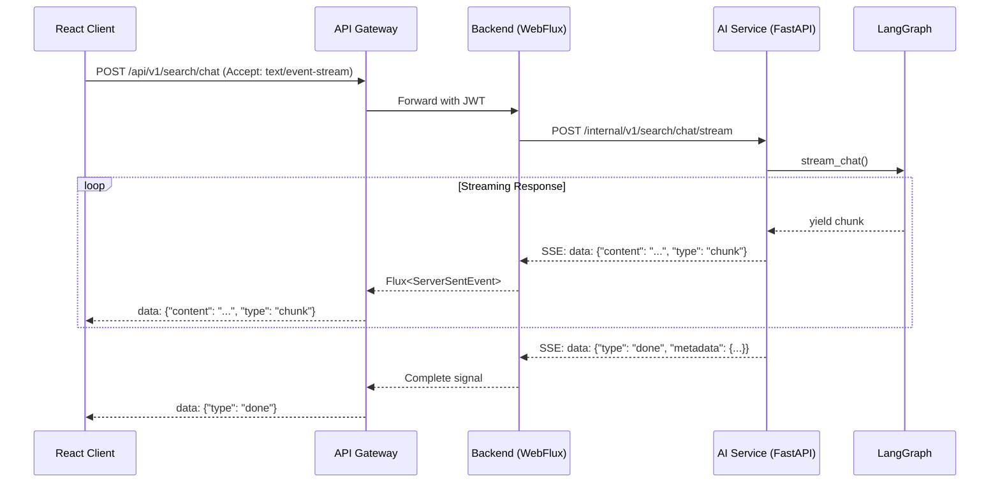

### 18.2 SSE 이벤트 타입 정의

```java
/**
 * AI Service SSE 이벤트 타입
 */
public enum SSEEventType {
    /** 텍스트 청크 (스트리밍 응답) */
    CHUNK("chunk"),

    /** 검색된 출처 정보 */
    SOURCES("sources"),

    /** 에이전트 상태 변경 */
    STATE("state"),

    /** 스트리밍 완료 */
    DONE("done"),

    /** 에러 발생 */
    ERROR("error"),

    /** 하트비트 (연결 유지) */
    HEARTBEAT("heartbeat");

    private final String value;

    SSEEventType(String value) {
        this.value = value;
    }

    public String getValue() {
        return value;
    }
}
```

### 18.3 SSE 응답 DTO

```java
/**
 * SSE 청크 응답
 */
@Data
@Builder
@NoArgsConstructor
@AllArgsConstructor
public class SSEChunkResponse {
    /** 이벤트 타입 */
    private SSEEventType type;

    /** 텍스트 콘텐츠 (CHUNK 타입) */
    private String content;

    /** 출처 목록 (SOURCES 타입) */
    private List<SourceInfo> sources;

    /** 에이전트 상태 (STATE 타입) */
    private AgentState state;

    /** 메타데이터 (DONE 타입) */
    private StreamMetadata metadata;

    /** 에러 정보 (ERROR 타입) */
    private ErrorInfo error;

    /** 타임스탬프 */
    private Instant timestamp;
}

@Data
@Builder
public class SourceInfo {
    private UUID knowledgeId;
    private UUID chunkId;
    private String title;
    private Float score;
    private String snippet;
}

@Data
@Builder
public class AgentState {
    private String currentNode;
    private String status;  // "thinking", "searching", "generating"
    private Integer stepNumber;
}

@Data
@Builder
public class StreamMetadata {
    private Integer totalTokens;
    private Long processingTimeMs;
    private UUID conversationId;
    private Integer sourcesCount;
}
```

### 18.4 스트리밍 Controller

```java
@RestController
@RequestMapping("/api/v1/chat")
@RequiredArgsConstructor
@Slf4j
public class ChatStreamController {

    private final ChatStreamService chatStreamService;

    /**
     * SSE 기반 채팅 스트리밍 엔드포인트
     */
    @GetMapping(value = "/stream", produces = MediaType.TEXT_EVENT_STREAM_VALUE)
    public Flux<ServerSentEvent<SSEChunkResponse>> streamChat(
            @RequestParam String message,
            @RequestParam(required = false) UUID conversationId,
            @AuthenticationPrincipal UserPrincipal user) {

        log.info("Starting chat stream: user={}, conversationId={}",
            user.getId(), conversationId);

        ChatStreamRequest request = ChatStreamRequest.builder()
            .message(message)
            .conversationId(conversationId)
            .userId(user.getId())
            .build();

        return chatStreamService.streamChat(request)
            .map(chunk -> ServerSentEvent.<SSEChunkResponse>builder()
                .id(UUID.randomUUID().toString())
                .event(chunk.getType().getValue())
                .data(chunk)
                .build())
            .doOnCancel(() -> log.info("Chat stream cancelled by client"))
            .doOnComplete(() -> log.info("Chat stream completed"))
            .doOnError(e -> log.error("Chat stream error", e));
    }

    /**
     * POST 방식 스트리밍 (Body 전송 필요 시)
     */
    @PostMapping(value = "/stream", produces = MediaType.TEXT_EVENT_STREAM_VALUE)
    public Flux<ServerSentEvent<SSEChunkResponse>> streamChatPost(
            @Valid @RequestBody ChatStreamRequest request,
            @AuthenticationPrincipal UserPrincipal user) {

        request.setUserId(user.getId());

        return chatStreamService.streamChat(request)
            .map(chunk -> ServerSentEvent.<SSEChunkResponse>builder()
                .id(UUID.randomUUID().toString())
                .event(chunk.getType().getValue())
                .data(chunk)
                .build());
    }
}
```

### 18.5 스트리밍 Service

```java
@Service
@RequiredArgsConstructor
@Slf4j
public class ChatStreamService {

    private final AIServiceClient aiServiceClient;
    private final ConversationRepository conversationRepository;
    private final ObjectMapper objectMapper;

    /** 하트비트 간격 (ms) */
    private static final Duration HEARTBEAT_INTERVAL = Duration.ofSeconds(15);

    /** 스트림 타임아웃 (ms) */
    private static final Duration STREAM_TIMEOUT = Duration.ofMinutes(5);

    /**
     * AI Service 스트리밍 응답 처리
     */
    @CircuitBreaker(name = "aiService", fallbackMethod = "streamChatFallback")
    public Flux<SSEChunkResponse> streamChat(ChatStreamRequest request) {
        // 대화 ID가 없으면 새로 생성
        UUID conversationId = request.getConversationId() != null
            ? request.getConversationId()
            : UUID.randomUUID();

        // AI Service 요청
        AIChatStreamRequest aiRequest = AIChatStreamRequest.builder()
            .query(request.getMessage())
            .conversationId(conversationId)
            .userId(request.getUserId())
            .historyLimit(5)
            .build();

        // 메인 스트림과 하트비트 병합
        Flux<SSEChunkResponse> mainStream = aiServiceClient.streamChatRaw(aiRequest)
            .map(this::parseSSEEvent)
            .filter(Objects::nonNull);

        Flux<SSEChunkResponse> heartbeat = Flux.interval(HEARTBEAT_INTERVAL)
            .map(i -> SSEChunkResponse.builder()
                .type(SSEEventType.HEARTBEAT)
                .timestamp(Instant.now())
                .build());

        return Flux.merge(mainStream, heartbeat)
            .takeUntil(chunk -> chunk.getType() == SSEEventType.DONE
                             || chunk.getType() == SSEEventType.ERROR)
            .timeout(STREAM_TIMEOUT)
            .doOnComplete(() -> saveConversation(request, conversationId))
            .doOnError(e -> log.error("Stream error for conversation {}", conversationId, e));
    }

    /**
     * SSE 이벤트 파싱
     */
    private SSEChunkResponse parseSSEEvent(String sseData) {
        try {
            // "data: " 접두사 제거
            String json = sseData.startsWith("data: ")
                ? sseData.substring(6)
                : sseData;

            if (json.isBlank() || json.equals("[DONE]")) {
                return SSEChunkResponse.builder()
                    .type(SSEEventType.DONE)
                    .timestamp(Instant.now())
                    .build();
            }

            return objectMapper.readValue(json, SSEChunkResponse.class);
        } catch (JsonProcessingException e) {
            log.warn("Failed to parse SSE event: {}", sseData, e);
            return null;
        }
    }

    /**
     * 대화 기록 저장
     */
    @Async
    protected void saveConversation(ChatStreamRequest request, UUID conversationId) {
        try {
            Conversation conversation = conversationRepository
                .findById(conversationId)
                .orElseGet(() -> Conversation.builder()
                    .id(conversationId)
                    .userId(request.getUserId())
                    .title(truncate(request.getMessage(), 100))
                    .build());

            conversation.incrementMessageCount();
            conversation.setLastMessageAt(Instant.now());
            conversationRepository.save(conversation);
        } catch (Exception e) {
            log.warn("Failed to save conversation: {}", conversationId, e);
        }
    }

    /**
     * Fallback 메서드
     */
    public Flux<SSEChunkResponse> streamChatFallback(ChatStreamRequest request, Throwable t) {
        log.warn("Chat stream fallback triggered: {}", t.getMessage());

        return Flux.just(
            SSEChunkResponse.builder()
                .type(SSEEventType.ERROR)
                .error(ErrorInfo.builder()
                    .code("AI_SERVICE_UNAVAILABLE")
                    .message("AI 서비스가 일시적으로 응답하지 않습니다. 잠시 후 다시 시도해주세요.")
                    .build())
                .timestamp(Instant.now())
                .build()
        );
    }

    private String truncate(String text, int maxLength) {
        return text.length() > maxLength
            ? text.substring(0, maxLength - 3) + "..."
            : text;
    }
}
```

### 18.6 WebClient SSE 처리

```java
@Component
@RequiredArgsConstructor
@Slf4j
public class AIServiceClient {

    private final WebClient aiServiceWebClient;

    /**
     * Raw SSE 스트림 수신
     */
    public Flux<String> streamChatRaw(AIChatStreamRequest request) {
        return aiServiceWebClient.post()
            .uri("/internal/v1/search/chat/stream")
            .bodyValue(request)
            .accept(MediaType.TEXT_EVENT_STREAM)
            .retrieve()
            .onStatus(HttpStatusCode::isError, response ->
                response.bodyToMono(String.class)
                    .flatMap(body -> Mono.error(
                        new AIServiceException("AI Service error: " + body))))
            .bodyToFlux(String.class)
            .filter(data -> !data.isBlank());
    }
}
```

### 18.7 SSE 연결 상태 다이어그램

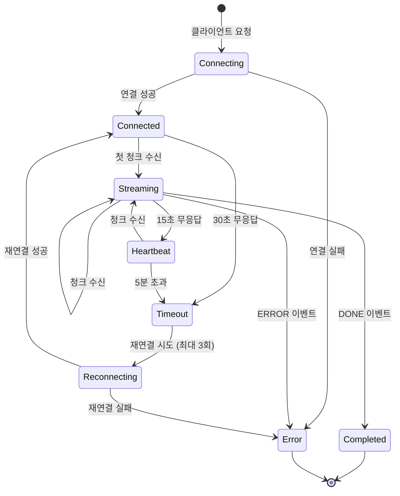

---

## 19. Prometheus 메트릭 정의

### 19.1 메트릭 개요

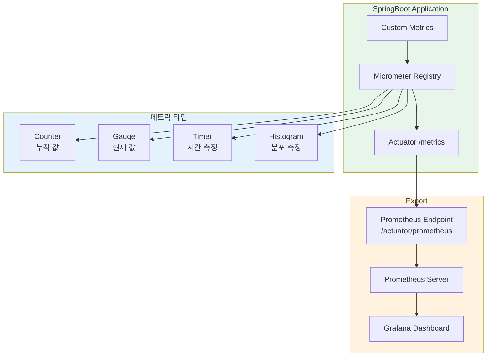

### 19.2 의존성 설정

```kotlin
// build.gradle.kts
dependencies {
    implementation("org.springframework.boot:spring-boot-starter-actuator")
    implementation("io.micrometer:micrometer-registry-prometheus")
}
```

### 19.3 Actuator 설정

```yaml
# application.yml
management:
  endpoints:
    web:
      exposure:
        include: health, info, metrics, prometheus
      base-path: /actuator
  endpoint:
    health:
      show-details: when_authorized
    prometheus:
      enabled: true
  metrics:
    tags:
      application: ${spring.application.name}
      environment: ${spring.profiles.active:local}
    distribution:
      percentiles-histogram:
        http.server.requests: true
      slo:
        http.server.requests: 100ms, 500ms, 1s, 3s
```

### 19.4 커스텀 메트릭 정의

```java
@Configuration
public class MetricsConfig {

    @Bean
    MeterRegistryCustomizer<MeterRegistry> metricsCommonTags(
            @Value("${spring.application.name}") String appName) {
        return registry -> registry.config()
            .commonTags("application", appName);
    }
}

/**
 * 비즈니스 메트릭 서비스
 */
@Component
@RequiredArgsConstructor
@Slf4j
public class BusinessMetrics {

    private final MeterRegistry registry;

    // ===== Counters (누적 값) =====

    /** 검색 요청 총 수 */
    private Counter searchRequestCounter;

    /** 검색 성공/실패 카운터 */
    private Counter searchSuccessCounter;
    private Counter searchFailureCounter;

    /** AI 서비스 호출 수 */
    private Counter aiServiceCallCounter;

    /** 문서 생성/수정/삭제 수 */
    private Counter knowledgeCreatedCounter;
    private Counter knowledgeUpdatedCounter;
    private Counter knowledgeDeletedCounter;

    // ===== Gauges (현재 값) =====

    /** 현재 활성 사용자 수 */
    private AtomicInteger activeUsers = new AtomicInteger(0);

    /** 현재 진행 중인 스트리밍 연결 수 */
    private AtomicInteger activeStreams = new AtomicInteger(0);

    // ===== Timers (시간 측정) =====

    /** 검색 응답 시간 */
    private Timer searchResponseTimer;

    /** AI 서비스 응답 시간 */
    private Timer aiServiceResponseTimer;

    /** 문서 처리 시간 */
    private Timer documentProcessingTimer;

    @PostConstruct
    public void initMetrics() {
        // Counters
        searchRequestCounter = Counter.builder("search.requests.total")
            .description("Total number of search requests")
            .register(registry);

        searchSuccessCounter = Counter.builder("search.requests.success")
            .description("Number of successful searches")
            .register(registry);

        searchFailureCounter = Counter.builder("search.requests.failure")
            .description("Number of failed searches")
            .register(registry);

        aiServiceCallCounter = Counter.builder("ai.service.calls.total")
            .description("Total AI service API calls")
            .register(registry);

        knowledgeCreatedCounter = Counter.builder("knowledge.operations")
            .tag("operation", "create")
            .description("Knowledge document operations")
            .register(registry);

        knowledgeUpdatedCounter = Counter.builder("knowledge.operations")
            .tag("operation", "update")
            .register(registry);

        knowledgeDeletedCounter = Counter.builder("knowledge.operations")
            .tag("operation", "delete")
            .register(registry);

        // Gauges
        Gauge.builder("users.active", activeUsers, AtomicInteger::get)
            .description("Currently active users")
            .register(registry);

        Gauge.builder("streams.active", activeStreams, AtomicInteger::get)
            .description("Currently active SSE streams")
            .register(registry);

        // Timers
        searchResponseTimer = Timer.builder("search.response.time")
            .description("Search response time")
            .publishPercentileHistogram()
            .sla(Duration.ofMillis(500), Duration.ofSeconds(1), Duration.ofSeconds(3))
            .register(registry);

        aiServiceResponseTimer = Timer.builder("ai.service.response.time")
            .description("AI service response time")
            .publishPercentileHistogram()
            .register(registry);

        documentProcessingTimer = Timer.builder("document.processing.time")
            .description("Document processing time")
            .publishPercentileHistogram()
            .register(registry);
    }

    // ===== Public Methods =====

    public void recordSearchRequest() {
        searchRequestCounter.increment();
    }

    public void recordSearchSuccess(long durationMs) {
        searchSuccessCounter.increment();
        searchResponseTimer.record(Duration.ofMillis(durationMs));
    }

    public void recordSearchFailure(String reason) {
        searchFailureCounter.increment();
        Counter.builder("search.failures")
            .tag("reason", reason)
            .register(registry)
            .increment();
    }

    public void recordAIServiceCall(String endpoint, long durationMs, boolean success) {
        aiServiceCallCounter.increment();
        aiServiceResponseTimer.record(Duration.ofMillis(durationMs));

        Counter.builder("ai.service.calls")
            .tag("endpoint", endpoint)
            .tag("success", String.valueOf(success))
            .register(registry)
            .increment();
    }

    public void recordKnowledgeCreated() {
        knowledgeCreatedCounter.increment();
    }

    public void recordKnowledgeUpdated() {
        knowledgeUpdatedCounter.increment();
    }

    public void recordKnowledgeDeleted() {
        knowledgeDeletedCounter.increment();
    }

    public void incrementActiveUsers() {
        activeUsers.incrementAndGet();
    }

    public void decrementActiveUsers() {
        activeUsers.decrementAndGet();
    }

    public void incrementActiveStreams() {
        activeStreams.incrementAndGet();
    }

    public void decrementActiveStreams() {
        activeStreams.decrementAndGet();
    }

    public Timer.Sample startTimer() {
        return Timer.start(registry);
    }

    public void stopDocumentProcessingTimer(Timer.Sample sample) {
        sample.stop(documentProcessingTimer);
    }
}
```

### 19.5 메트릭 수집 AOP

```java
@Aspect
@Component
@RequiredArgsConstructor
@Slf4j
public class MetricsAspect {

    private final BusinessMetrics metrics;

    /**
     * Service 레이어 메서드 실행 시간 측정
     */
    @Around("execution(* com.company.platform.service.*.*(..))")
    public Object measureServiceTime(ProceedingJoinPoint joinPoint) throws Throwable {
        Timer.Sample sample = metrics.startTimer();
        String methodName = joinPoint.getSignature().getName();
        String className = joinPoint.getTarget().getClass().getSimpleName();

        try {
            Object result = joinPoint.proceed();
            recordMethodMetric(className, methodName, sample, true);
            return result;
        } catch (Exception e) {
            recordMethodMetric(className, methodName, sample, false);
            throw e;
        }
    }

    private void recordMethodMetric(String className, String methodName,
                                     Timer.Sample sample, boolean success) {
        // 메서드별 타이머에 기록
        Timer timer = Timer.builder("service.method.time")
            .tag("class", className)
            .tag("method", methodName)
            .tag("success", String.valueOf(success))
            .register(metrics.getRegistry());

        sample.stop(timer);
    }
}
```

### 19.6 Prometheus 메트릭 예시

```
# 검색 메트릭
search_requests_total{application="backend-service"} 12543
search_requests_success{application="backend-service"} 12001
search_requests_failure{application="backend-service"} 542

# 응답 시간 히스토그램
search_response_time_seconds_bucket{le="0.5"} 8234
search_response_time_seconds_bucket{le="1.0"} 10892
search_response_time_seconds_bucket{le="3.0"} 12001
search_response_time_seconds_bucket{le="+Inf"} 12001
search_response_time_seconds_count 12001
search_response_time_seconds_sum 4521.234

# AI 서비스 메트릭
ai_service_calls_total{endpoint="hybrid_search",success="true"} 5432
ai_service_calls_total{endpoint="chat_stream",success="true"} 2341
ai_service_response_time_seconds_bucket{le="1.0"} 4532
ai_service_response_time_seconds_bucket{le="3.0"} 5200

# 현재 활성 연결
users_active{application="backend-service"} 45
streams_active{application="backend-service"} 12

# Circuit Breaker 상태
resilience4j_circuitbreaker_state{name="aiService",state="closed"} 1
resilience4j_circuitbreaker_calls_total{name="aiService",kind="successful"} 5432
resilience4j_circuitbreaker_calls_total{name="aiService",kind="failed"} 23
```

---

## 20. Saga 패턴 트랜잭션

### 20.1 Saga 패턴 개요

분산 트랜잭션 처리를 위한 Choreography 기반 Saga 패턴 설계입니다.

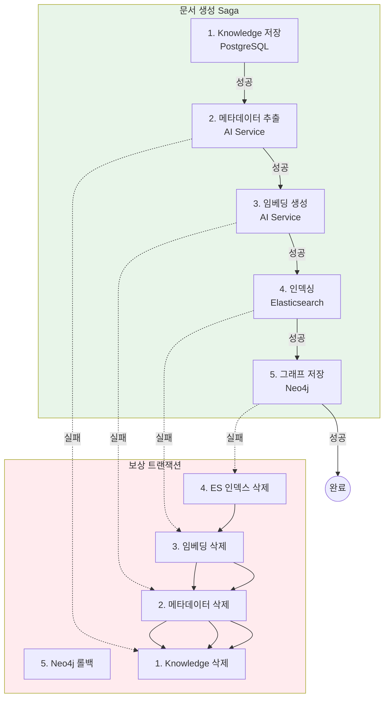

### 20.2 Saga 상태 Enum

```java
/**
 * Saga 실행 상태
 */
public enum SagaStatus {
    /** 시작됨 */
    STARTED,

    /** 단계 실행 중 */
    STEP_IN_PROGRESS,

    /** 단계 완료 */
    STEP_COMPLETED,

    /** 보상 트랜잭션 실행 중 */
    COMPENSATING,

    /** Saga 완료 */
    COMPLETED,

    /** Saga 실패 */
    FAILED,

    /** 보상 트랜잭션 완료 */
    COMPENSATED
}
```

### 20.3 Saga 실행 엔티티

```java
@Entity
@Table(name = "saga_executions")
@Getter
@NoArgsConstructor(access = AccessLevel.PROTECTED)
public class SagaExecution extends BaseTimeEntity {

    @Id
    @GeneratedValue(strategy = GenerationType.UUID)
    private UUID id;

    @Column(nullable = false)
    private String sagaType;

    @Column(nullable = false)
    private String correlationId;

    @Enumerated(EnumType.STRING)
    @Column(nullable = false)
    private SagaStatus status;

    @Column(nullable = false)
    private Integer currentStep;

    @Column(columnDefinition = "TEXT")
    private String payload;

    @Column(columnDefinition = "TEXT")
    private String completedSteps;

    @Column(columnDefinition = "TEXT")
    private String failureReason;

    @Column
    private Instant completedAt;

    public static SagaExecution start(String sagaType, String correlationId, String payload) {
        SagaExecution execution = new SagaExecution();
        execution.sagaType = sagaType;
        execution.correlationId = correlationId;
        execution.payload = payload;
        execution.status = SagaStatus.STARTED;
        execution.currentStep = 0;
        execution.completedSteps = "[]";
        return execution;
    }

    public void advanceStep(String stepName) {
        this.currentStep++;
        this.status = SagaStatus.STEP_IN_PROGRESS;
        addCompletedStep(stepName);
    }

    public void complete() {
        this.status = SagaStatus.COMPLETED;
        this.completedAt = Instant.now();
    }

    public void fail(String reason) {
        this.status = SagaStatus.FAILED;
        this.failureReason = reason;
        this.completedAt = Instant.now();
    }

    public void startCompensation() {
        this.status = SagaStatus.COMPENSATING;
    }

    public void compensated() {
        this.status = SagaStatus.COMPENSATED;
        this.completedAt = Instant.now();
    }

    private void addCompletedStep(String stepName) {
        // JSON 배열에 추가
        List<String> steps = parseCompletedSteps();
        steps.add(stepName);
        this.completedSteps = JsonUtils.toJson(steps);
    }

    public List<String> parseCompletedSteps() {
        return JsonUtils.fromJsonList(this.completedSteps, String.class);
    }
}
```

### 20.4 Saga 오케스트레이터

```java
/**
 * 문서 생성 Saga 오케스트레이터
 */
@Component
@RequiredArgsConstructor
@Slf4j
public class DocumentCreationSagaOrchestrator {

    private final SagaExecutionRepository sagaRepository;
    private final KnowledgeRepository knowledgeRepository;
    private final AIServiceClient aiServiceClient;
    private final ElasticsearchClient esClient;
    private final Neo4jClient neo4jClient;
    private final ApplicationEventPublisher eventPublisher;

    private static final String SAGA_TYPE = "DOCUMENT_CREATION";

    /**
     * Saga 실행
     */
    @Transactional
    public UUID execute(DocumentCreationRequest request) {
        String correlationId = UUID.randomUUID().toString();

        // Saga 실행 기록 생성
        SagaExecution saga = SagaExecution.start(
            SAGA_TYPE,
            correlationId,
            JsonUtils.toJson(request)
        );
        sagaRepository.save(saga);

        try {
            // Step 1: Knowledge 저장
            Knowledge knowledge = executeStep1_SaveKnowledge(saga, request);

            // Step 2: 메타데이터 추출
            AIMetadataResponse metadata = executeStep2_ExtractMetadata(saga, knowledge);

            // Step 3: 임베딩 생성
            List<Float> embedding = executeStep3_CreateEmbedding(saga, knowledge);

            // Step 4: Elasticsearch 인덱싱
            executeStep4_IndexDocument(saga, knowledge, embedding);

            // Step 5: Neo4j 그래프 저장
            executeStep5_SaveGraph(saga, knowledge, metadata);

            // 완료
            saga.complete();
            sagaRepository.save(saga);

            eventPublisher.publishEvent(new SagaCompletedEvent(saga));

            return knowledge.getId();

        } catch (Exception e) {
            log.error("Saga failed: correlationId={}", correlationId, e);
            saga.fail(e.getMessage());
            sagaRepository.save(saga);

            // 보상 트랜잭션 실행
            compensate(saga);

            throw new SagaFailedException("Document creation failed", e);
        }
    }

    /**
     * Step 1: Knowledge 저장
     */
    private Knowledge executeStep1_SaveKnowledge(SagaExecution saga,
                                                   DocumentCreationRequest request) {
        saga.advanceStep("SAVE_KNOWLEDGE");
        sagaRepository.save(saga);

        Knowledge knowledge = Knowledge.builder()
            .title(request.getTitle())
            .content(request.getContent())
            .documentType(request.getDocumentType())
            .visibility(request.getVisibility())
            .createdBy(request.getUserId())
            .build();

        return knowledgeRepository.save(knowledge);
    }

    /**
     * Step 2: 메타데이터 추출
     */
    private AIMetadataResponse executeStep2_ExtractMetadata(SagaExecution saga,
                                                             Knowledge knowledge) {
        saga.advanceStep("EXTRACT_METADATA");
        sagaRepository.save(saga);

        return aiServiceClient.extractMetadata(
            AIMetadataRequest.builder()
                .content(knowledge.getContent())
                .documentType(knowledge.getDocumentType().name())
                .build()
        ).block(Duration.ofSeconds(30));
    }

    /**
     * Step 3: 임베딩 생성
     */
    private List<Float> executeStep3_CreateEmbedding(SagaExecution saga,
                                                      Knowledge knowledge) {
        saga.advanceStep("CREATE_EMBEDDING");
        sagaRepository.save(saga);

        return aiServiceClient.createEmbedding(
            AIEmbeddingRequest.builder()
                .text(knowledge.getTitle() + "\n" + knowledge.getContent())
                .build()
        ).block(Duration.ofSeconds(30)).getEmbedding();
    }

    /**
     * Step 4: Elasticsearch 인덱싱
     */
    private void executeStep4_IndexDocument(SagaExecution saga,
                                             Knowledge knowledge,
                                             List<Float> embedding) {
        saga.advanceStep("INDEX_DOCUMENT");
        sagaRepository.save(saga);

        esClient.indexDocument(KnowledgeDocument.builder()
            .id(knowledge.getId().toString())
            .title(knowledge.getTitle())
            .content(knowledge.getContent())
            .embedding(embedding)
            .documentType(knowledge.getDocumentType().name())
            .createdAt(knowledge.getCreatedAt())
            .build());
    }

    /**
     * Step 5: Neo4j 그래프 저장
     */
    private void executeStep5_SaveGraph(SagaExecution saga,
                                         Knowledge knowledge,
                                         AIMetadataResponse metadata) {
        saga.advanceStep("SAVE_GRAPH");
        sagaRepository.save(saga);

        neo4jClient.createKnowledgeNode(
            knowledge.getId(),
            knowledge.getTitle(),
            metadata.getEntities(),
            metadata.getRelationships()
        );
    }

    /**
     * 보상 트랜잭션 실행
     */
    private void compensate(SagaExecution saga) {
        saga.startCompensation();
        sagaRepository.save(saga);

        List<String> completedSteps = saga.parseCompletedSteps();

        // 역순으로 보상 트랜잭션 실행
        for (int i = completedSteps.size() - 1; i >= 0; i--) {
            String step = completedSteps.get(i);
            try {
                switch (step) {
                    case "SAVE_GRAPH" -> compensateStep5_DeleteGraph(saga);
                    case "INDEX_DOCUMENT" -> compensateStep4_DeleteIndex(saga);
                    case "CREATE_EMBEDDING" -> compensateStep3_DeleteEmbedding(saga);
                    case "EXTRACT_METADATA" -> compensateStep2_DeleteMetadata(saga);
                    case "SAVE_KNOWLEDGE" -> compensateStep1_DeleteKnowledge(saga);
                }
            } catch (Exception e) {
                log.error("Compensation failed for step {}: {}", step, e.getMessage());
                // 보상 실패는 로깅하고 계속 진행
            }
        }

        saga.compensated();
        sagaRepository.save(saga);
    }

    private void compensateStep1_DeleteKnowledge(SagaExecution saga) {
        DocumentCreationRequest request = JsonUtils.fromJson(
            saga.getPayload(), DocumentCreationRequest.class);
        knowledgeRepository.deleteByCorrelationId(saga.getCorrelationId());
        log.info("Compensated: Knowledge deleted for saga {}", saga.getId());
    }

    private void compensateStep4_DeleteIndex(SagaExecution saga) {
        esClient.deleteDocument(saga.getCorrelationId());
        log.info("Compensated: ES index deleted for saga {}", saga.getId());
    }

    private void compensateStep5_DeleteGraph(SagaExecution saga) {
        neo4jClient.deleteKnowledgeNode(saga.getCorrelationId());
        log.info("Compensated: Neo4j node deleted for saga {}", saga.getId());
    }

    // 나머지 보상 메서드들...
}
```

### 20.5 Saga 상태 모니터링

```java
@RestController
@RequestMapping("/internal/admin/sagas")
@RequiredArgsConstructor
public class SagaAdminController {

    private final SagaExecutionRepository sagaRepository;

    @GetMapping
    public Page<SagaExecution> listSagas(
            @RequestParam(required = false) SagaStatus status,
            Pageable pageable) {
        if (status != null) {
            return sagaRepository.findByStatus(status, pageable);
        }
        return sagaRepository.findAll(pageable);
    }

    @GetMapping("/{id}")
    public SagaExecution getSaga(@PathVariable UUID id) {
        return sagaRepository.findById(id)
            .orElseThrow(() -> new ResourceNotFoundException("Saga not found: " + id));
    }

    @PostMapping("/{id}/retry")
    public SagaExecution retrySaga(@PathVariable UUID id) {
        // 실패한 Saga 재시도 로직
        // ...
    }
}
```

---

## 21. Rate Limiting 구현

### 21.1 Rate Limiting 개요

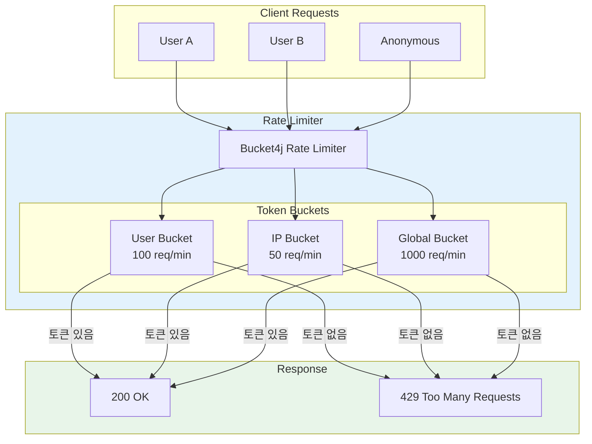

### 21.2 의존성 설정

```kotlin
// build.gradle.kts
dependencies {
    implementation("com.bucket4j:bucket4j-core:8.7.0")
    implementation("com.bucket4j:bucket4j-redis:8.7.0")
}
```

### 21.3 Rate Limit 설정

```yaml
# application.yml
rate-limit:
  enabled: true

  # 사용자별 제한
  user:
    capacity: 100
    refill-tokens: 100
    refill-duration: 1m

  # IP별 제한 (비인증 요청)
  ip:
    capacity: 50
    refill-tokens: 50
    refill-duration: 1m

  # 전역 제한
  global:
    capacity: 1000
    refill-tokens: 1000
    refill-duration: 1m

  # 엔드포인트별 커스텀 제한
  endpoints:
    - path: "/api/v1/search/**"
      capacity: 30
      refill-tokens: 30
      refill-duration: 1m
    - path: "/api/v1/chat/**"
      capacity: 20
      refill-tokens: 20
      refill-duration: 1m
```

### 21.4 Rate Limiter 구현

```java
@Configuration
@ConfigurationProperties(prefix = "rate-limit")
@Data
public class RateLimitConfig {
    private boolean enabled = true;
    private BucketConfig user;
    private BucketConfig ip;
    private BucketConfig global;
    private List<EndpointRateLimit> endpoints;

    @Data
    public static class BucketConfig {
        private long capacity;
        private long refillTokens;
        private Duration refillDuration;
    }

    @Data
    public static class EndpointRateLimit {
        private String path;
        private long capacity;
        private long refillTokens;
        private Duration refillDuration;
    }
}

/**
 * Bucket4j 기반 Rate Limiter
 */
@Component
@RequiredArgsConstructor
@Slf4j
public class RateLimiterService {

    private final RateLimitConfig config;
    private final RedisTemplate<String, String> redisTemplate;

    // In-Memory 캐시 (Redis 장애 시 Fallback)
    private final Map<String, Bucket> localBuckets = new ConcurrentHashMap<>();

    /**
     * 요청 허용 여부 확인
     */
    public RateLimitResult tryConsume(String key, RateLimitType type) {
        if (!config.isEnabled()) {
            return RateLimitResult.allowed();
        }

        Bucket bucket = resolveBucket(key, type);
        ConsumptionProbe probe = bucket.tryConsumeAndReturnRemaining(1);

        if (probe.isConsumed()) {
            return RateLimitResult.allowed(
                probe.getRemainingTokens(),
                probe.getNanosToWaitForRefill()
            );
        } else {
            log.warn("Rate limit exceeded: key={}, type={}", key, type);
            return RateLimitResult.exceeded(
                0,
                probe.getNanosToWaitForRefill()
            );
        }
    }

    /**
     * 버킷 조회 또는 생성
     */
    private Bucket resolveBucket(String key, RateLimitType type) {
        String bucketKey = type.name() + ":" + key;

        return localBuckets.computeIfAbsent(bucketKey, k -> {
            BucketConfiguration configuration = createBucketConfig(type);
            return Bucket.builder()
                .addLimit(Bandwidth.classic(
                    configuration.getCapacity(),
                    Refill.greedy(
                        configuration.getRefillTokens(),
                        configuration.getRefillDuration()
                    )
                ))
                .build();
        });
    }

    private RateLimitConfig.BucketConfig createBucketConfig(RateLimitType type) {
        return switch (type) {
            case USER -> config.getUser();
            case IP -> config.getIp();
            case GLOBAL -> config.getGlobal();
        };
    }
}

public enum RateLimitType {
    USER, IP, GLOBAL
}

@Data
@Builder
public class RateLimitResult {
    private boolean allowed;
    private long remainingTokens;
    private long retryAfterNanos;

    public static RateLimitResult allowed() {
        return RateLimitResult.builder().allowed(true).build();
    }

    public static RateLimitResult allowed(long remaining, long retryAfter) {
        return RateLimitResult.builder()
            .allowed(true)
            .remainingTokens(remaining)
            .retryAfterNanos(retryAfter)
            .build();
    }

    public static RateLimitResult exceeded(long remaining, long retryAfter) {
        return RateLimitResult.builder()
            .allowed(false)
            .remainingTokens(remaining)
            .retryAfterNanos(retryAfter)
            .build();
    }
}
```

### 21.5 Rate Limit 필터

```java
@Component
@Order(Ordered.HIGHEST_PRECEDENCE)
@RequiredArgsConstructor
@Slf4j
public class RateLimitFilter extends OncePerRequestFilter {

    private final RateLimiterService rateLimiterService;

    @Override
    protected void doFilterInternal(HttpServletRequest request,
                                     HttpServletResponse response,
                                     FilterChain chain)
            throws ServletException, IOException {

        String clientKey = resolveClientKey(request);
        RateLimitType type = resolveRateLimitType(request);

        RateLimitResult result = rateLimiterService.tryConsume(clientKey, type);

        // Rate Limit 헤더 추가
        response.setHeader("X-RateLimit-Remaining",
            String.valueOf(result.getRemainingTokens()));
        response.setHeader("X-RateLimit-Retry-After",
            String.valueOf(TimeUnit.NANOSECONDS.toSeconds(result.getRetryAfterNanos())));

        if (!result.isAllowed()) {
            response.setStatus(HttpStatus.TOO_MANY_REQUESTS.value());
            response.setContentType(MediaType.APPLICATION_JSON_VALUE);
            response.getWriter().write("""
                {
                    "success": false,
                    "error": {
                        "code": "RATE_LIMIT_EXCEEDED",
                        "message": "요청 한도를 초과했습니다. 잠시 후 다시 시도해주세요.",
                        "retryAfterSeconds": %d
                    }
                }
                """.formatted(TimeUnit.NANOSECONDS.toSeconds(result.getRetryAfterNanos())));
            return;
        }

        chain.doFilter(request, response);
    }

    private String resolveClientKey(HttpServletRequest request) {
        // 인증된 사용자: userId
        Authentication auth = SecurityContextHolder.getContext().getAuthentication();
        if (auth != null && auth.isAuthenticated() &&
            !(auth instanceof AnonymousAuthenticationToken)) {
            return "user:" + auth.getName();
        }

        // 비인증: IP 주소
        return "ip:" + getClientIp(request);
    }

    private String getClientIp(HttpServletRequest request) {
        String xForwardedFor = request.getHeader("X-Forwarded-For");
        if (xForwardedFor != null && !xForwardedFor.isBlank()) {
            return xForwardedFor.split(",")[0].trim();
        }
        return request.getRemoteAddr();
    }

    private RateLimitType resolveRateLimitType(HttpServletRequest request) {
        Authentication auth = SecurityContextHolder.getContext().getAuthentication();
        if (auth != null && auth.isAuthenticated() &&
            !(auth instanceof AnonymousAuthenticationToken)) {
            return RateLimitType.USER;
        }
        return RateLimitType.IP;
    }
}
```

### 21.6 Rate Limit 어노테이션

```java
/**
 * 메서드 레벨 Rate Limit 어노테이션
 */
@Target(ElementType.METHOD)
@Retention(RetentionPolicy.RUNTIME)
public @interface RateLimit {
    /** 버킷 용량 */
    long capacity() default 10;

    /** 리필 토큰 수 */
    long refillTokens() default 10;

    /** 리필 주기 (초) */
    long refillSeconds() default 60;

    /** 키 생성 전략 */
    RateLimitKeyType keyType() default RateLimitKeyType.USER;
}

public enum RateLimitKeyType {
    USER, IP, METHOD
}

/**
 * Rate Limit AOP
 */
@Aspect
@Component
@RequiredArgsConstructor
public class RateLimitAspect {

    private final RateLimiterService rateLimiterService;

    @Around("@annotation(rateLimit)")
    public Object checkRateLimit(ProceedingJoinPoint joinPoint, RateLimit rateLimit)
            throws Throwable {

        String key = generateKey(joinPoint, rateLimit);
        RateLimitResult result = rateLimiterService.tryConsume(key, RateLimitType.USER);

        if (!result.isAllowed()) {
            throw new RateLimitExceededException(
                "요청 한도를 초과했습니다.",
                TimeUnit.NANOSECONDS.toSeconds(result.getRetryAfterNanos())
            );
        }

        return joinPoint.proceed();
    }

    private String generateKey(ProceedingJoinPoint joinPoint, RateLimit rateLimit) {
        String methodName = joinPoint.getSignature().toShortString();
        return switch (rateLimit.keyType()) {
            case USER -> "method:" + methodName + ":" + getCurrentUserId();
            case IP -> "method:" + methodName + ":" + getCurrentIp();
            case METHOD -> "method:" + methodName;
        };
    }
}
```

---

## 22. Liquibase 마이그레이션

### 22.1 Liquibase 개요

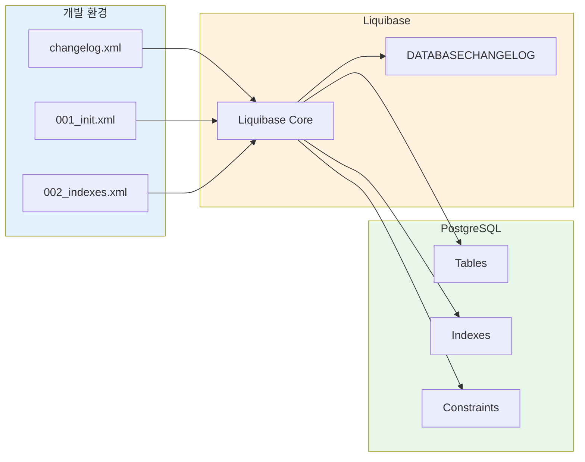

### 22.2 의존성 설정

```kotlin
// build.gradle.kts
dependencies {
    implementation("org.liquibase:liquibase-core")
}
```

### 22.3 Liquibase 설정

```yaml
# application.yml
spring:
  liquibase:
    enabled: true
    change-log: classpath:db/changelog/db.changelog-master.xml
    default-schema: public
    liquibase-schema: public
    database-change-log-table: DATABASECHANGELOG
    database-change-log-lock-table: DATABASECHANGELOGLOCK
```

### 22.4 마스터 Changelog

```xml
<!-- src/main/resources/db/changelog/db.changelog-master.xml -->
<?xml version="1.0" encoding="UTF-8"?>
<databaseChangeLog
    xmlns="http://www.liquibase.org/xml/ns/dbchangelog"
    xmlns:xsi="http://www.w3.org/2001/XMLSchema-instance"
    xsi:schemaLocation="http://www.liquibase.org/xml/ns/dbchangelog
        http://www.liquibase.org/xml/ns/dbchangelog/dbchangelog-4.20.xsd">

    <!-- 환경별 프로퍼티 -->
    <property name="uuid.type" value="uuid" dbms="postgresql"/>
    <property name="uuid.type" value="varchar(36)" dbms="h2"/>

    <property name="timestamp.type" value="timestamp with time zone" dbms="postgresql"/>
    <property name="timestamp.type" value="timestamp" dbms="h2"/>

    <!-- 변경 세트 포함 -->
    <include file="changes/001-init-schema.xml" relativeToChangelogFile="true"/>
    <include file="changes/002-init-indexes.xml" relativeToChangelogFile="true"/>
    <include file="changes/003-init-data.xml" relativeToChangelogFile="true"/>
    <include file="changes/004-add-saga-tables.xml" relativeToChangelogFile="true"/>

</databaseChangeLog>
```

### 22.5 스키마 생성 Changelog

```xml
<!-- src/main/resources/db/changelog/changes/001-init-schema.xml -->
<?xml version="1.0" encoding="UTF-8"?>
<databaseChangeLog
    xmlns="http://www.liquibase.org/xml/ns/dbchangelog"
    xmlns:xsi="http://www.w3.org/2001/XMLSchema-instance"
    xsi:schemaLocation="http://www.liquibase.org/xml/ns/dbchangelog
        http://www.liquibase.org/xml/ns/dbchangelog/dbchangelog-4.20.xsd">

    <!-- Users 테이블 -->
    <changeSet id="001-01-create-users" author="claude-code">
        <preConditions onFail="MARK_RAN">
            <not>
                <tableExists tableName="users"/>
            </not>
        </preConditions>

        <createTable tableName="users">
            <column name="id" type="${uuid.type}">
                <constraints primaryKey="true" nullable="false"/>
            </column>
            <column name="email" type="varchar(255)">
                <constraints nullable="false" unique="true"/>
            </column>
            <column name="name" type="varchar(100)">
                <constraints nullable="false"/>
            </column>
            <column name="department" type="varchar(100)"/>
            <column name="role" type="varchar(50)" defaultValue="USER">
                <constraints nullable="false"/>
            </column>
            <column name="status" type="varchar(50)" defaultValue="ACTIVE">
                <constraints nullable="false"/>
            </column>
            <column name="keycloak_id" type="varchar(255)">
                <constraints unique="true"/>
            </column>
            <column name="last_login_at" type="${timestamp.type}"/>
            <column name="created_at" type="${timestamp.type}" defaultValueComputed="CURRENT_TIMESTAMP">
                <constraints nullable="false"/>
            </column>
            <column name="updated_at" type="${timestamp.type}" defaultValueComputed="CURRENT_TIMESTAMP">
                <constraints nullable="false"/>
            </column>
        </createTable>

        <rollback>
            <dropTable tableName="users"/>
        </rollback>
    </changeSet>

    <!-- Knowledge 테이블 -->
    <changeSet id="001-02-create-knowledge" author="claude-code">
        <preConditions onFail="MARK_RAN">
            <not>
                <tableExists tableName="knowledge"/>
            </not>
        </preConditions>

        <createTable tableName="knowledge">
            <column name="id" type="${uuid.type}">
                <constraints primaryKey="true" nullable="false"/>
            </column>
            <column name="title" type="varchar(500)">
                <constraints nullable="false"/>
            </column>
            <column name="content" type="text">
                <constraints nullable="false"/>
            </column>
            <column name="document_type" type="varchar(50)">
                <constraints nullable="false"/>
            </column>
            <column name="source_type" type="varchar(50)" defaultValue="MANUAL"/>
            <column name="source_url" type="varchar(2000)"/>
            <column name="version" type="integer" defaultValue="1">
                <constraints nullable="false"/>
            </column>
            <column name="visibility" type="varchar(50)" defaultValue="PUBLIC">
                <constraints nullable="false"/>
            </column>
            <column name="project_id" type="${uuid.type}"/>
            <column name="valid_from" type="date"/>
            <column name="valid_until" type="date"/>
            <column name="view_count" type="integer" defaultValue="0"/>
            <column name="quality_score" type="decimal(5,2)"/>
            <column name="created_by" type="${uuid.type}">
                <constraints nullable="false"/>
            </column>
            <column name="updated_by" type="${uuid.type}"/>
            <column name="deleted_at" type="${timestamp.type}"/>
            <column name="created_at" type="${timestamp.type}" defaultValueComputed="CURRENT_TIMESTAMP">
                <constraints nullable="false"/>
            </column>
            <column name="updated_at" type="${timestamp.type}" defaultValueComputed="CURRENT_TIMESTAMP">
                <constraints nullable="false"/>
            </column>
        </createTable>

        <!-- Foreign Key -->
        <addForeignKeyConstraint
            baseTableName="knowledge"
            baseColumnNames="created_by"
            referencedTableName="users"
            referencedColumnNames="id"
            constraintName="fk_knowledge_created_by"
            onDelete="RESTRICT"/>

        <rollback>
            <dropTable tableName="knowledge"/>
        </rollback>
    </changeSet>

    <!-- Conversations 테이블 -->
    <changeSet id="001-03-create-conversations" author="claude-code">
        <createTable tableName="conversations">
            <column name="id" type="${uuid.type}">
                <constraints primaryKey="true" nullable="false"/>
            </column>
            <column name="user_id" type="${uuid.type}">
                <constraints nullable="false"/>
            </column>
            <column name="title" type="varchar(500)"/>
            <column name="message_count" type="integer" defaultValue="0"/>
            <column name="last_message_at" type="${timestamp.type}"/>
            <column name="created_at" type="${timestamp.type}" defaultValueComputed="CURRENT_TIMESTAMP">
                <constraints nullable="false"/>
            </column>
            <column name="updated_at" type="${timestamp.type}" defaultValueComputed="CURRENT_TIMESTAMP">
                <constraints nullable="false"/>
            </column>
        </createTable>

        <addForeignKeyConstraint
            baseTableName="conversations"
            baseColumnNames="user_id"
            referencedTableName="users"
            referencedColumnNames="id"
            constraintName="fk_conversations_user_id"
            onDelete="CASCADE"/>
    </changeSet>

    <!-- Messages 테이블 -->
    <changeSet id="001-04-create-messages" author="claude-code">
        <createTable tableName="messages">
            <column name="id" type="${uuid.type}">
                <constraints primaryKey="true" nullable="false"/>
            </column>
            <column name="conversation_id" type="${uuid.type}">
                <constraints nullable="false"/>
            </column>
            <column name="role" type="varchar(50)">
                <constraints nullable="false"/>
            </column>
            <column name="content" type="text">
                <constraints nullable="false"/>
            </column>
            <column name="sources" type="jsonb"/>
            <column name="metadata" type="jsonb"/>
            <column name="created_at" type="${timestamp.type}" defaultValueComputed="CURRENT_TIMESTAMP">
                <constraints nullable="false"/>
            </column>
        </createTable>

        <addForeignKeyConstraint
            baseTableName="messages"
            baseColumnNames="conversation_id"
            referencedTableName="conversations"
            referencedColumnNames="id"
            constraintName="fk_messages_conversation_id"
            onDelete="CASCADE"/>
    </changeSet>

    <!-- Bookmarks 테이블 -->
    <changeSet id="001-05-create-bookmarks" author="claude-code">
        <createTable tableName="bookmarks">
            <column name="id" type="${uuid.type}">
                <constraints primaryKey="true" nullable="false"/>
            </column>
            <column name="user_id" type="${uuid.type}">
                <constraints nullable="false"/>
            </column>
            <column name="knowledge_id" type="${uuid.type}">
                <constraints nullable="false"/>
            </column>
            <column name="note" type="varchar(1000)"/>
            <column name="created_at" type="${timestamp.type}" defaultValueComputed="CURRENT_TIMESTAMP">
                <constraints nullable="false"/>
            </column>
        </createTable>

        <addForeignKeyConstraint
            baseTableName="bookmarks"
            baseColumnNames="user_id"
            referencedTableName="users"
            referencedColumnNames="id"
            constraintName="fk_bookmarks_user_id"
            onDelete="CASCADE"/>

        <addForeignKeyConstraint
            baseTableName="bookmarks"
            baseColumnNames="knowledge_id"
            referencedTableName="knowledge"
            referencedColumnNames="id"
            constraintName="fk_bookmarks_knowledge_id"
            onDelete="CASCADE"/>

        <addUniqueConstraint
            tableName="bookmarks"
            columnNames="user_id, knowledge_id"
            constraintName="uk_bookmarks_user_knowledge"/>
    </changeSet>

</databaseChangeLog>
```

### 22.6 인덱스 Changelog

```xml
<!-- src/main/resources/db/changelog/changes/002-init-indexes.xml -->
<?xml version="1.0" encoding="UTF-8"?>
<databaseChangeLog
    xmlns="http://www.liquibase.org/xml/ns/dbchangelog"
    xmlns:xsi="http://www.w3.org/2001/XMLSchema-instance"
    xsi:schemaLocation="http://www.liquibase.org/xml/ns/dbchangelog
        http://www.liquibase.org/xml/ns/dbchangelog/dbchangelog-4.20.xsd">

    <!-- Knowledge 인덱스 -->
    <changeSet id="002-01-knowledge-indexes" author="claude-code">
        <createIndex tableName="knowledge" indexName="idx_knowledge_document_type">
            <column name="document_type"/>
        </createIndex>

        <createIndex tableName="knowledge" indexName="idx_knowledge_visibility">
            <column name="visibility"/>
        </createIndex>

        <createIndex tableName="knowledge" indexName="idx_knowledge_project_id">
            <column name="project_id"/>
        </createIndex>

        <createIndex tableName="knowledge" indexName="idx_knowledge_created_by">
            <column name="created_by"/>
        </createIndex>

        <createIndex tableName="knowledge" indexName="idx_knowledge_created_at">
            <column name="created_at" descending="true"/>
        </createIndex>

        <!-- 복합 인덱스: Soft Delete 조회 최적화 -->
        <createIndex tableName="knowledge" indexName="idx_knowledge_deleted_at_created_at">
            <column name="deleted_at"/>
            <column name="created_at" descending="true"/>
        </createIndex>

        <!-- 시간 범위 검색용 인덱스 -->
        <createIndex tableName="knowledge" indexName="idx_knowledge_valid_range">
            <column name="valid_from"/>
            <column name="valid_until"/>
        </createIndex>
    </changeSet>

    <!-- Messages 인덱스 -->
    <changeSet id="002-02-messages-indexes" author="claude-code">
        <createIndex tableName="messages" indexName="idx_messages_conversation_id">
            <column name="conversation_id"/>
        </createIndex>

        <createIndex tableName="messages" indexName="idx_messages_created_at">
            <column name="created_at" descending="true"/>
        </createIndex>
    </changeSet>

    <!-- Users 인덱스 -->
    <changeSet id="002-03-users-indexes" author="claude-code">
        <createIndex tableName="users" indexName="idx_users_keycloak_id">
            <column name="keycloak_id"/>
        </createIndex>

        <createIndex tableName="users" indexName="idx_users_status">
            <column name="status"/>
        </createIndex>
    </changeSet>

</databaseChangeLog>
```

### 22.7 Saga 테이블 Changelog

```xml
<!-- src/main/resources/db/changelog/changes/004-add-saga-tables.xml -->
<?xml version="1.0" encoding="UTF-8"?>
<databaseChangeLog
    xmlns="http://www.liquibase.org/xml/ns/dbchangelog"
    xmlns:xsi="http://www.w3.org/2001/XMLSchema-instance"
    xsi:schemaLocation="http://www.liquibase.org/xml/ns/dbchangelog
        http://www.liquibase.org/xml/ns/dbchangelog/dbchangelog-4.20.xsd">

    <changeSet id="004-01-create-saga-executions" author="claude-code">
        <createTable tableName="saga_executions">
            <column name="id" type="${uuid.type}">
                <constraints primaryKey="true" nullable="false"/>
            </column>
            <column name="saga_type" type="varchar(100)">
                <constraints nullable="false"/>
            </column>
            <column name="correlation_id" type="varchar(255)">
                <constraints nullable="false"/>
            </column>
            <column name="status" type="varchar(50)">
                <constraints nullable="false"/>
            </column>
            <column name="current_step" type="integer">
                <constraints nullable="false"/>
            </column>
            <column name="payload" type="text"/>
            <column name="completed_steps" type="text"/>
            <column name="failure_reason" type="text"/>
            <column name="completed_at" type="${timestamp.type}"/>
            <column name="created_at" type="${timestamp.type}" defaultValueComputed="CURRENT_TIMESTAMP">
                <constraints nullable="false"/>
            </column>
            <column name="updated_at" type="${timestamp.type}" defaultValueComputed="CURRENT_TIMESTAMP">
                <constraints nullable="false"/>
            </column>
        </createTable>

        <createIndex tableName="saga_executions" indexName="idx_saga_correlation_id">
            <column name="correlation_id"/>
        </createIndex>

        <createIndex tableName="saga_executions" indexName="idx_saga_status">
            <column name="status"/>
        </createIndex>

        <createIndex tableName="saga_executions" indexName="idx_saga_type_status">
            <column name="saga_type"/>
            <column name="status"/>
        </createIndex>
    </changeSet>

</databaseChangeLog>
```

### 22.8 롤백 및 마이그레이션 명령어

```bash
# 마이그레이션 실행 (자동 - 애플리케이션 시작 시)
# Spring Boot가 자동으로 실행

# 수동 마이그레이션 (Gradle)
./gradlew liquibaseUpdate

# 롤백 (마지막 1개 changeset)
./gradlew liquibaseRollbackCount -PliquibaseCommandValue=1

# 특정 태그로 롤백
./gradlew liquibaseRollback -PliquibaseCommandValue=v1.0.0

# 변경 이력 확인
./gradlew liquibaseStatus

# SQL 미리보기 (실제 실행 X)
./gradlew liquibaseUpdateSQL
```

---

## 23. Grafana 대시보드 가이드

### 23.1 대시보드 구성

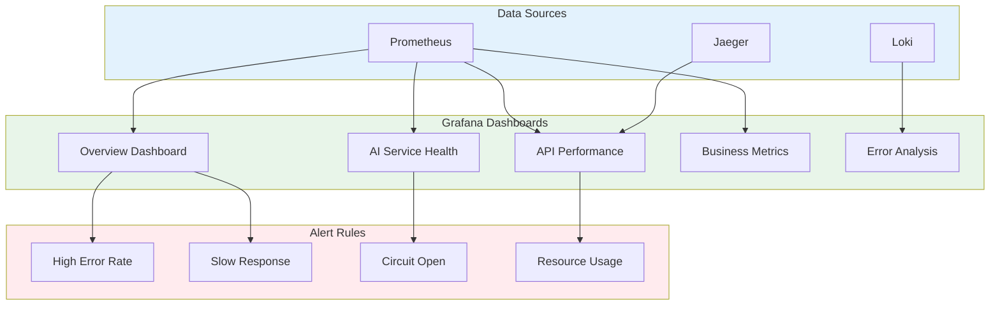

### 23.2 Overview 대시보드 패널 구성

```
┌─────────────────────────────────────────────────────────────────────────────┐
│                        Platform Overview Dashboard                          │
├─────────────────────┬─────────────────────┬─────────────────────────────────┤
│   Active Users      │   Requests/min      │   Error Rate                    │
│   ┌───────────┐     │   ┌───────────┐     │   ┌───────────┐                 │
│   │    45     │     │   │   1,234   │     │   │   0.3%    │                 │
│   └───────────┘     │   └───────────┘     │   └───────────┘                 │
├─────────────────────┴─────────────────────┴─────────────────────────────────┤
│                          Response Time (P50, P95, P99)                      │
│   ┌─────────────────────────────────────────────────────────────────────┐   │
│   │  ━━━━ P50: 234ms   ━━━━ P95: 890ms   ━━━━ P99: 1.2s                │   │
│   │  █▓░░░░░░░░░░░░░░░░░░░░░░░░░░░░░░░░░░░░░░░░░░░░░░░░░░░░░░░░░░░░░░░░│   │
│   └─────────────────────────────────────────────────────────────────────┘   │
├───────────────────────────────────┬─────────────────────────────────────────┤
│     Request Distribution          │      Top Endpoints by Traffic          │
│   ┌───────────────────────────┐   │   ┌─────────────────────────────────┐   │
│   │  Search: 45%              │   │   │  /api/v1/search        3,421   │   │
│   │  Chat: 30%                │   │   │  /api/v1/search/chat   2,103   │   │
│   │  Knowledge: 20%           │   │   │  /api/v1/knowledge     1,892   │   │
│   │  Other: 5%                │   │   │  /api/v1/bookmarks       342   │   │
│   └───────────────────────────┘   │   └─────────────────────────────────┘   │
└───────────────────────────────────┴─────────────────────────────────────────┘
```

### 23.3 Prometheus 쿼리 예시

```yaml
# 1. 요청 수 (Rate)
- title: "Requests per Second"
  query: |
    sum(rate(http_server_requests_seconds_count{
      application="backend-service"
    }[5m]))

# 2. 응답 시간 Percentile
- title: "Response Time P95"
  query: |
    histogram_quantile(0.95,
      sum(rate(http_server_requests_seconds_bucket{
        application="backend-service"
      }[5m])) by (le))

# 3. 에러율
- title: "Error Rate"
  query: |
    sum(rate(http_server_requests_seconds_count{
      application="backend-service",
      status=~"5.."
    }[5m]))
    /
    sum(rate(http_server_requests_seconds_count{
      application="backend-service"
    }[5m])) * 100

# 4. Circuit Breaker 상태
- title: "Circuit Breaker State"
  query: |
    resilience4j_circuitbreaker_state{
      name="aiService",
      application="backend-service"
    }

# 5. AI Service 호출 성공률
- title: "AI Service Success Rate"
  query: |
    sum(rate(ai_service_calls_total{
      success="true"
    }[5m]))
    /
    sum(rate(ai_service_calls_total[5m])) * 100

# 6. 활성 스트리밍 연결
- title: "Active SSE Streams"
  query: |
    streams_active{application="backend-service"}

# 7. JVM 메모리 사용량
- title: "JVM Heap Usage"
  query: |
    sum(jvm_memory_used_bytes{
      area="heap",
      application="backend-service"
    })
    /
    sum(jvm_memory_max_bytes{
      area="heap",
      application="backend-service"
    }) * 100
```

### 23.4 Alert Rules

```yaml
# prometheus/alerts/backend-alerts.yml
groups:
  - name: backend-service-alerts
    rules:
      # 높은 에러율 경고
      - alert: HighErrorRate
        expr: |
          sum(rate(http_server_requests_seconds_count{
            application="backend-service",
            status=~"5.."
          }[5m]))
          /
          sum(rate(http_server_requests_seconds_count{
            application="backend-service"
          }[5m])) > 0.05
        for: 5m
        labels:
          severity: warning
        annotations:
          summary: "High error rate detected"
          description: "Error rate is {{ $value | humanizePercentage }} (> 5%)"

      # 느린 응답 시간
      - alert: SlowResponseTime
        expr: |
          histogram_quantile(0.95,
            sum(rate(http_server_requests_seconds_bucket{
              application="backend-service"
            }[5m])) by (le)) > 3
        for: 5m
        labels:
          severity: warning
        annotations:
          summary: "Slow response time detected"
          description: "P95 response time is {{ $value }}s (> 3s)"

      # Circuit Breaker Open
      - alert: CircuitBreakerOpen
        expr: |
          resilience4j_circuitbreaker_state{
            name="aiService",
            state="open"
          } == 1
        for: 1m
        labels:
          severity: critical
        annotations:
          summary: "Circuit breaker is OPEN"
          description: "AI Service circuit breaker has opened"

      # AI Service 높은 실패율
      - alert: AIServiceHighFailureRate
        expr: |
          sum(rate(ai_service_calls_total{
            success="false"
          }[5m]))
          /
          sum(rate(ai_service_calls_total[5m])) > 0.1
        for: 5m
        labels:
          severity: warning
        annotations:
          summary: "High AI service failure rate"
          description: "AI service failure rate is {{ $value | humanizePercentage }}"

      # JVM 메모리 부족
      - alert: HighJVMMemoryUsage
        expr: |
          sum(jvm_memory_used_bytes{area="heap"})
          /
          sum(jvm_memory_max_bytes{area="heap"}) > 0.85
        for: 10m
        labels:
          severity: warning
        annotations:
          summary: "High JVM heap memory usage"
          description: "JVM heap usage is {{ $value | humanizePercentage }}"
```

### 23.5 Grafana Dashboard JSON (발췌)

```json
{
  "dashboard": {
    "title": "Backend Service Overview",
    "uid": "backend-overview",
    "tags": ["backend", "springboot"],
    "timezone": "Asia/Seoul",
    "panels": [
      {
        "id": 1,
        "title": "Request Rate",
        "type": "stat",
        "gridPos": { "x": 0, "y": 0, "w": 6, "h": 4 },
        "targets": [
          {
            "expr": "sum(rate(http_server_requests_seconds_count{application=\"backend-service\"}[5m]))",
            "legendFormat": "req/s"
          }
        ],
        "options": {
          "colorMode": "value",
          "graphMode": "area"
        }
      },
      {
        "id": 2,
        "title": "Response Time",
        "type": "timeseries",
        "gridPos": { "x": 0, "y": 4, "w": 12, "h": 8 },
        "targets": [
          {
            "expr": "histogram_quantile(0.50, sum(rate(http_server_requests_seconds_bucket{application=\"backend-service\"}[5m])) by (le))",
            "legendFormat": "P50"
          },
          {
            "expr": "histogram_quantile(0.95, sum(rate(http_server_requests_seconds_bucket{application=\"backend-service\"}[5m])) by (le))",
            "legendFormat": "P95"
          },
          {
            "expr": "histogram_quantile(0.99, sum(rate(http_server_requests_seconds_bucket{application=\"backend-service\"}[5m])) by (le))",
            "legendFormat": "P99"
          }
        ],
        "fieldConfig": {
          "defaults": {
            "unit": "s",
            "thresholds": {
              "steps": [
                { "color": "green", "value": null },
                { "color": "yellow", "value": 1 },
                { "color": "red", "value": 3 }
              ]
            }
          }
        }
      },
      {
        "id": 3,
        "title": "Circuit Breaker Status",
        "type": "state-timeline",
        "gridPos": { "x": 12, "y": 4, "w": 12, "h": 4 },
        "targets": [
          {
            "expr": "resilience4j_circuitbreaker_state{name=\"aiService\"}",
            "legendFormat": "{{state}}"
          }
        ],
        "options": {
          "showValue": "always",
          "alignValue": "center"
        }
      }
    ]
  }
}
```

### 23.6 대시보드 프로비저닝

```yaml
# grafana/provisioning/dashboards/dashboards.yml
apiVersion: 1

providers:
  - name: 'Backend Dashboards'
    orgId: 1
    folder: 'Backend'
    type: file
    disableDeletion: false
    updateIntervalSeconds: 30
    allowUiUpdates: true
    options:
      path: /etc/grafana/dashboards/backend
```

---

## 부록

### A. 참고 문서

| 문서 | 경로 | 설명 |
|------|------|------|
| API 통합 설계서 | `./api_integration_design.md` | API 명세 |
| 인증/권한 설계서 | `./authentication_authorization_detailed_design.md` | 보안 설계 |
| 암호화 설계서 | `./data_encryption_design.md` | 데이터 보호 |
| 백엔드 구현 계획서 | `../01_planning/backend_implementation_plan.md` | 구현 계획 |
| AI 서비스 구현 계획서 | `../01_planning/ai_service_implementation_plan.md` | AI 연동 |

### B. 기술 참고 자료

- [Spring Boot Reference](https://docs.spring.io/spring-boot/docs/current/reference/html/)
- [Spring Data JPA Reference](https://docs.spring.io/spring-data/jpa/docs/current/reference/html/)
- [Resilience4j Documentation](https://resilience4j.readme.io/docs)
- [MapStruct Reference](https://mapstruct.org/documentation/stable/reference/html/)

---

**문서 끝**

---

**작성**: Claude Code (Opus 4.5)
**검토**: -
**승인**: -
