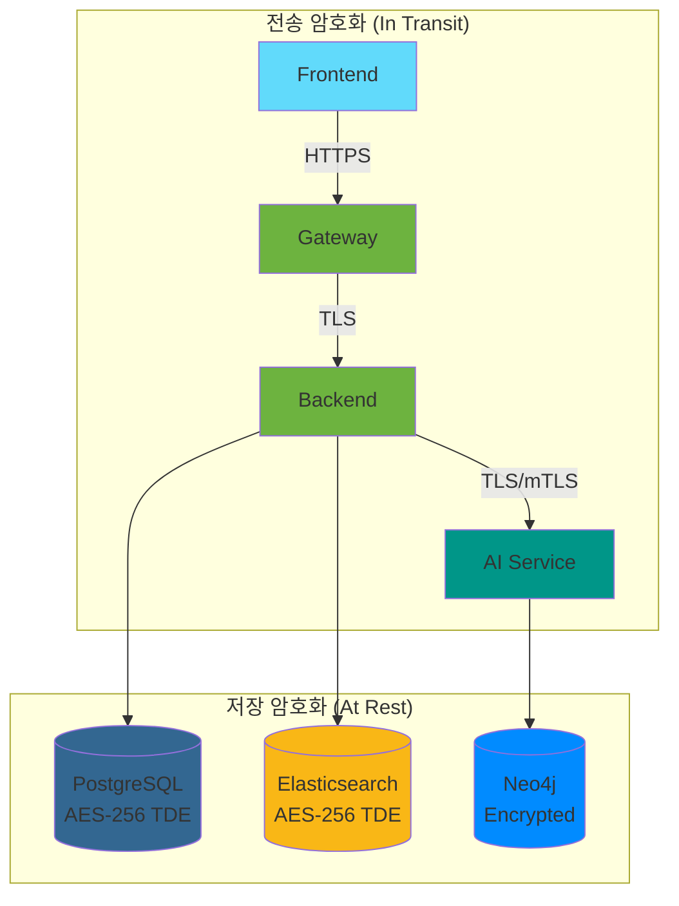
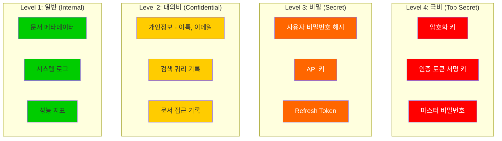
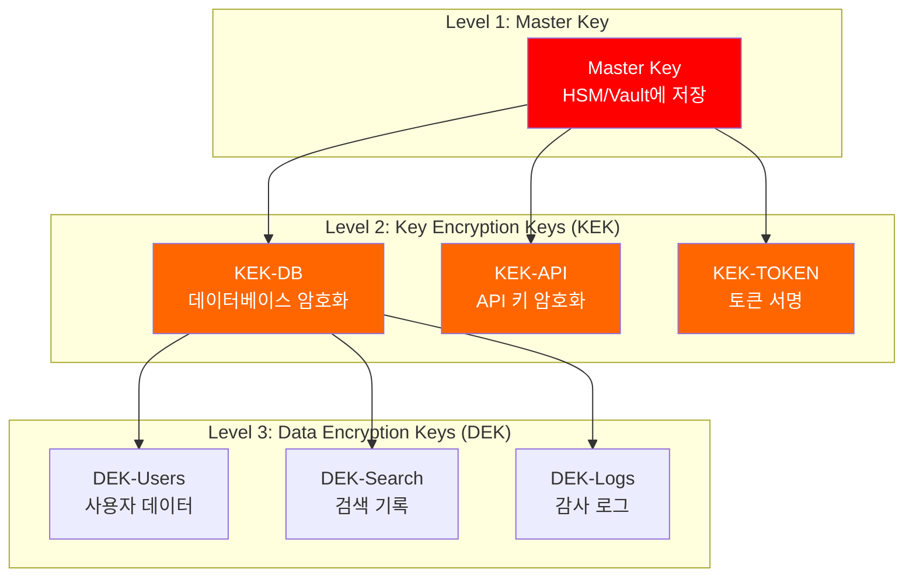
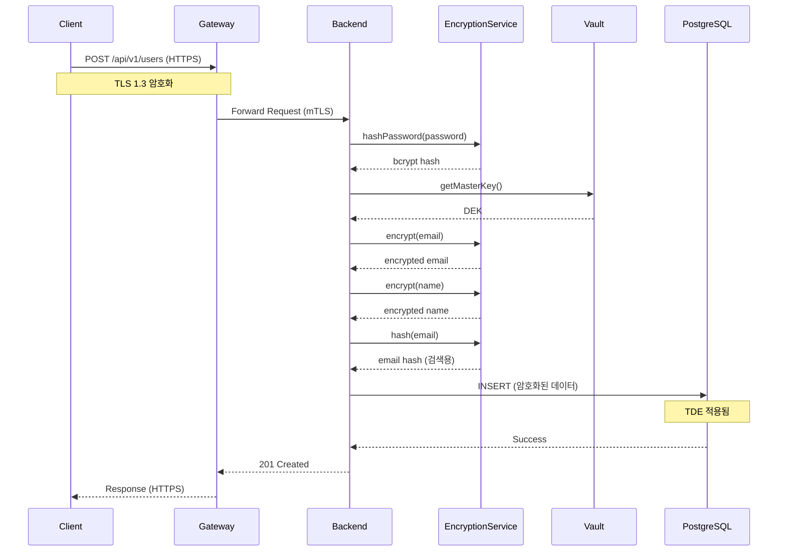

# 민감 데이터 암호화 상세 설계서

---

## 문서 정보

| 항목 | 내용 |
|------|------|
| **문서명** | 민감 데이터 암호화 상세 설계서 |
| **버전** | 1.0 |
| **작성일** | 2026-01-16 |
| **작성자** | Claude AI |
| **상태** | 초안 |
| **관련 문서** | [API 통합 설계서](./api_integration_design.md), [인증/권한 설계서](./authentication_authorization_detailed_design.md), [에러 코드 표준](./error_code_standards.md), [용어사전](./glossary.md) |

---

## 변경 이력

| 버전 | 일자 | 작성자 | 변경 내용 |
|------|------|--------|----------|
| 1.0 | 2026-01-16 | Claude AI | 초안 작성 |

---

## 목차

1. [개요](#1-개요)
2. [데이터 분류](#2-데이터-분류)
3. [암호화 아키텍처](#3-암호화-아키텍처)
4. [전송 중 암호화 (In Transit)](#4-전송-중-암호화-in-transit)
5. [저장 시 암호화 (At Rest)](#5-저장-시-암호화-at-rest)
6. [키 관리 시스템](#6-키-관리-시스템)
7. [구현 명세](#7-구현-명세)
8. [민감 정보 마스킹](#8-민감-정보-마스킹)
9. [감사 로그](#9-감사-로그)
10. [테스트 전략](#10-테스트-전략)
11. [체크리스트](#11-체크리스트)

---

## 1. 개요

### 1.1 문서 목적

본 문서는 Hybrid RAG Knowledge Platform의 민감 데이터 암호화 전략을 정의합니다. 개인정보보호법 및 정보보호 컴플라이언스를 준수하면서 시스템의 보안성을 확보합니다.

### 1.2 적용 범위



### 1.3 암호화 원칙

| 원칙 | 설명 | 구현 방법 |
|------|------|----------|
| **다층 방어** | 단일 보안 실패 시에도 보호 | 전송 + 저장 암호화 |
| **최소 권한** | 필요한 데이터만 복호화 | 역할 기반 키 접근 |
| **키 분리** | 암호화 키와 데이터 분리 | 별도 키 관리 시스템 |
| **감사 가능** | 모든 접근 기록 | 암호화 작업 로깅 |

### 1.4 컴플라이언스 요구사항

| 규정 | 요구사항 | 본 설계 대응 |
|------|----------|-------------|
| **개인정보보호법** | 개인정보 암호화 저장 | AES-256 암호화 |
| **정보보호법** | 전송 시 암호화 | TLS 1.3 |
| **ISMS-P** | 키 관리 정책 | HSM 또는 Vault 연동 |
| **GDPR** | 데이터 보호 | 암호화 + 익명화 |

---

## 2. 데이터 분류

### 2.1 민감도 분류 체계



### 2.2 데이터 유형별 보호 요구사항

| 데이터 유형 | 분류 | 저장 암호화 | 전송 암호화 | 마스킹 | 보존 기간 |
|------------|------|-----------|-----------|--------|----------|
| **암호화 키** | Level 4 | HSM/Vault | N/A | 전체 | 키 교체 시 폐기 |
| **비밀번호 해시** | Level 3 | DB 암호화 | TLS 1.3 | 전체 | 계정 삭제 시 |
| **API 키** | Level 3 | DB 암호화 | TLS 1.3 | 부분 (앞 4자리만 표시) | 만료 시 |
| **Refresh Token** | Level 3 | Redis 암호화 | TLS 1.3 | 전체 | 7일 |
| **이메일** | Level 2 | 필드 암호화 | TLS 1.3 | 부분 (도메인만 표시) | 탈퇴 후 30일 |
| **이름** | Level 2 | 필드 암호화 | TLS 1.3 | 부분 (첫 글자만) | 탈퇴 후 30일 |
| **검색 기록** | Level 2 | DB 암호화 | TLS 1.3 | N/A | 90일 |
| **문서 메타데이터** | Level 1 | TDE | TLS 1.3 | N/A | 무기한 |

### 2.3 데이터베이스별 민감 데이터

#### 2.3.1 PostgreSQL (SSOT)

```sql
-- 민감 데이터 테이블 목록
CREATE TABLE users (
    id UUID PRIMARY KEY,
    email VARCHAR(255) NOT NULL,           -- Level 2: 필드 암호화
    name VARCHAR(100) NOT NULL,            -- Level 2: 필드 암호화
    password_hash VARCHAR(255) NOT NULL,   -- Level 3: bcrypt + DB 암호화
    department VARCHAR(100),               -- Level 1: TDE
    created_at TIMESTAMP,
    updated_at TIMESTAMP
);

CREATE TABLE api_keys (
    id UUID PRIMARY KEY,
    user_id UUID REFERENCES users(id),
    key_hash VARCHAR(255) NOT NULL,        -- Level 3: SHA-256 + DB 암호화
    key_prefix VARCHAR(8) NOT NULL,        -- 표시용 (앞 4자리)
    name VARCHAR(100),
    expires_at TIMESTAMP,
    created_at TIMESTAMP
);

CREATE TABLE search_history (
    id UUID PRIMARY KEY,
    user_id UUID REFERENCES users(id),
    query_text TEXT NOT NULL,              -- Level 2: 필드 암호화
    search_params JSONB,
    result_count INTEGER,
    response_time_ms INTEGER,
    created_at TIMESTAMP
);

CREATE TABLE document_access_logs (
    id UUID PRIMARY KEY,
    user_id UUID REFERENCES users(id),
    document_id UUID NOT NULL,
    access_type VARCHAR(20),               -- Level 2: TDE
    ip_address INET,                       -- Level 2: 마스킹
    user_agent TEXT,
    created_at TIMESTAMP
);
```

#### 2.3.2 Elasticsearch

```json
{
  "민감_필드_목록": {
    "documents": {
      "uploaded_by": "Level 2 - 사용자 식별 가능",
      "access_control": "Level 2 - 권한 정보"
    },
    "search_logs": {
      "user_id": "Level 2 - 사용자 식별",
      "query": "Level 2 - 검색 의도 파악 가능"
    }
  }
}
```

#### 2.3.3 Neo4j

```cypher
// 민감 노드/관계 목록
(:User {
    userId: "UUID",         // Level 2
    email: "encrypted",     // Level 2 - 암호화 저장
    name: "encrypted"       // Level 2 - 암호화 저장
})

(:Document)-[:ACCESSED_BY {
    timestamp: datetime(),
    accessType: "VIEW"      // Level 2 - 접근 기록
}]->(:User)
```

---

## 3. 암호화 아키텍처

### 3.1 전체 암호화 계층

```mermaid
graph TB
    subgraph "Layer 1: Application Layer"
        APP[애플리케이션 레벨 암호화]
        APP --> FE[필드 암호화<br/>AES-256-GCM]
        APP --> HASH[비밀번호 해싱<br/>bcrypt/Argon2]
        APP --> SIGN[토큰 서명<br/>RS256]
    end

    subgraph "Layer 2: Transport Layer"
        TLS[전송 계층 암호화]
        TLS --> EXT[External TLS 1.3<br/>HTTPS]
        TLS --> INT[Internal mTLS<br/>서비스 간 통신]
    end

    subgraph "Layer 3: Storage Layer"
        STOR[저장소 암호화]
        STOR --> TDE[투명 데이터 암호화<br/>TDE]
        STOR --> DISK[디스크 암호화<br/>LUKS/BitLocker]
    end

    subgraph "Key Management"
        KMS[키 관리 시스템]
        KMS --> VAULT[HashiCorp Vault]
        KMS --> HSM[HSM (선택)]
    end

    FE --> KMS
    TLS --> KMS
    TDE --> KMS
```

### 3.2 암호화 알고리즘 선택

| 용도 | 알고리즘 | 키 길이 | 모드 | 선택 이유 |
|------|---------|--------|------|----------|
| **데이터 암호화** | AES | 256-bit | GCM | 인증 암호화, 성능 우수 |
| **비밀번호 해싱** | bcrypt | N/A | - | 레인보우 테이블 저항성 |
| **비밀번호 해싱 (대안)** | Argon2id | N/A | - | 메모리-하드 함수 |
| **토큰 서명** | RS256 | 2048-bit | - | 비대칭 키, 키 노출 시 영향 최소화 |
| **키 래핑** | AES-KW | 256-bit | - | NIST 권장 |
| **TLS** | ECDHE + AES-GCM | 256-bit | - | Forward Secrecy |

### 3.3 암호화 라이브러리

#### 3.3.1 Java (SpringBoot Backend)

```java
// 권장 라이브러리
dependencies {
    // Spring Security Crypto
    implementation 'org.springframework.security:spring-security-crypto'

    // Bouncy Castle (고급 암호화)
    implementation 'org.bouncycastle:bcprov-jdk18on:1.78'

    // Jasypt (설정 암호화)
    implementation 'com.github.ulisesbocchio:jasypt-spring-boot-starter:3.0.5'

    // Vault Client
    implementation 'org.springframework.cloud:spring-cloud-starter-vault-config'
}
```

#### 3.3.2 Python (AI Service)

```python
# 권장 라이브러리
# requirements.txt
cryptography>=41.0.0          # 표준 암호화
python-jose[cryptography]>=3.3.0  # JWT 처리
passlib[bcrypt]>=1.7.4        # 비밀번호 해싱
hvac>=1.2.1                   # Vault 클라이언트
```

---

## 4. 전송 중 암호화 (In Transit)

### 4.1 TLS 설정

#### 4.1.1 Nginx (API Gateway 앞단)

```nginx
# /etc/nginx/conf.d/ssl.conf

# TLS 버전 제한 (1.2, 1.3만 허용)
ssl_protocols TLSv1.2 TLSv1.3;

# 암호화 스위트 (강력한 것만)
ssl_ciphers ECDHE-ECDSA-AES128-GCM-SHA256:ECDHE-RSA-AES128-GCM-SHA256:ECDHE-ECDSA-AES256-GCM-SHA384:ECDHE-RSA-AES256-GCM-SHA384:ECDHE-ECDSA-CHACHA20-POLY1305:ECDHE-RSA-CHACHA20-POLY1305;
ssl_prefer_server_ciphers on;

# 세션 설정
ssl_session_timeout 1d;
ssl_session_cache shared:SSL:50m;
ssl_session_tickets off;

# OCSP Stapling
ssl_stapling on;
ssl_stapling_verify on;
resolver 8.8.8.8 8.8.4.4 valid=300s;
resolver_timeout 5s;

# HSTS (Strict Transport Security)
add_header Strict-Transport-Security "max-age=31536000; includeSubDomains; preload" always;

# 인증서 설정
ssl_certificate /etc/nginx/ssl/fullchain.pem;
ssl_certificate_key /etc/nginx/ssl/privkey.pem;
ssl_trusted_certificate /etc/nginx/ssl/chain.pem;

# DH 파라미터 (TLS 1.2 용)
ssl_dhparam /etc/nginx/ssl/dhparam.pem;
```

#### 4.1.2 Spring Cloud Gateway TLS

```yaml
# application.yml
server:
  ssl:
    enabled: true
    protocol: TLS
    enabled-protocols: TLSv1.2,TLSv1.3
    ciphers:
      - TLS_AES_256_GCM_SHA384
      - TLS_CHACHA20_POLY1305_SHA256
      - TLS_AES_128_GCM_SHA256
      - ECDHE-ECDSA-AES256-GCM-SHA384
      - ECDHE-RSA-AES256-GCM-SHA384
    key-store: classpath:keystore.p12
    key-store-password: ${SSL_KEYSTORE_PASSWORD}
    key-store-type: PKCS12
    key-alias: gateway
```

### 4.2 서비스 간 mTLS

#### 4.2.1 Backend → AI Service

```yaml
# application.yml (SpringBoot Backend)
spring:
  webflux:
    client:
      ssl:
        enabled: true
        key-store: classpath:backend-keystore.p12
        key-store-password: ${MTLS_KEYSTORE_PASSWORD}
        trust-store: classpath:truststore.p12
        trust-store-password: ${MTLS_TRUSTSTORE_PASSWORD}

ai-service:
  url: https://ai-service:8000
  mtls:
    enabled: true
```

```java
// WebClient mTLS 설정
@Configuration
public class AIServiceClientConfig {

    @Value("${MTLS_KEYSTORE_PASSWORD}")
    private String keystorePassword;

    @Value("${MTLS_TRUSTSTORE_PASSWORD}")
    private String truststorePassword;

    @Bean
    public WebClient aiServiceWebClient() throws Exception {
        // KeyStore 로드
        KeyStore keyStore = KeyStore.getInstance("PKCS12");
        keyStore.load(
            getClass().getResourceAsStream("/backend-keystore.p12"),
            keystorePassword.toCharArray()
        );

        // TrustStore 로드
        KeyStore trustStore = KeyStore.getInstance("PKCS12");
        trustStore.load(
            getClass().getResourceAsStream("/truststore.p12"),
            truststorePassword.toCharArray()
        );

        // KeyManager 설정
        KeyManagerFactory kmf = KeyManagerFactory.getInstance(
            KeyManagerFactory.getDefaultAlgorithm()
        );
        kmf.init(keyStore, keystorePassword.toCharArray());

        // TrustManager 설정
        TrustManagerFactory tmf = TrustManagerFactory.getInstance(
            TrustManagerFactory.getDefaultAlgorithm()
        );
        tmf.init(trustStore);

        // SSLContext 구성
        SSLContext sslContext = SSLContext.getInstance("TLS");
        sslContext.init(kmf.getKeyManagers(), tmf.getTrustManagers(), null);

        // HttpClient 구성
        HttpClient httpClient = HttpClient.create()
            .secure(sslContextSpec -> sslContextSpec
                .sslContext(SslContextBuilder.forClient()
                    .keyManager(kmf)
                    .trustManager(tmf)
                    .build()));

        return WebClient.builder()
            .clientConnector(new ReactorClientHttpConnector(httpClient))
            .baseUrl("https://ai-service:8000")
            .build();
    }
}
```

#### 4.2.2 FastAPI mTLS 설정

```python
# AI Service uvicorn 설정
import uvicorn
from pathlib import Path

ssl_keyfile = Path("/app/certs/ai-service-key.pem")
ssl_certfile = Path("/app/certs/ai-service-cert.pem")
ssl_ca_certs = Path("/app/certs/ca-cert.pem")

if __name__ == "__main__":
    uvicorn.run(
        "app.main:app",
        host="0.0.0.0",
        port=8000,
        ssl_keyfile=str(ssl_keyfile),
        ssl_certfile=str(ssl_certfile),
        ssl_ca_certs=str(ssl_ca_certs),
        ssl_cert_reqs=2,  # ssl.CERT_REQUIRED
    )
```

### 4.3 데이터베이스 연결 암호화

#### 4.3.1 PostgreSQL TLS

```yaml
# application.yml
spring:
  datasource:
    url: jdbc:postgresql://localhost:5432/knowledge?ssl=true&sslmode=verify-full&sslrootcert=/app/certs/ca-cert.pem
    hikari:
      data-source-properties:
        sslMode: verify-full
        sslRootCert: /app/certs/ca-cert.pem
        sslCert: /app/certs/client-cert.pem
        sslKey: /app/certs/client-key.pem
```

#### 4.3.2 Elasticsearch TLS

```yaml
# elasticsearch.yml
xpack.security.enabled: true
xpack.security.transport.ssl:
  enabled: true
  verification_mode: certificate
  keystore.path: /usr/share/elasticsearch/config/certs/elastic-certificates.p12
  truststore.path: /usr/share/elasticsearch/config/certs/elastic-certificates.p12

xpack.security.http.ssl:
  enabled: true
  keystore.path: /usr/share/elasticsearch/config/certs/http.p12
```

#### 4.3.3 Neo4j TLS

```conf
# neo4j.conf
dbms.ssl.policy.bolt.enabled=true
dbms.ssl.policy.bolt.base_directory=/var/lib/neo4j/certificates/bolt
dbms.ssl.policy.bolt.private_key=private.key
dbms.ssl.policy.bolt.public_certificate=public.crt
dbms.ssl.policy.bolt.client_auth=REQUIRE

dbms.connector.bolt.tls_level=REQUIRED
```

---

## 5. 저장 시 암호화 (At Rest)

### 5.1 PostgreSQL 암호화

#### 5.1.1 투명 데이터 암호화 (TDE)

```sql
-- PostgreSQL TDE 설정 (Enterprise Edition)
-- 또는 pgcrypto 확장 사용

-- pgcrypto 확장 활성화
CREATE EXTENSION IF NOT EXISTS pgcrypto;

-- 암호화 함수 생성
CREATE OR REPLACE FUNCTION encrypt_data(data TEXT, key TEXT)
RETURNS BYTEA AS $$
BEGIN
    RETURN pgp_sym_encrypt(data, key);
END;
$$ LANGUAGE plpgsql;

CREATE OR REPLACE FUNCTION decrypt_data(encrypted_data BYTEA, key TEXT)
RETURNS TEXT AS $$
BEGIN
    RETURN pgp_sym_decrypt(encrypted_data, key);
END;
$$ LANGUAGE plpgsql;
```

#### 5.1.2 필드 레벨 암호화

```sql
-- 민감 데이터 테이블 (암호화 적용)
CREATE TABLE users_encrypted (
    id UUID PRIMARY KEY DEFAULT gen_random_uuid(),
    email_encrypted BYTEA NOT NULL,        -- AES-256 암호화
    name_encrypted BYTEA NOT NULL,         -- AES-256 암호화
    email_hash VARCHAR(64) NOT NULL,       -- 검색용 해시 (SHA-256)
    password_hash VARCHAR(255) NOT NULL,   -- bcrypt
    department VARCHAR(100),
    created_at TIMESTAMP DEFAULT NOW(),
    updated_at TIMESTAMP DEFAULT NOW()
);

-- 이메일 해시 인덱스 (검색용)
CREATE INDEX idx_users_email_hash ON users_encrypted(email_hash);

-- 검색 기록 테이블 (암호화 적용)
CREATE TABLE search_history_encrypted (
    id UUID PRIMARY KEY DEFAULT gen_random_uuid(),
    user_id UUID REFERENCES users_encrypted(id),
    query_encrypted BYTEA NOT NULL,        -- 검색어 암호화
    query_hash VARCHAR(64) NOT NULL,       -- 분석용 해시
    search_params JSONB,
    result_count INTEGER,
    response_time_ms INTEGER,
    created_at TIMESTAMP DEFAULT NOW()
);
```

### 5.2 애플리케이션 레벨 암호화 구현

#### 5.2.1 Java 암호화 서비스

```java
@Service
@Slf4j
public class EncryptionService {

    private static final String ALGORITHM = "AES/GCM/NoPadding";
    private static final int GCM_TAG_LENGTH = 128;
    private static final int GCM_IV_LENGTH = 12;

    private final SecretKey masterKey;

    public EncryptionService(@Value("${encryption.master-key}") String masterKeyBase64) {
        byte[] keyBytes = Base64.getDecoder().decode(masterKeyBase64);
        this.masterKey = new SecretKeySpec(keyBytes, "AES");
    }

    /**
     * 데이터 암호화
     * @param plaintext 평문
     * @return Base64 인코딩된 암호문 (IV + 암호문)
     */
    public String encrypt(String plaintext) {
        try {
            // IV 생성
            byte[] iv = new byte[GCM_IV_LENGTH];
            SecureRandom.getInstanceStrong().nextBytes(iv);

            // Cipher 초기화
            Cipher cipher = Cipher.getInstance(ALGORITHM);
            GCMParameterSpec spec = new GCMParameterSpec(GCM_TAG_LENGTH, iv);
            cipher.init(Cipher.ENCRYPT_MODE, masterKey, spec);

            // 암호화
            byte[] ciphertext = cipher.doFinal(plaintext.getBytes(StandardCharsets.UTF_8));

            // IV + 암호문 결합
            byte[] combined = new byte[iv.length + ciphertext.length];
            System.arraycopy(iv, 0, combined, 0, iv.length);
            System.arraycopy(ciphertext, 0, combined, iv.length, ciphertext.length);

            return Base64.getEncoder().encodeToString(combined);

        } catch (Exception e) {
            log.error("Encryption failed", e);
            throw new EncryptionException("Failed to encrypt data", e);
        }
    }

    /**
     * 데이터 복호화
     * @param encryptedData Base64 인코딩된 암호문
     * @return 평문
     */
    public String decrypt(String encryptedData) {
        try {
            byte[] combined = Base64.getDecoder().decode(encryptedData);

            // IV 추출
            byte[] iv = new byte[GCM_IV_LENGTH];
            System.arraycopy(combined, 0, iv, 0, GCM_IV_LENGTH);

            // 암호문 추출
            byte[] ciphertext = new byte[combined.length - GCM_IV_LENGTH];
            System.arraycopy(combined, GCM_IV_LENGTH, ciphertext, 0, ciphertext.length);

            // Cipher 초기화
            Cipher cipher = Cipher.getInstance(ALGORITHM);
            GCMParameterSpec spec = new GCMParameterSpec(GCM_TAG_LENGTH, iv);
            cipher.init(Cipher.DECRYPT_MODE, masterKey, spec);

            // 복호화
            byte[] plaintext = cipher.doFinal(ciphertext);

            return new String(plaintext, StandardCharsets.UTF_8);

        } catch (Exception e) {
            log.error("Decryption failed", e);
            throw new EncryptionException("Failed to decrypt data", e);
        }
    }

    /**
     * 검색용 해시 생성 (단방향)
     * @param data 원본 데이터
     * @return SHA-256 해시 (Hex)
     */
    public String hash(String data) {
        try {
            MessageDigest digest = MessageDigest.getInstance("SHA-256");
            byte[] hashBytes = digest.digest(data.toLowerCase().getBytes(StandardCharsets.UTF_8));
            return bytesToHex(hashBytes);
        } catch (NoSuchAlgorithmException e) {
            throw new EncryptionException("Hash algorithm not available", e);
        }
    }

    /**
     * 비밀번호 해싱 (bcrypt)
     */
    public String hashPassword(String password) {
        return BCrypt.hashpw(password, BCrypt.gensalt(12));
    }

    /**
     * 비밀번호 검증
     */
    public boolean verifyPassword(String password, String hash) {
        return BCrypt.checkpw(password, hash);
    }

    private String bytesToHex(byte[] bytes) {
        StringBuilder sb = new StringBuilder();
        for (byte b : bytes) {
            sb.append(String.format("%02x", b));
        }
        return sb.toString();
    }
}
```

#### 5.2.2 Python 암호화 서비스

```python
# encryption_service.py
import os
import base64
import hashlib
from typing import Optional
from cryptography.hazmat.primitives.ciphers.aead import AESGCM
from cryptography.hazmat.primitives import hashes
from cryptography.hazmat.primitives.kdf.pbkdf2 import PBKDF2HMAC
from passlib.context import CryptContext

class EncryptionService:
    """민감 데이터 암호화 서비스"""

    NONCE_SIZE = 12  # GCM 권장 nonce 크기

    def __init__(self, master_key: Optional[str] = None):
        """
        Args:
            master_key: Base64 인코딩된 마스터 키 (256-bit)
        """
        if master_key:
            self._key = base64.b64decode(master_key)
        else:
            self._key = base64.b64decode(os.environ["ENCRYPTION_MASTER_KEY"])

        if len(self._key) != 32:
            raise ValueError("Master key must be 256 bits (32 bytes)")

        self._aesgcm = AESGCM(self._key)
        self._pwd_context = CryptContext(
            schemes=["bcrypt"],
            deprecated="auto",
            bcrypt__rounds=12
        )

    def encrypt(self, plaintext: str) -> str:
        """
        데이터 암호화 (AES-256-GCM)

        Args:
            plaintext: 평문

        Returns:
            Base64 인코딩된 암호문 (nonce + ciphertext)
        """
        nonce = os.urandom(self.NONCE_SIZE)
        ciphertext = self._aesgcm.encrypt(
            nonce,
            plaintext.encode("utf-8"),
            associated_data=None
        )

        # nonce + ciphertext 결합
        combined = nonce + ciphertext
        return base64.b64encode(combined).decode("utf-8")

    def decrypt(self, encrypted_data: str) -> str:
        """
        데이터 복호화

        Args:
            encrypted_data: Base64 인코딩된 암호문

        Returns:
            평문
        """
        combined = base64.b64decode(encrypted_data)

        nonce = combined[:self.NONCE_SIZE]
        ciphertext = combined[self.NONCE_SIZE:]

        plaintext = self._aesgcm.decrypt(
            nonce,
            ciphertext,
            associated_data=None
        )

        return plaintext.decode("utf-8")

    def hash(self, data: str) -> str:
        """
        검색용 해시 생성 (SHA-256)

        Args:
            data: 원본 데이터

        Returns:
            Hex 인코딩된 해시
        """
        return hashlib.sha256(data.lower().encode("utf-8")).hexdigest()

    def hash_password(self, password: str) -> str:
        """비밀번호 해싱 (bcrypt)"""
        return self._pwd_context.hash(password)

    def verify_password(self, password: str, hashed: str) -> bool:
        """비밀번호 검증"""
        return self._pwd_context.verify(password, hashed)


# 싱글톤 인스턴스
_encryption_service: Optional[EncryptionService] = None

def get_encryption_service() -> EncryptionService:
    """암호화 서비스 싱글톤 반환"""
    global _encryption_service
    if _encryption_service is None:
        _encryption_service = EncryptionService()
    return _encryption_service
```

### 5.3 JPA Entity 암호화 적용

```java
@Entity
@Table(name = "users_encrypted")
@EntityListeners(EncryptionListener.class)
public class User {

    @Id
    @GeneratedValue(strategy = GenerationType.UUID)
    private UUID id;

    @Convert(converter = EncryptedStringConverter.class)
    @Column(name = "email_encrypted", columnDefinition = "BYTEA")
    private String email;  // 자동 암호화/복호화

    @Column(name = "email_hash")
    private String emailHash;  // 검색용 해시

    @Convert(converter = EncryptedStringConverter.class)
    @Column(name = "name_encrypted", columnDefinition = "BYTEA")
    private String name;

    @Column(name = "password_hash")
    private String passwordHash;

    private String department;

    @CreationTimestamp
    private LocalDateTime createdAt;

    @UpdateTimestamp
    private LocalDateTime updatedAt;
}

@Converter
public class EncryptedStringConverter implements AttributeConverter<String, byte[]> {

    @Autowired
    private EncryptionService encryptionService;

    @Override
    public byte[] convertToDatabaseColumn(String attribute) {
        if (attribute == null) {
            return null;
        }
        String encrypted = encryptionService.encrypt(attribute);
        return Base64.getDecoder().decode(encrypted);
    }

    @Override
    public String convertToEntityAttribute(byte[] dbData) {
        if (dbData == null) {
            return null;
        }
        String encrypted = Base64.getEncoder().encodeToString(dbData);
        return encryptionService.decrypt(encrypted);
    }
}
```

### 5.4 Elasticsearch 저장 암호화

```json
// elasticsearch.yml
xpack.security.enabled: true

// 클러스터 수준 암호화
xpack.security.fips_mode.enabled: false

// 인덱스 저장소 암호화 (Searchable Snapshots 활용)
// 또는 운영체제 레벨 디스크 암호화 권장
```

```python
# 민감 필드 암호화 후 인덱싱
from elasticsearch import Elasticsearch
from app.services.encryption_service import get_encryption_service

class SecureDocumentIndexer:
    """민감 데이터 암호화 인덱서"""

    SENSITIVE_FIELDS = ["uploaded_by_email", "created_by_email"]

    def __init__(self, es_client: Elasticsearch):
        self.es = es_client
        self.encryption = get_encryption_service()

    def index_document(self, doc: dict) -> str:
        """문서 인덱싱 (민감 필드 암호화)"""
        secure_doc = doc.copy()

        for field in self.SENSITIVE_FIELDS:
            if field in secure_doc and secure_doc[field]:
                # 원본 암호화
                secure_doc[f"{field}_encrypted"] = self.encryption.encrypt(
                    secure_doc[field]
                )
                # 검색용 해시 생성
                secure_doc[f"{field}_hash"] = self.encryption.hash(
                    secure_doc[field]
                )
                # 원본 제거
                del secure_doc[field]

        result = self.es.index(
            index="documents",
            document=secure_doc
        )
        return result["_id"]
```

---

## 6. 키 관리 시스템

### 6.1 키 계층 구조



### 6.2 HashiCorp Vault 연동

#### 6.2.1 Vault 설정

```hcl
# vault-policy.hcl
path "secret/data/knowledge-platform/*" {
  capabilities = ["read"]
}

path "transit/encrypt/db-encryption" {
  capabilities = ["update"]
}

path "transit/decrypt/db-encryption" {
  capabilities = ["update"]
}

path "transit/keys/db-encryption" {
  capabilities = ["read"]
}
```

#### 6.2.2 Spring Boot Vault 연동

```yaml
# bootstrap.yml
spring:
  cloud:
    vault:
      enabled: true
      host: vault.internal
      port: 8200
      scheme: https
      authentication: KUBERNETES  # 또는 TOKEN, APPROLE
      kubernetes:
        role: knowledge-platform
        kubernetes-path: kubernetes
      kv:
        enabled: true
        backend: secret
        default-context: knowledge-platform
      generic:
        enabled: false
```

```java
@Configuration
@EnableVaultConfiguration
public class VaultConfig {

    @Bean
    public VaultOperations vaultOperations(VaultEndpoint endpoint) {
        return new VaultTemplate(endpoint, new TokenAuthentication("${VAULT_TOKEN}"));
    }
}

@Service
public class VaultKeyService {

    private final VaultOperations vaultOperations;

    public VaultKeyService(VaultOperations vaultOperations) {
        this.vaultOperations = vaultOperations;
    }

    /**
     * Transit 엔진을 통한 데이터 암호화
     */
    public String encryptWithVault(String plaintext, String keyName) {
        VaultTransitOperations transit = vaultOperations.opsForTransit();
        String base64Data = Base64.getEncoder().encodeToString(
            plaintext.getBytes(StandardCharsets.UTF_8)
        );
        return transit.encrypt(keyName, base64Data);
    }

    /**
     * Transit 엔진을 통한 데이터 복호화
     */
    public String decryptWithVault(String ciphertext, String keyName) {
        VaultTransitOperations transit = vaultOperations.opsForTransit();
        String decrypted = transit.decrypt(keyName, ciphertext);
        return new String(
            Base64.getDecoder().decode(decrypted),
            StandardCharsets.UTF_8
        );
    }

    /**
     * 마스터 키 조회
     */
    public String getMasterKey() {
        VaultResponse response = vaultOperations.read("secret/data/knowledge-platform/encryption");
        return (String) response.getData().get("master_key");
    }
}
```

#### 6.2.3 Python Vault 연동

```python
# vault_client.py
import hvac
import os
from functools import lru_cache

class VaultClient:
    """HashiCorp Vault 클라이언트"""

    def __init__(self):
        self.client = hvac.Client(
            url=os.environ.get("VAULT_ADDR", "https://vault.internal:8200"),
            token=os.environ.get("VAULT_TOKEN"),
            verify=True
        )

        # Kubernetes 인증 (컨테이너 환경)
        if os.path.exists("/var/run/secrets/kubernetes.io/serviceaccount/token"):
            with open("/var/run/secrets/kubernetes.io/serviceaccount/token") as f:
                jwt = f.read()
            self.client.auth.kubernetes.login(
                role="knowledge-platform",
                jwt=jwt
            )

    def get_secret(self, path: str, key: str) -> str:
        """시크릿 조회"""
        secret = self.client.secrets.kv.v2.read_secret_version(
            path=path,
            mount_point="secret"
        )
        return secret["data"]["data"][key]

    def encrypt_transit(self, plaintext: str, key_name: str = "db-encryption") -> str:
        """Transit 암호화"""
        import base64
        encoded = base64.b64encode(plaintext.encode()).decode()
        result = self.client.secrets.transit.encrypt_data(
            name=key_name,
            plaintext=encoded
        )
        return result["data"]["ciphertext"]

    def decrypt_transit(self, ciphertext: str, key_name: str = "db-encryption") -> str:
        """Transit 복호화"""
        import base64
        result = self.client.secrets.transit.decrypt_data(
            name=key_name,
            ciphertext=ciphertext
        )
        return base64.b64decode(result["data"]["plaintext"]).decode()


@lru_cache(maxsize=1)
def get_vault_client() -> VaultClient:
    return VaultClient()
```

### 6.3 키 교체 (Rotation)

#### 6.3.1 키 교체 정책

| 키 유형 | 교체 주기 | 교체 방법 |
|--------|----------|----------|
| **Master Key** | 연 1회 | HSM/Vault 자동 교체 |
| **KEK** | 분기 1회 | Vault Transit 키 버전 업그레이드 |
| **DEK** | 월 1회 | 애플리케이션 레벨 재암호화 |
| **TLS 인증서** | 연 1회 | Let's Encrypt 자동 갱신 |
| **JWT 서명 키** | 분기 1회 | Keycloak 키 교체 |

#### 6.3.2 키 교체 자동화 스크립트

```python
# key_rotation.py
import logging
from datetime import datetime, timedelta
from typing import List

from app.services.vault_client import get_vault_client
from app.services.encryption_service import EncryptionService
from app.repositories.user_repository import UserRepository

logger = logging.getLogger(__name__)

class KeyRotationService:
    """키 교체 서비스"""

    def __init__(
        self,
        vault_client: VaultClient,
        user_repository: UserRepository
    ):
        self.vault = vault_client
        self.user_repo = user_repository

    async def rotate_dek(self, key_name: str = "db-encryption") -> dict:
        """
        Data Encryption Key 교체

        1. Vault에서 새 키 버전 생성
        2. 기존 암호화된 데이터 재암호화
        3. 이전 키 버전 비활성화
        """
        logger.info(f"Starting DEK rotation for {key_name}")

        # 1. 새 키 버전 생성
        self.vault.client.secrets.transit.rotate_key(name=key_name)

        # 2. 민감 데이터 재암호화
        reencrypted_count = await self._reencrypt_user_data()

        # 3. 이전 키 버전 비활성화 (최소 보관 기간 후)
        # min_decryption_version을 최신으로 업데이트

        result = {
            "key_name": key_name,
            "rotation_time": datetime.utcnow().isoformat(),
            "reencrypted_records": reencrypted_count
        }

        logger.info(f"DEK rotation completed: {result}")
        return result

    async def _reencrypt_user_data(self) -> int:
        """사용자 데이터 재암호화"""
        count = 0
        batch_size = 100

        # 배치 단위로 처리
        async for users in self.user_repo.stream_all(batch_size):
            for user in users:
                # Transit rewrap 사용 (복호화 없이 재암호화)
                if user.email_encrypted:
                    user.email_encrypted = self.vault.client.secrets.transit.rewrap_data(
                        name="db-encryption",
                        ciphertext=user.email_encrypted
                    )["data"]["ciphertext"]

                if user.name_encrypted:
                    user.name_encrypted = self.vault.client.secrets.transit.rewrap_data(
                        name="db-encryption",
                        ciphertext=user.name_encrypted
                    )["data"]["ciphertext"]

                await self.user_repo.save(user)
                count += 1

        return count
```

---

## 7. 구현 명세

### 7.1 사용자 등록 암호화 흐름



### 7.2 사용자 서비스 구현

```java
@Service
@Transactional
@Slf4j
public class UserService {

    private final UserRepository userRepository;
    private final EncryptionService encryptionService;

    public UserService(UserRepository userRepository, EncryptionService encryptionService) {
        this.userRepository = userRepository;
        this.encryptionService = encryptionService;
    }

    /**
     * 사용자 생성 (민감 데이터 암호화)
     */
    public UserResponse createUser(CreateUserRequest request) {
        // 이메일 중복 검사 (해시로 검색)
        String emailHash = encryptionService.hash(request.getEmail());
        if (userRepository.existsByEmailHash(emailHash)) {
            throw new DuplicateEmailException("Email already exists");
        }

        // 사용자 엔티티 생성
        User user = User.builder()
            .email(request.getEmail())  // Converter가 자동 암호화
            .emailHash(emailHash)       // 검색용 해시
            .name(request.getName())    // Converter가 자동 암호화
            .passwordHash(encryptionService.hashPassword(request.getPassword()))
            .department(request.getDepartment())
            .build();

        User saved = userRepository.save(user);

        log.info("User created: id={}, emailHash={}", saved.getId(), emailHash);

        return UserResponse.from(saved);
    }

    /**
     * 이메일로 사용자 조회
     */
    public Optional<UserResponse> findByEmail(String email) {
        String emailHash = encryptionService.hash(email);
        return userRepository.findByEmailHash(emailHash)
            .map(UserResponse::from);
    }

    /**
     * 로그인 검증
     */
    public Optional<User> authenticate(String email, String password) {
        String emailHash = encryptionService.hash(email);

        return userRepository.findByEmailHash(emailHash)
            .filter(user -> encryptionService.verifyPassword(password, user.getPasswordHash()));
    }
}
```

### 7.3 검색 기록 암호화

```java
@Service
@Transactional
public class SearchHistoryService {

    private final SearchHistoryRepository repository;
    private final EncryptionService encryptionService;

    /**
     * 검색 기록 저장 (쿼리 암호화)
     */
    public void saveSearchHistory(UUID userId, String query, SearchParams params, int resultCount, long responseTimeMs) {
        SearchHistory history = SearchHistory.builder()
            .userId(userId)
            .queryEncrypted(encryptionService.encrypt(query))  // 쿼리 암호화
            .queryHash(encryptionService.hash(query))          // 분석용 해시
            .searchParams(params)
            .resultCount(resultCount)
            .responseTimeMs((int) responseTimeMs)
            .build();

        repository.save(history);
    }

    /**
     * 사용자 검색 기록 조회 (복호화)
     */
    public List<SearchHistoryResponse> getUserHistory(UUID userId, Pageable pageable) {
        return repository.findByUserIdOrderByCreatedAtDesc(userId, pageable)
            .stream()
            .map(h -> SearchHistoryResponse.builder()
                .id(h.getId())
                .query(encryptionService.decrypt(h.getQueryEncrypted()))  // 복호화
                .resultCount(h.getResultCount())
                .createdAt(h.getCreatedAt())
                .build())
            .collect(Collectors.toList());
    }
}
```

---

## 8. 민감 정보 마스킹

### 8.1 마스킹 규칙

| 데이터 유형 | 마스킹 규칙 | 예시 |
|------------|-----------|------|
| **이메일** | 앞 2자 + *** + @도메인 | `jo***@company.com` |
| **이름** | 첫 글자 + ** | `홍**` |
| **전화번호** | 앞 3자리 + ****-**** | `010-****-****` |
| **IP 주소** | 마지막 옥텟 마스킹 | `192.168.1.***` |
| **API 키** | 앞 4자리 + ******** | `sk-a****...` |

### 8.2 마스킹 유틸리티

```java
@Component
public class DataMasker {

    /**
     * 이메일 마스킹
     */
    public String maskEmail(String email) {
        if (email == null || !email.contains("@")) {
            return "***";
        }

        String[] parts = email.split("@");
        String local = parts[0];
        String domain = parts[1];

        if (local.length() <= 2) {
            return "***@" + domain;
        }

        return local.substring(0, 2) + "***@" + domain;
    }

    /**
     * 이름 마스킹
     */
    public String maskName(String name) {
        if (name == null || name.isEmpty()) {
            return "***";
        }

        if (name.length() == 1) {
            return "*";
        }

        return name.charAt(0) + "*".repeat(name.length() - 1);
    }

    /**
     * 전화번호 마스킹
     */
    public String maskPhoneNumber(String phone) {
        if (phone == null || phone.length() < 4) {
            return "***";
        }

        // 숫자만 추출
        String digits = phone.replaceAll("[^0-9]", "");

        if (digits.length() < 7) {
            return "***";
        }

        return digits.substring(0, 3) + "-****-****";
    }

    /**
     * IP 주소 마스킹
     */
    public String maskIpAddress(String ip) {
        if (ip == null) {
            return "***";
        }

        // IPv4
        if (ip.contains(".")) {
            String[] octets = ip.split("\\.");
            if (octets.length == 4) {
                return octets[0] + "." + octets[1] + "." + octets[2] + ".***";
            }
        }

        // IPv6 (마지막 그룹 마스킹)
        if (ip.contains(":")) {
            int lastColon = ip.lastIndexOf(":");
            return ip.substring(0, lastColon) + ":****";
        }

        return "***";
    }

    /**
     * API 키 마스킹
     */
    public String maskApiKey(String key) {
        if (key == null || key.length() < 8) {
            return "***";
        }

        return key.substring(0, 4) + "****...";
    }
}
```

### 8.3 로그 마스킹 설정

```java
// Logback 마스킹 패턴
@Configuration
public class LoggingMaskingConfig {

    @Bean
    public MaskingPatternLayout maskingLayout() {
        MaskingPatternLayout layout = new MaskingPatternLayout();

        // 마스킹 패턴 추가
        layout.addMaskPattern("(email[\"']?\\s*[:=]\\s*[\"']?)([^\"'\\s,}]+)", "$1***MASKED***");
        layout.addMaskPattern("(password[\"']?\\s*[:=]\\s*[\"']?)([^\"'\\s,}]+)", "$1***MASKED***");
        layout.addMaskPattern("(token[\"']?\\s*[:=]\\s*[\"']?)([^\"'\\s,}]+)", "$1***MASKED***");
        layout.addMaskPattern("(Bearer\\s+)([A-Za-z0-9-_]+\\.[A-Za-z0-9-_]+\\.[A-Za-z0-9-_]+)", "$1***JWT***");
        layout.addMaskPattern("(api[_-]?key[\"']?\\s*[:=]\\s*[\"']?)([^\"'\\s,}]+)", "$1***MASKED***");

        return layout;
    }
}
```

```xml
<!-- logback-spring.xml -->
<configuration>
    <conversionRule conversionWord="maskedMsg"
                    converterClass="com.example.logging.MaskingMessageConverter"/>

    <appender name="CONSOLE" class="ch.qos.logback.core.ConsoleAppender">
        <encoder>
            <pattern>%d{yyyy-MM-dd HH:mm:ss.SSS} [%thread] %-5level %logger{36} - %maskedMsg%n</pattern>
        </encoder>
    </appender>

    <root level="INFO">
        <appender-ref ref="CONSOLE"/>
    </root>
</configuration>
```

---

## 9. 감사 로그

### 9.1 감사 이벤트 정의

| 이벤트 유형 | 설명 | 보관 기간 |
|------------|------|----------|
| **AUTH_LOGIN** | 로그인 시도 | 2년 |
| **AUTH_LOGOUT** | 로그아웃 | 2년 |
| **AUTH_FAILED** | 인증 실패 | 2년 |
| **DATA_ACCESS** | 민감 데이터 접근 | 5년 |
| **DATA_MODIFY** | 민감 데이터 수정 | 5년 |
| **DATA_DELETE** | 민감 데이터 삭제 | 영구 |
| **ENCRYPT_OP** | 암호화 작업 | 3년 |
| **KEY_ROTATION** | 키 교체 | 영구 |
| **ADMIN_ACTION** | 관리자 작업 | 5년 |

### 9.2 감사 로그 엔티티

```java
@Entity
@Table(name = "audit_logs", indexes = {
    @Index(name = "idx_audit_user", columnList = "user_id"),
    @Index(name = "idx_audit_event", columnList = "event_type"),
    @Index(name = "idx_audit_time", columnList = "created_at")
})
public class AuditLog {

    @Id
    @GeneratedValue(strategy = GenerationType.UUID)
    private UUID id;

    @Column(name = "event_type", nullable = false)
    @Enumerated(EnumType.STRING)
    private AuditEventType eventType;

    @Column(name = "user_id")
    private UUID userId;

    @Column(name = "user_email_hash")
    private String userEmailHash;  // 마스킹된 사용자 식별

    @Column(name = "resource_type")
    private String resourceType;

    @Column(name = "resource_id")
    private String resourceId;

    @Column(name = "action")
    private String action;

    @Column(name = "ip_address")
    private String ipAddress;  // 마스킹됨

    @Column(name = "user_agent")
    private String userAgent;

    @Column(name = "details", columnDefinition = "JSONB")
    @Convert(converter = JsonbConverter.class)
    private Map<String, Object> details;

    @Column(name = "status")
    @Enumerated(EnumType.STRING)
    private AuditStatus status;

    @Column(name = "created_at", nullable = false)
    private LocalDateTime createdAt;

    @PrePersist
    protected void onCreate() {
        createdAt = LocalDateTime.now();
    }
}

public enum AuditEventType {
    AUTH_LOGIN,
    AUTH_LOGOUT,
    AUTH_FAILED,
    DATA_ACCESS,
    DATA_MODIFY,
    DATA_DELETE,
    ENCRYPT_OP,
    KEY_ROTATION,
    ADMIN_ACTION
}

public enum AuditStatus {
    SUCCESS,
    FAILURE,
    PARTIAL
}
```

### 9.3 감사 로그 서비스

```java
@Service
@Slf4j
public class AuditService {

    private final AuditLogRepository repository;
    private final DataMasker masker;

    public AuditService(AuditLogRepository repository, DataMasker masker) {
        this.repository = repository;
        this.masker = masker;
    }

    /**
     * 감사 로그 기록
     */
    @Async
    public void log(AuditEventType eventType, AuditContext context) {
        AuditLog auditLog = AuditLog.builder()
            .eventType(eventType)
            .userId(context.getUserId())
            .userEmailHash(context.getUserEmailHash())
            .resourceType(context.getResourceType())
            .resourceId(context.getResourceId())
            .action(context.getAction())
            .ipAddress(masker.maskIpAddress(context.getIpAddress()))
            .userAgent(context.getUserAgent())
            .details(sanitizeDetails(context.getDetails()))
            .status(context.getStatus())
            .build();

        repository.save(auditLog);

        // 보안 중요 이벤트는 별도 로그 채널로 전송
        if (isSecurityCritical(eventType)) {
            sendToSecurityLog(auditLog);
        }
    }

    /**
     * 민감 정보 제거
     */
    private Map<String, Object> sanitizeDetails(Map<String, Object> details) {
        if (details == null) {
            return null;
        }

        Map<String, Object> sanitized = new HashMap<>(details);

        // 민감 필드 제거 또는 마스킹
        List<String> sensitiveKeys = List.of(
            "password", "token", "secret", "key", "credential"
        );

        for (String key : sensitiveKeys) {
            if (sanitized.containsKey(key)) {
                sanitized.put(key, "***REDACTED***");
            }
        }

        // 이메일 마스킹
        if (sanitized.containsKey("email")) {
            sanitized.put("email", masker.maskEmail((String) sanitized.get("email")));
        }

        return sanitized;
    }

    private boolean isSecurityCritical(AuditEventType type) {
        return type == AuditEventType.AUTH_FAILED ||
               type == AuditEventType.DATA_DELETE ||
               type == AuditEventType.KEY_ROTATION ||
               type == AuditEventType.ADMIN_ACTION;
    }

    @Async
    private void sendToSecurityLog(AuditLog log) {
        // SIEM 연동 또는 별도 보안 로그 시스템 전송
        log.info("[SECURITY] {}", log);
    }
}
```

### 9.4 AOP 기반 자동 감사

```java
@Aspect
@Component
@Slf4j
public class AuditAspect {

    private final AuditService auditService;

    public AuditAspect(AuditService auditService) {
        this.auditService = auditService;
    }

    @Around("@annotation(auditable)")
    public Object audit(ProceedingJoinPoint pjp, Auditable auditable) throws Throwable {
        AuditContext context = AuditContext.builder()
            .action(auditable.action())
            .resourceType(auditable.resourceType())
            .build();

        // 현재 사용자 정보 설정
        SecurityContext securityContext = SecurityContextHolder.getContext();
        if (securityContext.getAuthentication() != null) {
            UserPrincipal principal = (UserPrincipal) securityContext.getAuthentication().getPrincipal();
            context.setUserId(principal.getId());
            context.setUserEmailHash(principal.getEmailHash());
        }

        // HTTP 요청 정보 설정
        ServletRequestAttributes attrs = (ServletRequestAttributes) RequestContextHolder.getRequestAttributes();
        if (attrs != null) {
            HttpServletRequest request = attrs.getRequest();
            context.setIpAddress(getClientIp(request));
            context.setUserAgent(request.getHeader("User-Agent"));
        }

        // 리소스 ID 추출 (메소드 인자에서)
        Object[] args = pjp.getArgs();
        if (args.length > 0 && args[0] instanceof UUID) {
            context.setResourceId(args[0].toString());
        }

        try {
            Object result = pjp.proceed();
            context.setStatus(AuditStatus.SUCCESS);
            auditService.log(auditable.eventType(), context);
            return result;

        } catch (Exception e) {
            context.setStatus(AuditStatus.FAILURE);
            context.setDetails(Map.of("error", e.getMessage()));
            auditService.log(auditable.eventType(), context);
            throw e;
        }
    }

    private String getClientIp(HttpServletRequest request) {
        String xForwardedFor = request.getHeader("X-Forwarded-For");
        if (xForwardedFor != null && !xForwardedFor.isEmpty()) {
            return xForwardedFor.split(",")[0].trim();
        }
        return request.getRemoteAddr();
    }
}

@Target(ElementType.METHOD)
@Retention(RetentionPolicy.RUNTIME)
public @interface Auditable {
    AuditEventType eventType();
    String action() default "";
    String resourceType() default "";
}

// 사용 예시
@Service
public class DocumentService {

    @Auditable(eventType = AuditEventType.DATA_ACCESS, resourceType = "Document", action = "VIEW")
    public DocumentResponse getDocument(UUID documentId) {
        // ...
    }

    @Auditable(eventType = AuditEventType.DATA_MODIFY, resourceType = "Document", action = "UPDATE")
    public DocumentResponse updateDocument(UUID documentId, UpdateRequest request) {
        // ...
    }

    @Auditable(eventType = AuditEventType.DATA_DELETE, resourceType = "Document", action = "DELETE")
    public void deleteDocument(UUID documentId) {
        // ...
    }
}
```

---

## 10. 테스트 전략

### 10.1 암호화 테스트

```java
@SpringBootTest
class EncryptionServiceTests {

    @Autowired
    private EncryptionService encryptionService;

    @Test
    @DisplayName("AES-256-GCM 암호화/복호화 성공")
    void encryptDecrypt_Success() {
        String original = "민감한 데이터 테스트";

        String encrypted = encryptionService.encrypt(original);
        String decrypted = encryptionService.decrypt(encrypted);

        assertThat(encrypted).isNotEqualTo(original);
        assertThat(decrypted).isEqualTo(original);
    }

    @Test
    @DisplayName("동일 평문 암호화 시 다른 암호문 생성 (IV 랜덤)")
    void encrypt_DifferentCiphertextEachTime() {
        String original = "테스트 데이터";

        String encrypted1 = encryptionService.encrypt(original);
        String encrypted2 = encryptionService.encrypt(original);

        assertThat(encrypted1).isNotEqualTo(encrypted2);
    }

    @Test
    @DisplayName("변조된 암호문 복호화 실패")
    void decrypt_TamperedCiphertext_Fails() {
        String original = "원본 데이터";
        String encrypted = encryptionService.encrypt(original);

        // 암호문 변조
        String tampered = encrypted.substring(0, 20) + "X" + encrypted.substring(21);

        assertThrows(EncryptionException.class, () -> {
            encryptionService.decrypt(tampered);
        });
    }

    @Test
    @DisplayName("비밀번호 해시 및 검증")
    void passwordHash_VerifySuccess() {
        String password = "SecureP@ssw0rd!";

        String hash = encryptionService.hashPassword(password);

        assertThat(hash).startsWith("$2");  // bcrypt prefix
        assertTrue(encryptionService.verifyPassword(password, hash));
        assertFalse(encryptionService.verifyPassword("wrongPassword", hash));
    }

    @Test
    @DisplayName("SHA-256 해시 일관성")
    void hash_Consistency() {
        String data = "test@email.com";

        String hash1 = encryptionService.hash(data);
        String hash2 = encryptionService.hash(data);
        String hash3 = encryptionService.hash(data.toUpperCase());  // 대소문자 무시

        assertThat(hash1).isEqualTo(hash2);
        assertThat(hash1).isEqualTo(hash3);  // toLowerCase() 적용
        assertThat(hash1).hasSize(64);  // SHA-256 = 64 hex chars
    }
}
```

### 10.2 마스킹 테스트

```java
@SpringBootTest
class DataMaskerTests {

    @Autowired
    private DataMasker masker;

    @Test
    @DisplayName("이메일 마스킹")
    void maskEmail() {
        assertThat(masker.maskEmail("john.doe@company.com")).isEqualTo("jo***@company.com");
        assertThat(masker.maskEmail("a@b.com")).isEqualTo("***@b.com");
        assertThat(masker.maskEmail(null)).isEqualTo("***");
    }

    @Test
    @DisplayName("이름 마스킹")
    void maskName() {
        assertThat(masker.maskName("홍길동")).isEqualTo("홍**");
        assertThat(masker.maskName("John")).isEqualTo("J***");
        assertThat(masker.maskName("김")).isEqualTo("*");
    }

    @Test
    @DisplayName("IP 주소 마스킹")
    void maskIpAddress() {
        assertThat(masker.maskIpAddress("192.168.1.100")).isEqualTo("192.168.1.***");
        assertThat(masker.maskIpAddress("2001:db8::1")).isEqualTo("2001:db8:****");
    }

    @Test
    @DisplayName("API 키 마스킹")
    void maskApiKey() {
        assertThat(masker.maskApiKey("sk-abc123def456")).isEqualTo("sk-a****...");
        assertThat(masker.maskApiKey("short")).isEqualTo("***");
    }
}
```

### 10.3 감사 로그 테스트

```java
@SpringBootTest
class AuditServiceTests {

    @Autowired
    private AuditService auditService;

    @Autowired
    private AuditLogRepository auditLogRepository;

    @Test
    @DisplayName("감사 로그 기록 및 민감 정보 마스킹")
    void log_SensitiveDataMasked() {
        AuditContext context = AuditContext.builder()
            .userId(UUID.randomUUID())
            .action("LOGIN")
            .ipAddress("192.168.1.100")
            .details(Map.of(
                "email", "user@company.com",
                "password", "shouldBeRedacted"
            ))
            .status(AuditStatus.SUCCESS)
            .build();

        auditService.log(AuditEventType.AUTH_LOGIN, context);

        // 비동기 처리 대기
        await().atMost(Duration.ofSeconds(5)).untilAsserted(() -> {
            List<AuditLog> logs = auditLogRepository.findByAction("LOGIN");
            assertThat(logs).isNotEmpty();

            AuditLog log = logs.get(0);
            assertThat(log.getIpAddress()).isEqualTo("192.168.1.***");
            assertThat(log.getDetails().get("email")).isEqualTo("us***@company.com");
            assertThat(log.getDetails().get("password")).isEqualTo("***REDACTED***");
        });
    }
}
```

---

## 11. 체크리스트

### 11.1 구현 체크리스트

| 항목 | 상태 | 담당 | 비고 |
|------|------|------|------|
| **전송 암호화** |  |  |  |
| - Nginx TLS 1.3 설정 | [ ] | 인프라 |  |
| - Spring Cloud Gateway TLS | [ ] | 백엔드 |  |
| - Backend ↔ AI Service mTLS | [ ] | 백엔드/AI |  |
| - DB 연결 TLS | [ ] | 인프라 |  |
| **저장 암호화** |  |  |  |
| - PostgreSQL TDE 활성화 | [ ] | 인프라 |  |
| - 필드 레벨 암호화 구현 | [ ] | 백엔드 |  |
| - Elasticsearch 암호화 | [ ] | 인프라 |  |
| - Neo4j 암호화 | [ ] | 인프라 |  |
| **키 관리** |  |  |  |
| - Vault 설치 및 구성 | [ ] | 인프라 |  |
| - 키 계층 구조 생성 | [ ] | 인프라 |  |
| - 키 교체 자동화 | [ ] | 백엔드 |  |
| **애플리케이션** |  |  |  |
| - EncryptionService 구현 | [ ] | 백엔드 |  |
| - JPA Converter 적용 | [ ] | 백엔드 |  |
| - Python 암호화 서비스 | [ ] | AI |  |
| **마스킹** |  |  |  |
| - DataMasker 구현 | [ ] | 백엔드 |  |
| - 로그 마스킹 설정 | [ ] | 백엔드 |  |
| **감사** |  |  |  |
| - AuditService 구현 | [ ] | 백엔드 |  |
| - AOP 감사 적용 | [ ] | 백엔드 |  |
| **테스트** |  |  |  |
| - 단위 테스트 | [ ] | QA |  |
| - 통합 테스트 | [ ] | QA |  |
| - 보안 테스트 | [ ] | 보안 |  |

### 11.2 보안 검증 체크리스트

| 검증 항목 | 방법 | 도구 | 빈도 |
|----------|------|------|------|
| TLS 구성 | 스캔 | SSL Labs, testssl.sh | 배포 시 |
| 암호화 알고리즘 | 코드 리뷰 | 수동 | PR 시 |
| 키 강도 | 검증 | 자체 검증 | 키 생성 시 |
| 평문 노출 | 스캔 | Trivy, Snyk | CI/CD |
| 로그 민감정보 | 검토 | 수동 + 정규식 | 주간 |
| 감사 로그 무결성 | 해시 검증 | 자체 구현 | 일간 |

---

## 부록

### A. 인증서 생성 스크립트

```bash
#!/bin/bash
# generate_certs.sh

# Root CA 생성
openssl genrsa -out ca-key.pem 4096
openssl req -new -x509 -sha256 -days 3650 -key ca-key.pem -out ca-cert.pem \
    -subj "/C=KR/ST=Seoul/L=Seoul/O=Company/CN=Internal CA"

# Backend 인증서
openssl genrsa -out backend-key.pem 2048
openssl req -new -key backend-key.pem -out backend.csr \
    -subj "/C=KR/ST=Seoul/L=Seoul/O=Company/CN=backend"
openssl x509 -req -sha256 -days 365 -in backend.csr -CA ca-cert.pem -CAkey ca-key.pem \
    -CAcreateserial -out backend-cert.pem

# AI Service 인증서
openssl genrsa -out ai-service-key.pem 2048
openssl req -new -key ai-service-key.pem -out ai-service.csr \
    -subj "/C=KR/ST=Seoul/L=Seoul/O=Company/CN=ai-service"
openssl x509 -req -sha256 -days 365 -in ai-service.csr -CA ca-cert.pem -CAkey ca-key.pem \
    -CAcreateserial -out ai-service-cert.pem

# PKCS12 변환 (Java용)
openssl pkcs12 -export -out backend-keystore.p12 -inkey backend-key.pem -in backend-cert.pem \
    -certfile ca-cert.pem -password pass:changeit

# Truststore 생성
keytool -import -trustcacerts -file ca-cert.pem -keystore truststore.p12 \
    -storetype PKCS12 -storepass changeit -noprompt -alias rootCA
```

### B. 마스터 키 생성

```bash
# 256-bit AES 키 생성
openssl rand -base64 32

# Vault에 저장
vault kv put secret/knowledge-platform/encryption \
    master_key="$(openssl rand -base64 32)"
```

### C. 암호화 성능 벤치마크

| 작업 | 데이터 크기 | 평균 시간 | 처리량 |
|------|-----------|----------|--------|
| AES-256-GCM 암호화 | 1KB | 0.02ms | 50,000/s |
| AES-256-GCM 복호화 | 1KB | 0.02ms | 50,000/s |
| bcrypt 해싱 | 64B | 200ms | 5/s |
| SHA-256 해시 | 1KB | 0.001ms | 1,000,000/s |

---

**문서 끝**

---

**작성**: Claude AI
**검토**: -
**승인**: -
