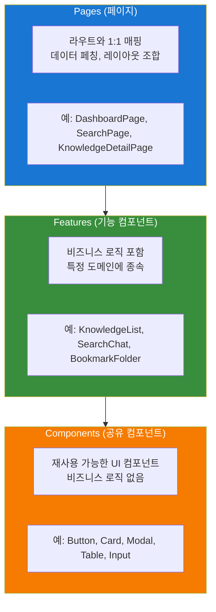
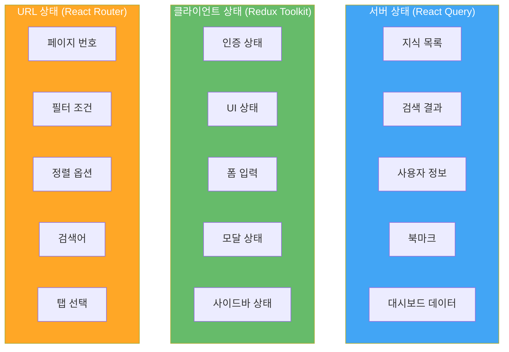
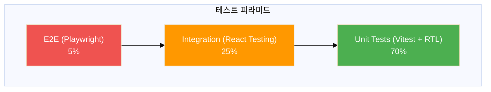
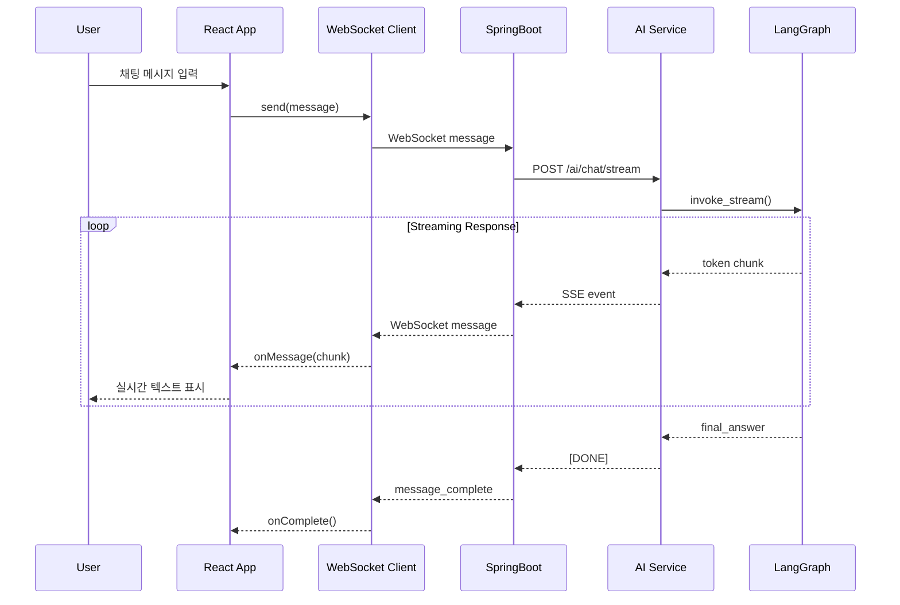
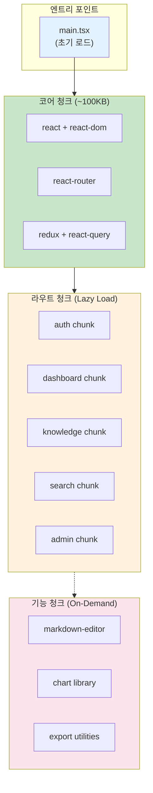

# Frontend 상세 설계서
## React 기반 Knowledge Discovery Platform

**버전**: 1.2
**작성일**: 2026-01-15
**수정일**: 2026-01-17
**상태**: Approved
**관련 문서**:
- [프론트엔드 구현 계획서](../01_planning/frontend_implementation_plan.md)
- [인증/권한 설계서](./authentication_authorization_detailed_design.md)
- [에러 코드 표준](./error_code_standards.md)
- [용어사전](./glossary.md)

---

## 목차

1. [개요](#1-개요)
2. [기술 스택](#2-기술-스택)
3. [프로젝트 구조](#3-프로젝트-구조)
4. [컴포넌트 아키텍처](#4-컴포넌트-아키텍처)
5. [타입 정의](#5-타입-정의)
6. [상태 관리](#6-상태-관리)
7. [라우팅 설계](#7-라우팅-설계)
8. [디자인 시스템](#8-디자인-시스템)
9. [폼 및 유효성 검증](#9-폼-및-유효성-검증)
10. [API 통신 레이어](#10-api-통신-레이어)
11. [에러 핸들링](#11-에러-핸들링)
12. [성능 최적화](#12-성능-최적화)
13. [테스트 전략](#13-테스트-전략)
14. [접근성 및 국제화](#14-접근성-및-국제화)
15. [실시간 통신 (WebSocket)](#15-실시간-통신-websocket) ⭐ NEW
16. [API 모킹 (MSW)](#16-api-모킹-msw) ⭐ NEW
17. [번들 분석 및 최적화](#17-번들-분석-및-최적화) ⭐ NEW
18. [Storybook 통합](#18-storybook-통합) ⭐ NEW
19. [PWA 설정](#19-pwa-설정) ⭐ NEW
20. [CI/CD 파이프라인](#20-cicd-파이프라인) ⭐ NEW
21. [구현 체크리스트](#21-구현-체크리스트)

---

## 1. 개요

### 1.1 목적

본 문서는 사내 지식 검색 시스템의 프론트엔드 애플리케이션에 대한 상세 설계를 정의합니다.

### 1.2 범위

- React 18 기반 SPA 애플리케이션
- TypeScript 전면 적용
- Material-UI v5 기반 디자인 시스템
- Redux Toolkit + React Query 상태 관리
- 반응형 웹 디자인 (Desktop, Tablet, Mobile)

### 1.3 핵심 기능

| 기능 | 설명 |
|------|------|
| **대시보드** | 인기 지식, 최신 지식, 추천, 통계 |
| **지식 검색** | 채팅 모드(RAG), 검색 모드(키워드) |
| **지식 관리** | CRUD, 마크다운 에디터, 파일 첨부 |
| **개인화** | 프로필, 북마크, 검색 기록 |
| **문서 변환** | Excel, PPT, PDF 내보내기 |
| **관리자** | 사용자 관리, 시스템 설정 |

---

## 2. 기술 스택

### 2.1 Core

| 기술 | 버전 | 용도 |
|------|------|------|
| **React** | 18.3+ | UI 라이브러리 |
| **TypeScript** | 5.4+ | 타입 안정성 |
| **Vite** | 5.x | 빌드 도구 |

### 2.2 상태 관리

| 기술 | 버전 | 용도 |
|------|------|------|
| **Redux Toolkit** | 2.x | 클라이언트 상태 |
| **React Query** | 5.x | 서버 상태 |
| **Redux Persist** | 6.x | 상태 지속성 |

### 2.3 UI/UX

| 기술 | 버전 | 용도 |
|------|------|------|
| **MUI (Material-UI)** | 5.x | 컴포넌트 라이브러리 |
| **Emotion** | 11.x | CSS-in-JS |
| **React Router** | 6.x | 라우팅 |
| **Framer Motion** | 11.x | 애니메이션 |

### 2.4 폼 및 검증

| 기술 | 버전 | 용도 |
|------|------|------|
| **React Hook Form** | 7.x | 폼 관리 |
| **Zod** | 3.x | 스키마 검증 |
| **@hookform/resolvers** | 3.x | Zod 통합 |

### 2.5 유틸리티

| 기술 | 버전 | 용도 |
|------|------|------|
| **Axios** | 1.x | HTTP 클라이언트 |
| **date-fns** | 3.x | 날짜 처리 |
| **lodash-es** | 4.x | 유틸리티 함수 |
| **uuid** | 9.x | UUID 생성 |

### 2.6 시각화

| 기술 | 버전 | 용도 |
|------|------|------|
| **Recharts** | 2.x | 차트 |
| **react-markdown** | 9.x | 마크다운 렌더링 |
| **Prism.js** | 1.x | 코드 하이라이팅 |
| **Mermaid** | 10.x | 다이어그램 |
| **KaTeX** | 0.16+ | 수식 렌더링 |

### 2.7 개발 도구

| 기술 | 버전 | 용도 |
|------|------|------|
| **ESLint** | 8.x | 린팅 |
| **Prettier** | 3.x | 코드 포맷팅 |
| **Vitest** | 1.x | 단위 테스트 |
| **Playwright** | 1.x | E2E 테스트 |
| **Storybook** | 8.x | 컴포넌트 문서화 |

---

## 3. 프로젝트 구조

### 3.1 폴더 구조

```
frontend/
├── public/
│   ├── favicon.ico
│   ├── logo.svg
│   └── locales/                    # i18n 번역 파일
│       ├── ko/
│       └── en/
├── src/
│   ├── app/                        # 앱 설정
│   │   ├── App.tsx
│   │   ├── providers.tsx           # Provider 래퍼
│   │   └── router.tsx              # 라우터 설정
│   │
│   ├── assets/                     # 정적 자원
│   │   ├── images/
│   │   ├── icons/
│   │   └── fonts/
│   │
│   ├── components/                 # 공유 컴포넌트
│   │   ├── common/                 # 범용 컴포넌트
│   │   │   ├── Button/
│   │   │   ├── Input/
│   │   │   ├── Modal/
│   │   │   ├── Table/
│   │   │   ├── Card/
│   │   │   └── index.ts
│   │   ├── layout/                 # 레이아웃 컴포넌트
│   │   │   ├── Header/
│   │   │   ├── Sidebar/
│   │   │   ├── Footer/
│   │   │   ├── MainLayout/
│   │   │   └── index.ts
│   │   ├── feedback/               # 피드백 컴포넌트
│   │   │   ├── LoadingSpinner/
│   │   │   ├── Skeleton/
│   │   │   ├── Toast/
│   │   │   ├── ErrorBoundary/
│   │   │   └── index.ts
│   │   └── data-display/           # 데이터 표시
│   │       ├── MarkdownRenderer/
│   │       ├── CodeBlock/
│   │       ├── Chart/
│   │       ├── MermaidDiagram/
│   │       └── index.ts
│   │
│   ├── features/                   # 기능별 모듈
│   │   ├── auth/                   # 인증
│   │   │   ├── components/
│   │   │   ├── hooks/
│   │   │   ├── services/
│   │   │   ├── store/
│   │   │   └── index.ts
│   │   ├── dashboard/              # 대시보드
│   │   │   ├── components/
│   │   │   ├── hooks/
│   │   │   └── index.ts
│   │   ├── knowledge/              # 지식 관리
│   │   │   ├── components/
│   │   │   ├── hooks/
│   │   │   ├── services/
│   │   │   └── index.ts
│   │   ├── search/                 # 검색
│   │   │   ├── components/
│   │   │   ├── hooks/
│   │   │   ├── services/
│   │   │   └── index.ts
│   │   ├── bookmark/               # 북마크
│   │   │   ├── components/
│   │   │   ├── hooks/
│   │   │   └── index.ts
│   │   ├── profile/                # 프로필
│   │   │   ├── components/
│   │   │   ├── hooks/
│   │   │   └── index.ts
│   │   ├── export/                 # 문서 내보내기
│   │   │   ├── components/
│   │   │   ├── services/
│   │   │   └── index.ts
│   │   └── admin/                  # 관리자
│   │       ├── components/
│   │       ├── hooks/
│   │       └── index.ts
│   │
│   ├── hooks/                      # 공통 훅
│   │   ├── useDebounce.ts
│   │   ├── useLocalStorage.ts
│   │   ├── useMediaQuery.ts
│   │   ├── useIntersectionObserver.ts
│   │   └── index.ts
│   │
│   ├── pages/                      # 페이지 컴포넌트
│   │   ├── DashboardPage.tsx
│   │   ├── SearchPage.tsx
│   │   ├── KnowledgeListPage.tsx
│   │   ├── KnowledgeDetailPage.tsx
│   │   ├── KnowledgeCreatePage.tsx
│   │   ├── KnowledgeEditPage.tsx
│   │   ├── ProfilePage.tsx
│   │   ├── BookmarkPage.tsx
│   │   ├── AdminPage.tsx
│   │   ├── LoginPage.tsx
│   │   ├── OAuthCallbackPage.tsx
│   │   ├── NotFoundPage.tsx
│   │   └── UnauthorizedPage.tsx
│   │
│   ├── services/                   # API 서비스
│   │   ├── api/
│   │   │   ├── apiClient.ts        # Axios 인스턴스
│   │   │   ├── authApi.ts
│   │   │   ├── knowledgeApi.ts
│   │   │   ├── searchApi.ts
│   │   │   ├── userApi.ts
│   │   │   ├── bookmarkApi.ts
│   │   │   ├── dashboardApi.ts
│   │   │   └── exportApi.ts
│   │   └── websocket/
│   │       └── chatService.ts      # WebSocket 채팅
│   │
│   ├── store/                      # Redux 스토어
│   │   ├── slices/
│   │   │   ├── authSlice.ts
│   │   │   ├── uiSlice.ts
│   │   │   └── searchSlice.ts
│   │   ├── store.ts
│   │   └── hooks.ts                # Typed hooks
│   │
│   ├── styles/                     # 스타일
│   │   ├── theme/
│   │   │   ├── palette.ts
│   │   │   ├── typography.ts
│   │   │   ├── components.ts
│   │   │   └── index.ts
│   │   ├── global.css
│   │   └── variables.css
│   │
│   ├── types/                      # 타입 정의
│   │   ├── api.types.ts
│   │   ├── knowledge.types.ts
│   │   ├── user.types.ts
│   │   ├── search.types.ts
│   │   └── index.ts
│   │
│   ├── utils/                      # 유틸리티
│   │   ├── format.ts
│   │   ├── validation.ts
│   │   ├── storage.ts
│   │   ├── constants.ts
│   │   └── index.ts
│   │
│   ├── main.tsx                    # 엔트리 포인트
│   └── vite-env.d.ts
│
├── tests/                          # 테스트
│   ├── unit/
│   ├── integration/
│   └── e2e/
│
├── .env.example
├── .eslintrc.cjs
├── .prettierrc
├── index.html
├── package.json
├── tsconfig.json
├── vite.config.ts
└── vitest.config.ts
```

### 3.2 Feature 모듈 구조

각 feature 폴더는 다음 구조를 따릅니다:

```
features/knowledge/
├── components/                     # 기능 전용 컴포넌트
│   ├── KnowledgeCard/
│   │   ├── KnowledgeCard.tsx
│   │   ├── KnowledgeCard.styles.ts
│   │   ├── KnowledgeCard.test.tsx
│   │   └── index.ts
│   ├── KnowledgeList/
│   ├── KnowledgeForm/
│   ├── KnowledgeEditor/
│   └── index.ts
├── hooks/                          # 기능 전용 훅
│   ├── useKnowledge.ts
│   ├── useKnowledgeList.ts
│   ├── useKnowledgeMutation.ts
│   └── index.ts
├── services/                       # API 호출 (선택)
│   └── knowledgeQueries.ts
├── store/                          # 상태 (선택)
│   └── knowledgeSlice.ts
├── types/                          # 타입 (선택)
│   └── knowledge.types.ts
└── index.ts                        # Public API
```

### 3.3 컴포넌트 파일 구조

```
components/common/Button/
├── Button.tsx                      # 컴포넌트 구현
├── Button.styles.ts                # 스타일 (styled-components)
├── Button.types.ts                 # Props 타입
├── Button.test.tsx                 # 테스트
├── Button.stories.tsx              # Storybook
└── index.ts                        # export
```

---

## 4. 컴포넌트 아키텍처

### 4.1 컴포넌트 분류



### 4.2 컴포넌트 설계 원칙

#### 4.2.1 단일 책임 원칙

```typescript
// ❌ Bad: 여러 책임을 가진 컴포넌트
const KnowledgeCard = ({ id }) => {
  const [data, setData] = useState(null);

  useEffect(() => {
    fetch(`/api/knowledge/${id}`).then(res => setData(res.json()));
  }, [id]);

  const handleDelete = async () => {
    await fetch(`/api/knowledge/${id}`, { method: 'DELETE' });
    window.location.reload();
  };

  return (/* UI 렌더링 */);
};

// ✅ Good: 책임 분리
// 1. 데이터 페칭 훅
const useKnowledge = (id: string) => {
  return useQuery({
    queryKey: ['knowledge', id],
    queryFn: () => knowledgeApi.getById(id),
  });
};

// 2. 순수 표시 컴포넌트
const KnowledgeCard: React.FC<KnowledgeCardProps> = ({
  knowledge,
  onDelete
}) => {
  return (/* UI 렌더링 */);
};

// 3. 컨테이너 컴포넌트
const KnowledgeCardContainer: React.FC<{ id: string }> = ({ id }) => {
  const { data, isLoading } = useKnowledge(id);
  const deleteMutation = useDeleteKnowledge();

  if (isLoading) return <Skeleton />;
  return <KnowledgeCard knowledge={data} onDelete={deleteMutation.mutate} />;
};
```

#### 4.2.2 컴포넌트 Props 설계

```typescript
// 기본 Props 패턴
interface ButtonProps {
  // 필수 Props
  children: React.ReactNode;

  // 선택적 Props (기본값 제공)
  variant?: 'contained' | 'outlined' | 'text';
  size?: 'small' | 'medium' | 'large';
  color?: 'primary' | 'secondary' | 'error';
  disabled?: boolean;
  loading?: boolean;
  fullWidth?: boolean;

  // 이벤트 핸들러
  onClick?: (event: React.MouseEvent<HTMLButtonElement>) => void;

  // HTML 속성 확장
  type?: 'button' | 'submit' | 'reset';

  // 스타일 커스터마이징
  className?: string;
  sx?: SxProps<Theme>;
}

// 컴포넌트 구현
export const Button: React.FC<ButtonProps> = ({
  children,
  variant = 'contained',
  size = 'medium',
  color = 'primary',
  disabled = false,
  loading = false,
  fullWidth = false,
  onClick,
  type = 'button',
  className,
  sx,
}) => {
  return (
    <MuiButton
      variant={variant}
      size={size}
      color={color}
      disabled={disabled || loading}
      fullWidth={fullWidth}
      onClick={onClick}
      type={type}
      className={className}
      sx={sx}
    >
      {loading ? <CircularProgress size={20} /> : children}
    </MuiButton>
  );
};
```

### 4.3 레이아웃 컴포넌트

#### 4.3.1 MainLayout

```typescript
// components/layout/MainLayout/MainLayout.tsx
interface MainLayoutProps {
  children: React.ReactNode;
}

export const MainLayout: React.FC<MainLayoutProps> = ({ children }) => {
  const { sidebarOpen } = useAppSelector((state) => state.ui);

  return (
    <Box sx={{ display: 'flex', minHeight: '100vh' }}>
      <Header />
      <Sidebar open={sidebarOpen} />
      <Box
        component="main"
        sx={{
          flexGrow: 1,
          marginLeft: sidebarOpen ? `${SIDEBAR_WIDTH}px` : 0,
          marginTop: `${HEADER_HEIGHT}px`,
          transition: 'margin-left 0.3s ease',
          padding: 3,
        }}
      >
        <Breadcrumbs />
        {children}
      </Box>
      <Footer />
    </Box>
  );
};
```

#### 4.3.2 레이아웃 구조

```
┌─────────────────────────────────────────────────────────────────┐
│  Header (64px)                                      [🔔] [👤]   │
├───────────┬─────────────────────────────────────────────────────┤
│           │  Breadcrumbs: Home > Knowledge > Detail             │
│           ├─────────────────────────────────────────────────────┤
│  Sidebar  │                                                     │
│  (240px)  │                     Main Content                    │
│           │                                                     │
│  - 대시보드│                                                     │
│  - 검색    │                                                     │
│  - 내 지식 │                                                     │
│  - 북마크  │                                                     │
│           │                                                     │
│           │                                                     │
├───────────┴─────────────────────────────────────────────────────┤
│  Footer                                              © 2026     │
└─────────────────────────────────────────────────────────────────┘
```

---

## 5. 타입 정의

### 5.1 API 응답 타입

```typescript
// types/api.types.ts

// 공통 API 응답 래퍼
interface ApiResponse<T> {
  success: boolean;
  data: T;
  message?: string;
  timestamp: string;
}

// 에러 응답
interface ApiErrorResponse {
  success: false;
  error: {
    code: string;
    message: string;
    details?: Record<string, unknown>;
  };
  timestamp: string;
  path: string;
}

// 페이지네이션 응답
interface PaginatedResponse<T> {
  content: T[];
  page: number;
  size: number;
  totalElements: number;
  totalPages: number;
  first: boolean;
  last: boolean;
}

// 커서 기반 페이지네이션
interface CursorPaginatedResponse<T> {
  content: T[];
  nextCursor: string | null;
  hasMore: boolean;
}
```

### 5.2 도메인 타입

> **ID 타입 규약**: 모든 엔티티의 `id` 필드는 **UUID v4 형식**(`xxxxxxxx-xxxx-4xxx-yxxx-xxxxxxxxxxxx`)입니다.
> TypeScript에서는 `string` 타입으로 표현하되, 런타임 검증 시 UUID 정규식을 사용합니다.
> 예: `"550e8400-e29b-41d4-a716-446655440000"`

```typescript
// types/common.types.ts

/** UUID v4 형식의 문자열 타입 */
type UUID = string;

// types/knowledge.types.ts

interface Knowledge {
  id: UUID;  // UUID v4 형식
  title: string;
  content: string;
  summary?: string;

  // 메타데이터
  category: Category;
  tags: string[];
  projectId?: string;
  projectName?: string;

  // 유효기간
  validFrom?: string;
  validTo?: string;

  // 공개 설정
  visibility: 'PUBLIC' | 'DEPARTMENT' | 'PRIVATE';

  // 통계
  viewCount: number;
  likeCount: number;
  bookmarkCount: number;

  // 첨부파일
  attachments: Attachment[];

  // 감사 정보
  author: UserSummary;
  createdAt: string;
  updatedAt: string;
  version: number;
}

interface KnowledgeCreateInput {
  title: string;
  content: string;
  categoryId: string;
  tags?: string[];
  projectId?: string;
  validFrom?: string;
  validTo?: string;
  visibility?: 'PUBLIC' | 'DEPARTMENT' | 'PRIVATE';
  files?: File[];
}

interface KnowledgeUpdateInput extends Partial<KnowledgeCreateInput> {
  reason?: string;
}

interface KnowledgeListParams {
  page?: number;
  size?: number;
  sort?: string;
  categoryId?: string;
  tags?: string[];
  authorId?: string;
  visibility?: string;
  search?: string;
  dateFrom?: string;
  dateTo?: string;
}
```

```typescript
// types/user.types.ts

interface User {
  id: UUID;  // UUID v4 형식
  email: string;
  name: string;
  department?: string;
  position?: string;
  profileImage?: string;
  roles: UserRole[];
  status: UserStatus;
  preferences: UserPreferences;
  createdAt: string;
  lastLoginAt?: string;
}

type UserRole = 'USER' | 'KNOWLEDGE_MANAGER' | 'ADMIN';
type UserStatus = 'ACTIVE' | 'INACTIVE' | 'SUSPENDED';

interface UserSummary {
  id: UUID;  // UUID v4 형식
  name: string;
  department?: string;
  profileImage?: string;
}

interface UserPreferences {
  theme: 'light' | 'dark' | 'system';
  language: 'ko' | 'en';
  notifications: {
    email: boolean;
    push: boolean;
  };
  defaultSearchMode: 'chat' | 'search';
}
```

```typescript
// types/search.types.ts

interface SearchParams {
  query: string;
  mode: 'chat' | 'search';
  filters?: SearchFilters;
  page?: number;
  size?: number;
}

interface SearchFilters {
  categories?: string[];
  tags?: string[];
  authors?: string[];
  dateFrom?: string;
  dateTo?: string;
  projects?: string[];
}

interface SearchResult {
  id: string;
  title: string;
  content: string;
  snippet: string;          // 하이라이트된 스니펫
  score: number;            // 관련도 점수
  category: Category;
  tags: string[];
  author: UserSummary;
  createdAt: string;
  highlights: {
    title?: string[];
    content?: string[];
  };
}

interface ChatMessage {
  id: string;
  conversationId: string;
  role: 'user' | 'assistant';
  content: string;
  sources?: SearchResult[];  // 답변 근거
  timestamp: string;
  feedback?: {
    rating?: 'positive' | 'negative';
    comment?: string;
  };
}

interface Conversation {
  id: string;
  title?: string;
  messages: ChatMessage[];
  createdAt: string;
  updatedAt: string;
}
```

### 5.3 컴포넌트 공통 타입

```typescript
// types/component.types.ts

// 크기
type Size = 'small' | 'medium' | 'large';

// 색상 (시맨틱)
type Color = 'primary' | 'secondary' | 'success' | 'error' | 'warning' | 'info';

// 정렬
type Alignment = 'left' | 'center' | 'right';

// 로딩 상태
interface LoadingState {
  isLoading: boolean;
  error: string | null;
}

// 선택 항목
interface SelectOption<T = string> {
  value: T;
  label: string;
  disabled?: boolean;
}

// 테이블 컬럼
interface TableColumn<T> {
  id: keyof T | string;
  label: string;
  align?: Alignment;
  width?: number | string;
  sortable?: boolean;
  render?: (row: T) => React.ReactNode;
}
```

---

## 6. 상태 관리

### 6.1 상태 관리 전략



### 6.2 Redux Store 설계

```typescript
// store/store.ts
import { configureStore, combineReducers } from '@reduxjs/toolkit';
import { persistStore, persistReducer } from 'redux-persist';
import storage from 'redux-persist/lib/storage';

import authReducer from './slices/authSlice';
import uiReducer from './slices/uiSlice';
import searchReducer from './slices/searchSlice';

const rootReducer = combineReducers({
  auth: authReducer,
  ui: uiReducer,
  search: searchReducer,
});

const persistConfig = {
  key: 'root',
  storage,
  whitelist: ['ui'], // ui 상태만 persist
};

const persistedReducer = persistReducer(persistConfig, rootReducer);

export const store = configureStore({
  reducer: persistedReducer,
  middleware: (getDefaultMiddleware) =>
    getDefaultMiddleware({
      serializableCheck: {
        ignoredActions: ['persist/PERSIST', 'persist/REHYDRATE'],
      },
    }),
  devTools: import.meta.env.DEV,
});

export const persistor = persistStore(store);

export type RootState = ReturnType<typeof store.getState>;
export type AppDispatch = typeof store.dispatch;
```

```typescript
// store/hooks.ts
import { TypedUseSelectorHook, useDispatch, useSelector } from 'react-redux';
import type { RootState, AppDispatch } from './store';

export const useAppDispatch = () => useDispatch<AppDispatch>();
export const useAppSelector: TypedUseSelectorHook<RootState> = useSelector;
```

### 6.3 UI Slice

```typescript
// store/slices/uiSlice.ts
import { createSlice, PayloadAction } from '@reduxjs/toolkit';

interface Notification {
  id: string;
  type: 'success' | 'error' | 'warning' | 'info';
  message: string;
  duration?: number;
}

interface UIState {
  theme: 'light' | 'dark' | 'system';
  sidebarOpen: boolean;
  sidebarCollapsed: boolean;
  notifications: Notification[];
  globalLoading: boolean;
}

const initialState: UIState = {
  theme: 'system',
  sidebarOpen: true,
  sidebarCollapsed: false,
  notifications: [],
  globalLoading: false,
};

const uiSlice = createSlice({
  name: 'ui',
  initialState,
  reducers: {
    setTheme: (state, action: PayloadAction<UIState['theme']>) => {
      state.theme = action.payload;
    },
    toggleSidebar: (state) => {
      state.sidebarOpen = !state.sidebarOpen;
    },
    setSidebarOpen: (state, action: PayloadAction<boolean>) => {
      state.sidebarOpen = action.payload;
    },
    toggleSidebarCollapse: (state) => {
      state.sidebarCollapsed = !state.sidebarCollapsed;
    },
    addNotification: (state, action: PayloadAction<Omit<Notification, 'id'>>) => {
      state.notifications.push({
        ...action.payload,
        id: crypto.randomUUID(),
      });
    },
    removeNotification: (state, action: PayloadAction<string>) => {
      state.notifications = state.notifications.filter(
        (n) => n.id !== action.payload
      );
    },
    clearNotifications: (state) => {
      state.notifications = [];
    },
    setGlobalLoading: (state, action: PayloadAction<boolean>) => {
      state.globalLoading = action.payload;
    },
  },
});

export const {
  setTheme,
  toggleSidebar,
  setSidebarOpen,
  toggleSidebarCollapse,
  addNotification,
  removeNotification,
  clearNotifications,
  setGlobalLoading,
} = uiSlice.actions;

export default uiSlice.reducer;
```

### 6.4 React Query 설정

```typescript
// services/queryClient.ts
import { QueryClient } from '@tanstack/react-query';

export const queryClient = new QueryClient({
  defaultOptions: {
    queries: {
      staleTime: 5 * 60 * 1000,      // 5분
      gcTime: 30 * 60 * 1000,        // 30분 (캐시 유지)
      retry: 1,
      refetchOnWindowFocus: false,
      refetchOnReconnect: true,
    },
    mutations: {
      retry: 0,
    },
  },
});
```

```typescript
// services/queryKeys.ts
export const queryKeys = {
  // Knowledge
  knowledge: {
    all: ['knowledge'] as const,
    lists: () => [...queryKeys.knowledge.all, 'list'] as const,
    list: (params: KnowledgeListParams) =>
      [...queryKeys.knowledge.lists(), params] as const,
    details: () => [...queryKeys.knowledge.all, 'detail'] as const,
    detail: (id: string) => [...queryKeys.knowledge.details(), id] as const,
    versions: (id: string) => [...queryKeys.knowledge.detail(id), 'versions'] as const,
  },

  // Search
  search: {
    all: ['search'] as const,
    results: (params: SearchParams) => [...queryKeys.search.all, params] as const,
    suggestions: (query: string) => [...queryKeys.search.all, 'suggestions', query] as const,
  },

  // User
  user: {
    all: ['user'] as const,
    me: () => [...queryKeys.user.all, 'me'] as const,
    profile: (id: string) => [...queryKeys.user.all, 'profile', id] as const,
    preferences: () => [...queryKeys.user.all, 'preferences'] as const,
  },

  // Bookmark
  bookmark: {
    all: ['bookmark'] as const,
    list: () => [...queryKeys.bookmark.all, 'list'] as const,
    folders: () => [...queryKeys.bookmark.all, 'folders'] as const,
  },

  // Dashboard
  dashboard: {
    all: ['dashboard'] as const,
    stats: () => [...queryKeys.dashboard.all, 'stats'] as const,
    popular: () => [...queryKeys.dashboard.all, 'popular'] as const,
    recent: () => [...queryKeys.dashboard.all, 'recent'] as const,
    recommended: () => [...queryKeys.dashboard.all, 'recommended'] as const,
  },

  // Category
  category: {
    all: ['category'] as const,
    tree: () => [...queryKeys.category.all, 'tree'] as const,
  },
} as const;
```

### 6.5 Custom Hooks (React Query)

```typescript
// features/knowledge/hooks/useKnowledge.ts
import { useQuery, useMutation, useQueryClient } from '@tanstack/react-query';
import { queryKeys } from '@/services/queryKeys';
import { knowledgeApi } from '@/services/api/knowledgeApi';

// 지식 상세 조회
export const useKnowledge = (id: string) => {
  return useQuery({
    queryKey: queryKeys.knowledge.detail(id),
    queryFn: () => knowledgeApi.getById(id),
    enabled: !!id,
  });
};

// 지식 목록 조회
export const useKnowledgeList = (params: KnowledgeListParams) => {
  return useQuery({
    queryKey: queryKeys.knowledge.list(params),
    queryFn: () => knowledgeApi.getList(params),
    placeholderData: (previousData) => previousData,
  });
};

// 지식 생성
export const useCreateKnowledge = () => {
  const queryClient = useQueryClient();

  return useMutation({
    mutationFn: knowledgeApi.create,
    onSuccess: () => {
      queryClient.invalidateQueries({ queryKey: queryKeys.knowledge.lists() });
    },
  });
};

// 지식 수정
export const useUpdateKnowledge = () => {
  const queryClient = useQueryClient();

  return useMutation({
    mutationFn: ({ id, data }: { id: string; data: KnowledgeUpdateInput }) =>
      knowledgeApi.update(id, data),
    onSuccess: (_, { id }) => {
      queryClient.invalidateQueries({ queryKey: queryKeys.knowledge.detail(id) });
      queryClient.invalidateQueries({ queryKey: queryKeys.knowledge.lists() });
    },
  });
};

// 지식 삭제
export const useDeleteKnowledge = () => {
  const queryClient = useQueryClient();

  return useMutation({
    mutationFn: knowledgeApi.delete,
    onSuccess: () => {
      queryClient.invalidateQueries({ queryKey: queryKeys.knowledge.lists() });
    },
  });
};
```

---

## 7. 라우팅 설계

### 7.1 라우트 맵

```typescript
// app/router.tsx
import { createBrowserRouter, Navigate } from 'react-router-dom';
import { lazy } from 'react';

// Lazy loading
const DashboardPage = lazy(() => import('@/pages/DashboardPage'));
const SearchPage = lazy(() => import('@/pages/SearchPage'));
const KnowledgeListPage = lazy(() => import('@/pages/KnowledgeListPage'));
const KnowledgeDetailPage = lazy(() => import('@/pages/KnowledgeDetailPage'));
const KnowledgeCreatePage = lazy(() => import('@/pages/KnowledgeCreatePage'));
const KnowledgeEditPage = lazy(() => import('@/pages/KnowledgeEditPage'));
const ProfilePage = lazy(() => import('@/pages/ProfilePage'));
const BookmarkPage = lazy(() => import('@/pages/BookmarkPage'));
const AdminPage = lazy(() => import('@/pages/AdminPage'));
const LoginPage = lazy(() => import('@/pages/LoginPage'));
const OAuthCallbackPage = lazy(() => import('@/pages/OAuthCallbackPage'));
const NotFoundPage = lazy(() => import('@/pages/NotFoundPage'));
const UnauthorizedPage = lazy(() => import('@/pages/UnauthorizedPage'));

export const router = createBrowserRouter([
  // Public routes
  {
    path: '/login',
    element: <LoginPage />,
  },
  {
    path: '/oauth/callback',
    element: <OAuthCallbackPage />,
  },

  // Protected routes
  {
    path: '/',
    element: <ProtectedRoute><MainLayout /></ProtectedRoute>,
    children: [
      {
        index: true,
        element: <Navigate to="/dashboard" replace />,
      },
      {
        path: 'dashboard',
        element: <DashboardPage />,
      },
      {
        path: 'search',
        element: <SearchPage />,
      },
      {
        path: 'knowledge',
        children: [
          {
            index: true,
            element: <KnowledgeListPage />,
          },
          {
            path: 'create',
            element: <KnowledgeCreatePage />,
          },
          {
            path: ':id',
            element: <KnowledgeDetailPage />,
          },
          {
            path: ':id/edit',
            element: <KnowledgeEditPage />,
          },
        ],
      },
      {
        path: 'my-knowledge',
        element: <KnowledgeListPage filter="my" />,
      },
      {
        path: 'bookmarks',
        element: <BookmarkPage />,
      },
      {
        path: 'profile',
        element: <ProfilePage />,
      },

      // Admin routes
      {
        path: 'admin',
        element: <ProtectedRoute requiredRoles={['ADMIN']}><AdminPage /></ProtectedRoute>,
        children: [
          {
            path: 'users',
            element: <AdminUsersPage />,
          },
          {
            path: 'categories',
            element: <AdminCategoriesPage />,
          },
          {
            path: 'settings',
            element: <AdminSettingsPage />,
          },
        ],
      },
    ],
  },

  // Error pages
  {
    path: '/unauthorized',
    element: <UnauthorizedPage />,
  },
  {
    path: '*',
    element: <NotFoundPage />,
  },
]);
```

### 7.2 라우트 상수

```typescript
// utils/routes.ts
export const ROUTES = {
  HOME: '/',
  LOGIN: '/login',
  OAUTH_CALLBACK: '/oauth/callback',

  DASHBOARD: '/dashboard',

  SEARCH: '/search',

  KNOWLEDGE: {
    LIST: '/knowledge',
    CREATE: '/knowledge/create',
    DETAIL: (id: string) => `/knowledge/${id}`,
    EDIT: (id: string) => `/knowledge/${id}/edit`,
  },

  MY_KNOWLEDGE: '/my-knowledge',

  BOOKMARKS: '/bookmarks',

  PROFILE: '/profile',

  ADMIN: {
    ROOT: '/admin',
    USERS: '/admin/users',
    CATEGORIES: '/admin/categories',
    SETTINGS: '/admin/settings',
  },

  ERROR: {
    UNAUTHORIZED: '/unauthorized',
    NOT_FOUND: '/404',
  },
} as const;
```

### 7.3 Protected Route

```typescript
// components/auth/ProtectedRoute.tsx
import { Navigate, useLocation } from 'react-router-dom';
import { useAppSelector } from '@/store/hooks';
import { ROUTES } from '@/utils/routes';

interface ProtectedRouteProps {
  children: React.ReactNode;
  requiredRoles?: string[];
}

export const ProtectedRoute: React.FC<ProtectedRouteProps> = ({
  children,
  requiredRoles = [],
}) => {
  const location = useLocation();
  const { isAuthenticated, user, isLoading } = useAppSelector((state) => state.auth);

  if (isLoading) {
    return <FullPageLoader />;
  }

  if (!isAuthenticated) {
    return <Navigate to={ROUTES.LOGIN} state={{ from: location }} replace />;
  }

  if (requiredRoles.length > 0) {
    const hasRequiredRole = requiredRoles.some((role) =>
      user?.roles.includes(role as UserRole)
    );

    if (!hasRequiredRole) {
      return <Navigate to={ROUTES.ERROR.UNAUTHORIZED} replace />;
    }
  }

  return <>{children}</>;
};
```

---

## 8. 디자인 시스템

### 8.1 테마 설정

```typescript
// styles/theme/index.ts
import { createTheme, ThemeOptions } from '@mui/material/styles';
import { palette } from './palette';
import { typography } from './typography';
import { components } from './components';

const baseTheme: ThemeOptions = {
  typography,
  shape: {
    borderRadius: 8,
  },
  spacing: 8,
};

export const lightTheme = createTheme({
  ...baseTheme,
  palette: palette.light,
  components: components.light,
});

export const darkTheme = createTheme({
  ...baseTheme,
  palette: palette.dark,
  components: components.dark,
});
```

### 8.2 색상 팔레트

```typescript
// styles/theme/palette.ts
export const palette = {
  light: {
    mode: 'light' as const,
    primary: {
      main: '#1976D2',
      light: '#42A5F5',
      dark: '#1565C0',
      contrastText: '#FFFFFF',
    },
    secondary: {
      main: '#9C27B0',
      light: '#BA68C8',
      dark: '#7B1FA2',
      contrastText: '#FFFFFF',
    },
    error: {
      main: '#D32F2F',
      light: '#EF5350',
      dark: '#C62828',
    },
    warning: {
      main: '#ED6C02',
      light: '#FF9800',
      dark: '#E65100',
    },
    success: {
      main: '#2E7D32',
      light: '#4CAF50',
      dark: '#1B5E20',
    },
    info: {
      main: '#0288D1',
      light: '#03A9F4',
      dark: '#01579B',
    },
    background: {
      default: '#F5F5F5',
      paper: '#FFFFFF',
    },
    text: {
      primary: '#212121',
      secondary: '#757575',
      disabled: '#9E9E9E',
    },
    divider: '#E0E0E0',
  },
  dark: {
    mode: 'dark' as const,
    primary: {
      main: '#90CAF9',
      light: '#E3F2FD',
      dark: '#42A5F5',
      contrastText: '#000000',
    },
    secondary: {
      main: '#CE93D8',
      light: '#F3E5F5',
      dark: '#AB47BC',
      contrastText: '#000000',
    },
    error: {
      main: '#F44336',
      light: '#E57373',
      dark: '#D32F2F',
    },
    warning: {
      main: '#FFA726',
      light: '#FFB74D',
      dark: '#F57C00',
    },
    success: {
      main: '#66BB6A',
      light: '#81C784',
      dark: '#388E3C',
    },
    info: {
      main: '#29B6F6',
      light: '#4FC3F7',
      dark: '#0288D1',
    },
    background: {
      default: '#121212',
      paper: '#1E1E1E',
    },
    text: {
      primary: '#FFFFFF',
      secondary: '#B0B0B0',
      disabled: '#6B6B6B',
    },
    divider: '#424242',
  },
};
```

### 8.3 타이포그래피

```typescript
// styles/theme/typography.ts
export const typography = {
  fontFamily: [
    'Pretendard',
    '-apple-system',
    'BlinkMacSystemFont',
    '"Segoe UI"',
    'Roboto',
    '"Helvetica Neue"',
    'Arial',
    'sans-serif',
  ].join(','),

  h1: {
    fontSize: '2.5rem',     // 40px
    fontWeight: 700,
    lineHeight: 1.2,
    letterSpacing: '-0.02em',
  },
  h2: {
    fontSize: '2rem',       // 32px
    fontWeight: 700,
    lineHeight: 1.3,
    letterSpacing: '-0.01em',
  },
  h3: {
    fontSize: '1.5rem',     // 24px
    fontWeight: 600,
    lineHeight: 1.4,
  },
  h4: {
    fontSize: '1.25rem',    // 20px
    fontWeight: 600,
    lineHeight: 1.4,
  },
  h5: {
    fontSize: '1.125rem',   // 18px
    fontWeight: 600,
    lineHeight: 1.5,
  },
  h6: {
    fontSize: '1rem',       // 16px
    fontWeight: 600,
    lineHeight: 1.5,
  },
  subtitle1: {
    fontSize: '1rem',
    fontWeight: 500,
    lineHeight: 1.5,
  },
  subtitle2: {
    fontSize: '0.875rem',   // 14px
    fontWeight: 500,
    lineHeight: 1.5,
  },
  body1: {
    fontSize: '1rem',
    fontWeight: 400,
    lineHeight: 1.6,
  },
  body2: {
    fontSize: '0.875rem',
    fontWeight: 400,
    lineHeight: 1.6,
  },
  button: {
    fontSize: '0.875rem',
    fontWeight: 600,
    lineHeight: 1.75,
    textTransform: 'none' as const,
  },
  caption: {
    fontSize: '0.75rem',    // 12px
    fontWeight: 400,
    lineHeight: 1.5,
  },
  overline: {
    fontSize: '0.625rem',   // 10px
    fontWeight: 600,
    lineHeight: 1.5,
    textTransform: 'uppercase' as const,
    letterSpacing: '0.08em',
  },
};
```

### 8.4 컴포넌트 오버라이드

```typescript
// styles/theme/components.ts
import { Components, Theme } from '@mui/material/styles';

export const components = {
  light: {
    MuiButton: {
      styleOverrides: {
        root: {
          borderRadius: 8,
          textTransform: 'none',
          fontWeight: 600,
        },
        contained: {
          boxShadow: 'none',
          '&:hover': {
            boxShadow: '0 2px 8px rgba(0,0,0,0.15)',
          },
        },
      },
      defaultProps: {
        disableElevation: true,
      },
    },
    MuiCard: {
      styleOverrides: {
        root: {
          borderRadius: 12,
          boxShadow: '0 1px 3px rgba(0,0,0,0.08)',
          '&:hover': {
            boxShadow: '0 4px 12px rgba(0,0,0,0.1)',
          },
        },
      },
    },
    MuiTextField: {
      defaultProps: {
        variant: 'outlined',
        size: 'small',
      },
      styleOverrides: {
        root: {
          '& .MuiOutlinedInput-root': {
            borderRadius: 8,
          },
        },
      },
    },
    MuiChip: {
      styleOverrides: {
        root: {
          borderRadius: 6,
        },
      },
    },
    MuiPaper: {
      styleOverrides: {
        root: {
          borderRadius: 12,
        },
      },
    },
    MuiDialog: {
      styleOverrides: {
        paper: {
          borderRadius: 16,
        },
      },
    },
  } as Components<Theme>,

  dark: {
    // dark 모드 오버라이드
  } as Components<Theme>,
};
```

### 8.5 반응형 브레이크포인트

```typescript
// styles/theme/breakpoints.ts
export const breakpoints = {
  values: {
    xs: 0,
    sm: 600,
    md: 900,
    lg: 1200,
    xl: 1536,
  },
};

// 사용 예시
// theme.breakpoints.up('md') => '@media (min-width:900px)'
// theme.breakpoints.down('sm') => '@media (max-width:599.95px)'
// theme.breakpoints.between('sm', 'lg') => '@media (min-width:600px) and (max-width:1199.95px)'
```

### 8.6 레이아웃 상수

```typescript
// utils/constants.ts
export const LAYOUT = {
  HEADER_HEIGHT: 64,
  SIDEBAR_WIDTH: 240,
  SIDEBAR_COLLAPSED_WIDTH: 64,
  CONTENT_MAX_WIDTH: 1200,
  FOOTER_HEIGHT: 48,
} as const;

export const SPACING = {
  PAGE_PADDING: 24,
  CARD_PADDING: 16,
  SECTION_GAP: 32,
} as const;

export const Z_INDEX = {
  DRAWER: 1200,
  MODAL: 1300,
  SNACKBAR: 1400,
  TOOLTIP: 1500,
} as const;
```

---

## 9. 폼 및 유효성 검증

### 9.1 Zod 스키마

```typescript
// utils/validation.ts
import { z } from 'zod';

// 공통 스키마
export const emailSchema = z
  .string()
  .min(1, '이메일을 입력해주세요')
  .email('올바른 이메일 형식이 아닙니다');

export const requiredString = (fieldName: string) =>
  z.string().min(1, `${fieldName}을(를) 입력해주세요`);

// Knowledge 스키마
export const knowledgeCreateSchema = z.object({
  title: z
    .string()
    .min(1, '제목을 입력해주세요')
    .max(500, '제목은 500자 이내로 입력해주세요'),
  content: z
    .string()
    .min(1, '내용을 입력해주세요')
    .max(100000, '내용은 100,000자 이내로 입력해주세요'),
  categoryId: z.string().min(1, '카테고리를 선택해주세요'),
  tags: z
    .array(z.string().max(50, '태그는 50자 이내로 입력해주세요'))
    .max(20, '태그는 최대 20개까지 등록할 수 있습니다')
    .optional(),
  projectId: z.string().optional(),
  validFrom: z.string().optional(),
  validTo: z.string().optional(),
  visibility: z.enum(['PUBLIC', 'DEPARTMENT', 'PRIVATE']).default('PUBLIC'),
});

export const knowledgeUpdateSchema = knowledgeCreateSchema.partial().extend({
  reason: z.string().max(500).optional(),
});

// Search 스키마
export const searchSchema = z.object({
  query: z.string().min(1, '검색어를 입력해주세요'),
  mode: z.enum(['chat', 'search']),
  filters: z.object({
    categories: z.array(z.string()).optional(),
    tags: z.array(z.string()).optional(),
    dateFrom: z.string().optional(),
    dateTo: z.string().optional(),
  }).optional(),
});

// Profile 스키마
export const profileUpdateSchema = z.object({
  name: z.string().min(1, '이름을 입력해주세요').max(100),
  department: z.string().max(100).optional(),
  position: z.string().max(100).optional(),
});

export const preferencesSchema = z.object({
  theme: z.enum(['light', 'dark', 'system']),
  language: z.enum(['ko', 'en']),
  notifications: z.object({
    email: z.boolean(),
    push: z.boolean(),
  }),
  defaultSearchMode: z.enum(['chat', 'search']),
});

// 타입 추론
export type KnowledgeCreateInput = z.infer<typeof knowledgeCreateSchema>;
export type KnowledgeUpdateInput = z.infer<typeof knowledgeUpdateSchema>;
export type SearchInput = z.infer<typeof searchSchema>;
export type ProfileUpdateInput = z.infer<typeof profileUpdateSchema>;
export type PreferencesInput = z.infer<typeof preferencesSchema>;
```

### 9.2 폼 컴포넌트

```typescript
// features/knowledge/components/KnowledgeForm/KnowledgeForm.tsx
import { useForm, Controller } from 'react-hook-form';
import { zodResolver } from '@hookform/resolvers/zod';
import { knowledgeCreateSchema, KnowledgeCreateInput } from '@/utils/validation';

interface KnowledgeFormProps {
  initialValues?: Partial<KnowledgeCreateInput>;
  onSubmit: (data: KnowledgeCreateInput) => void;
  isLoading?: boolean;
}

export const KnowledgeForm: React.FC<KnowledgeFormProps> = ({
  initialValues,
  onSubmit,
  isLoading = false,
}) => {
  const {
    control,
    handleSubmit,
    formState: { errors, isDirty, isValid },
    reset,
    watch,
  } = useForm<KnowledgeCreateInput>({
    resolver: zodResolver(knowledgeCreateSchema),
    defaultValues: {
      title: '',
      content: '',
      categoryId: '',
      tags: [],
      visibility: 'PUBLIC',
      ...initialValues,
    },
    mode: 'onChange',
  });

  return (
    <form onSubmit={handleSubmit(onSubmit)}>
      <Stack spacing={3}>
        {/* 제목 */}
        <Controller
          name="title"
          control={control}
          render={({ field }) => (
            <TextField
              {...field}
              label="제목"
              required
              error={!!errors.title}
              helperText={errors.title?.message}
              fullWidth
            />
          )}
        />

        {/* 카테고리 */}
        <Controller
          name="categoryId"
          control={control}
          render={({ field }) => (
            <CategorySelect
              {...field}
              error={!!errors.categoryId}
              helperText={errors.categoryId?.message}
            />
          )}
        />

        {/* 태그 */}
        <Controller
          name="tags"
          control={control}
          render={({ field }) => (
            <TagInput
              value={field.value || []}
              onChange={field.onChange}
              error={!!errors.tags}
              helperText={errors.tags?.message}
            />
          )}
        />

        {/* 내용 (마크다운 에디터) */}
        <Controller
          name="content"
          control={control}
          render={({ field }) => (
            <MarkdownEditor
              value={field.value}
              onChange={field.onChange}
              error={!!errors.content}
              helperText={errors.content?.message}
            />
          )}
        />

        {/* 공개 범위 */}
        <Controller
          name="visibility"
          control={control}
          render={({ field }) => (
            <FormControl>
              <FormLabel>공개 범위</FormLabel>
              <RadioGroup {...field} row>
                <FormControlLabel value="PUBLIC" control={<Radio />} label="전체 공개" />
                <FormControlLabel value="DEPARTMENT" control={<Radio />} label="부서 공개" />
                <FormControlLabel value="PRIVATE" control={<Radio />} label="비공개" />
              </RadioGroup>
            </FormControl>
          )}
        />

        {/* 버튼 */}
        <Stack direction="row" spacing={2} justifyContent="flex-end">
          <Button variant="outlined" onClick={() => reset()}>
            초기화
          </Button>
          <Button
            type="submit"
            variant="contained"
            disabled={!isDirty || !isValid || isLoading}
            loading={isLoading}
          >
            저장
          </Button>
        </Stack>
      </Stack>
    </form>
  );
};
```

---

## 10. API 통신 레이어

### 10.1 API Client

```typescript
// services/api/apiClient.ts
import axios, { AxiosError, InternalAxiosRequestConfig } from 'axios';
import { store } from '@/store';
import { refreshAccessToken, logout } from '@/store/slices/authSlice';
import { addNotification } from '@/store/slices/uiSlice';

const apiClient = axios.create({
  baseURL: import.meta.env.VITE_API_BASE_URL,
  timeout: 30000,
  withCredentials: true,
  headers: {
    'Content-Type': 'application/json',
  },
});

// 요청 큐 (토큰 갱신 중 요청 대기)
let isRefreshing = false;
let failedQueue: Array<{
  resolve: (token: string) => void;
  reject: (error: Error) => void;
}> = [];

const processQueue = (error: Error | null, token: string | null = null) => {
  failedQueue.forEach((prom) => {
    if (error) {
      prom.reject(error);
    } else if (token) {
      prom.resolve(token);
    }
  });
  failedQueue = [];
};

// 요청 인터셉터
apiClient.interceptors.request.use(
  (config: InternalAxiosRequestConfig) => {
    const { accessToken } = store.getState().auth;
    if (accessToken) {
      config.headers.Authorization = `Bearer ${accessToken}`;
    }
    return config;
  },
  (error) => Promise.reject(error)
);

// 응답 인터셉터
apiClient.interceptors.response.use(
  (response) => response,
  async (error: AxiosError) => {
    const originalRequest = error.config as InternalAxiosRequestConfig & { _retry?: boolean };

    // 401 에러 처리
    if (error.response?.status === 401 && !originalRequest._retry) {
      if (isRefreshing) {
        return new Promise((resolve, reject) => {
          failedQueue.push({
            resolve: (token) => {
              originalRequest.headers.Authorization = `Bearer ${token}`;
              resolve(apiClient(originalRequest));
            },
            reject,
          });
        });
      }

      originalRequest._retry = true;
      isRefreshing = true;

      try {
        const result = await store.dispatch(refreshAccessToken()).unwrap();
        processQueue(null, result.accessToken);
        originalRequest.headers.Authorization = `Bearer ${result.accessToken}`;
        return apiClient(originalRequest);
      } catch (refreshError) {
        processQueue(refreshError as Error);
        store.dispatch(logout());
        return Promise.reject(refreshError);
      } finally {
        isRefreshing = false;
      }
    }

    // 에러 알림 표시
    handleApiError(error);
    return Promise.reject(error);
  }
);

// 에러 핸들러
const handleApiError = (error: AxiosError<ApiErrorResponse>) => {
  const message = error.response?.data?.error?.message || '오류가 발생했습니다';

  store.dispatch(
    addNotification({
      type: 'error',
      message,
    })
  );
};

export default apiClient;
```

### 10.2 API 서비스 모듈

```typescript
// services/api/knowledgeApi.ts
import apiClient from './apiClient';
import {
  Knowledge,
  KnowledgeCreateInput,
  KnowledgeUpdateInput,
  KnowledgeListParams
} from '@/types';

export const knowledgeApi = {
  // 목록 조회
  getList: async (params: KnowledgeListParams) => {
    const response = await apiClient.get<ApiResponse<PaginatedResponse<Knowledge>>>(
      '/api/v1/knowledge',
      { params }
    );
    return response.data.data;
  },

  // 상세 조회
  getById: async (id: string) => {
    const response = await apiClient.get<ApiResponse<Knowledge>>(
      `/api/v1/knowledge/${id}`
    );
    return response.data.data;
  },

  // 생성
  create: async (data: KnowledgeCreateInput) => {
    const formData = new FormData();
    formData.append('title', data.title);
    formData.append('content', data.content);
    formData.append('categoryId', data.categoryId);
    formData.append('visibility', data.visibility || 'PUBLIC');

    data.tags?.forEach((tag) => formData.append('tags', tag));
    data.files?.forEach((file) => formData.append('files', file));

    if (data.projectId) formData.append('projectId', data.projectId);
    if (data.validFrom) formData.append('validFrom', data.validFrom);
    if (data.validTo) formData.append('validTo', data.validTo);

    const response = await apiClient.post<ApiResponse<Knowledge>>(
      '/api/v1/knowledge',
      formData,
      { headers: { 'Content-Type': 'multipart/form-data' } }
    );
    return response.data.data;
  },

  // 수정
  update: async (id: string, data: KnowledgeUpdateInput) => {
    const response = await apiClient.put<ApiResponse<Knowledge>>(
      `/api/v1/knowledge/${id}`,
      data
    );
    return response.data.data;
  },

  // 삭제
  delete: async (id: string) => {
    await apiClient.delete(`/api/v1/knowledge/${id}`);
  },

  // 버전 목록
  getVersions: async (id: string) => {
    const response = await apiClient.get<ApiResponse<KnowledgeVersion[]>>(
      `/api/v1/knowledge/${id}/versions`
    );
    return response.data.data;
  },

  // 좋아요
  like: async (id: string) => {
    const response = await apiClient.post<ApiResponse<{ liked: boolean }>>(
      `/api/v1/knowledge/${id}/like`
    );
    return response.data.data;
  },
};
```

```typescript
// services/api/searchApi.ts
import apiClient from './apiClient';

export const searchApi = {
  // 키워드 검색
  search: async (params: SearchParams) => {
    const response = await apiClient.post<ApiResponse<SearchResponse>>(
      '/api/v1/search',
      params
    );
    return response.data.data;
  },

  // 검색어 자동완성
  getSuggestions: async (query: string) => {
    const response = await apiClient.get<ApiResponse<string[]>>(
      '/api/v1/search/suggestions',
      { params: { query } }
    );
    return response.data.data;
  },

  // 인기 검색어
  getTrending: async () => {
    const response = await apiClient.get<ApiResponse<TrendingKeyword[]>>(
      '/api/v1/search/trending'
    );
    return response.data.data;
  },
};
```

---

## 11. 에러 핸들링

### 11.1 Error Boundary

```typescript
// components/feedback/ErrorBoundary/ErrorBoundary.tsx
import { Component, ErrorInfo, ReactNode } from 'react';
import { Box, Typography, Button } from '@mui/material';
import { ErrorOutline } from '@mui/icons-material';

interface Props {
  children: ReactNode;
  fallback?: ReactNode;
}

interface State {
  hasError: boolean;
  error: Error | null;
}

export class ErrorBoundary extends Component<Props, State> {
  public state: State = {
    hasError: false,
    error: null,
  };

  public static getDerivedStateFromError(error: Error): State {
    return { hasError: true, error };
  }

  public componentDidCatch(error: Error, errorInfo: ErrorInfo) {
    console.error('Uncaught error:', error, errorInfo);
    // Sentry 등 에러 트래킹 서비스에 전송
  }

  private handleRetry = () => {
    this.setState({ hasError: false, error: null });
  };

  public render() {
    if (this.state.hasError) {
      if (this.props.fallback) {
        return this.props.fallback;
      }

      return (
        <Box
          sx={{
            display: 'flex',
            flexDirection: 'column',
            alignItems: 'center',
            justifyContent: 'center',
            minHeight: 400,
            p: 4,
          }}
        >
          <ErrorOutline sx={{ fontSize: 64, color: 'error.main', mb: 2 }} />
          <Typography variant="h5" gutterBottom>
            오류가 발생했습니다
          </Typography>
          <Typography color="text.secondary" sx={{ mb: 3 }}>
            페이지를 불러오는 중 문제가 발생했습니다.
          </Typography>
          <Button variant="contained" onClick={this.handleRetry}>
            다시 시도
          </Button>
        </Box>
      );
    }

    return this.props.children;
  }
}
```

### 11.2 에러 페이지

```typescript
// pages/NotFoundPage.tsx
import { Box, Typography, Button } from '@mui/material';
import { useNavigate } from 'react-router-dom';
import { ROUTES } from '@/utils/routes';

export const NotFoundPage: React.FC = () => {
  const navigate = useNavigate();

  return (
    <Box
      sx={{
        display: 'flex',
        flexDirection: 'column',
        alignItems: 'center',
        justifyContent: 'center',
        minHeight: '100vh',
        p: 4,
      }}
    >
      <Typography variant="h1" sx={{ fontSize: 120, fontWeight: 700, color: 'primary.main' }}>
        404
      </Typography>
      <Typography variant="h4" gutterBottom>
        페이지를 찾을 수 없습니다
      </Typography>
      <Typography color="text.secondary" sx={{ mb: 4 }}>
        요청하신 페이지가 존재하지 않거나 이동되었습니다.
      </Typography>
      <Button variant="contained" onClick={() => navigate(ROUTES.DASHBOARD)}>
        홈으로 이동
      </Button>
    </Box>
  );
};
```

---

## 12. 성능 최적화

### 12.1 코드 스플리팅

```typescript
// app/router.tsx
import { lazy, Suspense } from 'react';
import { LoadingSpinner } from '@/components/feedback';

// Route-based code splitting
const DashboardPage = lazy(() => import('@/pages/DashboardPage'));
const SearchPage = lazy(() => import('@/pages/SearchPage'));
const KnowledgeDetailPage = lazy(() => import('@/pages/KnowledgeDetailPage'));

// Component-based code splitting
const MarkdownEditor = lazy(() => import('@/components/data-display/MarkdownEditor'));
const MermaidDiagram = lazy(() => import('@/components/data-display/MermaidDiagram'));

// Suspense wrapper
export const LazyComponent: React.FC<{ children: React.ReactNode }> = ({ children }) => (
  <Suspense fallback={<LoadingSpinner />}>
    {children}
  </Suspense>
);
```

### 12.2 메모이제이션

```typescript
// 컴포넌트 메모이제이션
export const KnowledgeCard = memo<KnowledgeCardProps>(({ knowledge, onClick }) => {
  return (
    <Card onClick={() => onClick(knowledge.id)}>
      {/* ... */}
    </Card>
  );
});

// 콜백 메모이제이션
const handleSearch = useCallback((query: string) => {
  searchMutation.mutate({ query });
}, [searchMutation]);

// 값 메모이제이션
const filteredResults = useMemo(() => {
  return results.filter((item) => item.category === selectedCategory);
}, [results, selectedCategory]);
```

### 12.3 가상화

```typescript
// 대량 목록 가상화
import { FixedSizeList as List } from 'react-window';
import AutoSizer from 'react-virtualized-auto-sizer';

export const VirtualizedList: React.FC<{ items: Knowledge[] }> = ({ items }) => {
  const Row = ({ index, style }: { index: number; style: React.CSSProperties }) => (
    <div style={style}>
      <KnowledgeCard knowledge={items[index]} />
    </div>
  );

  return (
    <AutoSizer>
      {({ height, width }) => (
        <List
          height={height}
          width={width}
          itemCount={items.length}
          itemSize={120}
        >
          {Row}
        </List>
      )}
    </AutoSizer>
  );
};
```

### 12.4 이미지 최적화

```typescript
// 이미지 Lazy Loading
export const LazyImage: React.FC<LazyImageProps> = ({ src, alt, ...props }) => {
  const [isLoaded, setIsLoaded] = useState(false);
  const [isInView, setIsInView] = useState(false);
  const imgRef = useRef<HTMLImageElement>(null);

  useEffect(() => {
    const observer = new IntersectionObserver(
      ([entry]) => {
        if (entry.isIntersecting) {
          setIsInView(true);
          observer.disconnect();
        }
      },
      { rootMargin: '100px' }
    );

    if (imgRef.current) {
      observer.observe(imgRef.current);
    }

    return () => observer.disconnect();
  }, []);

  return (
    <Box ref={imgRef} sx={{ position: 'relative', ...props.sx }}>
      {!isLoaded && <Skeleton variant="rectangular" width="100%" height="100%" />}
      {isInView && (
         setIsLoaded(true)}
          style={{ opacity: isLoaded ? 1 : 0, transition: 'opacity 0.3s' }}
          {...props}
        />
      )}
    </Box>
  );
};
```

---

## 13. 테스트 전략

### 13.1 테스트 피라미드



### 13.2 단위 테스트

```typescript
// components/common/Button/Button.test.tsx
import { render, screen, fireEvent } from '@testing-library/react';
import { Button } from './Button';

describe('Button', () => {
  it('renders children correctly', () => {
    render(<Button>Click me</Button>);
    expect(screen.getByText('Click me')).toBeInTheDocument();
  });

  it('calls onClick when clicked', () => {
    const handleClick = vi.fn();
    render(<Button onClick={handleClick}>Click me</Button>);

    fireEvent.click(screen.getByRole('button'));
    expect(handleClick).toHaveBeenCalledTimes(1);
  });

  it('shows loading spinner when loading', () => {
    render(<Button loading>Click me</Button>);
    expect(screen.getByRole('progressbar')).toBeInTheDocument();
  });

  it('is disabled when loading or disabled prop is true', () => {
    const { rerender } = render(<Button disabled>Click me</Button>);
    expect(screen.getByRole('button')).toBeDisabled();

    rerender(<Button loading>Click me</Button>);
    expect(screen.getByRole('button')).toBeDisabled();
  });
});
```

### 13.3 통합 테스트

```typescript
// features/knowledge/components/KnowledgeForm/KnowledgeForm.test.tsx
import { render, screen, fireEvent, waitFor } from '@testing-library/react';
import userEvent from '@testing-library/user-event';
import { KnowledgeForm } from './KnowledgeForm';
import { TestProviders } from '@/tests/utils/TestProviders';

describe('KnowledgeForm', () => {
  const mockOnSubmit = vi.fn();

  beforeEach(() => {
    mockOnSubmit.mockClear();
  });

  it('validates required fields', async () => {
    render(
      <TestProviders>
        <KnowledgeForm onSubmit={mockOnSubmit} />
      </TestProviders>
    );

    fireEvent.click(screen.getByRole('button', { name: '저장' }));

    await waitFor(() => {
      expect(screen.getByText('제목을 입력해주세요')).toBeInTheDocument();
    });
    expect(mockOnSubmit).not.toHaveBeenCalled();
  });

  it('submits form with valid data', async () => {
    const user = userEvent.setup();

    render(
      <TestProviders>
        <KnowledgeForm onSubmit={mockOnSubmit} />
      </TestProviders>
    );

    await user.type(screen.getByLabelText('제목'), 'Test Knowledge');
    await user.type(screen.getByLabelText('내용'), 'Test content');
    // ... 다른 필드 입력

    await user.click(screen.getByRole('button', { name: '저장' }));

    await waitFor(() => {
      expect(mockOnSubmit).toHaveBeenCalledWith({
        title: 'Test Knowledge',
        content: 'Test content',
        // ...
      });
    });
  });
});
```

### 13.4 E2E 테스트

```typescript
// tests/e2e/knowledge.spec.ts
import { test, expect } from '@playwright/test';

test.describe('Knowledge Management', () => {
  test.beforeEach(async ({ page }) => {
    // 로그인
    await page.goto('/login');
    await page.fill('[data-testid="email"]', 'test@example.com');
    await page.fill('[data-testid="password"]', 'password');
    await page.click('[data-testid="login-button"]');
    await page.waitForURL('/dashboard');
  });

  test('creates new knowledge', async ({ page }) => {
    await page.goto('/knowledge/create');

    await page.fill('[data-testid="title-input"]', 'New Knowledge Title');
    await page.fill('[data-testid="content-editor"]', 'Knowledge content');
    await page.click('[data-testid="category-select"]');
    await page.click('[data-testid="category-option-1"]');
    await page.click('[data-testid="submit-button"]');

    await expect(page).toHaveURL(/\/knowledge\/[\w-]+/);
    await expect(page.locator('h1')).toContainText('New Knowledge Title');
  });

  test('searches for knowledge', async ({ page }) => {
    await page.goto('/search');

    await page.fill('[data-testid="search-input"]', 'React');
    await page.press('[data-testid="search-input"]', 'Enter');

    await expect(page.locator('[data-testid="search-results"]')).toBeVisible();
    await expect(page.locator('[data-testid="search-result-item"]').first()).toBeVisible();
  });
});
```

---

## 14. 접근성 및 국제화

### 14.1 접근성 (A11y)

```typescript
// 접근성 고려 사항
const AccessibleButton: React.FC<ButtonProps> = ({
  children,
  ariaLabel,
  disabled,
  ...props
}) => {
  return (
    <Button
      aria-label={ariaLabel || (typeof children === 'string' ? children : undefined)}
      aria-disabled={disabled}
      disabled={disabled}
      {...props}
    >
      {children}
    </Button>
  );
};

// 포커스 관리
const Modal: React.FC<ModalProps> = ({ open, onClose, children }) => {
  const modalRef = useRef<HTMLDivElement>(null);

  useEffect(() => {
    if (open) {
      // 모달 열릴 때 포커스 이동
      modalRef.current?.focus();

      // 포커스 트랩
      const handleKeyDown = (e: KeyboardEvent) => {
        if (e.key === 'Escape') {
          onClose();
        }
      };
      document.addEventListener('keydown', handleKeyDown);
      return () => document.removeEventListener('keydown', handleKeyDown);
    }
  }, [open, onClose]);

  return (
    <MuiModal open={open} onClose={onClose}>
      <Box
        ref={modalRef}
        tabIndex={-1}
        role="dialog"
        aria-modal="true"
      >
        {children}
      </Box>
    </MuiModal>
  );
};
```

### 14.2 국제화 (i18n)

```typescript
// 국제화 설정 (react-i18next)
// public/locales/ko/common.json
{
  "common": {
    "save": "저장",
    "cancel": "취소",
    "delete": "삭제",
    "edit": "수정",
    "search": "검색",
    "loading": "로딩 중...",
    "error": "오류가 발생했습니다"
  },
  "knowledge": {
    "title": "제목",
    "content": "내용",
    "category": "카테고리",
    "tags": "태그",
    "create": "지식 등록",
    "edit": "지식 수정"
  }
}

// 사용 예시
import { useTranslation } from 'react-i18next';

const MyComponent = () => {
  const { t } = useTranslation();

  return (
    <Button>{t('common.save')}</Button>
  );
};
```

---

## 15. 실시간 통신 (WebSocket)

> 채팅 모드 및 실시간 알림을 위한 WebSocket/Socket.IO 연동 설계

### 15.1 아키텍처 개요



### 15.2 Socket.IO 클라이언트 설정

```typescript
// src/lib/socket.ts
import { io, Socket } from 'socket.io-client';
import { store } from '@/app/store';

interface ChatMessage {
  id: string;
  sessionId: string;
  content: string;
  role: 'user' | 'assistant';
  timestamp: string;
  metadata?: {
    sources?: string[];
    confidence?: number;
  };
}

interface SocketEvents {
  // Client → Server
  'chat:message': (data: { sessionId: string; content: string }) => void;
  'chat:stop': (data: { sessionId: string }) => void;
  'chat:typing': (data: { sessionId: string; isTyping: boolean }) => void;

  // Server → Client
  'chat:chunk': (data: { sessionId: string; chunk: string; done: boolean }) => void;
  'chat:response': (data: ChatMessage) => void;
  'chat:error': (data: { sessionId: string; error: string; code: string }) => void;
  'notification': (data: { type: string; message: string; data?: any }) => void;
}

class SocketService {
  private socket: Socket | null = null;
  private reconnectAttempts = 0;
  private maxReconnectAttempts = 5;

  connect(): Socket {
    if (this.socket?.connected) {
      return this.socket;
    }

    const token = store.getState().auth.accessToken;

    this.socket = io(import.meta.env.VITE_WS_URL || 'ws://localhost:8080', {
      auth: { token },
      transports: ['websocket', 'polling'],
      reconnection: true,
      reconnectionAttempts: this.maxReconnectAttempts,
      reconnectionDelay: 1000,
      reconnectionDelayMax: 5000,
      timeout: 20000,
    });

    this.setupEventHandlers();
    return this.socket;
  }

  private setupEventHandlers(): void {
    if (!this.socket) return;

    this.socket.on('connect', () => {
      console.log('WebSocket connected:', this.socket?.id);
      this.reconnectAttempts = 0;
    });

    this.socket.on('disconnect', (reason) => {
      console.log('WebSocket disconnected:', reason);
      if (reason === 'io server disconnect') {
        // 서버에서 연결 끊음 - 재연결 시도
        this.socket?.connect();
      }
    });

    this.socket.on('connect_error', (error) => {
      console.error('WebSocket connection error:', error);
      this.reconnectAttempts++;

      if (this.reconnectAttempts >= this.maxReconnectAttempts) {
        console.error('Max reconnection attempts reached');
        // 토큰 갱신 시도 후 재연결
        this.handleAuthError();
      }
    });
  }

  private async handleAuthError(): Promise<void> {
    // 토큰 갱신 로직
    try {
      await store.dispatch(refreshToken()).unwrap();
      this.reconnectAttempts = 0;
      this.connect();
    } catch {
      // 로그아웃 처리
      store.dispatch(logout());
    }
  }

  disconnect(): void {
    this.socket?.disconnect();
    this.socket = null;
  }

  on<K extends keyof SocketEvents>(
    event: K,
    callback: SocketEvents[K]
  ): void {
    this.socket?.on(event, callback as any);
  }

  off<K extends keyof SocketEvents>(event: K): void {
    this.socket?.off(event);
  }

  emit<K extends keyof SocketEvents>(
    event: K,
    data: Parameters<SocketEvents[K]>[0]
  ): void {
    this.socket?.emit(event, data);
  }

  get isConnected(): boolean {
    return this.socket?.connected ?? false;
  }
}

export const socketService = new SocketService();
```

### 15.3 채팅 훅

```typescript
// src/features/chat/hooks/useChat.ts
import { useState, useCallback, useEffect, useRef } from 'react';
import { socketService } from '@/lib/socket';
import { v4 as uuidv4 } from 'uuid';

interface Message {
  id: string;
  role: 'user' | 'assistant';
  content: string;
  isStreaming?: boolean;
  sources?: string[];
  timestamp: Date;
}

interface UseChatOptions {
  sessionId?: string;
  onError?: (error: Error) => void;
}

export const useChat = (options: UseChatOptions = {}) => {
  const { sessionId: initialSessionId, onError } = options;
  const [sessionId] = useState(() => initialSessionId || uuidv4());
  const [messages, setMessages] = useState<Message[]>([]);
  const [isLoading, setIsLoading] = useState(false);
  const [isConnected, setIsConnected] = useState(false);
  const streamingContentRef = useRef('');

  // WebSocket 연결 및 이벤트 핸들링
  useEffect(() => {
    const socket = socketService.connect();
    setIsConnected(socket.connected);

    socketService.on('chat:chunk', ({ sessionId: sid, chunk, done }) => {
      if (sid !== sessionId) return;

      streamingContentRef.current += chunk;

      setMessages((prev) => {
        const lastMsg = prev[prev.length - 1];
        if (lastMsg?.role === 'assistant' && lastMsg.isStreaming) {
          return [
            ...prev.slice(0, -1),
            { ...lastMsg, content: streamingContentRef.current }
          ];
        }
        return prev;
      });

      if (done) {
        setIsLoading(false);
        setMessages((prev) => {
          const lastMsg = prev[prev.length - 1];
          if (lastMsg?.role === 'assistant') {
            return [
              ...prev.slice(0, -1),
              { ...lastMsg, isStreaming: false }
            ];
          }
          return prev;
        });
        streamingContentRef.current = '';
      }
    });

    socketService.on('chat:error', ({ error, code }) => {
      setIsLoading(false);
      onError?.(new Error(`${code}: ${error}`));
    });

    return () => {
      socketService.off('chat:chunk');
      socketService.off('chat:error');
    };
  }, [sessionId, onError]);

  // 메시지 전송
  const sendMessage = useCallback((content: string) => {
    if (!content.trim() || isLoading) return;

    // 사용자 메시지 추가
    const userMessage: Message = {
      id: uuidv4(),
      role: 'user',
      content: content.trim(),
      timestamp: new Date()
    };
    setMessages((prev) => [...prev, userMessage]);

    // AI 응답 플레이스홀더 추가
    const assistantMessage: Message = {
      id: uuidv4(),
      role: 'assistant',
      content: '',
      isStreaming: true,
      timestamp: new Date()
    };
    setMessages((prev) => [...prev, assistantMessage]);

    // WebSocket으로 전송
    setIsLoading(true);
    streamingContentRef.current = '';
    socketService.emit('chat:message', { sessionId, content: content.trim() });
  }, [sessionId, isLoading]);

  // 응답 중단
  const stopGeneration = useCallback(() => {
    socketService.emit('chat:stop', { sessionId });
    setIsLoading(false);
    setMessages((prev) => {
      const lastMsg = prev[prev.length - 1];
      if (lastMsg?.isStreaming) {
        return [
          ...prev.slice(0, -1),
          { ...lastMsg, isStreaming: false, content: lastMsg.content + ' [중단됨]' }
        ];
      }
      return prev;
    });
  }, [sessionId]);

  // 대화 초기화
  const clearMessages = useCallback(() => {
    setMessages([]);
  }, []);

  return {
    messages,
    isLoading,
    isConnected,
    sendMessage,
    stopGeneration,
    clearMessages,
    sessionId
  };
};
```

### 15.4 채팅 UI 컴포넌트

```typescript
// src/features/chat/components/ChatInterface.tsx
import { useState, useRef, useEffect } from 'react';
import { Box, TextField, IconButton, Paper, Typography, CircularProgress } from '@mui/material';
import SendIcon from '@mui/icons-material/Send';
import StopIcon from '@mui/icons-material/Stop';
import { useChat } from '../hooks/useChat';
import { MessageBubble } from './MessageBubble';
import { TypingIndicator } from './TypingIndicator';
import { ConnectionStatus } from './ConnectionStatus';

export const ChatInterface: React.FC = () => {
  const { messages, isLoading, isConnected, sendMessage, stopGeneration } = useChat({
    onError: (error) => console.error('Chat error:', error)
  });
  const [input, setInput] = useState('');
  const messagesEndRef = useRef<HTMLDivElement>(null);

  // 자동 스크롤
  useEffect(() => {
    messagesEndRef.current?.scrollIntoView({ behavior: 'smooth' });
  }, [messages]);

  const handleSubmit = (e: React.FormEvent) => {
    e.preventDefault();
    if (input.trim()) {
      sendMessage(input);
      setInput('');
    }
  };

  const handleKeyDown = (e: React.KeyboardEvent) => {
    if (e.key === 'Enter' && !e.shiftKey) {
      e.preventDefault();
      handleSubmit(e);
    }
  };

  return (
    <Box sx={{ display: 'flex', flexDirection: 'column', height: '100%' }}>
      {/* 연결 상태 */}
      <ConnectionStatus isConnected={isConnected} />

      {/* 메시지 영역 */}
      <Box sx={{ flex: 1, overflow: 'auto', p: 2 }}>
        {messages.length === 0 && (
          <Box sx={{ textAlign: 'center', mt: 4, color: 'text.secondary' }}>
            <Typography variant="body1">
              무엇이든 물어보세요. AI가 사내 지식을 기반으로 답변해드립니다.
            </Typography>
          </Box>
        )}

        {messages.map((message) => (
          <MessageBubble
            key={message.id}
            message={message}
            isStreaming={message.isStreaming}
          />
        ))}

        {isLoading && messages[messages.length - 1]?.content === '' && (
          <TypingIndicator />
        )}

        <div ref={messagesEndRef} />
      </Box>

      {/* 입력 영역 */}
      <Paper
        component="form"
        onSubmit={handleSubmit}
        sx={{
          p: 2,
          borderTop: 1,
          borderColor: 'divider',
          display: 'flex',
          gap: 1
        }}
      >
        <TextField
          fullWidth
          multiline
          maxRows={4}
          value={input}
          onChange={(e) => setInput(e.target.value)}
          onKeyDown={handleKeyDown}
          placeholder="메시지를 입력하세요..."
          disabled={!isConnected || isLoading}
          size="small"
        />
        {isLoading ? (
          <IconButton onClick={stopGeneration} color="error">
            <StopIcon />
          </IconButton>
        ) : (
          <IconButton
            type="submit"
            color="primary"
            disabled={!input.trim() || !isConnected}
          >
            <SendIcon />
          </IconButton>
        )}
      </Paper>
    </Box>
  );
};
```

---

## 16. API 모킹 (MSW)

> Mock Service Worker를 활용한 개발 환경 API 모킹

### 16.1 MSW 설정

```typescript
// src/mocks/browser.ts
import { setupWorker } from 'msw/browser';
import { handlers } from './handlers';

export const worker = setupWorker(...handlers);

// src/mocks/server.ts (테스트용)
import { setupServer } from 'msw/node';
import { handlers } from './handlers';

export const server = setupServer(...handlers);
```

### 16.2 핸들러 정의

```typescript
// src/mocks/handlers/index.ts
import { authHandlers } from './auth';
import { knowledgeHandlers } from './knowledge';
import { searchHandlers } from './search';
import { userHandlers } from './user';

export const handlers = [
  ...authHandlers,
  ...knowledgeHandlers,
  ...searchHandlers,
  ...userHandlers,
];

// src/mocks/handlers/knowledge.ts
import { http, HttpResponse, delay } from 'msw';
import { knowledgeData } from '../data/knowledge';

export const knowledgeHandlers = [
  // 지식 목록 조회
  http.get('/api/v1/knowledge', async ({ request }) => {
    await delay(300);

    const url = new URL(request.url);
    const page = parseInt(url.searchParams.get('page') || '0');
    const size = parseInt(url.searchParams.get('size') || '10');
    const category = url.searchParams.get('category');

    let data = [...knowledgeData];

    if (category) {
      data = data.filter(k => k.category === category);
    }

    const start = page * size;
    const end = start + size;
    const pageData = data.slice(start, end);

    return HttpResponse.json({
      success: true,
      data: {
        content: pageData,
        pageable: { page, size },
        totalElements: data.length,
        totalPages: Math.ceil(data.length / size),
        last: end >= data.length
      }
    });
  }),

  // 지식 상세 조회
  http.get('/api/v1/knowledge/:id', async ({ params }) => {
    await delay(200);

    const knowledge = knowledgeData.find(k => k.id === params.id);

    if (!knowledge) {
      return HttpResponse.json(
        { success: false, error: { code: 'KNW-404', message: '지식을 찾을 수 없습니다.' } },
        { status: 404 }
      );
    }

    return HttpResponse.json({ success: true, data: knowledge });
  }),

  // 지식 생성
  http.post('/api/v1/knowledge', async ({ request }) => {
    await delay(500);

    const body = await request.json() as any;
    const newKnowledge = {
      id: crypto.randomUUID(),
      ...body,
      createdAt: new Date().toISOString(),
      updatedAt: new Date().toISOString(),
      viewCount: 0,
      likeCount: 0
    };

    knowledgeData.push(newKnowledge);

    return HttpResponse.json({ success: true, data: newKnowledge }, { status: 201 });
  }),

  // 지식 수정
  http.put('/api/v1/knowledge/:id', async ({ params, request }) => {
    await delay(300);

    const index = knowledgeData.findIndex(k => k.id === params.id);

    if (index === -1) {
      return HttpResponse.json(
        { success: false, error: { code: 'KNW-404', message: '지식을 찾을 수 없습니다.' } },
        { status: 404 }
      );
    }

    const body = await request.json() as any;
    knowledgeData[index] = {
      ...knowledgeData[index],
      ...body,
      updatedAt: new Date().toISOString()
    };

    return HttpResponse.json({ success: true, data: knowledgeData[index] });
  }),

  // 지식 삭제
  http.delete('/api/v1/knowledge/:id', async ({ params }) => {
    await delay(200);

    const index = knowledgeData.findIndex(k => k.id === params.id);

    if (index === -1) {
      return HttpResponse.json(
        { success: false, error: { code: 'KNW-404', message: '지식을 찾을 수 없습니다.' } },
        { status: 404 }
      );
    }

    knowledgeData.splice(index, 1);

    return HttpResponse.json({ success: true, data: null }, { status: 204 });
  }),
];
```

### 16.3 개발 환경 초기화

```typescript
// src/main.tsx
import React from 'react';
import ReactDOM from 'react-dom/client';
import App from './app/App';

async function enableMocking() {
  if (import.meta.env.MODE !== 'development') {
    return;
  }

  if (import.meta.env.VITE_ENABLE_MSW !== 'true') {
    return;
  }

  const { worker } = await import('./mocks/browser');
  return worker.start({
    onUnhandledRequest: 'bypass', // 처리되지 않은 요청은 실제 서버로
  });
}

enableMocking().then(() => {
  ReactDOM.createRoot(document.getElementById('root')!).render(
    <React.StrictMode>
      <App />
    </React.StrictMode>
  );
});
```

### 16.4 테스트 통합

```typescript
// src/setupTests.ts
import '@testing-library/jest-dom';
import { server } from './mocks/server';

beforeAll(() => server.listen({ onUnhandledRequest: 'error' }));
afterEach(() => server.resetHandlers());
afterAll(() => server.close());

// src/features/knowledge/__tests__/KnowledgeList.test.tsx
import { render, screen, waitFor } from '@testing-library/react';
import { QueryClient, QueryClientProvider } from '@tanstack/react-query';
import { KnowledgeList } from '../components/KnowledgeList';
import { server } from '@/mocks/server';
import { http, HttpResponse } from 'msw';

const createWrapper = () => {
  const queryClient = new QueryClient({
    defaultOptions: {
      queries: { retry: false },
    },
  });
  return ({ children }: { children: React.ReactNode }) => (
    <QueryClientProvider client={queryClient}>
      {children}
    </QueryClientProvider>
  );
};

describe('KnowledgeList', () => {
  it('지식 목록을 렌더링한다', async () => {
    render(<KnowledgeList />, { wrapper: createWrapper() });

    await waitFor(() => {
      expect(screen.getByText('테스트 지식 1')).toBeInTheDocument();
    });
  });

  it('에러 시 에러 메시지를 표시한다', async () => {
    server.use(
      http.get('/api/v1/knowledge', () => {
        return HttpResponse.json(
          { success: false, error: { code: 'SYS-500', message: '서버 오류' } },
          { status: 500 }
        );
      })
    );

    render(<KnowledgeList />, { wrapper: createWrapper() });

    await waitFor(() => {
      expect(screen.getByText(/서버 오류/)).toBeInTheDocument();
    });
  });
});
```

---

## 17. 번들 분석 및 최적화

### 17.1 번들 분석 도구 설정

```typescript
// vite.config.ts
import { defineConfig } from 'vite';
import react from '@vitejs/plugin-react';
import { visualizer } from 'rollup-plugin-visualizer';

export default defineConfig({
  plugins: [
    react(),
    visualizer({
      filename: 'dist/stats.html',
      open: true,
      gzipSize: true,
      brotliSize: true,
    }),
  ],
  build: {
    rollupOptions: {
      output: {
        manualChunks: {
          // 벤더 청크 분리
          'vendor-react': ['react', 'react-dom', 'react-router-dom'],
          'vendor-mui': ['@mui/material', '@mui/icons-material'],
          'vendor-query': ['@tanstack/react-query', '@reduxjs/toolkit', 'react-redux'],
          'vendor-utils': ['axios', 'date-fns', 'lodash-es'],
          'vendor-editor': ['react-markdown', 'prismjs', 'mermaid'],
          'vendor-chart': ['recharts'],
        },
      },
    },
    // 청크 사이즈 경고 임계값
    chunkSizeWarningLimit: 500,
    // 소스맵 설정
    sourcemap: true,
  },
});
```

### 17.2 코드 스플리팅 전략



### 17.3 Lazy Loading 구현

```typescript
// src/app/router.tsx
import { lazy, Suspense } from 'react';
import { createBrowserRouter, RouterProvider } from 'react-router-dom';
import { LoadingScreen } from '@/components/feedback';

// Lazy-loaded 컴포넌트
const Dashboard = lazy(() => import('@/features/dashboard/pages/DashboardPage'));
const KnowledgeList = lazy(() => import('@/features/knowledge/pages/KnowledgeListPage'));
const KnowledgeDetail = lazy(() => import('@/features/knowledge/pages/KnowledgeDetailPage'));
const KnowledgeEditor = lazy(() => import('@/features/knowledge/pages/KnowledgeEditorPage'));
const SearchPage = lazy(() => import('@/features/search/pages/SearchPage'));
const ChatPage = lazy(() => import('@/features/chat/pages/ChatPage'));
const AdminDashboard = lazy(() => import('@/features/admin/pages/AdminDashboardPage'));

// 프리페치 함수
export const prefetchRoute = async (routeName: string) => {
  const routes: Record<string, () => Promise<any>> = {
    dashboard: () => import('@/features/dashboard/pages/DashboardPage'),
    knowledge: () => import('@/features/knowledge/pages/KnowledgeListPage'),
    search: () => import('@/features/search/pages/SearchPage'),
    chat: () => import('@/features/chat/pages/ChatPage'),
  };

  if (routes[routeName]) {
    await routes[routeName]();
  }
};

const router = createBrowserRouter([
  {
    path: '/',
    element: <MainLayout />,
    children: [
      {
        index: true,
        element: (
          <Suspense fallback={<LoadingScreen />}>
            <Dashboard />
          </Suspense>
        ),
      },
      {
        path: 'knowledge',
        children: [
          {
            index: true,
            element: (
              <Suspense fallback={<LoadingScreen />}>
                <KnowledgeList />
              </Suspense>
            ),
          },
          {
            path: ':id',
            element: (
              <Suspense fallback={<LoadingScreen />}>
                <KnowledgeDetail />
              </Suspense>
            ),
          },
          {
            path: 'new',
            element: (
              <Suspense fallback={<LoadingScreen />}>
                <KnowledgeEditor />
              </Suspense>
            ),
          },
        ],
      },
      // ... 기타 라우트
    ],
  },
]);

export const AppRouter = () => <RouterProvider router={router} />;
```

### 17.4 성능 최적화 체크리스트

| 항목 | 목표 | 측정 방법 |
|------|------|----------|
| **초기 번들 사이즈** | < 200KB (gzip) | `vite build --report` |
| **LCP (Largest Contentful Paint)** | < 2.5s | Lighthouse |
| **FID (First Input Delay)** | < 100ms | Lighthouse |
| **CLS (Cumulative Layout Shift)** | < 0.1 | Lighthouse |
| **TTI (Time to Interactive)** | < 3.8s | Lighthouse |
| **번들 청크** | 최대 500KB | rollup-plugin-visualizer |

### 17.5 이미지 최적화

```typescript
// vite.config.ts
import viteImagemin from 'vite-plugin-imagemin';

export default defineConfig({
  plugins: [
    viteImagemin({
      gifsicle: { optimizationLevel: 7, interlaced: false },
      optipng: { optimizationLevel: 7 },
      mozjpeg: { quality: 80 },
      pngquant: { quality: [0.65, 0.9], speed: 4 },
      svgo: {
        plugins: [
          { name: 'removeViewBox', active: false },
          { name: 'removeEmptyAttrs', active: false },
        ],
      },
      webp: { quality: 80 },
    }),
  ],
});

// 반응형 이미지 컴포넌트
// src/components/common/ResponsiveImage.tsx
interface ResponsiveImageProps {
  src: string;
  alt: string;
  sizes?: string;
  className?: string;
}

export const ResponsiveImage: React.FC<ResponsiveImageProps> = ({
  src,
  alt,
  sizes = '100vw',
  className
}) => {
  const webpSrc = src.replace(/\.(jpg|png)$/, '.webp');

  return (
    <picture>
      <source srcSet={webpSrc} type="image/webp" />
      
    </picture>
  );
};
```

---

## 18. Storybook 통합

### 18.1 Storybook 설정

```typescript
// .storybook/main.ts
import type { StorybookConfig } from '@storybook/react-vite';

const config: StorybookConfig = {
  stories: ['../src/**/*.mdx', '../src/**/*.stories.@(js|jsx|mjs|ts|tsx)'],
  addons: [
    '@storybook/addon-onboarding',
    '@storybook/addon-essentials',
    '@chromatic-com/storybook',
    '@storybook/addon-interactions',
    '@storybook/addon-a11y',
    '@storybook/addon-themes',
  ],
  framework: {
    name: '@storybook/react-vite',
    options: {},
  },
  docs: {
    autodocs: 'tag',
  },
};

export default config;

// .storybook/preview.tsx
import type { Preview } from '@storybook/react';
import { ThemeProvider, CssBaseline } from '@mui/material';
import { lightTheme, darkTheme } from '../src/theme';

const preview: Preview = {
  parameters: {
    actions: { argTypesRegex: '^on[A-Z].*' },
    controls: {
      matchers: {
        color: /(background|color)$/i,
        date: /Date$/i,
      },
    },
    backgrounds: {
      default: 'light',
      values: [
        { name: 'light', value: '#ffffff' },
        { name: 'dark', value: '#121212' },
      ],
    },
  },
  decorators: [
    (Story, context) => {
      const theme = context.globals.theme === 'dark' ? darkTheme : lightTheme;
      return (
        <ThemeProvider theme={theme}>
          <CssBaseline />
          <Story />
        </ThemeProvider>
      );
    },
  ],
  globalTypes: {
    theme: {
      description: 'Global theme for components',
      defaultValue: 'light',
      toolbar: {
        title: 'Theme',
        icon: 'circlehollow',
        items: ['light', 'dark'],
        dynamicTitle: true,
      },
    },
  },
};

export default preview;
```

### 18.2 컴포넌트 스토리 예시

```typescript
// src/components/common/Button/Button.stories.tsx
import type { Meta, StoryObj } from '@storybook/react';
import { Button } from './Button';
import SendIcon from '@mui/icons-material/Send';

const meta = {
  title: 'Common/Button',
  component: Button,
  parameters: {
    layout: 'centered',
  },
  tags: ['autodocs'],
  argTypes: {
    variant: {
      control: 'select',
      options: ['contained', 'outlined', 'text'],
    },
    color: {
      control: 'select',
      options: ['primary', 'secondary', 'error', 'warning', 'info', 'success'],
    },
    size: {
      control: 'select',
      options: ['small', 'medium', 'large'],
    },
    disabled: { control: 'boolean' },
    loading: { control: 'boolean' },
  },
} satisfies Meta<typeof Button>;

export default meta;
type Story = StoryObj<typeof meta>;

export const Primary: Story = {
  args: {
    children: '버튼',
    variant: 'contained',
    color: 'primary',
  },
};

export const Secondary: Story = {
  args: {
    children: '버튼',
    variant: 'outlined',
    color: 'secondary',
  },
};

export const WithIcon: Story = {
  args: {
    children: '전송',
    variant: 'contained',
    endIcon: <SendIcon />,
  },
};

export const Loading: Story = {
  args: {
    children: '저장 중...',
    variant: 'contained',
    loading: true,
  },
};

export const Sizes: Story = {
  render: () => (
    <div style={{ display: 'flex', gap: '8px', alignItems: 'center' }}>
      <Button size="small">Small</Button>
      <Button size="medium">Medium</Button>
      <Button size="large">Large</Button>
    </div>
  ),
};

export const AllVariants: Story = {
  render: () => (
    <div style={{ display: 'flex', flexDirection: 'column', gap: '16px' }}>
      <div style={{ display: 'flex', gap: '8px' }}>
        <Button variant="contained">Contained</Button>
        <Button variant="outlined">Outlined</Button>
        <Button variant="text">Text</Button>
      </div>
      <div style={{ display: 'flex', gap: '8px' }}>
        <Button variant="contained" color="secondary">Secondary</Button>
        <Button variant="contained" color="success">Success</Button>
        <Button variant="contained" color="error">Error</Button>
      </div>
    </div>
  ),
};
```

---

## 19. PWA 설정

### 19.1 Vite PWA 플러그인 설정

```typescript
// vite.config.ts
import { VitePWA } from 'vite-plugin-pwa';

export default defineConfig({
  plugins: [
    VitePWA({
      registerType: 'autoUpdate',
      includeAssets: ['favicon.ico', 'robots.txt', 'apple-touch-icon.png'],
      manifest: {
        name: 'Knowledge Discovery Platform',
        short_name: 'KDP',
        description: '사내 지식 검색 및 관리 시스템',
        theme_color: '#1976d2',
        background_color: '#ffffff',
        display: 'standalone',
        orientation: 'portrait',
        scope: '/',
        start_url: '/',
        icons: [
          {
            src: '/pwa-192x192.png',
            sizes: '192x192',
            type: 'image/png',
          },
          {
            src: '/pwa-512x512.png',
            sizes: '512x512',
            type: 'image/png',
          },
          {
            src: '/pwa-512x512.png',
            sizes: '512x512',
            type: 'image/png',
            purpose: 'any maskable',
          },
        ],
      },
      workbox: {
        globPatterns: ['**/*.{js,css,html,ico,png,svg,woff2}'],
        runtimeCaching: [
          {
            urlPattern: /^https:\/\/api\.example\.com\/.*/i,
            handler: 'NetworkFirst',
            options: {
              cacheName: 'api-cache',
              expiration: {
                maxEntries: 100,
                maxAgeSeconds: 60 * 60 * 24, // 24시간
              },
              cacheableResponse: {
                statuses: [0, 200],
              },
            },
          },
          {
            urlPattern: /\.(?:png|jpg|jpeg|svg|gif|webp)$/,
            handler: 'CacheFirst',
            options: {
              cacheName: 'image-cache',
              expiration: {
                maxEntries: 50,
                maxAgeSeconds: 60 * 60 * 24 * 30, // 30일
              },
            },
          },
        ],
      },
    }),
  ],
});
```

### 19.2 서비스 워커 업데이트 알림

```typescript
// src/components/feedback/UpdatePrompt.tsx
import { useRegisterSW } from 'virtual:pwa-register/react';
import { Snackbar, Button } from '@mui/material';

export const UpdatePrompt: React.FC = () => {
  const {
    needRefresh: [needRefresh, setNeedRefresh],
    updateServiceWorker,
  } = useRegisterSW({
    onRegisteredSW(swUrl, r) {
      // 주기적 업데이트 확인 (1시간마다)
      r && setInterval(() => r.update(), 60 * 60 * 1000);
    },
    onRegisterError(error) {
      console.error('SW registration error', error);
    },
  });

  const handleClose = () => setNeedRefresh(false);
  const handleUpdate = () => updateServiceWorker(true);

  return (
    <Snackbar
      open={needRefresh}
      message="새로운 버전이 있습니다."
      action={
        <>
          <Button color="secondary" size="small" onClick={handleClose}>
            나중에
          </Button>
          <Button color="primary" size="small" onClick={handleUpdate}>
            업데이트
          </Button>
        </>
      }
    />
  );
};
```

---

## 20. CI/CD 파이프라인

### 20.1 GitLab CI 설정

```yaml
# .gitlab-ci.yml
stages:
  - install
  - lint
  - test
  - build
  - deploy

variables:
  NODE_VERSION: "20"
  PNPM_VERSION: "9"

# 캐시 설정
.node_cache: &node_cache
  key:
    files:
      - pnpm-lock.yaml
  paths:
    - node_modules/
    - .pnpm-store/

# 의존성 설치
install:
  stage: install
  image: node:${NODE_VERSION}
  cache:
    <<: *node_cache
    policy: pull-push
  script:
    - corepack enable
    - corepack prepare pnpm@${PNPM_VERSION} --activate
    - pnpm install --frozen-lockfile
  artifacts:
    paths:
      - node_modules/
    expire_in: 1 hour

# 린트 검사
lint:
  stage: lint
  image: node:${NODE_VERSION}
  needs: ["install"]
  cache:
    <<: *node_cache
    policy: pull
  script:
    - corepack enable && corepack prepare pnpm@${PNPM_VERSION} --activate
    - pnpm lint
    - pnpm type-check

# 테스트
test:unit:
  stage: test
  image: node:${NODE_VERSION}
  needs: ["install"]
  cache:
    <<: *node_cache
    policy: pull
  script:
    - corepack enable && corepack prepare pnpm@${PNPM_VERSION} --activate
    - pnpm test:unit --coverage
  coverage: '/All files[^|]*\|[^|]*\s+([\d\.]+)/'
  artifacts:
    paths:
      - coverage/
    reports:
      coverage_report:
        coverage_format: cobertura
        path: coverage/cobertura-coverage.xml

test:e2e:
  stage: test
  image: mcr.microsoft.com/playwright:v1.40.0-focal
  needs: ["install"]
  cache:
    <<: *node_cache
    policy: pull
  script:
    - corepack enable && corepack prepare pnpm@${PNPM_VERSION} --activate
    - pnpm test:e2e
  artifacts:
    when: always
    paths:
      - playwright-report/
    expire_in: 1 week

# 빌드
build:staging:
  stage: build
  image: node:${NODE_VERSION}
  needs: ["lint", "test:unit"]
  cache:
    <<: *node_cache
    policy: pull
  script:
    - corepack enable && corepack prepare pnpm@${PNPM_VERSION} --activate
    - pnpm build --mode staging
  artifacts:
    paths:
      - dist/
    expire_in: 1 week
  only:
    - develop

build:production:
  stage: build
  image: node:${NODE_VERSION}
  needs: ["lint", "test:unit"]
  cache:
    <<: *node_cache
    policy: pull
  script:
    - corepack enable && corepack prepare pnpm@${PNPM_VERSION} --activate
    - pnpm build --mode production
  artifacts:
    paths:
      - dist/
    expire_in: 1 week
  only:
    - main
    - tags

# 배포
deploy:staging:
  stage: deploy
  image: docker:24
  needs: ["build:staging"]
  services:
    - docker:24-dind
  script:
    - docker build -t $CI_REGISTRY_IMAGE:staging .
    - docker push $CI_REGISTRY_IMAGE:staging
    - |
      curl -X POST \
        -H "Content-Type: application/json" \
        -d '{"service":"frontend","tag":"staging"}' \
        $DEPLOY_WEBHOOK_URL
  environment:
    name: staging
    url: https://staging.example.com
  only:
    - develop

deploy:production:
  stage: deploy
  image: docker:24
  needs: ["build:production"]
  services:
    - docker:24-dind
  script:
    - docker build -t $CI_REGISTRY_IMAGE:$CI_COMMIT_TAG .
    - docker build -t $CI_REGISTRY_IMAGE:latest .
    - docker push $CI_REGISTRY_IMAGE:$CI_COMMIT_TAG
    - docker push $CI_REGISTRY_IMAGE:latest
  environment:
    name: production
    url: https://example.com
  only:
    - tags
  when: manual
```

### 20.2 Dockerfile

```dockerfile
# Build stage
FROM node:20-alpine AS builder

WORKDIR /app

# pnpm 설치
RUN corepack enable && corepack prepare pnpm@9 --activate

# 의존성 파일 복사
COPY package.json pnpm-lock.yaml ./

# 의존성 설치
RUN pnpm install --frozen-lockfile

# 소스 복사 및 빌드
COPY . .
RUN pnpm build

# Production stage
FROM nginx:1.25-alpine

# Nginx 설정 복사
COPY nginx.conf /etc/nginx/nginx.conf
COPY default.conf /etc/nginx/conf.d/default.conf

# 빌드 결과물 복사
COPY --from=builder /app/dist /usr/share/nginx/html

# 권한 설정
RUN chown -R nginx:nginx /usr/share/nginx/html

EXPOSE 80

CMD ["nginx", "-g", "daemon off;"]
```

### 20.3 Nginx 설정

```nginx
# default.conf
server {
    listen 80;
    server_name _;
    root /usr/share/nginx/html;
    index index.html;

    # Gzip 압축
    gzip on;
    gzip_vary on;
    gzip_min_length 1024;
    gzip_proxied any;
    gzip_types text/plain text/css text/xml text/javascript application/javascript application/json application/xml;

    # Brotli (옵션)
    # brotli on;
    # brotli_types text/plain text/css text/xml text/javascript application/javascript application/json application/xml;

    # 보안 헤더
    add_header X-Frame-Options "SAMEORIGIN" always;
    add_header X-Content-Type-Options "nosniff" always;
    add_header X-XSS-Protection "1; mode=block" always;
    add_header Referrer-Policy "strict-origin-when-cross-origin" always;

    # 정적 자산 캐싱
    location ~* \.(js|css|png|jpg|jpeg|gif|ico|svg|woff|woff2|ttf|eot)$ {
        expires 1y;
        add_header Cache-Control "public, immutable";
    }

    # SPA 라우팅
    location / {
        try_files $uri $uri/ /index.html;
    }

    # API 프록시
    location /api {
        proxy_pass http://backend:8080;
        proxy_http_version 1.1;
        proxy_set_header Host $host;
        proxy_set_header X-Real-IP $remote_addr;
        proxy_set_header X-Forwarded-For $proxy_add_x_forwarded_for;
        proxy_set_header X-Forwarded-Proto $scheme;
    }

    # WebSocket 프록시
    location /ws {
        proxy_pass http://backend:8080;
        proxy_http_version 1.1;
        proxy_set_header Upgrade $http_upgrade;
        proxy_set_header Connection "upgrade";
        proxy_set_header Host $host;
        proxy_read_timeout 86400;
    }

    # Health check
    location /health {
        return 200 'OK';
        add_header Content-Type text/plain;
    }
}
```

---

## 21. 구현 체크리스트

### Phase 1: 프로젝트 설정 (Week 1-2)

- [ ] Vite + React + TypeScript 프로젝트 초기화
- [ ] ESLint, Prettier 설정
- [ ] MUI 테마 설정
- [ ] 폴더 구조 생성
- [ ] 공통 컴포넌트 기본 세트 (Button, Input, Card, Modal)
- [ ] Layout 컴포넌트 (Header, Sidebar, Footer, MainLayout)
- [ ] React Router 설정
- [ ] Redux Store 설정
- [ ] React Query 설정
- [ ] 환경 변수 설정

### Phase 2: 인증 (Week 3)

- [ ] 로그인 페이지
- [ ] OAuth 콜백 페이지
- [ ] authSlice 구현
- [ ] ProtectedRoute 구현
- [ ] Axios 인터셉터 (토큰 갱신)
- [ ] usePermission 훅

### Phase 3: 대시보드 (Week 4)

- [ ] 대시보드 페이지
- [ ] 통계 카드 컴포넌트
- [ ] 인기 지식 위젯
- [ ] 최신 지식 위젯
- [ ] 추천 지식 위젯
- [ ] 검색 트렌드 위젯

### Phase 4: 지식 관리 (Week 5-6)

- [ ] 지식 목록 페이지
- [ ] 지식 상세 페이지
- [ ] 지식 작성 페이지
- [ ] 지식 수정 페이지
- [ ] 마크다운 에디터 컴포넌트
- [ ] 파일 업로드 컴포넌트
- [ ] 태그 입력 컴포넌트
- [ ] 카테고리 선택 컴포넌트

### Phase 5: 검색 (Week 7-8)

- [ ] 검색 페이지
- [ ] 검색 모드 (키워드)
- [ ] 채팅 모드 (RAG)
- [ ] 필터 사이드바
- [ ] 검색 결과 카드
- [ ] 검색어 하이라이팅
- [ ] WebSocket 채팅 서비스

### Phase 6: 개인화 (Week 9)

- [ ] 프로필 페이지
- [ ] 설정 페이지
- [ ] 북마크 페이지
- [ ] 내 지식 페이지
- [ ] 검색 기록

### Phase 7: 문서 변환 (Week 10)

- [ ] Excel 내보내기
- [ ] PPT 내보내기
- [ ] PDF 내보내기
- [ ] 내보내기 옵션 다이얼로그

### Phase 8: 관리자 (Week 11)

- [ ] 관리자 레이아웃
- [ ] 사용자 관리 페이지
- [ ] 카테고리 관리 페이지
- [ ] 시스템 설정 페이지

### Phase 9: 최적화 및 테스트 (Week 12-13)

- [ ] 코드 스플리팅
- [ ] 이미지 최적화
- [ ] 가상화 적용
- [ ] 단위 테스트 작성
- [ ] 통합 테스트 작성
- [ ] E2E 테스트 작성
- [ ] 성능 벤치마킹

### Phase 10: 배포 준비 (Week 14)

- [ ] Dockerfile 작성
- [ ] Nginx 설정
- [ ] CI/CD 파이프라인
- [ ] 환경별 빌드 설정
- [ ] 문서화

---

## 변경 이력

| 버전 | 날짜 | 작성자 | 변경 내용 |
|------|------|--------|----------|
| 1.0 | 2026-01-15 | Claude Code | 초안 작성 |
| 1.1 | 2026-01-17 | Claude Code | UUID 통일, 에러 코드 표준 연계 |
| 1.2 | 2026-01-17 | Claude Code | WebSocket 실시간 채팅, MSW API 모킹, 번들 최적화, Storybook, PWA, CI/CD 섹션 추가 |

---

## 참고 자료

- [React 공식 문서](https://react.dev/)
- [TypeScript 핸드북](https://www.typescriptlang.org/docs/handbook/)
- [Material-UI 문서](https://mui.com/)
- [Redux Toolkit 문서](https://redux-toolkit.js.org/)
- [TanStack Query 문서](https://tanstack.com/query/)
- [React Hook Form 문서](https://react-hook-form.com/)
- [Zod 문서](https://zod.dev/)
- [Vite 문서](https://vitejs.dev/)
