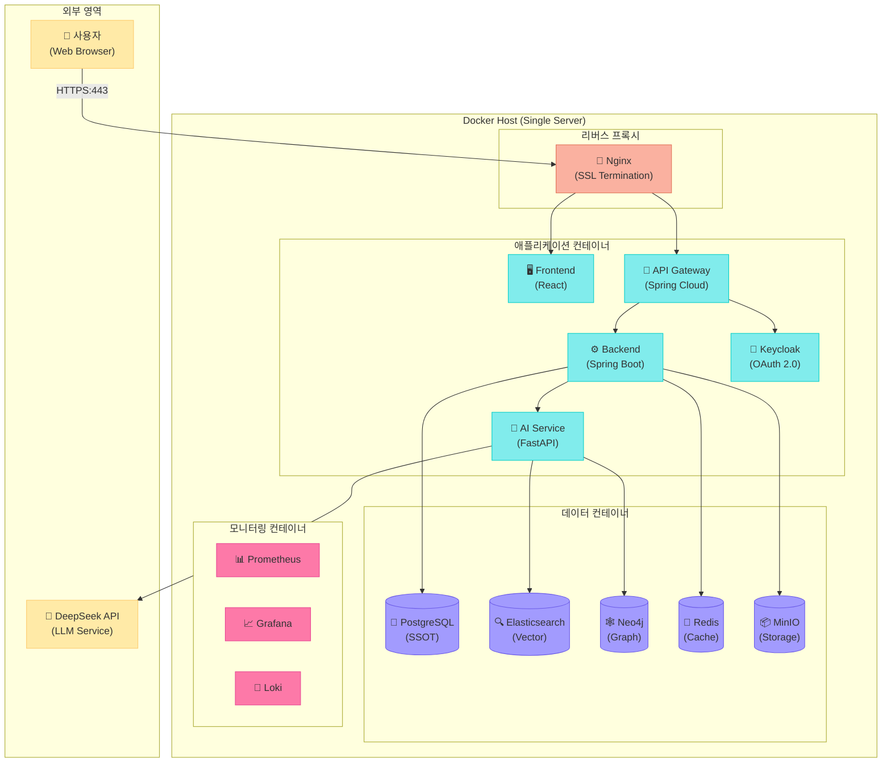
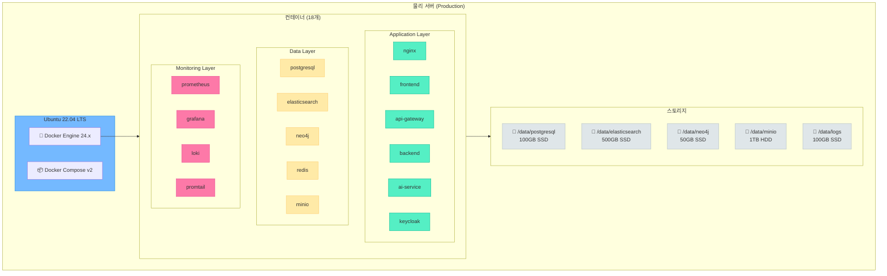
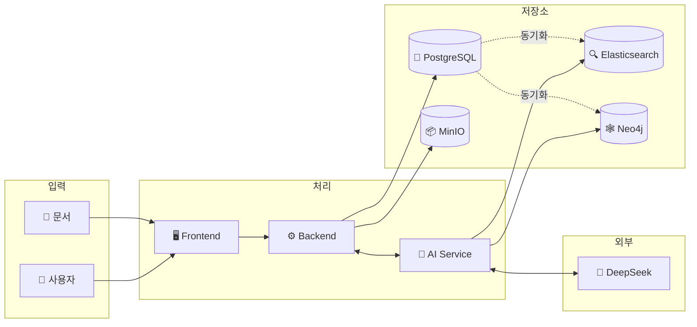
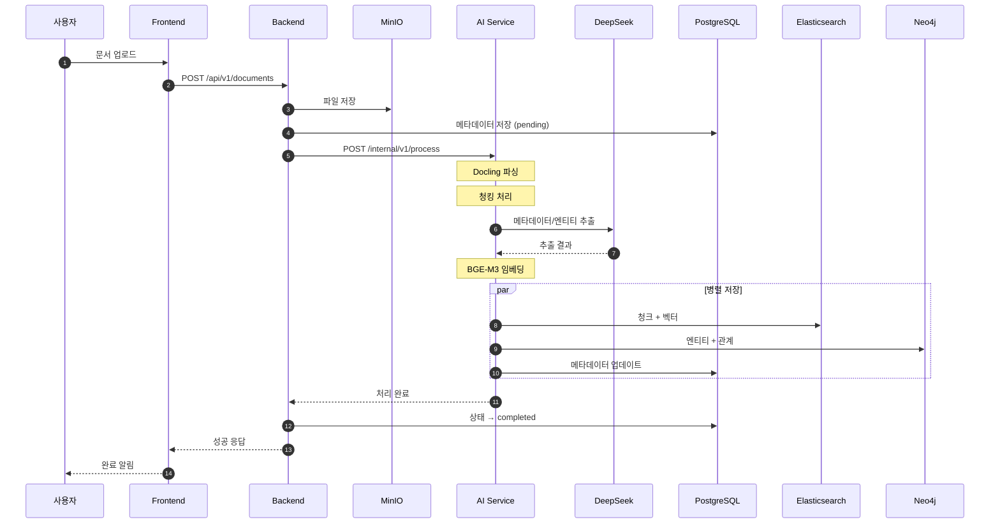
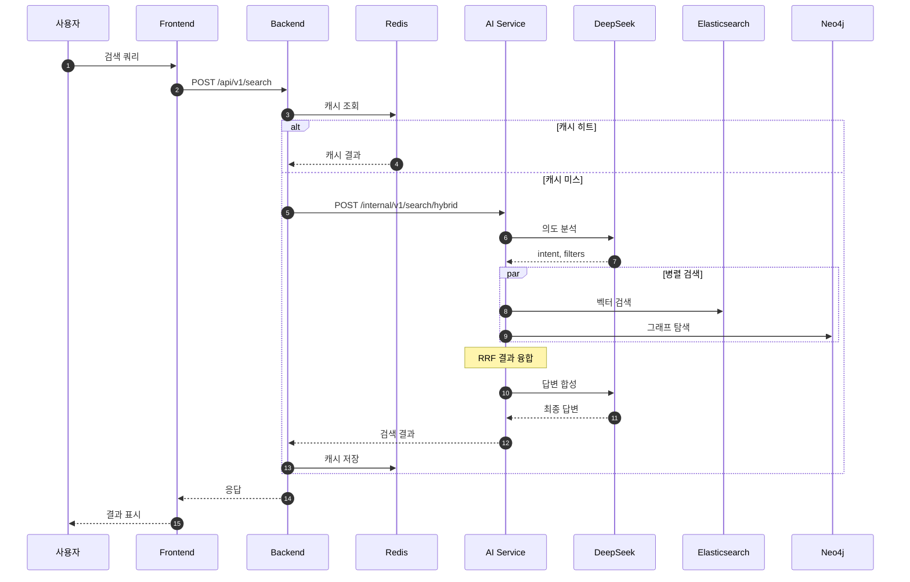
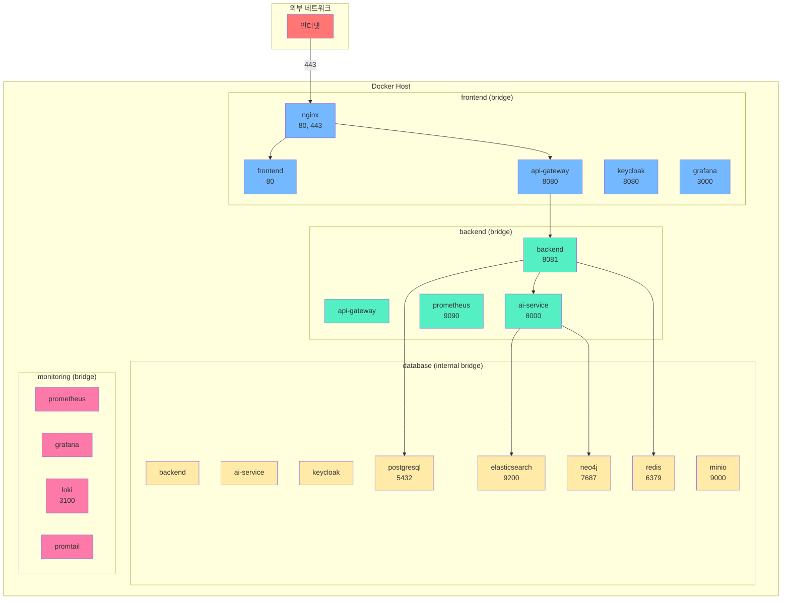

# 인프라 상세 설계서 (Docker Compose 기반)

**프로젝트**: Hybrid RAG Knowledge Operations Platform
**버전**: 2.0
**작성일**: 2026-01-16
**작성자**: Claude AI Architect
**상태**: Draft

---

## 문서 정보

| 항목 | 내용 |
|------|------|
| **문서명** | 인프라 상세 설계서 (Docker Compose 기반) |
| **버전** | 2.0 |
| **작성일** | 2026-01-16 |
| **작성자** | Claude AI Architect |
| **상태** | Draft |
| **관련 문서** | [상세 설계서](./hybrid_rag_platform_detailed_design.md), [API 통합 설계서](./api_integration_design.md), [에러 코드 표준](./error_code_standards.md), [용어사전](./glossary.md) |

---

## 변경 이력

| 버전 | 일자 | 작성자 | 변경 내용 |
|------|------|--------|----------|
| 1.0 | 2026-01-16 | Claude AI | 초안 작성 (K8s 기반) |
| 2.0 | 2026-01-16 | Claude AI | **Docker Compose 기반으로 전면 재작성** - K8s 버전은 technical_assessment 폴더에 참조용으로 보관 |

---

## 목차

1. [개요](#1-개요)
2. [시스템 아키텍처](#2-시스템-아키텍처)
3. [Docker Compose 구성](#3-docker-compose-구성)
4. [컨테이너 설계](#4-컨테이너-설계)
5. [네트워크 설계](#5-네트워크-설계)
6. [볼륨 및 스토리지](#6-볼륨-및-스토리지)
7. [데이터베이스 인프라](#7-데이터베이스-인프라)
8. [모니터링 및 로깅](#8-모니터링-및-로깅)
9. [CI/CD 파이프라인](#9-cicd-파이프라인)
10. [보안 설정](#10-보안-설정)
11. [백업 및 복구](#11-백업-및-복구)
12. [운영 가이드](#12-운영-가이드)
13. [비용 추정](#13-비용-추정)

---

## 1. 개요

### 1.1 목적

본 문서는 Hybrid RAG Knowledge Platform의 Docker Compose 기반 인프라 아키텍처를 정의합니다.

### 1.2 범위

| 항목 | 범위 |
|------|------|
| 배포 환경 | 온프레미스 (Docker Compose) |
| 대상 시스템 | Frontend, Backend, AI Service, Databases |
| 운영 환경 | Development, Staging, Production |

### 1.3 설계 원칙

| 원칙 | 설명 |
|------|------|
| **단순성** | Docker Compose를 통한 간편한 배포 및 관리 |
| **이식성** | 어떤 Docker 환경에서도 동일하게 실행 |
| **확장 가능성** | 향후 K8s로 마이그레이션 고려한 설계 |
| **비용 효율성** | 단일 서버에서 운영 가능한 구조 |
| **관측 가능성** | 중앙 집중식 로깅 및 모니터링 |

### 1.4 K8s 마이그레이션 참조

> **참고**: Kubernetes 기반 확장 설계가 필요한 경우 `technical_assessment/infrastructure_k8s_reference_design.md` 문서를 참조하세요.

---

## 2. 시스템 아키텍처

### 2.1 논리 구성도 (Logical Architecture)



### 2.2 물리 구성도 (Docker Host)



### 2.3 서버 사양

#### 2.3.1 Production 환경

| 항목 | 최소 사양 | 권장 사양 |
|------|-----------|-----------|
| **CPU** | 16 cores | 32 cores |
| **Memory** | 64 GB | 128 GB |
| **Storage (SSD)** | 500 GB | 1 TB |
| **Storage (HDD)** | 1 TB | 2 TB |
| **Network** | 1 Gbps | 10 Gbps |
| **OS** | Ubuntu 22.04 LTS | Ubuntu 22.04 LTS |

#### 2.3.2 Development/Staging 환경

| 항목 | Development | Staging |
|------|-------------|---------|
| **CPU** | 8 cores | 16 cores |
| **Memory** | 32 GB | 64 GB |
| **Storage** | 256 GB SSD | 500 GB SSD |

### 2.4 환경별 구성

| 환경 | 목적 | 리소스 | Docker Profile |
|------|------|--------|----------------|
| **Development** | 개발/테스트 | 0.25x | `--profile dev` |
| **Staging** | 통합 테스트 | 0.5x | `--profile staging` |
| **Production** | 운영 서비스 | 1.0x | `--profile prod` |

### 2.5 데이터 흐름도

#### 2.5.1 전체 데이터 흐름



#### 2.5.2 문서 업로드 흐름



#### 2.5.3 Hybrid 검색 흐름



---

## 3. Docker Compose 구성

### 3.1 프로젝트 구조

```
infrastructure/
├── docker-compose.yml           # 메인 Compose 파일
├── docker-compose.override.yml  # 개발 환경 오버라이드
├── docker-compose.prod.yml      # 운영 환경 오버라이드
├── docker-compose.monitoring.yml # 모니터링 스택
├── .env                         # 환경 변수 (gitignore)
├── .env.example                 # 환경 변수 템플릿
├── nginx/
│   ├── nginx.conf
│   ├── conf.d/
│   │   ├── default.conf
│   │   └── ssl.conf
│   └── certs/                   # SSL 인증서
├── prometheus/
│   ├── prometheus.yml
│   └── rules/
│       └── alerts.yml
├── grafana/
│   ├── provisioning/
│   │   ├── dashboards/
│   │   └── datasources/
│   └── dashboards/
├── loki/
│   └── loki-config.yml
├── promtail/
│   └── promtail-config.yml
├── keycloak/
│   └── realm-export.json
├── scripts/
│   ├── init-db.sh
│   ├── backup.sh
│   ├── restore.sh
│   └── health-check.sh
└── volumes/                     # 데이터 볼륨 (gitignore)
    ├── postgresql/
    ├── elasticsearch/
    ├── neo4j/
    ├── minio/
    └── redis/
```

### 3.2 메인 Docker Compose 파일

```yaml
# docker-compose.yml
version: '3.8'

name: knowledge-platform

# ===== 네트워크 정의 =====
networks:
  frontend:
    driver: bridge
  backend:
    driver: bridge
  database:
    driver: bridge
    internal: true
  monitoring:
    driver: bridge

# ===== 볼륨 정의 =====
volumes:
  postgresql_data:
  elasticsearch_data:
  neo4j_data:
  redis_data:
  minio_data:
  keycloak_data:
  prometheus_data:
  grafana_data:
  loki_data:

# ===== 서비스 정의 =====
services:

  # ----- Reverse Proxy -----
  nginx:
    image: nginx:1.25-alpine
    container_name: nginx
    restart: unless-stopped
    ports:
      - "80:80"
      - "443:443"
    volumes:
      - ./nginx/nginx.conf:/etc/nginx/nginx.conf:ro
      - ./nginx/conf.d:/etc/nginx/conf.d:ro
      - ./nginx/certs:/etc/nginx/certs:ro
    networks:
      - frontend
    depends_on:
      - frontend
      - api-gateway
    healthcheck:
      test: ["CMD", "nginx", "-t"]
      interval: 30s
      timeout: 10s
      retries: 3

  # ----- Frontend -----
  frontend:
    image: ${REGISTRY:-}knowledge-platform/frontend:${VERSION:-latest}
    build:
      context: ../frontend
      dockerfile: Dockerfile
    container_name: frontend
    restart: unless-stopped
    networks:
      - frontend
    environment:
      - VITE_API_URL=${API_URL:-https://api.localhost}
      - VITE_AUTH_URL=${AUTH_URL:-https://auth.localhost}
    healthcheck:
      test: ["CMD", "wget", "--quiet", "--tries=1", "--spider", "http://localhost:80/"]
      interval: 30s
      timeout: 10s
      retries: 3

  # ----- API Gateway -----
  api-gateway:
    image: ${REGISTRY:-}knowledge-platform/api-gateway:${VERSION:-latest}
    build:
      context: ../backend/api-gateway
      dockerfile: Dockerfile
    container_name: api-gateway
    restart: unless-stopped
    networks:
      - frontend
      - backend
    environment:
      - SPRING_PROFILES_ACTIVE=${SPRING_PROFILE:-prod}
      - SERVER_PORT=8080
      - BACKEND_URL=http://backend:8081
      - KEYCLOAK_URL=http://keycloak:8080
    depends_on:
      keycloak:
        condition: service_healthy
    healthcheck:
      test: ["CMD", "wget", "--quiet", "--tries=1", "--spider", "http://localhost:8080/actuator/health"]
      interval: 30s
      timeout: 10s
      retries: 3

  # ----- Backend Service -----
  backend:
    image: ${REGISTRY:-}knowledge-platform/backend:${VERSION:-latest}
    build:
      context: ../backend/knowledge-service
      dockerfile: Dockerfile
    container_name: backend
    restart: unless-stopped
    networks:
      - backend
      - database
    environment:
      - SPRING_PROFILES_ACTIVE=${SPRING_PROFILE:-prod}
      - SERVER_PORT=8081
      - DATABASE_URL=jdbc:postgresql://postgresql:5432/knowledge
      - DATABASE_USERNAME=${DB_USERNAME:-knowledge}
      - DATABASE_PASSWORD=${DB_PASSWORD}
      - REDIS_HOST=redis
      - REDIS_PORT=6379
      - AI_SERVICE_URL=http://ai-service:8000
      - MINIO_URL=http://minio:9000
      - MINIO_ACCESS_KEY=${MINIO_ACCESS_KEY}
      - MINIO_SECRET_KEY=${MINIO_SECRET_KEY}
    depends_on:
      postgresql:
        condition: service_healthy
      redis:
        condition: service_healthy
    healthcheck:
      test: ["CMD", "wget", "--quiet", "--tries=1", "--spider", "http://localhost:8081/actuator/health"]
      interval: 30s
      timeout: 10s
      retries: 3

  # ----- AI Service -----
  ai-service:
    image: ${REGISTRY:-}knowledge-platform/ai-service:${VERSION:-latest}
    build:
      context: ../knowledge_service
      dockerfile: Dockerfile
    container_name: ai-service
    restart: unless-stopped
    networks:
      - backend
      - database
    environment:
      - DEEPSEEK_API_KEY=${DEEPSEEK_API_KEY}
      - ELASTICSEARCH_URL=http://elasticsearch:9200
      - NEO4J_URI=bolt://neo4j:7687
      - NEO4J_USER=${NEO4J_USER:-neo4j}
      - NEO4J_PASSWORD=${NEO4J_PASSWORD}
      - REDIS_URL=redis://redis:6379
      - PYTHONUNBUFFERED=1
    depends_on:
      elasticsearch:
        condition: service_healthy
      neo4j:
        condition: service_healthy
    deploy:
      resources:
        limits:
          memory: 8G
        reservations:
          memory: 4G
    healthcheck:
      test: ["CMD", "curl", "-f", "http://localhost:8000/health"]
      interval: 30s
      timeout: 10s
      start_period: 120s
      retries: 3

  # ----- Keycloak (OAuth 2.0 / OIDC) -----
  keycloak:
    image: quay.io/keycloak/keycloak:23.0
    container_name: keycloak
    restart: unless-stopped
    command: start --optimized --import-realm
    networks:
      - frontend
      - database
    environment:
      - KC_DB=postgres
      - KC_DB_URL=jdbc:postgresql://postgresql:5432/keycloak
      - KC_DB_USERNAME=${DB_USERNAME:-knowledge}
      - KC_DB_PASSWORD=${DB_PASSWORD}
      - KC_HOSTNAME=${KEYCLOAK_HOSTNAME:-auth.localhost}
      - KC_PROXY=edge
      - KEYCLOAK_ADMIN=${KEYCLOAK_ADMIN:-admin}
      - KEYCLOAK_ADMIN_PASSWORD=${KEYCLOAK_ADMIN_PASSWORD}
    volumes:
      - ./keycloak/realm-export.json:/opt/keycloak/data/import/realm.json:ro
      - keycloak_data:/opt/keycloak/data
    depends_on:
      postgresql:
        condition: service_healthy
    healthcheck:
      test: ["CMD", "curl", "-f", "http://localhost:8080/health/ready"]
      interval: 30s
      timeout: 10s
      start_period: 60s
      retries: 3

  # ----- PostgreSQL -----
  postgresql:
    image: postgres:16-alpine
    container_name: postgresql
    restart: unless-stopped
    networks:
      - database
    environment:
      - POSTGRES_USER=${DB_USERNAME:-knowledge}
      - POSTGRES_PASSWORD=${DB_PASSWORD}
      - POSTGRES_DB=knowledge
      - PGDATA=/var/lib/postgresql/data/pgdata
    volumes:
      - postgresql_data:/var/lib/postgresql/data
      - ./scripts/init-db.sh:/docker-entrypoint-initdb.d/init-db.sh:ro
    deploy:
      resources:
        limits:
          memory: 4G
        reservations:
          memory: 2G
    healthcheck:
      test: ["CMD-SHELL", "pg_isready -U ${DB_USERNAME:-knowledge}"]
      interval: 10s
      timeout: 5s
      retries: 5

  # ----- Elasticsearch -----
  elasticsearch:
    image: docker.elastic.co/elasticsearch/elasticsearch:8.11.0
    container_name: elasticsearch
    restart: unless-stopped
    networks:
      - database
    environment:
      - discovery.type=single-node
      - xpack.security.enabled=false
      - xpack.security.enrollment.enabled=false
      - "ES_JAVA_OPTS=-Xms2g -Xmx2g"
      - cluster.name=knowledge-cluster
      - bootstrap.memory_lock=true
    volumes:
      - elasticsearch_data:/usr/share/elasticsearch/data
    ulimits:
      memlock:
        soft: -1
        hard: -1
      nofile:
        soft: 65536
        hard: 65536
    deploy:
      resources:
        limits:
          memory: 4G
        reservations:
          memory: 2G
    healthcheck:
      test: ["CMD-SHELL", "curl -s http://localhost:9200/_cluster/health | grep -q '\"status\":\"green\"\\|\"status\":\"yellow\"'"]
      interval: 30s
      timeout: 10s
      start_period: 60s
      retries: 5

  # ----- Neo4j -----
  neo4j:
    image: neo4j:5.15-community
    container_name: neo4j
    restart: unless-stopped
    networks:
      - database
    environment:
      - NEO4J_AUTH=${NEO4J_USER:-neo4j}/${NEO4J_PASSWORD}
      - NEO4J_PLUGINS=["apoc"]
      - NEO4J_dbms_memory_heap_initial__size=1G
      - NEO4J_dbms_memory_heap_max__size=2G
      - NEO4J_dbms_memory_pagecache_size=1G
    volumes:
      - neo4j_data:/data
    deploy:
      resources:
        limits:
          memory: 4G
        reservations:
          memory: 2G
    healthcheck:
      test: ["CMD", "wget", "--quiet", "--tries=1", "-O", "/dev/null", "http://localhost:7474"]
      interval: 30s
      timeout: 10s
      start_period: 60s
      retries: 5

  # ----- Redis -----
  redis:
    image: redis:7.2-alpine
    container_name: redis
    restart: unless-stopped
    command: redis-server --appendonly yes --maxmemory 1gb --maxmemory-policy allkeys-lru
    networks:
      - database
    volumes:
      - redis_data:/data
    deploy:
      resources:
        limits:
          memory: 1G
        reservations:
          memory: 512M
    healthcheck:
      test: ["CMD", "redis-cli", "ping"]
      interval: 10s
      timeout: 5s
      retries: 5

  # ----- MinIO (Object Storage) -----
  minio:
    image: minio/minio:RELEASE.2024-01-01T00-00-00Z
    container_name: minio
    restart: unless-stopped
    command: server /data --console-address ":9001"
    networks:
      - database
    environment:
      - MINIO_ROOT_USER=${MINIO_ACCESS_KEY}
      - MINIO_ROOT_PASSWORD=${MINIO_SECRET_KEY}
    volumes:
      - minio_data:/data
    deploy:
      resources:
        limits:
          memory: 1G
    healthcheck:
      test: ["CMD", "curl", "-f", "http://localhost:9000/minio/health/live"]
      interval: 30s
      timeout: 10s
      retries: 3
```

### 3.3 운영 환경 오버라이드

```yaml
# docker-compose.prod.yml
version: '3.8'

services:
  nginx:
    volumes:
      - /etc/letsencrypt:/etc/letsencrypt:ro

  backend:
    deploy:
      replicas: 2
      resources:
        limits:
          cpus: '2.0'
          memory: 4G

  ai-service:
    deploy:
      replicas: 2
      resources:
        limits:
          cpus: '4.0'
          memory: 16G

  elasticsearch:
    environment:
      - "ES_JAVA_OPTS=-Xms4g -Xmx4g"
    deploy:
      resources:
        limits:
          memory: 8G

  postgresql:
    deploy:
      resources:
        limits:
          memory: 8G
```

### 3.4 모니터링 스택

```yaml
# docker-compose.monitoring.yml
version: '3.8'

services:
  prometheus:
    image: prom/prometheus:v2.48.0
    container_name: prometheus
    restart: unless-stopped
    networks:
      - monitoring
      - backend
    volumes:
      - ./prometheus/prometheus.yml:/etc/prometheus/prometheus.yml:ro
      - ./prometheus/rules:/etc/prometheus/rules:ro
      - prometheus_data:/prometheus
    command:
      - '--config.file=/etc/prometheus/prometheus.yml'
      - '--storage.tsdb.path=/prometheus'
      - '--storage.tsdb.retention.time=30d'
      - '--web.enable-lifecycle'
    healthcheck:
      test: ["CMD", "wget", "--quiet", "--tries=1", "-O", "/dev/null", "http://localhost:9090/-/healthy"]
      interval: 30s
      timeout: 10s
      retries: 3

  grafana:
    image: grafana/grafana:10.2.0
    container_name: grafana
    restart: unless-stopped
    networks:
      - monitoring
      - frontend
    environment:
      - GF_SECURITY_ADMIN_USER=${GRAFANA_ADMIN_USER:-admin}
      - GF_SECURITY_ADMIN_PASSWORD=${GRAFANA_ADMIN_PASSWORD}
      - GF_USERS_ALLOW_SIGN_UP=false
      - GF_SERVER_ROOT_URL=${GRAFANA_URL:-http://localhost:3000}
    volumes:
      - ./grafana/provisioning:/etc/grafana/provisioning:ro
      - ./grafana/dashboards:/var/lib/grafana/dashboards:ro
      - grafana_data:/var/lib/grafana
    depends_on:
      - prometheus
      - loki
    healthcheck:
      test: ["CMD", "wget", "--quiet", "--tries=1", "-O", "/dev/null", "http://localhost:3000/api/health"]
      interval: 30s
      timeout: 10s
      retries: 3

  loki:
    image: grafana/loki:2.9.0
    container_name: loki
    restart: unless-stopped
    networks:
      - monitoring
    volumes:
      - ./loki/loki-config.yml:/etc/loki/loki-config.yml:ro
      - loki_data:/loki
    command: -config.file=/etc/loki/loki-config.yml
    healthcheck:
      test: ["CMD", "wget", "--quiet", "--tries=1", "-O", "/dev/null", "http://localhost:3100/ready"]
      interval: 30s
      timeout: 10s
      retries: 3

  promtail:
    image: grafana/promtail:2.9.0
    container_name: promtail
    restart: unless-stopped
    networks:
      - monitoring
    volumes:
      - ./promtail/promtail-config.yml:/etc/promtail/promtail-config.yml:ro
      - /var/log:/var/log:ro
      - /var/lib/docker/containers:/var/lib/docker/containers:ro
    command: -config.file=/etc/promtail/promtail-config.yml
    depends_on:
      - loki

  alertmanager:
    image: prom/alertmanager:v0.26.0
    container_name: alertmanager
    restart: unless-stopped
    networks:
      - monitoring
    volumes:
      - ./alertmanager/alertmanager.yml:/etc/alertmanager/alertmanager.yml:ro
    command:
      - '--config.file=/etc/alertmanager/alertmanager.yml'

networks:
  monitoring:
    external: true
    name: knowledge-platform_monitoring
  backend:
    external: true
    name: knowledge-platform_backend
  frontend:
    external: true
    name: knowledge-platform_frontend

volumes:
  prometheus_data:
    external: true
    name: knowledge-platform_prometheus_data
  grafana_data:
    external: true
    name: knowledge-platform_grafana_data
  loki_data:
    external: true
    name: knowledge-platform_loki_data
```

### 3.5 환경 변수 템플릿

```bash
# .env.example

# ===== 일반 설정 =====
COMPOSE_PROJECT_NAME=knowledge-platform
VERSION=latest
REGISTRY=harbor.company.local/

# ===== 도메인 설정 =====
DOMAIN=knowledge.company.com
API_URL=https://api.knowledge.company.com
AUTH_URL=https://auth.knowledge.company.com

# ===== Spring 설정 =====
SPRING_PROFILE=prod

# ===== 데이터베이스 =====
DB_USERNAME=knowledge
DB_PASSWORD=CHANGE_ME_STRONG_PASSWORD

# ===== Neo4j =====
NEO4J_USER=neo4j
NEO4J_PASSWORD=CHANGE_ME_STRONG_PASSWORD

# ===== Redis =====
REDIS_PASSWORD=CHANGE_ME_STRONG_PASSWORD

# ===== MinIO =====
MINIO_ACCESS_KEY=admin
MINIO_SECRET_KEY=CHANGE_ME_STRONG_PASSWORD

# ===== Keycloak =====
KEYCLOAK_HOSTNAME=auth.knowledge.company.com
KEYCLOAK_ADMIN=admin
KEYCLOAK_ADMIN_PASSWORD=CHANGE_ME_STRONG_PASSWORD

# ===== DeepSeek API =====
DEEPSEEK_API_KEY=sk-xxxxx

# ===== Grafana =====
GRAFANA_ADMIN_USER=admin
GRAFANA_ADMIN_PASSWORD=CHANGE_ME_STRONG_PASSWORD
GRAFANA_URL=https://grafana.knowledge.company.com
```

---

## 4. 컨테이너 설계

### 4.1 Docker 이미지

#### 4.1.1 Frontend (React)

```dockerfile
# Dockerfile.frontend
FROM node:20-alpine AS builder
WORKDIR /app

COPY package*.json ./
RUN npm ci --only=production

COPY . .
RUN npm run build

FROM nginx:1.25-alpine
COPY --from=builder /app/dist /usr/share/nginx/html
COPY nginx.conf /etc/nginx/nginx.conf

EXPOSE 80
CMD ["nginx", "-g", "daemon off;"]
```

#### 4.1.2 Backend (Spring Boot)

```dockerfile
# Dockerfile.backend
FROM eclipse-temurin:21-jre-alpine

RUN addgroup -S app && adduser -S app -G app
USER app

WORKDIR /app

COPY --chown=app:app target/*.jar app.jar

ENV JAVA_OPTS="-XX:+UseContainerSupport \
               -XX:MaxRAMPercentage=75.0 \
               -XX:+UseG1GC \
               -Djava.security.egd=file:/dev/./urandom"

EXPOSE 8081 8082

HEALTHCHECK --interval=30s --timeout=10s --start-period=60s --retries=3 \
    CMD wget --quiet --tries=1 --spider http://localhost:8081/actuator/health || exit 1

ENTRYPOINT ["sh", "-c", "java $JAVA_OPTS -jar app.jar"]
```

#### 4.1.3 AI Service (FastAPI)

```dockerfile
# Dockerfile.ai-service
FROM python:3.11-slim AS base

RUN apt-get update && apt-get install -y --no-install-recommends \
    build-essential curl && rm -rf /var/lib/apt/lists/*

ENV VIRTUAL_ENV=/opt/venv
RUN python -m venv $VIRTUAL_ENV
ENV PATH="$VIRTUAL_ENV/bin:$PATH"

COPY requirements.txt .
RUN pip install --no-cache-dir -r requirements.txt

FROM python:3.11-slim

RUN useradd -m -u 1000 app
USER app

WORKDIR /app

COPY --from=base /opt/venv /opt/venv
ENV PATH="/opt/venv/bin:$PATH"

COPY --chown=app:app src/ ./src/

EXPOSE 8000

HEALTHCHECK --interval=30s --timeout=10s --start-period=120s --retries=3 \
    CMD curl -f http://localhost:8000/health || exit 1

CMD ["uvicorn", "src.app.main:app", "--host", "0.0.0.0", "--port", "8000", "--workers", "2"]
```

### 4.2 컨테이너 리소스 할당

| 컨테이너 | CPU (cores) | Memory | 비고 |
|----------|-------------|--------|------|
| nginx | 0.5 | 256 MB | 리버스 프록시 |
| frontend | 0.5 | 256 MB | 정적 파일 서빙 |
| api-gateway | 1.0 | 1 GB | 인증/라우팅 |
| backend | 2.0 | 2 GB | 비즈니스 로직 |
| ai-service | 4.0 | 8 GB | 임베딩/LLM |
| keycloak | 1.0 | 1 GB | OAuth 서버 |
| postgresql | 2.0 | 4 GB | 메인 DB |
| elasticsearch | 2.0 | 4 GB | 벡터 검색 |
| neo4j | 2.0 | 4 GB | 그래프 DB |
| redis | 0.5 | 1 GB | 캐시 |
| minio | 0.5 | 1 GB | 파일 스토리지 |
| prometheus | 0.5 | 512 MB | 메트릭 수집 |
| grafana | 0.5 | 512 MB | 대시보드 |
| loki | 0.5 | 512 MB | 로그 수집 |
| **합계** | **17.5** | **28.5 GB** | |

---

## 5. 네트워크 설계

### 5.1 Docker 네트워크 구성



### 5.2 네트워크 정책

| 네트워크 | 용도 | 외부 접근 | 연결 서비스 |
|----------|------|-----------|-------------|
| **frontend** | 웹 트래픽 | 허용 (80, 443) | nginx, frontend, api-gateway, keycloak |
| **backend** | 내부 API | 불허 | api-gateway, backend, ai-service |
| **database** | 데이터 저장 | 불허 (internal) | 모든 DB |
| **monitoring** | 모니터링 | 불허 | prometheus, grafana, loki |

### 5.3 포트 매핑

| 서비스 | 컨테이너 포트 | 호스트 포트 | 프로토콜 |
|--------|---------------|-------------|----------|
| nginx | 80 | 80 | HTTP |
| nginx | 443 | 443 | HTTPS |
| postgresql | 5432 | - | TCP |
| elasticsearch | 9200 | - | HTTP |
| neo4j | 7474, 7687 | - | HTTP/Bolt |
| redis | 6379 | - | TCP |
| minio | 9000, 9001 | - | HTTP |
| grafana | 3000 | 3000 (옵션) | HTTP |

---

## 6. 볼륨 및 스토리지

### 6.1 볼륨 구성

```yaml
volumes:
  postgresql_data:
    driver: local
    driver_opts:
      type: none
      o: bind
      device: /data/postgresql

  elasticsearch_data:
    driver: local
    driver_opts:
      type: none
      o: bind
      device: /data/elasticsearch

  neo4j_data:
    driver: local
    driver_opts:
      type: none
      o: bind
      device: /data/neo4j

  minio_data:
    driver: local
    driver_opts:
      type: none
      o: bind
      device: /data/minio

  redis_data:
    driver: local
    driver_opts:
      type: none
      o: bind
      device: /data/redis
```

### 6.2 스토리지 용량 계획

| 볼륨 | 초기 용량 | 1년 후 예상 | 스토리지 타입 |
|------|-----------|-------------|---------------|
| postgresql_data | 50 GB | 200 GB | SSD |
| elasticsearch_data | 200 GB | 1 TB | SSD |
| neo4j_data | 20 GB | 100 GB | SSD |
| minio_data | 500 GB | 2 TB | HDD |
| redis_data | 5 GB | 10 GB | SSD |
| 로그 (/var/log) | 50 GB | 100 GB | SSD |

### 6.3 디렉토리 초기화

```bash
#!/bin/bash
# scripts/init-volumes.sh

DATA_DIR="/data"

# 디렉토리 생성
sudo mkdir -p ${DATA_DIR}/{postgresql,elasticsearch,neo4j,minio,redis}

# 권한 설정
sudo chown -R 999:999 ${DATA_DIR}/postgresql    # postgres user
sudo chown -R 1000:1000 ${DATA_DIR}/elasticsearch  # elasticsearch user
sudo chown -R 7474:7474 ${DATA_DIR}/neo4j       # neo4j user
sudo chown -R 1000:1000 ${DATA_DIR}/minio       # minio user
sudo chown -R 999:999 ${DATA_DIR}/redis         # redis user

# 퍼미션 설정
sudo chmod 750 ${DATA_DIR}/*

echo "볼륨 디렉토리 초기화 완료"
```

---

## 7. 데이터베이스 인프라

### 7.1 PostgreSQL 설정

```sql
-- scripts/init-db.sh에서 실행

-- 데이터베이스 생성
CREATE DATABASE knowledge;
CREATE DATABASE keycloak;

-- 사용자 생성
CREATE USER knowledge_app WITH PASSWORD '${DB_PASSWORD}';
GRANT ALL PRIVILEGES ON DATABASE knowledge TO knowledge_app;

-- 확장 설치
\c knowledge
CREATE EXTENSION IF NOT EXISTS "uuid-ossp";
CREATE EXTENSION IF NOT EXISTS "pg_trgm";

-- 연결 수 설정
ALTER SYSTEM SET max_connections = 200;
ALTER SYSTEM SET shared_buffers = '2GB';
ALTER SYSTEM SET work_mem = '256MB';
ALTER SYSTEM SET maintenance_work_mem = '512MB';
```

### 7.2 Elasticsearch 인덱스 설정

```json
// 인덱스 템플릿
PUT _index_template/knowledge-chunks
{
  "index_patterns": ["knowledge-chunks-*"],
  "template": {
    "settings": {
      "number_of_shards": 1,
      "number_of_replicas": 0,
      "analysis": {
        "analyzer": {
          "korean": {
            "type": "custom",
            "tokenizer": "nori_tokenizer"
          }
        }
      }
    },
    "mappings": {
      "properties": {
        "document_id": {"type": "keyword"},
        "chunk_index": {"type": "integer"},
        "text": {"type": "text", "analyzer": "korean"},
        "dense_vector": {
          "type": "dense_vector",
          "dims": 1024,
          "index": true,
          "similarity": "cosine"
        },
        "metadata": {"type": "object"}
      }
    }
  }
}
```

### 7.3 Neo4j 초기 설정

```cypher
// 제약조건 생성
CREATE CONSTRAINT document_id IF NOT EXISTS
FOR (d:Document) REQUIRE d.id IS UNIQUE;

CREATE CONSTRAINT entity_name_type IF NOT EXISTS
FOR (e:Entity) REQUIRE (e.name, e.type) IS UNIQUE;

// 인덱스 생성
CREATE INDEX entity_name IF NOT EXISTS
FOR (e:Entity) ON (e.name);

CREATE INDEX document_type IF NOT EXISTS
FOR (d:Document) ON (d.document_type);
```

---

## 8. 모니터링 및 로깅

### 8.1 Prometheus 설정

```yaml
# prometheus/prometheus.yml
global:
  scrape_interval: 15s
  evaluation_interval: 15s

alerting:
  alertmanagers:
    - static_configs:
        - targets:
          - alertmanager:9093

rule_files:
  - /etc/prometheus/rules/*.yml

scrape_configs:
  # Backend (Spring Boot Actuator)
  - job_name: 'backend'
    metrics_path: '/actuator/prometheus'
    static_configs:
      - targets: ['backend:8082']

  # AI Service
  - job_name: 'ai-service'
    static_configs:
      - targets: ['ai-service:8000']

  # PostgreSQL Exporter
  - job_name: 'postgresql'
    static_configs:
      - targets: ['postgresql-exporter:9187']

  # Elasticsearch Exporter
  - job_name: 'elasticsearch'
    static_configs:
      - targets: ['elasticsearch-exporter:9114']

  # Redis Exporter
  - job_name: 'redis'
    static_configs:
      - targets: ['redis-exporter:9121']

  # Neo4j
  - job_name: 'neo4j'
    static_configs:
      - targets: ['neo4j:2004']

  # Node Exporter
  - job_name: 'node'
    static_configs:
      - targets: ['node-exporter:9100']

  # cAdvisor (Container metrics)
  - job_name: 'cadvisor'
    static_configs:
      - targets: ['cadvisor:8080']
```

### 8.2 알림 규칙

```yaml
# prometheus/rules/alerts.yml
groups:
  - name: knowledge-platform
    rules:
      # 컨테이너 다운
      - alert: ContainerDown
        expr: absent(container_last_seen{name=~"backend|ai-service|postgresql|elasticsearch"})
        for: 1m
        labels:
          severity: critical
        annotations:
          summary: "Container {{ $labels.name }} is down"

      # 높은 CPU 사용률
      - alert: HighCpuUsage
        expr: (rate(container_cpu_usage_seconds_total[5m]) * 100) > 80
        for: 5m
        labels:
          severity: warning
        annotations:
          summary: "High CPU usage on {{ $labels.name }}"

      # 메모리 부족
      - alert: HighMemoryUsage
        expr: (container_memory_usage_bytes / container_spec_memory_limit_bytes * 100) > 85
        for: 5m
        labels:
          severity: warning
        annotations:
          summary: "High memory usage on {{ $labels.name }}"

      # 디스크 용량
      - alert: DiskSpaceLow
        expr: (node_filesystem_avail_bytes / node_filesystem_size_bytes * 100) < 15
        for: 5m
        labels:
          severity: warning
        annotations:
          summary: "Disk space low on {{ $labels.mountpoint }}"

      # API 응답 시간
      - alert: HighApiLatency
        expr: histogram_quantile(0.95, rate(http_server_requests_seconds_bucket[5m])) > 2
        for: 5m
        labels:
          severity: warning
        annotations:
          summary: "API P95 latency > 2s"

      # 에러율
      - alert: HighErrorRate
        expr: sum(rate(http_server_requests_seconds_count{status=~"5.."}[5m])) / sum(rate(http_server_requests_seconds_count[5m])) > 0.05
        for: 5m
        labels:
          severity: critical
        annotations:
          summary: "Error rate > 5%"
```

### 8.3 Loki 설정

```yaml
# loki/loki-config.yml
auth_enabled: false

server:
  http_listen_port: 3100

ingester:
  lifecycler:
    ring:
      kvstore:
        store: inmemory
      replication_factor: 1
  chunk_idle_period: 5m
  chunk_retain_period: 30s

schema_config:
  configs:
    - from: 2024-01-01
      store: boltdb-shipper
      object_store: filesystem
      schema: v11
      index:
        prefix: index_
        period: 24h

storage_config:
  boltdb_shipper:
    active_index_directory: /loki/index
    cache_location: /loki/cache
    shared_store: filesystem
  filesystem:
    directory: /loki/chunks

limits_config:
  enforce_metric_name: false
  reject_old_samples: true
  reject_old_samples_max_age: 168h

chunk_store_config:
  max_look_back_period: 0s

table_manager:
  retention_deletes_enabled: true
  retention_period: 720h
```

### 8.4 Promtail 설정

```yaml
# promtail/promtail-config.yml
server:
  http_listen_port: 9080

positions:
  filename: /tmp/positions.yaml

clients:
  - url: http://loki:3100/loki/api/v1/push

scrape_configs:
  - job_name: containers
    static_configs:
      - targets:
          - localhost
        labels:
          job: containerlogs
          __path__: /var/lib/docker/containers/*/*log

    pipeline_stages:
      - json:
          expressions:
            output: log
            stream: stream
            time: time
            tag: attrs.tag

      - regex:
          expression: "^/var/lib/docker/containers/(?P<container_id>[^/]+)/.*$"
          source: filename

      - labels:
          stream:
          container_id:

      - output:
          source: output
```

### 8.5 Grafana 대시보드

```json
{
  "dashboard": {
    "title": "Knowledge Platform - Docker Compose",
    "panels": [
      {
        "title": "Container Status",
        "type": "stat",
        "targets": [
          {
            "expr": "count(container_last_seen{name=~\"backend|ai-service|postgresql|elasticsearch|neo4j|redis\"})"
          }
        ]
      },
      {
        "title": "API Requests/sec",
        "type": "graph",
        "targets": [
          {
            "expr": "sum(rate(http_server_requests_seconds_count[1m])) by (uri)"
          }
        ]
      },
      {
        "title": "Response Time P95",
        "type": "gauge",
        "targets": [
          {
            "expr": "histogram_quantile(0.95, rate(http_server_requests_seconds_bucket[5m]))"
          }
        ]
      },
      {
        "title": "Memory Usage",
        "type": "graph",
        "targets": [
          {
            "expr": "container_memory_usage_bytes{name=~\"backend|ai-service|postgresql|elasticsearch\"} / 1024 / 1024"
          }
        ]
      },
      {
        "title": "CPU Usage",
        "type": "graph",
        "targets": [
          {
            "expr": "rate(container_cpu_usage_seconds_total[5m]) * 100"
          }
        ]
      },
      {
        "title": "Disk Usage",
        "type": "gauge",
        "targets": [
          {
            "expr": "(1 - node_filesystem_avail_bytes/node_filesystem_size_bytes) * 100"
          }
        ]
      }
    ]
  }
}
```

---

## 9. CI/CD 파이프라인

### 9.1 GitLab CI/CD

```yaml
# .gitlab-ci.yml
stages:
  - build
  - test
  - security
  - deploy

variables:
  DOCKER_REGISTRY: harbor.company.local
  PROJECT: knowledge-platform

# ===== Build Stage =====
build-images:
  stage: build
  image: docker:24
  services:
    - docker:24-dind
  script:
    - docker compose -f docker-compose.yml build
    - docker compose -f docker-compose.yml push
  only:
    - main
    - develop

# ===== Test Stage =====
test-integration:
  stage: test
  image: docker:24
  services:
    - docker:24-dind
  script:
    - docker compose -f docker-compose.yml -f docker-compose.test.yml up -d
    - docker compose exec -T backend ./gradlew test
    - docker compose exec -T ai-service pytest
    - docker compose down
  artifacts:
    reports:
      junit: "**/test-results/*.xml"

# ===== Security Stage =====
security-scan:
  stage: security
  image: aquasec/trivy:latest
  script:
    - trivy image --severity HIGH,CRITICAL ${DOCKER_REGISTRY}/${PROJECT}/backend:latest
    - trivy image --severity HIGH,CRITICAL ${DOCKER_REGISTRY}/${PROJECT}/ai-service:latest

# ===== Deploy Stage =====
deploy-staging:
  stage: deploy
  image: alpine:latest
  before_script:
    - apk add --no-cache openssh-client
    - eval $(ssh-agent -s)
    - echo "$SSH_PRIVATE_KEY" | ssh-add -
  script:
    - ssh -o StrictHostKeyChecking=no deploy@staging.company.local "
        cd /opt/knowledge-platform &&
        git pull origin develop &&
        docker compose pull &&
        docker compose up -d --remove-orphans
      "
  environment:
    name: staging
  only:
    - develop

deploy-production:
  stage: deploy
  image: alpine:latest
  before_script:
    - apk add --no-cache openssh-client
    - eval $(ssh-agent -s)
    - echo "$SSH_PRIVATE_KEY" | ssh-add -
  script:
    - ssh -o StrictHostKeyChecking=no deploy@prod.company.local "
        cd /opt/knowledge-platform &&
        git pull origin main &&
        docker compose -f docker-compose.yml -f docker-compose.prod.yml pull &&
        docker compose -f docker-compose.yml -f docker-compose.prod.yml up -d --remove-orphans
      "
  environment:
    name: production
  only:
    - main
  when: manual
```

### 9.2 배포 스크립트

```bash
#!/bin/bash
# scripts/deploy.sh

set -e

ENV=${1:-staging}
VERSION=${2:-latest}

echo "=== Deploying to ${ENV} environment ==="

# 환경별 compose 파일 설정
if [ "$ENV" = "production" ]; then
    COMPOSE_FILES="-f docker-compose.yml -f docker-compose.prod.yml -f docker-compose.monitoring.yml"
else
    COMPOSE_FILES="-f docker-compose.yml -f docker-compose.monitoring.yml"
fi

# 이미지 풀
echo "Pulling images..."
docker compose ${COMPOSE_FILES} pull

# 롤링 업데이트
echo "Starting rolling update..."
docker compose ${COMPOSE_FILES} up -d --remove-orphans --scale backend=2

# 헬스체크 대기
echo "Waiting for health checks..."
sleep 30

# 이전 컨테이너 정리
docker compose ${COMPOSE_FILES} up -d --remove-orphans

# 미사용 이미지 정리
echo "Cleaning up..."
docker image prune -f

echo "=== Deployment complete ==="
```

---

## 10. 보안 설정

### 10.1 Nginx SSL 설정

```nginx
# nginx/conf.d/ssl.conf
server {
    listen 443 ssl http2;
    server_name knowledge.company.com;

    # SSL 인증서
    ssl_certificate /etc/nginx/certs/fullchain.pem;
    ssl_certificate_key /etc/nginx/certs/privkey.pem;

    # SSL 설정
    ssl_protocols TLSv1.2 TLSv1.3;
    ssl_ciphers ECDHE-ECDSA-AES128-GCM-SHA256:ECDHE-RSA-AES128-GCM-SHA256;
    ssl_prefer_server_ciphers on;
    ssl_session_cache shared:SSL:10m;
    ssl_session_timeout 1d;

    # HSTS
    add_header Strict-Transport-Security "max-age=31536000; includeSubDomains" always;

    # 보안 헤더
    add_header X-Frame-Options "SAMEORIGIN" always;
    add_header X-Content-Type-Options "nosniff" always;
    add_header X-XSS-Protection "1; mode=block" always;
    add_header Content-Security-Policy "default-src 'self'; script-src 'self' 'unsafe-inline'; style-src 'self' 'unsafe-inline';" always;

    # Frontend
    location / {
        proxy_pass http://frontend:80;
        proxy_set_header Host $host;
        proxy_set_header X-Real-IP $remote_addr;
        proxy_set_header X-Forwarded-For $proxy_add_x_forwarded_for;
        proxy_set_header X-Forwarded-Proto $scheme;
    }

    # API
    location /api/ {
        proxy_pass http://api-gateway:8080/;
        proxy_http_version 1.1;
        proxy_set_header Upgrade $http_upgrade;
        proxy_set_header Connection 'upgrade';
        proxy_set_header Host $host;
        proxy_set_header X-Real-IP $remote_addr;
        proxy_read_timeout 300;
        proxy_send_timeout 300;

        # Rate Limiting
        limit_req zone=api burst=20 nodelay;
    }
}

# HTTP → HTTPS 리다이렉트
server {
    listen 80;
    server_name knowledge.company.com;
    return 301 https://$server_name$request_uri;
}

# Rate Limit 설정
limit_req_zone $binary_remote_addr zone=api:10m rate=10r/s;
```

### 10.2 Docker 보안 설정

```yaml
# docker-compose.yml 보안 설정 예시
services:
  backend:
    security_opt:
      - no-new-privileges:true
    read_only: true
    tmpfs:
      - /tmp
    cap_drop:
      - ALL
    cap_add:
      - NET_BIND_SERVICE
```

### 10.3 환경 변수 관리

```bash
# 시크릿 관리 (Docker Secrets 대안)
# 1. .env 파일은 절대 git에 커밋하지 않음
# 2. 운영 환경에서는 환경 변수 직접 설정

# 예: systemd service 파일
# /etc/systemd/system/knowledge-platform.service
[Service]
EnvironmentFile=/etc/knowledge-platform/secrets.env
ExecStart=/usr/bin/docker compose up -d
```

---

## 11. 백업 및 복구

### 11.1 백업 스크립트

```bash
#!/bin/bash
# scripts/backup.sh

BACKUP_DIR="/backup/knowledge-platform"
DATE=$(date +%Y%m%d_%H%M%S)
RETENTION_DAYS=30

echo "=== Starting backup at ${DATE} ==="

# PostgreSQL 백업
echo "Backing up PostgreSQL..."
docker exec postgresql pg_dumpall -U knowledge > ${BACKUP_DIR}/postgresql_${DATE}.sql
gzip ${BACKUP_DIR}/postgresql_${DATE}.sql

# Elasticsearch 스냅샷
echo "Creating Elasticsearch snapshot..."
curl -X PUT "localhost:9200/_snapshot/backup/snapshot_${DATE}?wait_for_completion=true"

# Neo4j 백업
echo "Backing up Neo4j..."
docker exec neo4j neo4j-admin database dump neo4j --to-path=/backup
docker cp neo4j:/backup/neo4j.dump ${BACKUP_DIR}/neo4j_${DATE}.dump

# MinIO 백업 (선택적)
echo "Backing up MinIO..."
docker run --rm \
  -v minio_data:/data:ro \
  -v ${BACKUP_DIR}:/backup \
  alpine tar czf /backup/minio_${DATE}.tar.gz /data

# 오래된 백업 삭제
echo "Cleaning old backups..."
find ${BACKUP_DIR} -type f -mtime +${RETENTION_DAYS} -delete

echo "=== Backup complete ==="
```

### 11.2 복구 스크립트

```bash
#!/bin/bash
# scripts/restore.sh

BACKUP_DIR="/backup/knowledge-platform"
DATE=$1

if [ -z "$DATE" ]; then
    echo "Usage: $0 <backup_date>"
    echo "Example: $0 20260116_020000"
    exit 1
fi

echo "=== Starting restore from ${DATE} ==="

# 서비스 중지
docker compose stop backend ai-service

# PostgreSQL 복구
echo "Restoring PostgreSQL..."
gunzip -c ${BACKUP_DIR}/postgresql_${DATE}.sql.gz | docker exec -i postgresql psql -U knowledge

# Elasticsearch 복구
echo "Restoring Elasticsearch..."
curl -X POST "localhost:9200/_snapshot/backup/snapshot_${DATE}/_restore"

# Neo4j 복구
echo "Restoring Neo4j..."
docker cp ${BACKUP_DIR}/neo4j_${DATE}.dump neo4j:/backup/neo4j.dump
docker exec neo4j neo4j-admin database load neo4j --from-path=/backup --overwrite-destination=true

# 서비스 재시작
docker compose start

echo "=== Restore complete ==="
```

### 11.3 백업 스케줄 (Cron)

```bash
# /etc/cron.d/knowledge-platform-backup

# 일일 백업 (새벽 2시)
0 2 * * * root /opt/knowledge-platform/scripts/backup.sh >> /var/log/knowledge-backup.log 2>&1

# 주간 전체 백업 (일요일 새벽 3시)
0 3 * * 0 root /opt/knowledge-platform/scripts/backup-full.sh >> /var/log/knowledge-backup.log 2>&1
```

---

## 12. 운영 가이드

### 12.1 시작/중지 명령어

```bash
# 전체 서비스 시작
docker compose up -d

# 전체 서비스 중지
docker compose down

# 특정 서비스만 재시작
docker compose restart backend

# 로그 확인
docker compose logs -f backend

# 서비스 상태 확인
docker compose ps

# 운영 환경 시작
docker compose -f docker-compose.yml -f docker-compose.prod.yml up -d

# 모니터링 포함 시작
docker compose -f docker-compose.yml -f docker-compose.monitoring.yml up -d
```

### 12.2 헬스체크

```bash
#!/bin/bash
# scripts/health-check.sh

echo "=== Health Check ==="

# 컨테이너 상태
echo -e "\n[Container Status]"
docker compose ps --format "table {{.Name}}\t{{.Status}}\t{{.Health}}"

# API 헬스체크
echo -e "\n[API Health]"
curl -s http://localhost:8081/actuator/health | jq .

# AI Service 헬스체크
echo -e "\n[AI Service Health]"
curl -s http://localhost:8000/health | jq .

# 데이터베이스 상태
echo -e "\n[Database Status]"
docker exec postgresql pg_isready && echo "PostgreSQL: OK"
curl -s http://localhost:9200/_cluster/health | jq .status
docker exec redis redis-cli ping && echo "Redis: OK"
```

### 12.3 로그 관리

```bash
# 특정 서비스 로그
docker compose logs -f backend --tail=100

# 에러 로그만 필터링
docker compose logs backend 2>&1 | grep -i error

# 로그 로테이션 설정 (/etc/docker/daemon.json)
{
  "log-driver": "json-file",
  "log-opts": {
    "max-size": "100m",
    "max-file": "5"
  }
}
```

### 12.4 스케일링 (수동)

```bash
# Backend 인스턴스 증가 (로드 밸런싱 필요)
docker compose up -d --scale backend=3

# 주의: Nginx upstream 설정 필요
```

### 12.5 문제 해결

| 문제 | 진단 명령어 | 해결 방법 |
|------|-------------|-----------|
| 컨테이너 시작 실패 | `docker compose logs <service>` | 로그 확인 후 설정 수정 |
| 메모리 부족 | `docker stats` | 리소스 제한 조정 |
| 디스크 부족 | `df -h`, `docker system df` | 미사용 이미지/볼륨 정리 |
| 네트워크 오류 | `docker network inspect` | 네트워크 재생성 |
| DB 연결 실패 | `docker exec -it postgresql psql` | 연결 설정 확인 |

---

## 13. 비용 추정

### 13.1 하드웨어 비용 (온프레미스)

| 구성 | 사양 | 예상 비용 |
|------|------|-----------|
| 서버 (Production) | 32 cores, 128GB RAM, 2TB SSD | ~$8,000 |
| 서버 (Staging) | 16 cores, 64GB RAM, 500GB SSD | ~$4,000 |
| 네트워크 장비 | 스위치, 방화벽 | ~$2,000 |
| **초기 비용** | | **~$14,000** |

### 13.2 소프트웨어 라이선스

| 소프트웨어 | 라이선스 | 연간 비용 |
|------------|----------|-----------|
| Docker Engine | 무료 (CE) | $0 |
| PostgreSQL | 오픈소스 | $0 |
| Elasticsearch | Basic (무료) | $0 |
| Neo4j | Community | $0 |
| Redis | 오픈소스 | $0 |
| **합계** | | **$0** |

### 13.3 외부 서비스 비용 (월간)

| 서비스 | 예상 사용량 | 월 비용 |
|--------|-------------|---------|
| DeepSeek API | 10M tokens | ~$140 |
| SSL 인증서 (Let's Encrypt) | - | $0 |
| 도메인 | - | ~$10 |
| **합계** | | **~$150/월** |

### 13.4 K8s vs Docker Compose 비용 비교

| 항목 | Kubernetes | Docker Compose |
|------|------------|----------------|
| 서버 수 | 13대 | 1-2대 |
| 초기 비용 | ~$100,000 | ~$14,000 |
| 운영 복잡도 | 높음 | 낮음 |
| 확장성 | 우수 | 제한적 |
| 적합 규모 | 대규모 | 중소규모 |

---

## 부록

### A. 환경 변수 목록

| 변수명 | 서비스 | 필수 | 설명 |
|--------|--------|:----:|------|
| `DB_PASSWORD` | All | ✅ | PostgreSQL 비밀번호 |
| `NEO4J_PASSWORD` | AI Service | ✅ | Neo4j 비밀번호 |
| `MINIO_SECRET_KEY` | Backend | ✅ | MinIO 시크릿 키 |
| `DEEPSEEK_API_KEY` | AI Service | ✅ | DeepSeek API 키 |
| `KEYCLOAK_ADMIN_PASSWORD` | Keycloak | ✅ | Keycloak 관리자 비밀번호 |

### B. 포트 맵

| 서비스 | 컨테이너 포트 | 호스트 포트 | 용도 |
|--------|---------------|-------------|------|
| nginx | 80, 443 | 80, 443 | 웹 트래픽 |
| api-gateway | 8080 | - | API 라우팅 |
| backend | 8081, 8082 | - | 비즈니스 로직 |
| ai-service | 8000 | - | AI 처리 |
| postgresql | 5432 | - | 메인 DB |
| elasticsearch | 9200 | - | 검색 엔진 |
| neo4j | 7687 | - | 그래프 DB |
| redis | 6379 | - | 캐시 |
| grafana | 3000 | 3000 | 대시보드 |

### C. 참고 문서

| 문서 | 위치 |
|------|------|
| K8s 참조 설계 | [technical_assessment/infrastructure_k8s_reference_design.md](./technical_assessment/infrastructure_k8s_reference_design.md) |
| 상세 설계서 | [hybrid_rag_platform_detailed_design.md](./hybrid_rag_platform_detailed_design.md) |
| API 통합 설계서 | [api_integration_design.md](./api_integration_design.md) |
| 에러 코드 표준 | [error_code_standards.md](./error_code_standards.md) |
| 용어사전 | [glossary.md](./glossary.md) |

---

**문서 끝**

**작성 완료**: 2026-01-16
**검토 필요**: 인프라팀, 보안팀
**다음 단계**: Docker Compose 환경 구축 및 테스트
