# Hybrid RAG Knowledge Platform 통합 상세 설계서

---

## 문서 정보

| 항목 | 내용 |
|------|------|
| **문서명** | Hybrid RAG Knowledge Platform 통합 상세 설계서 |
| **버전** | 1.0 |
| **작성일** | 2026-01-16 |
| **작성자** | Claude Code (Opus 4.5) |
| **상태** | Final Draft |
| **목적** | 프로젝트 발표 및 설계 통합 참조용 |

---

## 변경 이력

| 버전 | 일자 | 작성자 | 변경 내용 |
|------|------|--------|----------|
| 1.0 | 2026-01-16 | Claude Code | 초안 작성 - 9개 설계서 통합 |

---

## 목차

1. [Executive Summary](#1-executive-summary)
2. [프로젝트 개요](#2-프로젝트-개요)
3. [시스템 아키텍처](#3-시스템-아키텍처)
4. [플랫폼 핵심 설계](#4-플랫폼-핵심-설계)
5. [백엔드 설계](#5-백엔드-설계)
6. [프론트엔드 설계](#6-프론트엔드-설계)
7. [인증 및 보안 설계](#7-인증-및-보안-설계)
8. [인프라 및 DevOps 설계](#8-인프라-및-devops-설계)
9. [API 통합 설계](#9-api-통합-설계)
10. [품질 보증 전략](#10-품질-보증-전략)
11. [2단계 구축 사업 이관 항목](#11-2단계-구축-사업-이관-항목)
12. [부록](#12-부록)

---

## 1. Executive Summary

### 1.1 프로젝트 비전

**"기업 지식의 80%가 잠들어 있는 문서에서, AI가 즉시 답을 찾아드립니다"**

Hybrid RAG Knowledge Platform은 **Vector Search + Graph Search**를 결합한 차세대 지식 검색 시스템으로, 기업 내부 문서에서 정확하고 신뢰할 수 있는 답변을 제공합니다.

### 1.2 핵심 가치 제안

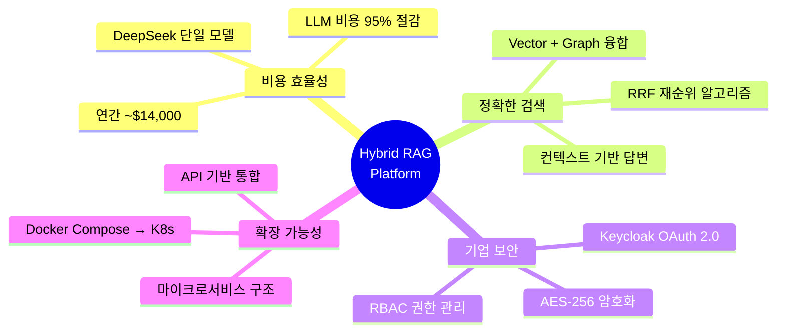

### 1.3 주요 수치

| 항목 | 목표 | 비고 |
|------|------|------|
| **응답 시간** | < 3초 (P95) | Hybrid 검색 + 답변 생성 |
| **검색 정확도** | > 85% (Precision@5) | 상위 5개 결과 기준 |
| **LLM 비용** | 95% 절감 | GPT-4 대비 DeepSeek |
| **가용성** | 99.5% | SLA 기준 |
| **동시 사용자** | 100명 | 1단계 목표 |

---

## 2. 프로젝트 개요

### 2.1 배경 및 목적

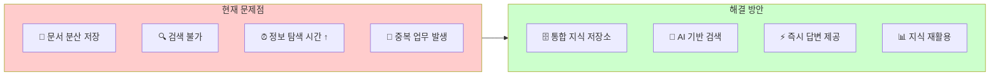

### 2.2 프로젝트 범위

#### 2.2.1 1단계 구축 범위 (본 설계서)

| 영역 | 포함 기능 |
|------|----------|
| **검색** | Hybrid 검색, 채팅 모드, 키워드 검색 |
| **지식 관리** | 문서 CRUD, 버전 관리, 유효기간 |
| **사용자** | 인증, 권한, 프로필, 북마크 |
| **내보내기** | Excel, PDF, PPT 변환 |
| **관리** | 대시보드, 사용자 관리 |

#### 2.2.2 2단계 구축 이관 (Section 11 참조)

- 성능/확장성 설계서
- 재해복구 설계서
- 기타 Medium/Low Priority 항목

### 2.3 기술 스택 요약


---

## 3. 시스템 아키텍처

### 3.1 전체 시스템 구조

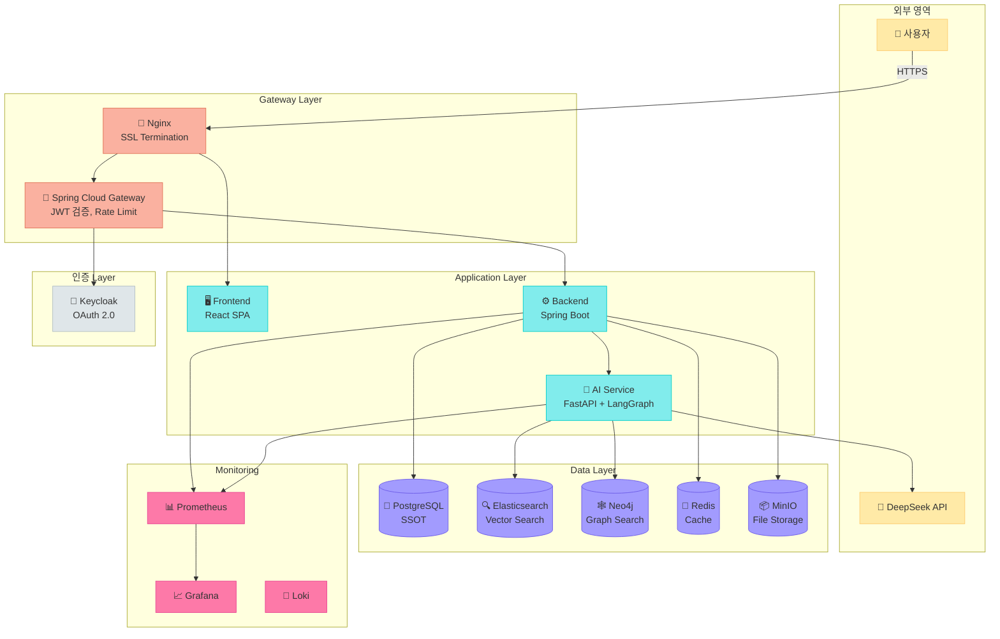

### 3.2 서비스 분리 아키텍처

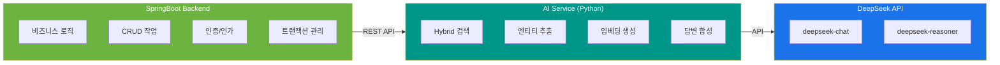

**역할 분담 원칙:**

| 서비스 | 역할 | 기술 |
|--------|------|------|
| **SpringBoot** | 비즈니스 로직, 인증, CRUD | Java, Spring Security, JPA |
| **AI Service** | AI 처리, 검색, 임베딩 | Python, FastAPI, LangGraph |

> **중요**: SpringBoot는 LLM/임베딩 모델과 직접 연동하지 않습니다.

### 3.3 데이터 흐름

#### 3.3.1 검색 흐름

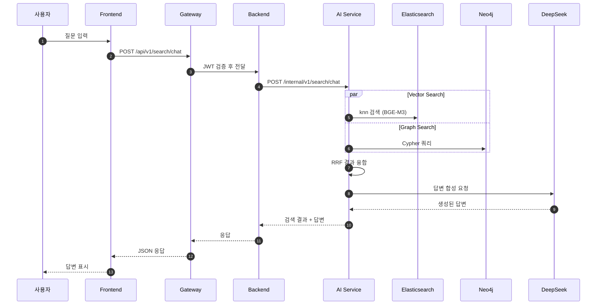

#### 3.3.2 문서 업로드 흐름

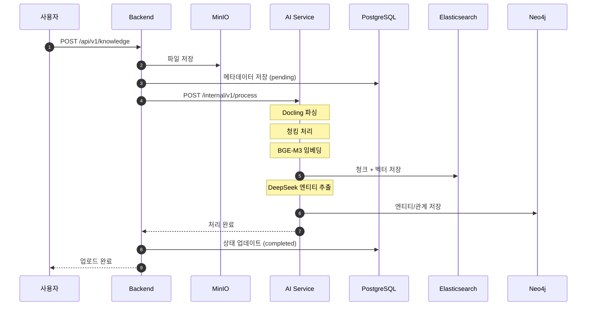

---

## 4. 플랫폼 핵심 설계

### 4.1 VIP 3단계 LLM 아키텍처

Hybrid RAG Platform의 핵심은 **VIP (Value-Intelligent-Planning)** 3단계 LLM 처리 파이프라인입니다.

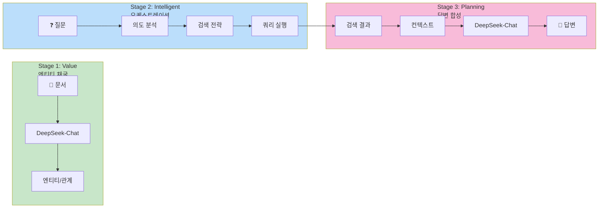

#### Stage별 상세

| Stage | 목적 | 모델 | 입력 | 출력 |
|-------|------|------|------|------|
| **1. Value** | 문서에서 지식 추출 | DeepSeek-Chat | 청크 텍스트 | 엔티티, 관계, 메타데이터 |
| **2. Intelligent** | 검색 전략 수립 | DeepSeek-Reasoner | 사용자 질의 | 검색 전략, 필터 조건 |
| **3. Planning** | 답변 생성 | DeepSeek-Chat | 검색 결과 | 최종 답변 |

### 4.2 Hybrid Search 융합

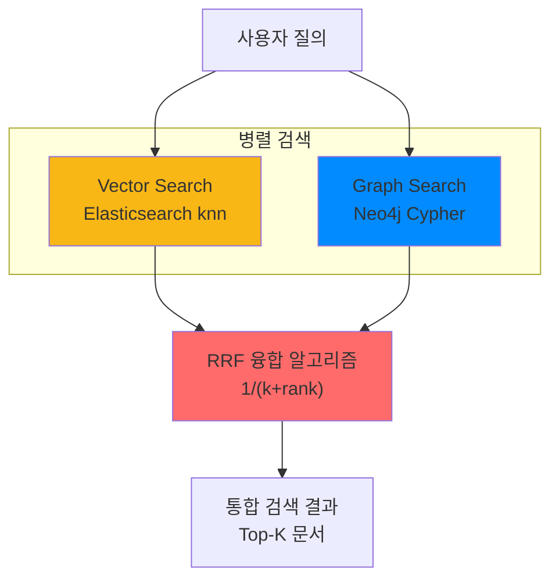

**RRF (Reciprocal Rank Fusion) 알고리즘:**

```python
def rrf_fusion(vector_results, graph_results, k=60):
    scores = {}
    for rank, doc in enumerate(vector_results):
        scores[doc.id] = scores.get(doc.id, 0) + 1 / (k + rank + 1)
    for rank, doc in enumerate(graph_results):
        scores[doc.id] = scores.get(doc.id, 0) + 1 / (k + rank + 1)
    return sorted(scores.items(), key=lambda x: x[1], reverse=True)
```

### 4.3 데이터베이스 설계 원칙

#### 제로 조인 아키텍처

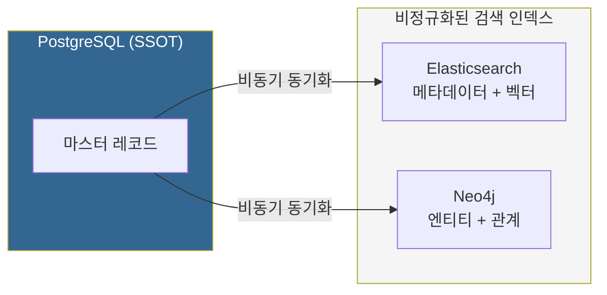

**핵심 원칙:**

| 원칙 | 설명 |
|------|------|
| **SSOT** | PostgreSQL이 단일 진실 공급원 |
| **비정규화** | ES/Neo4j에 메타데이터 복제 |
| **제로 조인** | 단일 DB 쿼리로 검색 완료 |

### 4.4 데이터 모델

#### 4.4.1 PostgreSQL ERD

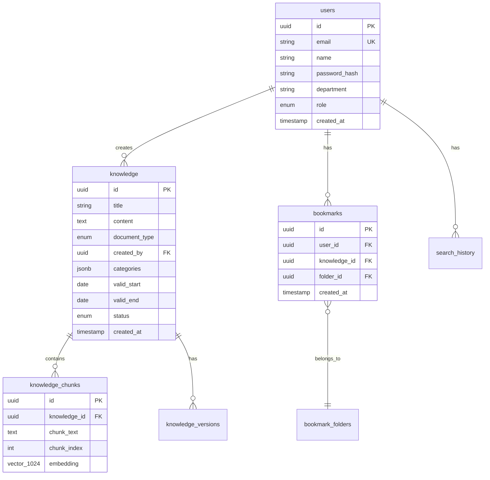

#### 4.4.2 Elasticsearch 인덱스

```json
{
  "knowledge_chunks": {
    "mappings": {
      "properties": {
        "chunk_id": { "type": "keyword" },
        "knowledge_id": { "type": "keyword" },
        "chunk_text": { "type": "text", "analyzer": "korean" },
        "embedding": { "type": "dense_vector", "dims": 1024 },
        "metadata": {
          "properties": {
            "document_type": { "type": "keyword" },
            "project_name": { "type": "keyword" },
            "categories": { "type": "keyword" },
            "valid_start": { "type": "date" },
            "valid_end": { "type": "date" }
          }
        }
      }
    }
  }
}
```

#### 4.4.3 Neo4j 그래프 모델

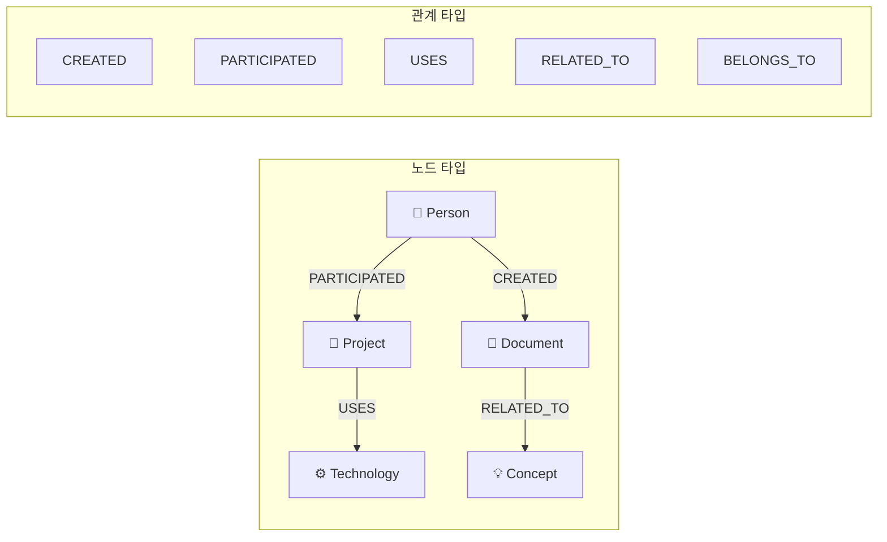

---

## 5. 백엔드 설계

### 5.1 레이어드 아키텍처

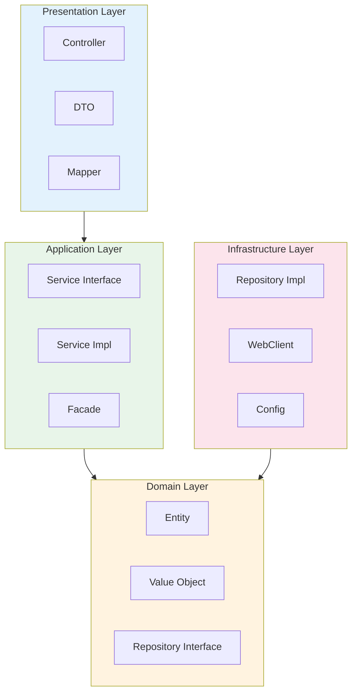

### 5.2 모듈 구조

```
knowledge-platform-backend/
├── platform-common/          # 공통 (DTO, Exception, Util)
├── platform-domain/          # 도메인 (Entity, Repository Interface)
├── platform-gateway/         # API Gateway
├── platform-api/             # API Service (Controller, Service Impl)
└── platform-batch/           # 배치 처리 (선택)
```

### 5.3 AI Service 연동

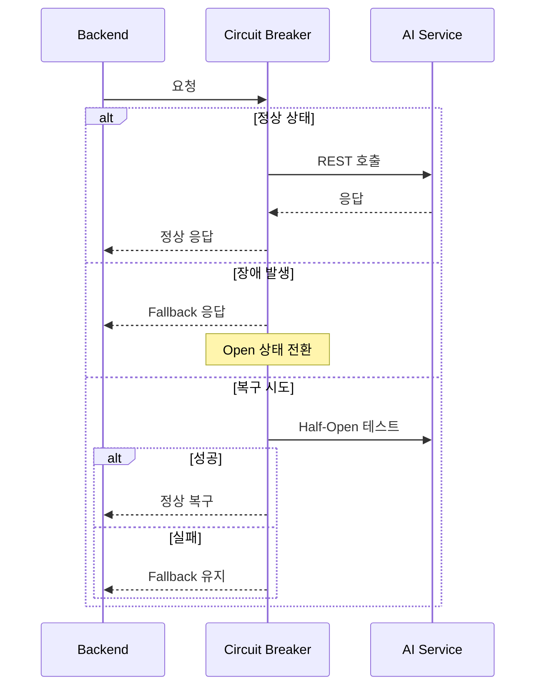

**Resilience4j 설정:**

| 설정 | 값 | 설명 |
|------|-----|------|
| failureRateThreshold | 50% | 실패율 임계치 |
| waitDurationInOpenState | 30초 | Open 상태 유지 시간 |
| slidingWindowSize | 10 | 집계 윈도우 크기 |
| timeout | 30초 | 요청 타임아웃 |

---

## 6. 프론트엔드 설계

### 6.1 컴포넌트 아키텍처

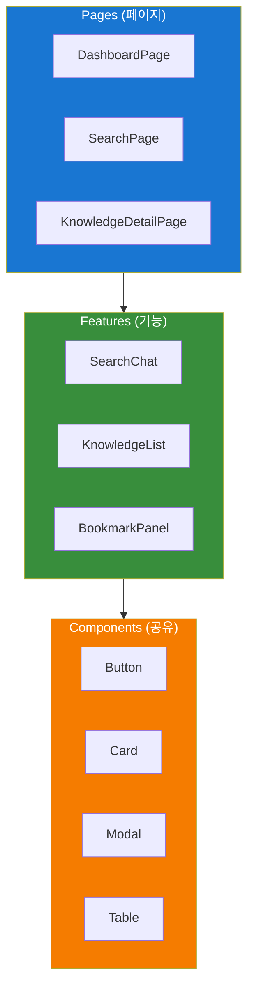

### 6.2 상태 관리

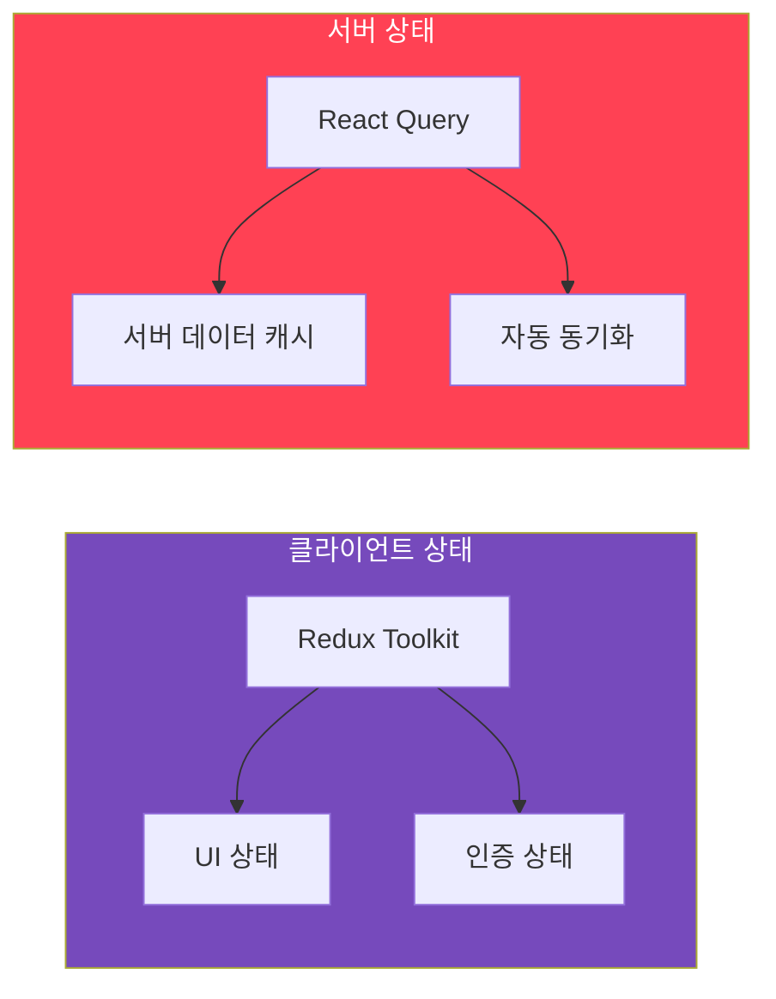

### 6.3 라우팅 구조

| 경로 | 페이지 | 권한 |
|------|--------|------|
| `/` | 대시보드 | USER |
| `/search` | 검색 | USER |
| `/knowledge` | 지식 목록 | USER |
| `/knowledge/:id` | 지식 상세 | USER |
| `/knowledge/new` | 지식 등록 | MANAGER |
| `/bookmarks` | 북마크 | USER |
| `/profile` | 프로필 | USER |
| `/admin/*` | 관리자 | ADMIN |

### 6.4 핵심 기능 UI

#### 6.4.1 검색 모드

```
┌─────────────────────────────────────────────────────────────┐
│  [📖 검색 모드] [💬 채팅 모드]                                │
├─────────────────────────────────────────────────────────────┤
│                                                             │
│  ┌─────────────────────────────────────────────────────┐   │
│  │  🔍  검색어를 입력하세요...                    [검색]   │   │
│  └─────────────────────────────────────────────────────┘   │
│                                                             │
│  ─────────────────────────────────────────────────────────  │
│                                                             │
│  📄 문서 제목 1                                             │
│     요약 내용 미리보기...                                    │
│     [기술문서] [프로젝트A] 2026-01-15                        │
│                                                             │
│  📄 문서 제목 2                                             │
│     요약 내용 미리보기...                                    │
│     [제안서] [프로젝트B] 2026-01-10                          │
│                                                             │
└─────────────────────────────────────────────────────────────┘
```

#### 6.4.2 채팅 모드

```
┌─────────────────────────────────────────────────────────────┐
│  [📖 검색 모드] [💬 채팅 모드]                                │
├─────────────────────────────────────────────────────────────┤
│                                                             │
│  ┌─────────────────────────────────────────────────────┐   │
│  │  👤 RAG 시스템의 장점이 뭐야?                        │   │
│  └─────────────────────────────────────────────────────┘   │
│                                                             │
│  ┌─────────────────────────────────────────────────────┐   │
│  │  🤖 RAG 시스템의 주요 장점은 다음과 같습니다:        │   │
│  │                                                     │   │
│  │  1. **정확한 정보 제공**: 검색된 문서 기반 답변      │   │
│  │  2. **환각 감소**: 실제 데이터 기반으로 답변 생성   │   │
│  │  3. **최신 정보**: 실시간 데이터 반영 가능          │   │
│  │                                                     │   │
│  │  📚 참조 문서:                                      │   │
│  │  • RAG 시스템 설계서 (2026-01-15)                   │   │
│  │  • AI 플랫폼 기획서 (2026-01-10)                    │   │
│  └─────────────────────────────────────────────────────┘   │
│                                                             │
│  ┌─────────────────────────────────────────────────────┐   │
│  │  💬 질문을 입력하세요...                      [전송]   │   │
│  └─────────────────────────────────────────────────────┘   │
└─────────────────────────────────────────────────────────────┘
```

---

## 7. 인증 및 보안 설계

### 7.1 인증 아키텍처

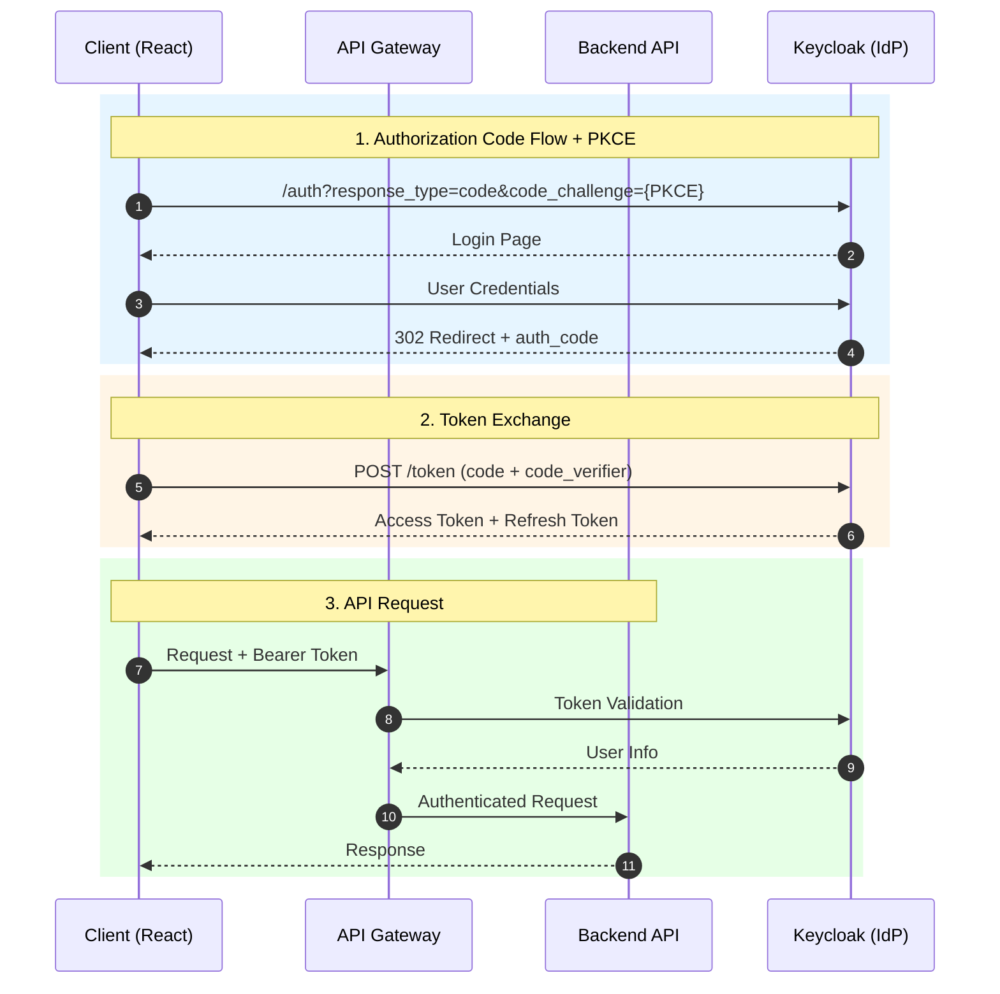

### 7.2 JWT 토큰 전략

| 토큰 | 수명 | 저장 위치 | 갱신 |
|------|------|----------|------|
| **Access Token** | 15분 | 메모리 | 만료 2분 전 자동 갱신 |
| **Refresh Token** | 7일 | HttpOnly Cookie | Access 갱신 시 Rotation |

### 7.3 RBAC 권한 모델

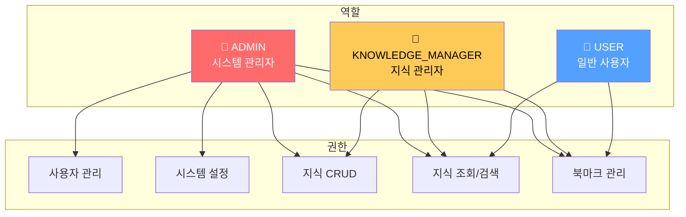

### 7.4 데이터 암호화 계층

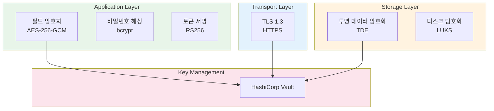

### 7.5 데이터 분류 및 보호

| 분류 | 예시 | 암호화 | 마스킹 |
|------|------|--------|--------|
| **Level 4 (극비)** | 암호화 키, 마스터 비밀번호 | HSM/Vault | 전체 |
| **Level 3 (비밀)** | 비밀번호 해시, API 키 | DB 암호화 | 부분 |
| **Level 2 (대외비)** | 이름, 이메일, 검색 기록 | 필드 암호화 | 부분 |
| **Level 1 (일반)** | 문서 메타데이터, 로그 | TDE | 없음 |

---

## 8. 인프라 및 DevOps 설계

### 8.1 인프라 구성 (Docker Compose)

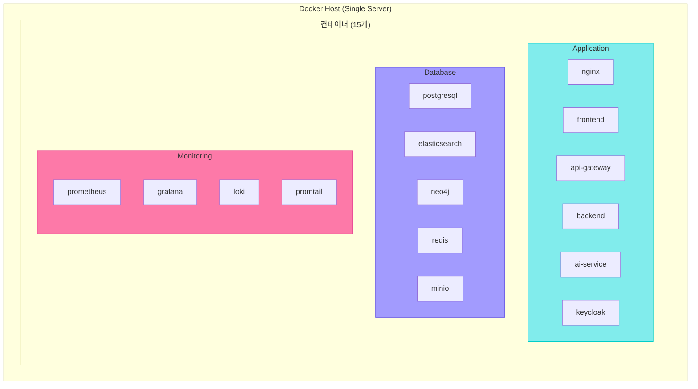

### 8.2 서버 사양

| 환경 | CPU | Memory | Storage | 용도 |
|------|-----|--------|---------|------|
| **Production** | 32 cores | 128 GB | 1TB SSD + 2TB HDD | 운영 |
| **Staging** | 16 cores | 64 GB | 500 GB SSD | 통합 테스트 |
| **Development** | 8 cores | 32 GB | 256 GB SSD | 개발 |

### 8.3 Git 브랜치 전략

```mermaid
gitGraph
    commit id: "Initial"
    branch develop
    checkout develop
    commit id: "Setup"

    branch feature/login
    checkout feature/login
    commit id: "Add login"
    checkout develop
    merge feature/login id: "PR #1"

    branch feature/search
    checkout feature/search
    commit id: "Search API"
    checkout develop
    merge feature/search id: "PR #2"

    checkout main
    merge develop id: "Release v1.0"
    commit id: "v1.0.0" tag: "v1.0.0"
```

**브랜치 규칙:**

| 브랜치 | 패턴 | 용도 |
|--------|------|------|
| `main` | `main` | 프로덕션 릴리스 |
| `develop` | `develop` | 개발 통합 |
| `feature/*` | `feature/ISSUE-{번호}-{설명}` | 새 기능 |
| `fix/*` | `fix/ISSUE-{번호}-{설명}` | 버그 수정 |
| `hotfix/*` | `hotfix/ISSUE-{번호}-{설명}` | 긴급 수정 |

### 8.4 CI/CD 파이프라인

```mermaid
flowchart LR
    subgraph CI["CI (Continuous Integration)"]
        Push["Git Push"]
        Build["Build"]
        Test["Test"]
        Scan["Security Scan"]
        Quality["SonarQube"]
    end

    subgraph CD["CD (Continuous Deployment)"]
        Image["Docker Image"]
        Stage["Staging Deploy"]
        Approve["Manual Approve"]
        Prod["Production Deploy"]
    end

    Push --> Build --> Test --> Scan --> Quality
    Quality --> Image --> Stage --> Approve --> Prod

    style CI fill:#e3f2fd
    style CD fill:#e8f5e9
```

### 8.5 모니터링 스택

| 도구 | 용도 | 수집 대상 |
|------|------|----------|
| **Prometheus** | 메트릭 수집 | CPU, Memory, API 지연시간 |
| **Grafana** | 대시보드 | 시스템 현황 시각화 |
| **Loki** | 로그 수집 | 애플리케이션 로그 |
| **Promtail** | 로그 수집 에이전트 | 컨테이너 로그 |

---

## 9. API 통합 설계

### 9.1 API 구조

```
External API (Frontend ↔ Backend)
├── /api/v1/auth/*          # 인증
├── /api/v1/knowledge/*     # 지식 관리
├── /api/v1/search/*        # 검색
├── /api/v1/users/*         # 사용자
├── /api/v1/bookmarks/*     # 북마크
├── /api/v1/dashboard/*     # 대시보드
├── /api/v1/export/*        # 내보내기
└── /api/v1/admin/*         # 관리자

Internal API (Backend ↔ AI Service)
├── /internal/v1/search/*   # 검색 파이프라인
├── /internal/v1/extract/*  # 엔티티 추출
├── /internal/v1/embed/*    # 임베딩 생성
├── /internal/v1/parse/*    # 문서 파싱
└── /health                 # 헬스체크
```

### 9.2 주요 API 엔드포인트

#### External API

| 메서드 | 경로 | 설명 |
|--------|------|------|
| POST | `/api/v1/search/chat` | 채팅 검색 (RAG) |
| POST | `/api/v1/search/hybrid` | Hybrid 검색 |
| GET | `/api/v1/knowledge` | 지식 목록 |
| POST | `/api/v1/knowledge` | 지식 등록 |
| GET | `/api/v1/knowledge/{id}` | 지식 상세 |
| PUT | `/api/v1/knowledge/{id}` | 지식 수정 |
| DELETE | `/api/v1/knowledge/{id}` | 지식 삭제 |
| POST | `/api/v1/export/excel` | Excel 내보내기 |
| POST | `/api/v1/export/pdf` | PDF 내보내기 |

#### Internal API

| 메서드 | 경로 | 설명 |
|--------|------|------|
| POST | `/internal/v1/search/hybrid` | Hybrid 검색 수행 |
| POST | `/internal/v1/search/chat` | 답변 합성 포함 검색 |
| POST | `/internal/v1/extract/entities` | 엔티티 추출 |
| POST | `/internal/v1/extract/metadata` | 메타데이터 생성 |
| POST | `/internal/v1/embed` | 임베딩 생성 |
| POST | `/internal/v1/embed/batch` | 배치 임베딩 |

### 9.3 공통 응답 형식

#### 성공 응답

```json
{
  "success": true,
  "data": { /* 응답 데이터 */ },
  "message": "요청이 성공적으로 처리되었습니다.",
  "timestamp": "2026-01-16T10:30:00Z",
  "requestId": "550e8400-e29b-41d4-a716-446655440000"
}
```

#### 에러 응답

```json
{
  "success": false,
  "error": {
    "code": "KNOWLEDGE_NOT_FOUND",
    "message": "요청한 지식을 찾을 수 없습니다.",
    "details": { "knowledgeId": "xxx-xxx" }
  },
  "timestamp": "2026-01-16T10:30:00Z",
  "requestId": "550e8400-e29b-41d4-a716-446655440000"
}
```

### 9.4 에러 코드 체계

| 서비스 | 코드 범위 | 예시 |
|--------|----------|------|
| **SYS** (시스템) | SYS001-599 | SYS300: 내부 서버 오류 |
| **AUTH** (인증) | AUTH001-099 | AUTH002: 토큰 만료 |
| **USER** (사용자) | USER001-399 | USER100: 사용자 없음 |
| **DOC** (문서) | DOC001-399 | DOC100: 문서 없음 |
| **SRCH** (검색) | SRCH001-599 | SRCH301: ES 오류 |
| **RAG** (RAG) | RAG001-599 | RAG300: 답변 생성 오류 |
| **LLM** (LLM) | LLM001-599 | LLM400: API 연결 실패 |

---

## 10. 품질 보증 전략

### 10.1 테스트 피라미드

```mermaid
flowchart TB
    subgraph Pyramid["테스트 피라미드"]
        E2E["🔺 E2E 테스트<br/>(10%)"]
        Integration["🔷 통합 테스트<br/>(30%)"]
        Unit["🟩 단위 테스트<br/>(60%)"]
    end

    E2E --> Integration --> Unit

    style E2E fill:#ff6b6b,color:#fff
    style Integration fill:#feca57,color:#000
    style Unit fill:#54a0ff,color:#fff
```

### 10.2 테스트 커버리지 목표

| 영역 | 목표 커버리지 | 도구 |
|------|-------------|------|
| **Backend (Java)** | 80%+ | JUnit 5, Mockito |
| **AI Service (Python)** | 75%+ | pytest |
| **Frontend (React)** | 70%+ | Vitest, RTL |
| **E2E** | 핵심 시나리오 | Playwright |

### 10.3 코드 품질 관리

| 도구 | 용도 |
|------|------|
| **SonarQube** | 정적 분석, 코드 품질 |
| **ESLint** | JavaScript/TypeScript 린팅 |
| **Prettier** | 코드 포맷팅 |
| **Black/isort** | Python 포맷팅 |
| **Checkstyle** | Java 코드 스타일 |

### 10.4 RAG 성능 평가

```mermaid
flowchart TB
    subgraph Metrics["RAG 평가 지표"]
        subgraph Retrieval["검색 품질"]
            P["Precision@K"]
            R["Recall@K"]
            MRR["MRR"]
            NDCG["NDCG"]
        end

        subgraph Generation["생성 품질"]
            F["Faithfulness"]
            AR["Answer Relevance"]
            CR["Context Relevance"]
        end

        subgraph Latency["응답 시간"]
            TTFB["TTFB"]
            P95["P95 Latency"]
        end
    end

    style Retrieval fill:#e3f2fd
    style Generation fill:#e8f5e9
    style Latency fill:#fff3e0
```

**상세 설계서 참조**: [RAG 성능 테스트 설계서](./rag_performance_test_design.md)

---

## 11. 2단계 구축 사업 이관 항목

### 11.1 이관 대상 문서

| 문서명 | 사유 | 2단계 추정 공수 |
|--------|------|----------------|
| **성능/확장성 설계서** | Docker Compose → K8s 마이그레이션 시 필요 | 2~3주 |
| **재해복구 설계서** | 고가용성 요구사항 발생 시 필요 | 1~2주 |

### 11.2 이관 대상 기능 (Medium Priority)

| # | 조치 | 대상 문서 | 예상 공수 |
|---|------|----------|----------|
| 1 | 캐싱 전략 상세화 | backend_detailed_design.md | 0.5일 |
| 2 | MFA 설계 추가 | authentication_authorization_detailed_design.md | 0.5일 |

### 11.3 이관 대상 기능 (Low Priority)

| # | 조치 | 대상 | 예상 공수 |
|---|------|------|----------|
| 1 | 데이터 거버넌스 설계서 | 신규 문서 | 1일 |
| 2 | 모델 버전 관리 추가 | hybrid_rag_platform_detailed_design.md | 0.5일 |
| 3 | PWA 설계 추가 | frontend_detailed_design.md | 0.5일 |
| 4 | 통합 테스트 계획서 | 신규 문서 | 1일 |

### 11.4 2단계 마이그레이션 로드맵

```mermaid
flowchart LR
    subgraph Phase1["Phase 1 (현재)<br/>Docker Compose"]
        DC["단일 서버<br/>$14,000/년"]
    end

    subgraph Phase2["Phase 2<br/>+ Redis Sentinel"]
        DR["캐시 이중화<br/>$20,000/년"]
    end

    subgraph Phase3["Phase 3<br/>Docker Swarm"]
        DS["3노드 클러스터<br/>$40,000/년"]
    end

    subgraph Phase4["Phase 4<br/>Kubernetes"]
        K8s["풀 클러스터<br/>$100,000/년"]
    end

    Phase1 --> Phase2 --> Phase3 --> Phase4
```

**마이그레이션 트리거 조건:**

| 지표 | Phase 2 | Phase 3 | Phase 4 |
|------|---------|---------|---------|
| 동시 사용자 | 100+ | 500+ | 1,000+ |
| 일일 요청 수 | 10,000+ | 50,000+ | 200,000+ |
| 가용성 요구 | 99.5% | 99.9% | 99.99% |

---

## 12. 부록

### 12.1 관련 설계서 목록

| 문서명 | 파일명 | 버전 |
|--------|--------|------|
| 플랫폼 상세 설계서 | hybrid_rag_platform_detailed_design.md | 2.3 |
| 백엔드 상세 설계서 | backend_detailed_design.md | 1.0 |
| 프론트엔드 상세 설계서 | frontend_detailed_design.md | 1.0 |
| 인증/권한 상세 설계서 | authentication_authorization_detailed_design.md | 1.0 |
| 데이터 암호화 설계서 | data_encryption_design.md | 1.0 |
| 인프라 상세 설계서 | infrastructure_detailed_design.md | 2.0 |
| DevOps 상세 설계서 | devops_detailed_design.md | 1.0 |
| API 통합 설계서 | api_integration_design.md | 1.0 |
| 에러 코드 표준 | error_code_standards.md | 1.0 |
| RAG 성능 테스트 설계서 | rag_performance_test_design.md | 1.0 |
| 용어집 | glossary.md | 2.0 |

### 12.2 기술 스택 상세

#### Frontend

| 기술 | 버전 | 용도 |
|------|------|------|
| React | 18.3+ | UI 라이브러리 |
| TypeScript | 5.4+ | 타입 안정성 |
| Vite | 5.x | 빌드 도구 |
| MUI | 5.x | 컴포넌트 라이브러리 |
| Redux Toolkit | 2.x | 상태 관리 |
| React Query | 5.x | 서버 상태 |
| React Hook Form | 7.x | 폼 관리 |
| Zod | 3.x | 스키마 검증 |

#### Backend

| 기술 | 버전 | 용도 |
|------|------|------|
| Spring Boot | 3.2+ | 프레임워크 |
| Spring Security | 6.x | 보안 |
| Spring Data JPA | 3.x | ORM |
| WebClient | 3.x | HTTP 클라이언트 |
| Resilience4j | 2.x | Circuit Breaker |
| Gradle | 8.x | 빌드 도구 |
| Java | 17+ | 런타임 |

#### AI Service

| 기술 | 버전 | 용도 |
|------|------|------|
| Python | 3.11+ | 런타임 |
| FastAPI | 0.110+ | API 프레임워크 |
| LangChain | 1.2+ | LLM 통합 |
| LangGraph | 1.0+ | 워크플로우 |
| Docling | 2.x | 문서 파싱 |
| BGE-M3 | - | 임베딩 |

#### Infrastructure

| 기술 | 버전 | 용도 |
|------|------|------|
| Docker | 24.x | 컨테이너 |
| Docker Compose | 2.x | 오케스트레이션 |
| Nginx | 1.25+ | 리버스 프록시 |
| PostgreSQL | 16+ | RDBMS |
| Elasticsearch | 8.x | 벡터 검색 |
| Neo4j | 5.x | 그래프 DB |
| Redis | 7.x | 캐시 |
| Keycloak | 24.x | IdP |

### 12.3 비용 추정

| 항목 | 월간 비용 | 연간 비용 | 비고 |
|------|----------|----------|------|
| **서버 (Production)** | $800 | $9,600 | 32C/128G |
| **서버 (Staging)** | $200 | $2,400 | 16C/64G |
| **DeepSeek API** | $150 | $1,800 | 예상 사용량 기준 |
| **도메인/SSL** | $20 | $240 | |
| **합계** | **$1,170** | **$14,040** | |

> GPT-4 사용 시 예상 비용: ~$100,000/년 → **86% 비용 절감**

### 12.4 프로젝트 일정 요약

```mermaid
gantt
    title 1단계 구축 일정 (예시)
    dateFormat  YYYY-MM-DD
    section 설계
    상세 설계           :done, 2026-01-01, 2026-01-20
    설계 검토           :done, 2026-01-15, 2026-01-20
    section 개발
    인프라 구축         :2026-01-21, 5d
    백엔드 개발         :2026-01-26, 20d
    AI Service 개발     :2026-01-26, 20d
    프론트엔드 개발     :2026-02-01, 15d
    section 테스트
    통합 테스트         :2026-02-16, 10d
    사용자 테스트       :2026-02-26, 5d
    section 배포
    운영 배포           :2026-03-03, 2d
```

---

## 문서 끝

**작성**: Claude Code (Opus 4.5)
**최종 수정**: 2026-01-16
**검토 상태**: Final Draft
