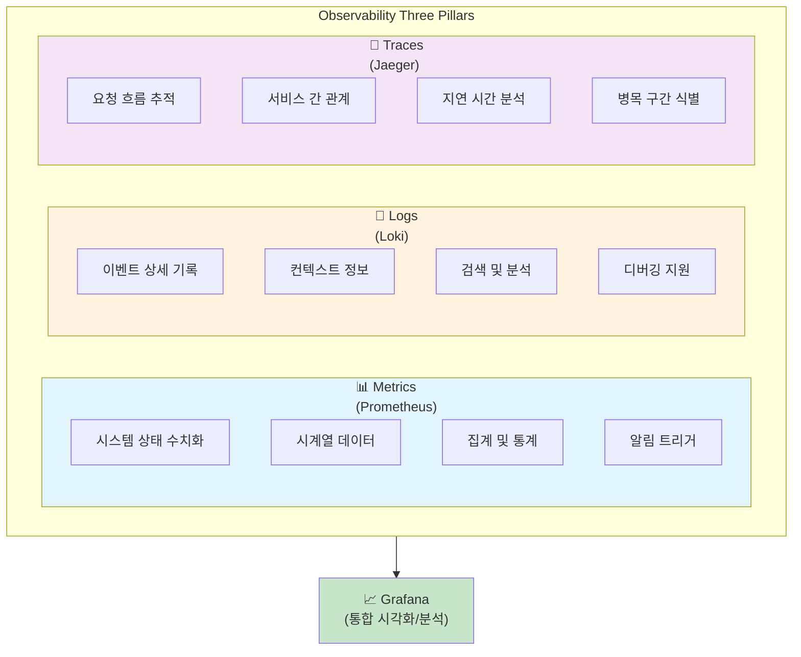
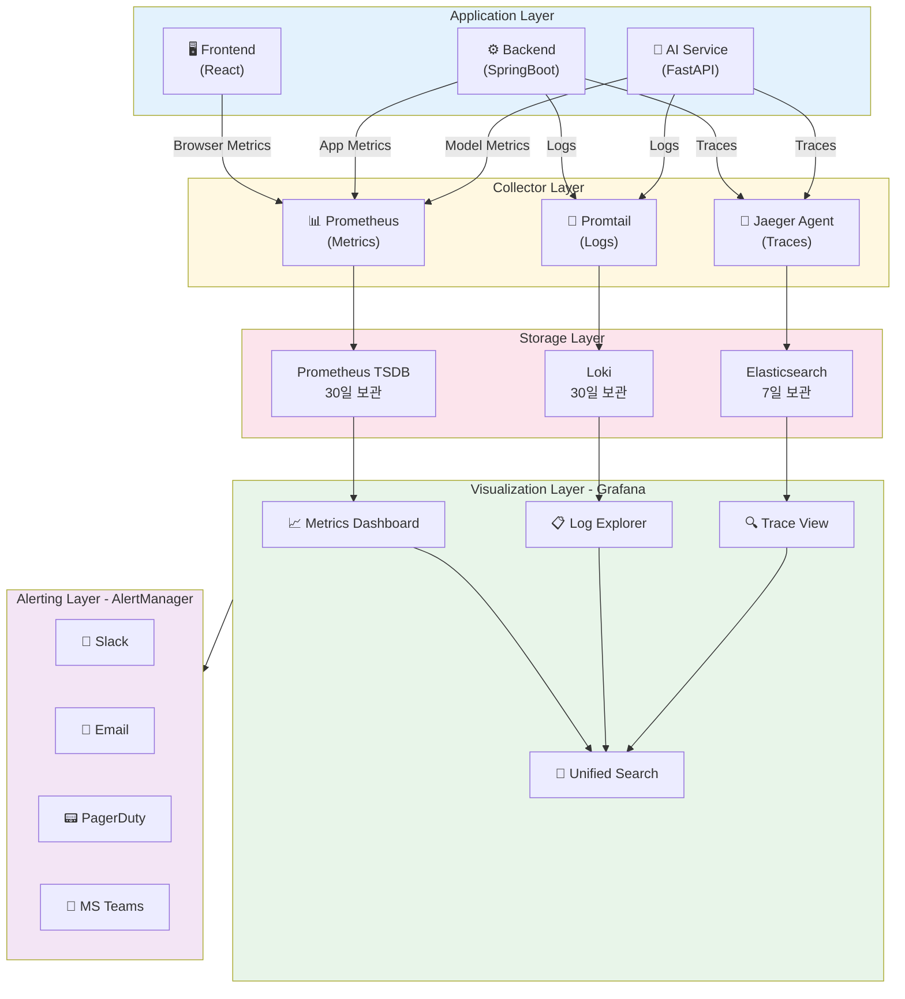
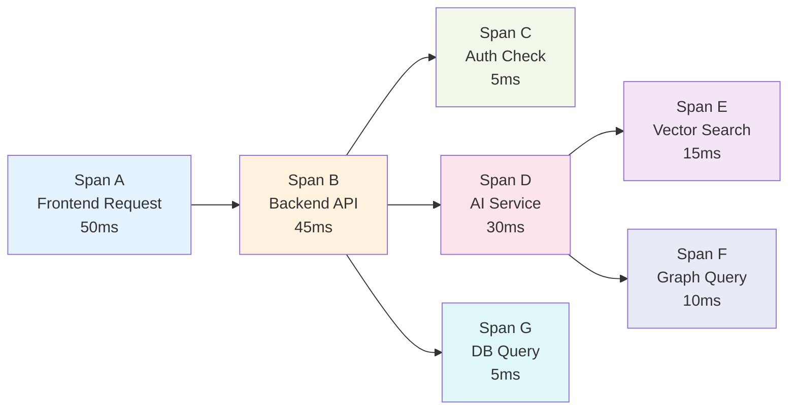
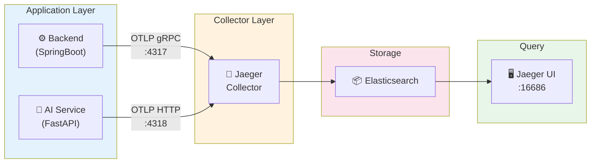
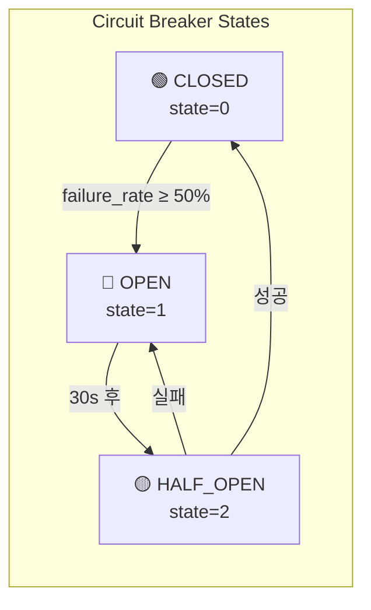
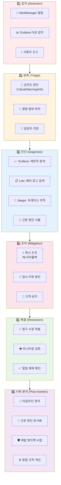

# Observability 상세 설계서

---

## 문서 정보

| 항목 | 내용 |
|------|------|
| **문서명** | Observability 상세 설계서 |
| **버전** | 1.0 |
| **작성일** | 2026-01-17 |
| **작성자** | Claude Code (Opus 4.5) |
| **상태** | Draft |
| **관련 문서** | [인프라 설계서](./infrastructure_detailed_design.md) 섹션 8, [백엔드 설계서](./backend_detailed_design.md) 섹션 14, [에러 코드 표준](./error_code_standards.md) 섹션 7 |

---

## 변경 이력

| 버전 | 일자 | 작성자 | 변경 내용 |
|------|------|--------|----------|
| 1.0 | 2026-01-17 | Claude Code | 초안 작성 - 기존 설계서 통합 + 분산 트레이싱, SLA, 보안 모니터링 추가 |
| 1.1 | 2026-01-21 | Claude Code | Kibana 추가 (Elasticsearch 데이터 시각화/탐색 도구) |

---

## 목차

1. [개요](#1-개요)
2. [Observability 아키텍처](#2-observability-아키텍처)
3. [Three Pillars of Observability](#3-three-pillars-of-observability)
4. [분산 트레이싱 (Jaeger)](#4-분산-트레이싱-jaeger)
5. [메트릭 수집 (Prometheus)](#5-메트릭-수집-prometheus)
   - [5.3 Circuit Breaker 메트릭](#53-circuit-breaker-메트릭) ← **Resilience4j 연동**
6. [로그 수집 (Loki)](#6-로그-수집-loki)
7. [시각화 및 대시보드 (Grafana)](#7-시각화-및-대시보드-grafana)
   - [7.5 Kibana (Elasticsearch 시각화)](#75-kibana-elasticsearch-시각화)
8. [알림 및 온콜 관리](#8-알림-및-온콜-관리)
9. [SLA 모니터링](#9-sla-모니터링)
10. [보안 이벤트 모니터링](#10-보안-이벤트-모니터링)
11. [AI/ML 모델 모니터링](#11-aiml-모델-모니터링)
12. [비즈니스 메트릭](#12-비즈니스-메트릭)
13. [운영 가이드](#13-운영-가이드)

---

## 1. 개요

### 1.1 목적

본 문서는 Hybrid RAG Knowledge Platform의 **Observability(관측 가능성)** 전략을 정의합니다. 시스템의 상태를 실시간으로 파악하고, 문제를 신속하게 진단하며, 사전 예방적 조치를 취할 수 있는 기반을 제공합니다.

### 1.2 Observability vs Monitoring

| 구분 | Monitoring | Observability |
|------|-----------|---------------|
| **관점** | "무엇이 잘못되었는가?" | "왜 잘못되었는가?" |
| **접근 방식** | 사전 정의된 메트릭 추적 | 임의 질문에 대한 탐색 |
| **데이터** | 알려진 패턴 | 알려지지 않은 패턴 발견 |
| **목표** | 장애 감지 | 근본 원인 분석 |

### 1.3 Three Pillars



### 1.4 기존 문서 참조

> **통합 안내**: 본 문서는 기존 설계서의 모니터링 관련 내용을 통합합니다.

| 내용 | 원본 문서 | 섹션 |
|------|----------|------|
| Prometheus/Grafana/Loki 설정 | [infrastructure_detailed_design.md](./infrastructure_detailed_design.md) | 섹션 8 |
| Logback/MDC/Actuator 설정 | [backend_detailed_design.md](./backend_detailed_design.md) | 섹션 14 |
| 에러 코드 메트릭/알림 | [error_code_standards.md](./error_code_standards.md) | 섹션 7 |

---

## 2. Observability 아키텍처

### 2.1 전체 구성도



### 2.2 Docker Compose 구성

```yaml
# docker-compose.observability.yml
version: '3.8'

services:
  # ============ Metrics ============
  prometheus:
    image: prom/prometheus:v2.48.0
    container_name: prometheus
    ports:
      - "9090:9090"
    volumes:
      - ./prometheus/prometheus.yml:/etc/prometheus/prometheus.yml
      - ./prometheus/rules:/etc/prometheus/rules
      - prometheus_data:/prometheus
    command:
      - '--config.file=/etc/prometheus/prometheus.yml'
      - '--storage.tsdb.path=/prometheus'
      - '--storage.tsdb.retention.time=30d'
      - '--web.enable-lifecycle'
    networks:
      - observability

  # ============ Logs ============
  loki:
    image: grafana/loki:2.9.0
    container_name: loki
    ports:
      - "3100:3100"
    volumes:
      - ./loki/loki-config.yml:/etc/loki/local-config.yaml
      - loki_data:/loki
    command: -config.file=/etc/loki/local-config.yaml
    networks:
      - observability

  promtail:
    image: grafana/promtail:2.9.0
    container_name: promtail
    volumes:
      - ./promtail/promtail-config.yml:/etc/promtail/config.yml
      - /var/lib/docker/containers:/var/lib/docker/containers:ro
      - /var/log:/var/log:ro
    command: -config.file=/etc/promtail/config.yml
    networks:
      - observability

  # ============ Traces ============
  jaeger:
    image: jaegertracing/all-in-one:1.52
    container_name: jaeger
    ports:
      - "5775:5775/udp"   # Zipkin Thrift (deprecated)
      - "6831:6831/udp"   # Jaeger Thrift Compact
      - "6832:6832/udp"   # Jaeger Thrift Binary
      - "5778:5778"       # Config API
      - "16686:16686"     # Jaeger UI
      - "14268:14268"     # Jaeger HTTP Thrift
      - "14250:14250"     # gRPC
      - "4317:4317"       # OTLP gRPC
      - "4318:4318"       # OTLP HTTP
    environment:
      - COLLECTOR_ZIPKIN_HOST_PORT=:9411
      - SPAN_STORAGE_TYPE=elasticsearch
      - ES_SERVER_URLS=http://elasticsearch:9200
    networks:
      - observability
      - backend

  # ============ Visualization ============
  grafana:
    image: grafana/grafana:10.2.0
    container_name: grafana
    ports:
      - "3000:3000"
    environment:
      - GF_SECURITY_ADMIN_USER=admin
      - GF_SECURITY_ADMIN_PASSWORD=${GRAFANA_PASSWORD:-admin123}
      - GF_USERS_ALLOW_SIGN_UP=false
      - GF_FEATURE_TOGGLES_ENABLE=traceqlEditor
    volumes:
      - ./grafana/provisioning:/etc/grafana/provisioning
      - ./grafana/dashboards:/var/lib/grafana/dashboards
      - grafana_data:/var/lib/grafana
    networks:
      - observability

  # ============ Elasticsearch Visualization ============
  kibana:
    image: docker.elastic.co/kibana/kibana:8.11.0
    container_name: kibana
    ports:
      - "5601:5601"
    environment:
      - ELASTICSEARCH_HOSTS=http://elasticsearch:9200
      - SERVER_NAME=kibana
      - SERVER_HOST=0.0.0.0
      - XPACK_SECURITY_ENABLED=false
      - NODE_OPTIONS=--max-old-space-size=384
    depends_on:
      - elasticsearch
    networks:
      - observability
      - backend

  # ============ Alerting ============
  alertmanager:
    image: prom/alertmanager:v0.26.0
    container_name: alertmanager
    ports:
      - "9093:9093"
    volumes:
      - ./alertmanager/alertmanager.yml:/etc/alertmanager/alertmanager.yml
      - alertmanager_data:/alertmanager
    command:
      - '--config.file=/etc/alertmanager/alertmanager.yml'
      - '--storage.path=/alertmanager'
    networks:
      - observability

  # ============ Exporters ============
  node-exporter:
    image: prom/node-exporter:v1.7.0
    container_name: node-exporter
    ports:
      - "9100:9100"
    volumes:
      - /proc:/host/proc:ro
      - /sys:/host/sys:ro
      - /:/rootfs:ro
    command:
      - '--path.procfs=/host/proc'
      - '--path.sysfs=/host/sys'
      - '--collector.filesystem.mount-points-exclude=^/(sys|proc|dev|host|etc)($$|/)'
    networks:
      - observability

  cadvisor:
    image: gcr.io/cadvisor/cadvisor:v0.47.2
    container_name: cadvisor
    ports:
      - "8080:8080"
    volumes:
      - /:/rootfs:ro
      - /var/run:/var/run:ro
      - /sys:/sys:ro
      - /var/lib/docker/:/var/lib/docker:ro
    networks:
      - observability

volumes:
  prometheus_data:
  loki_data:
  grafana_data:
  alertmanager_data:

networks:
  observability:
    driver: bridge
  backend:
    external: true
```

### 2.3 포트 매핑 요약

| 서비스 | 포트 | 용도 |
|--------|------|------|
| Prometheus | 9090 | 메트릭 쿼리 UI |
| Grafana | 3000 | 통합 대시보드 |
| Loki | 3100 | 로그 수집 API |
| Jaeger UI | 16686 | 트레이스 조회 UI |
| Jaeger OTLP | 4317/4318 | OpenTelemetry 수집 |
| **Kibana** | **5601** | **ES 데이터 시각화/쿼리** |
| AlertManager | 9093 | 알림 관리 |
| Node Exporter | 9100 | 호스트 메트릭 |
| cAdvisor | 8080 | 컨테이너 메트릭 |

---

## 3. Three Pillars of Observability

### 3.1 Pillar 1: Metrics (메트릭)

> **상세 설정**: [infrastructure_detailed_design.md](./infrastructure_detailed_design.md#81-prometheus-설정) 참조

**수집 대상 메트릭:**

| 레벨 | 메트릭 | 수집 도구 |
|------|--------|----------|
| **시스템** | CPU, Memory, Disk, Network | Node Exporter |
| **컨테이너** | Resource Usage, Restart Count | cAdvisor |
| **애플리케이션** | HTTP Requests, Response Time, Error Rate | Spring Actuator, FastAPI |
| **데이터베이스** | Connections, Query Time, Cache Hit | PostgreSQL/Redis/ES Exporter |
| **비즈니스** | Search Count, Document Count, User Activity | Custom Metrics |

### 3.2 Pillar 2: Logs (로그)

> **상세 설정**: [backend_detailed_design.md](./backend_detailed_design.md#141-로깅-설정-logback-springxml) 참조

**로그 레벨 정책:**

| 환경 | 기본 레벨 | 상세 로그 |
|------|----------|----------|
| **Local** | DEBUG | SQL, HTTP 요청/응답 |
| **Dev** | DEBUG | SQL 쿼리 |
| **Staging** | INFO | 주요 이벤트만 |
| **Production** | INFO | 주요 이벤트만, ERROR 알림 |

**구조화된 로그 형식:**

```json
{
  "timestamp": "2026-01-17T10:30:00.000Z",
  "level": "ERROR",
  "service": "backend",
  "traceId": "550e8400-e29b-41d4-a716-446655440000",
  "spanId": "a2fb4a1d1a96d312",
  "userId": "7c9e6679-7425-40de-944b-e07fc1f90ae7",
  "message": "문서를 찾을 수 없습니다",
  "error_code": "DOC100",
  "context": {
    "documentId": "123e4567-e89b-12d3-a456-426614174000",
    "path": "/api/v1/knowledge/123e4567-e89b-12d3-a456-426614174000"
  }
}
```

### 3.3 Pillar 3: Traces (트레이스)

**트레이스 개념:**

> TraceId: `550e8400-e29b-41d4-a716-446655440000`

```mermaid
gantt
    title Distributed Trace - Request Flow (Total: 50ms)
    dateFormat X
    axisFormat %L ms

    section Frontend
    Span A: Frontend Request     :a, 0, 50

    section Backend
    Span B: Backend API          :b, 2, 47
    Span C: Auth Check           :c, 3, 8
    Span G: DB Query             :g, 42, 47

    section AI Service
    Span D: AI Service Call      :d, 10, 40
    Span E: Vector Search        :e, 12, 27
    Span F: Graph Query          :f, 28, 38
```



**Span 계층 구조:**



---

## 4. 분산 트레이싱 (Jaeger)

### 4.1 개요

분산 트레이싱은 마이크로서비스 환경에서 요청이 여러 서비스를 거쳐 처리되는 과정을 추적합니다.

### 4.2 Jaeger 아키텍처



### 4.3 Spring Boot 설정 (OpenTelemetry)

**의존성 추가:**

```xml
<!-- pom.xml -->
<dependency>
    <groupId>io.opentelemetry</groupId>
    <artifactId>opentelemetry-api</artifactId>
</dependency>
<dependency>
    <groupId>io.opentelemetry</groupId>
    <artifactId>opentelemetry-sdk</artifactId>
</dependency>
<dependency>
    <groupId>io.opentelemetry</groupId>
    <artifactId>opentelemetry-exporter-otlp</artifactId>
</dependency>
<dependency>
    <groupId>io.opentelemetry.instrumentation</groupId>
    <artifactId>opentelemetry-spring-boot-starter</artifactId>
</dependency>
```

**application.yml 설정:**

```yaml
# OpenTelemetry 설정
otel:
  service:
    name: knowledge-platform-backend
  exporter:
    otlp:
      endpoint: http://jaeger:4317
      protocol: grpc
  traces:
    exporter: otlp
  metrics:
    exporter: prometheus
  logs:
    exporter: none

# Spring Boot Actuator 연동
management:
  tracing:
    enabled: true
    sampling:
      probability: 1.0  # 개발: 100%, 운영: 0.1 (10%)
  otlp:
    tracing:
      endpoint: http://jaeger:4318/v1/traces
```

**커스텀 Span 생성:**

```java
@Service
@RequiredArgsConstructor
public class SearchService {

    private final Tracer tracer;

    public SearchResult hybridSearch(SearchRequest request) {
        // 커스텀 Span 생성
        Span span = tracer.spanBuilder("hybrid-search")
            .setAttribute("query", request.getQuery())
            .setAttribute("search.type", request.getSearchType().name())
            .startSpan();

        try (Scope scope = span.makeCurrent()) {
            // Vector Search Span
            Span vectorSpan = tracer.spanBuilder("vector-search").startSpan();
            try (Scope vectorScope = vectorSpan.makeCurrent()) {
                List<ChunkResult> vectorResults = vectorSearch(request);
                vectorSpan.setAttribute("result.count", vectorResults.size());
            } finally {
                vectorSpan.end();
            }

            // Graph Search Span
            Span graphSpan = tracer.spanBuilder("graph-search").startSpan();
            try (Scope graphScope = graphSpan.makeCurrent()) {
                List<EntityResult> graphResults = graphSearch(request);
                graphSpan.setAttribute("result.count", graphResults.size());
            } finally {
                graphSpan.end();
            }

            // 결과 병합
            return mergeResults(vectorResults, graphResults);

        } catch (Exception e) {
            span.recordException(e);
            span.setStatus(StatusCode.ERROR, e.getMessage());
            throw e;
        } finally {
            span.end();
        }
    }
}
```

### 4.4 FastAPI 설정 (OpenTelemetry)

```python
# app/core/tracing.py
from opentelemetry import trace
from opentelemetry.sdk.trace import TracerProvider
from opentelemetry.sdk.trace.export import BatchSpanProcessor
from opentelemetry.exporter.otlp.proto.grpc.trace_exporter import OTLPSpanExporter
from opentelemetry.instrumentation.fastapi import FastAPIInstrumentor
from opentelemetry.instrumentation.httpx import HTTPXClientInstrumentor
from opentelemetry.instrumentation.sqlalchemy import SQLAlchemyInstrumentor

def setup_tracing(app: FastAPI):
    """OpenTelemetry 트레이싱 설정"""

    # TracerProvider 설정
    provider = TracerProvider(
        resource=Resource.create({
            "service.name": "knowledge-platform-ai-service",
            "service.version": "1.0.0",
            "deployment.environment": os.getenv("ENVIRONMENT", "development")
        })
    )

    # OTLP Exporter
    otlp_exporter = OTLPSpanExporter(
        endpoint=os.getenv("JAEGER_ENDPOINT", "http://jaeger:4317"),
        insecure=True
    )

    provider.add_span_processor(BatchSpanProcessor(otlp_exporter))
    trace.set_tracer_provider(provider)

    # 자동 계측
    FastAPIInstrumentor.instrument_app(app)
    HTTPXClientInstrumentor().instrument()
    SQLAlchemyInstrumentor().instrument()

# 커스텀 Span 사용
tracer = trace.get_tracer(__name__)

async def process_document(document: Document) -> ProcessResult:
    with tracer.start_as_current_span("process-document") as span:
        span.set_attribute("document.id", str(document.id))
        span.set_attribute("document.type", document.document_type)

        # 청킹
        with tracer.start_as_current_span("chunking"):
            chunks = await chunk_document(document)

        # 임베딩 생성
        with tracer.start_as_current_span("embedding") as emb_span:
            embeddings = await generate_embeddings(chunks)
            emb_span.set_attribute("chunk.count", len(chunks))

        # 엔티티 추출
        with tracer.start_as_current_span("entity-extraction"):
            entities = await extract_entities(document.content)

        return ProcessResult(chunks=chunks, embeddings=embeddings, entities=entities)
```

### 4.5 서비스 간 Context 전파

```java
// Backend → AI Service 호출 시 TraceContext 전파
@Component
public class TracingWebClientCustomizer implements WebClientCustomizer {

    @Override
    public void customize(WebClient.Builder builder) {
        builder.filter((request, next) -> {
            // 현재 Span에서 Context 추출
            Span currentSpan = Span.current();
            SpanContext context = currentSpan.getSpanContext();

            // W3C Trace Context 헤더 추가
            ClientRequest tracedRequest = ClientRequest.from(request)
                .header("traceparent", String.format(
                    "00-%s-%s-%s",
                    context.getTraceId(),
                    context.getSpanId(),
                    context.isSampled() ? "01" : "00"
                ))
                .build();

            return next.exchange(tracedRequest);
        });
    }
}
```

### 4.6 Trace-Log 상관관계

```java
// MDC에 TraceId 자동 추가
@Component
public class TraceIdMdcFilter implements Filter {

    @Override
    public void doFilter(ServletRequest request, ServletResponse response, FilterChain chain)
            throws IOException, ServletException {
        try {
            Span currentSpan = Span.current();
            if (currentSpan.getSpanContext().isValid()) {
                MDC.put("traceId", currentSpan.getSpanContext().getTraceId());
                MDC.put("spanId", currentSpan.getSpanContext().getSpanId());
            }
            chain.doFilter(request, response);
        } finally {
            MDC.remove("traceId");
            MDC.remove("spanId");
        }
    }
}
```

**Loki에서 TraceId로 로그 조회:**

```logql
{service="backend"} | json | traceId="550e8400e29b41d4a716446655440000"
```

---

## 5. 메트릭 수집 (Prometheus)

> **기본 설정**: [infrastructure_detailed_design.md](./infrastructure_detailed_design.md#81-prometheus-설정) 참조

### 5.1 커스텀 비즈니스 메트릭

```java
// Spring Boot - Micrometer 커스텀 메트릭
@Component
@RequiredArgsConstructor
public class BusinessMetrics {

    private final MeterRegistry meterRegistry;

    // 검색 요청 카운터
    private Counter searchCounter;

    // 검색 지연 시간 히스토그램
    private Timer searchTimer;

    // 활성 사용자 게이지
    private AtomicInteger activeUsers;

    @PostConstruct
    public void init() {
        searchCounter = Counter.builder("knowledge.search.total")
            .description("Total search requests")
            .tag("type", "hybrid")
            .register(meterRegistry);

        searchTimer = Timer.builder("knowledge.search.duration")
            .description("Search request duration")
            .publishPercentiles(0.5, 0.95, 0.99)
            .register(meterRegistry);

        activeUsers = meterRegistry.gauge("knowledge.users.active",
            new AtomicInteger(0));
    }

    public void recordSearch(String searchType, Duration duration) {
        searchCounter.increment();
        searchTimer.record(duration);
    }

    public void setActiveUsers(int count) {
        activeUsers.set(count);
    }
}
```

```python
# FastAPI - Prometheus 커스텀 메트릭
from prometheus_client import Counter, Histogram, Gauge, generate_latest

# 메트릭 정의
DOCUMENT_PROCESS_COUNTER = Counter(
    'ai_document_processed_total',
    'Total documents processed',
    ['document_type', 'status']
)

LLM_REQUEST_DURATION = Histogram(
    'ai_llm_request_duration_seconds',
    'LLM API request duration',
    ['model', 'operation'],
    buckets=[0.1, 0.25, 0.5, 1.0, 2.5, 5.0, 10.0]
)

MODEL_INFERENCE_LATENCY = Histogram(
    'ai_model_inference_latency_seconds',
    'Model inference latency',
    ['model_name'],
    buckets=[0.01, 0.05, 0.1, 0.25, 0.5, 1.0]
)

ACTIVE_PROCESSING_JOBS = Gauge(
    'ai_active_processing_jobs',
    'Number of active document processing jobs'
)

# 사용 예시
async def process_with_llm(prompt: str, model: str = "deepseek-v3"):
    with LLM_REQUEST_DURATION.labels(model=model, operation="generate").time():
        response = await llm_client.generate(prompt)
    return response
```

### 5.2 Recording Rules

```yaml
# prometheus/rules/recording_rules.yml
groups:
  - name: knowledge_platform_rules
    interval: 30s
    rules:
      # 검색 요청률 (5분 평균)
      - record: knowledge:search_rate:5m
        expr: rate(knowledge_search_total[5m])

      # 검색 P95 지연 시간
      - record: knowledge:search_latency_p95:5m
        expr: histogram_quantile(0.95, rate(knowledge_search_duration_bucket[5m]))

      # 에러율
      - record: knowledge:error_rate:5m
        expr: |
          sum(rate(http_server_requests_seconds_count{status=~"5.."}[5m])) /
          sum(rate(http_server_requests_seconds_count[5m]))

      # 서비스별 가용성
      - record: knowledge:availability:5m
        expr: |
          1 - (
            sum(rate(http_server_requests_seconds_count{status=~"5.."}[5m])) /
            sum(rate(http_server_requests_seconds_count[5m]))
          )

      # LLM API 성공률
      - record: ai:llm_success_rate:5m
        expr: |
          sum(rate(ai_llm_request_duration_seconds_count{status="success"}[5m])) /
          sum(rate(ai_llm_request_duration_seconds_count[5m]))
```

### 5.3 Circuit Breaker 메트릭

> **상세 설정**: [백엔드 상세 설계서](./backend_detailed_design.md#102-resilience4j-설정) 참조

#### 5.3.1 Resilience4j 자동 메트릭

Resilience4j는 Micrometer를 통해 자동으로 메트릭을 노출합니다.

| 메트릭 | 설명 | 레이블 |
|--------|------|--------|
| `resilience4j_circuitbreaker_state` | CB 상태 (0=CLOSED, 1=OPEN, 2=HALF_OPEN) | `name` |
| `resilience4j_circuitbreaker_calls_total` | 총 호출 수 | `name`, `kind` (successful/failed) |
| `resilience4j_circuitbreaker_failure_rate` | 실패율 (%) | `name` |
| `resilience4j_circuitbreaker_slow_call_rate` | 느린 호출 비율 (%) | `name` |
| `resilience4j_retry_calls_total` | 재시도 횟수 | `name`, `kind` |
| `resilience4j_timelimiter_calls_total` | 타임아웃 횟수 | `name`, `kind` |

#### 5.3.2 Circuit Breaker 상태 시각화



#### 5.3.3 Prometheus 알림 규칙

```yaml
# prometheus/rules/circuitbreaker_alerts.yml
groups:
  - name: circuitbreaker_alerts
    rules:
      # Circuit Breaker OPEN 상태 알림
      - alert: CircuitBreakerOpen
        expr: resilience4j_circuitbreaker_state{name="aiService"} == 1
        for: 1m
        labels:
          severity: critical
          category: availability
        annotations:
          summary: "Circuit Breaker OPEN - AI Service 장애"
          description: "AI Service Circuit Breaker가 OPEN 상태입니다. Fallback 응답 중."

      # Circuit Breaker HALF_OPEN 상태 (복구 시도 중)
      - alert: CircuitBreakerHalfOpen
        expr: resilience4j_circuitbreaker_state{name="aiService"} == 2
        for: 2m
        labels:
          severity: warning
          category: availability
        annotations:
          summary: "Circuit Breaker HALF_OPEN - 복구 시도 중"
          description: "AI Service 복구를 시도 중입니다."

      # 높은 실패율 경고
      - alert: HighFailureRate
        expr: resilience4j_circuitbreaker_failure_rate{name="aiService"} > 30
        for: 5m
        labels:
          severity: warning
          category: availability
        annotations:
          summary: "AI Service 실패율 {{ $value }}% 초과"
          description: "Circuit Breaker OPEN 전환 임박. 실패 원인 확인 필요."

      # 재시도 급증
      - alert: RetrySpike
        expr: rate(resilience4j_retry_calls_total{name="aiService",kind="retry"}[5m]) > 10
        for: 5m
        labels:
          severity: warning
          category: performance
        annotations:
          summary: "AI Service 재시도 급증"
          description: "분당 재시도 횟수가 급증하고 있습니다. 네트워크/서비스 상태 확인 필요."
```

#### 5.3.4 Grafana 대시보드 쿼리

```promql
# Circuit Breaker 현재 상태
resilience4j_circuitbreaker_state{name="aiService"}

# 실패율 추이 (5분)
resilience4j_circuitbreaker_failure_rate{name="aiService"}

# 성공/실패 호출 비율
sum(rate(resilience4j_circuitbreaker_calls_total{name="aiService",kind="successful"}[5m])) /
sum(rate(resilience4j_circuitbreaker_calls_total{name="aiService"}[5m])) * 100

# OPEN 상태 누적 시간 (일간)
sum(increase(resilience4j_circuitbreaker_state{name="aiService"} == 1[24h])) * 30

# 재시도 횟수 (시간당)
sum(rate(resilience4j_retry_calls_total{name="aiService",kind="retry"}[1h])) * 3600
```

#### 5.3.5 대시보드 패널 구성

```json
{
  "panels": [
    {
      "title": "Circuit Breaker 상태",
      "type": "stat",
      "targets": [
        {
          "expr": "resilience4j_circuitbreaker_state{name=\"aiService\"}",
          "legendFormat": "AI Service"
        }
      ],
      "options": {
        "colorMode": "background",
        "mappings": [
          { "type": "value", "value": 0, "text": "CLOSED", "color": "green" },
          { "type": "value", "value": 1, "text": "OPEN", "color": "red" },
          { "type": "value", "value": 2, "text": "HALF_OPEN", "color": "yellow" }
        ]
      }
    },
    {
      "title": "실패율 추이",
      "type": "timeseries",
      "targets": [
        {
          "expr": "resilience4j_circuitbreaker_failure_rate{name=\"aiService\"}",
          "legendFormat": "Failure Rate %"
        }
      ],
      "thresholds": [
        { "value": 30, "color": "yellow" },
        { "value": 50, "color": "red" }
      ]
    },
    {
      "title": "호출 현황",
      "type": "timeseries",
      "targets": [
        {
          "expr": "rate(resilience4j_circuitbreaker_calls_total{name=\"aiService\",kind=\"successful\"}[5m])",
          "legendFormat": "Success"
        },
        {
          "expr": "rate(resilience4j_circuitbreaker_calls_total{name=\"aiService\",kind=\"failed\"}[5m])",
          "legendFormat": "Failed"
        }
      ]
    }
  ]
}
```

---

## 6. 로그 수집 (Loki)

> **기본 설정**: [infrastructure_detailed_design.md](./infrastructure_detailed_design.md#83-loki-설정) 참조

### 6.1 로그 레이블 전략

```yaml
# promtail/promtail-config.yml
scrape_configs:
  - job_name: application_logs
    static_configs:
      - targets:
          - localhost
        labels:
          job: application
          __path__: /var/log/app/*.log

    pipeline_stages:
      # JSON 파싱
      - json:
          expressions:
            level: level
            service: service
            traceId: traceId
            error_code: error_code

      # 레이블 추가
      - labels:
          level:
          service:
          error_code:

      # TraceId를 검색 가능하게
      - structured_metadata:
          traceId:

      # 타임스탬프 파싱
      - timestamp:
          source: timestamp
          format: RFC3339Nano

      # 에러 로그만 별도 스트림
      - match:
          selector: '{level="ERROR"}'
          stages:
            - labels:
                alert: "true"
```

### 6.2 LogQL 쿼리 예시

```logql
# 최근 1시간 에러 로그
{service="backend", level="ERROR"} | json

# 특정 TraceId로 전체 요청 흐름 조회
{service=~"backend|ai-service"} | json | traceId="550e8400e29b41d4a716446655440000"

# 에러 코드별 집계 (최근 24시간)
sum by (error_code) (
  count_over_time({service="backend"} | json | error_code != "" [24h])
)

# 느린 요청 (1초 이상)
{service="backend"} | json | duration > 1s

# 특정 사용자의 활동 로그
{service="backend"} | json | userId="7c9e6679-7425-40de-944b-e07fc1f90ae7"

# LLM API 에러
{service="ai-service"} | json | line_format "{{.message}}" |= "LLM" |= "error"
```

---

## 7. 시각화 및 대시보드 (Grafana)

### 7.1 대시보드 구성

```
┌─────────────────────────────────────────────────────────────────────────┐
│                    Grafana Dashboard Structure                          │
└─────────────────────────────────────────────────────────────────────────┘

📁 Knowledge Platform
├── 📊 Overview (전체 현황)
│   ├── Service Health Status
│   ├── Request Rate / Error Rate
│   ├── P50/P95/P99 Latency
│   └── Active Users
│
├── 📊 Backend Service
│   ├── API Endpoints Performance
│   ├── Database Connections
│   ├── Cache Hit Rate
│   └── JVM Metrics
│
├── 📊 AI Service
│   ├── LLM API Latency
│   ├── Document Processing Rate
│   ├── Embedding Generation Time
│   └── Model Inference Metrics
│
├── 📊 Infrastructure
│   ├── Container Resources (CPU/Memory)
│   ├── Disk Usage
│   ├── Network I/O
│   └── Database Performance
│
├── 📊 SLA Dashboard
│   ├── Availability (99.9% target)
│   ├── Latency SLO Compliance
│   ├── Error Budget
│   └── Monthly Report
│
├── 📊 Security Events
│   ├── Auth Failures
│   ├── Rate Limit Hits
│   ├── Suspicious Activities
│   └── Access Logs
│
└── 📊 Business Metrics
    ├── Daily Active Users
    ├── Search Volume
    ├── Document Growth
    └── Top Queries
```

### 7.2 Overview 대시보드 JSON

```json
{
  "dashboard": {
    "id": null,
    "uid": "knowledge-overview",
    "title": "Knowledge Platform - Overview",
    "tags": ["knowledge-platform", "overview"],
    "timezone": "Asia/Seoul",
    "refresh": "30s",
    "panels": [
      {
        "id": 1,
        "title": "Service Health",
        "type": "stat",
        "gridPos": {"h": 4, "w": 6, "x": 0, "y": 0},
        "targets": [
          {
            "expr": "up{job=~\"backend|ai-service|postgresql|elasticsearch\"}",
            "legendFormat": "{{job}}"
          }
        ],
        "options": {
          "colorMode": "value",
          "graphMode": "none",
          "reduceOptions": {"calcs": ["lastNotNull"]}
        }
      },
      {
        "id": 2,
        "title": "Request Rate",
        "type": "timeseries",
        "gridPos": {"h": 8, "w": 12, "x": 0, "y": 4},
        "targets": [
          {
            "expr": "sum(rate(http_server_requests_seconds_count[1m])) by (service)",
            "legendFormat": "{{service}}"
          }
        ]
      },
      {
        "id": 3,
        "title": "Error Rate",
        "type": "gauge",
        "gridPos": {"h": 4, "w": 6, "x": 6, "y": 0},
        "targets": [
          {
            "expr": "knowledge:error_rate:5m * 100",
            "legendFormat": "Error %"
          }
        ],
        "options": {
          "reduceOptions": {"calcs": ["lastNotNull"]},
          "thresholds": {
            "steps": [
              {"color": "green", "value": null},
              {"color": "yellow", "value": 1},
              {"color": "red", "value": 5}
            ]
          }
        }
      },
      {
        "id": 4,
        "title": "Latency Percentiles",
        "type": "timeseries",
        "gridPos": {"h": 8, "w": 12, "x": 12, "y": 4},
        "targets": [
          {
            "expr": "histogram_quantile(0.50, rate(http_server_requests_seconds_bucket[5m]))",
            "legendFormat": "P50"
          },
          {
            "expr": "histogram_quantile(0.95, rate(http_server_requests_seconds_bucket[5m]))",
            "legendFormat": "P95"
          },
          {
            "expr": "histogram_quantile(0.99, rate(http_server_requests_seconds_bucket[5m]))",
            "legendFormat": "P99"
          }
        ]
      },
      {
        "id": 5,
        "title": "Recent Errors",
        "type": "logs",
        "gridPos": {"h": 10, "w": 24, "x": 0, "y": 12},
        "datasource": "Loki",
        "targets": [
          {
            "expr": "{service=~\"backend|ai-service\", level=\"ERROR\"} | json",
            "legendFormat": ""
          }
        ]
      },
      {
        "id": 6,
        "title": "Trace Explorer",
        "type": "traces",
        "gridPos": {"h": 10, "w": 24, "x": 0, "y": 22},
        "datasource": "Jaeger",
        "targets": [
          {
            "queryType": "search",
            "service": "knowledge-platform-backend",
            "minDuration": "100ms"
          }
        ]
      }
    ]
  }
}
```

### 7.3 Grafana 데이터 소스 프로비저닝

```yaml
# grafana/provisioning/datasources/datasources.yml
apiVersion: 1

datasources:
  - name: Prometheus
    type: prometheus
    access: proxy
    url: http://prometheus:9090
    isDefault: true
    editable: false

  - name: Loki
    type: loki
    access: proxy
    url: http://loki:3100
    editable: false
    jsonData:
      derivedFields:
        - name: TraceID
          matcherRegex: '"traceId":"([a-f0-9]+)"'
          url: '$${__value.raw}'
          datasourceUid: jaeger

  - name: Jaeger
    type: jaeger
    access: proxy
    url: http://jaeger:16686
    uid: jaeger
    editable: false
    jsonData:
      tracesToLogs:
        datasourceUid: loki
        tags: ['service']
        mappedTags: [{ key: 'service.name', value: 'service' }]
        mapTagNamesEnabled: true
        spanStartTimeShift: '-1h'
        spanEndTimeShift: '1h'
        filterByTraceID: true
        filterBySpanID: false
```

### 7.5 Kibana (Elasticsearch 시각화)

Kibana는 Elasticsearch 데이터를 탐색하고 시각화하기 위한 전용 도구입니다. Grafana가 통합 대시보드를 제공한다면, Kibana는 Elasticsearch에 특화된 깊이 있는 분석 기능을 제공합니다.

#### 7.5.1 Kibana vs Grafana

| 기능 | Kibana | Grafana |
|------|--------|---------|
| **Elasticsearch 쿼리** | Dev Tools 콘솔 제공, DSL 직접 실행 | 기본적인 쿼리만 지원 |
| **인덱스 관리** | 인덱스 생성/삭제/매핑 관리 | 불가 |
| **데이터 탐색** | Discover로 상세 탐색 | 제한적 |
| **다중 데이터소스** | Elasticsearch 전용 | 다양한 소스 통합 |
| **대시보드** | 기본 지원 | 풍부한 시각화 옵션 |

#### 7.5.2 주요 사용 시나리오

| 시나리오 | 도구 | 이유 |
|----------|------|------|
| **벡터 검색 디버깅** | Kibana | k-NN 쿼리 직접 테스트, 유사도 점수 확인 |
| **인덱스 매핑 확인** | Kibana | `_mapping` API로 필드 타입 검증 |
| **문서 임베딩 상태 확인** | Kibana | 벡터 필드 존재 여부, 차원 검증 |
| **통합 모니터링** | Grafana | Prometheus + Loki + Jaeger 연계 |
| **SLA 대시보드** | Grafana | 다양한 메트릭 통합 시각화 |

#### 7.5.3 접속 정보

| 항목 | 값 |
|------|---|
| URL | http://localhost:5601 |
| 컨테이너명 | kp-kibana |
| 인증 | 비활성화 (개발 환경) |
| 메모리 | 768MB (힙: 384MB) |

#### 7.5.4 Dev Tools 주요 명령어

```json
# 클러스터 상태 확인
GET _cluster/health

# 인덱스 목록
GET _cat/indices?v

# 인덱스 매핑 확인
GET document-embeddings/_mapping

# 벡터 검색 테스트
GET document-embeddings/_search
{
  "knn": {
    "field": "embedding",
    "query_vector": [0.1, 0.2, ...],
    "k": 10,
    "num_candidates": 100
  }
}

# 문서 수 확인
GET document-embeddings/_count
```

> **상세 가이드**: `docs/07_maintenance/kibana_user_guide.md` 참조

---

## 8. 알림 및 온콜 관리

### 8.1 AlertManager 설정

```yaml
# alertmanager/alertmanager.yml
global:
  resolve_timeout: 5m
  slack_api_url: '${SLACK_WEBHOOK_URL}'

route:
  group_by: ['alertname', 'severity']
  group_wait: 30s
  group_interval: 5m
  repeat_interval: 4h
  receiver: 'default'
  routes:
    # Critical 알림 → PagerDuty + Slack
    - match:
        severity: critical
      receiver: 'critical'
      continue: true

    # Warning 알림 → Slack
    - match:
        severity: warning
      receiver: 'warning'

    # Security 알림 → 보안팀
    - match:
        category: security
      receiver: 'security-team'

receivers:
  - name: 'default'
    slack_configs:
      - channel: '#knowledge-platform-alerts'
        title: '{{ .GroupLabels.alertname }}'
        text: '{{ range .Alerts }}{{ .Annotations.summary }}{{ end }}'

  - name: 'critical'
    slack_configs:
      - channel: '#knowledge-platform-critical'
        title: '🚨 CRITICAL: {{ .GroupLabels.alertname }}'
        text: '{{ range .Alerts }}{{ .Annotations.description }}{{ end }}'
        send_resolved: true
    pagerduty_configs:
      - service_key: '${PAGERDUTY_SERVICE_KEY}'
        severity: critical

  - name: 'warning'
    slack_configs:
      - channel: '#knowledge-platform-alerts'
        title: '⚠️ WARNING: {{ .GroupLabels.alertname }}'
        text: '{{ range .Alerts }}{{ .Annotations.summary }}{{ end }}'

  - name: 'security-team'
    slack_configs:
      - channel: '#security-alerts'
        title: '🔒 SECURITY: {{ .GroupLabels.alertname }}'
        text: '{{ range .Alerts }}{{ .Annotations.description }}{{ end }}'
    email_configs:
      - to: 'security@company.com'
        send_resolved: true

inhibit_rules:
  # Critical이 발생하면 Warning 억제
  - source_match:
      severity: 'critical'
    target_match:
      severity: 'warning'
    equal: ['alertname', 'instance']
```

### 8.2 알림 규칙 확장

> **기본 알림 규칙**: [infrastructure_detailed_design.md](./infrastructure_detailed_design.md#82-알림-규칙) 참조

```yaml
# prometheus/rules/extended_alerts.yml
groups:
  - name: sla_alerts
    rules:
      # SLA 위반 (가용성 99.9% 미만)
      - alert: SLAViolation
        expr: knowledge:availability:5m < 0.999
        for: 5m
        labels:
          severity: critical
          category: sla
        annotations:
          summary: "SLA 위반 - 가용성 {{ $value | humanizePercentage }}"
          description: "목표: 99.9%, 현재: {{ $value | humanizePercentage }}"

      # Error Budget 소진 임박
      - alert: ErrorBudgetLow
        expr: |
          (1 - knowledge:availability:30d) / 0.001 > 0.8
        for: 1h
        labels:
          severity: warning
          category: sla
        annotations:
          summary: "Error Budget 80% 이상 소진"

  - name: business_alerts
    rules:
      # 검색 실패율 증가
      - alert: SearchFailureSpike
        expr: |
          sum(rate(knowledge_search_total{status="error"}[5m])) /
          sum(rate(knowledge_search_total[5m])) > 0.1
        for: 5m
        labels:
          severity: warning
          category: business
        annotations:
          summary: "검색 실패율 10% 초과"

      # 문서 처리 지연
      - alert: DocumentProcessingDelay
        expr: ai_active_processing_jobs > 100
        for: 10m
        labels:
          severity: warning
          category: business
        annotations:
          summary: "문서 처리 대기열 100건 초과"

  - name: security_alerts
    rules:
      # 인증 실패 급증
      - alert: AuthenticationBruteForce
        expr: |
          sum(rate(app_errors_total{error_code=~"AUTH.*"}[1m])) > 20
        for: 2m
        labels:
          severity: critical
          category: security
        annotations:
          summary: "인증 실패 급증 - 무차별 대입 공격 의심"
          description: "분당 인증 실패 20건 초과"

      # Rate Limit 초과
      - alert: RateLimitExceeded
        expr: |
          sum(rate(http_server_requests_seconds_count{status="429"}[5m])) > 10
        for: 5m
        labels:
          severity: warning
          category: security
        annotations:
          summary: "Rate Limit 초과 요청 다수 발생"
```

### 8.3 알림 심각도 정의

| 심각도 | 응답 시간 | 알림 채널 | 예시 |
|--------|----------|----------|------|
| **Critical** | 15분 이내 | Slack + PagerDuty + Email | 서비스 다운, DB 장애, SLA 위반 |
| **Warning** | 1시간 이내 | Slack | 높은 에러율, 리소스 부족 임박 |
| **Info** | 업무 시간 | Slack | 배포 완료, 스케일링 이벤트 |

---

## 9. SLA 모니터링

### 9.1 SLA/SLO 정의

| 지표 | SLO 목표 | 측정 방법 |
|------|---------|----------|
| **가용성** | 99.9% (월간) | `1 - (5xx 응답 / 전체 응답)` |
| **응답 시간 (P95)** | < 500ms | 검색 API |
| **응답 시간 (P99)** | < 2s | 전체 API |
| **에러율** | < 0.1% | 5xx 응답 비율 |

### 9.2 Error Budget 계산

```
월간 Error Budget = 100% - SLO = 100% - 99.9% = 0.1%

월간 허용 다운타임 = 30일 × 24시간 × 60분 × 0.1% = 43.2분

Error Budget 소진율 = 실제 다운타임 / 허용 다운타임 × 100%
```

### 9.3 SLA 대시보드 쿼리

```promql
# 월간 가용성
avg_over_time(knowledge:availability:5m[30d])

# Error Budget 잔여량
1 - (
  sum(increase(http_server_requests_seconds_count{status=~"5.."}[30d])) /
  sum(increase(http_server_requests_seconds_count[30d]))
) / 0.001

# SLO 준수 여부 (Boolean)
knowledge:availability:5m >= 0.999

# 일별 가용성 추이
avg by (day) (
  label_replace(knowledge:availability:5m, "day", "$1", "timestamp", "(.{10}).*")
)
```

---

## 10. 보안 이벤트 모니터링

### 10.1 모니터링 대상

| 이벤트 | 설명 | 심각도 |
|--------|------|--------|
| **AUTH_FAILURE** | 인증 실패 | Warning → Critical (다수) |
| **PERMISSION_DENIED** | 권한 부족 접근 시도 | Warning |
| **RATE_LIMIT_EXCEEDED** | Rate Limit 초과 | Warning |
| **SUSPICIOUS_QUERY** | 의심스러운 검색 쿼리 (SQL Injection 등) | Critical |
| **TOKEN_ABUSE** | 토큰 재사용/탈취 의심 | Critical |
| **DATA_EXPORT_LARGE** | 대량 데이터 내보내기 | Warning |

### 10.2 보안 메트릭

```python
# AI Service - 보안 메트릭
SECURITY_EVENTS = Counter(
    'security_events_total',
    'Security events',
    ['event_type', 'severity', 'source_ip']
)

SUSPICIOUS_QUERIES = Counter(
    'security_suspicious_queries_total',
    'Suspicious query attempts',
    ['query_type', 'blocked']
)

def log_security_event(event_type: str, severity: str, details: dict):
    """보안 이벤트 기록"""
    SECURITY_EVENTS.labels(
        event_type=event_type,
        severity=severity,
        source_ip=details.get('source_ip', 'unknown')
    ).inc()

    logger.warning(
        "Security event detected",
        event_type=event_type,
        severity=severity,
        **details
    )
```

### 10.3 보안 대시보드 패널

```json
{
  "panels": [
    {
      "title": "인증 실패 추이",
      "type": "timeseries",
      "targets": [
        {
          "expr": "sum(rate(security_events_total{event_type=\"AUTH_FAILURE\"}[5m])) by (source_ip)",
          "legendFormat": "{{source_ip}}"
        }
      ]
    },
    {
      "title": "의심스러운 활동 (최근 24시간)",
      "type": "table",
      "targets": [
        {
          "expr": "topk(10, sum by (source_ip, event_type) (increase(security_events_total[24h])))",
          "format": "table"
        }
      ]
    },
    {
      "title": "Rate Limit 히트맵",
      "type": "heatmap",
      "targets": [
        {
          "expr": "sum(rate(http_server_requests_seconds_count{status=\"429\"}[5m])) by (le)",
          "format": "heatmap"
        }
      ]
    }
  ]
}
```

---

## 11. AI/ML 모델 모니터링

### 11.1 모니터링 대상

| 지표 | 설명 | 임계값 |
|------|------|--------|
| **LLM 응답 시간** | DeepSeek API 호출 시간 | P95 < 5s |
| **임베딩 생성 시간** | BGE-M3 벡터 생성 | P95 < 200ms |
| **토큰 사용량** | LLM API 토큰 소비 | 일 100만 토큰 |
| **Fallback 비율** | 백업 모델 사용 비율 | < 5% |
| **검색 품질** | Relevance Score 분포 | 평균 > 0.7 |

### 11.2 LLM 메트릭

```python
# LLM 모니터링 메트릭
LLM_TOKEN_USAGE = Counter(
    'ai_llm_tokens_total',
    'Total LLM tokens used',
    ['model', 'operation', 'token_type']  # token_type: input/output
)

LLM_COST = Counter(
    'ai_llm_cost_dollars',
    'LLM API cost in dollars',
    ['model']
)

LLM_FALLBACK = Counter(
    'ai_llm_fallback_total',
    'LLM fallback events',
    ['primary_model', 'fallback_model', 'reason']
)

SEARCH_RELEVANCE = Histogram(
    'ai_search_relevance_score',
    'Search result relevance scores',
    ['search_type'],
    buckets=[0.1, 0.2, 0.3, 0.4, 0.5, 0.6, 0.7, 0.8, 0.9, 1.0]
)

async def call_llm_with_metrics(prompt: str, model: str = "deepseek-v3"):
    start_time = time.time()

    try:
        response = await llm_client.generate(prompt, model=model)

        # 토큰 사용량 기록
        LLM_TOKEN_USAGE.labels(
            model=model,
            operation="generate",
            token_type="input"
        ).inc(response.usage.input_tokens)

        LLM_TOKEN_USAGE.labels(
            model=model,
            operation="generate",
            token_type="output"
        ).inc(response.usage.output_tokens)

        # 비용 계산 (DeepSeek: $0.14/1M input, $0.28/1M output)
        cost = (response.usage.input_tokens * 0.14 + response.usage.output_tokens * 0.28) / 1_000_000
        LLM_COST.labels(model=model).inc(cost)

        return response

    except Exception as e:
        # Fallback 처리
        LLM_FALLBACK.labels(
            primary_model=model,
            fallback_model="gpt-4o-mini",
            reason=str(type(e).__name__)
        ).inc()

        return await llm_client.generate(prompt, model="gpt-4o-mini")
```

### 11.3 AI 대시보드

```promql
# LLM 일일 토큰 사용량
sum(increase(ai_llm_tokens_total[24h])) by (model, token_type)

# LLM 일일 비용
sum(increase(ai_llm_cost_dollars[24h])) by (model)

# Fallback 비율
sum(rate(ai_llm_fallback_total[1h])) /
sum(rate(ai_llm_request_duration_seconds_count[1h])) * 100

# 검색 품질 분포
histogram_quantile(0.5, rate(ai_search_relevance_score_bucket[1h]))
```

---

## 12. 비즈니스 메트릭

### 12.1 핵심 비즈니스 KPI

| KPI | 설명 | 측정 주기 |
|-----|------|----------|
| **DAU (Daily Active Users)** | 일일 활성 사용자 수 | 일간 |
| **검색 성공률** | 결과가 있는 검색 비율 | 실시간 |
| **평균 검색 결과 수** | 쿼리당 반환 문서 수 | 실시간 |
| **문서 등록량** | 일일 신규 문서 수 | 일간 |
| **인기 검색어** | 상위 검색 키워드 | 일간 |

### 12.2 비즈니스 메트릭 구현

```java
@Component
@RequiredArgsConstructor
public class BusinessMetricsCollector {

    private final MeterRegistry meterRegistry;
    private final UserActivityRepository activityRepository;

    // DAU 게이지
    @Scheduled(fixedRate = 60000) // 1분마다
    public void collectDAU() {
        long dau = activityRepository.countDistinctUsersSince(
            LocalDateTime.now().minusDays(1)
        );
        Gauge.builder("business.dau", () -> dau)
            .description("Daily Active Users")
            .register(meterRegistry);
    }

    // 검색 성공률
    public void recordSearchResult(SearchResponse response) {
        Counter.builder("business.search.total")
            .tag("has_results", response.getResults().isEmpty() ? "no" : "yes")
            .register(meterRegistry)
            .increment();

        // 결과 수 분포
        DistributionSummary.builder("business.search.result_count")
            .register(meterRegistry)
            .record(response.getResults().size());
    }

    // 인기 검색어 (Top 10)
    @Scheduled(cron = "0 0 * * * *") // 매시간
    public void collectTopQueries() {
        List<QueryCount> topQueries = activityRepository.findTopQueries(10);
        topQueries.forEach(q ->
            Gauge.builder("business.top_query", () -> q.getCount())
                .tag("query", q.getQuery())
                .register(meterRegistry)
        );
    }
}
```

### 12.3 비즈니스 대시보드

```promql
# DAU 추이 (30일)
avg_over_time(business_dau[30d])

# 검색 성공률
sum(rate(business_search_total{has_results="yes"}[1h])) /
sum(rate(business_search_total[1h])) * 100

# 평균 검색 결과 수
avg(rate(business_search_result_count_sum[1h]) / rate(business_search_result_count_count[1h]))

# 시간대별 사용량
sum(rate(http_server_requests_seconds_count[1h])) by (hour)
```

---

## 13. 운영 가이드

### 13.1 일상 점검 체크리스트

| 항목 | 점검 내용 | 주기 |
|------|----------|------|
| **서비스 상태** | 모든 컨테이너 정상 동작 | 매시간 (자동) |
| **에러 로그** | 새로운 에러 패턴 확인 | 일간 |
| **리소스 사용량** | CPU/Memory/Disk 80% 미만 | 일간 |
| **SLA 준수** | 가용성 99.9% 이상 | 주간 |
| **보안 이벤트** | 의심 활동 검토 | 일간 |

### 13.2 장애 대응 프로세스



### 13.3 유용한 명령어

```bash
# Prometheus 상태 확인
curl http://localhost:9090/-/healthy

# Loki 로그 쿼리 (CLI)
logcli query '{service="backend"}' --limit=100

# Jaeger 서비스 목록
curl http://localhost:16686/api/services

# AlertManager 현재 알림
curl http://localhost:9093/api/v1/alerts

# Grafana API - 대시보드 목록
curl -H "Authorization: Bearer $GRAFANA_TOKEN" \
  http://localhost:3000/api/search?type=dash-db
```

### 13.4 데이터 보관 정책

| 데이터 | 보관 기간 | 저장소 |
|--------|----------|--------|
| **Metrics (Prometheus)** | 30일 | 로컬 TSDB |
| **Logs (Loki)** | 30일 | 로컬 파일시스템 |
| **Traces (Jaeger)** | 7일 | Elasticsearch |
| **Dashboards (Grafana)** | 영구 | 로컬 SQLite |
| **Alerts 이력** | 90일 | AlertManager |

---

## 참고 문서

- [Prometheus 공식 문서](https://prometheus.io/docs/)
- [Grafana 공식 문서](https://grafana.com/docs/)
- [Loki 공식 문서](https://grafana.com/docs/loki/)
- [Jaeger 공식 문서](https://www.jaegertracing.io/docs/)
- [OpenTelemetry 공식 문서](https://opentelemetry.io/docs/)
