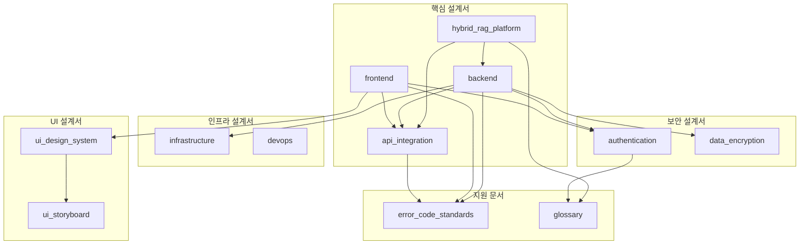

# 설계서 2차 종합 리뷰 보고서

> ⚠️ **Update Notice (2026-01-25)**: 프론트엔드 기술 스택 변경
> - MUI v5 → Tailwind CSS 3.4+ + Headless UI + Heroicons
> - 참조: [04.Tailwind_Antigravity_Stitch_도입_영향도_분석.md](../../../../docs/technical_assessment/Guides/04.Tailwind_Antigravity_Stitch_도입_영향도_분석.md)

---

## 문서 정보

| 항목 | 내용 |
|------|------|
| **문서명** | 설계서 2차 종합 리뷰 보고서 |
| **작성일** | 2026-01-16 |
| **작성자** | Claude Code (Opus 4.5) |
| **리뷰 유형** | 전체 설계서 완성도 검토 |
| **리뷰 범위** | 02_design 폴더 전체 (31개 파일) |

---

## 1. 설계서 전체 목록

### 1.1 핵심 설계서 (11개)

| # | 문서명 | 라인 수 | 주요 내용 | 완성도 |
|---|--------|--------|----------|--------|
| 1 | `hybrid_rag_platform_detailed_design.md` | 4,207 | AI/RAG 핵심, 데이터 모델, 검색 | **95%** |
| 2 | `backend_detailed_design.md` | 2,885 | SpringBoot, JPA, Service | **90%** |
| 3 | `frontend_detailed_design.md` | 2,700 | React, 상태관리, 라우팅 | **90%** |
| 4 | `api_integration_design.md` | 2,725 | External/Internal API | **95%** |
| 5 | `authentication_authorization_detailed_design.md` | 2,223 | Keycloak, JWT, RBAC | **90%** |
| 6 | `infrastructure_detailed_design.md` | 2,118 | Docker Compose, 네트워크 | **95%** |
| 7 | `data_encryption_design.md` | 2,073 | TLS, 암호화, 키관리 | **90%** |
| 8 | `devops_detailed_design.md` | 1,674 | Git, CI/CD, 빌드 | **95%** |
| 9 | `ui_design_system_guide.md` | 1,573 | 디자인 시스템, UX | **90%** |
| 10 | `error_code_standards.md` | 1,044 | 에러코드, 공통코드 | **95%** |
| 11 | `glossary.md` | 281 | 용어 정의 | **85%** |

### 1.2 UI 스토리보드 (6개)

| 문서명 | 라인 수 | 대상 화면 |
|--------|--------|----------|
| `01_login_dashboard.md` | 317 | 로그인, 대시보드 |
| `02_search.md` | 642 | 검색, 결과 |
| `03_knowledge_management.md` | 740 | 지식 CRUD |
| `04_profile_admin.md` | 786 | 프로필, 관리자 |
| `presentation.md` | 809 | 프레젠테이션용 |
| `README.md` | 85 | 목차/가이드 |

### 1.3 기술 평가 (3개)

| 문서명 | 라인 수 | 내용 |
|--------|--------|------|
| `infrastructure_k8s_reference_design.md` | 2,534 | K8s 참조 설계 (백업) |
| `01.API_architecture_design_review.md` | 450 | API 아키텍처 검토 |
| `02.TLS_certificate_implementation_review.md` | 379 | TLS 인증서 검토 |

### 1.4 리뷰 문서 (11개)

| 문서명 | 내용 |
|--------|------|
| `REVIEW_SUMMARY.md` | 리뷰 요약 |
| `2026-01-13_design_review_report.md` | 1차 설계 리뷰 |
| `2026-01-14_design_review_report.md` | 일일 리뷰 |
| `2026-01-14_detailed_code_review.md` | 코드 상세 리뷰 |
| `2026-01-16_infrastructure_change_review.md` | K8s→Docker 변경 리뷰 |
| `hybrid_rag_platform_review.md` | 플랫폼 설계 리뷰 |
| `frontend_detailed_design_review.md` | 프론트엔드 리뷰 |
| `backend_detailed_design_review.md` | 백엔드 리뷰 |
| `api_integration_design_review.md` | API 리뷰 |
| `authentication_authorization_review.md` | 인증 리뷰 |
| `data_encryption_design_review.md` | 암호화 리뷰 |

---

## 2. 설계서 커버리지 분석

### 2.1 커버리지 매트릭스

```
┌─────────────────────────────────────────────────────────────────────┐
│                     설계 영역 커버리지                               │
├────────────────────────────┬────────────────────────────────────────┤
│ 영역                       │ 커버 문서                              │
├────────────────────────────┼────────────────────────────────────────┤
│ ✅ 시스템 아키텍처          │ hybrid_rag_platform                   │
│ ✅ 데이터 모델              │ hybrid_rag_platform, backend          │
│ ✅ API 설계                 │ api_integration                       │
│ ✅ 백엔드 구현              │ backend_detailed                      │
│ ✅ 프론트엔드 구현          │ frontend_detailed                     │
│ ✅ AI/ML 서비스             │ hybrid_rag_platform                   │
│ ✅ 인증/권한                │ authentication_authorization          │
│ ✅ 보안/암호화              │ data_encryption                       │
│ ✅ 인프라/배포              │ infrastructure_detailed               │
│ ✅ DevOps/CI-CD            │ devops_detailed                       │
│ ✅ UI/UX 디자인             │ ui_design_system, ui_storyboard/*    │
│ ✅ 에러 처리                │ error_code_standards                  │
│ ⚠️ 모니터링/로깅           │ infrastructure (부분)                 │
│ ⚠️ 테스트 전략             │ 각 문서에 분산                        │
│ ⚠️ 데이터베이스 운영       │ infrastructure (부분)                 │
│ ❌ 성능/확장성              │ (미작성)                              │
│ ❌ 재해복구/DR             │ (미작성)                              │
│ ❌ 데이터 거버넌스          │ (미작성)                              │
└────────────────────────────┴────────────────────────────────────────┘

범례: ✅ 충분히 커버됨 | ⚠️ 부분적 커버 | ❌ 미커버 (신규 작성 권장)
```

### 2.2 문서 간 상호 참조 현황



---

## 3. 상세 검토 결과

### 3.1 hybrid_rag_platform_detailed_design.md (95%)

**포함된 내용:**
- [x] 시스템 아키텍처 (3-tier, LangGraph)
- [x] 데이터 모델 (PostgreSQL, ES, Neo4j)
- [x] 검색 알고리즘 (Hybrid, RRF)
- [x] 문서 파싱 (Docling)
- [x] 임베딩 (BGE-M3)
- [x] LLM 연동 (DeepSeek)
- [x] 비용 분석
- [x] 테스트 전략
- [x] 배포 가이드

**개선 권장:**
- [ ] 모델 버전 관리 전략 보완
- [ ] 청킹 전략 최적화 옵션 추가

---

### 3.2 backend_detailed_design.md (90%)

**포함된 내용:**
- [x] 아키텍처 설계 (Layered)
- [x] 모듈 구조 (Gradle Multi-module)
- [x] 패키지 구조
- [x] 도메인 모델
- [x] JPA 엔티티
- [x] Repository 설계
- [x] Service 레이어
- [x] AI Service 연동
- [x] 트랜잭션 관리
- [x] 예외 처리
- [x] 유효성 검증
- [x] 로깅/모니터링
- [x] 설정 관리
- [x] 테스트 전략

**개선 권장:**
- [ ] 캐싱 전략 상세화 (Redis 활용)
- [ ] 배치 처리 설계 추가

---

### 3.3 frontend_detailed_design.md (90%)

**포함된 내용:**
- [x] 기술 스택
- [x] 프로젝트 구조
- [x] 컴포넌트 아키텍처
- [x] 타입 정의
- [x] 상태 관리 (Zustand, TanStack Query)
- [x] 라우팅 설계
- [x] 디자인 시스템 (MUI 테마)
- [x] 폼/유효성 검증
- [x] API 통신 레이어
- [x] 에러 핸들링
- [x] 성능 최적화
- [x] 테스트 전략
- [x] 접근성/국제화

**개선 권장:**
- [ ] SSR/SSG 전략 검토 (SEO 필요시)
- [ ] PWA 지원 계획

---

### 3.4 api_integration_design.md (95%)

**포함된 내용:**
- [x] 아키텍처 개요
- [x] 공통 사항 (인증, 에러, 페이징)
- [x] External API (Frontend ↔ Backend)
- [x] Internal API (Backend ↔ AI Service)
- [x] 공통 스키마
- [x] 에러 코드 정의
- [x] 보안 고려사항
- [x] 버전 관리 전략

**우수 사항:**
- 상세한 Request/Response 명세
- OpenAPI 3.0 호환 설계

---

### 3.5 authentication_authorization_detailed_design.md (90%)

**포함된 내용:**
- [x] OAuth 2.0 Provider 선정 (Keycloak)
- [x] 인증 아키텍처
- [x] JWT 토큰 전략
- [x] Spring Security 설계
- [x] API Gateway 인증 필터
- [x] 프론트엔드 인증 플로우
- [x] 세션/로그아웃 관리
- [x] 권한 관리 (RBAC)
- [x] 에러 핸들링
- [x] 보안 체크리스트
- [x] 테스트 케이스

**개선 권장:**
- [ ] MFA(다중 인증) 설계 추가
- [ ] SSO 연동 시나리오

---

### 3.6 data_encryption_design.md (90%)

**포함된 내용:**
- [x] 데이터 분류
- [x] 암호화 아키텍처
- [x] 전송 중 암호화 (TLS)
- [x] 저장 시 암호화 (AES-256)
- [x] 키 관리 시스템 (Vault)
- [x] 구현 명세
- [x] 민감 정보 마스킹
- [x] 감사 로그
- [x] 테스트 전략
- [x] 체크리스트

**개선 권장:**
- [ ] 키 로테이션 자동화 상세
- [ ] 인증서 갱신 자동화

---

### 3.7 infrastructure_detailed_design.md (95%)

**포함된 내용:**
- [x] 시스템 아키텍처 (Docker Compose)
- [x] Docker Compose 구성 (main, prod, monitoring)
- [x] 컨테이너 설계 (Dockerfile)
- [x] 네트워크 설계
- [x] 볼륨/스토리지
- [x] 데이터베이스 인프라
- [x] 모니터링/로깅 (Prometheus, Grafana, Loki)
- [x] CI/CD 파이프라인 (GitLab CI)
- [x] 보안 설정
- [x] 백업/복구
- [x] 운영 가이드
- [x] 비용 추정

**우수 사항:**
- K8s 참조 설계 보존 (확장성)
- 상세한 운영 스크립트

---

### 3.8 devops_detailed_design.md (95%)

**포함된 내용:**
- [x] Git 브랜치 전략
- [x] Git 워크플로우 (MR, 코드리뷰)
- [x] 빌드 시스템 (Gradle, npm, Poetry)
- [x] 코드 품질 관리 (SonarQube, ESLint, Black)
- [x] 개발 환경 설정
- [x] 환경/시크릿 관리
- [x] 릴리스 관리 (SemVer, Changelog)
- [x] 개발자 온보딩 가이드
- [x] 트러블슈팅 가이드

**우수 사항:**
- 실용적인 온보딩 체크리스트
- 상세한 트러블슈팅 가이드

---

### 3.9 ui_design_system_guide.md (90%)

**포함된 내용:**
- [x] 디자인 원칙
- [x] 브랜드 아이덴티티
- [x] 색상 시스템
- [x] 타이포그래피 (한글 최적화)
- [x] 스페이싱 시스템
- [x] 아이콘 가이드라인
- [x] 컴포넌트 가이드라인
- [x] 레이아웃 패턴
- [x] 모션/애니메이션
- [x] 접근성 가이드 (WCAG 2.1)
- [x] 다크 모드
- [x] 반응형 디자인
- [x] UI 카피 가이드

**우수 사항:**
- Anti-Pattern First 접근
- 한글 타이포그래피 최적화

---

### 3.10 error_code_standards.md (95%)

**포함된 내용:**
- [x] 에러 코드 체계
- [x] 에러 코드 카탈로그
- [x] 에러 응답 표준
- [x] 공통 코드 정의
- [x] 코드 관리 방법
- [x] 모니터링 연계
- [x] 구현 가이드

**우수 사항:**
- 체계적인 에러 코드 분류
- Prometheus 메트릭 연계

---

### 3.11 glossary.md (85%)

**포함된 내용:**
- [x] 비즈니스 용어
- [x] 기술 용어
- [x] 약어 목록

**개선 권장:**
- [ ] 신규 용어 추가 (DevOps 관련)
- [ ] 용어 간 연관 관계

---

## 4. 누락 항목 분석

### 4.1 신규 문서 작성 권장 (우선순위: 높음)

| # | 문서명 (제안) | 주요 내용 | 필요성 |
|---|--------------|----------|--------|
| 1 | `performance_scalability_design.md` | 성능 목표, 부하 테스트, 캐싱, 확장 전략 | **높음** |
| 2 | `disaster_recovery_design.md` | RTO/RPO, 백업 검증, 장애 대응 | **높음** |
| 3 | `data_governance_design.md` | 데이터 보존, 개인정보, 감사 | **중간** |

### 4.2 기존 문서 보완 권장 (우선순위: 중간)

| 대상 문서 | 보완 항목 |
|----------|----------|
| `hybrid_rag_platform` | 모델 버전 관리 전략 |
| `backend_detailed` | 캐싱 전략 상세, 배치 처리 |
| `frontend_detailed` | PWA 지원, SSR 검토 |
| `authentication` | MFA, SSO 연동 |
| `data_encryption` | 키 로테이션 자동화 |
| `glossary` | DevOps/인프라 용어 추가 |

### 4.3 부분 커버된 영역 (기존 문서 내 보완)

```
┌─────────────────────────────────────────────────────────────────────┐
│                     부분 커버 영역 상세                              │
├─────────────────────────────┬───────────────────────────────────────┤
│ 영역                        │ 현황 및 보완 방향                      │
├─────────────────────────────┼───────────────────────────────────────┤
│ 모니터링/로깅              │ infrastructure에 기본 설정 있음        │
│                             │ → 대시보드 상세, 알림 임계값 추가      │
├─────────────────────────────┼───────────────────────────────────────┤
│ 테스트 전략                 │ 각 설계서에 분산되어 있음              │
│                             │ → 통합 테스트 계획서 작성 고려         │
├─────────────────────────────┼───────────────────────────────────────┤
│ 데이터베이스 운영           │ infrastructure에 백업 스크립트 있음    │
│                             │ → 스키마 마이그레이션 절차 상세화      │
└─────────────────────────────┴───────────────────────────────────────┘
```

---

## 5. 문서 품질 평가

### 5.1 문서 구조 일관성

| 항목 | 평가 | 비고 |
|------|------|------|
| 문서 헤더 (제목, 버전, 작성자) | **양호** | 대부분 표준 형식 |
| 목차 구성 | **양호** | 번호 체계 일관 |
| 섹션 구분 | **양호** | 수평선 활용 |
| 코드 블록 | **양호** | 언어 지정 |
| 다이어그램 | **양호** | Mermaid 활용 |
| 상호 참조 | **보통** | 일부 문서 참조 누락 |

### 5.2 기술적 완성도

| 항목 | 평가 | 비고 |
|------|------|------|
| 아키텍처 설계 | **우수** | 상세한 시스템 구성도 |
| 구현 명세 | **우수** | 코드 예시 풍부 |
| 설정 샘플 | **우수** | 환경별 설정 포함 |
| 테스트 가이드 | **양호** | 각 문서에 포함 |
| 운영 가이드 | **양호** | 인프라/DevOps에 집중 |

### 5.3 실용성 평가

| 항목 | 평가 | 비고 |
|------|------|------|
| 개발자 사용성 | **우수** | 바로 구현 가능한 수준 |
| 온보딩 지원 | **우수** | DevOps에 상세 가이드 |
| 유지보수성 | **양호** | 변경 이력 관리 |
| 검색 용이성 | **양호** | 용어집 활용 |

---

## 6. 문서 간 의존성 매핑

### 6.1 참조 관계 현황

| 문서 | 참조하는 문서 | 참조되는 문서 |
|------|-------------|-------------|
| `hybrid_rag_platform` | - | backend, api |
| `backend` | hybrid, api, auth, enc, infra, err | frontend |
| `frontend` | api, auth, ui_design, err | - |
| `api_integration` | err, glossary | backend, frontend |
| `authentication` | glossary | backend, frontend |
| `data_encryption` | - | backend |
| `infrastructure` | - | backend, devops |
| `devops` | infra | - |
| `ui_design_system` | - | frontend, storyboard |
| `error_code_standards` | glossary | backend, frontend, api |
| `glossary` | - | 전체 |

### 6.2 순환 참조 검토

```
✅ 순환 참조 없음

참조 방향:
Core → Support → Implementation

hybrid_rag_platform (Core)
    ↓
backend, api_integration (Implementation)
    ↓
error_code_standards, glossary (Support)
```

---

## 7. 권장 조치 사항

### 7.1 즉시 조치 (High Priority)

| # | 조치 | 대상 | 예상 공수 |
|---|------|------|----------|
| 1 | 성능/확장성 설계서 신규 작성 | 신규 문서 | 1일 |
| 2 | 재해복구 설계서 신규 작성 | 신규 문서 | 0.5일 |
| 3 | 용어집 업데이트 | glossary.md | 0.5일 |

### 7.2 단기 조치 (Medium Priority)

| # | 조치 | 대상 | 예상 공수 |
|---|------|------|----------|
| 4 | 캐싱 전략 상세화 | backend_detailed | 0.5일 |
| 5 | MFA 설계 추가 | authentication | 0.5일 |
| 6 | 모델 버전 관리 추가 | hybrid_rag_platform | 0.5일 |

### 7.3 장기 조치 (Low Priority)

| # | 조치 | 대상 | 예상 공수 |
|---|------|------|----------|
| 7 | 데이터 거버넌스 설계서 | 신규 문서 | 1일 |
| 8 | 통합 테스트 계획서 | 신규 문서 | 0.5일 |
| 9 | PWA 설계 추가 | frontend_detailed | 0.5일 |

---

## 8. 종합 평가

### 8.1 전체 완성도

```
┌─────────────────────────────────────────────────────────────────────┐
│                        전체 설계서 완성도                            │
├─────────────────────────────────────────────────────────────────────┤
│                                                                     │
│   완성도: ████████████████████░░░░  85%                             │
│                                                                     │
│   ✅ 강점                                                           │
│   ├── 핵심 시스템 설계 완료 (AI/RAG, Backend, Frontend)            │
│   ├── 보안 설계 충실 (인증, 암호화)                                 │
│   ├── 인프라/DevOps 설계 실용적                                     │
│   └── UI/UX 디자인 시스템 체계적                                    │
│                                                                     │
│   ⚠️ 보완 필요                                                      │
│   ├── 성능/확장성 설계 문서 부재                                    │
│   ├── 재해복구 계획 부재                                            │
│   └── 일부 상세 내용 분산 (테스트 전략)                             │
│                                                                     │
└─────────────────────────────────────────────────────────────────────┘
```

### 8.2 MVP 개발 준비 상태

```
┌─────────────────────────────────────────────────────────────────────┐
│                     MVP 개발 준비 상태                               │
├─────────────────────────────────────────────────────────────────────┤
│                                                                     │
│   준비 상태: ████████████████████████  95%                          │
│                                                                     │
│   ✅ 개발 착수 가능한 영역                                          │
│   ├── AI/RAG 서비스 구현                                            │
│   ├── Backend API 개발                                              │
│   ├── Frontend 화면 개발                                            │
│   ├── 인프라 구축 (Docker Compose)                                  │
│   ├── 인증/보안 적용                                                │
│   └── CI/CD 파이프라인 구축                                         │
│                                                                     │
│   ⏳ 개발 중 보완 가능한 영역                                       │
│   ├── 성능 최적화 (런타임 측정 후)                                  │
│   └── 모니터링 대시보드 (운영 시작 후)                              │
│                                                                     │
└─────────────────────────────────────────────────────────────────────┘
```

### 8.3 최종 권고

```
┌─────────────────────────────────────────────────────────────────────┐
│                         최종 권고사항                                │
├─────────────────────────────────────────────────────────────────────┤
│                                                                     │
│   1. MVP 개발 착수 권장                                             │
│      └─ 현재 설계서로 충분히 개발 가능                              │
│                                                                     │
│   2. 성능 설계서 병행 작성                                          │
│      └─ 개발 초기 단계에서 함께 진행                                │
│                                                                     │
│   3. 재해복구 계획은 운영 전 완료                                   │
│      └─ 스테이징 배포 시점까지                                      │
│                                                                     │
│   4. 설계서 유지보수 프로세스 수립                                  │
│      └─ 구현 중 발견 사항 반영 체계                                 │
│                                                                     │
└─────────────────────────────────────────────────────────────────────┘
```

---

## 9. 부록: 설계서 전체 구조도

```
knowledge_service/docs/02_design/
│
├── [핵심 설계서 - 11개]
│   ├── hybrid_rag_platform_detailed_design.md    ← AI/RAG 핵심
│   ├── backend_detailed_design.md                ← SpringBoot
│   ├── frontend_detailed_design.md               ← React
│   ├── api_integration_design.md                 ← API 명세
│   ├── authentication_authorization_detailed_design.md  ← 인증
│   ├── data_encryption_design.md                 ← 보안
│   ├── infrastructure_detailed_design.md         ← 인프라
│   ├── devops_detailed_design.md                 ← CI/CD
│   ├── ui_design_system_guide.md                 ← UI/UX
│   ├── error_code_standards.md                   ← 에러코드
│   └── glossary.md                               ← 용어집
│
├── ui_storyboard/                                ← UI 와이어프레임
│   ├── 01_login_dashboard.md
│   ├── 02_search.md
│   ├── 03_knowledge_management.md
│   ├── 04_profile_admin.md
│   ├── presentation.md
│   └── README.md
│
├── technical_assessment/                         ← 기술 검토
│   ├── infrastructure_k8s_reference_design.md    ← K8s 백업
│   ├── 01.API_architecture_design_review.md
│   └── 02.TLS_certificate_implementation_review.md
│
├── review/                                       ← 리뷰 문서
│   ├── REVIEW_SUMMARY.md
│   ├── 2026-01-13_design_review_report.md
│   ├── 2026-01-14_design_review_report.md
│   ├── 2026-01-14_detailed_code_review.md
│   ├── 2026-01-16_infrastructure_change_review.md
│   ├── 2026-01-16_design_2nd_review.md           ← 본 문서
│   ├── hybrid_rag_platform_review.md
│   ├── frontend_detailed_design_review.md
│   ├── backend_detailed_design_review.md
│   ├── api_integration_design_review.md
│   ├── authentication_authorization_review.md
│   └── data_encryption_design_review.md
│
└── diagrams/                                     ← 이미지 자료
```

---

## 변경 이력

| 버전 | 일자 | 작성자 | 변경 내용 |
|------|------|--------|----------|
| 1.0 | 2026-01-16 | Claude Code | 2차 종합 리뷰 작성 |
