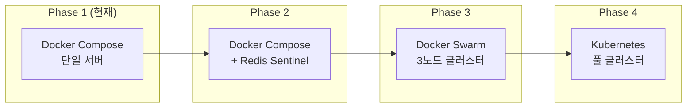

# 인프라 설계서 변경 검토 보고서

| 항목 | 내용 |
|------|------|
| **문서명** | 인프라 설계 변경 검토 보고서 |
| **작성일** | 2026-01-16 |
| **작성자** | Claude AI |
| **검토 유형** | 아키텍처 변경 영향도 분석 |

---

## 1. 변경 개요

### 1.1 변경 사유

| 항목 | 변경 전 | 변경 후 |
|------|---------|---------|
| **배포 플랫폼** | Kubernetes (K8s) | Docker Compose |
| **서버 규모** | 13대 (클러스터) | 1~2대 (단일/이중화) |
| **운영 복잡도** | 높음 | 낮음 |
| **예상 비용** | ~$100,000 | ~$14,000 |

### 1.2 변경 결정 근거

1. **프로젝트 초기 단계**: 대규모 트래픽 예상 어려움
2. **운영 인력 제약**: K8s 전문 인력 부재
3. **비용 효율성**: 초기 인프라 비용 86% 절감
4. **확장성 유지**: Docker Compose → K8s 마이그레이션 경로 확보

---

## 2. 파일 변경 내역

### 2.1 주요 변경 파일

| 파일 | 변경 유형 | 설명 |
|------|-----------|------|
| `infrastructure_detailed_design.md` | **전면 재작성** | K8s → Docker Compose 기반 |
| `technical_assessment/infrastructure_k8s_reference_design.md` | **신규 (백업)** | 기존 K8s 설계서 보관 |

### 2.2 infrastructure_detailed_design.md 변경 상세

#### 삭제된 K8s 관련 섹션
- Kubernetes Deployment YAML
- HorizontalPodAutoscaler (HPA) 설정
- Ingress Controller 설정
- NetworkPolicy 정의
- Helm Chart 구조
- ArgoCD GitOps 설정
- Pod Security Policy
- K8s Service/Secret 리소스

#### 추가된 Docker Compose 섹션
- Docker Compose 파일 구조 (main, prod, monitoring)
- Nginx 리버스 프록시 설정
- Docker Network 구성 (4개 네트워크)
- Docker Volume 관리
- Container 리소스 할당 (deploy.resources)
- Health Check 설정
- GitLab CI/CD (SSH 기반 배포)
- systemd 서비스 등록
- 백업/복구 스크립트

---

## 3. 타 설계서 영향도 분석

### 3.1 영향도 요약

| 문서 | K8s 참조 | 영향도 | 조치 상태 |
|------|---------|--------|----------|
| `data_encryption_design.md` | Vault K8s 인증 | **중간** | 주석 추가 권장 |
| `glossary.md` | K8s 용어 정의 | 없음 | 유지 |
| `hybrid_rag_platform_detailed_design.md` | Docker Compose 배포 | 없음 | 조치 불필요 |
| `authentication_authorization_detailed_design.md` | Docker 지원 | 없음 | 조치 불필요 |
| `backend_detailed_design.md` | Docker Compose | 없음 | 조치 불필요 |
| `frontend_detailed_design.md` | 없음 | 없음 | 조치 불필요 |
| `api_integration_design.md` | 없음 | 없음 | 조치 불필요 |

### 3.2 상세 분석

#### 3.2.1 data_encryption_design.md

**K8s 참조 위치**: 라인 1007-1094

```yaml
# Vault 설정에 Kubernetes 인증 옵션 포함
vault:
  authentication: KUBERNETES  # 또는 TOKEN, APPROLE
  kubernetes:
    role: knowledge-platform
    kubernetes-path: kubernetes
```

```python
# Python 코드에 K8s 인증 로직 포함
if os.path.exists("/var/run/secrets/kubernetes.io/serviceaccount/token"):
    with open("/var/run/secrets/kubernetes.io/serviceaccount/token") as f:
        jwt = f.read()
    self.client.auth.kubernetes.login(...)
```

**영향도 평가**:
- 현재 코드는 K8s/Token/AppRole 중 선택 가능하도록 설계됨
- Docker Compose 환경에서는 `TOKEN` 또는 `APPROLE` 인증 사용
- K8s 코드 경로는 자동으로 비활성화됨 (조건문으로 처리)
- **조치**: 주석으로 Docker Compose 환경 권장 인증 방식 명시 권장

#### 3.2.2 glossary.md

**K8s 참조 위치**: 라인 195

```markdown
| K8s | Kubernetes | 쿠버네티스 |
```

**영향도 평가**:
- 용어집의 참조용 정의이므로 유지
- 향후 K8s 마이그레이션 시 참조 가능
- **조치**: 조치 불필요

#### 3.2.3 hybrid_rag_platform_detailed_design.md

**배포 섹션 (라인 4017+)**: 이미 Docker Compose 기반

```yaml
# docker-compose.yml
services:
  knowledge-postgresql:
    container_name: knowledge-postgresql
    ...
```

**영향도 평가**:
- 이미 Docker Compose 기반 배포 설계
- 인프라 설계서와 일관성 유지됨
- **조치**: 조치 불필요

#### 3.2.4 backend_detailed_design.md

**관련 내용 (라인 83)**:
```markdown
| **Spring Cloud Eureka** | ❌ | Docker Compose 서비스명 사용 |
```

**영향도 평가**:
- Docker Compose 서비스 디스커버리 사용 명시
- K8s 의존성 없음
- **조치**: 조치 불필요

#### 3.2.5 UI Storyboard 파일들

**참조 위치**:
- `02_search.md:323` - 검색 필터 예시 "Kubernetes"
- `03_knowledge_management.md:375` - 카테고리 예시 "Kubernetes"

**영향도 평가**:
- 단순 콘텐츠 예시 (기술 키워드로서 K8s 언급)
- 실제 인프라와 무관
- **조치**: 조치 불필요

---

## 4. 권장 조치 사항

### 4.1 필수 조치

| 우선순위 | 항목 | 상태 |
|----------|------|------|
| 1 | K8s 설계서 백업 (technical_assessment) | ✅ 완료 |
| 2 | Docker Compose 인프라 설계서 작성 | ✅ 완료 |
| 3 | 영향도 검토 문서 작성 | ✅ 완료 |

### 4.2 권장 조치 (선택)

| 우선순위 | 항목 | 상태 |
|----------|------|------|
| 1 | data_encryption_design.md Vault 인증 주석 보강 | 선택 |
| 2 | 인프라 설계서 PDF 버전 생성 | 선택 |

---

## 5. 변경 전후 아키텍처 비교

### 5.1 K8s 기반 (변경 전)

```
┌─────────────────────────────────────────────────────────────┐
│                    Kubernetes Cluster                        │
├─────────────────────────────────────────────────────────────┤
│  Master Nodes (3) ──► Control Plane                         │
│  Worker Nodes (5) ──► Application Pods                      │
│  Storage Nodes (2) ──► Persistent Storage                   │
│  DB Nodes (3) ──► PostgreSQL, ES, Neo4j                     │
├─────────────────────────────────────────────────────────────┤
│  ▸ Ingress Controller (NGINX)                               │
│  ▸ Service Mesh (Istio)                                     │
│  ▸ Helm/ArgoCD (GitOps)                                     │
│  ▸ HPA (Auto Scaling)                                       │
└─────────────────────────────────────────────────────────────┘
총 서버: 13대 | 예상 비용: ~$100,000
```

### 5.2 Docker Compose 기반 (변경 후)

```
┌─────────────────────────────────────────────────────────────┐
│                    Single Docker Host                        │
├─────────────────────────────────────────────────────────────┤
│  ┌─────────┐  ┌─────────┐  ┌─────────┐  ┌─────────┐        │
│  │  nginx  │  │frontend │  │ backend │  │ai-service│        │
│  └────┬────┘  └────┬────┘  └────┬────┘  └────┬────┘        │
│       │            │            │            │              │
│  ─────┴────────────┴────────────┴────────────┴─────        │
│                    Docker Networks                          │
│  ─────┬────────────┬────────────┬────────────┬─────        │
│       │            │            │            │              │
│  ┌────┴────┐  ┌────┴────┐  ┌────┴────┐  ┌────┴────┐        │
│  │postgres │  │elastic  │  │  neo4j  │  │  redis  │        │
│  └─────────┘  └─────────┘  └─────────┘  └─────────┘        │
├─────────────────────────────────────────────────────────────┤
│  ▸ Nginx Reverse Proxy                                      │
│  ▸ Docker Compose v2                                        │
│  ▸ GitLab CI/CD (SSH Deploy)                                │
│  ▸ Manual Scaling (docker compose scale)                    │
└─────────────────────────────────────────────────────────────┘
총 서버: 1~2대 | 예상 비용: ~$14,000
```

---

## 6. 마이그레이션 경로

향후 트래픽 증가 시 K8s로의 마이그레이션 경로:



### 마이그레이션 트리거 조건

| 지표 | Phase 2 전환 | Phase 3 전환 | Phase 4 전환 |
|------|-------------|-------------|-------------|
| 동시 사용자 | 100+ | 500+ | 1,000+ |
| 일일 요청 수 | 10,000+ | 50,000+ | 200,000+ |
| 데이터 볼륨 | 100GB+ | 500GB+ | 1TB+ |
| 가용성 요구 | 99.5% | 99.9% | 99.99% |

---

## 7. 결론

### 7.1 변경 완료 사항

1. ✅ 기존 K8s 기반 인프라 설계서를 `technical_assessment` 폴더에 백업
2. ✅ Docker Compose 기반 인프라 상세 설계서 전면 재작성
3. ✅ 타 설계서 K8s 참조 영향도 분석 완료

### 7.2 영향도 평가 요약

- **직접적 영향**: 없음 (모든 설계서가 Docker Compose 호환)
- **간접적 영향**: `data_encryption_design.md`의 Vault K8s 인증 코드 (비활성 경로)
- **조치 필요**: 없음 (기존 설계서들이 이미 Docker Compose 기반)

### 7.3 향후 고려사항

- K8s 참조 설계서는 향후 확장 시 활용 가능하도록 보관
- 트래픽 증가 시 마이그레이션 경로 참조
- 연간 인프라 검토 시 확장 필요성 재평가

---

## 8. 관련 문서

| 문서 | 경로 |
|------|------|
| Docker Compose 인프라 설계서 | [infrastructure_detailed_design.md](../infrastructure_detailed_design.md) |
| K8s 참조 설계서 (백업) | [technical_assessment/infrastructure_k8s_reference_design.md](../technical_assessment/infrastructure_k8s_reference_design.md) |
| 플랫폼 상세 설계서 | [hybrid_rag_platform_detailed_design.md](../hybrid_rag_platform_detailed_design.md) |
| 백엔드 상세 설계서 | [backend_detailed_design.md](../backend_detailed_design.md) |
| 데이터 암호화 설계서 | [data_encryption_design.md](../data_encryption_design.md) |
