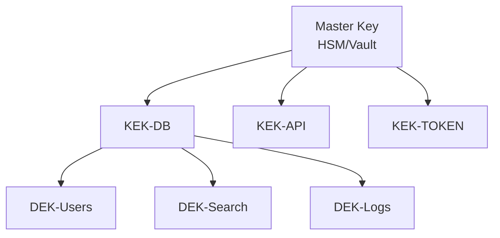

# Data Agent 설계서 검토 결과서

---

## 문서 정보

| 항목 | 내용 |
|------|------|
| **검토 대상** | data_encryption_design.md, glossary.md |
| **검토일** | 2026-01-22 |
| **검토자** | Data Agent (Claude AI) |
| **검토 관점** | 데이터 모델 적절성, 암호화 설계, 용어 정의 정확성 |
| **결과** | 적합 (경미한 개선 사항 존재) |

---

## 1. 검토 요약

### 1.1 총평

| 문서 | 점수 | 판정 |
|------|------|------|
| data_encryption_design.md | 9.0/10 | 우수 |
| glossary.md | 9.2/10 | 우수 |
| **종합** | **9.1/10** | **적합** |

### 1.2 검토 범위

- 데이터 모델 적절성 (PostgreSQL, Neo4j, Elasticsearch)
- 암호화 설계 검토
- 용어 정의 정확성
- 문서 간 일관성 검증

---

## 2. data_encryption_design.md 검토

### 2.1 우수 사항

#### 2.1.1 데이터 분류 체계

```
Level 4 (극비): 암호화 키, 인증 토큰 서명 키, 마스터 비밀번호
Level 3 (비밀): 비밀번호 해시, API 키, Refresh Token
Level 2 (대외비): 개인정보, 검색 쿼리 기록, 문서 접근 기록
Level 1 (일반): 문서 메타데이터, 시스템 로그, 성능 지표
```

- 4단계 분류 체계가 명확하고 적절함
- 각 분류별 암호화 방식 및 보존 기간이 구체적임

#### 2.1.2 3개 데이터베이스별 암호화 전략

| DB | 암호화 방식 | 평가 |
|----|------------|------|
| **PostgreSQL** | TDE + 필드 레벨 암호화 (pgcrypto) | 적절함 |
| **Elasticsearch** | 클러스터 레벨 TDE + 민감 필드 암호화 | 적절함 |
| **Neo4j** | TLS 전송 암호화 + 노드 속성 암호화 | 적절함 |

#### 2.1.3 키 관리 계층 구조



- Master Key -> KEK -> DEK 3단계 구조 우수
- Vault 연동으로 키 관리 자동화 가능

### 2.2 개선 필요 사항

#### 2.2.1 [경미] Neo4j 암호화 상세 누락

**현재 상태**: Neo4j 암호화가 TLS 연결 암호화 위주로 기술됨

**문제점**:
- Neo4j Property 암호화 구현 세부 사항 부족
- 애플리케이션 레벨 암호화 vs DB 레벨 암호화 선택 기준 불명확

**권고안**:
```python
# Neo4j 속성 암호화 구현 예시 추가 필요
from app.services.encryption_service import get_encryption_service

class SecureNeo4jService:
    def create_user_node(self, user_data: dict) -> str:
        enc = get_encryption_service()

        cypher = """
        CREATE (u:User {
            userId: $user_id,
            email: $email_encrypted,  // 암호화된 값
            name: $name_encrypted     // 암호화된 값
        })
        RETURN u.userId
        """

        params = {
            "user_id": user_data["user_id"],
            "email_encrypted": enc.encrypt(user_data["email"]),
            "name_encrypted": enc.encrypt(user_data["name"])
        }

        return self.driver.execute_query(cypher, params)
```

#### 2.2.2 [경미] Elasticsearch 벡터 임베딩 암호화 미언급

**현재 상태**: Elasticsearch 민감 필드 암호화만 기술됨

**문제점**:
- 벡터 임베딩(Dense/Sparse Vector)은 텍스트 복원 가능성 존재
- 임베딩 암호화 여부 결정 필요

**권고안**:
```yaml
# 벡터 임베딩 보안 정책 추가 필요
vector_security_policy:
  dense_embedding:
    encryption: false  # 검색 성능 고려
    access_control: RBAC 기반
    note: "임베딩만으로 원문 복원 불가, 검색 기능 우선"
  sparse_embedding:
    encryption: false
    access_control: RBAC 기반
  sensitive_fields:
    encryption: true
    algorithm: AES-256-GCM
```

#### 2.2.3 [경미] Redis 암호화 전략 누락

**현재 상태**: Redis에 저장되는 Refresh Token 암호화 언급만 있음

**문제점**:
- Redis Cache 전체 암호화 전략 부재
- Session 데이터 암호화 여부 불명확

**권고안**:
```yaml
# Redis 암호화 전략 추가 필요
redis_encryption:
  transport:
    tls_enabled: true
    min_version: TLSv1.3
  at_rest:
    mode: "application_level"  # Redis 자체 TDE 대신
    target_keys:
      - "session:*"
      - "refresh_token:*"
      - "user_cache:*"
    excluded_keys:
      - "rate_limit:*"  # 성능 우선
      - "metrics:*"
```

#### 2.2.4 [보통] 키 교체 시 데이터 재암호화 상세화

**현재 상태**: 키 교체 정책은 명시되어 있으나 재암호화 절차가 간략함

**문제점**:
- 대용량 데이터 재암호화 시 서비스 영향도 분석 부재
- 롤링 재암호화 vs 일괄 재암호화 전략 미명시

**권고안**:
```yaml
# 키 교체 시 재암호화 전략 추가
key_rotation_strategy:
  approach: "rolling"  # 서비스 중단 없이 순차 처리
  batch_size: 1000     # 1000건씩 처리
  interval_ms: 100     # 배치 간 100ms 대기
  service_impact:
    expected_overhead: "< 5%"
    peak_hours_avoid: true
  fallback:
    on_failure: "pause_and_alert"
    retry_count: 3
```

### 2.3 데이터 모델 일관성 검증

#### PostgreSQL 스키마 검증

| 테이블 | 암호화 대상 필드 | 설계서 일치 | 비고 |
|--------|----------------|------------|------|
| users | email, name | 일치 | 필드 암호화 + 해시 인덱스 |
| api_keys | key_hash | 일치 | SHA-256 해시 |
| search_history | query_text | 일치 | 필드 암호화 |
| document_access_logs | ip_address | 일치 | 마스킹 적용 |

#### Neo4j 스키마 검증

| 노드/관계 | 암호화 대상 속성 | 설계서 일치 | 비고 |
|----------|----------------|------------|------|
| :User | email, name | 일치 | 애플리케이션 레벨 암호화 |
| :ACCESSED_BY | - | 해당없음 | 민감 정보 없음 |

#### Elasticsearch 매핑 검증

| 인덱스 | 암호화 대상 필드 | 설계서 일치 | 비고 |
|--------|----------------|------------|------|
| documents | uploaded_by_email | 일치 | 암호화 + 해시 |
| search_logs | user_id, query | 일치 | 암호화 필요 |

---

## 3. glossary.md 검토

### 3.1 우수 사항

#### 3.1.1 체계적인 용어 분류

- 11개 섹션으로 체계적 분류
- 도메인, 기술, 아키텍처, RAG 평가, DevOps, 보안, Observability, 프론트엔드 포괄

#### 3.1.2 보안/암호화 용어 충실

| 카테고리 | 용어 수 | 평가 |
|----------|--------|------|
| 인증/인가 | 22개 | 매우 충실 |
| 암호화 | 20개 | 매우 충실 |
| 보안 취약점 | 5개 | 적절 |

#### 3.1.3 프로젝트 특화 용어 정의

- VIP 파이프라인, 제로 조인, 슬림 그래프 등 프로젝트 고유 개념 정의 완료
- Gleaning, max_gleanings 등 최신 기법 포함

### 3.2 개선 필요 사항

#### 3.2.1 [경미] 누락된 데이터 관련 용어

**추가 필요 용어**:

| 용어 (한글) | 용어 (영문) | 정의 | 관련 기술 |
|-------------|-------------|------|-----------|
| 고아 노드 | Orphan Node | 다른 노드와 연결이 없는 그래프 노드 | Neo4j |
| 데이터 정합성 | Data Consistency | 여러 저장소 간 데이터 일치 상태 | PostgreSQL, Neo4j, ES |
| 듀얼 라이트 | Dual Write | 두 저장소에 동시 기록하는 패턴 | 동기화 전략 |
| 배치 임베딩 | Batch Embedding | 다수 텍스트를 일괄 벡터화 | BGE-M3 |
| 청크 오버랩 | Chunk Overlap | 인접 청크 간 중복 영역 | HybridChunker |

#### 3.2.2 [경미] 암호화 용어 추가 필요

**추가 필요 용어**:

| 용어 (한글) | 용어 (영문) | 정의 | 관련 기술 |
|-------------|-------------|------|-----------|
| 필드 암호화 | Field-Level Encryption | 특정 필드만 선택적 암호화 | PostgreSQL, Neo4j |
| 암호화 인덱스 | Encrypted Index | 암호화된 데이터 검색용 해시 인덱스 | email_hash |
| 키 에스크로 | Key Escrow | 암호화 키 복구를 위한 제3자 보관 | Vault |

#### 3.2.3 [경미] 약어 섹션 보완

**추가 필요 약어**:

| 약어 | 전체 표현 | 한글 설명 |
|------|-----------|-----------|
| AEAD | Authenticated Encryption with Associated Data | 인증 암호화 |
| IV | Initialization Vector | 초기화 벡터 |
| nonce | Number used Once | 일회용 난수 |
| PII | Personally Identifiable Information | 개인 식별 정보 |

### 3.3 문서 간 용어 일관성 검증

#### data_encryption_design.md와 glossary.md 비교

| 암호화 설계서 용어 | 용어사전 존재 | 일치 여부 |
|-------------------|--------------|----------|
| AES-256-GCM | 있음 (AES-GCM) | 일치 |
| TDE | 있음 | 일치 |
| KEK | 있음 | 일치 |
| DEK | 있음 | 일치 |
| HSM | 있음 | 일치 |
| Vault | 있음 | 일치 |
| bcrypt | 없음 | **추가 필요** |
| Argon2id | 없음 | **추가 필요** |
| pgcrypto | 없음 | **추가 필요** |

---

## 4. 데이터 모델 적절성 종합 평가

### 4.1 PostgreSQL (SSOT)

| 항목 | 평가 | 비고 |
|------|------|------|
| 스키마 설계 | 우수 | 정규화 적절, 인덱스 전략 명확 |
| 암호화 전략 | 우수 | TDE + 필드 암호화 이중 보호 |
| 검색 지원 | 우수 | 해시 인덱스로 암호화 필드 검색 가능 |

### 4.2 Neo4j (Knowledge Graph)

| 항목 | 평가 | 비고 |
|------|------|------|
| 노드/관계 설계 | 우수 | Slim Graph 전략 적절 |
| 암호화 전략 | 보통 | 애플리케이션 레벨 암호화 구현 상세 필요 |
| 고아 노드 관리 | 언급 없음 | 정기 정리 정책 추가 필요 |

### 4.3 Elasticsearch (Vector Index)

| 항목 | 평가 | 비고 |
|------|------|------|
| 매핑 설계 | 우수 | 비정규화로 제로 조인 달성 |
| 암호화 전략 | 우수 | 민감 필드 암호화 + 해시 |
| 벡터 보안 | 보통 | 임베딩 보안 정책 명시 필요 |

---

## 5. 권고 사항 요약

### 5.1 우선순위별 개선 항목

| 우선순위 | 대상 문서 | 항목 | 설명 |
|----------|----------|------|------|
| 중간 | data_encryption | Neo4j 암호화 상세화 | 애플리케이션 레벨 구현 예시 추가 |
| 중간 | data_encryption | Redis 암호화 전략 | 캐시 데이터 암호화 정책 추가 |
| 중간 | data_encryption | 키 교체 절차 상세화 | 롤링 재암호화 전략 명시 |
| 낮음 | data_encryption | 벡터 임베딩 보안 | 임베딩 데이터 보안 정책 명시 |
| 낮음 | glossary | 누락 용어 추가 | 고아 노드, 배치 임베딩 등 |
| 낮음 | glossary | 암호화 용어 보완 | bcrypt, Argon2id, pgcrypto |

### 5.2 즉시 반영 권고 (Critical 없음)

현재 설계서들은 모두 구현 진행 가능한 수준입니다.

---

## 6. 결론

### 6.1 적합성 판정: **적합**

두 설계서 모두 높은 수준의 완성도를 보이며, 데이터 보안 및 용어 정의 측면에서 프로젝트 요구사항을 충족합니다.

### 6.2 강점

1. **다층 암호화 전략**: 전송/저장/키관리 전 계층 보호
2. **3개 DB 통합 전략**: PostgreSQL, Neo4j, Elasticsearch 일관된 암호화 적용
3. **체계적 용어 관리**: 11개 카테고리 300개+ 용어 정의
4. **산업 표준 준수**: NIST, KISA 가이드라인 준수

### 6.3 Data Agent 의견

암호화 설계서와 용어사전은 전반적으로 우수합니다. 특히:
- 데이터 분류 체계(4단계)가 명확하여 구현 시 혼란 없음
- 키 관리 계층 구조가 보안 모범 사례 준수
- 용어사전이 프로젝트 특화 용어까지 포괄

경미한 개선 사항들은 구현 단계에서 점진적으로 보완 가능합니다.

---

**검토 완료**: 2026-01-22
**검토자**: Data Agent
**다음 검토**: 구현 완료 후 데이터 품질 검증

---

## 부록: 검토 체크리스트

### A. 암호화 설계서 검토 체크리스트

- [x] 데이터 분류 체계 적절성
- [x] 암호화 알고리즘 선택 적절성
- [x] 키 관리 전략 적절성
- [x] 전송 암호화 (TLS/mTLS) 설정
- [x] 저장 암호화 (TDE/필드 암호화) 설정
- [x] PostgreSQL 암호화 구현 상세
- [x] Elasticsearch 암호화 구현 상세
- [ ] Neo4j 암호화 구현 상세 (보완 필요)
- [ ] Redis 암호화 구현 상세 (추가 필요)
- [x] 마스킹 규칙 정의
- [x] 감사 로그 설계
- [x] 테스트 전략

### B. 용어사전 검토 체크리스트

- [x] 도메인 용어 정의 완성도
- [x] 기술 용어 정의 정확성
- [x] 아키텍처 용어 정의 일관성
- [x] 보안 용어 정의 충실도
- [x] 약어 목록 완성도
- [x] 문서 간 용어 일관성
- [ ] 누락 용어 보완 (경미)
