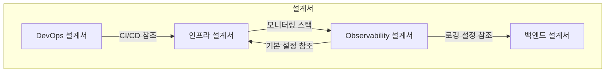

# DevOps/Observability 설계서 검토 보고서

---

## 문서 정보

| 항목 | 내용 |
|------|------|
| **검토일** | 2026-01-22 |
| **검토자** | DevOps Agent (Claude Opus 4.5) |
| **검토 대상** | devops_detailed_design.md, observability_detailed_design.md, infrastructure_detailed_design.md |
| **검토 상태** | 완료 |

---

## 1. 검토 개요

### 1.1 검토 범위

| 설계서 | 버전 | 주요 검토 항목 |
|--------|------|----------------|
| DevOps 상세 설계서 | 1.0 | Git 전략, 빌드 시스템, 코드 품질, 릴리스 관리 |
| Observability 상세 설계서 | 1.1 | Three Pillars, 분산 트레이싱, SLA 모니터링 |
| 인프라 상세 설계서 | 2.1 | Docker Compose, CI/CD 파이프라인 |

### 1.2 검토 결과 요약

| 항목 | 상태 | 설명 |
|------|------|------|
| **전체 평가** | 양호 | 설계 완성도 높음, 일부 불일치 수정 필요 |
| **Critical 이슈** | 0건 | - |
| **Major 이슈** | 3건 | CI/CD 도구 불일치, 컨테이너 수 불일치 등 |
| **Minor 이슈** | 5건 | 문서 간 참조 누락, 세부 설정 보완 필요 |
| **개선 제안** | 4건 | GitHub Actions 예시 추가, 보안 강화 등 |

---

## 2. CI/CD 파이프라인 검토

### 2.1 불일치 사항 (Major)

#### 이슈 1: CI/CD 도구 불일치

| 문서 | 명시된 도구 | 비고 |
|------|------------|------|
| CLAUDE.md | GitHub Actions | 프로젝트 표준 |
| DevOps 설계서 | GitLab CI/CD | 섹션 1.2, 섹션 2.4 |
| 인프라 설계서 | GitLab CI/CD | 섹션 9 |

**문제점**:
- CLAUDE.md에서 GitHub Actions를 프로젝트 CI/CD 도구로 정의
- DevOps 설계서와 인프라 설계서는 GitLab CI/CD 기준으로 작성됨
- 개발자 혼란 유발 가능

**권장 조치**:
```markdown
# 방안 1: GitHub Actions로 통일 (권장)
- DevOps 설계서 섹션 1.2, 1.3의 GitLab 참조를 GitHub으로 변경
- 인프라 설계서 섹션 9를 GitHub Actions로 재작성

# 방안 2: 병행 지원 명시
- 두 도구 모두 지원한다고 명시
- 환경별 사용 도구 구분 (개발: GitHub, 엔터프라이즈: GitLab)
```

#### 이슈 2: GitHub Actions 워크플로우 누락

DevOps 설계서에 GitHub Actions 워크플로우 예시가 없음.

**권장 조치**: 아래 워크플로우 예시 추가

```yaml
# .github/workflows/ci.yml (추가 권장)
name: CI/CD Pipeline

on:
  push:
    branches: [main, develop]
  pull_request:
    branches: [main]

jobs:
  build-and-test:
    runs-on: ubuntu-latest
    steps:
      - uses: actions/checkout@v4

      - name: Set up JDK 21
        uses: actions/setup-java@v4
        with:
          java-version: '21'
          distribution: 'temurin'
          cache: 'gradle'

      - name: Set up Node.js
        uses: actions/setup-node@v4
        with:
          node-version: '20'
          cache: 'npm'
          cache-dependency-path: frontend/package-lock.json

      - name: Set up Python
        uses: actions/setup-python@v5
        with:
          python-version: '3.11'

      - name: Build Backend
        run: |
          cd backend
          ./gradlew build -x test

      - name: Test Backend
        run: |
          cd backend
          ./gradlew test jacocoTestReport

      - name: Build Frontend
        run: |
          cd frontend
          npm ci
          npm run build

      - name: Test Frontend
        run: |
          cd frontend
          npm test -- --coverage

      - name: Test AI Service
        run: |
          cd ai-service
          pip install poetry
          poetry install
          poetry run pytest --cov=app

  security-scan:
    needs: build-and-test
    runs-on: ubuntu-latest
    steps:
      - uses: actions/checkout@v4

      - name: Run Trivy vulnerability scanner
        uses: aquasecurity/trivy-action@master
        with:
          scan-type: 'fs'
          severity: 'CRITICAL,HIGH'
```

### 2.2 양호 사항

| 항목 | 평가 | 설명 |
|------|------|------|
| Git 브랜치 전략 | 우수 | GitFlow 기반, 명확한 규칙 정의 |
| 커밋 메시지 규칙 | 우수 | CLAUDE.md와 일관성 유지 |
| 코드 품질 게이트 | 양호 | 80% 커버리지, SonarQube 연동 |
| Pre-commit Hooks | 우수 | Python/JS/Kotlin 모두 지원 |

---

## 3. Observability 스택 검토

### 3.1 불일치 사항 (Major)

#### 이슈 3: 컨테이너 수 불일치

| 문서 | 명시된 컨테이너 수 | 목록 |
|------|-------------------|------|
| DevOps Agent 프롬프트 | 18개 | - |
| 인프라 설계서 | 17개 (Monitoring Layer) | prometheus, grafana, loki, promtail, jaeger, kibana |
| 실제 Compose 파일 | init-db, backup 포함 시 18개+ | - |

**문제점**:
- 정확한 컨테이너 목록 정의가 문서마다 다름
- init-db, backup 컨테이너 누락

**권장 조치**:
```markdown
# 18개 컨테이너 공식 목록 정의
## Application Layer (6개)
1. nginx
2. frontend
3. api-gateway (또는 gateway)
4. backend
5. ai-service
6. keycloak

## Data Layer (5개)
7. postgresql
8. elasticsearch
9. neo4j
10. redis
11. minio

## Observability Layer (5개)
12. prometheus
13. grafana
14. loki
15. promtail
16. jaeger

## Utility Layer (2개)
17. kibana (또는 Observability로 이동)
18. init-db (또는 backup)
```

### 3.2 누락 사항 (Minor)

#### 이슈 4: Kibana 역할 중복 설명

- Observability 설계서 7.5에서 Kibana 설명
- 인프라 설계서 8.6에서도 Kibana 설명
- 동일 내용 중복, 참조로 통합 권장

#### 이슈 5: AlertManager 설정 불완전

- Observability 설계서에 AlertManager 설정 있음
- 인프라 설계서 docker-compose.monitoring.yml에도 있음
- Slack Webhook URL 환경변수 명시 필요

**권장 조치**:
```yaml
# .env.example에 추가
SLACK_WEBHOOK_URL=https://hooks.slack.com/services/xxx/yyy/zzz
PAGERDUTY_SERVICE_KEY=your-pagerduty-key
```

### 3.3 양호 사항

| 항목 | 평가 | 설명 |
|------|------|------|
| Three Pillars 구조 | 우수 | Metrics/Logs/Traces 체계적 정의 |
| Jaeger 분산 트레이싱 | 우수 | OpenTelemetry 기반, 상세 설정 포함 |
| Circuit Breaker 메트릭 | 우수 | Resilience4j 연동 완벽 |
| SLA 모니터링 | 양호 | 99.9% 가용성 목표, Error Budget 계산 |
| 보안 이벤트 모니터링 | 양호 | 인증 실패, Rate Limit 감시 |

---

## 4. 빌드 시스템 검토

### 4.1 Minor 이슈

#### 이슈 6: Gradle Wrapper 버전 명시 없음

DevOps 설계서에 Gradle 8.x로 명시되어 있으나, gradle-wrapper.properties 예시 없음.

**권장 조치**:
```properties
# gradle/wrapper/gradle-wrapper.properties
distributionBase=GRADLE_USER_HOME
distributionPath=wrapper/dists
distributionUrl=https\://services.gradle.org/distributions/gradle-8.5-bin.zip
networkTimeout=10000
zipStoreBase=GRADLE_USER_HOME
zipStorePath=wrapper/dists
```

#### 이슈 7: Python Poetry Lock 파일 관리

pyproject.toml은 상세히 정의되어 있으나, poetry.lock 커밋 정책 미정의.

**권장 조치**:
```markdown
# 추가 권장
- poetry.lock 파일은 반드시 git 커밋
- 의존성 업데이트 시 PR에서 lock 파일 변경 리뷰 필수
```

### 4.2 양호 사항

| 항목 | 평가 | 설명 |
|------|------|------|
| Gradle 설정 | 우수 | Kotlin DSL, Jacoco, SonarQube 통합 |
| npm/Vite 설정 | 우수 | Husky, lint-staged, Vitest 포함 |
| Poetry 설정 | 우수 | Black, isort, ruff, mypy 통합 |
| 멀티 프로젝트 빌드 | 양호 | 각 서비스별 독립 빌드 가능 |

---

## 5. 보안 검토

### 5.1 개선 권장 사항

#### 이슈 8: 시크릿 관리 도구 미정의

현재 .env 파일 기반으로 시크릿 관리.
프로덕션 환경에서 더 안전한 방법 권장.

**권장 조치**:
```markdown
# 프로덕션 시크릿 관리 옵션
1. Docker Secrets (Docker Swarm)
2. HashiCorp Vault
3. AWS Secrets Manager / GCP Secret Manager
4. 환경변수 직접 주입 (CI/CD 시스템)
```

### 5.2 양호 사항

| 항목 | 평가 | 설명 |
|------|------|------|
| 환경변수 가이드 | 양호 | .env.example 템플릿 제공 |
| Pre-commit 시크릿 검사 | 우수 | detect-private-key 훅 포함 |
| Docker 보안 설정 | 양호 | no-new-privileges, read_only 설정 |

---

## 6. 개선 제안

### 6.1 우선순위 높음

| 번호 | 제안 | 영향도 | 난이도 |
|------|------|--------|--------|
| 1 | CI/CD 도구 GitHub Actions로 통일 | 높음 | 중간 |
| 2 | 컨테이너 18개 공식 목록 정의 | 중간 | 낮음 |
| 3 | GitHub Actions 워크플로우 예시 추가 | 중간 | 중간 |

### 6.2 우선순위 중간

| 번호 | 제안 | 영향도 | 난이도 |
|------|------|--------|--------|
| 4 | Kibana 설명 통합 (중복 제거) | 낮음 | 낮음 |
| 5 | AlertManager Slack Webhook 환경변수 추가 | 낮음 | 낮음 |
| 6 | Gradle Wrapper 버전 명시 | 낮음 | 낮음 |

### 6.3 추가 권장 사항

1. **배포 롤백 전략 문서화**
   - 현재 롤백 프로세스가 명시적으로 정의되어 있지 않음
   - Blue-Green 또는 Canary 배포 전략 검토

2. **재해 복구(DR) 계획**
   - 백업/복구 스크립트는 있으나 RTO/RPO 목표 미정의
   - 재해 복구 시나리오 테스트 계획 수립

3. **모니터링 알림 에스컬레이션**
   - AlertManager에 에스컬레이션 정책 추가
   - 온콜 로테이션 스케줄 정의

4. **로그 보관 정책 명확화**
   - Loki 30일, Jaeger 7일로 정의됨
   - 규정 준수(Compliance) 요구사항 검토 필요

---

## 7. 문서 간 상호 참조 검토

### 7.1 참조 관계 분석



### 7.2 누락된 참조

| 원본 문서 | 누락된 참조 | 권장 조치 |
|----------|------------|----------|
| DevOps 설계서 | Observability 설계서 | 섹션 1.2에 Observability 참조 추가 |
| DevOps 설계서 | 인프라 설계서 CI/CD 섹션 | 섹션에 상호 참조 링크 추가 |

---

## 8. 결론

### 8.1 전체 평가

| 영역 | 점수 | 평가 |
|------|------|------|
| CI/CD 파이프라인 | 7/10 | 도구 불일치 해결 필요 |
| Observability 스택 | 9/10 | 매우 우수, 세부 설정 완비 |
| 빌드 시스템 | 9/10 | 우수, 모든 언어 커버 |
| 보안 설정 | 8/10 | 양호, 시크릿 관리 보완 필요 |
| 문서 일관성 | 7/10 | 불일치 사항 수정 필요 |
| **종합** | **8/10** | **양호** |

### 8.2 다음 단계

1. **즉시 조치 (1주 내)**
   - CI/CD 도구 GitHub Actions로 통일
   - 컨테이너 18개 공식 목록 확정

2. **단기 조치 (2주 내)**
   - GitHub Actions 워크플로우 예시 추가
   - 중복 문서 통합

3. **중기 조치 (1개월 내)**
   - 배포 롤백 전략 문서화
   - DR 계획 수립

---

## 검토자 서명

| 역할 | 이름 | 일자 |
|------|------|------|
| DevOps Engineer | DevOps Agent (Claude Opus 4.5) | 2026-01-22 |

---

**문서 끝**
