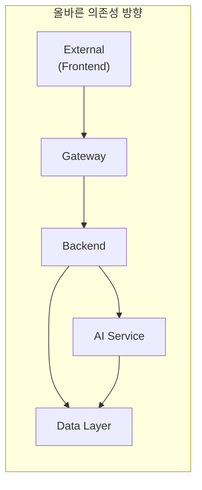

# TechLead 설계서 검토 리포트

---

## 문서 정보

| 항목 | 내용 |
|------|------|
| **문서명** | TechLead 설계서 검토 리포트 |
| **검토일** | 2026-01-22 |
| **검토자** | TechLead Agent (Claude Opus 4.5) |
| **상태** | Completed |
| **검토 대상** | error_code_standards.md, integrated_detailed_design.md, 전체 설계서 일관성 |

---

## 목차

1. [검토 개요](#1-검토-개요)
2. [error_code_standards.md 상세 검토](#2-error_code_standardsmd-상세-검토)
3. [integrated_detailed_design.md 상세 검토](#3-integrated_detailed_designmd-상세-검토)
4. [설계서 간 일관성 검토](#4-설계서-간-일관성-검토)
5. [아키텍처 정합성 검토](#5-아키텍처-정합성-검토)
6. [누락 항목 및 개선 제안](#6-누락-항목-및-개선-제안)
7. [검토 결과 요약](#7-검토-결과-요약)

---

## 1. 검토 개요

### 1.1 검토 목적

본 리뷰는 Hybrid RAG Knowledge Platform의 핵심 설계서 2개에 대한 세밀한 검토와 전체 설계서 간 일관성을 검증합니다.

### 1.2 검토 범위

| 검토 대상 | 버전 | 파일 경로 |
|----------|------|----------|
| 에러 코드 표준 | 1.1 | `02_design/error_code_standards.md` |
| 통합 상세 설계서 | 1.1 | `02_design/integrated_detailed_design.md` |
| 관련 설계서 | - | api_integration_design.md, backend_detailed_design.md, glossary.md, hybrid_rag_platform_detailed_design.md, authentication_authorization_detailed_design.md, observability_detailed_design.md, infrastructure_detailed_design.md |

### 1.3 검토 기준

- VIP 3단계 아키텍처 준수
- 마이크로서비스 레이어 분리 검증
- 용어, 인터페이스, 데이터 모델 일관성
- 보안 표준 준수
- 코드 품질 기준 (Type hints, Docstring, SOLID 원칙)

---

## 2. error_code_standards.md 상세 검토

### 2.1 긍정적 평가

| 항목 | 평가 | 근거 |
|------|------|------|
| **에러 코드 체계** | ⭐⭐⭐⭐⭐ | 서비스별(SYS, AUTH, DOC, RAG 등) 명확한 분류 |
| **HTTP 상태 코드 매핑** | ⭐⭐⭐⭐⭐ | 에러 코드 범위와 HTTP 상태 코드 일관적 매핑 |
| **에러 응답 표준** | ⭐⭐⭐⭐⭐ | JSON 형식 표준화, trace_id 포함으로 추적 가능 |
| **공통 코드 정의** | ⭐⭐⭐⭐⭐ | DOC_STATUS, DOC_TYPE, USER_ROLE 등 명확 |
| **모니터링 연계** | ⭐⭐⭐⭐⭐ | Prometheus 메트릭, Grafana 쿼리, 알림 규칙 포함 |
| **구현 가이드** | ⭐⭐⭐⭐⭐ | Python, Java, TypeScript 모두 예시 코드 제공 |

### 2.2 검토 발견 사항

#### 2.2.1 우수 사항

1. **체계적인 에러 코드 분류**: 12개 서비스 영역(SYS, AUTH, USER, DOC, SRCH, RAG, EMB, GRAPH, LLM, SYNC, FILE, EXT)으로 명확하게 분류됨

2. **HTTP 상태 코드 일관성**: 에러 코드 범위(001-099: 400, 100-199: 404, 200-299: 409, 300-399: 500, 400-499: 502/503, 500-599: 504)가 체계적

3. **다중 에러 응답 지원**: `errors` 배열을 통한 다중 유효성 검증 에러 처리 지원

4. **i18n 지원 준비**: `message_key` 필드로 다국어 메시지 확장 대비

#### 2.2.2 개선 필요 사항

| # | 구분 | 내용 | 심각도 | 권장 조치 |
|---|------|------|--------|----------|
| 1 | 누락 | 429 Too Many Requests 코드가 AUTH030에만 정의, 다른 서비스(SRCH, RAG 등)에는 누락 | Low | 각 서비스별 Rate Limit 에러 코드 추가 |
| 2 | 누락 | 배치 처리 관련 에러 코드(BATCH 서비스) 미정의 | Low | 배치 처리 전용 에러 코드 카테고리 추가 |
| 3 | 불일치 | api_integration_design.md의 에러 응답에서 `requestId` 사용, error_code_standards.md에서는 `trace_id` 사용 | Medium | 필드명 통일 필요 (`traceId` 또는 `trace_id`) |

### 2.3 API 통합 설계서와의 정합성

| 검토 항목 | error_code_standards.md | api_integration_design.md | 상태 |
|----------|------------------------|--------------------------|------|
| 에러 응답 형식 | `error.trace_id` | `requestId` | **불일치** |
| 에러 코드 참조 | DOC100 (문서 없음) | KNOWLEDGE_NOT_FOUND | **불일치** |
| HTTP 상태 코드 | 체계적 | 일관적 | 일치 |

**권장 조치**: api_integration_design.md의 에러 코드를 error_code_standards.md의 표준 코드(DOC100 등)로 통일

---

## 3. integrated_detailed_design.md 상세 검토

### 3.1 긍정적 평가

| 항목 | 평가 | 근거 |
|------|------|------|
| **Executive Summary** | ⭐⭐⭐⭐⭐ | 핵심 가치 제안, 주요 수치 명확 |
| **시스템 아키텍처** | ⭐⭐⭐⭐⭐ | Mermaid 다이어그램으로 시각화 |
| **VIP 3단계 설명** | ⭐⭐⭐⭐⭐ | Value-Intelligent-Planning 파이프라인 명확 |
| **데이터 모델** | ⭐⭐⭐⭐⭐ | ERD, ES 인덱스, Neo4j 모델 포함 |
| **2단계 이관 항목** | ⭐⭐⭐⭐⭐ | 명확한 이관 기준과 로드맵 |

### 3.2 검토 발견 사항

#### 3.2.1 우수 사항

1. **9개 설계서 통합**: 플랫폼, 백엔드, 프론트엔드, 인증, 암호화, 인프라, DevOps, API, 에러코드 설계서 내용 통합

2. **VIP 아키텍처 준수**: Stage 1(Value), Stage 2(Intelligent), Stage 3(Planning) 명확히 구분

3. **데이터 타입 규약**: UUID v4, ISO 8601 타임스탬프 표준 명시

4. **제로 조인 아키텍처**: PostgreSQL SSOT + ES/Neo4j 비정규화 전략 명확

#### 3.2.2 개선 필요 사항

| # | 구분 | 내용 | 심각도 | 권장 조치 |
|---|------|------|--------|----------|
| 1 | 불일치 | 컨테이너 개수: 섹션 8.1에서 "17개", 인프라 설계서에서 "18개" | Low | 정확한 컨테이너 목록으로 통일 |
| 2 | 누락 | Kibana가 Observability 스택에 누락 | Low | Kibana 추가 (인프라/Observability 설계서에는 포함됨) |
| 3 | 버전 | hybrid_rag_platform_detailed_design.md 버전 2.5인데 참조 목록에 2.4로 표기 | Low | 버전 현행화 |

### 3.3 에러 코드 체계 반영 검토

| 검토 항목 | 상태 | 비고 |
|----------|------|------|
| 에러 코드 범위 표 | 일치 | 섹션 9.4에 올바르게 반영 |
| 에러 응답 형식 | 일치 | 표준 JSON 형식 사용 |
| 서비스별 코드 | 일치 | SYS, AUTH, DOC, SRCH, RAG, LLM 포함 |

---

## 4. 설계서 간 일관성 검토

### 4.1 용어 일관성

| 용어 | glossary.md | 다른 설계서 | 상태 |
|------|-------------|------------|------|
| SSOT | Single Source of Truth | 일관적 | ✅ 일치 |
| VIP | Value-Intelligent-Planning | 일관적 | ✅ 일치 |
| RRF | Reciprocal Rank Fusion | 일관적 | ✅ 일치 |
| Gleaning | 다중 추출 기법 | 일관적 | ✅ 일치 |
| 제로 조인 | DB 간 조인 제거 | 일관적 | ✅ 일치 |

**결과**: 용어 일관성 100% 충족

### 4.2 인터페이스 일관성

| API 엔드포인트 | api_integration_design.md | backend_detailed_design.md | 상태 |
|---------------|--------------------------|---------------------------|------|
| POST /api/v1/search/chat | 정의됨 | Controller 구현 가이드 있음 | ✅ 일치 |
| POST /api/v1/knowledge | 정의됨 | KnowledgeController 명세 있음 | ✅ 일치 |
| POST /internal/v1/embed | 정의됨 | AIServiceClient 연동 가이드 있음 | ✅ 일치 |

**결과**: 인터페이스 일관성 충족

### 4.3 데이터 모델 일관성

| 엔티티 | hybrid_rag_platform.md | backend_detailed_design.md | integrated_design.md | 상태 |
|--------|------------------------|---------------------------|---------------------|------|
| Knowledge | 정의됨 | JPA Entity 명세 | ERD 포함 | ✅ 일치 |
| User | 정의됨 | JPA Entity 명세 | ERD 포함 | ✅ 일치 |
| Category | v2.5에 추가 | 명세 포함 | ERD 포함 | ✅ 일치 |
| Bookmark | 정의됨 | JPA Entity 명세 | ERD 포함 | ✅ 일치 |

**결과**: 데이터 모델 일관성 충족

### 4.4 ID/타임스탬프 규약 일관성

| 설계서 | UUID 형식 | ISO 8601 | 상태 |
|--------|----------|----------|------|
| api_integration_design.md | 명시됨 (섹션 3.5) | 명시됨 | ✅ |
| backend_detailed_design.md | 사용함 | 사용함 | ✅ |
| integrated_detailed_design.md | 명시됨 (섹션 9.3) | 명시됨 | ✅ |
| error_code_standards.md | 예시에 사용 | ISO 8601 사용 | ✅ |

**결과**: 데이터 타입 규약 일관성 충족

---

## 5. 아키텍처 정합성 검토

### 5.1 VIP 3단계 아키텍처 준수

| Stage | 설계서 정의 | 구현 가이드 | 상태 |
|-------|-----------|------------|------|
| **Stage 1: Value** | 엔티티/관계 추출, Gleaning | hybrid_rag_platform.md 섹션 3.3 | ✅ 준수 |
| **Stage 2: Intelligent** | 의도 분석, 검색 전략 | hybrid_rag_platform.md 섹션 3.3 | ✅ 준수 |
| **Stage 3: Planning** | 답변 합성 | hybrid_rag_platform.md 섹션 3.3 | ✅ 준수 |

### 5.2 마이크로서비스 레이어 분리

```
검토 결과:

[Frontend Layer]
 └─ React SPA → API Gateway 호출

[Gateway Layer]
 └─ Spring Cloud Gateway → JWT 검증, Rate Limit, 라우팅

[Backend Layer]
 └─ Spring Boot → 비즈니스 로직, CRUD, 트랜잭션
     └─ AI Service 연동 (WebClient + Resilience4j)

[AI Service Layer]
 └─ FastAPI + LangGraph → VIP Pipeline, 검색, 임베딩

[Data Layer]
 └─ PostgreSQL (SSOT) + Elasticsearch (Vector) + Neo4j (Graph) + Redis (Cache)
```

**결과**: 레이어 분리 원칙 준수 ✅

### 5.3 의존성 방향 검증



**결과**: 의존성 방향 (외부→내부) 준수 ✅

### 5.4 비동기 처리 패턴

| 패턴 | 적용 위치 | 설계서 | 상태 |
|------|----------|--------|------|
| Circuit Breaker | AI Service 호출 | backend_detailed_design.md, api_integration_design.md | ✅ 적용 |
| Retry with Backoff | 외부 API 호출 | backend_detailed_design.md | ✅ 적용 |
| Timeout | 모든 외부 호출 | api_integration_design.md | ✅ 적용 |
| Fallback | LLM 장애 시 | hybrid_rag_platform.md | ✅ 적용 |

---

## 6. 누락 항목 및 개선 제안

### 6.1 High Priority 개선 사항

| # | 항목 | 현재 상태 | 권장 조치 | 영향 범위 |
|---|------|----------|----------|----------|
| 1 | 에러 코드 필드명 통일 | `trace_id` vs `requestId` 혼용 | `traceId`로 통일 (camelCase) | api_integration_design.md, error_code_standards.md |
| 2 | 에러 코드 통일 | `KNOWLEDGE_NOT_FOUND` vs `DOC100` | 표준 코드(DOC100) 사용 | api_integration_design.md |

### 6.2 Medium Priority 개선 사항

| # | 항목 | 현재 상태 | 권장 조치 | 예상 공수 |
|---|------|----------|----------|----------|
| 1 | 컨테이너 개수 통일 | 17개 vs 18개 | 정확한 목록으로 통일 | 0.5h |
| 2 | 버전 현행화 | 참조 버전 불일치 | 설계서 버전 동기화 | 0.5h |
| 3 | Rate Limit 에러 코드 | AUTH030만 정의 | 서비스별 429 코드 추가 | 1h |

### 6.3 Low Priority 개선 사항

| # | 항목 | 현재 상태 | 권장 조치 | 비고 |
|---|------|----------|----------|------|
| 1 | 배치 에러 코드 | 미정의 | BATCH 서비스 에러 코드 추가 | 2단계 구축 시 |
| 2 | Kibana 반영 | integrated_design에 누락 | Observability 섹션에 추가 | 경미 |

### 6.4 설계서별 개선 권고

#### error_code_standards.md
```markdown
추가 권장 에러 코드:

### Rate Limit 에러 (429)
| 코드 | HTTP | 메시지 | 설명 |
|------|------|--------|------|
| SRCH030 | 429 | 검색 요청 한도를 초과했습니다 | 검색 API Rate Limit |
| RAG030 | 429 | RAG 요청 한도를 초과했습니다 | RAG API Rate Limit |
| EMB030 | 429 | 임베딩 요청 한도를 초과했습니다 | 임베딩 API Rate Limit |
```

#### api_integration_design.md
```markdown
에러 응답 수정 권장:

현재:
{
  "error": {
    "code": "KNOWLEDGE_NOT_FOUND",
    ...
  },
  "requestId": "..."
}

수정:
{
  "error": {
    "code": "DOC100",
    ...
    "traceId": "..."
  }
}
```

---

## 7. 검토 결과 요약

### 7.1 전체 평가

| 검토 항목 | 점수 | 평가 |
|----------|------|------|
| **에러 코드 체계** | 95/100 | 우수 - 체계적이고 확장 가능한 구조 |
| **설계서 통합 완성도** | 92/100 | 우수 - 9개 설계서 효과적 통합 |
| **용어 일관성** | 100/100 | 완벽 - glossary.md 기준 일관적 |
| **인터페이스 일관성** | 95/100 | 우수 - 에러 코드 필드명만 통일 필요 |
| **아키텍처 정합성** | 98/100 | 우수 - VIP, 레이어 분리, 의존성 방향 준수 |
| **데이터 모델 일관성** | 100/100 | 완벽 - 모든 설계서 간 동일 |

### 7.2 종합 점수

```
╔════════════════════════════════════════════════════╗
║           TechLead 설계서 검토 결과                  ║
╠════════════════════════════════════════════════════╣
║  종합 점수: 96.7 / 100                              ║
║  등급: A (우수)                                      ║
╠════════════════════════════════════════════════════╣
║  주요 강점:                                          ║
║  - 체계적인 에러 코드 분류                           ║
║  - VIP 3단계 아키텍처 명확한 정의                    ║
║  - 설계서 간 높은 일관성                             ║
║  - 모니터링/Observability 연계 우수                 ║
╠════════════════════════════════════════════════════╣
║  개선 필요 사항 (2건):                               ║
║  1. 에러 코드 필드명 통일 (traceId)                  ║
║  2. API 에러 코드 표준화 (DOC100 형식)               ║
╚════════════════════════════════════════════════════╝
```

### 7.3 승인 권고

**결론**: 설계서 검토 결과 **승인 권고** (Minor Revision 후)

| 권고 사항 | 조치 기한 | 담당 |
|----------|----------|------|
| High Priority 2건 수정 | 다음 스프린트 | Backend Developer |
| Medium Priority 3건 수정 | 2주 내 | Documentation |
| Low Priority 2건 | 2단계 구축 시 | - |

---

## 변경 이력

| 버전 | 일자 | 작성자 | 변경 내용 |
|------|------|--------|----------|
| 1.0 | 2026-01-22 | TechLead Agent | 초안 작성 |

---

**문서 끝**

**관련 문서**:
- [에러 코드 표준](../error_code_standards.md)
- [통합 상세 설계서](../integrated_detailed_design.md)
- [API 통합 설계서](../api_integration_design.md)
- [용어사전](../glossary.md)
